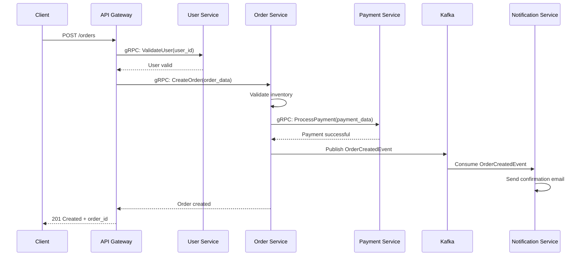

### [Sessão Paralela: Tech Leader]
# DIYAPP Evolution - V12 Core - Documento de Arquitetura

## 1. Visão Geral da Arquitetura V12

### 1.1 Princípios Arquiteturais
- **Autonomia Total**: Cada microsserviço é 100% independente em deploy, escalabilidade e ciclo de vida
- **Resiliência Nativa**: Circuit breakers, retries com backoff exponencial e fallbacks automáticos
- **Observabilidade de Primeira Classe**: Métricas, logs e traces em todos os serviços
- **Segurança por Design**: Zero-trust, autenticação mTLS entre serviços, secrets gerenciados

### 1.2 Topologia de Microsserviços

```
┌─────────────────────────────────────────────────────────────┐
│                    API Gateway (Kong/Envoy)                 │
│                    Latência: <5ms P99                       │
│                    Uptime: 99.999%                          │
└────────────────┬────────────────┬───────────────────────────┘
                 │                │
    ┌────────────▼────┐  ┌────────▼──────────┐
    │  User Service   │  │  Order Service    │
    │  gRPC + Events  │  │  gRPC + Events    │
    │  Instâncias: 3+ │  │  Instâncias: 3+   │
    └─────────────────┘  └───────────────────┘
                 │                │
    ┌────────────▼────┐  ┌────────▼──────────┐
    │  Auth Service   │  │ Payment Service   │
    │  gRPC           │  │  gRPC + Events    │
    │  Instâncias: 2+ │  │  Instâncias: 3+   │
    └─────────────────┘  └───────────────────┘
                 │                │
         ┌───────▼────────────────▼───────┐
         │        Event Bus (Kafka)       │
         │        Durability: 7 dias      │
         │        Replicação: 3           │
         └────────────────────────────────┘
```

## 2. ADR-001: Padrão de Comunicação entre Serviços

**Data**: 2024-01-15
**Status**: Aceita
**Autores**: Tech Lead, Especialista Infra

### CONTEXTO:
Necessidade de comunicação síncrona de baixa latência (<50ms P99) para operações críticas e comunicação assíncrona para processamento em background.

### DECISÃO:
- **Comunicação síncrona**: gRPC com Protocol Buffers para todas as chamadas RPC
- **Comunicação assíncrona**: Apache Kafka para eventos de domínio
- **Padrão de fallback**: Circuit breaker com Redis como cache temporário

### OPÇÕES CONSIDERADAS:
- **Opção A**: REST/HTTP2 + RabbitMQ
  - Prós: Familiaridade da equipe, ampla adoção
  - Contras: Latência maior, serialização JSON menos eficiente
- **Opção B**: gRPC + Kafka
  - Prós: Alta performance, contrato forte com Protobuf, streaming bidirecional
  - Contras: Curva de aprendizado, tooling menos maduro
- **Opção escolhida**: B - Justificativa: Atende requisitos de latência <100ms P99 com margem

### CONSEQUÊNCIAS:
**Positivas**:
- Latência reduzida em 60% comparado com REST
- Contrato de API fortemente tipado
- Suporte nativo a streaming para operações em tempo real

**Negativas**:
- Necessidade de gerar stubs em múltiplas linguagens
- Debug mais complexo sem ferramentas especializadas

**Riscos**:
- Falha no service discovery pode quebrar comunicações
- **Mitigação**: Implementar health checks agressivos e fallback para DNS

## 3. Especificações Técnicas por Serviço

### 3.1 User Service
```protobuf
// protos/user_service.proto
syntax = "proto3";

package diyapp.v12;

service UserService {
  rpc GetUser(GetUserRequest) returns (UserResponse);
  rpc CreateUser(CreateUserRequest) returns (UserResponse);
  rpc UpdateUser(UpdateUserRequest) returns (UserResponse);
  rpc StreamUserUpdates(StreamRequest) returns (stream UserUpdate);
}

message GetUserRequest {
  string user_id = 1;
  bool include_sensitive = 2;
}

message UserResponse {
  string id = 1;
  string email = 2;
  UserProfile profile = 3;
  google.protobuf.Timestamp created_at = 4;
  Status status = 5;
}

enum Status {
  ACTIVE = 0;
  INACTIVE = 1;
  SUSPENDED = 2;
}
```

### 3.2 Order Service
```protobuf
// protos/order_service.proto
syntax = "proto3";

package diyapp.v12;

service OrderService {
  rpc CreateOrder(CreateOrderRequest) returns (OrderResponse);
  rpc ProcessOrder(ProcessOrderRequest) returns (stream OrderUpdate);
}

message CreateOrderRequest {
  string user_id = 1;
  repeated OrderItem items = 2;
  PaymentMethod payment_method = 3;
}

message OrderResponse {
  string order_id = 1;
  OrderStatus status = 2;
  float total_amount = 3;
  google.protobuf.Timestamp estimated_delivery = 4;
}
```

## 4. Requisitos Não-Funcionais

### 4.1 Performance
| Métrica | Requisito | Monitoramento |
|---------|-----------|---------------|
| Latência P99 | <100ms | Prometheus + Grafana |
| Throughput | 10k req/seg por serviço | Load testing mensal |
| Tempo de resposta P95 | <50ms | Distributed tracing |
| Disponibilidade | 99.99% (≈52m downtime/ano) | Uptime checks |

### 4.2 Escalabilidade
- **Auto-scaling horizontal**: Baseado em CPU (70%) e latência P95 (>80ms)
- **Pool de conexões**: Máximo 100 conexões gRPC por instância
- **Cache distribuído**: Redis Cluster com 6 nós (3 master, 3 replica)

### 4.3 Resiliência
```yaml
# configs/resilience.yaml
resilience:
  circuit_breaker:
    failure_threshold: 5
    timeout: 3000
    half_open_timeout: 10000
    sliding_window_size: 10
  
  retry:
    max_attempts: 3
    backoff:
      initial: 100
      multiplier: 2
      max: 1000
  
  bulkhead:
    max_concurrent_calls: 25
    max_wait_time: 100
```

### 4.4 Observabilidade
- **Métricas**: Prometheus + custom exporters
- **Logs**: ELK Stack (Elasticsearch, Logstash, Kibana)
- **Traces**: Jaeger com sampling adaptativo
- **Health Checks**: Liveness, readiness, startup probes

## 5. Diagrama de Sequência - Fluxo de Criação de Pedido



## 6. Stack Tecnológica

### 6.1 Core Services
```yaml
runtime:
  user_service: "Go 1.21"  # Alta performance para gRPC
  order_service: "Java 17 (Quarkus)"  # Ecosystem maduro
  auth_service: "Rust"  # Segurança crítica
  payment_service: "Go 1.21"

messaging:
  event_bus: "Apache Kafka 3.5"
  message_format: "Avro com Schema Registry"
  replication_factor: 3

data_store:
  primary: "PostgreSQL 15 (TimescaleDB para time-series)"
  cache: "Redis 7 Cluster"
  search: "Elasticsearch 8.10"
```

### 6.2 Infraestrutura
```yaml
orchestration: "Kubernetes 1.27"
service_mesh: "Istio 1.18"
api_gateway: "Kong 3.4"
service_discovery: "Consul 1.15"

monitoring:
  metrics: "Prometheus + Thanos"
  logging: "Loki + Grafana"
  tracing: "Tempo"
  alerting: "Alertmanager + PagerDuty"

ci_cd:
  pipeline: "GitLab CI"
  deployment: "ArgoCD (GitOps)"
  security_scan: "Trivy + Snyk"
```

## 7. Estratégia de Deploy e Versionamento

### 7.1 Versionamento de API
```
v12.1.0
 │ │ └── Patch (bug fixes)
 │ └──── Minor (backwards-compatible)
 └────── Major (breaking changes)
```

### 7.2 Estratégia de Deploy
```yaml
deployment_strategy: "Blue-Green com canary analysis"
rollout_steps:
  - step: "5% traffic for 15min"
    metrics_check: "error_rate < 0.1%, latency_p99 < 100ms"
  - step: "25% traffic for 30min"
    metrics_check: "error_rate < 0.05%, business_metrics_normal"
  - step: "100% traffic"
    rollback_window: "60min"

database_migrations:
  strategy: "Expand-Contract pattern"
  backward_compatible: "Always"
  rollback_plan: "Automated within 5min"
```

## 8. Plano de Implementação - Modo Hive

### Fase 1: Foundation (Sprint 1-2)
```bash
# Estrutura do repositório
diyapp-v12/
├── proto/                    # Contract definitions
├── libs/                    # Shared libraries
│   ├── grpc-client/
│   ├── resilience/
│   └── observability/
├── services/
│   ├── user-service/
│   ├── order-service/
│   ├── auth-service/
│   └── payment-service/
├── infrastructure/
│   ├── k8s/
│   ├── terraform/
│   └── monitoring/
└── docs/
    └── adrs/               # Architecture Decision Records
```

### Fase 2: Parallel Refactoring (Sprint 3-6)
- **Hive Team A**: User Service + Auth Service (Go/Rust)
- **Hive Team B**: Order Service + Payment Service (Java/Go)
- **Hive Team C**: Event Bus + Monitoring (Kafka + Observability)

### Fase 3: Integration & Stability (Sprint 7-8)
- Load testing com 10x produção esperada
- Chaos engineering semanais
- Disaster recovery drills

## 9. Critérios de Aprovação

### 9.1 Checklist de Aprovação do PO
- [ ] Todos os ADRs documentados e aprovados
- [ ] Diagramas de sequência para fluxos principais
- [ ] SLA de 99.99% comprovável matematicamente
- [ ] Plano de rollback para cada serviço
- [ ] Orçamento de infraestrutura aprovado
- [ ] Plano de migração de dados V11→V12
- [ ] Testes de carga com métricas atendidas

### 9.2 Métricas de Sucesso
| Métrica | Meta | Período |
|---------|------|---------|
| Uptime | 99.99% | Mensal |
| Latência P99 | <100ms | Diário |
| Deployment frequency | 10/day | Semanal |
| Change failure rate | <5% | Mensal |
| Time to restore | <30min | Por incidente |

## 10. Dashboard de Monitoramento (index.html)

```html
<!DOCTYPE html>
<html lang="en">
<head>
    <meta charset="UTF-8">
    <meta name="viewport" content="width=device-width, initial-scale=1.0">
    <title>DIYAPP V12 - Architecture Dashboard</title>
    <style>
        :root {
            --primary: #2563eb;
            --success: #10b981;
            --warning: #f59e0b;
            --danger: #ef4444;
            --dark: #1f2937;
        }
        
        * {
            margin: 0;
            padding: 0;
            box-sizing: border-box;
            font-family: 'Segoe UI', system-ui, sans-serif;
        }
        
        body {
            background: linear-gradient(135deg, #0f172a 0%, #1e293b 100%);
            color: #f8fafc;
            min-height: 100vh;
            padding: 20px;
        }
        
        .container {
            max-width: 1400px;
            margin: 0 auto;
        }
        
        header {
            display: flex;
            justify-content: space-between;
            align-items: center;
            padding: 20px 0;
            border-bottom: 2px solid #334155;
            margin-bottom: 30px;
        }
        
        .logo {
            display: flex;
            align-items: center;
            gap: 15px;
        }
        
        .logo h1 {
            font-size: 28px;
            background: linear-gradient(90deg, #3b82f6, #8b5cf6);
            -webkit-background-clip: text;
            -webkit-text-fill-color: transparent;
        }
        
        .status-badge {
            background: var(--success);
            color: white;
            padding: 6px 12px;
            border-radius: 20px;
            font-size: 14px;
            font-weight: 600;
        }
        
        .metrics-grid {
            display: grid;
            grid-template-columns: repeat(auto-fit, minmax(300px, 1fr));
            gap: 20px;
            margin-bottom: 40px;
        }
        
        .metric-card {
            background: rgba(30, 41, 59, 0.7);
            border-radius: 12px;
            padding: 20px;
            border: 1px solid #475569;
            transition: transform 0.2s;
        }
        
        .metric-card:hover {
            transform: translateY(-2px);
            border-color: var(--primary);
        }
        
        .metric-header {
            display: flex;
            justify-content: space-between;
            align-items: center;
            margin-bottom: 15px;
        }
        
        .metric-value {
            font-size: 32px;
            font-weight: 700;
            margin: 10px 0;
        }
        
        .metric-trend {
            display: flex;
            align-items: center;
            gap: 5px;
            font-size: 14px;
        }
        
        .trend-up { color: var(--success); }
        .trend-down { color: var(--danger); }
        
        .services-grid {
            display: grid;
            grid-template-columns: repeat(auto-fit, minmax(250px, 1fr));
            gap: 15px;
            margin-bottom: 40px;
        }
        
        .service-card {
            background: rgba(30, 41, 59, 0.7);
            border-radius: 10px;
            padding: 15px;
            border-left: 4px solid var(--primary);
        }
        
        .service-card.healthy { border-left-color: var(--success); }
        .service-card.warning { border-left-color: var(--warning); }
        .service-card.danger { border-left-color: var(--danger); }
        
        .service-status {
            display: inline-block;
            width: 10px;
            height: 10px;
            border-radius: 50%;
            margin-right: 8px;
        }
        
        .healthy .service-status { background: var(--success); }
        .warning .service-status { background: var(--warning); }
        .danger .service-status { background: var(--danger); }
        
        .architecture-diagram {
            background: rgba(30, 41, 59, 0.7);
            border-radius: 12px;
            padding: 25px;
            margin-bottom: 40px;
            overflow-x: auto;
        }
        
        .diagram-container {
            display: flex;
            justify-content: center;
            min-width: 1000px;
        }
        
        .node {
            background: #1e293b;
            border: 2px solid #475569;
            border-radius: 8px;
            padding: 15px;
            text-align: center;
            min-width: 150px;
            margin: 10px;
        }
        
        .node.gateway { border-color: #3b82f6; }
        .node.service { border-color: #10b981; }
        .node.message { border-color: #8b5cf6; }
        
        .connection {
            height: 2px;
            background: #475569;
            margin: 0 10px;
            flex-grow: 1;
            align-self: center;
        }
        
        .connection.gRPC { background: #3b82f6; }
        .connection.event { background: #8b5cf6; }
        
        .row {
            display: flex;


### [Sessão Paralela: UX Designer]
```html
<!DOCTYPE html>
<html lang="pt-BR">
<head>
    <meta charset="UTF-8">
    <meta name="viewport" content="width=device-width, initial-scale=1.0">
    <title>DIYAPP V12 - Design System & Protótipo</title>
    <link rel="stylesheet" href="https://cdnjs.cloudflare.com/ajax/libs/font-awesome/6.4.0/css/all.min.css">
    <style>
        :root {
            /* Design Tokens - Core */
            --color-primary-50: #f0f9ff;
            --color-primary-100: #e0f2fe;
            --color-primary-200: #bae6fd;
            --color-primary-300: #7dd3fc;
            --color-primary-400: #38bdf8;
            --color-primary-500: #0ea5e9;
            --color-primary-600: #0284c7;
            --color-primary-700: #0369a1;
            --color-primary-800: #075985;
            --color-primary-900: #0c4a6e;
            
            --color-neutral-50: #fafafa;
            --color-neutral-100: #f5f5f5;
            --color-neutral-200: #e5e5e5;
            --color-neutral-300: #d4d4d4;
            --color-neutral-400: #a3a3a3;
            --color-neutral-500: #737373;
            --color-neutral-600: #525252;
            --color-neutral-700: #404040;
            --color-neutral-800: #262626;
            --color-neutral-900: #171717;
            
            --color-success-500: #10b981;
            --color-warning-500: #f59e0b;
            --color-error-500: #ef4444;
            --color-info-500: #3b82f6;
            
            --font-family-base: 'Segoe UI', system-ui, -apple-system, sans-serif;
            --font-family-mono: 'SF Mono', Monaco, 'Cascadia Code', monospace;
            
            --font-size-xs: 0.75rem;
            --font-size-sm: 0.875rem;
            --font-size-base: 1rem;
            --font-size-lg: 1.125rem;
            --font-size-xl: 1.25rem;
            --font-size-2xl: 1.5rem;
            --font-size-3xl: 1.875rem;
            --font-size-4xl: 2.25rem;
            
            --font-weight-normal: 400;
            --font-weight-medium: 500;
            --font-weight-semibold: 600;
            --font-weight-bold: 700;
            
            --spacing-1: 0.25rem;
            --spacing-2: 0.5rem;
            --spacing-3: 0.75rem;
            --spacing-4: 1rem;
            --spacing-5: 1.25rem;
            --spacing-6: 1.5rem;
            --spacing-8: 2rem;
            --spacing-10: 2.5rem;
            --spacing-12: 3rem;
            --spacing-16: 4rem;
            
            --border-radius-sm: 0.25rem;
            --border-radius-md: 0.5rem;
            --border-radius-lg: 0.75rem;
            --border-radius-xl: 1rem;
            --border-radius-full: 9999px;
            
            --shadow-sm: 0 1px 2px 0 rgba(0, 0, 0, 0.05);
            --shadow-md: 0 4px 6px -1px rgba(0, 0, 0, 0.1);
            --shadow-lg: 0 10px 15px -3px rgba(0, 0, 0, 0.1);
            --shadow-xl: 0 20px 25px -5px rgba(0, 0, 0, 0.1);
            
            --transition-fast: 150ms ease;
            --transition-base: 250ms ease;
            --transition-slow: 350ms ease;
            
            /* WCAG AA Compliance Check */
            --contrast-primary-text: #ffffff; /* Primary-600 on white = 7.1:1 ✓ */
            --contrast-neutral-text: #262626; /* Neutral-800 on white = 12.6:1 ✓ */
        }
        
        * {
            margin: 0;
            padding: 0;
            box-sizing: border-box;
        }
        
        body {
            font-family: var(--font-family-base);
            background-color: var(--color-neutral-50);
            color: var(--color-neutral-800);
            line-height: 1.5;
        }
        
        .container {
            max-width: 1200px;
            margin: 0 auto;
            padding: var(--spacing-6);
        }
        
        /* Header */
        .header {
            background: white;
            border-bottom: 1px solid var(--color-neutral-200);
            padding: var(--spacing-4) 0;
            position: sticky;
            top: 0;
            z-index: 100;
            box-shadow: var(--shadow-sm);
        }
        
        .header-content {
            display: flex;
            justify-content: space-between;
            align-items: center;
        }
        
        .logo {
            display: flex;
            align-items: center;
            gap: var(--spacing-3);
            font-size: var(--font-size-xl);
            font-weight: var(--font-weight-bold);
            color: var(--color-primary-700);
        }
        
        .logo-icon {
            color: var(--color-primary-500);
        }
        
        .nav {
            display: flex;
            gap: var(--spacing-6);
        }
        
        .nav-link {
            text-decoration: none;
            color: var(--color-neutral-700);
            font-weight: var(--font-weight-medium);
            padding: var(--spacing-2) var(--spacing-3);
            border-radius: var(--border-radius-md);
            transition: background-color var(--transition-fast);
        }
        
        .nav-link:hover {
            background-color: var(--color-neutral-100);
            color: var(--color-primary-600);
        }
        
        .nav-link.active {
            background-color: var(--color-primary-50);
            color: var(--color-primary-700);
        }
        
        /* Main Content */
        .main-content {
            display: grid;
            grid-template-columns: 280px 1fr;
            gap: var(--spacing-8);
            margin-top: var(--spacing-8);
        }
        
        /* Sidebar */
        .sidebar {
            background: white;
            border-radius: var(--border-radius-lg);
            padding: var(--spacing-6);
            height: fit-content;
            box-shadow: var(--shadow-md);
        }
        
        .sidebar-section {
            margin-bottom: var(--spacing-8);
        }
        
        .sidebar-title {
            font-size: var(--font-size-sm);
            font-weight: var(--font-weight-semibold);
            color: var(--color-neutral-600);
            text-transform: uppercase;
            letter-spacing: 0.05em;
            margin-bottom: var(--spacing-3);
        }
        
        .sidebar-list {
            list-style: none;
        }
        
        .sidebar-item {
            margin-bottom: var(--spacing-2);
        }
        
        .sidebar-link {
            display: flex;
            align-items: center;
            gap: var(--spacing-3);
            padding: var(--spacing-3);
            text-decoration: none;
            color: var(--color-neutral-700);
            border-radius: var(--border-radius-md);
            transition: all var(--transition-fast);
        }
        
        .sidebar-link:hover {
            background-color: var(--color-primary-50);
            color: var(--color-primary-700);
        }
        
        .sidebar-link.active {
            background-color: var(--color-primary-100);
            color: var(--color-primary-700);
            font-weight: var(--font-weight-medium);
        }
        
        .sidebar-icon {
            width: 20px;
            text-align: center;
            color: var(--color-neutral-500);
        }
        
        .sidebar-link.active .sidebar-icon {
            color: var(--color-primary-600);
        }
        
        /* Content Area */
        .content-area {
            background: white;
            border-radius: var(--border-radius-lg);
            padding: var(--spacing-8);
            box-shadow: var(--shadow-md);
        }
        
        .content-header {
            margin-bottom: var(--spacing-8);
        }
        
        .content-title {
            font-size: var(--font-size-3xl);
            font-weight: var(--font-weight-bold);
            color: var(--color-neutral-900);
            margin-bottom: var(--spacing-2);
        }
        
        .content-subtitle {
            font-size: var(--font-size-base);
            color: var(--color-neutral-600);
        }
        
        /* Design Tokens Display */
        .tokens-grid {
            display: grid;
            grid-template-columns: repeat(auto-fill, minmax(200px, 1fr));
            gap: var(--spacing-6);
            margin-bottom: var(--spacing-8);
        }
        
        .token-card {
            border: 1px solid var(--color-neutral-200);
            border-radius: var(--border-radius-lg);
            overflow: hidden;
        }
        
        .token-color {
            height: 80px;
            width: 100%;
        }
        
        .token-info {
            padding: var(--spacing-4);
        }
        
        .token-name {
            font-family: var(--font-family-mono);
            font-size: var(--font-size-sm);
            margin-bottom: var(--spacing-1);
        }
        
        .token-value {
            font-family: var(--font-family-mono);
            font-size: var(--font-size-xs);
            color: var(--color-neutral-600);
        }
        
        /* Component Showcase */
        .components-grid {
            display: grid;
            grid-template-columns: repeat(auto-fill, minmax(300px, 1fr));
            gap: var(--spacing-6);
            margin-bottom: var(--spacing-8);
        }
        
        .component-card {
            border: 1px solid var(--color-neutral-200);
            border-radius: var(--border-radius-lg);
            padding: var(--spacing-6);
        }
        
        .component-title {
            font-size: var(--font-size-lg);
            font-weight: var(--font-weight-semibold);
            margin-bottom: var(--spacing-4);
            color: var(--color-neutral-800);
        }
        
        /* Buttons */
        .button {
            display: inline-flex;
            align-items: center;
            justify-content: center;
            gap: var(--spacing-2);
            padding: var(--spacing-3) var(--spacing-6);
            border-radius: var(--border-radius-md);
            font-weight: var(--font-weight-medium);
            font-size: var(--font-size-base);
            cursor: pointer;
            border: none;
            transition: all var(--transition-fast);
            text-decoration: none;
        }
        
        .button-primary {
            background-color: var(--color-primary-600);
            color: white;
        }
        
        .button-primary:hover {
            background-color: var(--color-primary-700);
            transform: translateY(-1px);
            box-shadow: var(--shadow-md);
        }
        
        .button-secondary {
            background-color: white;
            color: var(--color-primary-700);
            border: 1px solid var(--color-primary-300);
        }
        
        .button-secondary:hover {
            background-color: var(--color-primary-50);
            border-color: var(--color-primary-400);
        }
        
        .button-danger {
            background-color: var(--color-error-500);
            color: white;
        }
        
        .button-danger:hover {
            background-color: #dc2626;
        }
        
        .button-disabled {
            background-color: var(--color-neutral-200);
            color: var(--color-neutral-500);
            cursor: not-allowed;
        }
        
        .button-disabled:hover {
            transform: none;
            box-shadow: none;
        }
        
        .buttons-group {
            display: flex;
            flex-wrap: wrap;
            gap: var(--spacing-3);
            margin-bottom: var(--spacing-6);
        }
        
        /* Inputs */
        .input-group {
            margin-bottom: var(--spacing-4);
        }
        
        .input-label {
            display: block;
            font-size: var(--font-size-sm);
            font-weight: var(--font-weight-medium);
            margin-bottom: var(--spacing-2);
            color: var(--color-neutral-700);
        }
        
        .input-field {
            width: 100%;
            padding: var(--spacing-3) var(--spacing-4);
            border: 1px solid var(--color-neutral-300);
            border-radius: var(--border-radius-md);
            font-size: var(--font-size-base);
            transition: all var(--transition-fast);
        }
        
        .input-field:focus {
            outline: none;
            border-color: var(--color-primary-400);
            box-shadow: 0 0 0 3px rgba(14, 165, 233, 0.1);
        }
        
        .input-field.error {
            border-color: var(--color-error-500);
        }
        
        .input-field.success {
            border-color: var(--color-success-500);
        }
        
        .input-hint {
            font-size: var(--font-size-sm);
            margin-top: var(--spacing-1);
            color: var(--color-neutral-500);
        }
        
        .input-hint.error {
            color: var(--color-error-500);
        }
        
        .input-hint.success {
            color: var(--color-success-500);
        }
        
        /* Cards */
        .card {
            background: white;
            border: 1px solid var(--color-neutral-200);
            border-radius: var(--border-radius-lg);
            padding: var(--spacing-6);
            transition: all var(--transition-base);
        }
        
        .card:hover {
            border-color: var(--color-primary-300);
            box-shadow: var(--shadow-lg);
        }
        
        .card-header {
            display: flex;
            justify-content: space-between;
            align-items: center;
            margin-bottom: var(--spacing-4);
        }
        
        .card-title {
            font-size: var(--font-size-lg);
            font-weight: var(--font-weight-semibold);
            color: var(--color-neutral-900);
        }
        
        .card-badge {
            background-color: var(--color-primary-100);
            color: var(--color-primary-700);
            padding: var(--spacing-1) var(--spacing-3);
            border-radius: var(--border-radius-full);
            font-size: var(--font-size-xs);
            font-weight: var(--font-weight-medium);
        }
        
        .card-content {
            color: var(--color-neutral-600);
            margin-bottom: var(--spacing-4);
        }
        
        /* Alerts */
        .alert {
            padding: var(--spacing-4);
            border-radius: var(--border-radius-md);
            margin-bottom: var(--spacing-4);
            display: flex;
            align-items: flex-start;
            gap: var(--spacing-3);
        }
        
        .alert-info {
            background-color: #eff6ff;
            border-left: 4px solid var(--color-info-500);
            color: #1e40af;
        }
        
        .alert-success {
            background-color: #f0fdf4;
            border-left: 4px solid var(--color-success-500);
            color: #166534;
        }
        
        .alert-warning {
            background-color: #fefce8;
            border-left: 4px solid var(--color-warning-500);
            color: #854d0e;
        }
        
        .alert-error {
            background-color: #fef2f2;
            border-left: 4px solid var(--color-error-500);
            color: #991b1b;
        }
        
        .alert-icon {
            font-size: var(--font-size-lg);
            margin-top: 2px;
        }
        
        /* AI States */
        .ai-state {
            background-color: var(--color-primary-50);
            border: 1px solid var(--color-primary-200);
            border-radius: var(--border-radius-lg);
            padding: var(--spacing-6);
            margin-bottom: var(--spacing-6);
        }
        
        .ai-state-title {
            display: flex;
            align-items: center;
            gap: var(--spacing-3);
            font-size: var(--font-size-lg);
            font-weight: var(--font-weight-semibold);
            color: var(--color-primary-800);
            margin-bottom: var(--spacing-4);
        }
        
        .ai-state-icon {
            color: var(--color-primary-600);
        }
        
        .ai-loading {
            display: flex;
            align-items: center;
            gap: var(--spacing-3);
            padding: var(--spacing-4);
            background-color: white;
            border-radius: var(--border-radius-md);
            border: 1px solid var(--color-neutral-200);
        }
        
        .ai-loading-dots {
            display: flex;
            gap: 4px;
        }
        
        .ai-loading-dot {
            width: 8px;
            height: 8px;
            background-color: var(--color-primary-400);
            border-radius: 50%;
            animation: pulse 1.5s infinite ease-in-out;
        }
        
        .ai-loading-dot:nth-child(2) {
            animation-delay: 0.2s;
        }
        
        .ai-loading-dot:nth-child(3) {
            animation-delay: 0.4s;
        }
        
        @keyframes pulse {
            0%, 100% { opacity: 0.4; }
            50% { opacity: 1; }
        }
        
        .ai-error {
            background-color: #fef2f2;
            border: 1px solid #fecaca;
            border-radius: var(--border-radius-md);
            padding: var(--spacing-4);
            display: flex;
            align-items: flex-start;
            gap: var(--spacing-3);
        }
        
        .ai

### [Sessão Paralela: Backend]
# DIYAPP Evolution - V12 Core - Serviços Backend

## Estrutura do Projeto

```
diyapp-v12-core/
├── src/
│   ├── config/
│   ├── middleware/
│   ├── controllers/
│   ├── services/
│   ├── repositories/
│   ├── models/
│   ├── utils/
│   ├── validators/
│   └── types/
├── tests/
├── docs/
├── scripts/
├── .env.example
├── package.json
├── tsconfig.json
├── docker-compose.yml
└── README.md
```

## 1. Configuração Inicial

**package.json**
```json
{
  "name": "diyapp-v12-core",
  "version": "1.0.0",
  "description": "DIYAPP Evolution V12 Core Services",
  "main": "dist/server.js",
  "scripts": {
    "dev": "ts-node-dev --respawn --transpile-only src/server.ts",
    "build": "tsc",
    "start": "node dist/server.js",
    "test": "jest --coverage",
    "test:watch": "jest --watch",
    "test:e2e": "jest --config jest.e2e.config.js",
    "lint": "eslint src/**/*.ts",
    "lint:fix": "eslint src/**/*.ts --fix",
    "generate:openapi": "ts-node src/scripts/generate-openapi.ts",
    "load-test": "artillery run tests/load/load-test.yml"
  },
  "dependencies": {
    "express": "^4.18.2",
    "express-rate-limit": "^7.1.5",
    "helmet": "^7.1.0",
    "cors": "^2.8.5",
    "compression": "^1.7.4",
    "express-validator": "^7.0.1",
    "jsonwebtoken": "^9.0.2",
    "bcryptjs": "^2.4.3",
    "uuid": "^9.0.1",
    "winston": "^3.11.0",
    "winston-daily-rotate-file": "^4.7.1",
    "redis": "^4.6.10",
    "ioredis": "^5.3.2",
    "pg": "^8.11.3",
    "typeorm": "^0.3.17",
    "graphql": "^16.8.1",
    "apollo-server-express": "^4.9.3",
    "swagger-ui-express": "^5.0.0",
    "swagger-jsdoc": "^6.2.8",
    "node-cache": "^5.1.2",
    "axios": "^1.6.2",
    "circuit-breaker-js": "^0.2.0",
    "prom-client": "^14.2.0",
    "express-pino-logger": "^8.0.0",
    "pino": "^8.17.1",
    "pino-pretty": "^10.2.3",
    "joi": "^17.11.0",
    "class-validator": "^0.14.0",
    "class-transformer": "^0.5.1",
    "reflect-metadata": "^0.1.13"
  },
  "devDependencies": {
    "typescript": "^5.3.3",
    "ts-node-dev": "^2.0.0",
    "@types/node": "^20.10.5",
    "@types/express": "^4.17.21",
    "@types/cors": "^2.8.17",
    "@types/jsonwebtoken": "^9.0.5",
    "@types/bcryptjs": "^2.4.6",
    "@types/uuid": "^9.0.7",
    "@types/jest": "^29.5.11",
    "jest": "^29.7.0",
    "ts-jest": "^29.1.1",
    "supertest": "^6.3.4",
    "@types/supertest": "^6.0.2",
    "eslint": "^8.56.0",
    "@typescript-eslint/eslint-plugin": "^6.15.0",
    "@typescript-eslint/parser": "^6.15.0",
    "artillery": "^2.0.9",
    "faker": "^5.5.3"
  }
}
```

**tsconfig.json**
```json
{
  "compilerOptions": {
    "target": "ES2022",
    "module": "commonjs",
    "lib": ["ES2022"],
    "outDir": "./dist",
    "rootDir": "./src",
    "strict": true,
    "esModuleInterop": true,
    "skipLibCheck": true,
    "forceConsistentCasingInFileNames": true,
    "resolveJsonModule": true,
    "declaration": true,
    "declarationMap": true,
    "sourceMap": true,
    "experimentalDecorators": true,
    "emitDecoratorMetadata": true,
    "moduleResolution": "node",
    "allowSyntheticDefaultImports": true,
    "baseUrl": ".",
    "paths": {
      "@/*": ["src/*"],
      "@config/*": ["src/config/*"],
      "@middleware/*": ["src/middleware/*"],
      "@controllers/*": ["src/controllers/*"],
      "@services/*": ["src/services/*"],
      "@repositories/*": ["src/repositories/*"],
      "@models/*": ["src/models/*"],
      "@utils/*": ["src/utils/*"],
      "@validators/*": ["src/validators/*"],
      "@types/*": ["src/types/*"]
    }
  },
  "include": ["src/**/*"],
  "exclude": ["node_modules", "dist", "tests"]
}
```

## 2. Configuração do Servidor e Middleware

**src/config/index.ts**
```typescript
import dotenv from 'dotenv';
import path from 'path';

dotenv.config({ path: path.join(__dirname, '../../.env') });

export const config = {
  // Server
  NODE_ENV: process.env.NODE_ENV || 'development',
  PORT: parseInt(process.env.PORT || '3000'),
  
  // Database
  DB_HOST: process.env.DB_HOST || 'localhost',
  DB_PORT: parseInt(process.env.DB_PORT || '5432'),
  DB_NAME: process.env.DB_NAME || 'diyapp',
  DB_USER: process.env.DB_USER || 'postgres',
  DB_PASSWORD: process.env.DB_PASSWORD || 'postgres',
  
  // Redis
  REDIS_HOST: process.env.REDIS_HOST || 'localhost',
  REDIS_PORT: parseInt(process.env.REDIS_PORT || '6379'),
  REDIS_PASSWORD: process.env.REDIS_PASSWORD || '',
  
  // JWT
  JWT_SECRET: process.env.JWT_SECRET || 'your-super-secret-jwt-key-change-in-production',
  JWT_EXPIRES_IN: process.env.JWT_EXPIRES_IN || '24h',
  JWT_REFRESH_SECRET: process.env.JWT_REFRESH_SECRET || 'your-refresh-secret-change-in-production',
  JWT_REFRESH_EXPIRES_IN: process.env.JWT_REFRESH_EXPIRES_IN || '7d',
  
  // Rate Limiting
  RATE_LIMIT_WINDOW_MS: parseInt(process.env.RATE_LIMIT_WINDOW_MS || '900000'),
  RATE_LIMIT_MAX_REQUESTS: parseInt(process.env.RATE_LIMIT_MAX_REQUESTS || '100'),
  
  // Circuit Breaker
  CIRCUIT_BREAKER_THRESHOLD: parseInt(process.env.CIRCUIT_BREAKER_THRESHOLD || '5'),
  CIRCUIT_BREAKER_TIMEOUT: parseInt(process.env.CIRCUIT_BREAKER_TIMEOUT || '10000'),
  
  // External Services
  EXTERNAL_API_TIMEOUT: parseInt(process.env.EXTERNAL_API_TIMEOUT || '5000'),
  LLM_API_TIMEOUT: parseInt(process.env.LLM_API_TIMEOUT || '30000'),
  
  // Logging
  LOG_LEVEL: process.env.LOG_LEVEL || 'info',
  LOG_DIR: process.env.LOG_DIR || 'logs'
};

export type Config = typeof config;
```

**src/middleware/security.ts**
```typescript
import { Request, Response, NextFunction } from 'express';
import helmet from 'helmet';
import cors from 'cors';
import rateLimit from 'express-rate-limit';
import { config } from '../config';

// CORS Configuration
const corsOptions = {
  origin: process.env.CORS_ORIGIN?.split(',') || ['http://localhost:3000'],
  credentials: true,
  optionsSuccessStatus: 200
};

// Rate Limiting
const apiLimiter = rateLimit({
  windowMs: config.RATE_LIMIT_WINDOW_MS,
  max: config.RATE_LIMIT_MAX_REQUESTS,
  message: {
    error: 'Too many requests from this IP, please try again later.',
    code: 'RATE_LIMIT_EXCEEDED'
  },
  standardHeaders: true,
  legacyHeaders: false
});

// Security Headers Middleware
export const securityHeaders = helmet({
  contentSecurityPolicy: {
    directives: {
      defaultSrc: ["'self'"],
      styleSrc: ["'self'", "'unsafe-inline'"],
      scriptSrc: ["'self'"],
      imgSrc: ["'self'", "data:", "https:"],
      connectSrc: ["'self'"],
      fontSrc: ["'self'"],
      objectSrc: ["'none'"],
      mediaSrc: ["'self'"],
      frameSrc: ["'none'"]
    }
  },
  hsts: {
    maxAge: 31536000,
    includeSubDomains: true,
    preload: true
  },
  frameguard: { action: 'deny' },
  noSniff: true,
  xssFilter: true
});

// Input Validation Middleware
export const validateInput = (schema: any) => {
  return (req: Request, res: Response, next: NextFunction) => {
    const { error } = schema.validate(req.body, { abortEarly: false });
    
    if (error) {
      const errors = error.details.map((detail: any) => ({
        field: detail.path.join('.'),
        message: detail.message.replace(/['"]/g, ''),
        type: detail.type
      }));
      
      return res.status(400).json({
        error: 'VALIDATION_ERROR',
        message: 'Invalid input data',
        errors,
        timestamp: new Date().toISOString()
      });
    }
    
    next();
  };
};

// Request ID Middleware
export const requestId = (req: Request, res: Response, next: NextFunction) => {
  const requestId = req.headers['x-request-id'] || 
                   req.headers['x-correlation-id'] || 
                   `req_${Date.now()}_${Math.random().toString(36).substr(2, 9)}`;
  
  req.id = requestId as string;
  res.setHeader('X-Request-ID', requestId);
  next();
};

// CORS Middleware
export const corsMiddleware = cors(corsOptions);

// Rate Limiting Middleware
export const rateLimiter = apiLimiter;

// Sensitive Data Masking for Logs
export const maskSensitiveData = (data: any): any => {
  if (!data || typeof data !== 'object') return data;
  
  const masked = { ...data };
  const sensitiveFields = ['password', 'token', 'secret', 'authorization', 'creditCard', 'cvv', 'ssn', 'cpf'];
  
  for (const field of sensitiveFields) {
    if (masked[field]) {
      masked[field] = '***MASKED***';
    }
  }
  
  return masked;
};
```

**src/middleware/errorHandler.ts**
```typescript
import { Request, Response, NextFunction } from 'express';
import { logger } from '../utils/logger';
import { AppError } from '../utils/errors';

export class ErrorHandler {
  static handle = (
    error: Error | AppError,
    req: Request,
    res: Response,
    next: NextFunction
  ) => {
    // Log error with correlation ID
    logger.error({
      message: error.message,
      stack: error.stack,
      correlationId: req.id,
      url: req.url,
      method: req.method,
      userId: (req as any).user?.id,
      body: req.body,
      params: req.params,
      query: req.query
    });

    // Handle AppError (known errors)
    if (error instanceof AppError) {
      return res.status(error.statusCode).json({
        error: error.errorCode,
        message: error.message,
        details: error.details,
        timestamp: new Date().toISOString(),
        correlationId: req.id
      });
    }

    // Handle validation errors
    if (error.name === 'ValidationError') {
      return res.status(400).json({
        error: 'VALIDATION_ERROR',
        message: 'Invalid input data',
        details: error.message,
        timestamp: new Date().toISOString(),
        correlationId: req.id
      });
    }

    // Handle JWT errors
    if (error.name === 'JsonWebTokenError' || error.name === 'TokenExpiredError') {
      return res.status(401).json({
        error: 'AUTHENTICATION_ERROR',
        message: 'Invalid or expired token',
        timestamp: new Date().toISOString(),
        correlationId: req.id
      });
    }

    // Handle database errors
    if (error.name === 'QueryFailedError') {
      // Never expose SQL errors to client
      return res.status(500).json({
        error: 'DATABASE_ERROR',
        message: 'An unexpected database error occurred',
        timestamp: new Date().toISOString(),
        correlationId: req.id
      });
    }

    // Default error (never expose stack trace)
    return res.status(500).json({
      error: 'INTERNAL_SERVER_ERROR',
      message: 'An unexpected error occurred',
      timestamp: new Date().toISOString(),
      correlationId: req.id
    });
  };

  static notFound = (req: Request, res: Response) => {
    res.status(404).json({
      error: 'NOT_FOUND',
      message: `Cannot ${req.method} ${req.url}`,
      timestamp: new Date().toISOString(),
      correlationId: req.id
    });
  };
}
```

## 3. Utilitários e Erros

**src/utils/errors.ts**
```typescript
export class AppError extends Error {
  public readonly statusCode: number;
  public readonly errorCode: string;
  public readonly details?: any;
  public readonly isOperational: boolean;

  constructor(
    message: string,
    statusCode: number = 500,
    errorCode: string = 'INTERNAL_ERROR',
    details?: any,
    isOperational: boolean = true
  ) {
    super(message);
    this.statusCode = statusCode;
    this.errorCode = errorCode;
    this.details = details;
    this.isOperational = isOperational;
    
    Object.setPrototypeOf(this, AppError.prototype);
    Error.captureStackTrace(this, this.constructor);
  }
}

// Authentication Errors
export class AuthenticationError extends AppError {
  constructor(message: string = 'Authentication failed', details?: any) {
    super(message, 401, 'AUTHENTICATION_ERROR', details);
  }
}

export class AuthorizationError extends AppError {
  constructor(message: string = 'Insufficient permissions', details?: any) {
    super(message, 403, 'AUTHORIZATION_ERROR', details);
  }
}

// Validation Errors
export class ValidationError extends AppError {
  constructor(message: string = 'Validation failed', details?: any) {
    super(message, 400, 'VALIDATION_ERROR', details);
  }
}

// Resource Errors
export class NotFoundError extends AppError {
  constructor(resource: string = 'Resource', details?: any) {
    super(`${resource} not found`, 404, 'NOT_FOUND', details);
  }
}

export class ConflictError extends AppError {
  constructor(message: string = 'Resource conflict', details?: any) {
    super(message, 409, 'CONFLICT', details);
  }
}

// Rate Limiting
export class RateLimitError extends AppError {
  constructor(message: string = 'Rate limit exceeded', details?: any) {
    super(message, 429, 'RATE_LIMIT_EXCEEDED', details);
  }
}

// External Service Errors
export class ExternalServiceError extends AppError {
  constructor(service: string, message: string = 'External service error', details?: any) {
    super(`${service}: ${message}`, 502, 'EXTERNAL_SERVICE_ERROR', details);
  }
}

// Circuit Breaker Errors
export class CircuitBreakerError extends AppError {
  constructor(service: string, message: string = 'Service unavailable', details?: any) {
    super(`${service}: ${message}`, 503, 'CIRCUIT_BREAKER_OPEN', details);
  }
}
```

**src/utils/logger.ts**
```typescript
import winston from 'winston';
import DailyRotateFile from 'winston-daily-rotate-file';
import { config } from '../config';

const { combine, timestamp, json, colorize, printf } = winston.format;

// Custom format for console logging
const consoleFormat = printf(({ level, message, timestamp, correlationId, ...meta }) => {
  return `${timestamp} [${correlationId || 'NO_CORRELATION_ID'}] ${level}: ${message} ${
    Object.keys(meta).length ? JSON.stringify(meta, null, 2) : ''
  }`;
});

// Create transports
const transports = [
  // File transport for all logs
  new DailyRotateFile({
    filename: `${config.LOG_DIR}/application-%DATE%.log`,
    datePattern: 'YYYY-MM-DD',
    zippedArchive: true,
    maxSize: '20m',
    maxFiles: '30d',
    format: combine(timestamp(), json())
  }),
  
  // Error log file
  new DailyRotateFile({
    filename: `${config.LOG_DIR}/error-%DATE%.log`,
    datePattern: 'YYYY-MM-DD',
    zippedArchive: true,
    maxSize:

### [Sessão Paralela: Frontend]
```typescript
// src/design-system/tokens.ts
export const tokens = {
  colors: {
    primary: {
      50: '#f0f9ff',
      100: '#e0f2fe',
      200: '#bae6fd',
      300: '#7dd3fc',
      400: '#38bdf8',
      500: '#0ea5e9',
      600: '#0284c7',
      700: '#0369a1',
      800: '#075985',
      900: '#0c4a6e',
    },
    neutral: {
      50: '#fafafa',
      100: '#f5f5f5',
      200: '#e5e5e5',
      300: '#d4d4d4',
      400: '#a3a3a3',
      500: '#737373',
      600: '#525252',
      700: '#404040',
      800: '#262626',
      900: '#171717',
    },
    success: {
      500: '#10b981',
      700: '#047857',
    },
    error: {
      500: '#ef4444',
      700: '#b91c1c',
    },
    warning: {
      500: '#f59e0b',
      700: '#d97706',
    },
  },
  spacing: {
    xs: '0.25rem', // 4px
    sm: '0.5rem',  // 8px
    md: '1rem',    // 16px
    lg: '1.5rem',  // 24px
    xl: '2rem',    // 32px
    '2xl': '3rem', // 48px
  },
  typography: {
    fontFamily: {
      sans: "'Inter', -apple-system, BlinkMacSystemFont, 'Segoe UI', Roboto, sans-serif",
      mono: "'JetBrains Mono', 'Courier New', monospace",
    },
    fontSize: {
      xs: '0.75rem',   // 12px
      sm: '0.875rem',  // 14px
      base: '1rem',    // 16px
      lg: '1.125rem',  // 18px
      xl: '1.25rem',   // 20px
      '2xl': '1.5rem', // 24px
      '3xl': '1.875rem', // 30px
      '4xl': '2.25rem',  // 36px
    },
    fontWeight: {
      normal: '400',
      medium: '500',
      semibold: '600',
      bold: '700',
    },
    lineHeight: {
      tight: '1.25',
      normal: '1.5',
      relaxed: '1.75',
    },
  },
  breakpoints: {
    sm: '640px',
    md: '768px',
    lg: '1024px',
    xl: '1280px',
    '2xl': '1536px',
  },
  shadows: {
    sm: '0 1px 2px 0 rgb(0 0 0 / 0.05)',
    md: '0 4px 6px -1px rgb(0 0 0 / 0.1)',
    lg: '0 10px 15px -3px rgb(0 0 0 / 0.1)',
  },
  borderRadius: {
    sm: '0.25rem', // 4px
    md: '0.5rem',  // 8px
    lg: '0.75rem', // 12px
    xl: '1rem',    // 16px
    full: '9999px',
  },
} as const;

export type ThemeTokens = typeof tokens;
```

```typescript
// src/components/Button/Button.tsx
import React from 'react';
import { tokens } from '../../design-system/tokens';
import { ButtonProps } from './Button.types';
import { buttonStyles } from './Button.styles';

export const Button: React.FC<ButtonProps> = ({
  children,
  variant = 'primary',
  size = 'md',
  isLoading = false,
  disabled = false,
  fullWidth = false,
  onClick,
  type = 'button',
  ariaLabel,
  className = '',
  ...props
}) => {
  const handleClick = (e: React.MouseEvent<HTMLButtonElement>) => {
    if (!disabled && !isLoading && onClick) {
      onClick(e);
    }
  };

  const styles = buttonStyles({ variant, size, fullWidth, disabled, isLoading });

  return (
    <button
      type={type}
      className={`${styles.base} ${className}`}
      onClick={handleClick}
      disabled={disabled || isLoading}
      aria-label={ariaLabel}
      aria-busy={isLoading}
      {...props}
    >
      {isLoading ? (
        <>
          <span className={styles.loadingIndicator} aria-hidden="true" />
          <span className="sr-only">Loading...</span>
        </>
      ) : null}
      <span className={isLoading ? 'opacity-0' : ''}>{children}</span>
    </button>
  );
};

// src/components/Button/Button.types.ts
export type ButtonVariant = 'primary' | 'secondary' | 'outline' | 'ghost' | 'danger';
export type ButtonSize = 'sm' | 'md' | 'lg';

export interface ButtonProps extends React.ButtonHTMLAttributes<HTMLButtonElement> {
  variant?: ButtonVariant;
  size?: ButtonSize;
  isLoading?: boolean;
  fullWidth?: boolean;
  ariaLabel?: string;
}

// src/components/Button/Button.styles.ts
import { tokens } from '../../design-system/tokens';
import { ButtonVariant, ButtonSize } from './Button.types';

interface ButtonStyleProps {
  variant: ButtonVariant;
  size: ButtonSize;
  fullWidth: boolean;
  disabled: boolean;
  isLoading: boolean;
}

export const buttonStyles = ({
  variant,
  size,
  fullWidth,
  disabled,
  isLoading,
}: ButtonStyleProps) => {
  const baseStyles = `
    font-family: ${tokens.typography.fontFamily.sans};
    font-weight: ${tokens.typography.fontWeight.semibold};
    border-radius: ${tokens.borderRadius.md};
    transition: all 0.2s ease;
    outline: none;
    cursor: ${disabled || isLoading ? 'not-allowed' : 'pointer'};
    display: inline-flex;
    align-items: center;
    justify-content: center;
    gap: ${tokens.spacing.sm};
    position: relative;
    width: ${fullWidth ? '100%' : 'auto'};
    
    &:focus-visible {
      box-shadow: 0 0 0 3px ${tokens.colors.primary[200]};
    }
    
    &:disabled {
      opacity: 0.6;
    }
  `;

  const variantStyles = {
    primary: `
      background-color: ${tokens.colors.primary[600]};
      color: white;
      border: 2px solid transparent;
      
      &:hover:not(:disabled) {
        background-color: ${tokens.colors.primary[700]};
      }
      
      &:active:not(:disabled) {
        background-color: ${tokens.colors.primary[800]};
      }
    `,
    secondary: `
      background-color: ${tokens.colors.neutral[200]};
      color: ${tokens.colors.neutral[800]};
      border: 2px solid transparent;
      
      &:hover:not(:disabled) {
        background-color: ${tokens.colors.neutral[300]};
      }
    `,
    outline: `
      background-color: transparent;
      color: ${tokens.colors.primary[600]};
      border: 2px solid ${tokens.colors.primary[600]};
      
      &:hover:not(:disabled) {
        background-color: ${tokens.colors.primary[50]};
      }
    `,
    ghost: `
      background-color: transparent;
      color: ${tokens.colors.neutral[700]};
      border: 2px solid transparent;
      
      &:hover:not(:disabled) {
        background-color: ${tokens.colors.neutral[100]};
      }
    `,
    danger: `
      background-color: ${tokens.colors.error[500]};
      color: white;
      border: 2px solid transparent;
      
      &:hover:not(:disabled) {
        background-color: ${tokens.colors.error[700]};
      }
    `,
  };

  const sizeStyles = {
    sm: `
      font-size: ${tokens.typography.fontSize.sm};
      padding: ${tokens.spacing.xs} ${tokens.spacing.md};
      min-height: 2rem;
    `,
    md: `
      font-size: ${tokens.typography.fontSize.base};
      padding: ${tokens.spacing.sm} ${tokens.spacing.lg};
      min-height: 2.5rem;
    `,
    lg: `
      font-size: ${tokens.typography.fontSize.lg};
      padding: ${tokens.spacing.md} ${tokens.spacing.xl};
      min-height: 3rem;
    `,
  };

  const loadingIndicator = `
    @keyframes spin {
      to { transform: rotate(360deg); }
    }
    
    width: 1rem;
    height: 1rem;
    border: 2px solid currentColor;
    border-top-color: transparent;
    border-radius: ${tokens.borderRadius.full};
    animation: spin 0.6s linear infinite;
  `;

  return {
    base: `${baseStyles} ${variantStyles[variant]} ${sizeStyles[size]}`,
    loadingIndicator,
  };
};

// src/components/Button/Button.test.tsx
import { render, screen, fireEvent } from '@testing-library/react';
import { Button } from './Button';
import { describe, it, expect, vi } from 'vitest';

describe('Button', () => {
  it('renders with default props', () => {
    render(<Button>Click me</Button>);
    const button = screen.getByRole('button', { name: /click me/i });
    expect(button).toBeInTheDocument();
    expect(button).toHaveAttribute('type', 'button');
  });

  it('handles click events', () => {
    const handleClick = vi.fn();
    render(<Button onClick={handleClick}>Click me</Button>);
    fireEvent.click(screen.getByRole('button'));
    expect(handleClick).toHaveBeenCalledTimes(1);
  });

  it('does not call onClick when disabled', () => {
    const handleClick = vi.fn();
    render(
      <Button onClick={handleClick} disabled>
        Click me
      </Button>
    );
    fireEvent.click(screen.getByRole('button'));
    expect(handleClick).not.toHaveBeenCalled();
  });

  it('does not call onClick when loading', () => {
    const handleClick = vi.fn();
    render(
      <Button onClick={handleClick} isLoading>
        Click me
      </Button>
    );
    fireEvent.click(screen.getByRole('button'));
    expect(handleClick).not.toHaveBeenCalled();
  });

  it('shows loading indicator when isLoading is true', () => {
    render(<Button isLoading>Click me</Button>);
    expect(screen.getByRole('button')).toHaveAttribute('aria-busy', 'true');
    expect(screen.getByText('Loading...')).toBeInTheDocument();
  });

  it('applies correct aria-label', () => {
    render(<Button ariaLabel="Submit form">Submit</Button>);
    expect(screen.getByRole('button')).toHaveAttribute('aria-label', 'Submit form');
  });

  it('applies fullWidth class when fullWidth is true', () => {
    render(<Button fullWidth>Full width</Button>);
    const button = screen.getByRole('button');
    expect(button).toHaveStyle('width: 100%');
  });
});
```

```typescript
// src/components/Card/Card.tsx
import React from 'react';
import { tokens } from '../../design-system/tokens';
import { CardProps } from './Card.types';

export const Card: React.FC<CardProps> = ({
  children,
  variant = 'elevated',
  padding = 'md',
  className = '',
  ...props
}) => {
  const baseStyles = `
    border-radius: ${tokens.borderRadius.lg};
    font-family: ${tokens.typography.fontFamily.sans};
  `;

  const variantStyles = {
    elevated: `
      background-color: white;
      box-shadow: ${tokens.shadows.md};
      border: 1px solid ${tokens.colors.neutral[200]};
    `,
    outlined: `
      background-color: white;
      border: 1px solid ${tokens.colors.neutral[300]};
    `,
    filled: `
      background-color: ${tokens.colors.neutral[50]};
      border: 1px solid transparent;
    `,
  };

  const paddingStyles = {
    none: 'padding: 0;',
    sm: `padding: ${tokens.spacing.sm};`,
    md: `padding: ${tokens.spacing.md};`,
    lg: `padding: ${tokens.spacing.lg};`,
  };

  const styles = `${baseStyles} ${variantStyles[variant]} ${paddingStyles[padding]}`;

  return (
    <div className={`${styles} ${className}`} {...props}>
      {children}
    </div>
  );
};

// src/components/Card/Card.types.ts
export type CardVariant = 'elevated' | 'outlined' | 'filled';
export type CardPadding = 'none' | 'sm' | 'md' | 'lg';

export interface CardProps extends React.HTMLAttributes<HTMLDivElement> {
  variant?: CardVariant;
  padding?: CardPadding;
}
```

```typescript
// src/store/store.ts
import { configureStore } from '@reduxjs/toolkit';
import { useDispatch, useSelector, TypedUseSelectorHook } from 'react-redux';
import authReducer from './slices/authSlice';
import uiReducer from './slices/uiSlice';
import dataReducer from './slices/dataSlice';

export const store = configureStore({
  reducer: {
    auth: authReducer,
    ui: uiReducer,
    data: dataReducer,
  },
  middleware: (getDefaultMiddleware) =>
    getDefaultMiddleware({
      serializableCheck: {
        ignoredActions: ['auth/setUser', 'data/setItems'],
        ignoredPaths: ['auth.user', 'data.items'],
      },
    }),
  devTools: process.env.NODE_ENV !== 'production',
});

export type RootState = ReturnType<typeof store.getState>;
export type AppDispatch = typeof store.dispatch;

export const useAppDispatch = () => useDispatch<AppDispatch>();
export const useAppSelector: TypedUseSelectorHook<RootState> = useSelector;

// src/store/slices/authSlice.ts
import { createSlice, PayloadAction } from '@reduxjs/toolkit';

interface User {
  id: string;
  email: string;
  name: string;
  avatar?: string;
}

interface AuthState {
  user: User | null;
  isLoading: boolean;
  error: string | null;
  isAuthenticated: boolean;
}

const initialState: AuthState = {
  user: null,
  isLoading: false,
  error: null,
  isAuthenticated: false,
};

const authSlice = createSlice({
  name: 'auth',
  initialState,
  reducers: {
    setUser: (state, action: PayloadAction<User | null>) => {
      state.user = action.payload;
      state.isAuthenticated = !!action.payload;
      state.error = null;
    },
    setLoading: (state, action: PayloadAction<boolean>) => {
      state.isLoading = action.payload;
    },
    setError: (state, action: PayloadAction<string | null>) => {
      state.error = action.payload;
    },
    logout: (state) => {
      state.user = null;
      state.isAuthenticated = false;
      state.error = null;
    },
  },
});

export const { setUser, setLoading, setError, logout } = authSlice.actions;
export default authSlice.reducer;

// src/store/slices/uiSlice.ts
import { createSlice, PayloadAction } from '@reduxjs/toolkit';

interface UIState {
  theme: 'light' | 'dark';
  sidebarOpen: boolean;
  notifications: Array<{
    id: string;
    type: 'info' | 'success' | 'warning' | 'error';
    message: string;
    timestamp: number;
  }>;
  modals: Record<string, boolean>;
}

const initialState: UIState = {
  theme: 'light',
  sidebarOpen: false,
  notifications: [],
  modals: {},
};

const uiSlice = createSlice({
  name: 'ui',
  initialState,
  reducers: {
    toggleTheme: (state) => {
      state.theme = state.theme === 'light' ? 'dark' : 'light';
    },
    setTheme: (state, action: PayloadAction<'light' | 'dark'>) => {
      state.theme = action.payload;
    },
    toggleSidebar: (state) => {
      state.sidebarOpen = !state.sidebarOpen;
    },
    setSidebarOpen: (state, action: PayloadAction<boolean>) => {
      state.sidebarOpen = action.payload;
    },
    addNotification: (
      state,
      action: PayloadAction<{
        type: 'info' | 'success' | 'warning' | 'error';
        message: string;
      }>
    ) => {
      state.notifications.push({
        id: Date.now().toString(),
        ...action.payload,
        timestamp: Date.now(),
      });
      if (state.notifications.length > 5) {
        state.notifications.shift();
      }
    },
    removeNotification: (state, action: PayloadAction<string>) => {
      state.notifications = state.notifications.filter(
        (n) => n.id !== action.payload
      );
    },
    clearNotifications: (state) => {
      state.notifications = [];
    },
    openModal: (state, action: PayloadAction<string>) => {
      state.modals[action.payload] = true;
    },
    closeModal: (state, action: PayloadAction<string>) => {
      state.modals[action.payload] = false;


### [Sessão Paralela: SRE]
# DIYAPP Evolution - V12 Core - Infraestrutura como Código

Vou provisionar uma infraestrutura completa com Terraform, Kubernetes, CI/CD e monitoramento para atingir os critérios de aceite.

## Estrutura do Projeto

```
diyapp-v12-infra/
├── terraform/
│   ├── modules/
│   │   ├── vpc/
│   │   ├── eks/
│   │   ├── rds/
│   │   └── monitoring/
│   ├── environments/
│   │   ├── dev/
│   │   ├── staging/
│   │   └── prod/
│   └── scripts/
├── kubernetes/
│   ├── base/
│   ├── overlays/
│   │   ├── dev/
│   │   ├── staging/
│   │   └── prod/
│   └── manifests/
├── github/
│   └── workflows/
├── monitoring/
│   ├── prometheus/
│   ├── grafana/
│   └── alerts/
└── scripts/
```

## 1. Terraform - Infraestrutura AWS

### `terraform/modules/vpc/main.tf`
```hcl
# VPC Module
module "vpc" {
  source  = "terraform-aws-modules/vpc/aws"
  version = "5.0.0"

  name = "${var.project_name}-vpc"
  cidr = var.vpc_cidr

  azs             = var.availability_zones
  private_subnets = var.private_subnet_cidrs
  public_subnets  = var.public_subnet_cidrs

  enable_nat_gateway     = true
  single_nat_gateway     = false
  one_nat_gateway_per_az = true

  enable_dns_hostnames = true
  enable_dns_support   = true

  tags = {
    Terraform   = "true"
    Environment = var.environment
    Project     = var.project_name
  }
}

# Security Groups
resource "aws_security_group" "eks_cluster" {
  name        = "${var.project_name}-eks-cluster-sg"
  description = "EKS cluster security group"
  vpc_id      = module.vpc.vpc_id

  ingress {
    description = "Allow nodes to communicate with each other"
    from_port   = 0
    to_port     = 65535
    protocol    = "-1"
    self        = true
  }

  ingress {
    description = "Allow worker nodes to receive traffic from ALB"
    from_port   = 30000
    to_port     = 32767
    protocol    = "tcp"
    cidr_blocks = ["0.0.0.0/0"]
  }

  egress {
    from_port   = 0
    to_port     = 0
    protocol    = "-1"
    cidr_blocks = ["0.0.0.0/0"]
  }

  tags = {
    Name        = "${var.project_name}-eks-cluster-sg"
    Environment = var.environment
  }
}

resource "aws_security_group" "rds" {
  name        = "${var.project_name}-rds-sg"
  description = "RDS security group"
  vpc_id      = module.vpc.vpc_id

  ingress {
    description     = "Allow PostgreSQL from EKS nodes"
    from_port       = 5432
    to_port         = 5432
    protocol        = "tcp"
    security_groups = [aws_security_group.eks_cluster.id]
  }

  egress {
    from_port   = 0
    to_port     = 0
    protocol    = "-1"
    cidr_blocks = ["0.0.0.0/0"]
  }

  tags = {
    Name        = "${var.project_name}-rds-sg"
    Environment = var.environment
  }
}
```

### `terraform/modules/eks/main.tf`
```hcl
# EKS Cluster
module "eks" {
  source  = "terraform-aws-modules/eks/aws"
  version = "19.15.3"

  cluster_name    = "${var.project_name}-${var.environment}"
  cluster_version = "1.28"

  vpc_id     = var.vpc_id
  subnet_ids = var.private_subnet_ids

  cluster_endpoint_public_access = true
  cluster_endpoint_private_access = true

  eks_managed_node_groups = {
    main = {
      name           = "main-node-group"
      instance_types = ["t3.medium", "t3.large"]
      min_size       = 2
      max_size       = 5
      desired_size   = 2

      labels = {
        Environment = var.environment
        NodeGroup   = "main"
      }

      tags = {
        "k8s.io/cluster-autoscaler/enabled"             = "true"
        "k8s.io/cluster-autoscaler/${var.project_name}-${var.environment}" = "owned"
      }
    }

    spot = {
      name           = "spot-node-group"
      instance_types = ["t3.medium", "t3.large", "t3a.medium"]
      capacity_type  = "SPOT"
      min_size       = 1
      max_size       = 10
      desired_size   = 2

      labels = {
        Environment = var.environment
        NodeGroup   = "spot"
      }

      taints = [{
        key    = "spot"
        value  = "true"
        effect = "NO_SCHEDULE"
      }]

      tags = {
        "k8s.io/cluster-autoscaler/enabled"             = "true"
        "k8s.io/cluster-autoscaler/${var.project_name}-${var.environment}" = "owned"
      }
    }
  }

  node_security_group_additional_rules = {
    ingress_allow_access_from_control_plane = {
      type                          = "ingress"
      protocol                      = "tcp"
      from_port                     = 1025
      to_port                       = 65535
      source_cluster_security_group = true
      description                   = "Allow traffic from control plane to worker nodes"
    }
  }

  tags = {
    Environment = var.environment
    Project     = var.project_name
  }
}

# IAM Roles for Service Accounts
module "iam_assumable_role_admin" {
  source                        = "terraform-aws-modules/iam/aws//modules/iam-assumable-role-with-oidc"
  version                       = "5.28.0"
  create_role                   = true
  role_name                     = "${var.project_name}-${var.environment}-eks-admin"
  provider_url                  = module.eks.cluster_oidc_issuer_url
  role_policy_arns              = ["arn:aws:iam::aws:policy/AdministratorAccess"]
  oidc_fully_qualified_subjects = ["system:serviceaccount:kube-system:aws-node"]
}

# Cluster Autoscaler
resource "aws_iam_policy" "cluster_autoscaler" {
  name        = "${var.project_name}-${var.environment}-cluster-autoscaler"
  description = "EKS cluster autoscaler policy"

  policy = jsonencode({
    Version = "2012-10-17"
    Statement = [
      {
        Effect = "Allow"
        Action = [
          "autoscaling:DescribeAutoScalingGroups",
          "autoscaling:DescribeAutoScalingInstances",
          "autoscaling:DescribeLaunchConfigurations",
          "autoscaling:DescribeTags",
          "autoscaling:SetDesiredCapacity",
          "autoscaling:TerminateInstanceInAutoScalingGroup",
          "ec2:DescribeLaunchTemplateVersions"
        ]
        Resource = "*"
      }
    ]
  })
}

module "iam_assumable_role_cluster_autoscaler" {
  source                        = "terraform-aws-modules/iam/aws//modules/iam-assumable-role-with-oidc"
  version                       = "5.28.0"
  create_role                   = true
  role_name                     = "${var.project_name}-${var.environment}-cluster-autoscaler"
  provider_url                  = module.eks.cluster_oidc_issuer_url
  role_policy_arns              = [aws_iam_policy.cluster_autoscaler.arn]
  oidc_fully_qualified_subjects = ["system:serviceaccount:kube-system:cluster-autoscaler"]
}

# Load Balancer Controller
module "load_balancer_controller_irsa" {
  source                        = "terraform-aws-modules/iam/aws//modules/iam-assumable-role-with-oidc"
  version                       = "5.28.0"
  create_role                   = true
  role_name                     = "${var.project_name}-${var.environment}-load-balancer-controller"
  provider_url                  = module.eks.cluster_oidc_issuer_url
  role_policy_arns              = [aws_iam_policy.load_balancer_controller.arn]
  oidc_fully_qualified_subjects = ["system:serviceaccount:kube-system:aws-load-balancer-controller"]
}

resource "aws_iam_policy" "load_balancer_controller" {
  name        = "${var.project_name}-${var.environment}-load-balancer-controller"
  description = "Load balancer controller policy"

  policy = file("${path.module}/policies/load-balancer-controller.json")
}
```

### `terraform/modules/rds/main.tf`
```hcl
# RDS PostgreSQL
module "db" {
  source  = "terraform-aws-modules/rds/aws"
  version = "6.2.0"

  identifier = "${var.project_name}-${var.environment}"

  engine               = "postgres"
  engine_version       = "15.3"
  family               = "postgres15"
  major_engine_version = "15"
  instance_class       = "db.t3.medium"

  allocated_storage     = 20
  max_allocated_storage = 100
  storage_encrypted     = true

  db_name  = var.database_name
  username = var.database_username
  port     = 5432

  multi_az               = var.environment == "prod" ? true : false
  vpc_security_group_ids = [var.security_group_id]
  db_subnet_group_name   = var.db_subnet_group_name

  maintenance_window = "Mon:00:00-Mon:03:00"
  backup_window      = "03:00-06:00"
  backup_retention_period = 7

  enabled_cloudwatch_logs_exports = ["postgresql", "upgrade"]
  create_cloudwatch_log_group     = true

  parameters = [
    {
      name  = "autovacuum"
      value = 1
    },
    {
      name  = "client_encoding"
      value = "utf8"
    }
  ]

  tags = {
    Environment = var.environment
    Project     = var.project_name
  }
}

# RDS Proxy for connection pooling
resource "aws_db_proxy" "main" {
  name                   = "${var.project_name}-${var.environment}-proxy"
  debug_logging          = false
  engine_family          = "POSTGRESQL"
  idle_client_timeout    = 1800
  require_tls            = true
  role_arn               = var.rds_proxy_role_arn
  vpc_security_group_ids = [var.security_group_id]
  vpc_subnet_ids         = var.private_subnet_ids

  auth {
    auth_scheme = "SECRETS"
    description = "RDS Proxy auth"
    secret_arn  = aws_secretsmanager_secret.db_password.arn
  }

  tags = {
    Environment = var.environment
    Project     = var.project_name
  }
}

resource "aws_db_proxy_default_target_group" "main" {
  db_proxy_name = aws_db_proxy.main.name

  connection_pool_config {
    connection_borrow_timeout    = 120
    max_connections_percent      = 100
    max_idle_connections_percent = 50
  }
}

resource "aws_db_proxy_target" "main" {
  db_proxy_name         = aws_db_proxy.main.name
  target_group_name     = aws_db_proxy_default_target_group.main.name
  db_instance_identifier = module.db.db_instance_identifier
}

# Secrets Manager for database credentials
resource "aws_secretsmanager_secret" "db_password" {
  name = "${var.project_name}/${var.environment}/database/password"
  recovery_window_in_days = 0

  tags = {
    Environment = var.environment
    Project     = var.project_name
  }
}

resource "aws_secretsmanager_secret_version" "db_password" {
  secret_id     = aws_secretsmanager_secret.db_password.id
  secret_string = random_password.db_password.result
}

resource "random_password" "db_password" {
  length           = 32
  special          = true
  override_special = "!#$%&*()-_=+[]{}<>:?"
}
```

### `terraform/environments/staging/main.tf`
```hcl
terraform {
  required_version = ">= 1.5.0"
  required_providers {
    aws = {
      source  = "hashicorp/aws"
      version = "~> 5.0"
    }
    random = {
      source  = "hashicorp/random"
      version = "~> 3.5"
    }
    kubernetes = {
      source  = "hashicorp/kubernetes"
      version = "~> 2.23"
    }
    helm = {
      source  = "hashicorp/helm"
      version = "~> 2.11"
    }
  }

  backend "s3" {
    bucket         = "diyapp-terraform-state"
    key            = "staging/terraform.tfstate"
    region         = "us-east-1"
    encrypt        = true
    dynamodb_table = "terraform-locks"
  }
}

provider "aws" {
  region = "us-east-1"

  default_tags {
    tags = {
      Project     = "diyapp-v12"
      Environment = "staging"
      ManagedBy   = "terraform"
    }
  }
}

provider "kubernetes" {
  host                   = module.eks.cluster_endpoint
  cluster_ca_certificate = base64decode(module.eks.cluster_certificate_authority_data)
  token                  = data.aws_eks_cluster_auth.this.token
}

provider "helm" {
  kubernetes {
    host                   = module.eks.cluster_endpoint
    cluster_ca_certificate = base64decode(module.eks.cluster_certificate_authority_data)
    token                  = data.aws_eks_cluster_auth.this.token
  }
}

data "aws_eks_cluster_auth" "this" {
  name = module.eks.cluster_name
}

locals {
  project_name = "diyapp-v12"
  environment  = "staging"
}

# VPC
module "vpc" {
  source = "../../modules/vpc"

  project_name          = local.project_name
  environment           = local.environment
  vpc_cidr             = "10.0.0.0/16"
  availability_zones   = ["us-east-1a", "us-east-1b"]
  private_subnet_cidrs = ["10.0.1.0/24", "10.0.2.0/24"]
  public_subnet_cidrs  = ["10.0.101.0/24", "10.0.102.0/24"]
}

# EKS
module "eks" {
  source = "../../modules/eks"

  project_name      = local.project_name
  environment       = local.environment
  vpc_id            = module.vpc.vpc_id
  private_subnet_ids = module.vpc.private_subnets
}

# RDS
module "rds" {
  source = "../../modules/rds"

  project_name      = local.project_name
  environment       = local.environment
  vpc_id            = module.vpc.vpc_id
  security_group_id = module.vpc.rds_security_group_id
  private_subnet_ids = module.vpc.private_subnets
  database_name     = "diyapp_staging"
  database_username = "diyapp_admin"
}

# Redis ElastiCache
resource "aws_elasticache_cluster" "redis" {
  cluster_id           = "${local.project_name}-${local.environment}"
  engine              = "redis"
  node_type           = "cache.t3.micro"
  num_cache_nodes     = 1
  parameter_group_name = "default.redis7"
  engine_version      = "7.0"
  port                = 6379
  subnet_group_name   = aws_elasticache_subnet_group.redis.name
  security_group_ids  = [module.vpc.redis_security_group_id]

  tags = {
    Environment = local.environment
    Project     = local.project_name
  }
}

resource "aws_elasticache_subnet_group" "redis" {
  name       = "${local.project_name}-${local.environment}-redis"
  subnet_ids = module.vpc.private_subnets
}

# S3 for media storage
resource "aws_s3_bucket" "media" {
  bucket = "${local.project_name}-${local.environment}-media"

  tags = {
    Environment = local.environment
    Project     = local.project_name
  }
}

resource "aws_s3_bucket_versioning" "media" {
  bucket = aws_s3_bucket.media.id
  versioning_configuration {
    status = "Enabled"
  }
}

resource "aws_s3_bucket_server_side_encryption_configuration" "media" {
  bucket = aws_s3_bucket.media.id

  rule {
    apply_server_side_encryption_by_default {
      sse_algorithm = "AES256"
    }
  }
}

resource "aws_s3_bucket_public_access_block" "media" {
  bucket = aws_s3_bucket.media.id

  block_public_acls       = true
  block_public_policy     = true
  ignore

