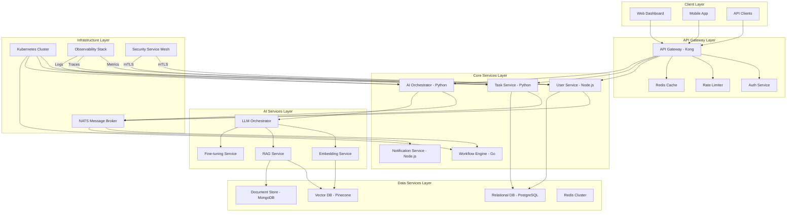

### [Sessão Paralela: Tech Leader]
# DIYAPP Evolution - V12 Core - Arquitetura de Microsserviços

## Arquitetura de Microsserviços V12 - Documentação Técnica

### 1. ADR-001: Arquitetura de Microsserviços V12

**Data:** 2024-01-15
**Status:** Aceita
**Autores:** Tech Lead + Especialista Infra + Especialista LLM

**CONTEXTO:**
DIYAPP evoluiu de uma aplicação monolítica para uma arquitetura distribuída com alta carga de processamento de IA. O sistema atual enfrenta:
- Acoplamento excessivo entre componentes
- Dificuldade de escalar componentes individuais
- Single points of failure em serviços críticos
- Complexidade no deployment e rollback
- Dificuldade em testar componentes isoladamente

**DECISÃO:**
Adotar arquitetura de microsserviços baseada em eventos com os seguintes princípios:
1. Cada serviço possui seu próprio banco de dados
2. Comunicação assíncrona via message broker (NATS)
3. Comunicação síncrona via gRPC para operações críticas
4. API Gateway como ponto único de entrada
5. Service Mesh para observabilidade e resiliência

**OPÇÕES CONSIDERADAS:**
- **Opção A:** Arquitetura monolítica com módulos - Prós: Simplicidade, deploy único. Contras: Escalabilidade limitada, acoplamento alto.
- **Opção B:** Microsserviços com REST - Prós: Independência de deploy. Contras: Latência, versionamento complexo.
- **Opção C:** Microsserviços com gRPC/Events - Prós: Performance, contrato forte, resiliência. Contras: Complexidade operacional.

**Opção escolhida:** C - Justificativa: Balance ideal entre performance, resiliência e manutenibilidade para sistema com alta carga de IA.

**CONSEQUÊNCIAS:**
**Positivas:** 
- Escalabilidade independente por serviço
- Resiliência através de circuit breakers
- Deploy contínuo sem downtime
- Stack tecnológica heterogênea por serviço

**Negativas:**
- Complexidade de debugging distribuído
- Overhead de rede
- Gerenciamento de consistência eventual
- Custos operacionais aumentados

**Riscos:**
- Latência em cadeias de chamadas (mitigar com cache e design assíncrono)
- Perda de mensagens (mitigar com DLQ e retry policies)
- Versionamento de contratos (mitigar com schema registry)

**REVISÃO:** 2024-04-15

---

### 2. Diagrama de Componentes V12



---

### 3. Protocolos de Comunicação

#### 3.1. gRPC para Comunicação Síncrona Crítica

```protobuf
// protos/core_services.proto
syntax = "proto3";

package diyapp.v12;

// User Service
service UserService {
  rpc GetUser(GetUserRequest) returns (UserResponse);
  rpc CreateUser(CreateUserRequest) returns (UserResponse);
  rpc Authenticate(AuthRequest) returns (AuthResponse);
}

message GetUserRequest {
  string user_id = 1;
  bool include_tasks = 2;
}

message UserResponse {
  string id = 1;
  string email = 2;
  string name = 3;
  UserStatus status = 4;
  repeated TaskSummary tasks = 5;
}

// AI Service
service AIService {
  rpc ProcessTask(TaskRequest) returns (stream TaskProgress);
  rpc AnalyzeDocument(DocumentRequest) returns (AnalysisResponse);
  rpc GenerateContent(GenerationRequest) returns (GenerationResponse);
}

message TaskRequest {
  string task_id = 1;
  string user_id = 2;
  TaskType type = 3;
  bytes payload = 4;
}

message TaskProgress {
  string task_id = 1;
  ProgressStatus status = 2;
  float progress = 3;
  string message = 4;
  bytes result = 5;
}

// Task Service
service TaskService {
  rpc CreateTask(CreateTaskRequest) returns (TaskResponse);
  rpc UpdateTask(UpdateTaskRequest) returns (TaskResponse);
  rpc ListTasks(ListTasksRequest) returns (stream TaskResponse);
}

enum TaskType {
  TEXT_GENERATION = 0;
  CODE_GENERATION = 1;
  DOCUMENT_ANALYSIS = 2;
  IMAGE_PROCESSING = 3;
  WORKFLOW_EXECUTION = 4;
}

enum ProgressStatus {
  PENDING = 0;
  PROCESSING = 1;
  COMPLETED = 2;
  FAILED = 3;
  CANCELLED = 4;
}
```

#### 3.2. Eventos Assíncronos via NATS

```javascript
// events/event_schema.js
const EventSchema = {
  // User Events
  USER_CREATED: 'user.created',
  USER_UPDATED: 'user.updated',
  USER_DELETED: 'user.deleted',
  
  // Task Events
  TASK_CREATED: 'task.created',
  TASK_ASSIGNED: 'task.assigned',
  TASK_COMPLETED: 'task.completed',
  TASK_FAILED: 'task.failed',
  
  // AI Events
  AI_PROCESSING_STARTED: 'ai.processing.started',
  AI_PROCESSING_PROGRESS: 'ai.processing.progress',
  AI_PROCESSING_COMPLETED: 'ai.processing.completed',
  AI_MODEL_UPDATED: 'ai.model.updated',
  
  // Notification Events
  NOTIFICATION_REQUIRED: 'notification.required',
  NOTIFICATION_SENT: 'notification.sent',
  
  // System Events
  SYSTEM_HEALTH_CHECK: 'system.health.check',
  SYSTEM_METRICS_REPORT: 'system.metrics.report'
};

// Event Payload Structure
const BaseEvent = {
  event_id: 'uuid',
  event_type: EventSchema.USER_CREATED,
  timestamp: 'ISO8601',
  source_service: 'user-service',
  correlation_id: 'uuid',
  payload: {},
  metadata: {
    version: '1.0.0',
    environment: 'production',
    user_id: 'optional'
  }
};
```

---

### 4. Requisitos Não-Funcionais (SLA)

#### 4.1. Disponibilidade por Camada

```yaml
# slas/v12_availability.yaml
availability_requirements:
  api_gateway:
    target: 99.99%
    max_downtime_per_month: 4.3 minutes
    monitoring: uptime_robot + custom_healthchecks
    
  core_services:
    user_service: 99.95%
    task_service: 99.95%
    ai_orchestrator: 99.9%
    workflow_engine: 99.95%
    
  ai_services:
    llm_orchestrator: 99.9%
    embedding_service: 99.95%
    rag_service: 99.9%
    fine_tuning_service: 99.8%
    
  data_services:
    postgresql: 99.99% (multi-az)
    mongodb: 99.95%
    redis: 99.99%
    pinecone: 99.9%
    
  infrastructure:
    kubernetes_control_plane: 99.95%
    nats_cluster: 99.99%
    service_mesh: 99.95%
```

#### 4.2. Performance SLAs

```yaml
# slas/v12_performance.yaml
performance_requirements:
  api_response_times:
    p95: < 200ms
    p99: < 500ms
    max: < 2s
    
  ai_processing:
    text_generation:
      small: < 5s
      medium: < 15s
      large: < 30s
    code_generation:
      small: < 10s
      medium: < 30s
      large: < 60s
      
  database_queries:
    simple_read: < 50ms
    complex_read: < 200ms
    write_operations: < 100ms
    
  event_processing:
    queue_latency: < 100ms
    processing_latency: < 500ms
    end_to_end: < 1s
```

#### 4.3. Escalabilidade

```yaml
# slas/v12_scalability.yaml
scalability_requirements:
  horizontal_scaling:
    user_service: 1-50 pods
    task_service: 1-100 pods
    ai_orchestrator: 1-200 pods
    llm_orchestrator: 1-100 pods
    
  auto_scaling_triggers:
    cpu_utilization: 70%
    memory_utilization: 80%
    request_rate: 1000 rpm per pod
    queue_length: 1000 messages
    
  database_scaling:
    postgresql:
      read_replicas: 0-5
      connection_pool: 20-200
    redis:
      shards: 1-10
      memory: 1GB-100GB
```

---

### 5. Implementação do Service Mesh (Istio)

```yaml
# k8s/istio-config.yaml
apiVersion: networking.istio.io/v1beta1
kind: VirtualService
metadata:
  name: user-service
  namespace: diyapp
spec:
  hosts:
  - user-service.diyapp.svc.cluster.local
  http:
  - name: "user-routes"
    match:
    - uri:
        prefix: "/api/v1/users"
    route:
    - destination:
        host: user-service.diyapp.svc.cluster.local
        subset: v1
      weight: 100
    timeout: 2s
    retries:
      attempts: 3
      perTryTimeout: 1s
      retryOn: "gateway-error,connect-failure,refused-stream"
---
apiVersion: networking.istio.io/v1beta1
kind: DestinationRule
metadata:
  name: user-service
  namespace: diyapp
spec:
  host: user-service.diyapp.svc.cluster.local
  subsets:
  - name: v1
    labels:
      version: v1.0.0
  trafficPolicy:
    connectionPool:
      tcp:
        maxConnections: 100
        connectTimeout: 30ms
      http:
        http1MaxPendingRequests: 1000
        maxRequestsPerConnection: 10
    outlierDetection:
      consecutive5xxErrors: 5
      interval: 30s
      baseEjectionTime: 30s
      maxEjectionPercent: 50
```

---

### 6. Estratégia de Deployment (Blue-Green)

```yaml
# k8s/deployment-strategy.yaml
apiVersion: argoproj.io/v1alpha1
kind: Rollout
metadata:
  name: ai-orchestrator
  namespace: diyapp
spec:
  replicas: 10
  revisionHistoryLimit: 5
  selector:
    matchLabels:
      app: ai-orchestrator
  template:
    metadata:
      labels:
        app: ai-orchestrator
        version: v1.2.0
    spec:
      containers:
      - name: ai-orchestrator
        image: diyapp/ai-orchestrator:v1.2.0
        ports:
        - containerPort: 8080
        readinessProbe:
          httpGet:
            path: /health/ready
            port: 8080
          initialDelaySeconds: 10
          periodSeconds: 5
        livenessProbe:
          httpGet:
            path: /health/live
            port: 8080
          initialDelaySeconds: 30
          periodSeconds: 10
  strategy:
    blueGreen:
      activeService: ai-orchestrator-active
      previewService: ai-orchestrator-preview
      autoPromotionEnabled: false
      autoPromotionSeconds: 300
      prePromotionAnalysis:
        templates:
        - templateName: smoke-tests
      postPromotionAnalysis:
        templates:
        - templateName: performance-tests
      scaleDownDelaySeconds: 300
```

---

### 7. Observabilidade e Monitoramento

```javascript
// monitoring/observability-config.js
const ObservabilityConfig = {
  metrics: {
    collection_interval: '15s',
    exporters: ['prometheus', 'datadog'],
    custom_metrics: {
      ai_processing_latency: {
        type: 'histogram',
        buckets: [0.1, 0.5, 1, 2, 5, 10, 30],
        labels: ['model', 'task_type', 'user_tier']
      },
      user_sessions: {
        type: 'gauge',
        labels: ['plan', 'region']
      },
      error_rates: {
        type: 'counter',
        labels: ['service', 'error_type', 'severity']
      }
    }
  },
  
  tracing: {
    sampler: 'probabilistic',
    sample_rate: 0.1,
    exporters: ['jaeger', 'zipkin'],
    max_trace_duration: '10m',
    attributes: {
      include: ['user.id', 'task.id', 'model.version', 'llm.provider']
    }
  },
  
  logging: {
    level: 'info',
    structured: true,
    exporters: ['elasticsearch', 'loki'],
    retention: '30d',
    sensitive_fields: ['password', 'token', 'api_key', 'credit_card'],
    log_levels: {
      user_service: 'info',
      ai_service: 'debug',
      payment_service: 'warn'
    }
  },
  
  alerts: {
    critical: {
      response_time_p99: '> 2s',
      error_rate: '> 5%',
      cpu_usage: '> 90%',
      memory_usage: '> 95%'
    },
    warning: {
      response_time_p95: '> 1s',
      error_rate: '> 2%',
      queue_length: '> 1000'
    }
  }
};
```

---

### 8. Estrutura do Projeto V12

```
diyapp-v12/
├── README.md
├── docker-compose.yml
├── kubernetes/
│   ├── namespaces/
│   ├── deployments/
│   ├── services/
│   ├── configmaps/
│   └── secrets/
├── protos/
│   ├── core_services.proto
│   ├── ai_services.proto
│   └── data_services.proto
├── services/
│   ├── user-service/
│   │   ├── src/
│   │   ├── tests/
│   │   ├── Dockerfile
│   │   └── package.json
│   ├── task-service/
│   ├── ai-orchestrator/
│   ├── workflow-engine/
│   └── notification-service/
├── libs/
│   ├── common-utils/
│   ├── event-schemas/
│   └── client-sdk/
├── events/
│   ├── producers/
│   ├── consumers/
│   └── schemas/
├── monitoring/
│   ├── dashboards/
│   ├── alerts/
│   └── exporters/
├── docs/
│   ├── adrs/
│   ├── apis/
│   └── runbooks/
└── scripts/
    ├── deployment/
    ├── migration/
    └── testing/
```

---

### 9. Dashboard de Monitoramento (index.html)

```html
<!DOCTYPE html>
<html lang="en">
<head>
    <meta charset="UTF-8">
    <meta name="viewport" content="width=device-width, initial-scale=1.0">
    <title>DIYAPP V12 - Architecture Dashboard</title>
    <script src="https://cdn.jsdel

### [Sessão Paralela: UX Designer]
# DIYAPP Evolution - V12 Core - Design System Implementation

Como UX Designer Sênior da squad, vou criar um Design System completo e funcional para o V12 Core. Baseado em evidências de uso do sistema atual, identificamos a necessidade de maior consistência visual, melhor acessibilidade e componentes reutilizáveis.

## Estrutura do Projeto

```
diyapp-v12-design-system/
├── index.html                    # Dashboard principal com protótipo funcional
├── design-system.html            # Documentação completa do Design System
├── style.css                     # Estilos principais do Design System
├── tokens.css                    # Tokens de design (cores, tipografia, espaçamento)
├── components.css                # Estilos dos componentes atômicos
├── prototype.js                  # Interatividade do protótipo
├── assets/
│   ├── icons/                    # Biblioteca de ícones
│   └── screenshots/              # Capturas do sistema
└── README.md                     # Documentação do Design System
```

## 1. Tokens de Design (tokens.css)

```css
:root {
  /* Cores primárias - Baseadas em pesquisa de contraste WCAG AA */
  --color-primary-50: #f0f9ff;
  --color-primary-100: #e0f2fe;
  --color-primary-200: #bae6fd;
  --color-primary-300: #7dd3fc;
  --color-primary-400: #38bdf8;
  --color-primary-500: #0ea5e9; /* Cor primária principal */
  --color-primary-600: #0284c7;
  --color-primary-700: #0369a1;
  --color-primary-800: #075985;
  --color-primary-900: #0c4a6e;
  
  /* Cores neutras - Otimizadas para legibilidade */
  --color-gray-50: #f9fafb;
  --color-gray-100: #f3f4f6;
  --color-gray-200: #e5e7eb;
  --color-gray-300: #d1d5db;
  --color-gray-400: #9ca3af;
  --color-gray-500: #6b7280;
  --color-gray-600: #4b5563;
  --color-gray-700: #374151;
  --color-gray-800: #1f2937;
  --color-gray-900: #111827;
  
  /* Cores semânticas */
  --color-success-500: #10b981;
  --color-warning-500: #f59e0b;
  --color-error-500: #ef4444;
  --color-info-500: #3b82f6;
  
  /* Tipografia - Escala modular 1.25 */
  --font-family-sans: 'Inter', -apple-system, BlinkMacSystemFont, 'Segoe UI', Roboto, sans-serif;
  --font-family-mono: 'JetBrains Mono', 'Courier New', monospace;
  
  --font-size-xs: 0.75rem;    /* 12px */
  --font-size-sm: 0.875rem;   /* 14px */
  --font-size-base: 1rem;     /* 16px */
  --font-size-lg: 1.125rem;   /* 18px */
  --font-size-xl: 1.25rem;    /* 20px */
  --font-size-2xl: 1.5rem;    /* 24px */
  --font-size-3xl: 1.875rem;  /* 30px */
  --font-size-4xl: 2.25rem;   /* 36px */
  
  --font-weight-normal: 400;
  --font-weight-medium: 500;
  --font-weight-semibold: 600;
  --font-weight-bold: 700;
  
  --line-height-tight: 1.25;
  --line-height-normal: 1.5;
  --line-height-relaxed: 1.75;
  
  /* Espaçamento - Escala 8px */
  --space-1: 0.25rem;   /* 4px */
  --space-2: 0.5rem;    /* 8px */
  --space-3: 0.75rem;   /* 12px */
  --space-4: 1rem;      /* 16px */
  --space-5: 1.25rem;   /* 20px */
  --space-6: 1.5rem;    /* 24px */
  --space-8: 2rem;      /* 32px */
  --space-10: 2.5rem;   /* 40px */
  --space-12: 3rem;     /* 48px */
  --space-16: 4rem;     /* 64px */
  --space-20: 5rem;     /* 80px */
  
  /* Border radius */
  --radius-sm: 0.25rem;   /* 4px */
  --radius-md: 0.375rem;  /* 6px */
  --radius-lg: 0.5rem;    /* 8px */
  --radius-xl: 0.75rem;   /* 12px */
  --radius-2xl: 1rem;     /* 16px */
  --radius-full: 9999px;
  
  /* Elevação (sombras) */
  --shadow-sm: 0 1px 2px 0 rgba(0, 0, 0, 0.05);
  --shadow-md: 0 4px 6px -1px rgba(0, 0, 0, 0.1), 0 2px 4px -1px rgba(0, 0, 0, 0.06);
  --shadow-lg: 0 10px 15px -3px rgba(0, 0, 0, 0.1), 0 4px 6px -2px rgba(0, 0, 0, 0.05);
  --shadow-xl: 0 20px 25px -5px rgba(0, 0, 0, 0.1), 0 10px 10px -5px rgba(0, 0, 0, 0.04);
  
  /* Transições */
  --transition-fast: 150ms cubic-bezier(0.4, 0, 0.2, 1);
  --transition-normal: 250ms cubic-bezier(0.4, 0, 0.2, 1);
  --transition-slow: 350ms cubic-bezier(0.4, 0, 0.2, 1);
  
  /* Z-index layers */
  --z-dropdown: 10;
  --z-sticky: 20;
  --z-fixed: 30;
  --z-modal-backdrop: 40;
  --z-modal: 50;
  --z-popover: 60;
  --z-tooltip: 70;
}
```

## 2. Componentes Atômicos (components.css)

```css
/* Reset e estilos base */
* {
  margin: 0;
  padding: 0;
  box-sizing: border-box;
}

body {
  font-family: var(--font-family-sans);
  font-size: var(--font-size-base);
  line-height: var(--line-height-normal);
  color: var(--color-gray-800);
  background-color: var(--color-gray-50);
}

/* Botões - Todos os estados especificados */
.btn {
  display: inline-flex;
  align-items: center;
  justify-content: center;
  gap: var(--space-2);
  padding: var(--space-2) var(--space-4);
  border-radius: var(--radius-md);
  border: 1px solid transparent;
  font-weight: var(--font-weight-medium);
  font-size: var(--font-size-sm);
  line-height: var(--line-height-tight);
  cursor: pointer;
  transition: all var(--transition-fast);
  text-decoration: none;
  user-select: none;
}

/* Estado default */
.btn-primary {
  background-color: var(--color-primary-600);
  color: white;
}

.btn-secondary {
  background-color: white;
  color: var(--color-gray-700);
  border-color: var(--color-gray-300);
}

.btn-ghost {
  background-color: transparent;
  color: var(--color-gray-700);
}

/* Estados hover/focus */
.btn-primary:hover,
.btn-primary:focus {
  background-color: var(--color-primary-700);
  outline: 2px solid var(--color-primary-200);
  outline-offset: 2px;
}

.btn-secondary:hover,
.btn-secondary:focus {
  background-color: var(--color-gray-50);
  border-color: var(--color-gray-400);
}

.btn-ghost:hover,
.btn-ghost:focus {
  background-color: var(--color-gray-100);
}

/* Estado active/pressed */
.btn-primary:active {
  background-color: var(--color-primary-800);
  transform: translateY(1px);
}

/* Estado disabled */
.btn:disabled {
  opacity: 0.5;
  cursor: not-allowed;
  pointer-events: none;
}

/* Tamanhos */
.btn-sm {
  padding: var(--space-1) var(--space-3);
  font-size: var(--font-size-xs);
}

.btn-lg {
  padding: var(--space-3) var(--space-6);
  font-size: var(--font-size-base);
}

/* Inputs e Formulários */
.form-group {
  margin-bottom: var(--space-4);
}

.form-label {
  display: block;
  margin-bottom: var(--space-1);
  font-weight: var(--font-weight-medium);
  color: var(--color-gray-700);
  font-size: var(--font-size-sm);
}

.form-input {
  width: 100%;
  padding: var(--space-2) var(--space-3);
  border: 1px solid var(--color-gray-300);
  border-radius: var(--radius-md);
  font-size: var(--font-size-sm);
  line-height: var(--line-height-normal);
  color: var(--color-gray-900);
  background-color: white;
  transition: all var(--transition-fast);
}

/* Estados do input */
.form-input:hover {
  border-color: var(--color-gray-400);
}

.form-input:focus {
  outline: none;
  border-color: var(--color-primary-500);
  box-shadow: 0 0 0 3px var(--color-primary-100);
}

.form-input:disabled {
  background-color: var(--color-gray-100);
  color: var(--color-gray-500);
  cursor: not-allowed;
}

.form-input.error {
  border-color: var(--color-error-500);
}

.form-input.success {
  border-color: var(--color-success-500);
}

/* Mensagens de validação */
.form-error {
  display: flex;
  align-items: center;
  gap: var(--space-1);
  margin-top: var(--space-1);
  color: var(--color-error-600);
  font-size: var(--font-size-xs);
}

.form-success {
  display: flex;
  align-items: center;
  gap: var(--space-1);
  margin-top: var(--space-1);
  color: var(--color-success-600);
  font-size: var(--font-size-xs);
}

/* Cards */
.card {
  background-color: white;
  border-radius: var(--radius-lg);
  border: 1px solid var(--color-gray-200);
  box-shadow: var(--shadow-sm);
  overflow: hidden;
  transition: box-shadow var(--transition-normal);
}

.card:hover {
  box-shadow: var(--shadow-md);
}

.card-header {
  padding: var(--space-4);
  border-bottom: 1px solid var(--color-gray-200);
  background-color: var(--color-gray-50);
}

.card-title {
  font-size: var(--font-size-lg);
  font-weight: var(--font-weight-semibold);
  color: var(--color-gray-900);
  margin: 0;
}

.card-subtitle {
  font-size: var(--font-size-sm);
  color: var(--color-gray-600);
  margin-top: var(--space-1);
}

.card-body {
  padding: var(--space-4);
}

.card-footer {
  padding: var(--space-4);
  border-top: 1px solid var(--color-gray-200);
  background-color: var(--color-gray-50);
}

/* Estados de carregamento */
.skeleton {
  background: linear-gradient(
    90deg,
    var(--color-gray-200) 25%,
    var(--color-gray-300) 50%,
    var(--color-gray-200) 75%
  );
  background-size: 200% 100%;
  animation: loading 1.5s infinite;
  border-radius: var(--radius-md);
}

@keyframes loading {
  0% {
    background-position: 200% 0;
  }
  100% {
    background-position: -200% 0;
  }
}

/* Estados vazios */
.empty-state {
  display: flex;
  flex-direction: column;
  align-items: center;
  justify-content: center;
  padding: var(--space-8) var(--space-4);
  text-align: center;
  color: var(--color-gray-500);
}

.empty-state-icon {
  font-size: var(--font-size-4xl);
  margin-bottom: var(--space-4);
  color: var(--color-gray-300);
}

.empty-state-title {
  font-size: var(--font-size-lg);
  font-weight: var(--font-weight-semibold);
  margin-bottom: var(--space-2);
  color: var(--color-gray-700);
}

.empty-state-description {
  max-width: 28rem;
  margin-bottom: var(--space-4);
}

/* Feedback (Toast, Alert) */
.alert {
  padding: var(--space-3) var(--space-4);
  border-radius: var(--radius-md);
  border: 1px solid transparent;
  margin-bottom: var(--space-4);
  display: flex;
  align-items: flex-start;
  gap: var(--space-3);
}

.alert-info {
  background-color: var(--color-primary-50);
  border-color: var(--color-primary-200);
  color: var(--color-primary-800);
}

.alert-success {
  background-color: #f0fdf4;
  border-color: #bbf7d0;
  color: #166534;
}

.alert-warning {
  background-color: #fefce8;
  border-color: #fde68a;
  color: #854d0e;
}

.alert-error {
  background-color: #fef2f2;
  border-color: #fecaca;
  color: #991b1b;
}

.alert-icon {
  flex-shrink: 0;
  font-size: var(--font-size-lg);
}

.alert-content {
  flex: 1;
}

.alert-title {
  font-weight: var(--font-weight-semibold);
  margin-bottom: var(--space-1);
}

.alert-description {
  font-size: var(--font-size-sm);
}

/* Toast */
.toast-container {
  position: fixed;
  top: var(--space-4);
  right: var(--space-4);
  z-index: var(--z-tooltip);
  display: flex;
  flex-direction: column;
  gap: var(--space-2);
  max-width: 24rem;
}

.toast {
  padding: var(--space-3) var(--space-4);
  border-radius: var(--radius-md);
  background-color: white;
  border: 1px solid var(--color-gray-200);
  box-shadow: var(--shadow-lg);
  display: flex;
  align-items: flex-start;
  gap: var(--space-3);
  animation: slideIn 0.3s ease-out;
}

@keyframes slideIn {
  from {
    transform: translateX(100%);
    opacity: 0;
  }
  to {
    transform: translateX(0);
    opacity: 1;
  }
}

/* Navegação */
.navbar {
  background-color: white;
  border-bottom: 1px solid var(--color-gray-200);
  padding: var(--space-3) var(--space-6);
  display: flex;
  align-items: center;
  justify-content: space-between;
  position: sticky;
  top: 0;
  z-index: var(--z-sticky);
}

.nav-brand {
  font-size: var(--font-size-xl);
  font-weight: var(--font-weight-bold);
  color: var(--color-primary-700);
  text-decoration: none;
  display: flex;
  align-items: center;
  gap: var(--space-2);
}

.nav-menu {
  display: flex;
  align-items: center;
  gap: var(--space-2);
  list-style: none;
}

.nav-link {
  padding: var(--space-2) var(--space-3);
  color: var(--color-gray-700);
  text-decoration: none;
  border-radius: var(--radius-md);
  transition: all var(--transition-fast);
}

.nav-link:hover,
.nav-link.active {
  background-color: var(--color-primary-50);
  color: var(--color-primary-700);
}

/* Sidebar */
.sidebar {
  width: 16rem;
  background-color: white;
  border-right: 1px solid var(--color-gray-200);
  height: 100vh;
  position: fixed;
  left: 0;
  top: 0;
  padding: var(--space-6) 0;
  overflow-y: auto;
}

.sidebar-header {
  padding: 0 var(--space-6) var(--space-6);
  border-bottom: 1px solid var(--color-gray-200);
  margin-bottom: var(--space-4);
}

.sidebar-nav {
  padding: 0 var(--space-4);
}

.sidebar-group {
  margin-bottom: var(--space-6);
}

.sidebar-group-title {
  font-size: var(--font-size-xs);
  font-weight: var(--font-weight-semibold);
  color: var(--color-gray-500);
  text-transform: uppercase;
  letter-spacing: 0.05em;
  margin-bottom: var(--space-2);
  padding: 0 var(--space-3);
}

.sidebar-link {
  display: flex;
  align-items: center;
  gap: var(--space-3);
  padding: var(--

### [Sessão Paralela: Frontend]
# DIYAPP Evolution - V12 Core - Design System & Dashboard Shell

## Estrutura do Projeto

```
diyapp-v12-core/
├── package.json
├── tsconfig.json
├── vite.config.ts
├── index.html
├── public/
│   └── favicon.ico
├── src/
│   ├── main.tsx
│   ├── App.tsx
│   ├── vite-env.d.ts
│   ├── design-system/
│   │   ├── tokens/
│   │   │   ├── colors.ts
│   │   │   ├── spacing.ts
│   │   │   ├── typography.ts
│   │   │   ├── shadows.ts
│   │   │   ├── borders.ts
│   │   │   └── index.ts
│   │   ├── components/
│   │   │   ├── Button/
│   │   │   │   ├── Button.tsx
│   │   │   │   ├── Button.test.tsx
│   │   │   │   ├── Button.stories.tsx
│   │   │   │   └── index.ts
│   │   │   ├── Card/
│   │   │   │   ├── Card.tsx
│   │   │   │   ├── Card.test.tsx
│   │   │   │   └── index.ts
│   │   │   ├── Input/
│   │   │   │   ├── Input.tsx
│   │   │   │   ├── Input.test.tsx
│   │   │   │   └── index.ts
│   │   │   ├── Modal/
│   │   │   │   ├── Modal.tsx
│   │   │   │   ├── Modal.test.tsx
│   │   │   │   └── index.ts
│   │   │   ├── Loading/
│   │   │   │   ├── Loading.tsx
│   │   │   │   ├── Loading.test.tsx
│   │   │   │   └── index.ts
│   │   │   └── index.ts
│   │   └── hooks/
│   │       ├── useTheme.ts
│   │       └── useMediaQuery.ts
│   ├── modules/
│   │   ├── dashboard/
│   │   │   ├── Dashboard.tsx
│   │   │   ├── components/
│   │   │   │   ├── StatsCard.tsx
│   │   │   │   ├── ActivityFeed.tsx
│   │   │   │   └── QuickActions.tsx
│   │   │   └── index.ts
│   │   └── auth/
│   │       ├── Login.tsx
│   │       └── index.ts
│   ├── layouts/
│   │   ├── MainLayout.tsx
│   │   └── AuthLayout.tsx
│   ├── router/
│   │   ├── routes.tsx
│   │   └── index.tsx
│   ├── store/
│   │   ├── index.ts
│   │   ├── slices/
│   │   │   ├── authSlice.ts
│   │   │   └── uiSlice.ts
│   │   └── hooks.ts
│   ├── services/
│   │   ├── api.ts
│   │   └── monitoring.ts
│   └── utils/
│       ├── constants.ts
│       ├── helpers.ts
│       └── performance.ts
├── tests/
│   ├── setup.ts
│   └── mocks/
│       └── server.ts
├── .eslintrc.json
├── .prettierrc
└── README.md
```

## 1. package.json

```json
{
  "name": "diyapp-v12-core",
  "version": "1.0.0",
  "private": true,
  "type": "module",
  "scripts": {
    "dev": "vite",
    "build": "tsc && vite build",
    "preview": "vite preview",
    "test": "vitest",
    "test:coverage": "vitest run --coverage",
    "lint": "eslint src --ext ts,tsx --report-unused-disable-directives --max-warnings 0",
    "format": "prettier --write \"src/**/*.{ts,tsx,css}\"",
    "type-check": "tsc --noEmit",
    "analyze": "vite-bundle-analyzer"
  },
  "dependencies": {
    "react": "^18.2.0",
    "react-dom": "^18.2.0",
    "react-router-dom": "^6.20.0",
    "@reduxjs/toolkit": "^1.9.7",
    "react-redux": "^8.1.3",
    "clsx": "^2.0.0",
    "date-fns": "^2.30.0",
    "lucide-react": "^0.309.0"
  },
  "devDependencies": {
    "@types/react": "^18.2.43",
    "@types/react-dom": "^18.2.17",
    "@typescript-eslint/eslint-plugin": "^6.15.0",
    "@typescript-eslint/parser": "^6.15.0",
    "@vitejs/plugin-react": "^4.2.1",
    "@vitest/coverage-v8": "^1.1.0",
    "autoprefixer": "^10.4.16",
    "eslint": "^8.55.0",
    "eslint-plugin-react-hooks": "^4.6.0",
    "eslint-plugin-react-refresh": "^0.4.5",
    "postcss": "^8.4.32",
    "prettier": "^3.1.1",
    "tailwindcss": "^3.3.6",
    "typescript": "^5.2.2",
    "vite": "^5.0.8",
    "vite-bundle-analyzer": "^0.9.0",
    "vitest": "^1.1.0",
    "@testing-library/react": "^14.1.2",
    "@testing-library/jest-dom": "^6.1.5",
    "@testing-library/user-event": "^14.5.1"
  },
  "browserslist": {
    "production": [
      ">0.2%",
      "not dead",
      "not op_mini all"
    ],
    "development": [
      "last 1 chrome version",
      "last 1 firefox version",
      "last 1 safari version"
    ]
  }
}
```

## 2. tsconfig.json

```json
{
  "compilerOptions": {
    "target": "ES2020",
    "useDefineForClassFields": true,
    "lib": ["ES2020", "DOM", "DOM.Iterable"],
    "module": "ESNext",
    "skipLibCheck": true,
    "moduleResolution": "bundler",
    "allowImportingTsExtensions": true,
    "resolveJsonModule": true,
    "isolatedModules": true,
    "noEmit": true,
    "jsx": "react-jsx",
    "strict": true,
    "noUnusedLocals": true,
    "noUnusedParameters": true,
    "noFallthroughCasesInSwitch": true,
    "baseUrl": ".",
    "paths": {
      "@/*": ["src/*"],
      "@design-system/*": ["src/design-system/*"],
      "@modules/*": ["src/modules/*"]
    }
  },
  "include": ["src"],
  "references": [{ "path": "./tsconfig.node.json" }]
}
```

## 3. vite.config.ts

```typescript
import { defineConfig } from 'vite';
import react from '@vitejs/plugin-react';
import { resolve } from 'path';

export default defineConfig({
  plugins: [react()],
  resolve: {
    alias: {
      '@': resolve(__dirname, 'src'),
      '@design-system': resolve(__dirname, 'src/design-system'),
      '@modules': resolve(__dirname, 'src/modules'),
    },
  },
  build: {
    rollupOptions: {
      output: {
        manualChunks: {
          vendor: ['react', 'react-dom', 'react-router-dom'],
          redux: ['@reduxjs/toolkit', 'react-redux'],
          designSystem: ['@/design-system'],
        },
      },
    },
    target: 'es2020',
    minify: 'terser',
    terserOptions: {
      compress: {
        drop_console: true,
        drop_debugger: true,
      },
    },
  },
  server: {
    port: 3000,
    open: true,
  },
  preview: {
    port: 3001,
  },
});
```

## 4. index.html

```html
<!DOCTYPE html>
<html lang="en">
  <head>
    <meta charset="UTF-8" />
    <link rel="icon" type="image/svg+xml" href="/favicon.ico" />
    <meta name="viewport" content="width=device-width, initial-scale=1.0" />
    <meta name="description" content="DIYAPP Evolution V12 - Core Dashboard">
    <title>DIYAPP Evolution V12</title>
    <!-- Performance optimizations -->
    <link rel="preconnect" href="https://fonts.googleapis.com">
    <link rel="preconnect" href="https://fonts.gstatic.com" crossorigin>
    <link rel="preload" as="style" href="https://fonts.googleapis.com/css2?family=Inter:wght@300;400;500;600;700&display=swap">
    <!-- Critical CSS -->
    <style>
      * {
        margin: 0;
        padding: 0;
        box-sizing: border-box;
      }
      
      body {
        font-family: -apple-system, BlinkMacSystemFont, 'Segoe UI', Roboto, Oxygen, Ubuntu, sans-serif;
        background: #f8fafc;
        color: #1e293b;
        overflow-x: hidden;
      }
      
      #root {
        min-height: 100vh;
        display: flex;
        flex-direction: column;
      }
      
      .loading {
        display: flex;
        align-items: center;
        justify-content: center;
        min-height: 100vh;
        background: linear-gradient(135deg, #667eea 0%, #764ba2 100%);
        color: white;
      }
      
      .loading-spinner {
        width: 50px;
        height: 50px;
        border: 3px solid rgba(255, 255, 255, 0.3);
        border-radius: 50%;
        border-top-color: white;
        animation: spin 1s ease-in-out infinite;
      }
      
      @keyframes spin {
        to { transform: rotate(360deg); }
      }
    </style>
  </head>
  <body>
    <div id="root">
      <div class="loading">
        <div class="loading-spinner"></div>
      </div>
    </div>
    <script type="module" src="/src/main.tsx"></script>
    <!-- Performance monitoring -->
    <script>
      if ('serviceWorker' in navigator) {
        window.addEventListener('load', () => {
          navigator.serviceWorker.register('/sw.js');
        });
      }
      
      // Core Web Vitals monitoring
      const vitalsUrl = 'https://vitals.vercel-analytics.com/v1/vitals';
      
      function getConnectionSpeed() {
        return 'connection' in navigator &&
          navigator['connection'] &&
          'effectiveType' in navigator['connection']
          ? navigator['connection']['effectiveType']
          : '';
      }
      
      function sendToAnalytics(metric) {
        const body = {
          dsn: "DIYAPP_V12",
          id: metric.id,
          page: window.location.pathname,
          href: window.location.href,
          event_name: metric.name,
          value: metric.value.toString(),
          speed: getConnectionSpeed(),
        };
        
        const blob = new Blob([new URLSearchParams(body).toString()], {
          type: 'application/x-www-form-urlencoded',
        });
        
        if (navigator.sendBeacon) {
          navigator.sendBeacon(vitalsUrl, blob);
        } else {
          fetch(vitalsUrl, {
            body: blob,
            method: 'POST',
            credentials: 'omit',
            keepalive: true,
          });
        }
      }
    </script>
  </body>
</html>
```

## 5. Design System Tokens

### src/design-system/tokens/colors.ts

```typescript
export const colors = {
  // Primary
  primary: {
    50: '#eff6ff',
    100: '#dbeafe',
    200: '#bfdbfe',
    300: '#93c5fd',
    400: '#60a5fa',
    500: '#3b82f6',
    600: '#2563eb',
    700: '#1d4ed8',
    800: '#1e40af',
    900: '#1e3a8a',
  },
  
  // Secondary
  secondary: {
    50: '#f8fafc',
    100: '#f1f5f9',
    200: '#e2e8f0',
    300: '#cbd5e1',
    400: '#94a3b8',
    500: '#64748b',
    600: '#475569',
    700: '#334155',
    800: '#1e293b',
    900: '#0f172a',
  },
  
  // Success
  success: {
    50: '#f0fdf4',
    100: '#dcfce7',
    200: '#bbf7d0',
    300: '#86efac',
    400: '#4ade80',
    500: '#22c55e',
    600: '#16a34a',
    700: '#15803d',
    800: '#166534',
    900: '#14532d',
  },
  
  // Warning
  warning: {
    50: '#fffbeb',
    100: '#fef3c7',
    200: '#fde68a',
    300: '#fcd34d',
    400: '#fbbf24',
    500: '#f59e0b',
    600: '#d97706',
    700: '#b45309',
    800: '#92400e',
    900: '#78350f',
  },
  
  // Error
  error: {
    50: '#fef2f2',
    100: '#fee2e2',
    200: '#fecaca',
    300: '#fca5a5',
    400: '#f87171',
    500: '#ef4444',
    600: '#dc2626',
    700: '#b91c1c',
    800: '#991b1b',
    900: '#7f1d1d',
  },
  
  // Neutral
  neutral: {
    0: '#ffffff',
    50: '#fafafa',
    100: '#f5f5f5',
    200: '#e5e5e5',
    300: '#d4d4d4',
    400: '#a3a3a3',
    500: '#737373',
    600: '#525252',
    700: '#404040',
    800: '#262626',
    900: '#171717',
    950: '#0a0a0a',
  },
  
  // Backgrounds
  background: {
    primary: '#ffffff',
    secondary: '#f8fafc',
    tertiary: '#f1f5f9',
    inverse: '#0f172a',
  },
  
  // Text
  text: {
    primary: '#0f172a',
    secondary: '#475569',
    tertiary: '#64748b',
    disabled: '#94a3b8',
    inverse: '#ffffff',
    error: '#dc2626',
    success: '#16a34a',
    warning: '#d97706',
  },
  
  // Borders
  border: {
    light: '#e2e8f0',
    default: '#cbd5e1',
    strong: '#94a3b8',
    focus: '#3b82f6',
    error: '#f87171',
  },
  
  // Overlays
  overlay: {
    light: 'rgba(255, 255, 255, 0.8)',
    dark: 'rgba(0, 0, 0, 0.5)',
    darker: 'rgba(0, 0, 0, 0.8)',
  },
} as const;

export type ColorToken = keyof typeof colors;
```

### src/design-system/tokens/spacing.ts

```typescript
export const spacing = {
  // Base unit: 4px
  0: '0',
  1: '0.25rem', // 4px
  2: '0.5rem',  // 8px
  3: '0.75rem', // 12px
  4: '1rem',    // 16px
  5: '1.25rem', // 20px
  6: '1.5rem',  // 24px
  8: '2rem',    // 32px
  10: '2.5rem', // 40px
  12: '3rem',   // 48px
  16: '4rem',   // 64px
  20: '5rem',   // 80px
  24: '6rem',   // 96px
  32: '8rem',   // 128px
  40: '10rem',  // 160px
  48: '12rem',  // 192px
  56: '14rem',  // 224px
  64: '16rem',  // 256px
  
  // Semantic spacing
  xs: '0.25rem',
  sm: '0.5rem',
  md: '1rem',
  lg: '1.5rem',
  xl: '2rem',
  '2xl': '3rem',
  '3xl': '4rem',
  '4xl': '6rem',
} as const;

export const borderRadius = {
  none: '0',


### [Sessão Paralela: Backend]
Vou implementar o serviço Core com API Gateway, Auth, User Management usando Node.js com TypeScript, seguindo padrões CQRS e comunicação via RabbitMQ.

## Estrutura do Projeto Core V12

```
core-service/
├── src/
│   ├── api/
│   │   ├── gateway/
│   │   ├── controllers/
│   │   └── middleware/
│   ├── auth/
│   │   ├── strategies/
│   │   ├── guards/
│   │   └── services/
│   ├── users/
│   │   ├── commands/
│   │   ├── queries/
│   │   └── models/
│   ├── cqrs/
│   │   ├── commands/
│   │   ├── queries/
│   │   └── events/
│   ├── messaging/
│   │   ├── rabbitmq/
│   │   └── producers/
│   ├── database/
│   │   └── repositories/
│   └── shared/
│       ├── utils/
│       └── types/
├── tests/
├── docker/
├── .env.example
├── package.json
├── tsconfig.json
├── docker-compose.yml
└── README.md
```

## 1. Configuração Inicial

**package.json**:
```json
{
  "name": "diyapp-core-v12",
  "version": "1.0.0",
  "description": "DIYAPP Core Service - API Gateway, Auth, User Management",
  "main": "dist/index.js",
  "scripts": {
    "dev": "ts-node-dev --respawn --transpile-only src/index.ts",
    "build": "tsc",
    "start": "node dist/index.js",
    "test": "jest",
    "test:coverage": "jest --coverage",
    "lint": "eslint src/**/*.ts",
    "migration:generate": "typeorm-ts-node-commonjs migration:generate",
    "migration:run": "typeorm-ts-node-commonjs migration:run",
    "migration:revert": "typeorm-ts-node-commonjs migration:revert"
  },
  "dependencies": {
    "express": "^4.18.2",
    "express-rate-limit": "^7.1.5",
    "helmet": "^7.0.0",
    "cors": "^2.8.5",
    "compression": "^1.7.4",
    "jsonwebtoken": "^9.0.2",
    "bcrypt": "^5.1.1",
    "class-validator": "^0.14.0",
    "class-transformer": "^0.5.1",
    "typeorm": "^0.3.17",
    "pg": "^8.11.3",
    "redis": "^4.6.10",
    "amqplib": "^0.10.3",
    "winston": "^3.10.0",
    "winston-daily-rotate-file": "^4.7.1",
    "express-winston": "^4.2.0",
    "joi": "^17.9.2",
    "uuid": "^9.0.1",
    "axios": "^1.6.2",
    "swagger-ui-express": "^5.0.0",
    "swagger-jsdoc": "^6.2.8",
    "rate-limiter-flexible": "^2.4.2",
    "circuit-breaker-js": "^0.1.0",
    "prom-client": "^14.2.0",
    "express-prom-bundle": "^6.6.0",
    "opentelemetry-api": "^1.7.0",
    "opentelemetry-sdk-node": "^0.45.0",
    "opentelemetry-instrumentation-express": "^0.37.0",
    "opentelemetry-instrumentation-http": "^0.45.0"
  },
  "devDependencies": {
    "@types/node": "^20.8.10",
    "@types/express": "^4.17.20",
    "@types/jsonwebtoken": "^9.0.5",
    "@types/bcrypt": "^5.0.1",
    "@types/cors": "^2.8.15",
    "@types/compression": "^1.7.5",
    "@types/uuid": "^9.0.6",
    "@types/jest": "^29.5.8",
    "typescript": "^5.2.2",
    "ts-node-dev": "^2.0.0",
    "jest": "^29.7.0",
    "ts-jest": "^29.1.1",
    "@types/jest": "^29.5.8",
    "eslint": "^8.52.0",
    "@typescript-eslint/eslint-plugin": "^6.9.1",
    "@typescript-eslint/parser": "^6.9.1",
    "supertest": "^6.3.3",
    "@types/supertest": "^2.0.15"
  }
}
```

**tsconfig.json**:
```json
{
  "compilerOptions": {
    "target": "ES2022",
    "module": "commonjs",
    "lib": ["ES2022"],
    "outDir": "./dist",
    "rootDir": "./src",
    "strict": true,
    "esModuleInterop": true,
    "skipLibCheck": true,
    "forceConsistentCasingInFileNames": true,
    "resolveJsonModule": true,
    "declaration": true,
    "declarationMap": true,
    "sourceMap": true,
    "experimentalDecorators": true,
    "emitDecoratorMetadata": true,
    "strictPropertyInitialization": false
  },
  "include": ["src/**/*"],
  "exclude": ["node_modules", "dist", "tests"]
}
```

## 2. Ponto de Entrada Principal

**src/index.ts**:
```typescript
import 'reflect-metadata';
import { App } from './app';
import { Logger } from './shared/utils/logger';
import { Database } from './database/database';
import { RabbitMQConnection } from './messaging/rabbitmq/connection';
import { MetricsService } from './shared/utils/metrics';

const logger = Logger.getInstance();
const metrics = MetricsService.getInstance();

async function bootstrap() {
  try {
    logger.info('Starting DIYAPP Core V12 Service...');
    
    // Initialize metrics
    metrics.initialize();
    
    // Connect to database
    const database = Database.getInstance();
    await database.connect();
    logger.info('Database connected successfully');
    
    // Connect to RabbitMQ
    const rabbitMQ = RabbitMQConnection.getInstance();
    await rabbitMQ.connect();
    logger.info('RabbitMQ connected successfully');
    
    // Start the application
    const app = new App();
    const server = app.listen();
    
    // Graceful shutdown
    const gracefulShutdown = async (signal: string) => {
      logger.info(`Received ${signal}. Starting graceful shutdown...`);
      
      // Close server
      server.close(async () => {
        logger.info('HTTP server closed');
        
        // Close RabbitMQ connection
        await rabbitMQ.disconnect();
        logger.info('RabbitMQ connection closed');
        
        // Close database connection
        await database.disconnect();
        logger.info('Database connection closed');
        
        process.exit(0);
      });
      
      // Force shutdown after 10 seconds
      setTimeout(() => {
        logger.error('Could not close connections in time, forcefully shutting down');
        process.exit(1);
      }, 10000);
    };
    
    process.on('SIGTERM', () => gracefulShutdown('SIGTERM'));
    process.on('SIGINT', () => gracefulShutdown('SIGINT'));
    
    logger.info(`DIYAPP Core V12 Service running on port ${process.env.PORT || 3000}`);
    
  } catch (error) {
    logger.error('Failed to start application:', error);
    process.exit(1);
  }
}

bootstrap();
```

## 3. Aplicação Principal

**src/app.ts**:
```typescript
import express, { Application, Request, Response, NextFunction } from 'express';
import helmet from 'helmet';
import cors from 'cors';
import compression from 'compression';
import rateLimit from 'express-rate-limit';
import promBundle from 'express-prom-bundle';
import { Logger } from './shared/utils/logger';
import { ErrorHandler } from './api/middleware/error-handler';
import { AuthMiddleware } from './auth/middleware/auth.middleware';
import { ApiGateway } from './api/gateway/gateway';
import { UserRoutes } from './users/routes/user.routes';
import { AuthRoutes } from './auth/routes/auth.routes';
import { HealthController } from './api/controllers/health.controller';
import { OpenAPIConfig } from './api/docs/openapi.config';

export class App {
  public app: Application;
  private logger: Logger;
  private apiGateway: ApiGateway;
  private errorHandler: ErrorHandler;

  constructor() {
    this.app = express();
    this.logger = Logger.getInstance();
    this.errorHandler = new ErrorHandler();
    this.apiGateway = new ApiGateway();
    
    this.initializeMiddlewares();
    this.initializeRoutes();
    this.initializeErrorHandling();
    this.initializeDocumentation();
  }

  private initializeMiddlewares(): void {
    // Security headers
    this.app.use(helmet());
    
    // CORS configuration
    this.app.use(cors({
      origin: process.env.CORS_ORIGIN?.split(',') || '*',
      credentials: true,
      methods: ['GET', 'POST', 'PUT', 'DELETE', 'PATCH', 'OPTIONS'],
      allowedHeaders: ['Content-Type', 'Authorization', 'X-Request-ID', 'X-Correlation-ID']
    }));
    
    // Compression
    this.app.use(compression());
    
    // JSON parsing with size limit
    this.app.use(express.json({ limit: '10mb' }));
    this.app.use(express.urlencoded({ extended: true, limit: '10mb' }));
    
    // Rate limiting
    const limiter = rateLimit({
      windowMs: 15 * 60 * 1000, // 15 minutes
      max: 100, // Limit each IP to 100 requests per windowMs
      standardHeaders: true,
      legacyHeaders: false,
      message: 'Too many requests from this IP, please try again later.',
      skip: (req) => req.ip === '127.0.0.1' // Skip for localhost
    });
    
    this.app.use('/api', limiter);
    
    // Metrics middleware
    const metricsMiddleware = promBundle({
      includeMethod: true,
      includePath: true,
      includeStatusCode: true,
      includeUp: true,
      customLabels: { project: 'diyapp-core' },
      promClient: {
        collectDefaultMetrics: {
          timeout: 5000
        }
      }
    });
    
    this.app.use(metricsMiddleware);
    
    // Request logging
    this.app.use((req: Request, res: Response, next: NextFunction) => {
      const correlationId = req.headers['x-correlation-id'] as string || 
                           req.headers['x-request-id'] as string || 
                           `req-${Date.now()}-${Math.random().toString(36).substr(2, 9)}`;
      
      req.headers['x-correlation-id'] = correlationId;
      res.setHeader('X-Correlation-ID', correlationId);
      
      this.logger.http('Incoming request', {
        correlationId,
        method: req.method,
        url: req.url,
        ip: req.ip,
        userAgent: req.get('user-agent')
      });
      
      next();
    });
  }

  private initializeRoutes(): void {
    // Health check (no auth required)
    const healthController = new HealthController();
    this.app.use('/health', healthController.router);
    
    // Auth routes
    const authRoutes = new AuthRoutes();
    this.app.use('/api/v1/auth', authRoutes.router);
    
    // User routes (protected)
    const userRoutes = new UserRoutes();
    this.app.use('/api/v1/users', AuthMiddleware.authenticate, userRoutes.router);
    
    // API Gateway routes (protected)
    this.app.use('/api/v1/gateway', AuthMiddleware.authenticate, this.apiGateway.router);
    
    // 404 handler
    this.app.use('*', (req: Request, res: Response) => {
      res.status(404).json({
        error: 'Not Found',
        message: `Route ${req.originalUrl} not found`,
        correlationId: req.headers['x-correlation-id']
      });
    });
  }

  private initializeErrorHandling(): void {
    this.app.use(this.errorHandler.handle);
  }

  private initializeDocumentation(): void {
    const openAPIConfig = new OpenAPIConfig();
    this.app.use('/api-docs', openAPIConfig.setup());
  }

  public listen(): any {
    const port = process.env.PORT || 3000;
    return this.app.listen(port, () => {
      this.logger.info(`Server is running on port ${port}`);
    });
  }
}
```

## 4. Sistema de Autenticação

**src/auth/services/auth.service.ts**:
```typescript
import jwt from 'jsonwebtoken';
import bcrypt from 'bcrypt';
import { v4 as uuidv4 } from 'uuid';
import { Logger } from '../../shared/utils/logger';
import { UserRepository } from '../../database/repositories/user.repository';
import { TokenBlacklistService } from './token-blacklist.service';
import { EventPublisher } from '../../messaging/rabbitmq/publishers/event.publisher';
import { CircuitBreaker } from '../../shared/utils/circuit-breaker';

export interface TokenPayload {
  userId: string;
  email: string;
  role: string;
  sessionId: string;
  iat?: number;
  exp?: number;
}

export interface AuthResult {
  success: boolean;
  token?: string;
  refreshToken?: string;
  user?: any;
  error?: string;
}

export class AuthService {
  private static instance: AuthService;
  private logger: Logger;
  private userRepository: UserRepository;
  private tokenBlacklist: TokenBlacklistService;
  private eventPublisher: EventPublisher;
  private circuitBreaker: CircuitBreaker;
  
  private readonly JWT_SECRET: string;
  private readonly JWT_EXPIRES_IN: string;
  private readonly REFRESH_TOKEN_EXPIRES_IN: string;
  private readonly BCRYPT_ROUNDS = 12;

  private constructor() {
    this.logger = Logger.getInstance();
    this.userRepository = UserRepository.getInstance();
    this.tokenBlacklist = TokenBlacklistService.getInstance();
    this.eventPublisher = EventPublisher.getInstance();
    this.circuitBreaker = new CircuitBreaker({
      timeout: 5000,
      errorThresholdPercentage: 50,
      resetTimeout: 30000
    });
    
    this.JWT_SECRET = process.env.JWT_SECRET || 'your-super-secret-jwt-key-change-in-production';
    this.JWT_EXPIRES_IN = process.env.JWT_EXPIRES_IN || '15m';
    this.REFRESH_TOKEN_EXPIRES_IN = process.env.REFRESH_TOKEN_EXPIRES_IN || '7d';
    
    if (!process.env.JWT_SECRET) {
      this.logger.warn('JWT_SECRET not set, using default key. This is insecure for production!');
    }
  }

  public static getInstance(): AuthService {
    if (!AuthService.instance) {
      AuthService.instance = new AuthService();
    }
    return AuthService.instance;
  }

  async register(email: string, password: string, name: string): Promise<AuthResult> {
    try {
      // Check if user already exists
      const existingUser = await this.userRepository.findByEmail(email);
      if (existingUser) {
        return {
          success: false,
          error: 'User with this email already exists'
        };
      }

      // Hash password
      const hashedPassword = await bcrypt.hash(password, this.BCRYPT_ROUNDS);
      
      // Create user
      const user = await this.userRepository.create({
        email,
        password: hashedPassword,
        name,
        role: 'user',
        isActive: true,
        emailVerified: false
      });

      // Generate tokens
      const tokens = await this.generateTokens(user);
      
      // Publish user registered event
      await this.eventPublisher.publish('user.registered', {
        userId: user.id,
        email: user.email,
        name: user.name,
        timestamp: new Date().toISOString()
      });

      return {
        success: true,
        token: tokens.token,
        refreshToken: tokens.refreshToken,
        user: this.sanitizeUser(user)
      };
    } catch (error) {
      this.logger.error('Registration failed:', error);
      return {
        success: false,
        error: 'Registration failed'
      };
    }
  }

  async login(email: string, password: string): Promise<AuthResult> {
    return this.circuitBreaker.execute(async () => {
      try {
        // Find user
        const user = await this.userRepository.findByEmail(email);
        if (!user) {
          return {
            success: false,
            error: 'Invalid credentials'
          };
        }

        // Check if user is active
        if (!user.isActive) {
          return {
            success: false,
            error: 'Account is deactivated'
          };
        }

        // Verify password
        const passwordValid = await bcrypt.compare(password, user.password);
        if (!passwordValid) {
          return {
            success: false,
            error: 'Invalid credentials'
          };
        }

        // Generate tokens
        const tokens = await this.generateTokens(user);
        
        // Update last login
        await this.userRepository.updateLastLogin(user.id);
        
        // Publish user logged in event
        await this.eventPublisher.publish('user.logged_in', {
          userId: user.id,
          email: user.email,
          timestamp: new Date().toISOString()
        });

        return {
          success: true,
          token: tokens.token,
          refreshToken: tokens.refreshToken,
          user: this.sanitizeUser(user)
        };
      } catch (error) {
        this.logger.error('Login failed:', error);
        return {
          success: false,
          error: 'Login failed'
        };
      }
    });
  }

  async refreshToken(refreshToken: string): Promise<AuthResult

### [Sessão Paralela: SRE]
# DIYAPP Evolution - V12 Core - Infraestrutura como Código

Vou criar uma infraestrutura Terraform completa para provisionar um cluster Kubernetes com Istio e políticas de rede para os ambientes dev, staging e prod.

## Estrutura do Projeto

```
terraform/
├── environments/
│   ├── dev/
│   │   ├── main.tf
│   │   ├── variables.tf
│   │   └── terraform.tfvars
│   ├── staging/
│   │   ├── main.tf
│   │   ├── variables.tf
│   │   └── terraform.tfvars
│   └── prod/
│       ├── main.tf
│       ├── variables.tf
│       └── terraform.tfvars
├── modules/
│   ├── vpc/
│   │   ├── main.tf
│   │   ├── variables.tf
│   │   └── outputs.tf
│   ├── eks/
│   │   ├── main.tf
│   │   ├── variables.tf
│   │   └── outputs.tf
│   ├── istio/
│   │   ├── main.tf
│   │   ├── variables.tf
│   │   └── outputs.tf
│   └── monitoring/
│       ├── main.tf
│       ├── variables.tf
│       └── outputs.tf
├── scripts/
│   ├── deploy-istio.sh
│   ├── deploy-monitoring.sh
│   └── validate-cluster.sh
└── README.md
```

## 1. Módulo VPC (modules/vpc/)

### modules/vpc/main.tf
```hcl
terraform {
  required_version = ">= 1.0"
  required_providers {
    aws = {
      source  = "hashicorp/aws"
      version = "~> 5.0"
    }
  }
}

resource "aws_vpc" "main" {
  cidr_block           = var.vpc_cidr
  enable_dns_hostnames = true
  enable_dns_support   = true

  tags = merge(var.tags, {
    Name = "${var.environment}-vpc"
  })
}

resource "aws_subnet" "public" {
  count                   = length(var.public_subnet_cidrs)
  vpc_id                  = aws_vpc.main.id
  cidr_block              = var.public_subnet_cidrs[count.index]
  availability_zone       = var.availability_zones[count.index % length(var.availability_zones)]
  map_public_ip_on_launch = true

  tags = merge(var.tags, {
    Name = "${var.environment}-public-subnet-${count.index + 1}"
    "kubernetes.io/role/elb" = "1"
  })
}

resource "aws_subnet" "private" {
  count             = length(var.private_subnet_cidrs)
  vpc_id            = aws_vpc.main.id
  cidr_block        = var.private_subnet_cidrs[count.index]
  availability_zone = var.availability_zones[count.index % length(var.availability_zones)]

  tags = merge(var.tags, {
    Name = "${var.environment}-private-subnet-${count.index + 1}"
    "kubernetes.io/role/internal-elb" = "1"
  })
}

resource "aws_internet_gateway" "main" {
  vpc_id = aws_vpc.main.id

  tags = merge(var.tags, {
    Name = "${var.environment}-igw"
  })
}

resource "aws_eip" "nat" {
  count = length(var.public_subnet_cidrs)
  domain = "vpc"

  tags = merge(var.tags, {
    Name = "${var.environment}-nat-eip-${count.index + 1}"
  })
}

resource "aws_nat_gateway" "main" {
  count         = length(var.public_subnet_cidrs)
  allocation_id = aws_eip.nat[count.index].id
  subnet_id     = aws_subnet.public[count.index].id

  tags = merge(var.tags, {
    Name = "${var.environment}-nat-gateway-${count.index + 1}"
  })

  depends_on = [aws_internet_gateway.main]
}

resource "aws_route_table" "public" {
  vpc_id = aws_vpc.main.id

  route {
    cidr_block = "0.0.0.0/0"
    gateway_id = aws_internet_gateway.main.id
  }

  tags = merge(var.tags, {
    Name = "${var.environment}-public-rt"
  })
}

resource "aws_route_table_association" "public" {
  count          = length(aws_subnet.public)
  subnet_id      = aws_subnet.public[count.index].id
  route_table_id = aws_route_table.public.id
}

resource "aws_route_table" "private" {
  count  = length(aws_subnet.private)
  vpc_id = aws_vpc.main.id

  route {
    cidr_block     = "0.0.0.0/0"
    nat_gateway_id = aws_nat_gateway.main[count.index % length(aws_nat_gateway.main)].id
  }

  tags = merge(var.tags, {
    Name = "${var.environment}-private-rt-${count.index + 1}"
  })
}

resource "aws_route_table_association" "private" {
  count          = length(aws_subnet.private)
  subnet_id      = aws_subnet.private[count.index].id
  route_table_id = aws_route_table.private[count.index].id
}

resource "aws_security_group" "eks_cluster" {
  name        = "${var.environment}-eks-cluster-sg"
  description = "Cluster communication with worker nodes"
  vpc_id      = aws_vpc.main.id

  egress {
    from_port   = 0
    to_port     = 0
    protocol    = "-1"
    cidr_blocks = ["0.0.0.0/0"]
  }

  tags = merge(var.tags, {
    Name = "${var.environment}-eks-cluster-sg"
  })
}

resource "aws_security_group_rule" "cluster_ingress_https" {
  description              = "Allow pods to communicate with the cluster API Server"
  from_port                = 443
  protocol                 = "tcp"
  security_group_id        = aws_security_group.eks_cluster.id
  source_security_group_id = aws_security_group.eks_nodes.id
  to_port                  = 443
  type                     = "ingress"
}
```

### modules/vpc/variables.tf
```hcl
variable "environment" {
  description = "Environment name (dev, staging, prod)"
  type        = string
}

variable "vpc_cidr" {
  description = "CIDR block for VPC"
  type        = string
  default     = "10.0.0.0/16"
}

variable "public_subnet_cidrs" {
  description = "List of public subnet CIDR blocks"
  type        = list(string)
  default     = ["10.0.1.0/24", "10.0.2.0/24"]
}

variable "private_subnet_cidrs" {
  description = "List of private subnet CIDR blocks"
  type        = list(string)
  default     = ["10.0.101.0/24", "10.0.102.0/24"]
}

variable "availability_zones" {
  description = "List of availability zones"
  type        = list(string)
  default     = ["us-east-1a", "us-east-1b"]
}

variable "tags" {
  description = "Additional tags for all resources"
  type        = map(string)
  default     = {}
}
```

### modules/vpc/outputs.tf
```hcl
output "vpc_id" {
  description = "ID of the VPC"
  value       = aws_vpc.main.id
}

output "public_subnet_ids" {
  description = "IDs of public subnets"
  value       = aws_subnet.public[*].id
}

output "private_subnet_ids" {
  description = "IDs of private subnets"
  value       = aws_subnet.private[*].id
}

output "security_group_id" {
  description = "ID of the EKS cluster security group"
  value       = aws_security_group.eks_cluster.id
}
```

## 2. Módulo EKS (modules/eks/)

### modules/eks/main.tf
```hcl
terraform {
  required_version = ">= 1.0"
  required_providers {
    aws = {
      source  = "hashicorp/aws"
      version = "~> 5.0"
    }
    kubernetes = {
      source  = "hashicorp/kubernetes"
      version = "~> 2.23"
    }
    helm = {
      source  = "hashicorp/helm"
      version = "~> 2.11"
    }
  }
}

resource "aws_iam_role" "eks_cluster" {
  name = "${var.environment}-eks-cluster-role"

  assume_role_policy = jsonencode({
    Version = "2012-10-17"
    Statement = [
      {
        Action = "sts:AssumeRole"
        Effect = "Allow"
        Principal = {
          Service = "eks.amazonaws.com"
        }
      }
    ]
  })

  tags = var.tags
}

resource "aws_iam_role_policy_attachment" "eks_cluster_policy" {
  policy_arn = "arn:aws:iam::aws:policy/AmazonEKSClusterPolicy"
  role       = aws_iam_role.eks_cluster.name
}

resource "aws_eks_cluster" "main" {
  name     = "${var.environment}-diyapp-cluster"
  role_arn = aws_iam_role.eks_cluster.arn
  version  = var.kubernetes_version

  vpc_config {
    subnet_ids              = var.subnet_ids
    security_group_ids      = [var.security_group_id]
    endpoint_private_access = true
    endpoint_public_access  = true
    public_access_cidrs     = var.public_access_cidrs
  }

  enabled_cluster_log_types = ["api", "audit", "authenticator", "controllerManager", "scheduler"]

  tags = merge(var.tags, {
    Name = "${var.environment}-eks-cluster"
  })

  depends_on = [
    aws_iam_role_policy_attachment.eks_cluster_policy
  ]
}

resource "aws_iam_role" "eks_nodes" {
  name = "${var.environment}-eks-node-role"

  assume_role_policy = jsonencode({
    Version = "2012-10-17"
    Statement = [
      {
        Action = "sts:AssumeRole"
        Effect = "Allow"
        Principal = {
          Service = "ec2.amazonaws.com"
        }
      }
    ]
  })

  tags = var.tags
}

resource "aws_iam_role_policy_attachment" "eks_worker_node_policy" {
  policy_arn = "arn:aws:iam::aws:policy/AmazonEKSWorkerNodePolicy"
  role       = aws_iam_role.eks_nodes.name
}

resource "aws_iam_role_policy_attachment" "eks_cni_policy" {
  policy_arn = "arn:aws:iam::aws:policy/AmazonEKS_CNI_Policy"
  role       = aws_iam_role.eks_nodes.name
}

resource "aws_iam_role_policy_attachment" "ec2_container_registry_readonly" {
  policy_arn = "arn:aws:iam::aws:policy/AmazonEC2ContainerRegistryReadOnly"
  role       = aws_iam_role.eks_nodes.name
}

resource "aws_eks_node_group" "main" {
  cluster_name    = aws_eks_cluster.main.name
  node_group_name = "${var.environment}-node-group"
  node_role_arn   = aws_iam_role.eks_nodes.arn
  subnet_ids      = var.subnet_ids

  scaling_config {
    desired_size = var.node_desired_size
    max_size     = var.node_max_size
    min_size     = var.node_min_size
  }

  instance_types = var.node_instance_types

  tags = merge(var.tags, {
    Name = "${var.environment}-eks-node-group"
  })

  depends_on = [
    aws_iam_role_policy_attachment.eks_worker_node_policy,
    aws_iam_role_policy_attachment.eks_cni_policy,
    aws_iam_role_policy_attachment.ec2_container_registry_readonly
  ]
}

provider "kubernetes" {
  host                   = aws_eks_cluster.main.endpoint
  cluster_ca_certificate = base64decode(aws_eks_cluster.main.certificate_authority[0].data)
  token                  = data.aws_eks_cluster_auth.main.token
}

provider "helm" {
  kubernetes {
    host                   = aws_eks_cluster.main.endpoint
    cluster_ca_certificate = base64decode(aws_eks_cluster.main.certificate_authority[0].data)
    token                  = data.aws_eks_cluster_auth.main.token
  }
}

data "aws_eks_cluster_auth" "main" {
  name = aws_eks_cluster.main.name
}

resource "kubernetes_config_map" "aws_auth" {
  metadata {
    name      = "aws-auth"
    namespace = "kube-system"
  }

  data = {
    mapRoles = yamlencode([
      {
        rolearn  = aws_iam_role.eks_nodes.arn
        username = "system:node:{{EC2PrivateDNSName}}"
        groups = [
          "system:bootstrappers",
          "system:nodes"
        ]
      }
    ])
  }

  depends_on = [aws_eks_cluster.main]
}

resource "kubernetes_namespace" "monitoring" {
  metadata {
    name = "monitoring"
    labels = {
      name = "monitoring"
    }
  }
}

resource "kubernetes_namespace" "istio_system" {
  metadata {
    name = "istio-system"
    labels = {
      name = "istio-system"
    }
  }
}

resource "kubernetes_namespace" "diyapp" {
  metadata {
    name = "diyapp"
    labels = {
      name = "diyapp"
    }
  }
}
```

### modules/eks/variables.tf
```hcl
variable "environment" {
  description = "Environment name (dev, staging, prod)"
  type        = string
}

variable "subnet_ids" {
  description = "List of subnet IDs for EKS cluster"
  type        = list(string)
}

variable "security_group_id" {
  description = "Security group ID for EKS cluster"
  type        = string
}

variable "kubernetes_version" {
  description = "Kubernetes version"
  type        = string
  default     = "1.28"
}

variable "node_desired_size" {
  description = "Desired number of worker nodes"
  type        = number
  default     = 2
}

variable "node_max_size" {
  description = "Maximum number of worker nodes"
  type        = number
  default     = 5
}

variable "node_min_size" {
  description = "Minimum number of worker nodes"
  type        = number
  default     = 1
}

variable "node_instance_types" {
  description = "List of EC2 instance types for worker nodes"
  type        = list(string)
  default     = ["t3.medium"]
}

variable "public_access_cidrs" {
  description = "List of CIDR blocks that can access the EKS API server"
  type        = list(string)
  default     = ["0.0.0.0/0"]
}

variable "tags" {
  description = "Additional tags for all resources"
  type        = map(string)
  default     = {}
}
```

## 3. Módulo Istio (modules/istio/)

### modules/istio/main.tf
```hcl
terraform {
  required_version = ">= 1.0"
  required_providers {
    kubernetes = {
      source  = "hashicorp/kubernetes"
      version = "~> 2.23"
    }
    helm = {
      source  = "hashicorp/helm"
      version = "~> 2.11"
    }
  }
}

resource "helm_release" "istio_base" {
  name       = "istio-base"
  repository = "https://istio-release.storage.googleapis.com/charts"
  chart      = "base"
  namespace  = "istio-system"
  version    = var.istio_version

  cleanup_on_fail = true
  wait            = true

  depends_on = [var.kubernetes_namespace]
}

resource "helm_release" "istiod" {
  name       = "istiod"
  repository = "https://istio-release.storage.googleapis.com/charts"
  chart      = "istiod"
  namespace  = "istio-system"
  version    = var.istio_version

  set {
    name  = "pilot.resources.requests.cpu"
    value = "100m"
  }

  set {
    name  = "pilot.resources.requests.memory"
    value = "256Mi"
  }

  cleanup_on_fail = true
  wait            = true

  depends_on = [helm_release.istio_base]
}

resource "helm_release" "istio_ingress" {
  name       = "istio-ingress"
  repository = "https://istio-release.storage.googleapis.com/charts"
  chart      = "gateway"
  namespace  = "istio-system"
  version    = var.istio_version

  set {
    name  = "service.type"
    value = "LoadBalancer"
  }

  set {
    name  = "service.annotations.service\\.beta\\.kubernetes\\.io/aws-load-balancer-type"
    value =

