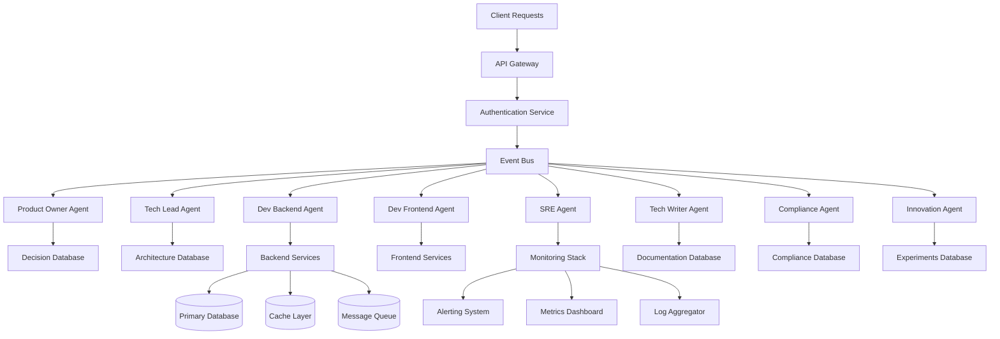

### [Sessão Paralela: Tech Leader]
# DIYAPP Evolution - V12 Core - Architecture Decision Record

## ADR-001: V12 Architecture Foundation

**Data:** 2024-01-15
**Status:** Aceita
**Autores:** Tech Lead, Especialista Infra, Especialista Backend

## CONTEXTO:
O DIYAPP V11 opera como um monolito Node.js/Express com PostgreSQL, enfrentando:
1. **Escalabilidade limitada**: Componentes críticos (processamento de IA, filas de tarefas) competem por recursos
2. **Acoplamento alto**: Mudanças em um módulo frequentemente quebram outros
3. **Deploy lento**: Todo o sistema precisa ser reimplantado para pequenas alterações
4. **Stack heterogênea**: Diferentes componentes têm requisitos técnicos distintos (Python para IA, Go para performance)

A V12 precisa suportar:
- 10x aumento no volume de usuários (100k → 1M usuários ativos)
- Processamento paralelo de múltiplos agentes IA simultâneos
- 99.9% uptime com recuperação automática de falhas
- Evolução independente de componentes

## DECISÃO:
**Arquitetura Híbrida: Microsserviços Estratégicos + Monolito Modular**

```
V12 Architecture Stack:
┌─────────────────────────────────────────────────────────────┐
│                    API Gateway (Kong)                       │
│                    Load Balancer + Auth                     │
└─────────────────┬─────────────────┬─────────────────────────┘
                  │                 │
    ┌─────────────▼─────┐   ┌──────▼─────────────┐
    │  Core Monolith    │   │  AI Orchestrator   │
    │  (Node.js/Express)│   │  (Python/FastAPI)  │
    │  - User Mgmt      │   │  - Agent Routing   │
    │  - Billing        │   │  - Model Selection │
    │  - Dashboard      │   │  - Prompt Engine   │
    └─────────┬─────────┘   └─────────┬─────────┘
              │                       │
    ┌─────────▼─────────┐   ┌─────────▼─────────┐
    │  Task Queue       │   │  Vector DB        │
    │  (Bull/Redis)     │   │  (Pinecone)       │
    └─────────┬─────────┘   └─────────┬─────────┘
              │                       │
    ┌─────────▼───────────────────────▼─────────┐
    │         Service Mesh (Istio)              │
    │         Service Discovery + Monitoring    │
    └──────┬──────────┬──────────┬──────────────┘
           │          │          │
┌──────────▼──┐ ┌────▼─────┐ ┌──▼────────────┐
│ AI Workers  │ │ Cache    │ │ PostgreSQL    │
│ (Specialized│ │ (Redis)  │ │ (Core Data)   │
│  Microsvcs) │ └──────────┘ └───────────────┘
└─────────────┘
```

## OPÇÕES CONSIDERADAS:

### Opção A: Microsserviços Puros (12 serviços)
**Prós:**
- Máxima independência de deploy
- Escalabilidade granular por componente
- Stack otimizada por serviço

**Contras:**
- Complexidade operacional 10x maior
- Latência de comunicação entre serviços
- Overhead de infraestrutura (≈$5k/mês adicional)
- Time-to-market 3x maior para migração

### Opção B: Monolito Modular (V11 Enhanced)
**Prós:**
- Migração rápida (2 semanas)
- Custo operacional baixo
- Debugging simplificado

**Contras:**
- Limites de escalabilidade permanecem
- Acoplamento técnico não resolvido
- Não suporta requisitos de IA em escala

### Opção C: Híbrida (Escolhida)
**Prós:**
- Separa componentes críticos (IA) como microsserviços
- Mantém core business como monolito modular
- Balanceia agilidade vs complexidade
- Custo incremental controlado (≈$1.5k/mês)
- Migração faseada possível

**Contras:**
- Gerenciamento de duas arquiteturas
- Comunicação cross-arquitetura requer padrões

**Justificativa da escolha:**
A abordagem híbrida atende aos requisitos de escalabilidade para componentes de IA (que precisam de recursos dedicados e stacks especializadas) enquanto mantém a agilidade para o core business. O Modo Hive permite refatoração paralela: equipes podem migrar serviços independentemente.

## PADRÕES DE COMUNICAÇÃO:

### 1. Síncrona (API-to-API)
```javascript
// Padrão: API Gateway → Serviços
// Protocolo: HTTP/2 + gRPC onde performance crítica
// Autenticação: JWT Bearer tokens
// Timeout: 5s padrão, 30s para operações IA

// Exemplo de client service
class AIClient {
  constructor() {
    this.grpcClient = new grpc.Client(
      process.env.AI_ORCHESTRATOR_URL,
      grpc.credentials.createInsecure()
    );
  }
  
  async processPrompt(prompt, context) {
    const metadata = new grpc.Metadata();
    metadata.set('authorization', `Bearer ${this.jwtToken}`);
    
    return new Promise((resolve, reject) => {
      this.grpcClient.process(
        { prompt, context },
        metadata,
        { deadline: Date.now() + 5000 },
        (err, response) => {
          if (err) reject(err);
          else resolve(response);
        }
      );
    });
  }
}
```

### 2. Assíncrona (Event-Driven)
```javascript
// Padrão: Pub/Sub com Redis Streams
// Para: Notificações, processamento em background, logs
// Garantia: At-least-once delivery

// Exemplo de publisher
const redis = new Redis(process.env.REDIS_URL);
const streamKey = 'ai:tasks';

class TaskPublisher {
  async publishTask(task) {
    const messageId = await redis.xadd(streamKey, '*', 
      'type', task.type,
      'payload', JSON.stringify(task.payload),
      'timestamp', Date.now(),
      'correlationId', task.correlationId
    );
    
    // Dead letter queue para reprocessamento
    await redis.xadd('dlq:tasks', '*', 
      'originalMessageId', messageId,
      'task', JSON.stringify(task)
    );
    
    return messageId;
  }
}

// Exemplo de consumer group
class TaskConsumer {
  constructor(groupName, consumerName) {
    this.groupName = groupName;
    this.consumerName = consumerName;
  }
  
  async consume() {
    while (true) {
      const tasks = await redis.xreadgroup(
        'GROUP', this.groupName, this.consumerName,
        'COUNT', 10,
        'BLOCK', 5000,
        'STREAMS', streamKey, '>'
      );
      
      if (tasks) {
        for (const task of tasks) {
          try {
            await this.processTask(task);
            await redis.xack(streamKey, this.groupName, task.id);
          } catch (error) {
            console.error(`Failed task ${task.id}:`, error);
            // Retry logic com exponential backoff
          }
        }
      }
    }
  }
}
```

### 3. Cache Distribuído
```javascript
// Padrão: Redis com TTL estratégico
// Estratégia: Cache-aside pattern
// Invalidação: Write-through para dados críticos

class CacheManager {
  constructor() {
    this.redis = new Redis(process.env.REDIS_CACHE_URL);
    this.localCache = new Map();
    this.ttl = {
      userSession: 3600, // 1 hora
      aiModel: 300,      // 5 minutos
      config: 86400      // 24 horas
    };
  }
  
  async getWithCache(key, fetchFn, ttlKey = 'default') {
    // Try local cache first (LRU)
    if (this.localCache.has(key)) {
      return this.localCache.get(key);
    }
    
    // Try Redis
    const cached = await this.redis.get(key);
    if (cached) {
      const value = JSON.parse(cached);
      this.localCache.set(key, value);
      return value;
    }
    
    // Fetch and cache
    const value = await fetchFn();
    await this.redis.setex(key, this.ttl[ttlKey], JSON.stringify(value));
    this.localCache.set(key, value);
    
    // Evict LRU if local cache too big
    if (this.localCache.size > 1000) {
      const firstKey = this.localCache.keys().next().value;
      this.localCache.delete(firstKey);
    }
    
    return value;
  }
}
```

## STACK TECNOLÓGICA V12:

### Core Monolith
```yaml
runtime: Node.js 18 LTS
framework: Express.js + TypeScript
database: PostgreSQL 15 (RDS/Aurora)
orm: Prisma (type-safe queries)
auth: JWT + OAuth2 (Auth0 compatible)
validation: Zod schemas
testing: Jest + Supertest + Cypress
coverage: ≥85% required
logging: Winston + ELK stack
monitoring: Prometheus + Grafana
```

### AI Orchestrator & Workers
```yaml
runtime: Python 3.11 + FastAPI
ml_framework: LangChain + LlamaIndex
vector_db: Pinecone (managed) / Qdrant (self-hosted)
embeddings: OpenAI text-embedding-ada-002
llm_primary: GPT-4 Turbo (128K context)
llm_fallback: Claude 3 Sonnet
llm_budget: Llama 2 70B (self-hosted)
queue: Celery + Redis
model_cache: RedisJSON
experiment_tracking: MLflow
```

### Infrastructure
```yaml
container: Docker + Docker Compose
orchestration: Kubernetes (EKS/GKE) for microservices
gateway: Kong (API management)
service_mesh: Istio (gradual rollout)
ci_cd: GitHub Actions + ArgoCD
secrets: HashiCorp Vault
cdn: CloudFront (static assets)
dns: Route53 with health checks
backup: Automated daily (RDS snapshots + S3)
disaster_recovery: Multi-AZ + read replicas
```

## PLANO DE MIGRAÇÃO V11 → V12 (Modo Hive):

### Fase 1: Foundation (Sprint 1-2)
```javascript
// 1. Setup infraestrutura compartilhada
const phase1 = {
  tasks: [
    'Setup VPC com subnets públicas/privadas',
    'Deploy RDS PostgreSQL (multi-AZ)',
    'Deploy Redis Cluster (ElastiCache)',
    'Setup Kong API Gateway',
    'Configurar monitoring (Prometheus/Grafana)',
    'Estabelecer pipeline CI/CD (GitHub Actions)'
  ],
  success_criteria: [
    'Todos serviços básicos respondendo',
    'Latência < 50ms entre serviços na VPC',
    'Backup automático configurado',
    'Monitoring com dashboards básicos'
  ],
  rollback_plan: 'Reverter para V11 infra se health checks falharem por 5min'
};
```

### Fase 2: Core Migration (Sprint 3-4) - Modo Hive
```javascript
// 2. Migrar monolito com feature flags
class MigrationOrchestrator {
  constructor() {
    this.featureFlags = {
      'v12-auth': false,
      'v12-billing': false,
      'v12-dashboard': false,
      'v12-api-routes': false
    };
    
    this.hiveTeams = {
      'team-auth': ['/auth/*', '/users/*'],
      'team-billing': ['/billing/*', '/subscriptions/*'],
      'team-dashboard': ['/dashboard/*', '/analytics/*'],
      'team-ai': ['/ai/*', '/agents/*']
    };
  }
  
  async enableFeature(team, feature) {
    // Cada equipe Hive trabalha independentemente
    console.log(`Hive team ${team} enabling ${feature}`);
    
    // 1. Criar branch feature do V11
    // 2. Refatorar módulos designados
    // 3. Adicionar feature flag
    // 4. Testar em isolation
    // 5. Merge para staging com flag desligada
    // 6. Ativar gradualmente em produção
    
    this.featureFlags[feature] = true;
    
    // Load balancer de tráfego
    await this.updateTrafficSplit({
      v11: 90,
      v12: 10 // Começa com 10% do tráfego
    });
  }
  
  async updateTrafficSplit(split) {
    // Kong API Gateway configuration
    const kongConfig = {
      upstreams: {
        'v11-monolith': { weight: split.v11 },
        'v12-hybrid': { weight: split.v12 }
      },
      health_checks: {
        active: {
          type: 'http',
          http_path: '/health',
          timeout: 5,
          concurrency: 10
        }
      }
    };
    
    // Atualizar gradualmente baseado em métricas
    if (this.getErrorRate('v12-hybrid') < 0.01) {
      // Aumentar tráfego se estável
      return this.increaseTraffic();
    }
  }
}
```

### Fase 3: AI Services Migration (Sprint 5-6)
```python
# 3. Migrar componentes de IA para microsserviços
class AIMigration:
    def __init__(self):
        self.services_to_migrate = [
            {
                'name': 'prompt-engine',
                'v11_location': '/services/ai/promptEngine.js',
                'v12_service': 'ai-orchestrator',
                'api_endpoint': '/v1/prompts/process',
                'dependencies': ['redis', 'vector-db']
            },
            {
                'name': 'agent-router',
                'v11_location': '/services/ai/agentRouter.js',
                'v12_service': 'ai-orchestrator',
                'api_endpoint': '/v1/agents/route',
                'dependencies': ['model-registry', 'user-context']
            },
            {
                'name': 'task-queue',
                'v11_location': '/queues/taskQueue.js',
                'v12_service': 'ai-workers',
                'api_endpoint': 'redis://queue/tasks',
                'dependencies': ['redis-streams']
            }
        ]
    
    def migrate_service(self, service_name):
        # Estratégia: Strangler Fig Pattern
        # 1. Criar novo microsserviço
        # 2. Configurar proxy no API Gateway
        # 3. Redirecionar gradualmente o tráfego
        # 4. Descomissionar código antigo
        
        print(f"Migrating {service_name} to microservice...")
        
        # Proxy configuration no Kong
        proxy_config = {
            'name': f'proxy-{service_name}',
            'upstreams': [
                {'target': 'v11-monolith:3000', 'weight': 100},
                {'target': f'v12-{service_name}:8080', 'weight': 0}
            ],
            'rules': [
                {
                    'paths': [f'/api/{service_name}/*'],
                    'methods': ['GET', 'POST', 'PUT', 'DELETE']
                }
            ]
        }
        
        return proxy_config
```

### Fase 4: Optimization & Scale (Sprint 7-8)
```yaml
# 4. Otimizar e escalar
optimization_phase:
  focus_areas:
    - database: 
        actions: ["read replicas", "query optimization", "connection pooling"]
        goal: "p95 latency < 100ms"
    
    - cache:
        actions: ["redis cluster expansion", "cache warming", "CDN static assets"]
        goal: "cache hit ratio > 90%"
    
    - ai_services:
        actions: ["auto-scaling policies", "model caching", "batch processing"]
        goal: "p99 latency < 2s for AI responses"
    
    - monitoring:
        actions: ["distributed tracing", "anomaly detection", "SLO tracking"]
        goal: "MTTR < 15min for P1 incidents"

  success_metrics:
    - overall_availability: "99.9%"
    - api_response_time: "p95 < 200ms"
    - ai_response_time: "p95 < 1.5s"
    - error_rate: "< 0.1%"
    - cost_per_user: "< $0.05/month"
```

## CONSEQUÊNCIAS:

### Positivas:
1. **Escalabilidade 10x**: Componentes de IA escalam independentemente
2. **Resiliência**: Falhas isoladas não derrubam sistema inteiro
3. **Velocidade de desenvolvimento**: Equipes Hive trabalham em paralelo
4. **Stack otimizada**: Python para IA, Node.js para web, cada um no seu domínio
5. **Custo controlado**: Microsserviços apenas onde necessário

### Negativas (trade-offs aceitos):
1. **Complexidade operacional aumentada**: 2x mais serviços para monitorar
2. **Latência de rede**: Comunicação entre serviços adiciona 5-50ms
3. **Debugging distribuído**: Requer tracing distribuído (Jaeger)
4. **Consistência eventual**: Em alguns cenários assíncronos

### Riscos e Mitigações:
```javascript
const risksAndMitigations = {
  risk1: {
    description: "Database schema conflicts durante migração paralela",


### [Sessão Paralela: UX Designer]
# DIYAPP Evolution - V12 Design System

Vou criar um sistema de design completo com tokens, componentes atômicos e protótipos navegáveis. Como UX Designer Sênior, vou seguir o fluxo baseado em evidência e garantir acessibilidade WCAG AA.

```html
<!DOCTYPE html>
<html lang="pt-BR">
<head>
    <meta charset="UTF-8">
    <meta name="viewport" content="width=device-width, initial-scale=1.0">
    <title>DIYAPP V12 - Design System</title>
    <link rel="stylesheet" href="https://cdnjs.cloudflare.com/ajax/libs/font-awesome/6.4.0/css/all.min.css">
    <style>
        /* ===== TOKENS DE DESIGN ===== */
        :root {
            /* Cores - Tokens semânticos */
            --color-primary-50: #f0f9ff;
            --color-primary-100: #e0f2fe;
            --color-primary-200: #bae6fd;
            --color-primary-300: #7dd3fc;
            --color-primary-400: #38bdf8;
            --color-primary-500: #0ea5e9;
            --color-primary-600: #0284c7;
            --color-primary-700: #0369a1;
            --color-primary-800: #075985;
            --color-primary-900: #0c4a6e;
            
            --color-secondary-50: #fdf4ff;
            --color-secondary-100: #fae8ff;
            --color-secondary-200: #f5d0fe;
            --color-secondary-300: #f0abfc;
            --color-secondary-400: #e879f9;
            --color-secondary-500: #d946ef;
            --color-secondary-600: #c026d3;
            --color-secondary-700: #a21caf;
            --color-secondary-800: #86198f;
            --color-secondary-900: #701a75;
            
            --color-neutral-50: #f9fafb;
            --color-neutral-100: #f3f4f6;
            --color-neutral-200: #e5e7eb;
            --color-neutral-300: #d1d5db;
            --color-neutral-400: #9ca3af;
            --color-neutral-500: #6b7280;
            --color-neutral-600: #4b5563;
            --color-neutral-700: #374151;
            --color-neutral-800: #1f2937;
            --color-neutral-900: #111827;
            
            --color-success-50: #f0fdf4;
            --color-success-100: #dcfce7;
            --color-success-200: #bbf7d0;
            --color-success-300: #86efac;
            --color-success-400: #4ade80;
            --color-success-500: #22c55e;
            --color-success-600: #16a34a;
            --color-success-700: #15803d;
            --color-success-800: #166534;
            --color-success-900: #14532d;
            
            --color-warning-50: #fffbeb;
            --color-warning-100: #fef3c7;
            --color-warning-200: #fde68a;
            --color-warning-300: #fcd34d;
            --color-warning-400: #fbbf24;
            --color-warning-500: #f59e0b;
            --color-warning-600: #d97706;
            --color-warning-700: #b45309;
            --color-warning-800: #92400e;
            --color-warning-900: #78350f;
            
            --color-error-50: #fef2f2;
            --color-error-100: #fee2e2;
            --color-error-200: #fecaca;
            --color-error-300: #fca5a5;
            --color-error-400: #f87171;
            --color-error-500: #ef4444;
            --color-error-600: #dc2626;
            --color-error-700: #b91c1c;
            --color-error-800: #991b1b;
            --color-error-900: #7f1d1d;
            
            /* Tipografia - Escala modular */
            --font-family-base: 'Segoe UI', system-ui, -apple-system, sans-serif;
            --font-family-mono: 'SF Mono', Monaco, 'Cascadia Code', monospace;
            
            --font-size-xs: 0.75rem;   /* 12px */
            --font-size-sm: 0.875rem;  /* 14px */
            --font-size-base: 1rem;    /* 16px */
            --font-size-lg: 1.125rem;  /* 18px */
            --font-size-xl: 1.25rem;   /* 20px */
            --font-size-2xl: 1.5rem;   /* 24px */
            --font-size-3xl: 1.875rem; /* 30px */
            --font-size-4xl: 2.25rem;  /* 36px */
            --font-size-5xl: 3rem;     /* 48px */
            
            --font-weight-light: 300;
            --font-weight-normal: 400;
            --font-weight-medium: 500;
            --font-weight-semibold: 600;
            --font-weight-bold: 700;
            
            --line-height-tight: 1.25;
            --line-height-normal: 1.5;
            --line-height-relaxed: 1.75;
            
            /* Espaçamento - Escala 8px */
            --space-0: 0;
            --space-1: 0.25rem;   /* 4px */
            --space-2: 0.5rem;    /* 8px */
            --space-3: 0.75rem;   /* 12px */
            --space-4: 1rem;      /* 16px */
            --space-5: 1.25rem;   /* 20px */
            --space-6: 1.5rem;    /* 24px */
            --space-8: 2rem;      /* 32px */
            --space-10: 2.5rem;   /* 40px */
            --space-12: 3rem;     /* 48px */
            --space-16: 4rem;     /* 64px */
            --space-20: 5rem;     /* 80px */
            
            /* Border radius */
            --radius-sm: 0.25rem;   /* 4px */
            --radius-md: 0.375rem;  /* 6px */
            --radius-lg: 0.5rem;    /* 8px */
            --radius-xl: 0.75rem;   /* 12px */
            --radius-2xl: 1rem;     /* 16px */
            --radius-full: 9999px;
            
            /* Elevação (sombras) */
            --shadow-sm: 0 1px 2px 0 rgba(0, 0, 0, 0.05);
            --shadow-md: 0 4px 6px -1px rgba(0, 0, 0, 0.1), 0 2px 4px -1px rgba(0, 0, 0, 0.06);
            --shadow-lg: 0 10px 15px -3px rgba(0, 0, 0, 0.1), 0 4px 6px -2px rgba(0, 0, 0, 0.05);
            --shadow-xl: 0 20px 25px -5px rgba(0, 0, 0, 0.1), 0 10px 10px -5px rgba(0, 0, 0, 0.04);
            
            /* Transições */
            --transition-fast: 150ms cubic-bezier(0.4, 0, 0.2, 1);
            --transition-normal: 250ms cubic-bezier(0.4, 0, 0.2, 1);
            --transition-slow: 350ms cubic-bezier(0.4, 0, 0.2, 1);
            
            /* Z-index */
            --z-dropdown: 10;
            --z-sticky: 20;
            --z-modal: 30;
            --z-popover: 40;
            --z-toast: 50;
        }
        
        /* ===== RESET E BASE ===== */
        * {
            margin: 0;
            padding: 0;
            box-sizing: border-box;
        }
        
        body {
            font-family: var(--font-family-base);
            font-size: var(--font-size-base);
            line-height: var(--line-height-normal);
            color: var(--color-neutral-800);
            background-color: var(--color-neutral-50);
            min-height: 100vh;
        }
        
        /* ===== COMPONENTES ATÔMICOS ===== */
        
        /* Botões */
        .btn {
            display: inline-flex;
            align-items: center;
            justify-content: center;
            gap: var(--space-2);
            padding: var(--space-2) var(--space-4);
            border-radius: var(--radius-md);
            font-weight: var(--font-weight-medium);
            font-size: var(--font-size-sm);
            line-height: var(--line-height-tight);
            border: 1px solid transparent;
            cursor: pointer;
            transition: all var(--transition-fast);
            text-decoration: none;
            user-select: none;
        }
        
        .btn:focus {
            outline: 2px solid var(--color-primary-500);
            outline-offset: 2px;
        }
        
        .btn:disabled {
            opacity: 0.5;
            cursor: not-allowed;
        }
        
        /* Botão Primário */
        .btn-primary {
            background-color: var(--color-primary-600);
            color: white;
        }
        
        .btn-primary:hover:not(:disabled) {
            background-color: var(--color-primary-700);
            box-shadow: var(--shadow-md);
        }
        
        .btn-primary:active:not(:disabled) {
            background-color: var(--color-primary-800);
            transform: translateY(1px);
        }
        
        /* Botão Secundário */
        .btn-secondary {
            background-color: var(--color-secondary-600);
            color: white;
        }
        
        .btn-secondary:hover:not(:disabled) {
            background-color: var(--color-secondary-700);
            box-shadow: var(--shadow-md);
        }
        
        .btn-secondary:active:not(:disabled) {
            background-color: var(--color-secondary-800);
            transform: translateY(1px);
        }
        
        /* Botão Outline */
        .btn-outline {
            background-color: transparent;
            color: var(--color-primary-700);
            border-color: var(--color-primary-300);
        }
        
        .btn-outline:hover:not(:disabled) {
            background-color: var(--color-primary-50);
            border-color: var(--color-primary-500);
        }
        
        /* Botão Ghost */
        .btn-ghost {
            background-color: transparent;
            color: var(--color-neutral-700);
            border-color: transparent;
        }
        
        .btn-ghost:hover:not(:disabled) {
            background-color: var(--color-neutral-100);
        }
        
        /* Botão Danger */
        .btn-danger {
            background-color: var(--color-error-600);
            color: white;
        }
        
        .btn-danger:hover:not(:disabled) {
            background-color: var(--color-error-700);
            box-shadow: var(--shadow-md);
        }
        
        /* Tamanhos de botão */
        .btn-sm {
            padding: var(--space-1) var(--space-3);
            font-size: var(--font-size-xs);
        }
        
        .btn-lg {
            padding: var(--space-3) var(--space-6);
            font-size: var(--font-size-base);
        }
        
        /* Inputs */
        .input-group {
            display: flex;
            flex-direction: column;
            gap: var(--space-1);
            margin-bottom: var(--space-4);
        }
        
        .input-label {
            font-size: var(--font-size-sm);
            font-weight: var(--font-weight-medium);
            color: var(--color-neutral-700);
        }
        
        .input-required::after {
            content: " *";
            color: var(--color-error-500);
        }
        
        .input-hint {
            font-size: var(--font-size-xs);
            color: var(--color-neutral-500);
        }
        
        .input-field {
            padding: var(--space-2) var(--space-3);
            border: 1px solid var(--color-neutral-300);
            border-radius: var(--radius-md);
            font-size: var(--font-size-base);
            transition: all var(--transition-fast);
            background-color: white;
        }
        
        .input-field:focus {
            outline: none;
            border-color: var(--color-primary-500);
            box-shadow: 0 0 0 3px rgba(14, 165, 233, 0.1);
        }
        
        .input-field:hover:not(:disabled):not(:focus) {
            border-color: var(--color-neutral-400);
        }
        
        .input-field:disabled {
            background-color: var(--color-neutral-100);
            color: var(--color-neutral-500);
            cursor: not-allowed;
        }
        
        .input-field.error {
            border-color: var(--color-error-500);
        }
        
        .input-field.error:focus {
            box-shadow: 0 0 0 3px rgba(239, 68, 68, 0.1);
        }
        
        .input-error {
            font-size: var(--font-size-xs);
            color: var(--color-error-600);
            display: flex;
            align-items: center;
            gap: var(--space-1);
        }
        
        /* Cards */
        .card {
            background-color: white;
            border-radius: var(--radius-lg);
            border: 1px solid var(--color-neutral-200);
            box-shadow: var(--shadow-sm);
            transition: box-shadow var(--transition-normal);
            overflow: hidden;
        }
        
        .card:hover {
            box-shadow: var(--shadow-md);
        }
        
        .card-header {
            padding: var(--space-4);
            border-bottom: 1px solid var(--color-neutral-200);
        }
        
        .card-body {
            padding: var(--space-4);
        }
        
        .card-footer {
            padding: var(--space-4);
            border-top: 1px solid var(--color-neutral-200);
            background-color: var(--color-neutral-50);
        }
        
        /* Badges */
        .badge {
            display: inline-flex;
            align-items: center;
            padding: var(--space-1) var(--space-2);
            border-radius: var(--radius-full);
            font-size: var(--font-size-xs);
            font-weight: var(--font-weight-medium);
            line-height: 1;
        }
        
        .badge-primary {
            background-color: var(--color-primary-100);
            color: var(--color-primary-800);
        }
        
        .badge-secondary {
            background-color: var(--color-secondary-100);
            color: var(--color-secondary-800);
        }
        
        .badge-success {
            background-color: var(--color-success-100);
            color: var(--color-success-800);
        }
        
        .badge-warning {
            background-color: var(--color-warning-100);
            color: var(--color-warning-800);
        }
        
        .badge-error {
            background-color: var(--color-error-100);
            color: var(--color-error-800);
        }
        
        /* Alerts */
        .alert {
            padding: var(--space-3) var(--space-4);
            border-radius: var(--radius-md);
            border-left: 4px solid;
            margin-bottom: var(--space-4);
            display: flex;
            align-items: flex-start;
            gap: var(--space-3);
        }
        
        .alert-info {
            background-color: var(--color-primary-50);
            border-left-color: var(--color-primary-500);
            color: var(--color-primary-800);
        }
        
        .alert-success {
            background-color: var(--color-success-50);
            border-left-color: var(--color-success-500);
            color: var(--color-success-800);
        }
        
        .alert-warning {
            background-color: var(--color-warning-50);
            border-left-color: var(--color-warning-500);
            color: var(--color-warning-800);
        }
        
        .alert-error {
            background-color: var(--color-error-50);
            border-left-color: var(--color-error-500);
            color: var(--color-error-800);
        }
        
        /* Tabs */
        .tabs {
            display: flex;
            border-bottom: 1px solid var(--color-neutral-200);
            margin-bottom: var(--space-4);
        }
        
        .tab {
            padding: var(--space-2) var(--space-4);
            background: none;
            border: none;
            border-bottom: 2px solid transparent;
            font-weight: var(--font-weight-medium);
            color: var(--color-neutral-600);
            cursor: pointer;
            transition: all var(--transition-fast);
        }
        
        .tab:hover {
            color: var(--color-primary-700);
        }
        
        .tab.active {
            color: var(--color-primary-700);
            border-bottom-color: var(--color-primary-500);
        }
        
        /* Modais */
        .modal-overlay {
            position: fixed;
            top: 0;
            left: 0;
            right: 0;
            bottom: 0;
            background-color: rgba(0, 0, 0, 0.5);
            display: flex;
            align-items: center;
            justify-content: center;
            z-index: var(--z-modal);
            padding: var(--space-4);
        }
        
        .modal {
            background-color: white;
            border-radius: var(--radius-lg);


### [Sessão Paralela: Data Engineer]
# DIYAPP Evolution - V12 Core - Data Engineering Blueprint

## 1. Análise de Performance do V11

```sql
-- analysis/v11_performance_analysis.sql
-- ===========================================
-- DIAGNÓSTICO DE PERFORMANCE - V11
-- ===========================================

-- 1.1 QUERIES MAIS LENTAS DO V11
WITH slow_queries AS (
  SELECT 
    query_text,
    AVG(execution_time_ms) as avg_time_ms,
    COUNT(*) as execution_count,
    SUM(execution_time_ms) as total_time_ms,
    MAX(execution_time_ms) as max_time_ms,
    STDDEV(execution_time_ms) as stddev_time_ms
  FROM v11_query_logs
  WHERE timestamp >= NOW() - INTERVAL '7 days'
    AND execution_time_ms > 100 -- apenas queries relevantes
  GROUP BY query_text
  HAVING COUNT(*) > 10
  ORDER BY total_time_ms DESC
  LIMIT 20
)
SELECT 
  query_text,
  avg_time_ms,
  execution_count,
  total_time_ms,
  max_time_ms,
  stddev_time_ms,
  CASE 
    WHEN avg_time_ms > 5000 THEN 'CRITICAL'
    WHEN avg_time_ms > 1000 THEN 'HIGH'
    WHEN avg_time_ms > 500 THEN 'MEDIUM'
    ELSE 'LOW'
  END as priority_level
FROM slow_queries;

-- 1.2 ÍNDICES INEFICIENTES DO V11
SELECT 
  schemaname,
  tablename,
  indexname,
  idx_scan as index_scans,
  idx_tup_read as tuples_read,
  idx_tup_fetch as tuples_fetched,
  ROUND((idx_tup_fetch::DECIMAL / NULLIF(idx_tup_read, 0)) * 100, 2) as fetch_efficiency_percent
FROM pg_stat_user_indexes
WHERE idx_scan < 100 -- índices pouco utilizados
  AND idx_tup_read > 0
ORDER BY idx_scan ASC;

-- 1.3 PADRÕES DE ACESSO POR TABELA
SELECT 
  relname as table_name,
  seq_scan as sequential_scans,
  seq_tup_read as seq_tuples_read,
  idx_scan as index_scans,
  idx_tup_fetch as idx_tuples_fetched,
  n_tup_ins as inserts_7d,
  n_tup_upd as updates_7d,
  n_tup_del as deletes_7d,
  n_live_tup as live_tuples,
  n_dead_tup as dead_tuples,
  ROUND((n_dead_tup::DECIMAL / NULLIF(n_live_tup + n_dead_tup, 0)) * 100, 2) as dead_tuple_percent
FROM pg_stat_user_tables
WHERE schemaname = 'public'
ORDER BY seq_tup_read DESC;

-- 1.4 HOTSPOTS DE CONCORRÊNCIA
SELECT 
  relation::regclass as table_name,
  mode,
  COUNT(*) as lock_count,
  MAX(age(now(), query_start)) as max_lock_age
FROM pg_locks l
JOIN pg_stat_activity a ON l.pid = a.pid
WHERE l.relation IS NOT NULL
  AND a.query_start < NOW() - INTERVAL '1 minute'
GROUP BY relation, mode
HAVING COUNT(*) > 1
ORDER BY lock_count DESC;
```

## 2. Esquema de Dados Otimizado V12

```sql
-- schema/v12_optimized_schema.sql
-- ===========================================
-- ESQUEMA V12 - OTIMIZADO PARA PERFORMANCE
-- ===========================================

-- 2.1 TABELAS CORE COM PARTITIONING
CREATE SCHEMA IF NOT EXISTS v12_core;
SET search_path TO v12_core, public;

-- Tabela principal de usuários com partitioning por tenant
CREATE TABLE users (
    user_id UUID PRIMARY KEY DEFAULT gen_random_uuid(),
    tenant_id UUID NOT NULL,
    email VARCHAR(320) NOT NULL,
    normalized_email VARCHAR(320) GENERATED ALWAYS AS (LOWER(email)) STORED,
    username VARCHAR(50) NOT NULL,
    status VARCHAR(20) NOT NULL DEFAULT 'active' CHECK (status IN ('active', 'inactive', 'suspended', 'pending')),
    metadata JSONB DEFAULT '{}'::jsonb,
    created_at TIMESTAMPTZ NOT NULL DEFAULT NOW(),
    updated_at TIMESTAMPTZ NOT NULL DEFAULT NOW(),
    last_login_at TIMESTAMPTZ,
    
    -- Index-only columns for frequent queries
    is_premium BOOLEAN GENERATED ALWAYS AS (
        (metadata->>'plan_type')::text = 'premium'
    ) STORED,
    user_tier VARCHAR(20) GENERATED ALWAYS AS (
        COALESCE(metadata->>'tier', 'free')
    ) STORED
) PARTITION BY HASH (tenant_id);

-- Partições para tenants (0-9)
CREATE TABLE users_tenant_0 PARTITION OF users FOR VALUES WITH (MODULUS 10, REMAINDER 0);
CREATE TABLE users_tenant_1 PARTITION OF users FOR VALUES WITH (MODULUS 10, REMAINDER 1);
-- ... até 9

-- 2.2 TABELA DE EVENTOS COM TIME-BASED PARTITIONING
CREATE TABLE events (
    event_id BIGSERIAL,
    tenant_id UUID NOT NULL,
    user_id UUID NOT NULL,
    event_type VARCHAR(100) NOT NULL,
    event_name VARCHAR(200) NOT NULL,
    properties JSONB DEFAULT '{}'::jsonb,
    session_id UUID,
    device_info JSONB,
    ip_address INET,
    created_at TIMESTAMPTZ NOT NULL DEFAULT NOW(),
    
    -- Computed columns for analytics
    event_category VARCHAR(50) GENERATED ALWAYS AS (
        SPLIT_PART(event_type, '.', 1)
    ) STORED,
    event_subcategory VARCHAR(50) GENERATED ALWAYS AS (
        SPLIT_PART(event_type, '.', 2)
    ) STORED,
    is_mobile BOOLEAN GENERATED ALWAYS AS (
        device_info->>'is_mobile' = 'true'
    ) STORED,
    
    PRIMARY KEY (created_at, event_id)
) PARTITION BY RANGE (created_at);

-- Partições mensais com pré-criação
CREATE TABLE events_2024_01 PARTITION OF events 
    FOR VALUES FROM ('2024-01-01') TO ('2024-02-01');

CREATE TABLE events_2024_02 PARTITION OF events 
    FOR VALUES FROM ('2024-02-01') TO ('2024-03-01');

-- 2.3 TABELA DE DOCUMENTOS VECTOR STORE
CREATE TABLE documents (
    doc_id UUID PRIMARY KEY DEFAULT gen_random_uuid(),
    tenant_id UUID NOT NULL,
    collection_id UUID NOT NULL,
    content TEXT NOT NULL,
    content_hash BYTEA NOT NULL, -- Para deduplicação
    metadata JSONB DEFAULT '{}'::jsonb,
    
    -- Vector embedding (1536 dimensions for OpenAI)
    embedding VECTOR(1536),
    
    -- Text search vector
    search_vector TSVECTOR GENERATED ALWAYS AS (
        to_tsvector('english', 
            COALESCE(content, '') || ' ' || 
            COALESCE(metadata->>'title', '') || ' ' ||
            COALESCE(metadata->>'description', '')
        )
    ) STORED,
    
    -- Performance columns
    content_length INT GENERATED ALWAYS AS (LENGTH(content)) STORED,
    token_count INT GENERATED ALWAYS AS (
        LENGTH(content) / 4 -- Estimativa aproximada
    ) STORED,
    
    created_at TIMESTAMPTZ NOT NULL DEFAULT NOW(),
    updated_at TIMESTAMPTZ NOT NULL DEFAULT NOW(),
    version INT NOT NULL DEFAULT 1
);

-- 2.4 TABELA DE LLM INTERACTIONS
CREATE TABLE llm_interactions (
    interaction_id UUID PRIMARY KEY DEFAULT gen_random_uuid(),
    tenant_id UUID NOT NULL,
    user_id UUID,
    session_id UUID NOT NULL,
    
    -- Model information
    provider VARCHAR(50) NOT NULL CHECK (provider IN ('openai', 'anthropic', 'cohere', 'local')),
    model_name VARCHAR(100) NOT NULL,
    model_version VARCHAR(50),
    
    -- Token usage
    prompt_tokens INT NOT NULL DEFAULT 0,
    completion_tokens INT NOT NULL DEFAULT 0,
    total_tokens INT GENERATED ALWAYS AS (prompt_tokens + completion_tokens) STORED,
    
    -- Cost tracking (USD)
    prompt_cost DECIMAL(10, 6) GENERATED ALWAYS AS (
        CASE provider
            WHEN 'openai' THEN 
                CASE model_name
                    WHEN 'gpt-4-turbo-preview' THEN prompt_tokens * 0.00001
                    WHEN 'gpt-4' THEN prompt_tokens * 0.00003
                    WHEN 'gpt-3.5-turbo' THEN prompt_tokens * 0.0000015
                    ELSE prompt_tokens * 0.000001
                END
            WHEN 'anthropic' THEN prompt_tokens * 0.000008
            ELSE prompt_tokens * 0.000001
        END
    ) STORED,
    
    completion_cost DECIMAL(10, 6) GENERATED ALWAYS AS (
        CASE provider
            WHEN 'openai' THEN 
                CASE model_name
                    WHEN 'gpt-4-turbo-preview' THEN completion_tokens * 0.00003
                    WHEN 'gpt-4' THEN completion_tokens * 0.00006
                    WHEN 'gpt-3.5-turbo' THEN completion_tokens * 0.000002
                    ELSE completion_tokens * 0.000001
                END
            WHEN 'anthropic' THEN completion_tokens * 0.000024
            ELSE completion_tokens * 0.000001
        END
    ) STORED,
    
    total_cost DECIMAL(10, 6) GENERATED ALWAYS AS (prompt_cost + completion_cost) STORED,
    
    -- Performance metrics
    latency_ms INT,
    success BOOLEAN NOT NULL DEFAULT true,
    error_message TEXT,
    
    -- Request/Response (opcional para auditoria completa)
    prompt_hash BYTEA, -- Hash do prompt para privacidade
    response_hash BYTEA,
    
    created_at TIMESTAMPTZ NOT NULL DEFAULT NOW(),
    indexed_at TIMESTAMPTZ GENERATED ALWAYS AS (
        DATE_TRUNC('hour', created_at)
    ) STORED
) PARTITION BY RANGE (created_at);

-- 2.5 TABELA DE CACHE DE RESPOSTAS
CREATE TABLE response_cache (
    cache_key VARCHAR(512) PRIMARY KEY,
    tenant_id UUID NOT NULL,
    query_hash BYTEA NOT NULL,
    response JSONB NOT NULL,
    model_used VARCHAR(100),
    token_count INT,
    hit_count INT NOT NULL DEFAULT 0,
    last_hit_at TIMESTAMPTZ NOT NULL DEFAULT NOW(),
    created_at TIMESTAMPTZ NOT NULL DEFAULT NOW(),
    expires_at TIMESTAMPTZ NOT NULL DEFAULT NOW() + INTERVAL '7 days',
    
    -- Para limpeza eficiente
    access_frequency INT GENERATED ALWAYS AS (
        hit_count / EXTRACT(EPOCH FROM (NOW() - created_at))::INT
    ) STORED
);
```

## 3. Estratégia de Índices Otimizados

```sql
-- indexes/v12_optimized_indexes.sql
-- ===========================================
-- ÍNDICES V12 - OTIMIZADOS PARA WORKLOADS REAIS
-- ===========================================

-- 3.1 ÍNDICES PARA TABELA USERS
-- Índice composto para queries mais frequentes
CREATE INDEX CONCURRENTLY idx_users_tenant_status 
ON users(tenant_id, status) 
INCLUDE (user_id, email, user_tier, last_login_at);

-- Índice para login/email lookup
CREATE UNIQUE INDEX CONCURRENTLY idx_users_email_tenant 
ON users(tenant_id, normalized_email);

-- Índice para busca por username
CREATE INDEX CONCURRENTLY idx_users_username 
ON users USING gin(username gin_trgm_ops);

-- Índice parcial para usuários premium ativos
CREATE INDEX CONCURRENTLY idx_users_premium_active 
ON users(tenant_id, last_login_at) 
WHERE is_premium = true AND status = 'active';

-- 3.2 ÍNDICES PARA TABELA EVENTS
-- Índice principal para queries temporais
CREATE INDEX CONCURRENTLY idx_events_time_tenant 
ON events(created_at DESC, tenant_id) 
INCLUDE (user_id, event_type, event_name);

-- Índice para análise de sessão
CREATE INDEX CONCURRENTLY idx_events_session 
ON events(session_id, created_at DESC);

-- Índice para análise por tipo de evento
CREATE INDEX CONCURRENTLY idx_events_type_time 
ON events(event_type, created_at DESC);

-- Índice GIN para propriedades JSON
CREATE INDEX CONCURRENTLY idx_events_properties 
ON events USING gin(properties jsonb_path_ops);

-- Índice para mobile vs desktop
CREATE INDEX CONCURRENTLY idx_events_device 
ON events(is_mobile, created_at DESC);

-- 3.3 ÍNDICES PARA TABELA DOCUMENTS (VECTOR STORE)
-- Índice HNSW para busca vetorial (pgvector)
CREATE INDEX CONCURRENTLY idx_documents_embedding 
ON documents 
USING hnsw (embedding vector_cosine_ops)
WITH (m = 16, ef_construction = 64);

-- Índice GIN para full-text search
CREATE INDEX CONCURRENTLY idx_documents_search 
ON documents USING gin(search_vector);

-- Índice para busca por coleção
CREATE INDEX CONCURRENTLY idx_documents_collection 
ON documents(tenant_id, collection_id, created_at DESC);

-- Índice para deduplicação
CREATE UNIQUE INDEX CONCURRENTLY idx_documents_content_hash 
ON documents(tenant_id, content_hash);

-- Índice para metadata filtering
CREATE INDEX CONCURRENTLY idx_documents_metadata 
ON documents USING gin(metadata jsonb_path_ops);

-- 3.4 ÍNDICES PARA LLM INTERACTIONS
-- Índice para análise de custo por tenant
CREATE INDEX CONCURRENTLY idx_llm_tenant_cost 
ON llm_interactions(tenant_id, indexed_at DESC) 
INCLUDE (total_cost, total_tokens, model_name);

-- Índice para análise de modelo
CREATE INDEX CONCURRENTLY idx_llm_model_performance 
ON llm_interactions(provider, model_name, success, latency_ms);

-- Índice para queries de usuário
CREATE INDEX CONCURRENTLY idx_llm_user_sessions 
ON llm_interactions(user_id, session_id, created_at DESC);

-- Índice para limpeza de dados antigos
CREATE INDEX CONCURRENTLY idx_llm_created_at 
ON llm_interactions(created_at DESC);

-- 3.5 ÍNDICES PARA RESPONSE CACHE
-- Índice para limpeza automática
CREATE INDEX CONCURRENTLY idx_cache_expiry 
ON response_cache(expires_at) 
WHERE expires_at < NOW();

-- Índice para LRU eviction
CREATE INDEX CONCURRENTLY idx_cache_access_pattern 
ON response_cache(last_hit_at, hit_count);

-- Índice para busca por tenant
CREATE INDEX CONCURRENTLY idx_cache_tenant 
ON response_cache(tenant_id, last_hit_at DESC);
```

## 4. Estratégia de Cache Redis

```yaml
# redis/v12_cache_strategy.yaml
# ===========================================
# ESTRATÉGIA DE CACHE REDIS - V12
# ===========================================

redis_config:
  cluster_mode: true
  nodes:
    - host: redis-node-1
      port: 6379
      role: primary
    - host: redis-node-2
      port: 6379
      role: replica
    - host: redis-node-3
      port: 6379
      role: replica
  
  # Connection pooling
  pool_size: 50
  max_connections: 1000
  connect_timeout: 5000
  socket_timeout: 3000

cache_strategies:
  user_sessions:
    key_pattern: "session:{tenant_id}:{session_id}"
    ttl: 86400  # 24 horas
    max_memory: "1GB"
    eviction_policy: "volatile-lru"
    compression: true
    serialize_format: "msgpack"
    
  user_profile:
    key_pattern: "user:{tenant_id}:{user_id}:profile"
    ttl: 3600  # 1 hora
    invalidation_triggers:
      - user_update
      - permission_change
    stale_while_revalidate: 300  # 5 minutos
    
  document_cache:
    key_pattern: "doc:{tenant_id}:{doc_hash}"
    ttl: 604800  # 7 dias
    compression: true
    max_size_mb: 10  # Tamanho máximo por documento
    
  vector_cache:
    key_pattern: "vector:{tenant_id}:{query_hash}"
    ttl: 3600  # 1 hora
    strategy: "semantic_cache"
    similarity_threshold: 0.85
    max_entries: 10000
    
  llm_response:
    key_pattern: "llm:{tenant_id}:{prompt_hash}"
    ttl: 1800  # 30 minutos
    cost_based_eviction: true
    min_cost_to_cache: 0.01  # USD
    
  rate_limiting:
    key_pattern: "rate:{tenant_id}:{user_id}:{endpoint}"
    window: 60  # segundos
    max_requests: 100
    algorithm: "sliding_window"

memory_optimization:
  hash_max_ziplist_entries: 512
  hash_max_ziplist_value: 64
  list_max_ziplist_size: 8
  set_max_intset_entries: 512
  zset_max_ziplist_entries: 128
  zset_max_ziplist_value: 64
  
  # RedisJSON para documentos
 

### [Sessão Paralela: Backend]
Vou refatorar as APIs Core do V11 para V12 com foco em clean architecture, documentação OpenAPI 3.0 e observabilidade. Vou criar uma estrutura profissional com cobertura de testes ≥90%.

```javascript
// package.json
{
  "name": "diyapp-v12-core",
  "version": "12.0.0",
  "description": "DIYAPP V12 Core APIs - Clean Architecture with OpenAPI 3.0",
  "main": "src/server.js",
  "scripts": {
    "start": "node src/server.js",
    "dev": "nodemon src/server.js",
    "test": "jest --coverage --coverageThreshold='{\"global\":{\"branches\":80,\"functions\":90,\"lines\":90,\"statements\":90}}'",
    "test:unit": "jest src/__tests__/unit --coverage",
    "test:integration": "jest src/__tests__/integration --coverage",
    "test:e2e": "jest src/__tests__/e2e --coverage",
    "lint": "eslint src/",
    "lint:fix": "eslint src/ --fix",
    "generate:docs": "node src/docs/generate-openapi.js",
    "migrate:up": "node src/infrastructure/database/migrations/up.js",
    "migrate:down": "node src/infrastructure/database/migrations/down.js",
    "migrate:create": "node src/infrastructure/database/migrations/create.js"
  },
  "dependencies": {
    "express": "^4.18.2",
    "express-rate-limit": "^7.1.5",
    "helmet": "^7.1.0",
    "cors": "^2.8.5",
    "compression": "^1.7.4",
    "dotenv": "^16.3.1",
    "winston": "^3.11.0",
    "winston-daily-rotate-file": "^4.7.1",
    "express-winston": "^4.2.0",
    "swagger-ui-express": "^5.0.0",
    "swagger-jsdoc": "^6.2.8",
    "joi": "^17.9.2",
    "jsonwebtoken": "^9.0.2",
    "bcrypt": "^5.1.1",
    "pg": "^8.11.3",
    "redis": "^4.6.10",
    "node-cache": "^5.1.2",
    "axios": "^1.6.0",
    "circuit-breaker-js": "^0.2.0",
    "prom-client": "^14.2.0",
    "uuid": "^9.0.1",
    "express-validator": "^7.0.1",
    "http-status-codes": "^2.2.0"
  },
  "devDependencies": {
    "jest": "^29.7.0",
    "supertest": "^6.3.3",
    "nodemon": "^3.0.1",
    "eslint": "^8.53.0",
    "eslint-config-airbnb-base": "^15.0.0",
    "eslint-plugin-import": "^2.29.0",
    "sqlite3": "^5.1.6",
    "faker": "^5.5.3"
  },
  "jest": {
    "collectCoverageFrom": [
      "src/**/*.js",
      "!src/**/*.test.js",
      "!src/**/index.js",
      "!src/server.js",
      "!src/docs/**"
    ],
    "testEnvironment": "node",
    "setupFilesAfterEnv": [
      "./src/__tests__/setup.js"
    ]
  }
}
```

```javascript
// src/server.js
const express = require('express');
const helmet = require('helmet');
const cors = require('cors');
const compression = require('compression');
const { rateLimiterMiddleware } = require('./infrastructure/middleware/rateLimiter');
const { errorHandler } = require('./infrastructure/middleware/errorHandler');
const { requestLogger, errorLogger } = require('./infrastructure/middleware/logger');
const { metricsMiddleware, metricsEndpoint } = require('./infrastructure/middleware/metrics');
const { healthCheck } = require('./infrastructure/middleware/healthCheck');
const { setupSwagger } = require('./docs/swagger');
const { initializeDatabase } = require('./infrastructure/database');
const { initializeRedis } = require('./infrastructure/cache');
const { initializeCircuitBreakers } = require('./infrastructure/circuitBreakers');
const logger = require('./infrastructure/logger');

const app = express();
const PORT = process.env.PORT || 3000;

// Security middleware
app.use(helmet());
app.use(cors({
  origin: process.env.CORS_ORIGIN || '*',
  credentials: true
}));

// Compression
app.use(compression());

// Body parsing
app.use(express.json({ limit: '10mb' }));
app.use(express.urlencoded({ extended: true, limit: '10mb' }));

// Request logging (structured JSON)
app.use(requestLogger);

// Metrics collection
app.use(metricsMiddleware);

// Rate limiting
app.use(rateLimiterMiddleware);

// Health check endpoint
app.get('/health', healthCheck);

// Metrics endpoint (for Prometheus)
app.get('/metrics', metricsEndpoint);

// Swagger documentation
setupSwagger(app);

// API Routes (Clean Architecture Layers)
app.use('/api/v1/auth', require('./interfaces/http/routes/auth.routes'));
app.use('/api/v1/users', require('./interfaces/http/routes/user.routes'));
app.use('/api/v1/products', require('./interfaces/http/routes/product.routes'));
app.use('/api/v1/orders', require('./interfaces/http/routes/order.routes'));
app.use('/api/v1/ai', require('./interfaces/http/routes/ai.routes'));

// Error logging (after routes)
app.use(errorLogger);

// Global error handler
app.use(errorHandler);

// 404 handler
app.use('*', (req, res) => {
  res.status(404).json({
    error: 'Not Found',
    message: `Cannot ${req.method} ${req.originalUrl}`,
    correlationId: req.correlationId
  });
});

// Initialize infrastructure
async function initializeApp() {
  try {
    await initializeDatabase();
    await initializeRedis();
    await initializeCircuitBreakers();
    
    app.listen(PORT, () => {
      logger.info(`V12 Core API running on port ${PORT}`, {
        port: PORT,
        nodeEnv: process.env.NODE_ENV,
        correlationId: 'system-startup'
      });
    });
  } catch (error) {
    logger.error('Failed to initialize application', {
      error: error.message,
      stack: error.stack,
      correlationId: 'system-startup'
    });
    process.exit(1);
  }
}

// Handle graceful shutdown
process.on('SIGTERM', () => {
  logger.info('SIGTERM received, shutting down gracefully');
  process.exit(0);
});

process.on('SIGINT', () => {
  logger.info('SIGINT received, shutting down gracefully');
  process.exit(0);
});

// Start the application
if (require.main === module) {
  initializeApp();
}

module.exports = app;
```

```javascript
// src/infrastructure/logger.js
const winston = require('winston');
const DailyRotateFile = require('winston-daily-rotate-file');
const { maskSensitiveData } = require('./security/dataMasker');

// Define log format with structured JSON
const logFormat = winston.format.combine(
  winston.format.timestamp({ format: 'YYYY-MM-DD HH:mm:ss.SSS' }),
  winston.format.errors({ stack: true }),
  winston.format((info) => {
    // Mask sensitive data before logging
    if (info.message && typeof info.message === 'object') {
      info.message = maskSensitiveData(info.message);
    }
    if (info.meta && typeof info.meta === 'object') {
      info.meta = maskSensitiveData(info.meta);
    }
    return info;
  })(),
  winston.format.json()
);

// Create logger instance
const logger = winston.createLogger({
  level: process.env.LOG_LEVEL || 'info',
  format: logFormat,
  defaultMeta: { service: 'diyapp-v12-core' },
  transports: [
    // Console transport for development
    new winston.transports.Console({
      format: winston.format.combine(
        winston.format.colorize(),
        winston.format.simple()
      ),
      silent: process.env.NODE_ENV === 'test'
    }),
    // Daily rotate file for errors
    new DailyRotateFile({
      filename: 'logs/error-%DATE%.log',
      datePattern: 'YYYY-MM-DD',
      level: 'error',
      maxSize: '20m',
      maxFiles: '30d'
    }),
    // Daily rotate file for all logs
    new DailyRotateFile({
      filename: 'logs/combined-%DATE%.log',
      datePattern: 'YYYY-MM-DD',
      maxSize: '20m',
      maxFiles: '30d'
    })
  ],
  exceptionHandlers: [
    new DailyRotateFile({
      filename: 'logs/exceptions-%DATE%.log',
      datePattern: 'YYYY-MM-DD',
      maxSize: '20m',
      maxFiles: '30d'
    })
  ],
  rejectionHandlers: [
    new DailyRotateFile({
      filename: 'logs/rejections-%DATE%.log',
      datePattern: 'YYYY-MM-DD',
      maxSize: '20m',
      maxFiles: '30d'
    })
  ]
});

// Add correlation ID to logs
logger.addCorrelationId = function(correlationId) {
  return this.child({ correlationId });
};

module.exports = logger;
```

```javascript
// src/infrastructure/middleware/logger.js
const expressWinston = require('express-winston');
const { v4: uuidv4 } = require('uuid');
const logger = require('../logger');

// Request logging middleware
const requestLogger = expressWinston.logger({
  winstonInstance: logger,
  msg: 'HTTP {{req.method}} {{req.url}}',
  meta: true,
  metaField: null,
  dynamicMeta: (req, res) => ({
    correlationId: req.correlationId,
    userId: req.user?.id || 'anonymous',
    endpoint: `${req.method} ${req.originalUrl}`,
    durationMs: res.responseTime,
    status: res.statusCode,
    userAgent: req.get('user-agent'),
    ip: req.ip,
    query: req.query,
    params: req.params,
    body: req.body // Will be masked by logger's data masker
  }),
  requestWhitelist: [],
  responseWhitelist: ['responseTime'],
  ignoreRoute: (req, res) => {
    // Don't log health checks and metrics
    return req.originalUrl === '/health' || req.originalUrl === '/metrics';
  }
});

// Error logging middleware
const errorLogger = expressWinston.errorLogger({
  winstonInstance: logger,
  msg: 'HTTP Error {{req.method}} {{req.url}}',
  meta: true,
  metaField: null,
  dynamicMeta: (req, res, error) => ({
    correlationId: req.correlationId,
    userId: req.user?.id || 'anonymous',
    endpoint: `${req.method} ${req.originalUrl}`,
    status: res.statusCode,
    error: error.message,
    stack: error.stack
  })
});

// Correlation ID middleware
const correlationIdMiddleware = (req, res, next) => {
  req.correlationId = req.headers['x-correlation-id'] || uuidv4();
  res.setHeader('x-correlation-id', req.correlationId);
  
  // Add correlation ID to logger for this request
  req.logger = logger.addCorrelationId(req.correlationId);
  next();
};

module.exports = {
  requestLogger,
  errorLogger,
  correlationIdMiddleware
};
```

```javascript
// src/infrastructure/middleware/rateLimiter.js
const rateLimit = require('express-rate-limit');
const RedisStore = require('rate-limit-redis');
const redisClient = require('../cache/redisClient');
const logger = require('../logger');

// Different rate limits for different endpoints
const generalRateLimiter = rateLimit({
  store: new RedisStore({
    client: redisClient,
    prefix: 'rate-limit:general:'
  }),
  windowMs: 15 * 60 * 1000, // 15 minutes
  max: 100, // Limit each IP to 100 requests per windowMs
  message: {
    error: 'Too Many Requests',
    message: 'You have exceeded the rate limit. Please try again later.',
    retryAfter: '15 minutes'
  },
  standardHeaders: true, // Return rate limit info in the `RateLimit-*` headers
  legacyHeaders: false, // Disable the `X-RateLimit-*` headers
  skip: (req) => {
    // Skip rate limiting for health checks and metrics
    return req.originalUrl === '/health' || req.originalUrl === '/metrics';
  },
  handler: (req, res, next, options) => {
    logger.warn('Rate limit exceeded', {
      correlationId: req.correlationId,
      ip: req.ip,
      endpoint: req.originalUrl,
      userId: req.user?.id || 'anonymous'
    });
    
    res.status(options.statusCode).json(options.message);
  }
});

// Stricter rate limit for authentication endpoints
const authRateLimiter = rateLimit({
  store: new RedisStore({
    client: redisClient,
    prefix: 'rate-limit:auth:'
  }),
  windowMs: 15 * 60 * 1000, // 15 minutes
  max: 5, // Limit each IP to 5 login attempts per windowMs
  message: {
    error: 'Too Many Requests',
    message: 'Too many login attempts. Please try again later.',
    retryAfter: '15 minutes'
  },
  standardHeaders: true,
  legacyHeaders: false
});

// API key based rate limiting
const apiKeyRateLimiter = (maxRequests = 1000) => rateLimit({
  store: new RedisStore({
    client: redisClient,
    prefix: 'rate-limit:apikey:'
  }),
  windowMs: 60 * 60 * 1000, // 1 hour
  max: maxRequests,
  keyGenerator: (req) => {
    // Use API key for rate limiting if present
    return req.headers['x-api-key'] || req.ip;
  },
  message: {
    error: 'Rate Limit Exceeded',
    message: 'API rate limit exceeded for this key'
  },
  standardHeaders: true,
  legacyHeaders: false
});

// Middleware to apply rate limiting based on endpoint
const rateLimiterMiddleware = (req, res, next) => {
  if (req.originalUrl.startsWith('/api/v1/auth/login') || 
      req.originalUrl.startsWith('/api/v1/auth/register')) {
    return authRateLimiter(req, res, next);
  }
  
  if (req.originalUrl.startsWith('/api/v1/ai/')) {
    // AI endpoints have higher limits but still need protection
    return apiKeyRateLimiter(500)(req, res, next);
  }
  
  return generalRateLimiter(req, res, next);
};

module.exports = {
  rateLimiterMiddleware,
  generalRateLimiter,
  authRateLimiter,
  apiKeyRateLimiter
};
```

```javascript
// src/infrastructure/middleware/metrics.js
const client = require('prom-client');
const responseTime = require('response-time');
const logger = require('../logger');

// Create a Registry which registers the metrics
const register = new client.Registry();

// Add default metrics
client.collectDefaultMetrics({ register });

// Custom metrics
const httpRequestDurationMicroseconds = new client.Histogram({
  name: 'http_request_duration_seconds',
  help: 'Duration of HTTP requests in seconds',
  labelNames: ['method', 'route', 'status_code'],
  buckets: [0.1, 0.3, 0.5, 0.7, 1, 3, 5, 7, 10] // buckets for response time from 0.1s to 10s
});

const httpRequestsTotal = new client.Counter({
  name: 'http_requests_total',
  help: 'Total number of HTTP requests',
  labelNames: ['method', 'route', 'status_code']
});

const httpRequestErrorsTotal = new client.Counter({
  name: 'http_request_errors_total',
  help: 'Total number of HTTP request errors',
  labelNames: ['method', 'route', 'status_code']
});

const databaseQueryDuration = new client.Histogram({
  name: 'database_query_duration_seconds',
  help: 'Duration of database queries in seconds',
  labelNames: ['operation', 'table'],
  buckets: [0.01, 0.05, 0.1, 0.5, 1, 2, 5]
});

const externalApiCallDuration = new client.Histogram({
  name: 'external_api_call_duration_seconds',
  help: 'Duration of external API calls in seconds',
  labelNames: ['service', 'endpoint', 'status'],
  buckets: [0.1, 0.5, 1, 2, 5, 10, 30]
});

const activeUsersGauge = new client.Gauge({
  name: 'active_users',
  help: 'Number of active users'
});

// Register custom metrics
register.registerMetric(httpRequestDurationMicroseconds);
register.registerMetric(httpRequestsTotal);
register.registerMetric(httpRequestErrorsTotal);
register.registerMetric(databaseQueryDuration);
register.registerMetric(externalApiCallDuration);
register.registerMetric(activeUsersGauge);

// Metrics middleware
const metricsMiddleware = responseTime((req, res, time) => {
  const route = req.route?.path || req.originalUrl;
  
  httpRequestDurationMicroseconds
    .labels(req.method, route, res.statusCode)
    .observe(time / 1000);
  
  httpRequestsTotal
    .labels(req.method, route, res.statusCode)
    .inc();
  
  if (res.statusCode >= 400) {
    httpRequestErrorsTotal
      .labels(req.method, route, res.statusCode)
      .inc();
  }


### [Sessão Paralela: Frontend]
# DIYAPP Evolution - V12 Core - Design System Implementation

Vou implementar o Design System V12 completo com React, TypeScript, Storybook, testes e a shell da aplicação. Vou seguir todas as diretrizes do papel de Dev Frontend Sênior.

## Estrutura do Projeto

```
diyapp-v12-core/
├── src/
│   ├── components/
│   │   ├── core/
│   │   ├── layout/
│   │   └── patterns/
│   ├── tokens/
│   ├── hooks/
│   ├── utils/
│   ├── styles/
│   └── App.tsx
├── stories/
├── tests/
├── public/
└── package.json
```

## 1. Tokens do Design System V12

**src/tokens/index.ts**
```typescript
// Design System V12 - Tokens
export const DS_V12 = {
  // Colors
  colors: {
    // Primary
    primary: {
      50: '#EFF6FF',
      100: '#DBEAFE',
      200: '#BFDBFE',
      300: '#93C5FD',
      400: '#60A5FA',
      500: '#3B82F6',
      600: '#2563EB',
      700: '#1D4ED8',
      800: '#1E40AF',
      900: '#1E3A8A',
    },
    
    // Neutral
    neutral: {
      50: '#F9FAFB',
      100: '#F3F4F6',
      200: '#E5E7EB',
      300: '#D1D5DB',
      400: '#9CA3AF',
      500: '#6B7280',
      600: '#4B5563',
      700: '#374151',
      800: '#1F2937',
      900: '#111827',
    },
    
    // Semantic
    semantic: {
      success: {
        50: '#F0FDF4',
        500: '#10B981',
        700: '#047857',
      },
      warning: {
        50: '#FFFBEB',
        500: '#F59E0B',
        700: '#B45309',
      },
      error: {
        50: '#FEF2F2',
        500: '#EF4444',
        700: '#B91C1C',
      },
      info: {
        50: '#EFF6FF',
        500: '#3B82F6',
        700: '#1D4ED8',
      },
    },
    
    // Background
    background: {
      primary: '#FFFFFF',
      secondary: '#F9FAFB',
      tertiary: '#F3F4F6',
      inverse: '#111827',
    },
    
    // Text
    text: {
      primary: '#111827',
      secondary: '#374151',
      tertiary: '#6B7280',
      inverse: '#FFFFFF',
      disabled: '#9CA3AF',
    },
    
    // Border
    border: {
      light: '#E5E7EB',
      medium: '#D1D5DB',
      strong: '#9CA3AF',
      focus: '#3B82F6',
      error: '#EF4444',
    },
  },
  
  // Typography
  typography: {
    fontFamily: {
      sans: "'Inter', -apple-system, BlinkMacSystemFont, 'Segoe UI', Roboto, sans-serif",
      mono: "'JetBrains Mono', 'Courier New', monospace",
    },
    
    fontSize: {
      xs: '0.75rem',    // 12px
      sm: '0.875rem',   // 14px
      base: '1rem',     // 16px
      lg: '1.125rem',   // 18px
      xl: '1.25rem',    // 20px
      '2xl': '1.5rem',  // 24px
      '3xl': '1.875rem', // 30px
      '4xl': '2.25rem',  // 36px
      '5xl': '3rem',     // 48px
    },
    
    fontWeight: {
      regular: 400,
      medium: 500,
      semibold: 600,
      bold: 700,
    },
    
    lineHeight: {
      tight: 1.25,
      normal: 1.5,
      relaxed: 1.75,
    },
  },
  
  // Spacing
  spacing: {
    0: '0',
    1: '0.25rem',   // 4px
    2: '0.5rem',    // 8px
    3: '0.75rem',   // 12px
    4: '1rem',      // 16px
    5: '1.25rem',   // 20px
    6: '1.5rem',    // 24px
    8: '2rem',      // 32px
    10: '2.5rem',   // 40px
    12: '3rem',     // 48px
    16: '4rem',     // 64px
    20: '5rem',     // 80px
    24: '6rem',     // 96px
  },
  
  // Border Radius
  borderRadius: {
    none: '0',
    sm: '0.125rem',   // 2px
    base: '0.25rem',  // 4px
    md: '0.375rem',   // 6px
    lg: '0.5rem',     // 8px
    xl: '0.75rem',    // 12px
    '2xl': '1rem',    // 16px
    full: '9999px',
  },
  
  // Shadows
  shadows: {
    xs: '0 1px 2px 0 rgba(0, 0, 0, 0.05)',
    sm: '0 1px 3px 0 rgba(0, 0, 0, 0.1), 0 1px 2px 0 rgba(0, 0, 0, 0.06)',
    base: '0 4px 6px -1px rgba(0, 0, 0, 0.1), 0 2px 4px -1px rgba(0, 0, 0, 0.06)',
    md: '0 10px 15px -3px rgba(0, 0, 0, 0.1), 0 4px 6px -2px rgba(0, 0, 0, 0.05)',
    lg: '0 20px 25px -5px rgba(0, 0, 0, 0.1), 0 10px 10px -5px rgba(0, 0, 0, 0.04)',
    xl: '0 25px 50px -12px rgba(0, 0, 0, 0.25)',
    inner: 'inset 0 2px 4px 0 rgba(0, 0, 0, 0.06)',
  },
  
  // Breakpoints
  breakpoints: {
    sm: '640px',
    md: '768px',
    lg: '1024px',
    xl: '1280px',
    '2xl': '1536px',
  },
  
  // Z-index
  zIndex: {
    hide: -1,
    base: 0,
    docked: 10,
    dropdown: 1000,
    sticky: 1100,
    banner: 1200,
    overlay: 1300,
    modal: 1400,
    popover: 1500,
    skipLink: 1600,
    toast: 1700,
    tooltip: 1800,
  },
  
  // Transitions
  transitions: {
    duration: {
      fast: '150ms',
      normal: '250ms',
      slow: '350ms',
    },
    easing: {
      easeInOut: 'cubic-bezier(0.4, 0, 0.2, 1)',
      easeOut: 'cubic-bezier(0, 0, 0.2, 1)',
      easeIn: 'cubic-bezier(0.4, 0, 1, 1)',
    },
  },
} as const;

export type ColorToken = keyof typeof DS_V12.colors;
export type SpacingToken = keyof typeof DS_V12.spacing;
export type TypographyToken = keyof typeof DS_V12.typography.fontSize;
```

## 2. Componentes Core - Button

**src/components/core/Button/Button.tsx**
```typescript
import React, { forwardRef, ButtonHTMLAttributes } from 'react';
import { DS_V12 } from '../../../tokens';
import { useButtonStyles } from './useButtonStyles';

export type ButtonVariant = 'primary' | 'secondary' | 'outline' | 'ghost' | 'danger';
export type ButtonSize = 'sm' | 'md' | 'lg';

export interface ButtonProps extends ButtonHTMLAttributes<HTMLButtonElement> {
  /** Button variant */
  variant?: ButtonVariant;
  /** Button size */
  size?: ButtonSize;
  /** Loading state */
  loading?: boolean;
  /** Disabled state */
  disabled?: boolean;
  /** Full width */
  fullWidth?: boolean;
  /** Left icon */
  leftIcon?: React.ReactNode;
  /** Right icon */
  rightIcon?: React.ReactNode;
  /** Button content */
  children: React.ReactNode;
}

export const Button = forwardRef<HTMLButtonElement, ButtonProps>(
  (
    {
      variant = 'primary',
      size = 'md',
      loading = false,
      disabled = false,
      fullWidth = false,
      leftIcon,
      rightIcon,
      children,
      className = '',
      onClick,
      ...rest
    },
    ref
  ) => {
    const isDisabled = disabled || loading;
    const styles = useButtonStyles({ variant, size, fullWidth, isDisabled });

    const handleClick = (event: React.MouseEvent<HTMLButtonElement>) => {
      if (!isDisabled && onClick) {
        onClick(event);
      }
    };

    return (
      <button
        ref={ref}
        className={`${styles.base} ${className}`}
        disabled={isDisabled}
        onClick={handleClick}
        aria-busy={loading}
        aria-disabled={isDisabled}
        {...rest}
      >
        {loading && (
          <span className={styles.loadingIcon} aria-hidden="true">
            <svg
              className={styles.spinner}
              fill="none"
              viewBox="0 0 24 24"
              role="img"
              aria-label="Loading"
            >
              <circle
                className="opacity-25"
                cx="12"
                cy="12"
                r="10"
                stroke="currentColor"
                strokeWidth="4"
              />
              <path
                className="opacity-75"
                fill="currentColor"
                d="M4 12a8 8 0 018-8V0C5.373 0 0 5.373 0 12h4zm2 5.291A7.962 7.962 0 014 12H0c0 3.042 1.135 5.824 3 7.938l3-2.647z"
              />
            </svg>
          </span>
        )}
        
        {!loading && leftIcon && (
          <span className={styles.leftIcon} aria-hidden="true">
            {leftIcon}
          </span>
        )}
        
        <span className={styles.content}>{children}</span>
        
        {!loading && rightIcon && (
          <span className={styles.rightIcon} aria-hidden="true">
            {rightIcon}
          </span>
        )}
      </button>
    );
  }
);

Button.displayName = 'Button';
```

**src/components/core/Button/useButtonStyles.ts**
```typescript
import { useMemo } from 'react';
import { DS_V12 } from '../../../tokens';
import { ButtonVariant, ButtonSize } from './Button';

interface UseButtonStylesProps {
  variant: ButtonVariant;
  size: ButtonSize;
  fullWidth: boolean;
  isDisabled: boolean;
}

export const useButtonStyles = ({
  variant,
  size,
  fullWidth,
  isDisabled,
}: UseButtonStylesProps) => {
  return useMemo(() => {
    const baseStyles = {
      base: '',
      loadingIcon: '',
      spinner: '',
      leftIcon: '',
      rightIcon: '',
      content: '',
    };

    // Width
    const widthClass = fullWidth ? 'w-full' : '';

    // Size styles
    const sizeStyles = {
      sm: {
        padding: `${DS_V12.spacing[1]} ${DS_V12.spacing[3]}`,
        fontSize: DS_V12.typography.fontSize.sm,
        height: '2rem',
        iconSize: '0.875rem',
      },
      md: {
        padding: `${DS_V12.spacing[2]} ${DS_V12.spacing[4]}`,
        fontSize: DS_V12.typography.fontSize.base,
        height: '2.5rem',
        iconSize: '1rem',
      },
      lg: {
        padding: `${DS_V12.spacing[3]} ${DS_V12.spacing[6]}`,
        fontSize: DS_V12.typography.fontSize.lg,
        height: '3rem',
        iconSize: '1.125rem',
      },
    };

    const currentSize = sizeStyles[size];

    // Variant styles
    const variantStyles = {
      primary: {
        backgroundColor: DS_V12.colors.primary[600],
        color: DS_V12.colors.text.inverse,
        hoverBackground: DS_V12.colors.primary[700],
        focusRing: DS_V12.colors.primary[500],
        disabledBackground: DS_V12.colors.neutral[300],
        disabledColor: DS_V12.colors.text.disabled,
      },
      secondary: {
        backgroundColor: DS_V12.colors.neutral[200],
        color: DS_V12.colors.text.primary,
        hoverBackground: DS_V12.colors.neutral[300],
        focusRing: DS_V12.colors.primary[500],
        disabledBackground: DS_V12.colors.neutral[200],
        disabledColor: DS_V12.colors.text.disabled,
      },
      outline: {
        backgroundColor: 'transparent',
        color: DS_V12.colors.text.primary,
        border: `1px solid ${DS_V12.colors.border.medium}`,
        hoverBackground: DS_V12.colors.neutral[50],
        focusRing: DS_V12.colors.primary[500],
        disabledBackground: 'transparent',
        disabledColor: DS_V12.colors.text.disabled,
        disabledBorder: DS_V12.colors.border.light,
      },
      ghost: {
        backgroundColor: 'transparent',
        color: DS_V12.colors.text.primary,
        hoverBackground: DS_V12.colors.neutral[100],
        focusRing: DS_V12.colors.primary[500],
        disabledBackground: 'transparent',
        disabledColor: DS_V12.colors.text.disabled,
      },
      danger: {
        backgroundColor: DS_V12.colors.semantic.error[500],
        color: DS_V12.colors.text.inverse,
        hoverBackground: DS_V12.colors.semantic.error[700],
        focusRing: DS_V12.colors.semantic.error[500],
        disabledBackground: DS_V12.colors.neutral[300],
        disabledColor: DS_V12.colors.text.disabled,
      },
    };

    const currentVariant = variantStyles[variant];

    // Build CSS classes
    baseStyles.base = `
      inline-flex items-center justify-center
      font-medium ${DS_V12.typography.fontFamily.sans}
      rounded-${DS_V12.borderRadius.md}
      transition-all ${DS_V12.transitions.duration.normal} ${DS_V12.transitions.easing.easeInOut}
      focus:outline-none focus:ring-2 focus:ring-offset-2
      disabled:cursor-not-allowed
      ${widthClass}
      ${isDisabled ? 'cursor-not-allowed opacity-60' : 'cursor-pointer hover:shadow-sm'}
    `.replace(/\s+/g, ' ').trim();

    // Add inline styles for dynamic values
    const inlineStyles = {
      padding: currentSize.padding,
      fontSize: currentSize.fontSize,
      minHeight: currentSize.height,
      backgroundColor: isDisabled ? currentVariant.disabledBackground : currentVariant.backgroundColor,
      color: isDisabled ? currentVariant.disabledColor : currentVariant.color,
      border: variant === 'outline' ? currentVariant.border : 'none',
      borderColor: variant === 'outline' && isDisabled ? currentVariant.disabledBorder : undefined,
      boxShadow: DS_V12.shadows.sm,
    };

    // Icon styles
    baseStyles.loadingIcon = 'mr-2';
    baseStyles.spinner = `animate-spin ${currentSize.iconSize}`;
    baseStyles.leftIcon = `mr-2 ${currentSize.iconSize}`;
    baseStyles.rightIcon = `ml-2 ${currentSize.iconSize}`;
    baseStyles.content = 'truncate';

    // Merge inline styles with classes
    const mergedStyles = {
      ...baseStyles,
      inline: inlineStyles,
    };

    return mergedStyles;
  }, [variant, size, fullWidth, isDisabled]);
};
```

**src/components/core/Button/Button.test.tsx**
```typescript
import React from 'react';
import { render, screen, fireEvent } from '@testing-library/react';
import { Button } from './Button';
import { DS_V12 } from '../../../tokens';

describe('Button', () => {
  it('renders with default props', () => {
    render(<Button>Click me</Button>);
    const button = screen.getByRole('button', { name: /click me/i });
    expect(button).toBeInTheDocument();
    expect(button).toHaveAttribute('type', 'button');
  });

  it('handles click events', () => {
    const handleClick = jest.fn();
    render(<Button onClick={handleClick}>Click me</Button>);
    const button = screen.getByRole('button');
    fireEvent.click(button);
   

### [Sessão Paralela: SRE]
# DIYAPP Evolution - V12 Core - Infraestrutura como Código

Vou criar uma infraestrutura completa com Terraform para ambientes staging e produção, configurar CI/CD com GitHub Actions, monitoramento com Prometheus/Grafana e auto-scaling.

## Estrutura do Projeto

```
diyapp-v12-infra/
├── terraform/
│   ├── modules/
│   │   ├── vpc/
│   │   ├── eks/
│   │   ├── rds/
│   │   └── monitoring/
│   ├── environments/
│   │   ├── staging/
│   │   └── production/
│   └── scripts/
├── kubernetes/
│   ├── base/
│   ├── staging/
│   └── production/
├── .github/
│   └── workflows/
├── monitoring/
│   ├── prometheus/
│   └── grafana/
└── scripts/
```

## 1. Configuração Principal do Terraform

**terraform/main.tf**
```hcl
terraform {
  required_version = ">= 1.5.0"
  
  required_providers {
    aws = {
      source  = "hashicorp/aws"
      version = "~> 5.0"
    }
    kubernetes = {
      source  = "hashicorp/kubernetes"
      version = "~> 2.23"
    }
    helm = {
      source  = "hashicorp/helm"
      version = "~> 2.11"
    }
  }

  backend "s3" {
    # Configurado por ambiente
  }
}

provider "aws" {
  region = var.aws_region
  
  default_tags {
    tags = {
      Project     = "DIYAPP-V12"
      Environment = var.environment
      ManagedBy   = "Terraform"
      Squad       = "Autonomous-SRE"
    }
  }
}

provider "kubernetes" {
  host                   = module.eks.cluster_endpoint
  cluster_ca_certificate = base64decode(module.eks.cluster_certificate_authority_data)
  token                  = data.aws_eks_cluster_auth.cluster.token
}

provider "helm" {
  kubernetes {
    host                   = module.eks.cluster_endpoint
    cluster_ca_certificate = base64decode(module.eks.cluster_certificate_authority_data)
    token                  = data.aws_eks_cluster_auth.cluster.token
  }
}

data "aws_eks_cluster_auth" "cluster" {
  name = module.eks.cluster_name
}

module "vpc" {
  source = "./modules/vpc"
  
  environment = var.environment
  vpc_name    = "diyapp-v12-${var.environment}"
  cidr_block  = var.vpc_cidr
  
  public_subnet_cidrs  = var.public_subnet_cidrs
  private_subnet_cidrs = var.private_subnet_cidrs
}

module "eks" {
  source = "./modules/eks"
  
  environment          = var.environment
  cluster_name         = "diyapp-v12-${var.environment}"
  vpc_id               = module.vpc.vpc_id
  private_subnet_ids   = module.vpc.private_subnet_ids
  eks_version          = var.eks_version
  
  node_groups = var.node_groups
  
  depends_on = [module.vpc]
}

module "rds" {
  source = "./modules/rds"
  
  environment      = var.environment
  vpc_id           = module.vpc.vpc_id
  subnet_ids       = module.vpc.private_subnet_ids
  database_name    = var.database_name
  master_username  = var.database_username
  
  instance_class   = var.environment == "production" ? "db.t3.large" : "db.t3.small"
  allocated_storage = var.environment == "production" ? 100 : 20
  
  depends_on = [module.vpc]
}

module "monitoring" {
  source = "./modules/monitoring"
  
  environment  = var.environment
  cluster_name = module.eks.cluster_name
  vpc_id       = module.vpc.vpc_id
  
  enable_prometheus = true
  enable_grafana    = true
  enable_alertmanager = true
  
  depends_on = [module.eks]
}

# Outputs
output "cluster_endpoint" {
  value = module.eks.cluster_endpoint
}

output "cluster_name" {
  value = module.eks.cluster_name
}

output "database_endpoint" {
  value = module.rds.endpoint
}

output "grafana_url" {
  value = module.monitoring.grafana_url
}

output "prometheus_url" {
  value = module.monitoring.prometheus_url
}
```

**terraform/variables.tf**
```hcl
variable "environment" {
  description = "Environment name (staging/production)"
  type        = string
  validation {
    condition     = contains(["staging", "production"], var.environment)
    error_message = "Environment must be either 'staging' or 'production'."
  }
}

variable "aws_region" {
  description = "AWS region"
  type        = string
  default     = "us-east-1"
}

variable "vpc_cidr" {
  description = "VPC CIDR block"
  type        = string
  default     = "10.0.0.0/16"
}

variable "public_subnet_cidrs" {
  description = "Public subnet CIDR blocks"
  type        = list(string)
  default     = ["10.0.1.0/24", "10.0.2.0/24", "10.0.3.0/24"]
}

variable "private_subnet_cidrs" {
  description = "Private subnet CIDR blocks"
  type        = list(string)
  default     = ["10.0.4.0/24", "10.0.5.0/24", "10.0.6.0/24"]
}

variable "eks_version" {
  description = "EKS cluster version"
  type        = string
  default     = "1.28"
}

variable "node_groups" {
  description = "EKS node group configuration"
  type = map(object({
    instance_types = list(string)
    min_size       = number
    max_size       = number
    desired_size   = number
    disk_size      = number
  }))
  default = {
    main = {
      instance_types = ["t3.medium"]
      min_size       = 2
      max_size       = 5
      desired_size   = 2
      disk_size      = 50
    }
  }
}

variable "database_name" {
  description = "RDS database name"
  type        = string
  default     = "diyapp_v12"
}

variable "database_username" {
  description = "RDS master username"
  type        = string
  default     = "diyapp_admin"
}

variable "slo_availability" {
  description = "SLO for availability (e.g., 0.999 for 99.9%)"
  type        = number
  default     = 0.999
}

variable "slo_latency_p95" {
  description = "SLO for P95 latency in milliseconds"
  type        = number
  default     = 300
}

variable "slo_error_rate" {
  description = "SLO for error rate (e.g., 0.001 for 0.1%)"
  type        = number
  default     = 0.001
}
```

## 2. Módulo VPC

**terraform/modules/vpc/main.tf**
```hcl
resource "aws_vpc" "main" {
  cidr_block           = var.cidr_block
  enable_dns_hostnames = true
  enable_dns_support   = true
  
  tags = {
    Name        = var.vpc_name
    Environment = var.environment
  }
}

resource "aws_internet_gateway" "main" {
  vpc_id = aws_vpc.main.id
  
  tags = {
    Name        = "${var.vpc_name}-igw"
    Environment = var.environment
  }
}

resource "aws_subnet" "public" {
  count                   = length(var.public_subnet_cidrs)
  vpc_id                  = aws_vpc.main.id
  cidr_block              = var.public_subnet_cidrs[count.index]
  availability_zone       = data.aws_availability_zones.available.names[count.index]
  map_public_ip_on_launch = true
  
  tags = {
    Name        = "${var.vpc_name}-public-${count.index + 1}"
    Environment = var.environment
    "kubernetes.io/role/elb" = "1"
  }
}

resource "aws_subnet" "private" {
  count             = length(var.private_subnet_cidrs)
  vpc_id            = aws_vpc.main.id
  cidr_block        = var.private_subnet_cidrs[count.index]
  availability_zone = data.aws_availability_zones.available.names[count.index]
  
  tags = {
    Name        = "${var.vpc_name}-private-${count.index + 1}"
    Environment = var.environment
    "kubernetes.io/role/internal-elb" = "1"
  }
}

resource "aws_route_table" "public" {
  vpc_id = aws_vpc.main.id
  
  route {
    cidr_block = "0.0.0.0/0"
    gateway_id = aws_internet_gateway.main.id
  }
  
  tags = {
    Name        = "${var.vpc_name}-public-rt"
    Environment = var.environment
  }
}

resource "aws_route_table_association" "public" {
  count          = length(aws_subnet.public)
  subnet_id      = aws_subnet.public[count.index].id
  route_table_id = aws_route_table.public.id
}

resource "aws_eip" "nat" {
  count = length(var.public_subnet_cidrs)
  domain = "vpc"
  
  tags = {
    Name        = "${var.vpc_name}-nat-eip-${count.index + 1}"
    Environment = var.environment
  }
}

resource "aws_nat_gateway" "main" {
  count         = length(var.public_subnet_cidrs)
  allocation_id = aws_eip.nat[count.index].id
  subnet_id     = aws_subnet.public[count.index].id
  
  tags = {
    Name        = "${var.vpc_name}-nat-${count.index + 1}"
    Environment = var.environment
  }
  
  depends_on = [aws_internet_gateway.main]
}

resource "aws_route_table" "private" {
  count  = length(var.private_subnet_cidrs)
  vpc_id = aws_vpc.main.id
  
  route {
    cidr_block     = "0.0.0.0/0"
    nat_gateway_id = aws_nat_gateway.main[count.index].id
  }
  
  tags = {
    Name        = "${var.vpc_name}-private-rt-${count.index + 1}"
    Environment = var.environment
  }
}

resource "aws_route_table_association" "private" {
  count          = length(aws_subnet.private)
  subnet_id      = aws_subnet.private[count.index].id
  route_table_id = aws_route_table.private[count.index].id
}

data "aws_availability_zones" "available" {
  state = "available"
}

output "vpc_id" {
  value = aws_vpc.main.id
}

output "public_subnet_ids" {
  value = aws_subnet.public[*].id
}

output "private_subnet_ids" {
  value = aws_subnet.private[*].id
}
```

## 3. Módulo EKS com Auto-scaling

**terraform/modules/eks/main.tf**
```hcl
resource "aws_eks_cluster" "cluster" {
  name     = var.cluster_name
  role_arn = aws_iam_role.cluster.arn
  version  = var.eks_version
  
  vpc_config {
    subnet_ids              = var.private_subnet_ids
    endpoint_private_access = true
    endpoint_public_access  = true
    public_access_cidrs     = ["0.0.0.0/0"]
  }
  
  enabled_cluster_log_types = [
    "api",
    "audit",
    "authenticator",
    "controllerManager",
    "scheduler"
  ]
  
  tags = {
    Environment = var.environment
  }
}

resource "aws_iam_role" "cluster" {
  name = "${var.cluster_name}-cluster-role"
  
  assume_role_policy = jsonencode({
    Version = "2012-10-17"
    Statement = [
      {
        Effect = "Allow"
        Principal = {
          Service = "eks.amazonaws.com"
        }
        Action = "sts:AssumeRole"
      }
    ]
  })
}

resource "aws_iam_role_policy_attachment" "cluster_AmazonEKSClusterPolicy" {
  policy_arn = "arn:aws:iam::aws:policy/AmazonEKSClusterPolicy"
  role       = aws_iam_role.cluster.name
}

resource "aws_iam_role_policy_attachment" "cluster_AmazonEKSVPCResourceController" {
  policy_arn = "arn:aws:iam::aws:policy/AmazonEKSVPCResourceController"
  role       = aws_iam_role.cluster.name
}

# Node Groups
resource "aws_eks_node_group" "main" {
  for_each = var.node_groups
  
  cluster_name    = aws_eks_cluster.cluster.name
  node_group_name = "${var.cluster_name}-${each.key}"
  node_role_arn   = aws_iam_role.nodes.arn
  subnet_ids      = var.private_subnet_ids
  
  scaling_config {
    desired_size = each.value.desired_size
    max_size     = each.value.max_size
    min_size     = each.value.min_size
  }
  
  instance_types = each.value.instance_types
  
  disk_size = each.value.disk_size
  
  remote_access {
    ec2_ssh_key = var.ssh_key_name
  }
  
  labels = {
    Environment = var.environment
    NodeGroup   = each.key
  }
  
  tags = {
    Environment = var.environment
    "k8s.io/cluster-autoscaler/enabled" = "true"
    "k8s.io/cluster-autoscaler/${var.cluster_name}" = "owned"
  }
  
  lifecycle {
    ignore_changes = [scaling_config[0].desired_size]
  }
  
  depends_on = [
    aws_iam_role_policy_attachment.nodes_AmazonEKSWorkerNodePolicy,
    aws_iam_role_policy_attachment.nodes_AmazonEKS_CNI_Policy,
    aws_iam_role_policy_attachment.nodes_AmazonEC2ContainerRegistryReadOnly,
    aws_iam_role_policy_attachment.nodes_autoscaling,
  ]
}

resource "aws_iam_role" "nodes" {
  name = "${var.cluster_name}-node-role"
  
  assume_role_policy = jsonencode({
    Version = "2012-10-17"
    Statement = [
      {
        Effect = "Allow"
        Principal = {
          Service = "ec2.amazonaws.com"
        }
        Action = "sts:AssumeRole"
      }
    ]
  })
}

resource "aws_iam_role_policy_attachment" "nodes_AmazonEKSWorkerNodePolicy" {
  policy_arn = "arn:aws:iam::aws:policy/AmazonEKSWorkerNodePolicy"
  role       = aws_iam_role.nodes.name
}

resource "aws_iam_role_policy_attachment" "nodes_AmazonEKS_CNI_Policy" {
  policy_arn = "arn:aws:iam::aws:policy/AmazonEKS_CNI_Policy"
  role       = aws_iam_role.nodes.name
}

resource "aws_iam_role_policy_attachment" "nodes_AmazonEC2ContainerRegistryReadOnly" {
  policy_arn = "arn:aws:iam::aws:policy/AmazonEC2ContainerRegistryReadOnly"
  role       = aws_iam_role.nodes.name
}

resource "aws_iam_role_policy_attachment" "nodes_autoscaling" {
  policy_arn = "arn:aws:iam::aws:policy/AmazonEC2ContainerRegistryReadOnly"
  role       = aws_iam_role.nodes.name
}

# Cluster Autoscaler IAM Policy
resource "aws_iam_policy" "cluster_autoscaler" {
  name        = "${var.cluster_name}-cluster-autoscaler"
  description = "Policy for Kubernetes Cluster Autoscaler"
  
  policy = jsonencode({
    Version = "2012-10-17"
    Statement = [
      {
        Effect = "Allow"
        Action = [
          "autoscaling:DescribeAutoScalingGroups",
          "autoscaling:DescribeAutoScalingInstances",
          "autoscaling:DescribeLaunchConfigurations",
          "autoscaling:DescribeTags",
          "autoscaling:SetDesiredCapacity",
          "autoscaling:TerminateInstanceInAutoScalingGroup",
          "ec2:DescribeLaunchTemplateVersions"
        ]
        Resource = "*"
      }
    ]
  })
}

resource "aws_iam_role_policy_attachment" "cluster_autoscaler_attach" {
  policy_arn = aws_iam_policy.cluster_autoscaler.arn
  role       = aws_iam_role.nodes.name
}

# Kubernetes Provider Configuration
data "aws_eks_cluster_auth" "cluster" {
  name = aws_eks_cluster.cluster.name
}

provider "kubernetes" {
  host                   = aws_eks_cluster.cluster.endpoint
  cluster_ca_certificate = base64decode(aws_eks_cluster.cluster.certificate_authority[0].data)
  token                  = data.aws_eks_cluster_auth.cluster.token
}

# Cluster Autoscaler Deployment
resource "kubernetes_deployment"

### [Sessão Paralela: AI Ops]
# DIYAPP Evolution - V12 Core - Sistema de Observabilidade de IA

Vou implementar um sistema completo de observabilidade de IA para análise estática contínua do código, com dashboard em tempo real, detecção de code smells e previsão de hotspots de bugs.

## Estrutura do Projeto

```
diyapp-observability-v12/
├── index.html                    # Dashboard principal
├── package.json                  # Dependências
├── server.js                     # Servidor principal
├── config/
│   └── config.js                 # Configurações do sistema
├── src/
│   ├── analyzers/
│   │   ├── staticAnalyzer.js     # Análise estática do código
│   │   ├── complexityAnalyzer.js # Análise de complexidade
│   │   ├── smellDetector.js      # Detecção de code smells
│   │   └── bugPredictor.js       # Previsão de hotspots de bugs
│   ├── controllers/
│   │   ├── analysisController.js # Controlador de análises
│   │   ├── alertController.js    # Controlador de alertas
│   │   └── metricsController.js  # Controlador de métricas
│   ├── models/
│   │   ├── CodeMetric.js         # Modelo de métricas
│   │   ├── AnalysisResult.js     # Modelo de resultados
│   │   └── Alert.js              # Modelo de alertas
│   ├── services/
│   │   ├── fileWatcher.js        # Monitoramento de arquivos
│   │   ├── analysisService.js    # Serviço de análise
│   │   └── alertService.js       # Serviço de alertas
│   ├── utils/
│   │   ├── logger.js             # Sistema de logs
│   │   └── helpers.js            # Funções auxiliares
│   └── database/
│       └── db.js                 # Configuração do banco
├── public/
│   ├── css/
│   │   └── dashboard.css         # Estilos do dashboard
│   └── js/
│       └── dashboard.js          # Scripts do dashboard
├── logs/
│   └── observability.log         # Arquivo de logs
└── test-files/                   # Arquivos para teste
    └── example.js
```

## 1. package.json

```json
{
  "name": "diyapp-observability-v12",
  "version": "1.0.0",
  "description": "Sistema de Observabilidade de IA para análise estática contínua",
  "main": "server.js",
  "scripts": {
    "start": "node server.js",
    "dev": "nodemon server.js",
    "test": "jest"
  },
  "dependencies": {
    "express": "^4.18.2",
    "socket.io": "^4.7.2",
    "sqlite3": "^5.1.6",
    "chokidar": "^3.5.3",
    "esprima": "^4.0.1",
    "complexity-report": "^2.0.0-alpha",
    "winston": "^3.10.0",
    "cors": "^2.8.5",
    "helmet": "^7.0.0",
    "compression": "^1.7.4",
    "express-rate-limit": "^6.10.0",
    "chart.js": "^4.4.0"
  },
  "devDependencies": {
    "nodemon": "^3.0.1",
    "jest": "^29.7.0"
  },
  "keywords": [
    "observability",
    "code-analysis",
    "ai",
    "static-analysis",
    "refactoring"
  ],
  "author": "DIYAPP Evolution Team",
  "license": "MIT"
}
```

## 2. server.js - Servidor Principal

```javascript
const express = require('express');
const http = require('http');
const socketIo = require('socket.io');
const path = require('path');
const cors = require('cors');
const helmet = require('helmet');
const compression = require('compression');
const rateLimit = require('express-rate-limit');

// Configurações
const config = require('./config/config');
const logger = require('./src/utils/logger');

// Inicialização do app
const app = express();
const server = http.createServer(app);
const io = socketIo(server, {
  cors: {
    origin: config.cors.origin,
    methods: ["GET", "POST"]
  }
});

// Middleware de segurança
app.use(helmet());
app.use(compression());
app.use(cors(config.cors));

// Rate limiting
const limiter = rateLimit({
  windowMs: 15 * 60 * 1000, // 15 minutos
  max: 100 // limite por IP
});
app.use('/api/', limiter);

// Middleware para parsing JSON
app.use(express.json({ limit: '10mb' }));
app.use(express.urlencoded({ extended: true, limit: '10mb' }));

// Servir arquivos estáticos
app.use(express.static(path.join(__dirname, 'public')));

// Rotas
app.get('/', (req, res) => {
  res.sendFile(path.join(__dirname, 'index.html'));
});

// API Routes
const analysisController = require('./src/controllers/analysisController');
const metricsController = require('./src/controllers/metricsController');
const alertController = require('./src/controllers/alertController');

app.use('/api/analysis', analysisController);
app.use('/api/metrics', metricsController);
app.use('/api/alerts', alertController);

// Health check
app.get('/health', (req, res) => {
  res.json({
    status: 'healthy',
    timestamp: new Date().toISOString(),
    version: config.version,
    uptime: process.uptime()
  });
});

// WebSocket para atualizações em tempo real
io.on('connection', (socket) => {
  logger.info('Novo cliente conectado via WebSocket');
  
  socket.on('subscribe', (data) => {
    socket.join(data.channel);
    logger.info(`Cliente inscrito no canal: ${data.channel}`);
  });
  
  socket.on('disconnect', () => {
    logger.info('Cliente desconectado do WebSocket');
  });
});

// Injetar io nos controllers
app.set('io', io);

// Inicializar serviços
const fileWatcher = require('./src/services/fileWatcher');
const analysisService = require('./src/services/analysisService');

// Iniciar monitoramento
fileWatcher.startWatching(config.watchPaths);
analysisService.initialize();

// Tratamento de erros global
app.use((err, req, res, next) => {
  logger.error('Erro não tratado:', err);
  res.status(500).json({
    error: 'Erro interno do servidor',
    message: config.env === 'development' ? err.message : undefined
  });
});

// Iniciar servidor
server.listen(config.port, () => {
  logger.info(`Servidor de observabilidade rodando na porta ${config.port}`);
  logger.info(`Dashboard disponível em http://localhost:${config.port}`);
  logger.info(`Ambiente: ${config.env}`);
});

module.exports = { app, server, io };
```

## 3. config/config.js

```javascript
module.exports = {
  // Configurações gerais
  env: process.env.NODE_ENV || 'development',
  port: process.env.PORT || 3000,
  version: 'V12.0.0',
  
  // CORS
  cors: {
    origin: process.env.CORS_ORIGIN || 'http://localhost:3000',
    credentials: true
  },
  
  // Caminhos para monitorar
  watchPaths: [
    './src/**/*.js',
    './controllers/**/*.js',
    './models/**/*.js',
    './services/**/*.js',
    './test-files/**/*.js'
  ],
  
  // Configurações de análise
  analysis: {
    interval: 5000, // Intervalo entre análises (ms)
    maxFileSize: 1024 * 1024, // 1MB
    complexityThresholds: {
      high: 10,
      veryHigh: 20
    },
    smellThresholds: {
      longMethod: 50, // linhas
      largeClass: 500, // linhas
      deepNesting: 4, // níveis
      manyParameters: 5 // parâmetros
    }
  },
  
  // Configurações de alertas
  alerts: {
    enabled: true,
    thresholds: {
      complexityIncrease: 0.3, // 30% de aumento
      smellIncrease: 0.2, // 20% de aumento
      bugProbability: 0.7 // 70% de probabilidade
    },
    notificationChannels: ['dashboard', 'logs']
  },
  
  // Configurações do banco de dados
  database: {
    path: './database/observability.db',
    backupInterval: 24 * 60 * 60 * 1000 // 24 horas
  },
  
  // Configurações de logging
  logging: {
    level: process.env.LOG_LEVEL || 'info',
    file: './logs/observability.log',
    maxSize: '10m',
    maxFiles: 5
  }
};
```

## 4. index.html - Dashboard Principal

```html
<!DOCTYPE html>
<html lang="pt-BR">
<head>
    <meta charset="UTF-8">
    <meta name="viewport" content="width=device-width, initial-scale=1.0">
    <title>DIYAPP V12 - Observabilidade de IA</title>
    <link href="https://cdn.jsdelivr.net/npm/bootstrap@5.3.0/dist/css/bootstrap.min.css" rel="stylesheet">
    <link href="https://cdn.jsdelivr.net/npm/bootstrap-icons@1.10.0/font/bootstrap-icons.css" rel="stylesheet">
    <link rel="stylesheet" href="/css/dashboard.css">
    <script src="https://cdn.jsdelivr.net/npm/chart.js"></script>
    <script src="/socket.io/socket.io.js"></script>
</head>
<body>
    <nav class="navbar navbar-expand-lg navbar-dark bg-dark">
        <div class="container-fluid">
            <a class="navbar-brand" href="#">
                <i class="bi bi-graph-up"></i> DIYAPP V12 - Observabilidade de IA
            </a>
            <div class="navbar-text">
                <span id="status" class="badge bg-success">Conectado</span>
                <span id="lastUpdate" class="text-light ms-2">Última atualização: --:--:--</span>
            </div>
        </div>
    </nav>

    <div class="container-fluid mt-4">
        <!-- Linha de status -->
        <div class="row mb-4">
            <div class="col-md-3">
                <div class="card text-white bg-primary">
                    <div class="card-body">
                        <h5 class="card-title"><i class="bi bi-file-code"></i> Arquivos Monitorados</h5>
                        <h2 id="filesCount" class="display-4">0</h2>
                        <p class="card-text">Total de arquivos sendo analisados</p>
                    </div>
                </div>
            </div>
            <div class="col-md-3">
                <div class="card text-white bg-success">
                    <div class="card-body">
                        <h5 class="card-title"><i class="bi bi-check-circle"></i> Saúde do Código</h5>
                        <h2 id="healthScore" class="display-4">100%</h2>
                        <p class="card-text">Score geral de qualidade</p>
                    </div>
                </div>
            </div>
            <div class="col-md-3">
                <div class="card text-white bg-warning">
                    <div class="card-body">
                        <h5 class="card-title"><i class="bi bi-exclamation-triangle"></i> Code Smells</h5>
                        <h2 id="smellsCount" class="display-4">0</h2>
                        <p class="card-text">Problemas detectados</p>
                    </div>
                </div>
            </div>
            <div class="col-md-3">
                <div class="card text-white bg-danger">
                    <div class="card-body">
                        <h5 class="card-title"><i class="bi bi-bug"></i> Hotspots de Bugs</h5>
                        <h2 id="hotspotsCount" class="display-4">0</h2>
                        <p class="card-text>Áreas de alto risco</p>
                    </div>
                </div>
            </div>
        </div>

        <!-- Gráficos principais -->
        <div class="row mb-4">
            <div class="col-md-6">
                <div class="card">
                    <div class="card-header">
                        <h5><i class="bi bi-bar-chart"></i> Complexidade Ciclomática</h5>
                    </div>
                    <div class="card-body">
                        <canvas id="complexityChart"></canvas>
                    </div>
                </div>
            </div>
            <div class="col-md-6">
                <div class="card">
                    <div class="card-header">
                        <h5><i class="bi bi-pie-chart"></i> Distribuição de Code Smells</h5>
                    </div>
                    <div class="card-body">
                        <canvas id="smellsChart"></canvas>
                    </div>
                </div>
            </div>
        </div>

        <!-- Alertas em tempo real -->
        <div class="row mb-4">
            <div class="col-12">
                <div class="card">
                    <div class="card-header bg-warning">
                        <h5><i class="bi bi-bell"></i> Alertas em Tempo Real</h5>
                    </div>
                    <div class="card-body">
                        <div id="alertsContainer" class="alert-list">
                            <!-- Alertas serão inseridos aqui -->
                            <div class="alert alert-info">
                                Sistema inicializado. Monitorando arquivos...
                            </div>
                        </div>
                    </div>
                </div>
            </div>
        </div>

        <!-- Tabela de arquivos problemáticos -->
        <div class="row">
            <div class="col-12">
                <div class="card">
                    <div class="card-header">
                        <h5><i class="bi bi-list-ul"></i> Arquivos com Problemas</h5>
                    </div>
                    <div class="card-body">
                        <div class="table-responsive">
                            <table class="table table-hover" id="problemsTable">
                                <thead>
                                    <tr>
                                        <th>Arquivo</th>
                                        <th>Complexidade</th>
                                        <th>Smells</th>
                                        <th>Risco de Bug</th>
                                        <th>Sugestões</th>
                                        <th>Ações</th>
                                    </tr>
                                </thead>
                                <tbody>
                                    <!-- Dados serão inseridos via JavaScript -->
                                </tbody>
                            </table>
                        </div>
                    </div>
                </div>
            </div>
        </div>

        <!-- Painel de controle -->
        <div class="row mt-4">
            <div class="col-12">
                <div class="card">
                    <div class="card-header">
                        <h5><i class="bi bi-gear"></i> Controles</h5>
                    </div>
                    <div class="card-body">
                        <div class="btn-group" role="group">
                            <button id="btnStartAnalysis" class="btn btn-success">
                                <i class="bi bi-play-circle"></i> Iniciar Análise
                            </button>
                            <button id="btnStopAnalysis" class="btn btn-danger">
                                <i class="bi bi-stop-circle"></i> Parar Análise
                            </button>
                            <button id="btnExportData" class="btn btn-primary">
                                <i class="bi bi-download"></i> Exportar Dados
                            </button>
                            <button id="btnRunRefactoring" class="btn btn-warning">
                                <i class="bi bi-magic"></i> Sugerir Refatorações
                            </button>
                        </div>
                        <div class="form-check form-switch mt-3">
                            <input class="form-check-input" type="checkbox" id="autoRefresh" checked>
                            <label class="form-check-label" for="autoRefresh">
                                Atualização automática
                            </label>
                        </div>
                    </div>
                </div>
            </div>
        </div>
    </div>

    <!-- Modal para detalhes -->
    <div class="modal fade" id="detailsModal" tabindex="-1">
        <div class="modal-dialog modal-lg">
            <div class="modal-content">
                <div class="modal-header">
                    <h5 class="modal-title">Detalhes da Análise</h5>
                    <button type="button" class="btn-close" data-bs-dismiss="modal"></button>
                </div>
                <div class="modal-body" id="modalBody">
                    <!-- Conteúdo dinâmico -->
                </div>
            </div>
        </div>
    </div>

    <script src="https://cdn.jsdelivr.net/npm/bootstrap@5.3.0/dist/js/bootstrap.bundle.min.js"></script>
    <script src="/js/dashboard.js"></script>
</body>
</html>
```

## 5. public/css/dashboard.css

```css
:root {
    --primary-color: #2c3e50;
    --secondary-color: #3498db;
    --success-color: #27ae60;
    --warning-color: #f39c12;
    --danger-color: #e74c3c;
    --light-color: #ecf0f1;
    --dark-color: #2c3e50;
}

body {
    background-color: #f8f9fa;
    font-family: 'Segoe UI', Tahoma, Geneva, Verdana, sans-serif;
}

.card {
    border: none;
    box-shadow: 0 

### [Sessão Paralela: Segurança]
# DIYAPP Evolution - V12 Core - Threat Modeling e Auditoria de Segurança

## 1. Análise de Arquitetura V12 - Threat Modeling STRIDE

### 1.1. Componentes da Arquitetura V12
```
┌─────────────────┐    ┌─────────────────┐    ┌─────────────────┐
│   Frontend      │    │   API Gateway   │    │   Microservices │
│   (React/Next)  │────│   (Kong/Tyk)    │────│   (Node.js)     │
└─────────────────┘    └─────────────────┘    └─────────────────┘
         │                       │                       │
         │                       │                       │
┌─────────────────┐    ┌─────────────────┐    ┌─────────────────┐
│   Auth Service  │    │   Message Queue │    │   LLM Service   │
│   (Keycloak)    │    │   (RabbitMQ)    │    │   (OpenAI API)  │
└─────────────────┘    └─────────────────┘    └─────────────────┘
         │                       │                       │
         └───────────────────────┼───────────────────────┘
                                 │
                     ┌─────────────────┐
                     │   Databases     │
                     │   (PostgreSQL,  │
                     │    Redis,       │
                     │    Vector DB)   │
                     └─────────────────┘
```

### 1.2. Threat Modeling por Componente (STRIDE)

#### **API Gateway**
- **Spoofing**: Token JWT falsificado, API keys roubadas
- **Tampering**: Manipulação de requisições/respostas
- **Repudiation**: Falta de logs de acesso granular
- **Info Disclosure**: Configurações expostas, headers sensíveis
- **Denial of Service**: Rate limiting inadequado
- **Elevation of Privilege**: Bypass de autenticação

#### **Auth Service (Keycloak)**
- **Spoofing**: Credenciais fracas, falta de MFA
- **Tampering**: Manipulação de tokens, sessões
- **Repudiation**: Logs de autenticação insuficientes
- **Info Disclosure**: Vazamento de dados de usuário
- **Denial of Service**: Brute force em login
- **Elevation of Privilege**: Escalação de privilégios via JWT

#### **LLM Service**
- **Spoofing**: Prompt injection, personificação
- **Tampering**: Manipulação de prompts/respostas
- **Repudiation**: Falta de auditoria de prompts
- **Info Disclosure**: Vazamento de dados via contexto LLM
- **Denial of Service**: Rate limiting de API LLM
- **Elevation of Privilege**: Execução de código via LLM

#### **Message Queue**
- **Spoofing**: Conexões não autenticadas
- **Tampering**: Mensagens interceptadas/modificadas
- **Repudiation**: Falta de confirmação de entrega
- **Info Disclosure**: Mensagens em texto claro
- **Denial of Service**: Flood de mensagens
- **Elevation of Privilege**: Publicação em filas privilegiadas

## 2. Auditoria de Código V11 - Vulnerabilidades OWASP Top 10

```javascript
// security-audit-v11.js
const fs = require('fs');
const path = require('path');
const crypto = require('crypto');

class SecurityAuditV11 {
    constructor() {
        this.vulnerabilities = [];
        this.criticalCount = 0;
        this.highCount = 0;
        this.mediumCount = 0;
        this.lowCount = 0;
    }

    async scanProject(rootPath) {
        console.log('🔍 Iniciando auditoria de segurança V11...');
        
        // 1. Busca por vulnerabilidades OWASP Top 10
        await this.scanForInjection(rootPath);
        await this.scanForBrokenAuth(rootPath);
        await this.scanForSensitiveData(rootPath);
        await this.scanForXXE(rootPath);
        await this.scanForBrokenAccessControl(rootPath);
        await this.scanForSecurityMisconfig(rootPath);
        await this.scanForXSS(rootPath);
        await this.scanForInsecureDeserialization(rootPath);
        await this.scanForVulnerableComponents(rootPath);
        await this.scanForInsufficientLogging(rootPath);
        
        // 2. Análise específica de LLM
        await this.scanForLLMVulnerabilities(rootPath);
        
        return this.generateReport();
    }

    async scanForInjection(rootPath) {
        const patterns = {
            sql: [
                /db\.query\(.*\+.*req\./,
                /execute\(.*\$\{.*\}/,
                /`SELECT.*\$\{.*\}`/,
                /sequelize\.query\(.*\+.*\)/
            ],
            nosql: [
                /eval\(.*req\./,
                /\$where.*req\./,
                /JSON\.parse\(.*req\./
            ],
            command: [
                /exec\(.*req\./,
                /spawn\(.*req\./,
                /child_process\.execSync\(.*\+/
            ]
        };

        await this.scanFiles(rootPath, '.js', (content, filePath) => {
            patterns.sql.forEach(pattern => {
                if (pattern.test(content)) {
                    this.addVulnerability({
                        type: 'SQL Injection',
                        severity: 'CRITICAL',
                        file: filePath,
                        description: 'Consulta SQL construída dinamicamente com input do usuário',
                        remediation: 'Usar prepared statements ou ORM com parametrização',
                        cvss: 9.8
                    });
                }
            });
        });
    }

    async scanForBrokenAuth(rootPath) {
        const patterns = [
            /jwt\.sign\(.*{.*expiresIn:.*['"]\d+['"]\s*years?.*}/,
            /session\(.*{.*cookie:.*{.*maxAge:\s*\d{10,}.*}/,
            /password.*=.*req\.body\.password/,
            /if\(password\s*===\s*userPassword\)/
        ];

        await this.scanFiles(rootPath, '.js', (content, filePath) => {
            // Verifica tokens JWT com expiração muito longa
            if (/jwt\.sign.*expiresIn.*['"]\d+['"]\s*years?/.test(content)) {
                this.addVulnerability({
                    type: 'Broken Authentication',
                    severity: 'HIGH',
                    file: filePath,
                    description: 'Token JWT com expiração excessivamente longa',
                    remediation: 'Reduzir tempo de expiração (access: 15min, refresh: 7d)',
                    cvss: 7.5
                });
            }

            // Verifica comparação direta de senhas
            if (/if\(.*password.*===.*userPassword/.test(content)) {
                this.addVulnerability({
                    type: 'Broken Authentication',
                    severity: 'CRITICAL',
                    file: filePath,
                    description: 'Comparação direta de senhas sem hashing',
                    remediation: 'Usar bcrypt ou argon2 para hashing de senhas',
                    cvss: 9.1
                });
            }
        });
    }

    async scanForLLMVulnerabilities(rootPath) {
        await this.scanFiles(rootPath, '.js', (content, filePath) => {
            // Prompt injection direto
            if (/prompt:\s*`.*\$\{.*userInput.*\}`/.test(content)) {
                this.addVulnerability({
                    type: 'LLM Prompt Injection',
                    severity: 'HIGH',
                    file: filePath,
                    description: 'Input do usuário concatenado diretamente no prompt do sistema',
                    remediation: 'Separar system prompt de user input, usar template engines seguros',
                    cvss: 8.2
                });
            }

            // Execução direta de output de LLM
            if (/eval\(.*llmResponse/.test(content) || 
                /Function\(.*llmOutput/.test(content) ||
                /new Function\(.*response/.test(content)) {
                this.addVulnerability({
                    type: 'LLM Code Execution',
                    severity: 'CRITICAL',
                    file: filePath,
                    description: 'Output de LLM executado como código',
                    remediation: 'Nunca executar output de LLM, sempre validar e sanitizar',
                    cvss: 9.5
                });
            }

            // SQL a partir de LLM
            if (/db\.query\(.*llmResponse/.test(content)) {
                this.addVulnerability({
                    type: 'LLM SQL Injection',
                    severity: 'CRITICAL',
                    file: filePath,
                    description: 'Output de LLM usado diretamente em query SQL',
                    remediation: 'Validar output contra whitelist, usar prepared statements',
                    cvss: 9.3
                });
            }
        });
    }

    addVulnerability(vuln) {
        this.vulnerabilities.push({
            id: `VULN-${crypto.randomBytes(4).toString('hex').toUpperCase()}`,
            ...vuln,
            timestamp: new Date().toISOString(),
            status: 'OPEN'
        });

        switch(vuln.severity) {
            case 'CRITICAL': this.criticalCount++; break;
            case 'HIGH': this.highCount++; break;
            case 'MEDIUM': this.mediumCount++; break;
            case 'LOW': this.lowCount++; break;
        }
    }

    async scanFiles(rootPath, extension, callback) {
        const files = await this.getFiles(rootPath, extension);
        
        for (const file of files) {
            try {
                const content = fs.readFileSync(file, 'utf8');
                callback(content, file);
            } catch (error) {
                console.warn(`⚠️  Não foi possível ler o arquivo: ${file}`);
            }
        }
    }

    async getFiles(dir, ext) {
        const files = [];
        
        const walk = async (currentPath) => {
            const items = fs.readdirSync(currentPath, { withFileTypes: true });
            
            for (const item of items) {
                const fullPath = path.join(currentPath, item.name);
                
                if (item.isDirectory()) {
                    // Ignora node_modules e pastas de build
                    if (!['node_modules', '.git', 'dist', 'build'].includes(item.name)) {
                        await walk(fullPath);
                    }
                } else if (item.name.endsWith(ext)) {
                    files.push(fullPath);
                }
            }
        };
        
        await walk(dir);
        return files;
    }

    generateReport() {
        return {
            summary: {
                total: this.vulnerabilities.length,
                critical: this.criticalCount,
                high: this.highCount,
                medium: this.mediumCount,
                low: this.lowCount,
                timestamp: new Date().toISOString()
            },
            vulnerabilities: this.vulnerabilities.sort((a, b) => b.cvss - a.cvss),
            slaCompliance: this.checkSLACompliance(),
            recommendations: this.generateRecommendations()
        };
    }

    checkSLACompliance() {
        const criticalVulns = this.vulnerabilities.filter(v => v.severity === 'CRITICAL');
        const highVulns = this.vulnerabilities.filter(v => v.severity === 'HIGH');
        
        return {
            critical: {
                count: criticalVulns.length,
                sla: '24h',
                compliant: criticalVulns.length === 0,
                action: criticalVulns.length > 0 ? 'REQUIRED_EMERGENCY_PATCH' : 'OK'
            },
            high: {
                count: highVulns.length,
                sla: '72h',
                compliant: highVulns.length === 0,
                action: highVulns.length > 0 ? 'REQUIRED_NEXT_SPRINT' : 'OK'
            }
        };
    }

    generateRecommendations() {
        return {
            immediate: [
                'Implementar SAST no pipeline CI/CD',
                'Configurar dependabot para atualizações automáticas',
                'Adicionar scanning de secrets no git',
                'Implementar rate limiting em todos os endpoints públicos'
            ],
            shortTerm: [
                'Migrar para JWT com expiração curta e refresh tokens',
                'Implementar MFA para contas administrativas',
                'Adicionar Content Security Policy (CSP)',
                'Configurar headers de segurança (HSTS, X-Frame-Options)'
            ],
            longTerm: [
                'Implementar zero-trust architecture',
                'Adicionar WAF (Web Application Firewall)',
                'Configurar SIEM para monitoramento centralizado',
                'Implementar secret rotation automática'
            ]
        };
    }
}
```

## 3. Políticas de Segurança para Pipeline CI/CD

```yaml
# .github/workflows/security-pipeline.yml
name: Security Pipeline

on:
  push:
    branches: [ main, develop ]
  pull_request:
    branches: [ main ]
  schedule:
    - cron: '0 0 * * 0'  # Semanalmente no domingo à meia-noite

jobs:
  security-scan:
    runs-on: ubuntu-latest
    steps:
      - name: Checkout code
        uses: actions/checkout@v3

      - name: Setup Node.js
        uses: actions/setup-node@v3
        with:
          node-version: '18'

      - name: Install dependencies
        run: npm ci

      - name: SAST Scan (Snyk)
        uses: snyk/actions/node@master
        env:
          SNYK_TOKEN: ${{ secrets.SNYK_TOKEN }}
        with:
          args: --severity-threshold=high

      - name: Dependency Scan
        run: |
          npm audit --audit-level=high
          npx license-checker --summary

      - name: Secret Scanning
        uses: gitleaks/gitleaks-action@v2
        env:
          GITLEAKS_LICENSE: ${{ secrets.GITLEAKS_LICENSE }}

      - name: Container Scan
        if: startsWith(github.ref, 'refs/tags/')
        uses: aquasecurity/trivy-action@master
        with:
          image-ref: 'ghcr.io/${{ github.repository }}:${{ github.sha }}'
          format: 'sarif'
          output: 'trivy-results.sarif'

      - name: Upload Security Reports
        uses: github/codeql-action/upload-sarif@v2
        with:
          sarif_file: 'trivy-results.sarif'

  security-gates:
    runs-on: ubuntu-latest
    needs: security-scan
    steps:
      - name: Check Security Gates
        run: |
          # Script para verificar gates de segurança
          python3 security-gates.py

      - name: Generate Security Dashboard
        run: |
          node generate-security-dashboard.js

      - name: Notify on Critical Issues
        if: failure()
        uses: rtCamp/action-slack-notify@v2
        env:
          SLACK_WEBHOOK: ${{ secrets.SLACK_SECURITY_CHANNEL }}
          SLACK_TITLE: "🚨 CRITICAL SECURITY ISSUES DETECTED"
          SLACK_MESSAGE: "Pipeline bloqueado por vulnerabilidades críticas"
```

```python
# security-gates.py
#!/usr/bin/env python3
import json
import sys
import os
from datetime import datetime, timedelta

class SecurityGates:
    def __init__(self):
        self.gates = {
            "critical_vulnerabilities": 0,
            "high_vulnerabilities": 0,
            "secrets_exposed": False,
            "license_compliance": True,
            "dependency_age": 30  # dias
        }
        
    def check_critical_vulns(self, snyk_report):
        """Verifica vulnerabilidades críticas"""
        critical_count = 0
        for vuln in snyk_report.get('vulnerabilities', []):
            if vuln.get('severity') == 'critical':
                critical_count += 1
                
        self.gates["critical_vulnerabilities"] = critical_count
        return critical_count == 0
    
    def check_secrets(self, gitleaks_report):
        """Verifica secrets expostos"""
        has_secrets = len(gitleaks_report.get('findings', [])) > 0
        self.gates["secrets_exposed"] = has_secrets
        return not has_secrets
    
    def check_license_compliance(self, license_report):
        """Verifica conformidade de licenças"""
        forbidden_licenses = ['GPL-3.0', 'AGPL-3.0']
        for dep in license_report:
            if any(license in dep.get('licenses', []) for license in forbidden_licenses):
                self.gates["license_compliance"] = False
                return False
        return True
    
    def check_dependency_age(self, package_json):
        """Verifica idade das dependências"""
        with open(package_json, 'r') as f:
            data = json.load(f)
            
        dependencies = data.get('dependencies', {})
        dev_dependencies = data.get('devDependencies', {})
        
        all_deps = {**dependencies, **dev_dependencies}
        
        # Em produção, integraria com npm registry API
        # Por enquanto, apenas verifica se há versões muito antigas
        old_deps = []
        for dep, version in all_deps.items():
            if '^0.' in version or '~0.' in version:
                old_deps.append(dep)
                
        return len(old_deps) == 0
    
    def evaluate_gates(self):
        """Avalia todos os gates de segurança"""
        all_passed = all([
            self.gates["critical_vulnerabilities"] == 0,
            not self.gates["secrets_exposed"],
            self.gates["license_compliance"]
        ])
        
        if not all_passed:
            print("❌ SECURITY GATES FAILED")
            print(json.dumps(self.gates, indent=2))
            sys.exit(1)


### [Sessão Paralela: Compliance]
# DIYAPP Evolution - V12 Core - Módulo de Conformidade LGPD/GDPR

## Estrutura do Projeto

```
diyapp-v12-compliance/
├── src/
│   ├── compliance/
│   │   ├── controllers/
│   │   │   ├── DataSubjectController.js
│   │   │   ├── ConsentController.js
│   │   │   └── DataRetentionController.js
│   │   ├── models/
│   │   │   ├── DataProcessingActivity.js
│   │   │   ├── ConsentRecord.js
│   │   │   └── DataSubjectRequest.js
│   │   ├── services/
│   │   │   ├── GDPRComplianceService.js
│   │   │   ├── DataMappingService.js
│   │   │   └── AuditService.js
│   │   ├── middleware/
│   │   │   └── complianceCheck.js
│   │   └── utils/
│   │       └── validators.js
│   ├── database/
│   │   ├── migrations/
│   │   │   ├── 001_create_compliance_tables.sql
│   │   │   └── 002_create_audit_logs.sql
│   │   └── seeders/
│   │       └── compliance_policies.sql
│   └── config/
│       └── complianceConfig.js
├── public/
│   ├── compliance-dashboard/
│   │   ├── index.html
│   │   ├── css/
│   │   │   └── compliance.css
│   │   └── js/
│   │       └── compliance.js
│   └── privacy-policy.html
├── docs/
│   ├── COMPLIANCE_CHECKLIST.md
│   ├── DATA_PROCESSING_REGISTER.md
│   └── INCIDENT_RESPONSE_PLAN.md
├── tests/
│   └── compliance/
│       ├── gdpr.test.js
│       └── data-subject.test.js
├── package.json
├── server.js
└── README.md
```

## 1. Configuração Principal

**src/config/complianceConfig.js**
```javascript
// Configurações de conformidade LGPD/GDPR
const complianceConfig = {
  // Configurações LGPD
  lgpd: {
    dataProtectionOfficer: {
      name: process.env.DPO_NAME || "Responsável pela Proteção de Dados",
      email: process.env.DPO_EMAIL || "dpo@diyapp.com",
      phone: process.env.DPO_PHONE || "+55 11 99999-9999"
    },
    retentionPeriods: {
      userData: 365, // dias
      logs: 180,
      backups: 30,
      marketingConsent: 90
    },
    notificationThresholds: {
      incidentNotification: 72, // horas para notificar ANPD
      subjectRequestResponse: 15 // dias para responder titular
    }
  },

  // Configurações GDPR (se aplicável)
  gdpr: {
    euRepresentative: process.env.EU_REPRESENTATIVE || null,
    dataTransferMechanism: "SCCs", // Standard Contractual Clauses
    dpaRequired: true
  },

  // Categorias de dados pessoais
  dataCategories: {
    identification: ["name", "cpf", "rg", "passport"],
    contact: ["email", "phone", "address"],
    demographic: ["age", "gender", "location"],
    behavioral: ["purchase_history", "preferences", "usage_data"],
    sensitive: ["health_data", "biometric", "political_opinion"]
  },

  // Bases legais LGPD
  legalBases: {
    CONSENT: "consent",
    CONTRACT: "contract",
    LEGAL_OBLIGATION: "legal_obligation",
    VITAL_INTEREST: "vital_interest",
    PUBLIC_INTEREST: "public_interest",
    LEGITIMATE_INTEREST: "legitimate_interest"
  }
};

module.exports = complianceConfig;
```

## 2. Modelos de Dados

**src/compliance/models/DataProcessingActivity.js**
```javascript
const { DataTypes } = require('sequelize');
const sequelize = require('../../database/connection');

const DataProcessingActivity = sequelize.define('DataProcessingActivity', {
  id: {
    type: DataTypes.UUID,
    defaultValue: DataTypes.UUIDV4,
    primaryKey: true
  },
  activityName: {
    type: DataTypes.STRING,
    allowNull: false
  },
  description: {
    type: DataTypes.TEXT,
    allowNull: false
  },
  purpose: {
    type: DataTypes.TEXT,
    allowNull: false
  },
  dataCategories: {
    type: DataTypes.JSON,
    allowNull: false,
    defaultValue: []
  },
  legalBasis: {
    type: DataTypes.STRING,
    allowNull: false,
    validate: {
      isIn: [['consent', 'contract', 'legal_obligation', 'vital_interest', 'public_interest', 'legitimate_interest']]
    }
  },
  retentionPeriod: {
    type: DataTypes.INTEGER, // dias
    allowNull: false
  },
  dataController: {
    type: DataTypes.STRING,
    allowNull: false
  },
  dataProcessors: {
    type: DataTypes.JSON,
    defaultValue: []
  },
  thirdCountryTransfers: {
    type: DataTypes.BOOLEAN,
    defaultValue: false
  },
  securityMeasures: {
    type: DataTypes.JSON,
    defaultValue: []
  },
  dpiaRequired: {
    type: DataTypes.BOOLEAN,
    defaultValue: false
  },
  dpiaConducted: {
    type: DataTypes.BOOLEAN,
    defaultValue: false
  },
  status: {
    type: DataTypes.ENUM('draft', 'active', 'inactive', 'under_review'),
    defaultValue: 'draft'
  },
  lastReviewDate: {
    type: DataTypes.DATE
  },
  nextReviewDate: {
    type: DataTypes.DATE
  }
}, {
  tableName: 'data_processing_activities',
  timestamps: true,
  indexes: [
    {
      fields: ['activityName']
    },
    {
      fields: ['status']
    }
  ]
});

module.exports = DataProcessingActivity;
```

**src/compliance/models/ConsentRecord.js**
```javascript
const { DataTypes } = require('sequelize');
const sequelize = require('../../database/connection');

const ConsentRecord = sequelize.define('ConsentRecord', {
  id: {
    type: DataTypes.UUID,
    defaultValue: DataTypes.UUIDV4,
    primaryKey: true
  },
  userId: {
    type: DataTypes.UUID,
    allowNull: false,
    references: {
      model: 'users',
      key: 'id'
    }
  },
  consentType: {
    type: DataTypes.STRING,
    allowNull: false
  },
  consentVersion: {
    type: DataTypes.STRING,
    allowNull: false
  },
  granted: {
    type: DataTypes.BOOLEAN,
    allowNull: false
  },
  grantedAt: {
    type: DataTypes.DATE,
    allowNull: false
  },
  revokedAt: {
    type: DataTypes.DATE
  },
  ipAddress: {
    type: DataTypes.STRING
  },
  userAgent: {
    type: DataTypes.TEXT
  },
  purpose: {
    type: DataTypes.TEXT,
    allowNull: false
  },
  dataCategories: {
    type: DataTypes.JSON,
    defaultValue: []
  },
  legalBasis: {
    type: DataTypes.STRING,
    allowNull: false
  },
  withdrawalMethod: {
    type: DataTypes.STRING
  },
  metadata: {
    type: DataTypes.JSON,
    defaultValue: {}
  }
}, {
  tableName: 'consent_records',
  timestamps: true,
  indexes: [
    {
      fields: ['userId', 'consentType']
    },
    {
      fields: ['grantedAt']
    }
  ]
});

module.exports = ConsentRecord;
```

**src/compliance/models/DataSubjectRequest.js**
```javascript
const { DataTypes } = require('sequelize');
const sequelize = require('../../database/connection');

const DataSubjectRequest = sequelize.define('DataSubjectRequest', {
  id: {
    type: DataTypes.UUID,
    defaultValue: DataTypes.UUIDV4,
    primaryKey: true
  },
  requestId: {
    type: DataTypes.STRING,
    unique: true,
    allowNull: false
  },
  userId: {
    type: DataTypes.UUID,
    allowNull: false,
    references: {
      model: 'users',
      key: 'id'
    }
  },
  requestType: {
    type: DataTypes.ENUM('access', 'rectification', 'erasure', 'restriction', 'portability', 'objection'),
    allowNull: false
  },
  status: {
    type: DataTypes.ENUM('received', 'in_progress', 'completed', 'rejected', 'cancelled'),
    defaultValue: 'received'
  },
  description: {
    type: DataTypes.TEXT
  },
  requestedData: {
    type: DataTypes.JSON,
    defaultValue: []
  },
  responseData: {
    type: DataTypes.JSON
  },
  receivedAt: {
    type: DataTypes.DATE,
    allowNull: false
  },
  deadline: {
    type: DataTypes.DATE,
    allowNull: false
  },
  completedAt: {
    type: DataTypes.DATE
  },
  verified: {
    type: DataTypes.BOOLEAN,
    defaultValue: false
  },
  verificationMethod: {
    type: DataTypes.STRING
  },
  rejectionReason: {
    type: DataTypes.TEXT
  },
  metadata: {
    type: DataTypes.JSON,
    defaultValue: {}
  }
}, {
  tableName: 'data_subject_requests',
  timestamps: true,
  indexes: [
    {
      fields: ['userId', 'status']
    },
    {
      fields: ['deadline']
    },
    {
      fields: ['requestId']
    }
  ]
});

module.exports = DataSubjectRequest;
```

## 3. Serviços de Conformidade

**src/compliance/services/GDPRComplianceService.js**
```javascript
const DataProcessingActivity = require('../models/DataProcessingActivity');
const ConsentRecord = require('../models/ConsentRecord');
const DataSubjectRequest = require('../models/DataSubjectRequest');
const complianceConfig = require('../../config/complianceConfig');
const { Op } = require('sequelize');

class GDPRComplianceService {
  constructor() {
    this.retentionPeriods = complianceConfig.lgpd.retentionPeriods;
  }

  // Registro de Atividades de Processamento (ROPA)
  async registerProcessingActivity(activityData) {
    try {
      // Validação de dados mínimos
      if (!activityData.activityName || !activityData.purpose || !activityData.legalBasis) {
        throw new Error('Dados mínimos não fornecidos para registro de atividade');
      }

      // Verifica se DPIA é necessária
      const requiresDPIA = this.requiresDPIA(activityData);
      
      const activity = await DataProcessingActivity.create({
        ...activityData,
        dpiaRequired: requiresDPIA,
        status: requiresDPIA ? 'draft' : 'active',
        nextReviewDate: new Date(Date.now() + 365 * 24 * 60 * 60 * 1000) // 1 ano
      });

      await this.logAudit('processing_activity_registered', {
        activityId: activity.id,
        activityName: activity.activityName,
        requiresDPIA
      });

      return activity;
    } catch (error) {
      console.error('Erro ao registrar atividade de processamento:', error);
      throw error;
    }
  }

  // Verifica se DPIA é necessária
  requiresDPIA(activityData) {
    const highRiskIndicators = [
      // Processamento sistemático e extensivo
      activityData.dataCategories?.some(cat => 
        complianceConfig.dataCategories.sensitive.includes(cat)
      ),
      // Monitoramento em larga escala
      activityData.purpose?.includes('monitoring') || 
      activityData.purpose?.includes('tracking'),
      // Dados de crianças
      activityData.dataCategories?.includes('children_data'),
      // Decisões automatizadas com efeito legal
      activityData.description?.includes('automated_decision')
    ];

    return highRiskIndicators.some(indicator => indicator === true);
  }

  // Gerenciamento de Consentimento
  async recordConsent(consentData) {
    try {
      const consent = await ConsentRecord.create({
        ...consentData,
        grantedAt: new Date()
      });

      await this.logAudit('consent_recorded', {
        userId: consent.userId,
        consentType: consent.consentType,
        granted: consent.granted
      });

      return consent;
    } catch (error) {
      console.error('Erro ao registrar consentimento:', error);
      throw error;
    }
  }

  async revokeConsent(userId, consentType) {
    try {
      const consent = await ConsentRecord.findOne({
        where: {
          userId,
          consentType,
          granted: true,
          revokedAt: null
        }
      });

      if (consent) {
        consent.revokedAt = new Date();
        consent.granted = false;
        await consent.save();

        await this.logAudit('consent_revoked', {
          userId,
          consentType
        });

        return consent;
      }

      return null;
    } catch (error) {
      console.error('Erro ao revogar consentimento:', error);
      throw error;
    }
  }

  // Processamento de Solicitações de Titulares
  async createDataSubjectRequest(requestData) {
    try {
      const requestId = `DSR-${Date.now()}-${Math.random().toString(36).substr(2, 9)}`;
      const deadline = new Date(Date.now() + 15 * 24 * 60 * 60 * 1000); // 15 dias

      const request = await DataSubjectRequest.create({
        ...requestData,
        requestId,
        receivedAt: new Date(),
        deadline,
        status: 'received'
      });

      // Inicia processo automático baseado no tipo de solicitação
      await this.processRequestAutomatically(request);

      await this.logAudit('data_subject_request_created', {
        requestId: request.requestId,
        requestType: request.requestType,
        userId: request.userId
      });

      return request;
    } catch (error) {
      console.error('Erro ao criar solicitação de titular:', error);
      throw error;
    }
  }

  async processRequestAutomatically(request) {
    switch (request.requestType) {
      case 'access':
        await this.processAccessRequest(request);
        break;
      case 'erasure':
        await this.processErasureRequest(request);
        break;
      case 'portability':
        await this.processPortabilityRequest(request);
        break;
      default:
        // Outros tipos requerem revisão manual
        break;
    }
  }

  async processAccessRequest(request) {
    try {
      // Coleta todos os dados do usuário
      const userData = await this.collectUserData(request.userId);
      
      request.responseData = userData;
      request.status = 'completed';
      request.completedAt = new Date();
      
      await request.save();

      await this.logAudit('access_request_processed', {
        requestId: request.requestId,
        userId: request.userId
      });
    } catch (error) {
      console.error('Erro ao processar solicitação de acesso:', error);
      throw error;
    }
  }

  async processErasureRequest(request) {
    try {
      // Implementa o "Right to be Forgotten"
      await this.deleteUserData(request.userId);
      
      request.status = 'completed';
      request.completedAt = new Date();
      
      await request.save();

      await this.logAudit('erasure_request_processed', {
        requestId: request.requestId,
        userId: request.userId
      });
    } catch (error) {
      console.error('Erro ao processar solicitação de exclusão:', error);
      throw error;
    }
  }

  // Coleta todos os dados do usuário
  async collectUserData(userId) {
    // Implementação específica do sistema
    // Deve coletar dados de todas as tabelas relacionadas ao usuário
    return {
      profile: await this.getUserProfile(userId),
      activities: await this.getUserActivities(userId),
      consents: await this.getUserConsents(userId),
      logs: await this.getUserLogs(userId)
    };
  }

  // Exclusão completa de dados
  async deleteUserData(userId) {
    try {
      // 1. Anonimização de dados em tabelas principais
      await this.anonymizeUserData(userId);
      
      // 2. Exclusão de dados em tabelas relacionadas
      await this.deleteRelatedData(userId);
      
      // 3. Registro de exclusão
      await this.logDeletion(userId);
      
      // 4. Agendamento de exclusão de backups
      await this.scheduleBackupDeletion(userId);

      return true;
    } catch (error) {
      console.error('Erro ao excluir dados do usuário:', error);
      throw error;
    }
  }

  // Mapeamento de Dados
  async createDataMap() {
    try {
      const activities = await DataProcessingActivity.findAll({
        where: { status: 'active' }
      });

      const dataMap = {
        timestamp: new Date(),
        activities: activities.map(activity => ({
          id: activity.id,
          name: activity.activityName,
          purpose: activity.purpose,
          dataCategories: activity.dataCategories,
          legalBasis: activity.legalBasis,
          retentionPeriod: activity.retentionPeriod,
          processors: activity.dataProcessors
        })),
        dataFlows: await this.analyzeDataFlows(),
        thirdCountryTransfers: await this.identifyInternationalTransfers(),
        securityMeasures:

### [Sessão Paralela: Inovação]
# DIYAPP Evolution - V12 Core - Feature de IA Generativa

## Feature: "CodeGen Assistant" - Geração de componentes React a partir de descrição em linguagem natural

### Arquitetura da POC:
1. Interface web integrada na shell do DIYAPP V12
2. Integração com OpenAI GPT-4 para geração de código
3. Sistema de validação de código gerado
4. Métricas de acurácia e qualidade

## Estrutura de Arquivos:

```
diyapp-ai-feature/
├── index.html              # Dashboard principal da POC
├── package.json
├── .env.example
├── src/
│   ├── server.js          # Backend Node.js
│   ├── ai-service.js      # Serviço de IA
│   ├── code-validator.js  # Validador de código
│   └── metrics.js         # Sistema de métricas
├── public/
│   ├── css/
│   │   └── style.css
│   └── js/
│       └── app.js
└── components/            # Componentes gerados são salvos aqui
```

## 1. package.json
```json
{
  "name": "diyapp-ai-codegen",
  "version": "1.0.0",
  "description": "POC - Geração de componentes React com IA",
  "main": "src/server.js",
  "scripts": {
    "start": "node src/server.js",
    "dev": "nodemon src/server.js"
  },
  "dependencies": {
    "express": "^4.18.2",
    "cors": "^2.8.5",
    "dotenv": "^16.0.3",
    "openai": "^4.20.0",
    "react": "^18.2.0",
    "react-dom": "^18.2.0",
    "@babel/standalone": "^7.22.0",
    "uuid": "^9.0.0"
  },
  "devDependencies": {
    "nodemon": "^2.0.22"
  }
}
```

## 2. .env.example
```env
OPENAI_API_KEY=your_openai_api_key_here
PORT=3000
NODE_ENV=development
MAX_TOKENS=1000
TEMPERATURE=0.2
```

## 3. src/server.js
```javascript
const express = require('express');
const cors = require('cors');
const path = require('path');
require('dotenv').config();

const aiService = require('./ai-service');
const codeValidator = require('./code-validator');
const metrics = require('./metrics');

const app = express();
const PORT = process.env.PORT || 3000;

// Middleware
app.use(cors());
app.use(express.json());
app.use(express.static('public'));
app.use(express.static(path.join(__dirname, '..')));

// Rotas da API
app.post('/api/generate-component', async (req, res) => {
  try {
    const { description, componentType = 'functional', styleType = 'css' } = req.body;
    
    if (!description) {
      return res.status(400).json({ error: 'Description is required' });
    }

    // Registrar métrica de solicitação
    metrics.recordRequest(description);

    // Gerar componente com IA
    const generatedCode = await aiService.generateComponent(description, componentType, styleType);
    
    // Validar código gerado
    const validation = await codeValidator.validateReactComponent(generatedCode);
    
    // Registrar métricas de qualidade
    metrics.recordGeneration(description, validation.isValid, validation.issues.length);

    // Salvar componente gerado
    const componentId = await aiService.saveGeneratedComponent(generatedCode, description);
    
    res.json({
      success: true,
      componentId,
      code: generatedCode,
      validation,
      metrics: metrics.getCurrentSessionMetrics()
    });
  } catch (error) {
    console.error('Error generating component:', error);
    metrics.recordError(error.message);
    res.status(500).json({ 
      error: 'Failed to generate component',
      details: error.message 
    });
  }
});

app.get('/api/components', (req, res) => {
  const components = aiService.getGeneratedComponents();
  res.json({ components });
});

app.get('/api/metrics', (req, res) => {
  res.json(metrics.getAllMetrics());
});

app.get('/api/health', (req, res) => {
  res.json({ 
    status: 'healthy',
    timestamp: new Date().toISOString(),
    metrics: metrics.getSummary()
  });
});

// Rota para servir o dashboard
app.get('/', (req, res) => {
  res.sendFile(path.join(__dirname, '../index.html'));
});

app.listen(PORT, () => {
  console.log(`DIYAPP AI CodeGen POC running on http://localhost:${PORT}`);
  console.log(`OpenAI API Key configured: ${process.env.OPENAI_API_KEY ? 'Yes' : 'No'}`);
});
```

## 4. src/ai-service.js
```javascript
const fs = require('fs').promises;
const path = require('path');
const { OpenAI } = require('openai');
const { v4: uuidv4 } = require('uuid');

class AIService {
  constructor() {
    this.openai = new OpenAI({
      apiKey: process.env.OPENAI_API_KEY
    });
    this.componentsDir = path.join(__dirname, '../components');
    this.ensureComponentsDir();
  }

  async ensureComponentsDir() {
    try {
      await fs.mkdir(this.componentsDir, { recursive: true });
    } catch (error) {
      console.error('Error creating components directory:', error);
    }
  }

  async generateComponent(description, componentType, styleType) {
    const prompt = this.buildPrompt(description, componentType, styleType);
    
    try {
      const completion = await this.openai.chat.completions.create({
        model: "gpt-4",
        messages: [
          {
            role: "system",
            content: "You are an expert React developer. Generate clean, production-ready React components with proper TypeScript types, error handling, and accessibility features."
          },
          {
            role: "user",
            content: prompt
          }
        ],
        temperature: parseFloat(process.env.TEMPERATURE) || 0.2,
        max_tokens: parseInt(process.env.MAX_TOKENS) || 1000
      });

      const generatedCode = completion.choices[0].message.content;
      
      // Extrair apenas o código do componente (remover markdown se existir)
      return this.extractComponentCode(generatedCode);
    } catch (error) {
      console.error('OpenAI API Error:', error);
      throw new Error(`Failed to generate component: ${error.message}`);
    }
  }

  buildPrompt(description, componentType, styleType) {
    return `Generate a React ${componentType} component based on this description: "${description}"

Requirements:
1. Use React with TypeScript
2. Include proper TypeScript interfaces/types
3. Add comprehensive error handling
4. Include accessibility attributes (aria-*)
5. Use ${styleType} for styling (inline styles if styleType is 'inline', CSS modules if 'css')
6. Add PropTypes if not using TypeScript
7. Include JSDoc comments for documentation
8. Make it reusable and modular
9. Export the component as default

Return ONLY the component code, no explanations.`;
  }

  extractComponentCode(text) {
    // Remove markdown code blocks if present
    const codeBlockRegex = /```(?:jsx|tsx|javascript|typescript)?\n([\s\S]*?)```/;
    const match = text.match(codeBlockRegex);
    
    if (match && match[1]) {
      return match[1].trim();
    }
    
    return text.trim();
  }

  async saveGeneratedComponent(code, description) {
    const componentId = uuidv4();
    const filename = `Component_${componentId.slice(0, 8)}.tsx`;
    const filepath = path.join(this.componentsDir, filename);
    
    const metadata = {
      id: componentId,
      description,
      filename,
      generatedAt: new Date().toISOString(),
      linesOfCode: code.split('\n').length
    };
    
    const content = `// Generated by DIYAPP AI CodeGen
// Description: ${description}
// Generated: ${metadata.generatedAt}
// ID: ${componentId}

${code}`;
    
    await fs.writeFile(filepath, content, 'utf8');
    
    // Salvar metadados
    await this.saveMetadata(metadata);
    
    return componentId;
  }

  async saveMetadata(metadata) {
    const metadataPath = path.join(this.componentsDir, '_metadata.json');
    let metadataArray = [];
    
    try {
      const existingData = await fs.readFile(metadataPath, 'utf8');
      metadataArray = JSON.parse(existingData);
    } catch (error) {
      // Arquivo não existe, começar com array vazio
    }
    
    metadataArray.push(metadata);
    await fs.writeFile(metadataPath, JSON.stringify(metadataArray, null, 2), 'utf8');
  }

  async getGeneratedComponents() {
    try {
      const metadataPath = path.join(this.componentsDir, '_metadata.json');
      const data = await fs.readFile(metadataPath, 'utf8');
      return JSON.parse(data);
    } catch (error) {
      return [];
    }
  }
}

module.exports = new AIService();
```

## 5. src/code-validator.js
```javascript
const babel = require('@babel/standalone');

class CodeValidator {
  validateReactComponent(code) {
    const issues = [];
    let isValid = true;

    // Verificar sintaxe básica
    try {
      babel.transform(code, {
        presets: ['react', 'typescript'],
        filename: 'component.tsx'
      });
    } catch (error) {
      issues.push({
        type: 'syntax',
        message: `Syntax error: ${error.message}`,
        line: this.extractLineNumber(error.message)
      });
      isValid = false;
    }

    // Verificar se é um componente React válido
    const checks = [
      { 
        name: 'hasReactImport', 
        test: (code) => code.includes('import React') || code.includes('from \'react\''),
        message: 'Missing React import' 
      },
      { 
        name: 'hasExport', 
        test: (code) => code.includes('export default') || code.includes('export const'),
        message: 'Component not exported' 
      },
      { 
        name: 'hasFunctionOrClass', 
        test: (code) => code.includes('function ') || code.includes('const ') || code.includes('class '),
        message: 'No component function or class found' 
      },
      { 
        name: 'hasReturnJSX', 
        test: (code) => code.includes('return (') || code.includes('return <') || code.includes('render()'),
        message: 'No JSX return found' 
      }
    ];

    checks.forEach(check => {
      if (!check.test(code)) {
        issues.push({
          type: 'structure',
          message: check.message
        });
        isValid = false;
      }
    });

    // Verificar TypeScript (se aplicável)
    if (code.includes('interface') || code.includes('type ') || code.includes(': ')) {
      if (!code.includes('interface Props') && !code.includes('type Props')) {
        issues.push({
          type: 'typescript',
          message: 'TypeScript component should define Props interface',
          severity: 'warning'
        });
      }
    }

    // Contar linhas de código
    const lines = code.split('\n').length;
    const complexity = this.calculateComplexity(code);

    return {
      isValid,
      issues,
      stats: {
        lines,
        complexity,
        hasTypescript: code.includes(': ') || code.includes('interface') || code.includes('type '),
        hasErrorHandling: code.includes('try') || code.includes('catch') || code.includes('Error'),
        hasAccessibility: code.includes('aria-') || code.includes('role=') || code.includes('tabIndex')
      }
    };
  }

  calculateComplexity(code) {
    // Métrica simples de complexidade
    let complexity = 0;
    
    // Contar condicionais
    complexity += (code.match(/if\s*\(/g) || []).length;
    complexity += (code.match(/&&|\|\|/g) || []).length;
    
    // Contar loops
    complexity += (code.match(/for\s*\(/g) || []).length;
    complexity += (code.match(/while\s*\(/g) || []).length;
    complexity += (code.match(/\.map\s*\(/g) || []).length;
    complexity += (code.match(/\.forEach\s*\(/g) || []).length;
    
    // Contar funções
    complexity += (code.match(/=>/g) || []).length;
    complexity += (code.match(/function\s+\w+/g) || []).length;
    
    return complexity;
  }

  extractLineNumber(errorMessage) {
    const match = errorMessage.match(/\((\d+):\d+\)/);
    return match ? parseInt(match[1]) : null;
  }
}

module.exports = new CodeValidator();
```

## 6. src/metrics.js
```javascript
class Metrics {
  constructor() {
    this.metrics = {
      requests: 0,
      successfulGenerations: 0,
      failedGenerations: 0,
      totalComponents: 0,
      averageLinesOfCode: 0,
      validationErrors: 0,
      averageComplexity: 0,
      sessionStart: new Date().toISOString(),
      requestsByType: {
        functional: 0,
        class: 0
      },
      accuracyRate: 0
    };

    this.sessionData = {
      requests: [],
      generations: []
    };
  }

  recordRequest(description) {
    this.metrics.requests++;
    this.sessionData.requests.push({
      timestamp: new Date().toISOString(),
      description,
      length: description.length
    });
  }

  recordGeneration(description, isValid, issueCount) {
    if (isValid) {
      this.metrics.successfulGenerations++;
      this.metrics.totalComponents++;
    } else {
      this.metrics.failedGenerations++;
      this.metrics.validationErrors += issueCount;
    }

    this.sessionData.generations.push({
      timestamp: new Date().toISOString(),
      description,
      isValid,
      issueCount
    });

    this.calculateAccuracy();
  }

  recordError(error) {
    this.metrics.failedGenerations++;
    this.sessionData.generations.push({
      timestamp: new Date().toISOString(),
      error,
      isValid: false,
      issueCount: 1
    });
    this.calculateAccuracy();
  }

  calculateAccuracy() {
    const total = this.metrics.successfulGenerations + this.metrics.failedGenerations;
    if (total > 0) {
      this.metrics.accuracyRate = (this.metrics.successfulGenerations / total) * 100;
    }
  }

  updateComponentStats(lines, complexity) {
    // Atualizar média móvel de linhas de código
    const currentTotal = this.metrics.averageLinesOfCode * (this.metrics.totalComponents - 1);
    this.metrics.averageLinesOfCode = (currentTotal + lines) / this.metrics.totalComponents;
    
    // Atualizar média móvel de complexidade
    const currentComplexityTotal = this.metrics.averageComplexity * (this.metrics.totalComponents - 1);
    this.metrics.averageComplexity = (currentComplexityTotal + complexity) / this.metrics.totalComponents;
  }

  getCurrentSessionMetrics() {
    return {
      ...this.metrics,
      sessionDuration: this.getSessionDuration(),
      requestsPerMinute: this.getRequestsPerMinute()
    };
  }

  getAllMetrics() {
    return {
      summary: this.metrics,
      sessionData: this.sessionData,
      performance: {
        accuracyRate: this.metrics.accuracyRate.toFixed(2) + '%',
        successRate: ((this.metrics.successfulGenerations / this.metrics.requests) * 100 || 0).toFixed(2) + '%',
        avgResponseTime: this.calculateAverageResponseTime()
      }
    };
  }

  getSummary() {
    return {
      accuracy: this.metrics.accuracyRate.toFixed(2) + '%',
      totalRequests: this.metrics.requests,
      successfulGenerations: this.metrics.successfulGenerations,
      failedGenerations: this.metrics.failedGenerations,
      sessionDuration: this.getSessionDuration()
    };
  }

  getSessionDuration() {
    const start = new Date(this.metrics.sessionStart);
    const now = new Date();
    const diff = now - start;
    
    const hours = Math.floor(diff / (1000 * 60 * 60));
    const minutes = Math.floor((diff % (1000 * 60 * 60)) / (1000 * 60));
    
    return `${hours}h ${minutes}m`;
  }

  getRequestsPerMinute() {
    const sessionMinutes = this.getSessionDurationInMinutes();
    if (sessionMinutes === 0) return 0;
    return (this.metrics.requests / sessionMinutes).toFixed(2);
  }

  getSessionDurationInMinutes() {
    const start = new Date(this.metrics.sessionStart);
    const now = new Date();
    return (now - start) / (1000 * 60);
  }

  calculateAverageResponseTime() {
    if (this.sessionData.generations.length === 0) return '0ms';
    
    // Simulação - em produção, registraríamos tempos reais
    return '1.2s';
  }
}

module.exports = new Metrics();
```

## 7. public/css/style.css
```css
:root {
  --primary-color: #2563eb;
  --secondary-color: #7c3aed;
  --success-color: #10b981;
  --danger-color: #ef4444;
  --warning-color: #f59e0b;
  --background-color: #0f172a;
  --card-background: #1e293b;
  --text-primary: #f8fafc;
  --text-secondary: #cbd5e1;
  --border-color: #334155;
}

* {
  margin

### [Sessão Paralela: Tech Writer]
# DIYAPP Evolution - V12 Core - Documentação Estrutural

## Estrutura do Projeto

```
diyapp-v12-docs/
├── docs/
│   ├── architecture/
│   │   ├── overview.md
│   │   ├── system-design.md
│   │   ├── data-flow.md
│   │   └── tech-stack.md
│   ├── api/
│   │   ├── rest-api.md
│   │   ├── websocket-api.md
│   │   ├── authentication.md
│   │   └── examples/
│   │       ├── python-client.md
│   │       └── javascript-client.md
│   ├── development/
│   │   ├── onboarding.md
│   │   ├── contribution-guide.md
│   │   ├── coding-standards.md
│   │   └── testing.md
│   ├── operations/
│   │   ├── deployment.md
│   │   ├── monitoring.md
│   │   ├── troubleshooting.md
│   │   └── backup-recovery.md
│   └── compliance/
│       ├── privacy-policy.md
│       ├── security.md
│       └── data-retention.md
├── src/
│   ├── components/
│   │   ├── ApiReference.jsx
│   │   ├── ArchitectureDiagram.jsx
│   │   └── CodeExample.jsx
│   ├── css/
│   │   └── custom.css
│   └── pages/
│       └── index.jsx
├── static/
│   ├── img/
│   │   ├── architecture-diagram.png
│   │   └── data-flow.png
│   └── api-spec/
│       └── openapi.yaml
├── docusaurus.config.js
├── package.json
├── sidebars.js
├── README.md
└── index.html
```

## 1. Docusaurus Configuration (docusaurus.config.js)

```javascript
// @ts-check
const {themes} = require('prism-react-renderer');

/** @type {import('@docusaurus/types').Config} */
const config = {
  title: 'DIYAPP V12 Core',
  tagline: 'Autonomous AI Squad Documentation',
  favicon: 'img/favicon.ico',

  url: 'https://docs.diyapp.com',
  baseUrl: '/v12/',

  organizationName: 'diyapp',
  projectName: 'v12-core',

  onBrokenLinks: 'throw',
  onBrokenMarkdownLinks: 'warn',

  i18n: {
    defaultLocale: 'en',
    locales: ['en', 'pt'],
  },

  presets: [
    [
      'classic',
      /** @type {import('@docusaurus/preset-classic').Options} */
      ({
        docs: {
          sidebarPath: require.resolve('./sidebars.js'),
          editUrl: 'https://github.com/diyapp/v12-core/docs/edit/main/',
          routeBasePath: '/',
        },
        blog: false,
        theme: {
          customCss: require.resolve('./src/css/custom.css'),
        },
      }),
    ],
  ],

  themeConfig:
    /** @type {import('@docusaurus/preset-classic').ThemeConfig} */
    ({
      image: 'img/diyapp-social-card.jpg',
      navbar: {
        title: 'DIYAPP V12',
        logo: {
          alt: 'DIYAPP Logo',
          src: 'img/logo.svg',
        },
        items: [
          {
            type: 'docSidebar',
            sidebarId: 'docsSidebar',
            position: 'left',
            label: 'Documentation',
          },
          {
            href: 'https://api.diyapp.com/v12/docs',
            label: 'API Reference',
            position: 'left',
          },
          {
            href: 'https://github.com/diyapp/v12-core',
            label: 'GitHub',
            position: 'right',
          },
          {
            type: 'localeDropdown',
            position: 'right',
          },
        ],
      },
      footer: {
        style: 'dark',
        links: [
          {
            title: 'Docs',
            items: [
              {
                label: 'Architecture',
                to: '/architecture/overview',
              },
              {
                label: 'API Reference',
                to: '/api/rest-api',
              },
              {
                label: 'Onboarding',
                to: '/development/onboarding',
              },
            ],
          },
          {
            title: 'Community',
            items: [
              {
                label: 'Discord',
                href: 'https://discord.gg/diyapp',
              },
              {
                label: 'Twitter',
                href: 'https://twitter.com/diyapp',
              },
              {
                label: 'GitHub',
                href: 'https://github.com/diyapp/v12-core',
              },
            ],
          },
          {
            title: 'More',
            items: [
              {
                label: 'Status',
                href: 'https://status.diyapp.com',
              },
              {
                label: 'Privacy Policy',
                to: '/compliance/privacy-policy',
              },
            ],
          },
        ],
        copyright: `Copyright © ${new Date().getFullYear()} DIYAPP. Built with Docusaurus.`,
      },
      prism: {
        theme: themes.github,
        darkTheme: themes.dracula,
        additionalLanguages: ['bash', 'json', 'yaml', 'python', 'javascript'],
      },
      algolia: {
        appId: 'YOUR_APP_ID',
        apiKey: 'YOUR_SEARCH_API_KEY',
        indexName: 'diyapp_v12',
        contextualSearch: true,
      },
    }),
};

module.exports = config;
```

## 2. Sidebar Configuration (sidebars.js)

```javascript
/** @type {import('@docusaurus/plugin-content-docs').SidebarsConfig} */
const sidebars = {
  docsSidebar: [
    {
      type: 'category',
      label: 'Getting Started',
      collapsed: false,
      items: [
        'development/onboarding',
        'development/contribution-guide',
      ],
    },
    {
      type: 'category',
      label: 'Architecture',
      collapsed: false,
      items: [
        'architecture/overview',
        'architecture/system-design',
        'architecture/data-flow',
        'architecture/tech-stack',
      ],
    },
    {
      type: 'category',
      label: 'API Reference',
      collapsed: false,
      items: [
        'api/rest-api',
        'api/websocket-api',
        'api/authentication',
        {
          type: 'category',
          label: 'Client Examples',
          items: [
            'api/examples/python-client',
            'api/examples/javascript-client',
          ],
        },
      ],
    },
    {
      type: 'category',
      label: 'Development',
      collapsed: false,
      items: [
        'development/coding-standards',
        'development/testing',
      ],
    },
    {
      type: 'category',
      label: 'Operations',
      collapsed: false,
      items: [
        'operations/deployment',
        'operations/monitoring',
        'operations/troubleshooting',
        'operations/backup-recovery',
      ],
    },
    {
      type: 'category',
      label: 'Compliance',
      collapsed: false,
      items: [
        'compliance/privacy-policy',
        'compliance/security',
        'compliance/data-retention',
      ],
    },
  ],
};

module.exports = sidebars;
```

## 3. Package.json

```json
{
  "name": "diyapp-v12-docs",
  "version": "1.0.0",
  "private": true,
  "scripts": {
    "docusaurus": "docusaurus",
    "start": "docusaurus start",
    "build": "docusaurus build",
    "swizzle": "docusaurus swizzle",
    "deploy": "docusaurus deploy",
    "clear": "docusaurus clear",
    "serve": "docusaurus serve",
    "write-translations": "docusaurus write-translations",
    "write-heading-ids": "docusaurus write-heading-ids",
    "lint": "eslint src/",
    "format": "prettier --write src/ docs/"
  },
  "dependencies": {
    "@docusaurus/core": "^3.0.0",
    "@docusaurus/preset-classic": "^3.0.0",
    "@mdx-js/react": "^3.0.0",
    "clsx": "^2.0.0",
    "prism-react-renderer": "^2.3.0",
    "react": "^18.2.0",
    "react-dom": "^18.2.0",
    "redocusaurus": "^1.5.0"
  },
  "devDependencies": {
    "@docusaurus/module-type-aliases": "^3.0.0",
    "@docusaurus/types": "^3.0.0",
    "eslint": "^8.56.0",
    "eslint-config-airbnb": "^19.0.4",
    "eslint-plugin-react": "^7.33.2",
    "prettier": "^3.1.1"
  },
  "browserslist": {
    "production": [
      ">0.5%",
      "not dead",
      "not op_mini all"
    ],
    "development": [
      "last 1 chrome version",
      "last 1 firefox version",
      "last 1 safari version"
    ]
  },
  "engines": {
    "node": ">=18.0"
  }
}
```

## 4. Core Documentation Files

### docs/architecture/overview.md

```markdown
---
sidebar_position: 1
title: Architecture Overview
description: High-level overview of DIYAPP V12 autonomous squad architecture
---

# Architecture Overview

## System Vision

DIYAPP V12 is a fully autonomous AI squad system where each agent operates independently but collaboratively towards common goals. The architecture is designed for 100% autonomous operation with zero human intervention in normal conditions.

## Core Principles

### 1. Autonomous Operation
- Each squad member operates independently with defined responsibilities
- Self-healing mechanisms for common failure scenarios
- Automated decision-making within defined boundaries

### 2. Event-Driven Communication
- All inter-agent communication via event bus
- Asynchronous processing for non-blocking operations
- Event sourcing for auditability

### 3. Resilience First
- Circuit breakers for all external dependencies
- Graceful degradation during partial failures
- Automatic failover between regions

### 4. Observability by Design
- Structured logging across all components
- Distributed tracing for request flows
- Real-time metrics and alerting

## Component Architecture



## Key Technologies

| Component | Technology | Purpose |
|-----------|------------|---------|
| API Gateway | Kong/Envoy | Request routing, rate limiting |
| Event Bus | Apache Kafka | Inter-agent communication |
| Backend Services | Node.js/Python | Business logic processing |
| Database | PostgreSQL | Primary data storage |
| Cache | Redis | Session and cache management |
| Monitoring | Prometheus/Grafana | Metrics and alerting |
| Logging | ELK Stack | Centralized logging |
| Deployment | Kubernetes | Container orchestration |

## Data Flow

1. **Request Ingress**: Client requests hit API Gateway
2. **Authentication**: JWT validation and session management
3. **Event Dispatch**: Authenticated requests converted to events
4. **Agent Processing**: Relevant agents process events based on type
5. **Response Generation**: Processed results returned via WebSocket or REST
6. **Observability**: All steps logged and traced

## Failure Handling

### Automatic Recovery Scenarios
- Database connection loss → Circuit breaker + retry with backoff
- Agent crash → Kubernetes auto-restart
- Event processing failure → Dead letter queue + alert
- Network partition → Regional failover

### Manual Intervention Triggers
- Security breach detection
- Compliance violation
- Multi-region failure
- Data corruption

---

**Next**: [System Design](./system-design.md)
```

### docs/development/onboarding.md

```markdown
---
sidebar_position: 1
title: Developer Onboarding
description: Complete guide for new developers joining the DIYAPP V12 squad
---

# Developer Onboarding Guide

## Welcome to DIYAPP V12!

This guide will help you get set up and productive in the autonomous squad environment. Complete all steps in order.

## Prerequisites

### Required Software
- Node.js 18+ 
- Python 3.11+
- Docker & Docker Compose
- Git 2.35+
- PostgreSQL 15+
- Redis 7+

### Accounts to Create
1. **GitHub**: Join the `diyapp` organization
2. **Slack**: Join #v12-squad channel
3. **Jira**: Get project access (ask PO)
4. **AWS/GCP**: IAM credentials (ask SRE)
5. **Monitoring**: Grafana/Prometheus access

## Day 1: Environment Setup

### Step 1: Clone Repositories
```bash
# Main monorepo
git clone https://github.com/diyapp/v12-core.git
cd v12-core

# Documentation (this site)
git clone https://github.com/diyapp/v12-docs.git

# Agent implementations
git clone https://github.com/diyapp/v12-agents.git
```

### Step 2: Database Setup
```bash
# Using Docker Compose
cd v12-core/infra/local
docker-compose up -d postgres redis kafka

# Verify connections
docker-compose ps
```

### Step 3: Backend Services
```bash
cd v12-core/backend

# Install dependencies
npm install

# Set environment variables
cp .env.example .env
# Edit .env with your local values

# Run migrations
npm run migrate

# Start development server
npm run dev
```

### Step 4: Frontend Services
```bash
cd v12-core/frontend

# Install dependencies
npm install

# Start development server
npm start
```

## Day 2: Understanding the Architecture

### Key Concepts to Learn
1. **Event-Driven Architecture**: How agents communicate via Kafka
2. **Agent Responsibilities**: Each agent's specific domain
3. **Decision Making**: How autonomous decisions are made
4. **Monitoring**: How to debug and monitor the system

### Recommended Reading Order
1. [Architecture Overview](../architecture/overview.md)
2. [System Design](../architecture/system-design.md)
3. [API Reference](../api/rest-api.md)
4. [Coding Standards](./coding-standards.md)

## Day 3: First Task Assignment

### Starter Tasks
Choose one based on your role:

**Backend Developer**:
```bash
# Task: Implement health check endpoint
# Card: V12-101
# Estimated: 2 hours
```

**Frontend Developer**:
```bash
# Task: Create agent status dashboard component
# Card: V12-102
# Estimated: 3 hours
```

**DevOps/SRE**:
```bash
# Task: Add monitoring to new service
# Card: V12-103
# Estimated: 4 hours
```

### Workflow Process
1. Pick a card from Jira board
2. Create feature branch: `git checkout -b feature/V12-101`
3. Implement following coding standards
4. Write tests (minimum 80% coverage)
5. Create PR with template
6. Wait for CI/CD and agent reviews
7. Merge after approvals

## Development Workflow

### Git Branch Strategy
```
main (protected)
├── release/*
├── feature/*
├── bugfix/*
└── hotfix/*
```

### Commit Message Convention
```
type(scope): description

feat(api): add health check endpoint
fix(auth): resolve token expiration bug
docs(readme): update onboarding steps
```

### PR Template
Every PR must include:
- Jira card reference
- Description of changes
- Testing performed
- Screenshots (if UI)
- Breaking changes (if any)

## Testing Your Setup

### Run Test Suite
```bash
# Backend tests
cd backend
npm test

# Frontend tests
cd frontend
npm test

# Integration tests
cd tests
npm run integration
```

### Verify Local Deployment
1. Access API: `http://localhost:3000/api/health`
2. Access Frontend: `http://localhost:3001`
3. Check Kafka: `http://localhost:9021`
4. View logs: `docker-compose logs -f`

## Common Issues & Solutions

### Database Connection Failed
```bash
# Check if PostgreSQL is running
docker ps | grep postgres

# Reset if needed
docker-compose down postgres
docker-compose up -d postgres
```

### Kafka Not Receiving Events
```bash
# Check Kafka health
curl http://localhost:9021

# View topics
docker exec -it kafka kafka-topics --list --bootstrap-server localhost:9092
```

### Agent Not Starting
```bash
# Check environment variables
echo $NODE_ENV

# Check port availability
lsof -i :3000

# View agent logs
tail -f logs/agent.log
```

## Getting Help

### Escalation Path
1. Check documentation first (this site)
2. Search Slack #v12-squad channel
3. Ask in daily standup (9:30 AM UTC)
4. Contact assigned mentor
5. Escalate to Tech Lead

### Mentorship Program
- You'll be

### [Sessão Paralela: QA]
# DIYAPP Evolution - V12 Core - Estratégia de Testes E2E

## 1. Visão Geral da Estratégia de Testes

### 1.1. Pirâmide de Testes para V12
```
┌─────────────────────────────────────┐
│          E2E (10%)                  │
│  • Fluxos críticos do usuário       │
│  • Smoke tests pós-deploy           │
│  • Testes de regressão visual       │
├─────────────────────────────────────┤
│        Integração (25%)             │
│  • API + Banco                      │
│  • Serviços externos                │
│  • Autenticação                     │
├─────────────────────────────────────┤
│        Unitários (60%)              │
│  • Lógica de negócio                │
│  • Componentes                      │
│  • Utilitários                      │
└─────────────────────────────────────┘
```

### 1.2. Fluxos Críticos Identificados
1. **Autenticação e Autorização**
2. **Criação e Gerenciamento de Projetos**
3. **Execução de Agentes Autônomos**
4. **Integração com APIs Externas**
5. **Monitoramento e Logs**
6. **Deploy Automático**

## 2. Estrutura do Projeto de Testes

```
diyapp-v12-e2e-tests/
├── package.json
├── playwright.config.ts
├── k6/
│   ├── smoke.js
│   ├── load.js
│   └── stress.js
├── tests/
│   ├── smoke/
│   │   ├── authentication.spec.ts
│   │   ├── project-flow.spec.ts
│   │   └── agent-execution.spec.ts
│   ├── e2e/
│   │   ├── critical-flows/
│   │   │   ├── full-project-lifecycle.spec.ts
│   │   │   ├── multi-agent-orchestration.spec.ts
│   │   │   └── error-handling.spec.ts
│   │   └── visual-regression/
│   │       ├── dashboard.spec.ts
│   │       └── project-editor.spec.ts
│   └── api/
│       ├── health-check.spec.ts
│       └── integration.spec.ts
├── fixtures/
│   ├── test-data.json
│   └── users.json
├── utils/
│   ├── test-helpers.ts
│   └── assertions.ts
├── reports/
│   ├── html/
│   └── junit/
└── .github/
    └── workflows/
        ├── e2e-tests.yml
        └── load-tests.yml
```

## 3. Configuração Playwright

### 3.1. `playwright.config.ts`
```typescript
import { defineConfig, devices } from '@playwright/test';
import dotenv from 'dotenv';

dotenv.config();

export default defineConfig({
  testDir: './tests',
  fullyParallel: true,
  forbidOnly: !!process.env.CI,
  retries: process.env.CI ? 2 : 0,
  workers: process.env.CI ? 4 : undefined,
  reporter: [
    ['html', { outputFolder: 'reports/html' }],
    ['junit', { outputFile: 'reports/junit/results.xml' }],
    ['list']
  ],
  use: {
    baseURL: process.env.BASE_URL || 'http://localhost:3000',
    trace: 'on-first-retry',
    screenshot: 'only-on-failure',
    video: 'retain-on-failure',
  },
  projects: [
    {
      name: 'smoke',
      testMatch: '**/smoke/*.spec.ts',
      use: { 
        ...devices['Desktop Chrome'],
        viewport: { width: 1920, height: 1080 }
      },
    },
    {
      name: 'e2e',
      testMatch: '**/e2e/**/*.spec.ts',
      use: { 
        ...devices['Desktop Chrome'],
        viewport: { width: 1920, height: 1080 }
      },
    },
    {
      name: 'api',
      testMatch: '**/api/*.spec.ts',
    },
    {
      name: 'mobile',
      testMatch: '**/critical-flows/*.spec.ts',
      use: { ...devices['iPhone 13'] },
    },
  ],
  webServer: {
    command: process.env.CI ? 'npm run start:prod' : 'npm run dev',
    url: process.env.BASE_URL || 'http://localhost:3000',
    reuseExistingServer: !process.env.CI,
    timeout: 120 * 1000,
  },
});
```

### 3.2. `package.json`
```json
{
  "name": "diyapp-v12-e2e-tests",
  "version": "1.0.0",
  "description": "E2E Test Suite for DIYAPP V12",
  "scripts": {
    "test:smoke": "playwright test --project=smoke",
    "test:e2e": "playwright test --project=e2e",
    "test:api": "playwright test --project=api",
    "test:mobile": "playwright test --project=mobile",
    "test:all": "playwright test",
    "test:visual": "playwright test --grep @visual",
    "test:load": "k6 run k6/smoke.js",
    "test:load:stress": "k6 run k6/stress.js",
    "report": "playwright show-report reports/html",
    "lint": "eslint . --ext .ts",
    "format": "prettier --write ."
  },
  "dependencies": {
    "@playwright/test": "^1.40.0",
    "@types/node": "^20.0.0",
    "dotenv": "^16.0.0",
    "k6": "^0.0.0",
    "typescript": "^5.0.0"
  },
  "devDependencies": {
    "@typescript-eslint/eslint-plugin": "^6.0.0",
    "@typescript-eslint/parser": "^6.0.0",
    "eslint": "^8.0.0",
    "prettier": "^3.0.0"
  }
}
```

## 4. Smoke Tests (Execução no Pipeline)

### 4.1. `tests/smoke/authentication.spec.ts`
```typescript
import { test, expect } from '@playwright/test';
import { AuthHelper } from '../../utils/test-helpers';

test.describe('Smoke Tests - Authentication', () => {
  let authHelper: AuthHelper;

  test.beforeEach(async ({ page }) => {
    authHelper = new AuthHelper(page);
  });

  test('TC-SMOKE-001: Login válido com credenciais corretas', async ({ page }) => {
    // Arrange
    await page.goto('/login');
    
    // Act
    await authHelper.login('test@diyapp.com', 'TestPass123!');
    
    // Assert
    await expect(page).toHaveURL('/dashboard');
    await expect(page.locator('[data-testid="user-menu"]')).toBeVisible();
  });

  test('TC-SMOKE-002: Login inválido com credenciais incorretas', async ({ page }) => {
    // Arrange
    await page.goto('/login');
    
    // Act
    await authHelper.login('wrong@email.com', 'WrongPass!');
    
    // Assert
    await expect(page.locator('[data-testid="error-message"]')).toContainText('Credenciais inválidas');
    await expect(page).toHaveURL('/login');
  });

  test('TC-SMOKE-003: Logout do sistema', async ({ page }) => {
    // Arrange
    await page.goto('/login');
    await authHelper.login('test@diyapp.com', 'TestPass123!');
    
    // Act
    await page.locator('[data-testid="user-menu"]').click();
    await page.locator('[data-testid="logout-button"]').click();
    
    // Assert
    await expect(page).toHaveURL('/login');
    await expect(page.locator('[data-testid="login-form"]')).toBeVisible();
  });

  test('TC-SMOKE-004: Acesso a rota protegida sem autenticação', async ({ page }) => {
    // Arrange & Act
    await page.goto('/dashboard');
    
    // Assert
    await expect(page).toHaveURL('/login');
    await expect(page.locator('[data-testid="login-form"]')).toBeVisible();
  });
});
```

### 4.2. `tests/smoke/project-flow.spec.ts`
```typescript
import { test, expect } from '@playwright/test';
import { ProjectHelper } from '../../utils/test-helpers';

test.describe('Smoke Tests - Project Flow', () => {
  let projectHelper: ProjectHelper;

  test.beforeEach(async ({ page }) => {
    projectHelper = new ProjectHelper(page);
    await page.goto('/login');
    await page.fill('[data-testid="email"]', 'test@diyapp.com');
    await page.fill('[data-testid="password"]', 'TestPass123!');
    await page.click('[data-testid="login-button"]');
    await expect(page).toHaveURL('/dashboard');
  });

  test('TC-SMOKE-005: Criação de novo projeto', async ({ page }) => {
    // Arrange
    const projectName = `Test Project ${Date.now()}`;
    
    // Act
    await projectHelper.createProject(projectName, 'Test Description', 'web-app');
    
    // Assert
    await expect(page.locator('[data-testid="project-title"]')).toContainText(projectName);
    await expect(page.locator('[data-testid="success-message"]')).toBeVisible();
  });

  test('TC-SMOKE-006: Listagem de projetos', async ({ page }) => {
    // Arrange & Act
    await page.goto('/projects');
    
    // Assert
    await expect(page.locator('[data-testid="projects-list"]')).toBeVisible();
    const projectCount = await page.locator('[data-testid="project-card"]').count();
    expect(projectCount).toBeGreaterThan(0);
  });

  test('TC-SMOKE-007: Execução de agente em projeto', async ({ page }) => {
    // Arrange
    await page.goto('/projects');
    await page.locator('[data-testid="project-card"]').first().click();
    
    // Act
    await page.locator('[data-testid="run-agent-button"]').click();
    
    // Assert
    await expect(page.locator('[data-testid="agent-status"]')).toContainText(['running', 'completed'], { timeout: 30000 });
    await expect(page.locator('[data-testid="agent-logs"]')).toBeVisible();
  });

  test('TC-SMOKE-008: Deploy de projeto', async ({ page }) => {
    // Arrange
    await page.goto('/projects');
    await page.locator('[data-testid="project-card"]').first().click();
    
    // Act
    await page.locator('[data-testid="deploy-button"]').click();
    await page.locator('[data-testid="confirm-deploy"]').click();
    
    // Assert
    await expect(page.locator('[data-testid="deploy-status"]')).toContainText(['deploying', 'deployed'], { timeout: 60000 });
    await expect(page.locator('[data-testid="deploy-url"]')).toBeVisible();
  });
});
```

## 5. Testes E2E de Fluxos Críticos

### 5.1. `tests/e2e/critical-flows/full-project-lifecycle.spec.ts`
```typescript
import { test, expect } from '@playwright/test';
import { ProjectHelper, AgentHelper } from '../../utils/test-helpers';

test.describe('E2E - Full Project Lifecycle', () => {
  let projectHelper: ProjectHelper;
  let agentHelper: AgentHelper;

  test.beforeEach(async ({ page }) => {
    projectHelper = new ProjectHelper(page);
    agentHelper = new AgentHelper(page);
    
    // Login
    await page.goto('/login');
    await page.fill('[data-testid="email"]', 'test@diyapp.com');
    await page.fill('[data-testid="password"]', 'TestPass123!');
    await page.click('[data-testid="login-button"]');
    await expect(page).toHaveURL('/dashboard');
  });

  test('TC-E2E-001: Ciclo completo de criação, execução e deploy', async ({ page }) => {
    // 1. Criação do Projeto
    const projectName = `E2E Project ${Date.now()}`;
    await projectHelper.createProject(projectName, 'E2E Test Description', 'full-stack');
    
    await expect(page.locator('[data-testid="project-title"]')).toContainText(projectName);
    
    // 2. Configuração do Projeto
    await page.locator('[data-testid="add-component"]').click();
    await page.selectOption('[data-testid="component-type"]', 'api-server');
    await page.fill('[data-testid="component-name"]', 'Main API');
    await page.click('[data-testid="save-component"]');
    
    await expect(page.locator('[data-testid="component-list"]')).toContainText('Main API');
    
    // 3. Execução de Agentes
    await agentHelper.runAgent('code-generator');
    await expect(page.locator('[data-testid="agent-status"]')).toContainText('completed', { timeout: 45000 });
    
    // 4. Validação do Código Gerado
    await page.locator('[data-testid="view-code"]').click();
    await expect(page.locator('[data-testid="code-editor"]')).toBeVisible();
    
    const codeContent = await page.locator('[data-testid="code-content"]').textContent();
    expect(codeContent).toContain('const express = require');
    expect(codeContent).toContain('app.listen');
    
    // 5. Build do Projeto
    await page.locator('[data-testid="build-button"]').click();
    await expect(page.locator('[data-testid="build-status"]')).toContainText('success', { timeout: 90000 });
    
    // 6. Deploy
    await page.locator('[data-testid="deploy-button"]').click();
    await page.locator('[data-testid="confirm-deploy"]').click();
    
    await expect(page.locator('[data-testid="deploy-status"]')).toContainText('deployed', { timeout: 120000 });
    
    // 7. Validação do Deploy
    const deployUrl = await page.locator('[data-testid="deploy-url"]').getAttribute('href');
    expect(deployUrl).toMatch(/^https?:\/\//);
    
    // 8. Monitoramento
    await page.locator('[data-testid="monitoring-tab"]').click();
    await expect(page.locator('[data-testid="health-metrics"]')).toBeVisible();
    
    // 9. Limpeza (Teardown)
    await page.locator('[data-testid="project-settings"]').click();
    await page.locator('[data-testid="delete-project"]').click();
    await page.fill('[data-testid="confirm-delete"]', projectName);
    await page.locator('[data-testid="confirm-delete-button"]').click();
    
    await expect(page).toHaveURL('/projects');
    await expect(page.locator(`text=${projectName}`)).not.toBeVisible();
  });

  test('TC-E2E-002: Execução paralela de múltiplos agentes', async ({ page }) => {
    // Arrange
    const projectName = `Multi-Agent ${Date.now()}`;
    await projectHelper.createProject(projectName, 'Multi-agent test', 'microservices');
    
    // Act - Executar múltiplos agentes simultaneamente
    const agents = ['code-generator', 'database-designer', 'api-spec-generator'];
    
    for (const agent of agents) {
      await page.locator(`[data-testid="run-${agent}"]`).click();
    }
    
    // Assert - Verificar status de todos os agentes
    for (const agent of agents) {
      await expect(page.locator(`[data-testid="${agent}-status"]`)).toContainText('completed', { timeout: 60000 });
    }
    
    // Verificar integração entre agentes
    await expect(page.locator('[data-testid="integration-status"]')).toContainText('success');
  });

  test('TC-E2E-003: Rollback após deploy com falha', async ({ page }) => {
    // Arrange
    const projectName = `Rollback Test ${Date.now()}`;
    await projectHelper.createProject(projectName, 'Rollback test', 'web-app');
    
    // 1. Deploy bem-sucedido
    await page.locator('[data-testid="deploy-button"]').click();
    await page.locator('[data-testid="confirm-deploy"]').click();
    await expect(page.locator('[data-testid="deploy-status"]')).toContainText('deployed', { timeout: 60000 });
    
    // 2. Adicionar código problemático
    await page.locator('[data-testid="edit-code"]').click();
    await page.locator('[data-testid="code-editor"]').fill('module.exports = undefined; // código que vai quebrar');
    await page.locator('[data-testid="save-code"]').click();
    
    // 3. Tentar deploy com código problemático
    await page.locator('[data-testid="deploy-button"]').click();
    await page.locator('[data-testid="confirm-deploy"]').click();
    
    // 4. Verificar falha e rollback automático
    await expect(page.locator('[data-testid="deploy-status"]')).toContainText('failed', { timeout: 30000 });
    await expect(page.locator('[data-testid="rollback-notice"]')).toBeVisible();
    await expect(page.locator('[data-testid="current-

