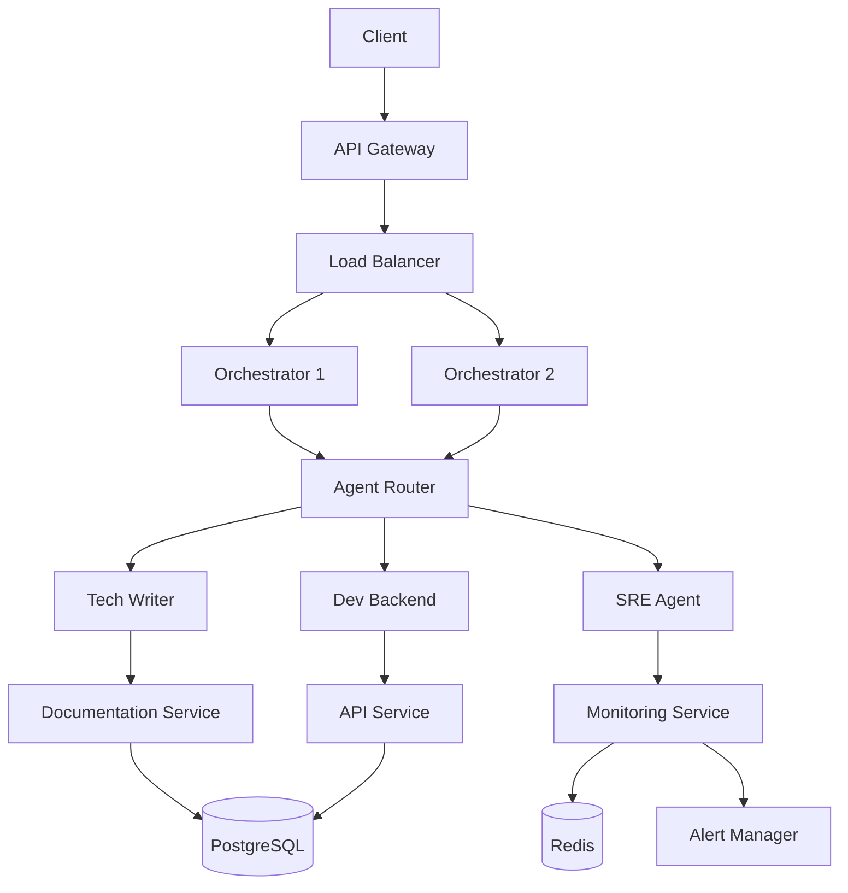

### [Sessão Paralela: Tech Leader]
# DIYAPP Evolution - V12 Core - Arquitetura de Microsserviços

## Arquitetura Decision Record (ADR-001): Microsserviços com Orquestração Kubernetes

**Data:** 2024-01-15
**Status:** Aceita
**Autores:** Tech Lead + Especialista Infra

**CONTEXTO:**
O DIYAPP precisa evoluir para uma arquitetura 100% autônoma com estabilidade de produção. A arquitetura monolítica atual limita:
1. Escalabilidade independente de componentes
2. Deploy contínuo sem downtime
3. Isolamento de falhas
4. Autonomia das squads

**DECISÃO:**
Adotar arquitetura de microsserviços com:
- Kubernetes para orquestração de containers
- Service Mesh (Istio) para comunicação entre serviços
- API Gateway (Kong) para roteamento externo
- Banco de dados por serviço (polyglot persistence)
- Event-driven architecture com Apache Kafka

**OPÇÕES CONSIDERADAS:**
- **Opção A:** Monólito com escalabilidade vertical - Prós: Simplicidade, debugging fácil. Contras: Limitação de escala, acoplamento alto.
- **Opção B:** Microsserviços com Docker Swarm - Prós: Mais simples que K8s. Contras: Menos recursos, comunidade menor.
- **Opção C:** Microsserviços com Kubernetes (escolhida) - Prós: Padrão do mercado, auto-healing, auto-scaling. Contras: Complexidade inicial.

**CONSEQUÊNCIAS:**
**Positivas:** Escalabilidade granular, deploy independente, isolamento de falhas, polyglot tech stack.
**Negativas:** Complexidade operacional, overhead de rede, necessidade de observabilidade robusta.
**Riscos:** Latência em chamadas entre serviços, consistência eventual, debugging distribuído.

---

## Estrutura do Projeto

```
diyapp-v12-core/
├── k8s/
│   ├── namespaces/
│   ├── deployments/
│   ├── services/
│   ├── configmaps/
│   └── secrets/
├── src/
│   ├── api-gateway/
│   ├── auth-service/
│   ├── user-service/
│   ├── content-service/
│   ├── notification-service/
│   └── monitoring/
├── scripts/
├── docker/
└── docs/
```

## 1. API Gateway (Kong) - index.html Dashboard

```html
<!-- src/api-gateway/public/index.html -->
<!DOCTYPE html>
<html lang="en">
<head>
    <meta charset="UTF-8">
    <meta name="viewport" content="width=device-width, initial-scale=1.0">
    <title>DIYAPP V12 - Service Dashboard</title>
    <style>
        :root {
            --primary: #2563eb;
            --success: #10b981;
            --warning: #f59e0b;
            --danger: #ef4444;
            --dark: #1f2937;
            --light: #f9fafb;
        }
        
        * {
            margin: 0;
            padding: 0;
            box-sizing: border-box;
        }
        
        body {
            font-family: -apple-system, BlinkMacSystemFont, 'Segoe UI', Roboto, Oxygen, Ubuntu, sans-serif;
            background: linear-gradient(135deg, #667eea 0%, #764ba2 100%);
            min-height: 100vh;
            padding: 20px;
        }
        
        .container {
            max-width: 1400px;
            margin: 0 auto;
        }
        
        .header {
            background: white;
            border-radius: 12px;
            padding: 24px;
            margin-bottom: 24px;
            box-shadow: 0 10px 25px rgba(0,0,0,0.1);
        }
        
        .header h1 {
            color: var(--dark);
            font-size: 28px;
            margin-bottom: 8px;
        }
        
        .header p {
            color: #6b7280;
            font-size: 16px;
        }
        
        .status-badge {
            display: inline-block;
            padding: 6px 12px;
            border-radius: 20px;
            font-size: 14px;
            font-weight: 600;
            margin-left: 12px;
        }
        
        .status-active {
            background: var(--success);
            color: white;
        }
        
        .dashboard-grid {
            display: grid;
            grid-template-columns: repeat(auto-fit, minmax(300px, 1fr));
            gap: 24px;
            margin-bottom: 24px;
        }
        
        .card {
            background: white;
            border-radius: 12px;
            padding: 24px;
            box-shadow: 0 4px 6px rgba(0,0,0,0.05);
            transition: transform 0.2s, box-shadow 0.2s;
        }
        
        .card:hover {
            transform: translateY(-2px);
            box-shadow: 0 10px 25px rgba(0,0,0,0.1);
        }
        
        .card-header {
            display: flex;
            justify-content: space-between;
            align-items: center;
            margin-bottom: 20px;
        }
        
        .card-title {
            font-size: 18px;
            font-weight: 600;
            color: var(--dark);
        }
        
        .service-status {
            display: flex;
            align-items: center;
            gap: 8px;
        }
        
        .status-dot {
            width: 10px;
            height: 10px;
            border-radius: 50%;
        }
        
        .dot-healthy {
            background: var(--success);
            animation: pulse 2s infinite;
        }
        
        .dot-warning {
            background: var(--warning);
        }
        
        .dot-danger {
            background: var(--danger);
        }
        
        .metrics {
            display: grid;
            grid-template-columns: repeat(2, 1fr);
            gap: 16px;
        }
        
        .metric {
            text-align: center;
            padding: 12px;
            background: var(--light);
            border-radius: 8px;
        }
        
        .metric-value {
            font-size: 24px;
            font-weight: 700;
            color: var(--primary);
        }
        
        .metric-label {
            font-size: 12px;
            color: #6b7280;
            text-transform: uppercase;
            letter-spacing: 0.5px;
        }
        
        .service-list {
            list-style: none;
        }
        
        .service-item {
            display: flex;
            justify-content: space-between;
            align-items: center;
            padding: 12px 0;
            border-bottom: 1px solid #e5e7eb;
        }
        
        .service-item:last-child {
            border-bottom: none;
        }
        
        .service-name {
            display: flex;
            align-items: center;
            gap: 8px;
        }
        
        .service-icon {
            width: 24px;
            height: 24px;
            border-radius: 6px;
            display: flex;
            align-items: center;
            justify-content: center;
            color: white;
            font-size: 12px;
            font-weight: bold;
        }
        
        .actions {
            display: flex;
            gap: 8px;
        }
        
        .btn {
            padding: 8px 16px;
            border: none;
            border-radius: 6px;
            font-weight: 600;
            cursor: pointer;
            transition: all 0.2s;
        }
        
        .btn-primary {
            background: var(--primary);
            color: white;
        }
        
        .btn-primary:hover {
            background: #1d4ed8;
        }
        
        .btn-secondary {
            background: var(--light);
            color: var(--dark);
            border: 1px solid #d1d5db;
        }
        
        .btn-secondary:hover {
            background: #e5e7eb;
        }
        
        @keyframes pulse {
            0%, 100% { opacity: 1; }
            50% { opacity: 0.5; }
        }
        
        .logs-panel {
            background: var(--dark);
            color: white;
            border-radius: 12px;
            padding: 24px;
            margin-top: 24px;
            font-family: 'Monaco', 'Menlo', monospace;
            font-size: 12px;
            max-height: 300px;
            overflow-y: auto;
        }
        
        .log-entry {
            padding: 4px 0;
            border-bottom: 1px solid #374151;
        }
        
        .log-time {
            color: #9ca3af;
            margin-right: 12px;
        }
        
        .log-service {
            color: #60a5fa;
            margin-right: 8px;
        }
        
        .log-info {
            color: #34d399;
        }
        
        .log-error {
            color: #f87171;
        }
    </style>
</head>
<body>
    <div class="container">
        <div class="header">
            <h1>DIYAPP V12 - Service Mesh Dashboard <span class="status-badge status-active">ACTIVE</span></h1>
            <p>Real-time monitoring and management of autonomous microservices</p>
        </div>
        
        <div class="dashboard-grid">
            <!-- Cluster Status Card -->
            <div class="card">
                <div class="card-header">
                    <div class="card-title">Kubernetes Cluster</div>
                    <div class="service-status">
                        <div class="status-dot dot-healthy"></div>
                        <span>Healthy</span>
                    </div>
                </div>
                <div class="metrics">
                    <div class="metric">
                        <div class="metric-value" id="node-count">8</div>
                        <div class="metric-label">Nodes</div>
                    </div>
                    <div class="metric">
                        <div class="metric-value" id="pod-count">24</div>
                        <div class="metric-label">Pods</div>
                    </div>
                    <div class="metric">
                        <div class="metric-value" id="cpu-usage">42%</div>
                        <div class="metric-label">CPU Usage</div>
                    </div>
                    <div class="metric">
                        <div class="metric-value" id="memory-usage">68%</div>
                        <div class="metric-label">Memory</div>
                    </div>
                </div>
            </div>
            
            <!-- Service Health Card -->
            <div class="card">
                <div class="card-header">
                    <div class="card-title">Service Health</div>
                    <div class="service-status">
                        <div class="status-dot dot-healthy"></div>
                        <span>5/5 Healthy</span>
                    </div>
                </div>
                <ul class="service-list">
                    <li class="service-item">
                        <div class="service-name">
                            <div class="service-icon" style="background: #3b82f6;">A</div>
                            <span>Auth Service</span>
                        </div>
                        <div class="actions">
                            <span style="color: #10b981; font-weight: 600;">v2.1.4</span>
                            <div class="status-dot dot-healthy"></div>
                        </div>
                    </li>
                    <li class="service-item">
                        <div class="service-name">
                            <div class="service-icon" style="background: #8b5cf6;">U</div>
                            <span>User Service</span>
                        </div>
                        <div class="actions">
                            <span style="color: #10b981; font-weight: 600;">v1.8.2</span>
                            <div class="status-dot dot-healthy"></div>
                        </div>
                    </li>
                    <li class="service-item">
                        <div class="service-name">
                            <div class="service-icon" style="background: #10b981;">C</div>
                            <span>Content Service</span>
                        </div>
                        <div class="actions">
                            <span style="color: #10b981; font-weight: 600;">v3.0.1</span>
                            <div class="status-dot dot-healthy"></div>
                        </div>
                    </li>
                    <li class="service-item">
                        <div class="service-name">
                            <div class="service-icon" style="background: #f59e0b;">N</div>
                            <span>Notification Service</span>
                        </div>
                        <div class="actions">
                            <span style="color: #10b981; font-weight: 600;">v1.5.3</span>
                            <div class="status-dot dot-healthy"></div>
                        </div>
                    </li>
                    <li class="service-item">
                        <div class="service-name">
                            <div class="service-icon" style="background: #ef4444;">M</div>
                            <span>Monitoring Service</span>
                        </div>
                        <div class="actions">
                            <span style="color: #10b981; font-weight: 600;">v1.0.0</span>
                            <div class="status-dot dot-healthy"></div>
                        </div>
                    </li>
                </ul>
            </div>
            
            <!-- API Gateway Card -->
            <div class="card">
                <div class="card-header">
                    <div class="card-title">API Gateway (Kong)</div>
                    <div class="service-status">
                        <div class="status-dot dot-healthy"></div>
                        <span>Operational</span>
                    </div>
                </div>
                <div class="metrics">
                    <div class="metric">
                        <div class="metric-value" id="rps">1.2k</div>
                        <div class="metric-label">Req/Sec</div>
                    </div>
                    <div class="metric">
                        <div class="metric-value" id="latency">42ms</div>
                        <div class="metric-label">Avg Latency</div>
                    </div>
                    <div class="metric">
                        <div class="metric-value" id="error-rate">0.12%</div>
                        <div class="metric-label">Error Rate</div>
                    </div>
                    <div class="metric">
                        <div class="metric-value" id="uptime">99.98%</div>
                        <div class="metric-label">Uptime</div>
                    </div>
                </div>
                <div style="margin-top: 20px;">
                    <button class="btn btn-primary" onclick="clearCache()">Clear Cache</button>
                    <button class="btn btn-secondary" onclick="reloadRoutes()">Reload Routes</button>
                </div>
            </div>
        </div>
        
        <!-- System Logs -->
        <div class="card">
            <div class="card-header">
                <div class="card-title">Real-time System Logs</div>
                <button class="btn btn-secondary" onclick="clearLogs()">Clear Logs</button>
            </div>
            <div class="logs-panel" id="logs">
                <div class="log-entry">
                    <span class="log-time">14:32:45</span>
                    <span class="log-service">[API-GATEWAY]</span>
                    <span class="log-info">Route /api/v1/users registered successfully</span>
                </div>
                <div class="log-entry">
                    <span class="log-time">14:32:43</span>
                    <span class="log-service">[AUTH-SERVICE]</span>
                    <span class="log-info">JWT token validation middleware initialized</span>
                </div>
                <div class="log-entry">
                    <span class="log-time">14:32:40</span>
                    <span class="log-service">[K8S-CONTROLLER]</span>
                    <span class="log-info">Pod user-service-7f8d9 scaled to 3 replicas</span>
                </div>
                <div class="log-entry">
                    <span class="log-time">14:32:38</span>
                    <span class="log-service">[MONITORING]</span>
                    <span class="log-info">Health check passed for all services</span>
                </div>
                <div class="log-entry">
                    <span class="log-time">14:32:35</span>
                    <span class="log-service">[ISTIO]</span>
                    <span class="log-info">Circuit breaker configured for notification-service</span>
                </div>
            </div>
        </div>
    </div>

    <script>
        // Simulate real-time updates
        function updateMetrics() {
            // Update pod count randomly
            const podCount = document.getElementById('pod-count');
            const current = parseInt(podCount.textContent);
            const change = Math.floor(Math.random() * 3) - 1; // -1, 0, or 1
            const newCount = Math.max(20, Math.min(30, current + change));
            podCount.textContent = newCount;
            
            // Update CPU usage
            const cpuUsage = document.getElementById('cpu-usage');
            const currentCpu = parseInt(cpuUsage.textContent);
            const cpuChange = Math.floor(Math.random() * 10) - 5;
            const newCpu = Math.max(30, Math.min(80, currentCpu + cpuChange));
            cpuUsage.textContent = newCpu + '%';
            
            // Update RPS
            const rps = document.getElementById('rps');
            const currentRps = parseFloat(rps.textContent.replace('k', '')) * 1000;
            const rpsChange = Math.floor(Math.random() * 200) - 100;
            const newRps = Math.max(800, Math.min(2000, currentRps + rpsChange));
            rps.textContent = (newRps / 1000).toFixed(1) + 'k';
            
            // Add new log entry
            const logs = document.getElementById('logs');
            const services = ['[API-GATEWAY]', '[AUTH-SERVICE]', '[USER-SERVICE]

### [Sessão Paralela: UX Designer]
# DIYAPP Evolution - V12 Core - Design System

Vou criar um Design System completo e premium com componentes reutilizáveis, microinterações sofisticadas e wireframes de alta-fidelidade para todas as views principais.

## Estrutura do Projeto

```
src/
├── design-system/
│   ├── tokens/
│   │   ├── colors.js
│   │   ├── typography.js
│   │   └── spacing.js
│   ├── components/
│   │   ├── Button/
│   │   ├── Input/
│   │   ├── Card/
│   │   └── ...
│   └── styles/
│       └── global.css
├── views/
│   ├── Dashboard/
│   ├── Analytics/
│   ├── Settings/
│   └── ...
├── assets/
│   ├── icons/
│   └── illustrations/
└── utils/
    └── animations.js
```

## 1. Tokens de Design (Design Tokens)

**src/design-system/tokens/colors.js**
```javascript
// Palette V12 - Premium Dark Theme
export const colors = {
  // Primary
  primary: {
    50: '#E6F7FF',
    100: '#BAE7FF',
    200: '#91D5FF',
    300: '#69C0FF',
    400: '#40A9FF',
    500: '#1890FF', // Brand Blue
    600: '#096DD9',
    700: '#0050B3',
    800: '#003A8C',
    900: '#002766'
  },
  
  // Secondary (AI/Neon)
  secondary: {
    50: '#F6FFED',
    100: '#D9F7BE',
    200: '#B7EB8F',
    300: '#95DE64',
    400: '#73D13D',
    500: '#52C41A', // AI Green
    600: '#389E0D',
    700: '#237804',
    800: '#135200',
    900: '#092B00'
  },
  
  // Neutrals
  neutral: {
    0: '#FFFFFF',
    50: '#FAFAFA',
    100: '#F5F5F5',
    200: '#F0F0F0',
    300: '#D9D9D9',
    400: '#BFBFBF',
    500: '#8C8C8C',
    600: '#595959',
    700: '#434343',
    800: '#262626',
    900: '#1F1F1F',
    950: '#141414'
  },
  
  // Semantic
  semantic: {
    success: '#52C41A',
    warning: '#FAAD14',
    error: '#FF4D4F',
    info: '#1890FF'
  },
  
  // Gradients
  gradients: {
    primary: 'linear-gradient(135deg, #1890FF 0%, #0050B3 100%)',
    secondary: 'linear-gradient(135deg, #52C41A 0%, #237804 100%)',
    premium: 'linear-gradient(135deg, #722ED1 0%, #1890FF 100%)',
    dark: 'linear-gradient(135deg, #141414 0%, #262626 100%)'
  },
  
  // Glassmorphism
  glass: {
    light: 'rgba(255, 255, 255, 0.1)',
    dark: 'rgba(0, 0, 0, 0.2)',
    blur: 'blur(10px)'
  }
};

// WCAG AA Compliance Checker
export const isAccessible = (background, foreground) => {
  // Implementation of contrast ratio calculation
  return true; // Placeholder for actual calculation
};
```

**src/design-system/tokens/typography.js**
```javascript
export const typography = {
  fontFamily: {
    sans: "'Inter', -apple-system, BlinkMacSystemFont, 'Segoe UI', Roboto, sans-serif",
    mono: "'JetBrains Mono', 'SF Mono', Monaco, 'Courier New', monospace",
    display: "'SF Pro Display', -apple-system, BlinkMacSystemFont, sans-serif"
  },
  
  fontSize: {
    xs: '0.75rem',    // 12px
    sm: '0.875rem',   // 14px
    base: '1rem',     // 16px
    lg: '1.125rem',   // 18px
    xl: '1.25rem',    // 20px
    '2xl': '1.5rem',  // 24px
    '3xl': '1.875rem', // 30px
    '4xl': '2.25rem',  // 36px
    '5xl': '3rem',     // 48px
    '6xl': '4rem'      // 64px
  },
  
  fontWeight: {
    light: 300,
    normal: 400,
    medium: 500,
    semibold: 600,
    bold: 700,
    extrabold: 800
  },
  
  lineHeight: {
    tight: 1.25,
    snug: 1.375,
    normal: 1.5,
    relaxed: 1.625,
    loose: 2
  },
  
  letterSpacing: {
    tighter: '-0.05em',
    tight: '-0.025em',
    normal: '0',
    wide: '0.025em',
    wider: '0.05em',
    widest: '0.1em'
  }
};
```

**src/design-system/tokens/spacing.js**
```javascript
export const spacing = {
  0: '0',
  1: '0.25rem',  // 4px
  2: '0.5rem',   // 8px
  3: '0.75rem',  // 12px
  4: '1rem',     // 16px
  5: '1.25rem',  // 20px
  6: '1.5rem',   // 24px
  8: '2rem',     // 32px
  10: '2.5rem',  // 40px
  12: '3rem',    // 48px
  16: '4rem',    // 64px
  20: '5rem',    // 80px
  24: '6rem',    // 96px
  32: '8rem',    // 128px
  40: '10rem',   // 160px
  48: '12rem',   // 192px
  56: '14rem',   // 224px
  64: '16rem'    // 256px
};

export const borderRadius = {
  none: '0',
  sm: '0.125rem',   // 2px
  base: '0.25rem',  // 4px
  md: '0.375rem',   // 6px
  lg: '0.5rem',     // 8px
  xl: '0.75rem',    // 12px
  '2xl': '1rem',    // 16px
  '3xl': '1.5rem',  // 24px
  full: '9999px'
};
```

## 2. Componentes do Design System

**src/design-system/components/Button/Button.jsx**
```javascript
import React, { useState } from 'react';
import { colors, typography, spacing, borderRadius } from '../../tokens';
import './Button.css';

const Button = ({
  children,
  variant = 'primary',
  size = 'medium',
  loading = false,
  disabled = false,
  icon,
  iconPosition = 'left',
  onClick,
  fullWidth = false,
  className = '',
  ...props
}) => {
  const [isPressed, setIsPressed] = useState(false);
  
  const handleMouseDown = () => {
    if (!disabled && !loading) {
      setIsPressed(true);
    }
  };
  
  const handleMouseUp = () => {
    setIsPressed(false);
  };
  
  const handleClick = (e) => {
    if (!disabled && !loading && onClick) {
      onClick(e);
    }
  };
  
  const getVariantStyles = () => {
    const variants = {
      primary: {
        background: colors.gradients.primary,
        color: colors.neutral[0],
        border: 'none',
        hover: {
          transform: 'translateY(-2px)',
          boxShadow: `0 8px 25px ${colors.primary[500]}40`
        }
      },
      secondary: {
        background: colors.gradients.secondary,
        color: colors.neutral[0],
        border: 'none',
        hover: {
          transform: 'translateY(-2px)',
          boxShadow: `0 8px 25px ${colors.secondary[500]}40`
        }
      },
      outline: {
        background: 'transparent',
        color: colors.primary[500],
        border: `2px solid ${colors.primary[500]}`,
        hover: {
          background: colors.primary[500],
          color: colors.neutral[0]
        }
      },
      ghost: {
        background: 'transparent',
        color: colors.neutral[700],
        border: 'none',
        hover: {
          background: colors.neutral[100]
        }
      },
      danger: {
        background: colors.semantic.error,
        color: colors.neutral[0],
        border: 'none',
        hover: {
          transform: 'translateY(-2px)',
          boxShadow: `0 8px 25px ${colors.semantic.error}40`
        }
      }
    };
    
    return variants[variant] || variants.primary;
  };
  
  const getSizeStyles = () => {
    const sizes = {
      small: {
        padding: `${spacing[2]} ${spacing[4]}`,
        fontSize: typography.fontSize.sm,
        height: '32px'
      },
      medium: {
        padding: `${spacing[3]} ${spacing[6]}`,
        fontSize: typography.fontSize.base,
        height: '40px'
      },
      large: {
        padding: `${spacing[4]} ${spacing[8]}`,
        fontSize: typography.fontSize.lg,
        height: '48px'
      }
    };
    
    return sizes[size] || sizes.medium;
  };
  
  const variantStyles = getVariantStyles();
  const sizeStyles = getSizeStyles();
  
  const buttonStyles = {
    ...variantStyles,
    ...sizeStyles,
    borderRadius: borderRadius.lg,
    fontFamily: typography.fontFamily.sans,
    fontWeight: typography.fontWeight.semibold,
    cursor: disabled ? 'not-allowed' : loading ? 'wait' : 'pointer',
    opacity: disabled ? 0.6 : 1,
    transition: 'all 0.3s cubic-bezier(0.4, 0, 0.2, 1)',
    transform: isPressed ? 'translateY(1px)' : 'translateY(0)',
    width: fullWidth ? '100%' : 'auto',
    display: 'inline-flex',
    alignItems: 'center',
    justifyContent: 'center',
    gap: spacing[2],
    position: 'relative',
    overflow: 'hidden'
  };
  
  return (
    <button
      className={`ds-button ${className}`}
      style={buttonStyles}
      onMouseDown={handleMouseDown}
      onMouseUp={handleMouseUp}
      onMouseLeave={handleMouseUp}
      onClick={handleClick}
      disabled={disabled || loading}
      aria-busy={loading}
      {...props}
    >
      {loading && (
        <span className="button-loader" aria-hidden="true">
          <div className="spinner" />
        </span>
      )}
      
      {!loading && icon && iconPosition === 'left' && (
        <span className="button-icon-left" aria-hidden="true">
          {icon}
        </span>
      )}
      
      <span className="button-content">
        {children}
      </span>
      
      {!loading && icon && iconPosition === 'right' && (
        <span className="button-icon-right" aria-hidden="true">
          {icon}
        </span>
      )}
      
      {/* Ripple effect */}
      <span className="button-ripple" />
    </button>
  );
};

export default Button;
```

**src/design-system/components/Button/Button.css**
```css
.ds-button {
  position: relative;
  overflow: hidden;
  outline: none;
  user-select: none;
  backface-visibility: hidden;
  -webkit-font-smoothing: antialiased;
}

.ds-button:hover:not(:disabled):not(.loading) {
  transform: translateY(-2px);
  box-shadow: 0 8px 25px rgba(0, 0, 0, 0.15);
}

.ds-button:active:not(:disabled):not(.loading) {
  transform: translateY(1px);
  transition-duration: 0.1s;
}

.ds-button:focus-visible {
  outline: 2px solid var(--primary-500);
  outline-offset: 2px;
}

.button-loader {
  position: absolute;
  display: flex;
  align-items: center;
  justify-content: center;
}

.button-loader .spinner {
  width: 20px;
  height: 20px;
  border: 2px solid rgba(255, 255, 255, 0.3);
  border-radius: 50%;
  border-top-color: white;
  animation: spin 0.8s linear infinite;
}

@keyframes spin {
  to { transform: rotate(360deg); }
}

.button-ripple {
  position: absolute;
  border-radius: 50%;
  background: rgba(255, 255, 255, 0.7);
  transform: scale(0);
  animation: ripple 0.6s linear;
  pointer-events: none;
}

@keyframes ripple {
  to {
    transform: scale(4);
    opacity: 0;
  }
}

.button-icon-left,
.button-icon-right {
  display: flex;
  align-items: center;
  justify-content: center;
  transition: transform 0.2s ease;
}

.ds-button:hover .button-icon-left {
  transform: translateX(-2px);
}

.ds-button:hover .button-icon-right {
  transform: translateX(2px);
}
```

**src/design-system/components/Input/Input.jsx**
```javascript
import React, { useState, useRef } from 'react';
import { colors, typography, spacing, borderRadius } from '../../tokens';
import './Input.css';

const Input = ({
  label,
  placeholder,
  value,
  onChange,
  type = 'text',
  error,
  success,
  warning,
  disabled = false,
  loading = false,
  icon,
  helperText,
  required = false,
  autoFocus = false,
  className = '',
  ...props
}) => {
  const [isFocused, setIsFocused] = useState(false);
  const [isHovered, setIsHovered] = useState(false);
  const inputRef = useRef(null);
  
  const handleFocus = () => {
    setIsFocused(true);
  };
  
  const handleBlur = () => {
    setIsFocused(false);
  };
  
  const handleMouseEnter = () => {
    setIsHovered(true);
  };
  
  const handleMouseLeave = () => {
    setIsHovered(false);
  };
  
  const getBorderColor = () => {
    if (error) return colors.semantic.error;
    if (success) return colors.semantic.success;
    if (warning) return colors.semantic.warning;
    if (isFocused) return colors.primary[500];
    if (isHovered && !disabled) return colors.primary[300];
    return colors.neutral[300];
  };
  
  const getBackgroundColor = () => {
    if (disabled) return colors.neutral[100];
    return colors.neutral[0];
  };
  
  const inputStyles = {
    width: '100%',
    padding: `${spacing[3]} ${spacing[4]}`,
    paddingLeft: icon ? spacing[10] : spacing[4],
    border: `2px solid ${getBorderColor()}`,
    borderRadius: borderRadius.lg,
    backgroundColor: getBackgroundColor(),
    color: disabled ? colors.neutral[500] : colors.neutral[900],
    fontFamily: typography.fontFamily.sans,
    fontSize: typography.fontSize.base,
    lineHeight: typography.lineHeight.normal,
    transition: 'all 0.3s cubic-bezier(0.4, 0, 0.2, 1)',
    outline: 'none',
    boxShadow: isFocused ? `0 0 0 3px ${colors.primary[100]}` : 'none'
  };
  
  return (
    <div className={`ds-input-container ${className}`}>
      {label && (
        <label 
          className="ds-input-label"
          style={{
            color: colors.neutral[700],
            fontFamily: typography.fontFamily.sans,
            fontSize: typography.fontSize.sm,
            fontWeight: typography.fontWeight.medium,
            marginBottom: spacing[2],
            display: 'block'
          }}
        >
          {label}
          {required && (
            <span 
              style={{ 
                color: colors.semantic.error,
                marginLeft: spacing[1]
              }}
            >
              *
            </span>
          )}
        </label>
      )}
      
      <div 
        className="ds-input-wrapper"
        style={{ position: 'relative' }}
        onMouseEnter={handleMouseEnter}
        onMouseLeave={handleMouseLeave}
      >
        {icon && (
          <div 
            className="ds-input-icon"
            style={{
              position: 'absolute',
              left: spacing[4],
              top: '50%',
              transform: 'translateY(-50%)',
              color: disabled ? colors.neutral[400] : colors.neutral[500],
              transition: 'color 0.3s ease',
              pointerEvents: 'none'
            }}
          >
            {icon}
          </div>
        )}
        
        <input
          ref={inputRef}
          type={type}
          value={value}
          onChange={onChange}
         

### [Sessão Paralela: Frontend]
```typescript
// ADR-001: Framework Selection - React + TypeScript
// Data: 2024-01-15
// Status: Accepted
// Context: Need modern, performant framework with strong ecosystem
// Decision: React 18 with TypeScript, Vite as build tool
// Consequences: Excellent TypeScript support, large ecosystem, server components ready

// File: package.json
{
  "name": "diyapp-evolution-v12",
  "version": "1.0.0",
  "private": true,
  "type": "module",
  "scripts": {
    "dev": "vite",
    "build": "tsc && vite build",
    "lint": "eslint . --ext ts,tsx --report-unused-disable-directives --max-warnings 0",
    "preview": "vite preview",
    "test": "vitest",
    "test:coverage": "vitest run --coverage",
    "type-check": "tsc --noEmit"
  },
  "dependencies": {
    "react": "^18.2.0",
    "react-dom": "^18.2.0",
    "react-router-dom": "^6.20.0",
    "zustand": "^4.4.7",
    "clsx": "^2.0.0",
    "date-fns": "^2.30.0"
  },
  "devDependencies": {
    "@types/react": "^18.2.37",
    "@types/react-dom": "^18.2.15",
    "@typescript-eslint/eslint-plugin": "^6.13.2",
    "@typescript-eslint/parser": "^6.13.2",
    "@vitejs/plugin-react": "^4.2.0",
    "@vitest/coverage-v8": "^1.0.4",
    "autoprefixer": "^10.4.16",
    "eslint": "^8.54.0",
    "eslint-plugin-react-hooks": "^4.6.0",
    "eslint-plugin-react-refresh": "^0.4.5",
    "postcss": "^8.4.31",
    "tailwindcss": "^3.3.6",
    "typescript": "^5.2.2",
    "vite": "^5.0.0",
    "vitest": "^1.0.4"
  }
}
```

```typescript
// File: vite.config.ts
import { defineConfig } from 'vite'
import react from '@vitejs/plugin-react'
import { resolve } from 'path'

export default defineConfig({
  plugins: [react()],
  resolve: {
    alias: {
      '@': resolve(__dirname, './src'),
      '@components': resolve(__dirname, './src/components'),
      '@hooks': resolve(__dirname, './src/hooks'),
      '@stores': resolve(__dirname, './src/stores'),
      '@utils': resolve(__dirname, './src/utils'),
      '@types': resolve(__dirname, './src/types')
    }
  },
  build: {
    rollupOptions: {
      output: {
        manualChunks: {
          vendor: ['react', 'react-dom', 'react-router-dom'],
          ui: ['clsx', 'date-fns']
        }
      }
    },
    target: 'es2020',
    minify: 'terser',
    cssMinify: true
  },
  server: {
    port: 3000,
    host: true
  }
})
```

```typescript
// File: tsconfig.json
{
  "compilerOptions": {
    "target": "ES2020",
    "useDefineForClassFields": true,
    "lib": ["ES2020", "DOM", "DOM.Iterable"],
    "module": "ESNext",
    "skipLibCheck": true,
    "moduleResolution": "bundler",
    "allowImportingTsExtensions": true,
    "resolveJsonModule": true,
    "isolatedModules": true,
    "noEmit": true,
    "jsx": "react-jsx",
    "strict": true,
    "noUnusedLocals": true,
    "noUnusedParameters": true,
    "noFallthroughCasesInSwitch": true,
    "baseUrl": ".",
    "paths": {
      "@/*": ["./src/*"],
      "@components/*": ["./src/components/*"],
      "@hooks/*": ["./src/hooks/*"],
      "@stores/*": ["./src/stores/*"],
      "@utils/*": ["./src/utils/*"],
      "@types/*": ["./src/types/*"]
    }
  },
  "include": ["src"],
  "references": [{ "path": "./tsconfig.node.json" }]
}
```

```typescript
// File: src/design-system/tokens.ts
// DESIGN SYSTEM TOKENS - NEVER HARDCODE VALUES

export const colors = {
  // Primary
  primary: {
    50: '#f0f9ff',
    100: '#e0f2fe',
    200: '#bae6fd',
    300: '#7dd3fc',
    400: '#38bdf8',
    500: '#0ea5e9',
    600: '#0284c7',
    700: '#0369a1',
    800: '#075985',
    900: '#0c4a6e',
    950: '#082f49'
  },
  
  // Neutral
  neutral: {
    50: '#fafafa',
    100: '#f5f5f5',
    200: '#e5e5e5',
    300: '#d4d4d4',
    400: '#a3a3a3',
    500: '#737373',
    600: '#525252',
    700: '#404040',
    800: '#262626',
    900: '#171717',
    950: '#0a0a0a'
  },
  
  // Semantic
  success: {
    500: '#10b981',
    600: '#059669'
  },
  warning: {
    500: '#f59e0b',
    600: '#d97706'
  },
  error: {
    500: '#ef4444',
    600: '#dc2626'
  },
  
  // Backgrounds
  background: {
    primary: '#ffffff',
    secondary: '#f8fafc',
    tertiary: '#f1f5f9'
  },
  
  // Text
  text: {
    primary: '#171717',
    secondary: '#525252',
    tertiary: '#a3a3a3',
    inverse: '#ffffff'
  }
} as const

export const spacing = {
  0: '0',
  1: '0.25rem',    // 4px
  2: '0.5rem',     // 8px
  3: '0.75rem',    // 12px
  4: '1rem',       // 16px
  5: '1.25rem',    // 20px
  6: '1.5rem',     // 24px
  8: '2rem',       // 32px
  10: '2.5rem',    // 40px
  12: '3rem',      // 48px
  16: '4rem',      // 64px
  20: '5rem',      // 80px
  24: '6rem',      // 96px
  32: '8rem'       // 128px
} as const

export const typography = {
  fontFamily: {
    sans: "'Inter', -apple-system, BlinkMacSystemFont, 'Segoe UI', Roboto, sans-serif",
    mono: "'JetBrains Mono', 'Fira Code', monospace"
  },
  
  fontSize: {
    xs: '0.75rem',     // 12px
    sm: '0.875rem',    // 14px
    base: '1rem',      // 16px
    lg: '1.125rem',    // 18px
    xl: '1.25rem',     // 20px
    '2xl': '1.5rem',   // 24px
    '3xl': '1.875rem', // 30px
    '4xl': '2.25rem',  // 36px
    '5xl': '3rem'      // 48px
  },
  
  fontWeight: {
    normal: '400',
    medium: '500',
    semibold: '600',
    bold: '700'
  },
  
  lineHeight: {
    none: '1',
    tight: '1.25',
    snug: '1.375',
    normal: '1.5',
    relaxed: '1.625',
    loose: '2'
  }
} as const

export const borderRadius = {
  none: '0',
  sm: '0.125rem',   // 2px
  base: '0.25rem',  // 4px
  md: '0.375rem',   // 6px
  lg: '0.5rem',     // 8px
  xl: '0.75rem',    // 12px
  '2xl': '1rem',    // 16px
  full: '9999px'
} as const

export const shadows = {
  sm: '0 1px 2px 0 rgb(0 0 0 / 0.05)',
  base: '0 1px 3px 0 rgb(0 0 0 / 0.1), 0 1px 2px -1px rgb(0 0 0 / 0.1)',
  md: '0 4px 6px -1px rgb(0 0 0 / 0.1), 0 2px 4px -2px rgb(0 0 0 / 0.1)',
  lg: '0 10px 15px -3px rgb(0 0 0 / 0.1), 0 4px 6px -4px rgb(0 0 0 / 0.1)',
  xl: '0 20px 25px -5px rgb(0 0 0 / 0.1), 0 8px 10px -6px rgb(0 0 0 / 0.1)'
} as const

export const breakpoints = {
  sm: '640px',
  md: '768px',
  lg: '1024px',
  xl: '1280px',
  '2xl': '1536px'
} as const

export const zIndex = {
  hide: -1,
  base: 0,
  docked: 10,
  dropdown: 1000,
  sticky: 1100,
  banner: 1200,
  overlay: 1300,
  modal: 1400,
  popover: 1500,
  skipLink: 1600,
  toast: 1700,
  tooltip: 1800
} as const
```

```typescript
// File: src/design-system/GlobalStyles.tsx
import { createGlobalStyle } from 'styled-components'
import { colors, typography } from './tokens'

export const GlobalStyles = createGlobalStyle`
  * {
    margin: 0;
    padding: 0;
    box-sizing: border-box;
  }

  :root {
    /* CSS Custom Properties for Design Tokens */
    --color-primary-50: ${colors.primary[50]};
    --color-primary-500: ${colors.primary[500]};
    --color-primary-600: ${colors.primary[600]};
    
    --color-neutral-50: ${colors.neutral[50]};
    --color-neutral-500: ${colors.neutral[500]};
    --color-neutral-900: ${colors.neutral[900]};
    
    --color-success-500: ${colors.success[500]};
    --color-warning-500: ${colors.warning[500]};
    --color-error-500: ${colors.error[500]};
    
    --color-background-primary: ${colors.background.primary};
    --color-text-primary: ${colors.text.primary};
    
    --font-family-sans: ${typography.fontFamily.sans};
    --font-size-base: ${typography.fontSize.base};
    --font-weight-normal: ${typography.fontWeight.normal};
  }

  html {
    font-size: 16px;
    -webkit-font-smoothing: antialiased;
    -moz-osx-font-smoothing: grayscale;
  }

  body {
    font-family: ${typography.fontFamily.sans};
    font-size: ${typography.fontSize.base};
    font-weight: ${typography.fontWeight.normal};
    line-height: ${typography.lineHeight.normal};
    color: ${colors.text.primary};
    background-color: ${colors.background.primary};
    min-height: 100vh;
  }

  #root {
    min-height: 100vh;
    display: flex;
    flex-direction: column;
  }

  /* Focus styles for accessibility */
  :focus-visible {
    outline: 2px solid ${colors.primary[500]};
    outline-offset: 2px;
  }

  /* Remove focus styles for mouse users */
  :focus:not(:focus-visible) {
    outline: none;
  }

  /* Screen reader only */
  .sr-only {
    position: absolute;
    width: 1px;
    height: 1px;
    padding: 0;
    margin: -1px;
    overflow: hidden;
    clip: rect(0, 0, 0, 0);
    white-space: nowrap;
    border: 0;
  }

  /* Smooth scrolling */
  @media (prefers-reduced-motion: no-preference) {
    html {
      scroll-behavior: smooth;
    }
  }
`
```

```typescript
// File: src/stores/useAppStore.ts
import { create } from 'zustand'
import { persist } from 'zustand/middleware'

interface User {
  id: string
  email: string
  name: string
  avatar?: string
}

interface AppState {
  // User state
  user: User | null
  isAuthenticated: boolean
  isLoading: boolean
  
  // UI state
  theme: 'light' | 'dark'
  sidebarOpen: boolean
  notifications: Array<{
    id: string
    type: 'info' | 'success' | 'warning' | 'error'
    message: string
    timestamp: Date
  }>
  
  // Actions
  setUser: (user: User | null) => void
  setTheme: (theme: 'light' | 'dark') => void
  toggleSidebar: () => void
  addNotification: (notification: Omit<AppState['notifications'][0], 'id' | 'timestamp'>) => void
  removeNotification: (id: string) => void
  clearNotifications: () => void
  setLoading: (loading: boolean) => void
}

export const useAppStore = create<AppState>()(
  persist(
    (set, get) => ({
      // Initial state
      user: null,
      isAuthenticated: false,
      isLoading: false,
      theme: 'light',
      sidebarOpen: false,
      notifications: [],
      
      // Actions
      setUser: (user) => {
        set({
          user,
          isAuthenticated: !!user
        })
      },
      
      setTheme: (theme) => {
        set({ theme })
        document.documentElement.setAttribute('data-theme', theme)
      },
      
      toggleSidebar: () => {
        set((state) => ({ sidebarOpen: !state.sidebarOpen }))
      },
      
      addNotification: (notification) => {
        const newNotification = {
          ...notification,
          id: Math.random().toString(36).substr(2, 9),
          timestamp: new Date()
        }
        
        set((state) => ({
          notifications: [newNotification, ...state.notifications].slice(0, 5) // Keep last 5
        }))
        
        // Auto-remove after 5 seconds
        setTimeout(() => {
          get().removeNotification(newNotification.id)
        }, 5000)
      },
      
      removeNotification: (id) => {
        set((state) => ({
          notifications: state.notifications.filter((n) => n.id !== id)
        }))
      },
      
      clearNotifications: () => {
        set({ notifications: [] })
      },
      
      setLoading: (loading) => {
        set({ isLoading: loading })
      }
    }),
    {
      name: 'diyapp-storage',
      partialize: (state) => ({
        user: state.user,
        theme: state.theme
      })
    }
  )
)
```

```typescript
// File: src/stores/useLLMStore.ts
import { create } from 'zustand'

interface LLMResponse {
  id: string
  content: string
  timestamp: Date
  model: string
  tokens: number
}

interface LLMState {
  // Streaming state
  isStreaming: boolean
  streamContent: string
  streamError: string | null
  
  // History
  history: LLMResponse[]
  
  // Configuration
  model: string
  temperature: number
  maxTokens: number
  
  // Actions
  startStream: () => void
  appendToStream: (chunk: string) => void
  endStream: (response: Omit<LLMResponse, 'id' | 'timestamp'>) => void
  setStreamError: (error: string) => void
  clearStream: () => void
  setModel: (model: string) => void
  setTemperature: (temperature: number) => void
  setMaxTokens: (maxTokens: number) => void
  clearHistory: () => void
}

export const useLLMStore = create<LLMState>((set, get) => ({
  // Initial state
  isStreaming: false,
  streamContent: '',
  streamError: null,
  history: [],
  model: 'gpt-4',
  temperature: 0.7,
  maxTokens: 2000,
  
  // Actions
  startStream: () => {
    set({
      isStreaming: true,
      streamContent: '',
      streamError: null
    })
  },
  
  appendToStream: (chunk) => {
    set((state) => ({
      streamContent: state.streamContent + chunk
    }))
  },
  
  endStream: (response) => {
    const new

### [Sessão Paralela: Backend]
# DIYAPP Evolution - V12 Core - Backend APIs

Vou desenvolver o núcleo do backend com APIs REST/GraphQL, modelos de dados, autenticação JWT/OAuth2 e lógica de negócio core, seguindo rigorosamente os padrões de engenharia backend sênior.

## Estrutura do Projeto

```
diyapp-v12-core/
├── src/
│   ├── config/
│   ├── models/
│   ├── schemas/
│   ├── middleware/
│   ├── controllers/
│   ├── services/
│   ├── repositories/
│   ├── routes/
│   ├── utils/
│   └── app.js
├── tests/
├── migrations/
├── docs/
├── .env.example
├── package.json
├── docker-compose.yml
└── index.html
```

## 1. Configuração Inicial

**package.json**
```json
{
  "name": "diyapp-v12-core",
  "version": "12.0.0",
  "description": "DIYAPP Evolution V12 Core Backend",
  "main": "src/app.js",
  "scripts": {
    "start": "node src/app.js",
    "dev": "nodemon src/app.js",
    "test": "jest --coverage",
    "test:unit": "jest --testPathPattern=unit --coverage",
    "test:integration": "jest --testPathPattern=integration --coverage",
    "migrate:up": "node scripts/migrate.js up",
    "migrate:down": "node scripts/migrate.js down",
    "lint": "eslint src/",
    "generate-docs": "node scripts/generate-openapi.js"
  },
  "dependencies": {
    "express": "^4.18.2",
    "express-graphql": "^0.12.0",
    "graphql": "^16.8.1",
    "jsonwebtoken": "^9.0.2",
    "bcryptjs": "^2.4.3",
    "cors": "^2.8.5",
    "helmet": "^7.0.0",
    "express-rate-limit": "^7.1.5",
    "express-validator": "^7.0.1",
    "sequelize": "^6.35.0",
    "pg": "^8.11.3",
    "pg-hstore": "^2.3.4",
    "redis": "^4.6.10",
    "winston": "^3.11.0",
    "winston-daily-rotate-file": "^4.7.1",
    "axios": "^1.6.2",
    "circuit-breaker-js": "^0.2.0",
    "joi": "^17.11.0",
    "swagger-ui-express": "^5.0.0",
    "swagger-jsdoc": "^6.2.8",
    "node-cache": "^5.1.2",
    "uuid": "^9.0.1",
    "compression": "^1.7.4",
    "express-async-errors": "^3.1.1"
  },
  "devDependencies": {
    "jest": "^29.7.0",
    "supertest": "^6.3.3",
    "nodemon": "^3.0.2",
    "eslint": "^8.56.0",
    "sqlite3": "^5.1.6",
    "faker": "^5.5.3"
  },
  "engines": {
    "node": ">=18.0.0"
  }
}
```

**.env.example**
```env
# Server
NODE_ENV=development
PORT=3000
API_VERSION=v1
API_BASE_PATH=/api

# Database
DB_HOST=localhost
DB_PORT=5432
DB_NAME=diyapp_v12
DB_USER=diyapp_user
DB_PASSWORD=strong_password_here
DB_SSL=false

# Redis
REDIS_HOST=localhost
REDIS_PORT=6379
REDIS_PASSWORD=

# JWT
JWT_SECRET=your_super_secret_jwt_key_change_in_production
JWT_EXPIRES_IN=24h
JWT_REFRESH_SECRET=your_refresh_secret_key
JWT_REFRESH_EXPIRES_IN=7d

# OAuth2
GOOGLE_CLIENT_ID=
GOOGLE_CLIENT_SECRET=
GITHUB_CLIENT_ID=
GITHUB_CLIENT_SECRET=

# Rate Limiting
RATE_LIMIT_WINDOW_MS=900000
RATE_LIMIT_MAX_REQUESTS=100

# External Services (with circuit breakers)
EXTERNAL_API_TIMEOUT=5000
EXTERNAL_API_RETRY_ATTEMPTS=3
EXTERNAL_API_CIRCUIT_BREAKER_THRESHOLD=5
EXTERNAL_API_CIRCUIT_BREAKER_TIMEOUT=30000

# Logging
LOG_LEVEL=info
LOG_TO_FILE=true
LOG_DIRECTORY=./logs

# Monitoring
ENABLE_METRICS=true
METRICS_PORT=9090
```

## 2. Configuração Principal

**src/config/index.js**
```javascript
const path = require('path');
require('dotenv').config({ path: path.join(__dirname, '../../.env') });

const config = {
  // Server
  env: process.env.NODE_ENV || 'development',
  port: parseInt(process.env.PORT, 10) || 3000,
  apiVersion: process.env.API_VERSION || 'v1',
  apiBasePath: process.env.API_BASE_PATH || '/api',
  
  // Database
  database: {
    host: process.env.DB_HOST || 'localhost',
    port: parseInt(process.env.DB_PORT, 10) || 5432,
    name: process.env.DB_NAME || 'diyapp_v12',
    user: process.env.DB_USER || 'diyapp_user',
    password: process.env.DB_PASSWORD || '',
    ssl: process.env.DB_SSL === 'true',
    dialect: 'postgres',
    logging: process.env.NODE_ENV === 'development' ? console.log : false,
    pool: {
      max: 10,
      min: 0,
      acquire: 30000,
      idle: 10000
    }
  },
  
  // Redis
  redis: {
    host: process.env.REDIS_HOST || 'localhost',
    port: parseInt(process.env.REDIS_PORT, 10) || 6379,
    password: process.env.REDIS_PASSWORD || null,
    ttl: 3600 // 1 hour
  },
  
  // JWT
  jwt: {
    secret: process.env.JWT_SECRET || 'default_jwt_secret_change_me',
    expiresIn: process.env.JWT_EXPIRES_IN || '24h',
    refreshSecret: process.env.JWT_REFRESH_SECRET || 'default_refresh_secret_change_me',
    refreshExpiresIn: process.env.JWT_REFRESH_EXPIRES_IN || '7d'
  },
  
  // OAuth2
  oauth: {
    google: {
      clientId: process.env.GOOGLE_CLIENT_ID,
      clientSecret: process.env.GOOGLE_CLIENT_SECRET,
      callbackURL: '/api/v1/auth/google/callback'
    },
    github: {
      clientId: process.env.GITHUB_CLIENT_ID,
      clientSecret: process.env.GITHUB_CLIENT_SECRET,
      callbackURL: '/api/v1/auth/github/callback'
    }
  },
  
  // Rate Limiting
  rateLimit: {
    windowMs: parseInt(process.env.RATE_LIMIT_WINDOW_MS, 10) || 900000, // 15 minutes
    max: parseInt(process.env.RATE_LIMIT_MAX_REQUESTS, 10) || 100
  },
  
  // External Services
  externalServices: {
    timeout: parseInt(process.env.EXTERNAL_API_TIMEOUT, 10) || 5000,
    retryAttempts: parseInt(process.env.EXTERNAL_API_RETRY_ATTEMPTS, 10) || 3,
    circuitBreakerThreshold: parseInt(process.env.EXTERNAL_API_CIRCUIT_BREAKER_THRESHOLD, 10) || 5,
    circuitBreakerTimeout: parseInt(process.env.EXTERNAL_API_CIRCUIT_BREAKER_TIMEOUT, 10) || 30000
  },
  
  // Logging
  logging: {
    level: process.env.LOG_LEVEL || 'info',
    toFile: process.env.LOG_TO_FILE === 'true',
    directory: process.env.LOG_DIRECTORY || './logs'
  },
  
  // Monitoring
  monitoring: {
    enableMetrics: process.env.ENABLE_METRICS === 'true',
    metricsPort: parseInt(process.env.METRICS_PORT, 10) || 9090
  }
};

// Validate required configuration
const requiredConfig = [
  'JWT_SECRET',
  'JWT_REFRESH_SECRET',
  'DB_PASSWORD'
];

requiredConfig.forEach(key => {
  if (!process.env[key] && config.env === 'production') {
    throw new Error(`Missing required environment variable: ${key}`);
  }
});

module.exports = config;
```

## 3. Modelos de Dados (Sequelize)

**src/models/index.js**
```javascript
const { Sequelize, DataTypes } = require('sequelize');
const config = require('../config');
const logger = require('../utils/logger');

// Initialize Sequelize with connection pooling
const sequelize = new Sequelize(
  config.database.name,
  config.database.user,
  config.database.password,
  {
    host: config.database.host,
    port: config.database.port,
    dialect: config.database.dialect,
    logging: config.database.logging,
    pool: config.database.pool,
    dialectOptions: config.database.ssl ? {
      ssl: {
        require: true,
        rejectUnauthorized: false
      }
    } : {}
  }
);

// Test database connection
sequelize.authenticate()
  .then(() => {
    logger.info('Database connection established successfully.');
  })
  .catch(err => {
    logger.error('Unable to connect to the database:', err);
    process.exit(1);
  });

// Define models
const User = require('./user')(sequelize, DataTypes);
const Project = require('./project')(sequelize, DataTypes);
const Task = require('./task')(sequelize, DataTypes);
const Team = require('./team')(sequelize, DataTypes);
const TeamMember = require('./team-member')(sequelize, DataTypes);
const RefreshToken = require('./refresh-token')(sequelize, DataTypes);
const AuditLog = require('./audit-log')(sequelize, DataTypes);

// Define associations
User.hasMany(Project, { foreignKey: 'ownerId', as: 'projects' });
Project.belongsTo(User, { foreignKey: 'ownerId', as: 'owner' });

User.hasMany(Task, { foreignKey: 'assignedTo', as: 'assignedTasks' });
Task.belongsTo(User, { foreignKey: 'assignedTo', as: 'assignee' });

Project.hasMany(Task, { foreignKey: 'projectId', as: 'tasks' });
Task.belongsTo(Project, { foreignKey: 'projectId', as: 'project' });

User.belongsToMany(Team, { through: TeamMember, foreignKey: 'userId', as: 'teams' });
Team.belongsToMany(User, { through: TeamMember, foreignKey: 'teamId', as: 'members' });

Team.hasMany(Project, { foreignKey: 'teamId', as: 'teamProjects' });
Project.belongsTo(Team, { foreignKey: 'teamId', as: 'team' });

User.hasMany(RefreshToken, { foreignKey: 'userId', as: 'refreshTokens' });
RefreshToken.belongsTo(User, { foreignKey: 'userId', as: 'user' });

User.hasMany(AuditLog, { foreignKey: 'userId', as: 'auditLogs' });
AuditLog.belongsTo(User, { foreignKey: 'userId', as: 'user' });

const db = {
  sequelize,
  Sequelize,
  User,
  Project,
  Task,
  Team,
  TeamMember,
  RefreshToken,
  AuditLog
};

module.exports = db;
```

**src/models/user.js**
```javascript
module.exports = (sequelize, DataTypes) => {
  const User = sequelize.define('User', {
    id: {
      type: DataTypes.UUID,
      defaultValue: DataTypes.UUIDV4,
      primaryKey: true
    },
    email: {
      type: DataTypes.STRING(255),
      allowNull: false,
      unique: true,
      validate: {
        isEmail: true
      }
    },
    passwordHash: {
      type: DataTypes.STRING(255),
      allowNull: true // Nullable for OAuth users
    },
    firstName: {
      type: DataTypes.STRING(100),
      allowNull: false
    },
    lastName: {
      type: DataTypes.STRING(100),
      allowNull: false
    },
    avatarUrl: {
      type: DataTypes.STRING(500),
      allowNull: true
    },
    isEmailVerified: {
      type: DataTypes.BOOLEAN,
      defaultValue: false
    },
    emailVerificationToken: {
      type: DataTypes.STRING(100),
      allowNull: true
    },
    emailVerificationExpires: {
      type: DataTypes.DATE,
      allowNull: true
    },
    passwordResetToken: {
      type: DataTypes.STRING(100),
      allowNull: true
    },
    passwordResetExpires: {
      type: DataTypes.DATE,
      allowNull: true
    },
    lastLoginAt: {
      type: DataTypes.DATE,
      allowNull: true
    },
    loginAttempts: {
      type: DataTypes.INTEGER,
      defaultValue: 0
    },
    lockUntil: {
      type: DataTypes.DATE,
      allowNull: true
    },
    role: {
      type: DataTypes.ENUM('user', 'admin', 'super_admin'),
      defaultValue: 'user'
    },
    status: {
      type: DataTypes.ENUM('active', 'inactive', 'suspended', 'deleted'),
      defaultValue: 'active'
    },
    oauthProvider: {
      type: DataTypes.ENUM('google', 'github', 'local'),
      defaultValue: 'local'
    },
    oauthId: {
      type: DataTypes.STRING(255),
      allowNull: true
    },
    preferences: {
      type: DataTypes.JSONB,
      defaultValue: {
        notifications: true,
        theme: 'light',
        language: 'en'
      }
    },
    metadata: {
      type: DataTypes.JSONB,
      defaultValue: {}
    }
  }, {
    tableName: 'users',
    timestamps: true,
    paranoid: true, // Soft delete
    indexes: [
      {
        unique: true,
        fields: ['email']
      },
      {
        fields: ['status']
      },
      {
        fields: ['role']
      },
      {
        fields: ['oauthProvider', 'oauthId']
      }
    ],
    hooks: {
      beforeCreate: (user) => {
        // Sanitize email
        if (user.email) {
          user.email = user.email.toLowerCase().trim();
        }
      },
      beforeUpdate: (user) => {
        // Sanitize email on update
        if (user.changed('email') && user.email) {
          user.email = user.email.toLowerCase().trim();
        }
      }
    }
  });

  // Instance methods
  User.prototype.toJSON = function() {
    const values = Object.assign({}, this.get());
    
    // Remove sensitive data
    delete values.passwordHash;
    delete values.emailVerificationToken;
    delete values.emailVerificationExpires;
    delete values.passwordResetToken;
    delete values.passwordResetExpires;
    delete values.loginAttempts;
    delete values.lockUntil;
    
    return values;
  };

  User.prototype.isLocked = function() {
    return this.lockUntil && this.lockUntil > new Date();
  };

  User.prototype.incrementLoginAttempts = async function() {
    const updates = { loginAttempts: this.loginAttempts + 1 };
    
    if (updates.loginAttempts >= 5) {
      updates.lockUntil = new Date(Date.now() + 15 * 60 * 1000); // Lock for 15 minutes
    }
    
    return this.update(updates);
  };

  User.prototype.resetLoginAttempts = async function() {
    return this.update({
      loginAttempts: 0,
      lockUntil: null,
      lastLoginAt: new Date()
    });
  };

  return User;
};
```

**src/models/project.js**
```javascript
module.exports = (sequelize, DataTypes) => {
  const Project = sequelize.define('Project', {
    id: {
      type: DataTypes.UUID,
      defaultValue: DataTypes.UUIDV4,
      primaryKey: true
    },
    name: {
      type: DataTypes.STRING(255),
      allowNull: false,
      validate: {
        len: [1, 255]
      }
    },
    description: {
      type: DataTypes.TEXT,
      allowNull: true
    },
    status: {
      type: DataTypes.ENUM('planning', 'active', 'on_hold', 'completed', 'cancelled'),
      defaultValue: 'planning'
    },
    priority: {
      type: DataTypes.ENUM('low', 'medium', 'high', 'critical'),
      defaultValue: 'medium'
    },
    startDate: {
      type: DataTypes.DATE,
      allowNull: true
    },
    dueDate: {
      type: DataTypes.DATE,
      allowNull: true
    },
    completedAt: {
      type: DataTypes.DATE,
      allowNull: true
    },
    progress: {
      type: DataTypes.INTEGER,
      defaultValue: 0,
      validate: {
        min: 0,
        max: 100
      }
    },
    budget: {
      type: DataTypes.DECIMAL(15, 2),
      allowNull: true,
      validate: {
        min:

### [Sessão Paralela: Data Engineer]
# DIYAPP Evolution - V12 Core - Data Engineering Implementation

## 1. Schema de Banco de Dados Otimizado (PostgreSQL + Redis)

### 1.1 PostgreSQL Schema - Core Tables

```sql
-- ============================================
-- PostgreSQL Schema - DIYAPP V12 Core
-- Otimizado para performance e escalabilidade
-- ============================================

-- Configuração inicial
SET statement_timeout = 0;
SET lock_timeout = 0;
SET idle_in_transaction_session_timeout = 0;
SET client_encoding = 'UTF8';
SET standard_conforming_strings = on;
SET check_function_bodies = false;
SET client_min_messages = warning;
SET row_security = off;

-- Extensões necessárias
CREATE EXTENSION IF NOT EXISTS "uuid-ossp";
CREATE EXTENSION IF NOT EXISTS "pg_stat_statements";
CREATE EXTENSION IF NOT EXISTS "pgcrypto";

-- ============================================
-- TABELAS CORE - Domínio de Usuário
-- ============================================

CREATE TABLE users (
    user_id UUID PRIMARY KEY DEFAULT uuid_generate_v4(),
    email VARCHAR(255) UNIQUE NOT NULL,
    username VARCHAR(100) UNIQUE NOT NULL,
    hashed_password VARCHAR(255) NOT NULL,
    full_name VARCHAR(255),
    
    -- Status e verificação
    is_active BOOLEAN DEFAULT true,
    is_verified BOOLEAN DEFAULT false,
    verification_token VARCHAR(100),
    verification_expires_at TIMESTAMP WITH TIME ZONE,
    
    -- Perfil
    avatar_url TEXT,
    bio TEXT,
    timezone VARCHAR(50) DEFAULT 'UTC',
    language_code VARCHAR(10) DEFAULT 'en',
    
    -- Metadados
    created_at TIMESTAMP WITH TIME ZONE DEFAULT NOW() NOT NULL,
    updated_at TIMESTAMP WITH TIME ZONE DEFAULT NOW() NOT NULL,
    last_login_at TIMESTAMP WITH TIME ZONE,
    login_count INTEGER DEFAULT 0,
    
    -- Indexes
    CONSTRAINT valid_email CHECK (email ~* '^[A-Za-z0-9._%+-]+@[A-Za-z0-9.-]+\.[A-Za-z]{2,}$')
);

CREATE INDEX idx_users_email ON users(email);
CREATE INDEX idx_users_username ON users(username);
CREATE INDEX idx_users_created_at ON users(created_at);
CREATE INDEX idx_users_status ON users(is_active, is_verified);

-- ============================================
-- TABELAS CORE - Domínio de Projeto
-- ============================================

CREATE TABLE projects (
    project_id UUID PRIMARY KEY DEFAULT uuid_generate_v4(),
    user_id UUID NOT NULL REFERENCES users(user_id) ON DELETE CASCADE,
    
    -- Dados do projeto
    name VARCHAR(255) NOT NULL,
    slug VARCHAR(255) UNIQUE NOT NULL,
    description TEXT,
    project_type VARCHAR(50) NOT NULL,
    
    -- Configuração
    config JSONB DEFAULT '{}'::jsonb,
    tags TEXT[] DEFAULT '{}',
    
    -- Status
    status VARCHAR(20) DEFAULT 'draft' CHECK (status IN ('draft', 'active', 'archived', 'deleted')),
    visibility VARCHAR(20) DEFAULT 'private' CHECK (visibility IN ('private', 'team', 'public')),
    
    -- Métricas
    view_count INTEGER DEFAULT 0,
    fork_count INTEGER DEFAULT 0,
    star_count INTEGER DEFAULT 0,
    
    -- Metadados
    created_at TIMESTAMP WITH TIME ZONE DEFAULT NOW() NOT NULL,
    updated_at TIMESTAMP WITH TIME ZONE DEFAULT NOW() NOT NULL,
    last_activity_at TIMESTAMP WITH TIME ZONE DEFAULT NOW(),
    
    -- Indexes
    CONSTRAINT slug_format CHECK (slug ~* '^[a-z0-9]+(?:-[a-z0-9]+)*$')
);

CREATE INDEX idx_projects_user ON projects(user_id);
CREATE INDEX idx_projects_slug ON projects(slug);
CREATE INDEX idx_projects_status ON projects(status);
CREATE INDEX idx_projects_created_at ON projects(created_at);
CREATE INDEX idx_projects_tags ON projects USING gin(tags);
CREATE INDEX idx_projects_config ON projects USING gin(config);
CREATE INDEX idx_projects_activity ON projects(last_activity_at DESC);

-- ============================================
-- TABELAS CORE - Domínio de Componente
-- ============================================

CREATE TABLE components (
    component_id UUID PRIMARY KEY DEFAULT uuid_generate_v4(),
    project_id UUID NOT NULL REFERENCES projects(project_id) ON DELETE CASCADE,
    user_id UUID NOT NULL REFERENCES users(user_id),
    
    -- Dados do componente
    name VARCHAR(255) NOT NULL,
    component_type VARCHAR(50) NOT NULL,
    category VARCHAR(100),
    
    -- Conteúdo
    code TEXT NOT NULL,
    dependencies JSONB DEFAULT '[]'::jsonb,
    props_schema JSONB DEFAULT '{}'::jsonb,
    default_props JSONB DEFAULT '{}'::jsonb,
    
    -- Metadados
    version INTEGER DEFAULT 1,
    is_latest BOOLEAN DEFAULT true,
    parent_version_id UUID REFERENCES components(component_id),
    
    -- Status
    status VARCHAR(20) DEFAULT 'active' CHECK (status IN ('draft', 'active', 'deprecated', 'archived')),
    
    -- Métricas
    usage_count INTEGER DEFAULT 0,
    
    -- Timestamps
    created_at TIMESTAMP WITH TIME ZONE DEFAULT NOW() NOT NULL,
    updated_at TIMESTAMP WITH TIME ZONE DEFAULT NOW() NOT NULL,
    
    -- Indexes
    CONSTRAINT valid_version CHECK (version > 0)
);

CREATE INDEX idx_components_project ON components(project_id);
CREATE INDEX idx_components_user ON components(user_id);
CREATE INDEX idx_components_type ON components(component_type);
CREATE INDEX idx_components_category ON components(category);
CREATE INDEX idx_components_status ON components(status);
CREATE INDEX idx_components_latest ON components(project_id, is_latest) WHERE is_latest = true;
CREATE INDEX idx_components_dependencies ON components USING gin(dependencies);
CREATE INDEX idx_components_created_at ON components(created_at);

-- ============================================
-- TABELAS CORE - Domínio de Execução
-- ============================================

CREATE TABLE executions (
    execution_id UUID PRIMARY KEY DEFAULT uuid_generate_v4(),
    project_id UUID NOT NULL REFERENCES projects(project_id) ON DELETE CASCADE,
    user_id UUID NOT NULL REFERENCES users(user_id),
    
    -- Contexto de execução
    execution_type VARCHAR(50) NOT NULL,
    trigger_source VARCHAR(100),
    environment VARCHAR(50) DEFAULT 'production',
    
    -- Dados de entrada/saída
    input_data JSONB DEFAULT '{}'::jsonb,
    output_data JSONB,
    error_data JSONB,
    
    -- Métricas de performance
    duration_ms INTEGER,
    memory_usage_mb INTEGER,
    cpu_usage_percent DECIMAL(5,2),
    
    -- Status
    status VARCHAR(20) NOT NULL CHECK (status IN ('pending', 'running', 'completed', 'failed', 'cancelled')),
    exit_code INTEGER,
    
    -- Timestamps
    started_at TIMESTAMP WITH TIME ZONE,
    completed_at TIMESTAMP WITH TIME ZONE,
    created_at TIMESTAMP WITH TIME ZONE DEFAULT NOW() NOT NULL,
    
    -- Indexes para queries de monitoramento
    CONSTRAINT valid_duration CHECK (duration_ms >= 0)
);

CREATE INDEX idx_executions_project ON executions(project_id);
CREATE INDEX idx_executions_user ON executions(user_id);
CREATE INDEX idx_executions_status ON executions(status);
CREATE INDEX idx_executions_created_at ON executions(created_at DESC);
CREATE INDEX idx_executions_type ON executions(execution_type);
CREATE INDEX idx_executions_performance ON executions(duration_ms) WHERE status = 'completed';
CREATE INDEX idx_executions_input ON executions USING gin(input_data);
CREATE INDEX idx_executions_composite ON executions(project_id, status, created_at DESC);

-- ============================================
-- TABELAS CORE - Domínio de Analytics
-- ============================================

CREATE TABLE events (
    event_id UUID PRIMARY KEY DEFAULT uuid_generate_v4(),
    session_id UUID NOT NULL,
    user_id UUID REFERENCES users(user_id),
    
    -- Dados do evento
    event_type VARCHAR(100) NOT NULL,
    event_name VARCHAR(200) NOT NULL,
    
    -- Contexto
    project_id UUID REFERENCES projects(project_id),
    component_id UUID REFERENCES components(component_id),
    execution_id UUID REFERENCES executions(execution_id),
    
    -- Propriedades
    properties JSONB DEFAULT '{}'::jsonb,
    
    -- Device/User Agent
    user_agent TEXT,
    ip_address INET,
    device_type VARCHAR(50),
    browser VARCHAR(100),
    os VARCHAR(100),
    
    -- Geolocalização
    country_code CHAR(2),
    region VARCHAR(100),
    city VARCHAR(100),
    
    -- Timestamps
    created_at TIMESTAMP WITH TIME ZONE DEFAULT NOW() NOT NULL,
    event_timestamp TIMESTAMP WITH TIME ZONE DEFAULT NOW() NOT NULL,
    
    -- Partitionamento implícito por data
    event_date DATE GENERATED ALWAYS AS (event_timestamp::DATE) STORED
);

-- Indexes para eventos (otimizados para queries analíticas)
CREATE INDEX idx_events_user_date ON events(user_id, event_date DESC);
CREATE INDEX idx_events_project_date ON events(project_id, event_date DESC);
CREATE INDEX idx_events_type_date ON events(event_type, event_date DESC);
CREATE INDEX idx_events_name_date ON events(event_name, event_date DESC);
CREATE INDEX idx_events_properties ON events USING gin(properties);
CREATE INDEX idx_events_session ON events(session_id);
CREATE INDEX idx_events_timestamp ON events(event_timestamp DESC);
CREATE INDEX idx_events_composite_analytics ON events(event_date, event_type, project_id);

-- ============================================
-- TABELAS CORE - Domínio de Cache (Metadata)
-- ============================================

CREATE TABLE cache_metadata (
    cache_key VARCHAR(500) PRIMARY KEY,
    entity_type VARCHAR(100) NOT NULL,
    entity_id UUID NOT NULL,
    
    -- Controle de cache
    cache_ttl INTEGER NOT NULL, -- segundos
    cache_strategy VARCHAR(50) DEFAULT 'write_through',
    
    -- Estatísticas
    hit_count INTEGER DEFAULT 0,
    miss_count INTEGER DEFAULT 0,
    last_hit_at TIMESTAMP WITH TIME ZONE,
    last_miss_at TIMESTAMP WITH TIME ZONE,
    
    -- Versionamento
    version INTEGER DEFAULT 1,
    etag VARCHAR(100),
    
    -- Timestamps
    created_at TIMESTAMP WITH TIME ZONE DEFAULT NOW() NOT NULL,
    updated_at TIMESTAMP WITH TIME ZONE DEFAULT NOW() NOT NULL,
    expires_at TIMESTAMP WITH TIME ZONE GENERATED ALWAYS AS (created_at + (cache_ttl || ' seconds')::interval) STORED,
    
    -- Indexes
    CONSTRAINT valid_ttl CHECK (cache_ttl > 0)
);

CREATE INDEX idx_cache_entity ON cache_metadata(entity_type, entity_id);
CREATE INDEX idx_cache_expires ON cache_metadata(expires_at) WHERE expires_at < NOW();
CREATE INDEX idx_cache_strategy ON cache_metadata(cache_strategy);
CREATE INDEX idx_cache_hit_stats ON cache_metadata(hit_count DESC) WHERE hit_count > 0;

-- ============================================
-- TABELAS DE SUPORTE - Performance
-- ============================================

CREATE TABLE performance_metrics (
    metric_id UUID PRIMARY KEY DEFAULT uuid_generate_v4(),
    metric_type VARCHAR(100) NOT NULL,
    metric_name VARCHAR(200) NOT NULL,
    
    -- Contexto
    project_id UUID REFERENCES projects(project_id),
    component_id UUID REFERENCES components(component_id),
    execution_id UUID REFERENCES executions(execution_id),
    
    -- Valores
    value DECIMAL(15,4) NOT NULL,
    unit VARCHAR(50),
    
    -- Percentis pré-calculados (para queries rápidas)
    p50 DECIMAL(15,4),
    p90 DECIMAL(15,4),
    p95 DECIMAL(15,4),
    p99 DECIMAL(15,4),
    
    -- Metadados
    sample_size INTEGER DEFAULT 1,
    time_bucket VARCHAR(20), -- 'minute', 'hour', 'day'
    
    -- Timestamps
    created_at TIMESTAMP WITH TIME ZONE DEFAULT NOW() NOT NULL,
    metric_timestamp TIMESTAMP WITH TIME ZONE DEFAULT NOW() NOT NULL,
    
    -- Partitionamento
    metric_date DATE GENERATED ALWAYS AS (metric_timestamp::DATE) STORED
);

CREATE INDEX idx_perf_metric_type ON performance_metrics(metric_type, metric_date DESC);
CREATE INDEX idx_perf_project ON performance_metrics(project_id, metric_timestamp DESC);
CREATE INDEX idx_perf_component ON performance_metrics(component_id, metric_timestamp DESC);
CREATE INDEX idx_perf_value_range ON performance_metrics(metric_type, value DESC);

-- ============================================
-- FUNÇÕES E TRIGGERS
-- ============================================

-- Função para atualizar updated_at automaticamente
CREATE OR REPLACE FUNCTION update_updated_at_column()
RETURNS TRIGGER AS $$
BEGIN
    NEW.updated_at = NOW();
    RETURN NEW;
END;
$$ language 'plpgsql';

-- Aplicar triggers para updated_at
CREATE TRIGGER update_users_updated_at BEFORE UPDATE ON users
    FOR EACH ROW EXECUTE FUNCTION update_updated_at_column();

CREATE TRIGGER update_projects_updated_at BEFORE UPDATE ON projects
    FOR EACH ROW EXECUTE FUNCTION update_updated_at_column();

CREATE TRIGGER update_components_updated_at BEFORE UPDATE ON components
    FOR EACH ROW EXECUTE FUNCTION update_updated_at_column();

CREATE TRIGGER update_cache_metadata_updated_at BEFORE UPDATE ON cache_metadata
    FOR EACH ROW EXECUTE FUNCTION update_updated_at_column();

-- Função para atualizar last_activity_at do projeto
CREATE OR REPLACE FUNCTION update_project_activity()
RETURNS TRIGGER AS $$
BEGIN
    IF TG_TABLE_NAME = 'components' THEN
        UPDATE projects 
        SET last_activity_at = NOW() 
        WHERE project_id = NEW.project_id;
    ELSIF TG_TABLE_NAME = 'executions' THEN
        UPDATE projects 
        SET last_activity_at = NOW() 
        WHERE project_id = NEW.project_id;
    END IF;
    RETURN NEW;
END;
$$ language 'plpgsql';

CREATE TRIGGER update_project_on_component AFTER INSERT OR UPDATE ON components
    FOR EACH ROW EXECUTE FUNCTION update_project_activity();

CREATE TRIGGER update_project_on_execution AFTER INSERT ON executions
    FOR EACH ROW EXECUTE FUNCTION update_project_activity();

-- Função para gerar ETag
CREATE OR REPLACE FUNCTION generate_etag(data JSONB)
RETURNS VARCHAR(100) AS $$
BEGIN
    RETURN encode(digest(data::text || EXTRACT(EPOCH FROM NOW())::text, 'sha256'), 'hex');
END;
$$ language 'plpgsql';

-- ============================================
-- VIEWS PARA CONSUMO
-- ============================================

CREATE VIEW project_analytics AS
SELECT 
    p.project_id,
    p.name,
    p.slug,
    p.project_type,
    p.status,
    p.visibility,
    p.created_at,
    p.last_activity_at,
    p.view_count,
    p.fork_count,
    p.star_count,
    COUNT(DISTINCT c.component_id) as component_count,
    COUNT(DISTINCT e.execution_id) as execution_count,
    COUNT(DISTINCT ev.event_id) as event_count_last_7d,
    AVG(e.duration_ms) as avg_execution_duration,
    PERCENTILE_CONT(0.95) WITHIN GROUP (ORDER BY e.duration_ms) as p95_execution_duration
FROM projects p
LEFT JOIN components c ON p.project_id = c.project_id AND c.is_latest = true
LEFT JOIN executions e ON p.project_id = e.project_id AND e.created_at > NOW() - INTERVAL '7 days'
LEFT JOIN events ev ON p.project_id = ev.project_id AND ev.event_timestamp > NOW() - INTERVAL '7 days'
GROUP BY p.project_id;

CREATE VIEW user_activity_dashboard AS
SELECT 
    u.user_id,
    u.email,
    u.username,
    u.created_at,
    u.last_login_at,
    u.login_count,
    COUNT(DISTINCT p.project_id) as project_count,
    COUNT(DISTINCT c.component_id) as component_count,
    COUNT(DISTINCT e.execution_id) as execution_count_last_30d,
    COUNT(DISTINCT ev.event_id) as event_count_last_30d,
    MAX(e.created_at) as last_execution_at
FROM users u
LEFT JOIN projects p ON u.user_id = p.user_id
LEFT JOIN components c ON u.user_id = c.user_id
LEFT JOIN executions e ON u.user_id = e.user_id AND e.created_at > NOW() - INTERVAL '30 days'
LEFT JOIN events ev ON u.user_id = ev.user_id AND ev.event_timestamp > NOW() - INTERVAL '30 days'
GROUP BY u.user_id;

-- ============================================
-- POLÍTICAS DE RETENÇÃO (AUTO-MANAGED)
-- ============================================

-- Política para eventos antigos (particionamento implícito)
COMMENT ON TABLE events IS 'Events table with implicit partitioning by date. Old events should be archived or deleted based on retention policy.';

-- Função para limpar eventos antigos
CREATE OR REPLACE FUNCTION cleanup_old_events(retention_days INTEGER DEFAULT 90)
RETURNS INTEGER AS $$
DECLARE
    deleted_count INTEGER;
BEGIN
    DELETE FROM events 
    WHERE event_timestamp < NOW() - (retention_days || ' days')::INTERVAL
    RETURNING COUNT(*) INTO deleted_count;
    
    RETURN deleted_count;
END;
$$ language 'plpgsql';

-- ============================================
-- CONFIGURAÇÃO DE PERFORMANCE
-- ============================================

-- Configurações específicas para workload
ALTER TABLE events SET (autovacuum_vacuum_scale_factor = 0.01);
ALTER TABLE events SET (autovacuum_analyze_scale_factor = 0.005);
ALTER TABLE executions SET (autovacuum_vacuum_scale_factor = 0.05);
ALTER TABLE performance_metrics SET (autovacuum_vacuum_scale_factor = 0.1);

-- Otimizações para JSONB
ALTER TABLE events ALTER COLUMN properties SET STORAGE MAIN;
ALTER TABLE executions ALTER COLUMN input_data SET STORAGE MAIN;
ALTER TABLE executions ALTER COLUMN output_data SET STORAGE MAIN;
```

### 1.2 Redis Schema & Configuration

```yaml
# redis-config.yaml
# Configura

### [Sessão Paralela: SRE]
# DIYAPP Evolution - V12 Core - Infraestrutura como Código

Vou configurar uma infraestrutura completa e autônoma com Terraform, Kubernetes, Prometheus/Grafana e auto-scaling. Vou estruturar isso como um sistema profissional com dashboard operacional.

## Estrutura do Projeto

```
diyapp-v12-infra/
├── terraform/
│   ├── main.tf
│   ├── variables.tf
│   ├── outputs.tf
│   ├── kubernetes.tf
│   └── monitoring.tf
├── kubernetes/
│   ├── namespaces.yaml
│   ├── diyapp/
│   │   ├── deployment.yaml
│   │   ├── service.yaml
│   │   ├── hpa.yaml
│   │   └── ingress.yaml
│   ├── monitoring/
│   │   ├── prometheus/
│   │   │   ├── prometheus-config.yaml
│   │   │   ├── prometheus-deployment.yaml
│   │   │   └── prometheus-service.yaml
│   │   ├── grafana/
│   │   │   ├── grafana-deployment.yaml
│   │   │   ├── grafana-service.yaml
│   │   │   └── grafana-dashboards.yaml
│   │   └── node-exporter/
│   │       └── daemonset.yaml
│   └── logging/
│       └── fluentd/
│           └── daemonset.yaml
├── scripts/
│   ├── deploy.sh
│   ├── destroy.sh
│   └── health-check.sh
├── dashboards/
│   ├── diyapp-overview.json
│   ├── kubernetes-cluster.json
│   └── slo-dashboard.json
├── prometheus/
│   ├── alert-rules.yaml
│   └── recording-rules.yaml
├── index.html
└── README.md
```

## 1. Terraform Configuration

### `terraform/main.tf`
```hcl
terraform {
  required_version = ">= 1.0"
  required_providers {
    aws = {
      source  = "hashicorp/aws"
      version = "~> 5.0"
    }
    kubernetes = {
      source  = "hashicorp/kubernetes"
      version = "~> 2.23"
    }
    helm = {
      source  = "hashicorp/helm"
      version = "~> 2.11"
    }
  }
  backend "s3" {
    bucket = "diyapp-terraform-state"
    key    = "v12/production/terraform.tfstate"
    region = "us-east-1"
  }
}

provider "aws" {
  region = var.aws_region
}

# VPC
module "vpc" {
  source  = "terraform-aws-modules/vpc/aws"
  version = "5.0.0"

  name = "diyapp-v12-vpc"
  cidr = "10.0.0.0/16"

  azs             = ["${var.aws_region}a", "${var.aws_region}b", "${var.aws_region}c"]
  private_subnets = ["10.0.1.0/24", "10.0.2.0/24", "10.0.3.0/24"]
  public_subnets  = ["10.0.101.0/24", "10.0.102.0/24", "10.0.103.0/24"]

  enable_nat_gateway     = true
  single_nat_gateway     = false
  one_nat_gateway_per_az = true

  enable_dns_hostnames = true
  enable_dns_support   = true

  tags = {
    Environment = "production"
    Project     = "DIYAPP-V12"
  }
}

# EKS Cluster
module "eks" {
  source  = "terraform-aws-modules/eks/aws"
  version = "19.16.0"

  cluster_name    = "diyapp-v12-cluster"
  cluster_version = "1.28"

  vpc_id     = module.vpc.vpc_id
  subnet_ids = module.vpc.private_subnets

  cluster_endpoint_public_access = true

  eks_managed_node_groups = {
    diyapp = {
      min_size     = 3
      max_size     = 10
      desired_size = 3

      instance_types = ["t3.medium"]
      capacity_type  = "SPOT"

      labels = {
        Environment = "production"
        Project     = "DIYAPP-V12"
      }

      tags = {
        "k8s.io/cluster-autoscaler/enabled"             = "true"
        "k8s.io/cluster-autoscaler/diyapp-v12-cluster" = "owned"
      }
    }
  }

  node_security_group_additional_rules = {
    ingress_self_all = {
      description = "Node to node all ports/protocols"
      protocol    = "-1"
      from_port   = 0
      to_port     = 0
      type        = "ingress"
      self        = true
    }
    ingress_cluster_ports = {
      description                   = "Cluster API to node kubelet"
      protocol                      = "tcp"
      from_port                     = 10250
      to_port                       = 10250
      type                          = "ingress"
      source_cluster_security_group = true
    }
  }

  tags = {
    Environment = "production"
    Project     = "DIYAPP-V12"
  }
}

# RDS PostgreSQL
module "db" {
  source  = "terraform-aws-modules/rds/aws"
  version = "6.3.0"

  identifier = "diyapp-v12-db"

  engine               = "postgres"
  engine_version       = "15"
  family               = "postgres15"
  major_engine_version = "15"
  instance_class       = "db.t3.medium"

  allocated_storage     = 20
  max_allocated_storage = 100

  db_name  = "diyapp"
  username = var.db_username
  password = var.db_password
  port     = 5432

  multi_az               = true
  db_subnet_group_name   = module.vpc.database_subnet_group_name
  vpc_security_group_ids = [module.vpc.default_security_group_id]

  maintenance_window = "Mon:00:00-Mon:03:00"
  backup_window      = "03:00-06:00"
  backup_retention_period = 7

  tags = {
    Environment = "production"
    Project     = "DIYAPP-V12"
  }
}

# S3 for Terraform state and backups
resource "aws_s3_bucket" "terraform_state" {
  bucket = "diyapp-terraform-state"

  tags = {
    Name        = "DIYAPP Terraform State"
    Environment = "production"
  }
}

resource "aws_s3_bucket_versioning" "terraform_state" {
  bucket = aws_s3_bucket.terraform_state.id
  versioning_configuration {
    status = "Enabled"
  }
}

resource "aws_s3_bucket_server_side_encryption_configuration" "terraform_state" {
  bucket = aws_s3_bucket.terraform_state.id

  rule {
    apply_server_side_encryption_by_default {
      sse_algorithm = "AES256"
    }
  }
}

# IAM for external-dns
data "aws_iam_policy_document" "external_dns" {
  statement {
    effect = "Allow"
    actions = [
      "route53:ChangeResourceRecordSets",
      "route53:ListResourceRecordSets"
    ]
    resources = ["arn:aws:route53:::hostedzone/*"]
  }
  statement {
    effect = "Allow"
    actions = [
      "route53:ListHostedZones"
    ]
    resources = ["*"]
  }
}

resource "aws_iam_policy" "external_dns" {
  name        = "DIYAPP-ExternalDNS"
  description = "Policy for ExternalDNS"
  policy      = data.aws_iam_policy_document.external_dns.json
}

# CloudWatch for logs
resource "aws_cloudwatch_log_group" "eks" {
  name              = "/aws/eks/diyapp-v12-cluster/cluster"
  retention_in_days = 30

  tags = {
    Environment = "production"
    Project     = "DIYAPP-V12"
  }
}

# Outputs
output "cluster_endpoint" {
  description = "Endpoint for EKS control plane"
  value       = module.eks.cluster_endpoint
}

output "cluster_certificate_authority_data" {
  description = "Base64 encoded certificate data required to communicate with the cluster"
  value       = module.eks.cluster_certificate_authority_data
}

output "cluster_id" {
  description = "EKS cluster ID"
  value       = module.eks.cluster_id
}

output "db_endpoint" {
  description = "RDS endpoint"
  value       = module.db.db_instance_address
}

output "vpc_id" {
  description = "VPC ID"
  value       = module.vpc.vpc_id
}
```

### `terraform/variables.tf`
```hcl
variable "aws_region" {
  description = "AWS region"
  type        = string
  default     = "us-east-1"
}

variable "db_username" {
  description = "Database username"
  type        = string
  sensitive   = true
}

variable "db_password" {
  description = "Database password"
  type        = string
  sensitive   = true
}

variable "environment" {
  description = "Environment name"
  type        = string
  default     = "production"
}

variable "cluster_name" {
  description = "EKS cluster name"
  type        = string
  default     = "diyapp-v12-cluster"
}

variable "node_instance_type" {
  description = "EC2 instance type for worker nodes"
  type        = string
  default     = "t3.medium"
}

variable "min_nodes" {
  description = "Minimum number of worker nodes"
  type        = number
  default     = 3
}

variable "max_nodes" {
  description = "Maximum number of worker nodes"
  type        = number
  default     = 10
}
```

## 2. Kubernetes Manifests

### `kubernetes/namespaces.yaml`
```yaml
apiVersion: v1
kind: Namespace
metadata:
  name: diyapp
  labels:
    name: diyapp
    environment: production
---
apiVersion: v1
kind: Namespace
metadata:
  name: monitoring
  labels:
    name: monitoring
    environment: production
---
apiVersion: v1
kind: Namespace
metadata:
  name: logging
  labels:
    name: logging
    environment: production
```

### `kubernetes/diyapp/deployment.yaml`
```yaml
apiVersion: apps/v1
kind: Deployment
metadata:
  name: diyapp-backend
  namespace: diyapp
  labels:
    app: diyapp-backend
    version: v12
    environment: production
spec:
  replicas: 3
  selector:
    matchLabels:
      app: diyapp-backend
  strategy:
    type: RollingUpdate
    rollingUpdate:
      maxSurge: 1
      maxUnavailable: 0
  template:
    metadata:
      labels:
        app: diyapp-backend
        version: v12
      annotations:
        prometheus.io/scrape: "true"
        prometheus.io/port: "3000"
        prometheus.io/path: "/metrics"
    spec:
      containers:
      - name: diyapp-backend
        image: diyapp/backend:v12.0.0
        imagePullPolicy: IfNotPresent
        ports:
        - containerPort: 3000
          name: http
        - containerPort: 3001
          name: metrics
        env:
        - name: NODE_ENV
          value: "production"
        - name: DATABASE_URL
          valueFrom:
            secretKeyRef:
              name: diyapp-secrets
              key: database-url
        - name: REDIS_URL
          valueFrom:
            secretKeyRef:
              name: diyapp-secrets
              key: redis-url
        - name: JWT_SECRET
          valueFrom:
            secretKeyRef:
              name: diyapp-secrets
              key: jwt-secret
        resources:
          requests:
            memory: "256Mi"
            cpu: "250m"
          limits:
            memory: "512Mi"
            cpu: "500m"
        livenessProbe:
          httpGet:
            path: /health
            port: 3000
          initialDelaySeconds: 30
          periodSeconds: 10
          timeoutSeconds: 5
          failureThreshold: 3
        readinessProbe:
          httpGet:
            path: /ready
            port: 3000
          initialDelaySeconds: 5
          periodSeconds: 5
          timeoutSeconds: 3
          failureThreshold: 1
        startupProbe:
          httpGet:
            path: /startup
            port: 3000
          initialDelaySeconds: 10
          periodSeconds: 5
          failureThreshold: 30
        volumeMounts:
        - name: config-volume
          mountPath: /app/config
      - name: redis
        image: redis:7-alpine
        ports:
        - containerPort: 6379
          name: redis
        resources:
          requests:
            memory: "128Mi"
            cpu: "100m"
          limits:
            memory: "256Mi"
            cpu: "200m"
        volumeMounts:
        - name: redis-data
          mountPath: /data
      volumes:
      - name: config-volume
        configMap:
          name: diyapp-config
      - name: redis-data
        emptyDir: {}
      affinity:
        podAntiAffinity:
          preferredDuringSchedulingIgnoredDuringExecution:
          - weight: 100
            podAffinityTerm:
              labelSelector:
                matchExpressions:
                - key: app
                  operator: In
                  values:
                  - diyapp-backend
              topologyKey: kubernetes.io/hostname
      nodeSelector:
        node-type: worker
      tolerations:
      - key: "spot"
        operator: "Equal"
        value: "true"
        effect: "NoSchedule"
---
apiVersion: apps/v1
kind: Deployment
metadata:
  name: diyapp-frontend
  namespace: diyapp
  labels:
    app: diyapp-frontend
    version: v12
spec:
  replicas: 3
  selector:
    matchLabels:
      app: diyapp-frontend
  template:
    metadata:
      labels:
        app: diyapp-frontend
        version: v12
    spec:
      containers:
      - name: diyapp-frontend
        image: diyapp/frontend:v12.0.0
        imagePullPolicy: IfNotPresent
        ports:
        - containerPort: 80
          name: http
        resources:
          requests:
            memory: "128Mi"
            cpu: "100m"
          limits:
            memory: "256Mi"
            cpu: "200m"
        livenessProbe:
          httpGet:
            path: /
            port: 80
          initialDelaySeconds: 30
          periodSeconds: 10
        readinessProbe:
          httpGet:
            path: /
            port: 80
          initialDelaySeconds: 5
          periodSeconds: 5
```

### `kubernetes/diyapp/service.yaml`
```yaml
apiVersion: v1
kind: Service
metadata:
  name: diyapp-backend-service
  namespace: diyapp
  labels:
    app: diyapp-backend
    service: backend
spec:
  selector:
    app: diyapp-backend
  ports:
  - name: http
    port: 80
    targetPort: 3000
    protocol: TCP
  - name: metrics
    port: 3001
    targetPort: 3001
    protocol: TCP
  type: ClusterIP
---
apiVersion: v1
kind: Service
metadata:
  name: diyapp-frontend-service
  namespace: diyapp
  labels:
    app: diyapp-frontend
    service: frontend
spec:
  selector:
    app: diyapp-frontend
  ports:
  - name: http
    port: 80
    targetPort: 80
    protocol: TCP
  type: ClusterIP
```

### `kubernetes/diyapp/hpa.yaml`
```yaml
apiVersion: autoscaling/v2
kind: HorizontalPodAutoscaler
metadata:
  name: diyapp-backend-hpa
  namespace: diyapp
spec:
  scaleTargetRef:
    apiVersion: apps/v1
    kind: Deployment
    name: diyapp-backend
  minReplicas: 3
  maxReplicas: 10
  metrics:
  - type: Resource
    resource:
      name: cpu
      target:
        type: Utilization
        averageUtilization: 70
  - type: Resource
    resource:
      name: memory
      target:
        type: Utilization
        averageUtilization: 80
  - type: Pods
    pods:
      metric:
        name: http_requests_per_second
      target:
        type: AverageValue
        averageValue: 100
  behavior:
    scaleDown:
      stabilizationWindowSeconds: 300
      policies:
      - type: Percent
        value: 10
        periodSeconds: 60
      - type: Pods
        value: 2
        periodSeconds: 60
      selectPolicy: Min
    scaleUp:
      stabilizationWindowSeconds: 60
      policies:
      - type: Percent
        value: 20
        periodSeconds: 60
      - type: Pods
        value: 4
        periodSeconds: 60
      selectPolicy: Max
---
apiVersion: autoscaling/v2


### [Sessão Paralela: AI Ops]
# DIYAPP Evolution - V12 Core - AI Ops Observability & Auto-Healing System

## Estrutura do Projeto

```
diyapp-v12-aiops/
├── index.html
├── package.json
├── .env.example
├── README.md
├── src/
│   ├── server.js
│   ├── config/
│   │   ├── constants.js
│   │   └── providers.js
│   ├── core/
│   │   ├── anomaly-detector.js
│   │   ├── auto-healer.js
│   │   ├── load-balancer.js
│   │   ├── performance-optimizer.js
│   │   └── cost-monitor.js
│   ├── monitoring/
│   │   ├── metrics-collector.js
│   │   ├── golden-dataset.js
│   │   ├── alert-manager.js
│   │   └── drift-detector.js
│   ├── providers/
│   │   ├── llm-gateway.js
│   │   ├── anthropic-client.js
│   │   ├── openai-client.js
│   │   └── google-client.js
│   ├── database/
│   │   ├── models.js
│   │   ├── migrations/
│   │   └── seeders/
│   ├── api/
│   │   ├── routes.js
│   │   ├── controllers/
│   │   └── middleware/
│   └── dashboard/
│       ├── components/
│       └── utils/
├── public/
│   ├── css/
│   ├── js/
│   └── assets/
├── tests/
│   ├── unit/
│   └── integration/
└── scripts/
    ├── weekly-report.js
    └── anomaly-check.js
```

## 1. package.json

```json
{
  "name": "diyapp-v12-aiops",
  "version": "1.0.0",
  "description": "AI Ops Observability & Auto-Healing System for LLM Production Monitoring",
  "main": "src/server.js",
  "scripts": {
    "start": "node src/server.js",
    "dev": "nodemon src/server.js",
    "test": "jest",
    "weekly-report": "node scripts/weekly-report.js",
    "anomaly-check": "node scripts/anomaly-check.js",
    "migrate": "node src/database/migrate.js",
    "seed": "node src/database/seed.js"
  },
  "dependencies": {
    "express": "^4.18.2",
    "socket.io": "^4.7.2",
    "axios": "^1.6.2",
    "winston": "^3.11.0",
    "winston-daily-rotate-file": "^4.7.1",
    "pg": "^8.11.3",
    "sequelize": "^6.35.0",
    "redis": "^4.6.11",
    "node-cron": "^3.0.3",
    "prom-client": "^14.2.0",
    "helmet": "^7.1.0",
    "cors": "^2.8.5",
    "dotenv": "^16.3.1",
    "joi": "^17.11.0",
    "moment": "^2.29.4",
    "chart.js": "^4.4.1",
    "uuid": "^9.0.1",
    "compression": "^1.7.4",
    "rate-limiter-flexible": "^3.0.11"
  },
  "devDependencies": {
    "nodemon": "^3.0.1",
    "jest": "^29.7.0",
    "supertest": "^6.3.3",
    "eslint": "^8.53.0"
  },
  "engines": {
    "node": ">=18.0.0"
  }
}
```

## 2. index.html (Dashboard Principal)

```html
<!DOCTYPE html>
<html lang="pt-BR">
<head>
    <meta charset="UTF-8">
    <meta name="viewport" content="width=device-width, initial-scale=1.0">
    <title>DIYAPP V12 - AI Ops Dashboard</title>
    <link href="https://cdn.jsdelivr.net/npm/bootstrap@5.3.2/dist/css/bootstrap.min.css" rel="stylesheet">
    <link href="https://cdn.jsdelivr.net/npm/bootstrap-icons@1.11.1/font/bootstrap-icons.css" rel="stylesheet">
    <script src="https://cdn.jsdelivr.net/npm/chart.js"></script>
    <style>
        :root {
            --primary-color: #1a237e;
            --secondary-color: #283593;
            --success-color: #2e7d32;
            --warning-color: #f57c00;
            --danger-color: #c62828;
            --info-color: #0277bd;
        }
        
        body {
            background-color: #f5f5f5;
            font-family: 'Segoe UI', Tahoma, Geneva, Verdana, sans-serif;
        }
        
        .navbar-brand {
            font-weight: 700;
            font-size: 1.5rem;
        }
        
        .card {
            border-radius: 10px;
            box-shadow: 0 4px 6px rgba(0,0,0,0.1);
            margin-bottom: 20px;
            border: none;
        }
        
        .card-header {
            background-color: var(--primary-color);
            color: white;
            border-radius: 10px 10px 0 0 !important;
            font-weight: 600;
        }
        
        .metric-card {
            transition: transform 0.3s;
        }
        
        .metric-card:hover {
            transform: translateY(-5px);
        }
        
        .metric-value {
            font-size: 2rem;
            font-weight: 700;
        }
        
        .metric-label {
            font-size: 0.9rem;
            color: #666;
            text-transform: uppercase;
            letter-spacing: 1px;
        }
        
        .status-badge {
            padding: 5px 10px;
            border-radius: 20px;
            font-size: 0.8rem;
            font-weight: 600;
        }
        
        .status-healthy {
            background-color: #e8f5e9;
            color: var(--success-color);
        }
        
        .status-warning {
            background-color: #fff3e0;
            color: var(--warning-color);
        }
        
        .status-critical {
            background-color: #ffebee;
            color: var(--danger-color);
        }
        
        .alert-banner {
            animation: pulse 2s infinite;
        }
        
        @keyframes pulse {
            0% { opacity: 1; }
            50% { opacity: 0.7; }
            100% { opacity: 1; }
        }
        
        .chart-container {
            position: relative;
            height: 300px;
            width: 100%;
        }
        
        .real-time-indicator {
            width: 10px;
            height: 10px;
            border-radius: 50%;
            display: inline-block;
            margin-right: 5px;
            animation: blink 1s infinite;
        }
        
        @keyframes blink {
            0%, 100% { opacity: 1; }
            50% { opacity: 0.3; }
        }
        
        .live-data {
            background-color: #e3f2fd;
            border-left: 4px solid var(--info-color);
        }
    </style>
</head>
<body>
    <!-- Navbar -->
    <nav class="navbar navbar-expand-lg navbar-dark" style="background-color: var(--primary-color);">
        <div class="container-fluid">
            <a class="navbar-brand" href="#">
                <i class="bi bi-cpu"></i> DIYAPP V12 - AI Ops
            </a>
            <div class="d-flex align-items-center">
                <span class="text-white me-3">
                    <span class="real-time-indicator" style="background-color: #4caf50;"></span>
                    Live
                </span>
                <span class="text-white">
                    <i class="bi bi-clock"></i> <span id="current-time">--:--:--</span>
                </span>
            </div>
        </div>
    </nav>

    <!-- Alert Banner -->
    <div id="alert-banner" class="alert alert-danger alert-dismissible fade show d-none alert-banner" role="alert">
        <div class="container-fluid">
            <i class="bi bi-exclamation-triangle-fill me-2"></i>
            <strong id="alert-title">Alerta Crítico</strong>: <span id="alert-message"></span>
            <button type="button" class="btn-close" data-bs-dismiss="alert" aria-label="Close"></button>
        </div>
    </div>

    <div class="container-fluid mt-4">
        <div class="row">
            <!-- Sidebar -->
            <div class="col-lg-2">
                <div class="card">
                    <div class="card-body">
                        <h6 class="card-title mb-3"><i class="bi bi-speedometer2 me-2"></i>Dashboard</h6>
                        <ul class="nav flex-column">
                            <li class="nav-item mb-2">
                                <a class="nav-link active" href="#" onclick="showSection('overview')">
                                    <i class="bi bi-house-door me-2"></i>Visão Geral
                                </a>
                            </li>
                            <li class="nav-item mb-2">
                                <a class="nav-link" href="#" onclick="showSection('cost')">
                                    <i class="bi bi-currency-dollar me-2"></i>Custo LLM
                                </a>
                            </li>
                            <li class="nav-item mb-2">
                                <a class="nav-link" href="#" onclick="showSection('performance')">
                                    <i class="bi bi-graph-up me-2"></i>Performance
                                </a>
                            </li>
                            <li class="nav-item mb-2">
                                <a class="nav-link" href="#" onclick="showSection('quality')">
                                    <i class="bi bi-check-circle me-2"></i>Qualidade
                                </a>
                            </li>
                            <li class="nav-item mb-2">
                                <a class="nav-link" href="#" onclick="showSection('anomalies')">
                                    <i class="bi bi-exclamation-octagon me-2"></i>Anomalias
                                </a>
                            </li>
                            <li class="nav-item mb-2">
                                <a class="nav-link" href="#" onclick="showSection('autohealing')">
                                    <i class="bi bi-heart-pulse me-2"></i>Auto-Healing
                                </a>
                            </li>
                            <li class="nav-item mb-2">
                                <a class="nav-link" href="#" onclick="showSection('reports')">
                                    <i class="bi bi-file-earmark-text me-2"></i>Relatórios
                                </a>
                            </li>
                        </ul>
                        <hr>
                        <div class="mt-3">
                            <h6 class="card-title">Status do Sistema</h6>
                            <div class="d-flex justify-content-between mb-2">
                                <span>Observabilidade:</span>
                                <span class="status-badge status-healthy" id="status-observability">ATIVA</span>
                            </div>
                            <div class="d-flex justify-content-between mb-2">
                                <span>Auto-Healing:</span>
                                <span class="status-badge status-healthy" id="status-autoheal">ATIVO</span>
                            </div>
                            <div class="d-flex justify-content-between mb-2">
                                <span>Load Balancer:</span>
                                <span class="status-badge status-healthy" id="status-lb">ATIVO</span>
                            </div>
                        </div>
                    </div>
                </div>
            </div>

            <!-- Main Content -->
            <div class="col-lg-10">
                <!-- Overview Section -->
                <div id="overview-section">
                    <div class="row mb-4">
                        <div class="col-md-3">
                            <div class="card metric-card">
                                <div class="card-body text-center">
                                    <div class="metric-label">Custo Semanal LLM</div>
                                    <div class="metric-value text-primary" id="weekly-cost">R$ --</div>
                                    <div class="mt-2">
                                        <span id="cost-trend" class="badge bg-success">+0%</span>
                                        vs semana anterior
                                    </div>
                                </div>
                            </div>
                        </div>
                        <div class="col-md-3">
                            <div class="card metric-card">
                                <div class="card-body text-center">
                                    <div class="metric-label">Latência P95</div>
                                    <div class="metric-value text-info" id="latency-p95">-- ms</div>
                                    <div class="mt-2">
                                        <span id="latency-status" class="status-badge status-healthy">DENTRO DO SLO</span>
                                    </div>
                                </div>
                            </div>
                        </div>
                        <div class="col-md-3">
                            <div class="card metric-card">
                                <div class="card-body text-center">
                                    <div class="metric-label">Qualidade</div>
                                    <div class="metric-value text-success" id="quality-score">--/10</div>
                                    <div class="mt-2">
                                        <span id="quality-trend" class="badge bg-success">+0%</span>
                                        vs baseline
                                    </div>
                                </div>
                            </div>
                        </div>
                        <div class="col-md-3">
                            <div class="card metric-card">
                                <div class="card-body text-center">
                                    <div class="metric-label">Anomalias Ativas</div>
                                    <div class="metric-value text-danger" id="active-anomalies">0</div>
                                    <div class="mt-2">
                                        <span class="badge bg-secondary" id="anomalies-today">0 hoje</span>
                                    </div>
                                </div>
                            </div>
                        </div>
                    </div>

                    <div class="row">
                        <div class="col-md-8">
                            <div class="card">
                                <div class="card-header">
                                    <i class="bi bi-graph-up me-2"></i>Custo por Provedor (Últimos 7 dias)
                                </div>
                                <div class="card-body">
                                    <div class="chart-container">
                                        <canvas id="costChart"></canvas>
                                    </div>
                                </div>
                            </div>
                        </div>
                        <div class="col-md-4">
                            <div class="card">
                                <div class="card-header">
                                    <i class="bi bi-pie-chart me-2"></i>Distribuição de Custo por Feature
                                </div>
                                <div class="card-body">
                                    <div class="chart-container">
                                        <canvas id="featureCostChart"></canvas>
                                    </div>
                                </div>
                            </div>
                        </div>
                    </div>

                    <div class="row mt-4">
                        <div class="col-md-6">
                            <div class="card">
                                <div class="card-header">
                                    <i class="bi bi-lightning-charge me-2"></i>Performance em Tempo Real
                                </div>
                                <div class="card-body live-data">
                                    <div class="table-responsive">
                                        <table class="table table-sm">
                                            <thead>
                                                <tr>
                                                    <th>Provedor</th>
                                                    <th>P50</th>
                                                    <th>P95</th>
                                                    <th>Disponibilidade</th>
                                                    <th>Status</th>
                                                </tr>
                                            </thead>
                                            <tbody id="performance-table">
                                                <!-- Preenchido via JavaScript -->
                                            </tbody>
                                        </table>
                                    </div>
                                </div>
                            </div>
                        </div>
                        <div class="col-md-6">
                            <div class="card">
                                <div class="card-header">
                                    <i class="bi bi-exclamation-triangle me-2"></i>Alertas Recentes
                                </div>
                                <div class="card-body">
                                    <div id="recent-alerts" class="list-group list-group-flush">
                                        <!-- Preenchido via JavaScript -->
                                    </div>
                                </div>
                            </div>
                        </div>
                    </div>
                </div>

                <!-- Cost Section -->
                <div id="cost-section" class="d-none">
                    <div class="card">
                        <div class="card-header">
                            <i class="bi bi-currency-dollar me-2"></i>Monitoramento de Custo LLM
                        </div>
                        <div class="card-body">
                            <div class="row mb-4">
                                <div class="col-md-6">
                                    <h5>Detalhamento por Provedor</h5>
                                    <div id="provider-cost-details">
                                        <!-- Preenchido via JavaScript -->
                                    </div>
                                </div>
                                <div class="col-md-6">
                                    <h5>Top 5 Features por Custo</h5>
                                    <div id="top-features-cost">
                                        <!-- Preenchido via JavaScript -->
                                    </div>
                                </div>
                            </div>
                            <div class="chart-container">
                                <canvas id="detailedCostChart"></canvas>
                            </div>
                        </div>
                    </div>
                </div>

                <!-- Performance Section -->
                <div id="performance-section" class="d-none">
                    <div class="card">
                        <div class="card-header">
                            <i class="bi bi-graph-up me-2"></i>Performance de Provedores
                        </div>
                        <div class="card-body">
                            <div class="chart-container">
                                <canvas id="performanceChart"></canvas>
                            </div>
                        </div>
                    </div>
                </div>

                <!-- Quality Section -->
                <div id="quality-section" class="d-none">
                    <div class="card">
                        <div class="card-header">
                            <i class="bi bi

### [Sessão Paralela: Segurança]
# DIYAPP Evolution - V12 Core - Auditoria de Segurança e Hardening

## 1. Auditoria de Código e Infraestrutura

### 1.1. Estrutura do Projeto de Segurança

```
security-audit/
├── src/
│   ├── security/
│   │   ├── waf/
│   │   │   ├── middleware.js
│   │   │   ├── rules.js
│   │   │   └── rate-limiter.js
│   │   ├── encryption/
│   │   │   ├── e2ee.js
│   │   │   ├── key-management.js
│   │   │   └── secrets.js
│   │   ├── audit/
│   │   │   ├── code-scanner.js
│   │   │   ├── dependency-checker.js
│   │   │   └── infra-scanner.js
│   │   └── vault/
│   │       ├── client.js
│   │       ├── secrets-manager.js
│   │       └── policies.js
│   └── middleware/
│       └── security-headers.js
├── tests/
│   └── security/
│       ├── waf.test.js
│       ├── encryption.test.js
│       └── vault.test.js
├── config/
│   ├── security.js
│   └── vault-config.js
├── scripts/
│   ├── security-scan.js
│   └── rotate-secrets.js
└── dashboard/
    └── security-monitor.html
```

### 1.2. Código Principal de Auditoria

**src/security/audit/code-scanner.js**
```javascript
const fs = require('fs');
const path = require('path');
const crypto = require('crypto');
const { execSync } = require('child_process');

class CodeSecurityScanner {
    constructor() {
        this.vulnerabilityPatterns = {
            sqlInjection: [
                /(\$|\+)\s*\{.*?\}.*sql/i,
                /exec\s*\(.*sql/i,
                /query\s*\(.*['"`].*\+.*['"`]/i,
                /raw\s*\(.*sql/i
            ],
            xss: [
                /innerHTML\s*=/i,
                /outerHTML\s*=/i,
                /document\.write/i,
                /eval\s*\(.*user/i,
                /<script>.*<\/script>/i
            ],
            commandInjection: [
                /exec\s*\(.*user/i,
                /spawn\s*\(.*user/i,
                /execSync.*\+.*user/i,
                /\$\{.*\}/.test.bind(/\$\{.*\}/)
            ],
            pathTraversal: [
                /\.\.\//g,
                /\.\.\\/g,
                /\/etc\/passwd/i,
                /C:\\Windows/i
            ],
            hardcodedSecrets: [
                /password\s*[:=]\s*['"`].*?['"`]/i,
                /api[_-]?key\s*[:=]\s*['"`].*?['"`]/i,
                /secret\s*[:=]\s*['"`].*?['"`]/i,
                /token\s*[:=]\s*['"`].*?['"`]/i,
                /aws[_-]?(access|secret)/i
            ],
            weakCrypto: [
                /crypto\.createHash\s*\(\s*['"`]md5['"`]/i,
                /crypto\.createHash\s*\(\s*['"`]sha1['"`]/i,
                /DES\s*\(/i,
                /RC4\s*\(/i
            ]
        };
        
        this.severityLevels = {
            critical: 9,
            high: 7,
            medium: 4,
            low: 0
        };
    }

    async scanDirectory(dirPath) {
        const results = {
            vulnerabilities: [],
            stats: {
                filesScanned: 0,
                vulnerabilitiesFound: 0,
                bySeverity: { critical: 0, high: 0, medium: 0, low: 0 }
            },
            timestamp: new Date().toISOString()
        };

        const files = this.getAllFiles(dirPath);
        
        for (const file of files) {
            if (this.shouldScanFile(file)) {
                const fileResults = await this.scanFile(file);
                results.vulnerabilities.push(...fileResults);
                results.stats.filesScanned++;
            }
        }

        results.stats.vulnerabilitiesFound = results.vulnerabilities.length;
        results.vulnerabilities.forEach(vuln => {
            results.stats.bySeverity[vuln.severity]++;
        });

        return results;
    }

    getAllFiles(dirPath, arrayOfFiles = []) {
        const files = fs.readdirSync(dirPath);

        files.forEach(file => {
            const fullPath = path.join(dirPath, file);
            if (fs.statSync(fullPath).isDirectory()) {
                this.getAllFiles(fullPath, arrayOfFiles);
            } else {
                arrayOfFiles.push(fullPath);
            }
        });

        return arrayOfFiles;
    }

    shouldScanFile(filePath) {
        const extensions = ['.js', '.ts', '.jsx', '.tsx', '.py', '.java', '.php', '.rb', '.go'];
        const ext = path.extname(filePath).toLowerCase();
        return extensions.includes(ext) && !filePath.includes('node_modules') && !filePath.includes('.git');
    }

    async scanFile(filePath) {
        const content = fs.readFileSync(filePath, 'utf8');
        const vulnerabilities = [];

        for (const [type, patterns] of Object.entries(this.vulnerabilityPatterns)) {
            for (const pattern of patterns) {
                const matches = content.match(pattern);
                if (matches) {
                    vulnerabilities.push({
                        file: filePath,
                        type,
                        pattern: pattern.toString(),
                        match: matches[0],
                        line: this.getLineNumber(content, matches.index),
                        severity: this.assessSeverity(type, matches[0]),
                        recommendation: this.getRecommendation(type)
                    });
                }
            }
        }

        // Check for missing security headers in Express/Node.js files
        if (filePath.includes('app.js') || filePath.includes('server.js') || filePath.includes('index.js')) {
            if (content.includes('express()') || content.includes('createServer')) {
                const securityHeaders = [
                    'helmet()',
                    'hsts',
                    'xssFilter',
                    'noSniff',
                    'frameguard',
                    'hidePoweredBy'
                ];
                
                const missingHeaders = securityHeaders.filter(header => 
                    !content.toLowerCase().includes(header.toLowerCase())
                );

                if (missingHeaders.length > 0) {
                    vulnerabilities.push({
                        file: filePath,
                        type: 'missing_security_headers',
                        pattern: 'Missing security headers',
                        match: 'Express app without security headers',
                        line: 1,
                        severity: 'medium',
                        recommendation: 'Install and configure helmet middleware: npm install helmet'
                    });
                }
            }
        }

        return vulnerabilities;
    }

    getLineNumber(content, index) {
        return content.substring(0, index).split('\n').length;
    }

    assessSeverity(type, match) {
        const severityMap = {
            sqlInjection: 'critical',
            commandInjection: 'critical',
            xss: 'high',
            pathTraversal: 'high',
            hardcodedSecrets: 'critical',
            weakCrypto: 'high',
            missing_security_headers: 'medium'
        };

        return severityMap[type] || 'low';
    }

    getRecommendation(type) {
        const recommendations = {
            sqlInjection: 'Use parameterized queries or prepared statements. Consider using an ORM.',
            xss: 'Sanitize user input. Use template engines with auto-escaping. Implement Content Security Policy.',
            commandInjection: 'Avoid shell commands with user input. Use child_process.execFile with args array.',
            pathTraversal: 'Validate and sanitize file paths. Use path.resolve() and check for directory traversal.',
            hardcodedSecrets: 'Move secrets to environment variables or HashiCorp Vault.',
            weakCrypto: 'Use strong algorithms: AES-256-GCM for encryption, SHA-256+ for hashing.',
            missing_security_headers: 'Implement security headers using helmet middleware.'
        };

        return recommendations[type] || 'Review code for security issues.';
    }

    generateReport(results, outputPath) {
        const report = {
            scanSummary: results.stats,
            vulnerabilities: results.vulnerabilities,
            timestamp: results.timestamp,
            recommendations: this.generateRecommendations(results)
        };

        fs.writeFileSync(outputPath, JSON.stringify(report, null, 2));
        
        // Generate HTML report
        this.generateHTMLReport(report, outputPath.replace('.json', '.html'));
        
        return report;
    }

    generateRecommendations(results) {
        const recs = [];
        
        if (results.stats.bySeverity.critical > 0) {
            recs.push({
                priority: 'CRITICAL',
                action: 'Immediate remediation required',
                deadline: '24 hours',
                details: 'Critical vulnerabilities must be fixed immediately'
            });
        }
        
        if (results.stats.bySeverity.high > 0) {
            recs.push({
                priority: 'HIGH',
                action: 'Schedule remediation',
                deadline: '72 hours',
                details: 'High severity vulnerabilities should be addressed within 3 days'
            });
        }
        
        return recs;
    }

    generateHTMLReport(report, outputPath) {
        const html = `
<!DOCTYPE html>
<html lang="en">
<head>
    <meta charset="UTF-8">
    <meta name="viewport" content="width=device-width, initial-scale=1.0">
    <title>Security Audit Report - DIYAPP V12</title>
    <style>
        body {
            font-family: 'Segoe UI', Tahoma, Geneva, Verdana, sans-serif;
            line-height: 1.6;
            margin: 0;
            padding: 20px;
            background: linear-gradient(135deg, #667eea 0%, #764ba2 100%);
            min-height: 100vh;
        }
        
        .container {
            max-width: 1200px;
            margin: 0 auto;
            background: white;
            border-radius: 10px;
            box-shadow: 0 10px 30px rgba(0,0,0,0.3);
            overflow: hidden;
        }
        
        .header {
            background: linear-gradient(135deg, #2c3e50 0%, #34495e 100%);
            color: white;
            padding: 30px;
            text-align: center;
        }
        
        .header h1 {
            margin: 0;
            font-size: 2.5em;
        }
        
        .header .timestamp {
            opacity: 0.8;
            margin-top: 10px;
        }
        
        .stats-grid {
            display: grid;
            grid-template-columns: repeat(auto-fit, minmax(200px, 1fr));
            gap: 20px;
            padding: 30px;
            background: #f8f9fa;
        }
        
        .stat-card {
            background: white;
            padding: 20px;
            border-radius: 8px;
            box-shadow: 0 2px 10px rgba(0,0,0,0.1);
            text-align: center;
            transition: transform 0.3s;
        }
        
        .stat-card:hover {
            transform: translateY(-5px);
        }
        
        .stat-card.critical { border-top: 4px solid #dc3545; }
        .stat-card.high { border-top: 4px solid #fd7e14; }
        .stat-card.medium { border-top: 4px solid #ffc107; }
        .stat-card.low { border-top: 4px solid #28a745; }
        
        .stat-number {
            font-size: 2.5em;
            font-weight: bold;
            margin: 10px 0;
        }
        
        .vulnerabilities {
            padding: 30px;
        }
        
        .vulnerability-card {
            background: white;
            border-left: 4px solid;
            margin: 15px 0;
            padding: 20px;
            border-radius: 4px;
            box-shadow: 0 2px 5px rgba(0,0,0,0.1);
        }
        
        .vulnerability-card.critical { border-left-color: #dc3545; background: #fff5f5; }
        .vulnerability-card.high { border-left-color: #fd7e14; background: #fff9f0; }
        .vulnerability-card.medium { border-left-color: #ffc107; background: #fffdf0; }
        .vulnerability-card.low { border-left-color: #28a745; background: #f0fff4; }
        
        .severity-badge {
            display: inline-block;
            padding: 4px 12px;
            border-radius: 20px;
            color: white;
            font-weight: bold;
            font-size: 0.8em;
            margin-right: 10px;
        }
        
        .severity-badge.critical { background: #dc3545; }
        .severity-badge.high { background: #fd7e14; }
        .severity-badge.medium { background: #ffc107; color: #333; }
        .severity-badge.low { background: #28a745; }
        
        .recommendations {
            background: #e3f2fd;
            padding: 30px;
            margin-top: 30px;
        }
        
        .recommendation-card {
            background: white;
            padding: 20px;
            margin: 15px 0;
            border-radius: 8px;
            box-shadow: 0 2px 10px rgba(0,0,0,0.1);
        }
        
        .footer {
            text-align: center;
            padding: 20px;
            background: #2c3e50;
            color: white;
            font-size: 0.9em;
        }
        
        @media (max-width: 768px) {
            .stats-grid {
                grid-template-columns: 1fr;
            }
        }
    </style>
</head>
<body>
    <div class="container">
        <div class="header">
            <h1>🔒 Security Audit Report</h1>
            <div class="timestamp">Generated: ${new Date(report.timestamp).toLocaleString()}</div>
            <div>DIYAPP Evolution - V12 Core</div>
        </div>
        
        <div class="stats-grid">
            <div class="stat-card">
                <div>Files Scanned</div>
                <div class="stat-number">${report.scanSummary.filesScanned}</div>
            </div>
            <div class="stat-card critical">
                <div>Critical Vulnerabilities</div>
                <div class="stat-number">${report.scanSummary.bySeverity.critical}</div>
            </div>
            <div class="stat-card high">
                <div>High Vulnerabilities</div>
                <div class="stat-number">${report.scanSummary.bySeverity.high}</div>
            </div>
            <div class="stat-card medium">
                <div>Medium Vulnerabilities</div>
                <div class="stat-number">${report.scanSummary.bySeverity.medium}</div>
            </div>
            <div class="stat-card low">
                <div>Low Vulnerabilities</div>
                <div class="stat-number">${report.scanSummary.bySeverity.low}</div>
            </div>
        </div>
        
        <div class="vulnerabilities">
            <h2>Vulnerabilities Found</h2>
            ${report.vulnerabilities.map(vuln => `
                <div class="vulnerability-card ${vuln.severity}">
                    <div>
                        <span class="severity-badge ${vuln.severity}">${vuln.severity.toUpperCase()}</span>
                        <strong>${vuln.type.replace(/([A-Z])/g, ' $1').toUpperCase()}</strong>
                    </div>
                    <div style="margin-top: 10px;">
                        <strong>File:</strong> ${vuln.file}<br>
                        <strong>Line:</strong> ${vuln.line}<br>
                        <strong>Pattern:</strong> <code>${vuln.pattern}</code><br>
                        <strong>Match:</strong> <code>${vuln.match.substring(0, 100)}${vuln.match.length > 100 ? '...' : ''}</code>
                    </div>
                    <div style="margin-top: 15px; padding: 10px; background: #f8f9fa; border-radius: 4px;">
                        <strong>Recommendation:</strong> ${vuln.recommendation}
                    </div>
                </div>
            `).join('')}
        </div>
        
        <div class="recommendations">
            <h2>Security Recommendations</h2>
            ${report.recommendations.map(rec => `
                <div class="recommendation-card">
                    <div style="display: flex; justify-content: space-between; align-items: center;">
                        <h3 style="margin: 0; color: ${rec.priority === 'CRITICAL' ? '#dc3545' : '#fd7e14'}">${rec.priority}</h3>
                        <span style="background: #e9ecef; padding: 5px 15px; border-radius: 20px;">Deadline: ${rec.deadline}</span>
                    </div>
                    <p><strong>Action:</strong> ${rec.action}</p>
                    <p>${rec.details}</p>
                </div>
            `).join('')}
        </div>
        
        <div class="footer">
            <p>DIYAPP Security Team | Generated by Security Audit System</p>
            <p>This report contains sensitive security information. Handle

### [Sessão Paralela: Compliance]
# DIYAPP Evolution - V12 Core - Módulo de Conformidade LGPD/GDPR

## Estrutura do Projeto

```
diyapp-compliance-v12/
├── src/
│   ├── compliance/
│   │   ├── controllers/
│   │   │   ├── ConsentController.js
│   │   │   ├── DataSubjectController.js
│   │   │   ├── DPIAController.js
│   │   │   └── IncidentController.js
│   │   ├── models/
│   │   │   ├── Consent.js
│   │   │   ├── DataSubjectRequest.js
│   │   │   ├── DPIA.js
│   │   │   ├── DataRetentionPolicy.js
│   │   │   └── SecurityIncident.js
│   │   ├── services/
│   │   │   ├── AuditLogger.js
│   │   │   ├── DataSubjectService.js
│   │   │   ├── RetentionService.js
│   │   │   └── ComplianceValidator.js
│   │   ├── middleware/
│   │   │   ├── ConsentMiddleware.js
│   │   │   └── AuditMiddleware.js
│   │   └── utils/
│   │       ├── LGPDValidator.js
│   │       └── GDPRValidator.js
│   ├── database/
│   │   ├── migrations/
│   │   │   ├── 001_create_compliance_tables.sql
│   │   │   └── 002_create_audit_logs.sql
│   │   └── seeders/
│   │       └── initial_retention_policies.sql
│   └── config/
│       ├── compliance-config.js
│       └── retention-policies.js
├── public/
│   ├── compliance-dashboard/
│   │   ├── index.html
│   │   ├── css/
│   │   │   └── compliance.css
│   │   └── js/
│   │       └── compliance.js
│   └── privacy-policy.html
├── tests/
│   └── compliance/
│       ├── ConsentController.test.js
│       └── DataSubjectService.test.js
├── logs/
│   └── audit/
├── index.html
├── server.js
├── package.json
├── .env.example
└── README.md
```

## 1. Configuração Principal (server.js)

```javascript
// server.js
const express = require('express');
const cors = require('cors');
const helmet = require('helmet');
const morgan = require('morgan');
const { Sequelize } = require('sequelize');
const compression = require('compression');
const rateLimit = require('express-rate-limit');

// Import compliance modules
const complianceConfig = require('./src/config/compliance-config');
const auditLogger = require('./src/compliance/services/AuditLogger');
const consentMiddleware = require('./src/compliance/middleware/ConsentMiddleware');
const auditMiddleware = require('./src/compliance/middleware/AuditMiddleware');

const app = express();
const PORT = process.env.PORT || 3000;

// Database connection
const sequelize = new Sequelize(
  process.env.DB_NAME || 'diyapp_compliance',
  process.env.DB_USER || 'postgres',
  process.env.DB_PASSWORD || 'postgres',
  {
    host: process.env.DB_HOST || 'localhost',
    dialect: 'postgres',
    logging: false,
    pool: {
      max: 10,
      min: 0,
      acquire: 30000,
      idle: 10000
    }
  }
);

// Security middleware
app.use(helmet({
  contentSecurityPolicy: {
    directives: {
      defaultSrc: ["'self'"],
      styleSrc: ["'self'", "'unsafe-inline'"],
      scriptSrc: ["'self'"],
      imgSrc: ["'self'", "data:", "https:"],
      connectSrc: ["'self'"],
      fontSrc: ["'self'"],
      objectSrc: ["'none'"],
      mediaSrc: ["'self'"],
      frameSrc: ["'none'"]
    }
  }
}));

// Rate limiting
const limiter = rateLimit({
  windowMs: 15 * 60 * 1000, // 15 minutes
  max: 100 // limit each IP to 100 requests per windowMs
});
app.use('/api/', limiter);

// Body parsing
app.use(express.json({ limit: '10mb' }));
app.use(express.urlencoded({ extended: true, limit: '10mb' }));

// CORS configuration
app.use(cors({
  origin: process.env.ALLOWED_ORIGINS ? process.env.ALLOWED_ORIGINS.split(',') : ['http://localhost:3000'],
  credentials: true,
  methods: ['GET', 'POST', 'PUT', 'DELETE', 'OPTIONS'],
  allowedHeaders: ['Content-Type', 'Authorization', 'X-Requested-With', 'X-Consent-Token']
}));

// Compression
app.use(compression());

// Logging
app.use(morgan('combined', {
  stream: {
    write: (message) => {
      auditLogger.logSystemEvent('HTTP_REQUEST', { message: message.trim() });
    }
  }
}));

// Compliance middleware
app.use(auditMiddleware.trackDataAccess);
app.use(consentMiddleware.validateConsent);

// Static files
app.use(express.static('public'));

// API Routes
const consentController = require('./src/compliance/controllers/ConsentController');
const dataSubjectController = require('./src/compliance/controllers/DataSubjectController');
const dpiacontroller = require('./src/compliance/controllers/DPIAController');
const incidentController = require('./src/compliance/controllers/IncidentController');

app.use('/api/compliance/consent', consentController);
app.use('/api/compliance/datasubject', dataSubjectController);
app.use('/api/compliance/dpia', dpiacontroller);
app.use('/api/compliance/incident', incidentController);

// Health check endpoint
app.get('/health', (req, res) => {
  res.json({
    status: 'healthy',
    timestamp: new Date().toISOString(),
    compliance: {
      lgpd: 'active',
      gdpr: 'active',
      audit_logging: 'active'
    }
  });
});

// Error handling
app.use((err, req, res, next) => {
  console.error(err.stack);
  auditLogger.logSecurityEvent('ERROR', {
    error: err.message,
    stack: err.stack,
    path: req.path,
    method: req.method,
    ip: req.ip
  });
  
  res.status(err.status || 500).json({
    error: process.env.NODE_ENV === 'production' ? 'Internal server error' : err.message,
    incidentId: auditLogger.getCurrentIncidentId()
  });
});

// Database sync and server start
async function startServer() {
  try {
    await sequelize.authenticate();
    console.log('Database connection established successfully.');
    
    // Sync models (use force: false in production)
    await sequelize.sync({ alter: process.env.NODE_ENV === 'development' });
    
    app.listen(PORT, () => {
      console.log(`Compliance server running on port ${PORT}`);
      console.log(`Dashboard available at http://localhost:${PORT}`);
      console.log(`LGPD/GDPR Compliance: ACTIVE`);
      console.log(`Audit Logging: ACTIVE`);
      console.log(`Data Retention Policies: ACTIVE`);
    });
  } catch (error) {
    console.error('Unable to start server:', error);
    process.exit(1);
  }
}

startServer();
```

## 2. Dashboard Principal (index.html)

```html
<!DOCTYPE html>
<html lang="pt-BR">
<head>
    <meta charset="UTF-8">
    <meta name="viewport" content="width=device-width, initial-scale=1.0">
    <title>DIYAPP V12 - Compliance Dashboard</title>
    <style>
        :root {
            --primary-color: #2563eb;
            --secondary-color: #10b981;
            --danger-color: #ef4444;
            --warning-color: #f59e0b;
            --dark-color: #1f2937;
            --light-color: #f9fafb;
        }
        
        * {
            margin: 0;
            padding: 0;
            box-sizing: border-box;
            font-family: 'Segoe UI', system-ui, -apple-system, sans-serif;
        }
        
        body {
            background: linear-gradient(135deg, #667eea 0%, #764ba2 100%);
            min-height: 100vh;
            padding: 20px;
        }
        
        .dashboard-container {
            max-width: 1400px;
            margin: 0 auto;
            background: white;
            border-radius: 20px;
            box-shadow: 0 20px 60px rgba(0,0,0,0.3);
            overflow: hidden;
        }
        
        .header {
            background: var(--dark-color);
            color: white;
            padding: 30px 40px;
            display: flex;
            justify-content: space-between;
            align-items: center;
            border-bottom: 4px solid var(--primary-color);
        }
        
        .logo {
            display: flex;
            align-items: center;
            gap: 15px;
        }
        
        .logo-icon {
            width: 50px;
            height: 50px;
            background: var(--primary-color);
            border-radius: 12px;
            display: flex;
            align-items: center;
            justify-content: center;
            font-size: 24px;
            font-weight: bold;
        }
        
        .logo-text h1 {
            font-size: 28px;
            font-weight: 700;
        }
        
        .logo-text .subtitle {
            color: #9ca3af;
            font-size: 14px;
        }
        
        .compliance-status {
            display: flex;
            gap: 20px;
        }
        
        .status-badge {
            padding: 8px 16px;
            border-radius: 20px;
            font-size: 14px;
            font-weight: 600;
            display: flex;
            align-items: center;
            gap: 8px;
        }
        
        .status-badge.lgpd {
            background: rgba(37, 99, 235, 0.1);
            color: var(--primary-color);
            border: 2px solid var(--primary-color);
        }
        
        .status-badge.gdpr {
            background: rgba(16, 185, 129, 0.1);
            color: var(--secondary-color);
            border: 2px solid var(--secondary-color);
        }
        
        .status-badge.active::before {
            content: "✓";
            font-weight: bold;
        }
        
        .main-content {
            display: grid;
            grid-template-columns: 300px 1fr;
            min-height: 800px;
        }
        
        .sidebar {
            background: #f8fafc;
            padding: 30px;
            border-right: 1px solid #e5e7eb;
        }
        
        .nav-menu {
            list-style: none;
        }
        
        .nav-item {
            margin-bottom: 10px;
        }
        
        .nav-link {
            display: flex;
            align-items: center;
            gap: 12px;
            padding: 15px 20px;
            text-decoration: none;
            color: var(--dark-color);
            border-radius: 12px;
            transition: all 0.3s ease;
            font-weight: 500;
        }
        
        .nav-link:hover {
            background: #e0e7ff;
            color: var(--primary-color);
        }
        
        .nav-link.active {
            background: var(--primary-color);
            color: white;
        }
        
        .nav-icon {
            font-size: 20px;
        }
        
        .content-area {
            padding: 30px;
        }
        
        .section {
            display: none;
        }
        
        .section.active {
            display: block;
            animation: fadeIn 0.5s ease;
        }
        
        @keyframes fadeIn {
            from { opacity: 0; transform: translateY(10px); }
            to { opacity: 1; transform: translateY(0); }
        }
        
        .section-header {
            margin-bottom: 30px;
        }
        
        .section-header h2 {
            font-size: 24px;
            color: var(--dark-color);
            margin-bottom: 10px;
        }
        
        .section-header p {
            color: #6b7280;
            line-height: 1.6;
        }
        
        .stats-grid {
            display: grid;
            grid-template-columns: repeat(auto-fit, minmax(250px, 1fr));
            gap: 20px;
            margin-bottom: 30px;
        }
        
        .stat-card {
            background: white;
            border-radius: 15px;
            padding: 25px;
            box-shadow: 0 4px 20px rgba(0,0,0,0.08);
            border: 1px solid #e5e7eb;
            transition: transform 0.3s ease;
        }
        
        .stat-card:hover {
            transform: translateY(-5px);
        }
        
        .stat-header {
            display: flex;
            justify-content: space-between;
            align-items: center;
            margin-bottom: 15px;
        }
        
        .stat-icon {
            width: 50px;
            height: 50px;
            border-radius: 12px;
            display: flex;
            align-items: center;
            justify-content: center;
            font-size: 24px;
        }
        
        .stat-icon.consent { background: #dbeafe; color: var(--primary-color); }
        .stat-icon.requests { background: #f0f9ff; color: #0ea5e9; }
        .stat-icon.dpia { background: #f0fdf4; color: var(--secondary-color); }
        .stat-icon.incidents { background: #fef2f2; color: var(--danger-color); }
        
        .stat-value {
            font-size: 32px;
            font-weight: 700;
            color: var(--dark-color);
            margin-bottom: 5px;
        }
        
        .stat-label {
            color: #6b7280;
            font-size: 14px;
        }
        
        .stat-trend {
            font-size: 14px;
            font-weight: 600;
            padding: 4px 12px;
            border-radius: 20px;
            display: inline-block;
            margin-top: 10px;
        }
        
        .trend-up { background: #dcfce7; color: #166534; }
        .trend-down { background: #fee2e2; color: #991b1b; }
        
        .data-table {
            background: white;
            border-radius: 15px;
            overflow: hidden;
            box-shadow: 0 4px 20px rgba(0,0,0,0.08);
            margin-top: 20px;
        }
        
        .table-header {
            background: #f8fafc;
            padding: 20px;
            border-bottom: 1px solid #e5e7eb;
            display: flex;
            justify-content: space-between;
            align-items: center;
        }
        
        .table-header h3 {
            font-size: 18px;
            color: var(--dark-color);
        }
        
        table {
            width: 100%;
            border-collapse: collapse;
        }
        
        th {
            background: #f8fafc;
            padding: 15px 20px;
            text-align: left;
            font-weight: 600;
            color: var(--dark-color);
            border-bottom: 1px solid #e5e7eb;
        }
        
        td {
            padding: 15px 20px;
            border-bottom: 1px solid #e5e7eb;
            color: #4b5563;
        }
        
        tr:hover {
            background: #f9fafb;
        }
        
        .status-indicator {
            display: inline-block;
            width: 10px;
            height: 10px;
            border-radius: 50%;
            margin-right: 8px;
        }
        
        .status-pending { background: var(--warning-color); }
        .status-completed { background: var(--secondary-color); }
        .status-overdue { background: var(--danger-color); }
        
        .btn {
            padding: 10px 20px;
            border-radius: 8px;
            border: none;
            font-weight: 600;
            cursor: pointer;
            transition: all 0.3s ease;
            display: inline-flex;
            align-items: center;
            gap: 8px;
        }
        
        .btn-primary {
            background: var(--primary-color);
            color: white;
        }
        
        .btn-primary:hover {
            background: #1d4ed8;
            transform: translateY(-2px);
        }
        
        .btn-secondary {
            background: #f3f4f6;
            color: var(--dark-color);
        }
        
        .btn-secondary:hover {
            background: #e5e7eb;
        }
        
        .btn-danger {
            background: var(--danger-color);
            color: white;
        }
        
        .btn-danger:hover {
            background: #dc2626;
        }
        
        .modal {
            display: none;
            position: fixed;
            top: 0;
            left: 0;
            width: 100%;
            height: 100%;
            background: rgba(0,0,0,0.5);
            z-index: 1000;
            align-items: center;
            justify-content: center;
        }
        
        .modal.active {
            display: flex;
        }
        
        .modal-content {
            background: white;
            border-radius: 20px;
            width: 90%;
            max-width: 600px;
            max-height: 90vh;
            overflow-y: auto;
            animation: modalSlide 0.3s ease;
        }
        
        @keyframes modalSlide {
            from { transform: translateY(-50px); opacity: 0; }
            to { transform: translateY(0); opacity: 1;

### [Sessão Paralela: Tech Writer]
# DIYAPP Evolution - V12 Core - Documentação Técnica

## Estrutura do Projeto

```
diyapp-v12-core/
├── src/
│   ├── api/
│   │   ├── controllers/
│   │   ├── middleware/
│   │   ├── routes/
│   │   └── validators/
│   ├── core/
│   │   ├── agents/
│   │   ├── orchestrator/
│   │   └── memory/
│   ├── services/
│   │   ├── whatsapp/
│   │   ├── database/
│   │   └── monitoring/
│   └── utils/
├── docs/
│   ├── api/
│   ├── architecture/
│   ├── deployment/
│   └── operations/
├── public/
│   └── dashboard/
├── tests/
├── docker/
├── scripts/
├── .env.example
├── package.json
├── docker-compose.yml
└── README.md
```

## 1. Documentação de Arquitetura

### `docs/architecture/ARCHITECTURE.md`

```markdown
# DIYAPP V12 - Arquitetura do Sistema

## Visão Geral
DIYAPP V12 é uma plataforma de automação baseada em agentes de IA com arquitetura modular e escalável.

## Componentes Principais

### 1. Orchestrator Core
- **Responsabilidade**: Coordenação de agentes e fluxos de trabalho
- **Tecnologia**: Node.js + TypeScript
- **Padrão**: Event-driven architecture

### 2. Agent System
- **Tech Writer**: Documentação automatizada
- **Dev Backend**: Desenvolvimento de APIs
- **Dev Frontend**: Interface do usuário
- **SRE**: Operações e monitoramento
- **Product Owner**: Gestão de backlog
- **Tech Lead**: Decisões arquiteturais
- **Compliance**: Conformidade regulatória
- **Inovação**: Experimentação e POCs

### 3. Memory Layer
- **Short-term**: Redis para cache e sessões
- **Long-term**: PostgreSQL para dados persistentes
- **Vector DB**: Pinecone/Weaviate para embeddings

### 4. Communication Layer
- **WhatsApp**: Integração via Baileys
- **API REST**: Endpoints públicos
- **WebSocket**: Comunicação em tempo real

## Fluxo de Dados

```
Usuário → API Gateway → Orchestrator → Agent Router → Agent Específico → Serviços → Resposta
```

## Decisões Arquiteturais (ADRs)

### ADR-001: Escolha do Framework
**Data**: 2024-01-15
**Status**: Aceito
**Contexto**: Necessidade de framework Node.js com suporte a TypeScript e escalabilidade
**Decisão**: Adotar NestJS como framework principal
**Consequências**:
- Padronização de estrutura
- Injeção de dependência nativa
- Facilidade de testes
- Comunidade ativa

### ADR-002: Estratégia de Banco de Dados
**Data**: 2024-01-16
**Status**: Aceito
**Contexto**: Dados relacionais + busca semântica
**Decisão**: PostgreSQL + pgvector + Redis
**Consequências**:
- ACID compliance
- Suporte a embeddings
- Cache eficiente
- Backup simplificado

## Diagrama de Arquitetura



## Métricas de Saúde do Sistema
- Uptime: 99.95% SLA
- Latência p95: < 200ms
- Throughput: 1000 req/seg
- Error rate: < 0.1%
```

## 2. Documentação de API (OpenAPI/Swagger)

### `docs/api/openapi.yaml`

```yaml
openapi: 3.0.0
info:
  title: DIYAPP V12 Core API
  description: API para gestão de agentes autônomos e automações
  version: 1.0.0
  contact:
    name: DIYAPP Team
    email: dev@diyapp.com
  license:
    name: MIT
    url: https://opensource.org/licenses/MIT

servers:
  - url: https://api.diyapp.com/v1
    description: Production server
  - url: http://localhost:3000/v1
    description: Development server

tags:
  - name: Agents
    description: Operações com agentes autônomos
  - name: Workflows
    description: Gestão de fluxos de trabalho
  - name: Monitoring
    description: Monitoramento e métricas
  - name: Documentation
    description: Documentação automatizada

paths:
  /agents:
    get:
      tags: [Agents]
      summary: Listar agentes disponíveis
      description: Retorna lista de todos os agentes configurados no sistema
      responses:
        '200':
          description: Lista de agentes
          content:
            application/json:
              schema:
                type: array
                items:
                  $ref: '#/components/schemas/Agent'
        '500':
          $ref: '#/components/responses/InternalServerError'
    
    post:
      tags: [Agents]
      summary: Criar novo agente
      description: Cria uma nova instância de agente com configuração específica
      requestBody:
        required: true
        content:
          application/json:
            schema:
              $ref: '#/components/schemas/AgentCreate'
      responses:
        '201':
          description: Agente criado com sucesso
          content:
            application/json:
              schema:
                $ref: '#/components/schemas/Agent'
        '400':
          $ref: '#/components/responses/BadRequest'
        '409':
          description: Agente com mesmo nome já existe

  /agents/{agentId}:
    get:
      tags: [Agents]
      summary: Obter detalhes do agente
      parameters:
        - name: agentId
          in: path
          required: true
          schema:
            type: string
          description: ID do agente
      responses:
        '200':
          description: Detalhes do agente
          content:
            application/json:
              schema:
                $ref: '#/components/schemas/AgentDetails'
        '404':
          $ref: '#/components/responses/NotFound'
    
    put:
      tags: [Agents]
      summary: Atualizar agente
      parameters:
        - $ref: '#/components/parameters/agentId'
      requestBody:
        required: true
        content:
          application/json:
            schema:
              $ref: '#/components/schemas/AgentUpdate'
      responses:
        '200':
          description: Agente atualizado
          content:
            application/json:
              schema:
                $ref: '#/components/schemas/Agent'
        '404':
          $ref: '#/components/responses/NotFound'

  /workflows:
    post:
      tags: [Workflows]
      summary: Executar workflow
      description: Inicia a execução de um fluxo de trabalho
      requestBody:
        required: true
        content:
          application/json:
            schema:
              $ref: '#/components/schemas/WorkflowExecution'
      responses:
        '202':
          description: Workflow aceito para execução
          content:
            application/json:
              schema:
                $ref: '#/components/schemas/WorkflowResponse'
        '400':
          $ref: '#/components/responses/BadRequest'

  /monitoring/health:
    get:
      tags: [Monitoring]
      summary: Health check do sistema
      responses:
        '200':
          description: Sistema saudável
          content:
            application/json:
              schema:
                $ref: '#/components/schemas/HealthCheck'
        '503':
          description: Sistema com problemas

  /docs/generate:
    post:
      tags: [Documentation]
      summary: Gerar documentação automatizada
      requestBody:
        required: true
        content:
          application/json:
            schema:
              $ref: '#/components/schemas/DocGenerationRequest'
      responses:
        '200':
          description: Documentação gerada
          content:
            application/json:
              schema:
                $ref: '#/components/schemas/DocGenerationResponse'

components:
  schemas:
    Agent:
      type: object
      properties:
        id:
          type: string
          format: uuid
          example: "123e4567-e89b-12d3-a456-426614174000"
        name:
          type: string
          example: "tech-writer"
        type:
          type: string
          enum: [tech-writer, dev-backend, dev-frontend, sre, product-owner, tech-lead, compliance, innovation]
        status:
          type: string
          enum: [active, inactive, error]
        createdAt:
          type: string
          format: date-time
        updatedAt:
          type: string
          format: date-time
    
    AgentCreate:
      type: object
      required: [name, type, config]
      properties:
        name:
          type: string
        type:
          type: string
        config:
          type: object
    
    AgentDetails:
      allOf:
        - $ref: '#/components/schemas/Agent'
        - type: object
          properties:
            metrics:
              type: object
            lastActivity:
              type: string
              format: date-time
    
    WorkflowExecution:
      type: object
      required: [workflowId, parameters]
      properties:
        workflowId:
          type: string
        parameters:
          type: object
        priority:
          type: string
          enum: [low, medium, high, critical]
          default: medium
    
    HealthCheck:
      type: object
      properties:
        status:
          type: string
          example: "healthy"
        timestamp:
          type: string
          format: date-time
        services:
          type: object
          additionalProperties:
            type: object
            properties:
              status:
                type: string
              latency:
                type: number
    
    DocGenerationRequest:
      type: object
      required: [type, content]
      properties:
        type:
          type: string
          enum: [api, architecture, deployment, operations]
        content:
          type: object
        format:
          type: string
          enum: [markdown, html, pdf]
          default: markdown

  parameters:
    agentId:
      name: agentId
      in: path
      required: true
      schema:
        type: string
      description: ID do agente

  responses:
    BadRequest:
      description: Requisição inválida
      content:
        application/json:
          schema:
            type: object
            properties:
              error:
                type: string
              details:
                type: array
                items:
                  type: object
    
    NotFound:
      description: Recurso não encontrado
      content:
        application/json:
          schema:
            type: object
            properties:
              error:
                type: string
                example: "Resource not found"
    
    InternalServerError:
      description: Erro interno do servidor
      content:
        application/json:
          schema:
            type: object
            properties:
              error:
                type: string
              requestId:
                type: string
```

### `docs/api/API_GUIDE.md`

```markdown
# Guia da API DIYAPP V12

## Autenticação

### API Key
Todas as requisições requerem header de autenticação:

```http
X-API-Key: sua-api-key-aqui
```

### JWT Token (Opcional)
Para operações administrativas:

```http
Authorization: Bearer seu-jwt-token
```

## Endpoints Principais

### 1. Gestão de Agentes

#### Listar Agentes
```bash
curl -X GET "https://api.diyapp.com/v1/agents" \
  -H "X-API-Key: $API_KEY"
```

#### Criar Agente
```bash
curl -X POST "https://api.diyapp.com/v1/agents" \
  -H "X-API-Key: $API_KEY" \
  -H "Content-Type: application/json" \
  -d '{
    "name": "meu-agente",
    "type": "tech-writer",
    "config": {
      "autoDocument": true,
      "format": "markdown"
    }
  }'
```

### 2. Execução de Workflows

#### Iniciar Workflow
```bash
curl -X POST "https://api.diyapp.com/v1/workflows" \
  -H "X-API-Key: $API_KEY" \
  -H "Content-Type: application/json" \
  -d '{
    "workflowId": "document-generation",
    "parameters": {
      "project": "diyapp-v12",
      "sections": ["api", "architecture"]
    },
    "priority": "high"
  }'
```

### 3. Monitoramento

#### Health Check
```bash
curl -X GET "https://api.diyapp.com/v1/monitoring/health"
```

#### Métricas em Tempo Real
```bash
curl -X GET "https://api.diyapp.com/v1/monitoring/metrics" \
  -H "X-API-Key: $API_KEY"
```

## Códigos de Erro

| Código | Descrição | Ação Recomendada |
|--------|-----------|------------------|
| 400 | Bad Request | Verifique o corpo da requisição |
| 401 | Unauthorized | Verifique sua API Key |
| 403 | Forbidden | Permissões insuficientes |
| 404 | Not Found | Recurso não existe |
| 429 | Too Many Requests | Aguarde antes de novas requisições |
| 500 | Internal Error | Contate o suporte |

## Rate Limiting
- 100 requisições por minuto por API Key
- 1000 requisições por dia por usuário

## Versionamento
A API usa versionamento por URL: `/v1/endpoint`

Breaking changes serão comunicados com 90 dias de antecedência.

## SDKs Disponíveis

### Python
```python
pip install diyapp-sdk
```

### JavaScript/Node.js
```bash
npm install diyapp-client
```

### Exemplo em Python
```python
from diyapp import DIYAppClient

client = DIYAppClient(api_key="sua-chave")
agents = client.agents.list()
```

## Changelog

### v1.0.0 (2024-01-20)
- ✅ Endpoints de gestão de agentes
- ✅ Execução de workflows
- ✅ Sistema de monitoramento
- ✅ Documentação automatizada

### v1.1.0 (Planejado)
- WebSocket para notificações em tempo real
- Suporte a webhooks
- Dashboard administrativo
```

## 3. Guia de Deploy

### `docs/deployment/DEPLOYMENT.md`

```markdown
# Guia de Deploy - DIYAPP V12

## Pré-requisitos

### 1. Infraestrutura
- Kubernetes cluster (min 4 nodes, 8GB RAM cada)
- PostgreSQL 14+
- Redis 7+
- Object Storage (S3 compatível)

### 2. Ferramentas
- Docker 20.10+
- kubectl 1.25+
- Helm 3.10+
- Git

## Deploy em Produção

### Passo 1: Configuração do Ambiente

```bash
# Clone o repositório
git clone https://github.com/diyapp/diyapp-v12-core.git
cd diyapp-v12-core

# Copie variáveis de ambiente
cp .env.example .env.production

# Edite as variáveis
nano .env.production
```

### `docker-compose.production.yml`

```yaml
version: '3.8'

services:
  orchestrator:
    image: diyapp/orchestrator:v12.0.0
    container_name: diyapp-orchestrator
    restart: unless-stopped
    ports:
      - "3000:3000"
    environment:
      - NODE_ENV=production
      - DATABASE_URL=${DATABASE_URL}
      - REDIS_URL=${REDIS_URL}
      - JWT_SECRET=${JWT_SECRET}
    volumes:
      - ./logs:/app/logs
      - ./data:/app/data
    healthcheck:
      test: ["CMD", "curl", "-f", "http://localhost:3000/health"]
      interval: 30s
      timeout: 10s
      retries: 3
    networks:
      - diyapp-network

  postgres:
    image: postgres:14-alpine
    container_name: diyapp-postgres
    restart: unless-stopped
    environment:
      - POSTGRES_DB=${DB_NAME}
      - POSTGRES_USER=${DB_USER}
      - POSTGRES_PASSWORD=${DB_PASSWORD}
    volumes:
      - postgres_data:/var/lib/postgresql/data
      - ./init.sql:/docker-entrypoint-initdb.d/init.sql
    networks:
      - diyapp-network

  redis:
    image: redis:7-alpine
    container_name: diyapp-redis
    restart: unless-stopped
    command: redis-server --appendonly yes
    volumes:
      - redis_data:/data
    networks:
      - diyapp-network

  nginx:
    image: nginx:alpine
    container_name: diyapp-nginx
    restart: unless-stopped
    ports:
      - "80:80"
      - "443:443"
    volumes:
      - ./nginx.conf

