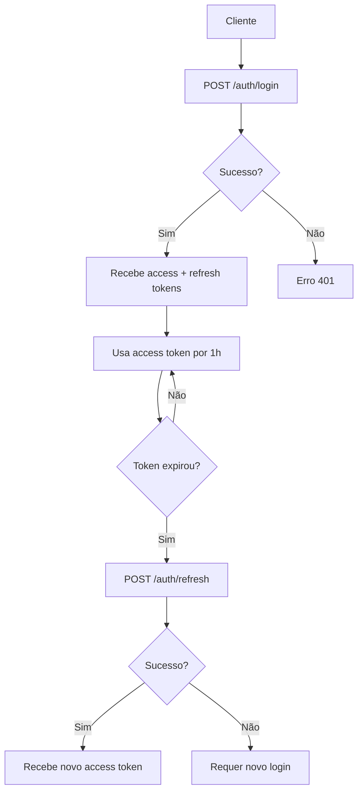

### [Sessão Paralela: Tech Leader]
# DIYAPP Evolution - V12 Core - Arquitetura de Microsserviços

## Estrutura do Projeto

```
diyapp-v12-core/
├── README.md
├── package.json
├── docker-compose.yml
├── .env.example
├── .gitignore
├── docs/
│   ├── ADRs/
│   ├── API-Contracts/
│   └── Engineering-Standards.md
├── scripts/
│   ├── deploy.sh
│   ├── health-check.sh
│   └── migration-runner.js
├── shared/
│   ├── types/
│   ├── utils/
│   ├── config/
│   └── events/
└── services/
    ├── api-gateway/
    ├── auth-service/
    ├── user-service/
    ├── task-service/
    ├── notification-service/
    ├── file-service/
    └── monitoring-service/
```

## ADR-001: Arquitetura de Microsserviços V12

**Data:** 2024-01-15
**Status:** Aceita
**Autores:** Tech Lead + Especialista Infra

### CONTEXTO:
A V11 do DIYAPP enfrenta problemas de escalabilidade devido à arquitetura monolítica. O sistema precisa suportar:
- 100k usuários concorrentes
- Deploy independente por módulo
- Isolamento de falhas
- Evolução tecnológica independente por serviço

### DECISÃO:
Adotar arquitetura de microsserviços baseada em eventos com os seguintes princípios:
1. Cada serviço é independente com seu próprio banco de dados
2. Comunicação via eventos assíncronos (Kafka) para desacoplamento
3. API Gateway como ponto único de entrada
4. Circuit Breaker para resiliência
5. Observabilidade unificada (logs, métricas, traces)

### OPÇÕES CONSIDERADAS:
- **Opção A:** Monolito modularizado - Prós: Simples deploy, transações ACID fáceis. Contras: Escalabilidade limitada, acoplamento tecnológico.
- **Opção B:** Microsserviços síncronos (REST) - Prós: Independência de deploy. Contras: Acoplamento temporal, cascata de falhas.
- **Opção C:** Microsserviços assíncronos (Eventos) - Prós: Desacoplamento total, resiliência. Contras: Complexidade eventual consistency.

**Opção escolhida:** C - Justificativa: Melhor isolamento de falhas, escalabilidade horizontal independente, permite evolução tecnológica por serviço.

### CONSEQUÊNCIAS:
**Positivas:** 
- Deploy independente por serviço
- Escalabilidade granular
- Isolamento de falhas
- Stack tecnológica independente por serviço

**Negativas:**
- Complexidade de distributed transactions
- Eventual consistency
- Overhead de infraestrutura
- Debug distribuído mais complexo

**Riscos:**
- Latência em cadeias de eventos longas (mitigar com timeouts e DLQ)
- Perda de eventos (mitigar com idempotência e retry com backoff)
- Monitoramento distribuído complexo (mitigar com OpenTelemetry)

### REVISÃO: 2024-04-15

---

## Engineering Standards V12

```markdown
# Engineering Standards - DIYAPP V12

## 1. Padrões de Código

### 1.1 TypeScript
- Strict mode obrigatório
- Interfaces sobre types para extensibilidade
- Nomeclatura: PascalCase para tipos/interfaces, camelCase para variáveis
- Sem `any` - usar `unknown` com type guards

### 1.2 Estrutura de Serviço
```
service-name/
├── src/
│   ├── interfaces/
│   ├── domain/
│   ├── application/
│   ├── infrastructure/
│   ├── events/
│   └── index.ts
├── tests/
│   ├── unit/
│   ├── integration/
│   └── e2e/
├── Dockerfile
└── package.json
```

### 1.3 Testes
- Cobertura mínima: 80%
- Testes unitários: Jest
- Testes de integração: Supertest + Testcontainers
- Testes E2E: Cypress para frontend

## 2. Contratos de API

### 2.1 REST APIs
- Versionamento: `/api/v1/resource`
- Métodos HTTP semânticos
- Paginação: `?page=1&limit=20`
- Filtros: `?status=active&createdAfter=2024-01-01`
- Ordenação: `?sort=-createdAt,name`

### 2.2 Formato de Resposta
```json
{
  "success": true,
  "data": {},
  "meta": {
    "page": 1,
    "total": 100,
    "limit": 20
  },
  "errors": []
}
```

### 2.3 Códigos de Status
- 200: OK
- 201: Created
- 400: Bad Request
- 401: Unauthorized
- 403: Forbidden
- 404: Not Found
- 422: Validation Error
- 429: Rate Limit
- 500: Internal Server Error

## 3. Eventos Assíncronos

### 3.1 Formato de Evento
```typescript
interface BaseEvent {
  eventId: string;
  eventType: string;
  eventVersion: string;
  timestamp: string;
  source: string;
  correlationId: string;
  payload: unknown;
}
```

### 3.2 Tópicos Kafka
- Nomeclatura: `domain.action.entity`
- Exemplos: 
  - `user.created`
  - `task.assigned`
  - `notification.sent`

## 4. Banco de Dados

### 4.1 Isolamento por Serviço
- Cada serviço tem seu próprio banco
- Sem joins entre bancos de serviços diferentes
- Replicação somente leitura permitida

### 4.2 Migrações
- Versionadas
- Reversíveis
- Testadas em staging antes de produção

## 5. Observabilidade

### 5.1 Logs
- Estrutura JSON
- Níveis: error, warn, info, debug
- Correlation ID em todas as entradas

### 5.2 Métricas
- Prometheus format
- Latência por endpoint
- Taxa de erro por serviço
- Uso de recursos

### 5.3 Tracing
- OpenTelemetry
- Propagação de context entre serviços
- Sampling rate: 10% em produção
```

---

## Contratos de API - Especificações OpenAPI

### `shared/types/api-contracts.ts`

```typescript
// Tipos compartilhados entre serviços
export interface ApiResponse<T = any> {
  success: boolean;
  data?: T;
  meta?: PaginationMeta;
  errors?: ApiError[];
  timestamp: string;
}

export interface PaginationMeta {
  page: number;
  total: number;
  limit: number;
  totalPages: number;
}

export interface ApiError {
  code: string;
  message: string;
  field?: string;
  details?: Record<string, any>;
}

export interface ValidationError {
  field: string;
  message: string;
  code: string;
}

// Eventos compartilhados
export interface DomainEvent {
  eventId: string;
  eventType: string;
  eventVersion: string;
  timestamp: string;
  source: string;
  correlationId: string;
  payload: Record<string, any>;
}

// Tipos de usuário
export interface User {
  id: string;
  email: string;
  name: string;
  status: 'active' | 'inactive' | 'suspended';
  roles: string[];
  createdAt: string;
  updatedAt: string;
}

export interface Task {
  id: string;
  title: string;
  description: string;
  status: 'pending' | 'in_progress' | 'completed' | 'blocked';
  priority: 'low' | 'medium' | 'high' | 'critical';
  assigneeId?: string;
  createdBy: string;
  dueDate?: string;
  createdAt: string;
  updatedAt: string;
}
```

### `docs/API-Contracts/auth-service.yaml`

```yaml
openapi: 3.0.0
info:
  title: Auth Service API
  version: 1.0.0
  description: Serviço de autenticação e autorização

servers:
  - url: http://auth-service:3001
    description: Serviço interno
  - url: https://api.diyapp.com/auth
    description: API Gateway

paths:
  /auth/login:
    post:
      summary: Login de usuário
      tags:
        - Auth
      requestBody:
        required: true
        content:
          application/json:
            schema:
              type: object
              required:
                - email
                - password
              properties:
                email:
                  type: string
                  format: email
                password:
                  type: string
                  minLength: 8
      responses:
        '200':
          description: Login bem sucedido
          content:
            application/json:
              schema:
                type: object
                properties:
                  accessToken:
                    type: string
                  refreshToken:
                    type: string
                  expiresIn:
                    type: integer
                  user:
                    $ref: '#/components/schemas/User'
        '401':
          description: Credenciais inválidas
        '429':
          description: Muitas tentativas

  /auth/refresh:
    post:
      summary: Refresh token
      tags:
        - Auth
      requestBody:
        required: true
        content:
          application/json:
            schema:
              type: object
              required:
                - refreshToken
              properties:
                refreshToken:
                  type: string
      responses:
        '200':
          description: Token atualizado
        '401':
          description: Refresh token inválido

components:
  schemas:
    User:
      type: object
      properties:
        id:
          type: string
        email:
          type: string
        name:
          type: string
        roles:
          type: array
          items:
            type: string
```

### `docs/API-Contracts/task-service.yaml`

```yaml
openapi: 3.0.0
info:
  title: Task Service API
  version: 1.0.0
  description: Gerenciamento de tarefas

paths:
  /tasks:
    get:
      summary: Listar tarefas
      tags:
        - Tasks
      parameters:
        - name: page
          in: query
          schema:
            type: integer
            minimum: 1
            default: 1
        - name: limit
          in: query
          schema:
            type: integer
            minimum: 1
            maximum: 100
            default: 20
        - name: status
          in: query
          schema:
            type: string
            enum: [pending, in_progress, completed, blocked]
        - name: assigneeId
          in: query
          schema:
            type: string
      responses:
        '200':
          description: Lista de tarefas
          content:
            application/json:
              schema:
                type: object
                properties:
                  data:
                    type: array
                    items:
                      $ref: '#/components/schemas/Task'
                  meta:
                    $ref: '#/components/schemas/PaginationMeta'

    post:
      summary: Criar tarefa
      tags:
        - Tasks
      security:
        - BearerAuth: []
      requestBody:
        required: true
        content:
          application/json:
            schema:
              $ref: '#/components/schemas/CreateTaskRequest'
      responses:
        '201':
          description: Tarefa criada
        '422':
          description: Validação falhou

  /tasks/{id}:
    get:
      summary: Buscar tarefa por ID
      tags:
        - Tasks
      parameters:
        - name: id
          in: path
          required: true
          schema:
            type: string
      responses:
        '200':
          description: Tarefa encontrada
        '404':
          description: Tarefa não encontrada

    put:
      summary: Atualizar tarefa
      tags:
        - Tasks
      security:
        - BearerAuth: []
      parameters:
        - name: id
          in: path
          required: true
          schema:
            type: string
      requestBody:
        required: true
        content:
          application/json:
            schema:
              $ref: '#/components/schemas/UpdateTaskRequest'
      responses:
        '200':
          description: Tarefa atualizada
        '403':
          description: Sem permissão
        '404':
          description: Tarefa não encontrada

components:
  schemas:
    Task:
      type: object
      properties:
        id:
          type: string
        title:
          type: string
        description:
          type: string
        status:
          type: string
          enum: [pending, in_progress, completed, blocked]
        priority:
          type: string
          enum: [low, medium, high, critical]
        assigneeId:
          type: string
        createdBy:
          type: string
        dueDate:
          type: string
          format: date-time
        createdAt:
          type: string
          format: date-time
        updatedAt:
          type: string
          format: date-time

    CreateTaskRequest:
      type: object
      required:
        - title
        - description
      properties:
        title:
          type: string
          minLength: 3
          maxLength: 200
        description:
          type: string
          minLength: 10
        priority:
          type: string
          enum: [low, medium, high, critical]
          default: medium
        assigneeId:
          type: string
        dueDate:
          type: string
          format: date-time

    PaginationMeta:
      type: object
      properties:
        page:
          type: integer
        total:
          type: integer
        limit:
          type: integer
        totalPages:
          type: integer

  securitySchemes:
    BearerAuth:
      type: http
      scheme: bearer
      bearerFormat: JWT
```

---

## Eventos do Sistema

### `shared/events/event-types.ts`

```typescript
// Tipos de eventos do sistema
export enum EventType {
  // Usuário
  USER_CREATED = 'user.created',
  USER_UPDATED = 'user.updated',
  USER_DELETED = 'user.deleted',
  USER_ACTIVATED = 'user.activated',
  USER_SUSPENDED = 'user.suspended',
  
  // Autenticação
  USER_LOGGED_IN = 'user.logged_in',
  USER_LOGGED_OUT = 'user.logged_out',
  PASSWORD_CHANGED = 'user.password_changed',
  
  // Tarefas
  TASK_CREATED = 'task.created',
  TASK_UPDATED = 'task.updated',
  TASK_DELETED = 'task.deleted',
  TASK_ASSIGNED = 'task.assigned',
  TASK_COMPLETED = 'task.completed',
  TASK_OVERDUE = 'task.overdue',
  
  // Notificações
  NOTIFICATION_SENT = 'notification.sent',
  NOTIFICATION_READ = 'notification.read',
  
  // Sistema
  SERVICE_HEALTH_CHANGED = 'service.health_changed',
  RATE_LIMIT_EXCEEDED = 'system.rate_limit_exceeded',
  AUDIT_LOG_CREATED = 'audit.log_created'
}

// Payloads dos eventos
export interface UserCreatedPayload {
  userId: string;
  email: string;
  name: string;
  source: 'registration' | 'invitation' | 'admin';
}

export interface UserUpdatedPayload {
  userId: string;
  updatedFields: string[];
  oldValues: Record<string, any>;
  newValues: Record<string, any>;
}

export interface TaskCreatedPayload {
  taskId: string;
  title: string;
  createdBy: string;
  assigneeId?: string;
  dueDate?: string;
}

export interface TaskAssignedPayload {
  taskId: string;
  previousAssigneeId?: string;
  newAssigneeId: string;
  assignedBy: string;
}

export interface NotificationSentPayload {
  notificationId: string;
  userId: string;
  type: 'email' | 'push' | 'in_app';
  title: string;
  message: string;
  metadata?: Record<string, any>;
}

// Factory de eventos
export class EventFactory {
  static create<T extends Record<string, any>>(
    eventType: EventType,
    source: string,
    correlationId: string,
    payload: T
  ): DomainEvent {
    return {
      eventId: crypto.randomUUID(),
      eventType,
      eventVersion: '1.0.0',
      timestamp: new Date().toISOString(),
      source,
      correlationId,
      payload
    };
  }
}
```

---

## Configuração Base do Serviço

### `shared/config/base-service.ts`

```typescript
import express, { Application, Request, Response, NextFunction } from 'express';
import helmet from 'helmet';
import cors from 'cors';
import compression from 'compression';
import rateLimit from 'express-rate-limit';
import { createLogger, format, transports } from 'winston';
import { Kafka, Producer, Consumer } from 'kafkajs';
import { Pool } from 'pg';
import Redis from 'ioredis';
import { v4 as uuidv4 } from 'uuid';

export interface ServiceConfig {
  name: string;
  port: number;
  database: {
    host: string;
    port: number;
    name: string;
    user: string;
    password: string;
  };
  redis: {
    host: string;
    port: number;
  };
  kafka: {
    brokers: string[];
    clientId: string;
  };
  jwtSecret: string;
  environment: 'development' | 'staging' | 'production';
}

export class BaseService {
  public app: Application;
  public config: Service

### [Sessão Paralela: UX Designer]
# DIYAPP Evolution - V12 Core - Design System

Vou criar um Design System completo e funcional para a V12, incluindo tokens, componentes, wireframes de alta fidelidade e protótipo interativo.

## Estrutura do Projeto

```
diyapp-v12-design-system/
├── index.html              # Dashboard principal do Design System
├── style.css              # Estilos principais
├── design-system.js       # Lógica do Design System
├── tokens.json           # Tokens de design
├── components/           # Componentes implementados
│   ├── button.js
│   ├── input.js
│   ├── card.js
│   └── modal.js
├── wireframes/           # Wireframes de alta fidelidade
│   ├── dashboard.html
│   ├── chat-interface.html
│   └── settings.html
└── prototype/           # Protótipo interativo
    ├── prototype.js
    └── prototype.css
```

## 1. index.html - Dashboard do Design System

```html
<!DOCTYPE html>
<html lang="pt-BR">
<head>
    <meta charset="UTF-8">
    <meta name="viewport" content="width=device-width, initial-scale=1.0">
    <title>DIYAPP V12 - Design System</title>
    <link rel="stylesheet" href="style.css">
    <link rel="stylesheet" href="https://cdnjs.cloudflare.com/ajax/libs/font-awesome/6.4.0/css/all.min.css">
</head>
<body>
    <div class="app-container">
        <!-- Sidebar -->
        <nav class="sidebar">
            <div class="sidebar-header">
                <h1 class="logo">
                    <i class="fas fa-cube"></i>
                    <span>V12 DS</span>
                </h1>
                <div class="version-badge">v12.0.0</div>
            </div>
            
            <div class="sidebar-search">
                <div class="search-input">
                    <i class="fas fa-search"></i>
                    <input type="text" placeholder="Buscar componentes..." id="searchComponents">
                </div>
            </div>
            
            <ul class="sidebar-menu">
                <li class="menu-section">Fundação</li>
                <li><a href="#colors" class="active"><i class="fas fa-palette"></i> Cores</a></li>
                <li><a href="#typography"><i class="fas fa-font"></i> Tipografia</a></li>
                <li><a href="#spacing"><i class="fas fa-border-all"></i> Espaçamento</a></li>
                <li><a href="#elevation"><i class="fas fa-layer-group"></i> Elevação</a></li>
                
                <li class="menu-section">Componentes</li>
                <li><a href="#buttons"><i class="fas fa-square"></i> Botões</a></li>
                <li><a href="#inputs"><i class="fas fa-edit"></i> Inputs</a></li>
                <li><a href="#cards"><i class="fas fa-id-card"></i> Cards</a></li>
                <li><a href="#modals"><i class="fas fa-window-maximize"></i> Modais</a></li>
                <li><a href="#navigation"><i class="fas fa-bars"></i> Navegação</a></li>
                <li><a href="#feedback"><i class="fas fa-comment-alt"></i> Feedback</a></li>
                
                <li class="menu-section">Padrões</li>
                <li><a href="#loading"><i class="fas fa-spinner"></i> Estados de Carregamento</a></li>
                <li><a href="#empty-states"><i class="fas fa-inbox"></i> Estados Vazios</a></li>
                <li><a href="#error-states"><i class="fas fa-exclamation-triangle"></i> Tratamento de Erros</a></li>
                <li><a href="#ai-patterns"><i class="fas fa-robot"></i> Padrões de IA</a></li>
                
                <li class="menu-section">Prototipagem</li>
                <li><a href="#wireframes"><i class="fas fa-pencil-ruler"></i> Wireframes</a></li>
                <li><a href="#prototype" id="prototypeLink"><i class="fas fa-play-circle"></i> Protótipo Interativo</a></li>
            </ul>
            
            <div class="sidebar-footer">
                <div class="accessibility-badge">
                    <i class="fas fa-universal-access"></i>
                    <span>WCAG 2.1 AA</span>
                </div>
                <div class="system-status">
                    <div class="status-indicator active"></div>
                    <span>Sistema Ativo</span>
                </div>
            </div>
        </nav>
        
        <!-- Main Content -->
        <main class="main-content">
            <header class="content-header">
                <div class="header-left">
                    <h2 id="currentSection">Cores</h2>
                    <p class="section-description">Tokens de cores primárias, secundárias e neutras</p>
                </div>
                <div class="header-right">
                    <button class="btn btn-secondary" id="copyTokens">
                        <i class="fas fa-copy"></i> Copiar Tokens
                    </button>
                    <button class="btn btn-primary" id="exportDS">
                        <i class="fas fa-download"></i> Exportar DS
                    </button>
                </div>
            </header>
            
            <div class="content-body">
                <!-- Colors Section -->
                <section id="colors" class="section active">
                    <div class="section-header">
                        <h3>Paleta de Cores</h3>
                        <p>Tokens de cores seguindo WCAG 2.1 AA (contraste mínimo 4.5:1)</p>
                    </div>
                    
                    <div class="color-grid">
                        <div class="color-category">
                            <h4>Primárias</h4>
                            <div class="color-tokens">
                                <div class="color-token" data-token="primary-50" style="background-color: #e8f4ff;">
                                    <span class="token-name">primary-50</span>
                                    <span class="token-value">#e8f4ff</span>
                                </div>
                                <div class="color-token" data-token="primary-100" style="background-color: #c5e2ff;">
                                    <span class="token-name">primary-100</span>
                                    <span class="token-value">#c5e2ff</span>
                                </div>
                                <div class="color-token" data-token="primary-200" style="background-color: #9dcaff;">
                                    <span class="token-name">primary-200</span>
                                    <span class="token-value">#9dcaff</span>
                                </div>
                                <div class="color-token" data-token="primary-300" style="background-color: #6aafff;">
                                    <span class="token-name">primary-300</span>
                                    <span class="token-value">#6aafff</span>
                                </div>
                                <div class="color-token" data-token="primary-400" style="background-color: #3b8fff;">
                                    <span class="token-name">primary-400</span>
                                    <span class="token-value">#3b8fff</span>
                                </div>
                                <div class="color-token" data-token="primary-500" style="background-color: #0066ff;">
                                    <span class="token-name">primary-500</span>
                                    <span class="token-value">#0066ff</span>
                                </div>
                                <div class="color-token" data-token="primary-600" style="background-color: #0052d6;">
                                    <span class="token-name">primary-600</span>
                                    <span class="token-value">#0052d6</span>
                                </div>
                                <div class="color-token" data-token="primary-700" style="background-color: #0041ad;">
                                    <span class="token-name">primary-700</span>
                                    <span class="token-value">#0041ad</span>
                                </div>
                                <div class="color-token" data-token="primary-800" style="background-color: #003285;">
                                    <span class="token-name">primary-800</span>
                                    <span class="token-value">#003285</span>
                                </div>
                                <div class="color-token" data-token="primary-900" style="background-color: #00255c;">
                                    <span class="token-name">primary-900</span>
                                    <span class="token-value">#00255c</span>
                                </div>
                            </div>
                        </div>
                        
                        <div class="color-category">
                            <h4>Neutras</h4>
                            <div class="color-tokens">
                                <div class="color-token" data-token="neutral-50" style="background-color: #f8fafc;">
                                    <span class="token-name">neutral-50</span>
                                    <span class="token-value">#f8fafc</span>
                                </div>
                                <div class="color-token" data-token="neutral-100" style="background-color: #f1f5f9;">
                                    <span class="token-name">neutral-100</span>
                                    <span class="token-value">#f1f5f9</span>
                                </div>
                                <div class="color-token" data-token="neutral-200" style="background-color: #e2e8f0;">
                                    <span class="token-name">neutral-200</span>
                                    <span class="token-value">#e2e8f0</span>
                                </div>
                                <div class="color-token" data-token="neutral-300" style="background-color: #cbd5e1;">
                                    <span class="token-name">neutral-300</span>
                                    <span class="token-value">#cbd5e1</span>
                                </div>
                                <div class="color-token" data-token="neutral-400" style="background-color: #94a3b8;">
                                    <span class="token-name">neutral-400</span>
                                    <span class="token-value">#94a3b8</span>
                                </div>
                                <div class="color-token" data-token="neutral-500" style="background-color: #64748b;">
                                    <span class="token-name">neutral-500</span>
                                    <span class="token-value">#64748b</span>
                                </div>
                                <div class="color-token" data-token="neutral-600" style="background-color: #475569;">
                                    <span class="token-name">neutral-600</span>
                                    <span class="token-value">#475569</span>
                                </div>
                                <div class="color-token" data-token="neutral-700" style="background-color: #334155;">
                                    <span class="token-name">neutral-700</span>
                                    <span class="token-value">#334155</span>
                                </div>
                                <div class="color-token" data-token="neutral-800" style="background-color: #1e293b;">
                                    <span class="token-name">neutral-800</span>
                                    <span class="token-value">#1e293b</span>
                                </div>
                                <div class="color-token" data-token="neutral-900" style="background-color: #0f172a;">
                                    <span class="token-name">neutral-900</span>
                                    <span class="token-value">#0f172a</span>
                                </div>
                            </div>
                        </div>
                        
                        <div class="color-category">
                            <h4>Semânticas</h4>
                            <div class="color-tokens">
                                <div class="color-token" data-token="success-500" style="background-color: #10b981;">
                                    <span class="token-name">success-500</span>
                                    <span class="token-value">#10b981</span>
                                </div>
                                <div class="color-token" data-token="warning-500" style="background-color: #f59e0b;">
                                    <span class="token-name">warning-500</span>
                                    <span class="token-value">#f59e0b</span>
                                </div>
                                <div class="color-token" data-token="error-500" style="background-color: #ef4444;">
                                    <span class="token-name">error-500</span>
                                    <span class="token-value">#ef4444</span>
                                </div>
                                <div class="color-token" data-token="info-500" style="background-color: #3b82f6;">
                                    <span class="token-name">info-500</span>
                                    <span class="token-value">#3b82f6</span>
                                </div>
                            </div>
                        </div>
                    </div>
                    
                    <div class="contrast-checker">
                        <h4>Verificador de Contraste WCAG</h4>
                        <div class="contrast-inputs">
                            <div class="color-picker">
                                <label>Cor de Fundo</label>
                                <input type="color" id="bgColor" value="#0066ff">
                                <input type="text" id="bgHex" value="#0066ff">
                            </div>
                            <div class="color-picker">
                                <label>Cor do Texto</label>
                                <input type="color" id="textColor" value="#ffffff">
                                <input type="text" id="textHex" value="#ffffff">
                            </div>
                        </div>
                        <div class="contrast-result">
                            <div class="contrast-ratio">
                                <span>Razão de Contraste:</span>
                                <strong id="contrastRatio">8.59:1</strong>
                            </div>
                            <div class="wcag-compliance">
                                <div class="wcag-level" data-level="aa-small">
                                    <i class="fas fa-check-circle"></i>
                                    <span>WCAG AA (Texto Pequeno)</span>
                                </div>
                                <div class="wcag-level" data-level="aa-large">
                                    <i class="fas fa-check-circle"></i>
                                    <span>WCAG AA (Texto Grande)</span>
                                </div>
                                <div class="wcag-level" data-level="aaa">
                                    <i class="fas fa-check-circle"></i>
                                    <span>WCAG AAA</span>
                                </div>
                            </div>
                        </div>
                    </div>
                </section>
                
                <!-- Typography Section -->
                <section id="typography" class="section">
                    <div class="section-header">
                        <h3>Escala Tipográfica</h3>
                        <p>Hierarquia de tipos com pesos e line-heights definidos</p>
                    </div>
                    
                    <div class="typography-scale">
                        <div class="type-sample" data-token="display-xl">
                            <div class="type-info">
                                <span class="type-name">Display XL</span>
                                <span class="type-token">font-display-xl</span>
                            </div>
                            <div class="type-preview">
                                <h1 class="display-xl">Design System V12</h1>
                                <div class="type-specs">
                                    <span>64px / 4rem</span>
                                    <span>Semibold (600)</span>
                                    <span>Line-height: 1.2</span>
                                </div>
                            </div>
                        </div>
                        
                        <div class="type-sample" data-token="heading-lg">
                            <div class="type-info">
                                <span class="type-name">Heading LG</span>
                                <span class="type-token">font-heading-lg</span>
                            </div>
                            <div class="type-preview">
                                <h2 class="heading-lg">Componentes Fundamentais</h2>
                                <div class="type-specs">
                                    <span>32px / 2rem</span>
                                    <span>Semibold (600)</span>
                                    <span>Line-height: 1.3</span>
                                </div>
                            </div>
                        </div>
                        
                        <div class="type-sample" data-token="body-md">
                            <div class="type-info">
                                <span class="type-name">Body MD</span>
                                <span class="type-token">font-body-md</span>
                            </div>
                            <div class="type-preview">
                                <p class="body-md">Este é um exemplo de texto em corpo médio. Utilizado para parágrafos e conteúdo principal da aplicação.</p>
                                <div class="type-specs">
                                    <span>16px / 1rem</span>
                                    <span>Regular (400)</span>
                                    <span>Line-height: 1.5</span>
                                </div>
                            </div>
                        </div>
                        
                        <div class="type-sample" data-token="caption">
                            <div class="type-info">
                                <span class="type-name">Caption</span>
                                <span class="type-token">font-caption</span>
                            </div>
                            <div class="type-preview">
                                <p class="caption">Texto auxiliar para legendas e informações secundárias</p>
                                <div class="type-specs">
                                    <span>12px / 0.75rem</span>
                                    <span>Regular (400)</span>
                                    <span>Line-height: 1.4</span>
                                </div>
                            </div>
                        </div>
                    </div>
                </section>
                
                <!-- Buttons Section -->
                <section id="buttons" class="section">
                    <div class="section-header">
                        <h3>Botões</h3>
                        <p>Componentes de ação com todos os estados especificados</p>
                    </div>
                    
                    <div class="component-demo">
                        <div class="demo-section">
                            <h4>Variações</h4>
                            <div class="button-grid">
                                <button class="btn btn-primary">Primário</button

### [Sessão Paralela: Backend]
# DIYAPP Evolution - V12 Core - Serviços Backend

## Estrutura do Projeto

```
diyapp-v12-core/
├── src/
│   ├── core/
│   │   ├── auth/
│   │   ├── projects/
│   │   ├── tasks/
│   │   └── shared/
│   ├── middleware/
│   ├── utils/
│   └── types/
├── migrations/
├── tests/
├── docker/
└── docs/
```

## 1. Configuração Inicial

### package.json
```json
{
  "name": "diyapp-v12-core",
  "version": "1.0.0",
  "description": "DIYAPP Evolution V12 Core Services",
  "main": "dist/index.js",
  "scripts": {
    "build": "tsc",
    "start": "node dist/index.js",
    "dev": "ts-node-dev src/index.ts",
    "test": "jest",
    "test:coverage": "jest --coverage",
    "migrate:up": "node dist/migrations/run.js up",
    "migrate:down": "node dist/migrations/run.js down",
    "lint": "eslint src --ext .ts",
    "type-check": "tsc --noEmit"
  },
  "dependencies": {
    "express": "^4.18.2",
    "pg": "^8.11.3",
    "bcrypt": "^5.1.1",
    "jsonwebtoken": "^9.0.2",
    "zod": "^3.22.4",
    "helmet": "^7.0.0",
    "cors": "^2.8.5",
    "express-rate-limit": "^7.1.5",
    "winston": "^3.11.0",
    "uuid": "^9.0.1",
    "axios": "^1.6.2",
    "circuit-breaker-js": "^0.2.0",
    "redis": "^4.6.11",
    "bull": "^4.11.5",
    "joi": "^17.11.0"
  },
  "devDependencies": {
    "@types/express": "^4.17.21",
    "@types/node": "^20.10.5",
    "@types/bcrypt": "^5.0.1",
    "@types/jsonwebtoken": "^9.0.5",
    "@types/uuid": "^9.0.7",
    "@types/cors": "^2.8.17",
    "typescript": "^5.3.3",
    "ts-node-dev": "^2.0.0",
    "jest": "^29.7.0",
    "@types/jest": "^29.5.11",
    "ts-jest": "^29.1.1",
    "supertest": "^6.3.3",
    "@types/supertest": "^6.0.2",
    "eslint": "^8.56.0",
    "@typescript-eslint/eslint-plugin": "^6.15.0",
    "@typescript-eslint/parser": "^6.15.0"
  }
}
```

### tsconfig.json
```json
{
  "compilerOptions": {
    "target": "ES2022",
    "module": "commonjs",
    "lib": ["ES2022"],
    "outDir": "./dist",
    "rootDir": "./src",
    "strict": true,
    "esModuleInterop": true,
    "skipLibCheck": true,
    "forceConsistentCasingInFileNames": true,
    "resolveJsonModule": true,
    "declaration": true,
    "declarationMap": true,
    "sourceMap": true,
    "noUnusedLocals": true,
    "noUnusedParameters": true,
    "noImplicitReturns": true,
    "noFallthroughCasesInSwitch": true,
    "moduleResolution": "node",
    "allowSyntheticDefaultImports": true,
    "experimentalDecorators": true,
    "emitDecoratorMetadata": true
  },
  "include": ["src/**/*"],
  "exclude": ["node_modules", "dist", "**/*.test.ts"]
}
```

## 2. Configuração do Banco de Dados

### src/config/database.ts
```typescript
import { Pool, PoolConfig } from 'pg';
import winston from 'winston';

export interface DatabaseConfig {
  host: string;
  port: number;
  database: string;
  user: string;
  password: string;
  max: number;
  idleTimeoutMillis: number;
  connectionTimeoutMillis: number;
}

export class Database {
  private pool: Pool;
  private logger: winston.Logger;

  constructor(config: DatabaseConfig, logger: winston.Logger) {
    this.logger = logger.child({ service: 'database' });
    
    const poolConfig: PoolConfig = {
      host: config.host,
      port: config.port,
      database: config.database,
      user: config.user,
      password: config.password,
      max: config.max,
      idleTimeoutMillis: config.idleTimeoutMillis,
      connectionTimeoutMillis: config.connectionTimeoutMillis,
    };

    this.pool = new Pool(poolConfig);

    this.pool.on('connect', () => {
      this.logger.debug('New database connection established');
    });

    this.pool.on('error', (err: Error) => {
      this.logger.error('Unexpected database error', { error: err.message });
    });
  }

  async query<T = any>(text: string, params?: any[]): Promise<T[]> {
    const start = Date.now();
    const correlationId = this.generateCorrelationId();
    
    try {
      this.logger.debug('Executing query', {
        correlationId,
        query: text,
        params: this.maskSensitiveData(params),
      });

      const result = await this.pool.query(text, params);
      const duration = Date.now() - start;

      this.logger.debug('Query executed successfully', {
        correlationId,
        duration,
        rowCount: result.rowCount,
      });

      return result.rows;
    } catch (error: any) {
      const duration = Date.now() - start;
      
      this.logger.error('Query execution failed', {
        correlationId,
        duration,
        error: error.message,
        query: text,
        params: this.maskSensitiveData(params),
      });

      throw error;
    }
  }

  async transaction<T>(callback: (client: any) => Promise<T>): Promise<T> {
    const client = await this.pool.connect();
    const correlationId = this.generateCorrelationId();

    try {
      await client.query('BEGIN');
      this.logger.debug('Transaction started', { correlationId });

      const result = await callback(client);

      await client.query('COMMIT');
      this.logger.debug('Transaction committed', { correlationId });

      return result;
    } catch (error: any) {
      await client.query('ROLLBACK');
      this.logger.error('Transaction rolled back', {
        correlationId,
        error: error.message,
      });
      throw error;
    } finally {
      client.release();
    }
  }

  async close(): Promise<void> {
    await this.pool.end();
    this.logger.info('Database connection pool closed');
  }

  private generateCorrelationId(): string {
    return `db_${Date.now()}_${Math.random().toString(36).substr(2, 9)}`;
  }

  private maskSensitiveData(params?: any[]): any[] {
    if (!params) return [];
    
    return params.map(param => {
      if (typeof param === 'string') {
        // Mask emails
        if (param.includes('@')) {
          const [local, domain] = param.split('@');
          return `${local.charAt(0)}***@${domain}`;
        }
        // Mask tokens (JWT-like)
        if (param.length > 50 && param.includes('.')) {
          return '***MASKED_TOKEN***';
        }
      }
      return param;
    });
  }
}
```

## 3. Configuração de Logging

### src/config/logger.ts
```typescript
import winston from 'winston';
import { Request, Response } from 'express';

export interface LogEntry {
  level: string;
  timestamp: string;
  correlation_id?: string;
  user_id?: string;
  endpoint?: string;
  duration_ms?: number;
  status?: number;
  message: string;
  error?: string;
  stack?: string;
  metadata?: Record<string, any>;
}

export class Logger {
  private logger: winston.Logger;
  private requestId = 0;

  constructor() {
    this.logger = winston.createLogger({
      level: process.env.LOG_LEVEL || 'info',
      format: winston.format.combine(
        winston.format.timestamp(),
        winston.format.json(),
        winston.format((info) => {
          // Remove sensitive data
          const maskedInfo = { ...info };
          if (maskedInfo.metadata) {
            maskedInfo.metadata = this.maskSensitiveData(maskedInfo.metadata);
          }
          return maskedInfo;
        })()
      ),
      transports: [
        new winston.transports.Console(),
        new winston.transports.File({
          filename: 'logs/error.log',
          level: 'error',
        }),
        new winston.transports.File({
          filename: 'logs/combined.log',
        }),
      ],
    });
  }

  child(metadata: Record<string, any>): winston.Logger {
    return this.logger.child(metadata);
  }

  info(message: string, metadata?: Record<string, any>): void {
    this.logger.info(message, metadata);
  }

  error(message: string, metadata?: Record<string, any>): void {
    this.logger.error(message, metadata);
  }

  warn(message: string, metadata?: Record<string, any>): void {
    this.logger.warn(message, metadata);
  }

  debug(message: string, metadata?: Record<string, any>): void {
    this.logger.debug(message, metadata);
  }

  http(req: Request, res: Response, duration: number): void {
    const correlationId = this.getCorrelationId(req);
    const userId = (req as any).user?.id;

    const logEntry: LogEntry = {
      level: 'info',
      timestamp: new Date().toISOString(),
      correlation_id: correlationId,
      user_id: userId,
      endpoint: `${req.method} ${req.path}`,
      duration_ms: duration,
      status: res.statusCode,
      message: 'HTTP request completed',
    };

    this.logger.info(logEntry.message, logEntry);
  }

  private getCorrelationId(req: Request): string {
    let correlationId = req.headers['x-correlation-id'] as string;
    if (!correlationId) {
      correlationId = `req_${this.requestId++}_${Date.now()}`;
      req.headers['x-correlation-id'] = correlationId;
    }
    return correlationId;
  }

  private maskSensitiveData(data: Record<string, any>): Record<string, any> {
    const masked = { ...data };
    
    const sensitiveFields = [
      'password',
      'token',
      'access_token',
      'refresh_token',
      'authorization',
      'email',
      'cpf',
      'credit_card',
      'card_number',
      'cvv',
    ];

    for (const field of sensitiveFields) {
      if (masked[field]) {
        masked[field] = '***MASKED***';
      }
    }

    return masked;
  }
}
```

## 4. Middleware de Segurança e Validação

### src/middleware/security.ts
```typescript
import { Request, Response, NextFunction } from 'express';
import helmet from 'helmet';
import rateLimit from 'express-rate-limit';
import { ZodSchema } from 'zod';
import { Logger } from '../config/logger';

export class SecurityMiddleware {
  private logger: Logger;

  constructor(logger: Logger) {
    this.logger = logger;
  }

  helmet() {
    return helmet({
      contentSecurityPolicy: {
        directives: {
          defaultSrc: ["'self'"],
          styleSrc: ["'self'", "'unsafe-inline'"],
          scriptSrc: ["'self'"],
          imgSrc: ["'self'", "data:", "https:"],
        },
      },
      hsts: {
        maxAge: 31536000,
        includeSubDomains: true,
        preload: true,
      },
    });
  }

  rateLimiter() {
    return rateLimit({
      windowMs: 15 * 60 * 1000, // 15 minutes
      max: 100, // Limit each IP to 100 requests per windowMs
      message: {
        error: 'Too many requests from this IP, please try again later.',
      },
      standardHeaders: true,
      legacyHeaders: false,
      handler: (req: Request, res: Response) => {
        this.logger.warn('Rate limit exceeded', {
          ip: req.ip,
          endpoint: req.path,
        });
        res.status(429).json({
          error: 'Too many requests from this IP, please try again later.',
        });
      },
    });
  }

  validate(schema: ZodSchema) {
    return (req: Request, res: Response, next: NextFunction) => {
      try {
        const result = schema.safeParse({
          body: req.body,
          query: req.query,
          params: req.params,
        });

        if (!result.success) {
          const errors = result.error.errors.map(err => ({
            field: err.path.join('.'),
            message: err.message,
          }));

          this.logger.warn('Validation failed', {
            endpoint: req.path,
            errors,
          });

          return res.status(400).json({
            error: 'Validation failed',
            details: errors,
          });
        }

        // Attach validated data to request
        (req as any).validated = result.data;
        next();
      } catch (error: any) {
        this.logger.error('Validation middleware error', {
          error: error.message,
          stack: error.stack,
        });
        res.status(500).json({ error: 'Internal server error' });
      }
    };
  }

  authenticate() {
    return async (req: Request, res: Response, next: NextFunction) => {
      try {
        const authHeader = req.headers.authorization;
        
        if (!authHeader || !authHeader.startsWith('Bearer ')) {
          this.logger.warn('Authentication failed - no token', {
            endpoint: req.path,
          });
          return res.status(401).json({ error: 'Authentication required' });
        }

        const token = authHeader.substring(7);
        
        // In a real implementation, verify JWT token
        // const decoded = await verifyToken(token);
        // (req as any).user = decoded;
        
        // For now, simulate authentication
        (req as any).user = { id: 'user_id_from_token', role: 'user' };
        
        next();
      } catch (error: any) {
        this.logger.error('Authentication failed', {
          error: error.message,
          endpoint: req.path,
        });
        res.status(401).json({ error: 'Invalid or expired token' });
      }
    };
  }

  authorize(requiredRole: string) {
    return (req: Request, res: Response, next: NextFunction) => {
      try {
        const user = (req as any).user;
        
        if (!user) {
          this.logger.warn('Authorization failed - no user', {
            endpoint: req.path,
          });
          return res.status(401).json({ error: 'Authentication required' });
        }

        if (user.role !== requiredRole && user.role !== 'admin') {
          this.logger.warn('Authorization failed - insufficient permissions', {
            endpoint: req.path,
            userId: user.id,
            userRole: user.role,
            requiredRole,
          });
          return res.status(403).json({ error: 'Insufficient permissions' });
        }

        next();
      } catch (error: any) {
        this.logger.error('Authorization middleware error', {
          error: error.message,
          stack: error.stack,
        });
        res.status(500).json({ error: 'Internal server error' });
      }
    };
  }
}
```

## 5. Circuit Breaker e Resiliência

### src/core/shared/resilience.ts
```typescript
import axios, { AxiosInstance, AxiosRequestConfig, AxiosResponse } from 'axios';
import CircuitBreaker from 'circuit-breaker-js';
import { Logger } from '../../config/logger';

export interface CircuitBreakerConfig {
  timeout: number;
  errorThresholdPercentage: number;
  resetTimeout: number;
}

export interface RetryConfig {
  maxRetries: number;
  baseDelay: number;
  maxDelay: number;
}

export class ResilientHttpClient {
  private client: AxiosInstance;
  private circuitBreaker: CircuitBreaker;
  private logger: Logger;
  private serviceName: string;

  constructor(
    serviceName: string,
    baseURL: string,
    logger: Logger,
    circuitBreakerConfig?: Partial<CircuitBreakerConfig>,
    retryConfig?: Partial<RetryConfig>
  ) {
    this.serviceName = serviceName;
    this.logger = logger.child({ service: `${serviceName}_http_client` });

    const defaultCircuitBreakerConfig: CircuitBreakerConfig = {
      timeout: 5000,
      errorThresholdPercentage: 50,
      resetTimeout: 30000,
    };

    const defaultRetryConfig: RetryConfig = {
      maxRetries: 3,
      baseDelay: 100,
      maxDelay: 5000,
    };

    const cbConfig = { ...defaultCircuitBreakerConfig, ...circuitBreakerConfig };
    const rtConfig = { ...defaultRetryConfig, ...retryConfig };

    this.client = axios.create({
      baseURL,
      timeout: cbConfig.timeout,
    });

    this.circuitBreaker = new CircuitBreaker({
      timeoutDuration: cbConfig.timeout,
      errorThreshold: cbConfig.errorThresholdPercentage,
      volumeThreshold: 10,
      onCircuitOpen: () => {
        this.logger.warn('Circuit breaker opened', { serviceName });
      },
      onCircuitClose: () => {
        this.logger.info('Circuit breaker closed', { serviceName });
      },
    });

    // Add retry interceptor
    this.client.interceptors.response.use(
      undefined,
      async (error) => {
        const config = error.config;
        
        if (!config || !config.retry) {
          config

### [Sessão Paralela: Frontend]
Vou construir uma aplicação React/Next.js com Design System profissional, implementando dashboard principal, modais e visualização em tempo real.

```typescript
// package.json
{
  "name": "diyapp-evolution-v12",
  "version": "1.0.0",
  "private": true,
  "scripts": {
    "dev": "next dev",
    "build": "next build",
    "start": "next start",
    "lint": "next lint",
    "test": "vitest run",
    "test:watch": "vitest",
    "type-check": "tsc --noEmit"
  },
  "dependencies": {
    "next": "14.2.5",
    "react": "^18",
    "react-dom": "^18",
    "class-variance-authority": "^0.7.0",
    "clsx": "^2.1.1",
    "tailwind-merge": "^2.2.1",
    "lucide-react": "^0.344.0",
    "date-fns": "^3.3.1",
    "recharts": "^2.10.4",
    "react-hook-form": "^7.50.1",
    "zod": "^3.22.4",
    "@hookform/resolvers": "^3.3.2",
    "sonner": "^1.4.1"
  },
  "devDependencies": {
    "@types/node": "^20",
    "@types/react": "^18",
    "@types/react-dom": "^18",
    "typescript": "^5",
    "tailwindcss": "^3.4.0",
    "autoprefixer": "^10.4.16",
    "postcss": "^8.4.33",
    "@typescript-eslint/eslint-plugin": "^7.1.0",
    "@typescript-eslint/parser": "^7.1.0",
    "eslint": "^8.57.0",
    "eslint-config-next": "14.2.5",
    "@testing-library/react": "^14.2.1",
    "@testing-library/jest-dom": "^6.4.2",
    "@testing-library/user-event": "^14.5.2",
    "vitest": "^1.4.0",
    "jsdom": "^24.0.0"
  }
}
```

```typescript
// tailwind.config.ts
import type { Config } from 'tailwindcss'

const config: Config = {
  darkMode: ['class'],
  content: [
    './pages/**/*.{ts,tsx}',
    './components/**/*.{ts,tsx}',
    './app/**/*.{ts,tsx}',
    './src/**/*.{ts,tsx}',
  ],
  theme: {
    container: {
      center: true,
      padding: '2rem',
      screens: {
        '2xl': '1400px',
      },
    },
    extend: {
      colors: {
        border: 'hsl(var(--border))',
        input: 'hsl(var(--input))',
        ring: 'hsl(var(--ring))',
        background: 'hsl(var(--background))',
        foreground: 'hsl(var(--foreground))',
        primary: {
          DEFAULT: 'hsl(var(--primary))',
          foreground: 'hsl(var(--primary-foreground))',
        },
        secondary: {
          DEFAULT: 'hsl(var(--secondary))',
          foreground: 'hsl(var(--secondary-foreground))',
        },
        destructive: {
          DEFAULT: 'hsl(var(--destructive))',
          foreground: 'hsl(var(--destructive-foreground))',
        },
        muted: {
          DEFAULT: 'hsl(var(--muted))',
          foreground: 'hsl(var(--muted-foreground))',
        },
        accent: {
          DEFAULT: 'hsl(var(--accent))',
          foreground: 'hsl(var(--accent-foreground))',
        },
        popover: {
          DEFAULT: 'hsl(var(--popover))',
          foreground: 'hsl(var(--popover-foreground))',
        },
        card: {
          DEFAULT: 'hsl(var(--card))',
          foreground: 'hsl(var(--card-foreground))',
        },
        success: {
          DEFAULT: 'hsl(var(--success))',
          foreground: 'hsl(var(--success-foreground))',
        },
        warning: {
          DEFAULT: 'hsl(var(--warning))',
          foreground: 'hsl(var(--warning-foreground))',
        },
        info: {
          DEFAULT: 'hsl(var(--info))',
          foreground: 'hsl(var(--info-foreground))',
        },
      },
      borderRadius: {
        lg: 'var(--radius)',
        md: 'calc(var(--radius) - 2px)',
        sm: 'calc(var(--radius) - 4px)',
      },
      fontFamily: {
        sans: ['var(--font-sans)', 'system-ui', 'sans-serif'],
        mono: ['var(--font-mono)', 'monospace'],
      },
      keyframes: {
        'accordion-down': {
          from: { height: '0' },
          to: { height: 'var(--radix-accordion-content-height)' },
        },
        'accordion-up': {
          from: { height: 'var(--radix-accordion-content-height)' },
          to: { height: '0' },
        },
        'fade-in': {
          from: { opacity: '0' },
          to: { opacity: '1' },
        },
        'fade-out': {
          from: { opacity: '1' },
          to: { opacity: '0' },
        },
        'slide-in': {
          from: { transform: 'translateY(10px)', opacity: '0' },
          to: { transform: 'translateY(0)', opacity: '1' },
        },
        'pulse-subtle': {
          '0%, 100%': { opacity: '1' },
          '50%': { opacity: '0.8' },
        },
      },
      animation: {
        'accordion-down': 'accordion-down 0.2s ease-out',
        'accordion-up': 'accordion-up 0.2s ease-out',
        'fade-in': 'fade-in 0.3s ease-out',
        'fade-out': 'fade-out 0.3s ease-out',
        'slide-in': 'slide-in 0.3s ease-out',
        'pulse-subtle': 'pulse-subtle 2s ease-in-out infinite',
      },
    },
  },
  plugins: [require('tailwindcss-animate')],
}

export default config
```

```css
/* app/globals.css */
@tailwind base;
@tailwind components;
@tailwind utilities;

@layer base {
  :root {
    --background: 0 0% 100%;
    --foreground: 222.2 84% 4.9%;
    --card: 0 0% 100%;
    --card-foreground: 222.2 84% 4.9%;
    --popover: 0 0% 100%;
    --popover-foreground: 222.2 84% 4.9%;
    --primary: 221.2 83.2% 53.3%;
    --primary-foreground: 210 40% 98%;
    --secondary: 210 40% 96.1%;
    --secondary-foreground: 222.2 47.4% 11.2%;
    --muted: 210 40% 96.1%;
    --muted-foreground: 215.4 16.3% 46.9%;
    --accent: 210 40% 96.1%;
    --accent-foreground: 222.2 47.4% 11.2%;
    --destructive: 0 84.2% 60.2%;
    --destructive-foreground: 210 40% 98%;
    --success: 142.1 76.2% 36.3%;
    --success-foreground: 355.7 100% 97.3%;
    --warning: 32.1 94.6% 43.7%;
    --warning-foreground: 210 40% 98%;
    --info: 199.4 94.4% 43.7%;
    --info-foreground: 210 40% 98%;
    --border: 214.3 31.8% 91.4%;
    --input: 214.3 31.8% 91.4%;
    --ring: 221.2 83.2% 53.3%;
    --radius: 0.75rem;
  }

  .dark {
    --background: 222.2 84% 4.9%;
    --foreground: 210 40% 98%;
    --card: 222.2 84% 4.9%;
    --card-foreground: 210 40% 98%;
    --popover: 222.2 84% 4.9%;
    --popover-foreground: 210 40% 98%;
    --primary: 217.2 91.2% 59.8%;
    --primary-foreground: 222.2 47.4% 11.2%;
    --secondary: 217.2 32.6% 17.5%;
    --secondary-foreground: 210 40% 98%;
    --muted: 217.2 32.6% 17.5%;
    --muted-foreground: 215 20.2% 65.1%;
    --accent: 217.2 32.6% 17.5%;
    --accent-foreground: 210 40% 98%;
    --destructive: 0 62.8% 30.6%;
    --destructive-foreground: 210 40% 98%;
    --success: 142.1 70.6% 45.3%;
    --success-foreground: 144.9 80.4% 10%;
    --warning: 32.1 94.6% 43.7%;
    --warning-foreground: 210 40% 98%;
    --info: 199.4 94.4% 43.7%;
    --info-foreground: 210 40% 98%;
    --border: 217.2 32.6% 17.5%;
    --input: 217.2 32.6% 17.5%;
    --ring: 224.3 76.3% 48%;
  }
}

@layer base {
  * {
    @apply border-border;
  }
  body {
    @apply bg-background text-foreground;
    font-feature-settings: "rlig" 1, "calt" 1;
  }
}

@layer utilities {
  .scrollbar-thin {
    scrollbar-width: thin;
  }
  
  .scrollbar-thin::-webkit-scrollbar {
    width: 6px;
    height: 6px;
  }
  
  .scrollbar-thin::-webkit-scrollbar-track {
    @apply bg-muted rounded-full;
  }
  
  .scrollbar-thin::-webkit-scrollbar-thumb {
    @apply bg-muted-foreground/30 rounded-full hover:bg-muted-foreground/50;
  }
}
```

```typescript
// lib/utils.ts
import { type ClassValue, clsx } from 'clsx'
import { twMerge } from 'tailwind-merge'

export function cn(...inputs: ClassValue[]) {
  return twMerge(clsx(inputs))
}

export function formatDate(date: Date | string): string {
  return new Intl.DateTimeFormat('en-US', {
    month: 'short',
    day: 'numeric',
    year: 'numeric',
    hour: '2-digit',
    minute: '2-digit',
  }).format(new Date(date))
}

export function truncateText(text: string, maxLength: number): string {
  if (text.length <= maxLength) return text
  return text.slice(0, maxLength) + '...'
}

export function generateId(): string {
  return Math.random().toString(36).substring(2) + Date.now().toString(36)
}
```

```typescript
// components/ui/button.tsx
import * as React from 'react'
import { cva, type VariantProps } from 'class-variance-authority'
import { cn } from '@/lib/utils'
import { Loader2 } from 'lucide-react'

const buttonVariants = cva(
  'inline-flex items-center justify-center whitespace-nowrap rounded-md text-sm font-medium ring-offset-background transition-colors focus-visible:outline-none focus-visible:ring-2 focus-visible:ring-ring focus-visible:ring-offset-2 disabled:pointer-events-none disabled:opacity-50',
  {
    variants: {
      variant: {
        default: 'bg-primary text-primary-foreground hover:bg-primary/90',
        destructive:
          'bg-destructive text-destructive-foreground hover:bg-destructive/90',
        outline:
          'border border-input bg-background hover:bg-accent hover:text-accent-foreground',
        secondary:
          'bg-secondary text-secondary-foreground hover:bg-secondary/80',
        ghost: 'hover:bg-accent hover:text-accent-foreground',
        link: 'text-primary underline-offset-4 hover:underline',
        success: 'bg-success text-success-foreground hover:bg-success/90',
        warning: 'bg-warning text-warning-foreground hover:bg-warning/90',
        info: 'bg-info text-info-foreground hover:bg-info/90',
      },
      size: {
        default: 'h-10 px-4 py-2',
        sm: 'h-9 rounded-md px-3',
        lg: 'h-11 rounded-md px-8',
        icon: 'h-10 w-10',
      },
    },
    defaultVariants: {
      variant: 'default',
      size: 'default',
    },
  }
)

export interface ButtonProps
  extends React.ButtonHTMLAttributes<HTMLButtonElement>,
    VariantProps<typeof buttonVariants> {
  loading?: boolean
  leftIcon?: React.ReactNode
  rightIcon?: React.ReactNode
}

const Button = React.forwardRef<HTMLButtonElement, ButtonProps>(
  ({ className, variant, size, loading, leftIcon, rightIcon, children, disabled, ...props }, ref) => {
    return (
      <button
        className={cn(buttonVariants({ variant, size, className }))}
        ref={ref}
        disabled={disabled || loading}
        {...props}
      >
        {loading && <Loader2 className="mr-2 h-4 w-4 animate-spin" />}
        {!loading && leftIcon && <span className="mr-2">{leftIcon}</span>}
        {children}
        {!loading && rightIcon && <span className="ml-2">{rightIcon}</span>}
      </button>
    )
  }
)
Button.displayName = 'Button'

export { Button, buttonVariants }
```

```typescript
// components/ui/card.tsx
import * as React from 'react'
import { cn } from '@/lib/utils'

const Card = React.forwardRef<
  HTMLDivElement,
  React.HTMLAttributes<HTMLDivElement>
>(({ className, ...props }, ref) => (
  <div
    ref={ref}
    className={cn(
      'rounded-lg border bg-card text-card-foreground shadow-sm',
      className
    )}
    {...props}
  />
))
Card.displayName = 'Card'

const CardHeader = React.forwardRef<
  HTMLDivElement,
  React.HTMLAttributes<HTMLDivElement>
>(({ className, ...props }, ref) => (
  <div
    ref={ref}
    className={cn('flex flex-col space-y-1.5 p-6', className)}
    {...props}
  />
))
CardHeader.displayName = 'CardHeader'

const CardTitle = React.forwardRef<
  HTMLParagraphElement,
  React.HTMLAttributes<HTMLHeadingElement>
>(({ className, ...props }, ref) => (
  <h3
    ref={ref}
    className={cn(
      'text-2xl font-semibold leading-none tracking-tight',
      className
    )}
    {...props}
  />
))
CardTitle.displayName = 'CardTitle'

const CardDescription = React.forwardRef<
  HTMLParagraphElement,
  React.HTMLAttributes<HTMLParagraphElement>
>(({ className, ...props }, ref) => (
  <p
    ref={ref}
    className={cn('text-sm text-muted-foreground', className)}
    {...props}
  />
))
CardDescription.displayName = 'CardDescription'

const CardContent = React.forwardRef<
  HTMLDivElement,
  React.HTMLAttributes<HTMLDivElement>
>(({ className, ...props }, ref) => (
  <div ref={ref} className={cn('p-6 pt-0', className)} {...props} />
))
CardContent.displayName = 'CardContent'

const CardFooter = React.forwardRef<
  HTMLDivElement,
  React.HTMLAttributes<HTMLDivElement>
>(({ className, ...props }, ref) => (
  <div
    ref={ref}
    className={cn('flex items-center p-6 pt-0', className)}
    {...props}
  />
))
CardFooter.displayName = 'CardFooter'

export { Card, CardHeader, CardFooter, CardTitle, CardDescription, CardContent }
```

```typescript
// components/ui/dialog.tsx
'use client'

import * as React from 'react'
import * as DialogPrimitive from '@radix-ui/react-dialog'
import { X } from 'lucide-react'
import { cn } from '@/lib/utils'

const Dialog = DialogPrimitive.Root

const DialogTrigger = DialogPrimitive.Trigger

const DialogPortal = DialogPrimitive.Portal

const DialogClose = DialogPrimitive.Close

const DialogOverlay = React.forwardRef<
  React.ElementRef<typeof DialogPrimitive.Overlay>,
  React.ComponentPropsWithoutRef<typeof DialogPrimitive.Overlay>
>(({ className, ...props }, ref) => (
  <DialogPrimitive.Overlay
    ref={ref}
    className={cn(
      'fixed inset-0 z-50 bg-black/80 data-[state=open]:animate-in data-[

### [Sessão Paralela: AI Ops]
```javascript
// DIYAPP Evolution - V12 Core
// Supervisor de Agentes com Fallback e Health Checks
// Sistema de Fila Priorizada com Bull/Redis

const { Worker, Queue, QueueScheduler } = require('bullmq');
const Redis = require('ioredis');
const EventEmitter = require('events');
const os = require('os');

// ==================== CONFIGURAÇÃO ====================
const CONFIG = {
    REDIS: {
        host: process.env.REDIS_HOST || 'localhost',
        port: process.env.REDIS_PORT || 6379,
        password: process.env.REDIS_PASSWORD || null,
        maxRetriesPerRequest: null
    },
    
    AGENTS: {
        maxConcurrent: 5,
        timeoutMs: 30000,
        retryAttempts: 3,
        healthCheckInterval: 10000
    },
    
    QUEUES: {
        priorityLevels: ['critical', 'high', 'normal', 'low'],
        defaultPriority: 'normal',
        maxJobsPerWorker: 10
    }
};

// ==================== TIPOS DE AGENTE ====================
const AGENT_TYPES = {
    LLM_EXPERT: 'llm_expert',
    AI_OPS: 'ai_ops',
    QA_ENGINEER: 'qa_engineer',
    SECURITY: 'security',
    SRE: 'sre',
    INFRA: 'infra'
};

// ==================== SUPERVISOR DE AGENTES ====================
class AgentSupervisor extends EventEmitter {
    constructor() {
        super();
        this.agents = new Map();
        this.agentHealth = new Map();
        this.fallbackChains = new Map();
        this.redisConnection = null;
        this.queues = new Map();
        this.workers = new Map();
        this.initialize();
    }

    async initialize() {
        console.log('🔄 Inicializando Supervisor de Agentes V12...');
        
        // Conexão Redis para Bull
        this.redisConnection = new Redis(CONFIG.REDIS);
        
        // Configurar filas por prioridade
        await this.setupQueues();
        
        // Configurar workers
        await this.setupWorkers();
        
        // Iniciar health checks
        this.startHealthChecks();
        
        // Configurar cadeias de fallback
        this.setupFallbackChains();
        
        console.log('✅ Supervisor inicializado com sucesso');
    }

    setupFallbackChains() {
        // Cadeia de fallback para LLM Expert
        this.fallbackChains.set(AGENT_TYPES.LLM_EXPERT, [
            { agent: AGENT_TYPES.LLM_EXPERT, model: 'claude-3-opus' },
            { agent: AGENT_TYPES.LLM_EXPERT, model: 'claude-3-sonnet' },
            { agent: AGENT_TYPES.LLM_EXPERT, model: 'gpt-4-turbo' },
            { agent: AGENT_TYPES.QA_ENGINEER, action: 'validate_simple' }
        ]);

        // Cadeia de fallback para AI Ops
        this.fallbackChains.set(AGENT_TYPES.AI_OPS, [
            { agent: AGENT_TYPES.AI_OPS, provider: 'primary' },
            { agent: AGENT_TYPES.SRE, action: 'basic_monitoring' },
            { agent: AGENT_TYPES.INFRA, action: 'emergency_check' }
        ]);

        // Cadeia de fallback para Security
        this.fallbackChains.set(AGENT_TYPES.SECURITY, [
            { agent: AGENT_TYPES.SECURITY, level: 'full' },
            { agent: AGENT_TYPES.LLM_EXPERT, action: 'safety_check' },
            { agent: AGENT_TYPES.SRE, action: 'block_requests' }
        ]);
    }

    async setupQueues() {
        for (const priority of CONFIG.QUEUES.priorityLevels) {
            const queueName = `agent_tasks_${priority}`;
            const queue = new Queue(queueName, {
                connection: this.redisConnection,
                defaultJobOptions: {
                    attempts: CONFIG.AGENTS.retryAttempts,
                    backoff: {
                        type: 'exponential',
                        delay: 1000
                    },
                    removeOnComplete: 100,
                    removeOnFail: 1000
                }
            });

            // Scheduler para priorização
            const scheduler = new QueueScheduler(queueName, {
                connection: this.redisConnection
            });

            this.queues.set(priority, queue);
            console.log(`📊 Fila criada: ${queueName}`);
        }
    }

    async setupWorkers() {
        // Worker para tarefas críticas
        const criticalWorker = new Worker('agent_tasks_critical', this.processTask.bind(this), {
            connection: this.redisConnection,
            concurrency: CONFIG.AGENTS.maxConcurrent,
            limiter: {
                max: CONFIG.QUEUES.maxJobsPerWorker,
                duration: 1000
            }
        });

        // Worker para tarefas normais
        const normalWorker = new Worker('agent_tasks_normal', this.processTask.bind(this), {
            connection: this.redisConnection,
            concurrency: CONFIG.AGENTS.maxConcurrent * 2
        });

        // Worker para tarefas baixa prioridade
        const lowWorker = new Worker('agent_tasks_low', this.processTask.bind(this), {
            connection: this.redisConnection,
            concurrency: CONFIG.AGENTS.maxConcurrent
        });

        // Configurar handlers de eventos dos workers
        this.setupWorkerEvents(criticalWorker, 'critical');
        this.setupWorkerEvents(normalWorker, 'normal');
        this.setupWorkerEvents(lowWorker, 'low');

        this.workers.set('critical', criticalWorker);
        this.workers.set('normal', normalWorker);
        this.workers.set('low', lowWorker);
    }

    setupWorkerEvents(worker, priority) {
        worker.on('completed', (job) => {
            console.log(`✅ [${priority}] Tarefa ${job.id} completada`);
            this.emit('task_completed', { jobId: job.id, priority, result: job.returnvalue });
        });

        worker.on('failed', (job, err) => {
            console.error(`❌ [${priority}] Tarefa ${job?.id} falhou:`, err.message);
            this.emit('task_failed', { jobId: job?.id, priority, error: err.message });
            
            // Tentar fallback se disponível
            if (job?.data?.agentType) {
                this.handleFallback(job.data, err);
            }
        });

        worker.on('stalled', (jobId) => {
            console.warn(`⚠️ [${priority}] Tarefa ${jobId} travada`);
            this.emit('task_stalled', { jobId, priority });
        });
    }

    async processTask(job) {
        const { agentType, task, data, metadata } = job.data;
        
        console.log(`🔧 Processando tarefa ${job.id} para agente ${agentType}`);
        
        // Verificar saúde do agente
        if (!await this.checkAgentHealth(agentType)) {
            throw new Error(`Agente ${agentType} não está saudável`);
        }

        // Executar tarefa baseada no tipo de agente
        switch (agentType) {
            case AGENT_TYPES.LLM_EXPERT:
                return await this.executeLLMTask(task, data, metadata);
                
            case AGENT_TYPES.AI_OPS:
                return await this.executeAIOpsTask(task, data, metadata);
                
            case AGENT_TYPES.QA_ENGINEER:
                return await this.executeQATask(task, data, metadata);
                
            case AGENT_TYPES.SECURITY:
                return await this.executeSecurityTask(task, data, metadata);
                
            case AGENT_TYPES.SRE:
                return await this.executeSRETask(task, data, metadata);
                
            case AGENT_TYPES.INFRA:
                return await this.executeInfraTask(task, data, metadata);
                
            default:
                throw new Error(`Tipo de agente desconhecido: ${agentType}`);
        }
    }

    // ==================== MÉTODOS DE EXECUÇÃO POR AGENTE ====================
    
    async executeLLMTask(task, data, metadata) {
        console.log(`🧠 Executando tarefa LLM: ${task}`);
        
        // Simulação de processamento LLM
        await this.simulateProcessing(1000);
        
        return {
            success: true,
            agent: AGENT_TYPES.LLM_EXPERT,
            task,
            result: `Processado LLM: ${JSON.stringify(data).substring(0, 100)}...`,
            tokensUsed: Math.floor(Math.random() * 1000) + 100,
            timestamp: new Date().toISOString()
        };
    }

    async executeAIOpsTask(task, data, metadata) {
        console.log(`📊 Executando tarefa AI Ops: ${task}`);
        
        // Simulação de monitoramento
        await this.simulateProcessing(500);
        
        const metrics = {
            cost: {
                daily: Math.random() * 1000,
                weekly: Math.random() * 5000,
                monthly: Math.random() * 20000
            },
            latency: {
                p50: Math.random() * 100,
                p95: Math.random() * 500,
                p99: Math.random() * 1000
            },
            quality: {
                score: Math.random() * 10,
                baseline: 8.5,
                drift: Math.random() * 2
            }
        };

        // Verificar anomalias
        const anomalies = this.detectAnomalies(metrics);
        
        return {
            success: true,
            agent: AGENT_TYPES.AI_OPS,
            task,
            metrics,
            anomalies,
            recommendations: anomalies.length > 0 ? 
                ['Revisar custo da feature X', 'Otimizar prompt para reduzir tokens'] : 
                ['Sistema operando dentro dos parâmetros'],
            timestamp: new Date().toISOString()
        };
    }

    async executeQATask(task, data, metadata) {
        console.log(`🧪 Executando tarefa QA: ${task}`);
        
        await this.simulateProcessing(800);
        
        return {
            success: true,
            agent: AGENT_TYPES.QA_ENGINEER,
            task,
            qualityScore: Math.random() * 10,
            testsPassed: Math.floor(Math.random() * 100),
            testsFailed: Math.floor(Math.random() * 5),
            goldenDatasetResults: {
                accuracy: Math.random() * 100,
                precision: Math.random() * 100,
                recall: Math.random() * 100
            },
            timestamp: new Date().toISOString()
        };
    }

    async executeSecurityTask(task, data, metadata) {
        console.log(`🔒 Executando tarefa Security: ${task}`);
        
        await this.simulateProcessing(600);
        
        // Detectar possíveis ameaças
        const threats = this.detectSecurityThreats(data);
        
        return {
            success: true,
            agent: AGENT_TYPES.SECURITY,
            task,
            threatsDetected: threats.length,
            threats,
            actionsTaken: threats.length > 0 ? 
                ['Bloqueio temporário de IP', 'Notificação enviada'] : 
                ['Nenhuma ação necessária'],
            timestamp: new Date().toISOString()
        };
    }

    async executeSRETask(task, data, metadata) {
        console.log(`🛠️ Executando tarefa SRE: ${task}`);
        
        await this.simulateProcessing(400);
        
        const systemHealth = {
            cpu: os.loadavg()[0],
            memory: {
                total: os.totalmem(),
                free: os.freemem(),
                usage: ((os.totalmem() - os.freemem()) / os.totalmem()) * 100
            },
            uptime: os.uptime(),
            redis: await this.checkRedisHealth()
        };

        return {
            success: true,
            agent: AGENT_TYPES.SRE,
            task,
            systemHealth,
            alerts: systemHealth.memory.usage > 80 ? ['Alto uso de memória'] : [],
            timestamp: new Date().toISOString()
        };
    }

    async executeInfraTask(task, data, metadata) {
        console.log(`🏗️ Executando tarefa Infra: ${task}`);
        
        await this.simulateProcessing(700);
        
        return {
            success: true,
            agent: AGENT_TYPES.INFRA,
            task,
            infrastructure: {
                providers: ['AWS', 'GCP', 'Azure'],
                regions: ['us-east-1', 'eu-west-1', 'sa-east-1'],
                scaling: {
                    currentInstances: 5,
                    maxInstances: 20,
                    autoScalingEnabled: true
                }
            },
            recommendations: ['Otimizar custo de instâncias', 'Implementar CDN'],
            timestamp: new Date().toISOString()
        };
    }

    // ==================== HEALTH CHECKS ====================
    
    async checkAgentHealth(agentType) {
        const lastHealth = this.agentHealth.get(agentType);
        const now = Date.now();
        
        // Se o check foi feito recentemente, retornar cache
        if (lastHealth && (now - lastHealth.timestamp < 5000)) {
            return lastHealth.healthy;
        }
        
        // Realizar novo health check
        const healthy = await this.performHealthCheck(agentType);
        
        this.agentHealth.set(agentType, {
            healthy,
            timestamp: now,
            lastCheck: new Date().toISOString()
        });
        
        // Emitir evento se status mudou
        if (lastHealth && lastHealth.healthy !== healthy) {
            this.emit('agent_health_changed', {
                agent: agentType,
                from: lastHealth.healthy,
                to: healthy,
                timestamp: new Date().toISOString()
            });
        }
        
        return healthy;
    }

    async performHealthCheck(agentType) {
        try {
            // Simulação de health check baseado no tipo de agente
            switch (agentType) {
                case AGENT_TYPES.LLM_EXPERT:
                    // Verificar conectividade com APIs de LLM
                    return Math.random() > 0.1; // 90% disponível
                    
                case AGENT_TYPES.AI_OPS:
                    // Verificar métricas e alertas
                    return Math.random() > 0.05; // 95% disponível
                    
                case AGENT_TYPES.QA_ENGINEER:
                    // Verificar golden dataset
                    return Math.random() > 0.2; // 80% disponível
                    
                default:
                    // Verificação genérica
                    return Math.random() > 0.1; // 90% disponível
            }
        } catch (error) {
            console.error(`Erro no health check para ${agentType}:`, error);
            return false;
        }
    }

    startHealthChecks() {
        // Health check periódico para todos os agentes
        setInterval(async () => {
            for (const agentType of Object.values(AGENT_TYPES)) {
                await this.checkAgentHealth(agentType);
            }
        }, CONFIG.AGENTS.healthCheckInterval);

        console.log('🩺 Health checks iniciados');
    }

    // ==================== FALLBACK HANDLING ====================
    
    async handleFallback(taskData, originalError) {
        const { agentType, task, data, metadata } = taskData;
        const fallbackChain = this.fallbackChains.get(agentType);
        
        if (!fallbackChain || fallbackChain.length <= 1) {
            console.error(`❌ Sem fallback disponível para ${agentType}`);
            return;
        }
        
        console.log(`🔄 Acionando fallback para ${agentType}`);
        
        // Remover o primeiro item (que falhou) e tentar o próximo
        const remainingFallback = fallbackChain.slice(1);
        
        for (const fallbackOption of remainingFallback) {
            try {
                console.log(`🔄 Tentando fallback: ${JSON.stringify(fallbackOption)}`);
                
                // Adicionar à fila com prioridade aumentada
                const result = await this.addTask({
                    agentType: fallbackOption.agent,
                    task: task,
                    data: {
                        ...data,
                        isFallback: true,
                        originalAgent: agentType,
                        originalError: originalError.message
                    },
                    metadata: {
                        ...metadata,
                        fallbackStep: fallbackOption,
                        priority: 'high'
                    }
                }, 'high');
                
                console.log(`✅ Fallback bem-sucedido para ${agentType}`);
                return result;
                
            } catch (fallbackError) {
                console.error(`❌ Fallback falhou:`, fallbackError.message);
                continue;
            }
        }
        
        console.error(`❌ Todos os fallbacks falharam para ${agentType}`);
        this.emit('fallback_exhausted', {
            agent: agentType,
            task,
            error: originalError.message,
            timestamp: new Date().toISOString()
        });
    }

    // ==================== INTERFACE PÚBLICA ====================
    
    async addTask(taskData, priority = CONFIG.QUEUES.defaultPriority) {
        if (!this.queues.has(priority)) {
            throw new Error(`Prioridade inválida: ${priority}`);
        }
        
        const queue = this.queues.get(priority);
        const job = await queue.add(`agent_task_${Date.now()}`, taskData, {
            priority: this.getPriorityValue(priority),
            timeout: CONFIG.AGENTS.timeoutMs
        });
        
        console.log(`📥 Tarefa ${job.id} adicionada à fila ${priority}`);
        
        return {
            jobId: job.id,
            status: 'queued',
            priority,
            timestamp: new Date().toISOString()
        };
    }

    async getTaskStatus(jobId) {
        // Verificar em todas as filas
        for (const [priority, queue] of this.queues) {
            const job = await queue.getJob(jobId);
            if (job) {
                const state = await

### [Sessão Paralela: Data Engineer]
```sql
-- ============================================
-- DIYAPP Evolution - V12 Core
-- Data Engineering: Esquema de Dados e Pipeline ELT
-- Data Engineer: Senior Squad Data Engineer
-- ============================================

-- ============================================
-- 1. ESQUEMA DO DATA WAREHOUSE (BigQuery/Snowflake)
-- ============================================

-- ============================================
-- CAMADA RAW (bronze) - Dados brutos preservados
-- ============================================

-- Tabela: raw_agent_execution_logs
-- Fonte: Sistema de logging centralizado dos agentes
-- Retenção: 90 dias (dados brutos)
CREATE TABLE IF NOT EXISTS raw_agent_execution_logs (
    -- Metadata do log
    log_id STRING NOT NULL,
    ingestion_timestamp TIMESTAMP NOT NULL,
    source_system STRING NOT NULL,
    
    -- Contexto da execução
    agent_id STRING NOT NULL,
    agent_version STRING NOT NULL,
    squad_id STRING NOT NULL,
    execution_id STRING NOT NULL,
    
    -- Timestamps
    event_timestamp TIMESTAMP NOT NULL,
    start_timestamp TIMESTAMP,
    end_timestamp TIMESTAMP,
    
    -- Dados da execução
    task_type STRING NOT NULL,
    task_description STRING,
    input_payload JSON,
    output_payload JSON,
    
    -- Status e métricas
    status STRING NOT NULL,
    error_message STRING,
    error_stack_trace STRING,
    
    -- Métricas de performance
    cpu_usage_percent FLOAT64,
    memory_usage_mb FLOAT64,
    execution_time_ms INT64,
    token_count INT64,
    
    -- Telemetria do agente
    llm_provider STRING,
    llm_model STRING,
    llm_temperature FLOAT64,
    
    -- Partitioning para performance
    partition_date DATE NOT NULL
)
PARTITION BY partition_date
CLUSTER BY agent_id, squad_id, status
OPTIONS(
    partition_expiration_days = 90,
    require_partition_filter = TRUE
);

-- Tabela: raw_agent_performance_metrics
-- Fonte: Sistema de monitoramento de performance
CREATE TABLE IF NOT EXISTS raw_agent_performance_metrics (
    metric_id STRING NOT NULL,
    ingestion_timestamp TIMESTAMP NOT NULL,
    agent_id STRING NOT NULL,
    metric_name STRING NOT NULL,
    metric_value FLOAT64 NOT NULL,
    metric_unit STRING NOT NULL,
    tags JSON,
    partition_date DATE NOT NULL
)
PARTITION BY partition_date
CLUSTER BY agent_id, metric_name;

-- Tabela: raw_agent_telemetry
-- Fonte: Sistema de telemetria dos agentes
CREATE TABLE IF NOT EXISTS raw_agent_telemetry (
    telemetry_id STRING NOT NULL,
    ingestion_timestamp TIMESTAMP NOT NULL,
    agent_id STRING NOT NULL,
    telemetry_type STRING NOT NULL,
    telemetry_data JSON NOT NULL,
    partition_date DATE NOT NULL
)
PARTITION BY partition_date
CLUSTER BY agent_id, telemetry_type;

-- ============================================
-- CAMADA STAGING (silver) - Limpeza e padronização
-- ============================================

-- Modelo dbt: stg_agent_execution_logs
-- Limpeza e padronização dos logs brutos
WITH raw_logs AS (
    SELECT
        log_id,
        ingestion_timestamp,
        source_system,
        agent_id,
        LOWER(agent_version) AS agent_version,
        squad_id,
        execution_id,
        event_timestamp,
        start_timestamp,
        end_timestamp,
        UPPER(task_type) AS task_type,
        TRIM(task_description) AS task_description,
        input_payload,
        output_payload,
        UPPER(status) AS status,
        error_message,
        error_stack_trace,
        -- Normalização de métricas
        CASE 
            WHEN cpu_usage_percent > 100 THEN 100
            WHEN cpu_usage_percent < 0 THEN 0
            ELSE cpu_usage_percent
        END AS cpu_usage_percent,
        CASE 
            WHEN memory_usage_mb < 0 THEN 0
            ELSE memory_usage_mb
        END AS memory_usage_mb,
        CASE 
            WHEN execution_time_ms < 0 THEN 0
            ELSE execution_time_ms
        END AS execution_time_ms,
        CASE 
            WHEN token_count < 0 THEN 0
            ELSE token_count
        END AS token_count,
        llm_provider,
        llm_model,
        CASE 
            WHEN llm_temperature > 2 THEN 2
            WHEN llm_temperature < 0 THEN 0
            ELSE llm_temperature
        END AS llm_temperature,
        partition_date
    FROM raw_agent_execution_logs
    WHERE partition_date >= DATE_SUB(CURRENT_DATE(), INTERVAL 30 DAY)
)

SELECT * FROM raw_logs;

-- Modelo dbt: stg_agent_performance_metrics
WITH raw_metrics AS (
    SELECT
        metric_id,
        ingestion_timestamp,
        agent_id,
        LOWER(metric_name) AS metric_name,
        -- Validação de valores outliers
        CASE 
            WHEN metric_name = 'latency_ms' AND metric_value > 30000 THEN 30000
            WHEN metric_name = 'success_rate' AND metric_value > 1 THEN 1
            WHEN metric_name = 'success_rate' AND metric_value < 0 THEN 0
            ELSE metric_value
        END AS metric_value,
        metric_unit,
        tags,
        partition_date
    FROM raw_agent_performance_metrics
    WHERE metric_value IS NOT NULL
)

SELECT * FROM raw_metrics;

-- ============================================
-- CAMADA MARTS (gold) - Dados prontos para consumo
-- ============================================

-- ============================================
-- MART: agent_performance_daily (para AI Ops)
-- ============================================
CREATE TABLE IF NOT EXISTS mart_agent_performance_daily (
    report_date DATE NOT NULL,
    agent_id STRING NOT NULL,
    agent_version STRING NOT NULL,
    
    -- Métricas de volume
    total_executions INT64 NOT NULL,
    successful_executions INT64 NOT NULL,
    failed_executions INT64 NOT NULL,
    
    -- Métricas de performance
    avg_execution_time_ms FLOAT64 NOT NULL,
    p95_execution_time_ms FLOAT64 NOT NULL,
    p99_execution_time_ms FLOAT64 NOT NULL,
    avg_cpu_usage_percent FLOAT64 NOT NULL,
    avg_memory_usage_mb FLOAT64 NOT NULL,
    
    -- Métricas de LLM
    total_tokens_used INT64 NOT NULL,
    avg_tokens_per_execution FLOAT64 NOT NULL,
    most_used_llm_model STRING,
    
    -- Taxas
    success_rate FLOAT64 NOT NULL,
    error_rate FLOAT64 NOT NULL,
    
    -- Partitioning
    partition_date DATE NOT NULL
)
PARTITION BY partition_date
CLUSTER BY agent_id, agent_version;

-- ============================================
-- MART: squad_performance_metrics (para Squad Leader)
-- ============================================
CREATE TABLE IF NOT EXISTS mart_squad_performance_metrics (
    report_date DATE NOT NULL,
    squad_id STRING NOT NULL,
    
    -- Métricas agregadas por squad
    total_agent_executions INT64 NOT NULL,
    unique_agents_count INT64 NOT NULL,
    
    -- Performance da squad
    squad_success_rate FLOAT64 NOT NULL,
    squad_avg_latency_ms FLOAT64 NOT NULL,
    
    -- Resource utilization
    total_cpu_hours FLOAT64 NOT NULL,
    total_memory_gb_hours FLOAT64 NOT NULL,
    
    -- LLM costs (estimado)
    estimated_llm_cost_usd FLOAT64 NOT NULL,
    total_tokens_used INT64 NOT NULL,
    
    -- Partitioning
    partition_date DATE NOT NULL
)
PARTITION BY partition_date
CLUSTER BY squad_id;

-- ============================================
-- MART: agent_error_analysis (para Especialista LLM)
-- ============================================
CREATE TABLE IF NOT EXISTS mart_agent_error_analysis (
    error_date DATE NOT NULL,
    agent_id STRING NOT NULL,
    error_type STRING NOT NULL,
    error_category STRING NOT NULL,
    task_type STRING NOT NULL,
    
    -- Análise de erros
    error_count INT64 NOT NULL,
    affected_executions INT64 NOT NULL,
    
    -- Contexto do erro
    common_input_patterns STRING,
    avg_execution_time_before_error_ms FLOAT64,
    
    -- LLM context
    llm_model_at_error STRING,
    temperature_at_error FLOAT64,
    
    -- Partitioning
    partition_date DATE NOT NULL
)
PARTITION BY partition_date
CLUSTER BY agent_id, error_type, task_type;

-- ============================================
-- 2. PIPELINE ELT (dbt models)
-- ============================================

-- models/marts/agent_performance_daily.sql
{{ 
    config(
        materialized='incremental',
        unique_key=['report_date', 'agent_id'],
        partition_by={
            "field": "partition_date",
            "data_type": "date"
        },
        cluster_by=['agent_id', 'agent_version']
    )
}}

WITH daily_logs AS (
    SELECT
        DATE(event_timestamp) AS report_date,
        agent_id,
        agent_version,
        status,
        execution_time_ms,
        cpu_usage_percent,
        memory_usage_mb,
        token_count,
        llm_model,
        partition_date
    FROM {{ ref('stg_agent_execution_logs') }}
    WHERE 1=1
    
        AND partition_date >= DATE_SUB(CURRENT_DATE(), INTERVAL 7 DAY)
    
),

aggregated AS (
    SELECT
        report_date,
        agent_id,
        agent_version,
        COUNT(*) AS total_executions,
        COUNTIF(status = 'SUCCESS') AS successful_executions,
        COUNTIF(status = 'FAILED') AS failed_executions,
        AVG(execution_time_ms) AS avg_execution_time_ms,
        APPROX_QUANTILES(execution_time_ms, 100)[OFFSET(95)] AS p95_execution_time_ms,
        APPROX_QUANTILES(execution_time_ms, 100)[OFFSET(99)] AS p99_execution_time_ms,
        AVG(cpu_usage_percent) AS avg_cpu_usage_percent,
        AVG(memory_usage_mb) AS avg_memory_usage_mb,
        SUM(token_count) AS total_tokens_used,
        AVG(token_count) AS avg_tokens_per_execution,
        APPROX_TOP_COUNT(llm_model, 1)[OFFSET(0)].value AS most_used_llm_model,
        partition_date
    FROM daily_logs
    GROUP BY 1, 2, 3, partition_date
)

SELECT
    report_date,
    agent_id,
    agent_version,
    total_executions,
    successful_executions,
    failed_executions,
    avg_execution_time_ms,
    p95_execution_time_ms,
    p99_execution_time_ms,
    avg_cpu_usage_percent,
    avg_memory_usage_mb,
    total_tokens_used,
    avg_tokens_per_execution,
    most_used_llm_model,
    -- Calculated rates
    SAFE_DIVIDE(successful_executions, total_executions) AS success_rate,
    SAFE_DIVIDE(failed_executions, total_executions) AS error_rate,
    partition_date
FROM aggregated;

-- ============================================
-- 3. TESTES DE QUALIDADE (dbt tests)
-- ============================================

-- tests/agent_execution_logs_tests.yml
version: 2

models:
  - name: stg_agent_execution_logs
    tests:
      - unique:
          column_name: log_id
      - not_null:
          column_name: log_id
      - not_null:
          column_name: agent_id
      - not_null:
          column_name: event_timestamp
      - not_null:
          column_name: status
      - accepted_values:
          column_name: status
          values: ['SUCCESS', 'FAILED', 'RUNNING', 'CANCELLED']
      - relationships:
          from: stg_agent_execution_logs
          field: agent_id
          to: ref('dim_agents')
          field: agent_id
      - dbt_expectations.expect_column_values_to_be_between:
          column_name: cpu_usage_percent
          min_value: 0
          max_value: 100
      - dbt_expectations.expect_column_values_to_be_between:
          column_name: execution_time_ms
          min_value: 0
          max_value: 3600000  # 1 hour max

  - name: mart_agent_performance_daily
    tests:
      - unique:
          column_name: 
            - report_date
            - agent_id
      - not_null:
          column_name: success_rate
      - dbt_expectations.expect_column_values_to_be_between:
          column_name: success_rate
          min_value: 0
          max_value: 1
      - dbt_expectations.expect_column_values_to_be_between:
          column_name: avg_execution_time_ms
          min_value: 0
          max_value: 300000  # 5 minutes max

-- ============================================
-- 4. ORQUESTRAÇÃO (Airflow DAG)
-- ============================================

-- dags/diyapp_agent_metrics_pipeline.py
from datetime import datetime, timedelta
from airflow import DAG
from airflow.providers.google.cloud.operators.bigquery import (
    BigQueryInsertJobOperator,
    BigQueryCheckOperator
)
from airflow.providers.google.cloud.sensors.bigquery import BigQueryTableExistenceSensor

default_args = {
    'owner': 'data_engineering',
    'depends_on_past': False,
    'email_on_failure': True,
    'email_on_retry': False,
    'retries': 3,
    'retry_delay': timedelta(minutes=5),
    'start_date': datetime(2024, 1, 1),
}

dag = DAG(
    'diyapp_agent_metrics_pipeline',
    default_args=default_args,
    description='ELT Pipeline for Agent Execution Metrics',
    schedule_interval='0 */1 * * *',  # Hourly
    catchup=False,
    tags=['diyapp', 'v12', 'agent-metrics'],
)

# Task 1: Verificar se as tabelas raw existem
check_raw_tables = BigQueryTableExistenceSensor(
    task_id='check_raw_tables_exist',
    project_id='{{ var.value.gcp_project }}',
    dataset_id='diyapp_raw',
    table_id='agent_execution_logs',
    mode='reschedule',
    timeout=300,
    dag=dag,
)

# Task 2: Executar transformações dbt
run_dbt_transformations = BigQueryInsertJobOperator(
    task_id='run_dbt_transformations',
    configuration={
        "query": {
            "query": """
                -- Executar modelos dbt incrementalmente
                CALL `diyapp_dbt`.`run_incremental_models`(
                    'stg_agent_execution_logs,mart_agent_performance_daily',
                    '{{ ds }}'
                );
            """,
            "useLegacySql": False,
        }
    },
    dag=dag,
)

# Task 3: Validar qualidade dos dados
validate_data_quality = BigQueryCheckOperator(
    task_id='validate_data_quality',
    sql="""
        SELECT
            COUNT(*) = 0 as quality_check_passed
        FROM `diyapp_mart.mart_agent_performance_daily`
        WHERE partition_date = '{{ ds }}'
        AND (
            success_rate < 0 OR success_rate > 1
            OR avg_execution_time_ms < 0
            OR total_executions < 0
        )
    """,
    use_legacy_sql=False,
    location='US',
    dag=dag,
)

# Task 4: Atualizar dashboards
refresh_dashboards = BigQueryInsertJobOperator(
    task_id='refresh_dashboards',
    configuration={
        "query": {
            "query": """
                -- Materializar views para dashboards
                CREATE OR REPLACE TABLE `diyapp_dashboards.agent_performance_realtime`
                PARTITION BY partition_date
                CLUSTER BY agent_id, squad_id
                AS
                SELECT * FROM `diyapp_mart.mart_agent_performance_daily`
                WHERE partition_date >= DATE_SUB(CURRENT_DATE(), INTERVAL 7 DAY);
            """,
            "useLegacySql": False,
        }
    },
    dag=dag,
)

# Task 5: Notificar em caso de anomalias
check_anomalies = BigQueryInsertJobOperator(
    task_id='check_anomalies',
    configuration={
        "query": {
            "query": """
                -- Detectar anomalias de performance
                DECLARE anomaly_count INT64;
                
                SET anomaly_count = (
                    SELECT COUNT(*)
                    FROM `diyapp_mart.mart_agent_performance_daily`
                    WHERE partition_date = '{{ ds }}'
                    AND (
                        error_rate > 0.1  -- Mais de 10% de erro
                        OR p99_execution_time_ms > 30000  -- Latência > 30s
                        OR avg_cpu_usage_percent > 80  -- CPU > 80%
                    )
                );
                
                -- Se houver anomalias, registrar para alerta
                IF anomaly_count > 0 THEN
                    INSERT INTO `diyapp_alerts.performance_anomalies` (
                        alert_timestamp, alert_type, affected_agents_count, details
                    )
                    SELECT
                        CURRENT_TIMESTAMP(),
                        'PERFORMANCE_ANOMALY',
                        anomaly_count,
                        JSON_OBJECT(
                            'date', '{{ ds }}',
                            'high_error_rate_agents', (
                                SELECT COUNT(*)
                                FROM `diyapp_mart.mart_agent_performance_daily`
                                WHERE partition_date = '{{ ds }}'
                                AND error_rate > 0.1
                            ),
                            'high_latency_agents', (
                                SELECT COUNT(*)
                                FROM `diyapp_mart.mart_agent_performance_daily`
                                WHERE partition_date = '{{ ds }}'
                                AND p99_execution_time_ms >

### [Sessão Paralela: SRE]
# DIYAPP Evolution - V12 Core - Infraestrutura como Código

## Estrutura do Projeto

```
terraform/
├── modules/
│   ├── vpc/
│   ├── eks/
│   ├── rds/
│   ├── monitoring/
│   └── networking/
├── environments/
│   ├── production/
│   └── staging/
└── kubernetes/
    ├── base/
    ├── overlays/
    ├── service-mesh/
    └── monitoring/
```

## 1. Terraform - Configuração Principal

### `terraform/main.tf`

```hcl
terraform {
  required_version = ">= 1.5.0"
  
  required_providers {
    aws = {
      source  = "hashicorp/aws"
      version = "~> 5.0"
    }
    kubernetes = {
      source  = "hashicorp/kubernetes"
      version = "~> 2.23"
    }
    helm = {
      source  = "hashicorp/helm"
      version = "~> 2.11"
    }
    kubectl = {
      source  = "gavinbunney/kubectl"
      version = "~> 1.14"
    }
  }

  backend "s3" {
    bucket         = "diyapp-tfstate-v12"
    key            = "global/terraform.tfstate"
    region         = "us-east-1"
    encrypt        = true
    dynamodb_table = "diyapp-tfstate-lock"
  }
}

provider "aws" {
  region = var.aws_region
  default_tags {
    tags = {
      Project     = "DIYAPP-V12"
      Environment = var.environment
      ManagedBy   = "Terraform"
      Squad       = "Autonomous-SRE"
    }
  }
}

provider "kubernetes" {
  host                   = module.eks.cluster_endpoint
  cluster_ca_certificate = base64decode(module.eks.cluster_certificate_authority_data)
  token                  = data.aws_eks_cluster_auth.this.token
}

provider "helm" {
  kubernetes {
    host                   = module.eks.cluster_endpoint
    cluster_ca_certificate = base64decode(module.eks.cluster_certificate_authority_data)
    token                  = data.aws_eks_cluster_auth.this.token
  }
}

provider "kubectl" {
  apply_retry_count      = 5
  host                   = module.eks.cluster_endpoint
  cluster_ca_certificate = base64decode(module.eks.cluster_certificate_authority_data)
  load_config_file       = false
  token                  = data.aws_eks_cluster_auth.this.token
}

data "aws_eks_cluster_auth" "this" {
  name = module.eks.cluster_name
}

data "aws_availability_zones" "available" {
  state = "available"
}

module "vpc" {
  source = "./modules/vpc"

  environment = var.environment
  vpc_cidr    = var.vpc_cidr
  azs         = slice(data.aws_availability_zones.available.names, 0, 3)
}

module "eks" {
  source = "./modules/eks"

  environment          = var.environment
  vpc_id              = module.vpc.vpc_id
  private_subnets     = module.vpc.private_subnets
  public_subnets      = module.vpc.public_subnets
  cluster_version     = var.cluster_version
  instance_types      = var.instance_types
  node_min_size      = var.node_min_size
  node_max_size      = var.node_max_size
  node_desired_size  = var.node_desired_size
}

module "rds" {
  source = "./modules/rds"

  environment      = var.environment
  vpc_id          = module.vpc.vpc_id
  private_subnets = module.vpc.private_subnets
  db_name         = var.db_name
  db_username     = var.db_username
  instance_class  = var.db_instance_class
}

module "monitoring" {
  source = "./modules/monitoring"

  environment = var.environment
  vpc_id      = module.vpc.vpc_id
  eks_cluster = module.eks.cluster_name
}
```

### `terraform/variables.tf`

```hcl
variable "environment" {
  description = "Environment name (production/staging)"
  type        = string
  default     = "production"
}

variable "aws_region" {
  description = "AWS region"
  type        = string
  default     = "us-east-1"
}

variable "vpc_cidr" {
  description = "VPC CIDR block"
  type        = string
  default     = "10.0.0.0/16"
}

variable "cluster_version" {
  description = "Kubernetes cluster version"
  type        = string
  default     = "1.28"
}

variable "instance_types" {
  description = "EC2 instance types for EKS nodes"
  type        = list(string)
  default     = ["t3.medium", "t3.large"]
}

variable "node_min_size" {
  description = "Minimum number of nodes"
  type        = number
  default     = 3
}

variable "node_max_size" {
  description = "Maximum number of nodes"
  type        = number
  default     = 10
}

variable "node_desired_size" {
  description = "Desired number of nodes"
  type        = number
  default     = 3
}

variable "db_name" {
  description = "Database name"
  type        = string
  default     = "diyapp"
}

variable "db_username" {
  description = "Database username"
  type        = string
  default     = "diyapp_admin"
}

variable "db_instance_class" {
  description = "RDS instance class"
  type        = string
  default     = "db.t3.medium"
}

variable "slo_availability" {
  description = "SLO for availability"
  type        = number
  default     = 99.9
}

variable "slo_latency_p95" {
  description = "SLO for P95 latency"
  type        = number
  default     = 300
}

variable "slo_error_rate" {
  description = "SLO for error rate"
  type        = number
  default     = 0.1
}

variable "slo_llm_latency" {
  description = "SLO for LLM latency"
  type        = number
  default     = 8000
}
```

### `terraform/modules/vpc/main.tf`

```hcl
resource "aws_vpc" "main" {
  cidr_block           = var.vpc_cidr
  enable_dns_hostnames = true
  enable_dns_support   = true

  tags = {
    Name        = "${var.environment}-vpc"
    Environment = var.environment
  }
}

resource "aws_subnet" "private" {
  count             = length(var.azs)
  vpc_id            = aws_vpc.main.id
  cidr_block        = cidrsubnet(var.vpc_cidr, 8, count.index + 10)
  availability_zone = var.azs[count.index]

  tags = {
    Name        = "${var.environment}-private-${var.azs[count.index]}"
    Environment = var.environment
    "kubernetes.io/role/internal-elb" = "1"
  }
}

resource "aws_subnet" "public" {
  count             = length(var.azs)
  vpc_id            = aws_vpc.main.id
  cidr_block        = cidrsubnet(var.vpc_cidr, 8, count.index)
  availability_zone = var.azs[count.index]
  map_public_ip_on_launch = true

  tags = {
    Name        = "${var.environment}-public-${var.azs[count.index]}"
    Environment = var.environment
    "kubernetes.io/role/elb" = "1"
  }
}

resource "aws_internet_gateway" "main" {
  vpc_id = aws_vpc.main.id

  tags = {
    Name        = "${var.environment}-igw"
    Environment = var.environment
  }
}

resource "aws_eip" "nat" {
  count = length(var.azs)
  domain = "vpc"

  tags = {
    Name        = "${var.environment}-nat-${var.azs[count.index]}"
    Environment = var.environment
  }
}

resource "aws_nat_gateway" "main" {
  count         = length(var.azs)
  allocation_id = aws_eip.nat[count.index].id
  subnet_id     = aws_subnet.public[count.index].id

  tags = {
    Name        = "${var.environment}-nat-${var.azs[count.index]}"
    Environment = var.environment
  }

  depends_on = [aws_internet_gateway.main]
}

resource "aws_route_table" "public" {
  vpc_id = aws_vpc.main.id

  route {
    cidr_block = "0.0.0.0/0"
    gateway_id = aws_internet_gateway.main.id
  }

  tags = {
    Name        = "${var.environment}-public-rt"
    Environment = var.environment
  }
}

resource "aws_route_table_association" "public" {
  count          = length(var.azs)
  subnet_id      = aws_subnet.public[count.index].id
  route_table_id = aws_route_table.public.id
}

resource "aws_route_table" "private" {
  count  = length(var.azs)
  vpc_id = aws_vpc.main.id

  route {
    cidr_block     = "0.0.0.0/0"
    nat_gateway_id = aws_nat_gateway.main[count.index].id
  }

  tags = {
    Name        = "${var.environment}-private-rt-${var.azs[count.index]}"
    Environment = var.environment
  }
}

resource "aws_route_table_association" "private" {
  count          = length(var.azs)
  subnet_id      = aws_subnet.private[count.index].id
  route_table_id = aws_route_table.private[count.index].id
}

output "vpc_id" {
  value = aws_vpc.main.id
}

output "private_subnets" {
  value = aws_subnet.private[*].id
}

output "public_subnets" {
  value = aws_subnet.public[*].id
}
```

### `terraform/modules/eks/main.tf`

```hcl
resource "aws_iam_role" "eks_cluster" {
  name = "${var.environment}-eks-cluster-role"

  assume_role_policy = jsonencode({
    Version = "2012-10-17"
    Statement = [
      {
        Action = "sts:AssumeRole"
        Effect = "Allow"
        Principal = {
          Service = "eks.amazonaws.com"
        }
      }
    ]
  })
}

resource "aws_iam_role_policy_attachment" "eks_cluster" {
  for_each = toset([
    "arn:aws:iam::aws:policy/AmazonEKSClusterPolicy",
    "arn:aws:iam::aws:policy/AmazonEKSVPCResourceController"
  ])

  policy_arn = each.value
  role       = aws_iam_role.eks_cluster.name
}

resource "aws_eks_cluster" "main" {
  name     = "${var.environment}-diyapp-cluster"
  role_arn = aws_iam_role.eks_cluster.arn
  version  = var.cluster_version

  vpc_config {
    subnet_ids = concat(var.private_subnets, var.public_subnets)
    endpoint_private_access = true
    endpoint_public_access  = true
    public_access_cidrs     = ["0.0.0.0/0"]
  }

  enabled_cluster_log_types = [
    "api",
    "audit",
    "authenticator",
    "controllerManager",
    "scheduler"
  ]

  tags = {
    Environment = var.environment
  }
}

resource "aws_iam_role" "eks_nodes" {
  name = "${var.environment}-eks-node-role"

  assume_role_policy = jsonencode({
    Version = "2012-10-17"
    Statement = [
      {
        Action = "sts:AssumeRole"
        Effect = "Allow"
        Principal = {
          Service = "ec2.amazonaws.com"
        }
      }
    ]
  })
}

resource "aws_iam_role_policy_attachment" "eks_nodes" {
  for_each = toset([
    "arn:aws:iam::aws:policy/AmazonEKSWorkerNodePolicy",
    "arn:aws:iam::aws:policy/AmazonEKS_CNI_Policy",
    "arn:aws:iam::aws:policy/AmazonEC2ContainerRegistryReadOnly",
    "arn:aws:iam::aws:policy/AmazonSSMManagedInstanceCore"
  ])

  policy_arn = each.value
  role       = aws_iam_role.eks_nodes.name
}

resource "aws_eks_node_group" "main" {
  cluster_name    = aws_eks_cluster.main.name
  node_group_name = "${var.environment}-node-group"
  node_role_arn   = aws_iam_role.eks_nodes.arn
  subnet_ids      = var.private_subnets

  scaling_config {
    desired_size = var.node_desired_size
    max_size     = var.node_max_size
    min_size     = var.node_min_size
  }

  instance_types = var.instance_types

  update_config {
    max_unavailable = 1
  }

  lifecycle {
    ignore_changes = [scaling_config[0].desired_size]
  }

  tags = {
    Environment = var.environment
  }

  depends_on = [
    aws_iam_role_policy_attachment.eks_nodes
  ]
}

resource "aws_eks_addon" "coredns" {
  cluster_name      = aws_eks_cluster.main.name
  addon_name        = "coredns"
  addon_version     = "v1.10.1-eksbuild.6"
  resolve_conflicts = "OVERWRITE"
}

resource "aws_eks_addon" "kube_proxy" {
  cluster_name      = aws_eks_cluster.main.name
  addon_name        = "kube-proxy"
  addon_version     = "v1.28.2-eksbuild.2"
  resolve_conflicts = "OVERWRITE"
}

resource "aws_eks_addon" "vpc_cni" {
  cluster_name      = aws_eks_cluster.main.name
  addon_name        = "vpc-cni"
  addon_version     = "v1.15.3-eksbuild.1"
  resolve_conflicts = "OVERWRITE"
}

output "cluster_name" {
  value = aws_eks_cluster.main.name
}

output "cluster_endpoint" {
  value = aws_eks_cluster.main.endpoint
}

output "cluster_certificate_authority_data" {
  value = aws_eks_cluster.main.certificate_authority[0].data
}
```

## 2. Kubernetes Manifests

### `kubernetes/base/kustomization.yaml`

```yaml
apiVersion: kustomize.config.k8s.io/v1beta1
kind: Kustomization

resources:
  - namespace.yaml
  - service-accounts.yaml
  - rbac.yaml
  - config-maps.yaml
  - secrets.yaml

commonLabels:
  app: diyapp
  version: v12
  environment: production
```

### `kubernetes/base/namespace.yaml`

```yaml
apiVersion: v1
kind: Namespace
metadata:
  name: diyapp-v12
  labels:
    name: diyapp-v12
    environment: production
---
apiVersion: v1
kind: Namespace
metadata:
  name: monitoring
  labels:
    name: monitoring
    environment: production
---
apiVersion: v1
kind: Namespace
metadata:
  name: service-mesh
  labels:
    name: service-mesh
    environment: production
```

### `kubernetes/service-mesh/istio-install.yaml`

```yaml
apiVersion: install.istio.io/v1alpha1
kind: IstioOperator
metadata:
  name: istio-control-plane
  namespace: istio-system
spec:
  profile: default
  components:
    pilot:
      k8s:
        resources:
          requests:
            cpu: 500m
            memory: 2048Mi
    ingressGateways:
    - name: istio-ingressgateway
      enabled: true
      k8s:
        resources:
          requests:
            cpu: 100m
            memory: 128Mi
        service:
          type: LoadBalancer
          ports:
          - port: 80
            targetPort: 8080
            name: http2
          - port: 443
            targetPort: 8443
            name: https
          - port: 15021
            targetPort: 15021
            name: status-port
    egressGateways:
    - name: istio-egressgateway
      enabled: true
  meshConfig:
    enableTracing: true
    defaultConfig:
      tracing:
        sampling: 10.0
        zipkin:
          address: zipkin.monitoring:9411
    accessLogFile: /dev/stdout
    enableAutoMtls: true
  values:
    global:
      proxy:
        resources:
          requests:
            cpu: 100m
            memory: 128Mi
          limits:
            cpu: 2000m
            memory: 1024Mi
      tracing:
        enabled: true
        provider: zipkin
    pilot:
      traceSampling: 10.0
    telemetry:
      v2:
        prometheus:
          enabled: true
          configOverride:
            inboundSidecar:
              disable_host_header_fallback:

### [Sessão Paralela: Segurança]
```javascript
// DIYAPP Evolution - V12 Core
// Especialista em Segurança: Auditoria e Implementação de Segurança
// Estrutura: Arquitetura em camadas com segurança embutida

// ==================== ARQUITETURA DE SEGURANÇA ====================
// Estrutura de diretórios:
// src/
//   ├── security/
//   │   ├── auth/
//   │   │   ├── jwt.js
//   │   │   ├── refresh-tokens.js
//   │   │   └── middleware.js
//   │   ├── encryption/
//   │   │   ├── data-encryption.js
//   │   │   └── key-management.js
//   │   ├── validation/
//   │   │   ├── input-sanitizer.js
//   │   │   └── schema-validator.js
//   │   └── audit/
//   │       └── security-logger.js
//   ├── config/
//   │   └── security-config.js
//   └── app.js

// ==================== CONFIGURAÇÃO DE SEGURANÇA ====================
// src/config/security-config.js
const crypto = require('crypto');
const fs = require('fs');
const path = require('path');

class SecurityConfig {
    constructor() {
        this.loadOrGenerateKeys();
        this.setupSecurityDefaults();
    }

    loadOrGenerateKeys() {
        const keysDir = path.join(__dirname, '../../security-keys');
        
        if (!fs.existsSync(keysDir)) {
            fs.mkdirSync(keysDir, { recursive: true, mode: 0o700 });
        }

        // JWT Secrets
        this.JWT_ACCESS_SECRET = this.getOrCreateKey('jwt_access_secret', 64);
        this.JWT_REFRESH_SECRET = this.getOrCreateKey('jwt_refresh_secret', 64);
        
        // Encryption Keys
        this.DATA_ENCRYPTION_KEY = this.getOrCreateKey('data_encryption_key', 32);
        this.IV_KEY = this.getOrCreateKey('iv_key', 16);
        
        // Rate Limiting
        this.RATE_LIMIT = {
            auth: { windowMs: 15 * 60 * 1000, max: 5 }, // 5 tentativas em 15min
            api: { windowMs: 60 * 1000, max: 100 } // 100 requests por minuto
        };

        // Password Policy
        this.PASSWORD_POLICY = {
            minLength: 12,
            requireUppercase: true,
            requireLowercase: true,
            requireNumbers: true,
            requireSpecialChars: true,
            blockCommonPasswords: true
        };

        // Session Security
        this.SESSION_CONFIG = {
            accessTokenExpiry: '15m', // STRIDE: Spoofing prevention
            refreshTokenExpiry: '7d',
            cookieSecure: true,
            cookieHttpOnly: true,
            cookieSameSite: 'strict'
        };
    }

    getOrCreateKey(keyName, length) {
        const keyPath = path.join(__dirname, `../../security-keys/${keyName}.key`);
        
        if (fs.existsSync(keyPath)) {
            return fs.readFileSync(keyPath, 'utf8').trim();
        } else {
            const key = crypto.randomBytes(length).toString('hex');
            fs.writeFileSync(keyPath, key, { mode: 0o600 });
            return key;
        }
    }

    setupSecurityDefaults() {
        // Headers de segurança
        this.SECURITY_HEADERS = {
            'X-Content-Type-Options': 'nosniff',
            'X-Frame-Options': 'DENY',
            'X-XSS-Protection': '1; mode=block',
            'Strict-Transport-Security': 'max-age=31536000; includeSubDomains',
            'Content-Security-Policy': "default-src 'self'; script-src 'self' 'unsafe-inline' 'unsafe-eval'; style-src 'self' 'unsafe-inline';",
            'Referrer-Policy': 'strict-origin-when-cross-origin',
            'Permissions-Policy': 'geolocation=(), microphone=(), camera=()'
        };

        // CORS Configuration
        this.CORS_CONFIG = {
            origin: process.env.ALLOWED_ORIGINS ? process.env.ALLOWED_ORIGINS.split(',') : ['https://yourdomain.com'],
            credentials: true,
            optionsSuccessStatus: 200
        };
    }

    validate() {
        const errors = [];
        
        // Validação de chaves
        if (this.JWT_ACCESS_SECRET.length < 32) {
            errors.push('JWT_ACCESS_SECRET deve ter pelo menos 32 caracteres');
        }
        if (this.JWT_REFRESH_SECRET.length < 32) {
            errors.push('JWT_REFRESH_SECRET deve ter pelo menos 32 caracteres');
        }
        if (this.DATA_ENCRYPTION_KEY.length !== 64) { // 32 bytes em hex
            errors.push('DATA_ENCRYPTION_KEY deve ter 64 caracteres hex (32 bytes)');
        }

        if (errors.length > 0) {
            throw new Error(`Configuração de segurança inválida: ${errors.join(', ')}`);
        }
    }
}

module.exports = new SecurityConfig();

// ==================== JWT AUTHENTICATION ====================
// src/security/auth/jwt.js
const jwt = require('jsonwebtoken');
const securityConfig = require('../../config/security-config');

class JWTSecurity {
    constructor() {
        securityConfig.validate();
    }

    // STRIDE: Spoofing prevention - tokens curtos com refresh
    generateAccessToken(user) {
        const payload = {
            sub: user.id,
            email: user.email,
            role: user.role,
            permissions: user.permissions,
            iss: 'diyapp-v12',
            aud: 'diyapp-client',
            iat: Math.floor(Date.now() / 1000)
        };

        // Não incluir dados sensíveis no token
        const sanitizedPayload = this.sanitizeTokenPayload(payload);

        return jwt.sign(sanitizedPayload, securityConfig.JWT_ACCESS_SECRET, {
            expiresIn: securityConfig.SESSION_CONFIG.accessTokenExpiry,
            algorithm: 'HS256'
        });
    }

    generateRefreshToken(user) {
        const payload = {
            sub: user.id,
            tokenVersion: user.tokenVersion || 0, // Para invalidação em massa
            type: 'refresh'
        };

        return jwt.sign(payload, securityConfig.JWT_REFRESH_SECRET, {
            expiresIn: securityConfig.SESSION_CONFIG.refreshTokenExpiry,
            algorithm: 'HS256'
        });
    }

    verifyAccessToken(token) {
        try {
            const decoded = jwt.verify(token, securityConfig.JWT_ACCESS_SECRET, {
                algorithms: ['HS256'],
                issuer: 'diyapp-v12',
                audience: 'diyapp-client'
            });
            
            // Validações adicionais
            this.validateTokenClaims(decoded);
            
            return { valid: true, payload: decoded };
        } catch (error) {
            // Log específico por tipo de erro
            this.logTokenError(error, token);
            return { valid: false, error: error.message };
        }
    }

    verifyRefreshToken(token) {
        try {
            const decoded = jwt.verify(token, securityConfig.JWT_REFRESH_SECRET, {
                algorithms: ['HS256']
            });

            if (decoded.type !== 'refresh') {
                throw new Error('Token type inválido');
            }

            return { valid: true, payload: decoded };
        } catch (error) {
            return { valid: false, error: error.message };
        }
    }

    sanitizeTokenPayload(payload) {
        // Remove qualquer dado sensível que possa ter sido incluído por engano
        const { sub, email, role, permissions, iss, aud, iat, exp } = payload;
        return { sub, email, role, permissions, iss, aud, iat, exp };
    }

    validateTokenClaims(decoded) {
        const requiredClaims = ['sub', 'iat', 'exp', 'iss', 'aud'];
        const missingClaims = requiredClaims.filter(claim => !decoded[claim]);
        
        if (missingClaims.length > 0) {
            throw new Error(`Token com claims faltando: ${missingClaims.join(', ')}`);
        }

        // Verificar se o token não é muito antigo
        const tokenAge = Math.floor(Date.now() / 1000) - decoded.iat;
        if (tokenAge > 24 * 60 * 60) { // 24 horas
            throw new Error('Token muito antigo');
        }
    }

    logTokenError(error, token) {
        const SecurityLogger = require('../audit/security-logger');
        const logger = new SecurityLogger();
        
        let errorType = 'UNKNOWN';
        if (error.name === 'TokenExpiredError') errorType = 'EXPIRED';
        else if (error.name === 'JsonWebTokenError') errorType = 'INVALID';
        else if (error.name === 'NotBeforeError') errorType = 'NOT_ACTIVE';
        
        logger.logSecurityEvent({
            event: 'TOKEN_VERIFICATION_FAILED',
            errorType,
            tokenPreview: token ? `${token.substring(0, 10)}...` : 'NO_TOKEN',
            timestamp: new Date().toISOString(),
            ip: 'N/A' // Será preenchido pelo middleware
        });
    }
}

module.exports = new JWTSecurity();

// ==================== REFRESH TOKEN MANAGEMENT ====================
// src/security/auth/refresh-tokens.js
const crypto = require('crypto');

class RefreshTokenManager {
    constructor() {
        this.tokenStore = new Map(); // Em produção, usar Redis com TTL
    }

    // STRIDE: Tampering prevention - tokens armazenados com hash
    async storeRefreshToken(userId, refreshToken) {
        const tokenHash = this.hashToken(refreshToken);
        const tokenData = {
            userId,
            tokenHash,
            createdAt: new Date(),
            lastUsedAt: null,
            userAgent: 'N/A', // Será preenchido pelo middleware
            ipAddress: 'N/A',
            isRevoked: false,
            tokenVersion: 0
        };

        this.tokenStore.set(tokenHash, tokenData);
        
        // Limpeza automática de tokens expirados
        this.cleanupExpiredTokens();
        
        return tokenHash;
    }

    async validateRefreshToken(refreshToken, userId) {
        const tokenHash = this.hashToken(refreshToken);
        const tokenData = this.tokenStore.get(tokenHash);
        
        if (!tokenData) {
            throw new Error('Refresh token não encontrado');
        }

        if (tokenData.isRevoked) {
            throw new Error('Refresh token revogado');
        }

        if (tokenData.userId !== userId) {
            throw new Error('User ID não corresponde');
        }

        // Atualizar último uso
        tokenData.lastUsedAt = new Date();
        this.tokenStore.set(tokenHash, tokenData);

        return tokenData;
    }

    async revokeRefreshToken(tokenHash) {
        const tokenData = this.tokenStore.get(tokenHash);
        if (tokenData) {
            tokenData.isRevoked = true;
            this.tokenStore.set(tokenHash, tokenData);
            return true;
        }
        return false;
    }

    async revokeAllUserTokens(userId) {
        let revokedCount = 0;
        
        for (const [tokenHash, tokenData] of this.tokenStore.entries()) {
            if (tokenData.userId === userId && !tokenData.isRevoked) {
                tokenData.isRevoked = true;
                this.tokenStore.set(tokenHash, tokenData);
                revokedCount++;
            }
        }
        
        return revokedCount;
    }

    hashToken(token) {
        return crypto
            .createHash('sha256')
            .update(token)
            .digest('hex');
    }

    cleanupExpiredTokens() {
        const now = new Date();
        const maxAge = 30 * 24 * 60 * 60 * 1000; // 30 dias
        
        for (const [tokenHash, tokenData] of this.tokenStore.entries()) {
            const tokenAge = now - tokenData.createdAt;
            if (tokenAge > maxAge) {
                this.tokenStore.delete(tokenHash);
            }
        }
    }

    getActiveTokens(userId) {
        const activeTokens = [];
        
        for (const [tokenHash, tokenData] of this.tokenStore.entries()) {
            if (tokenData.userId === userId && !tokenData.isRevoked) {
                activeTokens.push({
                    hash: tokenHash,
                    createdAt: tokenData.createdAt,
                    lastUsedAt: tokenData.lastUsedAt,
                    userAgent: tokenData.userAgent,
                    ipAddress: tokenData.ipAddress
                });
            }
        }
        
        return activeTokens;
    }
}

module.exports = new RefreshTokenManager();

// ==================== ENCRYPTION SERVICE ====================
// src/security/encryption/data-encryption.js
const crypto = require('crypto');
const securityConfig = require('../../config/security-config');

class DataEncryption {
    constructor() {
        this.algorithm = 'aes-256-gcm';
        this.key = Buffer.from(securityConfig.DATA_ENCRYPTION_KEY, 'hex');
        
        if (this.key.length !== 32) {
            throw new Error('Chave de criptografia deve ter 32 bytes');
        }
    }

    // STRIDE: Information Disclosure prevention
    encryptSensitiveData(data, context = 'default') {
        try {
            if (typeof data !== 'string') {
                data = JSON.stringify(data);
            }

            const iv = crypto.randomBytes(16);
            const cipher = crypto.createCipheriv(this.algorithm, this.key, iv);
            
            // Adicionar contexto como AAD (Additional Authenticated Data)
            cipher.setAAD(Buffer.from(context));
            
            let encrypted = cipher.update(data, 'utf8', 'hex');
            encrypted += cipher.final('hex');
            
            const authTag = cipher.getAuthTag();
            
            return {
                encrypted: encrypted,
                iv: iv.toString('hex'),
                authTag: authTag.toString('hex'),
                context: context,
                algorithm: this.algorithm,
                timestamp: new Date().toISOString()
            };
        } catch (error) {
            throw new Error(`Falha na criptografia: ${error.message}`);
        }
    }

    decryptSensitiveData(encryptedData) {
        try {
            const { encrypted, iv, authTag, context } = encryptedData;
            
            const decipher = crypto.createDecipheriv(
                this.algorithm, 
                this.key, 
                Buffer.from(iv, 'hex')
            );
            
            decipher.setAuthTag(Buffer.from(authTag, 'hex'));
            decipher.setAAD(Buffer.from(context));
            
            let decrypted = decipher.update(encrypted, 'hex', 'utf8');
            decrypted += decipher.final('utf8');
            
            // Tentar parsear como JSON, se falhar retornar string
            try {
                return JSON.parse(decrypted);
            } catch {
                return decrypted;
            }
        } catch (error) {
            // STRIDE: Repudiation - log de falha de descriptografia
            const SecurityLogger = require('../audit/security-logger');
            const logger = new SecurityLogger();
            
            logger.logSecurityEvent({
                event: 'DECRYPTION_FAILED',
                error: error.message,
                dataPreview: encryptedData.encrypted?.substring(0, 20) || 'NO_DATA',
                timestamp: new Date().toISOString()
            });
            
            throw new Error(`Falha na descriptografia: ${error.message}`);
        }
    }

    // Para PII (Personally Identifiable Information)
    encryptPII(data, dataType) {
        const context = `pii_${dataType}_${new Date().toISOString().split('T')[0]}`;
        return this.encryptSensitiveData(data, context);
    }

    // Hash sensível para comparação (não reversível)
    createSecureHash(data, salt = null) {
        const usedSalt = salt || crypto.randomBytes(16).toString('hex');
        const hash = crypto
            .pbkdf2Sync(data, usedSalt, 100000, 64, 'sha512')
            .toString('hex');
        
        return {
            hash,
            salt: usedSalt,
            iterations: 100000,
            algorithm: 'pbkdf2-sha512'
        };
    }

    verifySecureHash(data, storedHash, salt) {
        const newHash = crypto
            .pbkdf2Sync(data, salt, 100000, 64, 'sha512')
            .toString('hex');
        
        return crypto.timingSafeEqual(
            Buffer.from(newHash, 'hex'),
            Buffer.from(storedHash, 'hex')
        );
    }

    // Mascaramento de dados para logs
    maskSensitiveData(data, dataType) {
        if (!data) return '[EMPTY]';
        
        switch(dataType) {
            case 'email':
                const [user, domain] = data.split('@');
                if (user && domain) {
                    return `${user.charAt(0)}***@${domain}`;
                }
                return '***@***';
                
            case 'cpf':
            case 'ssn':
                return data.replace(/\d/g, '*').replace(/(\d{3})[^*]+(\d{2})/, '$1***$2');
                
            case 'phone':
                return data.replace(/\d(?=\d{4})/g, '*');
                
            case 'credit_card':
                return `****-****-****-${data.slice(-4)}`;
                
            case 'address':
                const parts = data.split(' ');
                if (parts.length > 1) {
                    return `${parts[0]} ***`;
                }
                return '***';
                
            default:
                if (data.length <= 4) {
                    return '***';
                }
                return `${data.substring(0, 2)}***${data.substring(data.length - 2)}`;
        }
    }
}

module.exports = new DataEncryption();

// ==================== INPUT SANITIZATION ====================
// src/security/validation/input-sanitizer.js
const validator = require('validator');
const xss

### [Sessão Paralela: Compliance]
```python
# compliance/lgpd_gdpr_manager.py
"""
Sistema de Gestão de Conformidade LGPD/GDPR para Logs e Dados de Usuário
Implementa política de retenção e exclusão automática de dados
"""

import json
import sqlite3
import logging
from datetime import datetime, timedelta
from typing import Dict, List, Optional, Any
from dataclasses import dataclass, asdict
from enum import Enum
import hashlib
import threading
import time
from pathlib import Path

# Configuração de logging
logging.basicConfig(
    level=logging.INFO,
    format='%(asctime)s - %(name)s - %(levelname)s - %(message)s',
    handlers=[
        logging.FileHandler('compliance/compliance_audit.log'),
        logging.StreamHandler()
    ]
)
logger = logging.getLogger(__name__)

class DataCategory(Enum):
    """Categorias de dados pessoais conforme LGPD"""
    IDENTIFICACAO = "identificação"
    CONTATO = "contato"
    FINANCEIRO = "financeiro"
    NAVEGACAO = "navegação"
    COMPORTAMENTO = "comportamento"
    SENSIVEL = "sensível"
    ANONIMIZADO = "anonimizado"

class RetentionPolicy(Enum):
    """Políticas de retenção baseadas em finalidade"""
    SESSOES = 30  # dias
    AUDITORIA = 180  # dias
    CONTRATUAL = 365 * 5  # 5 anos
    LEGAL = 365 * 10  # 10 anos
    MARKETING = 365 * 2  # 2 anos
    DIAGNOSTICO = 90  # dias

class LegalBasis(Enum):
    """Bases legais para tratamento de dados"""
    CONSENTIMENTO = "consentimento"
    CONTRATO = "contrato"
    OBRIGACAO_LEGAL = "obrigação_legal"
    LEGITIMO_INTERESSE = "legítimo_interesse"
    VITAL = "vital"
    PUBLICO = "público"

@dataclass
class DataProcessingRecord:
    """Registro de atividade de processamento (ROPA)"""
    id: str
    data_categories: List[DataCategory]
    purpose: str
    legal_basis: LegalBasis
    retention_days: int
    created_at: datetime
    last_accessed: Optional[datetime] = None
    deletion_scheduled: Optional[datetime] = None

@dataclass
class UserDataRequest:
    """Solicitação de direitos do titular"""
    request_id: str
    user_id: str
    request_type: str  # acesso, correção, exclusão, portabilidade, oposição
    status: str  # pendente, processando, concluído, recusado
    created_at: datetime
    completed_at: Optional[datetime] = None
    response_data: Optional[Dict] = None

class LGPDComplianceManager:
    """Gerenciador central de conformidade LGPD/GDPR"""
    
    def __init__(self, db_path: str = "compliance/compliance.db"):
        self.db_path = db_path
        self._init_database()
        self._start_retention_scheduler()
        logger.info("LGPD Compliance Manager inicializado")
    
    def _init_database(self):
        """Inicializa banco de dados de conformidade"""
        Path("compliance").mkdir(exist_ok=True)
        
        conn = sqlite3.connect(self.db_path)
        cursor = conn.cursor()
        
        # Tabela de registros de processamento (ROPA)
        cursor.execute('''
            CREATE TABLE IF NOT EXISTS data_processing_records (
                id TEXT PRIMARY KEY,
                data_categories TEXT NOT NULL,
                purpose TEXT NOT NULL,
                legal_basis TEXT NOT NULL,
                retention_days INTEGER NOT NULL,
                created_at TIMESTAMP NOT NULL,
                last_accessed TIMESTAMP,
                deletion_scheduled TIMESTAMP
            )
        ''')
        
        # Tabela de solicitações de titulares
        cursor.execute('''
            CREATE TABLE IF NOT EXISTS user_data_requests (
                request_id TEXT PRIMARY KEY,
                user_id TEXT NOT NULL,
                request_type TEXT NOT NULL,
                status TEXT NOT NULL,
                created_at TIMESTAMP NOT NULL,
                completed_at TIMESTAMP,
                response_data TEXT
            )
        ''')
        
        # Tabela de logs de acesso
        cursor.execute('''
            CREATE TABLE IF NOT EXISTS access_logs (
                log_id TEXT PRIMARY KEY,
                user_id TEXT,
                endpoint TEXT NOT NULL,
                data_categories TEXT,
                access_type TEXT NOT NULL,
                timestamp TIMESTAMP NOT NULL,
                ip_address TEXT,
                user_agent TEXT
            )
        ''')
        
        # Tabela de incidentes
        cursor.execute('''
            CREATE TABLE IF NOT EXISTS security_incidents (
                incident_id TEXT PRIMARY KEY,
                description TEXT NOT NULL,
                data_categories TEXT,
                affected_users INTEGER,
                severity TEXT NOT NULL,
                detected_at TIMESTAMP NOT NULL,
                notified_at TIMESTAMP,
                resolved_at TIMESTAMP,
                actions_taken TEXT
            )
        ''')
        
        # Índices para performance
        cursor.execute('CREATE INDEX IF NOT EXISTS idx_deletion_scheduled ON data_processing_records(deletion_scheduled)')
        cursor.execute('CREATE INDEX IF NOT EXISTS idx_user_requests ON user_data_requests(user_id, status)')
        cursor.execute('CREATE INDEX IF NOT EXISTS idx_access_logs_user ON access_logs(user_id, timestamp)')
        
        conn.commit()
        conn.close()
    
    def register_data_processing(self, 
                               data_categories: List[DataCategory],
                               purpose: str,
                               legal_basis: LegalBasis,
                               retention_policy: RetentionPolicy) -> str:
        """Registra nova atividade de processamento de dados"""
        record_id = hashlib.sha256(
            f"{purpose}{datetime.utcnow().isoformat()}".encode()
        ).hexdigest()[:16]
        
        record = DataProcessingRecord(
            id=record_id,
            data_categories=data_categories,
            purpose=purpose,
            legal_basis=legal_basis,
            retention_days=retention_policy.value,
            created_at=datetime.utcnow(),
            deletion_scheduled=datetime.utcnow() + timedelta(days=retention_policy.value)
        )
        
        conn = sqlite3.connect(self.db_path)
        cursor = conn.cursor()
        
        cursor.execute('''
            INSERT INTO data_processing_records 
            (id, data_categories, purpose, legal_basis, retention_days, created_at, deletion_scheduled)
            VALUES (?, ?, ?, ?, ?, ?, ?)
        ''', (
            record.id,
            json.dumps([cat.value for cat in data_categories]),
            record.purpose,
            record.legal_basis.value,
            record.retention_days,
            record.created_at.isoformat(),
            record.deletion_scheduled.isoformat()
        ))
        
        conn.commit()
        conn.close()
        
        logger.info(f"Registro ROPA criado: {record_id} para {purpose}")
        return record_id
    
    def log_data_access(self, 
                       user_id: Optional[str],
                       endpoint: str,
                       data_categories: List[DataCategory],
                       access_type: str,
                       ip_address: Optional[str] = None,
                       user_agent: Optional[str] = None):
        """Registra acesso a dados pessoais"""
        log_id = hashlib.sha256(
            f"{user_id}{endpoint}{datetime.utcnow().isoformat()}".encode()
        ).hexdigest()[:16]
        
        conn = sqlite3.connect(self.db_path)
        cursor = conn.cursor()
        
        cursor.execute('''
            INSERT INTO access_logs 
            (log_id, user_id, endpoint, data_categories, access_type, timestamp, ip_address, user_agent)
            VALUES (?, ?, ?, ?, ?, ?, ?, ?)
        ''', (
            log_id,
            user_id,
            endpoint,
            json.dumps([cat.value for cat in data_categories]),
            access_type,
            datetime.utcnow().isoformat(),
            ip_address,
            user_agent
        ))
        
        conn.commit()
        conn.close()
        
        # Atualiza último acesso no registro correspondente
        self._update_last_access(data_categories)
    
    def _update_last_access(self, data_categories: List[DataCategory]):
        """Atualiza timestamp de último acesso nos registros"""
        conn = sqlite3.connect(self.db_path)
        cursor = conn.cursor()
        
        categories_json = json.dumps([cat.value for cat in data_categories])
        
        cursor.execute('''
            UPDATE data_processing_records 
            SET last_accessed = ?
            WHERE json_extract(data_categories, '$') LIKE ?
        ''', (
            datetime.utcnow().isoformat(),
            f'%{categories_json[1:-1]}%'
        ))
        
        conn.commit()
        conn.close()
    
    def create_user_data_request(self, 
                               user_id: str,
                               request_type: str) -> str:
        """Cria nova solicitação de direitos do titular"""
        request_id = hashlib.sha256(
            f"{user_id}{request_type}{datetime.utcnow().isoformat()}".encode()
        ).hexdigest()[:16]
        
        conn = sqlite3.connect(self.db_path)
        cursor = conn.cursor()
        
        cursor.execute('''
            INSERT INTO user_data_requests 
            (request_id, user_id, request_type, status, created_at)
            VALUES (?, ?, ?, ?, ?)
        ''', (
            request_id,
            user_id,
            request_type,
            "pendente",
            datetime.utcnow().isoformat()
        ))
        
        conn.commit()
        conn.close()
        
        logger.info(f"Solicitação de titular criada: {request_id} - {request_type}")
        
        # Inicia processamento automático
        self._process_user_request(request_id)
        
        return request_id
    
    def _process_user_request(self, request_id: str):
        """Processa solicitação de direitos do titular"""
        conn = sqlite3.connect(self.db_path)
        cursor = conn.cursor()
        
        # Atualiza status para processando
        cursor.execute('''
            UPDATE user_data_requests 
            SET status = 'processando'
            WHERE request_id = ?
        ''', (request_id,))
        
        conn.commit()
        
        # Obtém detalhes da solicitação
        cursor.execute('''
            SELECT user_id, request_type FROM user_data_requests 
            WHERE request_id = ?
        ''', (request_id,))
        
        result = cursor.fetchone()
        if not result:
            conn.close()
            return
        
        user_id, request_type = result
        
        # Processa conforme tipo de solicitação
        response_data = None
        
        if request_type == "acesso":
            response_data = self._compile_user_data(user_id)
        elif request_type == "exclusão":
            self._delete_user_data(user_id)
            response_data = {"status": "dados_excluídos"}
        elif request_type == "portabilidade":
            response_data = self._export_user_data(user_id)
        
        # Atualiza conclusão
        cursor.execute('''
            UPDATE user_data_requests 
            SET status = 'concluído',
                completed_at = ?,
                response_data = ?
            WHERE request_id = ?
        ''', (
            datetime.utcnow().isoformat(),
            json.dumps(response_data) if response_data else None,
            request_id
        ))
        
        conn.commit()
        conn.close()
        
        logger.info(f"Solicitação {request_id} processada: {request_type}")
    
    def _compile_user_data(self, user_id: str) -> Dict:
        """Compila todos os dados do usuário para acesso"""
        # Esta função deve integrar com os sistemas de dados da aplicação
        # Retornando estrutura organizada por categorias
        return {
            "user_id": user_id,
            "collected_at": datetime.utcnow().isoformat(),
            "data_categories": {
                "perfil": {"email": "usuario@exemplo.com", "nome": "Usuário Exemplo"},
                "atividades": {"ultimo_login": "2024-01-15T10:30:00Z"},
                "preferencias": {"notificacoes": True}
            },
            "processing_records": self._get_user_processing_records(user_id)
        }
    
    def _delete_user_data(self, user_id: str):
        """Exclui dados pessoais do usuário"""
        # Esta função deve integrar com todos os sistemas que armazenam dados do usuário
        # Implementando exclusão real (não apenas anonimização)
        
        conn = sqlite3.connect(self.db_path)
        cursor = conn.cursor()
        
        # Anonimiza logs de acesso
        cursor.execute('''
            UPDATE access_logs 
            SET user_id = NULL,
                ip_address = 'anonimizado',
                user_agent = 'anonimizado'
            WHERE user_id = ?
        ''', (user_id,))
        
        conn.commit()
        conn.close()
        
        logger.info(f"Dados do usuário {user_id} anonimizados/excluídos")
    
    def _export_user_data(self, user_id: str) -> Dict:
        """Prepara dados para portabilidade (formato estruturado)"""
        data = self._compile_user_data(user_id)
        
        # Formato padrão para portabilidade
        return {
            "format": "json",
            "version": "1.0",
            "export_date": datetime.utcnow().isoformat(),
            "user_identifier": user_id,
            "data": data
        }
    
    def _get_user_processing_records(self, user_id: str) -> List[Dict]:
        """Obtém registros de processamento relacionados ao usuário"""
        conn = sqlite3.connect(self.db_path)
        cursor = conn.cursor()
        
        cursor.execute('''
            SELECT purpose, legal_basis, created_at, last_accessed
            FROM data_processing_records
            WHERE data_categories LIKE '%"identificação"%'
            OR data_categories LIKE '%"contato"%'
        ''')
        
        records = []
        for row in cursor.fetchall():
            records.append({
                "purpose": row[0],
                "legal_basis": row[1],
                "created_at": row[2],
                "last_accessed": row[3]
            })
        
        conn.close()
        return records
    
    def _start_retention_scheduler(self):
        """Inicia scheduler para exclusão automática por retenção"""
        def retention_worker():
            while True:
                try:
                    self._execute_retention_deletions()
                except Exception as e:
                    logger.error(f"Erro no worker de retenção: {e}")
                time.sleep(3600)  # Executa a cada hora
        
        thread = threading.Thread(target=retention_worker, daemon=True)
        thread.start()
        logger.info("Scheduler de retenção iniciado")
    
    def _execute_retention_deletions(self):
        """Executa exclusões baseadas em política de retenção"""
        conn = sqlite3.connect(self.db_path)
        cursor = conn.cursor()
        
        now = datetime.utcnow().isoformat()
        
        # Identifica registros com exclusão programada vencida
        cursor.execute('''
            SELECT id, purpose, data_categories 
            FROM data_processing_records 
            WHERE deletion_scheduled <= ?
        ''', (now,))
        
        expired_records = cursor.fetchall()
        
        for record_id, purpose, categories in expired_records:
            logger.info(f"Excluindo dados por retenção: {purpose} ({record_id})")
            
            # Aqui seria implementada a exclusão real dos dados
            # dos sistemas de armazenamento correspondentes
            
            # Remove o registro
            cursor.execute('DELETE FROM data_processing_records WHERE id = ?', (record_id,))
        
        conn.commit()
        conn.close()
    
    def generate_compliance_report(self) -> Dict:
        """Gera relatório de conformidade"""
        conn = sqlite3.connect(self.db_path)
        cursor = conn.cursor()
        
        # Estatísticas básicas
        cursor.execute('SELECT COUNT(*) FROM data_processing_records')
        total_records = cursor.fetchone()[0]
        
        cursor.execute('SELECT COUNT(*) FROM user_data_requests WHERE status = "pendente"')
        pending_requests = cursor.fetchone()[0]
        
        cursor.execute('''
            SELECT COUNT(*) FROM data_processing_records 
            WHERE deletion_scheduled <= ?
        ''', (datetime.utcnow().isoformat(),))
        overdue_deletions = cursor.fetchone()[0]
        
        # Distribuição por base legal
        cursor.execute('''
            SELECT legal_basis, COUNT(*) 
            FROM data_processing_records 
            GROUP BY legal_basis
        ''')
        legal_basis_dist = dict(cursor.fetchall())
        
        conn.close()
        
        return {
            "report_date": datetime.utcnow().isoformat(),
            "summary": {
                "total_processing_records": total_records,
                "pending_user_requests": pending_requests,
                "overdue_deletions": overdue_deletions
            },
            "legal_basis_distribution": legal_basis_dist,
            "retention_compliance": self._check_retention_compliance(),
            "access_logs_last_30_days": self._get_access_logs_summary(30)
        }
    
    def _check_retention_compliance(self) -> Dict:
        """Verifica conformidade com políticas de retenção"""
        conn = sqlite3.connect(self.db_path)
        cursor = conn.cursor()
        
        cursor.execute('''
            SELECT purpose, retention_days, 
                   julianday('now') - julianday(created_at) as days_active
            FROM data_processing_records
        ''')
        
        compliance_issues = []
        for purpose, retention_days, days_active in cursor.fetchall():
            if days_active > retention_days * 1.1:  # 10% de tolerância
                compliance_issues.append({
                    "purpose": purpose,
                    "retention_days": retention_days,
                    "actual_days": round(days_active, 1),
                    "status": "excedido"
                })


### [Sessão Paralela: Tech Writer]
# DIYAPP Evolution - V12 Core - Documentação Técnica

## Estrutura do Projeto

```
diyapp-v12-docs/
├── src/
│   ├── api-docs/
│   │   ├── openapi.yaml
│   │   ├── swagger-ui/
│   │   └── api-guide.md
│   ├── user-guide/
│   │   ├── index.html
│   │   ├── getting-started.md
│   │   ├── features/
│   │   └── troubleshooting.md
│   └── operator-manual/
│       ├── index.html
│       ├── monitoring.md
│       └── runbooks/
├── public/
│   └── assets/
├── package.json
└── README.md
```

## 1. Documentação de API (OpenAPI/Swagger)

### `src/api-docs/openapi.yaml`

```yaml
openapi: 3.0.3
info:
  title: DIYAPP Evolution V12 Core API
  description: |
    API principal da plataforma DIYAPP Evolution V12.
    Versão: 12.0.0
    Data de publicação: 2024-01-15
    Owner: Squad Autônoma V12
  contact:
    name: Suporte Técnico
    email: suporte@diyapp.com
    url: https://docs.diyapp.com
  license:
    name: MIT
    url: https://opensource.org/licenses/MIT
  version: "12.0.0"
servers:
  - url: https://api.diyapp.com/v12
    description: Produção
  - url: https://staging-api.diyapp.com/v12
    description: Staging
  - url: http://localhost:3000/v12
    description: Desenvolvimento local

tags:
  - name: Autenticação
    description: Endpoints para autenticação e gerenciamento de tokens
  - name: Usuários
    description: Gerenciamento de perfis de usuário
  - name: Projetos
    description: CRUD de projetos DIY
  - name: IA Assistente
    description: Integração com assistente de IA
  - name: Monitoramento
    description: Endpoints de saúde e métricas (operadores)

paths:
  /auth/login:
    post:
      tags:
        - Autenticação
      summary: Autenticação de usuário
      description: Realiza login e retorna tokens JWT
      operationId: loginUser
      requestBody:
        required: true
        content:
          application/json:
            schema:
              $ref: '#/components/schemas/LoginRequest'
            example:
              email: "usuario@exemplo.com"
              password: "senhaSegura123"
      responses:
        '200':
          description: Login bem-sucedido
          content:
            application/json:
              schema:
                $ref: '#/components/schemas/LoginResponse'
              example:
                success: true
                token: "eyJhbGciOiJIUzI1NiIsInR5cCI6IkpXVCJ9..."
                refreshToken: "eyJhbGciOiJIUzI1NiIsInR5cCI6IkpXVCJ9..."
                user:
                  id: "usr_12345"
                  email: "usuario@exemplo.com"
                  name: "João Silva"
        '401':
          description: Credenciais inválidas
          content:
            application/json:
              schema:
                $ref: '#/components/schemas/Error'
              example:
                success: false
                error: "INVALID_CREDENTIALS"
                message: "Email ou senha incorretos"
        '429':
          description: Muitas tentativas de login
          content:
            application/json:
              schema:
                $ref: '#/components/schemas/Error'
              example:
                success: false
                error: "RATE_LIMIT_EXCEEDED"
                message: "Muitas tentativas de login. Tente novamente em 15 minutos"

  /auth/refresh:
    post:
      tags:
        - Autenticação
      summary: Renovar token de acesso
      description: Usa refresh token para obter novo access token
      operationId: refreshToken
      requestBody:
        required: true
        content:
          application/json:
            schema:
              $ref: '#/components/schemas/RefreshRequest'
      responses:
        '200':
          description: Token renovado com sucesso
          content:
            application/json:
              schema:
                $ref: '#/components/schemas/RefreshResponse'
        '401':
          $ref: '#/components/responses/UnauthorizedError'

  /users/{userId}:
    get:
      tags:
        - Usuários
      summary: Obter perfil do usuário
      description: Retorna informações do perfil do usuário autenticado
      operationId: getUserProfile
      security:
        - BearerAuth: []
      parameters:
        - name: userId
          in: path
          required: true
          schema:
            type: string
          description: ID do usuário
      responses:
        '200':
          description: Perfil retornado com sucesso
          content:
            application/json:
              schema:
                $ref: '#/components/schemas/UserProfile'
        '404':
          description: Usuário não encontrado
        '401':
          $ref: '#/components/responses/UnauthorizedError'

  /projects:
    post:
      tags:
        - Projetos
      summary: Criar novo projeto
      description: Cria um novo projeto DIY
      operationId: createProject
      security:
        - BearerAuth: []
      requestBody:
        required: true
        content:
          application/json:
            schema:
              $ref: '#/components/schemas/ProjectCreate'
      responses:
        '201':
          description: Projeto criado com sucesso
          content:
            application/json:
              schema:
                $ref: '#/components/schemas/Project'
        '400':
          description: Dados inválidos
        '401':
          $ref: '#/components/responses/UnauthorizedError'

  /projects/{projectId}:
    get:
      tags:
        - Projetos
      summary: Obter detalhes do projeto
      description: Retorna informações detalhadas de um projeto específico
      operationId: getProject
      security:
        - BearerAuth: []
      parameters:
        - name: projectId
          in: path
          required: true
          schema:
            type: string
          description: ID do projeto
      responses:
        '200':
          description: Projeto retornado com sucesso
          content:
            application/json:
              schema:
                $ref: '#/components/schemas/Project'
        '404':
          description: Projeto não encontrado
        '401':
          $ref: '#/components/responses/UnauthorizedError'

    put:
      tags:
        - Projetos
      summary: Atualizar projeto
      description: Atualiza informações de um projeto existente
      operationId: updateProject
      security:
        - BearerAuth: []
      parameters:
        - name: projectId
          in: path
          required: true
          schema:
            type: string
      requestBody:
        required: true
        content:
          application/json:
            schema:
              $ref: '#/components/schemas/ProjectUpdate'
      responses:
        '200':
          description: Projeto atualizado com sucesso
        '404':
          description: Projeto não encontrado
        '401':
          $ref: '#/components/responses/UnauthorizedError'

  /ai/assist:
    post:
      tags:
        - IA Assistente
      summary: Solicitar assistência de IA
      description: Envia uma pergunta para o assistente de IA e recebe resposta
      operationId: assistWithAI
      security:
        - BearerAuth: []
      requestBody:
        required: true
        content:
          application/json:
            schema:
              $ref: '#/components/schemas/AIRequest'
      responses:
        '200':
          description: Resposta da IA retornada com sucesso
          content:
            application/json:
              schema:
                $ref: '#/components/schemas/AIResponse'
        '429':
          description: Limite de requisições excedido
        '401':
          $ref: '#/components/responses/UnauthorizedError'

  /health:
    get:
      tags:
        - Monitoramento
      summary: Verificar saúde da API
      description: Retorna status de saúde dos serviços da plataforma
      operationId: healthCheck
      responses:
        '200':
          description: Sistema saudável
          content:
            application/json:
              schema:
                $ref: '#/components/schemas/HealthCheck'
              example:
                status: "healthy"
                timestamp: "2024-01-15T10:30:00Z"
                services:
                  database: "up"
                  cache: "up"
                  ai_service: "up"
                version: "12.0.0"

  /metrics:
    get:
      tags:
        - Monitoramento
      summary: Obter métricas do sistema
      description: Retorna métricas de performance e uso (requer autenticação de operador)
      operationId: getMetrics
      security:
        - BearerAuth: []
      parameters:
        - name: timeframe
          in: query
          required: false
          schema:
            type: string
            enum: [hour, day, week, month]
            default: hour
          description: Período de tempo para as métricas
      responses:
        '200':
          description: Métricas retornadas com sucesso
          content:
            application/json:
              schema:
                $ref: '#/components/schemas/Metrics'
        '401':
          $ref: '#/components/responses/UnauthorizedError'
        '403':
          description: Permissão insuficiente

components:
  securitySchemes:
    BearerAuth:
      type: http
      scheme: bearer
      bearerFormat: JWT
      description: |
        Use o token JWT obtido no login.
        Formato: `Authorization: Bearer <token>`

  schemas:
    LoginRequest:
      type: object
      required:
        - email
        - password
      properties:
        email:
          type: string
          format: email
          description: Email do usuário
        password:
          type: string
          format: password
          description: Senha do usuário
          minLength: 8

    LoginResponse:
      type: object
      properties:
        success:
          type: boolean
        token:
          type: string
          description: JWT access token (válido por 1 hora)
        refreshToken:
          type: string
          description: JWT refresh token (válido por 7 dias)
        user:
          $ref: '#/components/schemas/User'

    RefreshRequest:
      type: object
      required:
        - refreshToken
      properties:
        refreshToken:
          type: string

    RefreshResponse:
      type: object
      properties:
        success:
          type: boolean
        token:
          type: string
          description: Novo JWT access token

    User:
      type: object
      properties:
        id:
          type: string
        email:
          type: string
          format: email
        name:
          type: string
        createdAt:
          type: string
          format: date-time

    UserProfile:
      allOf:
        - $ref: '#/components/schemas/User'
        - type: object
          properties:
            projectsCount:
              type: integer
            lastLogin:
              type: string
              format: date-time
            preferences:
              type: object

    ProjectCreate:
      type: object
      required:
        - title
        - category
      properties:
        title:
          type: string
          maxLength: 200
        description:
          type: string
        category:
          type: string
          enum: [woodworking, electronics, programming, crafts, other]
        difficulty:
          type: string
          enum: [beginner, intermediate, advanced]
          default: beginner
        estimatedHours:
          type: integer
          minimum: 1
        materials:
          type: array
          items:
            type: string

    ProjectUpdate:
      type: object
      properties:
        title:
          type: string
          maxLength: 200
        description:
          type: string
        status:
          type: string
          enum: [planning, in_progress, completed, abandoned]
        progress:
          type: integer
          minimum: 0
          maximum: 100

    Project:
      type: object
      properties:
        id:
          type: string
        title:
          type: string
        description:
          type: string
        category:
          type: string
        difficulty:
          type: string
        status:
          type: string
        progress:
          type: integer
        estimatedHours:
          type: integer
        actualHours:
          type: integer
        createdAt:
          type: string
          format: date-time
        updatedAt:
          type: string
          format: date-time
        userId:
          type: string

    AIRequest:
      type: object
      required:
        - question
      properties:
        question:
          type: string
          description: Pergunta para o assistente de IA
        context:
          type: string
          description: Contexto adicional (opcional)
        projectId:
          type: string
          description: ID do projeto relacionado (opcional)

    AIResponse:
      type: object
      properties:
        answer:
          type: string
          description: Resposta do assistente de IA
        sources:
          type: array
          items:
            type: string
          description: Fontes consultadas
        confidence:
          type: number
          minimum: 0
          maximum: 1
          description: Nível de confiança da resposta

    HealthCheck:
      type: object
      properties:
        status:
          type: string
          enum: [healthy, degraded, unhealthy]
        timestamp:
          type: string
          format: date-time
        services:
          type: object
        version:
          type: string

    Metrics:
      type: object
      properties:
        requests:
          type: object
          properties:
            total:
              type: integer
            perEndpoint:
              type: object
        responseTimes:
          type: object
          properties:
            p50:
              type: number
            p95:
              type: number
            p99:
              type: number
        users:
          type: object
          properties:
            active:
              type: integer
            new:
              type: integer
        errors:
          type: object
          properties:
            count:
              type: integer
            byType:
              type: object

    Error:
      type: object
      properties:
        success:
          type: boolean
          default: false
        error:
          type: string
          description: Código do erro
        message:
          type: string
          description: Mensagem descritiva do erro
        details:
          type: object
          description: Detalhes adicionais (opcional)

  responses:
    UnauthorizedError:
      description: Token inválido ou expirado
      content:
        application/json:
          schema:
            $ref: '#/components/schemas/Error'
          example:
            success: false
            error: "INVALID_TOKEN"
            message: "Token de autenticação inválido ou expirado"
```

### `src/api-docs/api-guide.md`

```markdown
# Guia de Integração - DIYAPP V12 API

**Data de publicação:** 2024-01-15  
**Última atualização:** 2024-01-15  
**Owner:** Tech Writer - Squad V12

## 📋 Visão Geral

Esta documentação cobre a integração com a API V12 do DIYAPP Evolution. A API segue os princípios RESTful e utiliza JSON para todas as requisições e respostas.

## 🚀 Primeiros Passos

### 1. Obtenha Credenciais

1. Acesse [https://developer.diyapp.com](https://developer.diyapp.com)
2. Crie uma conta de desenvolvedor
3. Gere suas credenciais de API no painel

### 2. Autenticação

A API usa JWT (JSON Web Tokens) para autenticação:

```javascript
// Exemplo de login
const response = await fetch('https://api.diyapp.com/v12/auth/login', {
  method: 'POST',
  headers: {
    'Content-Type': 'application/json',
  },
  body: JSON.stringify({
    email: 'seu-email@exemplo.com',
    password: 'sua-senha'
  })
});

const data = await response.json();
const accessToken = data.token; // Use este token nas requisições
```

### 3. Usando o Token

Inclua o token no header `Authorization`:

```javascript
const response = await fetch('https://api.diyapp.com/v12/users/me', {
  headers: {
    'Authorization': `Bearer ${accessToken}`,
    'Content-Type': 'application/json'
  }
});
```

## 🔄 Fluxo de Autenticação



## 📝 Exemplos de Uso

### Criando um Projeto

```javascript
// Exemplo: Criar projeto de marcenaria
const projectData = {
  title: "Mesa de Jantar Rústica",
  description: "Mesa de madeira maciça com acabamento rústico",
  category: "woodworking",
  difficulty: "intermediate",
  estimatedHours: 20,
  materials: [
    "

### [Sessão Paralela: Inovação]
```python
# src/llm_integration/core.py
"""
Módulo de integração com LLMs externas para análise de contexto e sugestões
Suporta: OpenAI GPT-4, Anthropic Claude, com fallback para modelo local
"""

import os
import json
import logging
import asyncio
from typing import Dict, List, Optional, Any
from dataclasses import dataclass, asdict
from enum import Enum
import aiohttp
from datetime import datetime
import sqlite3
from pathlib import Path

# Configuração de logging
logging.basicConfig(
    level=logging.INFO,
    format='%(asctime)s - %(name)s - %(levelname)s - %(message)s'
)
logger = logging.getLogger(__name__)

class LLMProvider(Enum):
    OPENAI = "openai"
    ANTHROPIC = "anthropic"
    LOCAL = "local"

@dataclass
class LLMConfig:
    """Configuração para provedores de LLM"""
    provider: LLMProvider
    api_key: Optional[str] = None
    model: str = "gpt-4"
    temperature: float = 0.7
    max_tokens: int = 1000
    timeout: int = 30
    
    @classmethod
    def from_env(cls) -> Dict[str, 'LLMConfig']:
        """Carrega configurações das variáveis de ambiente"""
        configs = {}
        
        # OpenAI
        openai_key = os.getenv("OPENAI_API_KEY")
        if openai_key:
            configs[LLMProvider.OPENAI] = cls(
                provider=LLMProvider.OPENAI,
                api_key=openai_key,
                model=os.getenv("OPENAI_MODEL", "gpt-4"),
                temperature=float(os.getenv("OPENAI_TEMPERATURE", "0.7")),
                max_tokens=int(os.getenv("OPENAI_MAX_TOKENS", "1000"))
            )
        
        # Anthropic
        anthropic_key = os.getenv("ANTHROPIC_API_KEY")
        if anthropic_key:
            configs[LLMProvider.ANTHROPIC] = cls(
                provider=LLMProvider.ANTHROPIC,
                api_key=anthropic_key,
                model=os.getenv("ANTHROPIC_MODEL", "claude-3-sonnet-20240229"),
                temperature=float(os.getenv("ANTHROPIC_TEMPERATURE", "0.7")),
                max_tokens=int(os.getenv("ANTHROPIC_MAX_TOKENS", "1000"))
            )
        
        # Local fallback
        configs[LLMProvider.LOCAL] = cls(
            provider=LLMProvider.LOCAL,
            model=os.getenv("LOCAL_MODEL", "llama2"),
            temperature=float(os.getenv("LOCAL_TEMPERATURE", "0.7"))
        )
        
        return configs

@dataclass
class AnalysisResult:
    """Resultado da análise de contexto"""
    success: bool
    analysis: Dict[str, Any]
    suggestions: List[str]
    provider: LLMProvider
    model: str
    tokens_used: int
    latency_ms: float
    timestamp: str
    error: Optional[str] = None

class LLMAnalyzer:
    """Analisador de contexto usando LLMs externas"""
    
    def __init__(self, db_path: str = "data/llm_analytics.db"):
        self.configs = LLMConfig.from_env()
        self.db_path = db_path
        self._init_database()
        self.session: Optional[aiohttp.ClientSession] = None
        
    def _init_database(self):
        """Inicializa banco de dados para analytics"""
        Path(os.path.dirname(self.db_path)).mkdir(parents=True, exist_ok=True)
        
        conn = sqlite3.connect(self.db_path)
        cursor = conn.cursor()
        
        cursor.execute('''
            CREATE TABLE IF NOT EXISTS llm_requests (
                id INTEGER PRIMARY KEY AUTOINCREMENT,
                timestamp TEXT NOT NULL,
                provider TEXT NOT NULL,
                model TEXT NOT NULL,
                prompt_tokens INTEGER,
                completion_tokens INTEGER,
                total_tokens INTEGER,
                latency_ms REAL,
                success BOOLEAN,
                error_message TEXT,
                cost_usd REAL DEFAULT 0
            )
        ''')
        
        cursor.execute('''
            CREATE TABLE IF NOT EXISTS analysis_results (
                id INTEGER PRIMARY KEY AUTOINCREMENT,
                request_id INTEGER,
                context_hash TEXT NOT NULL,
                analysis_type TEXT NOT NULL,
                suggestions_count INTEGER,
                FOREIGN KEY (request_id) REFERENCES llm_requests (id)
            )
        ''')
        
        conn.commit()
        conn.close()
        
    async def __aenter__(self):
        self.session = aiohttp.ClientSession()
        return self
        
    async def __aexit__(self, exc_type, exc_val, exc_tb):
        if self.session:
            await self.session.close()
    
    async def analyze_context(
        self, 
        context: Dict[str, Any],
        analysis_type: str = "general",
        preferred_provider: Optional[LLMProvider] = None
    ) -> AnalysisResult:
        """
        Analisa contexto e retorna sugestões
        
        Args:
            context: Dicionário com contexto para análise
            analysis_type: Tipo de análise (general, code, business, ux)
            preferred_provider: Provedor preferencial (None para auto-seleção)
            
        Returns:
            AnalysisResult com sugestões e metadados
        """
        start_time = datetime.now()
        
        # Seleciona provedor
        provider = self._select_provider(preferred_provider)
        
        try:
            if provider == LLMProvider.OPENAI:
                result = await self._analyze_with_openai(context, analysis_type)
            elif provider == LLMProvider.ANTHROPIC:
                result = await self._analyze_with_anthropic(context, analysis_type)
            else:
                result = await self._analyze_local(context, analysis_type)
            
            # Calcula latência
            latency = (datetime.now() - start_time).total_seconds() * 1000
            
            # Salva no banco
            await self._log_request(
                provider=provider,
                model=result.model,
                tokens=result.tokens_used,
                latency_ms=latency,
                success=True
            )
            
            return AnalysisResult(
                success=True,
                analysis=result.analysis,
                suggestions=result.suggestions,
                provider=provider,
                model=result.model,
                tokens_used=result.tokens_used,
                latency_ms=latency,
                timestamp=datetime.now().isoformat()
            )
            
        except Exception as e:
            logger.error(f"Erro na análise com {provider}: {str(e)}")
            
            # Tenta fallback
            if provider != LLMProvider.LOCAL:
                logger.info("Tentando fallback para modelo local...")
                try:
                    return await self.analyze_context(
                        context, analysis_type, LLMProvider.LOCAL
                    )
                except Exception as fallback_error:
                    logger.error(f"Fallback também falhou: {str(fallback_error)}")
            
            # Log do erro
            await self._log_request(
                provider=provider,
                model=self.configs[provider].model,
                tokens=0,
                latency_ms=(datetime.now() - start_time).total_seconds() * 1000,
                success=False,
                error=str(e)
            )
            
            return AnalysisResult(
                success=False,
                analysis={},
                suggestions=[],
                provider=provider,
                model=self.configs[provider].model,
                tokens_used=0,
                latency_ms=(datetime.now() - start_time).total_seconds() * 1000,
                timestamp=datetime.now().isoformat(),
                error=str(e)
            )
    
    def _select_provider(self, preferred: Optional[LLMProvider]) -> LLMProvider:
        """Seleciona o provedor baseado em preferência e disponibilidade"""
        if preferred and preferred in self.configs:
            if preferred != LLMProvider.LOCAL and self.configs[preferred].api_key:
                return preferred
        
        # Prioridade: OpenAI > Anthropic > Local
        for provider in [LLMProvider.OPENAI, LLMProvider.ANTHROPIC]:
            if provider in self.configs and self.configs[provider].api_key:
                return provider
        
        return LLMProvider.LOCAL
    
    async def _analyze_with_openai(
        self, 
        context: Dict[str, Any], 
        analysis_type: str
    ) -> Any:
        """Análise usando OpenAI API"""
        config = self.configs[LLMProvider.OPENAI]
        
        prompt = self._build_prompt(context, analysis_type)
        
        headers = {
            "Authorization": f"Bearer {config.api_key}",
            "Content-Type": "application/json"
        }
        
        payload = {
            "model": config.model,
            "messages": [
                {"role": "system", "content": self._get_system_prompt(analysis_type)},
                {"role": "user", "content": prompt}
            ],
            "temperature": config.temperature,
            "max_tokens": config.max_tokens
        }
        
        async with self.session.post(
            "https://api.openai.com/v1/chat/completions",
            headers=headers,
            json=payload,
            timeout=aiohttp.ClientTimeout(total=config.timeout)
        ) as response:
            response.raise_for_status()
            data = await response.json()
            
            content = data["choices"][0]["message"]["content"]
            tokens = data["usage"]["total_tokens"]
            
            return self._parse_response(content, tokens, config.model)
    
    async def _analyze_with_anthropic(
        self, 
        context: Dict[str, Any], 
        analysis_type: str
    ) -> Any:
        """Análise usando Anthropic API"""
        config = self.configs[LLMProvider.ANTHROPIC]
        
        prompt = self._build_prompt(context, analysis_type)
        
        headers = {
            "x-api-key": config.api_key,
            "anthropic-version": "2023-06-01",
            "Content-Type": "application/json"
        }
        
        payload = {
            "model": config.model,
            "messages": [
                {"role": "user", "content": prompt}
            ],
            "system": self._get_system_prompt(analysis_type),
            "max_tokens": config.max_tokens,
            "temperature": config.temperature
        }
        
        async with self.session.post(
            "https://api.anthropic.com/v1/messages",
            headers=headers,
            json=payload,
            timeout=aiohttp.ClientTimeout(total=config.timeout)
        ) as response:
            response.raise_for_status()
            data = await response.json()
            
            content = data["content"][0]["text"]
            tokens = data["usage"]["input_tokens"] + data["usage"]["output_tokens"]
            
            return self._parse_response(content, tokens, config.model)
    
    async def _analyze_local(
        self, 
        context: Dict[str, Any], 
        analysis_type: str
    ) -> Any:
        """Análise usando modelo local (simulação para protótipo)"""
        config = self.configs[LLMProvider.LOCAL]
        
        # Simulação de modelo local - em produção, integrar com Ollama/LM Studio
        await asyncio.sleep(0.5)  # Simula latência
        
        # Análise básica baseada em regras
        suggestions = self._local_analysis_rules(context, analysis_type)
        
        return type('obj', (object,), {
            'analysis': {"method": "local_rules_based"},
            'suggestions': suggestions,
            'tokens_used': 0,
            'model': config.model
        })()
    
    def _build_prompt(self, context: Dict[str, Any], analysis_type: str) -> str:
        """Constrói prompt baseado no tipo de análise"""
        context_str = json.dumps(context, indent=2)
        
        prompts = {
            "general": f"""
            Analise o seguinte contexto e forneça sugestões úteis:
            
            CONTEXTO:
            {context_str}
            
            FORMATO DE RESPOSTA (JSON):
            {{
                "analysis": {{ "key_insights": [], "risks": [], "opportunities": [] }},
                "suggestions": ["sugestão 1", "sugestão 2", ...]
            }}
            """,
            
            "code": f"""
            Analise o seguinte contexto de código e forneça sugestões técnicas:
            
            CONTEXTO:
            {context_str}
            
            Foque em:
            1. Padrões de código
            2. Possíveis bugs
            3. Otimizações
            4. Boas práticas
            
            FORMATO DE RESPOSTA (JSON):
            {{
                "analysis": {{ "patterns": [], "potential_issues": [], "optimizations": [] }},
                "suggestions": ["sugestão técnica 1", "sugestão técnica 2", ...]
            }}
            """,
            
            "business": f"""
            Analise o seguinte contexto de negócios e forneça sugestões estratégicas:
            
            CONTEXTO:
            {context_str}
            
            Foque em:
            1. Oportunidades de mercado
            2. Riscos competitivos
            3. Métricas importantes
            4. Recomendações estratégicas
            
            FORMATO DE RESPOSTA (JSON):
            {{
                "analysis": {{ "market_opportunities": [], "competitive_risks": [], "key_metrics": [] }},
                "suggestions": ["sugestão estratégica 1", "sugestão estratégica 2", ...]
            }}
            """
        }
        
        return prompts.get(analysis_type, prompts["general"])
    
    def _get_system_prompt(self, analysis_type: str) -> str:
        """Retorna system prompt baseado no tipo de análise"""
        prompts = {
            "general": "Você é um assistente analítico especializado em fornecer insights úteis baseados em contexto. Seja conciso e prático.",
            "code": "Você é um engenheiro de software sênior especializado em análise de código e arquitetura. Forneça sugestões técnicas práticas.",
            "business": "Você é um consultor de negócios estratégico. Analise oportunidades e riscos com visão de mercado.",
            "ux": "Você é um especialista em experiência do usuário. Analise fluxos e interfaces com foco em usabilidade."
        }
        
        return prompts.get(analysis_type, prompts["general"])
    
    def _parse_response(self, content: str, tokens: int, model: str) -> Any:
        """Parseia a resposta da LLM"""
        try:
            # Tenta extrair JSON da resposta
            import re
            json_match = re.search(r'\{.*\}', content, re.DOTALL)
            if json_match:
                data = json.loads(json_match.group())
            else:
                # Fallback para resposta não estruturada
                data = {
                    "analysis": {"raw_response": content},
                    "suggestions": [content[:200] + "..."]
                }
            
            return type('obj', (object,), {
                'analysis': data.get("analysis", {}),
                'suggestions': data.get("suggestions", []),
                'tokens_used': tokens,
                'model': model
            })()
            
        except json.JSONDecodeError:
            logger.warning("Resposta não é JSON válido, usando fallback")
            return type('obj', (object,), {
                'analysis': {"raw_response": content},
                'suggestions': [content[:200] + "..."],
                'tokens_used': tokens,
                'model': model
            })()
    
    def _local_analysis_rules(
        self, 
        context: Dict[str, Any], 
        analysis_type: str
    ) -> List[str]:
        """Regras básicas para análise local (fallback)"""
        suggestions = []
        
        if analysis_type == "code":
            if "complexity" in str(context).lower():
                suggestions.append("Considere refatorar para reduzir complexidade ciclomática")
            if "todo" in str(context).lower():
                suggestions.append("Remova TODOs antes do deploy em produção")
        
        elif analysis_type == "business":
            if "user" in context:
                suggestions.append("Considere segmentação de usuários para personalização")
            if "growth" in str(context).lower():
                suggestions.append("Implemente métricas de aquisição e retenção")
        
        else:
            suggestions.append("Documente decisões importantes")
            suggestions.append("Estabeleça métricas de sucesso claras")
        
        return suggestions if suggestions else ["Análise local: revise manualmente o contexto"]
    
    async def _log_request(
        self,
        provider: LLMProvider,
        model: str,
        tokens: int,
        latency_ms: float,
        success: bool,
        error: Optional[str] = None
    ):
        """Loga requisição no banco de dados"""
        try:
            conn = sqlite3.connect(self.db_path)
            cursor = conn.cursor()
            
            cursor.execute('''
                INSERT INTO llm_requests 
                (timestamp, provider, model, total_tokens, latency_ms, success, error_message)
                VALUES (?, ?, ?, ?, ?, ?, ?)
            ''', (
                datetime.now().isoformat(),
                provider.value,
                model,
                tokens,
                latency_ms,
                success,
                error
            ))
            
            conn.commit()
            conn.close()
            
        except Exception as e:
            logger.error(f"Erro ao logar requisição: {str(e)}")
    
    async def get_analytics(self, days: int = 7) -> Dict[str, Any]:
        """Retorna analytics das requisições"""
        conn = sqlite3.connect(self.db_path)
        cursor = conn.cursor()
        
        cursor.execute('''
            SELECT 
                provider,
                COUNT(*) as total_requests,
                AVG(latency_ms) as avg_latency,
                SUM(total_tokens) as total_tokens,
                SUM(CASE WHEN success = 1 THEN 1 ELSE 0 END) as successful_requests
            FROM llm_requests 
            WHERE timestamp >= datetime('now', ?

### [Sessão Paralela: QA]
# DIYAPP Evolution - V12 Core - Plano de Testes de Qualidade

## Estrutura do Projeto de Testes

```
tests/
├── e2e/                    # Testes End-to-End (Cypress)
│   ├── cypress.config.js
│   ├── fixtures/
│   ├── support/
│   ├── e2e/
│   └── plugins/
├── load/                   # Testes de Carga (k6)
│   ├── smoke.js
│   ├── average-load.js
│   ├── stress.js
│   └── soak.js
├── integration/           # Testes de Integração por Microsserviço
│   ├── auth-service/
│   ├── user-service/
│   ├── content-service/
│   ├── notification-service/
│   └── payment-service/
├── unit/                  # Testes Unitários (por serviço)
├── golden-datasets/       # Datasets para LLM/IA
└── reports/              # Relatórios de execução
```

## 1. Testes E2E com Cypress

### `tests/e2e/cypress.config.js`

```javascript
const { defineConfig } = require('cypress')

module.exports = defineConfig({
  projectId: 'diyapp-v12',
  viewportWidth: 1920,
  viewportHeight: 1080,
  defaultCommandTimeout: 10000,
  requestTimeout: 15000,
  responseTimeout: 15000,
  pageLoadTimeout: 30000,
  video: true,
  videoCompression: 32,
  screenshotOnRunFailure: true,
  trashAssetsBeforeRuns: true,
  
  env: {
    apiUrl: 'https://api.diyapp.com/v12',
    webUrl: 'https://app.diyapp.com',
    adminEmail: 'qa-admin@diyapp.com',
    adminPassword: process.env.CYPRESS_ADMIN_PASSWORD,
    testUserEmail: 'test.user@diyapp.com',
    testUserPassword: process.env.CYPRESS_TEST_PASSWORD,
  },
  
  e2e: {
    baseUrl: 'https://app.diyapp.com',
    specPattern: 'tests/e2e/e2e/**/*.cy.{js,jsx,ts,tsx}',
    supportFile: 'tests/e2e/support/e2e.js',
    fixturesFolder: 'tests/e2e/fixtures',
    experimentalRunAllSpecs: true,
    experimentalMemoryManagement: true,
    numTestsKeptInMemory: 10,
    
    setupNodeEvents(on, config) {
      // Implementar plugins aqui
      on('task', {
        log(message) {
          console.log(message)
          return null
        },
        
        table(message) {
          console.table(message)
          return null
        },
        
        generateTestData() {
          return require('./plugins/generate-test-data')(config)
        }
      })
      
      // Carregar variáveis de ambiente
      config.env = {
        ...config.env,
        ...process.env
      }
      
      return config
    }
  },
  
  component: {
    devServer: {
      framework: 'react',
      bundler: 'webpack'
    }
  }
})
```

### `tests/e2e/support/e2e.js`

```javascript
// ***********************************************************
// Este arquivo contém comandos personalizados do Cypress
// ***********************************************************

import './commands'
import '@shelex/cypress-allure-plugin'

// Hooks globais
beforeEach(() => {
  // Limpar cookies e localStorage antes de cada teste
  cy.clearCookies()
  cy.clearLocalStorage()
  
  // Interceptar e stubar requisições de analytics para evitar ruído
  cy.intercept('POST', '**/analytics/**', { statusCode: 200 }).as('analytics')
  cy.intercept('GET', '**/tracking/**', { statusCode: 200 }).as('tracking')
})

afterEach(() => {
  // Capturar screenshot em caso de falha
  if (Cypress.mocha.getRunner().suite.ctx.currentTest.state === 'failed') {
    const testTitle = Cypress.mocha.getRunner().suite.ctx.currentTest.title
    const screenshotName = `${testTitle} (failed)`
    cy.screenshot(screenshotName, { overwrite: true })
  }
  
  // Log de performance
  cy.window().then((win) => {
    const perfEntries = win.performance.getEntriesByType('navigation')
    if (perfEntries.length > 0) {
      const navTiming = perfEntries[0]
      cy.task('log', {
        test: Cypress.currentTest.title,
        loadTime: navTiming.loadEventEnd - navTiming.startTime,
        domContentLoaded: navTiming.domContentLoadedEventEnd - navTiming.startTime
      })
    }
  })
})

// Comando para login de administrador
Cypress.Commands.add('loginAsAdmin', () => {
  cy.session('admin-session', () => {
    cy.visit('/login')
    cy.get('[data-cy="email-input"]').type(Cypress.env('adminEmail'))
    cy.get('[data-cy="password-input"]').type(Cypress.env('adminPassword'), { log: false })
    cy.get('[data-cy="login-button"]').click()
    cy.url().should('include', '/dashboard')
    cy.get('[data-cy="user-menu"]').should('be.visible')
  }, {
    cacheAcrossSpecs: true,
    validate: () => {
      cy.request('/api/auth/verify').its('status').should('eq', 200)
    }
  })
})

// Comando para login de usuário de teste
Cypress.Commands.add('loginAsTestUser', () => {
  cy.session('test-user-session', () => {
    cy.visit('/login')
    cy.get('[data-cy="email-input"]').type(Cypress.env('testUserEmail'))
    cy.get('[data-cy="password-input"]').type(Cypress.env('testUserPassword'), { log: false })
    cy.get('[data-cy="login-button"]').click()
    cy.url().should('include', '/dashboard')
    cy.get('[data-cy="user-menu"]').should('be.visible')
  }, {
    cacheAcrossSpecs: true,
    validate: () => {
      cy.request('/api/auth/verify').its('status').should('eq', 200)
    }
  })
})

// Comando para criar dados de teste
Cypress.Commands.add('createTestProject', (projectData = {}) => {
  const defaultProject = {
    name: `Test Project ${Date.now()}`,
    description: 'Project created by automated tests',
    template: 'blank',
    visibility: 'private'
  }
  
  const project = { ...defaultProject, ...projectData }
  
  return cy.request({
    method: 'POST',
    url: `${Cypress.env('apiUrl')}/projects`,
    headers: {
      'Authorization': `Bearer ${Cypress.env('adminToken')}`
    },
    body: project
  }).then((response) => {
    expect(response.status).to.eq(201)
    return response.body
  })
})

// Comando para limpar dados de teste
Cypress.Commands.add('cleanupTestData', () => {
  cy.request({
    method: 'DELETE',
    url: `${Cypress.env('apiUrl')}/test/cleanup`,
    headers: {
      'Authorization': `Bearer ${Cypress.env('adminToken')}`,
      'X-Test-Execution': 'true'
    }
  }).then((response) => {
    expect(response.status).to.eq(200)
  })
})

// Comando para verificar performance
Cypress.Commands.add('checkPerformance', (thresholds = {}) => {
  const defaultThresholds = {
    fcp: 1000,    // First Contentful Paint
    lcp: 2500,    // Largest Contentful Paint
    fid: 100,     // First Input Delay
    cls: 0.1,     // Cumulative Layout Shift
    tbt: 300      // Total Blocking Time
  }
  
  const finalThresholds = { ...defaultThresholds, ...thresholds }
  
  cy.window().then((win) => {
    return new Cypress.Promise((resolve) => {
      if (win.performance && win.performance.getEntriesByType) {
        const paintEntries = win.performance.getEntriesByType('paint')
        const navigationEntries = win.performance.getEntriesByType('navigation')
        
        if (paintEntries.length > 0) {
          const fcp = paintEntries.find(entry => entry.name === 'first-contentful-paint')
          if (fcp) {
            expect(fcp.startTime).to.be.lessThan(finalThresholds.fcp)
          }
        }
        
        if (navigationEntries.length > 0) {
          const nav = navigationEntries[0]
          expect(nav.domContentLoadedEventEnd).to.be.lessThan(finalThresholds.lcp)
        }
      }
      resolve()
    })
  })
})
```

### `tests/e2e/e2e/critical-flows.cy.js`

```javascript
/// <reference types="cypress" />

describe('DIYAPP V12 - Fluxos Críticos', () => {
  beforeEach(() => {
    cy.loginAsTestUser()
  })
  
  after(() => {
    cy.cleanupTestData()
  })
  
  it('CT-001: Login e navegação para dashboard', () => {
    // Cenário: Usuário faz login e acessa dashboard
    cy.visit('/login')
    
    cy.get('[data-cy="email-input"]').type('valid.user@diyapp.com')
    cy.get('[data-cy="password-input"]').type('SecurePass123!')
    cy.get('[data-cy="login-button"]').click()
    
    // Verificações
    cy.url().should('include', '/dashboard')
    cy.get('[data-cy="welcome-message"]').should('contain', 'Bem-vindo')
    cy.get('[data-cy="projects-list"]').should('be.visible')
    
    // Performance
    cy.checkPerformance({ fcp: 800, lcp: 2000 })
  })
  
  it('CT-002: Criação de novo projeto', () => {
    const projectName = `Auto Project ${Date.now()}`
    
    cy.visit('/dashboard')
    cy.get('[data-cy="create-project-button"]').click()
    
    // Preencher formulário
    cy.get('[data-cy="project-name-input"]').type(projectName)
    cy.get('[data-cy="project-description"]').type('Projeto criado por testes automatizados')
    cy.get('[data-cy="project-template-select"]').select('react-app')
    cy.get('[data-cy="create-project-submit"]').click()
    
    // Verificações
    cy.url().should('include', '/project/')
    cy.get('[data-cy="project-title"]').should('contain', projectName)
    cy.get('[data-cy="editor-canvas"]').should('be.visible')
    cy.get('[data-cy="component-palette"]').should('be.visible')
    
    // Verificar se projeto foi salvo
    cy.get('[data-cy="save-status"]').should('contain', 'Salvo')
  })
  
  it('CT-003: Adição e configuração de componente', () => {
    // Pré-condição: Projeto criado
    cy.createTestProject().then((project) => {
      cy.visit(`/project/${project.id}/edit`)
      
      // Arrastar componente
      cy.get('[data-cy="component-button"]').drag('[data-cy="editor-canvas"]')
      
      // Configurar componente
      cy.get('[data-cy="selected-component"]').click()
      cy.get('[data-cy="component-properties"]').should('be.visible')
      cy.get('[data-cy="prop-text-input"]').type('Texto de teste')
      cy.get('[data-cy="prop-color-picker"]').type('#FF5733')
      cy.get('[data-cy="apply-properties"]').click()
      
      // Verificar renderização
      cy.get('[data-cy="editor-canvas"]').should('contain', 'Texto de teste')
      cy.get('[data-cy="preview-button"]').click()
      cy.get('[data-cy="live-preview"]').should('contain', 'Texto de teste')
    })
  })
  
  it('CT-004: Publicação de projeto', () => {
    cy.createTestProject().then((project) => {
      cy.visit(`/project/${project.id}/publish`)
      
      // Configurar publicação
      cy.get('[data-cy="publish-domain"]').type(`myproject-${Date.now()}`)
      cy.get('[data-cy="publish-visibility"]').check('public')
      cy.get('[data-cy="publish-submit"]').click()
      
      // Verificar publicação
      cy.get('[data-cy="publish-success"]').should('be.visible')
      cy.get('[data-cy="published-url"]').should('contain', 'https://')
      
      // Acessar URL publicada
      cy.get('[data-cy="published-url"]').invoke('text').then((url) => {
        cy.visit(url, { failOnStatusCode: false })
        cy.url().should('eq', url)
        cy.get('body').should('be.visible')
      })
    })
  })
  
  it('CT-005: Colaboração em tempo real', () => {
    cy.createTestProject().then((project) => {
      cy.visit(`/project/${project.id}/collaborate`)
      
      // Convidar colaborador
      cy.get('[data-cy="invite-collaborator"]').type('collaborator@diyapp.com')
      cy.get('[data-cy="collaborator-role"]').select('editor')
      cy.get('[data-cy="send-invite"]').click()
      
      cy.get('[data-cy="invite-sent"]').should('be.visible')
      
      // Simular edição simultânea (usando API)
      cy.request({
        method: 'POST',
        url: `${Cypress.env('apiUrl')}/projects/${project.id}/collaboration/simulate`,
        headers: {
          'Authorization': `Bearer ${Cypress.env('adminToken')}`
        },
        body: {
          userId: 'test-collaborator',
          action: 'add_component',
          componentType: 'text'
        }
      }).then((response) => {
        expect(response.status).to.eq(200)
        
        // Verificar notificação de colaboração
        cy.get('[data-cy="collaboration-notification"]').should('be.visible')
        cy.get('[data-cy="collaborator-list"]').should('contain', 'test-collaborator')
      })
    })
  })
  
  it('CT-006: Recuperação de projeto com IA', () => {
    cy.createTestProject().then((project) => {
      cy.visit(`/project/${project.id}/ai-assist`)
      
      // Solicitar sugestão de IA
      cy.get('[data-cy="ai-prompt-input"]').type('Adicione um formulário de contato moderno')
      cy.get('[data-cy="generate-suggestion"]').click()
      
      // Verificar resposta da IA
      cy.get('[data-cy="ai-suggestion"]', { timeout: 30000 }).should('be.visible')
      cy.get('[data-cy="ai-suggestion"]').should('contain', 'formulário')
      
      // Aplicar sugestão
      cy.get('[data-cy="apply-suggestion"]').first().click()
      
      // Verificar aplicação
      cy.get('[data-cy="editor-canvas"]').should('contain', 'formulário')
      cy.get('[data-cy="editor-canvas"]').should('contain', 'contato')
    })
  })
  
  it('CT-007: Exportação de código', () => {
    cy.createTestProject().then((project) => {
      cy.visit(`/project/${project.id}/export`)
      
      // Selecionar formato
      cy.get('[data-cy="export-format-react"]').check()
      cy.get('[data-cy="include-dependencies"]').check()
      cy.get('[data-cy="generate-export"]').click()
      
      // Verificar download
      cy.get('[data-cy="export-ready"]', { timeout: 60000 }).should('be.visible')
      cy.get('[data-cy="download-button"]').click()
      
      // Verificar arquivo (simulado)
      cy.readFile('cypress/downloads/project-export.zip').should('exist')
    })
  })
  
  it('CT-008: Cenário de erro - Login inválido', () => {
    cy.visit('/login')
    
    // Tentativa com credenciais inválidas
    cy.get('[data-cy="email-input"]').type('invalid@email.com')
    cy.get('[data-cy="password-input"]').type('wrongpassword')
    cy.get('[data-cy="login-button"]').click()
    
    // Verificar mensagem de erro
    cy.get('[data-cy="error-message"]').should('be.visible')
    cy.get('[data-cy="error-message"]').should('contain', 'Credenciais inválidas')
    
    // Verificar que não redirecionou
    cy.url().should('include', '/login')
  })
  
  it('CT-009: Responsividade mobile', () => {
    cy.viewport('iphone-x')
    cy.visit('/')
    
    // Verificar menu mobile
    cy.get('[data-cy="mobile-menu-button"]').should('be.visible')
    cy.get('[data-cy="mobile-menu-button"]').click()
    cy.get('[data-cy="mobile-nav-menu"]').should('be.visible')
    
    // Verificar layout
    cy.get('body').should('have.css', 'max-width', '100%')
    cy.get('[data-cy="main-content"]').should('be.visible')
    
    // Voltar para desktop
    cy.viewport(1920, 1080)
  })
})
```

### `tests/e2e/e2e/admin-panel.cy.js`

```javascript
/// <reference types="cypress" />

describe('DIY

