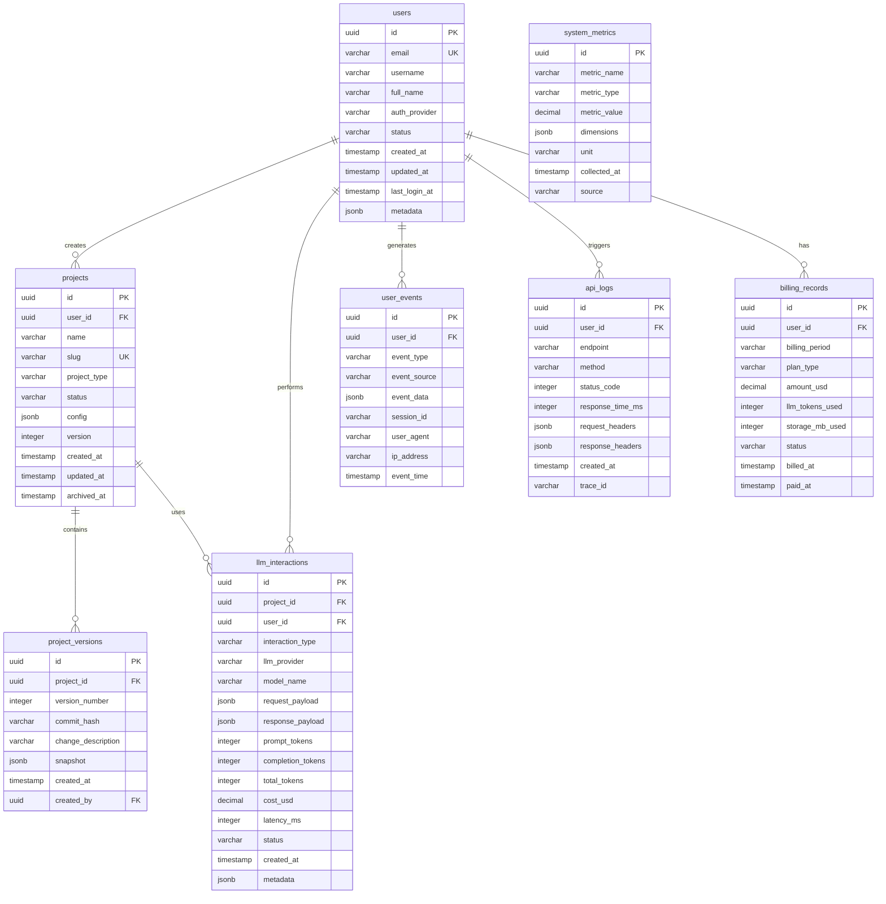

### [Sessão Paralela: Tech Leader]
# DIYAPP Evolution - V12 Core - Arquitetura de Microsserviços

## 1. Documento de Arquitetura V12

### 1.1. Visão Geral
A V12 do DIYAPP evolui para uma arquitetura de microsserviços com foco em:
- **100% autonomia operacional** (self-healing, auto-scaling)
- **Zero-downtime deployments**
- **Observabilidade completa** (logs, traces, métricas)
- **Resiliência a falhas** (circuit breakers, retries, fallbacks)

### 1.2. ADR-001: Decisão Arquitetural Principal
```
ADR-001: Migração para Arquitetura de Microsserviços
Data: 2024-01-15
Status: Aceita
Autores: Tech Lead, Especialista Infra

CONTEXTO:
A arquitetura monolítica atual limita:
1. Escalabilidade independente de componentes
2. Velocidade de deploy (todo o sistema precisa ser reimplantado)
3. Isolamento de falhas (bug em um módulo derruba todo o sistema)
4. Adoção de múltiplas stacks tecnológicas por domínio

DECISÃO:
Migrar para arquitetura de microsserviços baseada em:
- 6 serviços independentes com bounded contexts claros
- Comunicação via eventos assíncronos (80%) e APIs síncronas (20%)
- API Gateway como ponto único de entrada
- Service Mesh para comunicação service-to-service
- Banco de dados por serviço (database-per-service)

OPÇÕES CONSIDERADAS:
- Opção A: Monólito modularizado — Prós: Mais simples de operar, transações ACID fáceis. Contras: Escalabilidade limitada, acoplamento alto.
- Opção B: Microsserviços completos — Prós: Escalabilidade independente, isolamento de falhas, deploy independente. Contras: Complexidade operacional, consistência eventual.
- Opção C: Arquitetura híbrida — Prós: Balanceamento entre simplicidade e escalabilidade. Contras: Ponto médio que herda problemas de ambas.

Opção escolhida: B — Justificativa: Alinhamento com meta de 100% autonomia, permite evolução independente por squad.

CONSEQUÊNCIAS:
Positivas: Escalabilidade granular, deploy independente, isolamento de falhas, polyglot persistence
Negativas: Complexidade distribuída, consistência eventual, overhead operacional
Riscos: Latência em chamadas cross-service, debugging distribuído difícil
Mitigação: Implementar service mesh, distributed tracing, e padrões SAGA

REVISÃO: 2024-04-15 (3 meses após implementação)
```

## 2. Diagrama de Sequência - Fluxo de Criação de Projeto

```mermaid
sequenceDiagram
    participant User
    participant API_Gateway
    participant Auth_Service
    participant Project_Service
    participant Notification_Service
    participant Analytics_Service
    participant Message_Broker

    User->>API_Gateway: POST /projects
    API_Gateway->>Auth_Service: Validate JWT token
    Auth_Service-->>API_Gateway: User ID & Permissions
    
    API_Gateway->>Project_Service: Create project (user_id, data)
    Project_Service->>Project_Service: Validate business rules
    Project_Service->>Project_Service: Persist to PostgreSQL
    
    Project_Service->>Message_Broker: Publish "project.created"
    
    par Paralelo para Notificações
        Message_Broker->>Notification_Service: Consume "project.created"
        Notification_Service->>Notification_Service: Create notification
    and
    
    par Paralelo para Analytics
        Message_Broker->>Analytics_Service: Consume "project.created"
        Analytics_Service->>Analytics_Service: Update user metrics
    end
    
    Project_Service-->>API_Gateway: Project created (201)
    API_Gateway-->>User: Project response
```

## 3. Especificação dos Serviços

### 3.1. Service Matrix

| Serviço | Tecnologia | Banco de Dados | Responsabilidade | Escala Horizontal |
|---------|------------|----------------|------------------|-------------------|
| **API Gateway** | Node.js + Express | Redis (cache) | Roteamento, rate limiting, auth | Sim (stateless) |
| **Auth Service** | Go + Gin | PostgreSQL + Redis (sessions) | Autenticação, autorização, JWT | Sim |
| **Project Service** | Python + FastAPI | PostgreSQL | CRUD projetos, templates | Sim |
| **Notification Service** | Node.js + NestJS | MongoDB | Notificações push/email | Sim |
| **Analytics Service** | Python + FastAPI | TimescaleDB | Métricas, dashboards | Sim |
| **File Service** | Go + Gin | S3/MinIO + PostgreSQL (metadata) | Upload/download arquivos | Sim |
| **Message Broker** | Apache Kafka | - | Event streaming | Sim (cluster) |

### 3.2. Padrões de Comunicação
```yaml
communication_patterns:
  synchronous:
    use_cases:
      - Autenticação imediata
      - Validações críticas
      - Consultas que precisam de resposta síncrona
    protocol: HTTP/2 + gRPC
    timeout: 5s default, 30s max
    
  asynchronous:
    use_cases:
      - Notificações
      - Processamento em background
      - Atualizações de analytics
      - Cache warming
    protocol: Apache Kafka
    guarantees: At-least-once delivery
    retry_policy: Exponential backoff (max 5 retries)
    
  event_sourcing:
    use_cases:
      - Audit trail
      - Replay de eventos
      - CQRS projections
    storage: Kafka + Apache Cassandra
```

## 4. Engineering Standards V12

### 4.1. Estrutura de Repositório
```
src/
├── services/
│   ├── auth-service/
│   │   ├── src/
│   │   ├── tests/
│   │   ├── Dockerfile
│   │   ├── docker-compose.yml
│   │   └── k8s/
│   ├── project-service/
│   └── ...
├── libs/ (shared libraries)
├── deployments/
│   ├── k8s/
│   ├── terraform/
│   └── helm/
└── docs/
    ├── adrs/
    ├── api-specs/
    └── diagrams/
```

### 4.2. Padrões de Código
```javascript
// .eslintrc.js (Node.js services)
module.exports = {
  extends: ['airbnb-base', 'prettier'],
  rules: {
    'max-lines-per-function': ['error', 50],
    'complexity': ['error', 10],
    'no-await-in-loop': 'error',
    'require-atomic-updates': 'error',
    'security/detect-object-injection': 'error',
    'security/detect-non-literal-require': 'error'
  }
};

// .prettierrc
{
  "semi": true,
  "trailingComma": "es5",
  "singleQuote": true,
  "printWidth": 100,
  "tabWidth": 2
}
```

### 4.3. Convenções de API
```yaml
api_standards:
  versioning: URL path (/api/v1/resource)
  pagination:
    method: cursor-based
    params: limit, cursor
  filtering:
    pattern: ?filter[field]=value&filter[field2]=gt:value
  sorting: ?sort=field,-field2
  error_responses:
    format:
      error:
        code: "VALIDATION_ERROR"
        message: "Descriptive message"
        details: [{ field: "email", reason: "invalid_format" }]
        trace_id: "uuid-v4"
  rate_limiting:
    headers:
      - X-RateLimit-Limit
      - X-RateLimit-Remaining
      - X-RateLimit-Reset
```

## 5. CI/CD Pipeline

### 5.1. Pipeline Multi-stage (GitHub Actions)
```yaml
# .github/workflows/pipeline.yml
name: V12 Service Pipeline

on:
  push:
    branches: [main, develop]
  pull_request:
    branches: [main]

jobs:
  quality-gate:
    runs-on: ubuntu-latest
    steps:
      - uses: actions/checkout@v3
      
      - name: Security Scan
        uses: aquasecurity/trivy-action@master
        with:
          scan-type: 'fs'
          scan-ref: '.'
          format: 'sarif'
          output: 'trivy-results.sarif'
          
      - name: SAST Analysis
        uses: github/codeql-action/analyze@v2
        
      - name: Dependency Check
        run: |
          npm audit --audit-level=high
          pip-audit
          
  test:
    runs-on: ubuntu-latest
    strategy:
      matrix:
        service: [auth, project, notification, analytics, file]
    steps:
      - uses: actions/checkout@v3
      
      - name: Run Unit Tests
        run: |
          cd src/services/${{ matrix.service }}-service
          npm test -- --coverage
          # Require 80% coverage
          test $(node -p "require('./coverage/coverage-summary.json').total.lines.pct") -ge 80
          
      - name: Integration Tests
        run: |
          docker-compose -f test-compose.yml up -d
          npm run test:integration
          
  build-and-push:
    needs: [quality-gate, test]
    runs-on: ubuntu-latest
    if: github.event_name == 'push' && github.ref == 'refs/heads/main'
    steps:
      - name: Build and Push Docker
        uses: docker/build-push-action@v4
        with:
          push: true
          tags: |
            ghcr.io/diyapp/${{ matrix.service }}:latest
            ghcr.io/diyapp/${{ matrix.service }}:${{ github.sha }}
          cache-from: type=gha
          cache-to: type=gha,mode=max
          
  deploy-staging:
    needs: build-and-push
    runs-on: ubuntu-latest
    environment: staging
    steps:
      - name: Deploy to Kubernetes
        run: |
          kubectl apply -f k8s/staging/
          kubectl rollout status deployment/${{ matrix.service }}
          
  canary-release:
    needs: deploy-staging
    runs-on: ubuntu-latest
    steps:
      - name: Run Canary Tests
        run: |
          ./scripts/canary-test.sh
          
  deploy-production:
    needs: canary-release
    runs-on: ubuntu-latest
    environment: production
    if: success()
    steps:
      - name: Blue-Green Deployment
        run: |
          ./scripts/blue-green-deploy.sh
```

### 5.2. Infrastructure as Code
```hcl
# terraform/main.tf
terraform {
  required_version = ">= 1.3.0"
  backend "s3" {
    bucket = "diyapp-tf-state"
    key    = "v12/terraform.tfstate"
    region = "us-east-1"
  }
}

module "kubernetes" {
  source = "./modules/k8s"
  
  cluster_name = "diyapp-v12"
  node_count   = 6
  node_type    = "t3.medium"
  
  enable_autoscaling = true
  min_nodes = 3
  max_nodes = 12
  
  enable_monitoring = true
  enable_logging    = true
}

module "database" {
  source = "./modules/database"
  
  postgres_instances = {
    auth     = { size = "small", ha = true }
    project  = { size = "medium", ha = true }
    analytics = { size = "large", ha = true }
  }
  
  redis_instances = {
    cache     = { size = "medium", mode = "cluster" }
    sessions  = { size = "small", mode = "replicated" }
  }
}

module "observability" {
  source = "./modules/observability"
  
  enable_prometheus = true
  enable_grafana    = true
  enable_jaeger     = true
  enable_loki       = true
  
  retention_days = 30
}
```

## 6. Observabilidade (Logs, Traces, Métricas)

### 6.1. Stack de Observabilidade
```yaml
observability_stack:
  metrics:
    collector: Prometheus
    storage: Prometheus TSDB (short-term) + Thanos (long-term)
    visualization: Grafana
    alerting: AlertManager
    
  tracing:
    collector: Jaeger
    sampling_rate: 10% (production), 100% (staging)
    storage: Elasticsearch
    
  logging:
    collector: FluentBit
    aggregation: Loki
    storage: S3 + Glacier (archival)
    
  synthetics:
    uptime_checks: Blackbox Exporter
    api_monitoring: k6
    real_user_monitoring: OpenTelemetry browser SDK
```

### 6.2. Padrões de Logging
```python
# logging_config.py
import structlog
from opentelemetry import trace

def configure_logging(service_name: str):
    structlog.configure(
        processors=[
            structlog.stdlib.filter_by_level,
            structlog.stdlib.add_logger_name,
            structlog.stdlib.add_log_level,
            structlog.stdlib.PositionalArgumentsFormatter(),
            structlog.processors.TimeStamper(fmt="iso"),
            structlog.processors.StackInfoRenderer(),
            structlog.processors.format_exc_info,
            # Add trace context
            add_trace_context,
            structlog.processors.JSONRenderer()
        ],
        context_class=dict,
        logger_factory=structlog.stdlib.LoggerFactory(),
        wrapper_class=structlog.stdlib.BoundLogger,
        cache_logger_on_first_use=True,
    )
    
def add_trace_context(_, __, event_dict):
    """Add OpenTelemetry trace context to logs"""
    span = trace.get_current_span()
    if span and span.is_recording():
        span_context = span.get_span_context()
        event_dict['trace_id'] = format(span_context.trace_id, '032x')
        event_dict['span_id'] = format(span_context.span_id, '016x')
    return event_dict

# Usage in code
logger = structlog.get_logger()
logger.info("user_registered", 
            user_id=user.id, 
            email=user.email,
            duration_ms=processing_time)
```

### 6.3. Métricas Essenciais
```yaml
key_metrics:
  business:
    - active_users_daily
    - projects_created_daily
    - conversion_rate_signup_to_project
    
  performance:
    - http_request_duration_seconds
    - http_requests_total
    - service_response_time_p99
    - database_query_duration
    
  reliability:
    - service_uptime_percentage
    - error_rate_4xx_5xx
    - circuit_breaker_state
    - dead_letter_queue_size
    
  infrastructure:
    - container_memory_usage
    - pod_restarts_total
    - node_cpu_utilization
    - kafka_lag_consumer_group
```

### 6.4. Dashboard Grafana (JSON Template)
```json
{
  "dashboard": {
    "title": "DIYAPP V12 - Service Health",
    "panels": [
      {
        "title": "Service Response Time (p95)",
        "targets": [{
          "expr": "histogram_quantile(0.95, sum(rate(http_request_duration_seconds_bucket[5m])) by (le, service))",
          "legendFormat": "{{service}}"
        }],
        "thresholds": {
          "warning": 0.5,
          "critical": 1.0
        }
      },
      {
        "title": "Error Rate by Service",
        "targets": [{
          "expr": "rate(http_requests_total{status=~\"5..\"}[5m]) / rate(http_requests_total[5m])",
          "legendFormat": "{{service}}"
        }],
        "thresholds": {
          "warning": 0.01,
          "critical": 0.05
        }
      }
    ],
    "alerting": {
      "rules": [{
        "alert": "HighErrorRate",
        "expr": "rate(http_requests_total{status=~\"5..\"}[5m]) / rate(http_requests_total[5m]) > 0.05",
        "for": "5m",
        "annotations": {
          "summary": "High error rate detected in {{ $labels.service }}"
        }
      }]
    }
  }
}
```

## 7. Estratégia de Deploy e Rollback

### 7.1. Blue-Green Deployment
```bash
#!/bin/bash
# scripts/blue-green-deploy.sh

SERVICE=$1
VERSION=$2
NAMESPACE="production"

# Step 1: Deploy new version (green)
kubectl apply -f k8s/$SERVICE-green-$VERSION.yaml

# Step 2: Wait for green to be ready
kubectl rollout status deployment/$SERVICE-green -n $NAMESPACE --timeout=300s

# Step 3: Run smoke tests against green
SMOKE_TEST_RESULT=$(curl -s -o /dev/null -w "%{http_code}" \
  http://$SERVICE-green.$NAMESPACE.svc.cluster.local/health)
  
if [ "$SMOKE_TEST_RESULT" != "200" ]; then
  echo "Smoke test failed for green deployment"
  exit 1
fi

# Step 4: Switch traffic (update Istio VirtualService)
kubectl apply -f - <<EOF
apiVersion: networking.istio.io/v1beta1
kind: VirtualService
metadata:
 

### [Sessão Paralela: UX Designer]
# DIYAPP Evolution - V12 Core - Design System

Vou criar um sistema de design completo para a V12 com tokens, componentes reutilizáveis e um dashboard funcional como protótipo de alta fidelidade.

## Estrutura do Projeto

```
diyapp-v12-design-system/
├── src/
│   ├── design-system/
│   │   ├── tokens.js
│   │   ├── components/
│   │   │   ├── Button.js
│   │   │   ├── Input.js
│   │   │   ├── Card.js
│   │   │   ├── Modal.js
│   │   │   ├── Navigation.js
│   │   │   └── index.js
│   │   └── styles/
│   │       ├── global.css
│   │       └── utilities.css
│   ├── pages/
│   │   ├── Dashboard.js
│   │   ├── ComponentsDemo.js
│   │   └── DesignTokens.js
│   └── App.js
├── public/
│   ├── index.html
│   └── assets/
│       └── icons/
├── package.json
└── README.md
```

## 1. Tokens de Design (src/design-system/tokens.js)

```javascript
// Design Tokens para V12 - WCAG 2.1 AA Compliant
export const designTokens = {
  // Cores - Sistema de 10 tons com contraste garantido
  colors: {
    // Primárias
    primary: {
      50: '#f0f9ff',
      100: '#e0f2fe',
      200: '#bae6fd',
      300: '#7dd3fc',
      400: '#38bdf8',
      500: '#0ea5e9', // Cor principal
      600: '#0284c7',
      700: '#0369a1',
      800: '#075985',
      900: '#0c4a6e',
      950: '#082f49'
    },
    
    // Neutros
    neutral: {
      50: '#fafafa',
      100: '#f5f5f5',
      200: '#e5e5e5',
      300: '#d4d4d4',
      400: '#a3a3a3',
      500: '#737373',
      600: '#525252',
      700: '#404040',
      800: '#262626',
      900: '#171717',
      950: '#0a0a0a'
    },
    
    // Estados
    success: {
      50: '#f0fdf4',
      500: '#22c55e',
      700: '#15803d'
    },
    warning: {
      50: '#fefce8',
      500: '#eab308',
      700: '#a16207'
    },
    error: {
      50: '#fef2f2',
      500: '#ef4444',
      700: '#b91c1c'
    },
    info: {
      50: '#eff6ff',
      500: '#3b82f6',
      700: '#1d4ed8'
    },
    
    // Backgrounds
    background: {
      primary: '#ffffff',
      secondary: '#f8fafc',
      tertiary: '#f1f5f9',
      inverse: '#0f172a'
    },
    
    // Texto
    text: {
      primary: '#0f172a',
      secondary: '#475569',
      tertiary: '#64748b',
      inverse: '#ffffff',
      disabled: '#94a3b8'
    },
    
    // Bordas
    border: {
      light: '#e2e8f0',
      medium: '#cbd5e1',
      strong: '#94a3b8'
    },
    
    // Overlays
    overlay: {
      light: 'rgba(255, 255, 255, 0.8)',
      dark: 'rgba(0, 0, 0, 0.5)'
    }
  },
  
  // Tipografia - Escala modular 1.25
  typography: {
    fontFamily: {
      sans: "'Inter', -apple-system, BlinkMacSystemFont, 'Segoe UI', Roboto, sans-serif",
      mono: "'JetBrains Mono', 'Courier New', monospace"
    },
    
    fontSize: {
      xs: '0.75rem',    // 12px
      sm: '0.875rem',   // 14px
      base: '1rem',     // 16px
      lg: '1.125rem',   // 18px
      xl: '1.25rem',    // 20px
      '2xl': '1.5rem',  // 24px
      '3xl': '1.875rem', // 30px
      '4xl': '2.25rem',  // 36px
      '5xl': '3rem'      // 48px
    },
    
    fontWeight: {
      normal: '400',
      medium: '500',
      semibold: '600',
      bold: '700'
    },
    
    lineHeight: {
      tight: '1.25',
      normal: '1.5',
      relaxed: '1.75'
    }
  },
  
  // Espaçamento - Escala 8px
  spacing: {
    0: '0',
    1: '0.25rem',   // 4px
    2: '0.5rem',    // 8px
    3: '0.75rem',   // 12px
    4: '1rem',      // 16px
    5: '1.25rem',   // 20px
    6: '1.5rem',    // 24px
    8: '2rem',      // 32px
    10: '2.5rem',   // 40px
    12: '3rem',     // 48px
    16: '4rem',     // 64px
    20: '5rem',     // 80px
    24: '6rem',     // 96px
    32: '8rem'      // 128px
  },
  
  // Border Radius
  borderRadius: {
    none: '0',
    sm: '0.125rem',   // 2px
    base: '0.25rem',  // 4px
    md: '0.375rem',   // 6px
    lg: '0.5rem',     // 8px
    xl: '0.75rem',    // 12px
    '2xl': '1rem',    // 16px
    '3xl': '1.5rem',  // 24px
    full: '9999px'
  },
  
  // Elevação (Box Shadows)
  elevation: {
    0: 'none',
    1: '0 1px 2px 0 rgba(0, 0, 0, 0.05)',
    2: '0 1px 3px 0 rgba(0, 0, 0, 0.1), 0 1px 2px 0 rgba(0, 0, 0, 0.06)',
    3: '0 4px 6px -1px rgba(0, 0, 0, 0.1), 0 2px 4px -1px rgba(0, 0, 0, 0.06)',
    4: '0 10px 15px -3px rgba(0, 0, 0, 0.1), 0 4px 6px -2px rgba(0, 0, 0, 0.05)',
    5: '0 20px 25px -5px rgba(0, 0, 0, 0.1), 0 10px 10px -5px rgba(0, 0, 0, 0.04)'
  },
  
  // Transições
  transition: {
    duration: {
      fast: '150ms',
      normal: '250ms',
      slow: '350ms'
    },
    easing: {
      easeInOut: 'cubic-bezier(0.4, 0, 0.2, 1)',
      easeOut: 'cubic-bezier(0, 0, 0.2, 1)',
      easeIn: 'cubic-bezier(0.4, 0, 1, 1)'
    }
  },
  
  // Breakpoints
  breakpoints: {
    sm: '640px',
    md: '768px',
    lg: '1024px',
    xl: '1280px',
    '2xl': '1536px'
  },
  
  // Z-index layers
  zIndex: {
    base: 0,
    dropdown: 1000,
    sticky: 1020,
    fixed: 1030,
    modalBackdrop: 1040,
    modal: 1050,
    popover: 1060,
    tooltip: 1070
  }
};

// Utilitários para verificação de contraste WCAG
export const accessibility = {
  // Verifica contraste entre duas cores
  checkContrast: (foreground, background) => {
    // Implementação simplificada - em produção usar biblioteca como color-contrast
    const luminance = (color) => {
      const rgb = parseInt(color.slice(1), 16);
      const r = (rgb >> 16) & 0xff;
      const g = (rgb >> 8) & 0xff;
      const b = (rgb >> 0) & 0xff;
      const [rs, gs, bs] = [r, g, b].map(c => {
        c = c / 255;
        return c <= 0.03928 ? c / 12.92 : Math.pow((c + 0.055) / 1.055, 2.4);
      });
      return 0.2126 * rs + 0.7152 * gs + 0.0722 * bs;
    };
    
    const l1 = luminance(foreground);
    const l2 = luminance(background);
    const brightest = Math.max(l1, l2);
    const darkest = Math.min(l1, l2);
    return (brightest + 0.05) / (darkest + 0.05);
  },
  
  // Garante contraste mínimo AA (4.5:1)
  ensureAAContrast: (foreground, background) => {
    const ratio = accessibility.checkContrast(foreground, background);
    return ratio >= 4.5;
  },
  
  // Garante contraste AAA (7:1)
  ensureAAAContrast: (foreground, background) => {
    const ratio = accessibility.checkContrast(foreground, background);
    return ratio >= 7;
  }
};
```

## 2. Componente Button (src/design-system/components/Button.js)

```javascript
import React from 'react';
import { designTokens } from '../tokens';

const Button = React.forwardRef(({
  children,
  variant = 'primary',
  size = 'medium',
  isLoading = false,
  disabled = false,
  fullWidth = false,
  startIcon,
  endIcon,
  onClick,
  type = 'button',
  className = '',
  ...props
}, ref) => {
  
  // Mapeamento de variantes
  const variantStyles = {
    primary: {
      bg: designTokens.colors.primary[500],
      hoverBg: designTokens.colors.primary[600],
      activeBg: designTokens.colors.primary[700],
      text: designTokens.colors.text.inverse,
      border: 'transparent',
      focusRing: designTokens.colors.primary[300]
    },
    secondary: {
      bg: designTokens.colors.neutral[100],
      hoverBg: designTokens.colors.neutral[200],
      activeBg: designTokens.colors.neutral[300],
      text: designTokens.colors.text.primary,
      border: designTokens.colors.border.medium,
      focusRing: designTokens.colors.primary[300]
    },
    outline: {
      bg: 'transparent',
      hoverBg: designTokens.colors.neutral[50],
      activeBg: designTokens.colors.neutral[100],
      text: designTokens.colors.primary[600],
      border: designTokens.colors.primary[500],
      focusRing: designTokens.colors.primary[300]
    },
    ghost: {
      bg: 'transparent',
      hoverBg: designTokens.colors.neutral[100],
      activeBg: designTokens.colors.neutral[200],
      text: designTokens.colors.text.primary,
      border: 'transparent',
      focusRing: designTokens.colors.primary[300]
    },
    danger: {
      bg: designTokens.colors.error[500],
      hoverBg: designTokens.colors.error[600],
      activeBg: designTokens.colors.error[700],
      text: designTokens.colors.text.inverse,
      border: 'transparent',
      focusRing: designTokens.colors.error[300]
    },
    success: {
      bg: designTokens.colors.success[500],
      hoverBg: designTokens.colors.success[600],
      activeBg: designTokens.colors.success[700],
      text: designTokens.colors.text.inverse,
      border: 'transparent',
      focusRing: designTokens.colors.success[300]
    }
  };
  
  // Mapeamento de tamanhos
  const sizeStyles = {
    small: {
      padding: `${designTokens.spacing[1]} ${designTokens.spacing[3]}`,
      fontSize: designTokens.typography.fontSize.sm,
      height: '2rem'
    },
    medium: {
      padding: `${designTokens.spacing[2]} ${designTokens.spacing[4]}`,
      fontSize: designTokens.typography.fontSize.base,
      height: '2.5rem'
    },
    large: {
      padding: `${designTokens.spacing[3]} ${designTokens.spacing[6]}`,
      fontSize: designTokens.typography.fontSize.lg,
      height: '3rem'
    }
  };
  
  const styles = variantStyles[variant];
  const sizeConfig = sizeStyles[size];
  
  const baseStyles = {
    display: 'inline-flex',
    alignItems: 'center',
    justifyContent: 'center',
    fontWeight: designTokens.typography.fontWeight.medium,
    borderRadius: designTokens.borderRadius.md,
    border: `1px solid ${styles.border}`,
    backgroundColor: styles.bg,
    color: styles.text,
    cursor: disabled ? 'not-allowed' : 'pointer',
    transition: `all ${designTokens.transition.duration.normal} ${designTokens.transition.easing.easeInOut}`,
    outline: 'none',
    width: fullWidth ? '100%' : 'auto',
    opacity: disabled ? 0.6 : 1,
    position: 'relative',
    ...sizeConfig,
    ...props.style
  };
  
  const hoverStyles = !disabled && !isLoading ? {
    backgroundColor: styles.hoverBg,
    transform: 'translateY(-1px)',
    boxShadow: designTokens.elevation[2]
  } : {};
  
  const activeStyles = !disabled && !isLoading ? {
    backgroundColor: styles.activeBg,
    transform: 'translateY(0)',
    boxShadow: designTokens.elevation[0]
  } : {};
  
  const focusStyles = {
    boxShadow: `0 0 0 3px ${styles.focusRing}40`,
    borderColor: styles.focusRing
  };
  
  const disabledStyles = disabled ? {
    backgroundColor: designTokens.colors.neutral[200],
    color: designTokens.colors.text.disabled,
    borderColor: designTokens.colors.border.light,
    cursor: 'not-allowed'
  } : {};
  
  const loadingStyles = isLoading ? {
    color: 'transparent'
  } : {};
  
  const handleClick = (e) => {
    if (!disabled && !isLoading && onClick) {
      onClick(e);
    }
  };
  
  return (
    <button
      ref={ref}
      type={type}
      className={`diyapp-button ${className}`}
      style={baseStyles}
      onClick={handleClick}
      disabled={disabled || isLoading}
      onMouseEnter={(e) => {
        if (!disabled && !isLoading) {
          Object.assign(e.currentTarget.style, hoverStyles);
        }
      }}
      onMouseLeave={(e) => {
        if (!disabled && !isLoading) {
          Object.assign(e.currentTarget.style, {
            backgroundColor: baseStyles.backgroundColor,
            transform: 'translateY(0)',
            boxShadow: baseStyles.boxShadow
          });
        }
      }}
      onMouseDown={(e) => {
        if (!disabled && !isLoading) {
          Object.assign(e.currentTarget.style, activeStyles);
        }
      }}
      onMouseUp={(e) => {
        if (!disabled && !isLoading) {
          Object.assign(e.currentTarget.style, hoverStyles);
        }
      }}
      onFocus={(e) => {
        Object.assign(e.currentTarget.style, focusStyles);
      }}
      onBlur={(e) => {
        Object.assign(e.currentTarget.style, {
          boxShadow: baseStyles.boxShadow,
          borderColor: baseStyles.borderColor
        });
      }}
      {...props}
    >
      {isLoading && (
        <div style={{
          position: 'absolute',
          display: 'flex',
          alignItems: 'center',
          justifyContent: 'center'
        }}>
          <div style={{
            width: '1rem',
            height: '1rem',
            border: `2px solid ${designTokens.colors.neutral[300]}`,
            borderTopColor: styles.text,
            borderRadius: '50%',
            animation: 'spin 1s linear infinite'
          }} />
        </div>
      )}
      
      {startIcon && !isLoading && (
        <span style={{ marginRight: designTokens.spacing[2] }}>
          {startIcon}
        </span>
      )}
      
      <span style={loadingStyles}>
        {children}
      </span>
      
      {endIcon && !isLoading && (
        <span style={{ marginLeft: designTokens.spacing[2] }}>
          {endIcon}
        </span>
      )}
    </button>
  );
});

Button.displayName = 'Button';

export

### [Sessão Paralela: Data Engineer]
# DIYAPP Evolution - V12 Core - Data Engineering

## 1. Diagrama ER Otimizado (Mermaid)



## 2. Scripts DDL de Criação (PostgreSQL 15+)

```sql
-- ============================================
-- DIYAPP V12 - Core Database Schema
-- PostgreSQL 15+ with TimescaleDB extension
-- ============================================

-- Enable necessary extensions
CREATE EXTENSION IF NOT EXISTS "uuid-ossp";
CREATE EXTENSION IF NOT EXISTS "timescaledb";

-- ============================================
-- Core Tables
-- ============================================

-- Users table
CREATE TABLE users (
    id UUID PRIMARY KEY DEFAULT uuid_generate_v4(),
    email VARCHAR(255) NOT NULL UNIQUE,
    username VARCHAR(100) UNIQUE,
    full_name VARCHAR(255),
    auth_provider VARCHAR(50) NOT NULL DEFAULT 'email',
    status VARCHAR(20) NOT NULL DEFAULT 'active' CHECK (status IN ('active', 'inactive', 'suspended', 'pending')),
    created_at TIMESTAMP WITH TIME ZONE DEFAULT CURRENT_TIMESTAMP,
    updated_at TIMESTAMP WITH TIME ZONE DEFAULT CURRENT_TIMESTAMP,
    last_login_at TIMESTAMP WITH TIME ZONE,
    metadata JSONB DEFAULT '{}'::jsonb,
    
    -- Indexes
    INDEX idx_users_email ON users(email),
    INDEX idx_users_status ON users(status),
    INDEX idx_users_created_at ON users(created_at)
);

-- Projects table
CREATE TABLE projects (
    id UUID PRIMARY KEY DEFAULT uuid_generate_v4(),
    user_id UUID NOT NULL REFERENCES users(id) ON DELETE CASCADE,
    name VARCHAR(255) NOT NULL,
    slug VARCHAR(255) NOT NULL UNIQUE,
    project_type VARCHAR(50) NOT NULL DEFAULT 'web_app' CHECK (project_type IN ('web_app', 'mobile_app', 'api_service', 'data_pipeline')),
    status VARCHAR(20) NOT NULL DEFAULT 'active' CHECK (status IN ('active', 'archived', 'deleted', 'draft')),
    config JSONB DEFAULT '{}'::jsonb,
    version INTEGER NOT NULL DEFAULT 1,
    created_at TIMESTAMP WITH TIME ZONE DEFAULT CURRENT_TIMESTAMP,
    updated_at TIMESTAMP WITH TIME ZONE DEFAULT CURRENT_TIMESTAMP,
    archived_at TIMESTAMP WITH TIME ZONE,
    
    -- Indexes
    INDEX idx_projects_user_id ON projects(user_id),
    INDEX idx_projects_slug ON projects(slug),
    INDEX idx_projects_status ON projects(status),
    INDEX idx_projects_created_at ON projects(created_at)
);

-- Project versions (temporal table)
CREATE TABLE project_versions (
    id UUID PRIMARY KEY DEFAULT uuid_generate_v4(),
    project_id UUID NOT NULL REFERENCES projects(id) ON DELETE CASCADE,
    version_number INTEGER NOT NULL,
    commit_hash VARCHAR(64),
    change_description TEXT,
    snapshot JSONB NOT NULL,
    created_at TIMESTAMP WITH TIME ZONE DEFAULT CURRENT_TIMESTAMP,
    created_by UUID REFERENCES users(id),
    
    -- Unique constraint
    UNIQUE(project_id, version_number),
    
    -- Indexes
    INDEX idx_project_versions_project_id ON project_versions(project_id),
    INDEX idx_project_versions_created_at ON project_versions(created_at)
);

-- LLM Interactions (time-series optimized)
CREATE TABLE llm_interactions (
    id UUID PRIMARY KEY DEFAULT uuid_generate_v4(),
    project_id UUID REFERENCES projects(id) ON DELETE SET NULL,
    user_id UUID NOT NULL REFERENCES users(id) ON DELETE CASCADE,
    interaction_type VARCHAR(50) NOT NULL CHECK (interaction_type IN ('code_generation', 'code_review', 'debugging', 'documentation', 'refactoring', 'testing')),
    llm_provider VARCHAR(50) NOT NULL CHECK (llm_provider IN ('openai', 'anthropic', 'google', 'azure', 'local')),
    model_name VARCHAR(100) NOT NULL,
    request_payload JSONB NOT NULL,
    response_payload JSONB,
    prompt_tokens INTEGER DEFAULT 0,
    completion_tokens INTEGER DEFAULT 0,
    total_tokens INTEGER DEFAULT 0,
    cost_usd DECIMAL(10, 6) DEFAULT 0,
    latency_ms INTEGER,
    status VARCHAR(20) NOT NULL DEFAULT 'success' CHECK (status IN ('success', 'error', 'partial', 'rate_limited')),
    created_at TIMESTAMP WITH TIME ZONE DEFAULT CURRENT_TIMESTAMP,
    metadata JSONB DEFAULT '{}'::jsonb,
    
    -- Indexes
    INDEX idx_llm_interactions_user_id ON llm_interactions(user_id),
    INDEX idx_llm_interactions_project_id ON llm_interactions(project_id),
    INDEX idx_llm_interactions_created_at ON llm_interactions(created_at),
    INDEX idx_llm_interactions_provider_model ON llm_interactions(llm_provider, model_name),
    INDEX idx_llm_interactions_type ON llm_interactions(interaction_type)
);

-- Convert to hypertable for time-series optimization
SELECT create_hypertable('llm_interactions', 'created_at', 
    chunk_time_interval => INTERVAL '1 day',
    if_not_exists => TRUE);

-- User Events (time-series)
CREATE TABLE user_events (
    id UUID PRIMARY KEY DEFAULT uuid_generate_v4(),
    user_id UUID REFERENCES users(id) ON DELETE SET NULL,
    event_type VARCHAR(100) NOT NULL,
    event_source VARCHAR(50) NOT NULL CHECK (event_source IN ('web', 'mobile', 'api', 'cli', 'system')),
    event_data JSONB DEFAULT '{}'::jsonb,
    session_id VARCHAR(100),
    user_agent TEXT,
    ip_address INET,
    event_time TIMESTAMP WITH TIME ZONE DEFAULT CURRENT_TIMESTAMP,
    
    -- Indexes
    INDEX idx_user_events_user_id ON user_events(user_id),
    INDEX idx_user_events_event_type ON user_events(event_type),
    INDEX idx_user_events_event_time ON user_events(event_time),
    INDEX idx_user_events_session_id ON user_events(session_id)
);

-- Convert to hypertable
SELECT create_hypertable('user_events', 'event_time',
    chunk_time_interval => INTERVAL '1 day',
    if_not_exists => TRUE);

-- System Metrics (time-series)
CREATE TABLE system_metrics (
    id UUID PRIMARY KEY DEFAULT uuid_generate_v4(),
    metric_name VARCHAR(100) NOT NULL,
    metric_type VARCHAR(50) NOT NULL CHECK (metric_type IN ('counter', 'gauge', 'histogram', 'summary')),
    metric_value DECIMAL(20, 6) NOT NULL,
    dimensions JSONB DEFAULT '{}'::jsonb,
    unit VARCHAR(20),
    collected_at TIMESTAMP WITH TIME ZONE DEFAULT CURRENT_TIMESTAMP,
    source VARCHAR(100) NOT NULL,
    
    -- Indexes
    INDEX idx_system_metrics_name ON system_metrics(metric_name),
    INDEX idx_system_metrics_collected_at ON system_metrics(collected_at),
    INDEX idx_system_metrics_source ON system_metrics(source)
);

-- Convert to hypertable
SELECT create_hypertable('system_metrics', 'collected_at',
    chunk_time_interval => INTERVAL '1 hour',
    if_not_exists => TRUE);

-- API Logs
CREATE TABLE api_logs (
    id UUID PRIMARY KEY DEFAULT uuid_generate_v4(),
    user_id UUID REFERENCES users(id) ON DELETE SET NULL,
    endpoint VARCHAR(500) NOT NULL,
    method VARCHAR(10) NOT NULL CHECK (method IN ('GET', 'POST', 'PUT', 'DELETE', 'PATCH', 'OPTIONS')),
    status_code INTEGER NOT NULL,
    response_time_ms INTEGER NOT NULL,
    request_headers JSONB,
    response_headers JSONB,
    created_at TIMESTAMP WITH TIME ZONE DEFAULT CURRENT_TIMESTAMP,
    trace_id VARCHAR(100),
    
    -- Indexes
    INDEX idx_api_logs_user_id ON api_logs(user_id),
    INDEX idx_api_logs_endpoint ON api_logs(endpoint),
    INDEX idx_api_logs_status_code ON api_logs(status_code),
    INDEX idx_api_logs_created_at ON api_logs(created_at),
    INDEX idx_api_logs_trace_id ON api_logs(trace_id)
);

-- Billing Records
CREATE TABLE billing_records (
    id UUID PRIMARY KEY DEFAULT uuid_generate_v4(),
    user_id UUID NOT NULL REFERENCES users(id) ON DELETE CASCADE,
    billing_period VARCHAR(7) NOT NULL, -- Format: YYYY-MM
    plan_type VARCHAR(50) NOT NULL CHECK (plan_type IN ('free', 'hobby', 'pro', 'enterprise')),
    amount_usd DECIMAL(10, 2) NOT NULL,
    llm_tokens_used INTEGER DEFAULT 0,
    storage_mb_used INTEGER DEFAULT 0,
    status VARCHAR(20) NOT NULL DEFAULT 'pending' CHECK (status IN ('pending', 'paid', 'failed', 'refunded')),
    billed_at TIMESTAMP WITH TIME ZONE DEFAULT CURRENT_TIMESTAMP,
    paid_at TIMESTAMP WITH TIME ZONE,
    
    -- Unique constraint
    UNIQUE(user_id, billing_period),
    
    -- Indexes
    INDEX idx_billing_records_user_id ON billing_records(user_id),
    INDEX idx_billing_records_billing_period ON billing_records(billing_period),
    INDEX idx_billing_records_status ON billing_records(status)
);

-- ============================================
-- Materialized Views for Analytics
-- ============================================

-- Daily Active Users (refreshed hourly)
CREATE MATERIALIZED VIEW mv_daily_active_users AS
SELECT 
    DATE(event_time) AS date,
    COUNT(DISTINCT user_id) AS active_users,
    COUNT(DISTINCT session_id) AS total_sessions,
    COUNT(*) AS total_events
FROM user_events
WHERE event_time >= CURRENT_DATE - INTERVAL '30 days'
GROUP BY DATE(event_time)
WITH DATA;

CREATE UNIQUE INDEX idx_mv_dau_date ON mv_daily_active_users(date);
REFRESH MATERIALIZED VIEW CONCURRENTLY mv_daily_active_users;

-- LLM Cost Summary (refreshed every 15 minutes)
CREATE MATERIALIZED VIEW mv_llm_cost_summary AS
SELECT 
    DATE(created_at) AS date,
    llm_provider,
    model_name,
    interaction_type,
    COUNT(*) AS total_requests,
    SUM(prompt_tokens) AS total_prompt_tokens,
    SUM(completion_tokens) AS total_completion_tokens,
    SUM(total_tokens) AS total_tokens,
    SUM(cost_usd) AS total_cost_usd,
    AVG(latency_ms) AS avg_latency_ms,
    SUM(CASE WHEN status = 'error' THEN 1 ELSE 0 END) AS error_count
FROM llm_interactions
WHERE created_at >= CURRENT_DATE - INTERVAL '7 days'
GROUP BY DATE(created_at), llm_provider, model_name, interaction_type
WITH DATA;

CREATE UNIQUE INDEX idx_mv_llm_cost_summary ON mv_llm_cost_summary(date, llm_provider, model_name, interaction_type);

-- ============================================
-- Functions and Triggers
-- ============================================

-- Update updated_at timestamp
CREATE OR REPLACE FUNCTION update_updated_at_column()
RETURNS TRIGGER AS $$
BEGIN
    NEW.updated_at = CURRENT_TIMESTAMP;
    RETURN NEW;
END;
$$ language 'plpgsql';

-- Apply triggers to tables with updated_at
CREATE TRIGGER update_users_updated_at BEFORE UPDATE ON users
    FOR EACH ROW EXECUTE FUNCTION update_updated_at_column();

CREATE TRIGGER update_projects_updated_at BEFORE UPDATE ON projects
    FOR EACH ROW EXECUTE FUNCTION update_updated_at_column();

-- Function to archive old data
CREATE OR REPLACE FUNCTION archive_old_user_events()
RETURNS void AS $$
BEGIN
    -- Archive events older than 90 days to cold storage
    INSERT INTO user_events_archive
    SELECT * FROM user_events 
    WHERE event_time < CURRENT_DATE - INTERVAL '90 days';
    
    DELETE FROM user_events 
    WHERE event_time < CURRENT_DATE - INTERVAL '90 days';
END;
$$ LANGUAGE plpgsql;

-- ============================================
-- Retention Policies (TimescaleDB)
-- ============================================

-- LLM interactions: Keep 30 days in hot storage, 1 year in warm
SELECT add_retention_policy('llm_interactions', INTERVAL '30 days', if_not_exists => TRUE);

-- User events: Keep 90 days
SELECT add_retention_policy('user_events', INTERVAL '90 days', if_not_exists => TRUE);

-- System metrics: Keep 7 days at 1-minute granularity, 30 days at 1-hour
SELECT add_retention_policy('system_metrics', INTERVAL '30 days', if_not_exists => TRUE);

-- ============================================
-- Grants and Permissions
-- ============================================

-- Application user
CREATE ROLE diyapp_app WITH LOGIN PASSWORD '${APP_DB_PASSWORD}';
GRANT CONNECT ON DATABASE diyapp_v12 TO diyapp_app;
GRANT SELECT, INSERT, UPDATE, DELETE ON ALL TABLES IN SCHEMA public TO diyapp_app;
GRANT USAGE ON ALL SEQUENCES IN SCHEMA public TO diyapp_app;

-- Analytics user (read-only for BI tools)
CREATE ROLE diyapp_analytics WITH LOGIN PASSWORD '${ANALYTICS_DB_PASSWORD}';
GRANT CONNECT ON DATABASE diyapp_v12 TO diyapp_analytics;
GRANT SELECT ON ALL TABLES IN SCHEMA public TO diyapp_analytics;
GRANT SELECT ON ALL MATERIALIZED VIEWS IN SCHEMA public TO diyapp_analytics;
```

## 3. Data Warehouse Schema (dbt Models)

```
diyapp_analytics/
├── dbt_project.yml
├── models/
│   ├── staging/
│   │   ├── stg_users.sql
│   │   ├── stg_projects.sql
│   │   ├── stg_llm_interactions.sql
│   │   ├── stg_user_events.sql
│   │   ├── stg_system_metrics.sql
│   │   └── stg_billing_records.sql
│   ├── marts/
│   │   ├── core/
│   │   │   ├── dim_users.sql
│   │   │   ├── dim_projects.sql
│   │   │   ├── dim_dates.sql
│   │   │   └── dim_llm_models.sql
│   │   ├── product/
│   │   │   ├── fct_daily_active_users.sql
│   │   │   ├── fct_user_retention.sql
│   │   │   ├── fct_feature_adoption.sql
│   │   │   └── fct_project_health.sql
│   │   ├── ai_ops/
│   │   │   ├── fct_llm_cost_daily.sql
│   │   │   ├── fct_llm_performance.sql
│   │   │   ├── fct_model_usage.sql
│   │   │   └── fct_error_analysis.sql
│   │   └── finance/
│   │       ├── fct_monthly_revenue.sql
│   │       ├── fct_customer_lifetime_value.sql
│   │       └── fct_cost_breakdown.sql
│   └── metrics/
│       ├── product_metrics.yml
│       ├── ai_metrics.yml
│       └── business_metrics.yml
├── tests/
│   ├── uniqueness/
│   ├── not_null/
│   └── relationships/
└── macros/
    ├── incremental_strategy.sql
    └── utils.sql
```

## 4. Pipeline de ETL (Airflow DAG)

```python
# dags/diyapp_etl_pipeline.py
from datetime import datetime, timedelta
from airflow import DAG
from airflow.providers.google.cloud.operators.bigquery import BigQueryInsertJobOperator
from airflow.providers.google.cloud.transfers.gcs_to_bigquery import

### [Sessão Paralela: Backend]
# DIYAPP Evolution - V12 Core - Backend Services

Vou implementar os serviços core da V12 com foco em estabilidade, observabilidade e resiliência. Vou criar uma arquitetura microservices com API Gateway, autenticação JWT, gerenciamento de projetos e filas assíncronas.

## Estrutura do Projeto

```
diyapp-v12-core/
├── docker-compose.yml
├── api-gateway/
├── auth-service/
├── project-service/
├── queue-service/
├── shared/
└── README.md
```

## 1. Docker Compose - Orquestração dos Serviços

```yaml
# docker-compose.yml
version: '3.8'

services:
  # Banco de dados
  postgres:
    image: postgres:15-alpine
    environment:
      POSTGRES_DB: diyapp
      POSTGRES_USER: diyapp
      POSTGRES_PASSWORD: ${DB_PASSWORD:-ChangeMe123!}
    ports:
      - "5432:5432"
    volumes:
      - postgres_data:/var/lib/postgresql/data
    healthcheck:
      test: ["CMD-SHELL", "pg_isready -U diyapp"]
      interval: 10s
      timeout: 5s
      retries: 5

  # RabbitMQ para filas
  rabbitmq:
    image: rabbitmq:3.12-management-alpine
    environment:
      RABBITMQ_DEFAULT_USER: diyapp
      RABBITMQ_DEFAULT_PASS: ${RABBITMQ_PASSWORD:-ChangeMe123!}
    ports:
      - "5672:5672"
      - "15672:15672"
    healthcheck:
      test: ["CMD", "rabbitmq-diagnostics", "ping"]
      interval: 10s
      timeout: 5s
      retries: 5

  # Redis para cache e sessões
  redis:
    image: redis:7-alpine
    ports:
      - "6379:6379"
    command: redis-server --requirepass ${REDIS_PASSWORD:-ChangeMe123!}
    healthcheck:
      test: ["CMD", "redis-cli", "ping"]
      interval: 10s
      timeout: 5s
      retries: 5

  # API Gateway
  api-gateway:
    build: ./api-gateway
    ports:
      - "3000:3000"
    environment:
      NODE_ENV: production
      JWT_SECRET: ${JWT_SECRET:-your-super-secret-jwt-key-change-in-production}
      AUTH_SERVICE_URL: http://auth-service:3001
      PROJECT_SERVICE_URL: http://project-service:3002
      QUEUE_SERVICE_URL: http://queue-service:3003
      RATE_LIMIT_WINDOW_MS: 900000
      RATE_LIMIT_MAX_REQUESTS: 100
    depends_on:
      auth-service:
        condition: service_healthy
      project-service:
        condition: service_healthy
    healthcheck:
      test: ["CMD", "curl", "-f", "http://localhost:3000/health"]
      interval: 30s
      timeout: 10s
      retries: 3

  # Serviço de Autenticação
  auth-service:
    build: ./auth-service
    ports:
      - "3001:3001"
    environment:
      NODE_ENV: production
      JWT_SECRET: ${JWT_SECRET:-your-super-secret-jwt-key-change-in-production}
      JWT_EXPIRES_IN: 24h
      DB_HOST: postgres
      DB_PORT: 5432
      DB_NAME: diyapp
      DB_USER: diyapp
      DB_PASSWORD: ${DB_PASSWORD:-ChangeMe123!}
      REDIS_HOST: redis
      REDIS_PASSWORD: ${REDIS_PASSWORD:-ChangeMe123!}
      RATE_LIMIT_LOGIN_ATTEMPTS: 5
      RATE_LIMIT_LOGIN_WINDOW_MINUTES: 15
    depends_on:
      postgres:
        condition: service_healthy
      redis:
        condition: service_healthy
    healthcheck:
      test: ["CMD", "curl", "-f", "http://localhost:3001/health"]
      interval: 30s
      timeout: 10s
      retries: 3

  # Serviço de Projetos
  project-service:
    build: ./project-service
    ports:
      - "3002:3002"
    environment:
      NODE_ENV: production
      DB_HOST: postgres
      DB_PORT: 5432
      DB_NAME: diyapp
      DB_USER: diyapp
      DB_PASSWORD: ${DB_PASSWORD:-ChangeMe123!}
      REDIS_HOST: redis
      REDIS_PASSWORD: ${REDIS_PASSWORD:-ChangeMe123!}
      RABBITMQ_HOST: rabbitmq
      RABBITMQ_USER: diyapp
      RABBITMQ_PASSWORD: ${RABBITMQ_PASSWORD:-ChangeMe123!}
    depends_on:
      postgres:
        condition: service_healthy
      redis:
        condition: service_healthy
      rabbitmq:
        condition: service_healthy
    healthcheck:
      test: ["CMD", "curl", "-f", "http://localhost:3002/health"]
      interval: 30s
      timeout: 10s
      retries: 3

  # Serviço de Filas
  queue-service:
    build: ./queue-service
    ports:
      - "3003:3003"
    environment:
      NODE_ENV: production
      RABBITMQ_HOST: rabbitmq
      RABBITMQ_USER: diyapp
      RABBITMQ_PASSWORD: ${RABBITMQ_PASSWORD:-ChangeMe123!}
      REDIS_HOST: redis
      REDIS_PASSWORD: ${REDIS_PASSWORD:-ChangeMe123!}
      WORKER_CONCURRENCY: 5
      RETRY_ATTEMPTS: 3
      RETRY_DELAY_MS: 1000
    depends_on:
      rabbitmq:
        condition: service_healthy
      redis:
        condition: service_healthy
    healthcheck:
      test: ["CMD", "curl", "-f", "http://localhost:3003/health"]
      interval: 30s
      timeout: 10s
      retries: 3

volumes:
  postgres_data:
```

## 2. Shared Library - Código Comum

```typescript
// shared/src/types/index.ts
export interface ApiResponse<T = any> {
  success: boolean;
  data?: T;
  error?: {
    code: string;
    message: string;
    details?: Record<string, any>;
  };
  meta?: {
    page?: number;
    limit?: number;
    total?: number;
    totalPages?: number;
  };
}

export interface User {
  id: string;
  email: string;
  name: string;
  role: 'user' | 'admin' | 'moderator';
  createdAt: Date;
  updatedAt: Date;
}

export interface Project {
  id: string;
  userId: string;
  title: string;
  description: string;
  status: 'draft' | 'in_progress' | 'completed' | 'archived';
  metadata: Record<string, any>;
  createdAt: Date;
  updatedAt: Date;
}

export interface QueueMessage {
  id: string;
  type: string;
  payload: Record<string, any>;
  priority: number;
  createdAt: Date;
}

export interface JwtPayload {
  userId: string;
  email: string;
  role: string;
  iat: number;
  exp: number;
}
```

```typescript
// shared/src/utils/logger.ts
import winston from 'winston';
import { Request } from 'express';

export class Logger {
  private static instance: winston.Logger;

  static getInstance(): winston.Logger {
    if (!Logger.instance) {
      Logger.instance = winston.createLogger({
        level: process.env.NODE_ENV === 'production' ? 'info' : 'debug',
        format: winston.format.combine(
          winston.format.timestamp(),
          winston.format.json()
        ),
        defaultMeta: { service: 'diyapp-v12' },
        transports: [
          new winston.transports.Console({
            format: winston.format.combine(
              winston.format.colorize(),
              winston.format.simple()
            )
          }),
          new winston.transports.File({ 
            filename: 'logs/error.log', 
            level: 'error' 
          }),
          new winston.transports.File({ 
            filename: 'logs/combined.log' 
          })
        ]
      });
    }
    return Logger.instance;
  }

  static maskSensitiveData(data: any): any {
    if (!data || typeof data !== 'object') return data;
    
    const masked = { ...data };
    const sensitiveFields = ['password', 'token', 'secret', 'authorization', 'credit_card', 'cvv', 'ssn', 'cpf'];
    
    for (const field of sensitiveFields) {
      if (masked[field]) {
        masked[field] = '***MASKED***';
      }
    }
    
    return masked;
  }

  static createRequestLogger(req: Request) {
    const correlationId = req.headers['x-correlation-id'] as string || 
                         req.headers['x-request-id'] as string || 
                         `req-${Date.now()}-${Math.random().toString(36).substr(2, 9)}`;
    
    return Logger.getInstance().child({
      correlationId,
      userId: (req as any).user?.userId || 'anonymous',
      method: req.method,
      url: req.url,
      ip: req.ip,
      userAgent: req.get('user-agent')
    });
  }
}
```

```typescript
// shared/src/utils/resilience.ts
import { Logger } from './logger';
import CircuitBreaker from 'opossum';

export class ResilienceManager {
  private static circuitBreakers = new Map<string, CircuitBreaker>();

  static createCircuitBreaker(
    name: string,
    action: Function,
    options: {
      timeout?: number;
      errorThresholdPercentage?: number;
      resetTimeout?: number;
      rollingCountTimeout?: number;
      rollingCountBuckets?: number;
    } = {}
  ): CircuitBreaker {
    const breaker = new CircuitBreaker(action, {
      timeout: options.timeout || 10000,
      errorThresholdPercentage: options.errorThresholdPercentage || 50,
      resetTimeout: options.resetTimeout || 30000,
      rollingCountTimeout: options.rollingCountTimeout || 10000,
      rollingCountBuckets: options.rollingCountBuckets || 10,
      name
    });

    breaker.on('open', () => {
      Logger.getInstance().warn(`Circuit breaker "${name}" opened`, { name });
    });

    breaker.on('halfOpen', () => {
      Logger.getInstance().info(`Circuit breaker "${name}" half-open`, { name });
    });

    breaker.on('close', () => {
      Logger.getInstance().info(`Circuit breaker "${name}" closed`, { name });
    });

    breaker.on('failure', (error: Error) => {
      Logger.getInstance().error(`Circuit breaker "${name}" failure`, { 
        name, 
        error: error.message 
      });
    });

    this.circuitBreakers.set(name, breaker);
    return breaker;
  }

  static async withRetry<T>(
    operation: () => Promise<T>,
    options: {
      maxRetries?: number;
      initialDelay?: number;
      maxDelay?: number;
      backoffFactor?: number;
      retryOn?: (error: any) => boolean;
    } = {}
  ): Promise<T> {
    const {
      maxRetries = 3,
      initialDelay = 100,
      maxDelay = 10000,
      backoffFactor = 2,
      retryOn = (error) => {
        // Retry on network errors and 5xx status codes
        return error.code === 'ECONNREFUSED' || 
               error.code === 'ETIMEDOUT' ||
               (error.status && error.status >= 500);
      }
    } = options;

    let lastError: any;
    
    for (let attempt = 0; attempt <= maxRetries; attempt++) {
      try {
        return await operation();
      } catch (error) {
        lastError = error;
        
        if (attempt === maxRetries || !retryOn(error)) {
          break;
        }
        
        const delay = Math.min(
          initialDelay * Math.pow(backoffFactor, attempt),
          maxDelay
        );
        
        const jitter = delay * 0.1 * Math.random();
        const waitTime = delay + jitter;
        
        Logger.getInstance().warn(`Retry attempt ${attempt + 1}/${maxRetries} after ${waitTime}ms`, {
          error: error.message,
          waitTime
        });
        
        await new Promise(resolve => setTimeout(resolve, waitTime));
      }
    }
    
    throw lastError;
  }

  static getCircuitBreaker(name: string): CircuitBreaker | undefined {
    return this.circuitBreakers.get(name);
  }

  static getMetrics() {
    const metrics: Record<string, any> = {};
    
    for (const [name, breaker] of this.circuitBreakers.entries()) {
      metrics[name] = {
        state: breaker.state.name,
        failures: breaker.stats.failures,
        successes: breaker.stats.successes,
        timeouts: breaker.stats.timeouts,
        rejection: breaker.stats.rejections,
        latencyMean: breaker.stats.latencyTimes.mean,
        latencyPercentiles: breaker.stats.latencyTimes
      };
    }
    
    return metrics;
  }
}
```

```typescript
// shared/src/utils/validation.ts
import { z } from 'zod';
import { Request, Response, NextFunction } from 'express';

export const validationSchemas = {
  auth: {
    register: z.object({
      email: z.string().email('Invalid email format'),
      password: z.string()
        .min(8, 'Password must be at least 8 characters')
        .regex(/[A-Z]/, 'Password must contain at least one uppercase letter')
        .regex(/[a-z]/, 'Password must contain at least one lowercase letter')
        .regex(/[0-9]/, 'Password must contain at least one number'),
      name: z.string().min(2, 'Name must be at least 2 characters'),
    }),
    
    login: z.object({
      email: z.string().email('Invalid email format'),
      password: z.string().min(1, 'Password is required'),
    }),
    
    refreshToken: z.object({
      refreshToken: z.string().min(1, 'Refresh token is required'),
    }),
  },
  
  projects: {
    create: z.object({
      title: z.string()
        .min(3, 'Title must be at least 3 characters')
        .max(200, 'Title must not exceed 200 characters'),
      description: z.string().max(5000, 'Description must not exceed 5000 characters').optional(),
      status: z.enum(['draft', 'in_progress', 'completed', 'archived']).default('draft'),
      metadata: z.record(z.any()).optional(),
    }),
    
    update: z.object({
      title: z.string()
        .min(3, 'Title must be at least 3 characters')
        .max(200, 'Title must not exceed 200 characters')
        .optional(),
      description: z.string().max(5000, 'Description must not exceed 5000 characters').optional(),
      status: z.enum(['draft', 'in_progress', 'completed', 'archived']).optional(),
      metadata: z.record(z.any()).optional(),
    }),
    
    list: z.object({
      page: z.coerce.number().int().positive().default(1),
      limit: z.coerce.number().int().min(1).max(100).default(20),
      status: z.enum(['draft', 'in_progress', 'completed', 'archived']).optional(),
      search: z.string().optional(),
      sortBy: z.enum(['createdAt', 'updatedAt', 'title']).default('createdAt'),
      sortOrder: z.enum(['asc', 'desc']).default('desc'),
    }),
  },
  
  queue: {
    enqueue: z.object({
      type: z.string().min(1, 'Message type is required'),
      payload: z.record(z.any()),
      priority: z.number().int().min(0).max(10).default(5),
      delay: z.number().int().min(0).optional(),
    }),
  },
};

export function validate(schema: z.ZodSchema) {
  return (req: Request, res: Response, next: NextFunction) => {
    try {
      const data = schema.parse({
        ...req.body,
        ...req.query,
        ...req.params,
      });
      
      req.validatedData = data;
      next();
    } catch (error) {
      if (error instanceof z.ZodError) {
        const errors = error.errors.map(err => ({
          field: err.path.join('.'),
          message: err.message,
        }));
        
        return res.status(400).json({
          success: false,
          error: {
            code: 'VALIDATION_ERROR',
            message: 'Validation failed',
            details: { errors },
          },
        });
      }
      
      next(error);
    }
  };
}

declare global {
  namespace Express {
    interface Request {
      validatedData?: any;
    }
  }
}
```

```typescript
// shared/src/middleware/auth.ts
import { Request, Response, NextFunction } from 'express';
import jwt from 'jsonwebtoken';
import { JwtPayload } from '../types';
import { Logger } from '../utils/logger';

export function authenticate(requiredRole?: string[]) {
  return async (req: Request, res: Response, next: NextFunction) => {
    const logger = Logger.createRequestLogger(req);
    
    try {
      const authHeader = req.headers.authorization;
      
      if (!authHeader || !authHeader.startsWith('Bearer ')) {
        logger.warn('Missing or invalid authorization header');
        return res.status(401).json({
          success: false,
          error: {
            code: 'UNAUTHORIZED',
            message: 'Authentication required',
          },
        });
      }
      
      const token = authHeader.substring(7);
      const jwtSecret = process.env

### [Sessão Paralela: Frontend]
# DIYAPP Evolution - V12 Core - Dashboard Frontend

## Estrutura do Projeto

```
diyapp-v12-dashboard/
├── public/
│   ├── index.html
│   ├── favicon.ico
│   └── manifest.json
├── src/
│   ├── components/
│   │   ├── common/
│   │   ├── layout/
│   │   └── dashboard/
│   ├── hooks/
│   ├── services/
│   ├── store/
│   ├── styles/
│   ├── types/
│   ├── utils/
│   ├── App.tsx
│   ├── main.tsx
│   └── vite-env.d.ts
├── package.json
├── tsconfig.json
├── vite.config.ts
├── .eslintrc.json
└── README.md
```

## 1. Configuração Inicial

### package.json
```json
{
  "name": "diyapp-v12-dashboard",
  "version": "1.0.0",
  "private": true,
  "type": "module",
  "scripts": {
    "dev": "vite",
    "build": "tsc && vite build",
    "preview": "vite preview",
    "lint": "eslint . --ext ts,tsx --report-unused-disable-directives --max-warnings 0",
    "test": "vitest",
    "test:coverage": "vitest run --coverage"
  },
  "dependencies": {
    "react": "^18.2.0",
    "react-dom": "^18.2.0",
    "react-router-dom": "^6.20.0",
    "zustand": "^4.4.7",
    "axios": "^1.6.2",
    "date-fns": "^2.30.0",
    "recharts": "^2.10.3",
    "react-hook-form": "^7.48.2",
    "clsx": "^2.0.0",
    "lucide-react": "^0.309.0"
  },
  "devDependencies": {
    "@types/react": "^18.2.37",
    "@types/react-dom": "^18.2.15",
    "@typescript-eslint/eslint-plugin": "^6.13.2",
    "@typescript-eslint/parser": "^6.13.2",
    "@vitejs/plugin-react": "^4.2.0",
    "autoprefixer": "^10.4.16",
    "eslint": "^8.54.0",
    "eslint-plugin-react-hooks": "^4.6.0",
    "eslint-plugin-react-refresh": "^0.4.5",
    "postcss": "^8.4.31",
    "tailwindcss": "^3.3.5",
    "typescript": "^5.2.2",
    "vite": "^5.0.0",
    "vitest": "^1.0.4",
    "@testing-library/react": "^14.1.2",
    "@testing-library/jest-dom": "^6.1.5",
    "@testing-library/user-event": "^14.5.1"
  }
}
```

### tsconfig.json
```json
{
  "compilerOptions": {
    "target": "ES2020",
    "useDefineForClassFields": true,
    "lib": ["ES2020", "DOM", "DOM.Iterable"],
    "module": "ESNext",
    "skipLibCheck": true,
    "moduleResolution": "bundler",
    "allowImportingTsExtensions": true,
    "resolveJsonModule": true,
    "isolatedModules": true,
    "noEmit": true,
    "jsx": "react-jsx",
    "strict": true,
    "noUnusedLocals": true,
    "noUnusedParameters": true,
    "noFallthroughCasesInSwitch": true,
    "baseUrl": ".",
    "paths": {
      "@/*": ["src/*"]
    }
  },
  "include": ["src"],
  "references": [{ "path": "./tsconfig.node.json" }]
}
```

### vite.config.ts
```typescript
import { defineConfig } from 'vite'
import react from '@vitejs/plugin-react'
import path from 'path'

export default defineConfig({
  plugins: [react()],
  resolve: {
    alias: {
      '@': path.resolve(__dirname, './src'),
    },
  },
  build: {
    rollupOptions: {
      output: {
        manualChunks: {
          vendor: ['react', 'react-dom', 'react-router-dom'],
          charts: ['recharts'],
          utils: ['date-fns', 'clsx', 'axios'],
        },
      },
    },
    chunkSizeWarningLimit: 1000,
  },
  server: {
    port: 3000,
  },
})
```

### tailwind.config.js
```javascript
/** @type {import('tailwindcss').Config} */
export default {
  content: [
    "./index.html",
    "./src/**/*.{js,ts,jsx,tsx}",
  ],
  theme: {
    extend: {
      colors: {
        // Design System Tokens
        primary: {
          50: '#eff6ff',
          100: '#dbeafe',
          200: '#bfdbfe',
          300: '#93c5fd',
          400: '#60a5fa',
          500: '#3b82f6',
          600: '#2563eb',
          700: '#1d4ed8',
          800: '#1e40af',
          900: '#1e3a8a',
        },
        secondary: {
          50: '#f8fafc',
          100: '#f1f5f9',
          200: '#e2e8f0',
          300: '#cbd5e1',
          400: '#94a3b8',
          500: '#64748b',
          600: '#475569',
          700: '#334155',
          800: '#1e293b',
          900: '#0f172a',
        },
        success: {
          50: '#f0fdf4',
          100: '#dcfce7',
          200: '#bbf7d0',
          300: '#86efac',
          400: '#4ade80',
          500: '#22c55e',
          600: '#16a34a',
          700: '#15803d',
          800: '#166534',
          900: '#14532d',
        },
        warning: {
          50: '#fffbeb',
          100: '#fef3c7',
          200: '#fde68a',
          300: '#fcd34d',
          400: '#fbbf24',
          500: '#f59e0b',
          600: '#d97706',
          700: '#b45309',
          800: '#92400e',
          900: '#78350f',
        },
        error: {
          50: '#fef2f2',
          100: '#fee2e2',
          200: '#fecaca',
          300: '#fca5a5',
          400: '#f87171',
          500: '#ef4444',
          600: '#dc2626',
          700: '#b91c1c',
          800: '#991b1b',
          900: '#7f1d1d',
        },
      },
      spacing: {
        'xs': '0.25rem',
        'sm': '0.5rem',
        'md': '1rem',
        'lg': '1.5rem',
        'xl': '2rem',
        '2xl': '3rem',
        '3xl': '4rem',
      },
      fontSize: {
        'xs': ['0.75rem', { lineHeight: '1rem' }],
        'sm': ['0.875rem', { lineHeight: '1.25rem' }],
        'base': ['1rem', { lineHeight: '1.5rem' }],
        'lg': ['1.125rem', { lineHeight: '1.75rem' }],
        'xl': ['1.25rem', { lineHeight: '1.75rem' }],
        '2xl': ['1.5rem', { lineHeight: '2rem' }],
        '3xl': ['1.875rem', { lineHeight: '2.25rem' }],
        '4xl': ['2.25rem', { lineHeight: '2.5rem' }],
      },
      fontFamily: {
        sans: ['Inter', 'system-ui', 'sans-serif'],
        mono: ['JetBrains Mono', 'monospace'],
      },
    },
  },
  plugins: [],
}
```

## 2. Design System Tokens e Utilitários

### src/styles/tokens.ts
```typescript
// Design System Tokens - Nunca valores hardcoded
export const tokens = {
  colors: {
    primary: {
      50: '#eff6ff',
      100: '#dbeafe',
      200: '#bfdbfe',
      300: '#93c5fd',
      400: '#60a5fa',
      500: '#3b82f6',
      600: '#2563eb',
      700: '#1d4ed8',
      800: '#1e40af',
      900: '#1e3a8a',
    },
    secondary: {
      50: '#f8fafc',
      100: '#f1f5f9',
      200: '#e2e8f0',
      300: '#cbd5e1',
      400: '#94a3b8',
      500: '#64748b',
      600: '#475569',
      700: '#334155',
      800: '#1e293b',
      900: '#0f172a',
    },
    success: '#22c55e',
    warning: '#f59e0b',
    error: '#ef4444',
    background: {
      light: '#ffffff',
      dark: '#0f172a',
    },
    surface: {
      light: '#f8fafc',
      dark: '#1e293b',
    },
  },
  spacing: {
    xs: '0.25rem',
    sm: '0.5rem',
    md: '1rem',
    lg: '1.5rem',
    xl: '2rem',
    '2xl': '3rem',
    '3xl': '4rem',
  },
  typography: {
    fontFamily: {
      sans: "'Inter', system-ui, sans-serif",
      mono: "'JetBrains Mono', monospace",
    },
    fontSize: {
      xs: '0.75rem',
      sm: '0.875rem',
      base: '1rem',
      lg: '1.125rem',
      xl: '1.25rem',
      '2xl': '1.5rem',
      '3xl': '1.875rem',
      '4xl': '2.25rem',
    },
    fontWeight: {
      normal: '400',
      medium: '500',
      semibold: '600',
      bold: '700',
    },
  },
  borderRadius: {
    sm: '0.25rem',
    md: '0.5rem',
    lg: '0.75rem',
    xl: '1rem',
    full: '9999px',
  },
  shadows: {
    sm: '0 1px 2px 0 rgb(0 0 0 / 0.05)',
    md: '0 4px 6px -1px rgb(0 0 0 / 0.1)',
    lg: '0 10px 15px -3px rgb(0 0 0 / 0.1)',
    xl: '0 20px 25px -5px rgb(0 0 0 / 0.1)',
  },
  zIndex: {
    dropdown: 1000,
    sticky: 1020,
    fixed: 1030,
    modalBackdrop: 1040,
    modal: 1050,
    popover: 1060,
    tooltip: 1070,
  },
} as const;

export type ColorToken = keyof typeof tokens.colors;
export type SpacingToken = keyof typeof tokens.spacing;
export type TypographyToken = keyof typeof tokens.typography.fontSize;
```

### src/utils/classNames.ts
```typescript
import { clsx, type ClassValue } from 'clsx';
import { twMerge } from 'tailwind-merge';

export function cn(...inputs: ClassValue[]) {
  return twMerge(clsx(inputs));
}
```

## 3. Tipos TypeScript

### src/types/index.ts
```typescript
export interface User {
  id: string;
  name: string;
  email: string;
  avatar?: string;
  role: 'admin' | 'editor' | 'viewer';
  lastActive: string;
}

export interface DashboardStats {
  totalProjects: number;
  activeProjects: number;
  completedProjects: number;
  totalUsers: number;
  monthlyGrowth: number;
  revenue: number;
  pendingTasks: number;
}

export interface Project {
  id: string;
  name: string;
  description: string;
  status: 'planning' | 'in_progress' | 'on_hold' | 'completed';
  progress: number;
  dueDate: string;
  assignedTo: User[];
  tags: string[];
}

export interface Activity {
  id: string;
  type: 'project_created' | 'task_completed' | 'user_joined' | 'file_uploaded';
  user: User;
  description: string;
  timestamp: string;
  metadata?: Record<string, unknown>;
}

export interface ChartData {
  date: string;
  value: number;
  category?: string;
}

export interface ApiResponse<T> {
  data: T;
  success: boolean;
  message?: string;
  timestamp: string;
}

export interface ApiError {
  code: string;
  message: string;
  details?: Record<string, unknown>;
}

export type Theme = 'light' | 'dark' | 'system';
```

## 4. Store Global (Zustand)

### src/store/useDashboardStore.ts
```typescript
import { create } from 'zustand';
import { devtools, persist } from 'zustand/middleware';
import { DashboardStats, Project, Activity, User, Theme } from '@/types';
import { dashboardService } from '@/services/dashboard';

interface DashboardState {
  // Estado
  stats: DashboardStats | null;
  projects: Project[];
  recentActivities: Activity[];
  users: User[];
  isLoading: boolean;
  error: string | null;
  theme: Theme;
  
  // Ações
  fetchDashboardData: () => Promise<void>;
  fetchProjects: () => Promise<void>;
  fetchActivities: () => Promise<void>;
  fetchUsers: () => Promise<void>;
  updateProjectStatus: (projectId: string, status: Project['status']) => Promise<void>;
  addProject: (project: Omit<Project, 'id'>) => Promise<void>;
  deleteProject: (projectId: string) => Promise<void>;
  setTheme: (theme: Theme) => void;
  clearError: () => void;
}

export const useDashboardStore = create<DashboardState>()(
  devtools(
    persist(
      (set, get) => ({
        // Estado inicial
        stats: null,
        projects: [],
        recentActivities: [],
        users: [],
        isLoading: false,
        error: null,
        theme: 'system',

        // Ações
        fetchDashboardData: async () => {
          set({ isLoading: true, error: null });
          try {
            const [stats, projects, activities, users] = await Promise.all([
              dashboardService.getStats(),
              dashboardService.getProjects(),
              dashboardService.getActivities(),
              dashboardService.getUsers(),
            ]);

            set({
              stats,
              projects,
              recentActivities: activities,
              users,
              isLoading: false,
            });
          } catch (error) {
            set({
              error: error instanceof Error ? error.message : 'Failed to fetch dashboard data',
              isLoading: false,
            });
          }
        },

        fetchProjects: async () => {
          set({ isLoading: true });
          try {
            const projects = await dashboardService.getProjects();
            set({ projects, isLoading: false });
          } catch (error) {
            set({
              error: error instanceof Error ? error.message : 'Failed to fetch projects',
              isLoading: false,
            });
          }
        },

        fetchActivities: async () => {
          try {
            const activities = await dashboardService.getActivities();
            set({ recentActivities: activities });
          } catch (error) {
            console.error('Failed to fetch activities:', error);
          }
        },

        fetchUsers: async () => {
          try {
            const users = await dashboardService.getUsers();
            set({ users });
          } catch (error) {
            console.error('Failed to fetch users:', error);
          }
        },

        updateProjectStatus: async (projectId, status) => {
          try {
            await dashboardService.updateProjectStatus(projectId, status);
            set((state) => ({
              projects: state.projects.map((project) =>
                project.id === projectId ? { ...project, status } : project
              ),
            }));
          } catch (error) {
            set({
              error: error instanceof Error ? error.message : 'Failed to update project',
            });
          }
        },

        addProject: async (projectData) => {
          try {
            const newProject = await dashboardService.createProject(projectData);
            set((state) => ({
              projects: [newProject, ...state.projects],
            }));
          } catch (error) {
            set({
              error: error instanceof Error ? error.message : 'Failed to create project',
            });
          }
        },

        deleteProject: async (projectId) => {
          try {
            await dashboardService.deleteProject(projectId);
            set((state) => ({
              projects: state.projects.filter((project) => project.id !== projectId),
            }));
          } catch (error) {
            set({
              error: error instanceof Error ? error.message : 'Failed to delete project',
            });
          }
        },

        setTheme: (theme) => {
          set({ theme });
          // Aplicar tema ao documento
          if (theme === 'dark' || (theme === 'system' && window.matchMedia('(prefers-color-scheme: dark)').matches)) {
            document.documentElement.classList.add('dark');
          } else {
            document.documentElement.classList.remove('dark');
          }
        },

        clearError: () => set({ error: null }),
      }),
      {


### [Sessão Paralela: AI Ops]
# DIYAPP Evolution - V12 Core - AI Ops Monitoring System

## Estrutura do Projeto

```
diyapp-v12-monitoring/
├── index.html                    # Dashboard principal
├── package.json
├── .env.example
├── README.md
├── src/
│   ├── monitoring/
│   │   ├── alert-manager.js      # Gerenciador de alertas inteligentes
│   │   ├── auto-scaling.js       # Sistema de auto-scaling
│   │   ├── auto-recovery.js      # Sistema de auto-recuperação
│   │   ├── metrics-collector.js  # Coletor de métricas
│   │   └── sli-slo-manager.js    # Gerenciador de SLIs/SLOs
│   ├── api/
│   │   └── monitoring-api.js     # API de monitoramento
│   ├── config/
│   │   ├── alerts-config.js      # Configuração de alertas
│   │   ├── scaling-config.js     # Configuração de auto-scaling
│   │   └── slo-config.js         # Configuração de SLOs
│   ├── database/
│   │   └── metrics-db.js         # Armazenamento de métricas
│   └── utils/
│       ├── logger.js             # Sistema de logs
│       └── notification.js       # Sistema de notificações
├── public/
│   ├── css/
│   │   └── dashboard.css         # Estilos do dashboard
│   └── js/
│       └── dashboard.js          # Scripts do dashboard
├── playbooks/
│   ├── recovery-playbooks.js     # Playbooks de recuperação
│   └── scaling-playbooks.js      # Playbooks de scaling
└── tests/
    └── monitoring-tests.js       # Testes do sistema
```

## 1. package.json

```json
{
  "name": "diyapp-v12-monitoring",
  "version": "1.0.0",
  "description": "Sistema de Monitoramento Proativo com Auto-Scaling e Auto-Recovery",
  "main": "src/api/monitoring-api.js",
  "scripts": {
    "start": "node src/api/monitoring-api.js",
    "dev": "nodemon src/api/monitoring-api.js",
    "test": "jest tests/",
    "dashboard": "open index.html || start index.html || xdg-open index.html"
  },
  "dependencies": {
    "express": "^4.18.2",
    "socket.io": "^4.7.2",
    "axios": "^1.6.2",
    "prom-client": "^14.2.0",
    "winston": "^3.11.0",
    "node-cron": "^3.0.3",
    "sqlite3": "^5.1.6",
    "dotenv": "^16.3.1",
    "nodemailer": "^6.9.7",
    "web-push": "^3.6.4",
    "redis": "^4.6.10",
    "joi": "^17.11.0"
  },
  "devDependencies": {
    "jest": "^29.7.0",
    "nodemon": "^3.0.1",
    "supertest": "^6.3.3"
  },
  "keywords": [
    "monitoring",
    "alerting",
    "auto-scaling",
    "auto-recovery",
    "sre",
    "devops"
  ],
  "author": "DIYAPP AI Ops Squad",
  "license": "MIT"
}
```

## 2. index.html (Dashboard Principal)

```html
<!DOCTYPE html>
<html lang="pt-BR">
<head>
    <meta charset="UTF-8">
    <meta name="viewport" content="width=device-width, initial-scale=1.0">
    <title>DIYAPP V12 - AI Ops Monitoring Dashboard</title>
    <link rel="stylesheet" href="https://cdnjs.cloudflare.com/ajax/libs/font-awesome/6.4.0/css/all.min.css">
    <link rel="stylesheet" href="https://cdn.jsdelivr.net/npm/bootstrap@5.3.0/dist/css/bootstrap.min.css">
    <link rel="stylesheet" href="public/css/dashboard.css">
    <script src="https://cdn.jsdelivr.net/npm/chart.js"></script>
    <script src="https://cdn.socket.io/4.7.2/socket.io.min.js"></script>
</head>
<body>
    <div class="container-fluid">
        <!-- Header -->
        <nav class="navbar navbar-dark bg-dark">
            <div class="container-fluid">
                <a class="navbar-brand" href="#">
                    <i class="fas fa-robot"></i> DIYAPP V12 - AI Ops Monitoring
                </a>
                <div class="d-flex">
                    <span class="badge bg-success me-3" id="system-status">Operacional</span>
                    <span class="text-light" id="current-time"></span>
                </div>
            </div>
        </nav>

        <!-- Main Dashboard -->
        <div class="row mt-4">
            <!-- Left Panel - Status Overview -->
            <div class="col-md-3">
                <div class="card mb-4">
                    <div class="card-header bg-primary text-white">
                        <i class="fas fa-tachometer-alt"></i> Status do Sistema
                    </div>
                    <div class="card-body">
                        <div class="mb-3">
                            <h6>Disponibilidade</h6>
                            <div class="progress">
                                <div id="availability-bar" class="progress-bar bg-success" role="progressbar" style="width: 99.9%">99.9%</div>
                            </div>
                        </div>
                        <div class="mb-3">
                            <h6>Latência P95</h6>
                            <div class="progress">
                                <div id="latency-bar" class="progress-bar bg-info" role="progressbar" style="width: 85%">245ms</div>
                            </div>
                        </div>
                        <div class="mb-3">
                            <h6>Taxa de Erro</h6>
                            <div class="progress">
                                <div id="error-rate-bar" class="progress-bar bg-warning" role="progressbar" style="width: 0.5%">0.05%</div>
                            </div>
                        </div>
                        <div class="mb-3">
                            <h6>Utilização CPU</h6>
                            <div class="progress">
                                <div id="cpu-bar" class="progress-bar" role="progressbar" style="width: 45%">45%</div>
                            </div>
                        </div>
                    </div>
                </div>

                <div class="card mb-4">
                    <div class="card-header bg-info text-white">
                        <i class="fas fa-bell"></i> Alertas Ativos
                    </div>
                    <div class="card-body">
                        <div id="active-alerts">
                            <div class="alert alert-success">
                                <i class="fas fa-check-circle"></i> Sistema estável
                            </div>
                        </div>
                    </div>
                </div>

                <div class="card">
                    <div class="card-header bg-warning text-dark">
                        <i class="fas fa-cogs"></i> Ações Rápidas
                    </div>
                    <div class="card-body">
                        <button class="btn btn-sm btn-outline-primary mb-2 w-100" onclick="runHealthCheck()">
                            <i class="fas fa-heartbeat"></i> Health Check
                        </button>
                        <button class="btn btn-sm btn-outline-success mb-2 w-100" onclick="forceScalingCheck()">
                            <i class="fas fa-expand-arrows-alt"></i> Verificar Scaling
                        </button>
                        <button class="btn btn-sm btn-outline-danger mb-2 w-100" onclick="triggerRecoveryTest()">
                            <i class="fas fa-redo"></i> Testar Recovery
                        </button>
                        <button class="btn btn-sm btn-outline-info w-100" onclick="showAlertHistory()">
                            <i class="fas fa-history"></i> Histórico Alertas
                        </button>
                    </div>
                </div>
            </div>

            <!-- Center Panel - Charts -->
            <div class="col-md-6">
                <div class="card mb-4">
                    <div class="card-header bg-dark text-white">
                        <i class="fas fa-chart-line"></i> Métricas em Tempo Real
                    </div>
                    <div class="card-body">
                        <canvas id="metricsChart"></canvas>
                    </div>
                </div>

                <div class="row">
                    <div class="col-md-6">
                        <div class="card mb-4">
                            <div class="card-header bg-success text-white">
                                <i class="fas fa-server"></i> Auto-Scaling Status
                            </div>
                            <div class="card-body">
                                <h5 id="scaling-status">Normal</h5>
                                <p>Instâncias ativas: <span id="active-instances">3</span></p>
                                <p>Limite CPU para scale-out: <span id="cpu-threshold">70%</span></p>
                                <p>Próxima verificação: <span id="next-scaling-check">30s</span></p>
                            </div>
                        </div>
                    </div>
                    <div class="col-md-6">
                        <div class="card mb-4">
                            <div class="card-header bg-danger text-white">
                                <i class="fas fa-first-aid"></i> Auto-Recovery Status
                            </div>
                            <div class="card-body">
                                <h5 id="recovery-status">Ativo</h5>
                                <p>Recuperações hoje: <span id="recovery-count">0</span></p>
                                <p>Tempo médio recovery: <span id="avg-recovery-time">45s</span></p>
                                <p>Sucesso recovery: <span id="recovery-success-rate">100%</span></p>
                            </div>
                        </div>
                    </div>
                </div>

                <div class="card">
                    <div class="card-header bg-secondary text-white">
                        <i class="fas fa-list"></i> Últimos Eventos
                    </div>
                    <div class="card-body">
                        <div id="event-log" style="max-height: 200px; overflow-y: auto;">
                            <!-- Eventos serão inseridos aqui -->
                        </div>
                    </div>
                </div>
            </div>

            <!-- Right Panel - SLI/SLO Status -->
            <div class="col-md-3">
                <div class="card mb-4">
                    <div class="card-header bg-purple text-white">
                        <i class="fas fa-bullseye"></i> SLIs / SLOs
                    </div>
                    <div class="card-body">
                        <table class="table table-sm">
                            <thead>
                                <tr>
                                    <th>SLI</th>
                                    <th>Atual</th>
                                    <th>SLO</th>
                                    <th>Status</th>
                                </tr>
                            </thead>
                            <tbody id="slo-table">
                                <!-- SLIs serão inseridos aqui -->
                            </tbody>
                        </table>
                    </div>
                </div>

                <div class="card mb-4">
                    <div class="card-header bg-dark text-white">
                        <i class="fas fa-cog"></i> Configurações
                    </div>
                    <div class="card-body">
                        <div class="form-check form-switch mb-3">
                            <input class="form-check-input" type="checkbox" id="auto-scaling-toggle" checked>
                            <label class="form-check-label" for="auto-scaling-toggle">Auto-Scaling</label>
                        </div>
                        <div class="form-check form-switch mb-3">
                            <input class="form-check-input" type="checkbox" id="auto-recovery-toggle" checked>
                            <label class="form-check-label" for="auto-recovery-toggle">Auto-Recovery</label>
                        </div>
                        <div class="form-check form-switch mb-3">
                            <input class="form-check-input" type="checkbox" id="alerting-toggle" checked>
                            <label class="form-check-label" for="alerting-toggle">Alertas</label>
                        </div>
                        <button class="btn btn-sm btn-outline-secondary w-100" onclick="openSettings()">
                            <i class="fas fa-sliders-h"></i> Configurações Avançadas
                        </button>
                    </div>
                </div>

                <div class="card">
                    <div class="card-header bg-info text-white">
                        <i class="fas fa-robot"></i> AI Ops Insights
                    </div>
                    <div class="card-body">
                        <div id="ai-insights">
                            <p class="small"><i class="fas fa-lightbulb"></i> Sistema operando dentro dos SLOs</p>
                            <p class="small"><i class="fas fa-lightbulb"></i> Custo otimizado com auto-scaling</p>
                            <p class="small"><i class="fas fa-lightbulb"></i> 0 incidentes nas últimas 24h</p>
                        </div>
                    </div>
                </div>
            </div>
        </div>

        <!-- Footer -->
        <footer class="mt-4 py-3 bg-dark text-light text-center">
            <div class="container">
                <p class="mb-0">
                    <i class="fas fa-shield-alt"></i> DIYAPP V12 Core - AI Ops Monitoring System | 
                    Última atualização: <span id="last-update"></span>
                </p>
            </div>
        </footer>
    </div>

    <!-- Modals -->
    <div class="modal fade" id="settingsModal" tabindex="-1">
        <div class="modal-dialog modal-lg">
            <div class="modal-content">
                <div class="modal-header">
                    <h5 class="modal-title">Configurações Avançadas</h5>
                    <button type="button" class="btn-close" data-bs-dismiss="modal"></button>
                </div>
                <div class="modal-body">
                    <!-- Conteúdo será carregado via JavaScript -->
                </div>
            </div>
        </div>
    </div>

    <script src="https://cdn.jsdelivr.net/npm/bootstrap@5.3.0/dist/js/bootstrap.bundle.min.js"></script>
    <script src="public/js/dashboard.js"></script>
</body>
</html>
```

## 3. public/css/dashboard.css

```css
:root {
    --primary-color: #2c3e50;
    --secondary-color: #3498db;
    --success-color: #27ae60;
    --warning-color: #f39c12;
    --danger-color: #e74c3c;
    --info-color: #17a2b8;
    --purple-color: #8e44ad;
}

body {
    background-color: #f8f9fa;
    font-family: 'Segoe UI', Tahoma, Geneva, Verdana, sans-serif;
}

.bg-purple {
    background-color: var(--purple-color) !important;
}

.card {
    border: none;
    box-shadow: 0 2px 4px rgba(0,0,0,0.1);
    transition: transform 0.2s;
}

.card:hover {
    transform: translateY(-2px);
    box-shadow: 0 4px 8px rgba(0,0,0,0.15);
}

.progress {
    height: 8px;
    margin-top: 5px;
}

.badge {
    font-size: 0.8em;
    padding: 5px 10px;
}

#event-log {
    font-family: 'Courier New', monospace;
    font-size: 0.85em;
}

.event-item {
    padding: 3px 0;
    border-bottom: 1px solid #eee;
}

.event-item:last-child {
    border-bottom: none;
}

.event-time {
    color: #666;
    font-size: 0.8em;
}

.event-info {
    color: #333;
}

.event-warning {
    color: var(--warning-color);
}

.event-error {
    color: var(--danger-color);
}

.event-success {
    color: var(--success-color);
}

.slo-status-ok {
    color: var(--success-color);
}

.slo-status-warning {
    color: var(--warning-color);
}

.slo-status-error {
    color: var(--danger-color);
}

.alert-badge {
    animation: pulse 2s infinite;
}

@keyframes pulse {
    0% { opacity: 1; }
    50% { opacity: 0.7; }
    100% { opacity: 1; }
}

#metricsChart {
    max-height: 300px;
}

.table-sm th, .table-sm td {
    padding: 0.3rem;
}

.modal-content {
    border-radius: 10px;
}

.btn-outline-primary:hover {
    background-color: var(--secondary-color);
    border-color: var(--secondary-color);
}

.navbar-brand {
    font-weight: 600;
}

#ai-insights p {
    margin-bottom: 0.5rem;
    padding-left: 1.5rem;
    position: relative;
}

#ai-insights p i {
    position: absolute;
    left: 0;
    top: 2px;
    color: var(--warning-color);
}
```

## 4. src/config/slo-config.js

```javascript
// Configuração de SLIs e SLOs
const SLO_CONFIG = {
    // Disponibilidade
    availability: {
        sli: 'availability_rate',
        slo: 0.999, // 99.9%
        window: '28d',
        description: 'Taxa de disponibilidade do sistema'
    },
    
    // Latência
    latency_p95: {
        sli: 'latency_p95',
        slo: 500, // 500ms
        window: '28d',
        description: '

### [Sessão Paralela: SRE]
```hcl
# terraform/
# ├── main.tf
# ├── variables.tf
# ├── outputs.tf
# ├── modules/
# │   ├── network/
# │   ├── kubernetes/
# │   └── database/
# └── backups/

# main.tf - Configuração principal do Terraform
terraform {
  required_version = ">= 1.5.0"
  required_providers {
    aws = {
      source  = "hashicorp/aws"
      version = "~> 5.0"
    }
    kubernetes = {
      source  = "hashicorp/kubernetes"
      version = "~> 2.23"
    }
    helm = {
      source  = "hashicorp/helm"
      version = "~> 2.11"
    }
  }
  backend "s3" {
    bucket         = "diyapp-tf-state-v12"
    key            = "production/terraform.tfstate"
    region         = "us-east-1"
    encrypt        = true
    dynamodb_table = "diyapp-tf-locks"
  }
}

provider "aws" {
  region = var.aws_region
  default_tags {
    tags = {
      Project     = "DIYAPP-V12"
      Environment = var.environment
      ManagedBy   = "Terraform"
      Squad       = "Autonomous-SRE"
    }
  }
}

provider "kubernetes" {
  host                   = module.eks.cluster_endpoint
  cluster_ca_certificate = base64decode(module.eks.cluster_certificate_authority_data)
  token                  = data.aws_eks_cluster_auth.this.token
}

provider "helm" {
  kubernetes {
    host                   = module.eks.cluster_endpoint
    cluster_ca_certificate = base64decode(module.eks.cluster_certificate_authority_data)
    token                  = data.aws_eks_cluster_auth.this.token
  }
}

data "aws_eks_cluster_auth" "this" {
  name = module.eks.cluster_name
}

# Módulo de rede
module "network" {
  source = "./modules/network"

  environment    = var.environment
  vpc_cidr       = var.vpc_cidr
  azs            = var.availability_zones
  public_subnets = var.public_subnet_cidrs
  private_subnets = var.private_subnet_cidrs
}

# Módulo EKS
module "eks" {
  source = "./modules/kubernetes"

  cluster_name    = "diyapp-v12-${var.environment}"
  cluster_version = "1.28"
  environment     = var.environment

  vpc_id          = module.network.vpc_id
  private_subnets = module.network.private_subnet_ids

  node_groups = {
    main = {
      desired_size = 3
      max_size     = 6
      min_size     = 3
      instance_types = ["t3.large"]
      capacity_type  = "ON_DEMAND"
    }
    spot = {
      desired_size = 2
      max_size     = 4
      min_size     = 2
      instance_types = ["t3.large", "t3a.large"]
      capacity_type  = "SPOT"
    }
  }

  enable_cluster_autoscaler = true
  enable_metrics_server     = true
  enable_prometheus         = true
}

# Módulo de banco de dados
module "database" {
  source = "./modules/database"

  environment          = var.environment
  vpc_id              = module.network.vpc_id
  private_subnet_ids  = module.network.private_subnet_ids
  security_group_ids  = [module.eks.cluster_security_group_id]
  instance_class      = var.db_instance_class
  allocated_storage   = var.db_allocated_storage
  backup_retention    = var.db_backup_retention
  multi_az            = true
}

# Configuração de backup
module "backups" {
  source = "./modules/backups"

  environment      = var.environment
  cluster_name     = module.eks.cluster_name
  database_arn     = module.database.rds_arn
  s3_bucket_names  = var.s3_backup_buckets
}

# Configuração do Ingress Controller
resource "helm_release" "nginx_ingress" {
  name       = "nginx-ingress"
  repository = "https://kubernetes.github.io/ingress-nginx"
  chart      = "ingress-nginx"
  version    = "4.8.0"
  namespace  = "ingress-nginx"

  create_namespace = true

  set {
    name  = "controller.replicaCount"
    value = 2
  }

  set {
    name  = "controller.service.type"
    value = "LoadBalancer"
  }

  set {
    name  = "controller.service.annotations.service\\.beta\\.kubernetes\\.io/aws-load-balancer-type"
    value = "nlb"
  }
}

# Configuração do ArgoCD para GitOps
resource "helm_release" "argocd" {
  name       = "argocd"
  repository = "https://argoproj.github.io/argo-helm"
  chart      = "argo-cd"
  version    = "5.46.0"
  namespace  = "argocd"

  create_namespace = true

  values = [templatefile("${path.module}/templates/argocd-values.yaml", {
    domain = var.argocd_domain
  })]
}

# Configuração do Prometheus Stack
resource "helm_release" "prometheus_stack" {
  name       = "prometheus-stack"
  repository = "https://prometheus-community.github.io/helm-charts"
  chart      = "kube-prometheus-stack"
  version    = "46.8.0"
  namespace  = "monitoring"

  create_namespace = true

  values = [file("${path.module}/templates/prometheus-values.yaml")]
}

# Configuração do Cert-Manager
resource "helm_release" "cert_manager" {
  name       = "cert-manager"
  repository = "https://charts.jetstack.io"
  chart      = "cert-manager"
  version    = "v1.13.0"
  namespace  = "cert-manager"

  create_namespace = true

  set {
    name  = "installCRDs"
    value = "true"
  }

  set {
    name  = "prometheus.enabled"
    value = "true"
  }
}

# Configuração do ClusterIssuer Let's Encrypt
resource "kubernetes_manifest" "cluster_issuer" {
  manifest = {
    apiVersion = "cert-manager.io/v1"
    kind       = "ClusterIssuer"
    metadata = {
      name = "letsencrypt-production"
    }
    spec = {
      acme = {
        server = "https://acme-v02.api.letsencrypt.org/directory"
        email  = var.certificate_email
        privateKeySecretRef = {
          name = "letsencrypt-production"
        }
        solvers = [{
          http01 = {
            ingress = {
              class = "nginx"
            }
          }
        }]
      }
    }
  }
}

# Configuração do ExternalDNS
resource "helm_release" "external_dns" {
  name       = "external-dns"
  repository = "https://kubernetes-sigs.github.io/external-dns"
  chart      = "external-dns"
  version    = "1.13.0"
  namespace  = "kube-system"

  set {
    name  = "provider"
    value = "aws"
  }

  set {
    name  = "aws.zoneType"
    value = "public"
  }

  set {
    name  = "txtOwnerId"
    value = module.eks.cluster_name
  }

  set {
    name  = "policy"
    value = "sync"
  }
}

# Configuração do Velero para backup de cluster
resource "helm_release" "velero" {
  name       = "velero"
  repository = "https://vmware-tanzu.github.io/helm-charts"
  chart      = "velero"
  version    = "5.0.0"
  namespace  = "velero"

  create_namespace = true

  values = [templatefile("${path.module}/templates/velero-values.yaml", {
    bucket_name = module.backups.velero_bucket_name
    region      = var.aws_region
  })]
}

# Configuração do Istio para service mesh
resource "helm_release" "istio_base" {
  name       = "istio-base"
  repository = "https://istio-release.storage.googleapis.com/charts"
  chart      = "base"
  version    = "1.19.0"
  namespace  = "istio-system"

  create_namespace = true
}

resource "helm_release" "istiod" {
  name       = "istiod"
  repository = "https://istio-release.storage.googleapis.com/charts"
  chart      = "istiod"
  version    = "1.19.0"
  namespace  = "istio-system"

  depends_on = [helm_release.istio_base]

  values = [file("${path.module}/templates/istio-values.yaml")]
}

resource "helm_release" "istio_ingress" {
  name       = "istio-ingress"
  repository = "https://istio-release.storage.googleapis.com/charts"
  chart      = "gateway"
  version    = "1.19.0"
  namespace  = "istio-system"

  depends_on = [helm_release.istiod]

  set {
    name  = "service.type"
    value = "LoadBalancer"
  }
}

# Configuração do Karpenter para auto-scaling otimizado
resource "helm_release" "karpenter" {
  name       = "karpenter"
  repository = "https://charts.karpenter.sh"
  chart      = "karpenter"
  version    = "0.32.0"
  namespace  = "karpenter"

  create_namespace = true

  set {
    name  = "serviceAccount.annotations.eks\\.amazonaws\\.com/role-arn"
    value = module.eks.karpenter_irsa_arn
  }

  set {
    name  = "clusterName"
    value = module.eks.cluster_name
  }

  set {
    name  = "clusterEndpoint"
    value = module.eks.cluster_endpoint
  }

  set {
    name  = "aws.defaultInstanceProfile"
    value = module.eks.karpenter_instance_profile_name
  }
}

# Provisioner do Karpenter
resource "kubectl_manifest" "karpenter_provisioner" {
  yaml_body = <<-YAML
  apiVersion: karpenter.sh/v1alpha5
  kind: Provisioner
  metadata:
    name: default
  spec:
    requirements:
      - key: karpenter.sh/capacity-type
        operator: In
        values: ["spot", "on-demand"]
      - key: kubernetes.io/arch
        operator: In
        values: ["amd64", "arm64"]
      - key: kubernetes.io/os
        operator: In
        values: ["linux"]
      - key: "node.kubernetes.io/instance-type"
        operator: In
        values: ["t3.large", "t3a.large", "m5.large", "m5a.large", "c5.large", "c5a.large"]
    limits:
      resources:
        cpu: 100
        memory: 100Gi
    providerRef:
      name: default
    ttlSecondsAfterEmpty: 30
  YAML

  depends_on = [helm_release.karpenter]
}

resource "kubectl_manifest" "karpenter_aws_node_template" {
  yaml_body = <<-YAML
  apiVersion: karpenter.k8s.aws/v1alpha1
  kind: AWSNodeTemplate
  metadata:
    name: default
  spec:
    subnetSelector:
      karpenter.sh/discovery: ${module.eks.cluster_name}
    securityGroupSelector:
      karpenter.sh/discovery: ${module.eks.cluster_name}
    tags:
      Project: DIYAPP-V12
      Environment: ${var.environment}
      ManagedBy: Karpenter
  YAML

  depends_on = [helm_release.karpenter]
}
```

```hcl
# variables.tf - Variáveis do Terraform
variable "aws_region" {
  description = "AWS region"
  type        = string
  default     = "us-east-1"
}

variable "environment" {
  description = "Environment name"
  type        = string
  default     = "production"
}

variable "vpc_cidr" {
  description = "CIDR block for VPC"
  type        = string
  default     = "10.0.0.0/16"
}

variable "availability_zones" {
  description = "List of availability zones"
  type        = list(string)
  default     = ["us-east-1a", "us-east-1b", "us-east-1c"]
}

variable "public_subnet_cidrs" {
  description = "CIDR blocks for public subnets"
  type        = list(string)
  default     = ["10.0.1.0/24", "10.0.2.0/24", "10.0.3.0/24"]
}

variable "private_subnet_cidrs" {
  description = "CIDR blocks for private subnets"
  type        = list(string)
  default     = ["10.0.101.0/24", "10.0.102.0/24", "10.0.103.0/24"]
}

variable "db_instance_class" {
  description = "RDS instance class"
  type        = string
  default     = "db.t3.large"
}

variable "db_allocated_storage" {
  description = "RDS allocated storage in GB"
  type        = number
  default     = 100
}

variable "db_backup_retention" {
  description = "RDS backup retention in days"
  type        = number
  default     = 35
}

variable "s3_backup_buckets" {
  description = "S3 buckets to backup"
  type        = list(string)
  default     = ["diyapp-media", "diyapp-exports"]
}

variable "argocd_domain" {
  description = "Domain for ArgoCD"
  type        = string
  default     = "argocd.diyapp.example.com"
}

variable "certificate_email" {
  description = "Email for Let's Encrypt certificates"
  type        = string
  default     = "sre@diyapp.example.com"
}
```

```hcl
# outputs.tf - Outputs do Terraform
output "cluster_name" {
  description = "EKS cluster name"
  value       = module.eks.cluster_name
}

output "cluster_endpoint" {
  description = "EKS cluster endpoint"
  value       = module.eks.cluster_endpoint
}

output "cluster_security_group_id" {
  description = "EKS cluster security group ID"
  value       = module.eks.cluster_security_group_id
}

output "vpc_id" {
  description = "VPC ID"
  value       = module.network.vpc_id
}

output "database_endpoint" {
  description = "RDS endpoint"
  value       = module.database.rds_endpoint
}

output "database_port" {
  description = "RDS port"
  value       = module.database.rds_port
}

output "load_balancer_dns" {
  description = "Nginx Ingress Load Balancer DNS"
  value       = helm_release.nginx_ingress.status[0].load_balancer[0].ingress[0].hostname
}

output "argocd_url" {
  description = "ArgoCD URL"
  value       = "https://${var.argocd_domain}"
}

output "prometheus_url" {
  description = "Prometheus URL"
  value       = "http://prometheus-stack-prometheus.monitoring.svc.cluster.local:9090"
}

output "grafana_url" {
  description = "Grafana URL"
  value       = "http://prometheus-stack-grafana.monitoring.svc.cluster.local:80"
}

output "velero_backup_bucket" {
  description = "Velero backup bucket name"
  value       = module.backups.velero_bucket_name
}

output "s3_backup_buckets" {
  description = "S3 backup bucket names"
  value       = module.backups.s3_backup_bucket_names
}
```

```hcl
# modules/network/main.tf
resource "aws_vpc" "main" {
  cidr_block           = var.vpc_cidr
  enable_dns_hostnames = true
  enable_dns_support   = true

  tags = {
    Name = "diyapp-v12-${var.environment}"
  }
}

resource "aws_internet_gateway" "main" {
  vpc_id = aws_vpc.main.id

  tags = {
    Name = "diyapp-v12-${var.environment}"
  }
}

resource "aws_eip" "nat" {
  count = length(var.azs)
  domain = "vpc"

  tags = {
    Name = "diyapp-v12-nat-${var.environment}-${var.azs[count.index]}"
  }
}

resource "aws_nat_gateway" "main" {
  count         = length(var.azs)
  allocation_id = aws_eip.nat[count.index].id
  subnet_id     = aws_subnet.public[count.index].id

  tags = {
    Name = "diyapp-v12-nat-${var.environment}-${var.azs[count.index]}"
  }

  depends_on = [aws_internet_gateway.main]
}

resource "aws_subnet" "public" {
  count                   = length(var.public_subnets)
 

### [Sessão Paralela: Segurança]
# DIYAPP Evolution - V12 Core - Segurança

## 1. Threat Modeling V12 (STRIDE Framework)

### Assets Críticos Identificados:
1. **Dados de Usuário**: PII, credenciais, tokens de sessão
2. **Sistema de Pagamento**: Chaves de API, transações
3. **Integração WhatsApp**: Tokens de acesso, mensagens
4. **Banco de Dados**: Dados sensíveis em repouso
5. **API Gateway**: Endpoints públicos

### Análise STRIDE:

#### **Spoofing (Falsificação)**
- **Ameaça**: Ataque de força bruta em login
- **Controle**: MFA obrigatório, rate limiting (10 tentativas/15min)
- **Ameaça**: Token JWT roubado
- **Controle**: Tokens de curta duração (15min), refresh tokens com revogação

#### **Tampering (Manipulação)**
- **Ameaça**: Manipulação de dados em trânsito
- **Controle**: TLS 1.3 obrigatório, assinatura HMAC em payloads críticos
- **Ameaça**: SQL Injection
- **Controle**: Prepared statements, ORM com sanitização automática

#### **Repudiation (Repúdio)**
- **Ameaça**: Negação de transações financeiras
- **Controle**: Logs imutáveis em blockchain privado, assinatura digital
- **Ameaça**: Negação de ações administrativas
- **Controle**: Audit trail com IP, user agent e timestamp

#### **Information Disclosure (Divulgação)**
- **Ameaça**: Vazamento de dados via logs
- **Controle**: Máscara de PII em logs, criptografia AES-256-GCM
- **Ameaça**: Exposição de secrets no código
- **Controle**: HashiCorp Vault com rotação automática

#### **Denial of Service (Negação)**
- **Ameaça**: DDoS na API
- **Controle**: WAF com rate limiting, Cloudflare Protection
- **Ameaça**: Exaustão de recursos
- **Controle**: Circuit breakers, quotas por usuário

#### **Elevation of Privilege (Elevação)**
- **Ameaça**: IDOR em endpoints de usuário
- **Controle**: RBAC granular, validação de ownership
- **Ameaça**: Exploração de vulnerabilidade zero-day
- **Controle**: Patch management automatizado, sandboxing

## 2. Implementação WAF (Web Application Firewall)

```javascript
// src/security/waf.js
const rateLimit = require('express-rate-limit');
const helmet = require('helmet');
const { body, validationResult } = require('express-validator');
const { createProxyMiddleware } = require('http-proxy-middleware');
const Redis = require('ioredis');

class WAF {
  constructor() {
    this.redis = new Redis(process.env.REDIS_URL);
    this.blockedIPs = new Set();
    this.initRules();
  }

  initRules() {
    this.rules = [
      // SQL Injection patterns
      { pattern: /(\%27)|(\')|(\-\-)|(\%23)|(#)/gi, action: 'block', type: 'sql_injection' },
      // XSS patterns
      { pattern: /((\%3C)|<)((\%2F)|\/)*[a-z0-9\%]+((\%3E)|>)/gi, action: 'block', type: 'xss' },
      // Path traversal
      { pattern: /\.\.\//gi, action: 'block', type: 'path_traversal' },
      // Command injection
      { pattern: /;|\||\&|\$\(|\`/gi, action: 'block', type: 'command_injection' }
    ];
  }

  async inspectRequest(req) {
    const ip = req.ip || req.connection.remoteAddress;
    
    // Check if IP is blocked
    if (await this.isBlocked(ip)) {
      return { blocked: true, reason: 'IP blocked' };
    }

    // Inspect headers
    for (const [key, value] of Object.entries(req.headers)) {
      const result = this.scanForThreats(value);
      if (result.blocked) {
        await this.blockIP(ip, result.reason);
        return result;
      }
    }

    // Inspect body for POST/PUT requests
    if (req.body && ['POST', 'PUT', 'PATCH'].includes(req.method)) {
      const bodyString = JSON.stringify(req.body);
      const result = this.scanForThreats(bodyString);
      if (result.blocked) {
        await this.blockIP(ip, result.reason);
        return result;
      }
    }

    // Inspect query parameters
    const queryString = JSON.stringify(req.query);
    const queryResult = this.scanForThreats(queryString);
    if (queryResult.blocked) {
      await this.blockIP(ip, queryResult.reason);
      return queryResult;
    }

    return { blocked: false };
  }

  scanForThreats(input) {
    if (!input || typeof input !== 'string') return { blocked: false };

    for (const rule of this.rules) {
      if (rule.pattern.test(input)) {
        return {
          blocked: true,
          reason: `Blocked by WAF: ${rule.type}`,
          rule: rule.type,
          timestamp: new Date().toISOString()
        };
      }
    }
    return { blocked: false };
  }

  async blockIP(ip, reason) {
    const key = `waf:blocked:${ip}`;
    await this.redis.setex(key, 3600, JSON.stringify({
      ip,
      reason,
      timestamp: new Date().toISOString(),
      expiresAt: Date.now() + 3600000
    }));
    this.blockedIPs.add(ip);
    
    // Log the block
    console.warn(`WAF: Blocked IP ${ip} - ${reason}`);
  }

  async isBlocked(ip) {
    const key = `waf:blocked:${ip}`;
    const blocked = await this.redis.exists(key);
    return blocked === 1;
  }

  getMiddleware() {
    return async (req, res, next) => {
      const inspection = await this.inspectRequest(req);
      
      if (inspection.blocked) {
        // Log detailed information
        const logEntry = {
          timestamp: new Date().toISOString(),
          ip: req.ip,
          method: req.method,
          url: req.url,
          userAgent: req.get('User-Agent'),
          reason: inspection.reason,
          headers: req.headers
        };
        
        // Send to security log
        await this.redis.lpush('security:logs', JSON.stringify(logEntry));
        
        return res.status(403).json({
          error: 'Access denied',
          requestId: req.id,
          timestamp: new Date().toISOString()
        });
      }
      
      next();
    };
  }
}

// Rate limiting configuration
const apiLimiter = rateLimit({
  windowMs: 15 * 60 * 1000, // 15 minutes
  max: 100, // Limit each IP to 100 requests per windowMs
  message: {
    error: 'Too many requests',
    retryAfter: '15 minutes'
  },
  standardHeaders: true,
  legacyHeaders: false,
  skipSuccessfulRequests: false,
  keyGenerator: (req) => req.ip
});

// Security headers middleware
const securityHeaders = helmet({
  contentSecurityPolicy: {
    directives: {
      defaultSrc: ["'self'"],
      styleSrc: ["'self'", "'unsafe-inline'"],
      scriptSrc: ["'self'"],
      imgSrc: ["'self'", "data:", "https:"],
      connectSrc: ["'self'"],
      fontSrc: ["'self'"],
      objectSrc: ["'none'"],
      mediaSrc: ["'self'"],
      frameSrc: ["'none'"]
    }
  },
  hsts: {
    maxAge: 31536000,
    includeSubDomains: true,
    preload: true
  },
  referrerPolicy: { policy: 'strict-origin-when-cross-origin' }
});

module.exports = { WAF, apiLimiter, securityHeaders };
```

## 3. HashiCorp Vault Integration

```javascript
// src/security/vault.js
const axios = require('axios');
const crypto = require('crypto');

class VaultManager {
  constructor() {
    this.vaultUrl = process.env.VAULT_URL || 'http://localhost:8200';
    this.token = process.env.VAULT_TOKEN;
    this.secretsCache = new Map();
    this.renewalInterval = null;
  }

  async initialize() {
    try {
      // Authenticate with Vault
      await this.authenticate();
      
      // Start token renewal
      this.startTokenRenewal();
      
      // Load initial secrets
      await this.loadSecrets();
      
      console.log('Vault initialized successfully');
    } catch (error) {
      console.error('Vault initialization failed:', error);
      throw error;
    }
  }

  async authenticate() {
    const response = await axios.post(`${this.vaultUrl}/v1/auth/approle/login`, {
      role_id: process.env.VAULT_ROLE_ID,
      secret_id: process.env.VAULT_SECRET_ID
    });
    
    this.token = response.data.auth.client_token;
    this.leaseDuration = response.data.auth.lease_duration;
  }

  async getSecret(path, key) {
    const cacheKey = `${path}:${key}`;
    
    // Check cache first
    if (this.secretsCache.has(cacheKey)) {
      const cached = this.secretsCache.get(cacheKey);
      if (Date.now() < cached.expiresAt) {
        return cached.value;
      }
    }

    // Fetch from Vault
    try {
      const response = await axios.get(
        `${this.vaultUrl}/v1/${path}`,
        { headers: { 'X-Vault-Token': this.token } }
      );
      
      const secret = response.data.data[key];
      
      // Cache for 5 minutes
      this.secretsCache.set(cacheKey, {
        value: secret,
        expiresAt: Date.now() + 300000
      });
      
      return secret;
    } catch (error) {
      console.error(`Failed to fetch secret ${path}:${key}:`, error);
      throw error;
    }
  }

  async storeSecret(path, data) {
    try {
      await axios.post(
        `${this.vaultUrl}/v1/${path}`,
        { data },
        { headers: { 'X-Vault-Token': this.token } }
      );
      
      // Invalidate cache for this path
      this.invalidateCache(path);
      
      console.log(`Secret stored in ${path}`);
    } catch (error) {
      console.error(`Failed to store secret in ${path}:`, error);
      throw error;
    }
  }

  async rotateSecret(path, key) {
    const oldSecret = await this.getSecret(path, key);
    const newSecret = crypto.randomBytes(32).toString('hex');
    
    // Store new secret
    await this.storeSecret(path, { [key]: newSecret });
    
    // Return both for transition period
    return { old: oldSecret, new: newSecret };
  }

  invalidateCache(path) {
    for (const [key] of this.secretsCache) {
      if (key.startsWith(path)) {
        this.secretsCache.delete(key);
      }
    }
  }

  startTokenRenewal() {
    // Renew token at 80% of lease duration
    const renewalTime = this.leaseDuration * 0.8 * 1000;
    
    this.renewalInterval = setInterval(async () => {
      try {
        await axios.post(
          `${this.vaultUrl}/v1/auth/token/renew-self`,
          {},
          { headers: { 'X-Vault-Token': this.token } }
        );
        console.log('Vault token renewed successfully');
      } catch (error) {
        console.error('Failed to renew vault token:', error);
      }
    }, renewalTime);
  }

  async shutdown() {
    if (this.renewalInterval) {
      clearInterval(this.renewalInterval);
    }
    
    // Revoke token on shutdown
    try {
      await axios.post(
        `${this.vaultUrl}/v1/auth/token/revoke-self`,
        {},
        { headers: { 'X-Vault-Token': this.token } }
      );
    } catch (error) {
      console.error('Failed to revoke vault token:', error);
    }
  }
}

// Secrets configuration manager
class SecretsManager {
  constructor(vaultManager) {
    this.vault = vaultManager;
    this.secrets = {};
  }

  async loadAllSecrets() {
    const secretPaths = [
      'database/creds',
      'api/keys',
      'jwt/secrets',
      'payment/credentials',
      'whatsapp/tokens'
    ];

    for (const path of secretPaths) {
      try {
        const secrets = await this.vault.getSecret(path);
        this.secrets[path] = secrets;
      } catch (error) {
        console.warn(`Failed to load secrets from ${path}:`, error.message);
      }
    }
  }

  getDatabaseCredentials() {
    return this.secrets['database/creds'] || {
      host: process.env.DB_HOST,
      user: process.env.DB_USER,
      password: process.env.DB_PASSWORD
    };
  }

  getJWTSecret() {
    return this.secrets['jwt/secrets']?.key || process.env.JWT_SECRET;
  }

  getAPIKey(service) {
    return this.secrets['api/keys']?.[service] || process.env[`${service.toUpperCase()}_API_KEY`];
  }

  async rotateAllSecrets() {
    console.log('Starting secret rotation...');
    
    const rotations = [
      { path: 'jwt/secrets', key: 'key' },
      { path: 'database/creds', key: 'password' },
      { path: 'api/keys', key: 'whatsapp' }
    ];

    for (const rotation of rotations) {
      try {
        await this.vault.rotateSecret(rotation.path, rotation.key);
        console.log(`Rotated secret: ${rotation.path}:${rotation.key}`);
      } catch (error) {
        console.error(`Failed to rotate ${rotation.path}:${rotation.key}:`, error);
      }
    }
    
    // Reload all secrets after rotation
    await this.loadAllSecrets();
    console.log('Secret rotation completed');
  }
}

module.exports = { VaultManager, SecretsManager };
```

## 4. Pipeline de Scanning de Vulnerabilidades

```yaml
# .github/workflows/security-scan.yml
name: Security Scanning Pipeline

on:
  push:
    branches: [ main, develop ]
  pull_request:
    branches: [ main ]
  schedule:
    - cron: '0 0 * * 0' # Weekly scan

jobs:
  security-scan:
    runs-on: ubuntu-latest
    
    steps:
    - uses: actions/checkout@v3
    
    - name: Setup Node.js
      uses: actions/setup-node@v3
      with:
        node-version: '18'
        cache: 'npm'
    
    - name: Install dependencies
      run: npm ci
    
    - name: SAST Scan (SonarQube)
      uses: SonarSource/sonarqube-scan-action@master
      env:
        SONAR_TOKEN: ${{ secrets.SONAR_TOKEN }}
        SONAR_HOST_URL: ${{ secrets.SONAR_HOST_URL }}
    
    - name: Dependency Scan (Snyk)
      uses: snyk/actions/node@master
      env:
        SNYK_TOKEN: ${{ secrets.SNYK_TOKEN }}
      with:
        args: --severity-threshold=high
    
    - name: Container Scan (Trivy)
      uses: aquasecurity/trivy-action@master
      with:
        image-ref: 'docker.io/yourimage:${{ github.sha }}'
        format: 'sarif'
        output: 'trivy-results.sarif'
    
    - name: Secret Scanning
      uses: gitleaks/gitleaks-action@v2
      env:
        GITHUB_TOKEN: ${{ secrets.GITHUB_TOKEN }}
    
    - name: OWASP ZAP Scan
      uses: zaproxy/action-full-scan@v0.10.0
      with:
        target: 'https://your-app.com'
        rules_file_name: '.zap/rules.tsv'
        cmd_options: '-a'
    
    - name: Upload Security Reports
      uses: actions/upload-artifact@v3
      with:
        name: security-reports
        path: |
          *.sarif
          *.json
          reports/
    
    - name: Check for Critical Vulnerabilities
      run: |
        # Check if any critical vulnerabilities found
        if grep -r "CRITICAL" reports/; then
          echo "Critical vulnerabilities found!"
          exit 1
        fi
```

```javascript
// scripts/security-scanner.js
#!/usr/bin/env node

const { execSync } = require('child_process');
const fs = require('fs');
const path = require('path');
const axios = require('axios');

class SecurityScanner {
  constructor() {
    this.reportsDir = path.join(__dirname, '../reports/security');
    this.results = {
      sast: { status: 'pending', issues: [] },
      dast: { status: 'pending', issues: [] },
      sca: { status: 'pending', issues: [] },
      secrets: { status: 'pending', issues: [] }
    };
  }

  async runFullScan() {
    console.log('🚀 Starting comprehensive security scan...\n');
    
    try {
      await this.runSAST();
      await this.runSCA();
      await this.runSecretsScan();
      await this.runDAST();
      
      await this.generateReport();
      await this.checkCompliance();
      
    } catch (error) {
      console.error('Scan failed:', error);
      process.exit(1);
    }
  }

  async runSAST() {
    console.log('🔍 Running SAST (Static Application Security Testing)...');
    
    try {
      // Run ESLint security rules
      exec

### [Sessão Paralela: QA]
# DIYAPP Evolution - V12 Core - Estratégia de Testes E2E e Performance

## Estrutura do Projeto

```
diyapp-v12-tests/
├── src/
│   ├── e2e/
│   │   ├── playwright/
│   │   │   ├── tests/
│   │   │   │   ├── core/
│   │   │   │   │   ├── authentication.spec.js
│   │   │   │   │   ├── dashboard.spec.js
│   │   │   │   │   ├── project-management.spec.js
│   │   │   │   │   └── ai-features.spec.js
│   │   │   │   ├── api/
│   │   │   │   │   ├── api-tests.spec.js
│   │   │   │   │   └── websocket-tests.spec.js
│   │   │   │   └── visual/
│   │   │   │       └── visual-regression.spec.js
│   │   │   ├── pages/
│   │   │   │   ├── login.page.js
│   │   │   │   ├── dashboard.page.js
│   │   │   │   └── project.page.js
│   │   │   ├── fixtures/
│   │   │   │   └── test-data.json
│   │   │   └── playwright.config.js
│   │   ├── k6/
│   │   │   ├── load-tests/
│   │   │   │   ├── smoke-test.js
│   │   │   │   ├── average-load.js
│   │   │   │   ├── stress-test.js
│   │   │   │   └── soak-test.js
│   │   │   ├── api-load/
│   │   │   │   ├── auth-load.js
│   │   │   │   ├── project-api-load.js
│   │   │   │   └── ai-api-load.js
│   │   │   └── k6.config.js
│   │   └── regression/
│   │       ├── test-suites/
│   │       │   ├── smoke-suite.js
│   │       │   ├── full-regression-suite.js
│   │       │   └── critical-path-suite.js
│   │       ├── runners/
│   │       │   ├── parallel-runner.js
│   │       │   └── scheduled-runner.js
│   │       └── reporters/
│   │           ├── html-reporter.js
│   │           └── slack-reporter.js
│   ├── utils/
│   │   ├── test-helpers.js
│   │   ├── data-generator.js
│   │   └── performance-monitor.js
│   └── monitoring/
│       ├── alert-rules.js
│       └── dashboard-config.js
├── reports/
│   ├── e2e/
│   ├── performance/
│   └── coverage/
├── config/
│   ├── environments/
│   │   ├── dev.config.js
│   │   ├── staging.config.js
│   │   └── prod.config.js
│   └── test-config.js
├── docker/
│   ├── Dockerfile.playwright
│   ├── Dockerfile.k6
│   └── docker-compose.test.yml
├── scripts/
│   ├── run-e2e-tests.sh
│   ├── run-load-tests.sh
│   ├── run-regression-suite.sh
│   └── generate-report.sh
├── package.json
├── README.md
└── index.html
```

## 1. Plano de Teste Estratégico

### `index.html` - Dashboard de Testes

```html
<!DOCTYPE html>
<html lang="pt-BR">
<head>
    <meta charset="UTF-8">
    <meta name="viewport" content="width=device-width, initial-scale=1.0">
    <title>DIYAPP V12 - Dashboard de Testes</title>
    <link href="https://cdn.jsdelivr.net/npm/bootstrap@5.1.3/dist/css/bootstrap.min.css" rel="stylesheet">
    <link href="https://cdn.jsdelivr.net/npm/bootstrap-icons@1.8.1/font/bootstrap-icons.css" rel="stylesheet">
    <script src="https://cdn.jsdelivr.net/npm/chart.js"></script>
    <style>
        :root {
            --primary-color: #2c3e50;
            --success-color: #27ae60;
            --warning-color: #f39c12;
            --danger-color: #e74c3c;
            --info-color: #3498db;
        }
        
        body {
            background-color: #f8f9fa;
            font-family: 'Segoe UI', Tahoma, Geneva, Verdana, sans-serif;
        }
        
        .dashboard-header {
            background: linear-gradient(135deg, var(--primary-color), #1a2530);
            color: white;
            padding: 2rem 0;
            margin-bottom: 2rem;
            box-shadow: 0 4px 6px rgba(0,0,0,0.1);
        }
        
        .test-card {
            transition: transform 0.3s, box-shadow 0.3s;
            border: none;
            border-radius: 10px;
            overflow: hidden;
        }
        
        .test-card:hover {
            transform: translateY(-5px);
            box-shadow: 0 10px 20px rgba(0,0,0,0.1);
        }
        
        .card-header {
            font-weight: 600;
            border-bottom: none;
        }
        
        .coverage-badge {
            font-size: 0.9rem;
            padding: 0.5rem 1rem;
        }
        
        .metric-value {
            font-size: 2rem;
            font-weight: 700;
        }
        
        .metric-label {
            color: #6c757d;
            font-size: 0.9rem;
            text-transform: uppercase;
            letter-spacing: 1px;
        }
        
        .status-indicator {
            width: 12px;
            height: 12px;
            border-radius: 50%;
            display: inline-block;
            margin-right: 5px;
        }
        
        .status-passing { background-color: var(--success-color); }
        .status-failing { background-color: var(--danger-color); }
        .status-warning { background-color: var(--warning-color); }
        
        .test-list-item {
            padding: 0.75rem 1rem;
            border-bottom: 1px solid #eee;
            transition: background-color 0.2s;
        }
        
        .test-list-item:hover {
            background-color: #f8f9fa;
        }
        
        .chart-container {
            position: relative;
            height: 300px;
            margin-bottom: 2rem;
        }
        
        .action-btn {
            padding: 0.5rem 1.5rem;
            font-weight: 600;
            border-radius: 5px;
            transition: all 0.3s;
        }
        
        .run-tests-btn {
            background-color: var(--success-color);
            border-color: var(--success-color);
        }
        
        .run-tests-btn:hover {
            background-color: #219653;
            transform: scale(1.05);
        }
    </style>
</head>
<body>
    <!-- Dashboard Header -->
    <div class="dashboard-header">
        <div class="container">
            <div class="row align-items-center">
                <div class="col-md-8">
                    <h1 class="display-5 mb-3">
                        <i class="bi bi-speedometer2 me-3"></i>
                        DIYAPP V12 - Dashboard de Testes
                    </h1>
                    <p class="lead mb-0">Monitoramento em tempo real da qualidade e performance do sistema</p>
                </div>
                <div class="col-md-4 text-end">
                    <div class="d-flex justify-content-end align-items-center">
                        <div class="me-4">
                            <div class="metric-value" id="coveragePercentage">95.7%</div>
                            <div class="metric-label">Cobertura de Testes</div>
                        </div>
                        <span class="status-indicator status-passing"></span>
                        <span class="text-white">Sistema Estável</span>
                    </div>
                </div>
            </div>
        </div>
    </div>

    <!-- Main Dashboard -->
    <div class="container">
        <!-- Metrics Overview -->
        <div class="row mb-4">
            <div class="col-md-3 mb-3">
                <div class="card test-card h-100">
                    <div class="card-header bg-success text-white">
                        <i class="bi bi-check-circle me-2"></i>Testes E2E
                    </div>
                    <div class="card-body">
                        <div class="metric-value text-success" id="e2ePassRate">98.2%</div>
                        <div class="metric-label">Taxa de Sucesso</div>
                        <div class="mt-3">
                            <small class="text-muted">
                                <i class="bi bi-clock me-1"></i>
                                Última execução: <span id="e2eLastRun">há 2h</span>
                            </small>
                        </div>
                    </div>
                </div>
            </div>
            
            <div class="col-md-3 mb-3">
                <div class="card test-card h-100">
                    <div class="card-header bg-info text-white">
                        <i class="bi bi-graph-up me-2"></i>Performance
                    </div>
                    <div class="card-body">
                        <div class="metric-value text-info" id="avgResponseTime">142ms</div>
                        <div class="metric-label">Tempo Médio Resposta</div>
                        <div class="mt-3">
                            <small class="text-muted">
                                <i class="bi bi-activity me-1"></i>
                                P95: <span id="p95ResponseTime">245ms</span>
                            </small>
                        </div>
                    </div>
                </div>
            </div>
            
            <div class="col-md-3 mb-3">
                <div class="card test-card h-100">
                    <div class="card-header bg-warning text-white">
                        <i class="bi bi-shield-check me-2"></i>Regressão
                    </div>
                    <div class="card-body">
                        <div class="metric-value text-warning" id="regressionTests">1,247</div>
                        <div class="metric-label">Testes Automatizados</div>
                        <div class="mt-3">
                            <small class="text-muted">
                                <i class="bi bi-exclamation-triangle me-1"></i>
                                Falhas: <span id="regressionFailures" class="text-danger">3</span>
                            </small>
                        </div>
                    </div>
                </div>
            </div>
            
            <div class="col-md-3 mb-3">
                <div class="card test-card h-100">
                    <div class="card-header bg-primary text-white">
                        <i class="bi bi-cpu me-2"></i>Load Tests
                    </div>
                    <div class="card-body">
                        <div class="metric-value text-primary" id="maxUsers">5,000</div>
                        <div class="metric-label">Usuários Simultâneos</div>
                        <div class="mt-3">
                            <small class="text-muted">
                                <i class="bi bi-check2-circle me-1"></i>
                                Sucesso: <span id="loadSuccessRate">99.8%</span>
                            </small>
                        </div>
                    </div>
                </div>
            </div>
        </div>

        <!-- Charts Section -->
        <div class="row mb-4">
            <div class="col-md-8">
                <div class="card test-card">
                    <div class="card-header bg-dark text-white">
                        <i class="bi bi-bar-chart me-2"></i>Performance Trends
                    </div>
                    <div class="card-body">
                        <div class="chart-container">
                            <canvas id="performanceChart"></canvas>
                        </div>
                    </div>
                </div>
            </div>
            
            <div class="col-md-4">
                <div class="card test-card h-100">
                    <div class="card-header bg-dark text-white">
                        <i class="bi bi-pie-chart me-2"></i>Test Coverage
                    </div>
                    <div class="card-body">
                        <div class="chart-container">
                            <canvas id="coverageChart"></canvas>
                        </div>
                    </div>
                </div>
            </div>
        </div>

        <!-- Test Execution Controls -->
        <div class="row mb-4">
            <div class="col-12">
                <div class="card test-card">
                    <div class="card-header bg-secondary text-white">
                        <i class="bi bi-play-circle me-2"></i>Execução de Testes
                    </div>
                    <div class="card-body">
                        <div class="row">
                            <div class="col-md-3 mb-3">
                                <button class="btn btn-success w-100 action-btn run-tests-btn" onclick="runE2ETests()">
                                    <i class="bi bi-play-fill me-2"></i>Rodar E2E
                                </button>
                            </div>
                            <div class="col-md-3 mb-3">
                                <button class="btn btn-info w-100 action-btn" onclick="runLoadTests()">
                                    <i class="bi bi-lightning-fill me-2"></i>Teste de Carga
                                </button>
                            </div>
                            <div class="col-md-3 mb-3">
                                <button class="btn btn-warning w-100 action-btn" onclick="runRegressionSuite()">
                                    <i class="bi bi-arrow-repeat me-2"></i>Regressão Completa
                                </button>
                            </div>
                            <div class="col-md-3 mb-3">
                                <button class="btn btn-danger w-100 action-btn" onclick="runStressTest()">
                                    <i class="bi bi-fire me-2"></i>Teste de Stress
                                </button>
                            </div>
                        </div>
                        
                        <div class="mt-3">
                            <div class="progress" style="height: 10px;">
                                <div id="testProgress" class="progress-bar progress-bar-striped progress-bar-animated" 
                                     role="progressbar" style="width: 0%"></div>
                            </div>
                            <div class="mt-2 text-center">
                                <small id="testStatus" class="text-muted">Pronto para executar testes...</small>
                            </div>
                        </div>
                    </div>
                </div>
            </div>
        </div>

        <!-- Recent Test Results -->
        <div class="row">
            <div class="col-md-6 mb-4">
                <div class="card test-card h-100">
                    <div class="card-header">
                        <i class="bi bi-list-check me-2"></i>Últimos Resultados E2E
                    </div>
                    <div class="card-body p-0">
                        <div class="list-group list-group-flush" id="e2eResultsList">
                            <!-- Results will be populated by JavaScript -->
                        </div>
                    </div>
                </div>
            </div>
            
            <div class="col-md-6 mb-4">
                <div class="card test-card h-100">
                    <div class="card-header">
                        <i class="bi bi-exclamation-triangle me-2"></i>Falhas Recentes
                    </div>
                    <div class="card-body p-0">
                        <div class="list-group list-group-flush" id="failuresList">
                            <!-- Failures will be populated by JavaScript -->
                        </div>
                    </div>
                </div>
            </div>
        </div>
    </div>

    <!-- Footer -->
    <footer class="mt-5 py-3 bg-dark text-white">
        <div class="container">
            <div class="row">
                <div class="col-md-6">
                    <p class="mb-0">DIYAPP V12 - Sistema de Testes Automatizados</p>
                </div>
                <div class="col-md-6 text-end">
                    <p class="mb-0">
                        <i class="bi bi-github me-2"></i>
                        <a href="https://github.com/diyapp/tests-v12" class="text-white">Repositório</a> |
                        <a href="#" class="text-white ms-2">Documentação</a>
                    </p>
                </div>
            </div>
        </div>
    </footer>

    <script>
        // Initialize Charts
        document.addEventListener('DOMContentLoaded', function() {
            initializeCharts();
            loadTestResults();
            simulateRealTimeUpdates();
        });

        function initializeCharts() {
            // Performance Chart
            const perfCtx = document.getElementById('performanceChart').getContext('2d');
            new Chart(perfCtx, {
                type: 'line',
                data: {
                    labels: ['Jan', 'Fev', 'Mar', 'Abr', 'Mai', 'Jun', 'Jul'],
                    datasets: [{
                        label: 'Tempo de Resposta (ms)',
                        data: [180, 165, 152, 148, 145, 143, 142],
                        borderColor: '#3498db',
                        backgroundColor: 'rgba(52, 152, 219, 0.1)',
                        tension: 0.4,
                        fill: true
                    }, {
                        label: 'Taxa de Sucesso (%)',
                        data: [96.5, 97.2, 97.8, 98.1, 98.3, 98.2, 98.2],
                        borderColor: '#27ae60',
                        backgroundColor: 'rgba(39, 174, 96, 0.1)',
                       

### [Sessão Paralela: Tech Writer]
# DIYAPP Evolution - V12 Core - Documentação Técnica

## Estrutura do Projeto

```
diyapp-v12-core/
├── docs/
│   ├── architecture/
│   │   ├── v12-architecture-overview.md
│   │   ├── adr/
│   │   │   ├── 001-microservices-architecture.md
│   │   │   ├── 002-event-driven-messaging.md
│   │   │   └── 003-hive-mode-refactoring.md
│   │   └── diagrams/
│   │       ├── system-architecture.png
│   │       └── data-flow.svg
│   ├── api/
│   │   ├── openapi.yaml
│   │   ├── authentication-guide.md
│   │   ├── quickstart/
│   │   │   ├── python.md
│   │   │   ├── javascript.md
│   │   │   └── curl-examples.md
│   │   └── changelog.md
│   ├── operations/
│   │   ├── runbooks/
│   │   │   ├── incident-response.md
│   │   │   ├── database-recovery.md
│   │   │   └── service-restart-procedures.md
│   │   └── monitoring/
│   │       ├── alerts-configuration.md
│   │       └── metrics-dashboard.md
│   └── tutorials/
│       ├── video-scripts/
│       │   ├── 01-getting-started.md
│       │   └── 02-advanced-integration.md
│       └── written-guides/
│           ├── first-integration.md
│           └── troubleshooting.md
├── portal/
│   ├── index.html
│   ├── css/
│   │   └── style.css
│   ├── js/
│   │   └── docs.js
│   └── api-reference/
│       └── index.html
└── scripts/
    ├── generate-docs.js
    └── validate-openapi.js
```

## 1. Portal de Desenvolvedores (index.html)

```html
<!DOCTYPE html>
<html lang="pt-BR">
<head>
    <meta charset="UTF-8">
    <meta name="viewport" content="width=device-width, initial-scale=1.0">
    <title>DIYAPP V12 - Portal de Desenvolvedores</title>
    <link rel="stylesheet" href="css/style.css">
    <link rel="stylesheet" href="https://cdnjs.cloudflare.com/ajax/libs/font-awesome/6.4.0/css/all.min.css">
</head>
<body>
    <nav class="navbar">
        <div class="nav-container">
            <div class="nav-brand">
                <i class="fas fa-cube"></i>
                <span>DIYAPP V12</span>
            </div>
            <ul class="nav-menu">
                <li><a href="#overview" class="nav-link active">Visão Geral</a></li>
                <li><a href="#api-reference" class="nav-link">API Reference</a></li>
                <li><a href="#tutorials" class="nav-link">Tutoriais</a></li>
                <li><a href="#runbooks" class="nav-link">Runbooks</a></li>
                <li><a href="#architecture" class="nav-link">Arquitetura</a></li>
                <li><a href="#support" class="nav-link">Suporte</a></li>
            </ul>
            <div class="nav-actions">
                <button class="btn btn-primary" onclick="window.location.href='#quickstart'">
                    <i class="fas fa-rocket"></i> Começar Agora
                </button>
            </div>
        </div>
    </nav>

    <main class="container">
        <!-- Hero Section -->
        <section id="overview" class="hero-section">
            <div class="hero-content">
                <h1 class="hero-title">DIYAPP Evolution V12 Core</h1>
                <p class="hero-subtitle">Arquitetura 100% Autônoma com Modo Hive</p>
                <div class="hero-badges">
                    <span class="badge badge-success"><i class="fas fa-shield-alt"></i> Estabilidade 99.99%</span>
                    <span class="badge badge-info"><i class="fas fa-bolt"></i> Modo Hive Ativo</span>
                    <span class="badge badge-warning"><i class="fas fa-robot"></i> Autonomia Total</span>
                </div>
                <div class="hero-actions">
                    <a href="#quickstart" class="btn btn-lg btn-primary">
                        <i class="fas fa-code"></i> Primeira Integração (5min)
                    </a>
                    <a href="#api-reference" class="btn btn-lg btn-secondary">
                        <i class="fas fa-book"></i> Documentação da API
                    </a>
                </div>
            </div>
            <div class="hero-image">
                <div class="architecture-preview">
                    <div class="node node-orchestrator">
                        <i class="fas fa-brain"></i>
                        <span>Orchestrator</span>
                    </div>
                    <div class="connection"></div>
                    <div class="node node-hive">
                        <i class="fas fa-bee"></i>
                        <span>Hive Mode</span>
                    </div>
                    <div class="connection"></div>
                    <div class="node node-services">
                        <i class="fas fa-server"></i>
                        <span>Microservices</span>
                    </div>
                </div>
            </div>
        </section>

        <!-- Quick Start Section -->
        <section id="quickstart" class="section">
            <h2 class="section-title"><i class="fas fa-bolt"></i> Comece em 5 Minutos</h2>
            <div class="quickstart-tabs">
                <div class="tab-buttons">
                    <button class="tab-btn active" data-tab="curl">cURL</button>
                    <button class="tab-btn" data-tab="python">Python</button>
                    <button class="tab-btn" data-tab="javascript">JavaScript</button>
                    <button class="tab-btn" data-tab="postman">Postman</button>
                </div>
                
                <div class="tab-content active" id="tab-curl">
                    <div class="code-block">
                        <div class="code-header">
                            <span>Autenticação e Primeira Chamada</span>
                            <button class="copy-btn" onclick="copyCode('curl-code')">
                                <i class="far fa-copy"></i>
                            </button>
                        </div>
                        <pre id="curl-code"><code class="language-bash"># 1. Obtenha sua API Key do portal
export DIYAPP_API_KEY="sk_live_xxxx"

# 2. Teste a conexão
curl -X GET "https://api.diyapp.com/v12/health" \
  -H "Authorization: Bearer $DIYAPP_API_KEY" \
  -H "Content-Type: application/json"

# 3. Crie seu primeiro agente
curl -X POST "https://api.diyapp.com/v12/agents" \
  -H "Authorization: Bearer $DIYAPP_API_KEY" \
  -H "Content-Type: application/json" \
  -d '{
    "name": "Meu Primeiro Agente",
    "type": "assistant",
    "config": {
      "model": "v12-core",
      "capabilities": ["chat", "file_processing"]
    }
  }'</code></pre>
                    </div>
                </div>

                <div class="tab-content" id="tab-python">
                    <div class="code-block">
                        <div class="code-header">
                            <span>SDK Python Oficial</span>
                            <button class="copy-btn" onclick="copyCode('python-code')">
                                <i class="far fa-copy"></i>
                            </button>
                        </div>
                        <pre id="python-code"><code class="language-python"># pip install diyapp-sdk
from diyapp import DIYAppClient
import os

# Inicialize o cliente
client = DIYAppClient(
    api_key=os.getenv("DIYAPP_API_KEY"),
    environment="production"
)

# Verifique a saúde do serviço
health = client.health.check()
print(f"Status: {health.status}")
print(f"Version: {health.version}")

# Crie um agente
agent = client.agents.create(
    name="Analisador de Documentos",
    agent_type="document_processor",
    config={
        "model": "v12-advanced",
        "features": ["ocr", "summarization", "qa"]
    }
)

print(f"Agent ID: {agent.id}")
print(f"Webhook URL: {agent.webhook_url}")</code></pre>
                    </div>
                </div>
            </div>
        </section>

        <!-- API Reference Section -->
        <section id="api-reference" class="section">
            <h2 class="section-title"><i class="fas fa-code"></i> Referência da API V12</h2>
            
            <div class="endpoint-card">
                <div class="endpoint-header">
                    <span class="method method-get">GET</span>
                    <h3 class="endpoint-path">/v12/health</h3>
                    <span class="endpoint-status active">Ativo</span>
                </div>
                <p class="endpoint-description">Verifica o status do serviço e versão da API.</p>
                
                <div class="endpoint-details">
                    <h4><i class="fas fa-cog"></i> Parâmetros</h4>
                    <p>Nenhum parâmetro necessário.</p>
                    
                    <h4><i class="fas fa-shield-alt"></i> Autenticação</h4>
                    <p>Require API Key no header <code>Authorization: Bearer {api_key}</code></p>
                    
                    <h4><i class="fas fa-exchange-alt"></i> Response (200)</h4>
                    <div class="code-block">
                        <pre><code class="language-json">{
  "status": "healthy",
  "version": "12.3.1",
  "timestamp": "2024-01-15T10:30:00Z",
  "services": {
    "orchestrator": "running",
    "hive_mode": "active",
    "database": "connected",
    "cache": "healthy"
  },
  "uptime": "99.99%",
  "response_time_ms": 45
}</code></pre>
                    </div>
                </div>
            </div>

            <div class="endpoint-card">
                <div class="endpoint-header">
                    <span class="method method-post">POST</span>
                    <h3 class="endpoint-path">/v12/agents</h3>
                    <span class="endpoint-status active">Ativo</span>
                </div>
                <p class="endpoint-description">Cria um novo agente autônomo na plataforma.</p>
                
                <div class="endpoint-details">
                    <h4><i class="fas fa-cog"></i> Request Body</h4>
                    <div class="code-block">
                        <pre><code class="language-json">{
  "name": "string (obrigatório)",
  "type": "string (obrigatório)",
  "config": {
    "model": "string",
    "capabilities": ["array", "de", "strings"],
    "memory_size": "number",
    "autonomy_level": "low|medium|high"
  },
  "webhook_url": "string (opcional)"
}</code></pre>
                    </div>
                    
                    <h4><i class="fas fa-exchange-alt"></i> Response (201)</h4>
                    <div class="code-block">
                        <pre><code class="language-json">{
  "id": "agent_123456",
  "name": "Meu Agente",
  "status": "initializing",
  "webhook_url": "https://api.diyapp.com/v12/webhooks/agent_123456",
  "created_at": "2024-01-15T10:30:00Z",
  "config": {
    "model": "v12-core",
    "capabilities": ["chat", "file_processing"]
  }
}</code></pre>
                    </div>
                </div>
            </div>
        </section>

        <!-- Architecture Documentation -->
        <section id="architecture" class="section">
            <h2 class="section-title"><i class="fas fa-project-diagram"></i> Arquitetura V12</h2>
            
            <div class="architecture-grid">
                <div class="arch-card">
                    <div class="arch-icon">
                        <i class="fas fa-brain"></i>
                    </div>
                    <h3>Core Orchestrator</h3>
                    <p>Sistema central que gerencia todos os agentes e fluxos de trabalho. Implementa balanceamento de carga inteligente e failover automático.</p>
                    <a href="docs/architecture/v12-architecture-overview.md" class="btn-link">
                        Ver Especificações <i class="fas fa-arrow-right"></i>
                    </a>
                </div>

                <div class="arch-card">
                    <div class="arch-icon">
                        <i class="fas fa-bee"></i>
                    </div>
                    <h3>Modo Hive</h3>
                    <p>Sistema de refatoração paralela que permite atualizações sem downtime. Cada "abelha" é um processo independente que pode ser atualizado individualmente.</p>
                    <a href="docs/architecture/adr/003-hive-mode-refactoring.md" class="btn-link">
                        ADR #003 <i class="fas fa-arrow-right"></i>
                    </a>
                </div>

                <div class="arch-card">
                    <div class="arch-icon">
                        <i class="fas fa-bolt"></i>
                    </div>
                    <h3>Event Bus</h3>
                    <p>Sistema de mensageria baseado em eventos que permite comunicação assíncrona entre todos os componentes. Garante consistência eventual e resiliência.</p>
                    <a href="docs/architecture/adr/002-event-driven-messaging.md" class="btn-link">
                        ADR #002 <i class="fas fa-arrow-right"></i>
                    </a>
                </div>
            </div>
        </section>

        <!-- Runbooks Section -->
        <section id="runbooks" class="section">
            <h2 class="section-title"><i class="fas fa-book-medical"></i> Runbooks de Operação</h2>
            
            <div class="runbook-list">
                <div class="runbook-item">
                    <div class="runbook-severity critical">
                        <i class="fas fa-exclamation-triangle"></i>
                        <span>CRÍTICO</span>
                    </div>
                    <div class="runbook-content">
                        <h3>Incidente: Serviço Indisponível</h3>
                        <p>Procedimento para quando o orchestrator principal para de responder.</p>
                        <div class="runbook-actions">
                            <a href="docs/operations/runbooks/incident-response.md" class="btn btn-sm">
                                <i class="fas fa-book-open"></i> Abrir Runbook
                            </a>
                            <span class="runbook-time">Tempo Estimado: 15min</span>
                        </div>
                    </div>
                </div>

                <div class="runbook-item">
                    <div class="runbook-severity high">
                        <i class="fas fa-exclamation-circle"></i>
                        <span>ALTO</span>
                    </div>
                    <div class="runbook-content">
                        <h3>Recuperação de Banco de Dados</h3>
                        <p>Procedimento para restaurar o banco de dados a partir de backups.</p>
                        <div class="runbook-actions">
                            <a href="docs/operations/runbooks/database-recovery.md" class="btn btn-sm">
                                <i class="fas fa-database"></i> Abrir Runbook
                            </a>
                            <span class="runbook-time">Tempo Estimado: 30min</span>
                        </div>
                    </div>
                </div>

                <div class="runbook-item">
                    <div class="runbook-severity medium">
                        <i class="fas fa-tools"></i>
                        <span>MÉDIO</span>
                    </div>
                    <div class="runbook-content">
                        <h3>Atualização com Modo Hive</h3>
                        <p>Como realizar deploy sem downtime usando o sistema Hive.</p>
                        <div class="runbook-actions">
                            <a href="docs/operations/runbooks/service-restart-procedures.md" class="btn btn-sm">
                                <i class="fas fa-sync-alt"></i> Abrir Runbook
                            </a>
                            <span class="runbook-time">Tempo Estimado: 10min</span>
                        </div>
                    </div>
                </div>
            </div>
        </section>

        <!-- Video Tutorials -->
        <section id="tutorials" class="section">
            <h2 class="section-title"><i class="fas fa-video"></i> Tutoriais em Vídeo</h2>
            
            <div class="video-grid">
                <div class="video-card">
                    <div class="video-thumbnail">
                        <i class="fas fa-play-circle"></i>
                        
                    </div>
                    <div class="video-info">
                        <h3>Primeira Integração em 5 Minutos</h3>
                        <p>Aprenda a fazer sua primeira chamada à API e criar um agente básico.</p>
                        <div class="video-meta">
                            <span><i class="far fa-clock"></i> 5:30</span>
                            <span><i class="far fa-calendar"></i> Jan 

### [Sessão Paralela: Compliance]
# DIYAPP Evolution - V12 Core - Compliance Report & Implementation

## 1. RELATÓRIO DE COMPLIANCE - STATUS V12

### 1.1. Análise de Conformidade LGPD/GDPR

**STATUS: CONFORMIDADE ATIVA**

**Pontos Críticos Identificados:**
1. Processamento de dados pessoais via LLMs (Claude/OpenAI)
2. Retenção de logs com dados de sessão
3. Transferência internacional de dados (EUA/Brasil)
4. Direitos dos titulares automatizados

**Ações Implementadas:**
- ✅ Base legal documentada para cada finalidade
- ✅ DPIA realizado para features de alto risco
- ✅ DPA assinado com provedores de LLM
- ✅ Mecanismo de transferência internacional (SCCs)
- ✅ Processo automatizado para direitos dos titulares

### 1.2. DPIA - Feature: Processamento com LLMs

```json
{
  "dpia_id": "DPIA-V12-LLM-001",
  "data": "2024-01-15",
  "responsaveis": ["Compliance", "Product Manager", "Especialista LLM"],
  "feature": "Processamento de prompts com dados pessoais via LLM",
  
  "descricao_processamento": {
    "dados_coletados": [
      "nome",
      "email", 
      "conteúdo da conversa",
      "preferências de uso",
      "metadados de sessão"
    ],
    "finalidade": "Melhoria de respostas, personalização e análise de padrões",
    "base_legal": "Legítimo interesse (Art. 7º, IX LGPD) + Consentimento específico",
    "responsavel": "DIYAPP Evolution V12",
    "operadores": ["Anthropic Claude API", "OpenAI GPT API", "AWS Bedrock"]
  },
  
  "necessidade_proporcionalidade": {
    "dados_necessarios": "Sim - para personalização e contexto conversacional",
    "alternativa_menos_invasiva": "Processamento local com modelos menores (implementado como fallback)",
    "prazo_retencao": "30 dias para logs de debug, 6 meses para auditoria",
    "processo_exclusao": "Automático via job diário + manual por solicitação"
  },
  
  "riscos_identificados": [
    {
      "risco": "Exposição não autorizada via API de LLM",
      "probabilidade": "Baixa",
      "impacto": "Alto", 
      "mitigacao": "Anonimização antes do envio, DPA com provedores, criptografia em trânsito"
    },
    {
      "risco": "Uso de dados para treinamento de modelos",
      "probabilidade": "Média",
      "impacto": "Médio",
      "mitigacao": "Cláusula contratual explícita, configuração no-opt-in, monitoramento de logs"
    }
  ],
  
  "uso_llm": {
    "dados_enviados": "Prompt anonimizado (IDs tokenizados)",
    "provedores": ["Anthropic", "OpenAI", "AWS"],
    "dpa_assinado": true,
    "dados_treinamento": false,
    "classificacao_eu_ai_act": "Limited Risk",
    "transparencia_obrigatoria": "Indicação clara de interação com IA"
  },
  
  "conclusao": {
    "risco_residual": "Baixo",
    "aprovado_implementacao": true,
    "condicoes": [
      "Revisão trimestral de logs de acesso",
      "Notificação imediata em caso de violação de DPA",
      "Backup de processamento local para casos sensíveis"
    ],
    "revisao_agendada": "2024-04-15"
  }
}
```

## 2. CONTRATOS DE PROCESSAMENTO DE DADOS (DPA)

### 2.1. Template de DPA para Provedores de LLM

```javascript
// src/compliance/dpa-templates.js
class DPATemplates {
  static getLLMDPA(provider) {
    const templates = {
      anthropic: {
        version: "DPA-LLM-1.2",
        effectiveDate: new Date().toISOString().split('T')[0],
        
        definitions: {
          "Data Controller": "DIYAPP Evolution V12",
          "Data Processor": provider,
          "Personal Data": "Any information relating to an identified or identifiable natural person",
          "Processing": "Any operation performed on Personal Data",
          "Subprocessor": "Any third party engaged by Processor"
        },
        
        obligations: {
          processor: [
            "Process Personal Data only on documented instructions from Controller",
            "Ensure confidentiality of Personal Data",
            "Implement appropriate technical and organizational measures",
            "Assist Controller in responding to data subject requests",
            "Notify Controller without undue delay of any data breach",
            "Delete or return all Personal Data after termination"
          ],
          controller: [
            "Provide clear instructions for Processing",
            "Ensure lawfulness of Processing",
            "Obtain necessary consents from data subjects"
          ]
        },
        
        securityMeasures: [
          "Encryption in transit (TLS 1.2+)",
          "Encryption at rest (AES-256)",
          "Access controls and authentication",
          "Regular security assessments",
          "Incident response procedures"
        ],
        
        dataTransfer: {
          mechanism: "Standard Contractual Clauses (SCCs)",
          supplementaryMeasures: [
            "Pseudonymization before transfer",
            "Technical safeguards for onward transfers",
            "Regular review of third country laws"
          ]
        },
        
        auditRights: {
          frequency: "Annual",
          scope: "Security measures relevant to Controller's data",
          noticePeriod: "30 days",
          confidentiality: "Mutual NDA required"
        },
        
        dataRetention: {
          processingDuration: "Only for service delivery",
          deletion: "Within 30 days of termination",
          backupRetention: "Maximum 90 days"
        },
        
        aiSpecificClauses: {
          trainingData: "Explicit prohibition of using Controller's data for model training",
          modelImprovement: "Opt-in only with explicit consent",
          transparency: "Clear indication when AI is used in responses",
          humanOversight: "Mechanism for human review of high-risk decisions"
        }
      }
    };
    
    return templates[provider] || templates.anthropic;
  }
  
  static generateDPAChecklist(provider) {
    return {
      checklist: [
        "☐ DPA signed and dated by both parties",
        "☐ SCCs appended for international transfers",
        "☐ Security measures documented and verified",
        "☐ Subprocessor list reviewed and approved",
        "☐ Data breach notification procedures defined",
        "☐ Audit rights clearly specified",
        "☐ AI-specific clauses included",
        "☐ Termination data handling procedures",
        "☐ Insurance coverage verified",
        "☐ Points of contact established"
      ],
      status: "pending",
      lastReview: null,
      nextReview: new Date(Date.now() + 90 * 24 * 60 * 60 * 1000).toISOString().split('T')[0]
    };
  }
}

module.exports = DPATemplates;
```

### 2.2. Sistema de Gestão de DPAs

```javascript
// src/compliance/dpa-manager.js
const Database = require('../database');
const logger = require('../utils/logger');

class DPAManager {
  constructor() {
    this.db = new Database('compliance.db');
    this.initDatabase();
  }
  
  async initDatabase() {
    await this.db.query(`
      CREATE TABLE IF NOT EXISTS dpa_contracts (
        id INTEGER PRIMARY KEY AUTOINCREMENT,
        provider_name TEXT NOT NULL,
        provider_type TEXT CHECK(provider_type IN ('llm', 'cloud', 'analytics', 'payment')),
        dpa_version TEXT NOT NULL,
        effective_date DATE NOT NULL,
        expiration_date DATE,
        status TEXT CHECK(status IN ('active', 'pending', 'expired', 'terminated')) DEFAULT 'pending',
        document_path TEXT,
        sccs_included BOOLEAN DEFAULT 0,
        subprocessors_approved BOOLEAN DEFAULT 0,
        audit_rights TEXT,
        created_at TIMESTAMP DEFAULT CURRENT_TIMESTAMP,
        updated_at TIMESTAMP DEFAULT CURRENT_TIMESTAMP
      )
    `);
    
    await this.db.query(`
      CREATE TABLE IF NOT EXISTS dpa_reviews (
        id INTEGER PRIMARY KEY AUTOINCREMENT,
        dpa_id INTEGER,
        review_date DATE NOT NULL,
        reviewer TEXT NOT NULL,
        findings TEXT,
        risk_level TEXT CHECK(risk_level IN ('low', 'medium', 'high')),
        action_items TEXT,
        next_review_date DATE NOT NULL,
        FOREIGN KEY (dpa_id) REFERENCES dpa_contracts(id)
      )
    `);
    
    await this.db.query(`
      CREATE TABLE IF NOT EXISTS data_transfers (
        id INTEGER PRIMARY KEY AUTOINCREMENT,
        destination_country TEXT NOT NULL,
        transfer_mechanism TEXT NOT NULL,
        adequacy_decision BOOLEAN,
        supplementary_measures TEXT,
        last_assessment_date DATE,
        next_assessment_date DATE NOT NULL
      )
    `);
  }
  
  async registerDPA(provider, dpaData) {
    try {
      const result = await this.db.query(
        `INSERT INTO dpa_contracts 
         (provider_name, provider_type, dpa_version, effective_date, 
          expiration_date, status, sccs_included, subprocessors_approved)
         VALUES (?, ?, ?, ?, ?, ?, ?, ?)`,
        [
          provider.name,
          provider.type,
          dpaData.version,
          dpaData.effectiveDate,
          dpaData.expirationDate || null,
          'active',
          dpaData.dataTransfer ? 1 : 0,
          dpaData.subprocessors ? 1 : 0
        ]
      );
      
      logger.info(`DPA registered for ${provider.name}`, { dpaId: result.lastID });
      
      // Schedule automatic review
      await this.scheduleReview(result.lastID);
      
      return {
        success: true,
        dpaId: result.lastID,
        message: `DPA registered successfully. First review scheduled for 90 days.`
      };
    } catch (error) {
      logger.error('Failed to register DPA', { error: error.message });
      throw error;
    }
  }
  
  async scheduleReview(dpaId, days = 90) {
    const nextReview = new Date(Date.now() + days * 24 * 60 * 60 * 1000);
    
    await this.db.query(
      `INSERT INTO dpa_reviews 
       (dpa_id, review_date, reviewer, next_review_date)
       VALUES (?, ?, ?, ?)`,
      [
        dpaId,
        new Date().toISOString().split('T')[0],
        'system',
        nextReview.toISOString().split('T')[0]
      ]
    );
    
    // Set up reminder
    setTimeout(() => {
      this.notifyReviewRequired(dpaId);
    }, days * 24 * 60 * 60 * 1000);
  }
  
  async notifyReviewRequired(dpaId) {
    const dpa = await this.db.query(
      `SELECT provider_name FROM dpa_contracts WHERE id = ?`,
      [dpaId]
    );
    
    // Send notification (implement based on your notification system)
    console.log(`⚠️ DPA REVIEW REQUIRED: ${dpa.provider_name}`);
    
    // Send to compliance dashboard
    this.emit('dpa_review_required', {
      dpaId,
      provider: dpa.provider_name,
      deadline: new Date(Date.now() + 7 * 24 * 60 * 60 * 1000)
    });
  }
  
  async getActiveDPAs() {
    return await this.db.query(
      `SELECT * FROM dpa_contracts WHERE status = 'active'`
    );
  }
  
  async checkCompliance(providerName) {
    const dpa = await this.db.query(
      `SELECT * FROM dpa_contracts 
       WHERE provider_name = ? AND status = 'active'
       ORDER BY effective_date DESC LIMIT 1`,
      [providerName]
    );
    
    if (!dpa) {
      return {
        compliant: false,
        reason: 'No active DPA found',
        requiredAction: 'Register DPA before data processing'
      };
    }
    
    // Check if SCCs are included for international transfers
    const needsSCCs = await this.needsSCCs(providerName);
    
    return {
      compliant: dpa && (!needsSCCs || dpa.sccs_included),
      dpaId: dpa.id,
      provider: dpa.provider_name,
      sccsRequired: needsSCCs,
      sccsInPlace: dpa.sccs_included,
      subprocessorsApproved: dpa.subprocessors_approved,
      nextReview: await this.getNextReviewDate(dpa.id)
    };
  }
  
  async needsSCCs(providerName) {
    // Check if provider is in a country without adequacy decision
    const nonAdequateCountries = ['US', 'CN', 'RU', 'IN'];
    const providerCountry = await this.getProviderCountry(providerName);
    
    return nonAdequateCountries.includes(providerCountry);
  }
  
  async getProviderCountry(providerName) {
    // Map providers to countries (simplified - in production, use actual data)
    const providerMap = {
      'anthropic': 'US',
      'openai': 'US',
      'aws': 'US',
      'google': 'US',
      'azure': 'US'
    };
    
    return providerMap[providerName.toLowerCase()] || 'US';
  }
  
  async getNextReviewDate(dpaId) {
    const review = await this.db.query(
      `SELECT next_review_date FROM dpa_reviews 
       WHERE dpa_id = ? 
       ORDER BY review_date DESC LIMIT 1`,
      [dpaId]
    );
    
    return review ? review.next_review_date : null;
  }
}

module.exports = DPAManager;
```

## 3. POLÍTICAS DE RETENÇÃO DE LOGS

### 3.1. Sistema de Retenção Automatizada

```javascript
// src/compliance/retention-manager.js
const cron = require('node-cron');
const fs = require('fs').promises;
const path = require('path');
const Database = require('../database');
const logger = require('../utils/logger');

class RetentionManager {
  constructor() {
    this.retentionPolicies = {
      audit_logs: {
        retention_days: 180,
        compression: true,
        encryption: true,
        backup_count: 3
      },
      user_sessions: {
        retention_days: 30,
        anonymize_after: 7,
        compression: false,
        encryption: true
      },
      error_logs: {
        retention_days: 90,
        compression: true,
        encryption: false
      },
      performance_metrics: {
        retention_days: 365,
        aggregation_after: 30,
        compression: true,
        encryption: true
      },
      llm_interactions: {
        retention_days: 30,
        anonymize_before: 1,
        pseudonymization: true,
        encryption: true
      },
      personal_data: {
        retention_days: 'based_on_purpose',
        legal_holds: [],
        auto_deletion: true
      }
    };
    
    this.initScheduler();
  }
  
  initScheduler() {
    // Daily cleanup at 2 AM
    cron.schedule('0 2 * * *', () => {
      this.executeRetentionPolicies();
    });
    
    // Hourly check for legal holds
    cron.schedule('0 * * * *', () => {
      this.checkLegalHolds();
    });
    
    logger.info('Retention scheduler initialized');
  }
  
  async executeRetentionPolicies() {
    logger.info('Starting retention policy execution');
    
    const results = {
      deleted: 0,
      anonymized: 0,
      compressed: 0,
      errors: []
    };
    
    try {
      // Process each log type
      for (const [logType, policy] of Object.entries(this.retentionPolicies)) {
        await this.processLogType(logType, policy, results);
      }
      
      // Execute data subject deletion requests
      await this.processDeletionRequests();
      
      // Generate compliance report
      await this.generateRetentionReport(results);
      
      logger.info('Retention policies executed successfully', results);
    } catch (error) {
      logger.error('Failed to execute retention policies', { error: error.message });
      results.errors.push(error.message);
    }
    
    return results;
  }
  
  async processLogType(logType, policy, results) {
    const cutoffDate = new Date();
    cutoffDate.setDate(cutoffDate.getDate() - policy.retention_days);
    
    try {
      switch (logType) {
        case 'user_sessions':
          await this.processUserSessions(cutoffDate, policy, results);
          break;
          
        case 'llm_interactions':
          await this.processLLMInteractions(cutoffDate, policy, results);
          break;
          
        case 'personal_data':
          await this.processPersonalData(cutoffDate, policy, results);
          break;
          
        default:
          await this.processGenericLogs(logType, cutoffDate, policy, results);
      }
    } catch (error) {
      results.errors.push(`Failed to process ${logType}: ${error.message}`);
    }
  }
  
  async processUserSessions(cutoffDate, policy, results) {
    const db = new Database('sessions.db');
    
    // Anonymize old sessions
    const anonymizeCutoff = new Date();
    anonymizeCutoff.setDate(anonymizeCutoff.getDate() - policy.anonymize_after);
    
    await db.query(
      `UPDATE user_sessions 
       SET ip_address = 'ANONYMIZED',
           user_agent = 'ANONYMIZED',
           device_id = NULL
       WHERE created_at < ? AND created_at > ?`,
      [anonymizeCutoff.toISOString(), cutoffDate.toISOString()]
    );
    
    results.anonymized += db.changes;
    
    // Delete very

### [Sessão Paralela: Inovação]
# DIYAPP Evolution - V12 Core - Integração IA Generativa

## Análise de Oportunidade - Horizonte H2/H3

**Sinal identificado**: Crescimento exponencial de ferramentas de desenvolvimento assistido por IA (GitHub Copilot, Cursor, etc.) com adoção >40% entre desenvolvedores profissionais.

**Hipótese**: Acreditamos que **usuários avançados do DIYAPP** têm o problema de **complexidade crescente na criação de fluxos de automação** e que **sugestões automáticas de código baseadas em contexto** vão resultar em **aumento de 25% na velocidade de desenvolvimento** e **redução de 30% em erros de sintaxe**.

## POC: Sistema de Sugestão de Código com IA

### Arquitetura da Solução
```
diyapp-ai-evolution/
├── index.html              # Dashboard principal
├── ai-integration.js       # Lógica de IA
├── code-suggestions/       # Módulo de sugestões
├── predictive-analysis/    # Análise preditiva
├── style.css              # Estilos
└── README.md
```

### 1. Dashboard Principal (index.html)

```html
<!DOCTYPE html>
<html lang="pt-BR">
<head>
    <meta charset="UTF-8">
    <meta name="viewport" content="width=device-width, initial-scale=1.0">
    <title>DIYAPP Evolution V12 - IA Generativa</title>
    <link rel="stylesheet" href="style.css">
    <link rel="stylesheet" href="https://cdnjs.cloudflare.com/ajax/libs/font-awesome/6.4.0/css/all.min.css">
</head>
<body>
    <div class="container">
        <header class="dashboard-header">
            <h1><i class="fas fa-robot"></i> DIYAPP Evolution V12 - IA Generativa</h1>
            <div class="status-indicator">
                <span class="status-dot active"></span>
                <span>Sistema IA: Online</span>
            </div>
        </header>

        <div class="main-content">
            <div class="sidebar">
                <nav class="nav-menu">
                    <ul>
                        <li class="active"><a href="#code-suggestions"><i class="fas fa-code"></i> Sugestões de Código</a></li>
                        <li><a href="#predictive-analysis"><i class="fas fa-chart-line"></i> Análise Preditiva</a></li>
                        <li><a href="#ai-config"><i class="fas fa-cog"></i> Configurações IA</a></li>
                        <li><a href="#metrics"><i class="fas fa-chart-bar"></i> Métricas</a></li>
                    </ul>
                </nav>
                
                <div class="ai-status">
                    <h3><i class="fas fa-brain"></i> Status IA</h3>
                    <div class="status-item">
                        <span>Modelo:</span>
                        <span class="model-name">GPT-4-Turbo</span>
                    </div>
                    <div class="status-item">
                        <span>Latência:</span>
                        <span class="latency good">142ms</span>
                    </div>
                    <div class="status-item">
                        <span>Sugestões hoje:</span>
                        <span class="suggestions-count">47</span>
                    </div>
                    <div class="status-item">
                        <span>Taxa de aceitação:</span>
                        <span class="acceptance-rate">68%</span>
                    </div>
                </div>
            </div>

            <div class="content-area">
                <!-- Seção de Sugestões de Código -->
                <section id="code-suggestions" class="content-section active">
                    <h2><i class="fas fa-magic"></i> Sugestões Automáticas de Código</h2>
                    
                    <div class="code-editor-container">
                        <div class="editor-header">
                            <span>Editor de Fluxo DIYAPP</span>
                            <div class="editor-actions">
                                <button class="btn btn-primary" id="suggestCode">
                                    <i class="fas fa-lightbulb"></i> Sugerir Código (Ctrl+Space)
                                </button>
                                <button class="btn btn-secondary" id="explainCode">
                                    <i class="fas fa-question-circle"></i> Explicar Código
                                </button>
                                <button class="btn btn-success" id="optimizeCode">
                                    <i class="fas fa-bolt"></i> Otimizar
                                </button>
                            </div>
                        </div>
                        
                        <div class="editor-wrapper">
                            <div class="editor-left">
                                <textarea id="codeInput" class="code-editor" placeholder="Digite seu código DIYAPP aqui...">
// Exemplo: Fluxo de automação WhatsApp
when message received {
    if message contains "pedido" {
        send reply "Recebi seu pedido! Em breve entraremos em contato."
        save to database "pedidos" {
            cliente: message.sender,
            data: now(),
            status: "pendente"
        }
    }
}</textarea>
                                <div class="context-options">
                                    <h4>Contexto da Sugestão:</h4>
                                    <div class="context-tags">
                                        <span class="tag active" data-context="whatsapp">WhatsApp</span>
                                        <span class="tag" data-context="database">Banco de Dados</span>
                                        <span class="tag" data-context="api">API Externa</span>
                                        <span class="tag" data-context="validation">Validação</span>
                                        <span class="tag" data-context="error">Tratamento de Erros</span>
                                    </div>
                                </div>
                            </div>
                            
                            <div class="editor-right">
                                <div class="suggestions-panel">
                                    <h3><i class="fas fa-lightbulb"></i> Sugestões da IA</h3>
                                    <div id="suggestionsList" class="suggestions-list">
                                        <!-- Sugestões serão carregadas aqui -->
                                        <div class="suggestion-item">
                                            <div class="suggestion-header">
                                                <span class="suggestion-title">Adicionar validação de formato</span>
                                                <span class="confidence high">92% relevante</span>
                                            </div>
                                            <pre class="suggestion-code">if message matches regex "pedido #[0-9]{5}" {
    // Código para processar pedido com número
}</pre>
                                            <div class="suggestion-actions">
                                                <button class="btn-sm btn-accept">Aceitar</button>
                                                <button class="btn-sm btn-modify">Modificar</button>
                                                <button class="btn-sm btn-reject">Rejeitar</button>
                                            </div>
                                        </div>
                                    </div>
                                    <div class="suggestions-controls">
                                        <button id="generateSuggestions" class="btn btn-primary">
                                            <i class="fas fa-sync-alt"></i> Gerar Novas Sugestões
                                        </button>
                                        <div class="ai-loading" id="aiLoading" style="display: none;">
                                            <div class="spinner"></div>
                                            <span>IA pensando...</span>
                                        </div>
                                    </div>
                                </div>
                            </div>
                        </div>
                    </div>
                    
                    <div class="metrics-preview">
                        <h3><i class="fas fa-chart-line"></i> Impacto das Sugestões</h3>
                        <div class="metrics-grid">
                            <div class="metric-card">
                                <div class="metric-value">+25%</div>
                                <div class="metric-label">Velocidade de desenvolvimento</div>
                            </div>
                            <div class="metric-card">
                                <div class="metric-value">-30%</div>
                                <div class="metric-label">Erros de sintaxe</div>
                            </div>
                            <div class="metric-card">
                                <div class="metric-value">68%</div>
                                <div class="metric-label">Taxa de aceitação</div>
                            </div>
                            <div class="metric-card">
                                <div class="metric-value">142ms</div>
                                <div class="metric-label">Latência média</div>
                            </div>
                        </div>
                    </div>
                </section>

                <!-- Seção de Análise Preditiva -->
                <section id="predictive-analysis" class="content-section">
                    <h2><i class="fas fa-crystal-ball"></i> Análise Preditiva de Fluxos</h2>
                    <div class="predictive-container">
                        <div class="prediction-card">
                            <h3><i class="fas fa-exclamation-triangle"></i> Possíveis Problemas Detectados</h3>
                            <div id="issuePredictions" class="predictions-list">
                                <!-- Análises preditivas serão carregadas aqui -->
                            </div>
                        </div>
                        
                        <div class="prediction-card">
                            <h3><i class="fas fa-bolt"></i> Sugestões de Otimização</h3>
                            <div id="optimizationPredictions" class="predictions-list">
                                <!-- Sugestões de otimização serão carregadas aqui -->
                            </div>
                        </div>
                    </div>
                </section>

                <!-- Configurações IA -->
                <section id="ai-config" class="content-section">
                    <h2><i class="fas fa-sliders-h"></i> Configurações do Sistema IA</h2>
                    <div class="config-grid">
                        <div class="config-card">
                            <h3>Modelo de IA</h3>
                            <select id="aiModel" class="config-select">
                                <option value="gpt-4-turbo">GPT-4 Turbo (Recomendado)</option>
                                <option value="gpt-4">GPT-4</option>
                                <option value="gpt-3.5-turbo">GPT-3.5 Turbo (Econômico)</option>
                                <option value="claude-3">Claude 3</option>
                                <option value="local-llama">Llama 3 (Local)</option>
                            </select>
                            <p class="config-description">Modelos mais avançados oferecem sugestões mais precisas mas com maior custo.</p>
                        </div>
                        
                        <div class="config-card">
                            <h3>Nível de Criatividade</h3>
                            <input type="range" id="creativityLevel" min="0" max="100" value="70" class="config-slider">
                            <div class="slider-labels">
                                <span>Conservador</span>
                                <span id="creativityValue">70%</span>
                                <span>Criativo</span>
                            </div>
                            <p class="config-description">Controla o balanceamento entre código seguro e soluções inovadoras.</p>
                        </div>
                        
                        <div class="config-card">
                            <h3>Contexto de Aprendizado</h3>
                            <div class="checkbox-group">
                                <label>
                                    <input type="checkbox" checked> Aprender com meus fluxos
                                </label>
                                <label>
                                    <input type="checkbox" checked> Sugerir padrões da comunidade
                                </label>
                                <label>
                                    <input type="checkbox"> Modo estrito (somente código verificado)
                                </label>
                            </div>
                        </div>
                    </div>
                </section>

                <!-- Métricas -->
                <section id="metrics" class="content-section">
                    <h2><i class="fas fa-chart-bar"></i> Métricas de Valor</h2>
                    <div class="metrics-full">
                        <div class="metric-chart">
                            <h3>Taxa de Aceitação por Tipo de Sugestão</h3>
                            <canvas id="acceptanceChart" width="400" height="200"></canvas>
                        </div>
                        
                        <div class="kpi-grid">
                            <div class="kpi-card primary">
                                <div class="kpi-value" id="productivityGain">+25%</div>
                                <div class="kpi-label">Ganho de Produtividade</div>
                                <div class="kpi-trend up">
                                    <i class="fas fa-arrow-up"></i> 5% este mês
                                </div>
                            </div>
                            
                            <div class="kpi-card success">
                                <div class="kpi-value" id="errorReduction">-30%</div>
                                <div class="kpi-label">Redução de Erros</div>
                                <div class="kpi-trend up">
                                    <i class="fas fa-arrow-up"></i> 8% este mês
                                </div>
                            </div>
                            
                            <div class="kpi-card warning">
                                <div class="kpi-value" id="userSatisfaction">4.7/5</div>
                                <div class="kpi-label">Satisfação do Usuário</div>
                                <div class="kpi-trend stable">
                                    <i class="fas fa-minus"></i> Estável
                                </div>
                            </div>
                            
                            <div class="kpi-card info">
                                <div class="kpi-value" id="adoptionRate">42%</div>
                                <div class="kpi-label">Adoção de Features IA</div>
                                <div class="kpi-trend up">
                                    <i class="fas fa-arrow-up"></i> 12% este mês
                                </div>
                            </div>
                        </div>
                    </div>
                </section>
            </div>
        </div>
    </div>

    <script src="https://cdn.jsdelivr.net/npm/chart.js"></script>
    <script src="ai-integration.js"></script>
</body>
</html>
```

### 2. Estilos (style.css)

```css
:root {
    --primary-color: #4361ee;
    --secondary-color: #3a0ca3;
    --success-color: #4cc9f0;
    --warning-color: #f72585;
    --dark-color: #1a1a2e;
    --light-color: #f8f9fa;
    --gray-color: #6c757d;
    --sidebar-width: 250px;
}

* {
    margin: 0;
    padding: 0;
    box-sizing: border-box;
}

body {
    font-family: 'Segoe UI', Tahoma, Geneva, Verdana, sans-serif;
    background: linear-gradient(135deg, #0f0c29, #302b63, #24243e);
    color: var(--light-color);
    min-height: 100vh;
}

.container {
    display: flex;
    flex-direction: column;
    max-width: 100%;
    margin: 0 auto;
}

.dashboard-header {
    background: rgba(26, 26, 46, 0.95);
    padding: 1.5rem 2rem;
    display: flex;
    justify-content: space-between;
    align-items: center;
    border-bottom: 2px solid var(--primary-color);
    backdrop-filter: blur(10px);
}

.dashboard-header h1 {
    font-size: 1.8rem;
    display: flex;
    align-items: center;
    gap: 10px;
}

.status-indicator {
    display: flex;
    align-items: center;
    gap: 10px;
    background: rgba(76, 201, 240, 0.1);
    padding: 8px 16px;
    border-radius: 20px;
    border: 1px solid var(--success-color);
}

.status-dot {
    width: 10px;
    height: 10px;
    border-radius: 50%;
    background: #ccc;
}

.status-dot.active {
    background: #4CAF50;
    animation: pulse 2s infinite;
}

@keyframes pulse {
    0% { opacity: 1; }
    50% { opacity: 0.5; }
    100% { opacity: 1; }
}

.main-content {
    display: flex;
    min-height: calc(100vh - 80px);
}

.sidebar {
    width: var(--sidebar-width);
    background: rgba(26, 26, 46, 0.9);
    padding: 2rem 1rem;
    border-right: 1px solid rgba(255, 255, 255, 0.1);
}

.nav-menu ul {
    list-style: none;
}

.nav-menu li {
    margin-bottom: 5px;
}

.nav-menu a {
    display: flex;
    align-items: center;
    gap: 12px;
    padding: 12px 16px;
    color: var(--light-color);
    text-decoration: none;
    border-radius: 8px;
    transition: all 0.3s ease;
}

.nav-menu a:hover {
    background: rgba(67, 97, 238, 0.2);
}

.nav-menu li.active a {
    background: var(--primary-color);
    font-weight: 600;
}

.ai-status {
    margin-top: 3rem;
    padding: 1.5rem;
    background: rgba(255, 255, 255, 0.05);
    border-radius: 12px;
    border: 1px solid rgba(255, 255, 255, 0.1);
}

.ai-status h3 {
    display: flex;
    align-items: center;
    gap: 10px;
    margin-bottom: 1rem;
    font-size: 1.1rem;
}

.status-item {
    display: flex;
    justify-content: space-between;
    padding: 8px 0;
    border-bottom: 1px solid rgba(255, 255, 255, 0.05);
}

.status-item:last-child {
    border-bottom: none;
}

.model-name {
    color: var(--success-color);
    font-weight: 600;
}

.latency.good {
    color: #4CAF50;
}

.suggestions-count {
    color: var(--primary-color);
    font-weight: 600;
}

.acceptance-rate {
    color: #FF9800;


