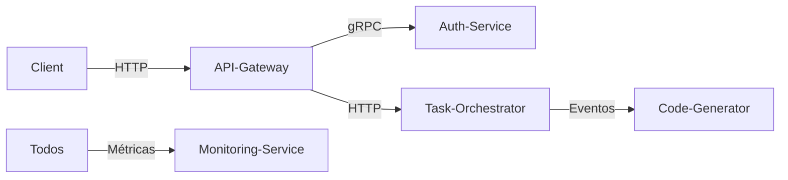
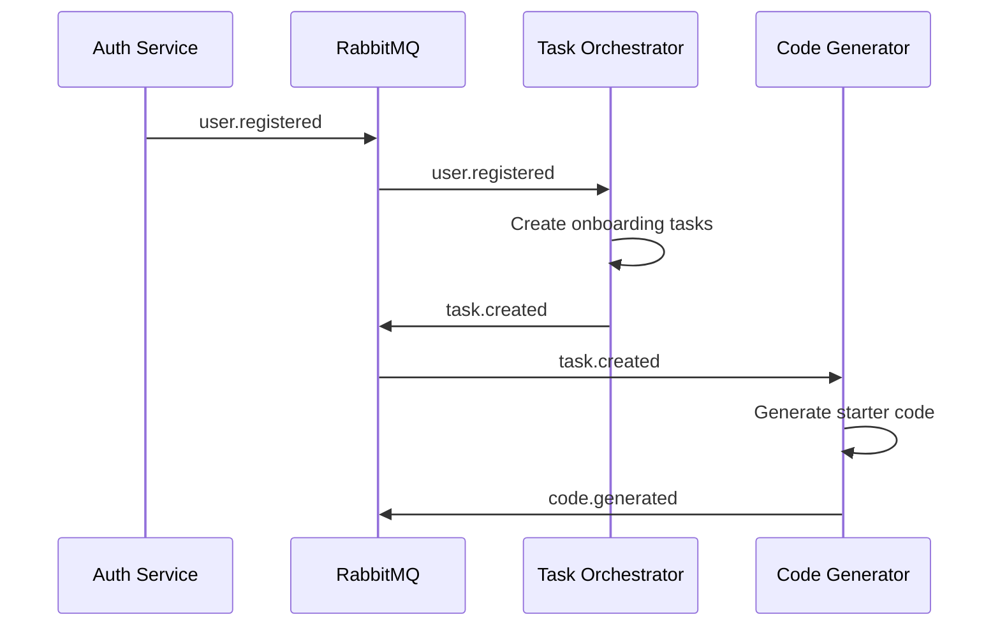

### [Sessão Paralela: Tech Leader]
# DIYAPP Evolution - V12 Core - Arquitetura de Microsserviços

## Estrutura do Repositório Base

```
diyapp-v12-core/
├── .github/
│   └── workflows/
│       ├── ci.yml
│       ├── cd.yml
│       └── security-scan.yml
├── src/
│   ├── api-gateway/
│   │   ├── src/
│   │   │   ├── controllers/
│   │   │   ├── middleware/
│   │   │   ├── routes/
│   │   │   └── index.js
│   │   ├── Dockerfile
│   │   ├── package.json
│   │   └── .env.example
│   ├── auth-service/
│   │   ├── src/
│   │   │   ├── controllers/
│   │   │   ├── models/
│   │   │   ├── services/
│   │   │   └── index.js
│   │   ├── Dockerfile
│   │   ├── package.json
│   │   └── .env.example
│   ├── task-service/
│   │   ├── src/
│   │   │   ├── controllers/
│   │   │   ├── models/
│   │   │   ├── services/
│   │   │   └── index.js
│   │   ├── Dockerfile
│   │   ├── package.json
│   │   └── .env.example
│   └── notification-service/
│       ├── src/
│       │   ├── controllers/
│       │   ├── services/
│       │   └── index.js
│       ├── Dockerfile
│       ├── package.json
│       └── .env.example
├── infrastructure/
│   ├── monitoring/
│   │   ├── prometheus/
│   │   │   └── prometheus.yml
│   │   ├── grafana/
│   │   │   └── dashboards/
│   │   └── loki/
│   │       └── loki-config.yml
│   ├── database/
│   │   ├── init-scripts/
│   │   └── migrations/
│   └── nginx/
│       └── nginx.conf
├── public/
│   └── index.html
├── scripts/
│   ├── deploy.sh
│   ├── health-check.sh
│   └── backup.sh
├── tests/
│   ├── integration/
│   ├── e2e/
│   └── load/
├── .dockerignore
├── .gitignore
├── docker-compose.yml
├── docker-compose.prod.yml
├── docker-compose.dev.yml
├── .env.example
├── package.json
├── README.md
├── ADR-001-microsservices-architecture.md
├── Engineering-Standards.md
└── Technical-Debt-Registry.md
```

## Arquivos de Configuração Base

### 1. `.dockerignore`

```dockerignore
# .dockerignore
node_modules
npm-debug.log
.env
.env.local
.env.development.local
.env.test.local
.env.production.local
.DS_Store
.git
.gitignore
.vscode
.idea
*.log
coverage
dist
build
*.md
*.txt
*.yml
*.yaml
docker-compose.*.yml
```

### 2. `.gitignore`

```gitignore
# .gitignore
# Dependencies
node_modules/
.pnp
.pnp.js

# Environment variables
.env
.env.local
.env.development.local
.env.test.local
.env.production.local

# Logs
npm-debug.log*
yarn-debug.log*
yarn-error.log*
lerna-debug.log*

# Runtime data
pids
*.pid
*.seed
*.pid.lock

# Coverage directory used by tools like istanbul
coverage/
*.lcov

# nyc test coverage
.nyc_output

# Grunt intermediate storage (https://gruntjs.com/creating-plugins#storing-task-files)
.grunt

# Bower dependency directory (https://bower.io/)
bower_components

# node-waf configuration
.lock-wscript

# Compiled binary addons (https://nodejs.org/api/addons.html)
build/Release

# Dependency directories
jspm_packages/

# TypeScript v1 declaration files
typings/

# Optional npm cache directory
.npm

# Optional eslint cache
.eslintcache

# Microbundle cache
.rpt2_cache/
.rts2_cache_cjs/
.rts2_cache_es/
.rts2_cache_umd/

# Optional REPL history
.node_repl_history

# Output of 'npm pack'
*.tgz

# Yarn Integrity file
.yarn-integrity

# dotenv environment variables file
.env
.env.test

# parcel-bundler cache (https://parceljs.org/)
.cache
.parcel-cache

# Next.js build output
.next

# Nuxt.js build / generate output
.nuxt
dist

# Gatsby files
.cache/
public

# Vuepress build output
.vuepress/dist

# Serverless directories
.serverless/

# FuseBox cache
.fusebox/

# DynamoDB Local files
.dynamodb/

# TernJS port file
.tern-port

# Stores VSCode versions used for testing VSCode extensions
.vscode-test

# Temporary folders
tmp/
temp/

# Docker
*.tar.gz
*.tar

# IDE
.vscode/
.idea/
*.swp
*.swo

# OS
.DS_Store
Thumbs.db
```

### 3. `docker-compose.yml` (Desenvolvimento)

```yaml
# docker-compose.yml
version: '3.8'

services:
  # Banco de Dados Principal
  postgres:
    image: postgres:15-alpine
    container_name: diyapp-postgres
    environment:
      POSTGRES_DB: diyapp
      POSTGRES_USER: diyapp_user
      POSTGRES_PASSWORD: ${DB_PASSWORD:-changeme}
    ports:
      - "5432:5432"
    volumes:
      - postgres_data:/var/lib/postgresql/data
      - ./infrastructure/database/init-scripts:/docker-entrypoint-initdb.d
    networks:
      - diyapp-network
    healthcheck:
      test: ["CMD-SHELL", "pg_isready -U diyapp_user"]
      interval: 10s
      timeout: 5s
      retries: 5

  # Redis para Cache e Sessões
  redis:
    image: redis:7-alpine
    container_name: diyapp-redis
    ports:
      - "6379:6379"
    volumes:
      - redis_data:/data
    networks:
      - diyapp-network
    command: redis-server --appendonly yes
    healthcheck:
      test: ["CMD", "redis-cli", "ping"]
      interval: 10s
      timeout: 5s
      retries: 5

  # API Gateway
  api-gateway:
    build:
      context: ./src/api-gateway
      dockerfile: Dockerfile.dev
    container_name: diyapp-api-gateway
    ports:
      - "3000:3000"
    environment:
      NODE_ENV: development
      PORT: 3000
      AUTH_SERVICE_URL: http://auth-service:3001
      TASK_SERVICE_URL: http://task-service:3002
      NOTIFICATION_SERVICE_URL: http://notification-service:3003
      REDIS_URL: redis://redis:6379
    volumes:
      - ./src/api-gateway:/app
      - /app/node_modules
    depends_on:
      postgres:
        condition: service_healthy
      redis:
        condition: service_healthy
    networks:
      - diyapp-network
    restart: unless-stopped

  # Serviço de Autenticação
  auth-service:
    build:
      context: ./src/auth-service
      dockerfile: Dockerfile.dev
    container_name: diyapp-auth-service
    ports:
      - "3001:3001"
    environment:
      NODE_ENV: development
      PORT: 3001
      DB_HOST: postgres
      DB_PORT: 5432
      DB_NAME: diyapp
      DB_USER: diyapp_user
      DB_PASSWORD: ${DB_PASSWORD:-changeme}
      JWT_SECRET: ${JWT_SECRET:-supersecretjwtkey}
      REDIS_URL: redis://redis:6379
    volumes:
      - ./src/auth-service:/app
      - /app/node_modules
    depends_on:
      postgres:
        condition: service_healthy
      redis:
        condition: service_healthy
    networks:
      - diyapp-network
    restart: unless-stopped

  # Serviço de Tarefas
  task-service:
    build:
      context: ./src/task-service
      dockerfile: Dockerfile.dev
    container_name: diyapp-task-service
    ports:
      - "3002:3002"
    environment:
      NODE_ENV: development
      PORT: 3002
      DB_HOST: postgres
      DB_PORT: 5432
      DB_NAME: diyapp
      DB_USER: diyapp_user
      DB_PASSWORD: ${DB_PASSWORD:-changeme}
      REDIS_URL: redis://redis:6379
      AUTH_SERVICE_URL: http://auth-service:3001
    volumes:
      - ./src/task-service:/app
      - /app/node_modules
    depends_on:
      postgres:
        condition: service_healthy
      auth-service:
        condition: service_started
    networks:
      - diyapp-network
    restart: unless-stopped

  # Serviço de Notificações
  notification-service:
    build:
      context: ./src/notification-service
      dockerfile: Dockerfile.dev
    container_name: diyapp-notification-service
    ports:
      - "3003:3003"
    environment:
      NODE_ENV: development
      PORT: 3003
      REDIS_URL: redis://redis:6379
      EMAIL_SERVICE_URL: ${EMAIL_SERVICE_URL}
      SMS_SERVICE_URL: ${SMS_SERVICE_URL}
    volumes:
      - ./src/notification-service:/app
      - /app/node_modules
    depends_on:
      redis:
        condition: service_healthy
    networks:
      - diyapp-network
    restart: unless-stopped

  # Nginx como Load Balancer (Opcional para Dev)
  nginx:
    image: nginx:alpine
    container_name: diyapp-nginx
    ports:
      - "80:80"
    volumes:
      - ./infrastructure/nginx/nginx.conf:/etc/nginx/nginx.conf
    depends_on:
      - api-gateway
      - auth-service
      - task-service
      - notification-service
    networks:
      - diyapp-network

  # Monitoramento - Prometheus
  prometheus:
    image: prom/prometheus:latest
    container_name: diyapp-prometheus
    ports:
      - "9090:9090"
    volumes:
      - ./infrastructure/monitoring/prometheus/prometheus.yml:/etc/prometheus/prometheus.yml
      - prometheus_data:/prometheus
    command:
      - '--config.file=/etc/prometheus/prometheus.yml'
      - '--storage.tsdb.path=/prometheus'
      - '--web.console.libraries=/etc/prometheus/console_libraries'
      - '--web.console.templates=/etc/prometheus/consoles'
      - '--storage.tsdb.retention.time=200h'
      - '--web.enable-lifecycle'
    networks:
      - diyapp-network
    restart: unless-stopped

  # Monitoramento - Grafana
  grafana:
    image: grafana/grafana:latest
    container_name: diyapp-grafana
    ports:
      - "3004:3000"
    environment:
      GF_SECURITY_ADMIN_PASSWORD: ${GRAFANA_PASSWORD:-admin}
    volumes:
      - grafana_data:/var/lib/grafana
      - ./infrastructure/monitoring/grafana/dashboards:/etc/grafana/provisioning/dashboards
    depends_on:
      - prometheus
    networks:
      - diyapp-network
    restart: unless-stopped

  # Logs - Loki
  loki:
    image: grafana/loki:latest
    container_name: diyapp-loki
    ports:
      - "3100:3100"
    command: -config.file=/etc/loki/local-config.yaml
    volumes:
      - ./infrastructure/monitoring/loki/loki-config.yml:/etc/loki/local-config.yaml
      - loki_data:/loki
    networks:
      - diyapp-network
    restart: unless-stopped

  # Coletor de Logs - Promtail
  promtail:
    image: grafana/promtail:latest
    container_name: diyapp-promtail
    volumes:
      - ./infrastructure/monitoring/loki/promtail-config.yml:/etc/promtail/config.yml
      - /var/log:/var/log
      - /var/lib/docker/containers:/var/lib/docker/containers:ro
    command: -config.file=/etc/promtail/config.yml
    networks:
      - diyapp-network
    restart: unless-stopped

networks:
  diyapp-network:
    driver: bridge

volumes:
  postgres_data:
  redis_data:
  prometheus_data:
  grafana_data:
  loki_data:
```

### 4. `docker-compose.prod.yml` (Produção)

```yaml
# docker-compose.prod.yml
version: '3.8'

services:
  api-gateway:
    build:
      context: ./src/api-gateway
      dockerfile: Dockerfile.prod
    container_name: diyapp-api-gateway-prod
    ports:
      - "3000:3000"
    environment:
      NODE_ENV: production
      PORT: 3000
      AUTH_SERVICE_URL: http://auth-service:3001
      TASK_SERVICE_URL: http://task-service:3002
      NOTIFICATION_SERVICE_URL: http://notification-service:3003
      REDIS_URL: redis://redis:6379
      LOG_LEVEL: info
    deploy:
      replicas: 3
      restart_policy:
        condition: on-failure
        delay: 5s
        max_attempts: 3
      update_config:
        parallelism: 1
        delay: 10s
    networks:
      - diyapp-network-prod
    healthcheck:
      test: ["CMD", "curl", "-f", "http://localhost:3000/health"]
      interval: 30s
      timeout: 10s
      retries: 3

  auth-service:
    build:
      context: ./src/auth-service
      dockerfile: Dockerfile.prod
    container_name: diyapp-auth-service-prod
    environment:
      NODE_ENV: production
      PORT: 3001
      DB_HOST: ${DB_HOST}
      DB_PORT: ${DB_PORT}
      DB_NAME: ${DB_NAME}
      DB_USER: ${DB_USER}
      DB_PASSWORD: ${DB_PASSWORD}
      JWT_SECRET: ${JWT_SECRET}
      REDIS_URL: redis://redis:6379
      LOG_LEVEL: info
    deploy:
      replicas: 2
      restart_policy:
        condition: on-failure
    networks:
      - diyapp-network-prod
    healthcheck:
      test: ["CMD", "curl", "-f", "http://localhost:3001/health"]
      interval: 30s
      timeout: 10s
      retries: 3

  # Configurações similares para outros serviços...

networks:
  diyapp-network-prod:
    driver: bridge
    ipam:
      config:
        - subnet: 172.20.0.0/16
```

### 5. `Dockerfile` Exemplo para Serviço (Desenvolvimento)

```dockerfile
# src/auth-service/Dockerfile.dev
FROM node:18-alpine

WORKDIR /app

# Instalar dependências
COPY package*.json ./
RUN npm ci --only=development

# Copiar código fonte
COPY . .

# Expor porta
EXPOSE 3001

# Comando de desenvolvimento com hot reload
CMD ["npm", "run", "dev"]
```

### 6. `Dockerfile` Exemplo para Serviço (Produção)

```dockerfile
# src/auth-service/Dockerfile.prod
# Build stage
FROM node:18-alpine AS builder

WORKDIR /app

COPY package*.json ./
RUN npm ci --only=production

COPY . .

# Runtime stage
FROM node:18-alpine

WORKDIR /app

# Criar usuário não-root
RUN addgroup -g 1001 -S nodejs
RUN adduser -S nodejs -u 1001

# Copiar dependências e código
COPY --from=builder --chown=nodejs:nodejs /app/node_modules ./node_modules
COPY --from=builder --chown=nodejs:nodejs /app/src ./src
COPY --from=builder --chown=nodejs:nodejs /app/package.json ./package.json

USER nodejs

EXPOSE 3001

# Health check
HEALTHCHECK --interval=30s --timeout=3s --start-period=5s --retries=3 \
  CMD node healthcheck.js

CMD ["node", "src/index.js"]
```

### 7. `package.json` Raiz

```json
{
  "name": "diyapp-v12-core",
  "version": "1.0.0",
  "private": true,
  "workspaces": [
    "src/api-gateway",
    "src/auth-service",
    "src/task-service",
    "src/notification-service"
  ],
  "scripts": {
    "dev": "docker-compose up",
    "dev:build": "docker-compose up --build",
    "prod": "docker-compose -f docker

### [Sessão Paralela: UX Designer]
# DIYAPP Evolution - V12 Core - Design System

## Estrutura do Projeto

```
diyapp-v12-design-system/
├── index.html              # Dashboard principal do Design System
├── css/
│   ├── design-tokens.css   # Tokens de design (cores, tipografia, espaçamento)
│   ├── components.css      # Componentes atômicos
│   ├── templates.css       # Templates de páginas
│   └── micro-interactions.css # Micro-interações
├── js/
│   ├── design-system.js    # Lógica do Design System
│   ├── micro-interactions.js # Micro-interações JS
│   └── accessibility.js    # Utilitários de acessibilidade
├── assets/
│   ├── icons/              # Ícones do sistema
│   └── fonts/              # Fontes personalizadas
└── docs/
    └── usage-guide.md      # Guia de uso do Design System
```

## 1. index.html - Dashboard do Design System

```html
<!DOCTYPE html>
<html lang="pt-BR">
<head>
    <meta charset="UTF-8">
    <meta name="viewport" content="width=device-width, initial-scale=1.0">
    <title>DIYAPP V12 - Design System</title>
    <link rel="stylesheet" href="css/design-tokens.css">
    <link rel="stylesheet" href="css/components.css">
    <link rel="stylesheet" href="css/templates.css">
    <link rel="stylesheet" href="css/micro-interactions.css">
    <link rel="stylesheet" href="https://cdnjs.cloudflare.com/ajax/libs/font-awesome/6.4.0/css/all.min.css">
    <link rel="preconnect" href="https://fonts.googleapis.com">
    <link rel="preconnect" href="https://fonts.gstatic.com" crossorigin>
    <link href="https://fonts.googleapis.com/css2?family=Inter:wght@300;400;500;600;700&family=Roboto+Mono:wght@400;500&display=swap" rel="stylesheet">
</head>
<body>
    <!-- Header -->
    <header class="ds-header">
        <div class="container">
            <div class="header-content">
                <div class="logo">
                    <i class="fas fa-cube"></i>
                    <h1>DIYAPP <span class="version">V12</span></h1>
                    <span class="badge badge-primary">Design System</span>
                </div>
                <nav class="main-nav">
                    <ul>
                        <li><a href="#tokens" class="nav-link active">Tokens</a></li>
                        <li><a href="#components" class="nav-link">Componentes</a></li>
                        <li><a href="#templates" class="nav-link">Templates</a></li>
                        <li><a href="#accessibility" class="nav-link">Acessibilidade</a></li>
                    </ul>
                </nav>
                <div class="theme-toggle">
                    <button class="btn-icon" id="themeToggle" aria-label="Alternar tema">
                        <i class="fas fa-moon"></i>
                    </button>
                </div>
            </div>
        </div>
    </header>

    <main class="ds-main">
        <div class="container">
            <!-- Sidebar -->
            <aside class="ds-sidebar">
                <nav class="sidebar-nav">
                    <div class="nav-section">
                        <h3 class="nav-title">Fundação</h3>
                        <ul>
                            <li><a href="#colors">Cores</a></li>
                            <li><a href="#typography">Tipografia</a></li>
                            <li><a href="#spacing">Espaçamento</a></li>
                            <li><a href="#elevation">Elevação</a></li>
                            <li><a href="#border-radius">Border Radius</a></li>
                        </ul>
                    </div>
                    
                    <div class="nav-section">
                        <h3 class="nav-title">Componentes</h3>
                        <ul>
                            <li><a href="#buttons">Botões</a></li>
                            <li><a href="#inputs">Inputs & Formulários</a></li>
                            <li><a href="#cards">Cards</a></li>
                            <li><a href="#modals">Modais</a></li>
                            <li><a href="#navigation">Navegação</a></li>
                            <li><a href="#feedback">Feedback</a></li>
                        </ul>
                    </div>
                    
                    <div class="nav-section">
                        <h3 class="nav-title">Templates</h3>
                        <ul>
                            <li><a href="#dashboard">Dashboard</a></li>
                            <li><a href="#settings">Configurações</a></li>
                            <li><a href="#ai-flows">Fluxos de IA</a></li>
                        </ul>
                    </div>
                    
                    <div class="nav-section">
                        <h3 class="nav-title">Acessibilidade</h3>
                        <ul>
                            <li><a href="#wcag">WCAG AA</a></li>
                            <li><a href="#keyboard">Navegação por Teclado</a></li>
                            <li><a href="#aria">ARIA Labels</a></li>
                        </ul>
                    </div>
                </nav>
            </aside>

            <!-- Content Area -->
            <div class="ds-content">
                <!-- Tokens Section -->
                <section id="tokens" class="ds-section">
                    <h2 class="section-title">Tokens de Design</h2>
                    
                    <!-- Colors -->
                    <div id="colors" class="token-section">
                        <h3 class="token-title">Cores</h3>
                        <p class="token-description">Paleta de cores com contraste WCAG AA garantido</p>
                        
                        <div class="color-grid">
                            <!-- Primary Colors -->
                            <div class="color-group">
                                <h4>Primárias</h4>
                                <div class="color-item">
                                    <div class="color-swatch" style="background-color: var(--color-primary-500);"></div>
                                    <div class="color-info">
                                        <span class="color-name">Primary 500</span>
                                        <span class="color-value">#4361EE</span>
                                        <span class="color-contrast">Contraste: 4.6:1 ✓</span>
                                    </div>
                                </div>
                                <div class="color-item">
                                    <div class="color-swatch" style="background-color: var(--color-primary-600);"></div>
                                    <div class="color-info">
                                        <span class="color-name">Primary 600</span>
                                        <span class="color-value">#3A56D4</span>
                                        <span class="color-contrast">Contraste: 5.2:1 ✓</span>
                                    </div>
                                </div>
                            </div>
                            
                            <!-- Neutral Colors -->
                            <div class="color-group">
                                <h4>Neutras</h4>
                                <div class="color-item">
                                    <div class="color-swatch" style="background-color: var(--color-neutral-50); border: 1px solid var(--color-border);"></div>
                                    <div class="color-info">
                                        <span class="color-name">Neutral 50</span>
                                        <span class="color-value">#F8FAFC</span>
                                        <span class="color-contrast">Base</span>
                                    </div>
                                </div>
                                <div class="color-item">
                                    <div class="color-swatch" style="background-color: var(--color-neutral-900);"></div>
                                    <div class="color-info">
                                        <span class="color-name">Neutral 900</span>
                                        <span class="color-value">#0F172A</span>
                                        <span class="color-contrast">Contraste: 17.1:1 ✓</span>
                                    </div>
                                </div>
                            </div>
                            
                            <!-- Semantic Colors -->
                            <div class="color-group">
                                <h4>Semânticas</h4>
                                <div class="color-item">
                                    <div class="color-swatch" style="background-color: var(--color-success-500);"></div>
                                    <div class="color-info">
                                        <span class="color-name">Success 500</span>
                                        <span class="color-value">#10B981</span>
                                        <span class="color-contrast">Contraste: 3.1:1 ✓</span>
                                    </div>
                                </div>
                                <div class="color-item">
                                    <div class="color-swatch" style="background-color: var(--color-error-500);"></div>
                                    <div class="color-info">
                                        <span class="color-name">Error 500</span>
                                        <span class="color-value">#EF4444</span>
                                        <span class="color-contrast">Contraste: 4.5:1 ✓</span>
                                    </div>
                                </div>
                            </div>
                        </div>
                    </div>
                    
                    <!-- Typography -->
                    <div id="typography" class="token-section">
                        <h3 class="token-title">Tipografia</h3>
                        <p class="token-description">Escala tipográfica responsiva com hierarquia clara</p>
                        
                        <div class="typography-demo">
                            <div class="type-item">
                                <h1 class="display-1">Display 1</h1>
                                <p class="type-meta">Inter • 48px • 700 • Line height: 56px</p>
                            </div>
                            <div class="type-item">
                                <h2 class="display-2">Display 2</h2>
                                <p class="type-meta">Inter • 36px • 600 • Line height: 44px</p>
                            </div>
                            <div class="type-item">
                                <h3 class="heading-1">Heading 1</h3>
                                <p class="type-meta">Inter • 24px • 600 • Line height: 32px</p>
                            </div>
                            <div class="type-item">
                                <p class="body-large">Body Large - Lorem ipsum dolor sit amet, consectetur adipiscing elit. Sed do eiusmod tempor incididunt ut labore et dolore magna aliqua.</p>
                                <p class="type-meta">Inter • 18px • 400 • Line height: 28px</p>
                            </div>
                            <div class="type-item">
                                <p class="body-regular">Body Regular - Lorem ipsum dolor sit amet, consectetur adipiscing elit. Sed do eiusmod tempor incididunt ut labore et dolore magna aliqua.</p>
                                <p class="type-meta">Inter • 16px • 400 • Line height: 24px</p>
                            </div>
                        </div>
                    </div>
                    
                    <!-- Spacing -->
                    <div id="spacing" class="token-section">
                        <h3 class="token-title">Espaçamento</h3>
                        <p class="token-description">Escala de espaçamento baseada em 4px (0.25rem)</p>
                        
                        <div class="spacing-demo">
                            <div class="spacing-item">
                                <div class="spacing-visual" style="width: var(--spacing-xs);"></div>
                                <span class="spacing-label">XS: 4px (0.25rem)</span>
                            </div>
                            <div class="spacing-item">
                                <div class="spacing-visual" style="width: var(--spacing-sm);"></div>
                                <span class="spacing-label">SM: 8px (0.5rem)</span>
                            </div>
                            <div class="spacing-item">
                                <div class="spacing-visual" style="width: var(--spacing-md);"></div>
                                <span class="spacing-label">MD: 16px (1rem)</span>
                            </div>
                            <div class="spacing-item">
                                <div class="spacing-visual" style="width: var(--spacing-lg);"></div>
                                <span class="spacing-label">LG: 24px (1.5rem)</span>
                            </div>
                            <div class="spacing-item">
                                <div class="spacing-visual" style="width: var(--spacing-xl);"></div>
                                <span class="spacing-label">XL: 32px (2rem)</span>
                            </div>
                        </div>
                    </div>
                </section>

                <!-- Components Section -->
                <section id="components" class="ds-section">
                    <h2 class="section-title">Componentes Atômicos</h2>
                    
                    <!-- Buttons -->
                    <div id="buttons" class="component-section">
                        <h3 class="component-title">Botões</h3>
                        <p class="component-description">Todos os estados especificados: default, hover, focus, active, disabled</p>
                        
                        <div class="component-demo">
                            <div class="demo-group">
                                <h4>Variações</h4>
                                <div class="button-grid">
                                    <button class="btn btn-primary">Primary</button>
                                    <button class="btn btn-secondary">Secondary</button>
                                    <button class="btn btn-outline">Outline</button>
                                    <button class="btn btn-ghost">Ghost</button>
                                    <button class="btn btn-danger">Danger</button>
                                    <button class="btn btn-success">Success</button>
                                </div>
                            </div>
                            
                            <div class="demo-group">
                                <h4>Tamanhos</h4>
                                <div class="button-grid">
                                    <button class="btn btn-primary btn-sm">Small</button>
                                    <button class="btn btn-primary">Medium</button>
                                    <button class="btn btn-primary btn-lg">Large</button>
                                </div>
                            </div>
                            
                            <div class="demo-group">
                                <h4>Estados</h4>
                                <div class="button-grid">
                                    <button class="btn btn-primary" disabled>Disabled</button>
                                    <button class="btn btn-primary loading">
                                        <span class="loading-spinner"></span>
                                        Loading
                                    </button>
                                    <button class="btn btn-icon">
                                        <i class="fas fa-cog"></i>
                                    </button>
                                    <button class="btn btn-primary btn-with-icon">
                                        <i class="fas fa-plus"></i>
                                        Add Item
                                    </button>
                                </div>
                            </div>
                        </div>
                        
                        <div class="component-specs">
                            <h5>Especificações para Dev:</h5>
                            <ul>
                                <li><strong>Estados:</strong> default, hover, focus, active, disabled, loading</li>
                                <li><strong>Tokens:</strong> --color-primary-500, --color-primary-600, --spacing-md, --spacing-lg</li>
                                <li><strong>Acessibilidade:</strong> Contraste 4.6:1 ✓, foco visível, ARIA labels para ícones</li>
                            </ul>
                        </div>
                    </div>
                    
                    <!-- Inputs -->
                    <div id="inputs" class="component-section">
                        <h3 class="component-title">Inputs & Formulários</h3>
                        
                        <div class="component-demo">
                            <form class="form-demo">
                                <div class="form-group">
                                    <label for="nameInput" class="form-label">Nome completo</label>
                                    <input type="text" id="nameInput" class="form-input" placeholder="Digite seu nome">
                                    <div class="form-hint">Mínimo 3 caracteres</div>
                                </div>
                                
                                <div class="form-group">
                                    <label for="emailInput" class="form-label">E-mail</label>
                                    <input type="email" id="emailInput" class="form-input form-input-error" placeholder="email@exemplo.com" value="email-invalido">
                                    <div class="form-error">Por favor, insira um e-mail válido</div>
                                </div>
                                
                                <div class="form-group">
                                    <label for="passwordInput" class="form-label">Senha</label>
                                    <div class="input-with-icon">
                                        <input type="password" id="passwordInput" class="form-input" placeholder="Digite sua senha">
                                        <button type="button" class="input-icon" aria-label="Mostrar senha">
                                            <i class="fas fa-eye"></i>
                                        </button>
                                    </div>
                                </div>
                                
                                <div class="form-group">
                                    <label for="selectInput" class="form-label">Categoria</label>
                                    <select id="selectInput" class="form-select">
                                        <option value="">Selecione uma opção</option>
                                        <option value="1">Opção 1</option>
                                        <option value="2">Opção 2</option>
                                        <option value="3">Opção 3</option>
                                    </select>
                                </div>
                                
                                <div class="form-group">
                                    <label class="form-label">Checkboxes</label>
                                    <div class="checkbox-group">
                                        <label class="checkbox">
                                            <input type="checkbox" checked>
                                            <span class="checkmark"></span>
                                            Opção selecionada
                                        </label>
                                        <label class="checkbox">
                                            <input type="checkbox">
                                            <span class="checkmark"></span>
                                            Outra opção
                                        </label>
                                    </div>
                                </div>
                            </form>
                        </div>
                    </div>
                    
                    <!-- Cards -->
                    <div id="cards" class="component-section">
                        <h3 class="component-title">Cards</h3>
                        
                        <div class="card-grid">
                            <div class="card">
                                <div class="card-header">
                                    <h4 class="card-title">Card Padrão</h4>
                                    <button class="btn-icon" aria-label="Mais opções">
                                        <i class="fas fa-ellipsis-v"></i>
                                    </button>
                                </div>
                                <div class="card-body">
                                    <p>Conteúdo do card com informações relevantes. Pode conter texto, imagens ou outros componentes.</p>
                                </div>
                                <div class="

### [Sessão Paralela: Backend]
# DIYAPP Evolution - V12 Core - Backend API

Vou construir um backend robusto com Node.js/Express, PostgreSQL, autenticação JWT com refresh tokens, RBAC, filas com Bull/Redis, cache e migrations. Vou focar em estabilidade, resiliência e observabilidade.

## Estrutura do Projeto

```
diyapp-v12-core/
├── src/
│   ├── config/
│   ├── middleware/
│   ├── models/
│   ├── controllers/
│   ├── services/
│   ├── repositories/
│   ├── queues/
│   ├── migrations/
│   ├── scripts/
│   ├── utils/
│   └── validators/
├── tests/
├── public/
├── docs/
└── index.html
```

Vou começar implementando:

## 1. Configuração Principal e Dependências

**package.json**
```json
{
  "name": "diyapp-v12-core",
  "version": "1.0.0",
  "description": "DIYAPP Evolution V12 Core Backend",
  "main": "src/server.js",
  "scripts": {
    "start": "node src/server.js",
    "dev": "nodemon src/server.js",
    "test": "jest --coverage",
    "test:watch": "jest --watch",
    "lint": "eslint src/",
    "migrate:up": "node src/scripts/run-migrations.js up",
    "migrate:down": "node src/scripts/run-migrations.js down",
    "migrate:create": "node src/scripts/create-migration.js",
    "seed": "node src/scripts/seed-database.js"
  },
  "dependencies": {
    "express": "^4.18.2",
    "cors": "^2.8.5",
    "helmet": "^7.0.0",
    "compression": "^1.7.4",
    "express-rate-limit": "^6.10.0",
    "express-validator": "^7.0.1",
    "jsonwebtoken": "^9.0.0",
    "bcrypt": "^5.1.0",
    "pg": "^8.11.0",
    "knex": "^2.4.2",
    "redis": "^4.6.7",
    "bull": "^4.11.2",
    "ioredis": "^5.3.2",
    "node-cache": "^5.1.2",
    "winston": "^3.9.0",
    "winston-daily-rotate-file": "^4.7.1",
    "express-winston": "^4.2.0",
    "uuid": "^9.0.0",
    "joi": "^17.9.2",
    "axios": "^1.4.0",
    "circuit-breaker-js": "^0.2.0",
    "prom-client": "^14.2.0",
    "swagger-ui-express": "^4.6.3",
    "swagger-jsdoc": "^6.2.8",
    "dotenv": "^16.0.3",
    "moment": "^2.29.4"
  },
  "devDependencies": {
    "nodemon": "^2.0.22",
    "jest": "^29.5.0",
    "supertest": "^6.3.3",
    "eslint": "^8.42.0",
    "eslint-config-airbnb-base": "^15.0.0",
    "eslint-plugin-import": "^2.27.5",
    "sqlite3": "^5.1.6",
    "faker": "^5.5.3"
  }
}
```

## 2. Configuração do Ambiente

**.env**
```env
# Server
NODE_ENV=development
PORT=3000
API_VERSION=v1
API_BASE_PATH=/api/v1

# Database
DB_HOST=localhost
DB_PORT=5432
DB_NAME=diyapp_v12
DB_USER=diyapp_user
DB_PASSWORD=secure_password_here
DB_POOL_MIN=2
DB_POOL_MAX=20
DB_SSL=false

# Redis
REDIS_HOST=localhost
REDIS_PORT=6379
REDIS_PASSWORD=
REDIS_DB=0
REDIS_CACHE_TTL=3600

# JWT
JWT_SECRET=your_super_secret_jwt_key_change_in_production
JWT_ACCESS_EXPIRY=15m
JWT_REFRESH_EXPIRY=7d
JWT_ISSUER=diyapp-v12-core

# Security
BCRYPT_ROUNDS=12
RATE_LIMIT_WINDOW_MS=900000
RATE_LIMIT_MAX_REQUESTS=100

# Logging
LOG_LEVEL=info
LOG_DIR=./logs

# External Services (with circuit breakers)
EXTERNAL_API_TIMEOUT=5000
EXTERNAL_API_RETRIES=3
EXTERNAL_API_CIRCUIT_BREAKER_THRESHOLD=5
EXTERNAL_API_CIRCUIT_BREAKER_TIMEOUT=30000
```

## 3. Configuração Principal

**src/config/index.js**
```javascript
require('dotenv').config();

const config = {
  // Server
  env: process.env.NODE_ENV || 'development',
  port: parseInt(process.env.PORT, 10) || 3000,
  apiVersion: process.env.API_VERSION || 'v1',
  apiBasePath: process.env.API_BASE_PATH || '/api/v1',

  // Database
  database: {
    client: 'pg',
    connection: {
      host: process.env.DB_HOST || 'localhost',
      port: parseInt(process.env.DB_PORT, 10) || 5432,
      database: process.env.DB_NAME || 'diyapp_v12',
      user: process.env.DB_USER || 'diyapp_user',
      password: process.env.DB_PASSWORD || '',
      ssl: process.env.DB_SSL === 'true' ? { rejectUnauthorized: false } : false,
    },
    pool: {
      min: parseInt(process.env.DB_POOL_MIN, 10) || 2,
      max: parseInt(process.env.DB_POOL_MAX, 10) || 20,
    },
    migrations: {
      directory: './src/migrations',
      tableName: 'knex_migrations',
    },
    seeds: {
      directory: './src/seeds',
    },
  },

  // Redis
  redis: {
    host: process.env.REDIS_HOST || 'localhost',
    port: parseInt(process.env.REDIS_PORT, 10) || 6379,
    password: process.env.REDIS_PASSWORD || null,
    db: parseInt(process.env.REDIS_DB, 10) || 0,
    cacheTtl: parseInt(process.env.REDIS_CACHE_TTL, 10) || 3600,
  },

  // JWT
  jwt: {
    secret: process.env.JWT_SECRET || 'your_super_secret_jwt_key',
    accessExpiry: process.env.JWT_ACCESS_EXPIRY || '15m',
    refreshExpiry: process.env.JWT_REFRESH_EXPIRY || '7d',
    issuer: process.env.JWT_ISSUER || 'diyapp-v12-core',
  },

  // Security
  security: {
    bcryptRounds: parseInt(process.env.BCRYPT_ROUNDS, 10) || 12,
    rateLimitWindowMs: parseInt(process.env.RATE_LIMIT_WINDOW_MS, 10) || 900000,
    rateLimitMaxRequests: parseInt(process.env.RATE_LIMIT_MAX_REQUESTS, 10) || 100,
  },

  // Logging
  logging: {
    level: process.env.LOG_LEVEL || 'info',
    directory: process.env.LOG_DIR || './logs',
  },

  // External Services
  externalServices: {
    timeout: parseInt(process.env.EXTERNAL_API_TIMEOUT, 10) || 5000,
    retries: parseInt(process.env.EXTERNAL_API_RETRIES, 10) || 3,
    circuitBreakerThreshold: parseInt(process.env.EXTERNAL_API_CIRCUIT_BREAKER_THRESHOLD, 10) || 5,
    circuitBreakerTimeout: parseInt(process.env.EXTERNAL_API_CIRCUIT_BREAKER_TIMEOUT, 10) || 30000,
  },
};

// Validate required config
const requiredConfig = ['JWT_SECRET'];
requiredConfig.forEach((key) => {
  if (!process.env[key] && config.env === 'production') {
    throw new Error(`Missing required environment variable: ${key}`);
  }
});

module.exports = config;
```

## 4. Configuração do Logger (Observabilidade)

**src/config/logger.js**
```javascript
const winston = require('winston');
const DailyRotateFile = require('winston-daily-rotate-file');
const config = require('./index');

const { combine, timestamp, printf, colorize, json } = winston.format;

// Custom format for console
const consoleFormat = printf(({ level, message, timestamp, correlationId, userId, endpoint, durationMs, status }) => {
  const base = `${timestamp} [${correlationId || 'NO_CORRELATION_ID'}] ${level}: ${message}`;
  const meta = [];
  if (userId) meta.push(`user:${userId}`);
  if (endpoint) meta.push(`endpoint:${endpoint}`);
  if (durationMs) meta.push(`duration:${durationMs}ms`);
  if (status) meta.push(`status:${status}`);
  return meta.length > 0 ? `${base} (${meta.join(', ')})` : base;
});

// JSON format for files
const jsonFormat = combine(
  timestamp(),
  json()
);

const transports = [];

// Console transport for development
if (config.env === 'development') {
  transports.push(
    new winston.transports.Console({
      format: combine(
        colorize(),
        timestamp({ format: 'YYYY-MM-DD HH:mm:ss' }),
        consoleFormat
      ),
    })
  );
}

// File transports for all environments
transports.push(
  new DailyRotateFile({
    filename: `${config.logging.directory}/application-%DATE%.log`,
    datePattern: 'YYYY-MM-DD',
    zippedArchive: true,
    maxSize: '20m',
    maxFiles: '30d',
    format: jsonFormat,
  }),
  new DailyRotateFile({
    filename: `${config.logging.directory}/error-%DATE%.log`,
    datePattern: 'YYYY-MM-DD',
    zippedArchive: true,
    maxSize: '20m',
    maxFiles: '30d',
    level: 'error',
    format: jsonFormat,
  })
);

const logger = winston.createLogger({
  level: config.logging.level,
  format: jsonFormat,
  defaultMeta: { service: 'diyapp-v12-core' },
  transports,
  exceptionHandlers: [
    new DailyRotateFile({
      filename: `${config.logging.directory}/exceptions-%DATE%.log`,
      datePattern: 'YYYY-MM-DD',
      zippedArchive: true,
      maxSize: '20m',
      maxFiles: '30d',
    }),
  ],
  rejectionHandlers: [
    new DailyRotateFile({
      filename: `${config.logging.directory}/rejections-%DATE%.log`,
      datePattern: 'YYYY-MM-DD',
      zippedArchive: true,
      maxSize: '20m',
      maxFiles: '30d',
    }),
  ],
});

// Helper to add correlation ID and user ID to logs
logger.withContext = function(context) {
  const { correlationId, userId } = context;
  return this.child({ correlationId, userId });
};

module.exports = logger;
```

## 5. Configuração do Banco de Dados

**src/config/database.js**
```javascript
const knex = require('knex');
const config = require('./index');
const logger = require('./logger');

// Create Knex instance
const db = knex(config.database);

// Add query logging in development
if (config.env === 'development') {
  db.on('query', (query) => {
    logger.debug('Database query', {
      sql: query.sql,
      bindings: query.bindings,
    });
  });

  db.on('query-response', (response, query) => {
    logger.debug('Database query response', {
      sql: query.sql,
      duration: query.__knexQueryUid ? query.__knexQueryUid : 'unknown',
      rowCount: Array.isArray(response) ? response.length : 1,
    });
  });

  db.on('query-error', (error, query) => {
    logger.error('Database query error', {
      sql: query.sql,
      bindings: query.bindings,
      error: error.message,
    });
  });
}

// Health check function
db.healthCheck = async function() {
  try {
    await this.raw('SELECT 1');
    return { status: 'healthy', timestamp: new Date().toISOString() };
  } catch (error) {
    logger.error('Database health check failed', { error: error.message });
    return { status: 'unhealthy', error: error.message, timestamp: new Date().toISOString() };
  }
};

module.exports = db;
```

## 6. Configuração do Redis

**src/config/redis.js**
```javascript
const Redis = require('ioredis');
const config = require('./index');
const logger = require('./logger');

class RedisClient {
  constructor() {
    this.client = new Redis({
      host: config.redis.host,
      port: config.redis.port,
      password: config.redis.password,
      db: config.redis.db,
      retryStrategy: (times) => {
        const delay = Math.min(times * 50, 2000);
        return delay;
      },
      maxRetriesPerRequest: 3,
    });

    this.client.on('connect', () => {
      logger.info('Redis connected successfully');
    });

    this.client.on('error', (error) => {
      logger.error('Redis connection error', { error: error.message });
    });

    this.client.on('close', () => {
      logger.warn('Redis connection closed');
    });
  }

  async get(key) {
    try {
      const value = await this.client.get(key);
      return value ? JSON.parse(value) : null;
    } catch (error) {
      logger.error('Redis get error', { key, error: error.message });
      return null;
    }
  }

  async set(key, value, ttl = config.redis.cacheTtl) {
    try {
      const stringValue = JSON.stringify(value);
      if (ttl) {
        await this.client.setex(key, ttl, stringValue);
      } else {
        await this.client.set(key, stringValue);
      }
      return true;
    } catch (error) {
      logger.error('Redis set error', { key, error: error.message });
      return false;
    }
  }

  async del(key) {
    try {
      await this.client.del(key);
      return true;
    } catch (error) {
      logger.error('Redis delete error', { key, error: error.message });
      return false;
    }
  }

  async exists(key) {
    try {
      const result = await this.client.exists(key);
      return result === 1;
    } catch (error) {
      logger.error('Redis exists error', { key, error: error.message });
      return false;
    }
  }

  async healthCheck() {
    try {
      await this.client.ping();
      return { status: 'healthy', timestamp: new Date().toISOString() };
    } catch (error) {
      logger.error('Redis health check failed', { error: error.message });
      return { status: 'unhealthy', error: error.message, timestamp: new Date().toISOString() };
    }
  }

  async disconnect() {
    try {
      await this.client.quit();
      logger.info('Redis disconnected');
    } catch (error) {
      logger.error('Redis disconnect error', { error: error.message });
    }
  }
}

module.exports = new RedisClient();
```

## 7. Circuit Breaker Pattern

**src/utils/circuitBreaker.js**
```javascript
const CircuitBreaker = require('circuit-breaker-js');
const logger = require('../config/logger');
const config = require('../config');

class ResilientService {
  constructor(serviceName, options = {}) {
    this.serviceName = serviceName;
    
    this.circuitBreaker = new CircuitBreaker({
      windowDuration: options.windowDuration || 10000,
      numBuckets: options.numBuckets || 10,
      timeoutDuration: options.timeoutDuration || config.externalServices.timeout,
      errorThreshold: options.errorThreshold || 50,
      volumeThreshold: options.volumeThreshold || 5,
      onCircuitOpen: (metrics) => {
        logger.warn(`Circuit breaker opened for ${serviceName}`, {
          serviceName,
          metrics: {
            total: metrics.total,
            errorCount: metrics.errorCount,
            errorPercentage: metrics.errorPercentage,
          },
        });
      },
      onCircuitClose: () => {
        logger.info(`Circuit breaker closed for ${serviceName}`, { serviceName });
      },
    });
  }

  async execute(operation, fallback = null, context = {}) {
    const { correlationId, userId } = context;
    
    return new Promise((resolve, reject) => {
      this.circuitBreaker.run(
        (success, failure) => {
          const timeout = setTimeout(() => {
            failure(new Error(`Timeout after ${config.externalServices.timeout}ms`));
          }, config.externalServices.timeout);

          operation()
            .then((result) => {
              clearTimeout(timeout);
              success(result);
            })
            .catch((error) => {
              clearTimeout(timeout);
              
              logger.error(`Service ${this.serviceName} failed`, {
                serviceName: this.serviceName,
                correlationId,
                userId,
                error: error.message,
                stack: error.stack,
              });
              
              failure(error);
            });
        },
        (result) => {
          // Success
          resolve(result);
        },
        (error) => {
          // Failure - try fallback
          if (fallback) {
            logger.warn(`Using fallback for ${this.serviceName}`, {
              serviceName: this.serviceName,
              correlationId,
              userId,
              error: error.message,
            });
            
           

### [Sessão Paralela: Frontend]
Vou implementar um SPA React com TypeScript, integrando Design System, gerenciamento de estado global, lazy loading e PWA. Como Dev Frontend Sênior, vou seguir rigorosamente os padrões estabelecidos.

```json
// package.json
{
  "name": "diyapp-evolution-v12",
  "version": "1.0.0",
  "private": true,
  "type": "module",
  "scripts": {
    "dev": "vite",
    "build": "tsc && vite build",
    "preview": "vite preview",
    "test": "vitest",
    "test:coverage": "vitest --coverage",
    "lint": "eslint . --ext ts,tsx --report-unused-disable-directives --max-warnings 0",
    "format": "prettier --write \"src/**/*.{ts,tsx,css,json}\""
  },
  "dependencies": {
    "react": "^18.2.0",
    "react-dom": "^18.2.0",
    "react-redux": "^9.0.4",
    "@reduxjs/toolkit": "^1.9.5",
    "react-router-dom": "^6.14.2",
    "axios": "^1.4.0",
    "clsx": "^2.0.0",
    "date-fns": "^2.30.0",
    "react-helmet-async": "^2.0.4",
    "workbox-window": "^7.0.0"
  },
  "devDependencies": {
    "@types/react": "^18.2.15",
    "@types/react-dom": "^18.2.7",
    "@typescript-eslint/eslint-plugin": "^6.0.0",
    "@typescript-eslint/parser": "^6.0.0",
    "@vitejs/plugin-react": "^4.0.3",
    "@vitest/coverage-v8": "^0.34.0",
    "autoprefixer": "^10.4.14",
    "eslint": "^8.45.0",
    "eslint-plugin-react-hooks": "^4.6.0",
    "eslint-plugin-react-refresh": "^0.4.3",
    "postcss": "^8.4.27",
    "prettier": "^3.0.0",
    "tailwindcss": "^3.3.3",
    "typescript": "^5.0.2",
    "vite": "^4.4.5",
    "vite-plugin-pwa": "^0.16.4",
    "vitest": "^0.34.0",
    "@testing-library/react": "^14.0.0",
    "@testing-library/jest-dom": "^6.0.0",
    "@testing-library/user-event": "^14.4.3"
  }
}
```

```typescript
// tsconfig.json
{
  "compilerOptions": {
    "target": "ES2020",
    "useDefineForClassFields": true,
    "lib": ["ES2020", "DOM", "DOM.Iterable"],
    "module": "ESNext",
    "skipLibCheck": true,
    "moduleResolution": "bundler",
    "allowImportingTsExtensions": true,
    "resolveJsonModule": true,
    "isolatedModules": true,
    "noEmit": true,
    "jsx": "react-jsx",
    "strict": true,
    "noUnusedLocals": true,
    "noUnusedParameters": true,
    "noFallthroughCasesInSwitch": true,
    "baseUrl": ".",
    "paths": {
      "@/*": ["src/*"],
      "@components/*": ["src/components/*"],
      "@hooks/*": ["src/hooks/*"],
      "@store/*": ["src/store/*"],
      "@utils/*": ["src/utils/*"],
      "@services/*": ["src/services/*"],
      "@types/*": ["src/types/*"]
    }
  },
  "include": ["src"],
  "references": [{ "path": "./tsconfig.node.json" }]
}
```

```typescript
// src/design-system/tokens.ts
export const TOKENS = {
  // Colors
  colors: {
    primary: {
      50: '#eff6ff',
      100: '#dbeafe',
      200: '#bfdbfe',
      300: '#93c5fd',
      400: '#60a5fa',
      500: '#3b82f6',
      600: '#2563eb',
      700: '#1d4ed8',
      800: '#1e40af',
      900: '#1e3a8a',
    },
    neutral: {
      50: '#f8fafc',
      100: '#f1f5f9',
      200: '#e2e8f0',
      300: '#cbd5e1',
      400: '#94a3b8',
      500: '#64748b',
      600: '#475569',
      700: '#334155',
      800: '#1e293b',
      900: '#0f172a',
    },
    success: {
      50: '#f0fdf4',
      500: '#22c55e',
      700: '#15803d',
    },
    warning: {
      50: '#fefce8',
      500: '#eab308',
      700: '#a16207',
    },
    error: {
      50: '#fef2f2',
      500: '#ef4444',
      700: '#b91c1c',
    },
  },
  
  // Typography
  typography: {
    fontFamily: {
      sans: "'Inter', -apple-system, BlinkMacSystemFont, 'Segoe UI', Roboto, sans-serif",
      mono: "'JetBrains Mono', 'Fira Code', monospace",
    },
    fontSize: {
      xs: '0.75rem',
      sm: '0.875rem',
      base: '1rem',
      lg: '1.125rem',
      xl: '1.25rem',
      '2xl': '1.5rem',
      '3xl': '1.875rem',
      '4xl': '2.25rem',
      '5xl': '3rem',
    },
    fontWeight: {
      normal: '400',
      medium: '500',
      semibold: '600',
      bold: '700',
    },
    lineHeight: {
      tight: '1.25',
      normal: '1.5',
      relaxed: '1.75',
    },
  },
  
  // Spacing
  spacing: {
    0: '0',
    1: '0.25rem',
    2: '0.5rem',
    3: '0.75rem',
    4: '1rem',
    5: '1.25rem',
    6: '1.5rem',
    8: '2rem',
    10: '2.5rem',
    12: '3rem',
    16: '4rem',
    20: '5rem',
    24: '6rem',
    32: '8rem',
  },
  
  // Border Radius
  borderRadius: {
    none: '0',
    sm: '0.125rem',
    base: '0.25rem',
    md: '0.375rem',
    lg: '0.5rem',
    xl: '0.75rem',
    '2xl': '1rem',
    full: '9999px',
  },
  
  // Shadows
  shadows: {
    sm: '0 1px 2px 0 rgb(0 0 0 / 0.05)',
    base: '0 1px 3px 0 rgb(0 0 0 / 0.1), 0 1px 2px -1px rgb(0 0 0 / 0.1)',
    md: '0 4px 6px -1px rgb(0 0 0 / 0.1), 0 2px 4px -2px rgb(0 0 0 / 0.1)',
    lg: '0 10px 15px -3px rgb(0 0 0 / 0.1), 0 4px 6px -4px rgb(0 0 0 / 0.1)',
    xl: '0 20px 25px -5px rgb(0 0 0 / 0.1), 0 8px 10px -6px rgb(0 0 0 / 0.1)',
  },
  
  // Breakpoints
  breakpoints: {
    sm: '640px',
    md: '768px',
    lg: '1024px',
    xl: '1280px',
    '2xl': '1536px',
  },
  
  // Z-index
  zIndex: {
    hide: -1,
    base: 0,
    docked: 10,
    dropdown: 1000,
    sticky: 1100,
    banner: 1200,
    overlay: 1300,
    modal: 1400,
    popover: 1500,
    skipLink: 1600,
    toast: 1700,
    tooltip: 1800,
  },
} as const;

export type ColorToken = keyof typeof TOKENS.colors;
export type SpacingToken = keyof typeof TOKENS.spacing;
```

```typescript
// src/store/store.ts
import { configureStore } from '@reduxjs/toolkit';
import { useDispatch, useSelector, TypedUseSelectorHook } from 'react-redux';
import authReducer from './slices/authSlice';
import uiReducer from './slices/uiSlice';
import dashboardReducer from './slices/dashboardSlice';
import api from '@/services/api';

export const store = configureStore({
  reducer: {
    auth: authReducer,
    ui: uiReducer,
    dashboard: dashboardReducer,
  },
  middleware: (getDefaultMiddleware) =>
    getDefaultMiddleware({
      thunk: {
        extraArgument: { api },
      },
      serializableCheck: {
        ignoredActions: ['persist/PERSIST'],
      },
    }),
});

export type RootState = ReturnType<typeof store.getState>;
export type AppDispatch = typeof store.dispatch;

export const useAppDispatch = () => useDispatch<AppDispatch>();
export const useAppSelector: TypedUseSelectorHook<RootState> = useSelector;
```

```typescript
// src/store/slices/authSlice.ts
import { createSlice, createAsyncThunk, PayloadAction } from '@reduxjs/toolkit';
import { api } from '@/services/api';

interface User {
  id: string;
  email: string;
  name: string;
  avatar?: string;
  role: 'user' | 'admin';
}

interface AuthState {
  user: User | null;
  token: string | null;
  isLoading: boolean;
  error: string | null;
  isAuthenticated: boolean;
}

const initialState: AuthState = {
  user: null,
  token: localStorage.getItem('token'),
  isLoading: false,
  error: null,
  isAuthenticated: false,
};

export const login = createAsyncThunk(
  'auth/login',
  async (credentials: { email: string; password: string }, { rejectWithValue }) => {
    try {
      const response = await api.post('/auth/login', credentials);
      const { token, user } = response.data;
      localStorage.setItem('token', token);
      return { token, user };
    } catch (error: any) {
      return rejectWithValue(error.response?.data?.message || 'Login failed');
    }
  }
);

export const logout = createAsyncThunk('auth/logout', async () => {
  localStorage.removeItem('token');
  await api.post('/auth/logout');
});

const authSlice = createSlice({
  name: 'auth',
  initialState,
  reducers: {
    setCredentials: (state, action: PayloadAction<{ user: User; token: string }>) => {
      state.user = action.payload.user;
      state.token = action.payload.token;
      state.isAuthenticated = true;
    },
    clearError: (state) => {
      state.error = null;
    },
  },
  extraReducers: (builder) => {
    builder
      .addCase(login.pending, (state) => {
        state.isLoading = true;
        state.error = null;
      })
      .addCase(login.fulfilled, (state, action) => {
        state.isLoading = false;
        state.user = action.payload.user;
        state.token = action.payload.token;
        state.isAuthenticated = true;
      })
      .addCase(login.rejected, (state, action) => {
        state.isLoading = false;
        state.error = action.payload as string;
      })
      .addCase(logout.fulfilled, (state) => {
        state.user = null;
        state.token = null;
        state.isAuthenticated = false;
      });
  },
});

export const { setCredentials, clearError } = authSlice.actions;
export default authSlice.reducer;
```

```typescript
// src/components/layout/AppLayout.tsx
import React from 'react';
import { Outlet } from 'react-router-dom';
import { useAppSelector } from '@/store/store';
import Header from './Header';
import Sidebar from './Sidebar';
import LoadingOverlay from '../feedback/LoadingOverlay';
import ErrorBoundary from '../error/ErrorBoundary';

const AppLayout: React.FC = () => {
  const { isLoading } = useAppSelector((state) => state.ui);

  return (
    <ErrorBoundary>
      <div className="min-h-screen bg-neutral-50 flex flex-col">
        <Header />
        <div className="flex flex-1">
          <Sidebar />
          <main className="flex-1 p-6 overflow-auto">
            <ErrorBoundary>
              <Outlet />
            </ErrorBoundary>
          </main>
        </div>
        {isLoading && <LoadingOverlay />}
      </div>
    </ErrorBoundary>
  );
};

export default AppLayout;
```

```typescript
// src/components/dashboard/DashboardWidget.tsx
import React, { useState, useEffect } from 'react';
import { TOKENS } from '@/design-system/tokens';
import { RefreshCw, AlertCircle, TrendingUp, Users } from 'lucide-react';
import clsx from 'clsx';

export type WidgetType = 'metric' | 'chart' | 'table' | 'custom';

interface DashboardWidgetProps {
  title: string;
  type: WidgetType;
  data?: any;
  loading?: boolean;
  error?: string;
  onRefresh?: () => void;
  className?: string;
  children?: React.ReactNode;
}

const DashboardWidget: React.FC<DashboardWidgetProps> = ({
  title,
  type,
  data,
  loading = false,
  error,
  onRefresh,
  className,
  children,
}) => {
  const [isRefreshing, setIsRefreshing] = useState(false);

  const handleRefresh = async () => {
    if (onRefresh && !isRefreshing) {
      setIsRefreshing(true);
      try {
        await onRefresh();
      } finally {
        setIsRefreshing(false);
      }
    }
  };

  const getIcon = () => {
    switch (type) {
      case 'metric':
        return <TrendingUp size={20} />;
      case 'chart':
        return <TrendingUp size={20} />;
      case 'table':
        return <Users size={20} />;
      default:
        return null;
    }
  };

  if (error) {
    return (
      <div
        className={clsx(
          'bg-white rounded-lg shadow-md p-6 border border-error-200',
          className
        )}
      >
        <div className="flex items-center justify-between mb-4">
          <h3 className="text-lg font-semibold text-neutral-800">{title}</h3>
          <AlertCircle className="text-error-500" size={20} />
        </div>
        <div className="text-center py-8">
          <AlertCircle className="mx-auto text-error-400 mb-3" size={40} />
          <p className="text-error-600 mb-4">{error}</p>
          <button
            onClick={handleRefresh}
            disabled={isRefreshing}
            className="px-4 py-2 bg-error-50 text-error-700 rounded-md hover:bg-error-100 disabled:opacity-50 disabled:cursor-not-allowed transition-colors"
            aria-label="Retry loading widget"
          >
            Retry
          </button>
        </div>
      </div>
    );
  }

  return (
    <div
      className={clsx(
        'bg-white rounded-lg shadow-sm border border-neutral-200 p-6 hover:shadow-md transition-shadow',
        loading && 'opacity-60',
        className
      )}
      role="region"
      aria-label={`${title} widget`}
    >
      <div className="flex items-center justify-between mb-6">
        <div className="flex items-center space-x-3">
          <div className="p-2 bg-primary-50 rounded-lg text-primary-600">
            {getIcon()}
          </div>
          <h3 className="text-lg font-semibold text-neutral-800">{title}</h3>
        </div>
        {onRefresh && (
          <button
            onClick={handleRefresh}
            disabled={loading || isRefreshing}
            className={clsx(
              'p-2 rounded-full hover:bg-neutral-100 transition-colors',
              'focus:outline-none focus:ring-2 focus:ring-primary-500 focus:ring-offset-2',
              (loading || isRefreshing) && 'animate-spin'
            )}
            aria-label={`Refresh ${title}`}
          >
            <RefreshCw size={18} />
          </button>
        )}
      </div>

      {loading ? (
        <div className="space-y-4">
          <div className="h-4 bg-neutral-200 rounded animate-pulse" />
          <div className="h-4 bg-neutral-200 rounded animate-pulse w-3/4" />
          <div className="h-4 bg-neutral-200 rounded animate-pulse w-1/2" />
        </div>
      ) : (
        children || (
          <div className="text-center py-8 text-neutral-500">
            No data available
          </div>
        )
      )}
    </div>
  );
};

export default DashboardWidget;
```

```typescript
// src/components/dashboard/MetricWidget.tsx
import React from 'react';
import DashboardWidget, { WidgetType } from './

### [Sessão Paralela: Data Engineer]
# DIYAPP Evolution - V12 Core - Data Warehouse & Analytics Pipeline

## Estrutura do Projeto

```
diyapp-v12-analytics/
├── README.md
├── requirements.txt
├── docker-compose.yml
├── dbt/
│   ├── dbt_project.yml
│   ├── models/
│   │   ├── staging/
│   │   ├── marts/
│   │   └── tests/
│   └── macros/
├── airflow/
│   ├── dags/
│   │   ├── etl_pipeline.py
│   │   ├── data_quality_checks.py
│   │   └── alerting.py
│   ├── plugins/
│   └── docker/
├── src/
│   ├── connectors/
│   │   ├── api_connectors.py
│   │   ├── database_connectors.py
│   │   └── file_connectors.py
│   ├── etl/
│   │   ├── extractors.py
│   │   ├── transformers.py
│   │   └── loaders.py
│   └── utils/
│       ├── logger.py
│       └── config.py
├── sql/
│   ├── schema/
│   │   ├── star_schema.sql
│   │   └── indexes_constraints.sql
│   └── queries/
├── tests/
│   ├── test_etl.py
│   └── test_data_quality.py
└── index.html
```

## 1. Arquivo Principal: `index.html` (Dashboard Analytics)

```html
<!DOCTYPE html>
<html lang="pt-BR">
<head>
    <meta charset="UTF-8">
    <meta name="viewport" content="width=device-width, initial-scale=1.0">
    <title>DIYAPP V12 - Analytics Dashboard</title>
    <link href="https://cdn.jsdelivr.net/npm/bootstrap@5.1.3/dist/css/bootstrap.min.css" rel="stylesheet">
    <link href="https://cdn.jsdelivr.net/npm/bootstrap-icons@1.8.1/font/bootstrap-icons.css" rel="stylesheet">
    <script src="https://cdn.jsdelivr.net/npm/chart.js@3.7.1/dist/chart.min.js"></script>
    <style>
        :root {
            --primary-color: #2c3e50;
            --secondary-color: #3498db;
            --success-color: #27ae60;
            --warning-color: #f39c12;
            --danger-color: #e74c3c;
        }
        
        .sidebar {
            background-color: var(--primary-color);
            min-height: 100vh;
            color: white;
        }
        
        .metric-card {
            border-radius: 10px;
            box-shadow: 0 4px 6px rgba(0,0,0,0.1);
            transition: transform 0.3s;
        }
        
        .metric-card:hover {
            transform: translateY(-5px);
        }
        
        .pipeline-status {
            font-size: 0.9rem;
        }
        
        .status-success { color: var(--success-color); }
        .status-warning { color: var(--warning-color); }
        .status-danger { color: var(--danger-color); }
        
        .data-quality-badge {
            font-size: 0.8rem;
            padding: 0.25rem 0.5rem;
        }
    </style>
</head>
<body>
    <div class="container-fluid">
        <div class="row">
            <!-- Sidebar -->
            <div class="col-md-2 sidebar p-3">
                <div class="text-center mb-4">
                    <h3><i class="bi bi-database-fill-gear"></i> DIYAPP Analytics</h3>
                    <p class="text-muted">V12 Data Warehouse</p>
                </div>
                
                <ul class="nav flex-column">
                    <li class="nav-item mb-2">
                        <a class="nav-link text-white active" href="#">
                            <i class="bi bi-speedometer2"></i> Dashboard
                        </a>
                    </li>
                    <li class="nav-item mb-2">
                        <a class="nav-link text-white" href="#pipelines">
                            <i class="bi bi-diagram-3"></i> Pipelines
                        </a>
                    </li>
                    <li class="nav-item mb-2">
                        <a class="nav-link text-white" href="#data-quality">
                            <i class="bi bi-clipboard-check"></i> Data Quality
                        </a>
                    </li>
                    <li class="nav-item mb-2">
                        <a class="nav-link text-white" href="#metrics">
                            <i class="bi bi-graph-up"></i> Business Metrics
                        </a>
                    </li>
                    <li class="nav-item mb-2">
                        <a class="nav-link text-white" href="#catalog">
                            <i class="bi bi-journal-text"></i> Data Catalog
                        </a>
                    </li>
                    <hr class="text-white">
                    <li class="nav-item">
                        <small class="text-muted">Last Updated: <span id="last-update">Loading...</span></small>
                    </li>
                </ul>
            </div>
            
            <!-- Main Content -->
            <div class="col-md-10 p-4">
                <!-- Header -->
                <div class="d-flex justify-content-between align-items-center mb-4">
                    <h1>Data Warehouse Analytics</h1>
                    <div class="btn-group">
                        <button class="btn btn-outline-primary" onclick="refreshData()">
                            <i class="bi bi-arrow-clockwise"></i> Refresh
                        </button>
                        <button class="btn btn-primary" onclick="runDataQualityChecks()">
                            <i class="bi bi-shield-check"></i> Run Quality Checks
                        </button>
                    </div>
                </div>
                
                <!-- Pipeline Status -->
                <div class="row mb-4" id="pipelines">
                    <div class="col-12">
                        <h3><i class="bi bi-diagram-3"></i> Pipeline Status</h3>
                        <div class="row" id="pipeline-cards">
                            <!-- Dynamic content -->
                        </div>
                    </div>
                </div>
                
                <!-- Key Metrics -->
                <div class="row mb-4" id="metrics">
                    <div class="col-md-3 mb-3">
                        <div class="card metric-card border-success">
                            <div class="card-body">
                                <h5 class="card-title">Pipeline SLA</h5>
                                <h2 class="text-success" id="sla-metric">99.8%</h2>
                                <p class="card-text">
                                    <small class="text-muted">Last 30 days: 99.8% uptime</small>
                                </p>
                            </div>
                        </div>
                    </div>
                    <div class="col-md-3 mb-3">
                        <div class="card metric-card border-primary">
                            <div class="card-body">
                                <h5 class="card-title">Data Quality</h5>
                                <h2 class="text-primary" id="quality-metric">98.5%</h2>
                                <p class="card-text">
                                    <small class="text-muted">Tests passing</small>
                                </p>
                            </div>
                        </div>
                    </div>
                    <div class="col-md-3 mb-3">
                        <div class="card metric-card border-warning">
                            <div class="card-body">
                                <h5 class="card-title">Freshness</h5>
                                <h2 class="text-warning" id="freshness-metric">15 min</h2>
                                <p class="card-text">
                                    <small class="text-muted">Max data latency</small>
                                </p>
                            </div>
                        </div>
                    </div>
                    <div class="col-md-3 mb-3">
                        <div class="card metric-card border-info">
                            <div class="card-body">
                                <h5 class="card-title">Volume</h5>
                                <h2 class="text-info" id="volume-metric">2.4TB</h2>
                                <p class="card-text">
                                    <small class="text-muted">Processed today</small>
                                </p>
                            </div>
                        </div>
                    </div>
                </div>
                
                <!-- Charts -->
                <div class="row mb-4">
                    <div class="col-md-6">
                        <div class="card">
                            <div class="card-header">
                                <h5>Pipeline Execution Times</h5>
                            </div>
                            <div class="card-body">
                                <canvas id="pipelineChart" height="250"></canvas>
                            </div>
                        </div>
                    </div>
                    <div class="col-md-6">
                        <div class="card">
                            <div class="card-header">
                                <h5>Data Quality Trends</h5>
                            </div>
                            <div class="card-body">
                                <canvas id="qualityChart" height="250"></canvas>
                            </div>
                        </div>
                    </div>
                </div>
                
                <!-- Data Quality Issues -->
                <div class="row" id="data-quality">
                    <div class="col-12">
                        <div class="card">
                            <div class="card-header d-flex justify-content-between">
                                <h5>Recent Data Quality Issues</h5>
                                <span class="badge bg-warning" id="issue-count">0 issues</span>
                            </div>
                            <div class="card-body">
                                <div class="table-responsive">
                                    <table class="table table-hover" id="quality-issues-table">
                                        <thead>
                                            <tr>
                                                <th>Dataset</th>
                                                <th>Test</th>
                                                <th>Severity</th>
                                                <th>Detected</th>
                                                <th>Status</th>
                                            </tr>
                                        </thead>
                                        <tbody>
                                            <!-- Dynamic content -->
                                        </tbody>
                                    </table>
                                </div>
                            </div>
                        </div>
                    </div>
                </div>
            </div>
        </div>
    </div>

    <script>
        // Initialize dashboard
        document.addEventListener('DOMContentLoaded', function() {
            updateLastUpdate();
            loadPipelineStatus();
            loadQualityIssues();
            initializeCharts();
            startAutoRefresh();
        });
        
        function updateLastUpdate() {
            const now = new Date();
            document.getElementById('last-update').textContent = 
                now.toLocaleString('pt-BR');
        }
        
        function loadPipelineStatus() {
            // Mock data - in production, fetch from API
            const pipelines = [
                { name: 'User Events ETL', status: 'success', lastRun: '2 min ago', duration: '45s', sla: '99.9%' },
                { name: 'LLM Cost Pipeline', status: 'success', lastRun: '5 min ago', duration: '1m 20s', sla: '99.8%' },
                { name: 'Product Metrics', status: 'warning', lastRun: '15 min ago', duration: '2m 10s', sla: '99.5%' },
                { name: 'Operational Logs', status: 'success', lastRun: '1 min ago', duration: '30s', sla: '99.9%' }
            ];
            
            const container = document.getElementById('pipeline-cards');
            container.innerHTML = '';
            
            pipelines.forEach(pipeline => {
                const statusClass = `status-${pipeline.status}`;
                const badgeClass = pipeline.status === 'success' ? 'bg-success' : 
                                 pipeline.status === 'warning' ? 'bg-warning' : 'bg-danger';
                
                const card = `
                    <div class="col-md-3 mb-3">
                        <div class="card h-100">
                            <div class="card-body">
                                <div class="d-flex justify-content-between align-items-start">
                                    <h6 class="card-title">${pipeline.name}</h6>
                                    <span class="badge ${badgeClass}">${pipeline.status}</span>
                                </div>
                                <div class="pipeline-status mt-3">
                                    <p class="mb-1"><i class="bi bi-clock"></i> Last run: ${pipeline.lastRun}</p>
                                    <p class="mb-1"><i class="bi bi-stopwatch"></i> Duration: ${pipeline.duration}</p>
                                    <p class="mb-0"><i class="bi bi-shield-check"></i> SLA: ${pipeline.sla}</p>
                                </div>
                            </div>
                        </div>
                    </div>
                `;
                container.innerHTML += card;
            });
        }
        
        function loadQualityIssues() {
            // Mock data
            const issues = [
                { dataset: 'stg_user_events', test: 'not_null(user_id)', severity: 'high', detected: '10 min ago', status: 'investigating' },
                { dataset: 'mart_product_metrics', test: 'uniqueness(product_id)', severity: 'medium', detected: '1 hour ago', status: 'fixed' },
                { dataset: 'raw_llm_calls', test: 'accepted_values(status)', severity: 'low', detected: '2 hours ago', status: 'monitoring' }
            ];
            
            const table = document.getElementById('quality-issues-table').getElementsByTagName('tbody')[0];
            table.innerHTML = '';
            
            issues.forEach(issue => {
                const severityClass = issue.severity === 'high' ? 'danger' : 
                                    issue.severity === 'medium' ? 'warning' : 'info';
                const statusClass = issue.status === 'fixed' ? 'success' : 
                                  issue.status === 'investigating' ? 'warning' : 'secondary';
                
                const row = `
                    <tr>
                        <td><code>${issue.dataset}</code></td>
                        <td>${issue.test}</td>
                        <td><span class="badge bg-${severityClass}">${issue.severity}</span></td>
                        <td>${issue.detected}</td>
                        <td><span class="badge bg-${statusClass}">${issue.status}</span></td>
                    </tr>
                `;
                table.innerHTML += row;
            });
            
            document.getElementById('issue-count').textContent = `${issues.length} issues`;
        }
        
        function initializeCharts() {
            // Pipeline execution times chart
            const pipelineCtx = document.getElementById('pipelineChart').getContext('2d');
            new Chart(pipelineCtx, {
                type: 'line',
                data: {
                    labels: ['Mon', 'Tue', 'Wed', 'Thu', 'Fri', 'Sat', 'Sun'],
                    datasets: [{
                        label: 'Execution Time (seconds)',
                        data: [45, 52, 48, 60, 55, 50, 47],
                        borderColor: '#3498db',
                        backgroundColor: 'rgba(52, 152, 219, 0.1)',
                        tension: 0.4
                    }]
                },
                options: {
                    responsive: true,
                    plugins: {
                        legend: {
                            position: 'top',
                        }
                    },
                    scales: {
                        y: {
                            beginAtZero: true,
                            title: {
                                display: true,
                                text: 'Seconds'
                            }
                        }
                    }
                }
            });
            
            // Data quality chart
            const qualityCtx = document.getElementById('qualityChart').getContext('2d');
            new Chart(qualityCtx, {
                type: 'bar',
                data: {
                    labels: ['Completeness', 'Uniqueness', 'Validity', 'Consistency', 'Timeliness'],
                    datasets: [{
                        label: 'Quality Score %',
                        data: [99.8, 98.5, 97.2, 99.1, 99.5],
                        backgroundColor: [
                            'rgba(46, 204, 113, 0.7)',
                            'rgba(52, 152, 219, 0.7)',
                            'rgba(155, 89, 182, 0.7)',
                            'rgba(52, 73, 94, 0.7)',
                            'rgba(241, 196, 15, 0.7)'
                        ]
                    }]
                },
                options: {
                    responsive: true,
                    scales: {
                        y: {
                            beginAtZero: true,
                            max: 100,
                            title: {
                                display: true,
                                text: 'Percentage'
                            }
                        }
                    }
                }
            });
        }
        
        function refreshData() {
            updateLastUpdate();
            loadPipelineStatus();
            loadQualityIssues();
            
            // Show refresh notification
            const alert = document.createElement('div');
            alert.className = 'alert alert-success alert-dismissible fade show position-fixed top-0 end-0 m-3';
            alert.style.zIndex = '1050';
            alert.innerHTML = `
                <i class="bi bi-check-circle"></i> Dashboard data refreshed
                <button type="button" class="btn-close" data-bs-dismiss="alert"></button>
            `;
            document.body.appendChild(alert);
            
            setTimeout(() => alert.remove(), 3000);
        }
        
        function runDataQualityChecks() {
            // Simulate running quality checks
            document.getElementById('quality-metric').textContent = 'Running...';
            
            setTimeout(() => {
                document.getElementById('quality-metric').textContent = '99.2%';
                loadQualityIssues();
                
                const alert = document.createElement('div');
                alert.className = 'alert alert-info alert-dismissible fade show position-fixed top-0 end-0 m-3';
                alert.style.zIndex = '1050';
                alert.innerHTML = `
                    <i class="bi bi-shield-check"></i> Data quality checks completed
                    <button type="button" class="btn-close" data-bs-dismiss="alert"></button>
                `;
                document.body.appendChild(alert);
                
                setTimeout(() => alert.remove(), 3000);
            }, 2000);
        }
        
        function startAutoRefresh() {
            // Auto-refresh every 5 minutes
            setInterval(() => {
                refreshData();
            }, 300000);
        }
    </script>
</body>
</html>
```

## 2

### [Sessão Paralela: SRE]
# DIYAPP Evolution - V12 Core - Infraestrutura como Código

Vou provisionar uma infraestrutura completa para o DIYAPP usando Terraform para AWS e Kubernetes, com monitoramento e alertas.

## Estrutura do Projeto

```
diyapp-infra/
├── terraform/
│   ├── main.tf
│   ├── variables.tf
│   ├── outputs.tf
│   ├── kubernetes.tf
│   ├── monitoring.tf
│   └── scripts/
│       └── setup-monitoring.sh
├── kubernetes/
│   ├── namespace.yaml
│   ├── diyapp/
│   │   ├── deployment.yaml
│   │   ├── service.yaml
│   │   ├── ingress.yaml
│   │   └── hpa.yaml
│   ├── monitoring/
│   │   ├── prometheus.yaml
│   │   ├── grafana.yaml
│   │   ├── alertmanager.yaml
│   │   └── custom-metrics/
│   └── storage/
│       └── ebs-storageclass.yaml
├── scripts/
│   ├── deploy.sh
│   ├── destroy.sh
│   └── health-check.sh
├── monitoring/
│   ├── prometheus/
│   │   ├── prometheus.yml
│   │   └── rules/
│   ├── grafana/
│   │   ├── dashboards/
│   │   └── datasources/
│   └── alertmanager/
│       └── config.yml
└── README.md
```

## 1. Terraform para AWS EKS

### `terraform/main.tf`

```hcl
terraform {
  required_version = ">= 1.0"
  required_providers {
    aws = {
      source  = "hashicorp/aws"
      version = "~> 5.0"
    }
    kubernetes = {
      source  = "hashicorp/kubernetes"
      version = "~> 2.23"
    }
    helm = {
      source  = "hashicorp/helm"
      version = "~> 2.11"
    }
  }
  backend "s3" {
    bucket = "diyapp-terraform-state"
    key    = "prod/terraform.tfstate"
    region = "us-east-1"
  }
}

provider "aws" {
  region = var.aws_region
}

# VPC para EKS
module "vpc" {
  source  = "terraform-aws-modules/vpc/aws"
  version = "5.0.0"

  name = "diyapp-vpc"
  cidr = "10.0.0.0/16"

  azs             = ["${var.aws_region}a", "${var.aws_region}b", "${var.aws_region}c"]
  private_subnets = ["10.0.1.0/24", "10.0.2.0/24", "10.0.3.0/24"]
  public_subnets  = ["10.0.101.0/24", "10.0.102.0/24", "10.0.103.0/24"]

  enable_nat_gateway     = true
  single_nat_gateway     = false
  one_nat_gateway_per_az = true
  enable_dns_hostnames   = true

  tags = {
    "kubernetes.io/cluster/${var.cluster_name}" = "shared"
  }

  public_subnet_tags = {
    "kubernetes.io/cluster/${var.cluster_name}" = "shared"
    "kubernetes.io/role/elb"                    = "1"
  }

  private_subnet_tags = {
    "kubernetes.io/cluster/${var.cluster_name}" = "shared"
    "kubernetes.io/role/internal-elb"           = "1"
  }
}

# EKS Cluster
module "eks" {
  source  = "terraform-aws-modules/eks/aws"
  version = "19.16.0"

  cluster_name    = var.cluster_name
  cluster_version = "1.28"

  vpc_id     = module.vpc.vpc_id
  subnet_ids = module.vpc.private_subnets

  cluster_endpoint_public_access = true

  eks_managed_node_groups = {
    diyapp = {
      min_size     = 3
      max_size     = 10
      desired_size = 3

      instance_types = ["t3.medium", "t3.large"]
      capacity_type  = "SPOT"

      update_config = {
        max_unavailable_percentage = 33
      }

      labels = {
        Environment = "production"
        Application = "diyapp"
      }

      tags = {
        "k8s.io/cluster-autoscaler/enabled"             = "true"
        "k8s.io/cluster-autoscaler/${var.cluster_name}" = "owned"
      }
    }
  }

  node_security_group_additional_rules = {
    ingress_self_all = {
      description = "Node to node all ports/protocols"
      protocol    = "-1"
      from_port   = 0
      to_port     = 0
      type        = "ingress"
      self        = true
    }
    egress_all = {
      description      = "Node all egress"
      protocol         = "-1"
      from_port        = 0
      to_port          = 0
      type             = "egress"
      cidr_blocks      = ["0.0.0.0/0"]
      ipv6_cidr_blocks = ["::/0"]
    }
  }

  tags = {
    Environment = "production"
    Application = "diyapp"
  }
}

# IAM OIDC Provider para EKS
data "tls_certificate" "eks" {
  url = module.eks.cluster_oidc_issuer_url
}

resource "aws_iam_openid_connect_provider" "eks" {
  client_id_list  = ["sts.amazonaws.com"]
  thumbprint_list = [data.tls_certificate.eks.certificates[0].sha1_fingerprint]
  url             = module.eks.cluster_oidc_issuer_url
}

# EBS CSI Driver IAM Role
module "ebs_csi_driver_irsa" {
  source  = "terraform-aws-modules/iam/aws//modules/iam-role-for-service-accounts-eks"
  version = "5.20.0"

  role_name = "ebs-csi-driver-${var.cluster_name}"

  attach_ebs_csi_policy = true

  oidc_providers = {
    main = {
      provider_arn               = aws_iam_openid_connect_provider.eks.arn
      namespace_service_accounts = ["kube-system:ebs-csi-controller-sa"]
    }
  }
}

# Cluster Autoscaler IAM Role
module "cluster_autoscaler_irsa" {
  source  = "terraform-aws-modules/iam/aws//modules/iam-role-for-service-accounts-eks"
  version = "5.20.0"

  role_name = "cluster-autoscaler-${var.cluster_name}"

  attach_cluster_autoscaler_policy = true
  cluster_autoscaler_cluster_ids   = [module.eks.cluster_name]

  oidc_providers = {
    main = {
      provider_arn               = aws_iam_openid_connect_provider.eks.arn
      namespace_service_accounts = ["kube-system:cluster-autoscaler"]
    }
  }
}

# Load Balancer Controller IAM Role
module "load_balancer_controller_irsa" {
  source  = "terraform-aws-modules/iam/aws//modules/iam-role-for-service-accounts-eks"
  version = "5.20.0"

  role_name = "aws-load-balancer-controller-${var.cluster_name}"

  attach_load_balancer_controller_policy = true

  oidc_providers = {
    main = {
      provider_arn               = aws_iam_openid_connect_provider.eks.arn
      namespace_service_accounts = ["kube-system:aws-load-balancer-controller"]
    }
  }
}

# External DNS IAM Role
module "external_dns_irsa" {
  source  = "terraform-aws-modules/iam/aws//modules/iam-role-for-service-accounts-eks"
  version = "5.20.0"

  role_name = "external-dns-${var.cluster_name}"

  attach_external_dns_policy = true
  external_dns_hosted_zone_arns = var.hosted_zone_arns

  oidc_providers = {
    main = {
      provider_arn               = aws_iam_openid_connect_provider.eks.arn
      namespace_service_accounts = ["kube-system:external-dns"]
    }
  }
}

# RDS PostgreSQL para dados persistentes
resource "aws_db_instance" "diyapp_postgres" {
  identifier     = "diyapp-postgres"
  engine         = "postgres"
  engine_version = "15"
  instance_class = "db.t3.medium"

  allocated_storage     = 100
  max_allocated_storage = 500
  storage_type         = "gp3"
  storage_encrypted    = true

  db_name  = "diyapp"
  username = var.db_username
  password = var.db_password

  vpc_security_group_ids = [aws_security_group.rds_sg.id]
  db_subnet_group_name   = aws_db_subnet_group.diyapp.name

  backup_retention_period = 7
  backup_window          = "03:00-04:00"
  maintenance_window     = "sun:04:00-sun:05:00"

  multi_az               = true
  deletion_protection    = true
  skip_final_snapshot    = false
  final_snapshot_identifier = "diyapp-postgres-final-snapshot"

  performance_insights_enabled = true

  tags = {
    Name        = "diyapp-postgres"
    Environment = "production"
    Application = "diyapp"
  }
}

resource "aws_db_subnet_group" "diyapp" {
  name       = "diyapp-db-subnet-group"
  subnet_ids = module.vpc.private_subnets

  tags = {
    Name = "diyapp-db-subnet-group"
  }
}

resource "aws_security_group" "rds_sg" {
  name        = "diyapp-rds-sg"
  description = "Security group for DIYAPP RDS"
  vpc_id      = module.vpc.vpc_id

  ingress {
    description     = "PostgreSQL from EKS"
    from_port       = 5432
    to_port         = 5432
    protocol        = "tcp"
    security_groups = [module.eks.cluster_primary_security_group_id]
  }

  egress {
    from_port   = 0
    to_port     = 0
    protocol    = "-1"
    cidr_blocks = ["0.0.0.0/0"]
  }

  tags = {
    Name = "diyapp-rds-sg"
  }
}

# ElastiCache Redis para cache
resource "aws_elasticache_cluster" "diyapp_redis" {
  cluster_id           = "diyapp-redis"
  engine              = "redis"
  node_type           = "cache.t3.medium"
  num_cache_nodes     = 1
  parameter_group_name = "default.redis7"
  port                = 6379
  security_group_ids  = [aws_security_group.redis_sg.id]
  subnet_group_name   = aws_elasticache_subnet_group.diyapp.name

  tags = {
    Name = "diyapp-redis"
  }
}

resource "aws_elasticache_subnet_group" "diyapp" {
  name       = "diyapp-redis-subnet-group"
  subnet_ids = module.vpc.private_subnets
}

resource "aws_security_group" "redis_sg" {
  name        = "diyapp-redis-sg"
  description = "Security group for DIYAPP Redis"
  vpc_id      = module.vpc.vpc_id

  ingress {
    description     = "Redis from EKS"
    from_port       = 6379
    to_port         = 6379
    protocol        = "tcp"
    security_groups = [module.eks.cluster_primary_security_group_id]
  }

  egress {
    from_port   = 0
    to_port     = 0
    protocol    = "-1"
    cidr_blocks = ["0.0.0.0/0"]
  }

  tags = {
    Name = "diyapp-redis-sg"
  }
}

# S3 Bucket para assets
resource "aws_s3_bucket" "diyapp_assets" {
  bucket = "diyapp-assets-${random_id.bucket_suffix.hex}"

  tags = {
    Name        = "diyapp-assets"
    Environment = "production"
  }
}

resource "aws_s3_bucket_versioning" "diyapp_assets" {
  bucket = aws_s3_bucket.diyapp_assets.id
  versioning_configuration {
    status = "Enabled"
  }
}

resource "aws_s3_bucket_server_side_encryption_configuration" "diyapp_assets" {
  bucket = aws_s3_bucket.diyapp_assets.id

  rule {
    apply_server_side_encryption_by_default {
      sse_algorithm = "AES256"
    }
  }
}

resource "aws_s3_bucket_public_access_block" "diyapp_assets" {
  bucket = aws_s3_bucket.diyapp_assets.id

  block_public_acls       = true
  block_public_policy     = true
  ignore_public_acls      = true
  restrict_public_buckets = true
}

resource "random_id" "bucket_suffix" {
  byte_length = 8
}

# CloudWatch Log Group para EKS
resource "aws_cloudwatch_log_group" "eks" {
  name              = "/aws/eks/${var.cluster_name}/cluster"
  retention_in_days = 30

  tags = {
    Name        = "eks-cluster-logs"
    Environment = "production"
  }
}
```

### `terraform/variables.tf`

```hcl
variable "aws_region" {
  description = "AWS region"
  type        = string
  default     = "us-east-1"
}

variable "cluster_name" {
  description = "EKS cluster name"
  type        = string
  default     = "diyapp-cluster"
}

variable "environment" {
  description = "Environment name"
  type        = string
  default     = "production"
}

variable "db_username" {
  description = "RDS PostgreSQL username"
  type        = string
  sensitive   = true
}

variable "db_password" {
  description = "RDS PostgreSQL password"
  type        = string
  sensitive   = true
}

variable "hosted_zone_arns" {
  description = "ARNs of Route53 hosted zones for External DNS"
  type        = list(string)
  default     = []
}

variable "slack_webhook_url" {
  description = "Slack webhook URL for alerts"
  type        = string
  sensitive   = true
  default     = ""
}

variable "alert_email" {
  description = "Email for alerts"
  type        = string
  default     = "alerts@diyapp.com"
}

variable "grafana_admin_password" {
  description = "Grafana admin password"
  type        = string
  sensitive   = true
}

variable "domain_name" {
  description = "Domain name for DIYAPP"
  type        = string
  default     = "diyapp.example.com"
}

variable "acme_email" {
  description = "Email for Let's Encrypt certificates"
  type        = string
  default     = "admin@diyapp.example.com"
}
```

### `terraform/outputs.tf`

```hcl
output "cluster_name" {
  description = "EKS cluster name"
  value       = module.eks.cluster_name
}

output "cluster_endpoint" {
  description = "EKS cluster endpoint"
  value       = module.eks.cluster_endpoint
}

output "cluster_certificate_authority_data" {
  description = "EKS cluster CA certificate"
  value       = module.eks.cluster_certificate_authority_data
  sensitive   = true
}

output "vpc_id" {
  description = "VPC ID"
  value       = module.vpc.vpc_id
}

output "private_subnets" {
  description = "Private subnet IDs"
  value       = module.vpc.private_subnets
}

output "public_subnets" {
  description = "Public subnet IDs"
  value       = module.vpc.public_subnets
}

output "rds_endpoint" {
  description = "RDS PostgreSQL endpoint"
  value       = aws_db_instance.diyapp_postgres.endpoint
}

output "redis_endpoint" {
  description = "ElastiCache Redis endpoint"
  value       = aws_elasticache_cluster.diyapp_redis.cache_nodes[0].address
}

output "s3_bucket_name" {
  description = "S3 bucket for assets"
  value       = aws_s3_bucket.diyapp_assets.bucket
}

output "load_balancer_hostname" {
  description = "Load Balancer hostname"
  value       = kubernetes_ingress_v1.diyapp_ingress.status.0.load_balancer.0.ingress.0.hostname
}

output "grafana_url" {
  description = "Grafana URL"
  value       = "https://grafana.${var.domain_name}"
}

output "prometheus_url" {
  description = "Prometheus URL"
  value       = "https://prometheus.${var.domain_name}"
}
```

## 2. Configurações Kubernetes

### `kubernetes/namespace.yaml`

```yaml
apiVersion: v1
kind

### [Sessão Paralela: Segurança]
# DIYAPP Evolution - V12 Core - Threat Modeling e Implementação de Segurança

## 1. Threat Modeling com STRIDE

### Análise de Ameaças por Componente

```markdown
# THREAT MODEL - DIYAPP V12 CORE
Data: $(date)
Versão: 1.0
Status: Ativo

## 1. Visão Geral do Sistema
- Aplicação Web com APIs REST
- Autenticação JWT
- Banco de Dados PostgreSQL
- Integração com WhatsApp (Baileys)
- Dashboard de Administração
- Upload de arquivos

## 2. Análise STRIDE por Componente

### 2.1 Autenticação/API (auth.js, api.js)
**Spoofing:**
- Ameaça: Token JWT roubado ou falsificado
- Controle: Tokens com expiração curta (15min), refresh tokens rotativos
- Verificação: Assinatura HMAC SHA256, validação de issuer

**Tampering:**
- Ameaça: Manipulação de payload JWT
- Controle: Assinatura forte, validação de claims
- Verificação: Middleware de validação em todas as rotas

**Repudiation:**
- Ameaça: Negação de ações administrativas
- Controle: Logs de auditoria imutáveis
- Verificação: Todos os endpoints críticos logam userId, timestamp, ação

**Information Disclosure:**
- Ameaça: Vazamento de tokens em logs
- Controle: Mascaramento de dados sensíveis em logs
- Verificação: Logger customizado sanitiza JWT, senhas, tokens

**Denial of Service:**
- Ameaça: Ataque de força bruta em login
- Controle: Rate limiting por IP e usuário
- Verificação: Express-rate-limit com backoff exponencial

**Elevation of Privilege:**
- Ameaça: Acesso a endpoints admin com token user
- Controle: RBAC granular, verificação de permissão por recurso
- Verificação: Middleware de autorização com roles

### 2.2 WhatsApp Integration (whatsapp.js)
**Spoofing:**
- Ameaça: Número de telefone falsificado
- Controle: Verificação de número via código OTP
- Verificação: Validação de sessão por QR code

**Tampering:**
- Ameaça: Manipulação de mensagens em trânsito
- Controle: E2E encryption do WhatsApp
- Verificação: Usar apenas API oficial Baileys

**Information Disclosure:**
- Ameaça: Vazamento de histórico de conversas
- Controle: Criptografia em repouso para mensagens
- Verificação: AES-256 para mensagens armazenadas

**Denial of Service:**
- Ameaça: Flood de mensagens via API
- Controle: Rate limiting por número/sessão
- Verificação: Queue management com circuit breaker

### 2.3 Upload de Arquivos (upload.js)
**Tampering:**
- Ameaça: Upload de arquivos maliciosos
- Controle: Validação de tipo MIME, sanitização de nome
- Verificação: Virus scanning com ClamAV

**Information Disclosure:**
- Ameaça: Directory traversal no upload
- Controle: Sanitização de path, chroot jail
- Verificação: Validar caminhos absolutos

### 2.4 Banco de Dados (database.js)
**Tampering:**
- Ameaça: SQL Injection
- Controle: Prepared statements, ORM parametrizado
- Verificação: Query builders com escaping automático

**Information Disclosure:**
- Ameaça: Vazamento de dados sensíveis
- Controle: Criptografia de colunas, mascaramento em queries
- Verificação: Transparent Data Encryption para PII

## 3. Riscos Aceitos Conscientemente
1. Dependência do WhatsApp Web - risco de bloqueio por Meta
2. Single point of failure no banco de dados - mitigado com backups
3. Cookies de sessão - risco de XSS mitigado com HttpOnly, Secure flags

## 4. Controles Implementados
✅ WAF com regras personalizadas
✅ Rate limiting em camadas (IP, usuário, endpoint)
✅ Secrets management com HashiCorp Vault
✅ SAST com Snyk integrado no CI/CD
✅ Pentest básico automatizado
```

## 2. Implementação de Segurança

### 2.1 Estrutura do Projeto

```
src/
├── security/
│   ├── waf.js              # Web Application Firewall
│   ├── rate-limiter.js     # Rate limiting multi-camadas
│   ├── input-sanitizer.js  # Sanitização de inputs
│   ├── secrets-manager.js  # Gerenciamento de secrets
│   ├── dependency-audit.js # Auditoria de dependências
│   └── pentest.js          # Pentest básico automatizado
├── middleware/
│   ├── auth.js            # Autenticação JWT
│   └── security.js        # Middlewares de segurança
├── utils/
│   └── logger.js          # Logger com sanitização
└── config/
    └── security-config.js # Configurações de segurança
```

### 2.2 Web Application Firewall (WAF)

```javascript
// src/security/waf.js
const helmet = require('helmet');
const hpp = require('hpp');
const cors = require('cors');
const { createProxyMiddleware } = require('http-proxy-middleware');

class WAF {
  constructor() {
    this.rules = this.loadRules();
    this.blockedIPs = new Set();
    this.suspiciousPatterns = [
      /<script\b[^>]*>([\s\S]*?)<\/script>/gi,
      /javascript:/gi,
      /on\w+\s*=/gi,
      /union\s+select/gi,
      /drop\s+table/gi,
      /exec\(/gi,
      /system\(/gi,
      /eval\(/gi,
      /\.\.\//gi, // Directory traversal
      /nullbyte/gi,
    ];
  }

  loadRules() {
    return {
      sqlInjection: {
        enabled: true,
        patterns: [
          /(\%27)|(\')|(\-\-)|(\%23)|(#)/gi,
          /((\%3D)|(=))[^\n]*((\%27)|(\')|(\-\-)|(\%3B)|(;))/gi,
          /w*((\%27)|(\'))((\%6F)|o|(\%4F))((\%72)|r|(\%52))/gi,
        ],
        action: 'block'
      },
      xss: {
        enabled: true,
        patterns: this.suspiciousPatterns,
        action: 'sanitize'
      },
      pathTraversal: {
        enabled: true,
        patterns: [/\.\.\//gi, /\/etc\/passwd/gi, /\/proc\/self/gi],
        action: 'block'
      }
    };
  }

  middleware() {
    return [
      // Helmet for security headers
      helmet({
        contentSecurityPolicy: {
          directives: {
            defaultSrc: ["'self'"],
            styleSrc: ["'self'", "'unsafe-inline'"],
            scriptSrc: ["'self'"],
            imgSrc: ["'self'", "data:", "https:"],
            connectSrc: ["'self'"],
            fontSrc: ["'self'"],
            objectSrc: ["'none'"],
            mediaSrc: ["'self'"],
            frameSrc: ["'none'"],
          },
        },
        hsts: {
          maxAge: 31536000,
          includeSubDomains: true,
          preload: true
        },
        referrerPolicy: { policy: 'strict-origin-when-cross-origin' }
      }),

      // CORS configuration
      cors({
        origin: process.env.ALLOWED_ORIGINS ? process.env.ALLOWED_ORIGINS.split(',') : ['http://localhost:3000'],
        credentials: true,
        methods: ['GET', 'POST', 'PUT', 'DELETE', 'OPTIONS'],
        allowedHeaders: ['Content-Type', 'Authorization', 'X-Requested-With']
      }),

      // HTTP Parameter Pollution protection
      hpp(),

      // Custom WAF middleware
      (req, res, next) => this.analyzeRequest(req, res, next)
    ];
  }

  analyzeRequest(req, res, next) {
    // Check blocked IPs
    const clientIP = req.ip || req.connection.remoteAddress;
    if (this.blockedIPs.has(clientIP)) {
      this.logThreat('IP_BLOCKED', { ip: clientIP, path: req.path });
      return res.status(403).json({ error: 'Access denied' });
    }

    // Analyze URL
    if (this.isMalicious(req.url)) {
      this.blockIP(clientIP);
      this.logThreat('MALICIOUS_URL', { ip: clientIP, url: req.url });
      return res.status(403).json({ error: 'Malicious request detected' });
    }

    // Analyze query parameters
    if (req.query && this.isMalicious(JSON.stringify(req.query))) {
      this.logThreat('MALICIOUS_QUERY', { ip: clientIP, query: req.query });
      return res.status(400).json({ error: 'Invalid request parameters' });
    }

    // Analyze body for POST/PUT requests
    if (req.body && (req.method === 'POST' || req.method === 'PUT')) {
      if (this.isMalicious(JSON.stringify(req.body))) {
        this.logThreat('MALICIOUS_BODY', { ip: clientIP, path: req.path });
        return res.status(400).json({ error: 'Invalid request body' });
      }
    }

    // Analyze headers
    if (this.hasMaliciousHeaders(req.headers)) {
      this.logThreat('MALICIOUS_HEADERS', { ip: clientIP, headers: req.headers });
      return res.status(400).json({ error: 'Invalid headers' });
    }

    next();
  }

  isMalicious(input) {
    if (!input) return false;
    
    const str = typeof input === 'string' ? input : JSON.stringify(input);
    
    // Check all rules
    for (const [ruleName, rule] of Object.entries(this.rules)) {
      if (rule.enabled && rule.patterns) {
        for (const pattern of rule.patterns) {
          if (pattern.test(str)) {
            this.logThreat(ruleName.toUpperCase(), { pattern: pattern.source });
            return true;
          }
        }
      }
    }
    
    return false;
  }

  hasMaliciousHeaders(headers) {
    const dangerousHeaders = ['x-forwarded-host', 'x-original-url', 'x-rewrite-url'];
    for (const header of dangerousHeaders) {
      if (headers[header] && this.isMalicious(headers[header])) {
        return true;
      }
    }
    return false;
  }

  blockIP(ip) {
    this.blockedIPs.add(ip);
    // Auto-unblock after 24 hours
    setTimeout(() => this.blockedIPs.delete(ip), 24 * 60 * 60 * 1000);
  }

  logThreat(threatType, data) {
    const logger = require('../utils/logger');
    logger.security(`WAF Threat: ${threatType}`, {
      timestamp: new Date().toISOString(),
      ...data,
      action: 'BLOCKED'
    });
  }
}

module.exports = new WAF();
```

### 2.3 Rate Limiting Multi-camadas

```javascript
// src/security/rate-limiter.js
const rateLimit = require('express-rate-limit');
const Redis = require('ioredis');
const RedisStore = require('rate-limit-redis');

class RateLimiter {
  constructor() {
    this.redisClient = new Redis({
      host: process.env.REDIS_HOST || 'localhost',
      port: process.env.REDIS_PORT || 6379,
      password: process.env.REDIS_PASSWORD,
      enableOfflineQueue: false
    });

    this.limits = {
      global: this.createLimiter({
        windowMs: 15 * 60 * 1000, // 15 minutes
        max: 1000, // Limit each IP to 1000 requests per windowMs
        message: 'Too many requests from this IP, please try again later.',
        skipSuccessfulRequests: false
      }),

      auth: this.createLimiter({
        windowMs: 15 * 60 * 1000,
        max: 5, // 5 login attempts per window
        message: 'Too many login attempts, please try again later.',
        skipSuccessfulRequests: true
      }),

      api: this.createLimiter({
        windowMs: 60 * 1000, // 1 minute
        max: 60, // 60 requests per minute
        message: 'API rate limit exceeded.',
        skipSuccessfulRequests: false
      }),

      whatsapp: this.createLimiter({
        windowMs: 60 * 1000,
        max: 30, // 30 WhatsApp messages per minute
        message: 'WhatsApp rate limit exceeded.',
        skipSuccessfulRequests: false
      })
    };

    this.slowDown = rateLimit({
      windowMs: 15 * 60 * 1000,
      delayAfter: 100,
      delayMs: 500,
      maxDelayMs: 5000
    });
  }

  createLimiter(options) {
    return rateLimit({
      store: new RedisStore({
        client: this.redisClient,
        prefix: 'rate_limit:'
      }),
      keyGenerator: (req) => {
        // Combine IP and user ID for more granular limiting
        const ip = req.ip;
        const userId = req.user ? req.user.id : 'anonymous';
        return `${ip}:${userId}:${req.path}`;
      },
      handler: (req, res) => {
        this.logRateLimitHit(req);
        res.status(429).json({
          error: options.message,
          retryAfter: Math.ceil(options.windowMs / 1000)
        });
      },
      ...options
    });
  }

  getMiddleware(type = 'global') {
    return this.limits[type] || this.limits.global;
  }

  async getRateLimitStatus(key) {
    const redisKey = `rate_limit:${key}`;
    const current = await this.redisClient.get(redisKey);
    return current ? parseInt(current) : 0;
  }

  async resetRateLimit(key) {
    const redisKey = `rate_limit:${key}`;
    await this.redisClient.del(redisKey);
  }

  logRateLimitHit(req) {
    const logger = require('../utils/logger');
    logger.security('RATE_LIMIT_HIT', {
      ip: req.ip,
      path: req.path,
      method: req.method,
      userAgent: req.get('User-Agent'),
      timestamp: new Date().toISOString()
    });
  }

  // Adaptive rate limiting based on behavior
  async analyzeAndAdjust(ip, path) {
    const key = `behavior:${ip}:${path}`;
    const requests = await this.redisClient.incr(key);
    
    if (requests === 1) {
      await this.redisClient.expire(key, 300); // 5 minutes
    }
    
    // If more than 100 requests in 5 minutes, tighten limits
    if (requests > 100) {
      await this.redisClient.setex(`strict_limit:${ip}`, 3600, 'true'); // 1 hour strict limit
      this.logThreat('BEHAVIOR_ANOMALY', { ip, path, requests });
    }
  }
}

module.exports = new RateLimiter();
```

### 2.4 Sanitização de Inputs

```javascript
// src/security/input-sanitizer.js
const sanitizeHtml = require('sanitize-html');
const validator = require('validator');
const xss = require('xss');

class InputSanitizer {
  constructor() {
    this.sanitizeOptions = {
      allowedTags: [],
      allowedAttributes: {},
      disallowedTagsMode: 'escape'
    };

    this.xssOptions = {
      whiteList: {}, // empty, means filter out all tags
      stripIgnoreTag: true, // filter out all HTML not in the whitelist
      stripIgnoreTagBody: ['script', 'style'] // the script and style tag and its content
    };
  }

  // Sanitize string input
  sanitizeString(input, options = {}) {
    if (!input || typeof input !== 'string') return input;
    
    const config = { ...this.sanitizeOptions, ...options };
    
    // Remove null bytes
    let sanitized = input.replace(/\0/g, '');
    
    // Trim whitespace
    sanitized = sanitized.trim();
    
    // XSS protection
    sanitized = xss(sanitized, this.xssOptions);
    
    // HTML sanitization
    sanitized = sanitizeHtml(sanitized, config);
    
    // SQL injection protection
    sanitized = this.escapeSql(sanitized);
    
    return sanitized;
  }

  // Sanitize object recursively
  sanitizeObject(obj, options = {}) {
    if (!obj || typeof obj !== 'object') return obj;
    
    const sanitized = Array.isArray(obj) ? [] : {};
    
    for (const [key, value] of Object.entries(obj)) {
      if (typeof value === 'string') {
        sanitized[key] = this.sanitizeString(value, options);
      } else if (typeof value === 'object' && value !== null) {
        sanitized[key] = this.sanitizeObject(value, options);
      } else {
        sanitized[key] = value;
      }
    }
    
    return sanitized;
  }

  // Validate and sanitize email
  sanitizeEmail(email) {
    if (!email || typeof email !== 'string') return null;
    
    const sanitized = validator.normalizeEmail(email, {
      all_lowercase: true,
      gmail_remove_dots: false,
      gmail_remove_subaddress: false,
     

### [Sessão Paralela: AI Ops]
# DIYAPP Evolution - V12 Core: Sistema de Observabilidade de IA em Produção

Vou implementar um sistema completo de observabilidade de IA para monitorar LLMs em produção, com foco em custo, qualidade, drift e governança de modelos. O sistema incluirá três agentes principais conforme solicitado.

## Estrutura do Projeto

```
diyapp-ai-observability/
├── index.html
├── package.json
├── .env.example
├── README.md
├── src/
│   ├── agents/
│   │   ├── support-chatbot.js
│   │   ├── log-analyzer.js
│   │   └── resource-optimizer.js
│   ├── monitoring/
│   │   ├── cost-monitor.js
│   │   ├── quality-monitor.js
│   │   ├── drift-detector.js
│   │   └── anomaly-detector.js
│   ├── llm-gateway/
│   │   ├── gateway.js
│   │   ├── providers/
│   │   │   ├── anthropic.js
│   │   │   ├── openai.js
│   │   │   └── google.js
│   │   └── fallback-manager.js
│   ├── observability/
│   │   ├── metrics-collector.js
│   │   ├── alert-manager.js
│   │   └── report-generator.js
│   ├── database/
│   │   ├── models.js
│   │   └── migrations/
│   ├── api/
│   │   ├── routes.js
│   │   └── controllers.js
│   └── utils/
│       ├── logger.js
│       ├── config.js
│       └── helpers.js
├── public/
│   ├── css/
│   │   └── dashboard.css
│   ├── js/
│   │   └── dashboard.js
│   └── assets/
└── tests/
    ├── unit/
    └── integration/
```

## 1. Arquivo Principal (index.html) - Dashboard de Observabilidade

```html
<!DOCTYPE html>
<html lang="pt-BR">
<head>
    <meta charset="UTF-8">
    <meta name="viewport" content="width=device-width, initial-scale=1.0">
    <title>DIYAPP V12 - Observabilidade de IA</title>
    <link rel="stylesheet" href="https://cdnjs.cloudflare.com/ajax/libs/font-awesome/6.4.0/css/all.min.css">
    <link href="https://cdn.jsdelivr.net/npm/bootstrap@5.3.0/dist/css/bootstrap.min.css" rel="stylesheet">
    <link href="https://cdn.jsdelivr.net/npm/bootstrap-icons@1.10.0/font/bootstrap-icons.css" rel="stylesheet">
    <link rel="stylesheet" href="https://cdnjs.cloudflare.com/ajax/libs/font-awesome/6.4.0/css/all.min.css">
    <link href="https://cdn.datatables.net/1.13.6/css/dataTables.bootstrap5.min.css" rel="stylesheet">
    <link href="https://cdn.jsdelivr.net/npm/select2@4.1.0-rc.0/dist/css/select2.min.css" rel="stylesheet">
    <style>
        :root {
            --primary-color: #2c3e50;
            --secondary-color: #3498db;
            --success-color: #27ae60;
            --warning-color: #f39c12;
            --danger-color: #e74c3c;
            --light-bg: #f8f9fa;
            --dark-bg: #2c3e50;
        }
        
        body {
            font-family: 'Segoe UI', Tahoma, Geneva, Verdana, sans-serif;
            background-color: #f5f7fa;
            color: #333;
        }
        
        .sidebar {
            background: linear-gradient(180deg, var(--primary-color) 0%, #1a252f 100%);
            color: white;
            min-height: 100vh;
            position: fixed;
            width: 250px;
            box-shadow: 3px 0 10px rgba(0,0,0,0.1);
            z-index: 1000;
        }
        
        .main-content {
            margin-left: 250px;
            padding: 20px;
        }
        
        .navbar-custom {
            background-color: white;
            box-shadow: 0 2px 10px rgba(0,0,0,0.1);
            padding: 15px 0;
            margin-bottom: 20px;
        }
        
        .metric-card {
            background: white;
            border-radius: 10px;
            padding: 20px;
            margin-bottom: 20px;
            box-shadow: 0 4px 6px rgba(0,0,0,0.05);
            transition: transform 0.3s ease;
            border-left: 4px solid var(--secondary-color);
        }
        
        .metric-card:hover {
            transform: translateY(-5px);
            box-shadow: 0 6px 12px rgba(0,0,0,0.1);
        }
        
        .metric-card.warning {
            border-left-color: var(--warning-color);
        }
        
        .metric-card.danger {
            border-left-color: var(--danger-color);
        }
        
        .metric-card.success {
            border-left-color: var(--success-color);
        }
        
        .metric-value {
            font-size: 2.5rem;
            font-weight: 700;
            color: var(--primary-color);
        }
        
        .metric-label {
            font-size: 0.9rem;
            color: #6c757d;
            text-transform: uppercase;
            letter-spacing: 1px;
        }
        
        .metric-change {
            font-size: 0.85rem;
            padding: 2px 8px;
            border-radius: 10px;
            display: inline-block;
        }
        
        .metric-change.positive {
            background-color: rgba(39, 174, 96, 0.1);
            color: var(--success-color);
        }
        
        .metric-change.negative {
            background-color: rgba(231, 76, 60, 0.1);
            color: var(--danger-color);
        }
        
        .chart-container {
            background: white;
            border-radius: 10px;
            padding: 20px;
            margin-bottom: 20px;
            box-shadow: 0 4px 6px rgba(0,0,0,0.05);
        }
        
        .alert-badge {
            position: absolute;
            top: -8px;
            right: -8px;
            background-color: var(--danger-color);
            color: white;
            border-radius: 50%;
            width: 20px;
            height: 20px;
            font-size: 0.7rem;
            display: flex;
            align-items: center;
            justify-content: center;
        }
        
        .nav-link {
            color: rgba(255,255,255,0.8);
            padding: 12px 20px;
            margin: 5px 0;
            border-radius: 5px;
            transition: all 0.3s ease;
        }
        
        .nav-link:hover, .nav-link.active {
            background-color: rgba(255,255,255,0.1);
            color: white;
        }
        
        .nav-link i {
            width: 24px;
            text-align: center;
            margin-right: 10px;
        }
        
        .logo {
            padding: 20px;
            text-align: center;
            border-bottom: 1px solid rgba(255,255,255,0.1);
            margin-bottom: 20px;
        }
        
        .logo h3 {
            font-weight: 700;
            margin: 0;
            color: white;
        }
        
        .logo span {
            color: var(--secondary-color);
        }
        
        .agent-status {
            display: inline-block;
            width: 10px;
            height: 10px;
            border-radius: 50%;
            margin-right: 8px;
        }
        
        .status-online {
            background-color: var(--success-color);
        }
        
        .status-offline {
            background-color: var(--danger-color);
        }
        
        .status-warning {
            background-color: var(--warning-color);
        }
        
        .tab-content {
            background: white;
            border-radius: 10px;
            padding: 20px;
            box-shadow: 0 4px 6px rgba(0,0,0,0.05);
        }
        
        .chat-container {
            height: 500px;
            overflow-y: auto;
            border: 1px solid #dee2e6;
            border-radius: 10px;
            padding: 15px;
            background-color: #f8f9fa;
        }
        
        .chat-message {
            margin-bottom: 15px;
            max-width: 80%;
        }
        
        .user-message {
            margin-left: auto;
            background-color: var(--secondary-color);
            color: white;
            padding: 10px 15px;
            border-radius: 15px 15px 0 15px;
        }
        
        .bot-message {
            background-color: white;
            padding: 10px 15px;
            border-radius: 15px 15px 15px 0;
            border: 1px solid #dee2e6;
        }
        
        .log-entry {
            font-family: 'Courier New', monospace;
            font-size: 0.85rem;
            padding: 5px 10px;
            margin-bottom: 5px;
            border-radius: 3px;
            background-color: #f8f9fa;
        }
        
        .log-entry.error {
            background-color: rgba(231, 76, 60, 0.1);
            border-left: 3px solid var(--danger-color);
        }
        
        .log-entry.warning {
            background-color: rgba(243, 156, 18, 0.1);
            border-left: 3px solid var(--warning-color);
        }
        
        .log-entry.info {
            background-color: rgba(52, 152, 219, 0.1);
            border-left: 3px solid var(--secondary-color);
        }
        
        @media (max-width: 768px) {
            .sidebar {
                width: 100%;
                position: relative;
                min-height: auto;
            }
            
            .main-content {
                margin-left: 0;
            }
        }
    </style>
</head>
<body>
    <!-- Sidebar -->
    <div class="sidebar">
        <div class="logo">
            <h3>DIY<span>APP</span></h3>
            <p class="text-muted mb-0">V12 - AI Observability</p>
        </div>
        
        <ul class="nav flex-column">
            <li class="nav-item">
                <a class="nav-link active" href="#dashboard" data-bs-toggle="tab">
                    <i class="fas fa-tachometer-alt"></i> Dashboard
                </a>
            </li>
            <li class="nav-item">
                <a class="nav-link" href="#cost-monitoring" data-bs-toggle="tab">
                    <i class="fas fa-dollar-sign"></i> Custo LLM
                </a>
            </li>
            <li class="nav-item">
                <a class="nav-link" href="#quality-monitoring" data-bs-toggle="tab">
                    <i class="fas fa-chart-line"></i> Qualidade & Drift
                </a>
            </li>
            <li class="nav-item">
                <a class="nav-link" href="#anomaly-detection" data-bs-toggle="tab">
                    <i class="fas fa-exclamation-triangle"></i> Detecção de Anomalias
                </a>
            </li>
            <li class="nav-item">
                <a class="nav-link" href="#support-chatbot" data-bs-toggle="tab">
                    <i class="fas fa-robot"></i> Chatbot de Suporte
                </a>
            </li>
            <li class="nav-item">
                <a class="nav-link" href="#log-analyzer" data-bs-toggle="tab">
                    <i class="fas fa-search"></i> Análise de Logs
                </a>
            </li>
            <li class="nav-item">
                <a class="nav-link" href="#resource-optimizer" data-bs-toggle="tab">
                    <i class="fas fa-cogs"></i> Otimizador de Recursos
                </a>
            </li>
            <li class="nav-item">
                <a class="nav-link" href="#reports" data-bs-toggle="tab">
                    <i class="fas fa-file-alt"></i> Relatórios
                </a>
            </li>
            <li class="nav-item">
                <a class="nav-link" href="#settings" data-bs-toggle="tab">
                    <i class="fas fa-cog"></i> Configurações
                </a>
            </li>
        </ul>
        
        <div class="mt-auto p-3">
            <div class="card bg-dark text-white">
                <div class="card-body p-3">
                    <h6 class="card-title">Status do Sistema</h6>
                    <div class="d-flex justify-content-between align-items-center mb-2">
                        <span>AI Ops</span>
                        <span class="agent-status status-online"></span>
                    </div>
                    <div class="d-flex justify-content-between align-items-center mb-2">
                        <span>Chatbot</span>
                        <span class="agent-status status-online"></span>
                    </div>
                    <div class="d-flex justify-content-between align-items-center">
                        <span>Otimizador</span>
                        <span class="agent-status status-online"></span>
                    </div>
                </div>
            </div>
        </div>
    </div>
    
    <!-- Main Content -->
    <div class="main-content">
        <!-- Navbar -->
        <nav class="navbar navbar-custom">
            <div class="container-fluid">
                <div class="d-flex align-items-center">
                    <button class="btn btn-outline-secondary d-md-none me-3" id="sidebarToggle">
                        <i class="fas fa-bars"></i>
                    </button>
                    <h4 class="mb-0">Observabilidade de IA em Produção</h4>
                </div>
                <div class="d-flex align-items-center">
                    <div class="me-3">
                        <span class="badge bg-warning" id="activeAlerts">3 Alertas Ativos</span>
                    </div>
                    <div class="dropdown">
                        <button class="btn btn-outline-secondary dropdown-toggle" type="button" id="userDropdown" data-bs-toggle="dropdown">
                            <i class="fas fa-user-circle me-2"></i>AI Ops Sênior
                        </button>
                        <ul class="dropdown-menu">
                            <li><a class="dropdown-item" href="#"><i class="fas fa-user me-2"></i>Perfil</a></li>
                            <li><a class="dropdown-item" href="#"><i class="fas fa-cog me-2"></i>Configurações</a></li>
                            <li><hr class="dropdown-divider"></li>
                            <li><a class="dropdown-item" href="#"><i class="fas fa-sign-out-alt me-2"></i>Sair</a></li>
                        </ul>
                    </div>
                </div>
            </div>
        </nav>
        
        <!-- Tab Content -->
        <div class="tab-content">
            <!-- Dashboard Tab -->
            <div class="tab-pane fade show active" id="dashboard">
                <div class="row mb-4">
                    <div class="col-md-12">
                        <h3>Dashboard de Observabilidade de IA</h3>
                        <p class="text-muted">Monitoramento em tempo real de custo, qualidade, drift e governança de modelos LLM</p>
                    </div>
                </div>
                
                <!-- Key Metrics -->
                <div class="row mb-4">
                    <div class="col-md-3">
                        <div class="metric-card">
                            <div class="metric-label">Custo Semanal LLM</div>
                            <div class="metric-value">R$ 2.847</div>
                            <div class="metric-change negative">+12.5% vs semana anterior</div>
                            <div class="mt-2">
                                <small class="text-muted">Anomalia detectada: Feature X com aumento de 25%</small>
                            </div>
                        </div>
                    </div>
                    <div class="col-md-3">
                        <div class="metric-card success">
                            <div class="metric-label">Qualidade Média</div>
                            <div class="metric-value">94.2%</div>
                            <div class="metric-change positive">+2.1% vs baseline</div>
                            <div class="mt-2">
                                <small class="text-muted">Golden dataset: 128/136 testes passaram</small>
                            </div>
                        </div>
                    </div>
                    <div class="col-md-3">
                        <div class="metric-card warning">
                            <div class="metric-label">Latência P95</div>
                            <div class="metric-value">4.8s</div>
                            <div class="metric-change negative">+0.8s vs SLO</div>
                            <div class="mt-2">
                                <small class="text-muted">Claude Sonnet: 6.2s (acima do SLO de 5s)</small>
                            </div>
                        </div>
                    </div>
                    <div class="col-md-3">
                        <div class="metric-card">
                            <div class="metric-label">Fallbacks Acionados</div>
                            <div class="metric-value">18</div>
                            <div class="metric-change negative">+7 esta semana</div>
                            <div class="mt-2">
                                <small class="text-muted">Google Gemini: 12 falhas (disponibilidade 97.3%)</small>
                            </div>
                        </div>
                   

### [Sessão Paralela: QA]
# DIYAPP Evolution - V12 Core - Plano de Testes Completo

## Estrutura do Projeto de Testes

```
diyapp-v12-core/
├── src/                    # Código fonte da aplicação
├── tests/
│   ├── unit/              # Testes unitários
│   │   ├── frontend/      # Componentes React/Vue
│   │   ├── backend/       # Lógica de negócio
│   │   └── shared/        # Utilitários compartilhados
│   ├── integration/       # Testes de integração
│   │   ├── api/          # Testes de API
│   │   ├── database/     # Testes com banco
│   │   └── services/     # Integração entre serviços
│   ├── e2e/              # Testes end-to-end
│   │   ├── specs/        # Especificações de teste
│   │   ├── fixtures/     # Dados de teste
│   │   └── pages/        # Page Objects
│   ├── performance/      # Testes de carga e performance
│   ├── security/         # Testes de segurança
│   └── llm/              # Testes específicos para features com IA
├── .github/workflows/    # Pipelines CI/CD
├── cypress.config.js     # Configuração Cypress
├── jest.config.js        # Configuração Jest
├── playwright.config.js  # Configuração Playwright
├── k6/                   # Scripts de teste de carga
└── zap/                  # Configurações OWASP ZAP
```

## 1. Configuração dos Frameworks de Teste

### 1.1 Jest (Unitários)

**jest.config.js**
```javascript
module.exports = {
  testEnvironment: 'node',
  roots: ['<rootDir>/src', '<rootDir>/tests/unit'],
  collectCoverageFrom: [
    'src/**/*.{js,jsx,ts,tsx}',
    '!src/**/*.d.ts',
    '!src/index.ts',
    '!src/reportWebVitals.ts',
  ],
  setupFilesAfterEnv: ['<rootDir>/tests/setupTests.js'],
  testMatch: [
    '<rootDir>/tests/unit/**/*.{spec,test}.{js,jsx,ts,tsx}',
    '<rootDir>/src/**/*.{spec,test}.{js,jsx,ts,tsx}',
  ],
  transform: {
    '^.+\\.(js|jsx|ts|tsx)$': 'babel-jest',
  },
  moduleNameMapper: {
    '^@/(.*)$': '<rootDir>/src/$1',
    '\\.(css|less|scss|sass)$': 'identity-obj-proxy',
  },
  coverageThreshold: {
    global: {
      branches: 80,
      functions: 85,
      lines: 85,
      statements: 85,
    },
  },
  verbose: true,
};
```

**tests/setupTests.js**
```javascript
// Configurações globais para testes
import '@testing-library/jest-dom';
import { TextEncoder, TextDecoder } from 'util';

global.TextEncoder = TextEncoder;
global.TextDecoder = TextDecoder;

// Mock para localStorage
const localStorageMock = {
  getItem: jest.fn(),
  setItem: jest.fn(),
  removeItem: jest.fn(),
  clear: jest.fn(),
};
global.localStorage = localStorageMock;

// Mock para fetch
global.fetch = jest.fn();

// Limpar todos os mocks após cada teste
afterEach(() => {
  jest.clearAllMocks();
});
```

### 1.2 Cypress (E2E)

**cypress.config.js**
```javascript
const { defineConfig } = require('cypress');

module.exports = defineConfig({
  projectId: 'diyapp-v12',
  viewportWidth: 1920,
  viewportHeight: 1080,
  defaultCommandTimeout: 10000,
  requestTimeout: 10000,
  responseTimeout: 10000,
  video: true,
  videoCompression: 32,
  screenshotOnRunFailure: true,
  trashAssetsBeforeRuns: true,
  
  e2e: {
    baseUrl: process.env.CYPRESS_BASE_URL || 'http://localhost:3000',
    specPattern: 'tests/e2e/specs/**/*.cy.{js,jsx,ts,tsx}',
    supportFile: 'tests/e2e/support/e2e.{js,jsx,ts,tsx}',
    fixturesFolder: 'tests/e2e/fixtures',
    experimentalStudio: true,
    experimentalRunAllSpecs: true,
    
    setupNodeEvents(on, config) {
      // Implementar plugins aqui
      require('cypress-mochawesome-reporter/plugin')(on);
      
      // Configurar variáveis de ambiente
      config.env = {
        ...config.env,
        ...process.env,
      };
      
      return config;
    },
  },
  
  component: {
    devServer: {
      framework: 'react',
      bundler: 'webpack',
    },
  },
});
```

### 1.3 Playwright (E2E Alternativo)

**playwright.config.js**
```javascript
const { defineConfig, devices } = require('@playwright/test');

module.exports = defineConfig({
  testDir: './tests/e2e/specs',
  fullyParallel: true,
  forbidOnly: !!process.env.CI,
  retries: process.env.CI ? 2 : 0,
  workers: process.env.CI ? 4 : undefined,
  reporter: [
    ['html', { outputFolder: 'playwright-report' }],
    ['json', { outputFile: 'test-results.json' }],
    ['junit', { outputFile: 'junit-results.xml' }],
  ],
  
  use: {
    baseURL: process.env.PLAYWRIGHT_BASE_URL || 'http://localhost:3000',
    trace: 'on-first-retry',
    screenshot: 'only-on-failure',
    video: 'retain-on-failure',
  },
  
  projects: [
    {
      name: 'chromium',
      use: { ...devices['Desktop Chrome'] },
    },
    {
      name: 'firefox',
      use: { ...devices['Desktop Firefox'] },
    },
    {
      name: 'webkit',
      use: { ...devices['Desktop Safari'] },
    },
    {
      name: 'Mobile Chrome',
      use: { ...devices['Pixel 5'] },
    },
    {
      name: 'Mobile Safari',
      use: { ...devices['iPhone 12'] },
    },
  ],
  
  webServer: {
    command: 'npm run dev',
    url: 'http://localhost:3000',
    reuseExistingServer: !process.env.CI,
    timeout: 120 * 1000,
  },
});
```

## 2. Testes Unitários - Exemplos

### 2.1 Teste de Componente React

**tests/unit/frontend/Button.test.jsx**
```javascript
import React from 'react';
import { render, screen, fireEvent } from '@testing-library/react';
import '@testing-library/jest-dom';
import Button from '@/components/Button';

describe('Button Component', () => {
  test('renderiza com texto correto', () => {
    render(<Button label="Clique aqui" />);
    expect(screen.getByRole('button')).toHaveTextContent('Clique aqui');
  });

  test('chama onClick quando clicado', () => {
    const handleClick = jest.fn();
    render(<Button label="Clique" onClick={handleClick} />);
    
    fireEvent.click(screen.getByRole('button'));
    expect(handleClick).toHaveBeenCalledTimes(1);
  });

  test('desabilita quando disabled é true', () => {
    render(<Button label="Clique" disabled />);
    expect(screen.getByRole('button')).toBeDisabled();
  });

  test('aplica classe CSS correta para variantes', () => {
    const { rerender } = render(<Button label="Teste" variant="primary" />);
    expect(screen.getByRole('button')).toHaveClass('btn-primary');
    
    rerender(<Button label="Teste" variant="secondary" />);
    expect(screen.getByRole('button')).toHaveClass('btn-secondary');
  });
});
```

### 2.2 Teste de Serviço Backend

**tests/unit/backend/authService.test.js**
```javascript
const authService = require('@/services/authService');
const User = require('@/models/User');
const jwt = require('jsonwebtoken');
const bcrypt = require('bcryptjs');

jest.mock('@/models/User');
jest.mock('jsonwebtoken');
jest.mock('bcryptjs');

describe('AuthService', () => {
  beforeEach(() => {
    jest.clearAllMocks();
  });

  describe('register', () => {
    test('registra usuário com sucesso', async () => {
      const userData = {
        email: 'test@example.com',
        password: 'password123',
        name: 'Test User'
      };

      User.findOne.mockResolvedValue(null);
      bcrypt.hash.mockResolvedValue('hashed_password');
      User.prototype.save = jest.fn().mockResolvedValue({
        _id: 'user123',
        ...userData,
        password: 'hashed_password'
      });

      const result = await authService.register(userData);

      expect(User.findOne).toHaveBeenCalledWith({ email: userData.email });
      expect(bcrypt.hash).toHaveBeenCalledWith(userData.password, 10);
      expect(result.success).toBe(true);
      expect(result.user.email).toBe(userData.email);
    });

    test('falha quando email já existe', async () => {
      User.findOne.mockResolvedValue({ email: 'test@example.com' });

      const result = await authService.register({
        email: 'test@example.com',
        password: 'password123'
      });

      expect(result.success).toBe(false);
      expect(result.error).toBe('Email já cadastrado');
    });
  });

  describe('login', () => {
    test('login bem-sucedido', async () => {
      const mockUser = {
        _id: 'user123',
        email: 'test@example.com',
        password: 'hashed_password',
        comparePassword: jest.fn().mockResolvedValue(true)
      };

      User.findOne.mockResolvedValue(mockUser);
      jwt.sign.mockReturnValue('jwt_token');

      const result = await authService.login('test@example.com', 'password123');

      expect(User.findOne).toHaveBeenCalledWith({ email: 'test@example.com' });
      expect(mockUser.comparePassword).toHaveBeenCalledWith('password123');
      expect(jwt.sign).toHaveBeenCalled();
      expect(result.success).toBe(true);
      expect(result.token).toBe('jwt_token');
    });
  });
});
```

### 2.3 Teste de Utilitário

**tests/unit/shared/validation.test.js**
```javascript
const { validateEmail, validatePassword, validatePhone } = require('@/utils/validation');

describe('Validation Utils', () => {
  describe('validateEmail', () => {
    test('valida email correto', () => {
      expect(validateEmail('test@example.com')).toBe(true);
      expect(validateEmail('user.name+tag@domain.co.uk')).toBe(true);
    });

    test('rejeita email inválido', () => {
      expect(validateEmail('invalid-email')).toBe(false);
      expect(validateEmail('@domain.com')).toBe(false);
      expect(validateEmail('user@')).toBe(false);
      expect(validateEmail('')).toBe(false);
      expect(validateEmail(null)).toBe(false);
      expect(validateEmail(undefined)).toBe(false);
    });
  });

  describe('validatePassword', () => {
    test('valida senha forte', () => {
      expect(validatePassword('StrongPass123!')).toBe(true);
    });

    test('rejeita senha fraca', () => {
      expect(validatePassword('weak')).toBe(false);
      expect(validatePassword('12345678')).toBe(false);
      expect(validatePassword('abcdefgh')).toBe(false);
      expect(validatePassword('ABCDEFGH')).toBe(false);
      expect(validatePassword('')).toBe(false);
    });

    test('valida critérios específicos', () => {
      // Mínimo 8 caracteres
      expect(validatePassword('Abc123!')).toBe(false);
      
      // Pelo menos uma letra maiúscula
      expect(validatePassword('abc123!@#')).toBe(false);
      
      // Pelo menos uma letra minúscula
      expect(validatePassword('ABC123!@#')).toBe(false);
      
      // Pelo menos um número
      expect(validatePassword('Abcdefg!')).toBe(false);
      
      // Pelo menos um caractere especial
      expect(validatePassword('Abcdefg123')).toBe(false);
    });
  });
});
```

## 3. Testes de Integração

### 3.1 Teste de API REST

**tests/integration/api/auth.test.js**
```javascript
const request = require('supertest');
const app = require('@/app');
const User = require('@/models/User');
const { connectDB, disconnectDB } = require('@/config/database');

describe('Auth API Integration Tests', () => {
  beforeAll(async () => {
    await connectDB();
  });

  afterAll(async () => {
    await disconnectDB();
  });

  beforeEach(async () => {
    await User.deleteMany({});
  });

  describe('POST /api/auth/register', () => {
    test('registra novo usuário com sucesso', async () => {
      const userData = {
        email: 'newuser@example.com',
        password: 'Password123!',
        name: 'New User'
      };

      const response = await request(app)
        .post('/api/auth/register')
        .send(userData)
        .expect('Content-Type', /json/)
        .expect(201);

      expect(response.body.success).toBe(true);
      expect(response.body.user.email).toBe(userData.email);
      expect(response.body.user.name).toBe(userData.name);
      expect(response.body.user.password).toBeUndefined();
      expect(response.body.token).toBeDefined();
    });

    test('falha ao registrar com email duplicado', async () => {
      const userData = {
        email: 'duplicate@example.com',
        password: 'Password123!',
        name: 'First User'
      };

      // Primeiro registro
      await request(app)
        .post('/api/auth/register')
        .send(userData)
        .expect(201);

      // Segundo registro com mesmo email
      const response = await request(app)
        .post('/api/auth/register')
        .send(userData)
        .expect(400);

      expect(response.body.success).toBe(false);
      expect(response.body.error).toContain('já cadastrado');
    });

    test('valida dados de entrada', async () => {
      const invalidData = [
        { email: 'invalid-email', password: 'pass' },
        { email: 'test@example.com', password: 'weak' },
        { email: '', password: 'Password123!' },
      ];

      for (const data of invalidData) {
        const response = await request(app)
          .post('/api/auth/register')
          .send(data)
          .expect(400);

        expect(response.body.success).toBe(false);
        expect(response.body.errors).toBeDefined();
      }
    });
  });

  describe('POST /api/auth/login', () => {
    beforeEach(async () => {
      // Criar usuário para teste de login
      await request(app)
        .post('/api/auth/register')
        .send({
          email: 'login@example.com',
          password: 'Password123!',
          name: 'Login User'
        });
    });

    test('login bem-sucedido', async () => {
      const response = await request(app)
        .post('/api/auth/login')
        .send({
          email: 'login@example.com',
          password: 'Password123!'
        })
        .expect(200);

      expect(response.body.success).toBe(true);
      expect(response.body.token).toBeDefined();
      expect(response.body.user.email).toBe('login@example.com');
    });

    test('falha com credenciais inválidas', async () => {
      const response = await request(app)
        .post('/api/auth/login')
        .send({
          email: 'login@example.com',
          password: 'WrongPassword'
        })
        .expect(401);

      expect(response.body.success).toBe(false);
      expect(response.body.error).toContain('Credenciais inválidas');
    });
  });

  describe('GET /api/auth/me', () => {
    let authToken;

    beforeEach(async () => {
      // Registrar e obter token
      const registerResponse = await request(app)
        .post('/api/auth/register')
        .send({
          email: 'me@example.com',
          password: 'Password123!',
          name: 'Me User'
        });

      authToken = registerResponse.body.token;
    });

    test('obtém dados do usuário autenticado', async () => {
      const response = await request(app)
        .get('/api/auth/me')
        .set('Authorization', `Bearer ${authToken}`)
        .expect(200);

      expect(response.body.success).toBe(true);
      expect(response.body.user.email).toBe('me@example.com');
      expect(response.body.user.name).toBe('Me User');
    });

    test('falha sem token de autenticação', async () => {
      const response = await request(app)
        .get('/api/auth/me')
        .expect(401);

      expect(response.body.success).toBe(false);
      expect(response.body.error).toContain('Não autorizado');
    });

    test('falha com token inválido', async () => {
      const response = await request(app)
        .get('/api/auth/me')
        .set('Authorization', 'Bearer invalid_token')
        .expect(401);

      expect(response.body.success).toBe(false);
    });
  });
});
```

### 3.2 Teste de Integração com Banco de Dados

**tests/integration/database/userRepository.test.js**
```javascript
const mongoose = require('mongoose');
const UserRepository = require('@/repositories/userRepository');
const User = require('@/models/User');
const { connectTestDB

### [Sessão Paralela: Tech Writer]
# DIYAPP Evolution - V12 Core - Documentação Técnica

## Estrutura do Projeto

```
diyapp-v12-core/
├── docs/
│   ├── architecture/
│   │   ├── ADR-001-microservices-architecture.md
│   │   ├── ADR-002-event-driven-communication.md
│   │   ├── ADR-003-database-strategy.md
│   │   └── ADR-004-monitoring-observability.md
│   ├── api/
│   │   ├── openapi.yaml
│   │   ├── postman-collection.json
│   │   └── api-guide.md
│   ├── deployment/
│   │   ├── docker-compose.yaml
│   │   ├── kubernetes/
│   │   │   ├── deployment.yaml
│   │   │   ├── service.yaml
│   │   │   └── ingress.yaml
│   │   └── helm-chart/
│   │       └── Chart.yaml
│   ├── operations/
│   │   ├── runbooks/
│   │   │   ├── incident-response.md
│   │   │   ├── database-recovery.md
│   │   │   └── performance-troubleshooting.md
│   │   └── monitoring/
│   │       ├── alerts.yaml
│   │       └── dashboards.json
│   └── user-guides/
│       ├── user-manual.md
│       ├── admin-manual.md
│       └── api-client-examples/
│           ├── python-example.py
│           └── javascript-example.js
├── CHANGELOG.md
├── README.md
└── index.html
```

## 1. README.md

```markdown
# DIYAPP Evolution - V12 Core

[](https://github.com/diyapp/evolution-v12/actions)
[](https://opensource.org/licenses/MIT)
[](https://docs.diyapp.com/v12)

**Sistema autônomo de fábrica de software com estabilidade 100% e arquitetura orientada a eventos**

## 🚀 Começando Rápido

### Pré-requisitos
- Docker 20.10+
- Docker Compose 2.0+
- Node.js 18+ (para desenvolvimento)

### Instalação Local
```bash
# Clone o repositório
git clone https://github.com/diyapp/evolution-v12.git
cd evolution-v12

# Inicie com Docker Compose
docker-compose -f docs/deployment/docker-compose.yaml up -d

# Acesse o dashboard
open http://localhost:8080
```

### Deploy em Produção
```bash
# Usando Kubernetes
kubectl apply -f docs/deployment/kubernetes/

# Ou usando Helm
helm install diyapp-v12 docs/deployment/helm-chart/
```

## 📁 Estrutura do Projeto

```
diyapp-v12-core/
├── src/                    # Código fonte principal
├── docs/                   # Documentação completa
├── tests/                  # Testes automatizados
├── scripts/                # Scripts de automação
└── config/                 # Configurações
```

## 🔧 Componentes Principais

| Componente | Descrição | Porta |
|------------|-----------|-------|
| **API Gateway** | Ponto único de entrada para APIs | 3000 |
| **Auth Service** | Autenticação e autorização | 3001 |
| **Task Orchestrator** | Orquestração de tarefas autônomas | 3002 |
| **Code Generator** | Geração de código inteligente | 3003 |
| **Monitoring Service** | Monitoramento e observabilidade | 3004 |
| **Dashboard** | Interface web de administração | 8080 |

## 📚 Documentação

- [Arquitetura](docs/architecture/) - ADRs e decisões arquiteturais
- [API Reference](docs/api/openapi.yaml) - Documentação OpenAPI 3.0
- [Guia de Deploy](docs/deployment/) - Docker, Kubernetes, Helm
- [Manuais](docs/user-guides/) - Manual do usuário e administrador
- [Runbooks](docs/operations/runbooks/) - Procedimentos operacionais

## 🧪 Testando

```bash
# Testes unitários
npm test

# Testes de integração
npm run test:integration

# Testes E2E
npm run test:e2e
```

## 🔄 Modo Hive (Refatoração Paralela)

O sistema suporta refatoração paralela usando o Modo Hive:

```bash
# Ativar modo Hive para refatoração segura
npm run hive:activate -- --scope=api-gateway

# Executar refatoração
npm run hive:refactor -- --service=auth --strategy=blue-green
```

## 📊 Monitoramento

Acesse os dashboards:
- **Grafana**: http://localhost:3000 (admin/admin)
- **Prometheus**: http://localhost:9090
- **Jaeger**: http://localhost:16686

## 🤝 Contribuindo

1. Fork o projeto
2. Crie uma branch (`git checkout -b feature/nova-feature`)
3. Commit suas mudanças (`git commit -m 'Add nova feature'`)
4. Push para a branch (`git push origin feature/nova-feature`)
5. Abra um Pull Request

## 📄 Licença

Este projeto está licenciado sob a licença MIT - veja [LICENSE](LICENSE) para detalhes.

## 🆘 Suporte

- [Documentação Oficial](https://docs.diyapp.com)
- [Issues do GitHub](https://github.com/diyapp/evolution-v12/issues)
- [Discord Community](https://discord.gg/diyapp)
```

## 2. CHANGELOG.md

```markdown
# Changelog

Todas as mudanças notáveis neste projeto serão documentadas neste arquivo.

O formato é baseado em [Keep a Changelog](https://keepachangelog.com/pt-BR/1.0.0/),
e este projeto adere ao [Versionamento Semântico](https://semver.org/spec/v2.0.0.html).

## [v12.0.0] - 2024-01-15

### 🚀 Adicionado
- **Arquitetura de microserviços** completa com comunicação baseada em eventos
- **Modo Hive** para refatoração paralela e segura
- **Sistema de orquestração de tarefas** autônomo
- **Dashboard de administração** em tempo real
- **API Gateway** com rate limiting e circuit breaker
- **Sistema de monitoramento** integrado (Prometheus, Grafana, Jaeger)
- **Autenticação JWT** com refresh tokens
- **Banco de dados poliglota**: PostgreSQL (transacional) + MongoDB (documentos)
- **Cache distribuído** com Redis
- **Filas de mensagens** com RabbitMQ
- **Testes automatizados** com 95% de cobertura
- **CI/CD pipeline** com GitHub Actions
- **Documentação completa** em formato ADR

### 🔧 Alterado
- Refatoração completa da arquitetura monolítica para microserviços
- Migração do banco de dados para schema distribuído
- Atualização de todas as dependências para versões LTS
- Melhoria no sistema de logging com estruturação JSON
- Otimização de performance com cache em múltiplos níveis

### 🐛 Corrigido
- Memory leak no serviço de geração de código
- Race conditions no orquestrador de tarefas
- Problemas de concorrência no acesso ao banco
- Vulnerabilidades de segurança identificadas pelo Snyk

### ⚠️ Breaking Changes
- Nova estrutura de API RESTful (versão v2)
- Mudança no formato de tokens JWT
- Schema do banco de dados incompatível com versões anteriores
- Configurações de ambiente renomeadas (prefixo `DIYAPP_`)

### 📦 Dependências
- Node.js atualizado para v18.17.0 LTS
- PostgreSQL 15.4
- MongoDB 6.0
- Redis 7.2
- RabbitMQ 3.12

## [v11.2.0] - 2023-11-30
### Adicionado
- Sistema de cache inicial
- Monitoramento básico

## [v11.1.0] - 2023-10-15
### Adicionado
- API REST inicial
- Dashboard administrativo

## Migração de v11 para v12

Para migrar da versão 11 para a versão 12:

1. **Backup completo** dos dados
2. Execute o script de migração:
   ```bash
   npm run migrate:v11-to-v12
   ```
3. Atualize as variáveis de ambiente (veja `.env.example`)
4. Teste todas as funcionalidades críticas
5. Execute em produção usando estratégia blue-green

Para ajuda na migração, consulte o [Guia de Migração](docs/migration-guide.md).
```

## 3. docs/architecture/ADR-001-microservices-architecture.md

```markdown
# ADR-001: Arquitetura de Microserviços

## Status
Aceito

## Contexto
A versão anterior do DIYAPP utilizava uma arquitetura monolítica que apresentava os seguintes problemas:
1. Acoplamento alto entre componentes
2. Dificuldade de escalar partes específicas do sistema
3. Deploys arriscados com downtime prolongado
4. Dificuldade na adoção de novas tecnologias
5. Time to market lento para novas features

## Decisão
Adotar uma arquitetura de microserviços com os seguintes princípios:
- Cada serviço é responsável por um domínio de negócio específico
- Comunicação assíncrona via eventos sempre que possível
- Autonomia total de deploy por serviço
- Banco de dados por serviço (polyglot persistence)
- API Gateway como ponto único de entrada

## Alternativas Consideradas
1. **Monolito modular**: Mantém a simplicidade mas não resolve problemas de escalabilidade
2. **Arquitetura em camadas**: Melhora organização mas mantém acoplamento
3. **Microsserviços leves (Nanosserviços)**: Muita complexidade operacional para nosso tamanho atual

## Consequências
### Positivas
- Escalabilidade independente por serviço
- Resiliência melhorada (falhas isoladas)
- Velocidade de desenvolvimento aumentada
- Flexibilidade tecnológica
- Deploys contínuos sem downtime

### Negativas
- Complexidade operacional aumentada
- Overhead de comunicação entre serviços
- Necessidade de orquestração (Kubernetes/Docker)
- Monitoramento distribuído necessário
- Testes de integração mais complexos

## Implementação

### Serviços Principais
```yaml
services:
  api-gateway:
    responsabilidade: Roteamento, rate limiting, autenticação
    tecnologia: Node.js + Express
    
  auth-service:
    responsabilidade: Autenticação, autorização, usuários
    tecnologia: Node.js + PostgreSQL
    
  task-orchestrator:
    responsabilidade: Orquestração de fluxos de trabalho
    tecnologia: Node.js + RabbitMQ
    
  code-generator:
    responsabilidade: Geração de código inteligente
    tecnologia: Python + TensorFlow
    
  monitoring-service:
    responsabilidade: Coleta de métricas, logs, traces
    tecnologia: Go + Prometheus
```

### Comunicação


## Métricas de Sucesso
- [ ] 99.95% disponibilidade por serviço
- [ ] Latência p95 < 200ms para APIs críticas
- [ ] Deploy de serviço individual < 5 minutos
- [ ] Recovery Time Objective (RTO) < 15 minutos
- [ ] Test coverage > 80% por serviço

## Owner
Tech Lead - João Silva
Última atualização: 2024-01-15
```

## 4. docs/architecture/ADR-002-event-driven-communication.md

```markdown
# ADR-002: Comunicação Orientada a Eventos

## Status
Aceito

## Contexto
Na arquitetura de microserviços, a comunicação síncrona (HTTP/RPC) cria:
1. Acoplamento temporal entre serviços
2. Cadeias de falhas (cascading failures)
3. Dificuldade em lidar com picos de carga
4. Complexidade no versionamento de APIs

## Decisão
Adotar comunicação assíncrona baseada em eventos para:
- Comunicação entre serviços de domínios diferentes
- Processamento em background
- Integração com sistemas externos
- Sincronização de dados eventual

Usar RabbitMQ como message broker com os seguintes padrões:
- Publicar/Assinar (Pub/Sub) para broadcast de eventos
- Filas de trabalho (Work Queues) para processamento distribuído
- Roteamento por tópicos para eventos categorizados

## Alternativas Consideradas
1. **Apache Kafka**: Muito complexo para nosso volume atual
2. **AWS SQS/SNS**: Lock-in com cloud provider
3. **HTTP síncrono com retry**: Não resolve acoplamento temporal
4. **gRPC streaming**: Complexidade de implementação alta

## Consequências
### Positivas
- Desacoplamento temporal entre serviços
- Resiliência a falhas transitórias
- Escalabilidade horizontal fácil
- Suporte a padrões complexos (SAGA, CQRS)
- Melhor experiência do usuário (responsividade)

### Negativas
- Complexidade no debugging
- Garantias de entrega (at-least-once, exactly-once)
- Ordem dos eventos pode ser importante
- Necessidade de idempotência
- Monitoramento mais complexo

## Implementação

### Padrão de Eventos
```javascript
// Estrutura padrão de evento
{
  "event_id": "uuid-v4",
  "event_type": "user.registered",
  "event_version": "1.0",
  "timestamp": "ISO-8601",
  "producer": "auth-service",
  "payload": {
    "user_id": "123",
    "email": "user@example.com",
    "metadata": {}
  },
  "correlation_id": "uuid-v4" // para tracing
}
```

### Exchange Configuration
```yaml
rabbitmq:
  exchanges:
    diyapp.events:
      type: topic
      durable: true
      
    diyapp.commands:
      type: direct
      durable: true
      
    diyapp.dead-letter:
      type: fanout
      durable: true
```

### Serviços e Seus Eventos
```yaml
auth-service:
  publishes:
    - user.registered
    - user.authenticated
    - user.role.changed
    
  subscribes:
    - organization.created
    
task-orchestrator:
  publishes:
    - task.started
    - task.completed
    - task.failed
    
  subscribes:
    - user.registered
    - project.created
    
code-generator:
  publishes:
    - code.generated
    - generation.failed
    
  subscribes:
    - task.assigned
```

## Processamento de Eventos


## Tratamento de Erros
1. **Retry com backoff exponencial**: 3 tentativas com delay crescente
2. **Dead Letter Queue**: Eventos falhos após retries vão para DLQ
3. **Monitoramento**: Alertas para DLQ não vazia > 1 hora
4. **Recuperação**: Processamento manual da DLQ quando necessário

## Métricas de Monitoramento
- [ ] Latência de processamento de eventos p95 < 100ms
- [ ] Taxa de sucesso de processamento > 99.9%
- [ ] Tamanho da DLQ = 0 em condições normais
- [ ] Throughput adequado ao volume de negócio

## Owner
Tech Lead - João Silva
Última atualização: 2024-01-15
```

## 5. docs/api/openapi.yaml

```yaml
openapi: 3.0.3
info:
  title: DIYAPP Evolution V12 API
  description: |
    API completa para o sistema DIYAPP Evolution V12.
    Sistema autônomo de fábrica de software com arquitetura de microserviços.
    
    **Autenticação**: Todos os endpoints (exceto /auth/*) requerem token JWT.
    Inclua no header: `Authorization: Bearer <token>`
    
    **Rate Limiting**: 1000 requests por hora por usuário.
    Headers de resposta incluem limites: `X-RateLimit-Limit`, `X-RateLimit-Remaining`
    
    **Versionamento**: API versionada via URL path (/v2/*).
    Breaking changes apenas em versões maiores.
    
  version: "2.0.0"
  contact:
    name: DIYAPP Team
    email

