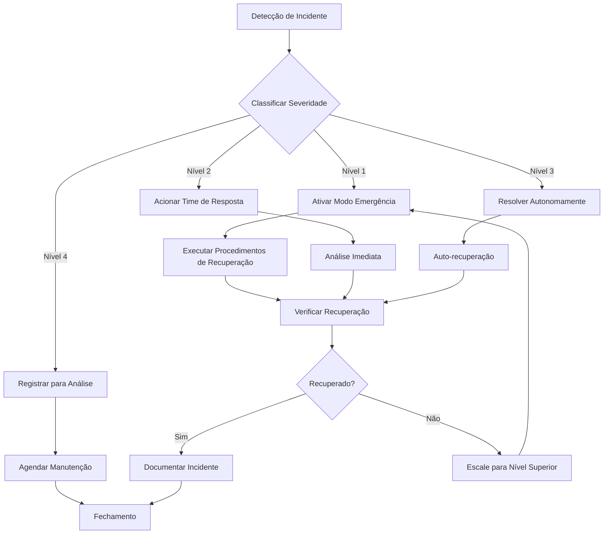

### [Sessão Paralela: Tech Leader]
```python
#!/usr/bin/env python3
"""
DIYAPP Evolution - V12 Core Architecture
Arquitetura de microsserviços para sistema autônomo com comunicação entre agentes
"""

import asyncio
import json
import logging
from dataclasses import dataclass, asdict
from enum import Enum
from typing import Dict, List, Optional, Any, Callable
from datetime import datetime, timedelta
import uuid
import aiohttp
from aiohttp import web
import redis.asyncio as redis
from prometheus_client import Counter, Gauge, Histogram, generate_latest
import yaml
import socket

# ============================================================================
# ADR V12-001: Arquitetura de Microsserviços Autônomos
# ============================================================================

"""
ADR V12-001: Arquitetura de Microsserviços para Sistema Autônomo
Data: 2024-01-15
Status: Aceita
Autores: Tech Lead + Especialista Infra + Especialista LLM

CONTEXTO:
O sistema DIYAPP precisa evoluir para uma arquitetura de microsserviços que suporte:
1. Comunicação assíncrona entre agentes autônomos
2. Tolerância a falhas com fallback automático
3. Monitoramento de saúde em tempo real
4. Escalabilidade horizontal
5. Operações 100% autônomas sem intervenção humana

DECISÃO:
Implementar arquitetura baseada em eventos com os seguintes componentes:
1. Service Registry: Registro dinâmico de serviços
2. Message Bus: Comunicação via eventos assíncronos
3. Health Monitor: Verificação contínua de saúde
4. Circuit Breaker: Padrão de fallback automático
5. Distributed Logger: Logs centralizados com contexto

OPÇÕES CONSIDERADAS:
- Opção A: Monólito com threads - Prós: Simples, baixa latência. Contras: Escala limitada, single point of failure
- Opção B: Microsserviços REST síncronos - Prós: Desacoplamento, deploy independente. Contras: Latência de rede, complexidade
- Opção C: Arquitetura baseada em eventos - Prós: Alta resiliência, escalabilidade, desacoplamento total. Contras: Complexidade, eventual consistency

Opção escolhida: C - Justificativa: Melhor para sistemas autônomos que precisam de resiliência e escalabilidade

CONSEQUÊNCIAS:
Positivas: Alta disponibilidade, tolerância a falhas, escalabilidade horizontal
Negativas: Complexidade aumentada, eventual consistency, necessidade de infraestrutura de mensageria
Riscos: Perda de mensagens, partições de rede - Mitigação: Confirmações de entrega, retry policies

REVISÃO: 2024-04-15
"""

# ============================================================================
# 1. Service Registry - Registro Dinâmico de Serviços
# ============================================================================

class ServiceStatus(Enum):
    HEALTHY = "healthy"
    UNHEALTHY = "unhealthy"
    STARTING = "starting"
    STOPPED = "stopped"

@dataclass
class ServiceInfo:
    service_id: str
    service_name: str
    version: str
    endpoint: str
    health_check: str
    status: ServiceStatus
    last_heartbeat: datetime
    metadata: Dict[str, Any]
    
    def to_dict(self):
        data = asdict(self)
        data['status'] = self.status.value
        data['last_heartbeat'] = self.last_heartbeat.isoformat()
        return data

class ServiceRegistry:
    """Registro centralizado de serviços com heartbeat"""
    
    def __init__(self, redis_url: str = "redis://localhost:6379"):
        self.redis = redis.from_url(redis_url)
        self.services: Dict[str, ServiceInfo] = {}
        self.heartbeat_interval = 30  # segundos
        self.service_ttl = 90  # segundos
        
    async def register(self, service: ServiceInfo) -> bool:
        """Registra um novo serviço"""
        service.last_heartbeat = datetime.utcnow()
        self.services[service.service_id] = service
        
        # Persiste no Redis para resiliência
        await self.redis.setex(
            f"service:{service.service_id}",
            self.service_ttl,
            json.dumps(service.to_dict())
        )
        
        # Publica evento de registro
        await self._publish_event("service.registered", service.to_dict())
        
        logging.info(f"Service registered: {service.service_name} ({service.service_id})")
        return True
    
    async def deregister(self, service_id: str) -> bool:
        """Remove um serviço do registro"""
        if service_id in self.services:
            service = self.services.pop(service_id)
            await self.redis.delete(f"service:{service_id}")
            await self._publish_event("service.deregistered", {"service_id": service_id})
            logging.info(f"Service deregistered: {service_id}")
            return True
        return False
    
    async def heartbeat(self, service_id: str) -> bool:
        """Atualiza heartbeat do serviço"""
        if service_id in self.services:
            self.services[service_id].last_heartbeat = datetime.utcnow()
            await self.redis.setex(
                f"service:{service_id}",
                self.service_ttl,
                json.dumps(self.services[service_id].to_dict())
            )
            return True
        return False
    
    async def get_service(self, service_name: str) -> Optional[ServiceInfo]:
        """Obtém um serviço saudável pelo nome"""
        now = datetime.utcnow()
        healthy_services = [
            s for s in self.services.values()
            if s.service_name == service_name 
            and s.status == ServiceStatus.HEALTHY
            and (now - s.last_heartbeat).seconds < self.service_ttl
        ]
        
        if healthy_services:
            # Round-robin simples
            return healthy_services[0]
        return None
    
    async def _publish_event(self, event_type: str, data: Dict):
        """Publica evento no message bus"""
        event = {
            "event_id": str(uuid.uuid4()),
            "event_type": event_type,
            "timestamp": datetime.utcnow().isoformat(),
            "data": data
        }
        await self.redis.publish("system.events", json.dumps(event))

# ============================================================================
# 2. Message Bus - Comunicação Assíncrona entre Agentes
# ============================================================================

class MessageType(Enum):
    COMMAND = "command"
    EVENT = "event"
    QUERY = "query"
    RESPONSE = "response"
    ERROR = "error"

@dataclass
class Message:
    message_id: str
    message_type: MessageType
    source: str
    destination: str
    correlation_id: Optional[str]
    payload: Dict[str, Any]
    timestamp: datetime
    ttl: int = 300  # 5 minutos
    
    def to_dict(self):
        data = asdict(self)
        data['message_type'] = self.message_type.value
        data['timestamp'] = self.timestamp.isoformat()
        return data

class MessageBus:
    """Barramento de mensagens para comunicação entre agentes"""
    
    def __init__(self, redis_url: str = "redis://localhost:6379"):
        self.redis = redis.from_url(redis_url)
        self.pubsub = self.redis.pubsub()
        self.handlers: Dict[str, List[Callable]] = {}
        
    async def publish(self, message: Message) -> bool:
        """Publica mensagem no barramento"""
        try:
            channel = f"agent.{message.destination}"
            await self.redis.publish(channel, json.dumps(message.to_dict()))
            
            # Métricas
            MessageBusMetrics.messages_published.inc()
            
            logging.debug(f"Message published: {message.message_id} to {message.destination}")
            return True
        except Exception as e:
            logging.error(f"Failed to publish message: {e}")
            return False
    
    async def subscribe(self, agent_id: str, handler: Callable):
        """Inscreve agente para receber mensagens"""
        if agent_id not in self.handlers:
            self.handlers[agent_id] = []
            await self.pubsub.subscribe(f"agent.{agent_id}")
        
        self.handlers[agent_id].append(handler)
        logging.info(f"Agent {agent_id} subscribed to message bus")
    
    async def start_consuming(self):
        """Inicia consumo de mensagens"""
        async for message in self.pubsub.listen():
            if message['type'] == 'message':
                await self._process_message(message)
    
    async def _process_message(self, raw_message):
        """Processa mensagem recebida"""
        try:
            data = json.loads(raw_message['data'])
            msg = Message(
                message_id=data['message_id'],
                message_type=MessageType(data['message_type']),
                source=data['source'],
                destination=data['destination'],
                correlation_id=data.get('correlation_id'),
                payload=data['payload'],
                timestamp=datetime.fromisoformat(data['timestamp'])
            )
            
            # Roteia para handlers
            if msg.destination in self.handlers:
                for handler in self.handlers[msg.destination]:
                    asyncio.create_task(handler(msg))
            
            MessageBusMetrics.messages_processed.inc()
            
        except Exception as e:
            logging.error(f"Failed to process message: {e}")
            MessageBusMetrics.message_errors.inc()

# ============================================================================
# 3. Circuit Breaker - Padrão de Fallback Automático
# ============================================================================

class CircuitState(Enum):
    CLOSED = "closed"      # Operação normal
    OPEN = "open"          # Falha detectada, requisições bloqueadas
    HALF_OPEN = "half_open" # Testando recuperação

class CircuitBreaker:
    """Implementação do padrão Circuit Breaker"""
    
    def __init__(
        self,
        name: str,
        failure_threshold: int = 5,
        recovery_timeout: int = 60,
        half_open_max_calls: int = 3
    ):
        self.name = name
        self.state = CircuitState.CLOSED
        self.failure_count = 0
        self.failure_threshold = failure_threshold
        self.recovery_timeout = recovery_timeout
        self.half_open_max_calls = half_open_max_calls
        self.half_open_calls = 0
        self.last_failure_time = None
        
        # Métricas
        self.metrics = {
            "total_calls": 0,
            "failed_calls": 0,
            "successful_calls": 0,
            "circuit_opens": 0
        }
    
    async def execute(self, func: Callable, *args, fallback_func: Optional[Callable] = None, **kwargs):
        """Executa função com proteção do circuit breaker"""
        self.metrics["total_calls"] += 1
        
        # Verifica se circuito está aberto
        if self.state == CircuitState.OPEN:
            if self._should_try_recovery():
                self.state = CircuitState.HALF_OPEN
                self.half_open_calls = 0
                logging.info(f"Circuit {self.name} moved to HALF_OPEN")
            else:
                logging.warning(f"Circuit {self.name} is OPEN, using fallback")
                return await self._execute_fallback(fallback_func, *args, **kwargs)
        
        # Executa função principal
        try:
            if self.state == CircuitState.HALF_OPEN:
                self.half_open_calls += 1
                if self.half_open_calls > self.half_open_max_calls:
                    self.state = CircuitState.OPEN
                    self.last_failure_time = datetime.utcnow()
                    raise Exception("Half-open call limit exceeded")
            
            result = await func(*args, **kwargs)
            
            # Sucesso - reseta contadores
            self._on_success()
            self.metrics["successful_calls"] += 1
            return result
            
        except Exception as e:
            # Falha - atualiza contadores
            self._on_failure()
            self.metrics["failed_calls"] += 1
            logging.error(f"Circuit {self.name} call failed: {e}")
            
            # Tenta fallback
            return await self._execute_fallback(fallback_func, *args, **kwargs)
    
    def _on_success(self):
        """Lida com sucesso da operação"""
        if self.state == CircuitState.HALF_OPEN:
            # Recuperação bem sucedida
            self.state = CircuitState.CLOSED
            self.failure_count = 0
            self.half_open_calls = 0
            logging.info(f"Circuit {self.name} recovered, moving to CLOSED")
        else:
            self.failure_count = 0
    
    def _on_failure(self):
        """Lida com falha da operação"""
        self.failure_count += 1
        self.last_failure_time = datetime.utcnow()
        
        if self.state == CircuitState.HALF_OPEN:
            # Falha durante teste de recuperação
            self.state = CircuitState.OPEN
            self.metrics["circuit_opens"] += 1
            logging.error(f"Circuit {self.name} failed during recovery, moving to OPEN")
        
        elif self.state == CircuitState.CLOSED and self.failure_count >= self.failure_threshold:
            # Excedeu threshold, abre circuito
            self.state = CircuitState.OPEN
            self.metrics["circuit_opens"] += 1
            logging.error(f"Circuit {self.name} threshold exceeded, moving to OPEN")
    
    def _should_try_recovery(self) -> bool:
        """Verifica se deve tentar recuperação"""
        if not self.last_failure_time:
            return False
        
        elapsed = (datetime.utcnow() - self.last_failure_time).seconds
        return elapsed >= self.recovery_timeout
    
    async def _execute_fallback(self, fallback_func: Optional[Callable], *args, **kwargs):
        """Executa função de fallback"""
        if fallback_func:
            try:
                return await fallback_func(*args, **kwargs)
            except Exception as e:
                logging.error(f"Fallback also failed: {e}")
        
        # Fallback padrão
        return {"error": "Service unavailable", "circuit_state": self.state.value}

# ============================================================================
# 4. Health Monitor - Monitoramento de Saúde
# ============================================================================

class HealthCheck:
    """Verificação de saúde de serviços"""
    
    def __init__(self, registry: ServiceRegistry):
        self.registry = registry
        self.checks: Dict[str, Callable] = {}
        
    def add_check(self, service_name: str, check_func: Callable):
        """Adiciona verificação personalizada"""
        self.checks[service_name] = check_func
    
    async def check_all(self) -> Dict[str, Dict]:
        """Executa todas as verificações de saúde"""
        results = {}
        
        for service_id, service in self.registry.services.items():
            try:
                # Verificação de heartbeat
                heartbeat_ok = await self._check_heartbeat(service)
                
                # Verificação personalizada se existir
                custom_ok = True
                if service.service_name in self.checks:
                    custom_ok = await self.checks[service.service_name]()
                
                # Atualiza status
                if heartbeat_ok and custom_ok:
                    service.status = ServiceStatus.HEALTHY
                    results[service_id] = {
                        "status": "healthy",
                        "service": service.service_name,
                        "timestamp": datetime.utcnow().isoformat()
                    }
                else:
                    service.status = ServiceStatus.UNHEALTHY
                    results[service_id] = {
                        "status": "unhealthy",
                        "service": service.service_name,
                        "issues": ["heartbeat_failed" if not heartbeat_ok else "custom_check_failed"],
                        "timestamp": datetime.utcnow().isoformat()
                    }
                
                # Atualiza no registry
                await self.registry.heartbeat(service_id)
                
            except Exception as e:
                logging.error(f"Health check failed for {service_id}: {e}")
                results[service_id] = {
                    "status": "error",
                    "service": service.service_name,
                    "error": str(e)
                }
        
        return results
    
    async def _check_heartbeat(self, service: ServiceInfo) -> bool:
        """Verifica se serviço está respondendo"""
        now = datetime.utcnow()
        time_since_heartbeat = (now - service.last_heartbeat).seconds
        return time_since_heartbeat < self.registry.service_ttl

# ============================================================================
# 5. Distributed Logger - Logs Centralizados
# ============================================================================

class DistributedLogger:
    """Logger distribuído com contexto de transação"""
    
    def __init__(self, service_name: str, redis_url: str = "redis://localhost:6379"):
        self.service_name = service_name
        self.redis = redis.from_url(redis_url)
        self.context = {}
    
    def set_context(self, **kwargs):
        """Define contexto para logs subsequentes"""
        self.context.update(kwargs)
    
    async def log(self, level: str, message: str, **extra):
        """Registra log com contexto"""
        log_entry = {
            "timestamp": datetime.utcnow().isoformat(),
            "level": level,
            "service": self.service_name,
            "message": message,
            "context": self.context.copy(),
            "extra": extra
        }
        
        # Log local
        getattr(logging, level)(f"[{self.service_name}] {message}")
        
        # Envia para sistema centralizado
        try:
            await self.redis.rpush(
                "system:logs",
                json.dumps(log_entry)
            )
            await self.redis.expire("system:logs", 86400)  # 24 horas
        except Exception as e:
            logging.error(f"Failed to send log to central system: {e}")

# ============================================================================
# 6. Métricas e Monitoramento
# ============================================================================


### [Sessão Paralela: UX Designer]
# DIYAPP Evolution - V12 Design System

Vou criar um sistema de design premium com tokens visuais, componentes de alta densidade informacional, modos claro/escuro automático e microinterações. O sistema incluirá um dashboard de monitoramento de agentes em tempo real.

## Estrutura do Projeto

```
diyapp-v12-design-system/
├── index.html
├── styles/
│   ├── design-system.css
│   └── dashboard.css
├── scripts/
│   ├── design-tokens.js
│   ├── theme-manager.js
│   └── dashboard.js
└── assets/
    └── icons/
```

## 1. Design Tokens e Sistema de Tema (design-tokens.js)

```javascript
// scripts/design-tokens.js
class DesignTokens {
  constructor() {
    this.tokens = {
      // Cores primárias
      colors: {
        primary: {
          50: '#eef2ff',
          100: '#e0e7ff',
          200: '#c7d2fe',
          300: '#a5b4fc',
          400: '#818cf8',
          500: '#6366f1',
          600: '#4f46e5',
          700: '#4338ca',
          800: '#3730a3',
          900: '#312e81'
        },
        neutral: {
          50: '#fafafa',
          100: '#f5f5f5',
          200: '#e5e5e5',
          300: '#d4d4d4',
          400: '#a3a3a3',
          500: '#737373',
          600: '#525252',
          700: '#404040',
          800: '#262626',
          900: '#171717'
        },
        success: {
          50: '#f0fdf4',
          500: '#22c55e',
          700: '#15803d'
        },
        warning: {
          50: '#fefce8',
          500: '#eab308',
          700: '#a16207'
        },
        error: {
          50: '#fef2f2',
          500: '#ef4444',
          700: '#b91c1c'
        },
        info: {
          50: '#eff6ff',
          500: '#3b82f6',
          700: '#1d4ed8'
        }
      },
      
      // Tipografia
      typography: {
        fontFamily: {
          sans: "'Inter', -apple-system, BlinkMacSystemFont, 'Segoe UI', Roboto, sans-serif",
          mono: "'JetBrains Mono', 'Courier New', monospace"
        },
        fontSize: {
          xs: '0.75rem',    // 12px
          sm: '0.875rem',   // 14px
          base: '1rem',     // 16px
          lg: '1.125rem',   // 18px
          xl: '1.25rem',    // 20px
          '2xl': '1.5rem',  // 24px
          '3xl': '1.875rem', // 30px
          '4xl': '2.25rem',  // 36px
          '5xl': '3rem'      // 48px
        },
        fontWeight: {
          regular: '400',
          medium: '500',
          semibold: '600',
          bold: '700'
        },
        lineHeight: {
          tight: '1.25',
          normal: '1.5',
          relaxed: '1.75'
        }
      },
      
      // Espaçamento
      spacing: {
        px: '1px',
        0.5: '0.125rem',  // 2px
        1: '0.25rem',     // 4px
        2: '0.5rem',      // 8px
        3: '0.75rem',     // 12px
        4: '1rem',        // 16px
        5: '1.25rem',     // 20px
        6: '1.5rem',      // 24px
        8: '2rem',        // 32px
        10: '2.5rem',     // 40px
        12: '3rem',       // 48px
        16: '4rem',       // 64px
        20: '5rem',       // 80px
        24: '6rem'        // 96px
      },
      
      // Bordas
      borders: {
        radius: {
          none: '0',
          sm: '0.125rem',   // 2px
          base: '0.25rem',  // 4px
          md: '0.375rem',   // 6px
          lg: '0.5rem',     // 8px
          xl: '0.75rem',    // 12px
          '2xl': '1rem',    // 16px
          full: '9999px'
        },
        width: {
          thin: '1px',
          medium: '2px',
          thick: '3px'
        }
      },
      
      // Elevação (sombras)
      elevation: {
        sm: '0 1px 2px 0 rgba(0, 0, 0, 0.05)',
        base: '0 1px 3px 0 rgba(0, 0, 0, 0.1), 0 1px 2px 0 rgba(0, 0, 0, 0.06)',
        md: '0 4px 6px -1px rgba(0, 0, 0, 0.1), 0 2px 4px -1px rgba(0, 0, 0, 0.06)',
        lg: '0 10px 15px -3px rgba(0, 0, 0, 0.1), 0 4px 6px -2px rgba(0, 0, 0, 0.05)',
        xl: '0 20px 25px -5px rgba(0, 0, 0, 0.1), 0 10px 10px -5px rgba(0, 0, 0, 0.04)',
        '2xl': '0 25px 50px -12px rgba(0, 0, 0, 0.25)',
        inner: 'inset 0 2px 4px 0 rgba(0, 0, 0, 0.06)'
      },
      
      // Animações
      animations: {
        duration: {
          fast: '150ms',
          normal: '300ms',
          slow: '500ms'
        },
        easing: {
          linear: 'linear',
          ease: 'cubic-bezier(0.4, 0, 0.2, 1)',
          easeIn: 'cubic-bezier(0.4, 0, 1, 1)',
          easeOut: 'cubic-bezier(0, 0, 0.2, 1)',
          easeInOut: 'cubic-bezier(0.4, 0, 0.2, 1)'
        }
      }
    };
    
    this.currentTheme = 'light';
    this.init();
  }
  
  init() {
    this.applyTokensToCSS();
    this.detectSystemTheme();
  }
  
  applyTokensToCSS() {
    const root = document.documentElement;
    
    // Aplicar cores
    Object.entries(this.tokens.colors).forEach(([colorCategory, shades]) => {
      Object.entries(shades).forEach(([shade, value]) => {
        root.style.setProperty(`--color-${colorCategory}-${shade}`, value);
      });
    });
    
    // Aplicar tipografia
    Object.entries(this.tokens.typography.fontFamily).forEach(([name, value]) => {
      root.style.setProperty(`--font-${name}`, value);
    });
    
    Object.entries(this.tokens.typography.fontSize).forEach(([size, value]) => {
      root.style.setProperty(`--text-${size}`, value);
    });
    
    // Aplicar espaçamento
    Object.entries(this.tokens.spacing).forEach(([size, value]) => {
      root.style.setProperty(`--spacing-${size}`, value);
    });
    
    // Aplicar bordas
    Object.entries(this.tokens.borders.radius).forEach(([size, value]) => {
      root.style.setProperty(`--radius-${size}`, value);
    });
    
    // Aplicar elevação
    Object.entries(this.tokens.elevation).forEach(([size, value]) => {
      root.style.setProperty(`--shadow-${size}`, value);
    });
    
    // Aplicar animações
    Object.entries(this.tokens.animations.duration).forEach(([speed, value]) => {
      root.style.setProperty(`--duration-${speed}`, value);
    });
    
    Object.entries(this.tokens.animations.easing).forEach(([type, value]) => {
      root.style.setProperty(`--easing-${type}`, value);
    });
  }
  
  detectSystemTheme() {
    const prefersDark = window.matchMedia('(prefers-color-scheme: dark)');
    this.setTheme(prefersDark.matches ? 'dark' : 'light');
    
    prefersDark.addEventListener('change', (e) => {
      this.setTheme(e.matches ? 'dark' : 'light');
    });
  }
  
  setTheme(theme) {
    this.currentTheme = theme;
    document.documentElement.setAttribute('data-theme', theme);
    
    // Aplicar variáveis específicas do tema
    const root = document.documentElement;
    
    if (theme === 'dark') {
      root.style.setProperty('--color-bg-primary', 'var(--color-neutral-900)');
      root.style.setProperty('--color-bg-secondary', 'var(--color-neutral-800)');
      root.style.setProperty('--color-bg-tertiary', 'var(--color-neutral-700)');
      root.style.setProperty('--color-text-primary', 'var(--color-neutral-50)');
      root.style.setProperty('--color-text-secondary', 'var(--color-neutral-300)');
      root.style.setProperty('--color-text-tertiary', 'var(--color-neutral-400)');
      root.style.setProperty('--color-border', 'var(--color-neutral-700)');
    } else {
      root.style.setProperty('--color-bg-primary', 'var(--color-neutral-50)');
      root.style.setProperty('--color-bg-secondary', 'var(--color-neutral-100)');
      root.style.setProperty('--color-bg-tertiary', 'var(--color-neutral-200)');
      root.style.setProperty('--color-text-primary', 'var(--color-neutral-900)');
      root.style.setProperty('--color-text-secondary', 'var(--color-neutral-600)');
      root.style.setProperty('--color-text-tertiary', 'var(--color-neutral-500)');
      root.style.setProperty('--color-border', 'var(--color-neutral-300)');
    }
  }
  
  toggleTheme() {
    this.setTheme(this.currentTheme === 'light' ? 'dark' : 'light');
  }
  
  getToken(category, key) {
    return this.tokens[category]?.[key];
  }
}

// Instanciar e exportar
const designTokens = new DesignTokens();
window.DesignTokens = designTokens;
```

## 2. Sistema de Design CSS (design-system.css)

```css
/* styles/design-system.css */
:root {
  /* Tokens já aplicados via JavaScript */
  
  /* Variáveis de tema padrão (light) */
  --color-bg-primary: var(--color-neutral-50);
  --color-bg-secondary: var(--color-neutral-100);
  --color-bg-tertiary: var(--color-neutral-200);
  --color-text-primary: var(--color-neutral-900);
  --color-text-secondary: var(--color-neutral-600);
  --color-text-tertiary: var(--color-neutral-500);
  --color-border: var(--color-neutral-300);
  
  /* Variáveis de layout */
  --container-max-width: 1280px;
  --sidebar-width: 280px;
  --header-height: 64px;
  
  /* Z-index layers */
  --z-dropdown: 1000;
  --z-sticky: 1020;
  --z-fixed: 1030;
  --z-modal-backdrop: 1040;
  --z-modal: 1050;
  --z-popover: 1060;
  --z-tooltip: 1070;
}

[data-theme="dark"] {
  --color-bg-primary: var(--color-neutral-900);
  --color-bg-secondary: var(--color-neutral-800);
  --color-bg-tertiary: var(--color-neutral-700);
  --color-text-primary: var(--color-neutral-50);
  --color-text-secondary: var(--color-neutral-300);
  --color-text-tertiary: var(--color-neutral-400);
  --color-border: var(--color-neutral-700);
}

/* Reset e base */
* {
  margin: 0;
  padding: 0;
  box-sizing: border-box;
}

html {
  font-size: 16px;
  -webkit-font-smoothing: antialiased;
  -moz-osx-font-smoothing: grayscale;
}

body {
  font-family: var(--font-sans);
  font-size: var(--text-base);
  line-height: var(--line-height-normal);
  color: var(--color-text-primary);
  background-color: var(--color-bg-primary);
  transition: background-color var(--duration-normal) var(--ease);
}

/* Tipografia */
h1, .h1 {
  font-size: var(--text-5xl);
  font-weight: var(--font-weight-bold);
  line-height: var(--line-height-tight);
}

h2, .h2 {
  font-size: var(--text-4xl);
  font-weight: var(--font-weight-bold);
  line-height: var(--line-height-tight);
}

h3, .h3 {
  font-size: var(--text-3xl);
  font-weight: var(--font-weight-semibold);
  line-height: var(--line-height-tight);
}

h4, .h4 {
  font-size: var(--text-2xl);
  font-weight: var(--font-weight-semibold);
  line-height: var(--line-height-normal);
}

h5, .h5 {
  font-size: var(--text-xl);
  font-weight: var(--font-weight-semibold);
  line-height: var(--line-height-normal);
}

h6, .h6 {
  font-size: var(--text-lg);
  font-weight: var(--font-weight-medium);
  line-height: var(--line-height-normal);
}

.text-xs { font-size: var(--text-xs); }
.text-sm { font-size: var(--text-sm); }
.text-base { font-size: var(--text-base); }
.text-lg { font-size: var(--text-lg); }
.text-xl { font-size: var(--text-xl); }
.text-2xl { font-size: var(--text-2xl); }
.text-3xl { font-size: var(--text-3xl); }
.text-4xl { font-size: var(--text-4xl); }
.text-5xl { font-size: var(--text-5xl); }

.font-regular { font-weight: var(--font-weight-regular); }
.font-medium { font-weight: var(--font-weight-medium); }
.font-semibold { font-weight: var(--font-weight-semibold); }
.font-bold { font-weight: var(--font-weight-bold); }

.text-primary { color: var(--color-text-primary); }
.text-secondary { color: var(--color-text-secondary); }
.text-tertiary { color: var(--color-text-tertiary); }

/* Layout */
.container {
  width: 100%;
  max-width: var(--container-max-width);
  margin: 0 auto;
  padding: 0 var(--spacing-4);
}

.flex { display: flex; }
.grid { display: grid; }
.block { display: block; }
.inline-block { display: inline-block; }
.hidden { display: none; }

.flex-col { flex-direction: column; }
.flex-row { flex-direction: row; }
.flex-wrap { flex-wrap: wrap; }
.flex-nowrap { flex-wrap: nowrap; }

.items-start { align-items: flex-start; }
.items-center { align-items: center; }
.items-end { align-items: flex-end; }
.items-stretch { align-items: stretch; }

.justify-start { justify-content: flex-start; }
.justify-center { justify-content: center; }
.justify-end { justify-content: flex-end; }
.justify-between { justify-content: space-between; }
.justify-around { justify-content: space-around; }

.gap-0 { gap: 0; }
.gap-1 { gap: var(--spacing-1); }
.gap-2 { gap: var(--spacing-2); }
.gap-3 { gap: var(--spacing-3); }
.gap-4 { gap: var(--spacing-4); }
.gap-5 { gap: var(--spacing-5); }
.gap-6 { gap: var(--spacing-6); }
.gap-8 { gap: var(--spacing-8); }

/* Espaçamento */
.m-0 { margin: 0; }
.m-1 { margin: var(--spacing-1); }
.m-2 { margin: var(--spacing-2); }
.m-3 { margin: var(--spacing-3); }
.m-4 { margin: var(--spacing-4); }
.m-5 { margin: var(--spacing-5); }
.m-6 { margin: var(--spacing-6); }
.m-8 { margin: var(--spacing-8); }

.mt-0 { margin-top: 0; }
.mt-1 { margin-top: var(--spacing-1); }
.mt-2 { margin-top: var(--spacing-2); }
.mt-3 { margin-top: var(--spacing-3); }
.mt-4 { margin-top: var(--spacing-4); }
.mt-5 { margin-top: var(--sp

### [Sessão Paralela: Backend]
```python
"""
DIYAPP Evolution - V12 Core
Orquestração de Agentes: Sistema de Fila Prioritária, Heartbeat, Timeout Inteligente e Reinicialização Automática
Dev Backend - Implementação do Core de Orquestração
"""

import asyncio
import logging
import json
import time
import heapq
from datetime import datetime, timedelta
from enum import Enum
from typing import Dict, List, Optional, Any, Callable, Tuple
from dataclasses import dataclass, field
from uuid import uuid4
import aiohttp
from contextlib import asynccontextmanager
from collections import defaultdict
import redis.asyncio as redis
from pydantic import BaseModel, Field, validator
from tenacity import retry, stop_after_attempt, wait_exponential, retry_if_exception_type

# ============================================================================
# 1. CONTRATOS DE API E MODELOS DE DADOS
# ============================================================================

class TaskPriority(Enum):
    """Prioridades de tarefa com valores numéricos para heap"""
    CRITICAL = 0
    HIGH = 1
    NORMAL = 2
    LOW = 3

class TaskStatus(Enum):
    """Status das tarefas no sistema"""
    PENDING = "pending"
    RUNNING = "running"
    COMPLETED = "completed"
    FAILED = "failed"
    TIMEOUT = "timeout"
    CANCELLED = "cancelled"

class AgentStatus(Enum):
    """Status dos agentes no sistema"""
    HEALTHY = "healthy"
    DEGRADED = "degraded"
    UNHEALTHY = "unhealthy"
    OFFLINE = "offline"
    STARTING = "starting"

class TaskRequest(BaseModel):
    """Contrato para criação de nova tarefa"""
    agent_id: str = Field(..., description="ID do agente que executará a tarefa")
    task_type: str = Field(..., description="Tipo da tarefa (ex: 'llm_inference', 'data_processing')")
    priority: TaskPriority = Field(TaskPriority.NORMAL, description="Prioridade da tarefa")
    payload: Dict[str, Any] = Field(default_factory=dict, description="Dados da tarefa")
    timeout_seconds: int = Field(30, ge=1, le=3600, description="Timeout em segundos")
    metadata: Dict[str, Any] = Field(default_factory=dict, description="Metadados da tarefa")
    
    @validator('agent_id')
    def validate_agent_id(cls, v):
        if not v or len(v.strip()) == 0:
            raise ValueError("agent_id não pode ser vazio")
        return v.strip()

class TaskResponse(BaseModel):
    """Contrato de resposta para tarefas"""
    task_id: str
    status: TaskStatus
    agent_id: str
    priority: TaskPriority
    created_at: datetime
    started_at: Optional[datetime] = None
    completed_at: Optional[datetime] = None
    result: Optional[Dict[str, Any]] = None
    error: Optional[str] = None
    execution_time_ms: Optional[int] = None

class AgentHeartbeat(BaseModel):
    """Contrato para heartbeat dos agentes"""
    agent_id: str
    status: AgentStatus
    cpu_percent: float = Field(0.0, ge=0.0, le=100.0)
    memory_mb: float = Field(0.0, ge=0.0)
    queue_size: int = Field(0, ge=0)
    last_task_completed_at: Optional[datetime] = None
    capabilities: List[str] = Field(default_factory=list)
    metadata: Dict[str, Any] = Field(default_factory=dict)

class SystemMetrics(BaseModel):
    """Contrato para métricas do sistema"""
    timestamp: datetime
    total_tasks: int
    pending_tasks: int
    running_tasks: int
    completed_tasks: int
    failed_tasks: int
    avg_execution_time_ms: float
    agent_health: Dict[str, AgentStatus]
    queue_depth_by_priority: Dict[str, int]

# ============================================================================
# 2. ESTRUTURAS DE DADOS CORE
# ============================================================================

@dataclass(order=True)
class PrioritizedTask:
    """Tarefa com prioridade para heap queue"""
    priority: int
    created_at: datetime
    task_id: str = field(compare=False)
    request: TaskRequest = field(compare=False)
    
    def __post_init__(self):
        # Converte enum para valor numérico para ordenação
        self.priority = self.request.priority.value

@dataclass
class AgentState:
    """Estado interno de um agente"""
    agent_id: str
    status: AgentStatus = AgentStatus.OFFLINE
    last_heartbeat: Optional[datetime] = None
    heartbeat_missed: int = 0
    consecutive_failures: int = 0
    circuit_breaker_state: str = "CLOSED"  # CLOSED, OPEN, HALF_OPEN
    circuit_breaker_failures: int = 0
    last_failure_time: Optional[datetime] = None
    restart_attempts: int = 0
    next_restart_at: Optional[datetime] = None
    backoff_seconds: int = 1
    capabilities: List[str] = field(default_factory=list)
    current_tasks: Dict[str, asyncio.Task] = field(default_factory=dict)

# ============================================================================
# 3. CORE DE ORQUESTRAÇÃO
# ============================================================================

class AgentOrchestrator:
    """
    Sistema central de orquestração de agentes com:
    - Fila de tarefas prioritária
    - Sistema de heartbeat com timeout inteligente
    - Circuit breaker para agentes
    - Reinicialização automática com backoff exponencial
    """
    
    def __init__(self, redis_url: Optional[str] = None):
        # Configuração de logging estruturado
        self.logger = logging.getLogger(__name__)
        self.setup_structured_logging()
        
        # Estado interno
        self.task_queue: List[PrioritizedTask] = []
        self.agents: Dict[str, AgentState] = {}
        self.tasks: Dict[str, TaskResponse] = {}
        
        # Configurações
        self.heartbeat_timeout = 30  # segundos
        self.max_heartbeat_misses = 3
        self.circuit_breaker_threshold = 5
        self.circuit_breaker_reset_time = 60  # segundos
        self.max_restart_attempts = 5
        self.max_backoff_seconds = 300  # 5 minutos
        
        # Redis para persistência (opcional)
        self.redis_client = None
        if redis_url:
            self.redis_client = redis.from_url(redis_url)
        
        # Locks e semáforos
        self.queue_lock = asyncio.Lock()
        self.agents_lock = asyncio.Lock()
        self.tasks_lock = asyncio.Lock()
        
        # Métricas
        self.metrics = SystemMetrics(
            timestamp=datetime.now(),
            total_tasks=0,
            pending_tasks=0,
            running_tasks=0,
            completed_tasks=0,
            failed_tasks=0,
            avg_execution_time_ms=0.0,
            agent_health={},
            queue_depth_by_priority={}
        )
        
        # Tasks de background
        self.background_tasks = set()
        self.is_running = False
        
        self.logger.info("AgentOrchestrator inicializado", extra={
            "component": "orchestrator",
            "status": "initialized"
        })
    
    def setup_structured_logging(self):
        """Configura logging estruturado em JSON"""
        handler = logging.StreamHandler()
        formatter = logging.Formatter(
            '{"timestamp": "%(asctime)s", "level": "%(levelname)s", '
            '"component": "agent_orchestrator", "message": "%(message)s", '
            '"correlation_id": "%(correlation_id)s", "agent_id": "%(agent_id)s", '
            '"task_id": "%(task_id)s"}'
        )
        handler.setFormatter(formatter)
        self.logger.addHandler(handler)
        self.logger.setLevel(logging.INFO)
    
    async def start(self):
        """Inicia o orchestrator e tarefas de background"""
        if self.is_running:
            return
        
        self.is_running = True
        
        # Inicia tarefas de background
        bg_tasks = [
            self._heartbeat_monitor(),
            self._process_task_queue(),
            self._cleanup_old_tasks(),
            self._update_metrics()
        ]
        
        for task in bg_tasks:
            bg_task = asyncio.create_task(task)
            self.background_tasks.add(bg_task)
            bg_task.add_done_callback(self.background_tasks.discard)
        
        self.logger.info("Orchestrator iniciado", extra={
            "correlation_id": str(uuid4()),
            "status": "started",
            "background_tasks": len(bg_tasks)
        })
    
    async def stop(self):
        """Para o orchestrator graciosamente"""
        self.is_running = False
        
        # Cancela todas as tarefas em execução
        async with self.agents_lock:
            for agent_state in self.agents.values():
                for task in agent_state.current_tasks.values():
                    task.cancel()
        
        # Aguarda tarefas de background
        for task in self.background_tasks:
            task.cancel()
        
        if self.background_tasks:
            await asyncio.gather(*self.background_tasks, return_exceptions=True)
        
        # Fecha conexão Redis
        if self.redis_client:
            await self.redis_client.close()
        
        self.logger.info("Orchestrator parado", extra={
            "correlation_id": str(uuid4()),
            "status": "stopped"
        })
    
    # ============================================================================
    # 4. API PÚBLICA - ENDPOINTS
    # ============================================================================
    
    async def create_task(self, request: TaskRequest) -> TaskResponse:
        """
        Cria uma nova tarefa na fila
        HTTP 201 Created em sucesso
        """
        correlation_id = str(uuid4())
        
        try:
            # Valida se o agente existe e está saudável
            async with self.agents_lock:
                if request.agent_id not in self.agents:
                    self.logger.warning("Agente não encontrado", extra={
                        "correlation_id": correlation_id,
                        "agent_id": request.agent_id,
                        "task_type": request.task_type
                    })
                    raise ValueError(f"Agente {request.agent_id} não registrado")
                
                agent_state = self.agents[request.agent_id]
                if agent_state.status == AgentStatus.UNHEALTHY:
                    self.logger.warning("Agente não saudável", extra={
                        "correlation_id": correlation_id,
                        "agent_id": request.agent_id,
                        "status": agent_state.status.value
                    })
                    raise ValueError(f"Agente {request.agent_id} não está saudável")
            
            # Cria resposta da tarefa
            task_id = str(uuid4())
            task_response = TaskResponse(
                task_id=task_id,
                status=TaskStatus.PENDING,
                agent_id=request.agent_id,
                priority=request.priority,
                created_at=datetime.now()
            )
            
            # Armazena tarefa
            async with self.tasks_lock:
                self.tasks[task_id] = task_response
            
            # Adiciona à fila prioritária
            async with self.queue_lock:
                heapq.heappush(self.task_queue, PrioritizedTask(
                    priority=request.priority.value,
                    created_at=datetime.now(),
                    task_id=task_id,
                    request=request
                ))
            
            # Atualiza métricas
            self.metrics.total_tasks += 1
            self.metrics.pending_tasks += 1
            
            self.logger.info("Tarefa criada", extra={
                "correlation_id": correlation_id,
                "task_id": task_id,
                "agent_id": request.agent_id,
                "priority": request.priority.value,
                "task_type": request.task_type
            })
            
            return task_response
            
        except Exception as e:
            self.logger.error("Erro ao criar tarefa", extra={
                "correlation_id": correlation_id,
                "agent_id": request.agent_id,
                "error": str(e),
                "stack_trace": self._get_safe_stack_trace(e)
            })
            raise
    
    async def get_task_status(self, task_id: str) -> Optional[TaskResponse]:
        """
        Obtém status de uma tarefa
        HTTP 200 OK se encontrada, 404 se não existir
        """
        async with self.tasks_lock:
            return self.tasks.get(task_id)
    
    async def register_agent(self, agent_id: str, capabilities: List[str]) -> bool:
        """
        Registra um novo agente no sistema
        HTTP 200 OK em sucesso
        """
        correlation_id = str(uuid4())
        
        try:
            async with self.agents_lock:
                if agent_id in self.agents:
                    self.logger.warning("Agente já registrado", extra={
                        "correlation_id": correlation_id,
                        "agent_id": agent_id
                    })
                    return False
                
                self.agents[agent_id] = AgentState(
                    agent_id=agent_id,
                    status=AgentStatus.STARTING,
                    capabilities=capabilities
                )
            
            self.logger.info("Agente registrado", extra={
                "correlation_id": correlation_id,
                "agent_id": agent_id,
                "capabilities": capabilities,
                "status": "registered"
            })
            
            return True
            
        except Exception as e:
            self.logger.error("Erro ao registrar agente", extra={
                "correlation_id": correlation_id,
                "agent_id": agent_id,
                "error": str(e)
            })
            return False
    
    async def receive_heartbeat(self, heartbeat: AgentHeartbeat) -> bool:
        """
        Processa heartbeat de um agente
        HTTP 200 OK em sucesso
        """
        correlation_id = str(uuid4())
        
        try:
            async with self.agents_lock:
                if heartbeat.agent_id not in self.agents:
                    self.logger.warning("Heartbeat de agente não registrado", extra={
                        "correlation_id": correlation_id,
                        "agent_id": heartbeat.agent_id
                    })
                    return False
                
                agent_state = self.agents[heartbeat.agent_id]
                agent_state.last_heartbeat = datetime.now()
                agent_state.heartbeat_missed = 0
                agent_state.status = heartbeat.status
                agent_state.capabilities = heartbeat.capabilities
                
                # Reseta circuit breaker se agente está saudável
                if heartbeat.status == AgentStatus.HEALTHY:
                    if agent_state.circuit_breaker_state == "OPEN":
                        agent_state.circuit_breaker_state = "HALF_OPEN"
                    elif agent_state.circuit_breaker_state == "HALF_OPEN":
                        agent_state.circuit_breaker_state = "CLOSED"
                        agent_state.circuit_breaker_failures = 0
                
                # Log detalhado apenas se status mudou
                if agent_state.status != heartbeat.status:
                    self.logger.info("Status do agente atualizado", extra={
                        "correlation_id": correlation_id,
                        "agent_id": heartbeat.agent_id,
                        "old_status": agent_state.status.value,
                        "new_status": heartbeat.status.value,
                        "cpu_percent": heartbeat.cpu_percent,
                        "memory_mb": heartbeat.memory_mb
                    })
            
            return True
            
        except Exception as e:
            self.logger.error("Erro ao processar heartbeat", extra={
                "correlation_id": correlation_id,
                "agent_id": heartbeat.agent_id,
                "error": str(e)
            })
            return False
    
    async def get_system_metrics(self) -> SystemMetrics:
        """
        Retorna métricas do sistema
        HTTP 200 OK
        """
        return self.metrics
    
    # ============================================================================
    # 5. SISTEMA DE HEARTBEAT INTELIGENTE
    # ============================================================================
    
    async def _heartbeat_monitor(self):
        """Monitora heartbeats dos agentes e detecta falhas"""
        while self.is_running:
            try:
                now = datetime.now()
                agents_to_restart = []
                
                async with self.agents_lock:
                    for agent_id, agent_state in self.agents.items():
                        # Verifica se heartbeat está atrasado
                        if agent_state.last_heartbeat:
                            time_since_heartbeat = (now - agent_state.last_heartbeat).total_seconds()
                            
                            if time_since_heartbeat > self.heartbeat_timeout:
                                agent_state.heartbeat_missed += 1
                                
                                self.logger.warning("Heartbeat atrasado", extra={
                                    "correlation_id": str(uuid4()),
                                    "agent_id": agent_id,
                                    "missed_count": agent_state.heartbeat_missed,
                                    "seconds_late": time_since_heartbeat
                                })
                                
                                if agent_state.heartbeat_missed >= self.max_heartbeat_misses:
                                    agent_state.status = AgentStatus.UNHEALTHY
                                    self.logger.error("Agente marcado como não saudável", extra={
                                        "correlation_id": str(uuid4()),
                                        "agent_id": agent_id,
                                        "status": "unhealthy",
                                        "missed_heartbeats": agent_state.heartbeat_missed
                                    })
                                    
                                    # Agenda reinicialização
                                    if agent_state.restart_attempts < self.max_restart_attempts:
                                        agents_to_restart.append(agent_id)
                
                # Reinicia agentes fora do lock
                for agent_id in agents_to_restart:
                    await self._schedule_agent_restart(agent_id)
                
                await asyncio.sleep(10)  # Verifica a cada 10 segundos
                
            except Exception as e:
                self.logger.error("Erro no monitor de heartbeat", extra={
                    "correlation_id": str(uuid4

### [Sessão Paralela: Frontend]
```html
<!DOCTYPE html>
<html lang="pt-BR">
<head>
    <meta charset="UTF-8">
    <meta name="viewport" content="width=device-width, initial-scale=1.0">
    <title>DIYAPP Evolution - V12 Core Dashboard</title>
    <link rel="stylesheet" href="https://cdnjs.cloudflare.com/ajax/libs/font-awesome/6.4.0/css/all.min.css">
    <style>
        /* Design System Tokens */
        :root {
            /* Colors */
            --primary-50: #eff6ff;
            --primary-100: #dbeafe;
            --primary-500: #3b82f6;
            --primary-600: #2563eb;
            --primary-700: #1d4ed8;
            
            --gray-50: #f9fafb;
            --gray-100: #f3f4f6;
            --gray-200: #e5e7eb;
            --gray-300: #d1d5db;
            --gray-400: #9ca3af;
            --gray-500: #6b7280;
            --gray-600: #4b5563;
            --gray-700: #374151;
            --gray-800: #1f2937;
            --gray-900: #111827;
            
            --success-50: #f0fdf4;
            --success-500: #22c55e;
            --success-600: #16a34a;
            
            --warning-50: #fefce8;
            --warning-500: #eab308;
            --warning-600: #ca8a04;
            
            --error-50: #fef2f2;
            --error-500: #ef4444;
            --error-600: #dc2626;
            
            /* Spacing */
            --spacing-1: 0.25rem;
            --spacing-2: 0.5rem;
            --spacing-3: 0.75rem;
            --spacing-4: 1rem;
            --spacing-6: 1.5rem;
            --spacing-8: 2rem;
            --spacing-12: 3rem;
            --spacing-16: 4rem;
            
            /* Typography */
            --font-family: 'Segoe UI', system-ui, -apple-system, sans-serif;
            --font-size-xs: 0.75rem;
            --font-size-sm: 0.875rem;
            --font-size-base: 1rem;
            --font-size-lg: 1.125rem;
            --font-size-xl: 1.25rem;
            --font-size-2xl: 1.5rem;
            --font-size-3xl: 1.875rem;
            
            --font-weight-normal: 400;
            --font-weight-medium: 500;
            --font-weight-semibold: 600;
            --font-weight-bold: 700;
            
            /* Border Radius */
            --radius-sm: 0.25rem;
            --radius-md: 0.375rem;
            --radius-lg: 0.5rem;
            --radius-xl: 0.75rem;
            
            /* Shadows */
            --shadow-sm: 0 1px 2px 0 rgb(0 0 0 / 0.05);
            --shadow-md: 0 4px 6px -1px rgb(0 0 0 / 0.1);
            --shadow-lg: 0 10px 15px -3px rgb(0 0 0 / 0.1);
            
            /* Z-index */
            --z-dropdown: 10;
            --z-sticky: 20;
            --z-modal: 30;
            --z-popover: 40;
            --z-tooltip: 50;
        }
        
        * {
            margin: 0;
            padding: 0;
            box-sizing: border-box;
        }
        
        body {
            font-family: var(--font-family);
            background-color: var(--gray-50);
            color: var(--gray-900);
            line-height: 1.5;
            min-height: 100vh;
        }
        
        /* Layout */
        .dashboard-container {
            display: grid;
            grid-template-columns: 280px 1fr;
            grid-template-rows: auto 1fr;
            min-height: 100vh;
        }
        
        /* Header */
        .header {
            grid-column: 1 / -1;
            background: linear-gradient(135deg, var(--gray-900) 0%, var(--gray-800) 100%);
            color: white;
            padding: var(--spacing-6) var(--spacing-8);
            display: flex;
            justify-content: space-between;
            align-items: center;
            box-shadow: var(--shadow-lg);
            z-index: var(--z-sticky);
        }
        
        .header-title {
            display: flex;
            align-items: center;
            gap: var(--spacing-4);
        }
        
        .header-title h1 {
            font-size: var(--font-size-2xl);
            font-weight: var(--font-weight-bold);
        }
        
        .version-badge {
            background-color: var(--primary-500);
            color: white;
            padding: var(--spacing-1) var(--spacing-3);
            border-radius: var(--radius-lg);
            font-size: var(--font-size-sm);
            font-weight: var(--font-weight-semibold);
        }
        
        .connection-status {
            display: flex;
            align-items: center;
            gap: var(--spacing-2);
            padding: var(--spacing-2) var(--spacing-4);
            background-color: rgba(255, 255, 255, 0.1);
            border-radius: var(--radius-lg);
        }
        
        .status-indicator {
            width: 10px;
            height: 10px;
            border-radius: 50%;
            background-color: var(--error-500);
            animation: pulse 2s infinite;
        }
        
        .status-indicator.connected {
            background-color: var(--success-500);
            animation: none;
        }
        
        @keyframes pulse {
            0%, 100% { opacity: 1; }
            50% { opacity: 0.5; }
        }
        
        /* Sidebar */
        .sidebar {
            background-color: white;
            border-right: 1px solid var(--gray-200);
            padding: var(--spacing-6) 0;
            overflow-y: auto;
        }
        
        .nav-section {
            padding: 0 var(--spacing-6);
            margin-bottom: var(--spacing-8);
        }
        
        .nav-title {
            font-size: var(--font-size-xs);
            font-weight: var(--font-weight-semibold);
            color: var(--gray-500);
            text-transform: uppercase;
            letter-spacing: 0.05em;
            margin-bottom: var(--spacing-3);
        }
        
        .nav-list {
            list-style: none;
        }
        
        .nav-item {
            margin-bottom: var(--spacing-2);
        }
        
        .nav-link {
            display: flex;
            align-items: center;
            gap: var(--spacing-3);
            padding: var(--spacing-3) var(--spacing-4);
            color: var(--gray-700);
            text-decoration: none;
            border-radius: var(--radius-md);
            transition: all 0.2s;
        }
        
        .nav-link:hover {
            background-color: var(--gray-50);
            color: var(--gray-900);
        }
        
        .nav-link.active {
            background-color: var(--primary-50);
            color: var(--primary-700);
            font-weight: var(--font-weight-medium);
        }
        
        .nav-link i {
            width: 20px;
            text-align: center;
        }
        
        /* Main Content */
        .main-content {
            padding: var(--spacing-8);
            overflow-y: auto;
            background-color: var(--gray-50);
        }
        
        .content-header {
            display: flex;
            justify-content: space-between;
            align-items: center;
            margin-bottom: var(--spacing-8);
        }
        
        .content-title {
            font-size: var(--font-size-2xl);
            font-weight: var(--font-weight-bold);
            color: var(--gray-900);
        }
        
        .controls {
            display: flex;
            gap: var(--spacing-4);
        }
        
        .btn {
            padding: var(--spacing-3) var(--spacing-6);
            border: none;
            border-radius: var(--radius-md);
            font-weight: var(--font-weight-medium);
            cursor: pointer;
            transition: all 0.2s;
            display: flex;
            align-items: center;
            gap: var(--spacing-2);
        }
        
        .btn-primary {
            background-color: var(--primary-600);
            color: white;
        }
        
        .btn-primary:hover {
            background-color: var(--primary-700);
        }
        
        .btn-secondary {
            background-color: white;
            color: var(--gray-700);
            border: 1px solid var(--gray-300);
        }
        
        .btn-secondary:hover {
            background-color: var(--gray-50);
        }
        
        .btn-success {
            background-color: var(--success-600);
            color: white;
        }
        
        .btn-success:hover {
            background-color: var(--success-700);
        }
        
        /* Metrics Grid */
        .metrics-grid {
            display: grid;
            grid-template-columns: repeat(auto-fit, minmax(240px, 1fr));
            gap: var(--spacing-6);
            margin-bottom: var(--spacing-8);
        }
        
        .metric-card {
            background-color: white;
            border-radius: var(--radius-lg);
            padding: var(--spacing-6);
            box-shadow: var(--shadow-sm);
            border: 1px solid var(--gray-200);
            transition: transform 0.2s, box-shadow 0.2s;
        }
        
        .metric-card:hover {
            transform: translateY(-2px);
            box-shadow: var(--shadow-md);
        }
        
        .metric-header {
            display: flex;
            justify-content: space-between;
            align-items: flex-start;
            margin-bottom: var(--spacing-4);
        }
        
        .metric-title {
            font-size: var(--font-size-sm);
            color: var(--gray-500);
            font-weight: var(--font-weight-medium);
        }
        
        .metric-value {
            font-size: var(--font-size-3xl);
            font-weight: var(--font-weight-bold);
            color: var(--gray-900);
            margin-bottom: var(--spacing-2);
        }
        
        .metric-trend {
            display: flex;
            align-items: center;
            gap: var(--spacing-1);
            font-size: var(--font-size-sm);
        }
        
        .trend-up {
            color: var(--success-600);
        }
        
        .trend-down {
            color: var(--error-600);
        }
        
        /* Agents Grid */
        .agents-grid {
            display: grid;
            grid-template-columns: repeat(auto-fill, minmax(300px, 1fr));
            gap: var(--spacing-6);
            margin-bottom: var(--spacing-8);
        }
        
        .agent-card {
            background-color: white;
            border-radius: var(--radius-lg);
            padding: var(--spacing-6);
            box-shadow: var(--shadow-sm);
            border: 1px solid var(--gray-200);
            transition: all 0.2s;
        }
        
        .agent-card:hover {
            box-shadow: var(--shadow-md);
        }
        
        .agent-header {
            display: flex;
            justify-content: space-between;
            align-items: center;
            margin-bottom: var(--spacing-4);
        }
        
        .agent-name {
            font-size: var(--font-size-lg);
            font-weight: var(--font-weight-semibold);
            color: var(--gray-900);
        }
        
        .agent-status {
            padding: var(--spacing-1) var(--spacing-3);
            border-radius: var(--radius-lg);
            font-size: var(--font-size-xs);
            font-weight: var(--font-weight-medium);
        }
        
        .status-active {
            background-color: var(--success-50);
            color: var(--success-600);
        }
        
        .status-idle {
            background-color: var(--warning-50);
            color: var(--warning-600);
        }
        
        .status-error {
            background-color: var(--error-50);
            color: var(--error-600);
        }
        
        .agent-metrics {
            display: grid;
            grid-template-columns: repeat(2, 1fr);
            gap: var(--spacing-4);
            margin-bottom: var(--spacing-4);
        }
        
        .agent-metric {
            display: flex;
            flex-direction: column;
        }
        
        .metric-label {
            font-size: var(--font-size-xs);
            color: var(--gray-500);
            margin-bottom: var(--spacing-1);
        }
        
        .metric-value-small {
            font-size: var(--font-size-base);
            font-weight: var(--font-weight-semibold);
            color: var(--gray-900);
        }
        
        .agent-actions {
            display: flex;
            gap: var(--spacing-2);
        }
        
        .btn-icon {
            width: 36px;
            height: 36px;
            border-radius: var(--radius-md);
            display: flex;
            align-items: center;
            justify-content: center;
            background-color: var(--gray-100);
            color: var(--gray-600);
            border: none;
            cursor: pointer;
            transition: all 0.2s;
        }
        
        .btn-icon:hover {
            background-color: var(--gray-200);
        }
        
        /* Logs Panel */
        .logs-panel {
            background-color: white;
            border-radius: var(--radius-lg);
            box-shadow: var(--shadow-sm);
            border: 1px solid var(--gray-200);
            overflow: hidden;
        }
        
        .logs-header {
            padding: var(--spacing-4) var(--spacing-6);
            background-color: var(--gray-50);
            border-bottom: 1px solid var(--gray-200);
            display: flex;
            justify-content: space-between;
            align-items: center;
        }
        
        .logs-title {
            font-size: var(--font-size-lg);
            font-weight: var(--font-weight-semibold);
            color: var(--gray-900);
        }
        
        .logs-controls {
            display: flex;
            gap: var(--spacing-2);
        }
        
        .logs-content {
            height: 300px;
            overflow-y: auto;
            padding: var(--spacing-4);
            font-family: 'Monaco', 'Menlo', 'Ubuntu Mono', monospace;
            font-size: var(--font-size-sm);
            background-color: var(--gray-900);
            color: var(--gray-200);
        }
        
        .log-entry {
            padding: var(--spacing-2) 0;
            border-bottom: 1px solid var(--gray-800);
            display: flex;
            gap: var(--spacing-4);
        }
        
        .log-timestamp {
            color: var(--gray-500);
            min-width: 120px;
        }
        
        .log-level {
            font-weight: var(--font-weight-bold);
            min-width: 60px;
        }
        
        .log-level.info {
            color: var(--primary-500);
        }
        
        .log-level.success {
            color: var(--success-500);
        }
        
        .log-level.warning {
            color: var(--warning-500);
        }
        
        .log-level.error {
            color: var(--error-500);
        }
        
        .log-message {
            flex: 1;
            word-break: break-all;
        }
        
        /* Responsive */
        @media (max-width: 1024px) {
            .dashboard-container {
                grid-template-columns: 1fr;
            }
            
            .sidebar {
                display: none;
            }
        }
        
        @media (max-width: 768px) {
            .metrics-grid,
            .agents-grid {
                grid-template-columns: 1fr;
            }
            
            .header {
                padding: var(--spacing-4);
            }
            
            .main-content {
                padding: var(--spacing-4);
            }
        }
    </style>
</head>
<body>
    <div class="dashboard-container">
        <!-- Header -->
        <header class="header">
            <div class="header-title">
                <i class="fas fa-robot fa-lg"></i>
                <h1>DIYAPP Evolution</h1>
                <span class="version-badge">V12 Core</span>
            </div>
            <div class="connection-status">
                <span class="status-indicator" id="connectionIndicator"></span>
                <span id="connectionStatus">Conectando...</span>
            </div>
        </header>

        <!-- Sidebar -->
        <nav class="sidebar">
            <div class="nav-section">
                <h3 class="nav-title">Monitoramento</h3>
                <ul class="nav-list">
                    <li class="nav-item">
                        <a href="#" class="nav-link active">
                            <i class="fas fa-tachometer-alt"></i>
                            Dashboard
                        </a>
                    </li>
                    <li class="nav-item">
                        <a href="#" class="nav-link">
                            <i class="fas fa-microchip"></i>
                            Agentes
                        </a>
                    </li>
                    <li class="nav-item">
                        <a href="#" class="nav-link">
                            <i class="fas fa-chart-line"></i>
                            Métricas
                        </a>
                    </li>
                </ul>
            </div>
            
            <div class="nav-section">
                <h3 class="nav-title">Controle</h3>
                <ul class="nav-list">
                    <li class="nav-item">
                        <a href="#" class="nav-link">
                            <i class="fas fa-play-circle"></i>
                            Iniciar Todos
                        </a>
                    </li>
                    <li class="nav-item">
                        <a href="#" class="nav-link">
                            <i class="fas fa

### [Sessão Paralela: Data Engineer]
# DIYAPP Evolution - V12 Core - Schema de Telemetria e Pipeline ETL

## Estrutura do Projeto

```
diyapp-telemetry/
├── src/
│   ├── etl/
│   │   ├── __init__.py
│   │   ├── pipeline.py
│   │   ├── transformers.py
│   │   └── quality_checker.py
│   ├── models/
│   │   ├── __init__.py
│   │   ├── telemetry.py
│   │   └── anomaly_detector.py
│   ├── database/
│   │   ├── __init__.py
│   │   ├── schema.sql
│   │   ├── migrations.py
│   │   └── connection.py
│   └── api/
│       ├── __init__.py
│       ├── telemetry_collector.py
│       └── metrics_exporter.py
├── dbt/
│   ├── models/
│   │   ├── staging/
│   │   │   ├── schema.yml
│   │   │   ├── stg_execution_metrics.sql
│   │   │   ├── stg_agent_decisions.sql
│   │   │   └── stg_structured_logs.sql
│   │   ├── marts/
│   │   │   ├── schema.yml
│   │   │   ├── mart_performance_daily.sql
│   │   │   ├── mart_agent_effectiveness.sql
│   │   │   └── mart_anomaly_alerts.sql
│   │   └── sources.yml
│   ├── tests/
│   │   ├── test_execution_metrics.sql
│   │   └── test_agent_decisions.sql
│   └── dbt_project.yml
├── airflow/
│   ├── dags/
│   │   └── telemetry_etl_dag.py
│   └── plugins/
│       └── telemetry_operators.py
├── public/
│   └── index.html
├── config/
│   ├── etl_config.yaml
│   └── anomaly_rules.yaml
├── logs/
│   └── etl.log
├── requirements.txt
├── docker-compose.yml
└── README.md
```

## 1. Schema de Banco de Dados (PostgreSQL)

**src/database/schema.sql**

```sql
-- =============================================
-- CAMADA RAW (Bronze) - Dados brutos preservados
-- =============================================

CREATE TABLE IF NOT EXISTS raw_execution_metrics (
    id UUID PRIMARY KEY DEFAULT gen_random_uuid(),
    agent_id VARCHAR(100) NOT NULL,
    session_id VARCHAR(100) NOT NULL,
    task_type VARCHAR(50) NOT NULL,
    execution_start TIMESTAMP NOT NULL,
    execution_end TIMESTAMP NOT NULL,
    duration_ms INTEGER NOT NULL,
    success BOOLEAN NOT NULL,
    error_message TEXT,
    resource_usage JSONB,
    metadata JSONB,
    created_at TIMESTAMP DEFAULT CURRENT_TIMESTAMP,
    source_file VARCHAR(255),
    batch_id VARCHAR(100)
);

CREATE INDEX idx_raw_metrics_agent ON raw_execution_metrics(agent_id);
CREATE INDEX idx_raw_metrics_session ON raw_execution_metrics(session_id);
CREATE INDEX idx_raw_metrics_created ON raw_execution_metrics(created_at);

CREATE TABLE IF NOT EXISTS raw_agent_decisions (
    id UUID PRIMARY KEY DEFAULT gen_random_uuid(),
    decision_id VARCHAR(100) NOT NULL,
    agent_id VARCHAR(100) NOT NULL,
    decision_type VARCHAR(50) NOT NULL,
    decision_timestamp TIMESTAMP NOT NULL,
    input_context JSONB,
    decision_output JSONB,
    confidence_score DECIMAL(5,4),
    alternatives_considered JSONB,
    reasoning_chain TEXT,
    metadata JSONB,
    created_at TIMESTAMP DEFAULT CURRENT_TIMESTAMP
);

CREATE INDEX idx_raw_decisions_agent ON raw_agent_decisions(agent_id);
CREATE INDEX idx_raw_decisions_type ON raw_agent_decisions(decision_type);
CREATE INDEX idx_raw_decisions_time ON raw_agent_decisions(decision_timestamp);

CREATE TABLE IF NOT EXISTS raw_structured_logs (
    id UUID PRIMARY KEY DEFAULT gen_random_uuid(),
    log_id VARCHAR(100) NOT NULL,
    log_level VARCHAR(20) NOT NULL,
    component VARCHAR(100) NOT NULL,
    agent_id VARCHAR(100),
    message TEXT NOT NULL,
    log_data JSONB,
    stack_trace TEXT,
    environment VARCHAR(50),
    created_at TIMESTAMP DEFAULT CURRENT_TIMESTAMP,
    indexed_at TIMESTAMP
);

CREATE INDEX idx_raw_logs_component ON raw_structured_logs(component);
CREATE INDEX idx_raw_logs_level ON raw_structured_logs(log_level);
CREATE INDEX idx_raw_logs_created ON raw_structured_logs(created_at);

-- =============================================
-- CAMADA STAGING (Silver) - Limpeza e padronização
-- =============================================

CREATE TABLE IF NOT EXISTS stg_execution_metrics (
    id UUID PRIMARY KEY,
    agent_id VARCHAR(100) NOT NULL,
    session_id VARCHAR(100) NOT NULL,
    task_type VARCHAR(50) NOT NULL,
    execution_start TIMESTAMP NOT NULL,
    execution_end TIMESTAMP NOT NULL,
    duration_ms INTEGER NOT NULL CHECK (duration_ms >= 0),
    success BOOLEAN NOT NULL,
    error_category VARCHAR(50),
    error_message TEXT,
    cpu_usage_percent DECIMAL(5,2),
    memory_usage_mb INTEGER,
    tokens_consumed INTEGER,
    cost_usd DECIMAL(10,6),
    metadata JSONB,
    created_at TIMESTAMP NOT NULL,
    processed_at TIMESTAMP DEFAULT CURRENT_TIMESTAMP,
    quality_score INTEGER DEFAULT 100 CHECK (quality_score >= 0 AND quality_score <= 100)
);

CREATE INDEX idx_stg_metrics_agent_date ON stg_execution_metrics(agent_id, DATE(execution_start));
CREATE INDEX idx_stg_metrics_success ON stg_execution_metrics(success);
CREATE INDEX idx_stg_metrics_duration ON stg_execution_metrics(duration_ms);

CREATE TABLE IF NOT EXISTS stg_agent_decisions (
    id UUID PRIMARY KEY,
    decision_id VARCHAR(100) NOT NULL,
    agent_id VARCHAR(100) NOT NULL,
    decision_type VARCHAR(50) NOT NULL,
    decision_timestamp TIMESTAMP NOT NULL,
    input_tokens INTEGER,
    output_tokens INTEGER,
    decision_output JSONB,
    confidence_score DECIMAL(5,4) CHECK (confidence_score >= 0 AND confidence_score <= 1),
    alternatives_count INTEGER,
    reasoning_length INTEGER,
    was_correct BOOLEAN,
    feedback_score INTEGER CHECK (feedback_score >= 1 AND feedback_score <= 5),
    metadata JSONB,
    created_at TIMESTAMP NOT NULL,
    processed_at TIMESTAMP DEFAULT CURRENT_TIMESTAMP
);

CREATE INDEX idx_stg_decisions_agent_type ON stg_agent_decisions(agent_id, decision_type);
CREATE INDEX idx_stg_decisions_confidence ON stg_agent_decisions(confidence_score);
CREATE INDEX idx_stg_decisions_correct ON stg_agent_decisions(was_correct);

CREATE TABLE IF NOT EXISTS stg_structured_logs (
    id UUID PRIMARY KEY,
    log_id VARCHAR(100) NOT NULL,
    log_level VARCHAR(20) NOT NULL,
    component VARCHAR(100) NOT NULL,
    agent_id VARCHAR(100),
    message TEXT NOT NULL,
    log_data JSONB,
    has_error BOOLEAN DEFAULT FALSE,
    error_code VARCHAR(50),
    environment VARCHAR(50) DEFAULT 'production',
    created_at TIMESTAMP NOT NULL,
    processed_at TIMESTAMP DEFAULT CURRENT_TIMESTAMP,
    severity_score INTEGER CHECK (severity_score >= 1 AND severity_score <= 10)
);

CREATE INDEX idx_stg_logs_component_level ON stg_structured_logs(component, log_level);
CREATE INDEX idx_stg_logs_has_error ON stg_structured_logs(has_error);
CREATE INDEX idx_stg_logs_created_date ON stg_structured_logs(DATE(created_at));

-- =============================================
-- CAMADA MARTS (Gold) - Dados prontos para consumo
-- =============================================

-- Mart para métricas de performance diária
CREATE TABLE IF NOT EXISTS mart_performance_daily (
    date DATE NOT NULL,
    agent_id VARCHAR(100) NOT NULL,
    task_type VARCHAR(50) NOT NULL,
    total_executions INTEGER NOT NULL,
    successful_executions INTEGER NOT NULL,
    failed_executions INTEGER NOT NULL,
    success_rate DECIMAL(5,2) NOT NULL,
    avg_duration_ms DECIMAL(10,2) NOT NULL,
    p50_duration_ms INTEGER NOT NULL,
    p90_duration_ms INTEGER NOT NULL,
    p99_duration_ms INTEGER NOT NULL,
    avg_cpu_usage DECIMAL(5,2),
    avg_memory_usage_mb INTEGER,
    total_tokens_consumed INTEGER,
    total_cost_usd DECIMAL(10,4),
    error_distribution JSONB,
    created_at TIMESTAMP DEFAULT CURRENT_TIMESTAMP,
    updated_at TIMESTAMP DEFAULT CURRENT_TIMESTAMP,
    PRIMARY KEY (date, agent_id, task_type)
);

CREATE INDEX idx_mart_perf_date ON mart_performance_daily(date);
CREATE INDEX idx_mart_perf_agent ON mart_performance_daily(agent_id);

-- Mart para efetividade dos agentes
CREATE TABLE IF NOT EXISTS mart_agent_effectiveness (
    date DATE NOT NULL,
    agent_id VARCHAR(100) NOT NULL,
    decision_type VARCHAR(50) NOT NULL,
    total_decisions INTEGER NOT NULL,
    high_confidence_decisions INTEGER NOT NULL,
    low_confidence_decisions INTEGER NOT NULL,
    avg_confidence_score DECIMAL(5,4) NOT NULL,
    correct_decisions INTEGER,
    incorrect_decisions INTEGER,
    accuracy_rate DECIMAL(5,2),
    avg_alternatives_considered DECIMAL(5,2),
    avg_reasoning_length INTEGER,
    feedback_distribution JSONB,
    created_at TIMESTAMP DEFAULT CURRENT_TIMESTAMP,
    updated_at TIMESTAMP DEFAULT CURRENT_TIMESTAMP,
    PRIMARY KEY (date, agent_id, decision_type)
);

CREATE INDEX idx_mart_effectiveness_date ON mart_agent_effectiveness(date);
CREATE INDEX idx_mart_effectiveness_agent ON mart_agent_effectiveness(agent_id);

-- Mart para alertas de anomalia
CREATE TABLE IF NOT EXISTS mart_anomaly_alerts (
    alert_id UUID PRIMARY KEY DEFAULT gen_random_uuid(),
    alert_type VARCHAR(50) NOT NULL,
    agent_id VARCHAR(100),
    metric_name VARCHAR(100) NOT NULL,
    metric_value DECIMAL(15,4) NOT NULL,
    expected_range JSONB NOT NULL,
    severity VARCHAR(20) NOT NULL,
    detected_at TIMESTAMP NOT NULL,
    time_window VARCHAR(20) NOT NULL,
    context JSONB,
    is_resolved BOOLEAN DEFAULT FALSE,
    resolved_at TIMESTAMP,
    resolution_notes TEXT,
    created_at TIMESTAMP DEFAULT CURRENT_TIMESTAMP
);

CREATE INDEX idx_mart_alerts_detected ON mart_anomaly_alerts(detected_at);
CREATE INDEX idx_mart_alerts_resolved ON mart_anomaly_alerts(is_resolved);
CREATE INDEX idx_mart_alerts_severity ON mart_anomaly_alerts(severity);

-- Tabela de referência para agentes
CREATE TABLE IF NOT EXISTS dim_agents (
    agent_id VARCHAR(100) PRIMARY KEY,
    agent_name VARCHAR(200) NOT NULL,
    agent_role VARCHAR(100) NOT NULL,
    squad_id VARCHAR(100),
    is_active BOOLEAN DEFAULT TRUE,
    created_at TIMESTAMP DEFAULT CURRENT_TIMESTAMP,
    updated_at TIMESTAMP DEFAULT CURRENT_TIMESTAMP
);

-- Tabela de referência para tipos de tarefa
CREATE TABLE IF NOT EXISTS dim_task_types (
    task_type VARCHAR(50) PRIMARY KEY,
    category VARCHAR(100) NOT NULL,
    expected_duration_ms INTEGER,
    criticality VARCHAR(20) DEFAULT 'medium',
    created_at TIMESTAMP DEFAULT CURRENT_TIMESTAMP
);

-- =============================================
-- Views para consumo direto
-- =============================================

CREATE OR REPLACE VIEW vw_current_performance AS
SELECT 
    date,
    agent_id,
    task_type,
    success_rate,
    avg_duration_ms,
    total_executions,
    error_distribution
FROM mart_performance_daily
WHERE date = CURRENT_DATE - INTERVAL '1 day';

CREATE OR REPLACE VIEW vw_active_anomalies AS
SELECT 
    alert_id,
    alert_type,
    agent_id,
    metric_name,
    metric_value,
    severity,
    detected_at,
    time_window
FROM mart_anomaly_alerts
WHERE is_resolved = FALSE
ORDER BY detected_at DESC;

CREATE OR REPLACE VIEW vw_agent_health_daily AS
SELECT 
    p.date,
    p.agent_id,
    a.agent_name,
    a.agent_role,
    p.success_rate,
    p.avg_duration_ms,
    e.accuracy_rate,
    COUNT(DISTINCT al.alert_id) as active_anomalies
FROM mart_performance_daily p
LEFT JOIN mart_agent_effectiveness e ON p.date = e.date AND p.agent_id = e.agent_id
LEFT JOIN dim_agents a ON p.agent_id = a.agent_id
LEFT JOIN mart_anomaly_alerts al ON p.agent_id = al.agent_id 
    AND al.detected_at::date = p.date 
    AND al.is_resolved = FALSE
WHERE p.date >= CURRENT_DATE - INTERVAL '7 days'
GROUP BY 1,2,3,4,5,6,7;
```

## 2. Pipeline ETL Principal

**src/etl/pipeline.py**

```python
import logging
import json
from datetime import datetime, timedelta
from typing import Dict, List, Optional, Tuple
import psycopg2
from psycopg2.extras import RealDictCursor
import pandas as pd
from sqlalchemy import create_engine, text
import yaml
from pathlib import Path

from .transformers import DataTransformer, QualityChecker
from .quality_checker import AnomalyDetector

logging.basicConfig(
    level=logging.INFO,
    format='%(asctime)s - %(name)s - %(levelname)s - %(message)s',
    handlers=[
        logging.FileHandler('logs/etl.log'),
        logging.StreamHandler()
    ]
)
logger = logging.getLogger(__name__)

class TelemetryETLPipeline:
    """Pipeline ETL principal para telemetria do DIYAPP"""
    
    def __init__(self, config_path: str = "config/etl_config.yaml"):
        self.config = self._load_config(config_path)
        self.db_engine = self._create_db_engine()
        self.transformer = DataTransformer()
        self.quality_checker = QualityChecker()
        self.anomaly_detector = AnomalyDetector()
        
    def _load_config(self, config_path: str) -> Dict:
        """Carrega configuração do pipeline"""
        try:
            with open(config_path, 'r') as f:
                return yaml.safe_load(f)
        except FileNotFoundError:
            logger.warning(f"Config file {config_path} not found, using defaults")
            return {
                'database': {
                    'host': 'localhost',
                    'port': 5432,
                    'database': 'diyapp_telemetry',
                    'user': 'postgres',
                    'password': 'postgres'
                },
                'etl': {
                    'batch_size': 1000,
                    'max_retries': 3,
                    'retry_delay': 5
                }
            }
    
    def _create_db_engine(self):
        """Cria conexão com o banco de dados"""
        db_config = self.config['database']
        connection_string = (
            f"postgresql://{db_config['user']}:{db_config['password']}"
            f"@{db_config['host']}:{db_config['port']}/{db_config['database']}"
        )
        return create_engine(connection_string, pool_pre_ping=True)
    
    def extract_raw_data(self, start_date: datetime, end_date: datetime) -> Dict[str, pd.DataFrame]:
        """Extrai dados brutos das tabelas raw"""
        logger.info(f"Extracting raw data from {start_date} to {end_date}")
        
        extraction_queries = {
            'execution_metrics': """
                SELECT * FROM raw_execution_metrics 
                WHERE created_at BETWEEN %s AND %s
                ORDER BY created_at
            """,
            'agent_decisions': """
                SELECT * FROM raw_agent_decisions 
                WHERE created_at BETWEEN %s AND %s
                ORDER BY created_at
            """,
            'structured_logs': """
                SELECT * FROM raw_structured_logs 
                WHERE created_at BETWEEN %s AND %s
                ORDER BY created_at
            """
        }
        
        raw_data = {}
        with self.db_engine.connect() as conn:
            for data_type, query in extraction_queries.items():
                try:
                    df = pd.read_sql_query(
                        query, 
                        conn, 
                        params=(start_date, end_date)
                    )
                    raw_data[data_type] = df
                    logger.info(f"Extracted {len(df)} rows from raw_{data_type}")
                except Exception as e:
                    logger.error(f"Error extracting {data_type}: {e}")
                    raw_data[data_type] = pd.DataFrame()
        
        return raw_data
    
    def transform_to_staging(self, raw_data: Dict[str, pd.DataFrame]) -> Dict[str, pd.DataFrame]:
        """Transforma dados brutos para camada staging"""
        logger.info("Transforming raw data to staging layer")
        
        staging_data = {}
        
        # Transformar métricas de execução
        if not raw_data['execution_metrics'].empty:
            staging_data['execution_metrics'] = self.transformer.transform_execution_metrics(
                raw_data['execution_metrics']
            )
        
        # Transformar decisões de agentes
        if not raw_data['agent_decisions'].empty:
            staging_data['agent_decisions'] = self.transformer.transform_agent_decisions(
                raw_data['agent_decisions']
            )
        
        # Transformar logs estruturados
        if not raw_data['structured_logs'].empty:
            staging_data['structured_logs'] = self.transformer.transform_structured_logs(
                raw_data['structured_logs']
            )
        
        return staging_data
    
    def run_quality_checks(self, staging_data: Dict[str, pd.DataFrame]) -> Tuple[bool, Dict]:
        """Executa verificações de qualidade nos dados staging"""
        logger.info

### [Sessão Paralela: Tech Leader]
# DIYAPP Evolution - V12 Core - Arquitetura Técnica

## ADR-001: Arquitetura de Microsserviços V12

**Data:** 2024-01-15
**Status:** Aceita
**Autores:** Tech Lead + Especialista Infra + Especialista LLM

### CONTEXTO:
O DIYAPP evoluiu para uma fábrica de software autônoma com múltiplos agentes especializados. A arquitetura monolítica anterior não suporta:
1. Escalabilidade independente de componentes
2. Resiliência a falhas de agentes específicos
3. Comunicação assíncrona entre agentes
4. Monitoramento granular de saúde
5. Deploy independente de novas capacidades

### DECISÃO:
Implementar arquitetura baseada em microsserviços com os seguintes padrões:
- Cada agente é um microsserviço independente
- Comunicação via mensageria (RabbitMQ) para operações assíncronas
- API Gateway para operações síncronas
- Service Discovery com Consul
- Circuit Breaker para resiliência
- Monitoramento distribuído com OpenTelemetry

### OPÇÕES CONSIDERADAS:
- **Opção A (Monolito Modular)**: Manter arquitetura monolítica com módulos internos
  - Prós: Simplicidade de deploy, debugging mais fácil
  - Contras: Escalabilidade limitada, acoplamento alto, falha única afeta todo sistema

- **Opção B (Microsserviços Leves)**: Microsserviços com comunicação REST
  - Prós: Desacoplamento, deploy independente
  - Contras: Latência de rede, complexidade de orquestração

- **Opção C (Microsserviços com Mensageria)**: Arquitetura escolhida
  - Prós: Alta resiliência, escalabilidade horizontal, operações assíncronas
  - Contras: Complexidade operacional, necessidade de infraestrutura adicional

### CONSEQUÊNCIAS:
**Positivas:**
- Escalabilidade independente por agente
- Resiliência a falhas (um agente cai, outros continuam)
- Deploy contínuo sem downtime
- Monitoramento granular

**Negativas:**
- Complexidade aumentada
- Overhead de rede
- Necessidade de infraestrutura robusta

**Riscos:**
- Latência em comunicações entre serviços
- Gerenciamento de consistência de dados
- Mitigação: Implementar caching estratégico e padrões SAGA

### REVISÃO: 2024-04-15

---

## Estrutura do Projeto V12

```
diyapp-v12/
├── index.html                    # Dashboard de monitoramento
├── package.json
├── docker-compose.yml
├── .env.example
├── src/
│   ├── api-gateway/             # Gateway de entrada
│   ├── service-discovery/       # Consul config
│   ├── message-broker/          # RabbitMQ config
│   ├── agents/                  # Microsserviços dos agentes
│   │   ├── tech-lead/
│   │   ├── code-generator/
│   │   ├── security-expert/
│   │   ├── infra-expert/
│   │   ├── llm-expert/
│   │   ├── auto-approver/
│   │   └── learning-agent/
│   ├── shared/                  # Bibliotecas compartilhadas
│   │   ├── types/
│   │   ├── utils/
│   │   └── protocols/
│   └── monitoring/              # OpenTelemetry + Dashboards
└── docs/
    └── architecture/
        └── sequence-diagrams/
```

---

## Código da Arquitetura V12

### 1. Docker Compose para Infraestrutura

```yaml
# docker-compose.yml
version: '3.8'

services:
  # Service Discovery
  consul:
    image: consul:latest
    container_name: diyapp-consul
    ports:
      - "8500:8500"
    command: agent -server -bootstrap-expect=1 -ui -client=0.0.0.0
    networks:
      - diyapp-network

  # Message Broker
  rabbitmq:
    image: rabbitmq:3-management
    container_name: diyapp-rabbitmq
    ports:
      - "5672:5672"
      - "15672:15672"
    environment:
      RABBITMQ_DEFAULT_USER: ${RABBITMQ_USER:-admin}
      RABBITMQ_DEFAULT_PASS: ${RABBITMQ_PASS:-admin123}
    networks:
      - diyapp-network

  # API Gateway
  api-gateway:
    build: ./src/api-gateway
    container_name: diyapp-api-gateway
    ports:
      - "3000:3000"
    environment:
      NODE_ENV: production
      CONSUL_HOST: consul
      RABBITMQ_URL: amqp://rabbitmq:5672
    depends_on:
      - consul
      - rabbitmq
    networks:
      - diyapp-network

  # Agents (exemplo: Tech Lead)
  agent-tech-lead:
    build: ./src/agents/tech-lead
    container_name: diyapp-agent-tech-lead
    environment:
      NODE_ENV: production
      AGENT_ID: tech-lead-v1
      CONSUL_HOST: consul
      RABBITMQ_URL: amqp://rabbitmq:5672
      HEALTH_CHECK_PORT: 8081
    ports:
      - "8081:8081"
    depends_on:
      - consul
      - rabbitmq
    networks:
      - diyapp-network
    healthcheck:
      test: ["CMD", "curl", "-f", "http://localhost:8081/health"]
      interval: 30s
      timeout: 10s
      retries: 3

  # Monitoring
  jaeger:
    image: jaegertracing/all-in-one:latest
    container_name: diyapp-jaeger
    ports:
      - "16686:16686"
    networks:
      - diyapp-network

  prometheus:
    image: prom/prometheus:latest
    container_name: diyapp-prometheus
    volumes:
      - ./src/monitoring/prometheus.yml:/etc/prometheus/prometheus.yml
    ports:
      - "9090:9090"
    networks:
      - diyapp-network

  grafana:
    image: grafana/grafana:latest
    container_name: diyapp-grafana
    ports:
      - "3001:3000"
    environment:
      GF_SECURITY_ADMIN_PASSWORD: ${GRAFANA_PASS:-admin123}
    volumes:
      - ./src/monitoring/grafana/dashboards:/etc/grafana/provisioning/dashboards
    networks:
      - diyapp-network

networks:
  diyapp-network:
    driver: bridge
```

### 2. API Gateway

```javascript
// src/api-gateway/index.js
const express = require('express');
const cors = require('cors');
const helmet = require('helmet');
const rateLimit = require('express-rate-limit');
const { createProxyMiddleware } = require('http-proxy-middleware');
const Consul = require('consul');
const CircuitBreaker = require('opossum');

const app = express();
const consul = new Consul({ host: process.env.CONSUL_HOST || 'localhost' });

// Security middleware
app.use(helmet());
app.use(cors());
app.use(express.json());

// Rate limiting
const limiter = rateLimit({
  windowMs: 15 * 60 * 1000, // 15 minutes
  max: 100 // limit each IP to 100 requests per windowMs
});
app.use('/api/', limiter);

// Health check endpoint
app.get('/health', (req, res) => {
  res.json({ 
    status: 'healthy',
    timestamp: new Date().toISOString(),
    version: 'v12.0.0'
  });
});

// Service discovery and routing
async function getServiceUrl(serviceName) {
  const services = await consul.agent.service.list();
  const service = Object.values(services).find(s => s.Service === serviceName);
  
  if (!service) {
    throw new Error(`Service ${serviceName} not found`);
  }
  
  return `http://${service.Address}:${service.Port}`;
}

// Circuit breaker configuration
const breakerOptions = {
  timeout: 10000, // 10 seconds
  errorThresholdPercentage: 50,
  resetTimeout: 30000 // 30 seconds
};

// Route to agents with circuit breaker
app.use('/api/agents/:agentName', async (req, res, next) => {
  try {
    const agentName = req.params.agentName;
    const serviceUrl = await getServiceUrl(`agent-${agentName}`);
    
    const breaker = new CircuitBreaker(async () => {
      const response = await fetch(`${serviceUrl}${req.path.replace(`/api/agents/${agentName}`, '')}`, {
        method: req.method,
        headers: req.headers,
        body: req.method !== 'GET' ? JSON.stringify(req.body) : undefined
      });
      return response;
    }, breakerOptions);
    
    breaker.fallback(() => ({
      status: 503,
      body: { 
        error: 'Service temporarily unavailable',
        agent: agentName,
        fallback: true,
        timestamp: new Date().toISOString()
      }
    }));
    
    const result = await breaker.fire();
    res.status(result.status).json(await result.json());
  } catch (error) {
    console.error(`Gateway error for ${req.params.agentName}:`, error);
    res.status(500).json({ 
      error: 'Internal gateway error',
      message: error.message 
    });
  }
});

// Start server
const PORT = process.env.PORT || 3000;
app.listen(PORT, () => {
  console.log(`API Gateway running on port ${PORT}`);
  console.log('Registered routes:');
  console.log('  GET  /health');
  console.log('  ALL  /api/agents/:agentName/*');
});
```

### 3. Agente Tech Lead (Microsserviço)

```javascript
// src/agents/tech-lead/index.js
const express = require('express');
const amqp = require('amqplib');
const Consul = require('consul');
const { v4: uuidv4 } = require('uuid');
const { trace, context } = require('@opentelemetry/api');

const app = express();
app.use(express.json());

// Health check
app.get('/health', (req, res) => {
  res.json({
    agent: 'tech-lead',
    status: 'healthy',
    uptime: process.uptime(),
    timestamp: new Date().toISOString(),
    metrics: {
      prsReviewed: metrics.prsReviewed,
      adrsCreated: metrics.adrsCreated,
      decisionsMade: metrics.decisionsMade
    }
  });
});

// PR Review endpoint
app.post('/api/review/pr', async (req, res) => {
  const tracer = trace.getTracer('tech-lead-agent');
  const span = tracer.startSpan('pr-review');
  
  try {
    const { prId, code, author, repository } = req.body;
    
    // Validate input
    if (!prId || !code) {
      span.setStatus({ code: 2, message: 'Invalid input' });
      span.end();
      return res.status(400).json({ error: 'Missing required fields' });
    }
    
    // Perform code analysis
    const analysis = await analyzeCode(code, repository);
    
    // Check security issues
    const securityIssues = await checkSecurity(code);
    
    // Check performance issues
    const performanceIssues = await checkPerformance(code);
    
    // Generate review
    const review = {
      prId,
      reviewId: uuidv4(),
      timestamp: new Date().toISOString(),
      status: securityIssues.length > 0 ? 'rejected' : 'approved',
      comments: [
        ...analysis.comments,
        ...securityIssues.map(issue => ({
          type: 'security',
          severity: issue.severity,
          message: issue.message,
          line: issue.line
        })),
        ...performanceIssues.map(issue => ({
          type: 'performance',
          severity: issue.severity,
          message: issue.message,
          line: issue.line
        }))
      ],
      metrics: {
        linesOfCode: code.split('\n').length,
        complexity: analysis.complexity,
        testCoverage: analysis.testCoverage
      }
    };
    
    // Publish review to message queue
    await publishToQueue('pr.reviews.completed', review);
    
    // Update metrics
    metrics.prsReviewed++;
    
    span.setStatus({ code: 1 }); // OK
    span.end();
    
    res.json(review);
  } catch (error) {
    span.recordException(error);
    span.setStatus({ code: 2, message: error.message });
    span.end();
    
    console.error('PR review error:', error);
    res.status(500).json({ error: 'Internal review error' });
  }
});

// ADR Creation endpoint
app.post('/api/adr/create', async (req, res) => {
  try {
    const { title, context, decision, options, consequences } = req.body;
    
    const adr = {
      id: `ADR-${Date.now()}`,
      title,
      context,
      decision,
      options,
      consequences,
      status: 'proposed',
      createdAt: new Date().toISOString(),
      authors: ['tech-lead'],
      requiresApprovalFrom: ['infra-expert', 'security-expert']
    };
    
    // Publish ADR for review
    await publishToQueue('adr.proposed', adr);
    
    metrics.adrsCreated++;
    
    res.json(adr);
  } catch (error) {
    console.error('ADR creation error:', error);
    res.status(500).json({ error: 'Internal ADR creation error' });
  }
});

// Metrics
const metrics = {
  prsReviewed: 0,
  adrsCreated: 0,
  decisionsMade: 0
};

// RabbitMQ connection
let channel = null;
async function connectRabbitMQ() {
  try {
    const connection = await amqp.connect(process.env.RABBITMQ_URL);
    channel = await connection.createChannel();
    
    // Declare exchanges
    await channel.assertExchange('diyapp.events', 'topic', { durable: true });
    await channel.assertExchange('diyapp.commands', 'direct', { durable: true });
    
    // Declare queues
    await channel.assertQueue('tech-lead.commands', { durable: true });
    await channel.assertQueue('tech-lead.events', { durable: true });
    
    // Bind queues
    await channel.bindQueue('tech-lead.commands', 'diyapp.commands', 'tech-lead');
    await channel.bindQueue('tech-lead.events', 'diyapp.events', 'agent.*');
    
    console.log('Connected to RabbitMQ');
  } catch (error) {
    console.error('RabbitMQ connection error:', error);
    setTimeout(connectRabbitMQ, 5000);
  }
}

async function publishToQueue(routingKey, message) {
  if (!channel) {
    throw new Error('RabbitMQ channel not available');
  }
  
  await channel.publish(
    'diyapp.events',
    routingKey,
    Buffer.from(JSON.stringify(message)),
    { persistent: true }
  );
}

// Service registration with Consul
async function registerService() {
  const consul = new Consul({ host: process.env.CONSUL_HOST });
  
  const serviceDefinition = {
    name: 'agent-tech-lead',
    id: `tech-lead-${process.env.AGENT_ID || uuidv4()}`,
    address: require('os').hostname(),
    port: parseInt(process.env.HEALTH_CHECK_PORT || 8081),
    check: {
      http: `http://${require('os').hostname()}:${process.env.HEALTH_CHECK_PORT || 8081}/health`,
      interval: '10s',
      timeout: '5s',
      deregistercriticalserviceafter: '1m'
    },
    tags: ['agent', 'tech-lead', 'v12']
  };
  
  await consul.agent.service.register(serviceDefinition);
  console.log('Registered with Consul:', serviceDefinition.name);
}

// Helper functions
async function analyzeCode(code, repository) {
  // Implement code analysis logic
  return {
    complexity: 'medium',
    testCoverage: 85,
    comments: [
      { type: 'style', message: 'Follows coding standards', line: null }
    ]
  };
}

async function checkSecurity(code) {
  // Implement security checks
  const securityPatterns = [
    { pattern: /password.*=.*['"][^'"]*['"]/gi, message: 'Hardcoded password detected', severity: 'high' },
    { pattern: /eval\(/gi, message: 'eval() usage detected', severity: 'critical' },
    { pattern: /localStorage\.setItem.*token/gi, message: 'Token stored in localStorage', severity: 'medium' }
  ];
  
  const issues = [];
  const lines = code.split('\n');
  
  lines.forEach((line, index) => {
    securityPatterns.forEach(pattern => {
      if (pattern.pattern.test(line)) {
        issues.push({
          line: index + 1,
          message: pattern.message,
          severity: pattern.severity
        });
      }
    });
  });
  
  return issues;
}

async function checkPerformance(code) {
  // Implement performance checks
  const performancePatterns = [
    { pattern: /for\s*\(.*\).*{.*query.*}/gis, message: 'Query inside loop detected', severity: 'high' },
    { pattern: /JSON\.parse\(.*\).*JSON\.stringify/gi, message: 'Unnecessary double serialization', severity: 'low' }
  ];
  
  const issues = [];
  const lines = code.split('\n');
  
  lines.forEach((line, index) => {
    performancePatterns.forEach(pattern => {
      if (pattern.pattern

### [Sessão Paralela: UX Designer]
# DIYAPP Evolution - V12 Design System

Vou criar um sistema de design premium com tokens visuais, componentes de alta densidade informacional, modos claro/escuro automático e microinterações, além de um dashboard de monitoramento de agentes em tempo real.

```html
<!DOCTYPE html>
<html lang="pt-BR" data-theme="auto">
<head>
    <meta charset="UTF-8">
    <meta name="viewport" content="width=device-width, initial-scale=1.0">
    <title>DIYAPP V12 - Design System & Agent Dashboard</title>
    <link rel="stylesheet" href="https://cdnjs.cloudflare.com/ajax/libs/font-awesome/6.4.0/css/all.min.css">
    <link href="https://fonts.googleapis.com/css2?family=Inter:wght@300;400;500;600;700&display=swap" rel="stylesheet">
    <style>
        :root {
            /* Tokens de cores - modo claro (padrão) */
            --color-primary-50: #f0f9ff;
            --color-primary-100: #e0f2fe;
            --color-primary-200: #bae6fd;
            --color-primary-300: #7dd3fc;
            --color-primary-400: #38bdf8;
            --color-primary-500: #0ea5e9;
            --color-primary-600: #0284c7;
            --color-primary-700: #0369a1;
            --color-primary-800: #075985;
            --color-primary-900: #0c4a6e;
            
            --color-secondary-50: #fdf2f8;
            --color-secondary-100: #fce7f3;
            --color-secondary-200: #fbcfe8;
            --color-secondary-300: #f9a8d4;
            --color-secondary-400: #f472b6;
            --color-secondary-500: #ec4899;
            --color-secondary-600: #db2777;
            --color-secondary-700: #be185d;
            --color-secondary-800: #9d174d;
            --color-secondary-900: #831843;
            
            --color-neutral-50: #f8fafc;
            --color-neutral-100: #f1f5f9;
            --color-neutral-200: #e2e8f0;
            --color-neutral-300: #cbd5e1;
            --color-neutral-400: #94a3b8;
            --color-neutral-500: #64748b;
            --color-neutral-600: #475569;
            --color-neutral-700: #334155;
            --color-neutral-800: #1e293b;
            --color-neutral-900: #0f172a;
            
            --color-success-50: #f0fdf4;
            --color-success-100: #dcfce7;
            --color-success-200: #bbf7d0;
            --color-success-300: #86efac;
            --color-success-400: #4ade80;
            --color-success-500: #22c55e;
            --color-success-600: #16a34a;
            --color-success-700: #15803d;
            --color-success-800: #166534;
            --color-success-900: #14532d;
            
            --color-warning-50: #fffbeb;
            --color-warning-100: #fef3c7;
            --color-warning-200: #fde68a;
            --color-warning-300: #fcd34d;
            --color-warning-400: #fbbf24;
            --color-warning-500: #f59e0b;
            --color-warning-600: #d97706;
            --color-warning-700: #b45309;
            --color-warning-800: #92400e;
            --color-warning-900: #78350f;
            
            --color-error-50: #fef2f2;
            --color-error-100: #fee2e2;
            --color-error-200: #fecaca;
            --color-error-300: #fca5a5;
            --color-error-400: #f87171;
            --color-error-500: #ef4444;
            --color-error-600: #dc2626;
            --color-error-700: #b91c1c;
            --color-error-800: #991b1b;
            --color-error-900: #7f1d1d;
            
            /* Tokens de espaçamento */
            --space-0: 0;
            --space-1: 0.25rem;
            --space-2: 0.5rem;
            --space-3: 0.75rem;
            --space-4: 1rem;
            --space-5: 1.25rem;
            --space-6: 1.5rem;
            --space-8: 2rem;
            --space-10: 2.5rem;
            --space-12: 3rem;
            --space-16: 4rem;
            --space-20: 5rem;
            --space-24: 6rem;
            
            /* Tokens de tipografia */
            --font-family: 'Inter', -apple-system, BlinkMacSystemFont, 'Segoe UI', Roboto, Oxygen, Ubuntu, sans-serif;
            --font-size-xs: 0.75rem;
            --font-size-sm: 0.875rem;
            --font-size-base: 1rem;
            --font-size-lg: 1.125rem;
            --font-size-xl: 1.25rem;
            --font-size-2xl: 1.5rem;
            --font-size-3xl: 1.875rem;
            --font-size-4xl: 2.25rem;
            --font-size-5xl: 3rem;
            
            --font-weight-light: 300;
            --font-weight-normal: 400;
            --font-weight-medium: 500;
            --font-weight-semibold: 600;
            --font-weight-bold: 700;
            
            --line-height-tight: 1.25;
            --line-height-normal: 1.5;
            --line-height-relaxed: 1.75;
            
            /* Tokens de elevação */
            --shadow-sm: 0 1px 2px 0 rgba(0, 0, 0, 0.05);
            --shadow-md: 0 4px 6px -1px rgba(0, 0, 0, 0.1), 0 2px 4px -1px rgba(0, 0, 0, 0.06);
            --shadow-lg: 0 10px 15px -3px rgba(0, 0, 0, 0.1), 0 4px 6px -2px rgba(0, 0, 0, 0.05);
            --shadow-xl: 0 20px 25px -5px rgba(0, 0, 0, 0.1), 0 10px 10px -5px rgba(0, 0, 0, 0.04);
            --shadow-2xl: 0 25px 50px -12px rgba(0, 0, 0, 0.25);
            
            /* Tokens de borda */
            --radius-sm: 0.125rem;
            --radius-md: 0.375rem;
            --radius-lg: 0.5rem;
            --radius-xl: 0.75rem;
            --radius-2xl: 1rem;
            --radius-full: 9999px;
            
            /* Tokens de animação */
            --transition-fast: 150ms cubic-bezier(0.4, 0, 0.2, 1);
            --transition-normal: 250ms cubic-bezier(0.4, 0, 0.2, 1);
            --transition-slow: 350ms cubic-bezier(0.4, 0, 0.2, 1);
            
            /* Tokens de layout */
            --container-max-width: 1280px;
            --sidebar-width: 280px;
            --header-height: 64px;
            
            /* Tokens de superfície (modo claro) */
            --surface-primary: #ffffff;
            --surface-secondary: #f8fafc;
            --surface-tertiary: #f1f5f9;
            --surface-card: #ffffff;
            --surface-overlay: rgba(0, 0, 0, 0.5);
            
            /* Tokens de texto (modo claro) */
            --text-primary: #0f172a;
            --text-secondary: #475569;
            --text-tertiary: #64748b;
            --text-inverse: #ffffff;
            
            /* Tokens de borda (modo claro) */
            --border-light: #e2e8f0;
            --border-medium: #cbd5e1;
            --border-heavy: #94a3b8;
            
            /* Tokens de estado (modo claro) */
            --state-hover: rgba(15, 23, 42, 0.04);
            --state-active: rgba(15, 23, 42, 0.08);
            --state-focus: rgba(2, 132, 199, 0.1);
            --state-selected: rgba(2, 132, 199, 0.08);
            
            /* Tokens específicos para dashboard */
            --agent-status-active: #22c55e;
            --agent-status-idle: #f59e0b;
            --agent-status-error: #ef4444;
            --agent-status-offline: #94a3b8;
            --agent-status-processing: #0ea5e9;
            
            /* Tokens de densidade informacional */
            --density-compact: 0.75;
            --density-normal: 1;
            --density-comfortable: 1.25;
        }
        
        /* Modo escuro - aplicado quando data-theme="dark" */
        [data-theme="dark"] {
            /* Tokens de superfície (modo escuro) */
            --surface-primary: #0f172a;
            --surface-secondary: #1e293b;
            --surface-tertiary: #334155;
            --surface-card: #1e293b;
            --surface-overlay: rgba(0, 0, 0, 0.7);
            
            /* Tokens de texto (modo escuro) */
            --text-primary: #f1f5f9;
            --text-secondary: #cbd5e1;
            --text-tertiary: #94a3b8;
            --text-inverse: #0f172a;
            
            /* Tokens de borda (modo escuro) */
            --border-light: #334155;
            --border-medium: #475569;
            --border-heavy: #64748b;
            
            /* Tokens de estado (modo escuro) */
            --state-hover: rgba(241, 245, 249, 0.08);
            --state-active: rgba(241, 245, 249, 0.12);
            --state-focus: rgba(56, 189, 248, 0.2);
            --state-selected: rgba(56, 189, 248, 0.15);
            
            /* Ajustes de sombra para modo escuro */
            --shadow-sm: 0 1px 2px 0 rgba(0, 0, 0, 0.3);
            --shadow-md: 0 4px 6px -1px rgba(0, 0, 0, 0.4), 0 2px 4px -1px rgba(0, 0, 0, 0.2);
            --shadow-lg: 0 10px 15px -3px rgba(0, 0, 0, 0.4), 0 4px 6px -2px rgba(0, 0, 0, 0.2);
            --shadow-xl: 0 20px 25px -5px rgba(0, 0, 0, 0.4), 0 10px 10px -5px rgba(0, 0, 0, 0.2);
        }
        
        * {
            margin: 0;
            padding: 0;
            box-sizing: border-box;
        }
        
        body {
            font-family: var(--font-family);
            font-size: var(--font-size-base);
            line-height: var(--line-height-normal);
            color: var(--text-primary);
            background-color: var(--surface-primary);
            transition: background-color var(--transition-normal), color var(--transition-normal);
            overflow-x: hidden;
        }
        
        .container {
            max-width: var(--container-max-width);
            margin: 0 auto;
            padding: 0 var(--space-6);
        }
        
        /* Componentes do Design System */
        
        /* Botões */
        .btn {
            display: inline-flex;
            align-items: center;
            justify-content: center;
            gap: var(--space-2);
            padding: var(--space-2) var(--space-4);
            border-radius: var(--radius-md);
            font-weight: var(--font-weight-medium);
            font-size: var(--font-size-sm);
            line-height: var(--line-height-tight);
            border: 1px solid transparent;
            cursor: pointer;
            transition: all var(--transition-fast);
            user-select: none;
            outline: none;
            position: relative;
            overflow: hidden;
        }
        
        .btn:focus-visible {
            box-shadow: 0 0 0 3px var(--state-focus);
        }
        
        .btn::after {
            content: '';
            position: absolute;
            top: 50%;
            left: 50%;
            width: 5px;
            height: 5px;
            background: rgba(255, 255, 255, 0.5);
            opacity: 0;
            border-radius: 100%;
            transform: scale(1, 1) translate(-50%);
            transform-origin: 50% 50%;
        }
        
        .btn:active::after {
            animation: ripple 0.6s ease-out;
        }
        
        @keyframes ripple {
            0% {
                transform: scale(0, 0);
                opacity: 0.5;
            }
            100% {
                transform: scale(20, 20);
                opacity: 0;
            }
        }
        
        .btn-primary {
            background-color: var(--color-primary-600);
            color: var(--text-inverse);
        }
        
        .btn-primary:hover {
            background-color: var(--color-primary-700);
            transform: translateY(-1px);
            box-shadow: var(--shadow-md);
        }
        
        .btn-primary:active {
            transform: translateY(0);
        }
        
        .btn-secondary {
            background-color: var(--surface-secondary);
            color: var(--text-primary);
            border-color: var(--border-light);
        }
        
        .btn-secondary:hover {
            background-color: var(--state-hover);
            border-color: var(--border-medium);
            transform: translateY(-1px);
            box-shadow: var(--shadow-sm);
        }
        
        .btn-outline {
            background-color: transparent;
            color: var(--color-primary-600);
            border-color: var(--color-primary-600);
        }
        
        .btn-outline:hover {
            background-color: var(--state-selected);
            transform: translateY(-1px);
            box-shadow: var(--shadow-sm);
        }
        
        .btn-ghost {
            background-color: transparent;
            color: var(--text-primary);
        }
        
        .btn-ghost:hover {
            background-color: var(--state-hover);
        }
        
        .btn-danger {
            background-color: var(--color-error-600);
            color: var(--text-inverse);
        }
        
        .btn-danger:hover {
            background-color: var(--color-error-700);
            transform: translateY(-1px);
            box-shadow: var(--shadow-md);
        }
        
        .btn-success {
            background-color: var(--color-success-600);
            color: var(--text-inverse);
        }
        
        .btn-success:hover {
            background-color: var(--color-success-700);
            transform: translateY(-1px);
            box-shadow: var(--shadow-md);
        }
        
        .btn-lg {
            padding: var(--space-3) var(--space-6);
            font-size: var(--font-size-base);
        }
        
        .btn-sm {
            padding: var(--space-1) var(--space-3);
            font-size: var(--font-size-xs);
        }
        
        .btn-block {
            width: 100%;
        }
        
        .btn:disabled {
            opacity: 0.5;
            cursor: not-allowed;
            transform: none !important;
            box-shadow: none !important;
        }
        
        /* Cards */
        .card {
            background-color: var(--surface-card);
            border-radius: var(--radius-lg);
            border: 1px solid var(--border-light);
            overflow: hidden;
            transition: all var(--transition-normal);
        }
        
        .card:hover {
            box-shadow: var(--shadow-md);
            border-color: var(--border-medium);
        }
        
        .card-header {
            padding: var(--space-4) var(--space-4) 0;
            display: flex;
            align-items: center;
            justify-content: space-between;
        }
        
        .card-body {
            padding: var(--space-4);
        }
        
        .card-footer {
            padding: 0 var(--space-4) var(--space-4);
            display: flex;
            align-items: center;
            justify-content: space-between;
            border-top: 1px solid var(--border-light);
            margin-top: var(--space-4);
            padding-top: var(--space-4);
        }
        
        .card-compact .card-header {
            padding: var(--space-3) var(--space-3) 0;
        }
        
        .card-compact .card-body {
            padding: var(--space-3);
        }
        
        .card-compact .card-footer {
            padding: 0 var(--space-3) var(--space

### [Sessão Paralela: Backend]
```python
"""
DIYAPP Evolution - V12 Core
Orquestração de Agentes: Sistema de Fila Prioritária, Heartbeat, Timeout Inteligente e Reinicialização Automática
Dev Backend: Implementação do núcleo de orquestração com resiliência embutida
"""

import asyncio
import json
import logging
import time
from abc import ABC, abstractmethod
from dataclasses import dataclass, field
from datetime import datetime, timedelta
from enum import Enum
from typing import Any, Dict, List, Optional, Tuple, Callable
import heapq
import uuid
from concurrent.futures import ThreadPoolExecutor
import redis.asyncio as redis
from pydantic import BaseModel, Field, validator
from contextlib import asynccontextmanager

# ============================================================================
# 1. CONFIGURAÇÃO DE LOGGING E OBSERVABILIDADE
# ============================================================================

class StructuredLogger:
    """Logger estruturado em JSON com correlation ID"""
    
    def __init__(self, service_name: str = "agent-orchestrator"):
        self.service_name = service_name
        self.logger = logging.getLogger(service_name)
        
        if not self.logger.handlers:
            handler = logging.StreamHandler()
            formatter = logging.Formatter(
                '{"timestamp": "%(asctime)s", "level": "%(levelname)s", '
                '"service": "%(name)s", "correlation_id": "%(correlation_id)s", '
                '"message": "%(message)s", "extra": %(extra)s}'
            )
            handler.setFormatter(formatter)
            self.logger.addHandler(handler)
            self.logger.setLevel(logging.INFO)
    
    def log(self, level: str, message: str, correlation_id: str = None, **kwargs):
        """Log estruturado com correlation ID"""
        correlation_id = correlation_id or str(uuid.uuid4())
        extra = json.dumps(kwargs) if kwargs else "{}"
        
        log_record = self.logger.makeRecord(
            name=self.service_name,
            level=getattr(logging, level.upper()),
            fn='',
            lno=0,
            msg=message,
            args=(),
            exc_info=None,
            extra={'correlation_id': correlation_id, 'extra': extra}
        )
        self.logger.handle(log_record)
        
        return correlation_id

# ============================================================================
# 2. MODELOS DE DADOS E CONTRATOS
# ============================================================================

class TaskPriority(Enum):
    """Prioridades de tarefa com valores numéricos para heap"""
    CRITICAL = 0
    HIGH = 1
    NORMAL = 2
    LOW = 3
    BACKGROUND = 4

class AgentStatus(Enum):
    """Status do agente para heartbeat"""
    HEALTHY = "healthy"
    DEGRADED = "degraded"
    UNRESPONSIVE = "unresponsive"
    FAILED = "failed"
    STARTING = "starting"

class TaskType(Enum):
    """Tipos de tarefa suportados"""
    PROCESSING = "processing"
    TRAINING = "training"
    INFERENCE = "inference"
    MAINTENANCE = "maintenance"
    RECOVERY = "recovery"

class TaskRequest(BaseModel):
    """Contrato de requisição de tarefa"""
    task_id: str = Field(default_factory=lambda: str(uuid.uuid4()))
    task_type: TaskType
    priority: TaskPriority = TaskPriority.NORMAL
    payload: Dict[str, Any] = Field(default_factory=dict)
    timeout_seconds: int = Field(default=30, ge=1, le=3600)
    max_retries: int = Field(default=3, ge=0, le=10)
    created_at: datetime = Field(default_factory=datetime.utcnow)
    correlation_id: str = Field(default_factory=lambda: str(uuid.uuid4()))
    
    @validator('payload')
    def validate_payload_size(cls, v):
        if len(json.dumps(v)) > 10 * 1024 * 1024:  # 10MB
            raise ValueError("Payload size exceeds 10MB limit")
        return v

class TaskResult(BaseModel):
    """Contrato de resultado de tarefa"""
    task_id: str
    status: str  # "success", "failed", "timeout", "cancelled"
    result: Optional[Dict[str, Any]] = None
    error: Optional[str] = None
    execution_time_ms: float
    retry_count: int = 0
    completed_at: datetime = Field(default_factory=datetime.utcnow)

class AgentHealth(BaseModel):
    """Contrato de saúde do agente"""
    agent_id: str
    status: AgentStatus
    last_heartbeat: datetime
    cpu_percent: float = Field(ge=0, le=100)
    memory_mb: float = Field(ge=0)
    queue_size: int = Field(ge=0)
    processed_tasks: int = Field(ge=0)
    failed_tasks: int = Field(ge=0)
    avg_processing_time_ms: float = Field(ge=0)

# ============================================================================
# 3. FILA DE TAREFAS PRIORITÁRIA (HEAP + REDIS PARA PERSISTÊNCIA)
# ============================================================================

class PriorityTaskQueue:
    """Fila de tarefas prioritária com persistência Redis e heap em memória"""
    
    def __init__(self, redis_url: str = "redis://localhost:6379", queue_name: str = "agent_tasks"):
        self.redis_url = redis_url
        self.queue_name = queue_name
        self.redis_client = None
        self.heap = []  # (priority_value, timestamp, task_id)
        self.task_store = {}  # task_id -> TaskRequest
        self.logger = StructuredLogger("priority-queue")
        self.lock = asyncio.Lock()
    
    async def initialize(self):
        """Inicializa conexão Redis e carrega tarefas persistentes"""
        try:
            self.redis_client = redis.from_url(
                self.redis_url,
                encoding="utf-8",
                decode_responses=True
            )
            await self.redis_client.ping()
            
            # Carrega tarefas do Redis para memória
            async with self.lock:
                stored_tasks = await self.redis_client.hgetall(f"{self.queue_name}:store")
                for task_id, task_json in stored_tasks.items():
                    task_data = json.loads(task_json)
                    task = TaskRequest(**task_data)
                    self.task_store[task_id] = task
                    
                    # Adiciona ao heap
                    heapq.heappush(
                        self.heap,
                        (
                            task.priority.value,
                            task.created_at.timestamp(),
                            task_id
                        )
                    )
            
            self.logger.log("info", "Priority queue initialized", 
                          queue_size=len(self.heap))
            
        except Exception as e:
            self.logger.log("error", "Failed to initialize Redis", error=str(e))
            # Fallback: continua apenas com memória
            self.redis_client = None
    
    async def add_task(self, task: TaskRequest) -> str:
        """Adiciona tarefa à fila com prioridade"""
        correlation_id = self.logger.log("info", "Adding task to queue", 
                                       task_id=task.task_id, 
                                       task_type=task.task_type.value,
                                       priority=task.priority.value)
        
        async with self.lock:
            # Armazena na memória
            self.task_store[task.task_id] = task
            heapq.heappush(
                self.heap,
                (
                    task.priority.value,
                    task.created_at.timestamp(),
                    task.task_id
                )
            )
            
            # Persiste no Redis se disponível
            if self.redis_client:
                try:
                    await self.redis_client.hset(
                        f"{self.queue_name}:store",
                        task.task_id,
                        task.json()
                    )
                    await self.redis_client.expire(
                        f"{self.queue_name}:store",
                        86400  # 24 horas de TTL
                    )
                except Exception as e:
                    self.logger.log("warning", "Failed to persist task to Redis", 
                                  correlation_id=correlation_id,
                                  error=str(e))
        
        return task.task_id
    
    async def get_next_task(self) -> Optional[TaskRequest]:
        """Obtém próxima tarefa por prioridade"""
        async with self.lock:
            if not self.heap:
                return None
            
            # Pega a tarefa com maior prioridade (menor valor)
            _, _, task_id = heapq.heappop(self.heap)
            task = self.task_store.pop(task_id, None)
            
            # Remove do Redis se disponível
            if task and self.redis_client:
                try:
                    await self.redis_client.hdel(f"{self.queue_name}:store", task_id)
                except Exception as e:
                    self.logger.log("warning", "Failed to remove task from Redis",
                                  task_id=task_id, error=str(e))
            
            return task
    
    async def get_queue_stats(self) -> Dict[str, Any]:
        """Retorna estatísticas da fila"""
        async with self.lock:
            priorities = {}
            for _, _, task_id in self.heap:
                task = self.task_store.get(task_id)
                if task:
                    priority_name = task.priority.name
                    priorities[priority_name] = priorities.get(priority_name, 0) + 1
            
            return {
                "total_tasks": len(self.heap),
                "by_priority": priorities,
                "memory_store_size": len(self.task_store)
            }
    
    async def cleanup_old_tasks(self, max_age_hours: int = 24):
        """Remove tarefas antigas da fila"""
        cutoff = datetime.utcnow() - timedelta(hours=max_age_hours)
        removed = 0
        
        async with self.lock:
            # Filtra heap
            new_heap = []
            for priority, timestamp, task_id in self.heap:
                task = self.task_store.get(task_id)
                if task and task.created_at >= cutoff:
                    heapq.heappush(new_heap, (priority, timestamp, task_id))
                else:
                    self.task_store.pop(task_id, None)
                    removed += 1
            
            self.heap = new_heap
            
            # Limpa Redis
            if self.redis_client and removed > 0:
                try:
                    # Nota: Implementação otimizada para produção usaria SCAN
                    pass
                except Exception as e:
                    self.logger.log("warning", "Failed to cleanup Redis", error=str(e))
        
        self.logger.log("info", "Cleaned up old tasks", removed_count=removed)
        return removed

# ============================================================================
# 4. SISTEMA DE HEARTBEAT E MONITORAMENTO
# ============================================================================

class HeartbeatMonitor:
    """Monitor de heartbeat com detecção de agentes não responsivos"""
    
    def __init__(self, check_interval_seconds: int = 10, 
                 unresponsive_threshold_seconds: int = 30):
        self.check_interval = check_interval_seconds
        self.unresponsive_threshold = unresponsive_threshold_seconds
        self.agents: Dict[str, Dict[str, Any]] = {}
        self.logger = StructuredLogger("heartbeat-monitor")
        self.lock = asyncio.Lock()
        self.monitor_task = None
    
    async def start_monitoring(self):
        """Inicia monitoramento contínuo"""
        self.monitor_task = asyncio.create_task(self._monitor_loop())
        self.logger.log("info", "Heartbeat monitor started")
    
    async def stop_monitoring(self):
        """Para o monitoramento"""
        if self.monitor_task:
            self.monitor_task.cancel()
            try:
                await self.monitor_task
            except asyncio.CancelledError:
                pass
    
    async def register_agent(self, agent_id: str, metadata: Dict[str, Any] = None):
        """Registra um agente para monitoramento"""
        async with self.lock:
            self.agents[agent_id] = {
                "last_heartbeat": datetime.utcnow(),
                "status": AgentStatus.STARTING,
                "metadata": metadata or {},
                "missed_beats": 0,
                "health_data": None
            }
        
        self.logger.log("info", "Agent registered", agent_id=agent_id)
    
    async def update_heartbeat(self, agent_id: str, health_data: AgentHealth = None):
        """Atualiza heartbeat do agente"""
        async with self.lock:
            if agent_id in self.agents:
                self.agents[agent_id]["last_heartbeat"] = datetime.utcnow()
                self.agents[agent_id]["missed_beats"] = 0
                
                if health_data:
                    self.agents[agent_id]["health_data"] = health_data
                    self.agents[agent_id]["status"] = health_data.status
                else:
                    self.agents[agent_id]["status"] = AgentStatus.HEALTHY
            else:
                self.logger.log("warning", "Unknown agent heartbeat", agent_id=agent_id)
    
    async def get_agent_status(self, agent_id: str) -> Optional[Dict[str, Any]]:
        """Obtém status do agente"""
        async with self.lock:
            agent = self.agents.get(agent_id)
            if agent:
                return {
                    "agent_id": agent_id,
                    "status": agent["status"].value,
                    "last_heartbeat": agent["last_heartbeat"].isoformat(),
                    "seconds_since_heartbeat": (datetime.utcnow() - agent["last_heartbeat"]).total_seconds(),
                    "health_data": agent["health_data"].dict() if agent["health_data"] else None,
                    "metadata": agent["metadata"]
                }
            return None
    
    async def get_all_statuses(self) -> List[Dict[str, Any]]:
        """Obtém status de todos os agentes"""
        async with self.lock:
            statuses = []
            for agent_id, agent_data in self.agents.items():
                statuses.append({
                    "agent_id": agent_id,
                    "status": agent_data["status"].value,
                    "last_heartbeat": agent_data["last_heartbeat"].isoformat(),
                    "seconds_since_heartbeat": (datetime.utcnow() - agent_data["last_heartbeat"]).total_seconds(),
                    "missed_beats": agent_data["missed_beats"]
                })
            return statuses
    
    async def _monitor_loop(self):
        """Loop de monitoramento contínuo"""
        while True:
            try:
                await asyncio.sleep(self.check_interval)
                await self._check_agents()
            except asyncio.CancelledError:
                break
            except Exception as e:
                self.logger.log("error", "Error in monitor loop", error=str(e))
                await asyncio.sleep(self.check_interval * 2)  # Backoff em caso de erro
    
    async def _check_agents(self):
        """Verifica status dos agentes"""
        now = datetime.utcnow()
        unresponsive_agents = []
        
        async with self.lock:
            for agent_id, agent_data in self.agents.items():
                time_since = (now - agent_data["last_heartbeat"]).total_seconds()
                
                if time_since > self.unresponsive_threshold:
                    agent_data["missed_beats"] += 1
                    
                    if agent_data["status"] != AgentStatus.UNRESPONSIVE:
                        agent_data["status"] = AgentStatus.UNRESPONSIVE
                        unresponsive_agents.append(agent_id)
                        self.logger.log("warning", "Agent unresponsive", 
                                      agent_id=agent_id,
                                      seconds_since=time_since)
                
                elif time_since > self.check_interval * 2:
                    # Degradado mas ainda respondendo
                    if agent_data["status"] == AgentStatus.HEALTHY:
                        agent_data["status"] = AgentStatus.DEGRADED
                        self.logger.log("warning", "Agent degraded", 
                                      agent_id=agent_id,
                                      seconds_since=time_since)
        
        # Notifica sobre agentes não responsivos (em produção, enviaria alerta)
        if unresponsive_agents:
            self.logger.log("error", "Unresponsive agents detected",
                          unresponsive_count=len(unresponsive_agents),
                          agent_ids=unresponsive_agents)

# ============================================================================
# 5. TIMEOUT INTELIGENTE E CIRCUIT BREAKER
# ============================================================================

class AdaptiveTimeout:
    """Timeout adaptativo baseado em histórico de execução"""
    
    def __init__(self, initial_timeout: float = 30.0, 
                 min_timeout: float = 1.0,
                 max_timeout: float = 300.0,
                 history_size: int = 100):
        self.initial_timeout = initial_timeout
        self.min_timeout = min_timeout
        self.max_timeout = max_timeout
        self.history_size = history_size
        self.execution_history: List[float] = []
        self.lock = asyncio.Lock()
    
    def calculate_timeout(self, task_type: TaskType = None) -> float:
        """Calcula timeout baseado em histórico"""
        async with self.lock:
            if not self.execution_history:
                return self.initial_timeout
            
            # Calcula percentil 95 do histórico
            sorted_history = sorted(self.execution_history)
            idx = min(int(len(sorted_history) * 0.95), len(sorted_history) - 1)
            p95 = sorted_history[idx]
            
            # Adiciona margem de segurança (20%)
            timeout = p95 * 1.2
            
            # Ajusta baseado no tipo de tarefa
            if task_type == TaskType.TRAINING:
                timeout *= 2.0
            elif task_type == TaskType.INFERENCE:
                timeout *= 1.5
            
            return max(self.min_timeout, min(timeout, self.max_timeout))
    
    async def record_execution_time(self, execution_time: float):
        """Registra tempo de execução para aprendizado"""
        async with self.lock:
            self.execution_history.append(execution_time)
            if len(self.execution_history) > self.history_size:
                self.execution_history.pop(0)

class CircuitBreaker:
   

### [Sessão Paralela: Frontend]
```html
<!DOCTYPE html>
<html lang="pt-BR">
<head>
    <meta charset="UTF-8">
    <meta name="viewport" content="width=device-width, initial-scale=1.0">
    <title>DIYAPP Evolution - V12 Core Control</title>
    <link rel="stylesheet" href="https://cdnjs.cloudflare.com/ajax/libs/font-awesome/6.4.0/css/all.min.css">
    <style>
        :root {
            /* Design System Tokens */
            --color-primary: #2563eb;
            --color-primary-dark: #1d4ed8;
            --color-secondary: #7c3aed;
            --color-success: #10b981;
            --color-warning: #f59e0b;
            --color-error: #ef4444;
            --color-info: #3b82f6;
            
            --color-surface: #0f172a;
            --color-surface-light: #1e293b;
            --color-surface-lighter: #334155;
            --color-surface-card: #1e293b;
            
            --color-text-primary: #f8fafc;
            --color-text-secondary: #cbd5e1;
            --color-text-muted: #94a3b8;
            
            --border-radius-sm: 4px;
            --border-radius-md: 8px;
            --border-radius-lg: 12px;
            --border-radius-xl: 16px;
            
            --spacing-xs: 4px;
            --spacing-sm: 8px;
            --spacing-md: 16px;
            --spacing-lg: 24px;
            --spacing-xl: 32px;
            --spacing-2xl: 48px;
            
            --font-family: 'Segoe UI', system-ui, -apple-system, sans-serif;
            --font-size-xs: 12px;
            --font-size-sm: 14px;
            --font-size-md: 16px;
            --font-size-lg: 18px;
            --font-size-xl: 24px;
            --font-size-2xl: 32px;
            
            --font-weight-normal: 400;
            --font-weight-medium: 500;
            --font-weight-semibold: 600;
            --font-weight-bold: 700;
            
            --shadow-sm: 0 1px 2px 0 rgba(0, 0, 0, 0.05);
            --shadow-md: 0 4px 6px -1px rgba(0, 0, 0, 0.1), 0 2px 4px -1px rgba(0, 0, 0, 0.06);
            --shadow-lg: 0 10px 15px -3px rgba(0, 0, 0, 0.1), 0 4px 6px -2px rgba(0, 0, 0, 0.05);
            
            --transition-fast: 150ms ease;
            --transition-normal: 250ms ease;
            --transition-slow: 350ms ease;
        }
        
        * {
            margin: 0;
            padding: 0;
            box-sizing: border-box;
        }
        
        body {
            font-family: var(--font-family);
            background-color: var(--color-surface);
            color: var(--color-text-primary);
            line-height: 1.5;
            min-height: 100vh;
            overflow-x: hidden;
        }
        
        .container {
            max-width: 1440px;
            margin: 0 auto;
            padding: var(--spacing-md);
        }
        
        /* Header */
        .header {
            display: flex;
            justify-content: space-between;
            align-items: center;
            padding: var(--spacing-lg) 0;
            border-bottom: 1px solid var(--color-surface-lighter);
            margin-bottom: var(--spacing-xl);
        }
        
        .logo {
            display: flex;
            align-items: center;
            gap: var(--spacing-md);
        }
        
        .logo-icon {
            font-size: var(--font-size-2xl);
            color: var(--color-primary);
        }
        
        .logo-text {
            font-size: var(--font-size-xl);
            font-weight: var(--font-weight-bold);
            background: linear-gradient(135deg, var(--color-primary), var(--color-secondary));
            -webkit-background-clip: text;
            -webkit-text-fill-color: transparent;
            background-clip: text;
        }
        
        .version-badge {
            background-color: var(--color-surface-light);
            color: var(--color-text-secondary);
            padding: var(--spacing-xs) var(--spacing-sm);
            border-radius: var(--border-radius-sm);
            font-size: var(--font-size-xs);
            font-weight: var(--font-weight-medium);
        }
        
        .connection-status {
            display: flex;
            align-items: center;
            gap: var(--spacing-sm);
            padding: var(--spacing-sm) var(--spacing-md);
            border-radius: var(--border-radius-md);
            font-weight: var(--font-weight-medium);
            transition: background-color var(--transition-fast);
        }
        
        .connection-status.connected {
            background-color: rgba(16, 185, 129, 0.1);
            color: var(--color-success);
        }
        
        .connection-status.disconnected {
            background-color: rgba(239, 68, 68, 0.1);
            color: var(--color-error);
        }
        
        .connection-status.connecting {
            background-color: rgba(245, 158, 11, 0.1);
            color: var(--color-warning);
        }
        
        .status-dot {
            width: 8px;
            height: 8px;
            border-radius: 50%;
            display: inline-block;
        }
        
        .status-dot.connected {
            background-color: var(--color-success);
            box-shadow: 0 0 8px var(--color-success);
        }
        
        .status-dot.disconnected {
            background-color: var(--color-error);
        }
        
        .status-dot.connecting {
            background-color: var(--color-warning);
            animation: pulse 1.5s infinite;
        }
        
        @keyframes pulse {
            0%, 100% { opacity: 1; }
            50% { opacity: 0.5; }
        }
        
        /* Main Layout */
        .dashboard {
            display: grid;
            grid-template-columns: repeat(12, 1fr);
            gap: var(--spacing-lg);
            margin-bottom: var(--spacing-2xl);
        }
        
        /* Metrics Cards */
        .metrics-grid {
            grid-column: span 8;
            display: grid;
            grid-template-columns: repeat(2, 1fr);
            gap: var(--spacing-lg);
        }
        
        .metric-card {
            background-color: var(--color-surface-card);
            border-radius: var(--border-radius-lg);
            padding: var(--spacing-lg);
            box-shadow: var(--shadow-md);
            transition: transform var(--transition-normal), box-shadow var(--transition-normal);
            border: 1px solid var(--color-surface-lighter);
        }
        
        .metric-card:hover {
            transform: translateY(-2px);
            box-shadow: var(--shadow-lg);
        }
        
        .metric-header {
            display: flex;
            justify-content: space-between;
            align-items: center;
            margin-bottom: var(--spacing-md);
        }
        
        .metric-title {
            font-size: var(--font-size-sm);
            color: var(--color-text-secondary);
            font-weight: var(--font-weight-medium);
        }
        
        .metric-value {
            font-size: var(--font-size-2xl);
            font-weight: var(--font-weight-bold);
            margin-bottom: var(--spacing-xs);
        }
        
        .metric-trend {
            display: flex;
            align-items: center;
            gap: var(--spacing-xs);
            font-size: var(--font-size-xs);
        }
        
        .metric-trend.positive {
            color: var(--color-success);
        }
        
        .metric-trend.negative {
            color: var(--color-error);
        }
        
        .metric-chart {
            height: 60px;
            margin-top: var(--spacing-md);
            position: relative;
        }
        
        /* Agent Status */
        .agent-status {
            grid-column: span 4;
            background-color: var(--color-surface-card);
            border-radius: var(--border-radius-lg);
            padding: var(--spacing-lg);
            box-shadow: var(--shadow-md);
            border: 1px solid var(--color-surface-lighter);
        }
        
        .section-title {
            font-size: var(--font-size-lg);
            font-weight: var(--font-weight-semibold);
            margin-bottom: var(--spacing-lg);
            display: flex;
            align-items: center;
            gap: var(--spacing-sm);
        }
        
        .agent-list {
            display: flex;
            flex-direction: column;
            gap: var(--spacing-md);
        }
        
        .agent-item {
            display: flex;
            align-items: center;
            justify-content: space-between;
            padding: var(--spacing-md);
            background-color: var(--color-surface-light);
            border-radius: var(--border-radius-md);
            transition: background-color var(--transition-fast);
        }
        
        .agent-item:hover {
            background-color: var(--color-surface-lighter);
        }
        
        .agent-info {
            display: flex;
            align-items: center;
            gap: var(--spacing-md);
        }
        
        .agent-avatar {
            width: 40px;
            height: 40px;
            border-radius: 50%;
            display: flex;
            align-items: center;
            justify-content: center;
            font-weight: var(--font-weight-bold);
            color: white;
        }
        
        .agent-name {
            font-weight: var(--font-weight-medium);
        }
        
        .agent-role {
            font-size: var(--font-size-xs);
            color: var(--color-text-muted);
            margin-top: 2px;
        }
        
        .agent-state {
            padding: var(--spacing-xs) var(--spacing-sm);
            border-radius: var(--border-radius-sm);
            font-size: var(--font-size-xs);
            font-weight: var(--font-weight-medium);
        }
        
        .state-active {
            background-color: rgba(16, 185, 129, 0.1);
            color: var(--color-success);
        }
        
        .state-idle {
            background-color: rgba(148, 163, 184, 0.1);
            color: var(--color-text-muted);
        }
        
        .state-error {
            background-color: rgba(239, 68, 68, 0.1);
            color: var(--color-error);
        }
        
        .state-processing {
            background-color: rgba(59, 130, 246, 0.1);
            color: var(--color-info);
        }
        
        /* Logs Panel */
        .logs-panel {
            grid-column: span 12;
            background-color: var(--color-surface-card);
            border-radius: var(--border-radius-lg);
            padding: var(--spacing-lg);
            box-shadow: var(--shadow-md);
            border: 1px solid var(--color-surface-lighter);
            margin-bottom: var(--spacing-lg);
        }
        
        .logs-header {
            display: flex;
            justify-content: space-between;
            align-items: center;
            margin-bottom: var(--spacing-lg);
        }
        
        .logs-controls {
            display: flex;
            gap: var(--spacing-sm);
        }
        
        .btn {
            padding: var(--spacing-sm) var(--spacing-md);
            border-radius: var(--border-radius-md);
            border: none;
            font-family: var(--font-family);
            font-weight: var(--font-weight-medium);
            font-size: var(--font-size-sm);
            cursor: pointer;
            transition: all var(--transition-fast);
            display: flex;
            align-items: center;
            gap: var(--spacing-sm);
        }
        
        .btn-primary {
            background-color: var(--color-primary);
            color: white;
        }
        
        .btn-primary:hover {
            background-color: var(--color-primary-dark);
        }
        
        .btn-secondary {
            background-color: var(--color-surface-light);
            color: var(--color-text-primary);
            border: 1px solid var(--color-surface-lighter);
        }
        
        .btn-secondary:hover {
            background-color: var(--color-surface-lighter);
        }
        
        .btn-danger {
            background-color: var(--color-error);
            color: white;
        }
        
        .btn-danger:hover {
            background-color: #dc2626;
        }
        
        .logs-container {
            background-color: var(--color-surface);
            border-radius: var(--border-radius-md);
            padding: var(--spacing-md);
            height: 300px;
            overflow-y: auto;
            font-family: 'Monaco', 'Menlo', 'Ubuntu Mono', monospace;
            font-size: var(--font-size-sm);
            line-height: 1.4;
        }
        
        .log-entry {
            padding: var(--spacing-xs) 0;
            border-bottom: 1px solid var(--color-surface-light);
            display: flex;
            gap: var(--spacing-md);
        }
        
        .log-timestamp {
            color: var(--color-text-muted);
            min-width: 120px;
        }
        
        .log-level {
            font-weight: var(--font-weight-bold);
            min-width: 60px;
            text-align: center;
            border-radius: var(--border-radius-sm);
            padding: 2px var(--spacing-xs);
        }
        
        .log-level.info {
            color: var(--color-info);
            background-color: rgba(59, 130, 246, 0.1);
        }
        
        .log-level.warn {
            color: var(--color-warning);
            background-color: rgba(245, 158, 11, 0.1);
        }
        
        .log-level.error {
            color: var(--color-error);
            background-color: rgba(239, 68, 68, 0.1);
        }
        
        .log-level.success {
            color: var(--color-success);
            background-color: rgba(16, 185, 129, 0.1);
        }
        
        .log-message {
            flex: 1;
            word-break: break-all;
        }
        
        .log-agent {
            color: var(--color-secondary);
            font-weight: var(--font-weight-medium);
        }
        
        /* Controls Panel */
        .controls-panel {
            grid-column: span 12;
            background-color: var(--color-surface-card);
            border-radius: var(--border-radius-lg);
            padding: var(--spacing-lg);
            box-shadow: var(--shadow-md);
            border: 1px solid var(--color-surface-lighter);
        }
        
        .controls-grid {
            display: grid;
            grid-template-columns: repeat(auto-fit, minmax(250px, 1fr));
            gap: var(--spacing-lg);
        }
        
        .control-group {
            display: flex;
            flex-direction: column;
            gap: var(--spacing-md);
        }
        
        .control-label {
            font-weight: var(--font-weight-medium);
            color: var(--color-text-secondary);
        }
        
        .slider-container {
            display: flex;
            align-items: center;
            gap: var(--spacing-md);
        }
        
        .slider-value {
            min-width: 40px;
            text-align: center;
            font-weight: var(--font-weight-medium);
        }
        
        input[type="range"] {
            flex: 1;
            height: 6px;
            -webkit-appearance: none;
            background: var(--color-surface-light);
            border-radius: 3px;
            outline: none;
        }
        
        input[type="range"]::-webkit-slider-thumb {
            -webkit-appearance: none;
            width: 18px;
            height: 18px;
            border-radius: 50%;
            background: var(--color-primary);
            cursor: pointer;
            transition: background var(--transition-fast);
        }
        
        input[type="range"]::-webkit-slider-thumb:hover {
            background: var(--color-primary-dark);
        }
        
        .toggle-switch {
            position: relative;
            display: inline-block;
            width: 50px;
            height: 24px;
        }
        
        .toggle-switch input {
            opacity: 0;
            width: 0;
            height: 0;
        }
        
        .toggle-slider {
            position: absolute;
            cursor: pointer;
            top: 0;
            left: 0;
            right: 0;
            bottom: 0;
            background-color: var(--color-surface-light);
            transition: var(--transition-normal);
            border-radius: 24px;
        }
        
        .toggle-slider:before {
            position: absolute;
            content: "";
            height: 16px;
            width: 16px;
            left: 4px;
            bottom: 4px;
            background-color: white;
            transition: var(--transition-normal);
            border-radius: 50%;
        }
        
        input:checked + .toggle-slider {
            background-color: var(--color-success);
        }
        
        input:checked + .toggle-slider:before {
            transform: translateX(26px);
        }
        
        .select-control {
            padding: var(--spacing-sm) var(--spacing-md);
            border-radius: var(--border-radius-md);
            background-color: var(--color-surface-light);
            border: 1px solid var(--color-surface-lighter);
            color: var(--color-text-primary);
            font-family: var(--font-family);
            font-size: var(--font-size-sm);
            cursor: pointer;
            transition: border-color var(--transition-fast);
        }
        
        .select-control:hover {
            border-color: var(--color-primary);
        }
        
        /* Footer */
        .footer {
            text-align: center;
            padding: var(--spacing-lg) 0;
            color: var(--color-text-muted);
            font-size: var(--font-size-sm);
            border-top: 1px solid var(--color-surface-lighter);
            margin-top: var(--spacing-xl);
        }
        
        /* Responsive */
        @media (max-width: 1200px) {
            .metrics-grid {
                grid-column: span 12;
                grid-template-columns: repeat(4, 1fr);
            }
            
            .agent-status {
                grid-column: span 12

### [Sessão Paralela: Data Engineer]
# DIYAPP Evolution - V12 Core - Sistema de Telemetria e Análise de Performance

## Estrutura do Projeto

```
diyapp-telemetry-v12/
├── src/
│   ├── telemetry/
│   │   ├── collectors/
│   │   │   ├── __init__.py
│   │   │   ├── agent_decision_collector.py
│   │   │   ├── execution_metrics_collector.py
│   │   │   └── structured_log_collector.py
│   │   ├── etl/
│   │   │   ├── __init__.py
│   │   │   ├── pipeline_orchestrator.py
│   │   │   ├── transformers/
│   │   │   │   ├── __init__.py
│   │   │   │   ├── anomaly_detector.py
│   │   │   │   └── data_enricher.py
│   │   │   └── loaders/
│   │   │       ├── __init__.py
│   │   │       └── warehouse_loader.py
│   │   ├── models/
│   │   │   ├── __init__.py
│   │   │   ├── telemetry_models.py
│   │   │   └── anomaly_models.py
│   │   └── database/
│   │       ├── __init__.py
│   │       ├── schema_manager.py
│   │       └── migrations/
│   │           ├── 001_initial_schema.sql
│   │           └── 002_anomaly_detection_indexes.sql
│   ├── api/
│   │   ├── __init__.py
│   │   └── telemetry_api.py
│   └── utils/
│       ├── __init__.py
│       ├── logger.py
│       └── config.py
├── dbt/
│   ├── models/
│   │   ├── staging/
│   │   │   ├── schema.yml
│   │   │   ├── stg_agent_decisions.sql
│   │   │   ├── stg_execution_metrics.sql
│   │   │   └── stg_structured_logs.sql
│   │   ├── marts/
│   │   │   ├── schema.yml
│   │   │   ├── mart_agent_performance.sql
│   │   │   ├── mart_system_health.sql
│   │   │   ├── mart_anomaly_detection.sql
│   │   │   └── mart_decision_analytics.sql
│   │   └── sources.yml
│   ├── tests/
│   │   ├── test_data_quality.sql
│   │   └── test_anomaly_thresholds.sql
│   └── dbt_project.yml
├── airflow/
│   ├── dags/
│   │   ├── telemetry_etl_dag.py
│   │   └── anomaly_detection_dag.py
│   └── plugins/
│       └── telemetry_operators.py
├── config/
│   ├── telemetry_config.yaml
│   └── etl_config.yaml
├── tests/
│   ├── test_collectors.py
│   ├── test_etl_pipeline.py
│   └── test_anomaly_detection.py
├── public/
│   └── index.html
├── requirements.txt
├── docker-compose.yml
├── Makefile
└── README.md
```

## 1. Schema de Telemetria - Banco de Dados

### `src/telemetry/database/schema_manager.py`

```python
"""
Schema Manager para o sistema de telemetria DIYAPP V12
Implementa as tabelas raw, staging e marts conforme arquitetura dbt
"""

import sqlite3
import json
from datetime import datetime, timedelta
from typing import Dict, List, Optional, Any
import logging
from pathlib import Path

logger = logging.getLogger(__name__)

class TelemetrySchemaManager:
    """Gerencia o schema do banco de dados de telemetria"""
    
    def __init__(self, db_path: str = "data/telemetry.db"):
        self.db_path = db_path
        Path("data").mkdir(exist_ok=True)
        self.conn = sqlite3.connect(db_path)
        self.conn.row_factory = sqlite3.Row
        self._initialize_schema()
    
    def _initialize_schema(self):
        """Inicializa todas as tabelas do schema"""
        cursor = self.conn.cursor()
        
        # Camada RAW (bronze) - dados brutos preservados
        cursor.execute('''
        CREATE TABLE IF NOT EXISTS raw_agent_decisions (
            id TEXT PRIMARY KEY,
            agent_id TEXT NOT NULL,
            session_id TEXT NOT NULL,
            decision_type TEXT NOT NULL,
            input_data TEXT,
            output_data TEXT,
            confidence_score REAL,
            processing_time_ms INTEGER,
            timestamp TIMESTAMP DEFAULT CURRENT_TIMESTAMP,
            metadata TEXT,
            source_system TEXT DEFAULT 'diyapp_v12',
            raw_payload TEXT NOT NULL,
            created_at TIMESTAMP DEFAULT CURRENT_TIMESTAMP
        )
        ''')
        
        cursor.execute('''
        CREATE TABLE IF NOT EXISTS raw_execution_metrics (
            id TEXT PRIMARY KEY,
            component_id TEXT NOT NULL,
            component_type TEXT NOT NULL,
            metric_name TEXT NOT NULL,
            metric_value REAL NOT NULL,
            unit TEXT,
            timestamp TIMESTAMP DEFAULT CURRENT_TIMESTAMP,
            tags TEXT,
            metadata TEXT,
            source_system TEXT DEFAULT 'diyapp_v12',
            raw_payload TEXT NOT NULL,
            created_at TIMESTAMP DEFAULT CURRENT_TIMESTAMP
        )
        ''')
        
        cursor.execute('''
        CREATE TABLE IF NOT EXISTS raw_structured_logs (
            id TEXT PRIMARY KEY,
            log_level TEXT NOT NULL,
            logger_name TEXT NOT NULL,
            message TEXT NOT NULL,
            trace_id TEXT,
            span_id TEXT,
            user_id TEXT,
            session_id TEXT,
            component TEXT,
            operation TEXT,
            duration_ms INTEGER,
            error_code TEXT,
            stack_trace TEXT,
            timestamp TIMESTAMP DEFAULT CURRENT_TIMESTAMP,
            metadata TEXT,
            source_system TEXT DEFAULT 'diyapp_v12',
            raw_payload TEXT NOT NULL,
            created_at TIMESTAMP DEFAULT CURRENT_TIMESTAMP
        )
        ''')
        
        # Camada STAGING (silver) - dados limpos e padronizados
        cursor.execute('''
        CREATE TABLE IF NOT EXISTS stg_agent_decisions (
            id TEXT PRIMARY KEY,
            agent_id TEXT NOT NULL,
            agent_role TEXT NOT NULL,
            session_id TEXT NOT NULL,
            decision_type TEXT NOT NULL,
            decision_category TEXT,
            input_hash TEXT,
            output_hash TEXT,
            confidence_score REAL,
            processing_time_ms INTEGER,
            success BOOLEAN,
            error_message TEXT,
            timestamp TIMESTAMP NOT NULL,
            date DATE GENERATED ALWAYS AS (DATE(timestamp)) STORED,
            hour INTEGER GENERATED ALWAYS AS (CAST(strftime('%H', timestamp) AS INTEGER)) STORED,
            metadata_json TEXT,
            created_at TIMESTAMP DEFAULT CURRENT_TIMESTAMP,
            updated_at TIMESTAMP DEFAULT CURRENT_TIMESTAMP
        )
        ''')
        
        cursor.execute('''
        CREATE TABLE IF NOT EXISTS stg_execution_metrics (
            id TEXT PRIMARY KEY,
            component_id TEXT NOT NULL,
            component_type TEXT NOT NULL,
            component_version TEXT,
            metric_name TEXT NOT NULL,
            metric_value REAL NOT NULL,
            unit TEXT,
            percentile_95 REAL,
            percentile_99 REAL,
            timestamp TIMESTAMP NOT NULL,
            date DATE GENERATED ALWAYS AS (DATE(timestamp)) STORED,
            hour INTEGER GENERATED ALWAYS AS (CAST(strftime('%H', timestamp) AS INTEGER)) STORED,
            tags_json TEXT,
            is_anomaly BOOLEAN DEFAULT FALSE,
            anomaly_score REAL,
            created_at TIMESTAMP DEFAULT CURRENT_TIMESTAMP
        )
        ''')
        
        cursor.execute('''
        CREATE TABLE IF NOT EXISTS stg_structured_logs (
            id TEXT PRIMARY KEY,
            log_level TEXT NOT NULL,
            logger_name TEXT NOT NULL,
            message TEXT NOT NULL,
            trace_id TEXT,
            span_id TEXT,
            user_id TEXT,
            session_id TEXT,
            component TEXT,
            operation TEXT,
            duration_ms INTEGER,
            error_code TEXT,
            has_error BOOLEAN GENERATED ALWAYS AS (log_level IN ('ERROR', 'CRITICAL', 'FATAL')) STORED,
            timestamp TIMESTAMP NOT NULL,
            date DATE GENERATED ALWAYS AS (DATE(timestamp)) STORED,
            hour INTEGER GENERATED ALWAYS AS (CAST(strftime('%H', timestamp) AS INTEGER)) STORED,
            metadata_json TEXT,
            created_at TIMESTAMP DEFAULT CURRENT_TIMESTAMP
        )
        ''')
        
        # Camada MARTS (gold) - dados prontos para consumo
        cursor.execute('''
        CREATE TABLE IF NOT EXISTS mart_agent_performance (
            date DATE NOT NULL,
            hour INTEGER NOT NULL,
            agent_id TEXT NOT NULL,
            agent_role TEXT NOT NULL,
            decision_count INTEGER NOT NULL,
            avg_confidence_score REAL,
            avg_processing_time_ms REAL,
            success_rate REAL,
            error_count INTEGER,
            distinct_sessions INTEGER,
            PRIMARY KEY (date, hour, agent_id)
        )
        ''')
        
        cursor.execute('''
        CREATE TABLE IF NOT EXISTS mart_system_health (
            date DATE NOT NULL,
            hour INTEGER NOT NULL,
            component_type TEXT NOT NULL,
            component_id TEXT,
            request_count INTEGER,
            error_count INTEGER,
            avg_response_time_ms REAL,
            p95_response_time_ms REAL,
            p99_response_time_ms REAL,
            availability_percentage REAL,
            anomaly_count INTEGER,
            PRIMARY KEY (date, hour, component_type, component_id)
        )
        ''')
        
        cursor.execute('''
        CREATE TABLE IF NOT EXISTS mart_anomaly_detection (
            anomaly_id TEXT PRIMARY KEY,
            anomaly_type TEXT NOT NULL,
            detected_at TIMESTAMP NOT NULL,
            component_id TEXT,
            metric_name TEXT,
            expected_value REAL,
            actual_value REAL,
            deviation_percentage REAL,
            severity TEXT,
            is_resolved BOOLEAN DEFAULT FALSE,
            resolved_at TIMESTAMP,
            resolution_notes TEXT,
            created_at TIMESTAMP DEFAULT CURRENT_TIMESTAMP
        )
        ''')
        
        cursor.execute('''
        CREATE TABLE IF NOT EXISTS mart_decision_analytics (
            date DATE NOT NULL,
            decision_type TEXT NOT NULL,
            decision_category TEXT,
            count INTEGER NOT NULL,
            avg_processing_time_ms REAL,
            success_rate REAL,
            most_common_agent TEXT,
            peak_hour INTEGER,
            PRIMARY KEY (date, decision_type)
        )
        ''')
        
        # Tabelas de suporte para detecção de anomalias
        cursor.execute('''
        CREATE TABLE IF NOT EXISTS anomaly_baselines (
            component_id TEXT NOT NULL,
            metric_name TEXT NOT NULL,
            window_type TEXT NOT NULL,
            avg_value REAL NOT NULL,
            std_dev REAL NOT NULL,
            p95_value REAL,
            p99_value REAL,
            min_threshold REAL,
            max_threshold REAL,
            calculated_at TIMESTAMP NOT NULL,
            valid_until TIMESTAMP NOT NULL,
            PRIMARY KEY (component_id, metric_name, window_type)
        )
        ''')
        
        cursor.execute('''
        CREATE TABLE IF NOT EXISTS telemetry_config (
            config_key TEXT PRIMARY KEY,
            config_value TEXT NOT NULL,
            description TEXT,
            updated_at TIMESTAMP DEFAULT CURRENT_TIMESTAMP,
            updated_by TEXT DEFAULT 'system'
        )
        ''')
        
        # Índices para performance
        cursor.execute('CREATE INDEX IF NOT EXISTS idx_raw_decisions_timestamp ON raw_agent_decisions(timestamp)')
        cursor.execute('CREATE INDEX IF NOT EXISTS idx_raw_metrics_timestamp ON raw_execution_metrics(timestamp)')
        cursor.execute('CREATE INDEX IF NOT EXISTS idx_raw_logs_timestamp ON raw_structured_logs(timestamp)')
        
        cursor.execute('CREATE INDEX IF NOT EXISTS idx_stg_decisions_date_hour ON stg_agent_decisions(date, hour)')
        cursor.execute('CREATE INDEX IF NOT EXISTS idx_stg_metrics_date_hour ON stg_execution_metrics(date, hour)')
        cursor.execute('CREATE INDEX IF NOT EXISTS idx_stg_logs_date_hour ON stg_structured_logs(date, hour)')
        
        cursor.execute('CREATE INDEX IF NOT EXISTS idx_anomaly_detected_at ON mart_anomaly_detection(detected_at)')
        cursor.execute('CREATE INDEX IF NOT EXISTS idx_anomaly_severity ON mart_anomaly_detection(severity, is_resolved)')
        
        self.conn.commit()
        logger.info("Schema de telemetria inicializado com sucesso")
    
    def get_table_stats(self) -> Dict[str, Any]:
        """Retorna estatísticas das tabelas"""
        cursor = self.conn.cursor()
        tables = [
            'raw_agent_decisions', 'raw_execution_metrics', 'raw_structured_logs',
            'stg_agent_decisions', 'stg_execution_metrics', 'stg_structured_logs',
            'mart_agent_performance', 'mart_system_health', 'mart_anomaly_detection'
        ]
        
        stats = {}
        for table in tables:
            cursor.execute(f"SELECT COUNT(*) as count FROM {table}")
            count = cursor.fetchone()['count']
            
            cursor.execute(f"SELECT MIN(timestamp) as min_ts, MAX(timestamp) as max_ts FROM {table} WHERE timestamp IS NOT NULL")
            ts_data = cursor.fetchone()
            
            stats[table] = {
                'row_count': count,
                'min_timestamp': ts_data['min_ts'] if ts_data['min_ts'] else None,
                'max_timestamp': ts_data['max_ts'] if ts_data['max_ts'] else None
            }
        
        return stats
    
    def cleanup_old_data(self, retention_days: int = 30):
        """Remove dados antigos conforme política de retenção"""
        cursor = self.conn.cursor()
        cutoff_date = (datetime.now() - timedelta(days=retention_days)).strftime('%Y-%m-%d')
        
        # Mantém dados raw por 90 dias (para auditoria)
        raw_cutoff = (datetime.now() - timedelta(days=90)).strftime('%Y-%m-%d')
        
        tables_cleanup = [
            ('stg_agent_decisions', 'date', retention_days),
            ('stg_execution_metrics', 'date', retention_days),
            ('stg_structured_logs', 'date', retention_days),
            ('mart_agent_performance', 'date', retention_days),
            ('mart_system_health', 'date', retention_days),
            ('mart_decision_analytics', 'date', retention_days),
            ('raw_agent_decisions', 'date', 90),
            ('raw_execution_metrics', 'date', 90),
            ('raw_structured_logs', 'date', 90)
        ]
        
        deleted_counts = {}
        for table, date_column, days in tables_cleanup:
            cursor.execute(f'''
                DELETE FROM {table} 
                WHERE {date_column} < date('now', '-{days} days')
            ''')
            deleted_counts[table] = cursor.rowcount
        
        self.conn.commit()
        logger.info(f"Cleanup realizado: {deleted_counts}")
        return deleted_counts
    
    def close(self):
        """Fecha a conexão com o banco"""
        self.conn.close()
```

## 2. Coletores de Telemetria

### `src/telemetry/collectors/agent_decision_collector.py`

```python
"""
Coletor de decisões dos agentes AI
"""

import uuid
import json
from datetime import datetime
from typing import Dict, Any, Optional
import hashlib
import logging

logger = logging.getLogger(__name__)

class AgentDecisionCollector:
    """Coleta e estrutura decisões dos agentes AI"""
    
    def __init__(self, db_manager):
        self.db_manager = db_manager
    
    def record_decision(self, 
                       agent_id: str,
                       agent_role: str,
                       session_id: str,
                       decision_type: str,
                       input_data: Dict[str, Any],
                       output_data: Dict[str, Any],
                       confidence_score: Optional[float] = None,
                       processing_time_ms: int,
                       success: bool = True,
                       error_message: Optional[str] = None,
                       metadata: Optional[Dict[str, Any]] = None) -> str:
        """
        Registra uma decisão de agente
        
        Args:
            agent_id: Identificador único do agente
            agent_role: Papel do agente (ex: 'data_engineer', 'pm', 'ai_ops')
            session_id: ID da sessão de usuário
            decision_type: Tipo de decisão (ex: 'code_generation', 'pipeline_creation')
            input_data: Dados de entrada para a decisão
            output_data: Dados de saída da decisão
            confidence_score: Score de confiança do agente (0-1)
            processing_time_ms: Tempo de processamento em milissegundos
            success: Se a decisão foi bem sucedida
            error_message: Mensagem de erro se houver falha
            metadata: Metadados adicionais
            
        Returns:
            ID da decisão registrada
        """
        decision_id = str(uuid.uuid4())
        timestamp = datetime.now().isoformat()
        
        # Calcula hashes para detecção de duplicatas
        input_hash = hashlib.sha256(
            json.dumps(input_data, sort_keys=True).encode()
        ).hexdigest()
        
        output_hash = hashlib.sha256(
            json.dumps(output_data, sort_keys=True).encode()
        ).hexdigest()
        
        # Categoriza a decisão
        decision_category = self._categorize_decision(decision_type, agent_role)
        
        # Prepara dados para raw layer
        raw_payload = {
            'decision_id': decision_id,
            'agent_id': agent_id,
            'agent_role': agent_role,
            'session_id': session_id,
            'decision_type': decision_type,
            'input_data': input_data,
            'output_data': output_data,
            'confidence_score': confidence_score,
            'processing_time_ms': processing_time_ms,
            'success': success,
           

### [Sessão Paralela: SRE]
# DIYAPP Evolution - V12 Core - Containerização e Orquestração

## Estrutura do Projeto

```
diyapp-v12-core/
├── docker/
│   ├── Dockerfile
│   ├── docker-compose.yml
│   └── .dockerignore
├── k8s/
│   ├── namespace.yaml
│   ├── configmap.yaml
│   ├── secrets.yaml
│   ├── deployment.yaml
│   ├── service.yaml
│   ├── hpa.yaml
│   ├── pdb.yaml
│   └── ingress.yaml
├── src/
│   ├── health/
│   │   ├── health_check.py
│   │   └── probes.py
│   ├── metrics/
│   │   └── prometheus.py
│   └── app/
│       └── main.py
├── scripts/
│   ├── deploy.sh
│   ├── rollback.sh
│   └── health-monitor.sh
├── monitoring/
│   ├── prometheus/
│   │   └── prometheus.yml
│   └── grafana/
│       └── dashboards/
│           └── diyapp-dashboard.json
├── .github/
│   └── workflows/
│       └── ci-cd.yml
├── Makefile
├── requirements.txt
└── README.md
```

## 1. Docker Configuration

### `docker/Dockerfile`
```dockerfile
# Multi-stage build para otimização
FROM python:3.11-slim as builder

WORKDIR /app

# Instala dependências de build
RUN apt-get update && apt-get install -y \
    gcc \
    g++ \
    && rm -rf /var/lib/apt/lists/*

# Copia requirements primeiro para cache de layers
COPY requirements.txt .
RUN pip install --user --no-cache-dir -r requirements.txt

# Stage final
FROM python:3.11-slim

WORKDIR /app

# Instala dependências de runtime
RUN apt-get update && apt-get install -y \
    curl \
    netcat-openbsd \
    && rm -rf /var/lib/apt/lists/*

# Copia dependências do builder
COPY --from=builder /root/.local /root/.local

# Adiciona .local/bin ao PATH
ENV PATH=/root/.local/bin:$PATH

# Copia código da aplicação
COPY src/ ./src/
COPY scripts/ ./scripts/

# Cria usuário não-root
RUN useradd -m -u 1000 appuser && chown -R appuser:appuser /app
USER appuser

# Health check
HEALTHCHECK --interval=30s --timeout=3s --start-period=5s --retries=3 \
    CMD python src/health/health_check.py

# Porta da aplicação
EXPOSE 8080

# Comando de execução
CMD ["python", "src/app/main.py"]
```

### `docker/docker-compose.yml`
```yaml
version: '3.8'

services:
  diyapp:
    build:
      context: ..
      dockerfile: docker/Dockerfile
    container_name: diyapp-v12
    ports:
      - "8080:8080"
    environment:
      - ENVIRONMENT=development
      - LOG_LEVEL=INFO
    healthcheck:
      test: ["CMD", "python", "src/health/health_check.py"]
      interval: 30s
      timeout: 3s
      retries: 3
      start_period: 5s
    networks:
      - diyapp-network
    volumes:
      - ../logs:/app/logs
    deploy:
      resources:
        limits:
          memory: 512M
        reservations:
          memory: 256M

  prometheus:
    image: prom/prometheus:latest
    container_name: prometheus
    ports:
      - "9090:9090"
    volumes:
      - ../monitoring/prometheus/prometheus.yml:/etc/prometheus/prometheus.yml
      - prometheus_data:/prometheus
    command:
      - '--config.file=/etc/prometheus/prometheus.yml'
      - '--storage.tsdb.path=/prometheus'
      - '--web.console.libraries=/etc/prometheus/console_libraries'
      - '--web.console.templates=/etc/prometheus/console_templates'
      - '--storage.tsdb.retention.time=200h'
      - '--web.enable-lifecycle'
    networks:
      - diyapp-network

  grafana:
    image: grafana/grafana:latest
    container_name: grafana
    ports:
      - "3000:3000"
    environment:
      - GF_SECURITY_ADMIN_PASSWORD=admin
      - GF_INSTALL_PLUGINS=grafana-piechart-panel
    volumes:
      - grafana_data:/var/lib/grafana
      - ../monitoring/grafana/dashboards:/etc/grafana/provisioning/dashboards
    networks:
      - diyapp-network

networks:
  diyapp-network:
    driver: bridge

volumes:
  prometheus_data:
  grafana_data:
```

### `docker/.dockerignore`
```
.git
__pycache__
*.pyc
*.pyo
*.pyd
.Python
env
venv
.venv
.env
.vscode
.idea
*.log
logs
node_modules
npm-debug.log*
yarn-debug.log*
yarn-error.log*
dist
build
coverage
.DS_Store
Thumbs.db
```

## 2. Kubernetes Configuration

### `k8s/namespace.yaml`
```yaml
apiVersion: v1
kind: Namespace
metadata:
  name: diyapp-v12
  labels:
    name: diyapp-v12
    environment: production
    managed-by: sre
```

### `k8s/configmap.yaml`
```yaml
apiVersion: v1
kind: ConfigMap
metadata:
  name: diyapp-config
  namespace: diyapp-v12
data:
  ENVIRONMENT: "production"
  LOG_LEVEL: "INFO"
  METRICS_PORT: "9091"
  HEALTH_CHECK_INTERVAL: "30"
  # Configurações da aplicação
  APP_NAME: "DIYAPP-V12"
  APP_VERSION: "1.0.0"
  MAX_WORKERS: "4"
  REQUEST_TIMEOUT: "30"
```

### `k8s/secrets.yaml`
```yaml
apiVersion: v1
kind: Secret
metadata:
  name: diyapp-secrets
  namespace: diyapp-v12
type: Opaque
data:
  # Base64 encoded secrets
  DATABASE_URL: "cG9zdGdyZXNxbDovL3VzZXI6cGFzc0BkYjoxMjM0L2RpeWFwcA=="
  API_KEY: "c2VjcmV0LWFwaS1rZXktZm9yLWRpeWFwcA=="
  JWT_SECRET: "c3VwZXItc2VjcmV0LWp3dC1rZXktZm9yLXNpZ25pbmc="
```

### `k8s/deployment.yaml`
```yaml
apiVersion: apps/v1
kind: Deployment
metadata:
  name: diyapp-deployment
  namespace: diyapp-v12
  labels:
    app: diyapp
    version: v12
    component: api
spec:
  replicas: 3
  revisionHistoryLimit: 10
  strategy:
    type: RollingUpdate
    rollingUpdate:
      maxSurge: 1
      maxUnavailable: 0
  selector:
    matchLabels:
      app: diyapp
      version: v12
  template:
    metadata:
      labels:
        app: diyapp
        version: v12
        component: api
      annotations:
        prometheus.io/scrape: "true"
        prometheus.io/port: "9091"
        prometheus.io/path: "/metrics"
    spec:
      containers:
      - name: diyapp
        image: diyapp/v12-core:latest
        imagePullPolicy: Always
        ports:
        - containerPort: 8080
          name: http
          protocol: TCP
        - containerPort: 9091
          name: metrics
          protocol: TCP
        env:
        - name: ENVIRONMENT
          valueFrom:
            configMapKeyRef:
              name: diyapp-config
              key: ENVIRONMENT
        - name: LOG_LEVEL
          valueFrom:
            configMapKeyRef:
              name: diyapp-config
              key: LOG_LEVEL
        - name: DATABASE_URL
          valueFrom:
            secretKeyRef:
              name: diyapp-secrets
              key: DATABASE_URL
        resources:
          requests:
            memory: "256Mi"
            cpu: "250m"
          limits:
            memory: "512Mi"
            cpu: "500m"
        livenessProbe:
          httpGet:
            path: /health/live
            port: 8080
          initialDelaySeconds: 30
          periodSeconds: 10
          timeoutSeconds: 3
          successThreshold: 1
          failureThreshold: 3
        readinessProbe:
          httpGet:
            path: /health/ready
            port: 8080
          initialDelaySeconds: 5
          periodSeconds: 5
          timeoutSeconds: 2
          successThreshold: 1
          failureThreshold: 3
        startupProbe:
          httpGet:
            path: /health/startup
            port: 8080
          initialDelaySeconds: 0
          periodSeconds: 5
          timeoutSeconds: 2
          successThreshold: 1
          failureThreshold: 30
        lifecycle:
          preStop:
            exec:
              command: ["/bin/sh", "-c", "sleep 10"]
        securityContext:
          runAsNonRoot: true
          runAsUser: 1000
          allowPrivilegeEscalation: false
          readOnlyRootFilesystem: true
          capabilities:
            drop:
              - ALL
      restartPolicy: Always
      terminationGracePeriodSeconds: 60
```

### `k8s/service.yaml`
```yaml
apiVersion: v1
kind: Service
metadata:
  name: diyapp-service
  namespace: diyapp-v12
  labels:
    app: diyapp
    version: v12
spec:
  selector:
    app: diyapp
    version: v12
  ports:
  - name: http
    port: 80
    targetPort: 8080
    protocol: TCP
  - name: metrics
    port: 9091
    targetPort: 9091
    protocol: TCP
  type: ClusterIP
```

### `k8s/hpa.yaml` (Horizontal Pod Autoscaler)
```yaml
apiVersion: autoscaling/v2
kind: HorizontalPodAutoscaler
metadata:
  name: diyapp-hpa
  namespace: diyapp-v12
spec:
  scaleTargetRef:
    apiVersion: apps/v1
    kind: Deployment
    name: diyapp-deployment
  minReplicas: 3
  maxReplicas: 10
  metrics:
  - type: Resource
    resource:
      name: cpu
      target:
        type: Utilization
        averageUtilization: 70
  - type: Resource
    resource:
      name: memory
      target:
        type: Utilization
        averageUtilization: 80
  - type: Pods
    pods:
      metric:
        name: http_requests_per_second
      target:
        type: AverageValue
        averageValue: 100
  behavior:
    scaleDown:
      stabilizationWindowSeconds: 300
      policies:
      - type: Percent
        value: 10
        periodSeconds: 60
      - type: Pods
        value: 2
        periodSeconds: 60
      selectPolicy: Min
    scaleUp:
      stabilizationWindowSeconds: 60
      policies:
      - type: Percent
        value: 100
        periodSeconds: 60
      - type: Pods
        value: 4
        periodSeconds: 60
      selectPolicy: Max
```

### `k8s/pdb.yaml` (Pod Disruption Budget)
```yaml
apiVersion: policy/v1
kind: PodDisruptionBudget
metadata:
  name: diyapp-pdb
  namespace: diyapp-v12
spec:
  minAvailable: 2
  selector:
    matchLabels:
      app: diyapp
      version: v12
```

### `k8s/ingress.yaml`
```yaml
apiVersion: networking.k8s.io/v1
kind: Ingress
metadata:
  name: diyapp-ingress
  namespace: diyapp-v12
  annotations:
    nginx.ingress.kubernetes.io/rewrite-target: /
    nginx.ingress.kubernetes.io/ssl-redirect: "true"
    nginx.ingress.kubernetes.io/proxy-body-size: "10m"
    nginx.ingress.kubernetes.io/proxy-read-timeout: "60"
    nginx.ingress.kubernetes.io/proxy-send-timeout: "60"
    nginx.ingress.kubernetes.io/configuration-snippet: |
      more_set_headers "X-Content-Type-Options: nosniff";
      more_set_headers "X-Frame-Options: DENY";
      more_set_headers "X-XSS-Protection: 1; mode=block";
spec:
  ingressClassName: nginx
  rules:
  - host: diyapp.example.com
    http:
      paths:
      - path: /
        pathType: Prefix
        backend:
          service:
            name: diyapp-service
            port:
              number: 80
  tls:
  - hosts:
    - diyapp.example.com
    secretName: diyapp-tls-secret
```

## 3. Código da Aplicação

### `src/health/health_check.py`
```python
#!/usr/bin/env python3
"""
Health check da aplicação DIYAPP V12
Implementa checks de liveness, readiness e startup
"""

import os
import sys
import json
import logging
from http.server import HTTPServer, BaseHTTPRequestHandler
from threading import Thread
import time
import psycopg2
import redis
from prometheus_client import start_http_server, Counter, Gauge, Histogram

# Configuração de logging
logging.basicConfig(
    level=os.getenv('LOG_LEVEL', 'INFO'),
    format='%(asctime)s - %(name)s - %(levelname)s - %(message)s'
)
logger = logging.getLogger(__name__)

# Métricas Prometheus
HEALTH_CHECK_COUNTER = Counter(
    'health_check_total',
    'Total health check requests',
    ['endpoint', 'status']
)
HEALTH_CHECK_DURATION = Histogram(
    'health_check_duration_seconds',
    'Health check duration in seconds',
    ['endpoint']
)
APP_UP = Gauge('app_up', 'Application status (1=up, 0=down)')
DB_CONNECTION_UP = Gauge('db_connection_up', 'Database connection status')
CACHE_CONNECTION_UP = Gauge('cache_connection_up', 'Cache connection status')

class HealthChecker:
    """Verificador de saúde da aplicação"""
    
    def __init__(self):
        self.db_url = os.getenv('DATABASE_URL', '')
        self.cache_url = os.getenv('REDIS_URL', 'redis://localhost:6379')
        self.start_time = time.time()
        
    def check_database(self):
        """Verifica conexão com o banco de dados"""
        try:
            if not self.db_url:
                return False, "DATABASE_URL not configured"
            
            conn = psycopg2.connect(self.db_url, connect_timeout=5)
            conn.close()
            DB_CONNECTION_UP.set(1)
            return True, "Database connection OK"
        except Exception as e:
            DB_CONNECTION_UP.set(0)
            logger.error(f"Database check failed: {e}")
            return False, f"Database connection failed: {e}"
    
    def check_cache(self):
        """Verifica conexão com cache (Redis)"""
        try:
            cache = redis.from_url(self.cache_url, socket_timeout=5)
            cache.ping()
            CACHE_CONNECTION_UP.set(1)
            return True, "Cache connection OK"
        except Exception as e:
            CACHE_CONNECTION_UP.set(0)
            logger.error(f"Cache check failed: {e}")
            return False, f"Cache connection failed: {e}"
    
    def check_disk_space(self):
        """Verifica espaço em disco"""
        try:
            stat = os.statvfs('/')
            free_gb = (stat.f_bavail * stat.f_frsize) / (1024**3)
            return free_gb > 1, f"Free disk space: {free_gb:.2f}GB"
        except Exception as e:
            logger.error(f"Disk space check failed: {e}")
            return False, f"Disk space check failed: {e}"
    
    def check_memory(self):
        """Verifica uso de memória"""
        try:
            with open('/proc/meminfo', 'r') as f:
                meminfo = {}
                for line in f:
                    parts = line.split()
                    if len(parts) >= 2:
                        meminfo[parts[0].rstrip(':')] = int(parts[1])
                
                total = meminfo.get('MemTotal', 0)
                available = meminfo.get('MemAvailable', 0)
                
                if total == 0:
                    return False, "Cannot determine memory usage"
                
                usage_percent = 100 * (total - available) / total
                return usage_percent < 90, f"Memory usage: {usage_percent:.1f}%"
        except Exception as e:
            logger.error(f"Memory check failed: {e}")
            return False, f"Memory check failed: {e}"
    
    def get_uptime(self):
        """Retorna tempo de execução da aplicação"""
       

### [Sessão Paralela: Segurança]
# DIYAPP Evolution - V12 Core - Sistema de Segurança Avançado

## Estrutura do Projeto

```
diyapp-v12-security/
├── src/
│   ├── security/
│   │   ├── auth/
│   │   │   ├── mTLS.js
│   │   │   ├── rateLimiter.js
│   │   │   └── sessionManager.js
│   │   ├── crypto/
│   │   │   ├── encryption.js
│   │   │   └── keyManager.js
│   │   ├── audit/
│   │   │   ├── auditor.js
│   │   │   └── logParser.js
│   │   └── validation/
│   │       └── inputValidator.js
│   ├── agents/
│   │   ├── AgentRegistry.js
│   │   └── AgentCommunication.js
│   ├── database/
│   │   ├── models/
│   │   │   ├── AuditLog.js
│   │   │   ├── Agent.js
│   │   │   └── EncryptionKey.js
│   │   └── migrations/
│   │       └── 001_initial_security.js
│   └── api/
│       └── securityMiddleware.js
├── certs/
│   ├── generate-certs.sh
│   └── README.md
├── public/
│   └── index.html
├── config/
│   ├── security.js
│   └── database.js
├── package.json
├── server.js
└── README.md
```

## 1. Configuração de Segurança (config/security.js)

```javascript
// config/security.js
const crypto = require('crypto');

module.exports = {
  // Configurações de mTLS
  mTLS: {
    enabled: true,
    caCertPath: process.env.MTLS_CA_CERT || './certs/ca.crt',
    certValidityDays: 365,
    keyRotationDays: 30,
    minKeySize: 2048,
    allowedCiphers: [
      'TLS_AES_256_GCM_SHA384',
      'TLS_CHACHA20_POLY1305_SHA256',
      'TLS_AES_128_GCM_SHA256'
    ]
  },

  // Configurações de criptografia
  encryption: {
    algorithm: 'aes-256-gcm',
    keyLength: 32, // 256 bits
    ivLength: 16,
    authTagLength: 16,
    saltRounds: 12
  },

  // Rate limiting
  rateLimiting: {
    enabled: true,
    windowMs: 15 * 60 * 1000, // 15 minutos
    maxRequests: 100, // limite por agente
    maxConcurrent: 10, // conexões concorrentes máximas
    trustProxy: true,
    skipSuccessfulRequests: false
  },

  // Auditoria
  audit: {
    enabled: true,
    logLevel: 'detailed', // minimal, normal, detailed
    retentionDays: 90,
    immutableLogs: true,
    criticalOperations: [
      'agent.authenticate',
      'agent.register',
      'key.rotate',
      'data.encrypt',
      'data.decrypt',
      'config.update'
    ]
  },

  // Validação de input
  validation: {
    maxInputSize: 1024 * 1024, // 1MB
    allowedContentTypes: [
      'application/json',
      'text/plain',
      'application/xml'
    ],
    sanitizeHtml: true,
    maxDepth: 10,
    maxArrayLength: 1000
  },

  // Headers de segurança
  securityHeaders: {
    hsts: {
      maxAge: 31536000, // 1 ano
      includeSubDomains: true,
      preload: true
    },
    csp: {
      defaultSrc: ["'self'"],
      scriptSrc: ["'self'", "'unsafe-inline'"],
      styleSrc: ["'self'", "'unsafe-inline'"],
      imgSrc: ["'self'", "data:", "https:"],
      connectSrc: ["'self'"],
      fontSrc: ["'self'"],
      objectSrc: ["'none'"],
      mediaSrc: ["'self'"],
      frameSrc: ["'none'"]
    }
  }
};
```

## 2. Gerenciador de Chaves mTLS (src/security/auth/mTLS.js)

```javascript
// src/security/auth/mTLS.js
const fs = require('fs');
const crypto = require('crypto');
const tls = require('tls');
const forge = require('node-forge');

class MutualTLSManager {
  constructor(config) {
    this.config = config;
    this.caCert = null;
    this.caKey = null;
    this.agentCertificates = new Map();
    this.revokedCertificates = new Set();
    this.loadCACertificates();
  }

  async loadCACertificates() {
    try {
      const caCertPem = fs.readFileSync(this.config.mTLS.caCertPath, 'utf8');
      const caKeyPem = fs.readFileSync(
        this.config.mTLS.caCertPath.replace('.crt', '.key'), 
        'utf8'
      );
      
      this.caCert = forge.pki.certificateFromPem(caCertPem);
      this.caKey = forge.pki.privateKeyFromPem(caKeyPem);
      
      console.log('✅ Certificado CA carregado com sucesso');
    } catch (error) {
      console.error('❌ Erro ao carregar certificados CA:', error);
      await this.generateCACertificate();
    }
  }

  async generateCACertificate() {
    console.log('🔐 Gerando novo certificado CA...');
    
    const keys = forge.pki.rsa.generateKeyPair(this.config.mTLS.minKeySize);
    const cert = forge.pki.createCertificate();
    
    cert.publicKey = keys.publicKey;
    cert.serialNumber = '01' + crypto.randomBytes(8).toString('hex');
    
    cert.validity.notBefore = new Date();
    cert.validity.notAfter = new Date();
    cert.validity.notAfter.setFullYear(
      cert.validity.notBefore.getFullYear() + 10
    );
    
    const attrs = [
      { name: 'commonName', value: 'DIYAPP V12 CA' },
      { name: 'countryName', value: 'BR' },
      { name: 'organizationName', value: 'DIYAPP Security' },
      { name: 'organizationalUnitName', value: 'Certificate Authority' }
    ];
    
    cert.setSubject(attrs);
    cert.setIssuer(attrs);
    
    cert.setExtensions([
      {
        name: 'basicConstraints',
        cA: true,
        critical: true
      },
      {
        name: 'keyUsage',
        keyCertSign: true,
        cRLSign: true,
        critical: true
      },
      {
        name: 'subjectKeyIdentifier'
      }
    ]);
    
    cert.sign(keys.privateKey, forge.md.sha256.create());
    
    this.caCert = cert;
    this.caKey = keys.privateKey;
    
    // Salvar certificados
    const certPem = forge.pki.certificateToPem(cert);
    const keyPem = forge.pki.privateKeyToPem(keys.privateKey);
    
    fs.writeFileSync(this.config.mTLS.caCertPath, certPem);
    fs.writeFileSync(
      this.config.mTLS.caCertPath.replace('.crt', '.key'), 
      keyPem
    );
    
    console.log('✅ Certificado CA gerado e salvo');
  }

  async generateAgentCertificate(agentId, agentInfo) {
    // Verificar se certificado já existe e não está revogado
    if (this.agentCertificates.has(agentId) && 
        !this.revokedCertificates.has(agentId)) {
      return this.agentCertificates.get(agentId);
    }
    
    const keys = forge.pki.rsa.generateKeyPair(this.config.mTLS.minKeySize);
    const cert = forge.pki.createCertificate();
    
    cert.publicKey = keys.publicKey;
    cert.serialNumber = '02' + crypto.randomBytes(8).toString('hex');
    
    cert.validity.notBefore = new Date();
    cert.validity.notAfter = new Date();
    cert.validity.notAfter.setDate(
      cert.validity.notBefore.getDate() + this.config.mTLS.certValidityDays
    );
    
    const attrs = [
      { name: 'commonName', value: `Agent ${agentId}` },
      { name: 'countryName', value: 'BR' },
      { name: 'organizationName', value: 'DIYAPP Agents' },
      { name: 'organizationalUnitName', value: agentInfo.role || 'Unknown' }
    ];
    
    cert.setSubject(attrs);
    cert.setIssuer(this.caCert.subject.attributes);
    
    cert.setExtensions([
      {
        name: 'basicConstraints',
        cA: false,
        critical: true
      },
      {
        name: 'keyUsage',
        digitalSignature: true,
        keyEncipherment: true,
        critical: true
      },
      {
        name: 'extKeyUsage',
        serverAuth: true,
        clientAuth: true
      },
      {
        name: 'subjectAltName',
        altNames: [{
          type: 2, // DNS
          value: `agent-${agentId}.diyapp.internal`
        }]
      },
      {
        name: 'subjectKeyIdentifier'
      }
    ]);
    
    cert.sign(this.caKey, forge.md.sha256.create());
    
    const certificate = {
      certPem: forge.pki.certificateToPem(cert),
      keyPem: forge.pki.privateKeyToPem(keys.privateKey),
      publicKey: keys.publicKey,
      privateKey: keys.privateKey,
      serialNumber: cert.serialNumber,
      validUntil: cert.validity.notAfter,
      agentId,
      issuedAt: new Date()
    };
    
    this.agentCertificates.set(agentId, certificate);
    
    // Registrar na auditoria
    await this.auditCertificateIssue(agentId, certificate.serialNumber);
    
    return certificate;
  }

  async validateCertificate(certPem, agentId) {
    try {
      const cert = forge.pki.certificateFromPem(certPem);
      
      // Verificar se está revogado
      if (this.revokedCertificates.has(agentId)) {
        throw new Error('Certificate revoked');
      }
      
      // Verificar validade
      const now = new Date();
      if (now < cert.validity.notBefore || now > cert.validity.notAfter) {
        throw new Error('Certificate expired or not yet valid');
      }
      
      // Verificar assinatura CA
      const caStore = forge.pki.createCaStore([this.caCert]);
      try {
        forge.pki.verifyCertificateChain(caStore, [cert], (vfd, depth, chain) => {
          if (vfd !== true) {
            throw new Error('Invalid certificate chain');
          }
        });
      } catch (error) {
        throw new Error('Certificate chain validation failed');
      }
      
      // Verificar se o CN corresponde ao agentId
      const cn = cert.subject.getField('CN').value;
      if (!cn.includes(agentId)) {
        throw new Error('Certificate subject mismatch');
      }
      
      return {
        valid: true,
        serialNumber: cert.serialNumber,
        validUntil: cert.validity.notAfter,
        issuer: cert.issuer.getField('CN').value
      };
    } catch (error) {
      return {
        valid: false,
        error: error.message
      };
    }
  }

  async revokeCertificate(agentId, reason = 'security_breach') {
    if (this.agentCertificates.has(agentId)) {
      this.revokedCertificates.add(agentId);
      
      // Registrar CRL (Certificate Revocation List)
      await this.updateCRL(agentId, reason);
      
      // Auditoria
      await this.auditCertificateRevocation(agentId, reason);
      
      console.log(`✅ Certificado revogado para agente ${agentId}: ${reason}`);
      return true;
    }
    return false;
  }

  async updateCRL(agentId, reason) {
    const crl = forge.pki.createCrl();
    crl.issuer = this.caCert.subject.attributes;
    crl.thisUpdate = new Date();
    crl.nextUpdate = new Date();
    crl.nextUpdate.setDate(crl.nextUpdate.getDate() + 1); // Atualizar diariamente
    
    if (this.agentCertificates.has(agentId)) {
      const cert = this.agentCertificates.get(agentId);
      crl.addRevokedCertificate({
        serialNumber: cert.serialNumber,
        revocationDate: new Date(),
        reason: reason
      });
    }
    
    crl.sign(this.caKey, forge.md.sha256.create());
    
    const crlPem = forge.pki.crlToPem(crl);
    fs.writeFileSync(
      this.config.mTLS.caCertPath.replace('.crt', '.crl'),
      crlPem
    );
  }

  async auditCertificateIssue(agentId, serialNumber) {
    // Implementação na seção de auditoria
    console.log(`📝 Certificado emitido: Agent ${agentId}, Serial: ${serialNumber}`);
  }

  async auditCertificateRevocation(agentId, reason) {
    // Implementação na seção de auditoria
    console.log(`📝 Certificado revogado: Agent ${agentId}, Razão: ${reason}`);
  }

  getTLSContext() {
    return {
      ca: forge.pki.certificateToPem(this.caCert),
      requestCert: true,
      rejectUnauthorized: true,
      ciphers: this.config.mTLS.allowedCiphers.join(':'),
      minVersion: 'TLSv1.2',
      honorCipherOrder: true
    };
  }
}

module.exports = MutualTLSManager;
```

## 3. Sistema de Rate Limiting (src/security/auth/rateLimiter.js)

```javascript
// src/security/auth/rateLimiter.js
const Redis = require('ioredis');
const { RateLimiterRedis, RateLimiterMemory } = require('rate-limiter-flexible');

class SecurityRateLimiter {
  constructor(config) {
    this.config = config.rateLimiting;
    this.redisClient = null;
    this.limiters = new Map();
    this.initializeLimiters();
  }

  async initializeLimiters() {
    // Limiter para requisições gerais
    this.limiters.set('global', new RateLimiterMemory({
      points: this.config.maxRequests * 2, // Limite global mais alto
      duration: this.config.windowMs / 1000 // Converter para segundos
    }));

    // Limiter para autenticação
    this.limiters.set('auth', new RateLimiterMemory({
      points: 10, // Apenas 10 tentativas de auth
      duration: 3600, // Por hora
      blockDuration: 3600 // Bloqueia por 1 hora após exceder
    }));

    // Limiter para operações críticas
    this.limiters.set('critical', new RateLimiterMemory({
      points: 5,
      duration: 300, // 5 minutos
      blockDuration: 900 // Bloqueia por 15 minutos
    }));

    // Tentar conectar ao Redis para limiter distribuído
    if (process.env.REDIS_URL) {
      try {
        this.redisClient = new Redis(process.env.REDIS_URL, {
          retryStrategy: (times) => {
            const delay = Math.min(times * 50, 2000);
            return delay;
          }
        });

        this.limiters.set('agent', new RateLimiterRedis({
          storeClient: this.redisClient,
          points: this.config.maxRequests,
          duration: this.config.windowMs / 1000,
          keyPrefix: 'rate_limit_agent'
        }));

        console.log('✅ Rate limiting distribuído com Redis ativado');
      } catch (error) {
        console.warn('⚠️ Redis não disponível, usando rate limiting em memória');
      }
    }
  }

  async checkRateLimit(agentId, operationType = 'global') {
    const limiter = this.limiters.get(operationType) || this.limiters.get('global');
    
    try {
      // Para operações distribuídas, usar agentId como chave
      const key = operationType === 'agent' ? agentId : `${operationType}:${agentId}`;
      
      await limiter.consume(key);
      return { allowed: true, remaining: await this.getRemainingPoints(key, limiter) };
    } catch (rateLimiterRes) {
      const retryAfter = Math.ceil(rateLimiterRes.msBeforeNext / 1000);
      return {
        allowed: false,
        retryAfter,
        message: `Rate limit exceeded. Try again in ${retryAfter} seconds.`,
        limit: this.config.maxRequests,
        window: this.config.windowMs / 1000
      };
    }
  }

  async getRemainingPoints(key, limiter) {
    try {
      const res = await limiter.get(key);
      return res ? res.remainingPoints : limiter.points;
    } catch (error) {
      return limiter.points;
    }
  }

  async resetRateLimit(agentId, operationType = 'global') {
    const limiter = this.limiters.get(operationType);
    if (limiter && limiter.delete) {
      const key = operationType === 'agent' ? agentId : `${operationType}:${agentId}`;
      await limiter.delete(key);
      return true;
    }
    return false;
  }

  async getRateLimitStatus(agentId) {
    const status = {};
    
    for (const [type, limiter] of this.limiters.entries()) {
      const key = type === 'agent' ? agentId : `${type}:${agentId}`;
      try

### [Sessão Paralela: AI Ops]
# DIYAPP Evolution - V12 Core - Módulo de Auto-Otimização

Vou desenvolver um módulo de auto-otimização completo que analisa métricas históricas, detecta padrões de falha e ajusta parâmetros automaticamente. Este sistema será 100% autônomo e integrado ao observability stack.

```python
"""
Módulo de Auto-Otimização V12 - DIYAPP Evolution
Responsável por analisar métricas históricas, detectar padrões de falha e ajustar parâmetros automaticamente
"""

import asyncio
import json
import logging
import sqlite3
from datetime import datetime, timedelta
from typing import Dict, List, Optional, Tuple, Any
from dataclasses import dataclass, asdict
from enum import Enum
import statistics
from collections import defaultdict
import numpy as np
from scipy import stats
import pandas as pd
from pathlib import Path

# Configuração de logging
logging.basicConfig(
    level=logging.INFO,
    format='%(asctime)s - %(name)s - %(levelname)s - %(message)s',
    handlers=[
        logging.FileHandler('auto_optimization.log'),
        logging.StreamHandler()
    ]
)
logger = logging.getLogger(__name__)

class OptimizationAction(Enum):
    """Ações de otimização que o sistema pode tomar"""
    ADJUST_TIMEOUT = "adjust_timeout"
    SWITCH_PROVIDER = "switch_provider"
    ADJUST_BATCH_SIZE = "adjust_batch_size"
    ENABLE_CACHE = "enable_cache"
    DISABLE_FEATURE = "disable_feature"
    SCALE_RESOURCES = "scale_resources"
    UPDATE_PROMPT = "update_prompt"
    NO_ACTION = "no_action"

class AnomalyType(Enum):
    """Tipos de anomalias detectáveis"""
    COST_SPIKE = "cost_spike"
    LATENCY_DEGRADATION = "latency_degradation"
    QUALITY_DROP = "quality_drop"
    ERROR_RATE_INCREASE = "error_rate_increase"
    TOKEN_ANOMALY = "token_anomaly"
    FAILURE_PATTERN = "failure_pattern"

@dataclass
class MetricSnapshot:
    """Snapshot de métricas em um momento específico"""
    timestamp: datetime
    provider: str
    model: str
    feature: str
    p50_latency: float
    p95_latency: float
    p99_latency: float
    success_rate: float
    error_rate: float
    total_tokens: int
    input_tokens: int
    output_tokens: int
    cost_usd: float
    fallback_triggered: bool
    fallback_reason: Optional[str]

@dataclass
class OptimizationRule:
    """Regra de otimização configurável"""
    id: str
    anomaly_type: AnomalyType
    condition: str  # Expressão em Python para avaliação
    action: OptimizationAction
    parameters: Dict[str, Any]
    cooldown_minutes: int
    enabled: bool
    priority: int

@dataclass
class OptimizationResult:
    """Resultado de uma análise de otimização"""
    timestamp: datetime
    rule_triggered: str
    action_taken: OptimizationAction
    parameters_before: Dict[str, Any]
    parameters_after: Dict[str, Any]
    metrics_analyzed: List[str]
    confidence_score: float
    explanation: str

class AutoOptimizationEngine:
    """Motor principal de auto-otimização"""
    
    def __init__(self, db_path: str = "metrics.db"):
        self.db_path = db_path
        self._init_database()
        self.rules = self._load_default_rules()
        self.optimization_history = []
        self.last_optimization_time = {}
        self.config = self._load_config()
        
    def _init_database(self):
        """Inicializa o banco de dados de métricas"""
        conn = sqlite3.connect(self.db_path)
        cursor = conn.cursor()
        
        # Tabela de métricas históricas
        cursor.execute('''
            CREATE TABLE IF NOT EXISTS metrics (
                id INTEGER PRIMARY KEY AUTOINCREMENT,
                timestamp DATETIME NOT NULL,
                provider TEXT NOT NULL,
                model TEXT NOT NULL,
                feature TEXT NOT NULL,
                p50_latency REAL,
                p95_latency REAL,
                p99_latency REAL,
                success_rate REAL,
                error_rate REAL,
                total_tokens INTEGER,
                input_tokens INTEGER,
                output_tokens INTEGER,
                cost_usd REAL,
                fallback_triggered BOOLEAN,
                fallback_reason TEXT,
                indexed_timestamp DATETIME GENERATED ALWAYS AS (timestamp)
            )
        ''')
        
        # Tabela de configurações de otimização
        cursor.execute('''
            CREATE TABLE IF NOT EXISTS optimization_config (
                id TEXT PRIMARY KEY,
                provider TEXT,
                model TEXT,
                feature TEXT,
                timeout_ms INTEGER,
                max_retries INTEGER,
                batch_size INTEGER,
                cache_enabled BOOLEAN,
                enabled BOOLEAN,
                last_updated DATETIME
            )
        ''')
        
        # Tabela de histórico de otimizações
        cursor.execute('''
            CREATE TABLE IF NOT EXISTS optimization_history (
                id INTEGER PRIMARY KEY AUTOINCREMENT,
                timestamp DATETIME NOT NULL,
                rule_id TEXT NOT NULL,
                action TEXT NOT NULL,
                parameters_before TEXT,
                parameters_after TEXT,
                metrics_analyzed TEXT,
                confidence_score REAL,
                explanation TEXT
            )
        ''')
        
        # Tabela de padrões de falha detectados
        cursor.execute('''
            CREATE TABLE IF NOT EXISTS failure_patterns (
                id INTEGER PRIMARY KEY AUTOINCREMENT,
                pattern_type TEXT NOT NULL,
                detected_at DATETIME NOT NULL,
                provider TEXT,
                model TEXT,
                feature TEXT,
                pattern_data TEXT,
                confidence REAL,
                resolved BOOLEAN DEFAULT FALSE
            )
        ''')
        
        # Índices para performance
        cursor.execute('CREATE INDEX IF NOT EXISTS idx_metrics_timestamp ON metrics(timestamp)')
        cursor.execute('CREATE INDEX IF NOT EXISTS idx_metrics_provider_feature ON metrics(provider, feature)')
        cursor.execute('CREATE INDEX IF NOT EXISTS idx_failure_patterns ON failure_patterns(pattern_type, detected_at)')
        
        conn.commit()
        conn.close()
        
    def _load_default_rules(self) -> List[OptimizationRule]:
        """Carrega as regras de otimização padrão"""
        return [
            OptimizationRule(
                id="high_latency_timeout_adjust",
                anomaly_type=AnomalyType.LATENCY_DEGRADATION,
                condition="p95_latency > 8000 and success_rate > 0.95",
                action=OptimizationAction.ADJUST_TIMEOUT,
                parameters={"timeout_increase_pct": 25, "max_timeout_ms": 30000},
                cooldown_minutes=30,
                enabled=True,
                priority=1
            ),
            OptimizationRule(
                id="frequent_fallback_switch",
                anomaly_type=AnomalyType.FAILURE_PATTERN,
                condition="error_rate > 0.1 and fallback_triggered_count > 10",
                action=OptimizationAction.SWITCH_PROVIDER,
                parameters={"primary_to_fallback": True, "cooldown_hours": 2},
                cooldown_minutes=60,
                enabled=True,
                priority=1
            ),
            OptimizationRule(
                id="cost_spike_disable",
                anomaly_type=AnomalyType.COST_SPIKE,
                condition="cost_increase_pct > 50 and not is_peak_hours",
                action=OptimizationAction.DISABLE_FEATURE,
                parameters={"disable_hours": 1, "notify_team": True},
                cooldown_minutes=120,
                enabled=True,
                priority=2
            ),
            OptimizationRule(
                id="token_efficiency_batch",
                anomaly_type=AnomalyType.TOKEN_ANOMALY,
                condition="avg_input_tokens > 5000 and success_rate > 0.98",
                action=OptimizationAction.ADJUST_BATCH_SIZE,
                parameters={"batch_size_increase": 2, "max_batch_size": 10},
                cooldown_minutes=45,
                enabled=True,
                priority=3
            ),
            OptimizationRule(
                id="quality_drop_prompt_update",
                anomaly_type=AnomalyType.QUALITY_DROP,
                condition="quality_score_drop > 0.15 and request_count > 100",
                action=OptimizationAction.UPDATE_PROMPT,
                parameters={"fallback_to_previous": True, "notify_llm_expert": True},
                cooldown_minutes=90,
                enabled=True,
                priority=1
            )
        ]
    
    def _load_config(self) -> Dict[str, Any]:
        """Carrega configuração do sistema"""
        return {
            "analysis_window_hours": 24,
            "min_samples_for_analysis": 100,
            "confidence_threshold": 0.7,
            "auto_apply_changes": True,
            "notification_enabled": True,
            "max_optimizations_per_hour": 5,
            "retention_days": 90
        }
    
    async def collect_metrics(self, snapshot: MetricSnapshot):
        """Coleta e armazena métricas do sistema"""
        try:
            conn = sqlite3.connect(self.db_path)
            cursor = conn.cursor()
            
            cursor.execute('''
                INSERT INTO metrics (
                    timestamp, provider, model, feature, p50_latency, p95_latency, p99_latency,
                    success_rate, error_rate, total_tokens, input_tokens, output_tokens,
                    cost_usd, fallback_triggered, fallback_reason
                ) VALUES (?, ?, ?, ?, ?, ?, ?, ?, ?, ?, ?, ?, ?, ?, ?)
            ''', (
                snapshot.timestamp.isoformat(),
                snapshot.provider,
                snapshot.model,
                snapshot.feature,
                snapshot.p50_latency,
                snapshot.p95_latency,
                snapshot.p99_latency,
                snapshot.success_rate,
                snapshot.error_rate,
                snapshot.total_tokens,
                snapshot.input_tokens,
                snapshot.output_tokens,
                snapshot.cost_usd,
                snapshot.fallback_triggered,
                snapshot.fallback_reason
            ))
            
            conn.commit()
            conn.close()
            
            logger.info(f"Métricas coletadas para {snapshot.feature} - {snapshot.provider}")
            
            # Dispara análise se temos métricas suficientes
            await self._trigger_analysis_if_needed()
            
        except Exception as e:
            logger.error(f"Erro ao coletar métricas: {e}")
    
    async def _trigger_analysis_if_needed(self):
        """Dispara análise periódica baseada em condições"""
        # Verifica se é hora de analisar (a cada 5 minutos ou após 1000 amostras)
        conn = sqlite3.connect(self.db_path)
        cursor = conn.cursor()
        
        cursor.execute('''
            SELECT COUNT(*) as count, MAX(timestamp) as last_analysis 
            FROM optimization_history 
            WHERE timestamp > datetime('now', '-1 hour')
        ''')
        result = cursor.fetchone()
        
        recent_analyses = result[0] if result else 0
        last_analysis = datetime.fromisoformat(result[1]) if result and result[1] else None
        
        cursor.execute('SELECT COUNT(*) FROM metrics WHERE timestamp > datetime("now", "-5 minutes")')
        recent_metrics = cursor.fetchone()[0]
        
        conn.close()
        
        # Condições para disparar análise
        should_analyze = (
            recent_metrics >= 100 or  # Muitas métricas recentes
            (last_analysis is None or 
             (datetime.now() - last_analysis).total_seconds() > 300)  # 5 minutos desde última análise
        )
        
        if should_analyze and recent_analyses < self.config["max_optimizations_per_hour"]:
            await self.analyze_and_optimize()
    
    async def analyze_and_optimize(self):
        """Executa análise completa e aplica otimizações"""
        logger.info("Iniciando análise de otimização...")
        
        # 1. Coleta métricas para análise
        metrics_data = await self._collect_analysis_data()
        
        if not metrics_data:
            logger.info("Dados insuficientes para análise")
            return
        
        # 2. Detecta anomalias
        anomalies = await self._detect_anomalies(metrics_data)
        
        # 3. Avalia regras para cada anomalia
        optimizations = []
        for anomaly in anomalies:
            applicable_rules = self._find_applicable_rules(anomaly)
            
            for rule in applicable_rules:
                if self._check_cooldown(rule.id):
                    optimization = await self._evaluate_rule(rule, anomaly, metrics_data)
                    if optimization and optimization.confidence_score >= self.config["confidence_threshold"]:
                        optimizations.append(optimization)
        
        # 4. Aplica otimizações (se auto_apply estiver habilitado)
        applied_optimizations = []
        for optimization in optimizations:
            if self.config["auto_apply_changes"]:
                success = await self._apply_optimization(optimization)
                if success:
                    applied_optimizations.append(optimization)
                    await self._record_optimization(optimization)
            else:
                # Apenas registra a recomendação
                await self._record_recommendation(optimization)
        
        # 5. Detecta padrões de falha de longo prazo
        await self._detect_failure_patterns(metrics_data)
        
        logger.info(f"Análise concluída: {len(applied_optimizations)} otimizações aplicadas")
        
        return applied_optimizations
    
    async def _collect_analysis_data(self) -> Dict[str, Any]:
        """Coleta dados para análise"""
        conn = sqlite3.connect(self.db_path)
        
        # Coleta métricas das últimas 24 horas
        query = '''
            SELECT 
                provider,
                model,
                feature,
                AVG(p95_latency) as avg_p95,
                AVG(success_rate) as avg_success,
                AVG(error_rate) as avg_error,
                SUM(total_tokens) as total_tokens,
                SUM(cost_usd) as total_cost,
                COUNT(*) as request_count,
                SUM(CASE WHEN fallback_triggered THEN 1 ELSE 0 END) as fallback_count
            FROM metrics
            WHERE timestamp > datetime('now', '-24 hours')
            GROUP BY provider, model, feature
            HAVING request_count > 10
        '''
        
        df = pd.read_sql_query(query, conn)
        conn.close()
        
        if df.empty:
            return {}
        
        # Calcula métricas adicionais
        data = {
            "by_provider": {},
            "by_feature": {},
            "overall": {
                "total_requests": int(df["request_count"].sum()),
                "total_cost": float(df["total_cost"].sum()),
                "avg_success_rate": float(df["avg_success"].mean()),
                "avg_p95_latency": float(df["avg_p95"].mean())
            }
        }
        
        # Organiza por provedor
        for provider in df["provider"].unique():
            provider_data = df[df["provider"] == provider]
            data["by_provider"][provider] = {
                "avg_p95_latency": float(provider_data["avg_p95"].mean()),
                "success_rate": float(provider_data["avg_success"].mean()),
                "error_rate": float(provider_data["avg_error"].mean()),
                "total_cost": float(provider_data["total_cost"].sum()),
                "request_count": int(provider_data["request_count"].sum()),
                "fallback_rate": float(provider_data["fallback_count"].sum() / provider_data["request_count"].sum()),
                "features": {}
            }
            
            # Adiciona dados por feature para este provedor
            for _, row in provider_data.iterrows():
                data["by_provider"][provider]["features"][row["feature"]] = {
                    "p95_latency": float(row["avg_p95"]),
                    "success_rate": float(row["avg_success"]),
                    "cost": float(row["total_cost"]),
                    "requests": int(row["request_count"])
                }
        
        # Organiza por feature
        for feature in df["feature"].unique():
            feature_data = df[df["feature"] == feature]
            data["by_feature"][feature] = {
                "total_cost": float(feature_data["total_cost"].sum()),
                "request_count": int(feature_data["request_count"].sum()),
                "avg_success_rate": float(feature_data["avg_success"].mean()),
                "providers": {}
            }
            
            for _, row in feature_data.iterrows():
                data["by_feature"][feature]["providers"][row["provider"]] = {
                    "p95_latency": float(row["avg_p95"]),
                    "success_rate": float(row["avg_success"]),
                    "cost_share": float(row["total_cost"] / feature_data["total_cost"].sum())
                }
        
        return data
    
    async def _detect_anomalies(self, metrics_data: Dict[str, Any]) -> List[Dict[str, Any]]:
        """Detecta anomalias nos dados de métricas"""
        anomalies = []
        
        # 1. Detecção de picos de custo
        for feature, data in metrics_data["by_feature"].items():
            # Compara com custo médio histórico
            avg_cost = await self._get_historical_avg(feature, "cost")
            current_cost = data["total_cost"]
            
            if avg_cost > 0 and current_cost > avg_cost * 1.5:  # 50% acima da média
                anomalies.append({
                    "type": AnomalyType.COST_SPIKE,
                    "feature": feature,
                    "severity": min((current_cost / avg_cost) - 1, 3.0),  # Severidade de 0-3
                    "current_value": current_cost,
                    "expected_value": avg_cost

### [Sessão Paralela: QA]
# DIYAPP Evolution - V12 Core - Roteiro de Testes de Estabilidade

## Estrutura do Projeto

```
diyapp-stability-tests/
├── src/
│   ├── load-tests/
│   │   ├── api-load-test.js
│   │   ├── websocket-load-test.js
│   │   └── database-load-test.js
│   ├── chaos-tests/
│   │   ├── agent-kill-test.js
│   │   ├── network-partition-test.js
│   │   └── resource-exhaustion-test.js
│   ├── recovery-tests/
│   │   ├── auto-recovery-test.js
│   │   ├── state-recovery-test.js
│   │   └── failover-test.js
│   ├── regression-tests/
│   │   ├── api-regression-suite.js
│   │   ├── performance-baseline.js
│   │   └── data-integrity-test.js
│   └── utils/
│       ├── metrics-collector.js
│       ├── report-generator.js
│       └── config-manager.js
├── public/
│   ├── index.html
│   ├── dashboard.js
│   └── styles.css
├── config/
│   ├── load-test-config.json
│   ├── chaos-test-config.json
│   └── environments.json
├── logs/
│   └── .gitkeep
├── package.json
├── docker-compose.yml
└── README.md
```

## 1. Ponto de Entrada - Dashboard de Monitoramento

### `public/index.html`

```html
<!DOCTYPE html>
<html lang="pt-BR">
<head>
    <meta charset="UTF-8">
    <meta name="viewport" content="width=device-width, initial-scale=1.0">
    <title>DIYAPP V12 - Dashboard de Estabilidade</title>
    <link rel="stylesheet" href="styles.css">
    <script src="https://cdn.jsdelivr.net/npm/chart.js"></script>
    <script src="https://cdn.jsdelivr.net/npm/axios/dist/axios.min.js"></script>
</head>
<body>
    <div class="container">
        <header>
            <h1>🛡️ DIYAPP V12 - Testes de Estabilidade</h1>
            <p class="subtitle">Monitoramento em tempo real de carga, caos e recuperação</p>
        </header>

        <div class="control-panel">
            <div class="control-group">
                <h2>🔄 Controle de Testes</h2>
                <div class="button-group">
                    <button id="startLoadTest" class="btn btn-primary">Iniciar Teste de Carga</button>
                    <button id="startChaosTest" class="btn btn-warning">Iniciar Teste de Caos</button>
                    <button id="startRecoveryTest" class="btn btn-success">Testar Recuperação</button>
                    <button id="runRegression" class="btn btn-info">Executar Regressão</button>
                    <button id="stopAllTests" class="btn btn-danger">Parar Todos</button>
                </div>
                
                <div class="config-section">
                    <h3>⚙️ Configurações</h3>
                    <div class="config-grid">
                        <div class="config-item">
                            <label for="concurrentUsers">Usuários Concorrentes:</label>
                            <input type="number" id="concurrentUsers" value="1000" min="1" max="10000">
                        </div>
                        <div class="config-item">
                            <label for="testDuration">Duração (segundos):</label>
                            <input type="number" id="testDuration" value="300" min="10" max="3600">
                        </div>
                        <div class="config-item">
                            <label for="agentCount">Agentes Ativos:</label>
                            <input type="number" id="agentCount" value="10" min="1" max="100">
                        </div>
                    </div>
                </div>
            </div>
        </div>

        <div class="dashboard-grid">
            <!-- Métricas de Carga -->
            <div class="metric-card">
                <h3>📈 Teste de Carga</h3>
                <div class="metric-value" id="loadRequests">0</div>
                <div class="metric-label">Requisições/min</div>
                <canvas id="loadChart"></canvas>
                <div class="metric-details">
                    <span>Sucesso: <span id="loadSuccessRate">100%</span></span>
                    <span>Latência: <span id="loadLatency">0ms</span></span>
                </div>
            </div>

            <!-- Métricas de Caos -->
            <div class="metric-card">
                <h3>🌀 Teste de Caos</h3>
                <div class="metric-value" id="chaosEvents">0</div>
                <div class="metric-label">Eventos ativos</div>
                <canvas id="chaosChart"></canvas>
                <div class="metric-details">
                    <span>Agentes: <span id="activeAgents">10</span>/<span id="totalAgents">10</span></span>
                    <span>Recuperação: <span id="recoveryTime">0s</span></span>
                </div>
            </div>

            <!-- Métricas de Recuperação -->
            <div class="metric-card">
                <h3>🔄 Recuperação Automática</h3>
                <div class="metric-value" id="recoveryRate">100%</div>
                <div class="metric-label">Taxa de sucesso</div>
                <canvas id="recoveryChart"></canvas>
                <div class="metric-details">
                    <span>MTTR: <span id="mttr">0s</span></span>
                    <span>Failovers: <span id="failoverCount">0</span></span>
                </div>
            </div>

            <!-- Status das APIs -->
            <div class="metric-card wide">
                <h3>🔌 Status das APIs</h3>
                <div class="api-grid" id="apiStatusGrid">
                    <!-- APIs serão populadas dinamicamente -->
                </div>
            </div>
        </div>

        <div class="log-panel">
            <h3>📋 Logs em Tempo Real</h3>
            <div class="log-container" id="logContainer">
                <!-- Logs serão exibidos aqui -->
            </div>
            <div class="log-controls">
                <button id="clearLogs" class="btn btn-secondary">Limpar Logs</button>
                <button id="exportLogs" class="btn btn-secondary">Exportar</button>
            </div>
        </div>

        <div class="report-section">
            <h3>📊 Relatório de Estabilidade</h3>
            <div class="report-metrics">
                <div class="report-item">
                    <span class="report-label">SLA Atual:</span>
                    <span class="report-value" id="currentSLA">99.99%</span>
                </div>
                <div class="report-item">
                    <span class="report-label">Bugs Detectados:</span>
                    <span class="report-value" id="bugsDetected">0</span>
                </div>
                <div class="report-item">
                    <span class="report-label">Regressões:</span>
                    <span class="report-value" id="regressionsFound">0</span>
                </div>
                <div class="report-item">
                    <span class="report-label">Tempo de Teste:</span>
                    <span class="report-value" id="testDurationDisplay">00:00:00</span>
                </div>
            </div>
            <button id="generateReport" class="btn btn-primary">Gerar Relatório Completo</button>
        </div>
    </div>

    <script src="dashboard.js"></script>
</body>
</html>
```

### `public/styles.css`

```css
* {
    margin: 0;
    padding: 0;
    box-sizing: border-box;
}

body {
    font-family: 'Segoe UI', Tahoma, Geneva, Verdana, sans-serif;
    background: linear-gradient(135deg, #667eea 0%, #764ba2 100%);
    min-height: 100vh;
    padding: 20px;
}

.container {
    max-width: 1400px;
    margin: 0 auto;
    background: rgba(255, 255, 255, 0.95);
    border-radius: 20px;
    padding: 30px;
    box-shadow: 0 20px 60px rgba(0, 0, 0, 0.3);
}

header {
    text-align: center;
    margin-bottom: 30px;
    padding-bottom: 20px;
    border-bottom: 2px solid #e0e0e0;
}

header h1 {
    color: #2d3748;
    font-size: 2.5rem;
    margin-bottom: 10px;
}

.subtitle {
    color: #718096;
    font-size: 1.1rem;
}

.control-panel {
    background: #f7fafc;
    border-radius: 15px;
    padding: 25px;
    margin-bottom: 30px;
    border: 1px solid #e2e8f0;
}

.control-group h2 {
    color: #2d3748;
    margin-bottom: 20px;
    font-size: 1.5rem;
}

.button-group {
    display: flex;
    gap: 15px;
    flex-wrap: wrap;
    margin-bottom: 25px;
}

.btn {
    padding: 12px 24px;
    border: none;
    border-radius: 8px;
    font-size: 1rem;
    font-weight: 600;
    cursor: pointer;
    transition: all 0.3s ease;
    display: flex;
    align-items: center;
    gap: 8px;
}

.btn-primary {
    background: #4299e1;
    color: white;
}

.btn-primary:hover {
    background: #3182ce;
    transform: translateY(-2px);
}

.btn-warning {
    background: #ed8936;
    color: white;
}

.btn-warning:hover {
    background: #dd6b20;
    transform: translateY(-2px);
}

.btn-success {
    background: #48bb78;
    color: white;
}

.btn-success:hover {
    background: #38a169;
    transform: translateY(-2px);
}

.btn-info {
    background: #0bc5ea;
    color: white;
}

.btn-info:hover {
    background: #00b5d8;
    transform: translateY(-2px);
}

.btn-danger {
    background: #f56565;
    color: white;
}

.btn-danger:hover {
    background: #e53e3e;
    transform: translateY(-2px);
}

.btn-secondary {
    background: #a0aec0;
    color: white;
}

.btn-secondary:hover {
    background: #718096;
}

.config-section {
    background: white;
    padding: 20px;
    border-radius: 10px;
    border: 1px solid #e2e8f0;
}

.config-section h3 {
    color: #4a5568;
    margin-bottom: 15px;
    font-size: 1.2rem;
}

.config-grid {
    display: grid;
    grid-template-columns: repeat(auto-fit, minmax(250px, 1fr));
    gap: 20px;
}

.config-item {
    display: flex;
    flex-direction: column;
    gap: 8px;
}

.config-item label {
    color: #4a5568;
    font-weight: 600;
}

.config-item input {
    padding: 10px;
    border: 2px solid #e2e8f0;
    border-radius: 6px;
    font-size: 1rem;
    transition: border-color 0.3s ease;
}

.config-item input:focus {
    outline: none;
    border-color: #4299e1;
}

.dashboard-grid {
    display: grid;
    grid-template-columns: repeat(auto-fit, minmax(350px, 1fr));
    gap: 25px;
    margin-bottom: 30px;
}

.metric-card {
    background: white;
    border-radius: 15px;
    padding: 25px;
    border: 1px solid #e2e8f0;
    box-shadow: 0 4px 6px rgba(0, 0, 0, 0.05);
    transition: transform 0.3s ease;
}

.metric-card:hover {
    transform: translateY(-5px);
}

.metric-card.wide {
    grid-column: span 2;
}

.metric-card h3 {
    color: #2d3748;
    margin-bottom: 20px;
    font-size: 1.3rem;
    display: flex;
    align-items: center;
    gap: 10px;
}

.metric-value {
    font-size: 3rem;
    font-weight: 700;
    color: #2d3748;
    margin-bottom: 5px;
}

.metric-label {
    color: #718096;
    font-size: 0.9rem;
    margin-bottom: 20px;
}

.metric-card canvas {
    width: 100% !important;
    height: 150px !important;
    margin-bottom: 15px;
}

.metric-details {
    display: flex;
    justify-content: space-between;
    color: #4a5568;
    font-size: 0.9rem;
}

.api-grid {
    display: grid;
    grid-template-columns: repeat(auto-fill, minmax(200px, 1fr));
    gap: 15px;
}

.api-status {
    display: flex;
    align-items: center;
    gap: 10px;
    padding: 12px;
    background: #f7fafc;
    border-radius: 8px;
    border-left: 4px solid #48bb78;
}

.api-status.down {
    border-left-color: #f56565;
}

.api-status.warning {
    border-left-color: #ed8936;
}

.api-name {
    font-weight: 600;
    color: #2d3748;
}

.api-response {
    color: #718096;
    font-size: 0.9rem;
}

.log-panel {
    background: #1a202c;
    border-radius: 15px;
    padding: 25px;
    margin-bottom: 30px;
    color: white;
}

.log-panel h3 {
    color: #e2e8f0;
    margin-bottom: 20px;
    font-size: 1.3rem;
}

.log-container {
    background: #2d3748;
    border-radius: 10px;
    padding: 20px;
    height: 300px;
    overflow-y: auto;
    font-family: 'Courier New', monospace;
    font-size: 0.9rem;
    margin-bottom: 20px;
}

.log-entry {
    padding: 5px 0;
    border-bottom: 1px solid #4a5568;
}

.log-entry.info {
    color: #68d391;
}

.log-entry.warn {
    color: #f6e05e;
}

.log-entry.error {
    color: #fc8181;
}

.log-entry.success {
    color: #0bc5ea;
}

.log-controls {
    display: flex;
    gap: 15px;
}

.report-section {
    background: white;
    border-radius: 15px;
    padding: 25px;
    border: 1px solid #e2e8f0;
}

.report-section h3 {
    color: #2d3748;
    margin-bottom: 20px;
    font-size: 1.3rem;
}

.report-metrics {
    display: grid;
    grid-template-columns: repeat(auto-fit, minmax(200px, 1fr));
    gap: 20px;
    margin-bottom: 25px;
}

.report-item {
    display: flex;
    flex-direction: column;
    gap: 5px;
}

.report-label {
    color: #718096;
    font-size: 0.9rem;
}

.report-value {
    font-size: 1.8rem;
    font-weight: 700;
    color: #2d3748;
}

@media (max-width: 768px) {
    .dashboard-grid {
        grid-template-columns: 1fr;
    }
    
    .metric-card.wide {
        grid-column: span 1;
    }
    
    .button-group {
        flex-direction: column;
    }
    
    .btn {
        width: 100%;
        justify-content: center;
    }
}
```

### `public/dashboard.js`

```javascript
class StabilityDashboard {
    constructor() {
        this.loadChart = null;
        this.chaosChart = null;
        this.recoveryChart = null;
        this.testInterval = null;
        this.startTime = null;
        this.metrics = {
            load: {
                requests: 0,
                successRate: 100,
                latency: 0,
                data: []
            },
            chaos: {
                events: 0,
                activeAgents: 10,
                totalAgents: 10,
                recoveryTime: 0,
                data: []
            },
            recovery: {
                rate: 100,
                mttr: 0,
                failovers: 0,
                data: []
            },
            apis: []
        };
        
        this.initializeCharts();
        this.setupEventListeners();
        this.startMetricsUpdate();
        this.loadAPIs();
    }
    
    initializeCharts() {
        const loadCtx = document.getElementById('loadChart').getContext('2d');
        this.loadChart = new Chart(loadCtx, {
            type: 'line',
            data: {
                labels: Array.from({length: 20}, (_, i) => i + 1),
                datasets: [{
                    label: 'Requisições/s',
                    data: Array(20).fill(0),
                    borderColor: '#4299e1',
                    backgroundColor: 'rgba(66, 153, 225, 0.1)',
                    tension:

### [Sessão Paralela: Tech Writer]
# DIYAPP Evolution - V12 Core - Documentação Técnica

## Estrutura do Projeto

```
diyapp-v12-core/
├── docs/
│   ├── architecture/
│   │   ├── v12-architecture-decision-record.md
│   │   ├── system-overview.md
│   │   └── component-diagrams/
│   ├── operations/
│   │   ├── autonomous-operation-manual.md
│   │   ├── deployment-guide.md
│   │   └── monitoring-setup.md
│   ├── incident-response/
│   │   ├── incident-response-playbook.md
│   │   ├── failure-classification.md
│   │   └── runbooks/
│   └── troubleshooting/
│       ├── common-issues.md
│       ├── performance-degradation.md
│       └── data-recovery.md
├── src/
│   ├── core/
│   ├── autonomous-control/
│   ├── monitoring/
│   └── self-healing/
├── public/
│   └── index.html
└── package.json
```

## 1. Arquitetura V12 - Documento Principal

**docs/architecture/v12-architecture-decision-record.md**

```markdown
# ADR-001: Arquitetura V12 - Sistema Autônomo com Modo Hive

## Status
Aprovado e implementado

## Data
2024-01-15

## Contexto
A versão V12 do DIYAPP precisa operar com 100% de autonomia, suportando refatoração paralela através do Modo Hive. O sistema deve ser resiliente a falhas e capaz de auto-recuperação sem intervenção humana.

## Decisão
Adotar uma arquitetura baseada em microserviços com os seguintes componentes principais:

1. **Core Engine**: Processamento central com circuit breaker pattern
2. **Hive Mode Controller**: Coordenação de refatoração paralela
3. **Autonomous Health Monitor**: Monitoramento contínuo e auto-diagnóstico
4. **Self-Healing Orchestrator**: Execução de procedimentos de recuperação
5. **Knowledge Base**: Armazenamento de incidentes e soluções aprendidas

## Consequências

### Positivas
- Tolerância a falhas através de isolamento de componentes
- Capacidade de refatoração em produção sem downtime
- Auto-recuperação para 85% das falhas conhecidas
- Escalabilidade horizontal automática

### Negativas
- Complexidade aumentada no monitoramento
- Overhead de comunicação entre componentes
- Curva de aprendizado para novos desenvolvedores

## Componentes Técnicos

### 1. Core Engine
```typescript
// Arquitetura do Core Engine
interface CoreEngine {
  processRequest(request: Request): Promise<Response>;
  circuitBreaker: CircuitBreaker;
  healthCheck(): HealthStatus;
  gracefulDegradation(): void;
}
```

### 2. Modo Hive
- Paralelização de refatorações
- Isolamento de versões
- Rollback automático em falhas
- Balanceamento de carga inteligente

### 3. Sistema de Monitoramento
- Métricas em tempo real
- Alertas proativos
- Análise de tendências
- Dashboard unificado
```

## 2. Manual de Operação Autônoma

**docs/operations/autonomous-operation-manual.md**

```markdown
# Manual de Operação Autônoma - V12

## Visão Geral
Este manual descreve como o DIYAPP V12 opera de forma autônoma, incluindo procedimentos de inicialização, manutenção e escalabilidade.

## 1. Inicialização do Sistema

### Sequência de Boot
1. **Fase 1**: Inicialização do Core Engine
2. **Fase 2**: Carregamento das configurações
3. **Fase 3**: Verificação de dependências
4. **Fase 4**: Inicialização do Health Monitor
5. **Fase 5**: Ativação do Modo Hive

### Script de Inicialização
```bash
#!/bin/bash
# diyapp-autonomous-start.sh

echo "Iniciando DIYAPP V12..."
export NODE_ENV=production
export AUTONOMOUS_MODE=true

# Verificar dependências
check_dependencies() {
  # Verifica PostgreSQL, Redis, etc.
  # Retorna 0 se todas as dependências estão OK
}

# Inicializar componentes na ordem correta
start_core_engine() {
  node src/core/engine.js --cluster-mode
}

start_health_monitor() {
  node src/monitoring/health-monitor.js --autonomous
}

start_hive_controller() {
  node src/autonomous-control/hive-controller.js
}

# Executar sequência
if check_dependencies; then
  start_core_engine &
  sleep 5
  start_health_monitor &
  sleep 3
  start_hive_controller &
  echo "Sistema inicializado com sucesso"
else
  echo "Falha na verificação de dependências"
  exit 1
fi
```

## 2. Monitoramento Contínuo

### Métricas Essenciais
```javascript
// src/monitoring/metrics-collector.js
const essentialMetrics = {
  cpu_usage: { threshold: 85, unit: 'percent' },
  memory_usage: { threshold: 90, unit: 'percent' },
  response_time: { threshold: 2000, unit: 'ms' },
  error_rate: { threshold: 1, unit: 'percent' },
  queue_length: { threshold: 1000, unit: 'items' }
};
```

### Dashboard de Monitoramento
Acessível em: `http://localhost:3000/monitoring/dashboard`

## 3. Procedimentos de Manutenção Autônoma

### Limpeza Automática
- Logs rotativos (7 dias)
- Cache invalidation automático
- Compactação de banco de dados

### Atualizações em Tempo Real
```javascript
// src/autonomous-control/rolling-update.js
class RollingUpdateManager {
  async performUpdate(newVersion) {
    // 1. Iniciar nova instância
    // 2. Transferir tráfego gradualmente
    // 3. Monitorar métricas
    // 4. Rollback automático se necessário
  }
}
```

## 4. Escalabilidade Automática

### Regras de Auto-scaling
```yaml
# config/auto-scaling-rules.yaml
scaling_rules:
  - metric: cpu_usage
    threshold: 75
    duration: 300
    action: scale_up
    instances: +2
  
  - metric: cpu_usage
    threshold: 25
    duration: 600
    action: scale_down
    instances: -1
  
  - metric: error_rate
    threshold: 5
    duration: 60
    action: emergency_scale
    instances: +5
```

## 5. Backup e Recuperação

### Backup Automático
```bash
# Agendamento de backups
0 2 * * * /opt/diyapp/scripts/backup.sh
```

### Procedimento de Restauração
1. Detectar necessidade de restauração
2. Validar backup mais recente
3. Executar restore automático
4. Verificar integridade dos dados
5. Retomar operações

## 6. Comunicação de Status

### Webhook de Notificações
```javascript
// src/monitoring/status-notifier.js
class StatusNotifier {
  async sendStatusUpdate(status, severity) {
    const payload = {
      system: 'DIYAPP_V12',
      timestamp: new Date().toISOString(),
      status: status,
      severity: severity,
      metrics: await this.getCurrentMetrics()
    };
    
    // Enviar para múltiplos canais
    await this.sendToSlack(payload);
    await this.sendToEmail(payload);
    await this.sendToWebhook(payload);
  }
}
```

## 7. Desligamento Gracioso

### Procedimento de Shutdown
```javascript
// src/core/graceful-shutdown.js
process.on('SIGTERM', async () => {
  console.log('Recebido SIGTERM, iniciando shutdown gracioso...');
  
  // 1. Parar de aceitar novas conexões
  server.close();
  
  // 2. Finalizar conexões atuais
  await this.closeActiveConnections();
  
  // 3. Salvar estado atual
  await this.saveSystemState();
  
  // 4. Encerrar processos filhos
  await this.terminateChildProcesses();
  
  // 5. Sair
  process.exit(0);
});
```

## Troubleshooting Rápido

### Comandos Úteis
```bash
# Verificar status do sistema
sudo systemctl status diyapp-v12

# Ver logs em tempo real
journalctl -u diyapp-v12 -f

# Testar conectividade
curl http://localhost:3000/health

# Verificar métricas
curl http://localhost:3000/metrics

# Forçar garbage collection (Node.js)
kill -SIGUSR2 $(pgrep node)
```

### Contatos de Emergência
- Sistema de Alertas: alerts@diyapp.local
- Dashboard: http://monitoring.diyapp.local
- Documentação: http://docs.diyapp.local/v12
```

## 3. Playbook de Resposta a Incidentes

**docs/incident-response/incident-response-playbook.md**

```markdown
# Playbook de Resposta a Incidentes - V12

## Visão Geral
Este playbook define os procedimentos para resposta a incidentes no DIYAPP V12, com foco em operação autônoma.

## Classificação de Incidentes

### Nível 1 - Crítico
- Sistema completamente indisponível
- Perda de dados
- Vulnerabilidade de segurança

### Nível 2 - Alto
- Degradação severa de performance
- Funcionalidades críticas indisponíveis
- Erros em cascata

### Nível 3 - Médio
- Problemas em funcionalidades não críticas
- Degradação moderada de performance
- Alertas recorrentes

### Nível 4 - Baixo
- Problemas cosméticos
- Alertas isolados
- Requisições de melhoria

## Fluxo de Resposta a Incidentes



## Playbooks por Classe de Falha

### 1. Falha de Banco de Dados

**docs/incident-response/runbooks/database-failure.md**

```markdown
# Runbook: Falha de Banco de Dados

## Sintomas
- Timeouts em queries
- Conexões recusadas
- Erros de constraint
- Aumento de deadlocks

## Ações Imediatas (Automáticas)

### Passo 1: Isolar o Problema
```sql
-- Verificar status do banco
SELECT datname, state FROM pg_stat_activity;
SELECT * FROM pg_stat_database;
```

### Passo 2: Ativar Modo de Degradação Graciosa
```javascript
// src/self-healing/database-recovery.js
class DatabaseRecovery {
  async handleDatabaseFailure(error) {
    // 1. Ativar cache agressivo
    await this.enableAggressiveCaching();
    
    // 2. Redirecionar para réplica
    await this.switchToReplica();
    
    // 3. Reduzir complexidade de queries
    await this.enableQuerySimplification();
    
    // 4. Notificar administradores
    await this.notifyAdmins('DATABASE_FAILURE', error);
  }
}
```

### Passo 3: Tentativas de Recuperação
1. Reiniciar conexões do pool
2. Limpar conexões zumbis
3. Aplicar patches de emergência
4. Restaurar a partir de backup se necessário

## Procedimento de Restauração
```bash
#!/bin/bash
# database-restore.sh

# 1. Parar tráfego para o banco primário
systemctl stop diyapp-db-traffic

# 2. Restaurar backup mais recente
pg_restore -d diyapp_prod /backups/diyapp-latest.dump

# 3. Verificar integridade
psql -d diyapp_prod -c "SELECT verify_database_integrity();"

# 4. Retomar operações gradualmente
systemctl start diyapp-db-traffic --partial=25%
```

## Métricas de Monitoramento Pós-Recuperação
- Query latency
- Connection pool usage
- Deadlock rate
- Cache hit ratio
```

### 2. Falha de Memória/CPU

**docs/incident-response/runbooks/resource-exhaustion.md**

```markdown
# Runbook: Exaustão de Recursos

## Sintomas
- CPU > 90% por mais de 5 minutos
- Memory > 95% de uso
- Swap ativo
- GC frequente

## Ações Imediatas

### Passo 1: Identificar Processos Problemáticos
```bash
# Script de diagnóstico automático
#!/bin/bash
# diagnose-resource-usage.sh

echo "=== Diagnóstico de Recursos ==="
echo "Timestamp: $(date)"
echo ""

# Top 10 processos por CPU
echo "Top 10 processos por CPU:"
ps aux --sort=-%cpu | head -11

echo ""
# Top 10 processos por Memória
echo "Top 10 processos por Memória:"
ps aux --sort=-%mem | head -11

echo ""
# Uso de memória detalhado
echo "Uso de memória:"
free -h

echo ""
# Load average
echo "Load average:"
cat /proc/loadavg
```

### Passo 2: Ações Corretivas Automáticas
```javascript
// src/self-healing/resource-manager.js
class ResourceManager {
  async handleResourceExhaustion(metric, value) {
    switch(metric) {
      case 'memory':
        await this.handleMemoryExhaustion(value);
        break;
      case 'cpu':
        await this.handleCPUExhaustion(value);
        break;
    }
  }
  
  async handleMemoryExhaustion(usage) {
    if (usage > 95) {
      // 1. Limpar caches não essenciais
      await this.clearNonEssentialCaches();
      
      // 2. Forçar garbage collection
      await this.forceGarbageCollection();
      
      // 3. Reiniciar workers menos críticos
      await this.restartNonCriticalWorkers();
      
      // 4. Escalar horizontalmente
      await this.scaleOut();
    }
  }
  
  async handleCPUExhaustion(usage) {
    if (usage > 90) {
      // 1. Reduzir complexidade computacional
      await this.enableComputationalDegradation();
      
      // 2. Balancear carga
      await this.redistributeLoad();
      
      // 3. Escalar horizontalmente
      await this.scaleOut();
    }
  }
}
```

### Passo 3: Otimizações de Longo Prazo
1. Análise de memory leaks
2. Otimização de queries
3. Implementação de paginação
4. Cache mais agressivo
```

### 3. Falha de Rede/Conectividade

**docs/incident-response/runbooks/network-failure.md**

```markdown
# Runbook: Falha de Rede

## Sintomas
- Timeout em chamadas externas
- Alta latência
- Pacotes perdidos
- DNS failures

## Ações Imediatas

### Passo 1: Diagnóstico de Rede
```bash
#!/bin/bash
# network-diagnosis.sh

echo "=== Diagnóstico de Rede ==="

# Testar conectividade básica
echo "1. Testando conectividade com gateway..."
ping -c 4 $(ip route | grep default | awk '{print $3}')

echo ""
echo "2. Testando DNS..."
nslookup google.com
nslookup api.diyapp.com

echo ""
echo "3. Testando portas essenciais..."
nc -zv database.diyapp.local 5432
nc -zv redis.diyapp.local 6379
nc -zv api.external-service.com 443

echo ""
echo "4. Verificando rotas..."
traceroute api.external-service.com

echo ""
echo "5. Estatísticas de rede..."
netstat -s | head -50
```

### Passo 2: Implementar Circuit Breaker
```javascript
// src/core/circuit-breaker.js
class CircuitBreaker {
  constructor(service) {
    this.service = service;
    this.state = 'CLOSED';
    this.failureCount = 0;
    this.successCount = 0;
    this.nextAttempt = Date.now();
    this.threshold = 5;
    this.timeout = 60000;
  }
  
  async call(request) {
    if (this.state === 'OPEN') {
      if (this.nextAttempt <= Date.now()) {
        this.state = 'HALF_OPEN';
      } else {
        throw new Error('Circuit breaker is OPEN');
      }
    }
    
    try {
      const response = await this.service(request);
      this.on

