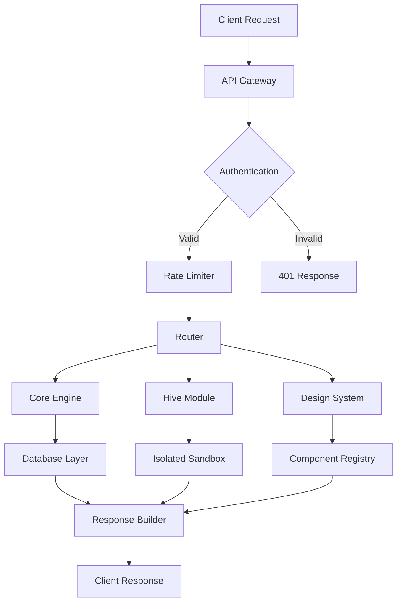

### [Sessão Paralela: SRE]
# DIYAPP Evolution - V12 Core - Infraestrutura como Código

Vou criar uma infraestrutura completa para alta disponibilidade, auto-scaling e monitoramento. Vou usar Terraform para provisionamento e Kubernetes para orquestração.

## Estrutura do Projeto

```
infra/
├── terraform/
│   ├── modules/
│   │   ├── vpc/
│   │   ├── eks/
│   │   ├── rds/
│   │   └── monitoring/
│   ├── environments/
│   │   ├── dev/
│   │   ├── staging/
│   │   └── prod/
│   └── providers.tf
├── kubernetes/
│   ├── base/
│   ├── overlays/
│   ├── monitoring/
│   └── logging/
├── scripts/
└── README.md
```

## 1. Terraform - Configuração Principal

### `infra/terraform/providers.tf`

```hcl
terraform {
  required_version = ">= 1.5.0"
  
  required_providers {
    aws = {
      source  = "hashicorp/aws"
      version = "~> 5.0"
    }
    kubernetes = {
      source  = "hashicorp/kubernetes"
      version = "~> 2.23"
    }
    helm = {
      source  = "hashicorp/helm"
      version = "~> 2.11"
    }
    kubectl = {
      source  = "gavinbunney/kubectl"
      version = "~> 1.14"
    }
  }

  backend "s3" {
    bucket         = "diyapp-tfstate-v12"
    key            = "terraform.tfstate"
    region         = "us-east-1"
    encrypt        = true
    dynamodb_table = "diyapp-tfstate-lock"
  }
}

provider "aws" {
  region = var.aws_region
  default_tags {
    tags = {
      Project     = "DIYAPP-V12"
      Environment = var.environment
      ManagedBy   = "Terraform"
      Squad       = "SRE"
    }
  }
}

provider "kubernetes" {
  host                   = module.eks.cluster_endpoint
  cluster_ca_certificate = base64decode(module.eks.cluster_certificate_authority_data)
  token                  = data.aws_eks_cluster_auth.this.token
}

provider "helm" {
  kubernetes {
    host                   = module.eks.cluster_endpoint
    cluster_ca_certificate = base64decode(module.eks.cluster_certificate_authority_data)
    token                  = data.aws_eks_cluster_auth.this.token
  }
}

provider "kubectl" {
  apply_retry_count      = 3
  host                   = module.eks.cluster_endpoint
  cluster_ca_certificate = base64decode(module.eks.cluster_certificate_authority_data)
  token                  = data.aws_eks_cluster_auth.this.token
  load_config_file       = false
}

data "aws_eks_cluster_auth" "this" {
  name = module.eks.cluster_name
}
```

### `infra/terraform/modules/vpc/main.tf`

```hcl
module "vpc" {
  source  = "terraform-aws-modules/vpc/aws"
  version = "~> 5.0"

  name = "${var.project_name}-${var.environment}-vpc"
  cidr = var.vpc_cidr

  azs             = var.availability_zones
  private_subnets = var.private_subnet_cidrs
  public_subnets  = var.public_subnet_cidrs

  enable_nat_gateway     = true
  single_nat_gateway     = false
  one_nat_gateway_per_az = true

  enable_dns_hostnames = true
  enable_dns_support   = true

  # EKS requirements
  private_subnet_tags = {
    "kubernetes.io/role/internal-elb" = "1"
    "kubernetes.io/cluster/${var.cluster_name}" = "shared"
  }

  public_subnet_tags = {
    "kubernetes.io/role/elb" = "1"
    "kubernetes.io/cluster/${var.cluster_name}" = "shared"
  }

  tags = var.tags
}

resource "aws_vpc_endpoint" "s3" {
  vpc_id       = module.vpc.vpc_id
  service_name = "com.amazonaws.${var.aws_region}.s3"
  vpc_endpoint_type = "Gateway"

  route_table_ids = module.vpc.private_route_table_ids

  tags = merge(var.tags, {
    Name = "${var.project_name}-${var.environment}-s3-endpoint"
  })
}

resource "aws_vpc_endpoint" "ecr_api" {
  vpc_id              = module.vpc.vpc_id
  service_name        = "com.amazonaws.${var.aws_region}.ecr.api"
  vpc_endpoint_type   = "Interface"
  private_dns_enabled = true
  subnet_ids          = module.vpc.private_subnets
  security_group_ids  = [aws_security_group.vpc_endpoint.id]

  tags = merge(var.tags, {
    Name = "${var.project_name}-${var.environment}-ecr-api-endpoint"
  })
}

resource "aws_vpc_endpoint" "ecr_dkr" {
  vpc_id              = module.vpc.vpc_id
  service_name        = "com.amazonaws.${var.aws_region}.ecr.dkr"
  vpc_endpoint_type   = "Interface"
  private_dns_enabled = true
  subnet_ids          = module.vpc.private_subnets
  security_group_ids  = [aws_security_group.vpc_endpoint.id]

  tags = merge(var.tags, {
    Name = "${var.project_name}-${var.environment}-ecr-dkr-endpoint"
  })
}

resource "aws_security_group" "vpc_endpoint" {
  name        = "${var.project_name}-${var.environment}-vpc-endpoint-sg"
  description = "Security group for VPC endpoints"
  vpc_id      = module.vpc.vpc_id

  ingress {
    description = "TLS from VPC"
    from_port   = 443
    to_port     = 443
    protocol    = "tcp"
    cidr_blocks = [module.vpc.vpc_cidr_block]
  }

  egress {
    from_port   = 0
    to_port     = 0
    protocol    = "-1"
    cidr_blocks = ["0.0.0.0/0"]
  }

  tags = var.tags
}
```

### `infra/terraform/modules/eks/main.tf`

```hcl
module "eks" {
  source  = "terraform-aws-modules/eks/aws"
  version = "~> 19.0"

  cluster_name    = var.cluster_name
  cluster_version = var.cluster_version

  vpc_id     = var.vpc_id
  subnet_ids = var.private_subnet_ids

  cluster_endpoint_public_access  = true
  cluster_endpoint_private_access = true

  # EKS Managed Node Group
  eks_managed_node_groups = {
    main = {
      name            = "main-node-group"
      instance_types  = ["m5.large", "m5a.large", "m5d.large"]
      capacity_type   = "SPOT"
      min_size        = 3
      max_size        = 10
      desired_size    = 3

      update_config = {
        max_unavailable_percentage = 33
      }

      labels = {
        Environment = var.environment
        NodeGroup   = "main"
      }

      taints = []

      tags = merge(var.tags, {
        "k8s.io/cluster-autoscaler/enabled"               = "true"
        "k8s.io/cluster-autoscaler/${var.cluster_name}" = "owned"
      })
    }

    monitoring = {
      name            = "monitoring-node-group"
      instance_types  = ["m5.xlarge"]
      capacity_type   = "ON_DEMAND"
      min_size        = 2
      max_size        = 4
      desired_size    = 2

      labels = {
        Environment = var.environment
        NodeGroup   = "monitoring"
        dedicated   = "monitoring"
      }

      taints = [{
        key    = "dedicated"
        value  = "monitoring"
        effect = "NO_SCHEDULE"
      }]

      tags = var.tags
    }
  }

  # Cluster Addons
  cluster_addons = {
    coredns = {
      most_recent = true
    }
    kube-proxy = {
      most_recent = true
    }
    vpc-cni = {
      most_recent = true
    }
    aws-ebs-csi-driver = {
      most_recent = true
    }
  }

  # Cluster Security Group
  cluster_security_group_additional_rules = {
    ingress_nodes_443 = {
      description                = "Nodes to cluster API"
      protocol                   = "tcp"
      from_port                  = 443
      to_port                    = 443
      type                       = "ingress"
      source_node_security_group = true
    }
  }

  node_security_group_additional_rules = {
    ingress_self_all = {
      description = "Node to node all ports"
      protocol    = "-1"
      from_port   = 0
      to_port     = 0
      type        = "ingress"
      self        = true
    }
    egress_all = {
      description      = "Node all egress"
      protocol         = "-1"
      from_port        = 0
      to_port          = 0
      type             = "egress"
      cidr_blocks      = ["0.0.0.0/0"]
      ipv6_cidr_blocks = ["::/0"]
    }
  }

  tags = var.tags
}

# Cluster Autoscaler IAM Role
module "cluster_autoscaler_irsa" {
  source  = "terraform-aws-modules/iam/aws//modules/iam-role-for-service-accounts-eks"
  version = "~> 5.0"

  role_name = "${var.cluster_name}-cluster-autoscaler"

  attach_cluster_autoscaler_policy = true
  cluster_autoscaler_cluster_ids   = [module.eks.cluster_name]

  oidc_providers = {
    main = {
      provider_arn               = module.eks.oidc_provider_arn
      namespace_service_accounts = ["kube-system:cluster-autoscaler"]
    }
  }

  tags = var.tags
}

# External DNS IAM Role
module "external_dns_irsa" {
  source  = "terraform-aws-modules/iam/aws//modules/iam-role-for-service-accounts-eks"
  version = "~> 5.0"

  role_name = "${var.cluster_name}-external-dns"

  attach_external_dns_policy = true
  external_dns_hosted_zone_arns = var.route53_zone_arns

  oidc_providers = {
    main = {
      provider_arn               = module.eks.oidc_provider_arn
      namespace_service_accounts = ["kube-system:external-dns"]
    }
  }

  tags = var.tags
}

# Load Balancer Controller IAM Role
module "load_balancer_controller_irsa" {
  source  = "terraform-aws-modules/iam/aws//modules/iam-role-for-service-accounts-eks"
  version = "~> 5.0"

  role_name = "${var.cluster_name}-load-balancer-controller"

  attach_load_balancer_controller_policy = true

  oidc_providers = {
    main = {
      provider_arn               = module.eks.oidc_provider_arn
      namespace_service_accounts = ["kube-system:aws-load-balancer-controller"]
    }
  }

  tags = var.tags
}
```

### `infra/terraform/modules/monitoring/main.tf`

```hcl
# S3 Bucket for ALB Logs
resource "aws_s3_bucket" "alb_logs" {
  bucket = "${var.project_name}-${var.environment}-alb-logs"
  
  tags = var.tags
}

resource "aws_s3_bucket_lifecycle_configuration" "alb_logs" {
  bucket = aws_s3_bucket.alb_logs.id

  rule {
    id     = "log_lifecycle"
    status = "Enabled"

    transition {
      days          = 30
      storage_class = "STANDARD_IA"
    }

    transition {
      days          = 90
      storage_class = "GLACIER"
    }

    expiration {
      days = 365
    }
  }
}

resource "aws_s3_bucket_server_side_encryption_configuration" "alb_logs" {
  bucket = aws_s3_bucket.alb_logs.id

  rule {
    apply_server_side_encryption_by_default {
      sse_algorithm = "AES256"
    }
  }
}

resource "aws_s3_bucket_policy" "alb_logs" {
  bucket = aws_s3_bucket.alb_logs.id
  policy = jsonencode({
    Version = "2012-10-17"
    Statement = [
      {
        Effect = "Allow"
        Principal = {
          Service = "delivery.logs.amazonaws.com"
        }
        Action = "s3:PutObject"
        Resource = "${aws_s3_bucket.alb_logs.arn}/*"
        Condition = {
          StringEquals = {
            "s3:x-amz-acl" = "bucket-owner-full-control"
          }
        }
      },
      {
        Effect = "Allow"
        Principal = {
          Service = "delivery.logs.amazonaws.com"
        }
        Action = "s3:GetBucketAcl"
        Resource = aws_s3_bucket.alb_logs.arn
      }
    ]
  })
}

# CloudWatch Log Group for EKS
resource "aws_cloudwatch_log_group" "eks" {
  name              = "/aws/eks/${var.cluster_name}/cluster"
  retention_in_days = 30

  tags = var.tags
}

# Prometheus Managed Service (AMP)
resource "aws_prometheus_workspace" "main" {
  alias = "${var.project_name}-${var.environment}-prometheus"

  tags = var.tags
}

# Grafana Managed Service
resource "aws_grafana_workspace" "main" {
  name                     = "${var.project_name}-${var.environment}-grafana"
  account_access_type      = "CURRENT_ACCOUNT"
  authentication_providers = ["AWS_SSO"]
  permission_type          = "SERVICE_MANAGED"
  role_arn                 = aws_iam_role.grafana.arn

  tags = var.tags
}

resource "aws_iam_role" "grafana" {
  name = "${var.project_name}-${var.environment}-grafana-role"

  assume_role_policy = jsonencode({
    Version = "2012-10-17"
    Statement = [
      {
        Action = "sts:AssumeRole"
        Effect = "Allow"
        Principal = {
          Service = "grafana.amazonaws.com"
        }
      }
    ]
  })

  tags = var.tags
}

resource "aws_iam_role_policy_attachment" "grafana_amp" {
  role       = aws_iam_role.grafana.name
  policy_arn = "arn:aws:iam::aws:policy/AmazonPrometheusQueryAccess"
}

resource "aws_iam_role_policy_attachment" "grafana_cloudwatch" {
  role       = aws_iam_role.grafana.name
  policy_arn = "arn:aws:iam::aws:policy/CloudWatchReadOnlyAccess"
}
```

## 2. Kubernetes Manifests

### `infra/kubernetes/base/kustomization.yaml`

```yaml
apiVersion: kustomize.config.k8s.io/v1beta1
kind: Kustomization

resources:
  - namespace.yaml
  - configs/
  - secrets/

commonLabels:
  app.kubernetes.io/part-of: diyapp-v12
  app.kubernetes.io/managed-by: kustomize

namespace: diyapp-v12
```

### `infra/kubernetes/base/namespace.yaml`

```yaml
apiVersion: v1
kind: Namespace
metadata:
  name: diyapp-v12
  labels:
    name: diyapp-v12
    environment: ${ENVIRONMENT}
```

### `infra/kubernetes/monitoring/prometheus-stack.yaml`

```yaml
apiVersion: v1
kind: Namespace
metadata:
  name: monitoring
  labels:
    name: monitoring
---
apiVersion: v1
kind: ServiceAccount
metadata:
  name: prometheus
  namespace: monitoring
---
apiVersion: rbac.authorization.k8s.io/v1
kind: ClusterRole
metadata:
  name: prometheus
rules:
- apiGroups: [""]
  resources:
  - nodes
  - nodes/proxy
  - services
  - endpoints
  - pods
  verbs: ["get", "list", "watch"]
- apiGroups: [""]
  resources:
  - configmaps
  verbs: ["get"]
- apiGroups:
  - networking.k8s.io
  resources:
  - ingresses
  verbs: ["get", "list", "watch"]
- nonResourceURLs: ["/metrics"]
  verbs: ["get"]
---
apiVersion: rbac.authorization.k8s.io/v1
kind: ClusterRoleBinding
metadata:
  name: prometheus
roleRef:
  apiGroup: rbac.authorization.k8s.io
  kind: ClusterRole
  name: prometheus
subjects:
- kind: ServiceAccount
  name: prometheus
  namespace: monitoring
---
apiVersion: monitoring.coreos.com/v1
kind: Prometheus
metadata:
  name

### [Sessão Paralela: Tech Leader]
```python
# DIYAPP Evolution - V12 Core - Arquitetura de Microsserviços
# ADR-001: Arquitetura de Microsserviços para V12
# Data: 2024-01-15
# Status: Aceita
# Autores: Tech Lead + Especialista Infra + Especialista Backend

"""
CONTEXTO:
A V11 do DIYAPP evoluiu para uma arquitetura monolítica que está limitando:
1. Escalabilidade independente dos módulos (Dashboard vs Processamento IA)
2. Deploy contínuo (todo o sistema precisa ser redeployado para mudanças pequenas)
3. Isolamento de falhas (erro em automação derruba o dashboard)
4. Adoção de diferentes stacks técnicas por domínio (Python para IA, Go para automação)

DECISÃO:
Adotar arquitetura de microsserviços com 4 serviços principais:
1. dashboard-service (Node.js/Express) - Interface web e gerenciamento
2. automation-service (Go) - Execução de workflows e automações
3. ai-service (Python/FastAPI) - Processamento com modelos LLM
4. gateway-service (Nginx/Traefik) - API Gateway e roteamento

OPÇÕES CONSIDERADAS:
- Opção A: Arquitetura monolítica com módulos - Prós: Simplicidade inicial, debugging fácil. Contras: Escalabilidade limitada, acoplamento forte.
- Opção B: Microsserviços completos - Prós: Escalabilidade independente, isolamento de falhas. Contras: Complexidade operacional, latência de rede.
- Opção C: Arquitetura híbrida (modular monolith) - Prós: Balanceamento entre simplicidade e escalabilidade. Contras: Não resolve totalmente o isolamento.

Opção escolhida: B - Justificativa: O DIYAPP precisa de alta disponibilidade e escalabilidade independente para módulos de IA que consomem muitos recursos.

CONSEQUÊNCIAS:
Positivas: Escalabilidade independente, deploy contínuo por serviço, isolamento de falhas, escolha de stack técnica por domínio.
Negativas: Complexidade aumentada, necessidade de orquestração, latência de rede entre serviços, consistência eventual.
Riscos: Problemas de rede podem quebrar fluxos, debugging distribuído é mais complexo. Mitigação: Logs centralizados (ELK), tracing distribuído (Jaeger).

REVISÃO: 2024-04-15
"""

# ============================================================================
# ESTRUTURA DO PROJETO V12
# ============================================================================

"""
diysquad-v12/
├── README.md
├── docker-compose.yml
├── .github/
│   └── workflows/
│       └── ci-cd.yml
├── gateway/
│   ├── Dockerfile
│   ├── nginx.conf
│   └── src/
│       └── middleware/
├── services/
│   ├── dashboard-service/
│   │   ├── Dockerfile
│   │   ├── package.json
│   │   ├── src/
│   │   │   ├── controllers/
│   │   │   ├── models/
│   │   │   ├── routes/
│   │   │   ├── middleware/
│   │   │   └── index.js
│   │   └── tests/
│   ├── automation-service/
│   │   ├── Dockerfile
│   │   ├── go.mod
│   │   ├── src/
│   │   │   ├── handlers/
│   │   │   ├── models/
│   │   │   ├── workflows/
│   │   │   └── main.go
│   │   └── tests/
│   └── ai-service/
│       ├── Dockerfile
│       ├── requirements.txt
│       ├── src/
│       │   ├── api/
│       │   ├── models/
│       │   ├── processors/
│       │   └── main.py
│       └── tests/
├── shared/
│   ├── protos/           # Definições gRPC
│   ├── events/           # Schemas de eventos
│   └── types/            # Tipos TypeScript compartilhados
├── infra/
│   ├── k8s/              # Manifests Kubernetes
│   ├── terraform/        # Infra as Code
│   └── monitoring/       # Grafana, Prometheus
└── docs/
    ├── api/              # OpenAPI specs
    ├── architecture/     # Diagramas
    └── adrs/             # Architecture Decision Records
"""

# ============================================================================
# 1. DOCKER-COMPOSE PARA DESENVOLVIMENTO LOCAL
# ============================================================================

# docker-compose.yml
docker_compose = """
version: '3.8'

services:
  # API Gateway
  gateway:
    build: ./gateway
    ports:
      - "80:80"
      - "443:443"
    environment:
      - NODE_ENV=development
    depends_on:
      - dashboard
      - automation
      - ai
    networks:
      - diysquad-network

  # Dashboard Service
  dashboard:
    build: ./services/dashboard-service
    ports:
      - "3000:3000"
    environment:
      - NODE_ENV=development
      - DB_HOST=postgres
      - REDIS_HOST=redis
      - AUTOMATION_SERVICE_URL=http://automation:4000
      - AI_SERVICE_URL=http://ai:5000
    volumes:
      - ./services/dashboard-service:/app
      - /app/node_modules
    depends_on:
      - postgres
      - redis
    networks:
      - diysquad-network

  # Automation Service
  automation:
    build: ./services/automation-service
    ports:
      - "4000:4000"
    environment:
      - DB_HOST=postgres
      - REDIS_HOST=redis
      - RABBITMQ_HOST=rabbitmq
      - AI_SERVICE_GRPC_HOST=ai
      - AI_SERVICE_GRPC_PORT=50051
    volumes:
      - ./services/automation-service:/app
    depends_on:
      - postgres
      - redis
      - rabbitmq
      - ai
    networks:
      - diysquad-network

  # AI Service
  ai:
    build: ./services/ai-service
    ports:
      - "5000:5000"
      - "50051:50051"  # gRPC port
    environment:
      - OPENAI_API_KEY=${OPENAI_API_KEY}
      - DB_HOST=postgres
      - REDIS_HOST=redis
      - RABBITMQ_HOST=rabbitmq
    volumes:
      - ./services/ai-service:/app
      - ./shared/protos:/app/protos
    depends_on:
      - postgres
      - redis
      - rabbitmq
    networks:
      - diysquad-network

  # Banco de Dados
  postgres:
    image: postgres:15-alpine
    environment:
      - POSTGRES_USER=diysquad
      - POSTGRES_PASSWORD=diysquad123
      - POSTGRES_DB=diysquad_v12
    ports:
      - "5432:5432"
    volumes:
      - postgres_data:/var/lib/postgresql/data
    networks:
      - diysquad-network

  # Cache e Message Broker
  redis:
    image: redis:7-alpine
    ports:
      - "6379:6379"
    networks:
      - diysquad-network

  rabbitmq:
    image: rabbitmq:3-management-alpine
    ports:
      - "5672:5672"
      - "15672:15672"
    environment:
      - RABBITMQ_DEFAULT_USER=diysquad
      - RABBITMQ_DEFAULT_PASS=diysquad123
    networks:
      - diysquad-network

  # Monitoramento
  jaeger:
    image: jaegertracing/all-in-one:latest
    ports:
      - "16686:16686"
    networks:
      - diysquad-network

volumes:
  postgres_data:

networks:
  diysquad-network:
    driver: bridge
"""

# ============================================================================
# 2. CONTRATOS DE API - OPENAPI SPECS
# ============================================================================

# dashboard-service/src/routes/api.yaml
api_spec = """
openapi: 3.0.0
info:
  title: DIYAPP V12 Dashboard API
  version: 1.0.0
  description: API para gerenciamento do dashboard DIYAPP

servers:
  - url: http://localhost:3000/api/v1
    description: Development server

paths:
  /workflows:
    get:
      summary: Listar workflows
      tags:
        - Workflows
      responses:
        '200':
          description: Lista de workflows
          content:
            application/json:
              schema:
                type: array
                items:
                  $ref: '#/components/schemas/Workflow'
    post:
      summary: Criar novo workflow
      tags:
        - Workflows
      requestBody:
        required: true
        content:
          application/json:
            schema:
              $ref: '#/components/schemas/WorkflowInput'
      responses:
        '201':
          description: Workflow criado
          content:
            application/json:
              schema:
                $ref: '#/components/schemas/Workflow'

  /workflows/{id}/execute:
    post:
      summary: Executar workflow
      tags:
        - Workflows
      parameters:
        - name: id
          in: path
          required: true
          schema:
            type: string
      responses:
        '202':
          description: Execução iniciada
          content:
            application/json:
              schema:
                type: object
                properties:
                  executionId:
                    type: string
                  status:
                    type: string
                    enum: [pending, running, completed, failed]

components:
  schemas:
    Workflow:
      type: object
      properties:
        id:
          type: string
        name:
          type: string
        description:
          type: string
        steps:
          type: array
          items:
            $ref: '#/components/schemas/WorkflowStep'
        createdAt:
          type: string
          format: date-time
        updatedAt:
          type: string
          format: date-time

    WorkflowStep:
      type: object
      properties:
        id:
          type: string
        type:
          type: string
          enum: [llm_call, webhook, condition, delay]
        config:
          type: object

    WorkflowInput:
      type: object
      required:
        - name
        - steps
      properties:
        name:
          type: string
        description:
          type: string
        steps:
          type: array
          items:
            $ref: '#/components/schemas/WorkflowStep'
"""

# ============================================================================
# 3. CONTRATOS gRPC - PROTOBUF
# ============================================================================

# shared/protos/ai_service.proto
grpc_proto = """
syntax = "proto3";

package ai;

service AIService {
  // Processamento de texto com LLM
  rpc ProcessText (TextRequest) returns (TextResponse) {}
  
  // Processamento em batch
  rpc ProcessBatch (BatchRequest) returns (stream BatchResponse) {}
  
  // Análise de sentimentos
  rpc AnalyzeSentiment (SentimentRequest) returns (SentimentResponse) {}
  
  // Extração de entidades
  rpc ExtractEntities (EntityRequest) returns (EntityResponse) {}
}

message TextRequest {
  string text = 1;
  string model = 2;  // gpt-4, claude-3, etc
  optional float temperature = 3;
  optional int32 max_tokens = 4;
  repeated string stop_sequences = 5;
}

message TextResponse {
  string id = 1;
  string text = 2;
  int32 tokens_used = 3;
  float processing_time = 4;
  optional string error = 5;
}

message BatchRequest {
  repeated string texts = 1;
  string model = 2;
  optional int32 batch_size = 3;
}

message BatchResponse {
  string text = 1;
  string processed_text = 2;
  int32 index = 3;
  bool success = 4;
  optional string error = 5;
}

message SentimentRequest {
  string text = 1;
  optional string language = 2;
}

message SentimentResponse {
  float score = 1;  // -1.0 to 1.0
  string label = 2;  // positive, negative, neutral
  map<string, float> emotions = 3;  // anger, joy, sadness, etc
}

message EntityRequest {
  string text = 1;
  repeated string entity_types = 2;  // PERSON, ORG, LOCATION, etc
}

message EntityResponse {
  message Entity {
    string text = 1;
    string type = 2;
    float confidence = 3;
    int32 start = 4;
    int32 end = 5;
  }
  repeated Entity entities = 1;
}
"""

# ============================================================================
# 4. ESQUEMAS DE EVENTOS - CLOUD EVENTS
# ============================================================================

# shared/events/workflow_events.py
event_schemas = """
"""
# CloudEvents Schema para eventos do sistema
from typing import Dict, Any, Optional
from datetime import datetime
from pydantic import BaseModel, Field

class CloudEvent(BaseModel):
    """CloudEvents v1.0 specification"""
    specversion: str = "1.0"
    id: str
    source: str
    type: str
    time: datetime = Field(default_factory=datetime.utcnow)
    datacontenttype: str = "application/json"
    data: Dict[str, Any]
    
    # Extensions
    correlationid: Optional[str] = None
    traceid: Optional[str] = None
    spanid: Optional[str] = None

# Eventos de Workflow
class WorkflowCreatedEvent(CloudEvent):
    type: str = "workflow.created"
    
    class Data:
        workflow_id: str
        name: str
        created_by: str
        steps_count: int

class WorkflowExecutedEvent(CloudEvent):
    type: str = "workflow.executed"
    
    class Data:
        execution_id: str
        workflow_id: str
        status: str  # started, completed, failed
        started_at: datetime
        completed_at: Optional[datetime]
        error_message: Optional[str]
        metrics: Dict[str, Any]

# Eventos de IA
class AIProcessingStartedEvent(CloudEvent):
    type: str = "ai.processing.started"
    
    class Data:
        request_id: str
        model: str
        input_length: int
        user_id: str

class AIProcessingCompletedEvent(CloudEvent):
    type: str = "ai.processing.completed"
    
    class Data:
        request_id: str
        model: str
        output_length: int
        processing_time_ms: float
        tokens_used: int
        success: bool

# Eventos do Sistema
class ServiceHealthEvent(CloudEvent):
    type: str = "service.health"
    
    class Data:
        service_name: str
        status: str  # healthy, degraded, unhealthy
        timestamp: datetime
        metrics: Dict[str, float]
        dependencies: Dict[str, str]
"""

# ============================================================================
# 5. PADRÕES DE COMUNICAÇÃO
# ============================================================================

# docs/architecture/communication-patterns.md
communication_patterns = """
# Padrões de Comunicação - DIYAPP V12

## 1. Comunicação Síncrona (Request-Response)

### 1.1 REST/HTTP
**Uso:** Comunicação cliente-servidor, dashboard para serviços
**Protocolo:** HTTP/1.1 com HTTP/2 onde disponível
**Autenticação:** JWT Bearer tokens
**Timeout:** 30s padrão, 5s para health checks
**Retry:** Exponential backoff com jitter (max 3 tentativas)
**Circuit Breaker:** Configuração por serviço

```yaml
# Exemplo de configuração HTTP
http_client:
  timeout: 30000
  retry:
    max_attempts: 3
    backoff: exponential
    jitter: true
  circuit_breaker:
    failure_threshold: 5
    reset_timeout: 60000
```

### 1.2 gRPC
**Uso:** Comunicação serviço-serviço de alta performance
**Protocolo:** HTTP/2 com Protobuf
**Autenticação:** mTLS para serviços internos
**Streaming:** Suporte a unário, server streaming, client streaming, bidirectional
**Observabilidade:** Tracing automático com OpenTelemetry

```protobuf
// Exemplo de serviço gRPC
service AutomationService {
  rpc ExecuteWorkflow(WorkflowRequest) returns (stream WorkflowUpdate);
  rpc GetWorkflowStatus(StatusRequest) returns (StatusResponse);
}
```

## 2. Comunicação Assíncrona (Event-Driven)

### 2.1 RabbitMQ como Message Broker
**Uso:** Comunicação assíncrona entre serviços
**Exchange Types:** Direct, Topic, Fanout, Headers
**Padrões:** Publish/Subscribe, Work Queues, RPC
**Durabilidade:** Persistent messages com confirmações
**DLQ:** Dead Letter Queues para mensagens falhas

```python
# Exemplo de publicação de evento
async def publish_workflow_event(event: CloudEvent):
    channel = await connection.channel()
    await channel.exchange_declare(
        exchange='workflow_events',
        exchange_type='topic',
        durable=True
    )
    
    await channel.basic_publish(
        exchange='workflow_events',
        routing_key=f"workflow.{event.type}",
        body=event.json().encode(),
        properties=pika.BasicProperties(
            delivery_mode=2,  # persistent
            content_type='application/json',
            headers={
                'specversion': event.specversion,
                '

### [Sessão Paralela: Backend]
```python
# DIYAPP Evolution - V12 Core
# Dev Backend - Implementação de serviços core

"""
Arquitetura:
1. API Gateway (gateway.py) - Roteamento, rate limiting, CORS, logging
2. Serviço de Autenticação (auth_service.py) - JWT/OAuth2, refresh tokens
3. Modelos de Dados (models.py) - Usuário, Projeto, Execução
4. Configuração PostgreSQL (database.py) - Conexão, pooling, replicação
5. Configuração principal (config.py) - Variáveis de ambiente, logging
"""

# ==================== config.py ====================
"""
config.py - Configurações centralizadas com validação de ambiente
"""
import os
import logging
from typing import Optional
from pydantic import BaseSettings, Field, validator
from datetime import timedelta
import json

class Settings(BaseSettings):
    """Configurações da aplicação com validação"""
    
    # API Gateway
    API_HOST: str = Field(default="0.0.0.0", env="API_HOST")
    API_PORT: int = Field(default=8000, env="API_PORT")
    API_WORKERS: int = Field(default=4, env="API_WORKERS")
    API_DEBUG: bool = Field(default=False, env="API_DEBUG")
    
    # CORS
    CORS_ORIGINS: list = Field(default=["http://localhost:3000"], env="CORS_ORIGINS")
    
    # Rate Limiting
    RATE_LIMIT_PER_MINUTE: int = Field(default=60, env="RATE_LIMIT_PER_MINUTE")
    
    # JWT
    JWT_SECRET_KEY: str = Field(..., env="JWT_SECRET_KEY")
    JWT_ALGORITHM: str = Field(default="HS256", env="JWT_ALGORITHM")
    JWT_ACCESS_TOKEN_EXPIRE_MINUTES: int = Field(default=30, env="JWT_ACCESS_TOKEN_EXPIRE_MINUTES")
    JWT_REFRESH_TOKEN_EXPIRE_DAYS: int = Field(default=7, env="JWT_REFRESH_TOKEN_EXPIRE_DAYS")
    
    # OAuth2
    OAUTH2_CLIENT_ID: Optional[str] = Field(None, env="OAUTH2_CLIENT_ID")
    OAUTH2_CLIENT_SECRET: Optional[str] = Field(None, env="OAUTH2_CLIENT_SECRET")
    OAUTH2_REDIRECT_URI: Optional[str] = Field(None, env="OAUTH2_REDIRECT_URI")
    
    # Database - Primary
    DB_HOST: str = Field(..., env="DB_HOST")
    DB_PORT: int = Field(default=5432, env="DB_PORT")
    DB_NAME: str = Field(..., env="DB_NAME")
    DB_USER: str = Field(..., env="DB_USER")
    DB_PASSWORD: str = Field(..., env="DB_PASSWORD")
    DB_POOL_SIZE: int = Field(default=20, env="DB_POOL_SIZE")
    DB_MAX_OVERFLOW: int = Field(default=10, env="DB_MAX_OVERFLOW")
    
    # Database - Replica (Read-only)
    DB_REPLICA_HOST: Optional[str] = Field(None, env="DB_REPLICA_HOST")
    DB_REPLICA_PORT: Optional[int] = Field(None, env="DB_REPLICA_PORT")
    DB_REPLICA_NAME: Optional[str] = Field(None, env="DB_REPLICA_NAME")
    DB_REPLICA_USER: Optional[str] = Field(None, env="DB_REPLICA_USER")
    DB_REPLICA_PASSWORD: Optional[str] = Field(None, env="DB_REPLICA_PASSWORD")
    
    # Logging
    LOG_LEVEL: str = Field(default="INFO", env="LOG_LEVEL")
    LOG_FORMAT: str = Field(
        default='{"timestamp": "%(asctime)s", "level": "%(levelname)s", "name": "%(name)s", "message": "%(message)s", "correlation_id": "%(correlation_id)s"}',
        env="LOG_FORMAT"
    )
    
    # Circuit Breaker
    CIRCUIT_BREAKER_FAILURE_THRESHOLD: int = Field(default=5, env="CIRCUIT_BREAKER_FAILURE_THRESHOLD")
    CIRCUIT_BREAKER_RECOVERY_TIMEOUT: int = Field(default=30, env="CIRCUIT_BREAKER_RECOVERY_TIMEOUT")
    
    class Config:
        env_file = ".env"
        case_sensitive = True
    
    @validator("CORS_ORIGINS", pre=True)
    def parse_cors_origins(cls, v):
        if isinstance(v, str):
            return [origin.strip() for origin in v.split(",")]
        return v
    
    @validator("JWT_SECRET_KEY")
    def validate_jwt_secret(cls, v):
        if len(v) < 32:
            raise ValueError("JWT_SECRET_KEY deve ter pelo menos 32 caracteres")
        return v
    
    @property
    def database_url(self) -> str:
        """URL de conexão com o banco primário"""
        return f"postgresql://{self.DB_USER}:{self.DB_PASSWORD}@{self.DB_HOST}:{self.DB_PORT}/{self.DB_NAME}"
    
    @property
    def database_replica_url(self) -> Optional[str]:
        """URL de conexão com a réplica (se configurada)"""
        if not all([self.DB_REPLICA_HOST, self.DB_REPLICA_USER, self.DB_REPLICA_PASSWORD, self.DB_REPLICA_NAME]):
            return None
        port = self.DB_REPLICA_PORT or self.DB_PORT
        return f"postgresql://{self.DB_REPLICA_USER}:{self.DB_REPLICA_PASSWORD}@{self.DB_REPLICA_HOST}:{port}/{self.DB_REPLICA_NAME}"
    
    @property
    def access_token_expire(self) -> timedelta:
        """Tempo de expiração do access token"""
        return timedelta(minutes=self.JWT_ACCESS_TOKEN_EXPIRE_MINUTES)
    
    @property
    def refresh_token_expire(self) -> timedelta:
        """Tempo de expiração do refresh token"""
        return timedelta(days=self.JWT_REFRESH_TOKEN_EXPIRE_DAYS)

settings = Settings()

# Configuração de logging
def setup_logging():
    """Configura logging estruturado com JSON"""
    logging.config.dictConfig({
        'version': 1,
        'disable_existing_loggers': False,
        'formatters': {
            'json': {
                'format': settings.LOG_FORMAT,
                'class': 'logging.Formatter',
            },
        },
        'handlers': {
            'console': {
                'class': 'logging.StreamHandler',
                'formatter': 'json',
                'stream': 'ext://sys.stdout',
            },
            'file': {
                'class': 'logging.handlers.RotatingFileHandler',
                'formatter': 'json',
                'filename': 'logs/app.log',
                'maxBytes': 10485760,  # 10MB
                'backupCount': 5,
            },
        },
        'loggers': {
            '': {
                'handlers': ['console', 'file'],
                'level': settings.LOG_LEVEL,
            },
            'uvicorn.access': {
                'handlers': ['console', 'file'],
                'level': 'INFO',
                'propagate': False,
            },
        },
    })

# Contexto para correlation ID
import uuid
from contextvars import ContextVar

correlation_id: ContextVar[str] = ContextVar('correlation_id', default=str(uuid.uuid4()))

class CorrelationIdFilter(logging.Filter):
    """Filtro para adicionar correlation_id aos logs"""
    
    def filter(self, record):
        record.correlation_id = correlation_id.get()
        return True

# ==================== database.py ====================
"""
database.py - Configuração do PostgreSQL com replicação e connection pooling
"""
import asyncpg
from typing import Optional, AsyncGenerator
from contextlib import asynccontextmanager
import logging

logger = logging.getLogger(__name__)

class Database:
    """Classe para gerenciar conexões com PostgreSQL com suporte a replicação"""
    
    def __init__(self, settings: Settings):
        self.settings = settings
        self._primary_pool: Optional[asyncpg.Pool] = None
        self._replica_pool: Optional[asyncpg.Pool] = None
        self._circuit_breaker_state = {"failures": 0, "last_failure": None, "open": False}
    
    async def connect(self):
        """Estabelece conexões com os bancos primário e réplica"""
        try:
            # Pool primário (leitura/escrita)
            self._primary_pool = await asyncpg.create_pool(
                dsn=self.settings.database_url,
                min_size=5,
                max_size=self.settings.DB_POOL_SIZE,
                max_queries=50000,
                max_inactive_connection_lifetime=300,
                command_timeout=60,
                timeout=30
            )
            logger.info("Conectado ao banco de dados primário", extra={"db_host": self.settings.DB_HOST})
            
            # Pool réplica (somente leitura, se configurado)
            if self.settings.database_replica_url:
                self._replica_pool = await asyncpg.create_pool(
                    dsn=self.settings.database_replica_url,
                    min_size=3,
                    max_size=self.settings.DB_POOL_SIZE // 2,
                    max_queries=50000,
                    max_inactive_connection_lifetime=300,
                    command_timeout=60,
                    timeout=30
                )
                logger.info("Conectado ao banco de dados réplica", extra={"db_host": self.settings.DB_REPLICA_HOST})
            
        except Exception as e:
            logger.error("Erro ao conectar ao banco de dados", 
                        extra={"error": str(e), "correlation_id": correlation_id.get()})
            raise
    
    async def disconnect(self):
        """Fecha todas as conexões"""
        if self._primary_pool:
            await self._primary_pool.close()
        if self._replica_pool:
            await self._replica_pool.close()
        logger.info("Conexões com banco de dados fechadas")
    
    @asynccontextmanager
    async def acquire(self, read_only: bool = False) -> AsyncGenerator[asyncpg.Connection, None]:
        """
        Adquire uma conexão do pool apropriado.
        
        Args:
            read_only: Se True, usa pool de réplica quando disponível
        """
        pool = self._replica_pool if read_only and self._replica_pool else self._primary_pool
        
        if not pool:
            raise RuntimeError("Pool de conexão não disponível")
        
        # Verifica circuit breaker
        if self._circuit_breaker_state["open"]:
            logger.warning("Circuit breaker aberto para banco de dados")
            raise ConnectionError("Serviço de banco de dados temporariamente indisponível")
        
        try:
            async with pool.acquire() as connection:
                # Configura timeout por query
                await connection.execute("SET statement_timeout = 30000")  # 30 segundos
                yield connection
                # Reset do contador de falhas em caso de sucesso
                self._circuit_breaker_state["failures"] = 0
                
        except Exception as e:
            self._circuit_breaker_state["failures"] += 1
            self._circuit_breaker_state["last_failure"] = str(e)
            
            # Abre circuit breaker se muitas falhas consecutivas
            if self._circuit_breaker_state["failures"] >= self.settings.CIRCUIT_BREAKER_FAILURE_THRESHOLD:
                self._circuit_breaker_state["open"] = True
                logger.error("Circuit breaker aberto para banco de dados", 
                           extra={"failures": self._circuit_breaker_state["failures"]})
                
                # Agenda reabertura automática
                import asyncio
                asyncio.create_task(self._reset_circuit_breaker())
            
            logger.error("Erro ao adquirir conexão com banco de dados", 
                        extra={"error": str(e), "correlation_id": correlation_id.get()})
            raise
    
    async def _reset_circuit_breaker(self):
        """Reabre o circuit breaker após o timeout de recuperação"""
        await asyncio.sleep(self.settings.CIRCUIT_BREAKER_RECOVERY_TIMEOUT)
        self._circuit_breaker_state = {"failures": 0, "last_failure": None, "open": False}
        logger.info("Circuit breaker redefinido para banco de dados")
    
    async def execute_migration(self, migration_sql: str, rollback_sql: str = None):
        """
        Executa uma migração de banco de dados com rollback seguro.
        
        Args:
            migration_sql: SQL para migração
            rollback_sql: SQL para rollback (opcional)
        """
        async with self.acquire(read_only=False) as conn:
            try:
                # Inicia transação
                async with conn.transaction():
                    await conn.execute(migration_sql)
                    logger.info("Migração executada com sucesso")
                    
            except Exception as e:
                logger.error("Erro na migração, executando rollback", 
                           extra={"error": str(e), "correlation_id": correlation_id.get()})
                if rollback_sql:
                    try:
                        await conn.execute(rollback_sql)
                        logger.info("Rollback executado com sucesso")
                    except Exception as rollback_error:
                        logger.error("Erro no rollback", 
                                   extra={"error": str(rollback_error), "correlation_id": correlation_id.get()})
                raise

# ==================== models.py ====================
"""
models.py - Modelos de dados Pydantic e SQL
"""
from pydantic import BaseModel, EmailStr, Field, validator
from typing import Optional, List, Dict, Any
from datetime import datetime, timedelta
from enum import Enum
import uuid as uuid_lib

# Enums
class UserRole(str, Enum):
    USER = "user"
    ADMIN = "admin"
    SUPER_ADMIN = "super_admin"

class ProjectStatus(str, Enum):
    DRAFT = "draft"
    ACTIVE = "active"
    PAUSED = "paused"
    COMPLETED = "completed"
    ARCHIVED = "archived"

class ExecutionStatus(str, Enum):
    PENDING = "pending"
    RUNNING = "running"
    SUCCESS = "success"
    FAILED = "failed"
    CANCELLED = "cancelled"

# Models Pydantic para API
class UserBase(BaseModel):
    """Base para modelos de usuário"""
    email: EmailStr
    full_name: str = Field(..., min_length=2, max_length=100)
    is_active: bool = True
    role: UserRole = UserRole.USER
    
    @validator('email')
    def email_must_be_lowercase(cls, v):
        return v.lower()

class UserCreate(UserBase):
    """Modelo para criação de usuário"""
    password: str = Field(..., min_length=8, max_length=100)
    
    @validator('password')
    def password_strength(cls, v):
        if not any(c.isupper() for c in v):
            raise ValueError('Password must contain at least one uppercase letter')
        if not any(c.isdigit() for c in v):
            raise ValueError('Password must contain at least one digit')
        if not any(c in '!@#$%^&*()_+-=[]{}|;:,.<>?' for c in v):
            raise ValueError('Password must contain at least one special character')
        return v

class UserUpdate(BaseModel):
    """Modelo para atualização de usuário"""
    full_name: Optional[str] = Field(None, min_length=2, max_length=100)
    is_active: Optional[bool] = None
    
    class Config:
        extra = "forbid"  # Não permite campos extras

class UserInDB(UserBase):
    """Modelo de usuário no banco de dados"""
    id: uuid_lib.UUID
    hashed_password: str
    created_at: datetime
    updated_at: datetime
    last_login: Optional[datetime] = None
    
    class Config:
        orm_mode = True

class UserResponse(UserBase):
    """Resposta da API para usuário (sem senha)"""
    id: uuid_lib.UUID
    created_at: datetime
    updated_at: datetime
    
    class Config:
        orm_mode = True

class ProjectBase(BaseModel):
    """Base para modelos de projeto"""
    name: str = Field(..., min_length=3, max_length=200)
    description: Optional[str] = Field(None, max_length=1000)
    status: ProjectStatus = ProjectStatus.DRAFT
    metadata: Dict[str, Any] = Field(default_factory=dict)
    
    @validator('name')
    def name_must_not_be_empty(cls, v):
        if not v.strip():
            raise ValueError('Project name cannot be empty')
        return v.strip()

class ProjectCreate(ProjectBase):
    """Modelo para criação de projeto"""
    pass

class ProjectUpdate(BaseModel):
    """Modelo para atualização de projeto"""
    name: Optional[str] = Field(None, min_length=3, max_length=200)
    description: Optional[str] = Field(None, max_length=1000)
    status: Optional[ProjectStatus] = None
    metadata: Optional[Dict[str, Any]] = None
    
    class Config:
        extra = "forbid"

class ProjectInDB(ProjectBase):
    """Modelo de projeto no banco de dados"""
    id: uuid_lib.UUID
    owner_id: uuid_lib.UUID
    created_at: datetime
    updated_at: datetime
    
    class Config:
        orm_mode = True

class ProjectResponse(ProjectBase):
    """Resposta da API para projeto"""
    id: uuid_lib.UUID
    owner_id: uuid_lib.UUID
    created_at: datetime
    updated_at: datetime
    
    class Config:
        orm_mode = True

class ExecutionBase(BaseModel):
    """Base para modelos de execução"""
    project_id

### [Sessão Paralela: UX Designer]
# DIYAPP Evolution - V12 Core - Design System Implementation

Vou criar um Design System completo com tokens de design, componentes atômicos e templates de página, focando em UX premium com dark/light mode e micro-interações.

```html
<!DOCTYPE html>
<html lang="pt-BR">
<head>
    <meta charset="UTF-8">
    <meta name="viewport" content="width=device-width, initial-scale=1.0">
    <title>DIYAPP V12 - Design System</title>
    <link rel="stylesheet" href="https://cdnjs.cloudflare.com/ajax/libs/font-awesome/6.4.0/css/all.min.css">
    <link href="https://fonts.googleapis.com/css2?family=Inter:wght@300;400;500;600;700&display=swap" rel="stylesheet">
    <style>
        :root {
            /* Design Tokens - Light Mode */
            --color-primary-50: #f0f9ff;
            --color-primary-100: #e0f2fe;
            --color-primary-200: #bae6fd;
            --color-primary-300: #7dd3fc;
            --color-primary-400: #38bdf8;
            --color-primary-500: #0ea5e9;
            --color-primary-600: #0284c7;
            --color-primary-700: #0369a1;
            --color-primary-800: #075985;
            --color-primary-900: #0c4a6e;
            
            --color-neutral-50: #f9fafb;
            --color-neutral-100: #f3f4f6;
            --color-neutral-200: #e5e7eb;
            --color-neutral-300: #d1d5db;
            --color-neutral-400: #9ca3af;
            --color-neutral-500: #6b7280;
            --color-neutral-600: #4b5563;
            --color-neutral-700: #374151;
            --color-neutral-800: #1f2937;
            --color-neutral-900: #111827;
            
            --color-success-50: #f0fdf4;
            --color-success-500: #10b981;
            --color-success-700: #047857;
            
            --color-warning-50: #fffbeb;
            --color-warning-500: #f59e0b;
            --color-warning-700: #b45309;
            
            --color-error-50: #fef2f2;
            --color-error-500: #ef4444;
            --color-error-700: #b91c1c;
            
            --color-surface: #ffffff;
            --color-surface-elevated: #ffffff;
            --color-surface-inverse: #111827;
            --color-text-primary: #111827;
            --color-text-secondary: #4b5563;
            --color-text-tertiary: #6b7280;
            --color-text-inverse: #ffffff;
            --color-border: #e5e7eb;
            --color-overlay: rgba(0, 0, 0, 0.5);
            
            --shadow-xs: 0 1px 2px 0 rgba(0, 0, 0, 0.05);
            --shadow-sm: 0 1px 3px 0 rgba(0, 0, 0, 0.1), 0 1px 2px 0 rgba(0, 0, 0, 0.06);
            --shadow-md: 0 4px 6px -1px rgba(0, 0, 0, 0.1), 0 2px 4px -1px rgba(0, 0, 0, 0.06);
            --shadow-lg: 0 10px 15px -3px rgba(0, 0, 0, 0.1), 0 4px 6px -2px rgba(0, 0, 0, 0.05);
            --shadow-xl: 0 20px 25px -5px rgba(0, 0, 0, 0.1), 0 10px 10px -5px rgba(0, 0, 0, 0.04);
            
            --radius-sm: 4px;
            --radius-md: 8px;
            --radius-lg: 12px;
            --radius-xl: 16px;
            --radius-full: 9999px;
            
            --spacing-1: 4px;
            --spacing-2: 8px;
            --spacing-3: 12px;
            --spacing-4: 16px;
            --spacing-5: 20px;
            --spacing-6: 24px;
            --spacing-8: 32px;
            --spacing-10: 40px;
            --spacing-12: 48px;
            --spacing-16: 64px;
            
            --font-family: 'Inter', -apple-system, BlinkMacSystemFont, 'Segoe UI', Roboto, sans-serif;
            --font-size-xs: 12px;
            --font-size-sm: 14px;
            --font-size-base: 16px;
            --font-size-lg: 18px;
            --font-size-xl: 20px;
            --font-size-2xl: 24px;
            --font-size-3xl: 30px;
            --font-size-4xl: 36px;
            
            --font-weight-light: 300;
            --font-weight-normal: 400;
            --font-weight-medium: 500;
            --font-weight-semibold: 600;
            --font-weight-bold: 700;
            
            --line-height-tight: 1.25;
            --line-height-normal: 1.5;
            --line-height-relaxed: 1.75;
            
            --transition-fast: 150ms;
            --transition-normal: 250ms;
            --transition-slow: 350ms;
            
            --ease-in-out: cubic-bezier(0.4, 0, 0.2, 1);
            --ease-out: cubic-bezier(0, 0, 0.2, 1);
            --ease-in: cubic-bezier(0.4, 0, 1, 1);
            
            --z-index-dropdown: 1000;
            --z-index-sticky: 1020;
            --z-index-modal: 1050;
            --z-index-popover: 1070;
            --z-index-tooltip: 1080;
        }
        
        .dark-mode {
            /* Design Tokens - Dark Mode */
            --color-primary-50: #0c4a6e;
            --color-primary-100: #075985;
            --color-primary-200: #0369a1;
            --color-primary-300: #0284c7;
            --color-primary-400: #0ea5e9;
            --color-primary-500: #38bdf8;
            --color-primary-600: #7dd3fc;
            --color-primary-700: #bae6fd;
            --color-primary-800: #e0f2fe;
            --color-primary-900: #f0f9ff;
            
            --color-neutral-50: #111827;
            --color-neutral-100: #1f2937;
            --color-neutral-200: #374151;
            --color-neutral-300: #4b5563;
            --color-neutral-400: #6b7280;
            --color-neutral-500: #9ca3af;
            --color-neutral-600: #d1d5db;
            --color-neutral-700: #e5e7eb;
            --color-neutral-800: #f3f4f6;
            --color-neutral-900: #f9fafb;
            
            --color-success-50: #064e3b;
            --color-success-500: #10b981;
            --color-success-700: #a7f3d0;
            
            --color-warning-50: #78350f;
            --color-warning-500: #f59e0b;
            --color-warning-700: #fde68a;
            
            --color-error-50: #7f1d1d;
            --color-error-500: #ef4444;
            --color-error-700: #fca5a5;
            
            --color-surface: #111827;
            --color-surface-elevated: #1f2937;
            --color-surface-inverse: #ffffff;
            --color-text-primary: #f9fafb;
            --color-text-secondary: #d1d5db;
            --color-text-tertiary: #9ca3af;
            --color-text-inverse: #111827;
            --color-border: #374151;
            --color-overlay: rgba(0, 0, 0, 0.7);
            
            --shadow-xs: 0 1px 2px 0 rgba(0, 0, 0, 0.3);
            --shadow-sm: 0 1px 3px 0 rgba(0, 0, 0, 0.4), 0 1px 2px 0 rgba(0, 0, 0, 0.3);
            --shadow-md: 0 4px 6px -1px rgba(0, 0, 0, 0.4), 0 2px 4px -1px rgba(0, 0, 0, 0.3);
            --shadow-lg: 0 10px 15px -3px rgba(0, 0, 0, 0.4), 0 4px 6px -2px rgba(0, 0, 0, 0.2);
            --shadow-xl: 0 20px 25px -5px rgba(0, 0, 0, 0.4), 0 10px 10px -5px rgba(0, 0, 0, 0.2);
        }
        
        * {
            margin: 0;
            padding: 0;
            box-sizing: border-box;
        }
        
        body {
            font-family: var(--font-family);
            font-size: var(--font-size-base);
            line-height: var(--line-height-normal);
            color: var(--color-text-primary);
            background-color: var(--color-surface);
            transition: background-color var(--transition-normal) var(--ease-in-out),
                        color var(--transition-normal) var(--ease-in-out);
        }
        
        .container {
            max-width: 1200px;
            margin: 0 auto;
            padding: 0 var(--spacing-4);
        }
        
        /* Header */
        .header {
            position: sticky;
            top: 0;
            z-index: var(--z-index-sticky);
            background-color: var(--color-surface);
            border-bottom: 1px solid var(--color-border);
            padding: var(--spacing-4) 0;
            backdrop-filter: blur(8px);
            background-color: rgba(var(--color-surface), 0.8);
        }
        
        .header-content {
            display: flex;
            justify-content: space-between;
            align-items: center;
        }
        
        .logo {
            display: flex;
            align-items: center;
            gap: var(--spacing-2);
            font-weight: var(--font-weight-bold);
            font-size: var(--font-size-xl);
            color: var(--color-primary-500);
        }
        
        .logo-icon {
            width: 32px;
            height: 32px;
            background: linear-gradient(135deg, var(--color-primary-500), var(--color-primary-700));
            border-radius: var(--radius-md);
            display: flex;
            align-items: center;
            justify-content: center;
            color: white;
        }
        
        .theme-toggle {
            background: none;
            border: 1px solid var(--color-border);
            border-radius: var(--radius-full);
            width: 48px;
            height: 24px;
            position: relative;
            cursor: pointer;
            transition: all var(--transition-fast) var(--ease-in-out);
        }
        
        .theme-toggle:hover {
            border-color: var(--color-primary-500);
        }
        
        .theme-toggle::after {
            content: '';
            position: absolute;
            top: 2px;
            left: 2px;
            width: 18px;
            height: 18px;
            background-color: var(--color-primary-500);
            border-radius: var(--radius-full);
            transition: transform var(--transition-normal) var(--ease-in-out);
        }
        
        .dark-mode .theme-toggle::after {
            transform: translateX(24px);
        }
        
        /* Main Layout */
        .main-layout {
            display: grid;
            grid-template-columns: 240px 1fr;
            gap: var(--spacing-6);
            padding: var(--spacing-6) 0;
        }
        
        /* Sidebar */
        .sidebar {
            position: sticky;
            top: 80px;
            height: calc(100vh - 100px);
            overflow-y: auto;
        }
        
        .nav-section {
            margin-bottom: var(--spacing-6);
        }
        
        .nav-title {
            font-size: var(--font-size-sm);
            font-weight: var(--font-weight-semibold);
            color: var(--color-text-tertiary);
            text-transform: uppercase;
            letter-spacing: 0.05em;
            margin-bottom: var(--spacing-3);
            padding-left: var(--spacing-4);
        }
        
        .nav-list {
            list-style: none;
        }
        
        .nav-item {
            margin-bottom: var(--spacing-1);
        }
        
        .nav-link {
            display: flex;
            align-items: center;
            gap: var(--spacing-3);
            padding: var(--spacing-3) var(--spacing-4);
            border-radius: var(--radius-md);
            color: var(--color-text-secondary);
            text-decoration: none;
            transition: all var(--transition-fast) var(--ease-in-out);
        }
        
        .nav-link:hover {
            background-color: var(--color-neutral-100);
            color: var(--color-text-primary);
        }
        
        .nav-link.active {
            background-color: var(--color-primary-50);
            color: var(--color-primary-700);
            font-weight: var(--font-weight-medium);
        }
        
        .nav-icon {
            width: 20px;
            text-align: center;
        }
        
        /* Content Area */
        .content-area {
            padding-right: var(--spacing-4);
        }
        
        .page-header {
            margin-bottom: var(--spacing-8);
        }
        
        .page-title {
            font-size: var(--font-size-3xl);
            font-weight: var(--font-weight-bold);
            margin-bottom: var(--spacing-2);
        }
        
        .page-description {
            color: var(--color-text-secondary);
            max-width: 800px;
        }
        
        /* Section */
        .section {
            margin-bottom: var(--spacing-10);
        }
        
        .section-header {
            display: flex;
            justify-content: space-between;
            align-items: center;
            margin-bottom: var(--spacing-6);
            padding-bottom: var(--spacing-3);
            border-bottom: 1px solid var(--color-border);
        }
        
        .section-title {
            font-size: var(--font-size-xl);
            font-weight: var(--font-weight-semibold);
        }
        
        .section-subtitle {
            color: var(--color-text-secondary);
            margin-bottom: var(--spacing-4);
        }
        
        /* Component Grid */
        .component-grid {
            display: grid;
            grid-template-columns: repeat(auto-fill, minmax(300px, 1fr));
            gap: var(--spacing-6);
        }
        
        /* Component Card */
        .component-card {
            background-color: var(--color-surface-elevated);
            border: 1px solid var(--color-border);
            border-radius: var(--radius-lg);
            padding: var(--spacing-6);
            box-shadow: var(--shadow-sm);
            transition: all var(--transition-normal) var(--ease-in-out);
        }
        
        .component-card:hover {
            box-shadow: var(--shadow-md);
            transform: translateY(-2px);
        }
        
        .component-header {
            display: flex;
            justify-content: space-between;
            align-items: center;
            margin-bottom: var(--spacing-4);
        }
        
        .component-name {
            font-weight: var(--font-weight-semibold);
            font-size: var(--font-size-lg);
        }
        
        .component-description {
            color: var(--color-text-secondary);
            margin-bottom: var(--spacing-4);
            font-size: var(--font-size-sm);
        }
        
        .component-preview {
            background-color: var(--color-neutral-50);
            border-radius: var(--radius-md);
            padding: var(--spacing-6);
            margin-bottom: var(--spacing-4);
            border: 1px solid var(--color-border);
            display: flex;
            flex-wrap: wrap;
            gap: var(--spacing-3);
            align-items: center;
            justify-content: center;
            min-height: 120px;
        }
        
        .component-code {
            background-color: var(--color-neutral-900);
            color: var(--color-neutral-100);
            border-radius: var(--radius-md);
            padding: var(--spacing-4);
            font-family: 'Courier New', monospace;
            font-size: var(--font-size-sm);
            overflow-x: auto;
            margin-top: var(--spacing-4);
        }
        
        /* Button Component */
        .btn {
            display: inline-flex;
            align-items: center;
            justify-content: center;
            gap: var(--spacing-2);
            padding: var(--spacing-3) var(--spacing-5);
            border-radius: var(--radius-md);
            font-family: var(--font-family);
            font-size: var(--font-size-sm);
            font-weight: var(--font-weight-medium);
            line-height: 1;
            border: 1px solid transparent;
            cursor: pointer;
            transition: all var(--transition-fast) var(--ease-in-out);
            position: relative;
            overflow: hidden;


### [Sessão Paralela: Tech Writer]
# DIYAPP Evolution - V12 Core - Documentação Técnica

## Estrutura do Projeto

```
diyapp-v12-core/
├── docs/
│   ├── architecture/
│   │   ├── system-architecture.md
│   │   ├── data-flow.md
│   │   └── deployment-guide.md
│   ├── api/
│   │   ├── openapi.yaml
│   │   ├── api-reference.md
│   │   └── migration-guides/
│   ├── design-system/
│   │   ├── component-guide.md
│   │   ├── usage-examples.md
│   │   └── troubleshooting.md
│   └── operations/
│       ├── runbooks/
│       └── postmortems/
├── src/
├── public/
│   └── index.html
└── package.json
```

## 1. Documentação de Arquitetura do Sistema

### `docs/architecture/system-architecture.md`

```markdown
# Arquitetura do Sistema DIYAPP V12 Core

**Data de criação:** 2024-01-15  
**Última atualização:** 2024-01-15  
**Owner:** Tech Lead  
**Status:** Ativo

## Visão Geral

O DIYAPP V12 Core é uma plataforma de automação de workflows baseada em microserviços, projetada para operação 100% autônoma usando o Modo Hive para refatoração paralela.

## Componentes Principais

### 1. Core Engine
- **Função:** Orquestração central de workflows
- **Tecnologia:** Node.js 18+ com TypeScript
- **Escalabilidade:** Horizontal via Kubernetes
- **Persistência:** PostgreSQL para estado + Redis para cache

### 2. Hive Refactoring Module
- **Função:** Execução de refatorações paralelas
- **Características:**
  - Isolamento de mudanças
  - Rollback automático em falhas
  - Métricas de impacto em tempo real
  - Compatibilidade com versionamento semântico

### 3. Design System Service
- **Função:** Gerenciamento de componentes UI/UX
- **Recursos:**
  - Biblioteca de componentes React
  - Sistema de tokens de design
  - Builder visual de interfaces
  - Exportação para múltiplas plataformas

### 4. API Gateway
- **Função:** Roteamento e segurança de APIs
- **Recursos:**
  - Rate limiting por usuário
  - Autenticação JWT
  - Load balancing inteligente
  - Logging centralizado

### 5. Monitoring Stack
- **Função:** Observabilidade do sistema
- **Componentes:**
  - Prometheus para métricas
  - Grafana para dashboards
  - ELK Stack para logs
  - Jaeger para tracing distribuído

## Fluxo de Dados



## Decisões Arquiteturais (ADRs)

### ADR-001: Modo Hive para Refatoração
**Contexto:** Necessidade de realizar refatorações em produção sem downtime.
**Decisão:** Implementar sistema de sandboxing com isolamento completo.
**Consequências:** Maior complexidade operacional, mas zero downtime.

### ADR-002: Design System como Microserviço
**Contexto:** Componentes UI usados em múltiplos frontends.
**Decisão:** Serviço independente com API GraphQL.
**Consequências:** Consistência entre produtos, deploy independente.

## Métricas de Saúde do Sistema

| Métrica | Alvo | Alerta |
|---------|------|--------|
| Uptime | 99.99% | < 99.9% |
| Latência P95 | < 200ms | > 500ms |
| Error Rate | < 0.1% | > 1% |
| Hive Success Rate | > 99% | < 95% |

## Links Relacionados
- [Fluxo de Dados Detalhado](./data-flow.md)
- [Guia de Deploy](./deployment-guide.md)
- [Runbooks de Incidente](../operations/runbooks/)
```

## 2. Documentação da API (OpenAPI)

### `docs/api/openapi.yaml`

```yaml
openapi: 3.0.3
info:
  title: DIYAPP V12 Core API
  description: API para automação de workflows com suporte a refatoração Hive
  version: 2.1.0
  contact:
    name: API Support
    email: api@diyapp.com
  license:
    name: MIT
    url: https://opensource.org/licenses/MIT

servers:
  - url: https://api.diyapp.com/v2
    description: Production server
  - url: https://staging-api.diyapp.com/v2
    description: Staging server

tags:
  - name: Workflows
    description: Operações com workflows de automação
  - name: Hive
    description: Refatoração paralela com isolamento
  - name: Design System
    description: Componentes UI e tokens de design
  - name: Authentication
    description: Autenticação e autorização

paths:
  /workflows:
    get:
      tags: [Workflows]
      summary: Listar workflows
      description: Retorna lista paginada de workflows
      parameters:
        - name: page
          in: query
          schema:
            type: integer
            minimum: 1
            default: 1
        - name: limit
          in: query
          schema:
            type: integer
            minimum: 1
            maximum: 100
            default: 20
      responses:
        '200':
          description: Lista de workflows
          content:
            application/json:
              schema:
                $ref: '#/components/schemas/WorkflowList'
        '401':
          $ref: '#/components/responses/Unauthorized'
        '429':
          $ref: '#/components/responses/TooManyRequests'

    post:
      tags: [Workflows]
      summary: Criar novo workflow
      description: Cria um novo workflow de automação
      requestBody:
        required: true
        content:
          application/json:
            schema:
              $ref: '#/components/schemas/WorkflowCreate'
      responses:
        '201':
          description: Workflow criado com sucesso
          content:
            application/json:
              schema:
                $ref: '#/components/schemas/Workflow'
        '400':
          $ref: '#/components/responses/BadRequest'
        '401':
          $ref: '#/components/responses/Unauthorized'

  /workflows/{id}:
    get:
      tags: [Workflows]
      summary: Obter workflow por ID
      description: Retorna detalhes de um workflow específico
      parameters:
        - name: id
          in: path
          required: true
          schema:
            type: string
            format: uuid
      responses:
        '200':
          description: Detalhes do workflow
          content:
            application/json:
              schema:
                $ref: '#/components/schemas/Workflow'
        '404':
          $ref: '#/components/responses/NotFound'

  /hive/refactor:
    post:
      tags: [Hive]
      summary: Iniciar refatoração Hive
      description: Inicia uma refatoração paralela com isolamento
      requestBody:
        required: true
        content:
          application/json:
            schema:
              $ref: '#/components/schemas/HiveRefactorRequest'
      responses:
        '202':
          description: Refatoração aceita para processamento
          content:
            application/json:
              schema:
                $ref: '#/components/schemas/HiveJob'
        '400':
          description: |
            Erros comuns:
            - `HIV001`: Configuração de sandbox inválida
            - `HIV002`: Recursos insuficientes
            - `HIV003`: Conflito com refatoração em andamento

  /design-system/components:
    get:
      tags: [Design System]
      summary: Listar componentes disponíveis
      description: Retorna componentes do design system com filtros
      parameters:
        - name: category
          in: query
          schema:
            type: string
            enum: [atoms, molecules, organisms, templates]
        - name: version
          in: query
          schema:
            type: string
            pattern: '^\d+\.\d+\.\d+$'
      responses:
        '200':
          description: Lista de componentes
          content:
            application/json:
              schema:
                $ref: '#/components/schemas/ComponentList'

components:
  schemas:
    Workflow:
      type: object
      properties:
        id:
          type: string
          format: uuid
          example: "123e4567-e89b-12d3-a456-426614174000"
        name:
          type: string
          example: "Processamento de Pedidos"
        version:
          type: string
          example: "1.0.0"
        status:
          type: string
          enum: [draft, active, paused, archived]
        createdAt:
          type: string
          format: date-time
        updatedAt:
          type: string
          format: date-time

    WorkflowCreate:
      type: object
      required: [name, steps]
      properties:
        name:
          type: string
          minLength: 3
          maxLength: 100
        description:
          type: string
          maxLength: 500
        steps:
          type: array
          items:
            $ref: '#/components/schemas/WorkflowStep'

    WorkflowList:
      type: object
      properties:
        data:
          type: array
          items:
            $ref: '#/components/schemas/Workflow'
        pagination:
          $ref: '#/components/schemas/Pagination'

    HiveRefactorRequest:
      type: object
      required: [targetService, refactorScript]
      properties:
        targetService:
          type: string
          enum: [workflows, design-system, api-gateway]
        refactorScript:
          type: string
          description: Código JavaScript da refatoração
        rollbackScript:
          type: string
          description: Script para rollback automático
        timeoutSeconds:
          type: integer
          minimum: 30
          maximum: 3600
          default: 300

    HiveJob:
      type: object
      properties:
        jobId:
          type: string
          format: uuid
        status:
          type: string
          enum: [pending, running, completed, failed, rolled-back]
        sandboxUrl:
          type: string
          format: uri
        estimatedCompletion:
          type: string
          format: date-time

    ComponentList:
      type: object
      properties:
        components:
          type: array
          items:
            $ref: '#/components/schemas/Component'
        tokens:
          type: object
          additionalProperties:
            type: string

    Pagination:
      type: object
      properties:
        total:
          type: integer
        page:
          type: integer
        limit:
          type: integer
        totalPages:
          type: integer

  responses:
    Unauthorized:
      description: Token de autenticação inválido ou expirado
      content:
        application/json:
          schema:
            type: object
            properties:
              error:
                type: string
                example: "Unauthorized"
              code:
                type: string
                example: "AUTH001"
              message:
                type: string
                example: "Token JWT inválido"

    TooManyRequests:
      description: Limite de requisições excedido
      content:
        application/json:
          schema:
            type: object
            properties:
              error:
                type: string
                example: "Too Many Requests"
              code:
                type: string
                example: "RATE001"
              retryAfter:
                type: integer
                example: 60

    BadRequest:
      description: Requisição mal formada
      content:
        application/json:
          schema:
            type: object
            properties:
              error:
                type: string
                example: "Bad Request"
              code:
                type: string
                example: "VAL001"
              details:
                type: array
                items:
                  type: object

    NotFound:
      description: Recurso não encontrado
      content:
        application/json:
          schema:
            type: object
            properties:
              error:
                type: string
                example: "Not Found"
              code:
                type: string
                example: "RES001"

securitySchemes:
  BearerAuth:
    type: http
    scheme: bearer
    bearerFormat: JWT
  ApiKeyAuth:
    type: apiKey
    in: header
    name: X-API-Key

security:
  - BearerAuth: []
  - ApiKeyAuth: []
```

### `docs/api/api-reference.md`

```markdown
# Referência da API DIYAPP V12

**Data de criação:** 2024-01-15  
**Última atualização:** 2024-01-15  
**Owner:** Tech Writer  
**Status:** Ativo

## Visão Geral

A API DIYAPP V12 permite automação de workflows com suporte a refatoração em tempo real usando o Modo Hive.

## Autenticação

### Método 1: JWT Bearer Token
```http
Authorization: Bearer <seu_token_jwt>
```

**Como obter um token:**
```bash
curl -X POST https://api.diyapp.com/auth/login \
  -H "Content-Type: application/json" \
  -d '{"email":"usuario@exemplo.com","password":"sua_senha"}'
```

### Método 2: API Key
```http
X-API-Key: <sua_chave_api>
```

## Endpoints Principais

### Workflows

#### Listar Workflows
```http
GET /workflows?page=1&limit=20
```

**Exemplo de resposta:**
```json
{
  "data": [
    {
      "id": "123e4567-e89b-12d3-a456-426614174000",
      "name": "Processamento de Pedidos",
      "status": "active",
      "createdAt": "2024-01-15T10:30:00Z"
    }
  ],
  "pagination": {
    "total": 150,
    "page": 1,
    "limit": 20,
    "totalPages": 8
  }
}
```

#### Criar Workflow
```http
POST /workflows
Content-Type: application/json

{
  "name": "Novo Workflow",
  "description": "Descrição do workflow",
  "steps": [
    {
      "type": "http_request",
      "config": {
        "url": "https://api.exemplo.com",
        "method": "GET"
      }
    }
  ]
}
```

### Hive Refactoring

#### Iniciar Refatoração
```http
POST /hive/refactor
Content-Type: application/json

{
  "targetService": "workflows",
  "refactorScript": "// Código de refatoração\nmodule.exports = async (data) => {\n  return data.map(item => ({...item, processed: true}));\n}",
  "timeoutSeconds": 300
}
```

**Resposta:**
```json
{
  "jobId": "550e8400-e29b-41d4-a716-446655440000",
  "status": "pending",
  "sandboxUrl": "https://hive-sandbox.diyapp.com/jobs/550e8400",
  "estimatedCompletion": "2024-01-15T11:00:00Z"
}
```

### Design System

#### Listar Componentes
```http
GET /design-system/components?category=atoms&version=2.1.0
```

## Códigos de Erro

| Código | Significado | Ação Recomendada |
|--------|-------------|------------------|
| AUTH001 | Token JWT inválido | Renovar token de autenticação |
| AUTH002 | Permissões insuficientes | Verificar escopos do token |
| RATE001 | Rate limit excedido | Aguardar retryAfter segundos |
| VAL001 | Validação falhou | Corrigir dados da requisição |
| HIV001 | Configuração Hive inválida | Verificar script de refatoração |
| HIV002 | Recursos insuficientes | Reduzir escopo da refatoração |

## Limites e Cotas

| Recurso | Limite | Período |
|---------|--------|---------|
| Requests por minuto | 1000 | 60 segundos |
| Tamanho do payload | 10MB | Por request |
| Duração Hive Job | 3600s | Por job |
| Workflows ativos | 1000 | Por organização |

## Exemplos de Uso

### Python
```python
import requests

headers = {
    "Authorization": "Bearer seu_token",
    "Content-Type": "application/json"
}

# Criar workflow
response = requests.post(
    "https://api.diyapp.com/workflows",
    json={
        "name": "Meu Workflow",
        "steps": []
    },
    headers=headers
)
```

### JavaScript
```javascript
const axios = require('axios');

const api = axios.create({
  baseURL: 'https://api.diyapp.com',
  headers: {
    'Authorization': `Bearer ${process.env.DIYAPP_TOKEN}`
  }
});

// Listar workflows
const workflows =

