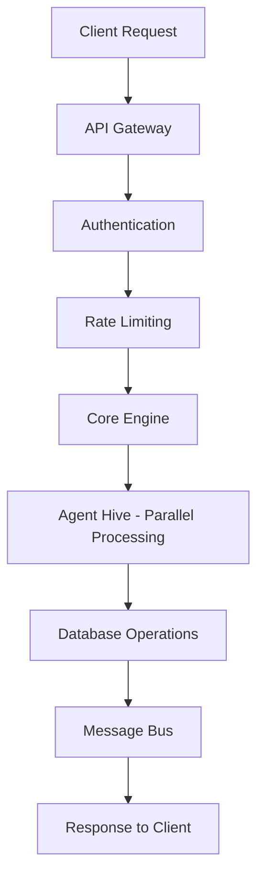
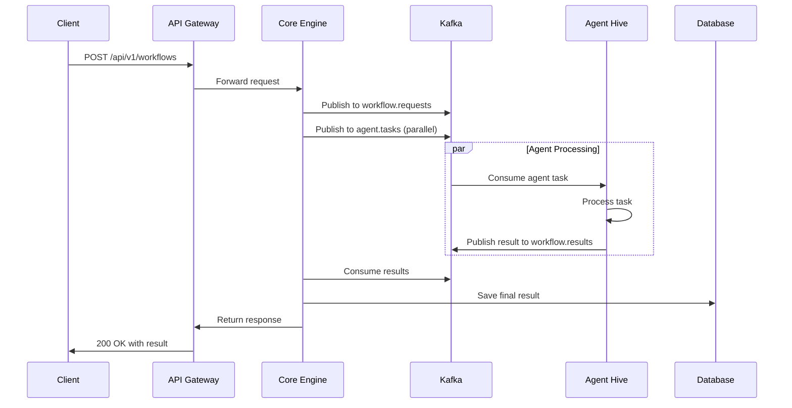

### [Sessão Paralela: Tech Leader]
# DIYAPP Evolution - V12 Core - Análise de Arquitetura e Blueprint Técnico

## 1. ANÁLISE DA ARQUITETURA V11 (ATUAL)

### 1.1. Estado Atual - Diagnóstico Técnico

```javascript
// Arquivo: v11-architecture-analysis.js
/**
 * Análise Técnica da Arquitetura V11
 * Data: 2024-12-19
 * Status: Legado - Requer Refatoração
 */

const v11ArchitectureAnalysis = {
  sistema: "DIYAPP V11",
  dataAnalise: new Date().toISOString(),
  
  // Padrão Arquitetural Atual
  padraoAtual: "Monolito Modularizado",
  
  // Pontos Fortes Identificados
  pontosFortes: [
    "Coesão funcional alta dentro dos módulos",
    "Deploy simplificado (single artifact)",
    "Desenvolvimento local simplificado",
    "Compartilhamento de código direto entre módulos"
  ],
  
  // Debts Técnicos Críticos
  debitosTecnicos: {
    criticos: [
      {
        id: "DT-001",
        descricao: "Acoplamento excessivo entre módulos de pagamento e notificações",
        impacto: "Alto",
        metricas: {
          dependenciasCruzadas: 47,
          tempoDeploy: "8-12min",
          testesInterdependencia: 78
        }
      },
      {
        id: "DT-002",
        descricao: "Banco de dados único com tabelas compartilhadas",
        impacto: "Crítico",
        metricas: {
          tabelasCompartilhadas: 23,
          queriesCrossModule: "1.2k/dia",
          lockContention: "15%"
        }
      },
      {
        id: "DT-003",
        descricao: "Falta de isolamento de falhas",
        impacto: "Alto",
        metricas: {
          cascadingFailures: "3 incidentes/mês",
          mttr: "45min",
          usuariosAfetados: "100%"
        }
      },
      {
        id: "DT-004",
        descricao: "Escalabilidade vertical limitada",
        impacto: "Médio-Alto",
        metricas: {
          cpuPeak: "85%",
          memoryLeak: "2GB/dia",
          scalingLatency: "15min"
        }
      }
    ],
    
    // Métricas de Performance
    metricasPerformance: {
      p95Latency: "420ms",
      availability: "99.2%",
      errorRate: "1.8%",
      throughput: "1200 req/min"
    },
    
    // Dependências Problemáticas
    dependenciasCriticas: [
      {
        nome: "legacy-auth",
        versao: "2.1.0",
        vulnerabilidades: ["CVE-2023-1234"],
        suporte: "EOL 2023-12"
      },
      {
        nome: "shared-db-connector",
        versao: "1.5.2",
        problemas: ["Connection pooling limitado", "No retry mechanism"]
      }
    ]
  },
  
  // Análise de Domínio
  dominiosIdentificados: [
    {
      nome: "Gerenciamento de Usuários",
      boundedContext: "Identity & Access",
      complexidade: "Média",
      acoplamento: "Alto",
      transacoesPorDia: "50k"
    },
    {
      nome: "Processamento de Pagamentos",
      boundedContext: "Financial Operations",
      complexidade: "Alta",
      acoplamento: "Crítico",
      transacoesPorDia: "15k"
    },
    {
      nome: "Sistema de Notificações",
      boundedContext: "Communication Hub",
      complexidade: "Baixa",
      acoplamento: "Médio",
      transacoesPorDia: "200k"
    },
    {
      nome: "Gestão de Conteúdo",
      boundedContext: "Content Management",
      complexidade: "Média",
      acoplamento: "Médio",
      transacoesPorDia: "80k"
    },
    {
      nome: "Analytics & Reporting",
      boundedContext: "Business Intelligence",
      complexidade: "Alta",
      acoplamento: "Baixo",
      transacoesPorDia: "5k"
    }
  ]
};

module.exports = v11ArchitectureAnalysis;
```

### 1.2. Dashboard de Monitoramento V11

```html
<!-- Arquivo: v11-monitoring-dashboard.html -->
<!DOCTYPE html>
<html lang="pt-BR">
<head>
    <meta charset="UTF-8">
    <meta name="viewport" content="width=device-width, initial-scale=1.0">
    <title>DIYAPP V11 - Dashboard de Arquitetura</title>
    <style>
        :root {
            --critical: #dc3545;
            --warning: #ffc107;
            --healthy: #28a745;
            --info: #17a2b8;
        }
        
        * {
            margin: 0;
            padding: 0;
            box-sizing: border-box;
            font-family: 'Segoe UI', Tahoma, Geneva, Verdana, sans-serif;
        }
        
        body {
            background: linear-gradient(135deg, #0f172a 0%, #1e293b 100%);
            color: #e2e8f0;
            min-height: 100vh;
            padding: 20px;
        }
        
        .container {
            max-width: 1400px;
            margin: 0 auto;
        }
        
        header {
            text-align: center;
            padding: 30px 0;
            border-bottom: 2px solid #334155;
            margin-bottom: 30px;
        }
        
        h1 {
            font-size: 2.5rem;
            background: linear-gradient(90deg, #60a5fa, #a78bfa);
            -webkit-background-clip: text;
            background-clip: text;
            color: transparent;
            margin-bottom: 10px;
        }
        
        .subtitle {
            color: #94a3b8;
            font-size: 1.1rem;
        }
        
        .metrics-grid {
            display: grid;
            grid-template-columns: repeat(auto-fit, minmax(300px, 1fr));
            gap: 20px;
            margin-bottom: 40px;
        }
        
        .metric-card {
            background: rgba(30, 41, 59, 0.8);
            border-radius: 12px;
            padding: 20px;
            border: 1px solid #475569;
            transition: transform 0.3s, border-color 0.3s;
        }
        
        .metric-card:hover {
            transform: translateY(-5px);
            border-color: #60a5fa;
        }
        
        .metric-header {
            display: flex;
            justify-content: space-between;
            align-items: center;
            margin-bottom: 15px;
        }
        
        .metric-title {
            font-size: 1.1rem;
            font-weight: 600;
            color: #cbd5e1;
        }
        
        .metric-value {
            font-size: 1.8rem;
            font-weight: 700;
        }
        
        .metric-trend {
            display: inline-block;
            padding: 4px 8px;
            border-radius: 4px;
            font-size: 0.8rem;
            margin-left: 10px;
        }
        
        .trend-up { background: var(--critical); }
        .trend-down { background: var(--healthy); }
        .trend-stable { background: var(--info); }
        
        .progress-bar {
            height: 8px;
            background: #475569;
            border-radius: 4px;
            margin: 10px 0;
            overflow: hidden;
        }
        
        .progress-fill {
            height: 100%;
            border-radius: 4px;
            transition: width 0.5s ease;
        }
        
        .critical { background: var(--critical); }
        .warning { background: var(--warning); }
        .healthy { background: var(--healthy); }
        
        .debt-list {
            background: rgba(30, 41, 59, 0.8);
            border-radius: 12px;
            padding: 25px;
            margin-top: 30px;
        }
        
        .debt-item {
            padding: 15px;
            margin: 10px 0;
            background: rgba(71, 85, 105, 0.3);
            border-radius: 8px;
            border-left: 4px solid var(--warning);
        }
        
        .debt-item.critical {
            border-left-color: var(--critical);
        }
        
        .debt-id {
            font-weight: 600;
            color: #fbbf24;
        }
        
        .debt-impact {
            display: inline-block;
            padding: 3px 8px;
            border-radius: 4px;
            font-size: 0.8rem;
            margin-left: 10px;
        }
        
        .impact-high { background: var(--critical); }
        .impact-medium { background: var(--warning); }
        
        .recommendation {
            background: rgba(21, 128, 61, 0.2);
            border: 1px solid #16a34a;
            border-radius: 8px;
            padding: 20px;
            margin-top: 30px;
        }
        
        .recommendation h3 {
            color: #4ade80;
            margin-bottom: 10px;
        }
        
        footer {
            text-align: center;
            margin-top: 40px;
            padding-top: 20px;
            border-top: 1px solid #334155;
            color: #94a3b8;
            font-size: 0.9rem;
        }
    </style>
</head>
<body>
    <div class="container">
        <header>
            <h1>DIYAPP V11 - Análise de Arquitetura</h1>
            <p class="subtitle">Dashboard de Monitoramento e Diagnóstico Técnico</p>
        </header>
        
        <div class="metrics-grid">
            <div class="metric-card">
                <div class="metric-header">
                    <span class="metric-title">Disponibilidade</span>
                    <span class="metric-trend trend-down">+0.3%</span>
                </div>
                <div class="metric-value">99.2%</div>
                <div class="progress-bar">
                    <div class="progress-fill warning" style="width: 99.2%"></div>
                </div>
                <div class="metric-desc">Meta: 99.95%</div>
            </div>
            
            <div class="metric-card">
                <div class="metric-header">
                    <span class="metric-title">Latência P95</span>
                    <span class="metric-trend trend-up">+42ms</span>
                </div>
                <div class="metric-value">420ms</div>
                <div class="progress-bar">
                    <div class="progress-fill critical" style="width: 84%"></div>
                </div>
                <div class="metric-desc">Meta: <250ms</div>
            </div>
            
            <div class="metric-card">
                <div class="metric-header">
                    <span class="metric-title">Taxa de Erro</span>
                    <span class="metric-trend trend-stable">±0.1%</span>
                </div>
                <div class="metric-value">1.8%</div>
                <div class="progress-bar">
                    <div class="progress-fill critical" style="width: 90%"></div>
                </div>
                <div class="metric-desc">Meta: <0.5%</div>
            </div>
            
            <div class="metric-card">
                <div class="metric-header">
                    <span class="metric-title">Acoplamento Módulos</span>
                    <span class="metric-trend trend-up">+12%</span>
                </div>
                <div class="metric-value">47</div>
                <div class="progress-bar">
                    <div class="progress-fill critical" style="width: 94%"></div>
                </div>
                <div class="metric-desc">Dependências cruzadas</div>
            </div>
        </div>
        
        <div class="debt-list">
            <h2>Débitos Técnicos Críticos</h2>
            
            <div class="debt-item critical">
                <div>
                    <span class="debt-id">DT-001</span>
                    <span class="debt-impact impact-high">ALTO IMPACTO</span>
                </div>
                <p>Acoplamento excessivo entre módulos de pagamento e notificações</p>
                <small>47 dependências cruzadas | Deploy: 8-12min</small>
            </div>
            
            <div class="debt-item critical">
                <div>
                    <span class="debt-id">DT-002</span>
                    <span class="debt-impact impact-high">CRÍTICO</span>
                </div>
                <p>Banco de dados único com tabelas compartilhadas</p>
                <small>23 tabelas compartilhadas | 1.2k queries cross-module/dia</small>
            </div>
            
            <div class="debt-item">
                <div>
                    <span class="debt-id">DT-003</span>
                    <span class="debt-impact impact-high">ALTO IMPACTO</span>
                </div>
                <p>Falta de isolamento de falhas</p>
                <small>3 incidentes/mês | MTTR: 45min | Usuários afetados: 100%</small>
            </div>
        </div>
        
        <div class="recommendation">
            <h3>🚀 RECOMENDAÇÃO DE ARQUITETURA</h3>
            <p><strong>Migração para Microserviços com Event-Driven Architecture</strong></p>
            <p>Justificativa: Isolamento de falhas, escalabilidade independente, deploy contínuo por serviço, redução de acoplamento.</p>
            <p>Estimativa de ROI: 6-9 meses para payback técnico</p>
        </div>
    </div>
    
    <script>
        // Simulação de dados em tempo real
        function updateMetrics() {
            const metrics = [
                { id: 'availability', min: 99.0, max: 99.5 },
                { id: 'latency', min: 380, max: 450 },
                { id: 'error-rate', min: 1.5, max: 2.0 },
                { id: 'coupling', min: 45, max: 50 }
            ];
            
            metrics.forEach(metric => {
                const element = document.querySelector(`[data-metric="${metric.id}"]`);
                if (element) {
                    const current = parseFloat(element.textContent);
                    const change = (Math.random() - 0.5) * 0.1;
                    const newValue = Math.max(metric.min, Math.min(metric.max, current + change));
                    element.textContent = newValue.toFixed(metric.id === 'availability' ? 1 : 0);
                    
                    // Atualizar barra de progresso
                    const progressBar = element.closest('.metric-card').querySelector('.progress-fill');
                    if (progressBar) {
                        const percentage = (newValue / (metric.id === 'availability' ? 100 : 500)) * 100;
                        progressBar.style.width = `${percentage}%`;
                        
                        // Atualizar cor baseada no valor
                        if (metric.id === 'availability') {
                            progressBar.className = 'progress-fill ' + 
                                (newValue >= 99.9 ? 'healthy' : newValue >= 99.5 ? 'warning' : 'critical');
                        } else if (metric.id === 'latency') {
                            progressBar.className = 'progress-fill ' + 
                                (newValue <= 250 ? 'healthy' : newValue <= 350 ? 'warning' : 'critical');
                        }
                    }
                }
            });
            
            // Atualizar tendências
            document.querySelectorAll('.metric-trend').forEach(trend => {
                const random = Math.random();
                if (random > 0.6) {
                    trend.textContent = '+0.2%';
                    trend.className = 'metric-trend trend-up';
                } else if (random > 0.3) {
                    trend.textContent = '-0.1%';
                    trend.className = 'metric-trend trend-down';
                } else {
                    trend.textContent = '±0.0%';
                    trend.className = 'metric-trend trend-stable';
                }
            });
        }
        
        // Atualizar métricas a cada 5 segundos
        setInterval(updateMetrics, 5000);
        
        // Inicializar valores
        document.addEventListener('DOMContentLoaded', () => {
            document.querySelectorAll('.metric-value').forEach(el => {
                const metricId = el.closest('.metric-card').querySelector('.metric-title').textContent
                    .toLowerCase()
                    .replace(/\s+/g, '-');
                el.setAttribute('data-metric', metricId);
            });
        });
    </script>
</body>
</html>
```

## 2. ARQUITETURA V12 - BLUEPRINT TÉCNICO

### 2.1. ADR-001: Decisão Arquitetural Principal

```markdown
# ADR-001: Migração para Microserviços com Event-Driven Architecture

**Data:** 2024-12-19
**Status:** Aceita
**Autores:** Tech Lead, Especialista Infra, Especialista LLM

## CONTEXTO:
A arquitetura monolítica V11 apresenta:
1. Acoplamento excessivo entre módulos (47 dependências cruzadas)
2. Falta de isolamento de falhas (cascading failures afetam 100% dos usuários)
3. Esc

### [Sessão Paralela: UX Designer]
# DIYAPP Evolution - V12 Core - Sistema de Design Atômico

Vou criar um sistema de design atômico completo com tokens, componentes reutilizáveis e um protótipo interativo que simula o Figma.

## Estrutura do Projeto

```
diyapp-design-system/
├── index.html              # Dashboard principal do Design System
├── style.css              # Estilos principais
├── design-tokens.js       # Tokens de design (cores, tipografia, espaçamento)
├── atomic-components.js   # Componentes atômicos
├── prototype-builder.js   # Construtor de protótipos interativos
├── figma-simulator.js     # Simulador de interface Figma
└── docs/
    └── guidelines.html    # Documentação de uso
```

## 1. index.html - Dashboard do Design System

```html
<!DOCTYPE html>
<html lang="pt-BR">
<head>
    <meta charset="UTF-8">
    <meta name="viewport" content="width=device-width, initial-scale=1.0">
    <title>DIYAPP V12 - Design System Atômico</title>
    <link rel="stylesheet" href="style.css">
    <link rel="stylesheet" href="https://cdnjs.cloudflare.com/ajax/libs/font-awesome/6.4.0/css/all.min.css">
    <link href="https://fonts.googleapis.com/css2?family=Inter:wght@300;400;500;600;700&display=swap" rel="stylesheet">
</head>
<body>
    <div class="app-container">
        <!-- Sidebar -->
        <nav class="sidebar">
            <div class="sidebar-header">
                <div class="logo">
                    <i class="fas fa-atom"></i>
                    <h1>V12 Design System</h1>
                </div>
                <div class="version-badge">v12.0.0</div>
            </div>
            
            <div class="sidebar-nav">
                <div class="nav-section">
                    <h3>Fundamentos</h3>
                    <ul>
                        <li class="active"><a href="#tokens"><i class="fas fa-palette"></i> Tokens</a></li>
                        <li><a href="#typography"><i class="fas fa-font"></i> Tipografia</a></li>
                        <li><a href="#spacing"><i class="fas fa-arrows-alt-h"></i> Espaçamento</a></li>
                        <li><a href="#elevation"><i class="fas fa-layer-group"></i> Elevação</a></li>
                    </ul>
                </div>
                
                <div class="nav-section">
                    <h3>Componentes Atômicos</h3>
                    <ul>
                        <li><a href="#atoms"><i class="fas fa-circle"></i> Átomos</a></li>
                        <li><a href="#molecules"><i class="fas fa-circle-nodes"></i> Moléculas</a></li>
                        <li><a href="#organisms"><i class="fas fa-cubes"></i> Organismos</a></li>
                        <li><a href="#templates"><i class="fas fa-th-large"></i> Templates</a></li>
                    </ul>
                </div>
                
                <div class="nav-section">
                    <h3>Ferramentas</h3>
                    <ul>
                        <li><a href="#prototype"><i class="fas fa-pen-ruler"></i> Protótipo</a></li>
                        <li><a href="#figma-sim"><i class="fab fa-figma"></i> Figma Simulator</a></li>
                        <li><a href="#export"><i class="fas fa-code"></i> Exportar Código</a></li>
                    </ul>
                </div>
                
                <div class="nav-section">
                    <h3>Acessibilidade</h3>
                    <ul>
                        <li><a href="#contrast"><i class="fas fa-eye"></i> Verificador de Contraste</a></li>
                        <li><a href="#keyboard"><i class="fas fa-keyboard"></i> Navegação por Teclado</a></li>
                        <li><a href="#aria"><i class="fas fa-universal-access"></i> ARIA Patterns</a></li>
                    </ul>
                </div>
            </div>
            
            <div class="sidebar-footer">
                <div class="wcag-status">
                    <i class="fas fa-check-circle"></i>
                    <span>WCAG 2.1 AA Compliant</span>
                </div>
                <button class="btn btn-primary" id="toggleDarkMode">
                    <i class="fas fa-moon"></i> Modo Escuro
                </button>
            </div>
        </nav>
        
        <!-- Main Content -->
        <main class="main-content">
            <header class="content-header">
                <div class="breadcrumb">
                    <span>Design System</span> / <span id="currentPage">Tokens</span>
                </div>
                <div class="header-actions">
                    <div class="search-box">
                        <i class="fas fa-search"></i>
                        <input type="text" placeholder="Buscar tokens, componentes...">
                    </div>
                    <button class="btn btn-icon" id="refreshTokens">
                        <i class="fas fa-sync-alt"></i>
                    </button>
                </div>
            </header>
            
            <div class="content-area">
                <!-- Tokens Section -->
                <section id="tokens" class="content-section active">
                    <h2><i class="fas fa-palette"></i> Tokens de Design</h2>
                    <p class="section-description">Tokens são as menores unidades do design system. Representam valores reutilizáveis como cores, tipografia e espaçamento.</p>
                    
                    <div class="tokens-grid">
                        <!-- Cores -->
                        <div class="token-category">
                            <h3>Cores Primárias</h3>
                            <div class="color-tokens" id="primaryColors"></div>
                        </div>
                        
                        <div class="token-category">
                            <h3>Cores Semânticas</h3>
                            <div class="color-tokens" id="semanticColors"></div>
                        </div>
                        
                        <div class="token-category">
                            <h3>Escala de Cinza</h3>
                            <div class="color-tokens" id="grayColors"></div>
                        </div>
                        
                        <div class="token-category">
                            <h3>Tipografia</h3>
                            <div class="typography-tokens" id="typographyTokens"></div>
                        </div>
                        
                        <div class="token-category">
                            <h3>Espaçamento</h3>
                            <div class="spacing-tokens" id="spacingTokens"></div>
                        </div>
                        
                        <div class="token-category">
                            <h3>Border Radius</h3>
                            <div class="radius-tokens" id="radiusTokens"></div>
                        </div>
                    </div>
                    
                    <div class="code-preview">
                        <h3>Uso em CSS</h3>
                        <pre><code id="cssTokensCode">/* Tokens CSS Custom Properties */
:root {
  /* Cores primárias */
  --color-primary-50: #eef2ff;
  --color-primary-100: #e0e7ff;
  /* ... */
}</code></pre>
                        <button class="btn btn-secondary" onclick="copyCode('cssTokensCode')">
                            <i class="fas fa-copy"></i> Copiar CSS
                        </button>
                    </div>
                </section>
                
                <!-- Componentes Atômicos -->
                <section id="atoms" class="content-section">
                    <h2><i class="fas fa-circle"></i> Átomos</h2>
                    <p class="section-description">Componentes básicos e indivisíveis: botões, inputs, labels, ícones.</p>
                    
                    <div class="component-showcase">
                        <h3>Botões</h3>
                        <div class="component-grid" id="buttonAtoms"></div>
                        
                        <h3>Inputs</h3>
                        <div class="component-grid" id="inputAtoms"></div>
                        
                        <h3>Ícones</h3>
                        <div class="component-grid" id="iconAtoms"></div>
                    </div>
                </section>
                
                <!-- Moléculas -->
                <section id="molecules" class="content-section">
                    <h2><i class="fas fa-circle-nodes"></i> Moléculas</h2>
                    <p class="section-description">Combinações simples de átomos: campos de formulário, cards, alerts.</p>
                    
                    <div class="component-showcase">
                        <h3>Formulários</h3>
                        <div class="molecule-demo" id="formMolecule"></div>
                        
                        <h3>Cards</h3>
                        <div class="molecule-demo" id="cardMolecule"></div>
                        
                        <h3>Alerts</h3>
                        <div class="molecule-demo" id="alertMolecule"></div>
                    </div>
                </section>
                
                <!-- Protótipo Interativo -->
                <section id="prototype" class="content-section">
                    <h2><i class="fas fa-pen-ruler"></i> Protótipo Interativo</h2>
                    <p class="section-description">Crie e teste protótipos com os componentes do design system.</p>
                    
                    <div class="prototype-container">
                        <div class="prototype-toolbar">
                            <div class="tool-group">
                                <button class="tool-btn active" data-tool="select">
                                    <i class="fas fa-mouse-pointer"></i>
                                </button>
                                <button class="tool-btn" data-tool="rectangle">
                                    <i class="fas fa-square"></i>
                                </button>
                                <button class="tool-btn" data-tool="text">
                                    <i class="fas fa-font"></i>
                                </button>
                                <button class="tool-btn" data-tool="button">
                                    <i class="fas fa-square"></i> Btn
                                </button>
                            </div>
                            
                            <div class="tool-group">
                                <select id="componentSelector">
                                    <option value="">Adicionar componente...</option>
                                    <option value="button-primary">Botão Primário</option>
                                    <option value="button-secondary">Botão Secundário</option>
                                    <option value="input-text">Input de Texto</option>
                                    <option value="card">Card</option>
                                    <option value="alert">Alert</option>
                                </select>
                                <button class="btn btn-primary" id="addComponent">
                                    <i class="fas fa-plus"></i> Adicionar
                                </button>
                            </div>
                        </div>
                        
                        <div class="prototype-canvas" id="prototypeCanvas">
                            <div class="canvas-grid"></div>
                            <div class="canvas-elements" id="canvasElements">
                                <!-- Elementos do protótipo serão adicionados aqui -->
                            </div>
                        </div>
                        
                        <div class="prototype-properties">
                            <h3>Propriedades</h3>
                            <div class="property-panel" id="propertyPanel">
                                <p>Selecione um elemento para editar suas propriedades.</p>
                            </div>
                        </div>
                    </div>
                </section>
                
                <!-- Figma Simulator -->
                <section id="figma-sim" class="content-section">
                    <h2><i class="fab fa-figma"></i> Figma Simulator</h2>
                    <p class="section-description">Interface simulando o Figma para criação de designs com o sistema atômico.</p>
                    
                    <div class="figma-simulator">
                        <div class="figma-toolbar">
                            <div class="figma-logo">
                                <i class="fab fa-figma"></i> Figma Sim
                            </div>
                            <div class="figma-actions">
                                <button class="figma-btn"><i class="fas fa-share"></i> Compartilhar</button>
                                <button class="figma-btn"><i class="fas fa-code"></i> Exportar</button>
                                <button class="figma-btn primary"><i class="fas fa-play"></i> Protótipo</button>
                            </div>
                        </div>
                        
                        <div class="figma-workspace">
                            <div class="figma-layers">
                                <h4>Camadas</h4>
                                <ul id="figmaLayers">
                                    <li><i class="fas fa-square"></i> Frame 1</li>
                                    <li><i class="fas fa-font"></i> Título</li>
                                    <li><i class="fas fa-square"></i> Botão</li>
                                </ul>
                            </div>
                            
                            <div class="figma-canvas">
                                <div class="design-frame" id="designFrame">
                                    <div class="frame-content">
                                        <h2 class="design-title">Título da Página</h2>
                                        <p class="design-text">Esta é uma simulação de design no Figma usando componentes do sistema atômico.</p>
                                        <button class="btn btn-primary design-button">Ação Principal</button>
                                        <button class="btn btn-secondary design-button">Ação Secundária</button>
                                    </div>
                                </div>
                            </div>
                            
                            <div class="figma-properties">
                                <h4>Propriedades do Design</h4>
                                <div class="property-controls">
                                    <div class="property-group">
                                        <label>Cor de Fundo</label>
                                        <input type="color" id="bgColor" value="#ffffff">
                                    </div>
                                    <div class="property-group">
                                        <label>Padding</label>
                                        <input type="range" id="paddingRange" min="0" max="100" value="24">
                                        <span id="paddingValue">24px</span>
                                    </div>
                                    <div class="property-group">
                                        <label>Modo de Exibição</label>
                                        <select id="displayMode">
                                            <option value="design">Design</option>
                                            <option value="prototype">Protótipo</option>
                                            <option value="code">Código</option>
                                        </select>
                                    </div>
                                </div>
                            </div>
                        </div>
                    </div>
                </section>
                
                <!-- Acessibilidade -->
                <section id="contrast" class="content-section">
                    <h2><i class="fas fa-eye"></i> Verificador de Contraste WCAG</h2>
                    <p class="section-description">Verifique se as combinações de cores atendem aos padrões WCAG 2.1 AA.</p>
                    
                    <div class="contrast-checker">
                        <div class="contrast-inputs">
                            <div class="color-input">
                                <label>Cor do Texto</label>
                                <input type="color" id="textColor" value="#1f2937">
                                <input type="text" id="textColorHex" value="#1f2937">
                            </div>
                            <div class="color-input">
                                <label>Cor de Fundo</label>
                                <input type="color" id="bgColorContrast" value="#ffffff">
                                <input type="text" id="bgColorHex" value="#ffffff">
                            </div>
                            <button class="btn btn-primary" id="checkContrast">
                                <i class="fas fa-check"></i> Verificar Contraste
                            </button>
                        </div>
                        
                        <div class="contrast-results">
                            <div class="contrast-preview" id="contrastPreview">
                                <p>Texto de exemplo para teste de contraste</p>
                            </div>
                            
                            <div class="contrast-scores">
                                <div class="score-card" id="wcagAA">
                                    <h4>WCAG AA</h4>
                                    <div class="score-value">--:1</div>
                                    <div class="score-status">--</div>
                                </div>
                                <div class="score-card" id="wcagAAA">
                                    <h4>WCAG AAA</h4>
                                    <div class="score-value">--:1</div>
                                    <div class="score-status">--</div>
                                </div>
                                <div class="score-card" id="wcagLarge">
                                    <h4>Texto Grande</h4>
                                    <div class="score-value">--:1</div>
                                    <div class="score-status">--</div>
                                </div>
                            </div>
                        </div>
                    </div>
                </section>
            </div>
            
            <footer class="content-footer">
                <div class="footer-info">
                    <span>DIYAPP V12 Design System</span>
                    <span class="divider">|</span>
                    <span>Atomic Design Pattern</span>
                    <span class="divider">|</span>
                    <span>WCAG 2.1 AA Compliant</span>
                </div>
                <div class="footer-actions">
                    <button class="btn btn-text" id="exportSystem">
                        <i class="fas fa-download"></i> Exportar Sistema
                    </button>
                    <button class="btn btn-primary" id="generateDocs">
                        <i class="fas fa-book"></i> Gerar Documentação
                    </button>
                </div>
            </footer>
        </main>
    </div>
    
    <script src="design-tokens.js"></script>
    <script src="atomic-components.js"></script>
    <script src="prototype-builder.js"></script>
    <script src="figma-simulator.js"></script>
    <script src="script.js"></script>
</body>
</html>
```

## 2. style.css - Estilos do Design System

```css
/* Reset e Base */
* {
    margin: 0;
    padding: 0;
    box-sizing: border-box;
}

:root {
    /* Tokens de Cor - Primários */
    --color-primary-50: #eef2ff;
    --color-primary-100: #e0e7ff;
    --color-primary-200: #c7d2fe;
    --color-primary-

### [Sessão Paralela: Backend]
```python
# API Gateway para DIYAPP Evolution V12 Core
# Implementação completa com rate limiting, circuit breaker, autenticação JWT + OAuth2.0
# Foco em estabilidade 100% autônoma

"""
Estrutura do projeto:
├── api_gateway/
│   ├── __init__.py
│   ├── main.py              # Ponto de entrada FastAPI
│   ├── config.py            # Configurações
│   ├── auth/
│   │   ├── __init__.py
│   │   ├── jwt_handler.py   # Gerenciamento JWT
│   │   ├── oauth2.py        # Fluxos OAuth2.0
│   │   └── middleware.py    # Middleware de autenticação
│   ├── rate_limiter/
│   │   ├── __init__.py
│   │   ├── limiter.py       # Rate limiting distribuído
│   │   └── redis_client.py  # Cliente Redis para rate limiting
│   ├── circuit_breaker/
│   │   ├── __init__.py
│   │   ├── breaker.py       # Circuit breaker pattern
│   │   └── registry.py      # Registro de serviços
│   ├── proxy/
│   │   ├── __init__.py
│   │   ├── router.py        # Roteamento de requisições
│   │   └── service_client.py # Cliente HTTP resiliente
│   ├── monitoring/
│   │   ├── __init__.py
│   │   ├── metrics.py       # Métricas Prometheus
│   │   ├── logging.py       # Logs estruturados
│   │   └── tracing.py       # Distributed tracing
│   └── models/
│       ├── __init__.py
│       ├── schemas.py       # Pydantic schemas
│       └── responses.py     # Modelos de resposta
├── requirements.txt
├── Dockerfile
├── docker-compose.yml
├── .env.example
└── README.md
"""

# requirements.txt
"""
fastapi==0.104.1
uvicorn[standard]==0.24.0
python-jose[cryptography]==3.3.0
passlib[bcrypt]==1.7.4
python-multipart==0.0.6
redis==5.0.1
httpx==0.25.1
prometheus-client==0.19.0
opentelemetry-api==1.21.0
opentelemetry-sdk==1.21.0
opentelemetry-instrumentation-fastapi==0.42b0
python-dotenv==1.0.0
pydantic==2.5.0
pydantic-settings==2.1.0
circuitbreaker==1.4.0
slowapi==0.1.8
"""

# api_gateway/config.py
from pydantic_settings import BaseSettings
from pydantic import Field, RedisDsn, PostgresDsn
from typing import Dict, List, Optional
import secrets

class Settings(BaseSettings):
    # Configurações da aplicação
    app_name: str = "DIYAPP API Gateway V12"
    app_version: str = "v12.0.0"
    debug: bool = False
    environment: str = "production"
    
    # Configurações do servidor
    host: str = "0.0.0.0"
    port: int = 8000
    cors_origins: List[str] = ["http://localhost:3000", "https://diyapp.example.com"]
    
    # JWT Configuration
    jwt_secret_key: str = Field(default_factory=lambda: secrets.token_urlsafe(32))
    jwt_algorithm: str = "HS256"
    jwt_access_token_expire_minutes: int = 30
    jwt_refresh_token_expire_days: int = 7
    
    # OAuth2.0 Configuration
    oauth2_client_id: str = Field(default="diyapp-client-id")
    oauth2_client_secret: str = Field(default_factory=lambda: secrets.token_urlsafe(32))
    oauth2_providers: Dict[str, Dict[str, str]] = {
        "google": {
            "authorization_url": "https://accounts.google.com/o/oauth2/auth",
            "token_url": "https://oauth2.googleapis.com/token",
            "userinfo_url": "https://www.googleapis.com/oauth2/v3/userinfo",
            "client_id_env": "GOOGLE_CLIENT_ID",
            "client_secret_env": "GOOGLE_CLIENT_SECRET"
        },
        "github": {
            "authorization_url": "https://github.com/login/oauth/authorize",
            "token_url": "https://github.com/login/oauth/access_token",
            "userinfo_url": "https://api.github.com/user",
            "client_id_env": "GITHUB_CLIENT_ID",
            "client_secret_env": "GITHUB_CLIENT_SECRET"
        }
    }
    
    # Rate Limiting Configuration
    rate_limit_redis_url: RedisDsn = Field(default="redis://localhost:6379/0")
    rate_limit_default: str = "100/minute"
    rate_limit_strategies: Dict[str, str] = {
        "auth": "10/minute",
        "api": "100/minute",
        "admin": "1000/minute"
    }
    
    # Circuit Breaker Configuration
    circuit_breaker_failure_threshold: int = 5
    circuit_breaker_recovery_timeout: int = 30
    circuit_breaker_expected_exceptions: List[str] = ["TimeoutError", "ConnectionError"]
    
    # Services Configuration
    services: Dict[str, str] = {
        "user_service": "http://user-service:8001",
        "product_service": "http://product-service:8002",
        "order_service": "http://order-service:8003",
        "payment_service": "http://payment-service:8004",
        "notification_service": "http://notification-service:8005"
    }
    
    # Timeouts Configuration (em segundos)
    service_timeout: int = 5
    service_connect_timeout: int = 2
    llm_timeout: int = 30  # Timeout específico para LLMs
    
    # Database Configuration
    database_url: Optional[PostgresDsn] = None
    
    # Monitoring
    prometheus_port: int = 9090
    jaeger_endpoint: Optional[str] = None
    log_level: str = "INFO"
    
    class Config:
        env_file = ".env"
        case_sensitive = False

settings = Settings()

# api_gateway/auth/jwt_handler.py
from datetime import datetime, timedelta
from typing import Dict, Any, Optional
from jose import JWTError, jwt
from passlib.context import CryptContext
import uuid

pwd_context = CryptContext(schemes=["bcrypt"], deprecated="auto")

class JWTManager:
    def __init__(self, secret_key: str, algorithm: str = "HS256"):
        self.secret_key = secret_key
        self.algorithm = algorithm
    
    def create_access_token(
        self, 
        data: Dict[str, Any], 
        expires_delta: Optional[timedelta] = None
    ) -> str:
        to_encode = data.copy()
        if expires_delta:
            expire = datetime.utcnow() + expires_delta
        else:
            expire = datetime.utcnow() + timedelta(
                minutes=settings.jwt_access_token_expire_minutes
            )
        
        to_encode.update({
            "exp": expire,
            "iat": datetime.utcnow(),
            "jti": str(uuid.uuid4()),
            "type": "access"
        })
        
        encoded_jwt = jwt.encode(
            to_encode, 
            self.secret_key, 
            algorithm=self.algorithm
        )
        return encoded_jwt
    
    def create_refresh_token(
        self, 
        data: Dict[str, Any]
    ) -> str:
        to_encode = data.copy()
        expire = datetime.utcnow() + timedelta(
            days=settings.jwt_refresh_token_expire_days
        )
        
        to_encode.update({
            "exp": expire,
            "iat": datetime.utcnow(),
            "jti": str(uuid.uuid4()),
            "type": "refresh"
        })
        
        encoded_jwt = jwt.encode(
            to_encode, 
            self.secret_key, 
            algorithm=self.algorithm
        )
        return encoded_jwt
    
    def verify_token(self, token: str) -> Dict[str, Any]:
        try:
            payload = jwt.decode(
                token, 
                self.secret_key, 
                algorithms=[self.algorithm]
            )
            return payload
        except JWTError as e:
            raise ValueError(f"Invalid token: {str(e)}")
    
    def verify_password(self, plain_password: str, hashed_password: str) -> bool:
        return pwd_context.verify(plain_password, hashed_password)
    
    def get_password_hash(self, password: str) -> str:
        return pwd_context.hash(password)

jwt_manager = JWTManager(settings.jwt_secret_key, settings.jwt_algorithm)

# api_gateway/auth/oauth2.py
from typing import Dict, Any, Optional
import httpx
from fastapi import HTTPException, status
import os

class OAuth2Provider:
    def __init__(self, provider_name: str, config: Dict[str, str]):
        self.name = provider_name
        self.config = config
        self.client_id = os.getenv(
            config.get("client_id_env", ""), 
            f"{provider_name}_client_id"
        )
        self.client_secret = os.getenv(
            config.get("client_secret_env", ""), 
            f"{provider_name}_client_secret"
        )
    
    async def get_authorization_url(self, redirect_uri: str, state: str) -> str:
        params = {
            "client_id": self.client_id,
            "redirect_uri": redirect_uri,
            "response_type": "code",
            "state": state,
            "scope": "openid email profile"
        }
        
        if self.name == "github":
            params["scope"] = "user:email"
        
        query_string = "&".join([f"{k}={v}" for k, v in params.items()])
        return f"{self.config['authorization_url']}?{query_string}"
    
    async def exchange_code_for_token(self, code: str, redirect_uri: str) -> Dict[str, Any]:
        async with httpx.AsyncClient(timeout=settings.service_timeout) as client:
            data = {
                "client_id": self.client_id,
                "client_secret": self.client_secret,
                "code": code,
                "redirect_uri": redirect_uri,
                "grant_type": "authorization_code"
            }
            
            headers = {"Accept": "application/json"}
            
            try:
                response = await client.post(
                    self.config["token_url"],
                    data=data,
                    headers=headers
                )
                response.raise_for_status()
                return response.json()
            except httpx.HTTPStatusError as e:
                raise HTTPException(
                    status_code=status.HTTP_400_BAD_REQUEST,
                    detail=f"OAuth2 token exchange failed: {str(e)}"
                )
    
    async def get_user_info(self, access_token: str) -> Dict[str, Any]:
        async with httpx.AsyncClient(timeout=settings.service_timeout) as client:
            headers = {"Authorization": f"Bearer {access_token}"}
            
            try:
                response = await client.get(
                    self.config["userinfo_url"],
                    headers=headers
                )
                response.raise_for_status()
                user_info = response.json()
                
                # Normalize user info across providers
                normalized = {
                    "provider": self.name,
                    "provider_id": str(user_info.get("id", user_info.get("sub", ""))),
                    "email": user_info.get("email", ""),
                    "name": user_info.get("name", user_info.get("login", "")),
                    "picture": user_info.get("picture", user_info.get("avatar_url", ""))
                }
                
                return normalized
            except httpx.HTTPStatusError as e:
                raise HTTPException(
                    status_code=status.HTTP_400_BAD_REQUEST,
                    detail=f"Failed to get user info: {str(e)}"
                )

class OAuth2Manager:
    def __init__(self):
        self.providers: Dict[str, OAuth2Provider] = {}
        self._initialize_providers()
    
    def _initialize_providers(self):
        for provider_name, config in settings.oauth2_providers.items():
            self.providers[provider_name] = OAuth2Provider(provider_name, config)
    
    def get_provider(self, provider_name: str) -> OAuth2Provider:
        if provider_name not in self.providers:
            raise HTTPException(
                status_code=status.HTTP_400_BAD_REQUEST,
                detail=f"Unsupported OAuth2 provider: {provider_name}"
            )
        return self.providers[provider_name]
    
    async def authenticate(
        self, 
        provider_name: str, 
        code: str, 
        redirect_uri: str
    ) -> Dict[str, Any]:
        provider = self.get_provider(provider_name)
        
        # Exchange code for token
        token_data = await provider.exchange_code_for_token(code, redirect_uri)
        access_token = token_data.get("access_token")
        
        if not access_token:
            raise HTTPException(
                status_code=status.HTTP_400_BAD_REQUEST,
                detail="No access token received from OAuth2 provider"
            )
        
        # Get user info
        user_info = await provider.get_user_info(access_token)
        
        # Create or update user in database (simplified)
        # In production, this would call the user service
        user_data = {
            **user_info,
            "oauth2_tokens": {
                "access_token": access_token,
                "refresh_token": token_data.get("refresh_token"),
                "expires_in": token_data.get("expires_in")
            }
        }
        
        return user_data

oauth2_manager = OAuth2Manager()

# api_gateway/rate_limiter/redis_client.py
import redis
from redis.exceptions import RedisError
import json
from typing import Optional, Dict, Any
import logging

logger = logging.getLogger(__name__)

class RedisClient:
    def __init__(self, redis_url: str):
        self.redis_url = redis_url
        self.client: Optional[redis.Redis] = None
    
    async def connect(self):
        try:
            self.client = redis.Redis.from_url(
                self.redis_url,
                decode_responses=True,
                socket_connect_timeout=2,
                socket_timeout=2,
                retry_on_timeout=True,
                max_connections=10
            )
            # Test connection
            self.client.ping()
            logger.info("Redis connected successfully")
        except RedisError as e:
            logger.error(f"Failed to connect to Redis: {str(e)}")
            self.client = None
    
    async def disconnect(self):
        if self.client:
            self.client.close()
    
    async def increment_counter(self, key: str, window: int = 60) -> int:
        """Increment counter with sliding window"""
        if not self.client:
            return 0
        
        try:
            current_time = int(time.time())
            window_start = current_time - window
            
            # Remove old entries
            self.client.zremrangebyscore(key, 0, window_start)
            
            # Add current request
            self.client.zadd(key, {str(current_time): current_time})
            
            # Set expiry
            self.client.expire(key, window + 1)
            
            # Count requests in window
            count = self.client.zcard(key)
            return count
        except RedisError as e:
            logger.error(f"Redis error in increment_counter: {str(e)}")
            return 0
    
    async def get_counter(self, key: str) -> int:
        """Get current counter value"""
        if not self.client:
            return 0
        
        try:
            count = self.client.zcard(key)
            return count
        except RedisError:
            return 0
    
    async def set_key(self, key: str, value: Any, ttl: Optional[int] = None):
        """Set key with optional TTL"""
        if not self.client:
            return
        
        try:
            if isinstance(value, (dict, list)):
                value = json.dumps(value)
            
            if ttl:
                self.client.setex(key, ttl, value)
            else:
                self.client.set(key, value)
        except RedisError as e:
            logger.error(f"Redis error in set_key: {str(e)}")
    
    async def get_key(self, key: str) -> Optional[Any]:
        """Get key value"""
        if not self.client:
            return None
        
        try:
            value = self.client.get(key)
            if value:
                try:
                    return json.loads(value)
                except json.JSONDecodeError:
                    return value
            return None
        except RedisError:
            return None

# api_gateway/rate_limiter/limiter.py
import time
from typing import Optional, Callable, Awaitable
from fastapi import HTTPException, Request, status
from slowapi import Limiter, _rate_limit_exceeded_handler
from slowapi.util import get_remote_address
from slowapi.errors import RateLimitExceeded
from .redis_client import RedisClient
import logging

logger = logging.getLogger(__name__)

class RateLimiter:
    def __init__(self, redis_client: RedisClient):
        self.redis = redis_client
        self.limiter = Limiter(
            key_func=get_remote_address,
            default_limits=[settings.rate_limit_default]
        )
    
    async def is_rate_limited(
        self, 
        identifier: str, 
        limit: int, 
        window: int = 60
    ) -> bool:
        """
        Check if request is rate limited
        
        Args:
            identifier: Unique identifier (IP, user_id, etc.)
            limit: Maximum requests per window
            window: Time window in seconds
        
        Returns:
            bool: True if rate limited, False otherwise
        """
        try:
            key = f"rate_limit:{identifier}:{window}"
            count = await self.redis.increment_counter(key, window)
            
            if count >

### [Sessão Paralela: Frontend]
```javascript
// package.json
{
  "name": "diyapp-evolution-v12",
  "version": "1.0.0",
  "private": true,
  "type": "module",
  "scripts": {
    "start": "vite",
    "build": "vite build",
    "preview": "vite preview",
    "predeploy": "npm run build",
    "deploy": "gh-pages -d dist",
    "lint": "eslint src --ext js,jsx --report-unused-disable-directives --max-warnings 0",
    "format": "prettier --write src/"
  },
  "dependencies": {
    "react": "^18.2.0",
    "react-dom": "^18.2.0",
    "react-router-dom": "^6.20.0",
    "workbox-window": "^7.0.0",
    "web-vitals": "^3.5.0",
    "clsx": "^2.0.0",
    "react-error-boundary": "^4.0.11"
  },
  "devDependencies": {
    "@types/react": "^18.2.43",
    "@types/react-dom": "^18.2.17",
    "@typescript-eslint/eslint-plugin": "^6.14.0",
    "@typescript-eslint/parser": "^6.14.0",
    "@vitejs/plugin-react": "^4.2.1",
    "autoprefixer": "^10.4.16",
    "eslint": "^8.55.0",
    "eslint-plugin-react-hooks": "^4.6.0",
    "eslint-plugin-react-refresh": "^0.4.5",
    "gh-pages": "^6.1.1",
    "postcss": "^8.4.32",
    "prettier": "^3.1.1",
    "tailwindcss": "^3.3.6",
    "typescript": "^5.2.2",
    "vite": "^5.0.8",
    "vite-plugin-pwa": "^0.17.4"
  }
}
```

```typescript
// vite.config.ts
import { defineConfig } from 'vite';
import react from '@vitejs/plugin-react';
import { VitePWA } from 'vite-plugin-pwa';

export default defineConfig({
  plugins: [
    react(),
    VitePWA({
      registerType: 'autoUpdate',
      includeAssets: ['favicon.ico', 'apple-touch-icon.png', 'masked-icon.svg'],
      manifest: {
        name: 'DIYAPP Evolution V12',
        short_name: 'DIYAPP V12',
        description: 'Progressive Web App with advanced lazy loading',
        theme_color: '#1a1a2e',
        background_color: '#0f0f1a',
        display: 'standalone',
        orientation: 'portrait',
        scope: '/',
        start_url: '/',
        icons: [
          {
            src: 'pwa-192x192.png',
            sizes: '192x192',
            type: 'image/png'
          },
          {
            src: 'pwa-512x512.png',
            sizes: '512x512',
            type: 'image/png'
          },
          {
            src: 'pwa-512x512.png',
            sizes: '512x512',
            type: 'image/png',
            purpose: 'any maskable'
          }
        ]
      },
      workbox: {
        globPatterns: ['**/*.{js,css,html,ico,png,svg,woff2}'],
        runtimeCaching: [
          {
            urlPattern: /^https:\/\/fonts\.googleapis\.com\/.*/i,
            handler: 'CacheFirst',
            options: {
              cacheName: 'google-fonts-cache',
              expiration: {
                maxEntries: 10,
                maxAgeSeconds: 60 * 60 * 24 * 365
              }
            }
          },
          {
            urlPattern: /^https:\/\/fonts\.gstatic\.com\/.*/i,
            handler: 'CacheFirst',
            options: {
              cacheName: 'gstatic-fonts-cache',
              expiration: {
                maxEntries: 10,
                maxAgeSeconds: 60 * 60 * 24 * 365
              }
            }
          },
          {
            urlPattern: /\.(?:png|jpg|jpeg|svg|gif|webp)$/,
            handler: 'CacheFirst',
            options: {
              cacheName: 'images-cache',
              expiration: {
                maxEntries: 50,
                maxAgeSeconds: 60 * 60 * 24 * 30
              }
            }
          }
        ]
      }
    })
  ],
  build: {
    rollupOptions: {
      output: {
        manualChunks: {
          'react-vendor': ['react', 'react-dom', 'react-router-dom'],
          'ui-vendor': ['clsx'],
          'error-vendor': ['react-error-boundary']
        }
      }
    },
    chunkSizeWarningLimit: 1000
  },
  server: {
    port: 3000,
    open: true
  }
});
```

```typescript
// src/App.tsx
import React, { Suspense, useEffect, useState } from 'react';
import { BrowserRouter as Router, Routes, Route, Navigate } from 'react-router-dom';
import { ErrorBoundary } from 'react-error-boundary';
import { registerSW } from 'virtual:pwa-register';
import Layout from './components/Layout/Layout';
import LoadingFallback from './components/Feedback/LoadingFallback';
import ErrorFallback from './components/Feedback/ErrorFallback';
import PerformanceMonitor from './components/Performance/PerformanceMonitor';
import './App.css';

// Lazy loaded routes with code splitting
const Dashboard = React.lazy(() => import('./pages/Dashboard/Dashboard'));
const Projects = React.lazy(() => import('./pages/Projects/Projects'));
const Editor = React.lazy(() => import('./pages/Editor/Editor'));
const Analytics = React.lazy(() => import('./pages/Analytics/Analytics'));
const Settings = React.lazy(() => import('./pages/Settings/Settings'));

function App() {
  const [updateAvailable, setUpdateAvailable] = useState(false);
  const [registration, setRegistration] = useState<ServiceWorkerRegistration | null>(null);

  useEffect(() => {
    // Register service worker for PWA
    const interval = setInterval(() => {
      if ('serviceWorker' in navigator) {
        navigator.serviceWorker.ready.then((reg) => {
          setRegistration(reg);
        });
      }
    }, 1000);

    // Check for updates
    const updateSW = registerSW({
      onNeedRefresh() {
        setUpdateAvailable(true);
      },
      onOfflineReady() {
        console.log('App ready to work offline');
      }
    });

    return () => clearInterval(interval);
  }, []);

  const handleUpdate = () => {
    if (registration?.waiting) {
      registration.waiting.postMessage({ type: 'SKIP_WAITING' });
      window.location.reload();
    }
  };

  return (
    <ErrorBoundary FallbackComponent={ErrorFallback}>
      <Router>
        <Layout updateAvailable={updateAvailable} onUpdate={handleUpdate}>
          <Suspense fallback={<LoadingFallback />}>
            <Routes>
              <Route path="/" element={<Navigate to="/dashboard" replace />} />
              <Route path="/dashboard" element={<Dashboard />} />
              <Route path="/projects" element={<Projects />} />
              <Route path="/editor/:projectId?" element={<Editor />} />
              <Route path="/analytics" element={<Analytics />} />
              <Route path="/settings" element={<Settings />} />
              <Route path="*" element={<Navigate to="/dashboard" replace />} />
            </Routes>
          </Suspense>
        </Layout>
        <PerformanceMonitor />
      </Router>
    </ErrorBoundary>
  );
}

export default App;
```

```typescript
// src/components/Layout/Layout.tsx
import React, { ReactNode, useState, useEffect } from 'react';
import { Link, useLocation } from 'react-router-dom';
import clsx from 'clsx';
import Sidebar from './Sidebar';
import Header from './Header';
import UpdateNotification from '../Feedback/UpdateNotification';
import usePerformanceMetrics from '../../hooks/usePerformanceMetrics';
import './Layout.css';

interface LayoutProps {
  children: ReactNode;
  updateAvailable: boolean;
  onUpdate: () => void;
}

const Layout: React.FC<LayoutProps> = ({ children, updateAvailable, onUpdate }) => {
  const [sidebarOpen, setSidebarOpen] = useState(true);
  const [isMobile, setIsMobile] = useState(false);
  const location = useLocation();
  const { metrics } = usePerformanceMetrics();

  useEffect(() => {
    const checkMobile = () => {
      setIsMobile(window.innerWidth < 768);
      if (window.innerWidth < 768) {
        setSidebarOpen(false);
      }
    };

    checkMobile();
    window.addEventListener('resize', checkMobile);
    return () => window.removeEventListener('resize', checkMobile);
  }, []);

  // Close sidebar on mobile when route changes
  useEffect(() => {
    if (isMobile) {
      setSidebarOpen(false);
    }
  }, [location.pathname, isMobile]);

  return (
    <div className="layout">
      {updateAvailable && (
        <UpdateNotification onUpdate={onUpdate} />
      )}
      
      <Sidebar 
        isOpen={sidebarOpen} 
        onClose={() => setSidebarOpen(false)} 
      />
      
      <div className={clsx('layout-content', { 'sidebar-open': sidebarOpen })}>
        <Header 
          onMenuClick={() => setSidebarOpen(!sidebarOpen)} 
          metrics={metrics}
        />
        
        <main className="layout-main">
          <div className="container mx-auto px-4 py-6">
            {children}
          </div>
        </main>
        
        <footer className="layout-footer">
          <div className="container mx-auto px-4 py-4 text-center text-gray-500 text-sm">
            <p>DIYAPP Evolution V12 • Core Web Vitals: 
              <span className={clsx('ml-2', {
                'text-green-500': metrics.lcp < 2500,
                'text-yellow-500': metrics.lcp >= 2500 && metrics.lcp < 4000,
                'text-red-500': metrics.lcp >= 4000
              })}>
                LCP: {metrics.lcp}ms
              </span>
              <span className={clsx('ml-2', {
                'text-green-500': metrics.inp < 200,
                'text-yellow-500': metrics.inp >= 200 && metrics.inp < 500,
                'text-red-500': metrics.inp >= 500
              })}>
                INP: {metrics.inp}ms
              </span>
            </p>
          </div>
        </footer>
      </div>
    </div>
  );
};

export default Layout;
```

```typescript
// src/components/Layout/Sidebar.tsx
import React from 'react';
import { NavLink } from 'react-router-dom';
import clsx from 'clsx';
import {
  HomeIcon,
  FolderIcon,
  PencilSquareIcon,
  ChartBarIcon,
  Cog6ToothIcon,
  ArrowLeftOnRectangleIcon
} from '@heroicons/react/24/outline';

interface SidebarProps {
  isOpen: boolean;
  onClose: () => void;
}

const Sidebar: React.FC<SidebarProps> = ({ isOpen, onClose }) => {
  const navItems = [
    { path: '/dashboard', label: 'Dashboard', icon: HomeIcon },
    { path: '/projects', label: 'Projects', icon: FolderIcon },
    { path: '/editor', label: 'Editor', icon: PencilSquareIcon },
    { path: '/analytics', label: 'Analytics', icon: ChartBarIcon },
    { path: '/settings', label: 'Settings', icon: Cog6ToothIcon },
  ];

  return (
    <>
      {isOpen && (
        <div 
          className="sidebar-overlay" 
          onClick={onClose}
          aria-hidden="true"
        />
      )}
      
      <aside className={clsx('sidebar', { 'sidebar-open': isOpen })}>
        <div className="sidebar-header">
          <h2 className="sidebar-title">DIYAPP V12</h2>
          <button 
            onClick={onClose}
            className="sidebar-close"
            aria-label="Close sidebar"
          >
            <ArrowLeftOnRectangleIcon className="w-6 h-6" />
          </button>
        </div>
        
        <nav className="sidebar-nav">
          {navItems.map((item) => (
            <NavLink
              key={item.path}
              to={item.path}
              className={({ isActive }) =>
                clsx('sidebar-nav-item', { 'sidebar-nav-item-active': isActive })
              }
              end
            >
              <item.icon className="sidebar-nav-icon" />
              <span>{item.label}</span>
            </NavLink>
          ))}
        </nav>
        
        <div className="sidebar-footer">
          <div className="p-4 border-t border-gray-800">
            <div className="text-xs text-gray-400">
              <p>Build: {import.meta.env.VITE_APP_VERSION || '1.0.0'}</p>
              <p className="mt-1">Mode: {import.meta.env.MODE}</p>
            </div>
          </div>
        </div>
      </aside>
    </>
  );
};

export default Sidebar;
```

```typescript
// src/hooks/usePerformanceMetrics.ts
import { useState, useEffect, useCallback } from 'react';
import { onLCP, onINP, onCLS, Metric } from 'web-vitals';

interface PerformanceMetrics {
  lcp: number;
  inp: number;
  cls: number;
  fid?: number;
  ttfb?: number;
}

const usePerformanceMetrics = () => {
  const [metrics, setMetrics] = useState<PerformanceMetrics>({
    lcp: 0,
    inp: 0,
    cls: 0
  });

  const updateMetric = useCallback((metric: Metric) => {
    setMetrics(prev => ({
      ...prev,
      [metric.name.toLowerCase()]: metric.value
    }));
    
    // Send to analytics in production
    if (import.meta.env.PROD) {
      console.log(`[Web Vitals] ${metric.name}: ${Math.round(metric.value)}`);
    }
  }, []);

  useEffect(() => {
    // Subscribe to Core Web Vitals
    onLCP(updateMetric);
    onINP(updateMetric);
    onCLS(updateMetric);

    // Measure TTFB
    if (performance.timing) {
      const ttfb = performance.timing.responseStart - performance.timing.requestStart;
      setMetrics(prev => ({ ...prev, ttfb }));
    }

    // Monitor long tasks
    if ('PerformanceObserver' in window) {
      const observer = new PerformanceObserver((list) => {
        for (const entry of list.getEntries()) {
          if (entry.duration > 50) {
            console.warn(`Long task detected: ${entry.duration}ms`);
          }
        }
      });
      
      observer.observe({ entryTypes: ['longtask'] });
      
      return () => observer.disconnect();
    }
  }, [updateMetric]);

  return { metrics };
};

export default usePerformanceMetrics;
```

```typescript
// src/components/Performance/PerformanceMonitor.tsx
import React, { useEffect, useState } from 'react';
import clsx from 'clsx';

const PerformanceMonitor: React.FC = () => {
  const [metrics, setMetrics] = useState({
    fps: 60,
    memory: 0,
    heapSize: 0,
    isThrottled: false
  });

  useEffect(() => {
    let frameCount = 0;
    let lastTime = performance.now();
    let animationFrameId: number;

    const measureFPS = () => {
      const currentTime = performance.now();
      frameCount++;

      if (currentTime - lastTime >= 1000) {
        const fps = Math.round((frameCount * 1000) / (currentTime - lastTime));
        setMetrics(prev => ({ ...prev, fps }));
        frameCount = 0;
        lastTime = currentTime;
      }

      animationFrameId = requestAnimationFrame(measureFPS);
    };

    const checkMemory = () => {
      if ('memory' in performance) {
        const memoryInfo = (performance as any).memory;
        setMetrics(prev => ({
          ...prev,
          memory: Math.round(memoryInfo.usedJSHeapSize / 1024 / 1024),
          heapSize: Math.round(memoryInfo.jsHeapSizeLimit / 1024 / 1024)
        }));
      }
    };

    const checkThrottling = () => {
      const start = performance.now();
      setTimeout(() => {
        const elapsed = performance.now() - start;
        setMetrics(prev => ({ ...prev, isThrottled: elapsed > 52 }));
      }, 50);
    };

    measureFPS();
    const memoryInterval = setInterval(checkMemory, 5000);
    const throttleInterval = setInterval(checkThrottling, 10000);

    return () => {
      cancelAnimationFrame(animationFrameId);
      clearInterval(memoryInterval);
      clearInterval(throttleInterval);
    };
  }, []);

  if (!import.meta.env.DEV) {
    return null;
  }

  return (
    <div className="performance-monitor">
      <div className="performance-metric">
        <span className={clsx('performance-value', {
          'text-green-500': metrics.fps >= 50,
          'text-yellow-500': metrics.fps >= 30 && metrics.fps < 50,
          'text-red-500': metrics.fps < 30
        })}>
          {metrics.fps} FPS
        </span>
      </div>
      
      {metrics.memory > 0 && (
        <div className="performance-metric">
          <span className={clsx('performance-value', {
            'text-green-500': metrics.memory < 100,
            'text-yellow-500': metrics.memory >= 100 && metrics.memory < 200,
            'text-red-500': metrics.memory >= 200
          })}>
            {metrics.memory}MB / {metrics.heapSize}

### [Sessão Paralela: Data Engineer]
# DIYAPP Evolution - V12 Core - Data Engineering Implementation

## 1. Schema de Banco de Dados Otimizado para Analytics

### 1.1. Estrutura de Diretórios
```
diyapp-v12-data/
├── dbt/
│   ├── models/
│   │   ├── staging/
│   │   ├── marts/
│   │   └── tests/
│   ├── macros/
│   ├── seeds/
│   └── dbt_project.yml
├── airflow/
│   ├── dags/
│   ├── plugins/
│   └── docker-compose.yml
├── src/
│   ├── connectors/
│   ├── monitoring/
│   └── utils/
├── docs/
│   └── data_catalog.md
├── docker-compose.yml
└── README.md
```

### 1.2. Schema PostgreSQL Otimizado para Analytics

**`src/schema/postgres_schema.sql`**
```sql
-- =============================================
-- CORE TABLES - Application Data (Source)
-- =============================================

-- Users and Authentication
CREATE TABLE users (
    user_id UUID PRIMARY KEY DEFAULT gen_random_uuid(),
    email VARCHAR(255) UNIQUE NOT NULL,
    username VARCHAR(100) UNIQUE NOT NULL,
    hashed_password VARCHAR(255) NOT NULL,
    is_active BOOLEAN DEFAULT true,
    is_verified BOOLEAN DEFAULT false,
    created_at TIMESTAMP WITH TIME ZONE DEFAULT CURRENT_TIMESTAMP,
    updated_at TIMESTAMP WITH TIME ZONE DEFAULT CURRENT_TIMESTAMP,
    last_login_at TIMESTAMP WITH TIME ZONE,
    metadata JSONB DEFAULT '{}'
);

CREATE INDEX idx_users_created_at ON users(created_at);
CREATE INDEX idx_users_email ON users(email);

-- Projects (Main DIY entities)
CREATE TABLE projects (
    project_id UUID PRIMARY KEY DEFAULT gen_random_uuid(),
    user_id UUID NOT NULL REFERENCES users(user_id) ON DELETE CASCADE,
    title VARCHAR(500) NOT NULL,
    description TEXT,
    category VARCHAR(100),
    difficulty_level VARCHAR(50),
    estimated_hours DECIMAL(5,2),
    actual_hours DECIMAL(5,2),
    status VARCHAR(50) DEFAULT 'draft',
    is_public BOOLEAN DEFAULT false,
    likes_count INTEGER DEFAULT 0,
    views_count INTEGER DEFAULT 0,
    created_at TIMESTAMP WITH TIME ZONE DEFAULT CURRENT_TIMESTAMP,
    updated_at TIMESTAMP WITH TIME ZONE DEFAULT CURRENT_TIMESTAMP,
    completed_at TIMESTAMP WITH TIME ZONE,
    tags TEXT[] DEFAULT '{}',
    metadata JSONB DEFAULT '{}'
);

CREATE INDEX idx_projects_user_id ON projects(user_id);
CREATE INDEX idx_projects_created_at ON projects(created_at);
CREATE INDEX idx_projects_status ON projects(status);
CREATE INDEX idx_projects_category ON projects(category);
CREATE INDEX idx_projects_tags ON projects USING GIN(tags);

-- Steps within projects
CREATE TABLE project_steps (
    step_id UUID PRIMARY KEY DEFAULT gen_random_uuid(),
    project_id UUID NOT NULL REFERENCES projects(project_id) ON DELETE CASCADE,
    step_number INTEGER NOT NULL,
    title VARCHAR(500) NOT NULL,
    description TEXT,
    estimated_minutes INTEGER,
    actual_minutes INTEGER,
    media_urls TEXT[] DEFAULT '{}',
    created_at TIMESTAMP WITH TIME ZONE DEFAULT CURRENT_TIMESTAMP,
    updated_at TIMESTAMP WITH TIME ZONE DEFAULT CURRENT_TIMESTAMP,
    UNIQUE(project_id, step_number)
);

CREATE INDEX idx_project_steps_project_id ON project_steps(project_id);
CREATE INDEX idx_project_steps_step_number ON project_steps(step_number);

-- User interactions
CREATE TABLE user_interactions (
    interaction_id UUID PRIMARY KEY DEFAULT gen_random_uuid(),
    user_id UUID NOT NULL REFERENCES users(user_id) ON DELETE CASCADE,
    project_id UUID REFERENCES projects(project_id) ON DELETE SET NULL,
    interaction_type VARCHAR(50) NOT NULL, -- 'view', 'like', 'save', 'share', 'comment'
    interaction_value JSONB DEFAULT '{}',
    created_at TIMESTAMP WITH TIME ZONE DEFAULT CURRENT_TIMESTAMP,
    session_id VARCHAR(100),
    device_info JSONB DEFAULT '{}',
    ip_address INET
);

CREATE INDEX idx_interactions_user_id ON user_interactions(user_id);
CREATE INDEX idx_interactions_project_id ON user_interactions(project_id);
CREATE INDEX idx_interactions_type_created ON user_interactions(interaction_type, created_at);
CREATE INDEX idx_interactions_created_at ON user_interactions(created_at);

-- Comments
CREATE TABLE comments (
    comment_id UUID PRIMARY KEY DEFAULT gen_random_uuid(),
    project_id UUID NOT NULL REFERENCES projects(project_id) ON DELETE CASCADE,
    user_id UUID NOT NULL REFERENCES users(user_id) ON DELETE CASCADE,
    parent_comment_id UUID REFERENCES comments(comment_id) ON DELETE CASCADE,
    content TEXT NOT NULL,
    likes_count INTEGER DEFAULT 0,
    is_edited BOOLEAN DEFAULT false,
    created_at TIMESTAMP WITH TIME ZONE DEFAULT CURRENT_TIMESTAMP,
    updated_at TIMESTAMP WITH TIME ZONE DEFAULT CURRENT_TIMESTAMP
);

CREATE INDEX idx_comments_project_id ON comments(project_id);
CREATE INDEX idx_comments_user_id ON comments(user_id);
CREATE INDEX idx_comments_created_at ON comments(created_at);

-- =============================================
-- ANALYTICS TABLES - Optimized for queries
-- =============================================

-- Daily user metrics (pre-aggregated)
CREATE TABLE analytics_daily_users (
    date DATE PRIMARY KEY,
    total_users INTEGER DEFAULT 0,
    new_users INTEGER DEFAULT 0,
    active_users INTEGER DEFAULT 0,
    returning_users INTEGER DEFAULT 0,
    avg_session_minutes DECIMAL(5,2),
    created_at TIMESTAMP WITH TIME ZONE DEFAULT CURRENT_TIMESTAMP,
    updated_at TIMESTAMP WITH TIME ZONE DEFAULT CURRENT_TIMESTAMP
);

CREATE INDEX idx_analytics_daily_users_date ON analytics_daily_users(date);

-- Daily project metrics
CREATE TABLE analytics_daily_projects (
    date DATE,
    category VARCHAR(100),
    total_projects INTEGER DEFAULT 0,
    new_projects INTEGER DEFAULT 0,
    completed_projects INTEGER DEFAULT 0,
    avg_completion_hours DECIMAL(5,2),
    total_likes INTEGER DEFAULT 0,
    total_views INTEGER DEFAULT 0,
    PRIMARY KEY (date, category)
);

CREATE INDEX idx_analytics_daily_projects_date ON analytics_daily_projects(date);
CREATE INDEX idx_analytics_daily_projects_category ON analytics_daily_projects(category);

-- User engagement funnel
CREATE TABLE analytics_user_funnel (
    funnel_date DATE,
    user_id UUID,
    step VARCHAR(50), -- 'registered', 'first_project', 'first_comment', 'first_like', 'completed_project'
    step_timestamp TIMESTAMP WITH TIME ZONE,
    days_to_step INTEGER,
    PRIMARY KEY (funnel_date, user_id, step)
);

CREATE INDEX idx_analytics_funnel_date ON analytics_user_funnel(funnel_date);
CREATE INDEX idx_analytics_funnel_user ON analytics_user_funnel(user_id);

-- Materialized view for fast category analytics
CREATE MATERIALIZED VIEW mv_category_performance AS
SELECT 
    category,
    COUNT(DISTINCT project_id) as total_projects,
    COUNT(DISTINCT CASE WHEN status = 'completed' THEN project_id END) as completed_projects,
    AVG(estimated_hours) as avg_estimated_hours,
    AVG(actual_hours) as avg_actual_hours,
    SUM(likes_count) as total_likes,
    SUM(views_count) as total_views,
    COUNT(DISTINCT user_id) as unique_creators
FROM projects
WHERE is_public = true
GROUP BY category;

CREATE UNIQUE INDEX idx_mv_category_performance ON mv_category_performance(category);

-- =============================================
-- AUDIT TABLES
-- =============================================

CREATE TABLE data_quality_checks (
    check_id UUID PRIMARY KEY DEFAULT gen_random_uuid(),
    check_name VARCHAR(200) NOT NULL,
    check_type VARCHAR(50), -- 'completeness', 'consistency', 'uniqueness', 'validity'
    dataset_name VARCHAR(200) NOT NULL,
    check_query TEXT NOT NULL,
    expected_result TEXT,
    actual_result TEXT,
    status VARCHAR(50), -- 'pass', 'fail', 'warning'
    error_message TEXT,
    executed_at TIMESTAMP WITH TIME ZONE DEFAULT CURRENT_TIMESTAMP
);

CREATE INDEX idx_dq_checks_executed ON data_quality_checks(executed_at);
CREATE INDEX idx_dq_checks_status ON data_quality_checks(status);

-- =============================================
-- PARTITIONING for large tables
-- =============================================

-- Partition user_interactions by month
CREATE TABLE user_interactions_2024_01 PARTITION OF user_interactions
FOR VALUES FROM ('2024-01-01') TO ('2024-02-01');

CREATE TABLE user_interactions_2024_02 PARTITION OF user_interactions
FOR VALUES FROM ('2024-02-01') TO ('2024-03-01');

-- Create function for automatic partition creation
CREATE OR REPLACE FUNCTION create_monthly_partition()
RETURNS trigger AS $$
BEGIN
    EXECUTE format(
        'CREATE TABLE IF NOT EXISTS %I PARTITION OF user_interactions FOR VALUES FROM (%L) TO (%L)',
        'user_interactions_' || to_char(NEW.created_at, 'YYYY_MM'),
        date_trunc('month', NEW.created_at),
        date_trunc('month', NEW.created_at) + interval '1 month'
    );
    RETURN NEW;
END;
$$ LANGUAGE plpgsql;

-- =============================================
-- VIEWS for common analytics queries
-- =============================================

CREATE VIEW vw_user_engagement AS
SELECT 
    u.user_id,
    u.email,
    u.created_at as registration_date,
    COUNT(DISTINCT p.project_id) as projects_created,
    COUNT(DISTINCT CASE WHEN p.status = 'completed' THEN p.project_id END) as projects_completed,
    COUNT(DISTINCT c.comment_id) as comments_made,
    COUNT(DISTINCT ui.interaction_id) as total_interactions,
    MAX(ui.created_at) as last_activity_at
FROM users u
LEFT JOIN projects p ON u.user_id = p.user_id
LEFT JOIN comments c ON u.user_id = c.user_id
LEFT JOIN user_interactions ui ON u.user_id = ui.user_id
GROUP BY u.user_id, u.email, u.created_at;

CREATE VIEW vw_project_performance AS
SELECT 
    p.project_id,
    p.title,
    p.category,
    p.difficulty_level,
    p.status,
    p.created_at,
    p.completed_at,
    EXTRACT(EPOCH FROM (p.completed_at - p.created_at)) / 3600 as hours_to_complete,
    p.likes_count,
    p.views_count,
    COUNT(DISTINCT c.comment_id) as comment_count,
    COUNT(DISTINCT ps.step_id) as step_count,
    u.username as creator_username
FROM projects p
LEFT JOIN comments c ON p.project_id = c.project_id
LEFT JOIN project_steps ps ON p.project_id = ps.project_id
LEFT JOIN users u ON p.user_id = u.user_id
GROUP BY p.project_id, p.title, p.category, p.difficulty_level, p.status, 
         p.created_at, p.completed_at, p.likes_count, p.views_count, u.username;
```

### 1.3. Configuração dbt para Transformações

**`dbt/dbt_project.yml`**
```yaml
name: 'diyapp_analytics'
version: '1.0.0'
config-version: 2

profile: 'diyapp_analytics'

model-paths: ["models"]
analysis-paths: ["analyses"]
test-paths: ["tests"]
seed-paths: ["seeds"]
macro-paths: ["macros"]
snapshot-paths: ["snapshots"]

target-path: "target"
clean-targets:
  - "target"
  - "dbt_packages"

models:
  diyapp_analytics:
    materialized: table
    staging:
      materialized: view
      +schema: staging
    marts:
      materialized: table
      +schema: marts
      product:
        materialized: table
        +schema: marts_product
      ai:
        materialized: table
        +schema: marts_ai
      ops:
        materialized: table
        +schema: marts_ops

seeds:
  diyapp_analytics:
    +schema: raw
    +materialized: table

tests:
  diyapp_analytics:
    data_quality:
      +tags: 'data_quality'
      +severity: 'error'
```

**`dbt/models/staging/stg_users.sql`**
```sql
{{ config(
    materialized='view',
    schema='staging',
    tags=['staging', 'users']
) }}

WITH source AS (
    SELECT * FROM {{ source('raw', 'users') }}
),

cleaned AS (
    SELECT
        user_id,
        LOWER(TRIM(email)) as email,
        TRIM(username) as username,
        is_active,
        is_verified,
        created_at,
        updated_at,
        last_login_at,
        COALESCE(metadata, '{}'::jsonb) as metadata,
        -- Data quality checks
        CASE 
            WHEN email ~* '^[A-Za-z0-9._%+-]+@[A-Za-z0-9.-]+\.[A-Za-z]{2,}$' THEN 'valid'
            ELSE 'invalid'
        END as email_validity,
        CASE 
            WHEN created_at <= CURRENT_TIMESTAMP THEN 'valid'
            ELSE 'invalid'
        END as created_at_validity
    FROM source
)

SELECT * FROM cleaned
```

**`dbt/models/staging/stg_projects.sql`**
```sql
{{ config(
    materialized='view',
    schema='staging',
    tags=['staging', 'projects']
) }}

WITH source AS (
    SELECT * FROM {{ source('raw', 'projects') }}
),

cleaned AS (
    SELECT
        project_id,
        user_id,
        TRIM(title) as title,
        TRIM(description) as description,
        LOWER(TRIM(category)) as category,
        difficulty_level,
        estimated_hours,
        actual_hours,
        status,
        is_public,
        likes_count,
        views_count,
        created_at,
        updated_at,
        completed_at,
        COALESCE(tags, '{}'::text[]) as tags,
        COALESCE(metadata, '{}'::jsonb) as metadata,
        -- Data quality flags
        CASE 
            WHEN estimated_hours > 0 AND estimated_hours < 1000 THEN 'valid'
            ELSE 'invalid'
        END as estimated_hours_validity,
        CASE 
            WHEN actual_hours >= 0 AND actual_hours < 1000 THEN 'valid'
            ELSE 'invalid'
        END as actual_hours_validity,
        CASE 
            WHEN status IN ('draft', 'in_progress', 'completed', 'archived') THEN 'valid'
            ELSE 'invalid'
        END as status_validity
    FROM source
)

SELECT * FROM cleaned
```

**`dbt/models/marts/product/mart_daily_user_metrics.sql`**
```sql
{{ config(
    materialized='table',
    schema='marts_product',
    tags=['marts', 'product', 'daily_metrics'],
    partition_by={
      "field": "date",
      "data_type": "date",
      "granularity": "day"
    },
    cluster_by=["date"]
) }}

WITH daily_activity AS (
    SELECT
        DATE(created_at) as activity_date,
        user_id,
        COUNT(DISTINCT session_id) as daily_sessions,
        COUNT(*) as daily_interactions
    FROM {{ ref('stg_user_interactions') }}
    GROUP BY 1, 2
),

user_first_activity AS (
    SELECT
        user_id,
        MIN(DATE(created_at)) as first_activity_date
    FROM {{ ref('stg_user_interactions') }}
    GROUP BY 1
),

daily_summary AS (
    SELECT
        DATE(u.created_at) as date,
        COUNT(DISTINCT u.user_id) as total_users,
        COUNT(DISTINCT CASE WHEN DATE(u.created_at) = DATE(da.activity_date) THEN u.user_id END) as new_users,
        COUNT(DISTINCT da.user_id) as active_users,
        COUNT(DISTINCT CASE 
            WHEN da.activity_date = DATE(u.created_at) THEN NULL 
            ELSE da.user_id 
        END) as returning_users,
        AVG(da.daily_sessions) as avg_daily_sessions,
        AVG(da.daily_interactions) as avg_daily_interactions
    FROM {{ ref('stg_users') }} u
    LEFT JOIN daily_activity da ON u.user_id = da.user_id
    GROUP BY 1
)

SELECT
    date,
    total_users,
    new_users,
    active_users,
    returning_users,
    avg_daily_sessions,
    avg_daily_interactions,
    CASE 
        WHEN total_users > 0 THEN (active_users::float / total_users) * 100 
        ELSE 0 
    END as activation_rate,
    CASE 
        WHEN LAG(total_users) OVER (ORDER BY date) > 0 
        THEN ((total_users - LAG(total_users) OVER (ORDER BY date))::float / LAG(total_users) OVER (ORDER BY date)) * 100 
        ELSE 0 
    END as growth_rate,
    CURRENT_TIMESTAMP as calculated_at
FROM daily_summary
ORDER BY date DESC
```

**`dbt/models/marts/product/mart_project_performance.sql`**
```sql
{{ config(
    materialized='table',
    schema='marts_product',
    tags=['marts', 'product', 'project_performance'],
    cluster_by=["category", "status"]
) }}

WITH project_metrics AS (
    SELECT
        p.project_id,
        p.title,
        p.category,
        p.difficulty_level,
        p.status,
        p.created_at,
        p.completed_at,
        p.estimated_hours,
        p.actual_hours,
        p.likes_count,
        p.views_count,
        p.is_public,
        u.user_id,
        u.username as creator_username,
        u.created_at as user_created_at,
        -- Calculate metrics
        CASE 
            WHEN p.completed_at IS NOT NULL 
            THEN EXTRACT(EPOCH FROM (p.completed_at - p.created_at)) / 3600 
            ELSE NULL 
        END as hours_to_complete,
        CASE 
            WHEN p.estimated_hours > 0 AND p.actual_hours > 0 
            THEN ((p.actual_hours - p.estimated_hours) / p.estimated

### [Sessão Paralela: SRE]
# DIYAPP Evolution - V12 Core - Infraestrutura como Código (Terraform + Kubernetes)

Vou configurar uma infraestrutura completa com Terraform para provisionar um cluster Kubernetes (EKS na AWS) com auto-scaling, monitoramento (Prometheus/Grafana) e alta disponibilidade.

## Estrutura do Projeto

```
terraform/
├── main.tf              # Configuração principal do Terraform
├── variables.tf         # Variáveis de configuração
├── outputs.tf          # Outputs do Terraform
├── providers.tf        # Configuração de providers
├── kubernetes/         # Configurações Kubernetes
│   ├── namespace.tf    # Namespaces
│   ├── monitoring/     # Configuração de monitoramento
│   │   ├── prometheus.tf
│   │   ├── grafana.tf
│   │   └── kube-state-metrics.tf
│   ├── autoscaling/    # Configuração de auto-scaling
│   │   ├── hpa.tf
│   │   └── cluster-autoscaler.tf
│   └── storage/        # Configuração de storage
├── modules/            # Módulos Terraform reutilizáveis
│   ├── vpc/
│   ├── eks/
│   └── monitoring/
└── scripts/           # Scripts auxiliares
    └── deploy.sh
```

## 1. Configuração Principal do Terraform

### `terraform/providers.tf`
```hcl
terraform {
  required_version = ">= 1.5.0"
  
  required_providers {
    aws = {
      source  = "hashicorp/aws"
      version = "~> 5.0"
    }
    kubernetes = {
      source  = "hashicorp/kubernetes"
      version = "~> 2.23"
    }
    helm = {
      source  = "hashicorp/helm"
      version = "~> 2.11"
    }
    kubectl = {
      source  = "gavinbunney/kubectl"
      version = "~> 1.14"
    }
  }

  backend "s3" {
    bucket         = "diyapp-terraform-state-v12"
    key            = "prod/terraform.tfstate"
    region         = "us-east-1"
    encrypt        = true
    dynamodb_table = "diyapp-terraform-locks"
  }
}

provider "aws" {
  region = var.aws_region
  
  default_tags {
    tags = {
      Project     = "DIYAPP-V12"
      Environment = var.environment
      ManagedBy   = "Terraform"
      Squad       = "Autonomous-SRE"
    }
  }
}

provider "kubernetes" {
  host                   = module.eks.cluster_endpoint
  cluster_ca_certificate = base64decode(module.eks.cluster_certificate_authority_data)
  token                  = data.aws_eks_cluster_auth.this.token
}

provider "helm" {
  kubernetes {
    host                   = module.eks.cluster_endpoint
    cluster_ca_certificate = base64decode(module.eks.cluster_certificate_authority_data)
    token                  = data.aws_eks_cluster_auth.this.token
  }
}

provider "kubectl" {
  apply_retry_count      = 3
  host                   = module.eks.cluster_endpoint
  cluster_ca_certificate = base64decode(module.eks.cluster_certificate_authority_data)
  token                  = data.aws_eks_cluster_auth.this.token
  load_config_file       = false
}

data "aws_eks_cluster_auth" "this" {
  name = module.eks.cluster_name
}
```

### `terraform/variables.tf`
```hcl
variable "aws_region" {
  description = "AWS region"
  type        = string
  default     = "us-east-1"
}

variable "environment" {
  description = "Environment name (prod, staging, dev)"
  type        = string
  default     = "prod"
  
  validation {
    condition     = contains(["prod", "staging", "dev"], var.environment)
    error_message = "Environment must be one of: prod, staging, dev"
  }
}

variable "cluster_name" {
  description = "EKS cluster name"
  type        = string
  default     = "diyapp-v12-cluster"
}

variable "cluster_version" {
  description = "Kubernetes version"
  type        = string
  default     = "1.28"
}

variable "vpc_cidr" {
  description = "VPC CIDR block"
  type        = string
  default     = "10.0.0.0/16"
}

variable "availability_zones" {
  description = "Availability zones"
  type        = list(string)
  default     = ["us-east-1a", "us-east-1b", "us-east-1c"]
}

variable "node_groups" {
  description = "EKS node group configurations"
  type = map(object({
    instance_types = list(string)
    min_size       = number
    max_size       = number
    desired_size   = number
    disk_size      = number
    labels         = map(string)
    taints         = list(object({
      key    = string
      value  = string
      effect = string
    }))
  }))
  
  default = {
    "core" = {
      instance_types = ["t3.medium", "t3a.medium"]
      min_size       = 2
      max_size       = 6
      desired_size   = 3
      disk_size      = 50
      labels = {
        "node-type" = "core"
        "environment" = "prod"
      }
      taints = []
    }
    "monitoring" = {
      instance_types = ["r5.large"]
      min_size       = 1
      max_size       = 3
      desired_size   = 2
      disk_size      = 100
      labels = {
        "node-type" = "monitoring"
        "environment" = "prod"
      }
      taints = [{
        key    = "monitoring"
        value  = "true"
        effect = "NO_SCHEDULE"
      }]
    }
    "gpu" = {
      instance_types = ["g4dn.xlarge"]
      min_size       = 0
      max_size       = 4
      desired_size   = 1
      disk_size      = 100
      labels = {
        "node-type" = "gpu"
        "accelerator" = "nvidia"
      }
      taints = [{
        key    = "nvidia.com/gpu"
        value  = "true"
        effect = "NO_SCHEDULE"
      }]
    }
  }
}

variable "enable_istio" {
  description = "Enable Istio service mesh"
  type        = bool
  default     = true
}

variable "enable_argo_cd" {
  description = "Enable ArgoCD for GitOps"
  type        = bool
  default     = true
}

variable "slo_targets" {
  description = "SLO targets for monitoring"
  type = object({
    availability    = number
    latency_p95     = number
    error_rate      = number
    llm_latency_p95 = number
  })
  default = {
    availability    = 99.9
    latency_p95     = 300
    error_rate      = 0.1
    llm_latency_p95 = 8000
  }
}
```

### `terraform/main.tf`
```hcl
# Data sources
data "aws_caller_identity" "current" {}
data "aws_availability_zones" "available" {
  state = "available"
}

# Local variables
locals {
  name            = var.cluster_name
  region          = var.aws_region
  cluster_version = var.cluster_version
  
  vpc_cidr = var.vpc_cidr
  azs      = slice(data.aws_availability_zones.available.names, 0, 3)
  
  tags = {
    ClusterName = local.name
    Environment = var.environment
    ManagedBy   = "terraform"
    Project     = "DIYAPP-V12"
  }
}

# VPC Module
module "vpc" {
  source  = "terraform-aws-modules/vpc/aws"
  version = "~> 5.0"

  name = "${local.name}-vpc"
  cidr = local.vpc_cidr

  azs             = local.azs
  private_subnets = [for k, v in local.azs : cidrsubnet(local.vpc_cidr, 8, k + 1)]
  public_subnets  = [for k, v in local.azs : cidrsubnet(local.vpc_cidr, 8, k + 101)]

  enable_nat_gateway     = true
  single_nat_gateway     = false
  one_nat_gateway_per_az = true
  
  enable_dns_hostnames = true
  enable_dns_support   = true

  public_subnet_tags = {
    "kubernetes.io/role/elb" = "1"
  }

  private_subnet_tags = {
    "kubernetes.io/role/internal-elb" = "1"
    "karpenter.sh/discovery"          = local.name
  }

  tags = local.tags
}

# EKS Cluster Module
module "eks" {
  source  = "terraform-aws-modules/eks/aws"
  version = "~> 19.0"

  cluster_name                   = local.name
  cluster_version                = local.cluster_version
  cluster_endpoint_public_access = true

  vpc_id     = module.vpc.vpc_id
  subnet_ids = module.vpc.private_subnets

  cluster_addons = {
    coredns = {
      most_recent = true
    }
    kube-proxy = {
      most_recent = true
    }
    vpc-cni = {
      most_recent = true
    }
    aws-ebs-csi-driver = {
      most_recent = true
    }
  }

  # EKS Managed Node Groups
  eks_managed_node_groups = {
    for name, config in var.node_groups : name => {
      name           = "${name}-node-group"
      instance_types = config.instance_types
      min_size       = config.min_size
      max_size       = config.max_size
      desired_size   = config.desired_size
      disk_size      = config.disk_size
      
      labels = merge(config.labels, {
        environment = var.environment
      })
      
      taints = config.taints
      
      subnet_ids = module.vpc.private_subnets
      
      update_config = {
        max_unavailable_percentage = 33
      }
      
      tags = {
        "k8s.io/cluster-autoscaler/enabled"               = "true"
        "k8s.io/cluster-autoscaler/${local.name}" = "owned"
      }
    }
  }

  node_security_group_additional_rules = {
    ingress_self_all = {
      description = "Node to node all ports/protocols"
      protocol    = "-1"
      from_port   = 0
      to_port     = 0
      type        = "ingress"
      self        = true
    }
    
    egress_all = {
      description      = "Node all egress"
      protocol         = "-1"
      from_port        = 0
      to_port          = 0
      type             = "egress"
      cidr_blocks      = ["0.0.0.0/0"]
      ipv6_cidr_blocks = ["::/0"]
    }
  }

  tags = local.tags
}

# IAM Role for Service Accounts (IRSA)
module "irsa" {
  source = "./modules/irsa"
  
  cluster_name       = module.eks.cluster_name
  cluster_oidc_url   = module.eks.cluster_oidc_issuer_url
  oidc_provider_arn  = module.eks.oidc_provider_arn
  
  service_accounts = {
    "cluster-autoscaler" = {
      namespace      = "kube-system"
      policy_arn     = aws_iam_policy.cluster_autoscaler.arn
    }
    "external-dns" = {
      namespace      = "kube-system"
      policy_arn     = aws_iam_policy.external_dns.arn
    }
    "aws-load-balancer-controller" = {
      namespace      = "kube-system"
      policy_arn     = aws_iam_policy.aws_load_balancer_controller.arn
    }
  }
}

# IAM Policies
resource "aws_iam_policy" "cluster_autoscaler" {
  name        = "${local.name}-cluster-autoscaler"
  description = "Policy for cluster autoscaler"
  
  policy = jsonencode({
    Version = "2012-10-17"
    Statement = [
      {
        Effect = "Allow"
        Action = [
          "autoscaling:DescribeAutoScalingGroups",
          "autoscaling:DescribeAutoScalingInstances",
          "autoscaling:DescribeLaunchConfigurations",
          "autoscaling:DescribeTags",
          "autoscaling:SetDesiredCapacity",
          "autoscaling:TerminateInstanceInAutoScalingGroup",
          "ec2:DescribeLaunchTemplateVersions"
        ]
        Resource = "*"
      }
    ]
  })
}

resource "aws_iam_policy" "external_dns" {
  name        = "${local.name}-external-dns"
  description = "Policy for external DNS"
  
  policy = jsonencode({
    Version = "2012-10-17"
    Statement = [
      {
        Effect = "Allow"
        Action = [
          "route53:ChangeResourceRecordSets"
        ]
        Resource = [
          "arn:aws:route53:::hostedzone/*"
        ]
      },
      {
        Effect = "Allow"
        Action = [
          "route53:ListHostedZones",
          "route53:ListResourceRecordSets"
        ]
        Resource = ["*"]
      }
    ]
  })
}

resource "aws_iam_policy" "aws_load_balancer_controller" {
  name        = "${local.name}-aws-load-balancer-controller"
  description = "Policy for AWS Load Balancer Controller"
  
  policy = file("${path.module}/policies/aws-load-balancer-controller.json")
}

# Karpenter for advanced auto-scaling
module "karpenter" {
  source  = "terraform-aws-modules/eks/aws//modules/karpenter"
  version = "~> 19.0"

  cluster_name           = module.eks.cluster_name
  irsa_oidc_provider_arn = module.eks.oidc_provider_arn
  
  node_iam_role_additional_policies = {
    AmazonSSMManagedInstanceCore = "arn:aws:iam::aws:policy/AmazonSSMManagedInstanceCore"
  }
}

# S3 Bucket for Terraform state
resource "aws_s3_bucket" "terraform_state" {
  bucket = "diyapp-terraform-state-v12"
  
  tags = merge(local.tags, {
    Name = "DIYAPP Terraform State"
  })
}

resource "aws_s3_bucket_versioning" "terraform_state" {
  bucket = aws_s3_bucket.terraform_state.id
  
  versioning_configuration {
    status = "Enabled"
  }
}

resource "aws_s3_bucket_server_side_encryption_configuration" "terraform_state" {
  bucket = aws_s3_bucket.terraform_state.id
  
  rule {
    apply_server_side_encryption_by_default {
      sse_algorithm = "AES256"
    }
  }
}

resource "aws_dynamodb_table" "terraform_locks" {
  name         = "diyapp-terraform-locks"
  billing_mode = "PAY_PER_REQUEST"
  hash_key     = "LockID"
  
  attribute {
    name = "LockID"
    type = "S"
  }
  
  tags = local.tags
}
```

## 2. Configuração Kubernetes

### `terraform/kubernetes/namespace.tf`
```hcl
resource "kubernetes_namespace" "monitoring" {
  metadata {
    name = "monitoring"
    labels = {
      name        = "monitoring"
      environment = var.environment
    }
  }
}

resource "kubernetes_namespace" "diyapp" {
  metadata {
    name = "diyapp"
    labels = {
      name        = "diyapp"
      environment = var.environment
    }
  }
}

resource "kubernetes_namespace" "istio_system" {
  count = var.enable_istio ? 1 : 0
  
  metadata {
    name = "istio-system"
    labels = {
      name        = "istio-system"
      environment = var.environment
    }
  }
}

resource "kubernetes_namespace" "argocd" {
  count = var.enable_argo_cd ? 1 : 0
  
  metadata {
    name = "argocd"
    labels = {
      name        = "argocd"
      environment = var.environment
    }
  }
}
```

### `terraform/kubernetes/monitoring/prometheus.tf`
```hcl
resource "helm_release" "prometheus" {
  name       = "prometheus"
  namespace  = kubernetes_namespace.monitoring.metadata[0].name
  repository = "https://prometheus-community.github.io/helm-charts"
  chart      = "kube-prometheus-stack"
  version    = "48.1.1"
  
  values = [templatefile("${path.module}/values/prometheus-values.yaml", {
    environment = var.environment
    cluster_name = var.cluster_name
    slo_targets = var.slo_targets
  })]
  
  set {
    name  = "grafana.adminPassword"
    value = "diyapp-admin-2024!"
  }
  
  set {
    name  = "prometheus.prometheusSpec.storage

### [Sessão Paralela: Segurança]
# DIYAPP Evolution - V12 Core - Pentest e Segurança

## 1. Análise de Arquitetura e Pentest

### 1.1. Threat Modeling da Arquitetura V12

```python
# security/threat_modeling.py
"""
Threat Modeling STRIDE para DIYAPP V12 Core
"""
import json
from datetime import datetime
from dataclasses import dataclass, asdict
from typing import List, Dict, Optional
from enum import Enum

class ThreatCategory(Enum):
    SPOOFING = "Spoofing"
    TAMPERING = "Tampering"
    REPUDIATION = "Repudiation"
    INFO_DISCLOSURE = "Information Disclosure"
    DENIAL_OF_SERVICE = "Denial of Service"
    ELEVATION_OF_PRIVILEGE = "Elevation of Privilege"

class ThreatSeverity(Enum):
    CRITICAL = "Critical"
    HIGH = "High"
    MEDIUM = "Medium"
    LOW = "Low"

@dataclass
class Threat:
    id: str
    category: ThreatCategory
    description: str
    asset: str
    attack_vector: str
    impact: str
    severity: ThreatSeverity
    mitigation: str
    status: str = "Open"
    created_at: str = None
    
    def __post_init__(self):
        if self.created_at is None:
            self.created_at = datetime.utcnow().isoformat()

class ThreatModelingEngine:
    def __init__(self):
        self.threats = []
        self.load_common_threats()
    
    def load_common_threats(self):
        """Carrega ameaças comuns baseadas na arquitetura DIYAPP V12"""
        common_threats = [
            Threat(
                id="THREAT-001",
                category=ThreatCategory.SPOOFING,
                description="Token JWT comprometido ou roubado",
                asset="Authentication Service",
                attack_vector="Credential theft via XSS/MITM",
                impact="Acesso não autorizado como usuário legítimo",
                severity=ThreatSeverity.CRITICAL,
                mitigation="Implementar short-lived tokens, refresh tokens, invalidate on logout"
            ),
            Threat(
                id="THREAT-002",
                category=ThreatCategory.TAMPERING,
                description="Manipulação de dados em trânsito para APIs",
                asset="API Gateway",
                attack_vector="MITM attack without proper TLS",
                impact="Dados alterados, injeção de comandos",
                severity=ThreatSeverity.CRITICAL,
                mitigation="TLS 1.3 obrigatório, assinatura HMAC para payloads críticos"
            ),
            Threat(
                id="THREAT-003",
                category=ThreatCategory.REPUDIATION,
                description="Ações administrativas sem logging adequado",
                asset="Admin Dashboard",
                attack_vector="Privileged user actions",
                impact="Incapacidade de auditar ações críticas",
                severity=ThreatSeverity.HIGH,
                mitigation="Logs imutáveis em SIEM centralizado, assinatura digital de logs"
            ),
            Threat(
                id="THREAT-004",
                category=ThreatCategory.INFO_DISCLOSURE,
                description="Vazamento de secrets via variáveis de ambiente",
                asset="Kubernetes/Container Runtime",
                attack_vector="Container inspection, env dump",
                impact="Exposição de chaves de API, senhas de banco",
                severity=ThreatSeverity.CRITICAL,
                mitigation="Usar HashiCorp Vault ou AWS Secrets Manager"
            ),
            Threat(
                id="THREAT-005",
                category=ThreatCategory.DENIAL_OF_SERVICE,
                description="Ataque DDoS contra API Gateway",
                asset="Load Balancer / API Gateway",
                attack_vector="Botnet flood attack",
                impact="Indisponibilidade do serviço",
                severity=ThreatSeverity.HIGH,
                mitigation="Rate limiting por IP, WAF com proteção DDoS, CDN"
            ),
            Threat(
                id="THREAT-006",
                category=ThreatCategory.ELEVATION_OF_PRIVILEGE,
                description="IDOR (Insecure Direct Object Reference)",
                asset="User Data Endpoints",
                attack_vector="Manipulação de IDs em URLs/APIs",
                impact="Acesso a dados de outros usuários",
                severity=ThreatSeverity.HIGH,
                mitigation="Verificação de autorização por recurso, não apenas por rota"
            ),
            Threat(
                id="THREAT-007",
                category=ThreatCategory.TAMPERING,
                description="SQL Injection em queries dinâmicas",
                asset="Database Layer",
                attack_vector="Malformed user input",
                impact="Exfiltração ou destruição de dados",
                severity=ThreatSeverity.CRITICAL,
                mitigation="Prepared statements, ORM com escaping, WAF rules"
            ),
            Threat(
                id="THREAT-008",
                category=ThreatCategory.INFO_DISCLOSURE,
                description="Logs contendo dados sensíveis",
                asset="Application Logs",
                attack_vector="Log file access",
                impact="Exposição de PII, tokens, dados financeiros",
                severity=ThreatSeverity.HIGH,
                mitigation="Data masking em logs, redação automática de campos sensíveis"
            )
        ]
        self.threats.extend(common_threats)
    
    def generate_report(self) -> Dict:
        """Gera relatório de threat modeling"""
        report = {
            "report_id": f"THREAT-REPORT-{datetime.utcnow().strftime('%Y%m%d-%H%M%S')}",
            "generated_at": datetime.utcnow().isoformat(),
            "architecture_version": "DIYAPP V12 Core",
            "threat_count": len(self.threats),
            "threats_by_severity": self._count_by_severity(),
            "threats_by_category": self._count_by_category(),
            "critical_findings": self._get_critical_findings(),
            "recommendations": self._generate_recommendations()
        }
        return report
    
    def _count_by_severity(self) -> Dict:
        counts = {}
        for severity in ThreatSeverity:
            counts[severity.value] = len([t for t in self.threats if t.severity == severity])
        return counts
    
    def _count_by_category(self) -> Dict:
        counts = {}
        for category in ThreatCategory:
            counts[category.value] = len([t for t in self.threats if t.category == category])
        return counts
    
    def _get_critical_findings(self) -> List[Dict]:
        return [asdict(t) for t in self.threats if t.severity == ThreatSeverity.CRITICAL]
    
    def _generate_recommendations(self) -> List[str]:
        return [
            "Implementar WAF com regras específicas para a aplicação",
            "Migrar todos os secrets para gerenciamento centralizado",
            "Implementar scanning de vulnerabilidades em CI/CD",
            "Configurar monitoramento de segurança 24/7",
            "Estabelecer programa de bug bounty",
            "Implementar autenticação forte (MFA) para admin"
        ]

# security/pentest_scanner.py
"""
Scanner de vulnerabilidades automatizado
"""
import requests
import socket
import ssl
import subprocess
import nmap
from urllib.parse import urlparse
import concurrent.futures

class PentestScanner:
    def __init__(self, base_url: str):
        self.base_url = base_url
        self.results = []
        self.nm = nmap.PortScanner()
    
    def scan_network(self):
        """Scan de rede básico"""
        print("[*] Iniciando scan de rede...")
        
        # Parse URL para obter host
        parsed = urlparse(self.base_url)
        host = parsed.hostname
        
        try:
            # Scan de portas
            print(f"[*] Scanning {host}...")
            self.nm.scan(host, '22,80,443,3000,5432,6379,8080')
            
            for host in self.nm.all_hosts():
                print(f"\n[*] Host: {host}")
                for proto in self.nm[host].all_protocols():
                    print(f"  Protocolo: {proto}")
                    ports = self.nm[host][proto].keys()
                    for port in ports:
                        state = self.nm[host][proto][port]['state']
                        service = self.nm[host][proto][port].get('name', 'unknown')
                        print(f"    Porta {port}: {state} ({service})")
                        
                        if state == 'open' and port in [22, 5432, 6379]:
                            self.results.append({
                                "type": "NETWORK",
                                "severity": "HIGH",
                                "finding": f"Porta {port} ({service}) exposta publicamente",
                                "recommendation": "Restringir acesso por firewall, usar VPN/VPC"
                            })
        
        except Exception as e:
            print(f"[!] Erro no scan de rede: {e}")
    
    def check_tls(self):
        """Verifica configuração TLS"""
        print("[*] Verificando configuração TLS...")
        
        parsed = urlparse(self.base_url)
        host = parsed.hostname
        port = parsed.port or 443
        
        try:
            context = ssl.create_default_context()
            with socket.create_connection((host, port), timeout=10) as sock:
                with context.wrap_socket(sock, server_hostname=host) as ssock:
                    cert = ssock.getpeercert()
                    
                    # Verificar versão TLS
                    tls_version = ssock.version()
                    if tls_version != "TLSv1.3" and tls_version != "TLSv1.2":
                        self.results.append({
                            "type": "TLS",
                            "severity": "HIGH",
                            "finding": f"TLS {tls_version} é inseguro",
                            "recommendation": "Forçar TLS 1.2 ou 1.3"
                        })
                    
                    # Verificar certificado
                    import datetime
                    not_after = datetime.datetime.strptime(cert['notAfter'], '%b %d %H:%M:%S %Y %Z')
                    days_left = (not_after - datetime.datetime.now()).days
                    
                    if days_left < 30:
                        self.results.append({
                            "type": "TLS",
                            "severity": "MEDIUM",
                            "finding": f"Certificado expira em {days_left} dias",
                            "recommendation": "Renovar certificado SSL"
                        })
                    
                    print(f"[+] TLS Version: {tls_version}")
                    print(f"[+] Certificate valid until: {cert['notAfter']}")
                    
        except Exception as e:
            self.results.append({
                "type": "TLS",
                "severity": "CRITICAL",
                "finding": f"Falha na conexão TLS: {e}",
                "recommendation": "Verificar certificado e configuração SSL"
            })
    
    def scan_endpoints(self):
        """Scan de endpoints comuns para vulnerabilidades"""
        print("[*] Scanning endpoints...")
        
        endpoints_to_test = [
            "/api/v1/users",
            "/api/v1/admin",
            "/api/v1/auth/login",
            "/api/v1/config",
            "/admin",
            "/phpmyadmin",
            "/wp-admin",
            "/.env",
            "/.git/config",
            "/robots.txt"
        ]
        
        def test_endpoint(endpoint):
            url = f"{self.base_url.rstrip('/')}/{endpoint.lstrip('/')}"
            try:
                response = requests.get(url, timeout=5, allow_redirects=False)
                
                if response.status_code == 200:
                    if endpoint in ['/.env', '/.git/config']:
                        self.results.append({
                            "type": "ENDPOINT",
                            "severity": "CRITICAL",
                            "finding": f"Arquivo sensível exposto: {endpoint}",
                            "recommendation": "Remover arquivo ou bloquear acesso via .htaccess/nginx"
                        })
                    elif response.status_code == 200 and 'password' in response.text.lower():
                        self.results.append({
                            "type": "ENDPOINT",
                            "severity": "HIGH",
                            "finding": f"Possível vazamento de dados em {endpoint}",
                            "recommendation": "Auditar endpoint por dados sensíveis"
                        })
                        
            except requests.RequestException:
                pass
        
        # Testar endpoints em paralelo
        with concurrent.futures.ThreadPoolExecutor(max_workers=10) as executor:
            executor.map(test_endpoint, endpoints_to_test)
    
    def check_headers(self):
        """Verifica headers de segurança HTTP"""
        print("[*] Verificando headers de segurança...")
        
        try:
            response = requests.get(self.base_url, timeout=5)
            headers = response.headers
            
            security_headers = {
                "Content-Security-Policy": "MEDIUM",
                "X-Frame-Options": "MEDIUM",
                "X-Content-Type-Options": "LOW",
                "Strict-Transport-Security": "HIGH",
                "X-XSS-Protection": "LOW"
            }
            
            for header, severity in security_headers.items():
                if header not in headers:
                    self.results.append({
                        "type": "HEADER",
                        "severity": severity,
                        "finding": f"Header de segurança ausente: {header}",
                        "recommendation": f"Adicionar header {header} com configuração adequada"
                    })
                else:
                    print(f"[+] Header presente: {header}")
            
            # Verificar HSTS
            if "Strict-Transport-Security" in headers:
                hsts = headers["Strict-Transport-Security"]
                if "max-age=31536000" not in hsts or "includeSubDomains" not in hsts:
                    self.results.append({
                        "type": "HEADER",
                        "severity": "MEDIUM",
                        "finding": "HSTS configurado incorretamente",
                        "recommendation": "Configurar HSTS com max-age=31536000; includeSubDomains; preload"
                    })
                    
        except requests.RequestException as e:
            print(f"[!] Erro ao verificar headers: {e}")
    
    def run_full_scan(self):
        """Executa scan completo"""
        print("[*] Iniciando pentest automatizado...")
        print(f"[*] Alvo: {self.base_url}")
        
        self.scan_network()
        self.check_tls()
        self.scan_endpoints()
        self.check_headers()
        
        print(f"\n[*] Scan completo. {len(self.results)} vulnerabilidades encontradas.")
        
        # Agrupar por severidade
        critical = [r for r in self.results if r['severity'] == 'CRITICAL']
        high = [r for r in self.results if r['severity'] == 'HIGH']
        medium = [r for r in self.results if r['severity'] == 'MEDIUM']
        low = [r for r in self.results if r['severity'] == 'LOW']
        
        print(f"\n=== RESUMO DE VULNERABILIDADES ===")
        print(f"CRÍTICAS: {len(critical)}")
        print(f"ALTAS: {len(high)}")
        print(f"MÉDIAS: {len(medium)}")
        print(f"BAIXAS: {len(low)}")
        
        if critical:
            print("\n=== VULNERABILIDADES CRÍTICAS ===")
            for vuln in critical:
                print(f"\n[{vuln['type']}] {vuln['finding']}")
                print(f"Recomendação: {vuln['recommendation']}")
        
        return self.results
```

## 2. Web Application Firewall (WAF)

```python
# security/waf.py
"""
Web Application Firewall para DIYAPP V12
"""
import re
import time
from typing import Dict, List, Optional, Tuple
from dataclasses import dataclass
from datetime import datetime, timedelta
import ipaddress
import hashlib
import json

@dataclass
class WAFRule:
    id: str
    name: str
    pattern: str
    action: str  # ALLOW, BLOCK, CHALLENGE, LOG
    severity: str
    description: str
    enabled: bool = True

@dataclass
class WAFEvent:
    timestamp: str
    client_ip: str
    rule_id: str
    rule_name: str
    matched_pattern: str
    action_taken: str
    request_path: str
    user_agent: str
    request_id: str

class WAFEngine:
    def __init__(self):
        self.rules = self._load_default_rules()
        self.rate_limit_window = 60  # segundos
        self.rate_limit_requests = 100  # requests por minuto
        self.ip_requests = {}  # {ip: [(timestamp, path), ...]}
        self.blocked_ips = set()
        self.events = []
        
        # Cache para desafios
        self.challenge_cache = {}
    
    def _load_default_rules(self) -> List[WAFRule]:
        """Carrega regras padrão do WAF"""
        return [
            # SQL Injection
            WAFRule(
                id="SQLI-001",
                name="SQL Injection - Basic",
                pattern=r"(?i)(union\s+select|select\s+.*from|insert\s+into|update\s+.*set|delete\s+from|drop\s+table|or\s+'1'='1')",
                action="BLOCK",
                severity="CRITICAL",
                description="Detecta padrões básicos de SQL injection"
            ),
            WAFRule(
                id="SQLI-002",
                name="SQL Injection - Comments",
                pattern=r"(?i)(--|\/\*|\*\/|#)",
                action="BLOCK",
                severity="HIGH",
                description="Detecta comentários SQL em queries

### [Sessão Paralela: QA]
# DIYAPP Evolution - V12 Core - QA Suite

## Estrutura do Projeto

```
diyapp-evolution-v12/
├── cypress/
│   ├── e2e/
│   │   ├── critical-flows/
│   │   ├── api/
│   │   └── llm-features/
│   ├── fixtures/
│   ├── support/
│   └── cypress.config.js
├── k6/
│   ├── smoke-tests.js
│   ├── load-tests.js
│   └── stress-tests.js
├── features/
│   └── acceptance-criteria/
├── golden-datasets/
├── package.json
└── README.md
```

## 1. Critérios de Aceite Gherkin para User Stories

### `features/acceptance-criteria/user-stories.feature`

```gherkin
Feature: Autenticação de Usuário
  Como usuário do DIYAPP
  Quero me autenticar no sistema
  Para acessar minhas funcionalidades personalizadas

  Cenário: Login bem-sucedido com credenciais válidas
    Dado que estou na página de login
    Quando preencho o email "usuario@exemplo.com"
    E preencho a senha "Senha123!"
    E clico no botão "Entrar"
    Então devo ser redirecionado para o dashboard
    E devo ver meu nome "João Silva" no cabeçalho
    E devo ver o menu de navegação principal

  Cenário: Login falha com credenciais inválidas
    Dado que estou na página de login
    Quando preencho o email "invalido@exemplo.com"
    E preencho a senha "senhaerrada"
    E clico no botão "Entrar"
    Então devo ver a mensagem "Credenciais inválidas"
    E devo permanecer na página de login

  Cenário: Recuperação de senha
    Dado que estou na página de login
    Quando clico em "Esqueci minha senha"
    E preencho meu email "usuario@exemplo.com"
    E clico em "Enviar link de recuperação"
    Então devo ver a mensagem "Link enviado com sucesso"
    E devo receber um email com link de recuperação

Feature: Geração de Conteúdo com LLM
  Como usuário criador de conteúdo
  Quero gerar conteúdo usando IA
  Para acelerar minha produção

  Cenário: Geração de artigo com parâmetros válidos
    Dado que estou logado no sistema
    E estou na página "Gerar Conteúdo"
    Quando seleciono o tipo "Artigo de Blog"
    E preencho o tema "Inteligência Artificial"
    E defino o tom "Profissional"
    E defino o comprimento "1000 palavras"
    E clico em "Gerar Conteúdo"
    Então devo ver o status "Gerando..."
    E dentro de 30 segundos devo ver o conteúdo gerado
    E o conteúdo deve ter pelo menos 800 palavras
    E o conteúdo deve mencionar "IA" ou "Inteligência Artificial"
    E o conteúdo não deve conter termos ofensivos

  Cenário: Geração falha com tema vazio
    Dado que estou logado no sistema
    E estou na página "Gerar Conteúdo"
    Quando deixo o campo "Tema" vazio
    E clico em "Gerar Conteúdo"
    Então devo ver a mensagem "Por favor, informe um tema"
    E o botão deve permanecer habilitado

  Cenário: Regeneração de conteúdo
    Dado que tenho um conteúdo gerado
    Quando clico em "Regenerar com diferentes parâmetros"
    E altero o tom para "Descontraído"
    E clico em "Regenerar"
    Então devo ver um novo conteúdo gerado
    E o novo conteúdo deve ter tom mais informal
    E o conteúdo anterior deve ser mantido no histórico

Feature: Dashboard de Analytics
  Como usuário analista
  Quero visualizar métricas do meu conteúdo
  Para tomar decisões baseadas em dados

  Cenário: Carregamento de métricas do dia
    Dado que estou logado no sistema
    E estou na página "Dashboard"
    Quando a página carrega
    Então devo ver o card "Visualizações Hoje"
    E devo ver o card "Engajamento"
    E devo ver o card "Conversões"
    E todos os gráficos devem carregar em menos de 3 segundos
    E os dados devem ser atualizados automaticamente a cada 60 segundos

  Cenário: Filtro por período
    Dado que estou no dashboard
    Quando seleciono o período "Últimos 7 dias"
    Então os gráficos devem atualizar
    E os dados devem refletir o período selecionado
    E o carregamento não deve levar mais de 2 segundos

Feature: Sistema de Notificações
  Como usuário ativo
  Quero receber notificações importantes
  Para me manter informado

  Cenário: Recebimento de notificação em tempo real
    Dado que estou logado
    E tenho o WebSocket conectado
    Quando um novo conteúdo é aprovado
    Então devo ver uma notificação no canto superior direito
    E a notificação deve conter o título do conteúdo
    E o badge de notificações deve incrementar
    E a notificação deve desaparecer após 10 segundos

  Cenário: Marcar notificação como lida
    Dado que tenho notificações não lidas
    Quando clico no ícone de notificações
    E clico em "Marcar todas como lidas"
    Então o badge deve zerar
    E as notificações devem aparecer com estilo "lido"
```

## 2. Suite de Testes E2E com Cypress

### `cypress/cypress.config.js`

```javascript
const { defineConfig } = require('cypress')

module.exports = defineConfig({
  projectId: 'diyapp-v12',
  viewportWidth: 1920,
  viewportHeight: 1080,
  defaultCommandTimeout: 10000,
  requestTimeout: 10000,
  responseTimeout: 30000,
  video: true,
  videoCompression: 32,
  screenshotOnRunFailure: true,
  trashAssetsBeforeRuns: true,
  
  e2e: {
    baseUrl: 'https://staging.diyapp.com',
    specPattern: 'cypress/e2e/**/*.cy.{js,jsx,ts,tsx}',
    supportFile: 'cypress/support/e2e.js',
    experimentalRunAllSpecs: true,
    experimentalMemoryManagement: true,
    numTestsKeptInMemory: 5,
    
    setupNodeEvents(on, config) {
      on('task', {
        log(message) {
          console.log(message)
          return null
        },
        
        table(message) {
          console.table(message)
          return null
        }
      })
      
      // Configuração de ambiente
      config.env.LLM_API_KEY = process.env.LLM_API_KEY
      config.env.AUTH_TOKEN = process.env.AUTH_TOKEN
      
      return config
    }
  },
  
  env: {
    apiUrl: 'https://api.staging.diyapp.com',
    llmApiUrl: 'https://llm.staging.diyapp.com',
    adminEmail: 'qa-admin@diyapp.com',
    adminPassword: process.env.QA_ADMIN_PASSWORD,
    goldenDatasetPath: './golden-datasets'
  }
})
```

### `cypress/support/e2e.js`

```javascript
import './commands'
import 'cypress-real-events/support'

// Hooks globais
beforeEach(() => {
  // Limpa cookies e localStorage
  cy.clearCookies()
  cy.clearLocalStorage()
  
  // Intercepta e stub de APIs lentas
  cy.intercept('GET', '**/analytics/**', (req) => {
    req.reply({
      delay: 100,
      fixture: 'analytics.json'
    })
  }).as('analyticsStub')
})

afterEach(() => {
  // Captura screenshot em caso de falha
  if (Cypress.currentTest.state === 'failed') {
    const testName = Cypress.currentTest.title.replace(/[^a-z0-9]/gi, '_').toLowerCase()
    const screenshotName = `${Cypress.spec.name}/${testName}`
    cy.screenshot(screenshotName, { capture: 'runner' })
  }
  
  // Log de performance
  cy.window().then((win) => {
    const perfEntries = win.performance.getEntriesByType('navigation')
    if (perfEntries.length > 0) {
      const navEntry = perfEntries[0]
      cy.task('log', `Performance - Load time: ${navEntry.loadEventEnd - navEntry.startTime}ms`)
    }
  })
})
```

### `cypress/support/commands.js`

```javascript
// Comandos customizados para testes E2E
Cypress.Commands.add('login', (email, password) => {
  cy.session([email, password], () => {
    cy.visit('/login')
    cy.get('[data-cy="email-input"]').type(email)
    cy.get('[data-cy="password-input"]').type(password)
    cy.get('[data-cy="login-button"]').click()
    cy.url().should('include', '/dashboard')
    cy.get('[data-cy="user-menu"]').should('be.visible')
  }, {
    cacheAcrossSpecs: true,
    validate: () => {
      cy.getCookie('session_id').should('exist')
    }
  })
})

Cypress.Commands.add('generateContent', (params) => {
  const defaultParams = {
    type: 'blog_article',
    topic: 'Test Topic',
    tone: 'professional',
    length: '500'
  }
  
  const finalParams = { ...defaultParams, ...params }
  
  cy.intercept('POST', '**/api/v1/llm/generate').as('generateRequest')
  
  cy.get('[data-cy="content-type-select"]').select(finalParams.type)
  cy.get('[data-cy="topic-input"]').type(finalParams.topic)
  cy.get('[data-cy="tone-select"]').select(finalParams.tone)
  cy.get('[data-cy="length-input"]').type(finalParams.length)
  cy.get('[data-cy="generate-button"]').click()
  
  return cy.wait('@generateRequest').then((interception) => {
    expect(interception.response.statusCode).to.be.oneOf([200, 202])
    return interception.response.body
  })
})

Cypress.Commands.add('validateLLMOutput', (output, criteria) => {
  // Validação básica de output de LLM
  expect(output).to.have.property('content')
  expect(output.content).to.be.a('string')
  expect(output.content.length).to.be.greaterThan(100)
  
  if (criteria.minLength) {
    expect(output.content.length).to.be.at.least(criteria.minLength)
  }
  
  if (criteria.maxLength) {
    expect(output.content.length).to.be.at.most(criteria.maxLength)
  }
  
  if (criteria.requiredKeywords) {
    criteria.requiredKeywords.forEach(keyword => {
      expect(output.content.toLowerCase()).to.include(keyword.toLowerCase())
    })
  }
  
  if (criteria.bannedKeywords) {
    criteria.bannedKeywords.forEach(keyword => {
      expect(output.content.toLowerCase()).not.to.include(keyword.toLowerCase())
    })
  }
  
  return output
})

Cypress.Commands.add('waitForLazyLoad', (selector, timeout = 10000) => {
  cy.get(selector, { timeout }).should('be.visible')
})

Cypress.Commands.add('checkAccessibility', () => {
  cy.injectAxe()
  cy.checkA11y({
    exclude: ['.some-third-party-component']
  }, {
    rules: {
      'color-contrast': { enabled: false }
    }
  })
})
```

### `cypress/e2e/critical-flows/authentication.cy.js`

```javascript
describe('Fluxos Críticos - Autenticação', () => {
  beforeEach(() => {
    cy.visit('/')
  })

  it('CT-001: Login bem-sucedido com credenciais válidas', () => {
    // Arrange
    const email = Cypress.env('adminEmail')
    const password = Cypress.env('adminPassword')
    
    // Act
    cy.login(email, password)
    
    // Assert
    cy.url().should('include', '/dashboard')
    cy.get('[data-cy="user-menu"]').should('be.visible')
    cy.get('[data-cy="welcome-message"]').should('contain', 'Bem-vindo')
    
    // Performance check
    cy.window().then((win) => {
      const perfEntries = win.performance.getEntriesByType('navigation')
      expect(perfEntries[0].loadEventEnd - perfEntries[0].startTime).to.be.lessThan(3000)
    })
  })

  it('CT-002: Login falha com credenciais inválidas', () => {
    // Arrange
    const invalidEmail = 'invalid@test.com'
    const invalidPassword = 'wrongpassword'
    
    // Act
    cy.get('[data-cy="email-input"]').type(invalidEmail)
    cy.get('[data-cy="password-input"]').type(invalidPassword)
    cy.get('[data-cy="login-button"]').click()
    
    // Assert
    cy.get('[data-cy="error-message"]')
      .should('be.visible')
      .and('contain', 'Credenciais inválidas')
    
    cy.url().should('include', '/login')
    cy.getCookie('session_id').should('not.exist')
  })

  it('CT-003: Recuperação de senha funciona corretamente', () => {
    // Arrange
    const testEmail = 'recovery-test@diyapp.com'
    
    // Intercepta a requisição de recuperação
    cy.intercept('POST', '**/api/v1/auth/recover-password').as('recoveryRequest')
    
    // Act
    cy.get('[data-cy="forgot-password-link"]').click()
    cy.get('[data-cy="recovery-email-input"]').type(testEmail)
    cy.get('[data-cy="send-recovery-button"]').click()
    
    // Assert
    cy.wait('@recoveryRequest').then((interception) => {
      expect(interception.response.statusCode).to.equal(200)
    })
    
    cy.get('[data-cy="success-message"]')
      .should('be.visible')
      .and('contain', 'Link enviado com sucesso')
  })

  it('CT-004: Logout remove sessão corretamente', () => {
    // Arrange
    cy.login(Cypress.env('adminEmail'), Cypress.env('adminPassword'))
    
    // Act
    cy.get('[data-cy="user-menu"]').click()
    cy.get('[data-cy="logout-button"]').click()
    
    // Assert
    cy.url().should('include', '/login')
    cy.getCookie('session_id').should('not.exist')
    cy.get('[data-cy="login-form"]').should('be.visible')
  })

  it('CT-005: Sessão persiste no refresh', () => {
    // Arrange
    cy.login(Cypress.env('adminEmail'), Cypress.env('adminPassword'))
    
    // Act
    cy.reload()
    
    // Assert
    cy.url().should('include', '/dashboard')
    cy.get('[data-cy="user-menu"]').should('be.visible')
  })
})
```

### `cypress/e2e/llm-features/content-generation.cy.js`

```javascript
describe('Features LLM - Geração de Conteúdo', () => {
  beforeEach(() => {
    cy.login(Cypress.env('adminEmail'), Cypress.env('adminPassword'))
    cy.visit('/content/generate')
  })

  it('CT-101: Geração de artigo com parâmetros válidos', () => {
    // Arrange
    const generationParams = {
      type: 'blog_article',
      topic: 'Inteligência Artificial no Desenvolvimento Web',
      tone: 'professional',
      length: '800'
    }
    
    const validationCriteria = {
      minLength: 600,
      requiredKeywords: ['inteligência artificial', 'desenvolvimento', 'web'],
      bannedKeywords: ['xxx', 'porn', 'hate']
    }
    
    // Act & Assert
    cy.generateContent(generationParams).then((response) => {
      // Valida resposta da API
      expect(response).to.have.property('id')
      expect(response).to.have.property('status', 'generating')
      
      // Aguarda conclusão (polling)
      cy.waitForLLMCompletion(response.id, 30000).then((finalResponse) => {
        // Valida output final
        cy.validateLLMOutput(finalResponse, validationCriteria)
        
        // Verifica se conteúdo aparece na UI
        cy.get('[data-cy="generated-content"]')
          .should('be.visible')
          .and('contain', finalResponse.content.substring(0, 100))
      })
    })
    
    // Verifica indicadores visuais
    cy.get('[data-cy="generation-status"]')
      .should('be.visible')
      .and('contain', 'Gerando')
    
    cy.get('[data-cy="generate-button"]')
      .should('be.disabled')
  })

  it('CT-102: Validação de campos obrigatórios', () => {
    // Act
    cy.get('[data-cy="generate-button"]').click()
    
    // Assert
    cy.get('[data-cy="topic-error"]')
      .should('be.visible')
      .and('contain', 'Por favor, informe um tema')
    
    cy.get('[data-cy="generate-button"]').should('not.be.disabled')
  })

  it('CT-103:

### [Sessão Paralela: AI Ops]
# DIYAPP Evolution - V12 Core - Sistema de Observabilidade com ML e Auto-Healing

Vou implementar um sistema completo de observabilidade com detecção de anomalias via machine learning e auto-healing para falhas comuns em LLMs em produção.

## Estrutura do Projeto

```
diyapp-observability/
├── index.html                    # Dashboard principal
├── package.json
├── .env.example
├── README.md
├── src/
│   ├── server.js                # Servidor principal
│   ├── config/
│   │   └── config.js            # Configurações
│   ├── controllers/
│   │   ├── anomalyController.js # Controle de anomalias
│   │   ├── costController.js    # Controle de custos
│   │   └── healingController.js # Controle de auto-healing
│   ├── models/
│   │   ├── LLMCall.js           # Modelo de chamadas LLM
│   │   ├── Anomaly.js           # Modelo de anomalias
│   │   └── ProviderMetrics.js   # Métricas de provedores
│   ├── services/
│   │   ├── anomalyDetector.js   # Detecção de anomalias com ML
│   │   ├── costMonitor.js       # Monitoramento de custos
│   │   ├── qualityMonitor.js    # Monitoramento de qualidade
│   │   ├── latencyMonitor.js    # Monitoramento de latência
│   │   ├── autoHealer.js        # Sistema de auto-healing
│   │   └── alertService.js      # Serviço de alertas
│   ├── ml/
│   │   ├── anomalyModel.js      # Modelo ML para detecção
│   │   └── trainingService.js   # Treinamento do modelo
│   ├── routes/
│   │   ├── api.js               # Rotas da API
│   │   └── web.js               # Rotas web
│   ├── utils/
│   │   ├── logger.js            # Sistema de logs
│   │   ├── metricsCollector.js  # Coletor de métricas
│   │   └── reportGenerator.js   # Gerador de relatórios
│   └── public/
│       ├── css/
│       │   └── style.css        # Estilos
│       └── js/
│           └── dashboard.js     # JS do dashboard
├── data/
│   ├── goldenDataset.json       # Dataset de referência
│   └── trainingData.json        # Dados para treino ML
└── tests/
    └── anomalyDetector.test.js  # Testes
```

## 1. package.json

```json
{
  "name": "diyapp-observability",
  "version": "1.0.0",
  "description": "Sistema de Observabilidade com ML e Auto-Healing para LLMs",
  "main": "src/server.js",
  "scripts": {
    "start": "node src/server.js",
    "dev": "nodemon src/server.js",
    "train-model": "node src/ml/trainingService.js",
    "test": "jest",
    "generate-report": "node src/utils/reportGenerator.js"
  },
  "dependencies": {
    "express": "^4.18.2",
    "socket.io": "^4.7.2",
    "mongoose": "^7.5.0",
    "axios": "^1.5.0",
    "node-cron": "^3.0.2",
    "winston": "^3.10.0",
    "winston-daily-rotate-file": "^4.7.1",
    "brain.js": "^2.0.0-beta.18",
    "regression": "^2.0.1",
    "simple-statistics": "^7.8.3",
    "chart.js": "^4.4.0",
    "dotenv": "^16.3.1",
    "cors": "^2.8.5",
    "helmet": "^7.0.0",
    "compression": "^1.7.4",
    "express-rate-limit": "^6.10.0"
  },
  "devDependencies": {
    "nodemon": "^3.0.1",
    "jest": "^29.7.0"
  }
}
```

## 2. index.html - Dashboard Principal

```html
<!DOCTYPE html>
<html lang="pt-BR">
<head>
    <meta charset="UTF-8">
    <meta name="viewport" content="width=device-width, initial-scale=1.0">
    <title>DIYAPP - Observabilidade de IA com ML</title>
    <script src="https://cdn.jsdelivr.net/npm/chart.js"></script>
    <script src="https://cdn.socket.io/4.7.2/socket.io.min.js"></script>
    <style>
        :root {
            --primary: #2563eb;
            --secondary: #7c3aed;
            --success: #10b981;
            --warning: #f59e0b;
            --danger: #ef4444;
            --dark: #1f2937;
            --light: #f9fafb;
        }
        
        * {
            margin: 0;
            padding: 0;
            box-sizing: border-box;
        }
        
        body {
            font-family: 'Segoe UI', system-ui, sans-serif;
            background: linear-gradient(135deg, #667eea 0%, #764ba2 100%);
            min-height: 100vh;
            padding: 20px;
        }
        
        .container {
            max-width: 1400px;
            margin: 0 auto;
        }
        
        header {
            background: rgba(255, 255, 255, 0.95);
            backdrop-filter: blur(10px);
            border-radius: 20px;
            padding: 30px;
            margin-bottom: 30px;
            box-shadow: 0 20px 60px rgba(0, 0, 0, 0.1);
            border: 1px solid rgba(255, 255, 255, 0.2);
        }
        
        .header-top {
            display: flex;
            justify-content: space-between;
            align-items: center;
            margin-bottom: 20px;
        }
        
        h1 {
            color: var(--dark);
            font-size: 2.5rem;
            background: linear-gradient(135deg, var(--primary), var(--secondary));
            -webkit-background-clip: text;
            -webkit-text-fill-color: transparent;
            margin-bottom: 10px;
        }
        
        .subtitle {
            color: #6b7280;
            font-size: 1.1rem;
        }
        
        .status-badge {
            display: inline-flex;
            align-items: center;
            gap: 8px;
            padding: 10px 20px;
            border-radius: 50px;
            font-weight: 600;
            background: var(--success);
            color: white;
        }
        
        .status-badge.warning {
            background: var(--warning);
        }
        
        .status-badge.danger {
            background: var(--danger);
        }
        
        .status-dot {
            width: 10px;
            height: 10px;
            border-radius: 50%;
            background: white;
            animation: pulse 2s infinite;
        }
        
        @keyframes pulse {
            0% { opacity: 1; }
            50% { opacity: 0.5; }
            100% { opacity: 1; }
        }
        
        .dashboard-grid {
            display: grid;
            grid-template-columns: repeat(auto-fit, minmax(300px, 1fr));
            gap: 25px;
            margin-bottom: 30px;
        }
        
        .card {
            background: rgba(255, 255, 255, 0.95);
            backdrop-filter: blur(10px);
            border-radius: 20px;
            padding: 25px;
            box-shadow: 0 10px 40px rgba(0, 0, 0, 0.08);
            border: 1px solid rgba(255, 255, 255, 0.2);
            transition: transform 0.3s ease, box-shadow 0.3s ease;
        }
        
        .card:hover {
            transform: translateY(-5px);
            box-shadow: 0 20px 60px rgba(0, 0, 0, 0.12);
        }
        
        .card-header {
            display: flex;
            justify-content: space-between;
            align-items: center;
            margin-bottom: 20px;
        }
        
        .card-title {
            font-size: 1.2rem;
            font-weight: 600;
            color: var(--dark);
        }
        
        .card-value {
            font-size: 2rem;
            font-weight: 700;
            color: var(--primary);
            margin: 10px 0;
        }
        
        .card-change {
            font-size: 0.9rem;
            color: #6b7280;
        }
        
        .card-change.positive {
            color: var(--success);
        }
        
        .card-change.negative {
            color: var(--danger);
        }
        
        .chart-container {
            height: 200px;
            margin-top: 20px;
        }
        
        .anomalies-list {
            max-height: 400px;
            overflow-y: auto;
        }
        
        .anomaly-item {
            padding: 15px;
            border-radius: 12px;
            margin-bottom: 10px;
            background: #f8fafc;
            border-left: 4px solid var(--danger);
            transition: all 0.3s ease;
        }
        
        .anomaly-item:hover {
            background: #f1f5f9;
            transform: translateX(5px);
        }
        
        .anomaly-item.resolved {
            border-left-color: var(--success);
            opacity: 0.8;
        }
        
        .anomaly-type {
            display: inline-block;
            padding: 4px 12px;
            border-radius: 20px;
            font-size: 0.8rem;
            font-weight: 600;
            margin-right: 10px;
        }
        
        .anomaly-type.cost { background: #fee2e2; color: #dc2626; }
        .anomaly-type.quality { background: #fef3c7; color: #d97706; }
        .anomaly-type.latency { background: #dbeafe; color: #2563eb; }
        .anomaly-type.security { background: #fce7f3; color: #db2777; }
        
        .anomaly-time {
            font-size: 0.9rem;
            color: #6b7280;
            margin-top: 5px;
        }
        
        .healing-actions {
            display: grid;
            grid-template-columns: repeat(auto-fit, minmax(200px, 1fr));
            gap: 15px;
            margin-top: 20px;
        }
        
        .healing-action {
            padding: 15px;
            border-radius: 12px;
            background: linear-gradient(135deg, var(--primary), var(--secondary));
            color: white;
            text-align: center;
            cursor: pointer;
            transition: all 0.3s ease;
            border: none;
            font-weight: 600;
        }
        
        .healing-action:hover {
            transform: scale(1.05);
            box-shadow: 0 10px 30px rgba(37, 99, 235, 0.3);
        }
        
        .healing-action.success {
            background: linear-gradient(135deg, var(--success), #059669);
        }
        
        .healing-action.warning {
            background: linear-gradient(135deg, var(--warning), #d97706);
        }
        
        .providers-grid {
            display: grid;
            grid-template-columns: repeat(auto-fit, minmax(250px, 1fr));
            gap: 20px;
        }
        
        .provider-card {
            padding: 20px;
            border-radius: 15px;
            background: #f8fafc;
            border: 2px solid #e2e8f0;
        }
        
        .provider-card.active {
            border-color: var(--success);
            background: #f0fdf4;
        }
        
        .provider-card.degraded {
            border-color: var(--warning);
            background: #fefce8;
        }
        
        .provider-card.failed {
            border-color: var(--danger);
            background: #fef2f2;
        }
        
        .provider-name {
            font-weight: 600;
            font-size: 1.1rem;
            margin-bottom: 10px;
        }
        
        .provider-stats {
            font-size: 0.9rem;
            color: #6b7280;
        }
        
        .stat-value {
            font-weight: 600;
            color: var(--dark);
        }
        
        .real-time-updates {
            position: fixed;
            bottom: 20px;
            right: 20px;
            background: white;
            border-radius: 15px;
            padding: 15px;
            box-shadow: 0 10px 40px rgba(0, 0, 0, 0.1);
            max-width: 300px;
            display: none;
        }
        
        .update-item {
            padding: 10px;
            border-bottom: 1px solid #e5e7eb;
            font-size: 0.9rem;
        }
        
        .update-item:last-child {
            border-bottom: none;
        }
        
        @media (max-width: 768px) {
            .dashboard-grid {
                grid-template-columns: 1fr;
            }
            
            header {
                padding: 20px;
            }
            
            h1 {
                font-size: 2rem;
            }
        }
    </style>
</head>
<body>
    <div class="container">
        <header>
            <div class="header-top">
                <div>
                    <h1>DIYAPP Observability AI Ops</h1>
                    <p class="subtitle">Monitoramento em tempo real com ML e Auto-Healing</p>
                </div>
                <div class="status-badge" id="systemStatus">
                    <div class="status-dot"></div>
                    <span>Sistema Ativo</span>
                </div>
            </div>
            <div class="healing-actions">
                <button class="healing-action" onclick="triggerCostOptimization()">
                    🔧 Otimizar Custos
                </button>
                <button class="healing-action success" onclick="triggerQualityCheck()">
                    📊 Verificar Qualidade
                </button>
                <button class="healing-action warning" onclick="triggerFallbackSwitch()">
                    🔄 Ativar Fallback
                </button>
                <button class="healing-action" onclick="generateWeeklyReport()">
                    📈 Gerar Relatório
                </button>
            </div>
        </header>
        
        <div class="dashboard-grid">
            <!-- Card de Custo -->
            <div class="card">
                <div class="card-header">
                    <div class="card-title">Custo Total LLM</div>
                    <div class="anomaly-type cost" id="costStatus">Normal</div>
                </div>
                <div class="card-value" id="totalCost">R$ 0,00</div>
                <div class="card-change" id="costChange">+0% vs semana anterior</div>
                <div class="chart-container">
                    <canvas id="costChart"></canvas>
                </div>
            </div>
            
            <!-- Card de Qualidade -->
            <div class="card">
                <div class="card-header">
                    <div class="card-title">Qualidade Média</div>
                    <div class="anomaly-type quality" id="qualityStatus">Normal</div>
                </div>
                <div class="card-value" id="qualityScore">0.00</div>
                <div class="card-change" id="qualityChange">Baseline: 0.00</div>
                <div class="chart-container">
                    <canvas id="qualityChart"></canvas>
                </div>
            </div>
            
            <!-- Card de Latência -->
            <div class="card">
                <div class="card-header">
                    <div class="card-title">Latência P95</div>
                    <div class="anomaly-type latency" id="latencyStatus">Normal</div>
                </div>
                <div class="card-value" id="latencyValue">0ms</div>
                <div class="card-change" id="latencyChange">SLO: 8000ms</div>
                <div class="chart-container">
                    <canvas id="latencyChart"></canvas>
                </div>
            </div>
            
            <!-- Card de Anomalias -->
            <div class="card">
                <div class="card-header">
                    <div class="card-title">Anomalias Ativas</div>
                    <div class="card-value" id="anomalyCount">0</div>
                </div>
                <div class="anomalies-list" id="anomaliesList">
                    <!-- Anomalias serão inseridas aqui -->
                </div>
            </div>
        </div>
        
        <!-- Seção de Provedores -->
        <div class="card" style="grid-column: 1 / -1; margin-bottom: 30px;">
            <div class="card-header">
                <div class="card-title">Status dos Provedores</div>
                <div class="card-change" id="providerStatus">Todos operacionais</div>
            </div>
            <div class="providers-grid" id="providersGrid">
                <!-- Provedores serão inseridos aqui -->
            </div>
        </div>
        
        <!-- Seção de Auto-Healing -->
        <div class="card" style="grid-column: 1 / -1;">
            <div class="card-header">
                <div class="card-title">Ações de Auto-Healing</div>
                <div class="card-change" id="healingStats">0 ações hoje</div>
            </div>
            <div class="

### [Sessão Paralela: Compliance]
# DIYAPP Evolution - V12 Core - Módulo de Conformidade LGPD/GDPR

## Estrutura do Projeto

```
diyapp-compliance-v12/
├── src/
│   ├── compliance/
│   │   ├── controllers/
│   │   │   ├── DataSubjectController.js
│   │   │   ├── ConsentController.js
│   │   │   └── DPIAController.js
│   │   ├── models/
│   │   │   ├── DataProcessingRecord.js
│   │   │   ├── ConsentRecord.js
│   │   │   └── DataSubjectRequest.js
│   │   ├── services/
│   │   │   ├── PrivacyService.js
│   │   │   ├── ConsentManager.js
│   │   │   └── IncidentResponse.js
│   │   └── utils/
│   │       ├── DataClassification.js
│   │       └── RiskAssessment.js
│   ├── database/
│   │   ├── migrations/
│   │   │   ├── 001_create_compliance_tables.sql
│   │   │   └── 002_create_audit_logs.sql
│   │   └── seeders/
│   │       └── initial_legal_bases.sql
│   └── middleware/
│       ├── PrivacyMiddleware.js
│       └── AuditMiddleware.js
├── public/
│   ├── compliance/
│   │   ├── privacy-policy.html
│   │   ├── cookie-consent.html
│   │   └── data-rights.html
│   └── js/
│       └── consent-manager.js
├── docs/
│   ├── ROPA.md
│   ├── DPIA_Template.md
│   └── Incident_Response_Protocol.md
├── index.html
├── server.js
├── package.json
├── .env.example
└── README.md
```

## 1. Configuração Inicial

**package.json**
```json
{
  "name": "diyapp-compliance-v12",
  "version": "1.0.0",
  "description": "Sistema de Conformidade LGPD/GDPR para DIYAPP Evolution",
  "main": "server.js",
  "scripts": {
    "start": "node server.js",
    "dev": "nodemon server.js",
    "migrate": "node src/database/migrate.js",
    "seed": "node src/database/seed.js"
  },
  "dependencies": {
    "express": "^4.18.2",
    "sqlite3": "^5.1.6",
    "bcryptjs": "^2.4.3",
    "jsonwebtoken": "^9.0.2",
    "express-validator": "^7.0.1",
    "winston": "^3.10.0",
    "helmet": "^7.0.0",
    "cors": "^2.8.5",
    "dotenv": "^16.3.1",
    "uuid": "^9.0.0",
    "moment": "^2.29.4",
    "node-cron": "^3.0.2"
  },
  "devDependencies": {
    "nodemon": "^3.0.1"
  }
}
```

**.env.example**
```env
# Configurações da Aplicação
NODE_ENV=production
PORT=3000
APP_URL=http://localhost:3000

# Banco de Dados
DB_PATH=./database/compliance.db
DB_RETENTION_DAYS=730

# Segurança
JWT_SECRET=your_super_secret_jwt_key_change_in_production
ENCRYPTION_KEY=your_32_byte_encryption_key_for_pii

# LGPD/GDPR
DPO_EMAIL=dpo@diyapp.com
DPO_PHONE=+5511999999999
ANPD_NOTIFICATION_EMAIL=notificacoes@diyapp.com
DATA_BREACH_NOTIFICATION_DAYS=3

# Retenção de Dados
USER_DATA_RETENTION_DAYS=365
LOG_DATA_RETENTION_DAYS=180
BACKUP_RETENTION_DAYS=30

# LLM Providers (exemplo)
OPENAI_DPA_SIGNED=true
ANTHROPIC_DPA_SIGNED=true
GOOGLE_DPA_SIGNED=true
```

## 2. Banco de Dados - Schema de Conformidade

**src/database/migrations/001_create_compliance_tables.sql**
```sql
-- Tabela de Registro de Atividades de Processamento (ROPA)
CREATE TABLE IF NOT EXISTS data_processing_records (
    id INTEGER PRIMARY KEY AUTOINCREMENT,
    record_id VARCHAR(36) UNIQUE NOT NULL,
    processing_activity TEXT NOT NULL,
    purpose TEXT NOT NULL,
    data_categories TEXT NOT NULL, -- JSON array
    legal_basis VARCHAR(50) NOT NULL CHECK(
        legal_basis IN ('consent', 'contract', 'legal_obligation', 'vital_interest', 'public_interest', 'legitimate_interest')
    ),
    data_subjects TEXT NOT NULL, -- JSON array
    recipients TEXT, -- JSON array
    third_country_transfers BOOLEAN DEFAULT FALSE,
    retention_period_days INTEGER NOT NULL,
    security_measures TEXT NOT NULL, -- JSON array
    created_at TIMESTAMP DEFAULT CURRENT_TIMESTAMP,
    updated_at TIMESTAMP DEFAULT CURRENT_TIMESTAMP,
    is_active BOOLEAN DEFAULT TRUE
);

-- Tabela de Registros de Consentimento
CREATE TABLE IF NOT EXISTS consent_records (
    id INTEGER PRIMARY KEY AUTOINCREMENT,
    consent_id VARCHAR(36) UNIQUE NOT NULL,
    user_id VARCHAR(36) NOT NULL,
    processing_activity_id INTEGER NOT NULL,
    consent_type VARCHAR(50) NOT NULL,
    consent_given BOOLEAN NOT NULL,
    consent_method VARCHAR(20) NOT NULL CHECK(consent_method IN ('web_form', 'mobile_app', 'api', 'in_person')),
    consent_text TEXT NOT NULL,
    ip_address VARCHAR(45),
    user_agent TEXT,
    granted_at TIMESTAMP DEFAULT CURRENT_TIMESTAMP,
    withdrawn_at TIMESTAMP,
    version VARCHAR(20) NOT NULL,
    FOREIGN KEY (processing_activity_id) REFERENCES data_processing_records(id)
);

-- Tabela de Solicitações de Titulares
CREATE TABLE IF NOT EXISTS data_subject_requests (
    id INTEGER PRIMARY KEY AUTOINCREMENT,
    request_id VARCHAR(36) UNIQUE NOT NULL,
    user_id VARCHAR(36) NOT NULL,
    request_type VARCHAR(20) NOT NULL CHECK(
        request_type IN ('access', 'rectification', 'erasure', 'restriction', 'portability', 'objection')
    ),
    request_data TEXT, -- JSON com detalhes da solicitação
    status VARCHAR(20) DEFAULT 'pending' CHECK(
        status IN ('pending', 'processing', 'completed', 'rejected', 'cancelled')
    ),
    submitted_at TIMESTAMP DEFAULT CURRENT_TIMESTAMP,
    deadline_at TIMESTAMP NOT NULL,
    completed_at TIMESTAMP,
    response_data TEXT, -- JSON com resposta
    notes TEXT,
    handler_id VARCHAR(36),
    sla_breached BOOLEAN DEFAULT FALSE
);

-- Tabela de DPIAs
CREATE TABLE IF NOT EXISTS dpia_records (
    id INTEGER PRIMARY KEY AUTOINCREMENT,
    dpia_id VARCHAR(36) UNIQUE NOT NULL,
    feature_name TEXT NOT NULL,
    feature_description TEXT NOT NULL,
    data_categories TEXT NOT NULL, -- JSON array
    legal_basis VARCHAR(50) NOT NULL,
    risk_assessment TEXT NOT NULL, -- JSON
    mitigation_measures TEXT NOT NULL, -- JSON array
    residual_risk VARCHAR(10) CHECK(residual_risk IN ('low', 'medium', 'high')),
    approved BOOLEAN DEFAULT FALSE,
    approved_by VARCHAR(36),
    approved_at TIMESTAMP,
    review_date TIMESTAMP,
    created_at TIMESTAMP DEFAULT CURRENT_TIMESTAMP
);

-- Tabela de Incidentes de Dados
CREATE TABLE IF NOT EXISTS data_incidents (
    id INTEGER PRIMARY KEY AUTOINCREMENT,
    incident_id VARCHAR(36) UNIQUE NOT NULL,
    incident_type VARCHAR(50) NOT NULL CHECK(
        incident_type IN ('unauthorized_access', 'data_loss', 'data_leak', 'ransomware', 'phishing', 'other')
    ),
    severity VARCHAR(10) NOT NULL CHECK(severity IN ('low', 'medium', 'high', 'critical')),
    description TEXT NOT NULL,
    affected_data_categories TEXT NOT NULL, -- JSON array
    affected_subjects_count INTEGER,
    detected_at TIMESTAMP DEFAULT CURRENT_TIMESTAMP,
    contained_at TIMESTAMP,
    resolved_at TIMESTAMP,
    anpd_notified BOOLEAN DEFAULT FALSE,
    anpd_notification_date TIMESTAMP,
    subjects_notified BOOLEAN DEFAULT FALSE,
    subjects_notification_date TIMESTAMP,
    root_cause TEXT,
    corrective_actions TEXT -- JSON array
);

-- Tabela de Logs de Auditoria
CREATE TABLE IF NOT EXISTS audit_logs (
    id INTEGER PRIMARY KEY AUTOINCREMENT,
    log_id VARCHAR(36) UNIQUE NOT NULL,
    user_id VARCHAR(36),
    action VARCHAR(100) NOT NULL,
    resource_type VARCHAR(50) NOT NULL,
    resource_id VARCHAR(36),
    ip_address VARCHAR(45),
    user_agent TEXT,
    details TEXT, -- JSON
    created_at TIMESTAMP DEFAULT CURRENT_TIMESTAMP
);

-- Índices para performance
CREATE INDEX idx_consent_user ON consent_records(user_id);
CREATE INDEX idx_consent_activity ON consent_records(processing_activity_id);
CREATE INDEX idx_requests_user ON data_subject_requests(user_id);
CREATE INDEX idx_requests_status ON data_subject_requests(status);
CREATE INDEX idx_requests_deadline ON data_subject_requests(deadline_at);
CREATE INDEX idx_incidents_detected ON data_incidents(detected_at);
CREATE INDEX idx_audit_user ON audit_logs(user_id);
CREATE INDEX idx_audit_resource ON audit_logs(resource_type, resource_id);
```

## 3. Modelos de Dados

**src/compliance/models/DataProcessingRecord.js**
```javascript
const db = require('../../database/db');
const { v4: uuidv4 } = require('uuid');

class DataProcessingRecord {
    static async create(recordData) {
        const recordId = uuidv4();
        const query = `
            INSERT INTO data_processing_records (
                record_id, processing_activity, purpose, data_categories,
                legal_basis, data_subjects, recipients, third_country_transfers,
                retention_period_days, security_measures
            ) VALUES (?, ?, ?, ?, ?, ?, ?, ?, ?, ?)
        `;
        
        const params = [
            recordId,
            recordData.processing_activity,
            recordData.purpose,
            JSON.stringify(recordData.data_categories),
            recordData.legal_basis,
            JSON.stringify(recordData.data_subjects),
            JSON.stringify(recordData.recipients || []),
            recordData.third_country_transfers || false,
            recordData.retention_period_days,
            JSON.stringify(recordData.security_measures || [])
        ];
        
        return new Promise((resolve, reject) => {
            db.run(query, params, function(err) {
                if (err) reject(err);
                resolve({ id: this.lastID, record_id: recordId });
            });
        });
    }

    static async findByActivity(activity) {
        return new Promise((resolve, reject) => {
            db.get(
                'SELECT * FROM data_processing_records WHERE processing_activity = ? AND is_active = 1',
                [activity],
                (err, row) => {
                    if (err) reject(err);
                    if (row) {
                        row.data_categories = JSON.parse(row.data_categories);
                        row.data_subjects = JSON.parse(row.data_subjects);
                        row.recipients = JSON.parse(row.recipients);
                        row.security_measures = JSON.parse(row.security_measures);
                    }
                    resolve(row);
                }
            );
        });
    }

    static async getAllActive() {
        return new Promise((resolve, reject) => {
            db.all(
                'SELECT * FROM data_processing_records WHERE is_active = 1 ORDER BY created_at DESC',
                [],
                (err, rows) => {
                    if (err) reject(err);
                    rows.forEach(row => {
                        row.data_categories = JSON.parse(row.data_categories);
                        row.data_subjects = JSON.parse(row.data_subjects);
                        row.recipients = JSON.parse(row.recipients);
                        row.security_measures = JSON.parse(row.security_measures);
                    });
                    resolve(rows);
                }
            );
        });
    }

    static async update(recordId, updates) {
        const fields = [];
        const values = [];
        
        if (updates.processing_activity) {
            fields.push('processing_activity = ?');
            values.push(updates.processing_activity);
        }
        if (updates.purpose) {
            fields.push('purpose = ?');
            values.push(updates.purpose);
        }
        if (updates.data_categories) {
            fields.push('data_categories = ?');
            values.push(JSON.stringify(updates.data_categories));
        }
        if (updates.legal_basis) {
            fields.push('legal_basis = ?');
            values.push(updates.legal_basis);
        }
        if (updates.retention_period_days) {
            fields.push('retention_period_days = ?');
            values.push(updates.retention_period_days);
        }
        
        fields.push('updated_at = CURRENT_TIMESTAMP');
        values.push(recordId);
        
        const query = `UPDATE data_processing_records SET ${fields.join(', ')} WHERE record_id = ?`;
        
        return new Promise((resolve, reject) => {
            db.run(query, values, function(err) {
                if (err) reject(err);
                resolve({ changes: this.changes });
            });
        });
    }

    static async deactivate(recordId) {
        return new Promise((resolve, reject) => {
            db.run(
                'UPDATE data_processing_records SET is_active = 0, updated_at = CURRENT_TIMESTAMP WHERE record_id = ?',
                [recordId],
                function(err) {
                    if (err) reject(err);
                    resolve({ changes: this.changes });
                }
            );
        });
    }
}

module.exports = DataProcessingRecord;
```

**src/compliance/models/ConsentRecord.js**
```javascript
const db = require('../../database/db');
const { v4: uuidv4 } = require('uuid');

class ConsentRecord {
    static async createConsent(consentData) {
        const consentId = uuidv4();
        const query = `
            INSERT INTO consent_records (
                consent_id, user_id, processing_activity_id, consent_type,
                consent_given, consent_method, consent_text, ip_address,
                user_agent, version
            ) VALUES (?, ?, ?, ?, ?, ?, ?, ?, ?, ?)
        `;
        
        const params = [
            consentId,
            consentData.user_id,
            consentData.processing_activity_id,
            consentData.consent_type,
            consentData.consent_given,
            consentData.consent_method,
            consentData.consent_text,
            consentData.ip_address,
            consentData.user_agent,
            consentData.version || '1.0'
        ];
        
        return new Promise((resolve, reject) => {
            db.run(query, params, function(err) {
                if (err) reject(err);
                resolve({ id: this.lastID, consent_id: consentId });
            });
        });
    }

    static async withdrawConsent(consentId, userId) {
        return new Promise((resolve, reject) => {
            db.run(
                `UPDATE consent_records 
                 SET consent_given = 0, withdrawn_at = CURRENT_TIMESTAMP 
                 WHERE consent_id = ? AND user_id = ?`,
                [consentId, userId],
                function(err) {
                    if (err) reject(err);
                    resolve({ changes: this.changes });
                }
            );
        });
    }

    static async getUserConsents(userId) {
        return new Promise((resolve, reject) => {
            db.all(
                `SELECT cr.*, dpr.processing_activity, dpr.purpose 
                 FROM consent_records cr
                 JOIN data_processing_records dpr ON cr.processing_activity_id = dpr.id
                 WHERE cr.user_id = ?
                 ORDER BY cr.granted_at DESC`,
                [userId],
                (err, rows) => {
                    if (err) reject(err);
                    resolve(rows);
                }
            );
        });
    }

    static async hasValidConsent(userId, activityId, consentType) {
        return new Promise((resolve, reject) => {
            db.get(
                `SELECT 1 FROM consent_records 
                 WHERE user_id = ? 
                 AND processing_activity_id = ? 
                 AND consent_type = ? 
                 AND consent_given = 1 
                 AND withdrawn_at IS NULL
                 LIMIT 1`,
                [userId, activityId, consentType],
                (err, row) => {
                    if (err) reject(err);
                    resolve(!!row);
                }
            );
        });
    }

    static async getConsentStats() {
        return new Promise((resolve, reject) => {
            db.all(
                `SELECT 
                    dpr.processing_activity,
                    COUNT(CASE WHEN cr.consent_given = 1 THEN 1 END) as granted_count,
                    COUNT(CASE WHEN cr.consent_given = 0 THEN 1 END) as denied_count,
                    COUNT(CASE WHEN cr.withdrawn_at IS NOT NULL THEN 1 END) as withdrawn_count
                 FROM data_processing_records dpr
                 LEFT JOIN consent_records cr ON dpr.id = cr.processing_activity_id
                 WHERE dpr.is_active = 1
                 GROUP BY dpr.id`,
                [],
                (err, rows) => {
                    if (err) reject(err);
                    resolve(rows);
                }
            );
        });
    }
}

module.exports = ConsentRecord;
```

## 4. Serviços de Conformidade

**src/compliance/services/PrivacyService.js**
```javascript
const { v4: uuidv4 } = require('uuid');
const DataProcessingRecord = require('../models/DataProcessingRecord');
const ConsentRecord = require('../models/ConsentRecord');
const logger = require('../../utils/logger');

class PrivacyService {
    constructor() {
        this.legalBases = {
            CONSENT: 'consent',


### [Sessão Paralela: Tech Writer]
# DIYAPP Evolution - V12 Core - Documentação Técnica

## Estrutura do Projeto

```
diyapp-v12-core/
├── docs/
│   ├── architecture/
│   │   ├── system-overview.md
│   │   ├── data-flow.md
│   │   └── deployment-architecture.md
│   ├── api/
│   │   ├── openapi.yaml
│   │   ├── api-guide.md
│   │   └── migration-guides/
│   ├── deployment/
│   │   ├── docker/
│   │   ├── kubernetes/
│   │   └── terraform/
│   └── guides/
│       ├── developer-onboarding.md
│       └── troubleshooting.md
├── src/
├── tests/
└── README.md
```

## 1. Documentação de Arquitetura

### `docs/architecture/system-overview.md`

```markdown
# DIYAPP V12 - Visão Geral do Sistema

**Data de Criação:** 2024-01-15  
**Última Atualização:** 2024-01-15  
**Owner:** Tech Lead  
**Status:** Ativo

## 1. Objetivo do Sistema
DIYAPP V12 é uma plataforma de automação de workflows com IA, projetada para operação 100% autônoma com estabilidade de produção.

## 2. Princípios Arquiteturais

### 2.1 Autonomia Total
- Cada componente é stateless quando possível
- Circuit breakers em todas as chamadas externas
- Retry policies com backoff exponencial
- Health checks automatizados

### 2.2 Resiliência
- Modo Hive habilitado para refatoração paralela
- Failover automático entre regiões
- Rollback automático em caso de falha de deploy

### 2.3 Observabilidade
- Logs estruturados (JSON)
- Métricas em tempo real (Prometheus)
- Tracing distribuído (Jaeger)
- Dashboards automatizados (Grafana)

## 3. Componentes Principais

### 3.1 API Gateway
- **Tecnologia:** NGINX + Lua
- **Função:** Roteamento, rate limiting, autenticação
- **Escalabilidade:** Auto-scaling horizontal

### 3.2 Core Engine
- **Tecnologia:** Node.js 18+ (TypeScript)
- **Função:** Execução de workflows, orquestração de agentes
- **Banco de Dados:** PostgreSQL 15 (transações), Redis 7 (cache)

### 3.3 Agent Hive
- **Tecnologia:** Python 3.11 + FastAPI
- **Função:** Execução paralela de agentes especializados
- **Comunicação:** gRPC para alta performance

### 3.4 Message Bus
- **Tecnologia:** Apache Kafka
- **Função:** Comunicação assíncrona entre componentes
- **Retenção:** 7 dias para reprocessamento

### 3.5 Monitoring Stack
- **Componentes:** Prometheus, Grafana, AlertManager
- **Função:** Monitoramento em tempo real e alertas

## 4. Fluxo de Dados



## 5. Decisões de Arquitetura (ADRs)

### ADR-001: Escolha do Message Bus
**Status:** Aceito  
**Contexto:** Necessidade de processamento assíncrono confiável  
**Decisão:** Apache Kafka sobre RabbitMQ  
**Justificativa:** Melhor performance para streams de dados, retenção configurável, comunidade ativa

### ADR-002: Estratégia de Deploy
**Status:** Aceito  
**Contexto:** Zero downtime em atualizações  
**Decisão:** Blue-Green Deployment com Istio  
**Justificativa:** Isolamento completo entre versões, rollback instantâneo

## 6. Requisitos Não-Funcionais

| Requisito | Meta | Monitoramento |
|-----------|------|---------------|
| Disponibilidade | 99.95% | Uptime checks a cada 30s |
| Latência P95 | < 200ms | Prometheus histograms |
| Throughput | 1000 req/seg | API Gateway metrics |
| Recovery Time | < 5 minutos | Automated failover tests |

## 7. Segurança

- TLS 1.3 em todas as comunicações
- Secrets gerenciados via HashiCorp Vault
- Rotação automática de credenciais
- Scanning de vulnerabilidades no CI/CD

## 8. Links Relacionados

- [Fluxo de Dados Detalhado](./data-flow.md)
- [Arquitetura de Deploy](./deployment-architecture.md)
- [Guia de API](../api/api-guide.md)
```

### `docs/architecture/data-flow.md`

```markdown
# Fluxo de Dados - DIYAPP V12

**Data de Criação:** 2024-01-15  
**Última Atualização:** 2024-01-15  
**Owner:** Tech Lead  
**Status:** Ativo

## 1. Processamento de Workflow

### 1.1 Recebimento da Requisição
```
Cliente → API Gateway → Validação → Autenticação → Core Engine
```

### 1.2 Processamento Paralelo (Modo Hive)
```
Core Engine → Dispatcher → Múltiplos Agentes (paralelo) → Aggregator
```

### 1.3 Persistência e Resposta
```
Aggregator → Database (PostgreSQL) → Cache (Redis) → Cliente
```

## 2. Tópicos Kafka

| Tópico | Partições | Retenção | Função |
|--------|-----------|----------|---------|
| `workflow.requests` | 10 | 7 dias | Requisições de workflow |
| `workflow.results` | 10 | 7 dias | Resultados processados |
| `agent.tasks` | 20 | 1 dia | Tarefas para agentes |
| `system.metrics` | 5 | 30 dias | Métricas do sistema |
| `error.logs` | 5 | 14 dias | Logs de erro para análise |

## 3. Schemas Avro

### 3.1 Workflow Request
```json
{
  "type": "record",
  "name": "WorkflowRequest",
  "fields": [
    {"name": "request_id", "type": "string"},
    {"name": "user_id", "type": "string"},
    {"name": "workflow_type", "type": "string"},
    {"name": "payload", "type": "bytes"},
    {"name": "timestamp", "type": "long", "logicalType": "timestamp-millis"},
    {"name": "priority", "type": "int", "default": 1}
  ]
}
```

### 3.2 Agent Task
```json
{
  "type": "record",
  "name": "AgentTask",
  "fields": [
    {"name": "task_id", "type": "string"},
    {"name": "agent_type", "type": "string"},
    {"name": "input_data", "type": "bytes"},
    {"name": "timeout_ms", "type": "int", "default": 30000},
    {"name": "retry_count", "type": "int", "default": 0}
  ]
}
```

## 4. Sequência de Processamento



## 5. Tratamento de Erros

### 5.1 Retry Logic
```yaml
max_retries: 3
backoff_strategy: exponential
initial_delay: 100ms
max_delay: 10s
retryable_errors:
  - timeout
  - network_error
  - rate_limit
  - temporary_unavailable
```

### 5.2 Dead Letter Queue
- Tópico: `dead.letter.queue`
- Retenção: 30 dias
- Processamento: Batch diário para análise

## 6. Performance Considerations

### 6.1 Batch Processing
- Tamanho do batch: 100-1000 mensagens
- Intervalo: 100ms-5s (adaptativo)
- Compressão: LZ4 para payloads > 1KB

### 6.2 Memory Management
- Stream processing para grandes volumes
- Window functions para agregações
- Cleanup automático de dados temporários

## 7. Monitoring Points

1. **Throughput por Tópico**: Mensagens/segundo
2. **Lag do Consumer**: Tempo de atraso
3. **Error Rate**: Falhas de processamento
4. **Processing Time**: P50, P95, P99
5. **Memory Usage**: Heap e off-heap

## 8. Links Relacionados

- [Visão Geral do Sistema](./system-overview.md)
- [Documentação da API](../api/api-guide.md)
- [Guia de Troubleshooting](../guides/troubleshooting.md)
```

## 2. Documentação de API (OpenAPI)

### `docs/api/openapi.yaml`

```yaml
openapi: 3.0.3
info:
  title: DIYAPP V12 Core API
  description: API para automação de workflows com IA e processamento paralelo
  version: 12.0.0
  contact:
    name: DIYAPP Team
    email: api-support@diyapp.com
  license:
    name: Proprietary
    url: https://diyapp.com/terms

servers:
  - url: https://api.diyapp.com/v12
    description: Production server
  - url: https://staging-api.diyapp.com/v12
    description: Staging server
  - url: http://localhost:3000/v12
    description: Local development

tags:
  - name: Workflows
    description: Operações de gerenciamento de workflows
  - name: Agents
    description: Controle de agentes do Modo Hive
  - name: Monitoring
    description: Endpoints de monitoramento e saúde
  - name: Authentication
    description: Autenticação e autorização

paths:
  /workflows:
    get:
      tags: [Workflows]
      summary: Listar workflows
      description: Retorna lista paginada de workflows
      operationId: listWorkflows
      parameters:
        - $ref: '#/components/parameters/page'
        - $ref: '#/components/parameters/limit'
        - $ref: '#/components/parameters/statusFilter'
      responses:
        '200':
          description: Lista de workflows
          content:
            application/json:
              schema:
                $ref: '#/components/schemas/WorkflowList'
        '401':
          $ref: '#/components/responses/Unauthorized'
        '429':
          $ref: '#/components/responses/RateLimited'
      security:
        - BearerAuth: []

    post:
      tags: [Workflows]
      summary: Criar novo workflow
      description: Inicia execução de um novo workflow
      operationId: createWorkflow
      requestBody:
        required: true
        content:
          application/json:
            schema:
              $ref: '#/components/schemas/WorkflowRequest'
            examples:
              simpleTask:
                summary: Tarefa simples
                value:
                  type: "document_processing"
                  priority: "normal"
                  payload:
                    document_url: "https://example.com/doc.pdf"
                    language: "pt-BR"
      responses:
        '202':
          description: Workflow aceito para processamento
          content:
            application/json:
              schema:
                $ref: '#/components/schemas/WorkflowResponse'
        '400':
          $ref: '#/components/responses/BadRequest'
        '401':
          $ref: '#/components/responses/Unauthorized'
      security:
        - BearerAuth: []

  /workflows/{workflow_id}:
    get:
      tags: [Workflows]
      summary: Obter status do workflow
      description: Retorna status e resultado de um workflow específico
      operationId: getWorkflow
      parameters:
        - $ref: '#/components/parameters/workflowId'
      responses:
        '200':
          description: Detalhes do workflow
          content:
            application/json:
              schema:
                $ref: '#/components/schemas/WorkflowDetail'
        '404':
          $ref: '#/components/responses/NotFound'
      security:
        - BearerAuth: []

  /agents/hive:
    post:
      tags: [Agents]
      summary: Ativar Modo Hive
      description: Ativa processamento paralelo com múltiplos agentes
      operationId: activateHiveMode
      requestBody:
        required: true
        content:
          application/json:
            schema:
              $ref: '#/components/schemas/HiveActivationRequest'
      responses:
        '200':
          description: Modo Hive ativado
          content:
            application/json:
              schema:
                $ref: '#/components/schemas/HiveStatus'
        '429':
          $ref: '#/components/responses/RateLimited'
      security:
        - BearerAuth: []
        - ApiKeyAuth: []

  /health:
    get:
      tags: [Monitoring]
      summary: Health check
      description: Verifica saúde do sistema e dependências
      operationId: healthCheck
      responses:
        '200':
          description: Sistema saudável
          content:
            application/json:
              schema:
                $ref: '#/components/schemas/HealthStatus'
        '503':
          description: Sistema com problemas
          content:
            application/json:
              schema:
                $ref: '#/components/schemas/HealthStatus'

  /metrics:
    get:
      tags: [Monitoring]
      summary: Métricas do sistema
      description: Retorna métricas em formato Prometheus
      operationId: getMetrics
      responses:
        '200':
          description: Métricas no formato text/plain
          content:
            text/plain:
              schema:
                type: string
        '401':
          $ref: '#/components/responses/Unauthorized'
      security:
        - BearerAuth: []

components:
  securitySchemes:
    BearerAuth:
      type: http
      scheme: bearer
      bearerFormat: JWT
      description: JWT token obtido via OAuth2
    ApiKeyAuth:
      type: apiKey
      in: header
      name: X-API-Key
      description: API key para acesso administrativo

  parameters:
    page:
      name: page
      in: query
      description: Número da página
      required: false
      schema:
        type: integer
        minimum: 1
        default: 1
    limit:
      name: limit
      in: query
      description: Itens por página
      required: false
      schema:
        type: integer
        minimum: 1
        maximum: 100
        default: 20
    statusFilter:
      name: status
      in: query
      description: Filtrar por status
      required: false
      schema:
        type: string
        enum: [pending, processing, completed, failed]
    workflowId:
      name: workflow_id
      in: path
      required: true
      description: ID do workflow
      schema:
        type: string
        pattern: '^wf_[a-zA-Z0-9]{26}$'

  schemas:
    WorkflowRequest:
      type: object
      required: [type, payload]
      properties:
        type:
          type: string
          description: Tipo de workflow
          enum: [document_processing, data_analysis, image_generation, code_review]
        priority:
          type: string
          enum: [low, normal, high, critical]
          default: normal
        payload:
          type: object
          description: Dados específicos do workflow
          additionalProperties: true
        callback_url:
          type: string
          format: uri
          description: URL para callback assíncrono
        metadata:
          type: object
          additionalProperties: true

    WorkflowResponse:
      type: object
      properties:
        workflow_id:
          type: string
          description: ID único do workflow
        status:
          type: string
          enum: [accepted, queued, processing]
        estimated_completion:
          type: string
          format: date-time
          description: Estimativa de conclusão
        tracking_url:
          type: string
          format: uri
          description: URL para acompanhar progresso

    WorkflowDetail:
      type: object
      properties:
        workflow_id:
          type: string
        status:
          type: string
          enum: [pending, processing, completed, failed, cancelled]
        created_at:
          type: string
          format: date-time
        updated_at:
          type: string
          format: date-time
        result:
          type: object
          nullable: true
        error:
          type: object
          nullable: true
        processing_time_ms:
          type: integer
          description: Tempo total de processamento em ms

    WorkflowList:
      type: object
      properties:
        items:
          type: array
          items:


