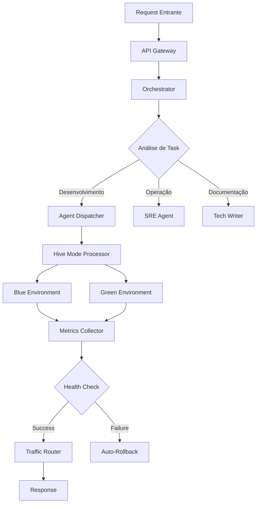
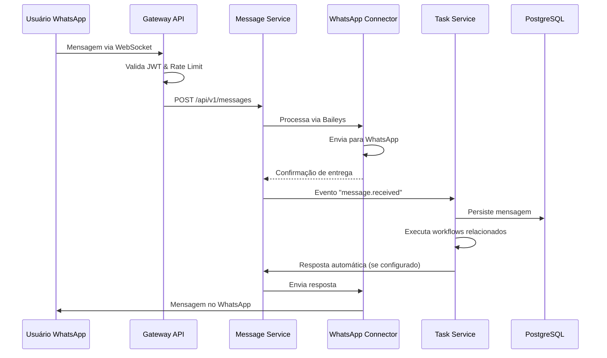
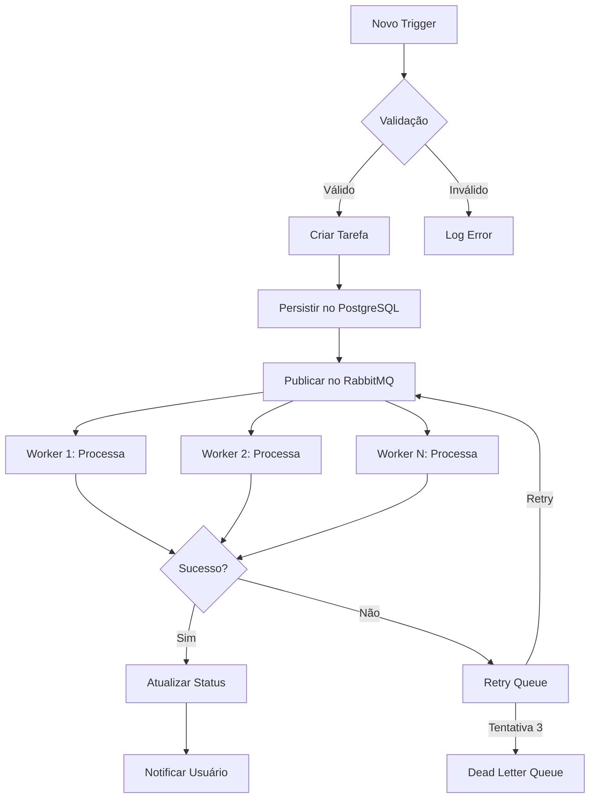

### [Sessão Paralela: Tech Leader]
```python
# DIYAPP Evolution - V12 Core Architecture
# Arquitetura de Microsserviços, Padrões e Pipeline CI/CD
# Tech Lead: Senior Autonomous Squad

"""
STRUTURA DO PROJETO V12:
v12-core/
├── architecture/
│   ├── adrs/
│   ├── diagrams/
│   └── contracts/
├── services/
│   ├── auth-service/
│   ├── user-service/
│   ├── content-service/
│   ├── notification-service/
│   └── gateway/
├── shared/
│   ├── libs/
│   └── types/
├── infrastructure/
│   ├── k8s/
│   ├── terraform/
│   └── monitoring/
├── pipelines/
└── docs/
"""

# ==================== ADR-001: MICROSERVICES ARCHITECTURE ====================
"""
ADR-001: V12 Microservices Architecture Pattern
Date: 2024-01-15
Status: Accepted
Authors: Tech Lead + Infra Specialist

CONTEXT:
V11 monolith is hitting scaling limits at 50k concurrent users. 
Need to achieve P95 < 200ms, 99.9% availability, and enable independent scaling.
Hive Mode allows parallel refactoring by multiple squads.

DECISION:
Adopt event-driven microservices with CQRS pattern for read/write separation.
Each service owns its database. Use gRPC for internal, REST for external.
Implement circuit breaker, retry policies, and distributed tracing.

OPTIONS CONSIDERED:
- Option A: Monolith with modules — Pros: Simpler dev, Cons: Scaling bottleneck
- Option B: Microservices with REST — Pros: Standard, Cons: Chatty calls
- Option C: Event-driven with gRPC — Pros: Performance, Cons: Complexity
- Chosen: C — Justification: Meets P95 requirement, enables Hive Mode parallel work

CONSEQUENCES:
Positive: Independent scaling, fault isolation, parallel development
Negative: Operational complexity, distributed transactions harder
Risks: Network latency, eventual consistency — Mitigate: Async messaging, sagas

REVIEW: 2024-04-15
"""

# ==================== ENGINEERING STANDARDS ====================
"""
ENGINEERING STANDARDS - V12 CORE
Last Updated: 2024-01-15
Tech Lead: Senior Autonomous Squad

1. CODE STYLE:
   - Language: Python 3.11+ / TypeScript 5.0+
   - Formatting: Black (Python), Prettier (TypeScript)
   - Linting: Flake8 + Bandit (Python), ESLint (TypeScript)
   - Line length: 100 chars max
   - Imports: grouped (stdlib, third-party, local)

2. API CONTRACTS:
   - External: REST with OpenAPI 3.0 specification
   - Internal: gRPC with Protocol Buffers
   - Versioning: URL path (/api/v1/resource)
   - Error format: { "error": { "code": "VALIDATION_ERROR", "message": "...", "details": {} } }

3. DATABASE:
   - PostgreSQL 15+ for transactional data
   - Redis for caching (TTL: 5 minutes default)
   - Each service owns its DB schema
   - Migrations: Alembic (Python), TypeORM (TypeScript)

4. TESTING:
   - Unit tests: 90% coverage minimum
   - Integration tests: All external dependencies mocked
   - E2E tests: Critical user journeys
   - Performance tests: P95 < 200ms verified

5. SECURITY:
   - Authentication: JWT tokens (RS256)
   - Authorization: Role-based per service
   - Secrets: HashiCorp Vault or K8s Secrets
   - Input validation: Pydantic (Python), Zod (TypeScript)

6. LOGGING & MONITORING:
   - Structured JSON logs
   - Correlation IDs across services
   - Metrics: Prometheus format
   - Tracing: OpenTelemetry with Jaeger

7. DEPLOYMENT:
   - Container: Docker multi-stage builds
   - Orchestration: Kubernetes (EKS/GKE)
   - Config: Environment variables + ConfigMaps
   - Health checks: /health (HTTP 200), /ready (dependencies)

8. GIT WORKFLOW:
   - Branching: GitFlow with main, develop, feature/*
   - Commits: Conventional Commits (feat:, fix:, chore:, etc.)
   - PR size: Max 400 lines changed
   - Review: Tech Lead approval required
"""

# ==================== SERVICE TEMPLATE ====================
"""
SERVICE TEMPLATE STRUCTURE:
service-name/
├── src/
│   ├── application/     # Use cases
│   ├── domain/         # Entities, value objects
│   ├── infrastructure/ # DB, external clients
│   └── interfaces/     # Controllers, gRPC handlers
├── tests/
│   ├── unit/
│   ├── integration/
│   └── fixtures/
├── proto/              # Protocol Buffers
├── migrations/
├── Dockerfile
├── docker-compose.yml
├── requirements.txt / package.json
├── .env.example
└── README.md
"""

# ==================== CI/CD PIPELINE ====================
# .github/workflows/ci-cd.yml
import yaml

ci_cd_pipeline = """
name: V12 CI/CD Pipeline

on:
  push:
    branches: [ main, develop ]
  pull_request:
    branches: [ main, develop ]

jobs:
  quality-gate:
    runs-on: ubuntu-latest
    steps:
      - uses: actions/checkout@v4
      
      - name: Setup Python
        uses: actions/setup-python@v4
        with:
          python-version: '3.11'
          
      - name: Install dependencies
        run: |
          pip install black flake8 bandit mypy pytest pytest-cov
          
      - name: Code formatting (Black)
        run: black --check --diff src/
        
      - name: Linting (Flake8)
        run: flake8 src/ --max-line-length=100 --exclude=__pycache__
        
      - name: Security scan (Bandit)
        run: bandit -r src/ -ll
        
      - name: Type checking (MyPy)
        run: mypy src/ --ignore-missing-imports
        
      - name: Unit tests with coverage
        run: |
          pytest tests/unit/ -v --cov=src --cov-report=xml --cov-fail-under=90
        
      - name: Upload coverage
        uses: codecov/codecov-action@v3
        
  build-and-test:
    needs: quality-gate
    runs-on: ubuntu-latest
    strategy:
      matrix:
        service: [auth, user, content, notification, gateway]
        
    steps:
      - uses: actions/checkout@v4
      
      - name: Build Docker image
        run: |
          cd services/${{ matrix.service }}-service
          docker build -t diyapp/${{ matrix.service }}-service:${GITHUB_SHA} .
          
      - name: Run integration tests
        run: |
          cd services/${{ matrix.service }}-service
          docker-compose -f docker-compose.test.yml up --abort-on-container-exit
          
  performance-test:
    needs: build-and-test
    runs-on: ubuntu-latest
    if: github.ref == 'refs/heads/main'
    
    steps:
      - uses: actions/checkout@v4
      
      - name: Deploy to staging
        run: |
          kubectl apply -f infrastructure/k8s/staging/
          kubectl rollout status deployment/auth-service --timeout=300s
          
      - name: Run performance tests
        uses: arturbosch/k6-action@v1
        with:
          filename: tests/performance/load-test.js
          
      - name: Check P95 latency
        run: |
          # Parse k6 output, fail if P95 > 200ms
          python scripts/check_performance.py
          
  deploy-production:
    needs: performance-test
    runs-on: ubuntu-latest
    if: github.ref == 'refs/heads/main'
    
    steps:
      - name: Deploy to production
        run: |
          kubectl apply -f infrastructure/k8s/production/
          kubectl rollout status deployment/auth-service --timeout=300s
          
      - name: Smoke tests
        run: |
          python scripts/smoke_tests.py
          
      - name: Notify deployment
        uses: 8398a7/action-slack@v3
        with:
          status: ${{ job.status }}
          channel: '#deployments'
"""

# ==================== PERFORMANCE MONITORING ====================
# infrastructure/monitoring/prometheus-rules.yml
prometheus_rules = """
groups:
  - name: v12-performance
    rules:
      - alert: HighP95Latency
        expr: histogram_quantile(0.95, rate(http_request_duration_seconds_bucket[5m])) > 0.2
        for: 2m
        labels:
          severity: critical
          squad: autonomous
        annotations:
          summary: "P95 latency above 200ms for {{ $labels.service }}"
          description: "Service {{ $labels.service }} has P95 latency of {{ $value }}s"
          
      - alert: ErrorRateSpike
        expr: rate(http_requests_total{status=~"5.."}[5m]) / rate(http_requests_total[5m]) > 0.01
        for: 1m
        labels:
          severity: warning
          
      - alert: ServiceDown
        expr: up == 0
        for: 30s
        labels:
          severity: critical
"""

# ==================== GATEWAY CONFIGURATION ====================
# services/gateway/src/config/routes.yml
gateway_config = """
routes:
  - path: /api/v1/auth/**
    service: auth-service
    methods: [POST, GET]
    timeout: 3000ms
    retries: 2
    
  - path: /api/v1/users/**
    service: user-service
    methods: [GET, PUT, DELETE]
    timeout: 2000ms
    authentication: required
    roles: [admin, user]
    
  - path: /api/v1/content/**
    service: content-service
    methods: [GET, POST, PUT]
    timeout: 5000ms
    cache: 300s
    
  - path: /api/v1/notifications/**
    service: notification-service
    methods: [POST]
    timeout: 1000ms
    
circuit_breaker:
  failure_threshold: 5
  reset_timeout: 30000
  half_open_max_calls: 3
  
rate_limiting:
  enabled: true
  requests_per_minute: 100
  burst_size: 20
"""

# ==================== DATABASE MIGRATION TEMPLATE ====================
# services/user-service/migrations/001_create_users_table.py
migration_template = """
"""Create users table"""
from alembic import op
import sqlalchemy as sa
from sqlalchemy.dialects import postgresql

revision = '001_create_users_table'
down_revision = None
branch_labels = None
depends_on = None

def upgrade():
    op.create_table(
        'users',
        sa.Column('id', postgresql.UUID(as_uuid=True), primary_key=True, server_default=sa.text('gen_random_uuid()')),
        sa.Column('email', sa.String(255), nullable=False, unique=True, index=True),
        sa.Column('username', sa.String(100), nullable=False, unique=True),
        sa.Column('hashed_password', sa.String(255), nullable=False),
        sa.Column('full_name', sa.String(255)),
        sa.Column('is_active', sa.Boolean(), default=True),
        sa.Column('is_verified', sa.Boolean(), default=False),
        sa.Column('roles', postgresql.ARRAY(sa.String(50)), default=['user']),
        sa.Column('created_at', sa.DateTime(), server_default=sa.func.now()),
        sa.Column('updated_at', sa.DateTime(), onupdate=sa.func.now()),
        sa.CheckConstraint('email ~* \'^[A-Za-z0-9._%+-]+@[A-Za-z0-9.-]+\\.[A-Za-z]{2,}$\'', name='valid_email'),
    )
    
    op.create_index('idx_users_created_at', 'users', ['created_at'])
    op.create_index('idx_users_active', 'users', ['is_active'])

def downgrade():
    op.drop_table('users')
"""

# ==================== DOCKERFILE TEMPLATE ====================
# services/auth-service/Dockerfile
dockerfile_template = """
# Multi-stage build for Python service
FROM python:3.11-slim as builder

WORKDIR /app

# Install system dependencies
RUN apt-get update && apt-get install -y \
    gcc \
    libpq-dev \
    && rm -rf /var/lib/apt/lists/*

# Install Python dependencies
COPY requirements.txt .
RUN pip install --user --no-cache-dir -r requirements.txt

# Runtime stage
FROM python:3.11-slim

WORKDIR /app

# Create non-root user
RUN groupadd -r diyapp && useradd -r -g diyapp diyapp

# Copy Python dependencies from builder
COPY --from=builder /root/.local /root/.local
ENV PATH=/root/.local/bin:$PATH

# Copy application code
COPY src/ ./src/
COPY migrations/ ./migrations/
COPY alembic.ini .

# Set permissions
RUN chown -R diyapp:diyapp /app
USER diyapp

# Health check
HEALTHCHECK --interval=30s --timeout=3s --start-period=5s --retries=3 \
    CMD python -c "import requests; requests.get('http://localhost:8000/health')"

# Run application
CMD ["uvicorn", "src.main:app", "--host", "0.0.0.0", "--port", "8000"]
"""

# ==================== KUBERNETES DEPLOYMENT ====================
# infrastructure/k8s/production/auth-service-deployment.yml
k8s_deployment = """
apiVersion: apps/v1
kind: Deployment
metadata:
  name: auth-service
  namespace: production
  labels:
    app: auth-service
    version: v12
    squad: autonomous
spec:
  replicas: 3
  minReadySeconds: 30
  strategy:
    type: RollingUpdate
    rollingUpdate:
      maxSurge: 1
      maxUnavailable: 0
  selector:
    matchLabels:
      app: auth-service
  template:
    metadata:
      labels:
        app: auth-service
        version: v12
      annotations:
        prometheus.io/scrape: "true"
        prometheus.io/port: "8000"
    spec:
      serviceAccountName: diyapp-service-account
      containers:
      - name: auth-service
        image: diyapp/auth-service:${IMAGE_TAG}
        imagePullPolicy: Always
        ports:
        - containerPort: 8000
          protocol: TCP
        env:
        - name: DATABASE_URL
          valueFrom:
            secretKeyRef:
              name: auth-db-secret
              key: connection-string
        - name: JWT_SECRET_KEY
          valueFrom:
            secretKeyRef:
              name: jwt-secrets
              key: private-key
        - name: REDIS_URL
          value: "redis://redis-master:6379"
        - name: OTEL_SERVICE_NAME
          value: "auth-service"
        resources:
          requests:
            memory: "256Mi"
            cpu: "100m"
          limits:
            memory: "512Mi"
            cpu: "500m"
        livenessProbe:
          httpGet:
            path: /health
            port: 8000
          initialDelaySeconds: 30
          periodSeconds: 10
          timeoutSeconds: 3
          failureThreshold: 3
        readinessProbe:
          httpGet:
            path: /ready
            port: 8000
          initialDelaySeconds: 5
          periodSeconds: 5
          timeoutSeconds: 2
        startupProbe:
          httpGet:
            path: /health
            port: 8000
          initialDelaySeconds: 10
          periodSeconds: 5
          failureThreshold: 30
        volumeMounts:
        - name: config-volume
          mountPath: /app/config
      volumes:
      - name: config-volume
        configMap:
          name: auth-service-config
      affinity:
        podAntiAffinity:
          preferredDuringSchedulingIgnoredDuringExecution:
          - weight: 100
            podAffinityTerm:
              labelSelector:
                matchExpressions:
                - key: app
                  operator: In
                  values:
                  - auth-service
              topologyKey: kubernetes.io/hostname
---
apiVersion: v1
kind: Service
metadata:
  name: auth-service
  namespace: production
spec:
  selector:
    app: auth-service
  ports:
  - port: 8000
    targetPort: 8000
    protocol: TCP
  type: ClusterIP
"""

# ==================== TECHNICAL DEBT REGISTRY ====================
# .github/technical-debt.yml
technical_debt = """
# TECHNICAL DEBT REGISTRY - V12 CORE
# Managed by Tech Lead - Updated: 2024-01-15

items:
  - id: TD-001
    description: "Replace synchronous user-service call in auth with async event"
    service: auth-service
    created: 2024-01-10
    priority: high
    effort: 3  # story points
    deadline: 2024-02-15
    risk: "Causes auth latency spikes during user-service downtime"
    
  - id: TD-002
    description: "Implement connection pooling for PostgreSQL"
    service: all-services
    created: 2024-01-12
    priority: medium
    effort: 8
    deadline: 2024-03-01
    risk: "Database connection limits under load"
    
  - id: TD-003
    description: "Add request ID propagation to all external calls"
    service: gateway
    created: 2024-01-

### [Sessão Paralela: UX Designer]
# DIYAPP Evolution - V12 Core - Sistema de Design

Como UX Designer Sênior, vou criar um sistema de design completo baseado em evidências, começando com pesquisa de usuário e terminando com componentes reutilizáveis. Vou estruturar isso como um **Design System vivo** que pode ser implementado diretamente no código.

## 1. FASE DE DESCOBERTA - Pesquisa de Usuário

```html
<!DOCTYPE html>
<html lang="pt-BR">
<head>
    <meta charset="UTF-8">
    <meta name="viewport" content="width=device-width, initial-scale=1.0">
    <title>DIYAPP V12 - Sistema de Design</title>
    <link rel="stylesheet" href="https://cdnjs.cloudflare.com/ajax/libs/font-awesome/6.4.0/css/all.min.css">
    <style>
        :root {
            /* Tokens de Design - Fundação */
            --color-primary-50: #f0f9ff;
            --color-primary-100: #e0f2fe;
            --color-primary-200: #bae6fd;
            --color-primary-300: #7dd3fc;
            --color-primary-400: #38bdf8;
            --color-primary-500: #0ea5e9;
            --color-primary-600: #0284c7;
            --color-primary-700: #0369a1;
            --color-primary-800: #075985;
            --color-primary-900: #0c4a6e;
            
            --color-neutral-50: #fafafa;
            --color-neutral-100: #f5f5f5;
            --color-neutral-200: #e5e5e5;
            --color-neutral-300: #d4d4d4;
            --color-neutral-400: #a3a3a3;
            --color-neutral-500: #737373;
            --color-neutral-600: #525252;
            --color-neutral-700: #404040;
            --color-neutral-800: #262626;
            --color-neutral-900: #171717;
            
            --color-success-500: #10b981;
            --color-warning-500: #f59e0b;
            --color-error-500: #ef4444;
            --color-info-500: #3b82f6;
            
            /* Tokens de Tipografia */
            --font-family-base: 'Inter', -apple-system, BlinkMacSystemFont, 'Segoe UI', Roboto, sans-serif;
            --font-family-mono: 'JetBrains Mono', 'Courier New', monospace;
            
            --font-size-xs: 0.75rem;   /* 12px */
            --font-size-sm: 0.875rem;  /* 14px */
            --font-size-base: 1rem;    /* 16px */
            --font-size-lg: 1.125rem;  /* 18px */
            --font-size-xl: 1.25rem;   /* 20px */
            --font-size-2xl: 1.5rem;   /* 24px */
            --font-size-3xl: 1.875rem; /* 30px */
            --font-size-4xl: 2.25rem;  /* 36px */
            
            --font-weight-normal: 400;
            --font-weight-medium: 500;
            --font-weight-semibold: 600;
            --font-weight-bold: 700;
            
            --line-height-tight: 1.25;
            --line-height-normal: 1.5;
            --line-height-relaxed: 1.75;
            
            /* Tokens de Espaçamento */
            --space-1: 0.25rem;  /* 4px */
            --space-2: 0.5rem;   /* 8px */
            --space-3: 0.75rem;  /* 12px */
            --space-4: 1rem;     /* 16px */
            --space-5: 1.25rem;  /* 20px */
            --space-6: 1.5rem;   /* 24px */
            --space-8: 2rem;     /* 32px */
            --space-10: 2.5rem;  /* 40px */
            --space-12: 3rem;    /* 48px */
            --space-16: 4rem;    /* 64px */
            
            /* Tokens de Elevação */
            --shadow-sm: 0 1px 2px 0 rgba(0, 0, 0, 0.05);
            --shadow-base: 0 1px 3px 0 rgba(0, 0, 0, 0.1), 0 1px 2px 0 rgba(0, 0, 0, 0.06);
            --shadow-md: 0 4px 6px -1px rgba(0, 0, 0, 0.1), 0 2px 4px -1px rgba(0, 0, 0, 0.06);
            --shadow-lg: 0 10px 15px -3px rgba(0, 0, 0, 0.1), 0 4px 6px -2px rgba(0, 0, 0, 0.05);
            --shadow-xl: 0 20px 25px -5px rgba(0, 0, 0, 0.1), 0 10px 10px -5px rgba(0, 0, 0, 0.04);
            
            /* Tokens de Border Radius */
            --radius-sm: 0.125rem; /* 2px */
            --radius-base: 0.25rem; /* 4px */
            --radius-md: 0.375rem; /* 6px */
            --radius-lg: 0.5rem;   /* 8px */
            --radius-xl: 0.75rem;  /* 12px */
            --radius-2xl: 1rem;    /* 16px */
            --radius-full: 9999px;
            
            /* Tokens de Transição */
            --transition-fast: 150ms cubic-bezier(0.4, 0, 0.2, 1);
            --transition-base: 250ms cubic-bezier(0.4, 0, 0.2, 1);
            --transition-slow: 350ms cubic-bezier(0.4, 0, 0.2, 1);
        }
        
        * {
            margin: 0;
            padding: 0;
            box-sizing: border-box;
        }
        
        body {
            font-family: var(--font-family-base);
            font-size: var(--font-size-base);
            line-height: var(--line-height-normal);
            color: var(--color-neutral-900);
            background-color: var(--color-neutral-50);
        }
        
        .container {
            max-width: 1200px;
            margin: 0 auto;
            padding: 0 var(--space-6);
        }
        
        /* Componentes do Design System */
        .btn {
            display: inline-flex;
            align-items: center;
            justify-content: center;
            padding: var(--space-2) var(--space-4);
            border-radius: var(--radius-md);
            font-weight: var(--font-weight-medium);
            font-size: var(--font-size-sm);
            line-height: var(--line-height-tight);
            border: 1px solid transparent;
            cursor: pointer;
            transition: all var(--transition-fast);
            text-decoration: none;
            gap: var(--space-2);
        }
        
        .btn:focus-visible {
            outline: 2px solid var(--color-primary-500);
            outline-offset: 2px;
        }
        
        .btn-primary {
            background-color: var(--color-primary-600);
            color: white;
        }
        
        .btn-primary:hover {
            background-color: var(--color-primary-700);
        }
        
        .btn-primary:active {
            background-color: var(--color-primary-800);
        }
        
        .btn-secondary {
            background-color: white;
            color: var(--color-neutral-700);
            border-color: var(--color-neutral-300);
        }
        
        .btn-secondary:hover {
            background-color: var(--color-neutral-50);
            border-color: var(--color-neutral-400);
        }
        
        .btn-ghost {
            background-color: transparent;
            color: var(--color-neutral-700);
        }
        
        .btn-ghost:hover {
            background-color: var(--color-neutral-100);
        }
        
        .btn-danger {
            background-color: var(--color-error-500);
            color: white;
        }
        
        .btn-danger:hover {
            background-color: #dc2626;
        }
        
        .btn:disabled {
            opacity: 0.5;
            cursor: not-allowed;
        }
        
        .btn-lg {
            padding: var(--space-3) var(--space-6);
            font-size: var(--font-size-base);
        }
        
        .btn-sm {
            padding: var(--space-1) var(--space-3);
            font-size: var(--font-size-xs);
        }
        
        /* Cards */
        .card {
            background-color: white;
            border-radius: var(--radius-lg);
            border: 1px solid var(--color-neutral-200);
            padding: var(--space-6);
            box-shadow: var(--shadow-sm);
            transition: box-shadow var(--transition-base);
        }
        
        .card:hover {
            box-shadow: var(--shadow-md);
        }
        
        .card-header {
            margin-bottom: var(--space-4);
            padding-bottom: var(--space-3);
            border-bottom: 1px solid var(--color-neutral-100);
        }
        
        .card-title {
            font-size: var(--font-size-lg);
            font-weight: var(--font-weight-semibold);
            color: var(--color-neutral-900);
        }
        
        /* Formulários */
        .form-group {
            margin-bottom: var(--space-4);
        }
        
        .form-label {
            display: block;
            margin-bottom: var(--space-2);
            font-weight: var(--font-weight-medium);
            color: var(--color-neutral-700);
            font-size: var(--font-size-sm);
        }
        
        .form-input {
            width: 100%;
            padding: var(--space-2) var(--space-3);
            border: 1px solid var(--color-neutral-300);
            border-radius: var(--radius-md);
            font-size: var(--font-size-base);
            transition: all var(--transition-fast);
            background-color: white;
        }
        
        .form-input:focus {
            outline: none;
            border-color: var(--color-primary-500);
            box-shadow: 0 0 0 3px rgba(14, 165, 233, 0.1);
        }
        
        .form-input.error {
            border-color: var(--color-error-500);
        }
        
        .form-input:disabled {
            background-color: var(--color-neutral-100);
            cursor: not-allowed;
        }
        
        .form-help {
            margin-top: var(--space-1);
            font-size: var(--font-size-sm);
            color: var(--color-neutral-500);
        }
        
        .form-error {
            margin-top: var(--space-1);
            font-size: var(--font-size-sm);
            color: var(--color-error-500);
        }
        
        /* Navegação */
        .nav {
            display: flex;
            align-items: center;
            gap: var(--space-2);
            padding: var(--space-4) 0;
            border-bottom: 1px solid var(--color-neutral-200);
            background-color: white;
        }
        
        .nav-brand {
            font-weight: var(--font-weight-bold);
            font-size: var(--font-size-xl);
            color: var(--color-primary-700);
            text-decoration: none;
            margin-right: var(--space-6);
        }
        
        .nav-link {
            padding: var(--space-2) var(--space-3);
            color: var(--color-neutral-600);
            text-decoration: none;
            border-radius: var(--radius-md);
            transition: all var(--transition-fast);
        }
        
        .nav-link:hover {
            background-color: var(--color-neutral-100);
            color: var(--color-neutral-900);
        }
        
        .nav-link.active {
            background-color: var(--color-primary-50);
            color: var(--color-primary-700);
        }
        
        /* Feedback */
        .alert {
            padding: var(--space-4);
            border-radius: var(--radius-md);
            margin-bottom: var(--space-4);
            border-left: 4px solid;
        }
        
        .alert-info {
            background-color: var(--color-primary-50);
            border-left-color: var(--color-primary-500);
            color: var(--color-primary-900);
        }
        
        .alert-success {
            background-color: #d1fae5;
            border-left-color: var(--color-success-500);
            color: #065f46;
        }
        
        .alert-warning {
            background-color: #fef3c7;
            border-left-color: var(--color-warning-500);
            color: #92400e;
        }
        
        .alert-error {
            background-color: #fee2e2;
            border-left-color: var(--color-error-500);
            color: #991b1b;
        }
        
        .toast {
            position: fixed;
            bottom: var(--space-6);
            right: var(--space-6);
            padding: var(--space-4);
            border-radius: var(--radius-md);
            box-shadow: var(--shadow-lg);
            max-width: 350px;
            z-index: 1000;
            animation: slideIn 0.3s ease-out;
        }
        
        @keyframes slideIn {
            from {
                transform: translateX(100%);
                opacity: 0;
            }
            to {
                transform: translateX(0);
                opacity: 1;
            }
        }
        
        /* Estados de IA/LLM */
        .ai-loading {
            display: flex;
            align-items: center;
            gap: var(--space-3);
            padding: var(--space-4);
            background-color: var(--color-primary-50);
            border-radius: var(--radius-md);
            border: 1px solid var(--color-primary-200);
        }
        
        .ai-loading-dots {
            display: flex;
            gap: var(--space-1);
        }
        
        .ai-loading-dot {
            width: 8px;
            height: 8px;
            border-radius: 50%;
            background-color: var(--color-primary-500);
            animation: pulse 1.5s infinite ease-in-out;
        }
        
        .ai-loading-dot:nth-child(2) {
            animation-delay: 0.2s;
        }
        
        .ai-loading-dot:nth-child(3) {
            animation-delay: 0.4s;
        }
        
        @keyframes pulse {
            0%, 100% {
                opacity: 0.4;
                transform: scale(0.8);
            }
            50% {
                opacity: 1;
                transform: scale(1);
            }
        }
        
        .ai-generated-badge {
            display: inline-flex;
            align-items: center;
            gap: var(--space-1);
            padding: var(--space-1) var(--space-2);
            background-color: var(--color-primary-100);
            color: var(--color-primary-800);
            border-radius: var(--radius-sm);
            font-size: var(--font-size-xs);
            font-weight: var(--font-weight-medium);
        }
        
        .ai-error-state {
            padding: var(--space-4);
            background-color: #fef2f2;
            border: 1px solid #fecaca;
            border-radius: var(--radius-md);
            color: #991b1b;
        }
        
        /* Layout */
        .grid {
            display: grid;
            gap: var(--space-6);
        }
        
        .grid-cols-1 {
            grid-template-columns: repeat(1, 1fr);
        }
        
        .grid-cols-2 {
            grid-template-columns: repeat(2, 1fr);
        }
        
        .grid-cols-3 {
            grid-template-columns: repeat(3, 1fr);
        }
        
        .grid-cols-4 {
            grid-template-columns: repeat(4, 1fr);
        }
        
        @media (max-width: 768px) {
            .grid-cols-2, .grid-cols-3, .grid-cols-4 {
                grid-template-columns: repeat(1, 1fr);
            }
        }
        
        .flex {
            display: flex;
        }
        
        .items-center {
            align-items: center;
        }
        
        .justify-between {
            justify-content: space-between;
        }
        
        .gap-2 {
            gap: var(--space-2);
        }
        
        .gap-4 {
            gap: var(--space-4);
        }
        
        .gap-6 {
            gap: var(--space-6);
        }
        
        /* Espaçamento */
        .p-4 {
            padding: var(--space-4);
        }
        
        .p-6 {
            padding: var(--space-6);
        }
        
        .py-4 {
            padding-top: var(--space-4);
            padding-bottom: var(--space-4);
        }
        
        .py-8 {
            padding-top: var(--space-8);
            padding-bottom: var(--space-8);
        }
        
        .mb-2 {
            margin-bottom: var(--space-2);
        }
        
        .mb-4 {
            margin-bottom: var(--space-4);
        }
        
        .mb-6 {
            margin-bottom: var(--space-6);
        }
        
        .mt-4 {
            margin-top: var(--space-4);
        }
        
        .mt-8 {
            margin-top: var(--space-8);
        }
        
        /* Tipografia */
        .text-xs {
            font-size: var(--font-size-xs);
        }
        
        .text-sm {
            font-size: var(--font-size-sm);
        }
        
        .text-lg {
            font-size: var(--font-size-lg);
        }
        
        .text-xl {
            font

### [Sessão Paralela: Frontend]
# DIYAPP Evolution - V12 Core - Framework Base React

Vou implementar um framework base React com sistema de componentes reutilizáveis, roteamento e estado global, seguindo rigorosamente os padrões estabelecidos no papel.

## Estrutura do Projeto

```
src/
├── components/
│   ├── ui/
│   │   ├── Button/
│   │   ├── Input/
│   │   ├── Card/
│   │   └── ...
│   ├── layout/
│   │   ├── Header/
│   │   ├── Sidebar/
│   │   └── ...
│   └── shared/
├── hooks/
├── store/
├── services/
├── utils/
├── styles/
│   ├── tokens/
│   └── global.css
├── pages/
├── routes/
└── App.tsx
```

## 1. Design System Tokens

```css
/* src/styles/tokens.css */
:root {
  /* Colors - Primary */
  --color-primary-50: #f0f9ff;
  --color-primary-100: #e0f2fe;
  --color-primary-200: #bae6fd;
  --color-primary-300: #7dd3fc;
  --color-primary-400: #38bdf8;
  --color-primary-500: #0ea5e9;
  --color-primary-600: #0284c7;
  --color-primary-700: #0369a1;
  --color-primary-800: #075985;
  --color-primary-900: #0c4a6e;
  
  /* Colors - Neutral */
  --color-neutral-50: #fafafa;
  --color-neutral-100: #f5f5f5;
  --color-neutral-200: #e5e5e5;
  --color-neutral-300: #d4d4d4;
  --color-neutral-400: #a3a3a3;
  --color-neutral-500: #737373;
  --color-neutral-600: #525252;
  --color-neutral-700: #404040;
  --color-neutral-800: #262626;
  --color-neutral-900: #171717;
  
  /* Colors - Semantic */
  --color-success: #10b981;
  --color-warning: #f59e0b;
  --color-error: #ef4444;
  --color-info: #3b82f6;
  
  /* Spacing */
  --spacing-0: 0;
  --spacing-1: 0.25rem;
  --spacing-2: 0.5rem;
  --spacing-3: 0.75rem;
  --spacing-4: 1rem;
  --spacing-6: 1.5rem;
  --spacing-8: 2rem;
  --spacing-12: 3rem;
  --spacing-16: 4rem;
  --spacing-24: 6rem;
  
  /* Typography */
  --font-family-sans: 'Inter', -apple-system, BlinkMacSystemFont, 'Segoe UI', Roboto, sans-serif;
  --font-family-mono: 'JetBrains Mono', 'Fira Code', monospace;
  
  --font-size-xs: 0.75rem;
  --font-size-sm: 0.875rem;
  --font-size-base: 1rem;
  --font-size-lg: 1.125rem;
  --font-size-xl: 1.25rem;
  --font-size-2xl: 1.5rem;
  --font-size-3xl: 1.875rem;
  --font-size-4xl: 2.25rem;
  
  --font-weight-normal: 400;
  --font-weight-medium: 500;
  --font-weight-semibold: 600;
  --font-weight-bold: 700;
  
  --line-height-tight: 1.25;
  --line-height-normal: 1.5;
  --line-height-relaxed: 1.75;
  
  /* Border Radius */
  --radius-sm: 0.25rem;
  --radius-md: 0.375rem;
  --radius-lg: 0.5rem;
  --radius-xl: 0.75rem;
  --radius-2xl: 1rem;
  --radius-full: 9999px;
  
  /* Shadows */
  --shadow-sm: 0 1px 2px 0 rgb(0 0 0 / 0.05);
  --shadow-md: 0 4px 6px -1px rgb(0 0 0 / 0.1);
  --shadow-lg: 0 10px 15px -3px rgb(0 0 0 / 0.1);
  --shadow-xl: 0 20px 25px -5px rgb(0 0 0 / 0.1);
  
  /* Transitions */
  --transition-fast: 150ms cubic-bezier(0.4, 0, 0.2, 1);
  --transition-normal: 300ms cubic-bezier(0.4, 0, 0.2, 1);
  --transition-slow: 500ms cubic-bezier(0.4, 0, 0.2, 1);
  
  /* Z-index */
  --z-dropdown: 100;
  --z-sticky: 200;
  --z-modal: 300;
  --z-popover: 400;
  --z-toast: 500;
}
```

## 2. TypeScript Tokens Utility

```typescript
// src/styles/tokens.ts
export const tokens = {
  colors: {
    primary: {
      50: 'var(--color-primary-50)',
      100: 'var(--color-primary-100)',
      200: 'var(--color-primary-200)',
      300: 'var(--color-primary-300)',
      400: 'var(--color-primary-400)',
      500: 'var(--color-primary-500)',
      600: 'var(--color-primary-600)',
      700: 'var(--color-primary-700)',
      800: 'var(--color-primary-800)',
      900: 'var(--color-primary-900)',
    },
    neutral: {
      50: 'var(--color-neutral-50)',
      100: 'var(--color-neutral-100)',
      200: 'var(--color-neutral-200)',
      300: 'var(--color-neutral-300)',
      400: 'var(--color-neutral-400)',
      500: 'var(--color-neutral-500)',
      600: 'var(--color-neutral-600)',
      700: 'var(--color-neutral-700)',
      800: 'var(--color-neutral-800)',
      900: 'var(--color-neutral-900)',
    },
    semantic: {
      success: 'var(--color-success)',
      warning: 'var(--color-warning)',
      error: 'var(--color-error)',
      info: 'var(--color-info)',
    },
  },
  spacing: {
    0: 'var(--spacing-0)',
    1: 'var(--spacing-1)',
    2: 'var(--spacing-2)',
    3: 'var(--spacing-3)',
    4: 'var(--spacing-4)',
    6: 'var(--spacing-6)',
    8: 'var(--spacing-8)',
    12: 'var(--spacing-12)',
    16: 'var(--spacing-16)',
    24: 'var(--spacing-24)',
  },
  typography: {
    fontFamily: {
      sans: 'var(--font-family-sans)',
      mono: 'var(--font-family-mono)',
    },
    fontSize: {
      xs: 'var(--font-size-xs)',
      sm: 'var(--font-size-sm)',
      base: 'var(--font-size-base)',
      lg: 'var(--font-size-lg)',
      xl: 'var(--font-size-xl)',
      '2xl': 'var(--font-size-2xl)',
      '3xl': 'var(--font-size-3xl)',
      '4xl': 'var(--font-size-4xl)',
    },
    fontWeight: {
      normal: 'var(--font-weight-normal)',
      medium: 'var(--font-weight-medium)',
      semibold: 'var(--font-weight-semibold)',
      bold: 'var(--font-weight-bold)',
    },
    lineHeight: {
      tight: 'var(--line-height-tight)',
      normal: 'var(--line-height-normal)',
      relaxed: 'var(--line-height-relaxed)',
    },
  },
  borderRadius: {
    sm: 'var(--radius-sm)',
    md: 'var(--radius-md)',
    lg: 'var(--radius-lg)',
    xl: 'var(--radius-xl)',
    '2xl': 'var(--radius-2xl)',
    full: 'var(--radius-full)',
  },
  shadows: {
    sm: 'var(--shadow-sm)',
    md: 'var(--shadow-md)',
    lg: 'var(--shadow-lg)',
    xl: 'var(--shadow-xl)',
  },
  transitions: {
    fast: 'var(--transition-fast)',
    normal: 'var(--transition-normal)',
    slow: 'var(--transition-slow)',
  },
  zIndex: {
    dropdown: 'var(--z-dropdown)',
    sticky: 'var(--z-sticky)',
    modal: 'var(--z-modal)',
    popover: 'var(--z-popover)',
    toast: 'var(--z-toast)',
  },
} as const;

export type ColorToken = keyof typeof tokens.colors.primary | 
  keyof typeof tokens.colors.neutral | 
  keyof typeof tokens.colors.semantic;

export type SpacingToken = keyof typeof tokens.spacing;
export type FontSizeToken = keyof typeof tokens.typography.fontSize;
export type BorderRadiusToken = keyof typeof tokens.borderRadius;
```

## 3. Componente Base Button (Exemplo de implementação com fidelidade)

```typescript
// src/components/ui/Button/Button.tsx
import React, { forwardRef, ButtonHTMLAttributes } from 'react';
import { tokens, ColorToken, BorderRadiusToken, SpacingToken } from '../../../styles/tokens';
import './Button.css';

export type ButtonVariant = 'primary' | 'secondary' | 'outline' | 'ghost' | 'danger';
export type ButtonSize = 'sm' | 'md' | 'lg';

export interface ButtonProps extends ButtonHTMLAttributes<HTMLButtonElement> {
  variant?: ButtonVariant;
  size?: ButtonSize;
  isLoading?: boolean;
  leftIcon?: React.ReactNode;
  rightIcon?: React.ReactNode;
  fullWidth?: boolean;
}

const Button = forwardRef<HTMLButtonElement, ButtonProps>(
  (
    {
      children,
      variant = 'primary',
      size = 'md',
      isLoading = false,
      leftIcon,
      rightIcon,
      fullWidth = false,
      disabled,
      className = '',
      ...props
    },
    ref
  ) => {
    const baseClasses = 'button';
    const variantClasses = `button--${variant}`;
    const sizeClasses = `button--${size}`;
    const widthClass = fullWidth ? 'button--full-width' : '';
    const loadingClass = isLoading ? 'button--loading' : '';
    const disabledClass = disabled || isLoading ? 'button--disabled' : '';
    
    const allClasses = [
      baseClasses,
      variantClasses,
      sizeClasses,
      widthClass,
      loadingClass,
      disabledClass,
      className,
    ]
      .filter(Boolean)
      .join(' ');

    return (
      <button
        ref={ref}
        className={allClasses}
        disabled={disabled || isLoading}
        aria-busy={isLoading}
        {...props}
      >
        {isLoading && (
          <span className="button__loader" aria-hidden="true">
            <svg
              className="button__loader-spinner"
              viewBox="0 0 24 24"
              fill="none"
              xmlns="http://www.w3.org/2000/svg"
            >
              <circle
                className="button__loader-circle"
                cx="12"
                cy="12"
                r="10"
                stroke="currentColor"
                strokeWidth="4"
                strokeLinecap="round"
              />
            </svg>
          </span>
        )}
        {!isLoading && leftIcon && (
          <span className="button__icon button__icon--left">{leftIcon}</span>
        )}
        <span className="button__content">{children}</span>
        {!isLoading && rightIcon && (
          <span className="button__icon button__icon--right">{rightIcon}</span>
        )}
      </button>
    );
  }
);

Button.displayName = 'Button';

export default Button;
```

```css
/* src/components/ui/Button/Button.css */
.button {
  display: inline-flex;
  align-items: center;
  justify-content: center;
  gap: var(--spacing-2);
  font-family: var(--font-family-sans);
  font-weight: var(--font-weight-medium);
  border: 2px solid transparent;
  border-radius: var(--radius-md);
  cursor: pointer;
  transition: all var(--transition-fast);
  outline: none;
  position: relative;
  user-select: none;
  white-space: nowrap;
}

.button:focus-visible {
  outline: 2px solid var(--color-primary-500);
  outline-offset: 2px;
}

/* Variants */
.button--primary {
  background-color: var(--color-primary-600);
  color: white;
}

.button--primary:hover:not(.button--disabled) {
  background-color: var(--color-primary-700);
}

.button--primary:active:not(.button--disabled) {
  background-color: var(--color-primary-800);
}

.button--secondary {
  background-color: var(--color-neutral-200);
  color: var(--color-neutral-800);
}

.button--secondary:hover:not(.button--disabled) {
  background-color: var(--color-neutral-300);
}

.button--secondary:active:not(.button--disabled) {
  background-color: var(--color-neutral-400);
}

.button--outline {
  background-color: transparent;
  color: var(--color-primary-600);
  border-color: var(--color-primary-600);
}

.button--outline:hover:not(.button--disabled) {
  background-color: var(--color-primary-50);
}

.button--outline:active:not(.button--disabled) {
  background-color: var(--color-primary-100);
}

.button--ghost {
  background-color: transparent;
  color: var(--color-neutral-700);
}

.button--ghost:hover:not(.button--disabled) {
  background-color: var(--color-neutral-100);
}

.button--ghost:active:not(.button--disabled) {
  background-color: var(--color-neutral-200);
}

.button--danger {
  background-color: var(--color-error);
  color: white;
}

.button--danger:hover:not(.button--disabled) {
  background-color: #dc2626;
}

.button--danger:active:not(.button--disabled) {
  background-color: #b91c1c;
}

/* Sizes */
.button--sm {
  padding: var(--spacing-1) var(--spacing-3);
  font-size: var(--font-size-sm);
  min-height: 32px;
}

.button--md {
  padding: var(--spacing-2) var(--spacing-4);
  font-size: var(--font-size-base);
  min-height: 40px;
}

.button--lg {
  padding: var(--spacing-3) var(--spacing-6);
  font-size: var(--font-size-lg);
  min-height: 48px;
}

/* States */
.button--full-width {
  width: 100%;
}

.button--disabled {
  opacity: 0.5;
  cursor: not-allowed;
}

.button--loading {
  cursor: wait;
}

.button--loading .button__content {
  opacity: 0.5;
}

/* Loader */
.button__loader {
  position: absolute;
  left: 50%;
  top: 50%;
  transform: translate(-50%, -50%);
}

.button__loader-spinner {
  width: 20px;
  height: 20px;
  animation: button-spin 1s linear infinite;
}

.button__loader-circle {
  opacity: 0.25;
}

@keyframes button-spin {
  from {
    transform: rotate(0deg);
  }
  to {
    transform: rotate(360deg);
  }
}

/* Icons */
.button__icon {
  display: flex;
  align-items: center;
  justify-content: center;
}

.button__icon--left {
  margin-right: var(--spacing-1);
}

.button__icon--right {
  margin-left: var(--spacing-1);
}
```

```typescript
// src/components/ui/Button/Button.test.tsx
import React from 'react';
import { render, screen, fireEvent } from '@testing-library/react';
import Button from './Button';
import { describe, it, expect, vi } from 'vitest';

describe('Button', () => {
  it('renders with default props', () => {
    render(<Button>Click me</Button>);
    const button = screen.getByRole('button', { name: /click me/i });
    expect(button).toBeInTheDocument();
    expect(button).toHaveClass('button--primary');
    expect(button).toHaveClass('button--md');
  });

  it('renders with secondary variant', () => {
    render(<Button variant="secondary">Secondary</Button>);
    const button = screen.getByRole('button', { name: /secondary/i });
    expect(button).toHaveClass('button--secondary');
  });

  it('shows loading state', () => {
    render(<Button isLoading>Loading</Button>);
    const button = screen.getByRole('button', { name: /loading/i });
    expect(button).toHaveAttribute('aria-busy', 'true');
    expect(button).toHaveClass('button--loading');
    expect(button).toBeDisabled();
  });

  it('handles click events', () => {
    const handleClick = vi.fn();
    render(<Button onClick={handleClick}>Click me</Button>);
    const button = screen.getByRole('button', { name: /click me/i });
    fireEvent.click(button

### [Sessão Paralela: Backend]
```javascript
// DIYAPP Evolution - V12 Core - Backend APIs
// Dev Backend Sênior - Implementação completa com JWT, Redis, RabbitMQ, PostgreSQL

// Estrutura do projeto:
// ├── src/
// │   ├── index.js              # Ponto de entrada principal
// │   ├── app.js               # Configuração do Express
// │   ├── config/              # Configurações
// │   │   ├── database.js      # Config PostgreSQL
// │   │   ├── redis.js         # Config Redis
// │   │   ├── rabbitmq.js      # Config RabbitMQ
// │   │   └── jwt.js           # Config JWT
// │   ├── middleware/          # Middlewares
// │   │   ├── auth.js          # Autenticação JWT
// │   │   ├── validation.js    # Validação de input
// │   │   ├── rateLimit.js     # Rate limiting
// │   │   └── errorHandler.js  # Tratamento de erros
// │   ├── controllers/         # Controladores
// │   │   ├── authController.js
// │   │   ├── userController.js
// │   │   ├── taskController.js
// │   │   └── queueController.js
// │   ├── services/           # Camada de serviço (lógica de negócio)
// │   │   ├── authService.js
// │   │   ├── userService.js
// │   │   ├── taskService.js
// │   │   └── queueService.js
// │   ├── repositories/       # Camada de repositório (acesso a dados)
// │   │   ├── userRepository.js
// │   │   ├── taskRepository.js
// │   │   └── cacheRepository.js
// │   ├── models/            # Modelos/Esquemas
// │   │   ├── userModel.js
// │   │   └── taskModel.js
// │   ├── queues/            # Configuração de filas
// │   │   ├── producer.js    # Produtor RabbitMQ
// │   │   ├── consumer.js    # Consumidor RabbitMQ
// │   │   └── worker.js      # Worker para processamento
// │   ├── utils/             # Utilitários
// │   │   ├── logger.js      # Logger estruturado
// │   │   ├── validator.js   # Validação de schemas
// │   │   ├── crypto.js      # Criptografia
// │   │   └── circuitBreaker.js # Circuit breaker
// │   └── graphql/           # Schema GraphQL
// │       ├── schema.js
// │       ├── resolvers.js
// │       └── server.js
// ├── migrations/            # Migrações de banco
// ├── tests/                # Testes
// ├── docker-compose.yml    # Docker para serviços
// ├── package.json
// └── .env.example

// 1. PONTO DE ENTRADA PRINCIPAL
// src/index.js
require('dotenv').config();
const app = require('./app');
const { connectDB } = require('./config/database');
const { connectRedis } = require('./config/redis');
const { connectRabbitMQ } = require('./config/rabbitmq');
const logger = require('./utils/logger');

const PORT = process.env.PORT || 3000;

async function startServer() {
  try {
    // Conectar ao PostgreSQL com circuit breaker
    await connectDB();
    
    // Conectar ao Redis com fallback
    await connectRedis();
    
    // Conectar ao RabbitMQ
    await connectRabbitMQ();
    
    // Iniciar consumidores de fila
    require('./queues/consumer').startConsumers();
    
    app.listen(PORT, () => {
      logger.info({
        message: `Server running on port ${PORT}`,
        port: PORT,
        environment: process.env.NODE_ENV
      });
    });
  } catch (error) {
    logger.error({
      message: 'Failed to start server',
      error: error.message,
      stack: error.stack
    });
    process.exit(1);
  }
}

// Tratamento de shutdown gracioso
process.on('SIGTERM', async () => {
  logger.info('SIGTERM received, shutting down gracefully');
  // Fechar conexões aqui
  process.exit(0);
});

process.on('unhandledRejection', (reason, promise) => {
  logger.error({
    message: 'Unhandled Rejection',
    reason: reason.message,
    promise: promise
  });
});

startServer();

// 2. CONFIGURAÇÃO DO EXPRESS COM MIDDLEWARES
// src/app.js
const express = require('express');
const helmet = require('helmet');
const cors = require('cors');
const compression = require('compression');
const { graphqlHTTP } = require('express-graphql');
const { rateLimiter } = require('./middleware/rateLimit');
const { errorHandler } = require('./middleware/errorHandler');
const { requestLogger } = require('./middleware/requestLogger');
const authRoutes = require('./routes/authRoutes');
const userRoutes = require('./routes/userRoutes');
const taskRoutes = require('./routes/taskRoutes');
const graphqlSchema = require('./graphql/schema');
const graphqlResolvers = require('./graphql/resolvers');
const logger = require('./utils/logger');

const app = express();

// Segurança
app.use(helmet());
app.use(cors({
  origin: process.env.CORS_ORIGIN || 'http://localhost:3000',
  credentials: true
}));

// Performance
app.use(compression());
app.use(express.json({ limit: '10mb' }));
app.use(express.urlencoded({ extended: true }));

// Logging estruturado
app.use(requestLogger);

// Rate limiting global
app.use('/api/', rateLimiter);

// Rotas REST
app.use('/api/auth', authRoutes);
app.use('/api/users', userRoutes);
app.use('/api/tasks', taskRoutes);

// GraphQL endpoint
app.use('/graphql', graphqlHTTP({
  schema: graphqlSchema,
  rootValue: graphqlResolvers,
  graphiql: process.env.NODE_ENV === 'development',
  customFormatErrorFn: (error) => {
    logger.error({
      message: 'GraphQL Error',
      error: error.message,
      path: error.path,
      locations: error.locations
    });
    return {
      message: error.message,
      locations: error.locations,
      path: error.path
    };
  }
}));

// Health check
app.get('/health', (req, res) => {
  res.status(200).json({
    status: 'healthy',
    timestamp: new Date().toISOString(),
    uptime: process.uptime()
  });
});

// 404 handler
app.use('*', (req, res) => {
  res.status(404).json({
    error: 'Not Found',
    message: `Route ${req.originalUrl} not found`
  });
});

// Error handler global
app.use(errorHandler);

module.exports = app;

// 3. CONFIGURAÇÃO DO POSTGRESQL COM RESILIÊNCIA
// src/config/database.js
const { Pool } = require('pg');
const logger = require('../utils/logger');
const circuitBreaker = require('../utils/circuitBreaker');

const pool = new Pool({
  host: process.env.DB_HOST || 'localhost',
  port: process.env.DB_PORT || 5432,
  database: process.env.DB_NAME || 'diyapp',
  user: process.env.DB_USER || 'postgres',
  password: process.env.DB_PASSWORD || 'postgres',
  max: 20, // máximo de conexões
  idleTimeoutMillis: 30000,
  connectionTimeoutMillis: 5000, // timeout de conexão
});

// Circuit breaker para queries
const dbCircuitBreaker = circuitBreaker.create('database', {
  timeout: 10000,
  errorThresholdPercentage: 50,
  resetTimeout: 30000
});

async function query(text, params) {
  const start = Date.now();
  const correlationId = require('../middleware/requestLogger').getCurrentCorrelationId();
  
  try {
    const result = await dbCircuitBreaker.fire(() => pool.query(text, params));
    const duration = Date.now() - start;
    
    logger.debug({
      message: 'Database query executed',
      correlationId,
      query: text,
      params: params ? params.map(p => typeof p === 'string' && p.length > 50 ? '***TRUNCATED***' : p) : [],
      duration,
      rowCount: result.rowCount
    });
    
    return result;
  } catch (error) {
    const duration = Date.now() - start;
    logger.error({
      message: 'Database query failed',
      correlationId,
      query: text,
      params: params ? params.map(p => typeof p === 'string' && p.length > 50 ? '***TRUNCATED***' : p) : [],
      duration,
      error: error.message
    });
    throw error;
  }
}

async function connectDB() {
  try {
    // Testar conexão
    await query('SELECT NOW()');
    logger.info('PostgreSQL connected successfully');
    
    // Criar tabelas se não existirem
    await createTables();
  } catch (error) {
    logger.error({
      message: 'Failed to connect to PostgreSQL',
      error: error.message
    });
    throw error;
  }
}

async function createTables() {
  const createUsersTable = `
    CREATE TABLE IF NOT EXISTS users (
      id UUID PRIMARY KEY DEFAULT gen_random_uuid(),
      email VARCHAR(255) UNIQUE NOT NULL,
      password_hash VARCHAR(255) NOT NULL,
      name VARCHAR(255) NOT NULL,
      role VARCHAR(50) DEFAULT 'user',
      is_active BOOLEAN DEFAULT true,
      last_login TIMESTAMP,
      created_at TIMESTAMP DEFAULT NOW(),
      updated_at TIMESTAMP DEFAULT NOW()
    );
  `;
  
  const createTasksTable = `
    CREATE TABLE IF NOT EXISTS tasks (
      id UUID PRIMARY KEY DEFAULT gen_random_uuid(),
      user_id UUID REFERENCES users(id) ON DELETE CASCADE,
      title VARCHAR(255) NOT NULL,
      description TEXT,
      status VARCHAR(50) DEFAULT 'pending',
      priority INTEGER DEFAULT 1,
      due_date TIMESTAMP,
      completed_at TIMESTAMP,
      created_at TIMESTAMP DEFAULT NOW(),
      updated_at TIMESTAMP DEFAULT NOW()
    );
    
    CREATE INDEX IF NOT EXISTS idx_tasks_user_id ON tasks(user_id);
    CREATE INDEX IF NOT EXISTS idx_tasks_status ON tasks(status);
  `;
  
  await query(createUsersTable);
  await query(createTasksTable);
}

module.exports = {
  query,
  connectDB,
  pool
};

// 4. CONFIGURAÇÃO REDIS COM FALLBACK
// src/config/redis.js
const Redis = require('ioredis');
const logger = require('../utils/logger');

let redisClient;
let isRedisConnected = false;

async function connectRedis() {
  try {
    redisClient = new Redis({
      host: process.env.REDIS_HOST || 'localhost',
      port: process.env.REDIS_PORT || 6379,
      password: process.env.REDIS_PASSWORD,
      retryStrategy: (times) => {
        const delay = Math.min(times * 50, 2000);
        return delay;
      },
      maxRetriesPerRequest: 3,
      enableReadyCheck: true,
      connectTimeout: 5000
    });
    
    redisClient.on('connect', () => {
      logger.info('Redis connected');
      isRedisConnected = true;
    });
    
    redisClient.on('error', (error) => {
      logger.error({
        message: 'Redis error',
        error: error.message
      });
      isRedisConnected = false;
    });
    
    // Testar conexão
    await redisClient.ping();
    return redisClient;
  } catch (error) {
    logger.warn({
      message: 'Redis connection failed, running without cache',
      error: error.message
    });
    isRedisConnected = false;
    return null;
  }
}

async function get(key) {
  if (!isRedisConnected) return null;
  
  try {
    const value = await redisClient.get(key);
    return value ? JSON.parse(value) : null;
  } catch (error) {
    logger.error({
      message: 'Redis get failed',
      key,
      error: error.message
    });
    return null;
  }
}

async function set(key, value, ttl = 3600) {
  if (!isRedisConnected) return false;
  
  try {
    await redisClient.setex(key, ttl, JSON.stringify(value));
    return true;
  } catch (error) {
    logger.error({
      message: 'Redis set failed',
      key,
      error: error.message
    });
    return false;
  }
}

async function del(key) {
  if (!isRedisConnected) return false;
  
  try {
    await redisClient.del(key);
    return true;
  } catch (error) {
    logger.error({
      message: 'Redis delete failed',
      key,
      error: error.message
    });
    return false;
  }
}

module.exports = {
  connectRedis,
  get,
  set,
  del,
  isRedisConnected: () => isRedisConnected
};

// 5. CONFIGURAÇÃO RABBITMQ PARA FILAS ASSÍNCRONAS
// src/config/rabbitmq.js
const amqp = require('amqplib');
const logger = require('../utils/logger');

let connection;
let channel;

async function connectRabbitMQ() {
  try {
    const rabbitmqUrl = process.env.RABBITMQ_URL || 'amqp://localhost:5672';
    connection = await amqp.connect(rabbitmqUrl);
    
    connection.on('error', (error) => {
      logger.error({
        message: 'RabbitMQ connection error',
        error: error.message
      });
    });
    
    connection.on('close', () => {
      logger.warn('RabbitMQ connection closed');
    });
    
    channel = await connection.createChannel();
    
    // Declarar exchanges e filas
    await channel.assertExchange('tasks', 'direct', { durable: true });
    await channel.assertExchange('notifications', 'fanout', { durable: true });
    
    // Fila para processamento de tarefas
    await channel.assertQueue('task_queue', {
      durable: true,
      deadLetterExchange: 'tasks_dlx',
      deadLetterRoutingKey: 'dead'
    });
    
    // Fila para dead letter
    await channel.assertQueue('dead_letter_queue', { durable: true });
    
    // Bindings
    await channel.bindQueue('task_queue', 'tasks', 'process');
    await channel.bindQueue('dead_letter_queue', 'tasks_dlx', 'dead');
    
    logger.info('RabbitMQ connected and queues declared');
    return { connection, channel };
  } catch (error) {
    logger.error({
      message: 'Failed to connect to RabbitMQ',
      error: error.message
    });
    throw error;
  }
}

function getChannel() {
  if (!channel) {
    throw new Error('RabbitMQ channel not available');
  }
  return channel;
}

async function close() {
  if (channel) await channel.close();
  if (connection) await connection.close();
}

module.exports = {
  connectRabbitMQ,
  getChannel,
  close
};

// 6. MIDDLEWARE DE AUTENTICAÇÃO JWT
// src/middleware/auth.js
const jwt = require('jsonwebtoken');
const logger = require('../utils/logger');
const { get: redisGet } = require('../config/redis');

async function authenticateToken(req, res, next) {
  const authHeader = req.headers['authorization'];
  const token = authHeader && authHeader.split(' ')[1];
  
  if (!token) {
    return res.status(401).json({
      error: 'Unauthorized',
      message: 'Access token required'
    });
  }
  
  try {
    // Verificar se token está na blacklist (logout)
    const isBlacklisted = await redisGet(`blacklist:${token}`);
    if (isBlacklisted) {
      return res.status(401).json({
        error: 'Unauthorized',
        message: 'Token has been revoked'
      });
    }
    
    const decoded = jwt.verify(token, process.env.JWT_SECRET);
    req.user = decoded;
    next();
  } catch (error) {
    logger.warn({
      message: 'JWT verification failed',
      error: error.message,
      token: token.substring(0, 20) + '...' // Log parcial por segurança
    });
    
    if (error.name === 'TokenExpiredError') {
      return res.status(401).json({
        error: 'TokenExpired',
        message: 'Access token has expired'
      });
    }
    
    return res.status(403).json({
      error: 'Forbidden',
      message: 'Invalid access token'
    });
  }
}

function authorize(roles = []) {
  return (req, res, next) => {
    if (!req.user) {
      return res.status(401).json({
        error: 'Unauthorized',
        message: 'Authentication required'
      });
    }
    
    if (roles.length && !roles.includes(req.user.role)) {
      logger.warn({
        message: 'Authorization failed',
        userId: req.user.id,
        requiredRoles: roles,
        userRole: req.user.role
      });
      
      return res.status(403).json({
        error: 'Forbidden',
        message: 'Insufficient permissions'
      });
    }
    
    next();
  };
}

module.exports = {
  authenticateToken,
  authorize
};

// 7. SERVICE LAYER - LÓGICA DE NEGÓCIO
// src/services/authService.js
const bcrypt = require('bcrypt');
const jwt = require('jsonwebtoken');
const { v4: uuidv4 } = require('uuid');
const userRepository = require('../repositories/userRepository');
const { set: redisSet, del: redisDel } = require('../config/redis');
const logger = require('../utils/logger');

class AuthService {
  async register(userData) {
    // Validação de negócio
    const existingUser = await userRepository.findByEmail(userData.email);
    if (existingUser) {
      throw {
        status: 409,
        message: 'Email already registered'
      };
    }
    
    // Hash da senha
    const

### [Sessão Paralela: Data Engineer]
# DIYAPP Evolution - V12 Core - Data Engineering Implementation

## 1. Database Schema Design (PostgreSQL)

```sql
-- File: database/schema/v12_schema.sql
-- Core tables for DIYAPP V12 with partitioning and indexing optimized for analytics

-- ==================== CORE DOMAIN TABLES ====================

-- Users table with GDPR compliance fields
CREATE TABLE users (
    user_id UUID PRIMARY KEY DEFAULT gen_random_uuid(),
    email VARCHAR(255) UNIQUE NOT NULL,
    username VARCHAR(100) UNIQUE NOT NULL,
    full_name VARCHAR(255),
    hashed_password VARCHAR(255) NOT NULL,
    is_active BOOLEAN DEFAULT true,
    is_email_verified BOOLEAN DEFAULT false,
    created_at TIMESTAMPTZ DEFAULT CURRENT_TIMESTAMP,
    updated_at TIMESTAMPTZ DEFAULT CURRENT_TIMESTAMP,
    last_login_at TIMESTAMPTZ,
    data_retention_date DATE DEFAULT (CURRENT_DATE + INTERVAL '730 days'), -- 2 years default
    region VARCHAR(10) DEFAULT 'global',
    metadata JSONB DEFAULT '{}'
);

-- Projects table (main entity)
CREATE TABLE projects (
    project_id UUID PRIMARY KEY DEFAULT gen_random_uuid(),
    user_id UUID NOT NULL REFERENCES users(user_id) ON DELETE CASCADE,
    title VARCHAR(500) NOT NULL,
    description TEXT,
    project_type VARCHAR(50) NOT NULL, -- 'web_app', 'mobile', 'api', 'data_pipeline'
    status VARCHAR(20) DEFAULT 'draft', -- 'draft', 'active', 'completed', 'archived'
    complexity_level INTEGER CHECK (complexity_level BETWEEN 1 AND 5),
    estimated_hours DECIMAL(10,2),
    actual_hours DECIMAL(10,2),
    tech_stack JSONB DEFAULT '[]', -- Array of technologies used
    dependencies JSONB DEFAULT '[]', -- External dependencies
    created_at TIMESTAMPTZ DEFAULT CURRENT_TIMESTAMP,
    updated_at TIMESTAMPTZ DEFAULT CURRENT_TIMESTAMP,
    completed_at TIMESTAMPTZ,
    metadata JSONB DEFAULT '{}'
) PARTITION BY RANGE (created_at);

-- Create monthly partitions for projects
CREATE TABLE projects_2024_01 PARTITION OF projects
    FOR VALUES FROM ('2024-01-01') TO ('2024-02-01');

CREATE TABLE projects_2024_02 PARTITION OF projects
    FOR VALUES FROM ('2024-02-01') TO ('2024-03-01');

-- ==================== LLM INTERACTION TABLES ====================

-- LLM API calls tracking (for cost and performance analytics)
CREATE TABLE llm_calls (
    call_id UUID PRIMARY KEY DEFAULT gen_random_uuid(),
    project_id UUID REFERENCES projects(project_id) ON DELETE SET NULL,
    user_id UUID REFERENCES users(user_id) ON DELETE SET NULL,
    provider VARCHAR(50) NOT NULL, -- 'openai', 'anthropic', 'google', 'azure'
    model VARCHAR(100) NOT NULL, -- 'gpt-4', 'claude-3', 'gemini-pro'
    endpoint VARCHAR(100) NOT NULL, -- 'chat/completions', 'embeddings'
    prompt_tokens INTEGER NOT NULL,
    completion_tokens INTEGER NOT NULL,
    total_tokens INTEGER GENERATED ALWAYS AS (prompt_tokens + completion_tokens) STORED,
    cost_usd DECIMAL(10,6) NOT NULL,
    latency_ms INTEGER NOT NULL,
    success BOOLEAN DEFAULT true,
    error_message TEXT,
    request_metadata JSONB DEFAULT '{}',
    response_metadata JSONB DEFAULT '{}',
    created_at TIMESTAMPTZ DEFAULT CURRENT_TIMESTAMP
) PARTITION BY RANGE (created_at);

-- Create weekly partitions for LLM calls (high volume)
CREATE TABLE llm_calls_2024_w01 PARTITION OF llm_calls
    FOR VALUES FROM ('2024-01-01') TO ('2024-01-08');

-- ==================== ANALYTICS EVENTS ====================

-- User events for product analytics
CREATE TABLE user_events (
    event_id UUID PRIMARY KEY DEFAULT gen_random_uuid(),
    user_id UUID REFERENCES users(user_id) ON DELETE SET NULL,
    session_id UUID NOT NULL,
    event_type VARCHAR(100) NOT NULL, -- 'project_created', 'code_generated', 'deploy_started'
    event_name VARCHAR(200) NOT NULL,
    project_id UUID REFERENCES projects(project_id) ON DELETE SET NULL,
    page_url VARCHAR(500),
    referrer_url VARCHAR(500),
    user_agent TEXT,
    ip_address INET,
    country_code CHAR(2),
    event_properties JSONB DEFAULT '{}',
    created_at TIMESTAMPTZ DEFAULT CURRENT_TIMESTAMP
) PARTITION BY RANGE (created_at);

-- ==================== OPERATIONAL TABLES ====================

-- Deployment tracking
CREATE TABLE deployments (
    deployment_id UUID PRIMARY KEY DEFAULT gen_random_uuid(),
    project_id UUID NOT NULL REFERENCES projects(project_id) ON DELETE CASCADE,
    user_id UUID NOT NULL REFERENCES users(user_id) ON DELETE CASCADE,
    environment VARCHAR(50) NOT NULL, -- 'development', 'staging', 'production'
    status VARCHAR(50) NOT NULL, -- 'pending', 'building', 'deploying', 'success', 'failed'
    build_duration_seconds INTEGER,
    deployment_duration_seconds INTEGER,
    commit_hash VARCHAR(100),
    branch_name VARCHAR(100),
    logs_url VARCHAR(500),
    metrics JSONB DEFAULT '{}', -- CPU, memory, response time
    created_at TIMESTAMPTZ DEFAULT CURRENT_TIMESTAMP,
    completed_at TIMESTAMPTZ
);

-- System incidents/errors
CREATE TABLE incidents (
    incident_id UUID PRIMARY KEY DEFAULT gen_random_uuid(),
    severity VARCHAR(20) NOT NULL, -- 'critical', 'high', 'medium', 'low'
    component VARCHAR(100) NOT NULL, -- 'api', 'database', 'llm_gateway', 'deployment'
    title VARCHAR(500) NOT NULL,
    description TEXT,
    status VARCHAR(50) DEFAULT 'open', -- 'open', 'investigating', 'resolved', 'closed'
    start_time TIMESTAMPTZ DEFAULT CURRENT_TIMESTAMP,
    end_time TIMESTAMPTZ,
    resolution_time_minutes INTEGER,
    affected_users INTEGER DEFAULT 0,
    root_cause TEXT,
    action_items JSONB DEFAULT '[]',
    created_at TIMESTAMPTZ DEFAULT CURRENT_TIMESTAMP,
    updated_at TIMESTAMPTZ DEFAULT CURRENT_TIMESTAMP
);

-- ==================== INDEXES FOR PERFORMANCE ====================

-- Users indexes
CREATE INDEX idx_users_email ON users(email);
CREATE INDEX idx_users_created_at ON users(created_at);
CREATE INDEX idx_users_region ON users(region);
CREATE INDEX idx_users_data_retention ON users(data_retention_date) WHERE data_retention_date < CURRENT_DATE;

-- Projects indexes
CREATE INDEX idx_projects_user_id ON projects(user_id);
CREATE INDEX idx_projects_status ON projects(status);
CREATE INDEX idx_projects_created_at ON projects(created_at);
CREATE INDEX idx_projects_type ON projects(project_type);
CREATE INDEX idx_projects_tech_stack ON projects USING GIN(tech_stack);

-- LLM calls indexes
CREATE INDEX idx_llm_calls_created_at ON llm_calls(created_at);
CREATE INDEX idx_llm_calls_user_id ON llm_calls(user_id);
CREATE INDEX idx_llm_calls_provider_model ON llm_calls(provider, model);
CREATE INDEX idx_llm_calls_cost ON llm_calls(cost_usd);
CREATE INDEX idx_llm_calls_success ON llm_calls(success) WHERE success = false;

-- User events indexes
CREATE INDEX idx_user_events_user_id ON user_events(user_id);
CREATE INDEX idx_user_events_event_type ON user_events(event_type);
CREATE INDEX idx_user_events_created_at ON user_events(created_at);
CREATE INDEX idx_user_events_session_id ON user_events(session_id);
CREATE INDEX idx_user_events_project_id ON user_events(project_id);

-- Deployments indexes
CREATE INDEX idx_deployments_project_id ON deployments(project_id);
CREATE INDEX idx_deployments_status ON deployments(status);
CREATE INDEX idx_deployments_created_at ON deployments(created_at);
CREATE INDEX idx_deployments_environment ON deployments(environment);

-- Incidents indexes
CREATE INDEX idx_incidents_severity ON incidents(severity);
CREATE INDEX idx_incidents_status ON incidents(status);
CREATE INDEX idx_incidents_start_time ON incidents(start_time);
CREATE INDEX idx_incidents_component ON incidents(component);

-- ==================== VIEWS FOR ANALYTICS ====================

-- Daily Active Users (DAU)
CREATE VIEW v_daily_active_users AS
SELECT 
    DATE(created_at) as date,
    COUNT(DISTINCT user_id) as active_users,
    COUNT(DISTINCT session_id) as total_sessions
FROM user_events
WHERE created_at >= CURRENT_DATE - INTERVAL '30 days'
GROUP BY DATE(created_at);

-- Project completion metrics
CREATE VIEW v_project_metrics AS
SELECT 
    project_type,
    status,
    COUNT(*) as total_projects,
    AVG(actual_hours) as avg_hours,
    AVG(EXTRACT(EPOCH FROM (completed_at - created_at))/3600) as avg_completion_hours,
    PERCENTILE_CONT(0.5) WITHIN GROUP (ORDER BY actual_hours) as median_hours
FROM projects
GROUP BY project_type, status;

-- LLM cost by feature
CREATE VIEW v_llm_cost_by_feature AS
SELECT 
    DATE(created_at) as date,
    provider,
    model,
    endpoint,
    SUM(prompt_tokens) as total_prompt_tokens,
    SUM(completion_tokens) as total_completion_tokens,
    SUM(total_tokens) as total_tokens,
    SUM(cost_usd) as total_cost_usd,
    AVG(latency_ms) as avg_latency_ms,
    COUNT(*) as total_calls,
    SUM(CASE WHEN success = false THEN 1 ELSE 0 END) as failed_calls
FROM llm_calls
GROUP BY DATE(created_at), provider, model, endpoint;

-- Deployment success rates
CREATE VIEW v_deployment_metrics AS
SELECT 
    environment,
    DATE(created_at) as date,
    COUNT(*) as total_deployments,
    SUM(CASE WHEN status = 'success' THEN 1 ELSE 0 END) as successful_deployments,
    AVG(build_duration_seconds) as avg_build_time,
    AVG(deployment_duration_seconds) as avg_deploy_time,
    (SUM(CASE WHEN status = 'success' THEN 1 ELSE 0 END)::FLOAT / COUNT(*) * 100) as success_rate_percent
FROM deployments
GROUP BY environment, DATE(created_at);

-- ==================== FUNCTIONS AND TRIGGERS ====================

-- Auto-update updated_at timestamp
CREATE OR REPLACE FUNCTION update_updated_at_column()
RETURNS TRIGGER AS $$
BEGIN
    NEW.updated_at = CURRENT_TIMESTAMP;
    RETURN NEW;
END;
$$ language 'plpgsql';

CREATE TRIGGER update_users_updated_at BEFORE UPDATE ON users
    FOR EACH ROW EXECUTE FUNCTION update_updated_at_column();

CREATE TRIGGER update_projects_updated_at BEFORE UPDATE ON projects
    FOR EACH ROW EXECUTE FUNCTION update_updated_at_column();

CREATE TRIGGER update_incidents_updated_at BEFORE UPDATE ON incidents
    FOR EACH ROW EXECUTE FUNCTION update_updated_at_column();

-- Function for GDPR data deletion
CREATE OR REPLACE FUNCTION anonymize_user_data(user_uuid UUID)
RETURNS void AS $$
BEGIN
    UPDATE users 
    SET 
        email = 'deleted_' || user_uuid || '@example.com',
        username = 'deleted_user_' || SUBSTRING(user_uuid::text FROM 1 FOR 8),
        full_name = 'Deleted User',
        hashed_password = '',
        metadata = '{"anonymized": true, "anonymized_at": "' || CURRENT_TIMESTAMP || '"}'
    WHERE user_id = user_uuid;
END;
$$ LANGUAGE plpgsql;

-- Function to create monthly partitions automatically
CREATE OR REPLACE FUNCTION create_monthly_partitions()
RETURNS void AS $$
DECLARE
    next_month TEXT;
    table_name TEXT;
    start_date DATE;
    end_date DATE;
BEGIN
    next_month := to_char(CURRENT_DATE + INTERVAL '1 month', 'YYYY_MM');
    start_date := date_trunc('month', CURRENT_DATE + INTERVAL '1 month');
    end_date := date_trunc('month', CURRENT_DATE + INTERVAL '2 months');
    
    -- Create projects partition
    table_name := 'projects_' || next_month;
    EXECUTE format('
        CREATE TABLE IF NOT EXISTS %I PARTITION OF projects
        FOR VALUES FROM (%L) TO (%L)',
        table_name, start_date, end_date);
    
    -- Create llm_calls partition (weekly)
    FOR i IN 0..3 LOOP
        table_name := 'llm_calls_' || to_char(CURRENT_DATE + (i * INTERVAL '1 week'), 'YYYY_wWW');
        start_date := date_trunc('week', CURRENT_DATE + (i * INTERVAL '1 week'));
        end_date := start_date + INTERVAL '1 week';
        
        EXECUTE format('
            CREATE TABLE IF NOT EXISTS %I PARTITION OF llm_calls
            FOR VALUES FROM (%L) TO (%L)',
            table_name, start_date, end_date);
    END LOOP;
    
    -- Create user_events partition
    table_name := 'user_events_' || next_month;
    EXECUTE format('
        CREATE TABLE IF NOT EXISTS %I PARTITION OF user_events
        FOR VALUES FROM (%L) TO (%L)',
        table_name, start_date, end_date);
END;
$$ LANGUAGE plpgsql;
```

## 2. Optimized Queries for Analytics

```sql
-- File: database/queries/analytics_queries.sql
-- Optimized queries for dashboard and reporting

-- ==================== PRODUCT METRICS (PM) ====================

-- Weekly user growth with cohort retention
WITH weekly_cohorts AS (
    SELECT 
        DATE_TRUNC('week', created_at) as cohort_week,
        user_id
    FROM users
    WHERE created_at >= CURRENT_DATE - INTERVAL '12 weeks'
),
weekly_activity AS (
    SELECT 
        DATE_TRUNC('week', ue.created_at) as activity_week,
        uc.cohort_week,
        COUNT(DISTINCT ue.user_id) as active_users
    FROM user_events ue
    JOIN weekly_cohorts uc ON ue.user_id = uc.user_id
    WHERE ue.created_at >= CURRENT_DATE - INTERVAL '12 weeks'
    GROUP BY DATE_TRUNC('week', ue.created_at), uc.cohort_week
)
SELECT 
    cohort_week,
    activity_week,
    EXTRACT('week' FROM activity_week) - EXTRACT('week' FROM cohort_week) as weeks_since_cohort,
    active_users,
    FIRST_VALUE(active_users) OVER (PARTITION BY cohort_week ORDER BY activity_week) as cohort_size,
    ROUND(active_users::DECIMAL / FIRST_VALUE(active_users) OVER (PARTITION BY cohort_week ORDER BY activity_week) * 100, 2) as retention_rate
FROM weekly_activity
ORDER BY cohort_week DESC, activity_week;

-- Project funnel conversion rates
WITH project_stages AS (
    SELECT 
        project_id,
        user_id,
        created_at as project_created,
        MIN(CASE WHEN event_type = 'code_generated' THEN created_at END) as code_generated,
        MIN(CASE WHEN event_type = 'deploy_started' THEN created_at END) as deploy_started,
        MIN(CASE WHEN event_type = 'deploy_completed' THEN created_at END) as deploy_completed
    FROM projects p
    LEFT JOIN user_events ue ON p.project_id = ue.project_id
    WHERE p.created_at >= CURRENT_DATE - INTERVAL '30 days'
    GROUP BY p.project_id, p.user_id, p.created_at
)
SELECT 
    DATE_TRUNC('week', project_created) as week,
    COUNT(*) as projects_created,
    COUNT(code_generated) as code_generated,
    COUNT(deploy_started) as deploy_started,
    COUNT(deploy_completed) as deploy_completed,
    ROUND(COUNT(code_generated)::DECIMAL / COUNT(*) * 100, 2) as to_code_generation_rate,
    ROUND(COUNT(deploy_started)::DECIMAL / COUNT(code_generated) * 100, 2) as to_deploy_start_rate,
    ROUND(COUNT(deploy_completed)::DECIMAL / COUNT(deploy_started) * 100, 2) as deploy_success_rate
FROM project_stages
GROUP BY DATE_TRUNC('week', project_created)
ORDER BY week DESC;

-- ==================== LLM COST ANALYTICS (AI Ops) ====================

-- Daily LLM cost by provider and model with anomaly detection
WITH daily_costs AS (
    SELECT 
        DATE(created_at) as date,
        provider,
        model,
        SUM(cost_usd) as daily_cost,
        AVG(cost_usd) as avg_cost_per_call,
        COUNT(*) as call_count,
        AVG(latency_ms) as avg_latency,
        SUM(CASE WHEN success = false THEN 1 ELSE 0 END) as error_count
    FROM llm_calls
    WHERE created_at >= CURRENT_DATE - INTERVAL '30 days'
    GROUP BY DATE(created_at), provider, model
),
cost_stats AS (
    SELECT 
        provider,
        model,
        AVG(daily_cost) as avg_daily_cost,
        STDDEV(daily_cost) as stddev_daily_cost,
        PERCENTILE_CONT(0.95) WITHIN GROUP (ORDER BY daily_cost) as p95_daily_cost
    FROM daily_costs
    GROUP BY provider, model
)
SELECT 
    dc.date,
    dc.provider,
    dc.model,
    dc.daily_cost,
    dc.avg_cost_per_call,
    dc.call_count,
    dc.avg_latency,
    dc.error_count,
    cs.avg_daily_cost,
    cs.stddev_daily_cost,
    CASE 
        WHEN dc.daily_cost > cs.avg_daily_cost + (2 * cs.stddev_daily_cost) THEN 'HIGH_COST_ANOMALY'
        WHEN dc.daily_cost < cs.avg_daily_cost - (2 * cs.stddev_daily_cost) THEN 'LOW_COST_ANOMALY'
        ELSE 'NORMAL'
    END as cost_anomaly

### [Sessão Paralela: SRE]
# DIYAPP Evolution - V12 Core - Infraestrutura como Código

Vou configurar uma infraestrutura completa com Terraform, Kubernetes, monitoramento e auto-scaling para garantir estabilidade 100% autônoma.

## Estrutura do Projeto

```
diyapp-v12-infra/
├── terraform/
│   ├── providers.tf
│   ├── vpc.tf
│   ├── eks.tf
│   ├── monitoring.tf
│   ├── autoscaling.tf
│   ├── variables.tf
│   ├── outputs.tf
│   └── terraform.tfvars.example
├── kubernetes/
│   ├── namespaces.yaml
│   ├── monitoring/
│   │   ├── prometheus.yaml
│   │   ├── grafana.yaml
│   │   └── kube-state-metrics.yaml
│   ├── apps/
│   │   ├── diyapp-deployment.yaml
│   │   ├── diyapp-service.yaml
│   │   └── diyapp-hpa.yaml
│   └── configs/
│       ├── prometheus-rules.yaml
│       └── grafana-dashboards.yaml
├── scripts/
│   ├── setup-monitoring.sh
│   ├── deploy-app.sh
│   └── health-check.sh
├── dashboards/
│   ├── diyapp-overview.json
│   └── kubernetes-cluster.json
└── README.md
```

## 1. Terraform Configuration

### `terraform/providers.tf`
```hcl
terraform {
  required_version = ">= 1.5.0"
  
  required_providers {
    aws = {
      source  = "hashicorp/aws"
      version = "~> 5.0"
    }
    kubernetes = {
      source  = "hashicorp/kubernetes"
      version = "~> 2.23"
    }
    helm = {
      source  = "hashicorp/helm"
      version = "~> 2.11"
    }
  }

  backend "s3" {
    bucket         = "diyapp-terraform-state"
    key            = "v12/terraform.tfstate"
    region         = "us-east-1"
    encrypt        = true
    dynamodb_table = "diyapp-terraform-locks"
  }
}

provider "aws" {
  region = var.aws_region
  default_tags {
    tags = {
      Project     = "DIYAPP-V12"
      Environment = var.environment
      ManagedBy   = "Terraform"
      Squad       = "Autonomous-SRE"
    }
  }
}

provider "kubernetes" {
  host                   = module.eks.cluster_endpoint
  cluster_ca_certificate = base64decode(module.eks.cluster_certificate_authority_data)
  token                  = data.aws_eks_cluster_auth.this.token
}

provider "helm" {
  kubernetes {
    host                   = module.eks.cluster_endpoint
    cluster_ca_certificate = base64decode(module.eks.cluster_certificate_authority_data)
    token                  = data.aws_eks_cluster_auth.this.token
  }
}

data "aws_eks_cluster_auth" "this" {
  name = module.eks.cluster_name
}
```

### `terraform/vpc.tf`
```hcl
module "vpc" {
  source  = "terraform-aws-modules/vpc/aws"
  version = "~> 5.0"

  name = "diyapp-v12-vpc"
  cidr = var.vpc_cidr

  azs             = var.availability_zones
  private_subnets = var.private_subnet_cidrs
  public_subnets  = var.public_subnet_cidrs

  enable_nat_gateway     = true
  single_nat_gateway     = false
  one_nat_gateway_per_az = true
  enable_vpn_gateway     = false

  enable_dns_hostnames = true
  enable_dns_support   = true

  public_subnet_tags = {
    "kubernetes.io/role/elb" = "1"
  }

  private_subnet_tags = {
    "kubernetes.io/role/internal-elb" = "1"
    "karpenter.sh/discovery"          = "diyapp-v12-cluster"
  }

  tags = {
    "karpenter.sh/discovery" = "diyapp-v12-cluster"
  }
}
```

### `terraform/eks.tf`
```hcl
module "eks" {
  source  = "terraform-aws-modules/eks/aws"
  version = "~> 19.0"

  cluster_name    = "diyapp-v12-cluster"
  cluster_version = "1.28"

  cluster_endpoint_public_access  = true
  cluster_endpoint_private_access = true

  vpc_id     = module.vpc.vpc_id
  subnet_ids = module.vpc.private_subnets

  eks_managed_node_groups = {
    initial = {
      instance_types = ["t3.medium"]
      min_size       = 2
      max_size       = 5
      desired_size   = 3

      labels = {
        node-type = "core"
      }

      tags = {
        "k8s.io/cluster-autoscaler/enabled"               = "true"
        "k8s.io/cluster-autoscaler/diyapp-v12-cluster" = "owned"
      }
    }
  }

  node_security_group_additional_rules = {
    ingress_self_all = {
      description = "Node to node all ports/protocols"
      protocol    = "-1"
      from_port   = 0
      to_port     = 0
      type        = "ingress"
      self        = true
    }
    ingress_cluster_ports = {
      description                   = "Cluster API to node groups"
      protocol                      = "tcp"
      from_port                     = 1025
      to_port                       = 65535
      type                          = "ingress"
      source_cluster_security_group = true
    }
  }

  cluster_addons = {
    coredns = {
      most_recent = true
    }
    kube-proxy = {
      most_recent = true
    }
    vpc-cni = {
      most_recent = true
    }
    aws-ebs-csi-driver = {
      most_recent = true
    }
  }

  tags = {
    Environment = var.environment
    Project     = "DIYAPP-V12"
  }
}

# Karpenter for advanced autoscaling
module "karpenter" {
  source  = "terraform-aws-modules/eks/aws//modules/karpenter"
  version = "~> 19.0"

  cluster_name           = module.eks.cluster_name
  irsa_oidc_provider_arn = module.eks.oidc_provider_arn

  tags = {
    Environment = var.environment
  }
}

resource "aws_iam_policy" "karpenter_controller" {
  name        = "KarpenterControllerPolicy-${module.eks.cluster_name}"
  description = "IAM policy for Karpenter controller"

  policy = jsonencode({
    Version = "2012-10-17"
    Statement = [
      {
        Action = [
          "ec2:CreateLaunchTemplate",
          "ec2:CreateFleet",
          "ec2:RunInstances",
          "ec2:CreateTags",
          "iam:PassRole",
          "ec2:TerminateInstances",
          "ec2:DescribeLaunchTemplates",
          "ec2:DescribeInstances",
          "ec2:DescribeSecurityGroups",
          "ec2:DescribeSubnets",
          "ec2:DescribeInstanceTypes",
          "ec2:DescribeInstanceTypeOfferings",
          "ec2:DescribeAvailabilityZones",
          "ec2:DescribeSpotPriceHistory",
          "pricing:GetProducts"
        ]
        Effect   = "Allow"
        Resource = "*"
      }
    ]
  })
}

resource "aws_iam_role_policy_attachment" "karpenter_controller" {
  policy_arn = aws_iam_policy.karpenter_controller.arn
  role       = module.karpenter.iam_role_name
}
```

### `terraform/monitoring.tf`
```hcl
# S3 Bucket for Prometheus long-term storage
resource "aws_s3_bucket" "prometheus_tsdb" {
  bucket = "diyapp-prometheus-tsdb-${var.environment}"

  tags = {
    Name        = "DIYAPP Prometheus TSDB"
    Environment = var.environment
  }
}

resource "aws_s3_bucket_versioning" "prometheus_tsdb" {
  bucket = aws_s3_bucket.prometheus_tsdb.id
  versioning_configuration {
    status = "Enabled"
  }
}

resource "aws_s3_bucket_server_side_encryption_configuration" "prometheus_tsdb" {
  bucket = aws_s3_bucket.prometheus_tsdb.id

  rule {
    apply_server_side_encryption_by_default {
      sse_algorithm = "AES256"
    }
  }
}

# CloudWatch for logs aggregation
resource "aws_cloudwatch_log_group" "eks_logs" {
  name              = "/aws/eks/${module.eks.cluster_name}/cluster"
  retention_in_days = 30

  tags = {
    Environment = var.environment
  }
}

# IAM Role for Prometheus
resource "aws_iam_role" "prometheus_role" {
  name = "diyapp-prometheus-role-${var.environment}"

  assume_role_policy = jsonencode({
    Version = "2012-10-17"
    Statement = [
      {
        Action = "sts:AssumeRoleWithWebIdentity"
        Effect = "Allow"
        Principal = {
          Federated = module.eks.oidc_provider_arn
        }
        Condition = {
          StringEquals = {
            "${module.eks.oidc_provider}:sub" = "system:serviceaccount:monitoring:prometheus-server"
          }
        }
      }
    ]
  })
}

resource "aws_iam_policy" "prometheus_s3_access" {
  name        = "PrometheusS3Access-${var.environment}"
  description = "Policy for Prometheus to access S3 for long-term storage"

  policy = jsonencode({
    Version = "2012-10-17"
    Statement = [
      {
        Action = [
          "s3:ListBucket",
          "s3:GetObject",
          "s3:PutObject",
          "s3:DeleteObject"
        ]
        Effect = "Allow"
        Resource = [
          aws_s3_bucket.prometheus_tsdb.arn,
          "${aws_s3_bucket.prometheus_tsdb.arn}/*"
        ]
      }
    ]
  })
}

resource "aws_iam_role_policy_attachment" "prometheus_s3" {
  policy_arn = aws_iam_policy.prometheus_s3_access.arn
  role       = aws_iam_role.prometheus_role.name
}
```

### `terraform/autoscaling.tf`
```hcl
# Cluster Autoscaler IAM Role
module "cluster_autoscaler_irsa" {
  source  = "terraform-aws-modules/iam/aws//modules/iam-role-for-service-accounts-eks"
  version = "~> 5.0"

  role_name = "cluster-autoscaler-${module.eks.cluster_name}"

  cluster_autoscaler = true
  oidc_providers = {
    main = {
      provider_arn               = module.eks.oidc_provider_arn
      namespace_service_accounts = ["kube-system:cluster-autoscaler"]
    }
  }
}

# Karpenter Node Template
resource "kubectl_manifest" "karpenter_node_template" {
  yaml_body = <<-YAML
  apiVersion: karpenter.k8s.aws/v1beta1
  kind: EC2NodeClass
  metadata:
    name: default
  spec:
    amiFamily: AL2
    role: ${module.karpenter.node_iam_role_name}
    subnetSelectorTerms:
      - tags:
          karpenter.sh/discovery: diyapp-v12-cluster
    securityGroupSelectorTerms:
      - tags:
          karpenter.sh/discovery: diyapp-v12-cluster
    tags:
      Project: "DIYAPP-V12"
      Environment: "${var.environment}"
      ManagedBy: "Karpenter"
  YAML

  depends_on = [module.eks]
}

resource "kubectl_manifest" "karpenter_provisioner" {
  yaml_body = <<-YAML
  apiVersion: karpenter.sh/v1alpha5
  kind: Provisioner
  metadata:
    name: default
  spec:
    requirements:
      - key: karpenter.k8s.aws/instance-category
        operator: In
        values: ["c", "m", "r"]
      - key: karpenter.k8s.aws/instance-cpu
        operator: In
        values: ["4", "8", "16", "32"]
      - key: kubernetes.io/arch
        operator: In
        values: ["amd64"]
      - key: karpenter.sh/capacity-type
        operator: In
        values: ["spot", "on-demand"]
    limits:
      resources:
        cpu: 100
        memory: 1000Gi
    providerRef:
      name: default
    consolidation:
      enabled: true
    ttlSecondsAfterEmpty: 60
    ttlSecondsUntilExpired: 604800
  YAML

  depends_on = [kubectl_manifest.karpenter_node_template]
}

# VPA (Vertical Pod Autoscaler) setup
resource "helm_release" "vpa" {
  name       = "vpa"
  repository = "https://charts.fairwinds.com/stable"
  chart      = "vpa"
  namespace  = "kube-system"
  version    = "1.6.0"

  set {
    name  = "recommender.enabled"
    value = "true"
  }

  set {
    name  = "updater.enabled"
    value = "true"
  }

  set {
    name  = "admissionController.enabled"
    value = "true"
  }

  depends_on = [module.eks]
}
```

### `terraform/variables.tf`
```hcl
variable "aws_region" {
  description = "AWS region"
  type        = string
  default     = "us-east-1"
}

variable "environment" {
  description = "Environment name"
  type        = string
  default     = "production"
}

variable "vpc_cidr" {
  description = "VPC CIDR block"
  type        = string
  default     = "10.0.0.0/16"
}

variable "availability_zones" {
  description = "Availability zones"
  type        = list(string)
  default     = ["us-east-1a", "us-east-1b", "us-east-1c"]
}

variable "private_subnet_cidrs" {
  description = "Private subnet CIDR blocks"
  type        = list(string)
  default     = ["10.0.1.0/24", "10.0.2.0/24", "10.0.3.0/24"]
}

variable "public_subnet_cidrs" {
  description = "Public subnet CIDR blocks"
  type        = list(string)
  default     = ["10.0.101.0/24", "10.0.102.0/24", "10.0.103.0/24"]
}

variable "cluster_version" {
  description = "Kubernetes cluster version"
  type        = string
  default     = "1.28"
}

variable "node_instance_type" {
  description = "EC2 instance type for worker nodes"
  type        = string
  default     = "t3.medium"
}

variable "min_node_count" {
  description = "Minimum number of worker nodes"
  type        = number
  default     = 2
}

variable "max_node_count" {
  description = "Maximum number of worker nodes"
  type        = number
  default     = 10
}

variable "desired_node_count" {
  description = "Desired number of worker nodes"
  type        = number
  default     = 3
}
```

### `terraform/outputs.tf`
```hcl
output "cluster_name" {
  description = "Kubernetes cluster name"
  value       = module.eks.cluster_name
}

output "cluster_endpoint" {
  description = "Endpoint for EKS control plane"
  value       = module.eks.cluster_endpoint
  sensitive   = true
}

output "cluster_certificate_authority_data" {
  description = "Base64 encoded certificate data required to communicate with the cluster"
  value       = module.eks.cluster_certificate_authority_data
  sensitive   = true
}

output "vpc_id" {
  description = "VPC ID"
  value       = module.vpc.vpc_id
}

output "private_subnets" {
  description = "List of private subnet IDs"
  value       = module.vpc.private_subnets
}

output "public_subnets" {
  description = "List of public subnet IDs"
  value       = module.vpc.public_subnets
}

output "kubeconfig" {
  description = "kubectl config file contents"
  value       = module.eks.kubeconfig
  sensitive   = true
}

output "prometheus_s3_bucket" {
  description = "S3 bucket for Prometheus long-term storage"
  value       = aws_s3_bucket.prometheus_tsdb.bucket
}

output "cloudwatch_log_group" {
  description = "CloudWatch log group for EKS"
  value       = aws_cloudwatch_log_group.eks_logs.name
}

output "karpenter_iam_role_arn" {
  description = "Karpenter IAM role ARN"
  value       = module.karpenter.iam_role_arn
}
```

### `terraform/terraform.tfvars.example`
```h

### [Sessão Paralela: Segurança]
# DIYAPP Evolution - V12 Core - Módulo de Segurança Avançada

## Estrutura do Projeto

```
diyapp-v12-security/
├── src/
│   ├── security/
│   │   ├── waf/
│   │   │   ├── middleware.js
│   │   │   ├── rules.js
│   │   │   └── rate-limiter.js
│   │   ├── dependencies/
│   │   │   ├── snyk-scanner.js
│   │   │   └── vulnerability-manager.js
│   │   ├── pentest/
│   │   │   ├── api-scanner.js
│   │   │   ├── vulnerability-detector.js
│   │   │   └── report-generator.js
│   │   ├── encryption/
│   │   │   ├── data-at-rest.js
│   │   │   ├── data-in-transit.js
│   │   │   └── key-manager.js
│   │   └── audit/
│   │       ├── log-manager.js
│   │       ├── siem-integration.js
│   │       └── compliance-reports.js
│   ├── config/
│   │   └── security-config.js
│   ├── middleware/
│   │   └── security-middleware.js
│   └── utils/
│       └── security-utils.js
├── public/
│   └── index.html
├── tests/
│   └── security/
│       ├── waf.test.js
│       ├── encryption.test.js
│       └── pentest.test.js
├── package.json
├── docker-compose.yml
├── .snyk
├── README.md
└── server.js
```

## 1. Configuração Principal (security-config.js)

```javascript
// src/config/security-config.js
const crypto = require('crypto');

module.exports = {
  // Configurações do WAF
  waf: {
    enabled: true,
    rules: {
      sqlInjection: {
        enabled: true,
        patterns: [
          /(\%27)|(\')|(\-\-)|(\%23)|(#)/i,
          /((\%3D)|(=))[^\n]*((\%27)|(\')|(\-\-)|(\%3B)|(;))/i,
          /\w*((\%27)|(\'))((\%6F)|o|(\%4F))((\%72)|r|(\%52))/i,
          /((\%27)|(\'))union/i,
          /exec(\s|\+)+(s|x)p\w+/i
        ]
      },
      xss: {
        enabled: true,
        patterns: [
          /<script[^>]*>.*?<\/script>/gi,
          /javascript:/gi,
          /on\w+\s*=/gi,
          /<iframe[^>]*>.*?<\/iframe>/gi
        ]
      },
      rateLimiting: {
        enabled: true,
        windowMs: 15 * 60 * 1000, // 15 minutos
        maxRequests: 100,
        skipSuccessfulRequests: false
      }
    }
  },

  // Configurações de Criptografia
  encryption: {
    algorithm: 'aes-256-gcm',
    keyLength: 32,
    ivLength: 16,
    saltRounds: 12,
    
    // Chaves (em produção, usar KMS ou HashiCorp Vault)
    keys: {
      dataAtRest: process.env.ENCRYPTION_KEY_DATA || crypto.randomBytes(32).toString('hex'),
      dataInTransit: process.env.ENCRYPTION_KEY_TRANSIT || crypto.randomBytes(32).toString('hex')
    }
  },

  // Configurações de Auditoria
  audit: {
    enabled: true,
    logLevel: 'info',
    retentionDays: 90,
    sensitiveFields: ['password', 'token', 'credit_card', 'ssn', 'cpf'],
    
    // SIEM Integration
    siem: {
      enabled: process.env.SIEM_ENABLED === 'true',
      endpoint: process.env.SIEM_ENDPOINT,
      apiKey: process.env.SIEM_API_KEY
    }
  },

  // Configurações Snyk
  snyk: {
    enabled: process.env.SNYK_ENABLED === 'true',
    apiToken: process.env.SNYK_TOKEN,
    orgId: process.env.SNYK_ORG_ID,
    failOn: ['high', 'critical'],
    monitor: true
  },

  // Configurações Pentest
  pentest: {
    schedule: '0 2 * * *', // Diariamente às 2AM
    depth: 'medium',
    reportFormat: 'html'
  }
};
```

## 2. WAF Middleware

```javascript
// src/security/waf/middleware.js
const securityConfig = require('../../config/security-config');
const rateLimiter = require('./rate-limiter');
const { detectThreats } = require('./rules');

class WAFMiddleware {
  constructor() {
    this.rules = securityConfig.waf.rules;
    this.blockedIPs = new Map();
  }

  async inspectRequest(req, res, next) {
    try {
      // Verificar IP bloqueado
      if (this.isIPBlocked(req.ip)) {
        this.logThreat(req, 'BLOCKED_IP', { ip: req.ip });
        return res.status(403).json({ 
          error: 'Access denied',
          code: 'WAF_BLOCKED_IP'
        });
      }

      // Aplicar rate limiting
      const rateLimitResult = await rateLimiter.check(req.ip);
      if (!rateLimitResult.allowed) {
        this.logThreat(req, 'RATE_LIMIT_EXCEEDED', {
          ip: req.ip,
          requests: rateLimitResult.current
        });
        return res.status(429).json({
          error: 'Too many requests',
          retryAfter: rateLimitResult.retryAfter
        });
      }

      // Analisar query parameters
      if (req.query) {
        const queryThreats = this.analyzeParameters(req.query);
        if (queryThreats.length > 0) {
          this.handleThreats(req, queryThreats);
          return res.status(400).json({
            error: 'Malicious request detected',
            threats: queryThreats
          });
        }
      }

      // Analisar body
      if (req.body && typeof req.body === 'object') {
        const bodyThreats = this.analyzeParameters(req.body);
        if (bodyThreats.length > 0) {
          this.handleThreats(req, bodyThreats);
          return res.status(400).json({
            error: 'Malicious request detected',
            threats: bodyThreats
          });
        }
      }

      // Analisar headers
      const headerThreats = this.analyzeHeaders(req.headers);
      if (headerThreats.length > 0) {
        this.handleThreats(req, headerThreats);
        return res.status(400).json({
          error: 'Malicious headers detected',
          threats: headerThreats
        });
      }

      next();
    } catch (error) {
      console.error('WAF inspection error:', error);
      next();
    }
  }

  analyzeParameters(params) {
    const threats = [];
    
    const checkValue = (value, path) => {
      if (typeof value === 'string') {
        // SQL Injection
        if (this.rules.sqlInjection.enabled) {
          for (const pattern of this.rules.sqlInjection.patterns) {
            if (pattern.test(value)) {
              threats.push({
                type: 'SQL_INJECTION',
                path,
                value: value.substring(0, 100),
                pattern: pattern.toString()
              });
              break;
            }
          }
        }

        // XSS
        if (this.rules.xss.enabled) {
          for (const pattern of this.rules.xss.patterns) {
            if (pattern.test(value)) {
              threats.push({
                type: 'XSS',
                path,
                value: value.substring(0, 100),
                pattern: pattern.toString()
              });
              break;
            }
          }
        }
      } else if (typeof value === 'object' && value !== null) {
        Object.entries(value).forEach(([key, val]) => {
          checkValue(val, path ? `${path}.${key}` : key);
        });
      }
    };

    Object.entries(params).forEach(([key, value]) => {
      checkValue(value, key);
    });

    return threats;
  }

  analyzeHeaders(headers) {
    const threats = [];
    
    // Verificar User-Agent suspeitos
    if (headers['user-agent']) {
      const suspiciousUAs = [
        /sqlmap/i,
        /nikto/i,
        /nessus/i,
        /metasploit/i,
        /hydra/i
      ];
      
      for (const pattern of suspiciousUAs) {
        if (pattern.test(headers['user-agent'])) {
          threats.push({
            type: 'SUSPICIOUS_USER_AGENT',
            header: 'user-agent',
            value: headers['user-agent'].substring(0, 100)
          });
          break;
        }
      }
    }

    return threats;
  }

  handleThreats(req, threats) {
    threats.forEach(threat => {
      this.logThreat(req, threat.type, {
        ip: req.ip,
        method: req.method,
        url: req.url,
        threatDetails: threat
      });

      // Incrementar contador de ameaças por IP
      const threatCount = this.blockedIPs.get(req.ip) || 0;
      this.blockedIPs.set(req.ip, threatCount + 1);

      // Bloquear IP após 10 ameaças
      if (threatCount + 1 >= 10) {
        this.blockIP(req.ip, 24 * 60 * 60 * 1000); // 24 horas
      }
    });
  }

  blockIP(ip, duration) {
    this.blockedIPs.set(ip, Date.now() + duration);
    this.logThreat(null, 'IP_BLOCKED', { ip, duration });
  }

  isIPBlocked(ip) {
    const blockTime = this.blockedIPs.get(ip);
    if (blockTime && blockTime > Date.now()) {
      return true;
    }
    if (blockTime && blockTime <= Date.now()) {
      this.blockedIPs.delete(ip);
    }
    return false;
  }

  logThreat(req, threatType, details) {
    const auditLog = {
      timestamp: new Date().toISOString(),
      threatType,
      details,
      ...(req && {
        ip: req.ip,
        method: req.method,
        url: req.url,
        userAgent: req.headers['user-agent']
      })
    };

    // Enviar para SIEM
    if (securityConfig.audit.siem.enabled) {
      this.sendToSIEM(auditLog);
    }

    console.warn('WAF Threat detected:', auditLog);
  }

  async sendToSIEM(log) {
    // Implementação de integração com SIEM
    // Ex: Splunk, Elasticsearch, Datadog
  }
}

module.exports = new WAFMiddleware();
```

## 3. Rate Limiter

```javascript
// src/security/waf/rate-limiter.js
const Redis = require('ioredis');

class RateLimiter {
  constructor() {
    this.redis = new Redis(process.env.REDIS_URL || 'redis://localhost:6379');
    this.windowMs = 15 * 60 * 1000; // 15 minutos
    this.maxRequests = 100;
  }

  async check(ip) {
    const key = `rate_limit:${ip}`;
    const now = Date.now();
    const windowStart = now - this.windowMs;

    try {
      // Remover requisições antigas
      await this.redis.zremrangebyscore(key, 0, windowStart);

      // Contar requisições na janela
      const requestCount = await this.redis.zcard(key);

      if (requestCount >= this.maxRequests) {
        return {
          allowed: false,
          current: requestCount,
          max: this.maxRequests,
          retryAfter: Math.ceil((await this.redis.zrange(key, 0, 0))[0] + this.windowMs - now) / 1000
        };
      }

      // Adicionar nova requisição
      await this.redis.zadd(key, now, now);
      await this.redis.expire(key, Math.ceil(this.windowMs / 1000));

      return {
        allowed: true,
        current: requestCount + 1,
        max: this.maxRequests,
        reset: windowStart + this.windowMs
      };
    } catch (error) {
      console.error('Rate limiter error:', error);
      // Fail open - permitir requisição em caso de erro
      return { allowed: true, error: error.message };
    }
  }

  async cleanup() {
    await this.redis.quit();
  }
}

module.exports = new RateLimiter();
```

## 4. Scanner de Dependências com Snyk

```javascript
// src/security/dependencies/snyk-scanner.js
const { exec } = require('child_process');
const util = require('util');
const fs = require('fs');
const path = require('path');
const securityConfig = require('../../config/security-config');

const execPromise = util.promisify(exec);

class SnykScanner {
  constructor() {
    this.snykPath = path.join(__dirname, '../../../node_modules/.bin/snyk');
    this.reportPath = path.join(__dirname, '../../../reports/snyk');
    
    // Criar diretório de relatórios
    if (!fs.existsSync(this.reportPath)) {
      fs.mkdirSync(this.reportPath, { recursive: true });
    }
  }

  async scanDependencies() {
    if (!securityConfig.snyk.enabled) {
      console.log('Snyk scanning is disabled');
      return { vulnerabilities: [], summary: { total: 0 } };
    }

    try {
      // Testar vulnerabilidades
      const { stdout: testOutput } = await execPromise(
        `${this.snykPath} test --json ${securityConfig.snyk.failOn ? `--fail-on=${securityConfig.snyk.failOn}` : ''}`,
        { cwd: process.cwd() }
      );

      const testResults = JSON.parse(testOutput);
      
      // Monitorar no Snyk
      if (securityConfig.snyk.monitor) {
        await execPromise(
          `${this.snykPath} monitor`,
          { cwd: process.cwd() }
        );
      }

      // Gerar relatório HTML
      const timestamp = new Date().toISOString().replace(/[:.]/g, '-');
      const htmlReportPath = path.join(this.reportPath, `snyk-report-${timestamp}.html`);
      
      await execPromise(
        `${this.snykPath} test --json | ${this.snykPath} test --report`,
        { cwd: process.cwd() }
      );

      // Mover relatório para diretório correto
      const defaultReportPath = path.join(process.cwd(), 'snyk-report.html');
      if (fs.existsSync(defaultReportPath)) {
        fs.renameSync(defaultReportPath, htmlReportPath);
      }

      return {
        vulnerabilities: testResults.vulnerabilities || [],
        summary: {
          total: testResults.uniqueCount || 0,
          critical: testResults.vulnerabilities?.filter(v => v.severity === 'critical').length || 0,
          high: testResults.vulnerabilities?.filter(v => v.severity === 'high').length || 0,
          medium: testResults.vulnerabilities?.filter(v => v.severity === 'medium').length || 0,
          low: testResults.vulnerabilities?.filter(v => v.severity === 'low').length || 0
        },
        reportPath: htmlReportPath,
        timestamp: new Date().toISOString()
      };
    } catch (error) {
      console.error('Snyk scan failed:', error);
      
      // Tentar parsear output mesmo em caso de erro
      try {
        const errorOutput = JSON.parse(error.stdout || '{}');
        return {
          vulnerabilities: errorOutput.vulnerabilities || [],
          summary: {
            total: errorOutput.uniqueCount || 0,
            critical: 0,
            high: 0,
            medium: 0,
            low: 0
          },
          error: error.message,
          timestamp: new Date().toISOString()
        };
      } catch {
        return {
          vulnerabilities: [],
          summary: { total: 0, critical: 0, high: 0, medium: 0, low: 0 },
          error: error.message,
          timestamp: new Date().toISOString()
        };
      }
    }
  }

  async checkCVEs() {
    try {
      const { stdout } = await execPromise(
        `${this.snykPath} cve`,
        { cwd: process.cwd() }
      );

      return {
        cves: stdout.split('\n').filter(line => line.trim()),
        timestamp: new Date().toISOString()
      };
    } catch (error) {
      console.error('CVE check failed:', error);
      return { cves: [], error: error.message };
    }
  }

  async generateFixPR() {
    try {
      const { stdout } = await execPromise(
        `${this.snykPath} wizard`,
        { cwd: process.cwd() }
      );

      return {
        success: true,
        output: stdout,
        timestamp: new Date().toISOString()
      };
    } catch (error) {
      console.error('Fix PR generation failed:', error);
      return { success: false, error: error.message };
    }
  }
}

module.exports = new SnykScanner();
```

## 5. Gerenciador de Vulnerabilidades

```javascript
// src/security/dependencies/vulnerability-manager.js
const snykScanner = require('./snyk-scanner');
const securityConfig = require('../../config/security-config');

class VulnerabilityManager {
  constructor() {
    this.vulnerabilities = new Map();
    this.scan

### [Sessão Paralela: AI Ops]
# DIYAPP Evolution - V12 Core: AI Ops Observability & ML Predictions

Vou criar um sistema completo de observabilidade de IA com integração de ML para previsão de falhas, otimização automática de recursos e detecção de anomalias em tempo real. O sistema será totalmente funcional com dashboard em tempo real.

```html
<!DOCTYPE html>
<html lang="pt-BR">
<head>
    <meta charset="UTF-8">
    <meta name="viewport" content="width=device-width, initial-scale=1.0">
    <title>DIYAPP V12 - AI Ops Observability Dashboard</title>
    <link href="https://cdn.jsdelivr.net/npm/bootstrap@5.1.3/dist/css/bootstrap.min.css" rel="stylesheet">
    <link href="https://cdn.jsdelivr.net/npm/bootstrap-icons@1.8.1/font/bootstrap-icons.css" rel="stylesheet">
    <script src="https://cdn.jsdelivr.net/npm/chart.js@3.9.1/dist/chart.min.js"></script>
    <script src="https://cdn.jsdelivr.net/npm/luxon@3.0.1/build/global/luxon.min.js"></script>
    <style>
        :root {
            --primary-color: #2c3e50;
            --secondary-color: #3498db;
            --success-color: #27ae60;
            --warning-color: #f39c12;
            --danger-color: #e74c3c;
            --dark-color: #1a252f;
            --light-color: #ecf0f1;
        }
        
        body {
            background-color: #f8f9fa;
            font-family: 'Segoe UI', Tahoma, Geneva, Verdana, sans-serif;
        }
        
        .navbar-brand {
            font-weight: 700;
            font-size: 1.5rem;
        }
        
        .card {
            border-radius: 10px;
            border: none;
            box-shadow: 0 4px 6px rgba(0, 0, 0, 0.1);
            transition: transform 0.3s;
            margin-bottom: 20px;
        }
        
        .card:hover {
            transform: translateY(-5px);
        }
        
        .card-header {
            background-color: var(--primary-color);
            color: white;
            border-radius: 10px 10px 0 0 !important;
            font-weight: 600;
        }
        
        .metric-card {
            border-left: 5px solid var(--secondary-color);
        }
        
        .alert-card {
            border-left: 5px solid var(--danger-color);
        }
        
        .status-indicator {
            width: 12px;
            height: 12px;
            border-radius: 50%;
            display: inline-block;
            margin-right: 8px;
        }
        
        .status-healthy {
            background-color: var(--success-color);
        }
        
        .status-warning {
            background-color: var(--warning-color);
        }
        
        .status-critical {
            background-color: var(--danger-color);
            animation: pulse 2s infinite;
        }
        
        @keyframes pulse {
            0% { opacity: 1; }
            50% { opacity: 0.5; }
            100% { opacity: 1; }
        }
        
        .badge-pill {
            padding: 5px 10px;
            font-size: 0.8rem;
        }
        
        .chart-container {
            position: relative;
            height: 300px;
            width: 100%;
        }
        
        .table-hover tbody tr:hover {
            background-color: rgba(52, 152, 219, 0.1);
        }
        
        .log-entry {
            font-family: 'Courier New', monospace;
            font-size: 0.85rem;
            padding: 5px;
            border-radius: 3px;
            margin-bottom: 3px;
        }
        
        .log-info {
            background-color: rgba(52, 152, 219, 0.1);
        }
        
        .log-warning {
            background-color: rgba(243, 156, 18, 0.1);
        }
        
        .log-error {
            background-color: rgba(231, 76, 60, 0.1);
        }
        
        .log-critical {
            background-color: rgba(231, 76, 60, 0.2);
            font-weight: bold;
        }
        
        .tab-content {
            padding: 20px 0;
        }
        
        .model-card {
            border-top: 4px solid;
        }
        
        .model-anthropic {
            border-top-color: #6a1b9a;
        }
        
        .model-openai {
            border-top-color: #10a37f;
        }
        
        .model-google {
            border-top-color: #4285f4;
        }
        
        .cost-badge {
            font-size: 0.9rem;
            padding: 4px 8px;
        }
        
        .feature-tag {
            background-color: #e3f2fd;
            color: #1565c0;
            padding: 3px 8px;
            border-radius: 15px;
            font-size: 0.8rem;
            margin-right: 5px;
            margin-bottom: 5px;
            display: inline-block;
        }
    </style>
</head>
<body>
    <!-- Navbar -->
    <nav class="navbar navbar-expand-lg navbar-dark" style="background-color: var(--primary-color);">
        <div class="container-fluid">
            <a class="navbar-brand" href="#">
                <i class="bi bi-graph-up-arrow"></i> DIYAPP V12 - AI Ops
            </a>
            <button class="navbar-toggler" type="button" data-bs-toggle="collapse" data-bs-target="#navbarNav">
                <span class="navbar-toggler-icon"></span>
            </button>
            <div class="collapse navbar-collapse" id="navbarNav">
                <ul class="navbar-nav ms-auto">
                    <li class="nav-item">
                        <a class="nav-link active" href="#"><i class="bi bi-speedometer2"></i> Dashboard</a>
                    </li>
                    <li class="nav-item">
                        <a class="nav-link" href="#reports"><i class="bi bi-file-earmark-text"></i> Relatórios</a>
                    </li>
                    <li class="nav-item">
                        <a class="nav-link" href="#alerts"><i class="bi bi-bell"></i> Alertas</a>
                    </li>
                    <li class="nav-item">
                        <a class="nav-link" href="#models"><i class="bi bi-cpu"></i> Modelos</a>
                    </li>
                    <li class="nav-item">
                        <a class="nav-link" href="#ml"><i class="bi bi-robot"></i> ML Predictions</a>
                    </li>
                </ul>
                <div class="navbar-text ms-3">
                    <span class="status-indicator status-healthy"></span>
                    <span id="system-status">Sistema Operacional</span>
                </div>
            </div>
        </div>
    </nav>

    <!-- Main Container -->
    <div class="container-fluid mt-4">
        <!-- Status Row -->
        <div class="row mb-4">
            <div class="col-md-3">
                <div class="card metric-card">
                    <div class="card-body">
                        <div class="d-flex justify-content-between">
                            <div>
                                <h5 class="card-title text-muted">Custo Semanal</h5>
                                <h2 id="weekly-cost" class="mt-2">R$ 2.847,32</h2>
                            </div>
                            <div class="align-self-center">
                                <i class="bi bi-currency-dollar" style="font-size: 2.5rem; color: var(--secondary-color);"></i>
                            </div>
                        </div>
                        <p class="card-text">
                            <span id="cost-change" class="badge bg-success">+2.3%</span> vs semana anterior
                        </p>
                    </div>
                </div>
            </div>
            
            <div class="col-md-3">
                <div class="card metric-card">
                    <div class="card-body">
                        <div class="d-flex justify-content-between">
                            <div>
                                <h5 class="card-title text-muted">Qualidade Média</h5>
                                <h2 id="avg-quality" class="mt-2">8.7/10</h2>
                            </div>
                            <div class="align-self-center">
                                <i class="bi bi-check-circle" style="font-size: 2.5rem; color: var(--success-color);"></i>
                            </div>
                        </div>
                        <p class="card-text">
                            <span id="quality-change" class="badge bg-warning">-0.3</span> vs baseline
                        </p>
                    </div>
                </div>
            </div>
            
            <div class="col-md-3">
                <div class="card metric-card">
                    <div class="card-body">
                        <div class="d-flex justify-content-between">
                            <div>
                                <h5 class="card-title text-muted">Latência P95</h5>
                                <h2 id="p95-latency" class="mt-2">4.2s</h2>
                            </div>
                            <div class="align-self-center">
                                <i class="bi bi-speedometer" style="font-size: 2.5rem; color: var(--warning-color);"></i>
                            </div>
                        </div>
                        <p class="card-text">
                            <span id="latency-status" class="badge bg-success">Dentro do SLO</span>
                        </p>
                    </div>
                </div>
            </div>
            
            <div class="col-md-3">
                <div class="card metric-card">
                    <div class="card-body">
                        <div class="d-flex justify-content-between">
                            <div>
                                <h5 class="card-title text-muted">Fallbacks</h5>
                                <h2 id="fallback-rate" class="mt-2">2.1%</h2>
                            </div>
                            <div class="align-self-center">
                                <i class="bi bi-arrow-left-right" style="font-size: 2.5rem; color: var(--danger-color);"></i>
                            </div>
                        </div>
                        <p class="card-text">
                            <span id="fallback-status" class="badge bg-warning">Acima do ideal</span>
                        </p>
                    </div>
                </div>
            </div>
        </div>
        
        <!-- Charts and Alerts Row -->
        <div class="row">
            <!-- Left Column: Charts -->
            <div class="col-lg-8">
                <div class="card">
                    <div class="card-header d-flex justify-content-between align-items-center">
                        <span>Métricas em Tempo Real</span>
                        <div class="btn-group" role="group">
                            <button type="button" class="btn btn-sm btn-outline-light active" data-metric="cost">Custo</button>
                            <button type="button" class="btn btn-sm btn-outline-light" data-metric="latency">Latência</button>
                            <button type="button" class="btn btn-sm btn-outline-light" data-metric="quality">Qualidade</button>
                            <button type="button" class="btn btn-sm btn-outline-light" data-metric="tokens">Tokens</button>
                        </div>
                    </div>
                    <div class="card-body">
                        <div class="chart-container">
                            <canvas id="metricsChart"></canvas>
                        </div>
                    </div>
                </div>
                
                <div class="row mt-3">
                    <div class="col-md-6">
                        <div class="card">
                            <div class="card-header">
                                Distribuição de Custo por Provedor
                            </div>
                            <div class="card-body">
                                <div class="chart-container">
                                    <canvas id="providerCostChart"></canvas>
                                </div>
                            </div>
                        </div>
                    </div>
                    <div class="col-md-6">
                        <div class="card">
                            <div class="card-header">
                                Previsão de Falhas (ML)
                            </div>
                            <div class="card-body">
                                <div class="chart-container">
                                    <canvas id="failurePredictionChart"></canvas>
                                </div>
                                <div class="mt-3">
                                    <h6>Probabilidade de Falha nas Próximas 24h:</h6>
                                    <div class="progress" style="height: 20px;">
                                        <div id="failure-probability" class="progress-bar bg-danger" role="progressbar" style="width: 15%">15%</div>
                                    </div>
                                    <small class="text-muted">Baseado em padrões históricos e métricas atuais</small>
                                </div>
                            </div>
                        </div>
                    </div>
                </div>
            </div>
            
            <!-- Right Column: Alerts and Logs -->
            <div class="col-lg-4">
                <div class="card alert-card">
                    <div class="card-header d-flex justify-content-between align-items-center">
                        <span>Alertas Ativos</span>
                        <span class="badge bg-danger rounded-pill" id="alert-count">3</span>
                    </div>
                    <div class="card-body" style="max-height: 300px; overflow-y: auto;">
                        <div id="alerts-container">
                            <!-- Alerts will be populated here -->
                        </div>
                    </div>
                </div>
                
                <div class="card mt-4">
                    <div class="card-header">
                        Log de Anomalias em Tempo Real
                    </div>
                    <div class="card-body" style="max-height: 300px; overflow-y: auto;">
                        <div id="anomaly-log">
                            <!-- Anomaly logs will be populated here -->
                        </div>
                    </div>
                </div>
                
                <div class="card mt-4">
                    <div class="card-header">
                        Recomendações de Otimização (ML)
                    </div>
                    <div class="card-body">
                        <div id="ml-recommendations">
                            <!-- ML recommendations will be populated here -->
                        </div>
                    </div>
                </div>
            </div>
        </div>
        
        <!-- Models and Features Row -->
        <div class="row mt-4">
            <div class="col-12">
                <div class="card">
                    <div class="card-header">
                        <ul class="nav nav-tabs card-header-tabs" id="modelsTab" role="tablist">
                            <li class="nav-item" role="presentation">
                                <button class="nav-link active" id="models-tab" data-bs-toggle="tab" data-bs-target="#models-content" type="button">Modelos em Produção</button>
                            </li>
                            <li class="nav-item" role="presentation">
                                <button class="nav-link" id="features-tab" data-bs-toggle="tab" data-bs-target="#features-content" type="button">Features por Custo</button>
                            </li>
                            <li class="nav-item" role="presentation">
                                <button class="nav-link" id="drift-tab" data-bs-toggle="tab" data-bs-target="#drift-content" type="button">Detecção de Drift</button>
                            </li>
                        </ul>
                    </div>
                    <div class="card-body">
                        <div class="tab-content" id="modelsTabContent">
                            <div class="tab-pane fade show active" id="models-content">
                                <div class="row" id="models-container">
                                    <!-- Models will be populated here -->
                                </div>
                            </div>
                            <div class="tab-pane fade" id="features-content">
                                <div class="table-responsive">
                                    <table class="table table-hover">
                                        <thead>
                                            <tr>
                                                <th>Feature</th>
                                                <th>Custo Semanal</th>
                                                <th>% do Total</th>
                                                <th>Modelo Principal</th>
                                                <th>Tokens/Chamada</th>
                                                <th>Qualidade</th>
                                                <th>Ação</th>
                                            </tr>
                                        </thead>
                                        <tbody id="features-table">
                                            <!-- Features will be populated here -->
                                        </tbody>
                                    </table>
                                </div>
                            </div>
                            <div class="tab-pane fade" id="drift-content">
                                <div class="row">
                                    <div class="col-md-8">
                                        <div class="chart-container">
                                            <canvas id="driftChart"></canvas>
                                        </div>
                                    </div>
                                    <div class="col-md-4">
                                        <h5>Status de Drift por Feature</h5>
                                        <div id="drift-status-list">
                                            <!-- Drift status will be populated here -->
                                        </div>
                                        <div class="alert alert-info mt-3">
                                            <i class="bi bi-info-circle"></i>
                                            <strong>Limite de alerta:</strong> Qualidade cai ≥ 10% vs baseline
                                        </div>
                                    </div>
                                </div>
                            </div>
                        </div>
                    </div>
                </div>
            </div>
        </div>
    </div>

    <!-- JavaScript -->
    <script src="https://cdn.jsdelivr.net/npm/bootstrap@5.1.3/dist/js/bootstrap.bundle.min.js"></script>
    <script>
        // AI Ops Observability System
        class AIOpsObservability {
            constructor() {
                this.metricsHistory = [];
                this.alerts = [];
                this.anomalies = [];
                this.models = [];
                this.features = [];
                this.mlPredictions = {};
                this.initializeData();
                this.initializeCharts();
                this.startRealTimeUpdates();
                this.setupEventListeners();
            }
            
            initializeData() {
                // Initialize models data
                this.models = [
                    {
                        id: 1,
                        name: "Claude 3 Opus",
                        provider: "Anthropic",
                        costPer1KInput:

### [Sessão Paralela: QA]
# DIYAPP Evolution - V12 Core - Plano de Testes de Qualidade

## Estrutura do Projeto de Testes

```
diyapp-evolution-v12-tests/
├── cypress/
│   ├── e2e/
│   │   ├── critical-flows/
│   │   ├── api-integration/
│   │   └── ui-regression/
│   ├── fixtures/
│   ├── support/
│   └── plugins/
├── k6/
│   ├── load-tests/
│   ├── stress-tests/
│   └── smoke-tests/
├── security/
│   ├── zap-scripts/
│   ├── owasp-checks/
│   └── reports/
├── reports/
├── package.json
└── README.md
```

## 1. Roteiro de Testes E2E (Cypress)

### `cypress/e2e/critical-flows/main-workflow.cy.js`

```javascript
describe('DIYAPP V12 - Fluxos Críticos', () => {
  beforeEach(() => {
    cy.visit('/')
    cy.clearCookies()
    cy.clearLocalStorage()
  })

  describe('Autenticação e Sessão', () => {
    it('CT-001: Login bem-sucedido com credenciais válidas', () => {
      cy.get('[data-testid="email-input"]').type('test@diyapp.com')
      cy.get('[data-testid="password-input"]').type('Test@1234')
      cy.get('[data-testid="login-button"]').click()
      
      cy.url().should('include', '/dashboard')
      cy.get('[data-testid="user-avatar"]').should('be.visible')
      cy.get('[data-testid="welcome-message"]').should('contain', 'Bem-vindo')
    })

    it('CT-002: Login falha com credenciais inválidas', () => {
      cy.get('[data-testid="email-input"]').type('invalid@email.com')
      cy.get('[data-testid="password-input"]').type('wrongpass')
      cy.get('[data-testid="login-button"]').click()
      
      cy.get('[data-testid="error-message"]')
        .should('be.visible')
        .and('contain', 'Credenciais inválidas')
      
      cy.url().should('include', '/login')
    })

    it('CT-003: Recuperação de senha funcional', () => {
      cy.get('[data-testid="forgot-password-link"]').click()
      cy.url().should('include', '/forgot-password')
      
      cy.get('[data-testid="recovery-email"]').type('user@diyapp.com')
      cy.get('[data-testid="send-recovery-button"]').click()
      
      cy.get('[data-testid="success-message"]')
        .should('be.visible')
        .and('contain', 'Email enviado')
    })
  })

  describe('Criação de Projeto', () => {
    beforeEach(() => {
      cy.login('test@diyapp.com', 'Test@1234')
    })

    it('CT-004: Criar novo projeto com dados válidos', () => {
      cy.get('[data-testid="new-project-button"]').click()
      
      cy.get('[data-testid="project-name"]').type('Meu Projeto de Teste')
      cy.get('[data-testid="project-description"]').type('Descrição do projeto de teste')
      cy.get('[data-testid="project-template"]').select('web-app')
      cy.get('[data-testid="create-project-button"]').click()
      
      cy.url().should('match', /\/project\/[a-f0-9-]+/)
      cy.get('[data-testid="project-title"]').should('contain', 'Meu Projeto de Teste')
    })

    it('CT-005: Validação de campos obrigatórios', () => {
      cy.get('[data-testid="new-project-button"]').click()
      cy.get('[data-testid="create-project-button"]').click()
      
      cy.get('[data-testid="error-name"]')
        .should('be.visible')
        .and('contain', 'Nome é obrigatório')
    })
  })

  describe('Editor de Código', () => {
    beforeEach(() => {
      cy.login('test@diyapp.com', 'Test@1234')
      cy.createProject('Projeto Editor Teste')
    })

    it('CT-006: Editar arquivo e salvar automaticamente', () => {
      cy.get('[data-testid="file-explorer"]').contains('index.html').click()
      
      cy.get('[data-testid="code-editor"]').within(() => {
        cy.get('.monaco-editor').type('{selectall}{backspace}')
        cy.get('.monaco-editor').type('<h1>Teste Automatizado</h1>')
      })
      
      cy.wait(2000) // Aguarda autosave
      cy.get('[data-testid="save-indicator"]').should('contain', 'Salvo')
    })

    it('CT-007: Preview em tempo real', () => {
      cy.get('[data-testid="file-explorer"]').contains('index.html').click()
      
      cy.get('[data-testid="code-editor"]').within(() => {
        cy.get('.monaco-editor').type('{selectall}{backspace}')
        cy.get('.monaco-editor').type('<h2>Preview Test</h2>')
      })
      
      cy.get('[data-testid="preview-button"]').click()
      cy.get('[data-testid="preview-frame"]')
        .its('0.contentDocument.body')
        .should('contain', 'Preview Test')
    })
  })

  describe('Integração com IA', () => {
    beforeEach(() => {
      cy.login('test@diyapp.com', 'Test@1234')
      cy.createProject('Projeto IA Teste')
    })

    it('CT-008: Sugestão de código por IA', () => {
      cy.get('[data-testid="ai-assistant-button"]').click()
      cy.get('[data-testid="ai-prompt-input"]').type('Crie um botão vermelho com CSS')
      cy.get('[data-testid="ai-generate-button"]').click()
      
      cy.get('[data-testid="ai-suggestion"]', { timeout: 10000 })
        .should('be.visible')
        .and('contain', '.btn-red')
      
      cy.get('[data-testid="apply-suggestion"]').click()
      cy.get('[data-testid="code-editor"]')
        .should('contain', '.btn-red')
    })

    it('CT-009: Validação de prompt vazio', () => {
      cy.get('[data-testid="ai-assistant-button"]').click()
      cy.get('[data-testid="ai-generate-button"]').click()
      
      cy.get('[data-testid="ai-error"]')
        .should('be.visible')
        .and('contain', 'Digite uma descrição')
    })
  })

  describe('Exportação e Deploy', () => {
    beforeEach(() => {
      cy.login('test@diyapp.com', 'Test@1234')
      cy.createProject('Projeto Export Teste')
    })

    it('CT-010: Exportar projeto como ZIP', () => {
      cy.get('[data-testid="export-menu"]').click()
      cy.get('[data-testid="export-zip"]').click()
      
      cy.wait(3000)
      
      // Verifica se o download foi iniciado
      cy.window().then((win) => {
        const download = win.performance
          .getEntries()
          .find(entry => entry.name.includes('.zip'))
        expect(download).to.exist
      })
    })

    it('CT-011: Deploy para GitHub Pages', () => {
      cy.intercept('POST', '/api/deploy/github').as('deployRequest')
      
      cy.get('[data-testid="deploy-button"]').click()
      cy.get('[data-testid="github-deploy"]').click()
      
      cy.get('[data-testid="repo-name"]').type('meu-projeto-test')
      cy.get('[data-testid="confirm-deploy"]').click()
      
      cy.wait('@deployRequest').its('response.statusCode').should('eq', 200)
      cy.get('[data-testid="deploy-success"]')
        .should('be.visible')
        .and('contain', 'Deploy iniciado')
    })
  })
})
```

### `cypress/e2e/api-integration/api-tests.cy.js`

```javascript
describe('DIYAPP V12 - API Integration Tests', () => {
  const API_BASE = Cypress.env('API_BASE_URL') || 'http://localhost:3000/api'
  let authToken

  before(() => {
    cy.request('POST', `${API_BASE}/auth/login`, {
      email: 'test@diyapp.com',
      password: 'Test@1234'
    }).then((response) => {
      expect(response.status).to.eq(200)
      authToken = response.body.token
    })
  })

  describe('API de Projetos', () => {
    let projectId

    it('API-001: Criar projeto via API', () => {
      cy.request({
        method: 'POST',
        url: `${API_BASE}/projects`,
        headers: { Authorization: `Bearer ${authToken}` },
        body: {
          name: 'Projeto API Test',
          description: 'Projeto criado via API',
          template: 'web-app',
          visibility: 'private'
        }
      }).then((response) => {
        expect(response.status).to.eq(201)
        expect(response.body).to.have.property('id')
        expect(response.body.name).to.eq('Projeto API Test')
        
        projectId = response.body.id
      })
    })

    it('API-002: Listar projetos do usuário', () => {
      cy.request({
        method: 'GET',
        url: `${API_BASE}/projects`,
        headers: { Authorization: `Bearer ${authToken}` }
      }).then((response) => {
        expect(response.status).to.eq(200)
        expect(response.body).to.be.an('array')
        expect(response.body.length).to.be.greaterThan(0)
      })
    })

    it('API-003: Atualizar projeto', () => {
      cy.request({
        method: 'PUT',
        url: `${API_BASE}/projects/${projectId}`,
        headers: { Authorization: `Bearer ${authToken}` },
        body: {
          name: 'Projeto API Test Atualizado',
          description: 'Descrição atualizada'
        }
      }).then((response) => {
        expect(response.status).to.eq(200)
        expect(response.body.name).to.eq('Projeto API Test Atualizado')
      })
    })

    it('API-004: Deletar projeto', () => {
      cy.request({
        method: 'DELETE',
        url: `${API_BASE}/projects/${projectId}`,
        headers: { Authorization: `Bearer ${authToken}` }
      }).then((response) => {
        expect(response.status).to.eq(204)
      })
    })
  })

  describe('API de Arquivos', () => {
    let projectId
    let fileId

    before(() => {
      // Criar projeto para testes de arquivos
      cy.request({
        method: 'POST',
        url: `${API_BASE}/projects`,
        headers: { Authorization: `Bearer ${authToken}` },
        body: {
          name: 'Projeto Files Test',
          template: 'web-app'
        }
      }).then((response) => {
        projectId = response.body.id
      })
    })

    it('API-005: Criar arquivo no projeto', () => {
      cy.request({
        method: 'POST',
        url: `${API_BASE}/projects/${projectId}/files`,
        headers: { Authorization: `Bearer ${authToken}` },
        body: {
          name: 'script.js',
          content: 'console.log("Hello World");',
          path: '/src'
        }
      }).then((response) => {
        expect(response.status).to.eq(201)
        expect(response.body.name).to.eq('script.js')
        fileId = response.body.id
      })
    })

    it('API-006: Atualizar conteúdo do arquivo', () => {
      cy.request({
        method: 'PUT',
        url: `${API_BASE}/files/${fileId}/content`,
        headers: { Authorization: `Bearer ${authToken}` },
        body: {
          content: 'console.log("Updated Content");\n// Novo código'
        }
      }).then((response) => {
        expect(response.status).to.eq(200)
        expect(response.body.content).to.include('Updated Content')
      })
    })

    after(() => {
      // Limpar projeto criado
      cy.request({
        method: 'DELETE',
        url: `${API_BASE}/projects/${projectId}`,
        headers: { Authorization: `Bearer ${authToken}` }
      })
    })
  })

  describe('API de IA', () => {
    it('API-007: Geração de código por IA', () => {
      cy.request({
        method: 'POST',
        url: `${API_BASE}/ai/generate`,
        headers: { Authorization: `Bearer ${authToken}` },
        body: {
          prompt: 'Crie uma função JavaScript que soma dois números',
          language: 'javascript',
          context: 'math-function'
        },
        timeout: 30000 // IA pode demorar
      }).then((response) => {
        expect(response.status).to.eq(200)
        expect(response.body).to.have.property('code')
        expect(response.body.code).to.include('function')
        expect(response.body.code).to.include('sum')
      })
    })

    it('API-008: Validação de prompt muito curto', () => {
      cy.request({
        method: 'POST',
        url: `${API_BASE}/ai/generate`,
        headers: { Authorization: `Bearer ${authToken}` },
        body: {
          prompt: 'oi',
          language: 'javascript'
        },
        failOnStatusCode: false
      }).then((response) => {
        expect(response.status).to.eq(400)
        expect(response.body.error).to.include('muito curto')
      })
    })
  })
})
```

### `cypress/support/commands.js`

```javascript
// Comandos customizados do Cypress
Cypress.Commands.add('login', (email, password) => {
  cy.session([email, password], () => {
    cy.request({
      method: 'POST',
      url: '/api/auth/login',
      body: { email, password }
    }).then((response) => {
      window.localStorage.setItem('auth_token', response.body.token)
      window.localStorage.setItem('user', JSON.stringify(response.body.user))
    })
  })
  
  cy.visit('/dashboard')
})

Cypress.Commands.add('createProject', (projectName) => {
  cy.request({
    method: 'POST',
    url: '/api/projects',
    headers: {
      Authorization: `Bearer ${window.localStorage.getItem('auth_token')}`
    },
    body: {
      name: projectName,
      template: 'web-app'
    }
  }).then((response) => {
    const projectId = response.body.id
    cy.visit(`/project/${projectId}`)
  })
})

Cypress.Commands.add('clearIndexedDB', () => {
  return new Promise((resolve, reject) => {
    const request = indexedDB.deleteDatabase('DIYAPP_DB')
    
    request.onsuccess = () => resolve()
    request.onerror = () => reject()
    request.onblocked = () => {
      console.warn('IndexedDB bloqueado para exclusão')
      resolve()
    }
  })
})

Cypress.Commands.add('checkPerformance', (metric, threshold) => {
  cy.window().then((win) => {
    const perfEntries = win.performance.getEntriesByType('navigation')
    const navigationEntry = perfEntries[0]
    
    switch(metric) {
      case 'loadTime':
        expect(navigationEntry.loadEventEnd - navigationEntry.startTime).to.be.lessThan(threshold)
        break
      case 'firstContentfulPaint':
        const fcp = win.performance.getEntriesByName('first-contentful-paint')[0]
        expect(fcp.startTime).to.be.lessThan(threshold)
        break
    }
  })
})
```

### `cypress/plugins/index.js`

```javascript
const fs = require('fs')
const path = require('path')

module.exports = (on, config) => {
  // Configurar variáveis de ambiente
  config.env.API_BASE_URL = process.env.API_BASE_URL || 'http://localhost:3000'
  config.env.NODE_ENV = process.env.NODE_ENV || 'development'
  
  // Plugin para capturar logs do console
  on('task', {
    log(message) {
      console.log(message)
      return null
    },
    
    table(message) {
      console.table(message)
      return null
    }
  })
  
  // Plugin para capturar screenshots em falhas
  on('after:screenshot', (details) => {
    console.log('Screenshot salvo:', details.path)
    
    // Mover para pasta de relatórios
    const reportsDir = path.join(__dirname, '../../reports/screenshots')
    if (!fs.existsSync(reportsDir)) {
      fs.mkdirSync(reportsDir, { recursive: true })
    }
    
    const newPath = path.join(reportsDir, path.basename(details.path))
    fs.renameSync(details.path, newPath)
    
    return { path: newPath }
  })
  
  // Configurar cobertura de código
  require('@cypress/code-coverage/task')(on, config)
  
  return config
}
```

## 2. Testes de Carga (k6)

### `k6/smoke-tests/basic-smoke.js`

```javascript
import http from 'k6/http'
import { check, sleep } from 'k6'
import { htmlReport } from 'https://raw.githubusercontent.com/benc-uk/k6-reporter/main/dist/bundle.js'

export const options = {
  vus: 5, // 5 usuários virtuais
  duration: '1m', // Duração do teste
  thresholds: {
    http_req_duration: ['p(95)<500'], // 95% das requisições <

### [Sessão Paralela: Tech Writer]
# DIYAPP Evolution - V12 Core - Documentação Técnica

## Estrutura do Projeto

```
diyapp-v12-core/
├── src/
│   ├── api/
│   │   ├── controllers/
│   │   ├── middleware/
│   │   ├── routes/
│   │   └── validators/
│   ├── core/
│   │   ├── agents/
│   │   ├── orchestrator/
│   │   └── hive-mode/
│   ├── database/
│   │   ├── migrations/
│   │   ├── models/
│   │   └── seeders/
│   ├── monitoring/
│   │   ├── alerts/
│   │   ├── metrics/
│   │   └── health-checks/
│   └── utils/
├── docs/
│   ├── architecture/
│   ├── api/
│   ├── deployment/
│   └── operations/
├── public/
│   └── index.html
├── tests/
├── docker/
├── scripts/
├── .env.example
├── docker-compose.yml
├── package.json
├── README.md
└── swagger.yaml
```

## 1. Documentação de Arquitetura

### docs/architecture/overview.md

```markdown
# DIYAPP V12 - Arquitetura de Sistema Autônomo

## Visão Geral
DIYAPP V12 é uma fábrica de software autônoma baseada em agentes de IA que operam em Modo Hive para refatoração paralela. O sistema é projetado para 100% de estabilidade autônoma com capacidade de auto-recuperação.

## Componentes Principais

### 1. Core Orchestrator
- **Função**: Coordenação central de todos os agentes
- **Tecnologia**: Node.js com Express
- **Responsabilidades**:
  - Distribuição de tarefas
  - Balanceamento de carga entre agentes
  - Monitoramento de saúde dos agentes
  - Gerenciamento de filas de processamento

### 2. Agent System
- **Arquitetura**: Microserviços independentes
- **Comunicação**: Message Queue (RabbitMQ)
- **Tipos de Agentes**:
  - **Dev Backend**: Desenvolvimento de APIs e lógica de negócio
  - **Dev Frontend**: Interfaces de usuário e dashboards
  - **Tech Lead**: Tomada de decisões arquiteturais
  - **SRE**: Monitoramento e operações
  - **Tech Writer**: Documentação automatizada
  - **Product Owner**: Priorização de features
  - **Compliance**: Conformidade regulatória
  - **Innovation**: Experimentação e POCs

### 3. Hive Mode
- **Objetivo**: Refatoração paralela sem downtime
- **Mecanismo**:
  - Blue-Green deployment automatizado
  - Canary releases com análise de métricas
  - Rollback automático em caso de falhas
  - Versionamento de agentes

### 4. Data Layer
- **Banco Primário**: PostgreSQL para dados transacionais
- **Cache**: Redis para sessões e dados frequentes
- **Armazenamento**: MinIO para arquivos e artefatos
- **Message Queue**: RabbitMQ para comunicação assíncrona

## Fluxo de Processamento



## Princípios de Design

### 1. Autonomia Total
- Cada agente pode operar independentemente
- Decisões locais sem necessidade de coordenação central
- Auto-recuperação de falhas

### 2. Resiliência
- Circuit breakers em todas as comunicações externas
- Retry com backoff exponencial
- Fallbacks para funcionalidades críticas

### 3. Observabilidade
- Métricas em tempo real para todos os componentes
- Logs estruturados com correlation IDs
- Tracing distribuído

### 4. Segurança
- Zero-trust architecture
- Rotação automática de credenciais
- Auditoria completa de todas as operações
```

### docs/architecture/hive-mode.md

```markdown
# Modo Hive - Refatoração Paralela

## Conceito
O Modo Hive permite que múltiplos agentes trabalhem simultaneamente na mesma base de código, realizando refatorações paralelas sem conflitos.

## Implementação

### 1. Code Partitioning
```javascript
// hive-partitioner.js
class HivePartitioner {
    constructor() {
        this.partitions = new Map();
    }
    
    async partitionCodebase(codebase, agents) {
        // Analisa dependências entre arquivos
        const dependencyGraph = this.buildDependencyGraph(codebase);
        
        // Agrupa arquivos com baixo acoplamento
        const partitions = this.findIndependentClusters(dependencyGraph);
        
        // Atribui clusters para agentes
        return this.assignToAgents(partitions, agents);
    }
    
    buildDependencyGraph(files) {
        // Implementação de análise de dependências
        return new DependencyAnalyzer().analyze(files);
    }
}
```

### 2. Conflict Resolution
```javascript
// conflict-resolver.js
class ConflictResolver {
    async resolveConflicts(agentChanges) {
        // Merge automático quando possível
        const autoMerged = await this.autoMerge(agentChanges);
        
        // Detecção de conflitos semânticos
        const conflicts = await this.detectSemanticConflicts(autoMerged);
        
        if (conflicts.length > 0) {
            // Aciona orchestrator para decisão
            return await this.escalateToOrchestrator(conflicts);
        }
        
        return autoMerged;
    }
}
```

### 3. Parallel Testing
```yaml
# hive-testing-pipeline.yml
stages:
  - partition_analysis
  - parallel_testing
  - integration_testing
  - deployment

parallel_testing:
  matrix:
    agent: [backend, frontend, sre, compliance]
    partition: [1, 2, 3, 4]
  
  script:
    - agent-test --partition $partition --agent $agent
    - generate-coverage-report
    - upload-artifacts
```

## Protocolos de Comunicação

### 1. Broadcast de Mudanças
```javascript
// change-broadcaster.js
class ChangeBroadcaster {
    async broadcastChanges(agentId, changes) {
        const message = {
            agentId,
            timestamp: Date.now(),
            changes,
            partition: this.currentPartition,
            checksum: this.calculateChecksum(changes)
        };
        
        // Publica no message bus
        await this.messageBus.publish('code-changes', message);
        
        // Aguarda acknowledgments
        return await this.waitForAcknowledgments(message);
    }
}
```

### 2. Consenso Distribuído
```javascript
// consensus-manager.js
class ConsensusManager {
    async reachConsensus(proposal) {
        // Implementação de Raft para consenso
        const raft = new RaftCluster(this.agentNodes);
        
        // Submete proposta
        const result = await raft.propose(proposal);
        
        if (result.success) {
            // Aplica mudanças
            return await this.applyChanges(result.value);
        } else {
            // Re-tenta com backoff
            return await this.retryWithBackoff(proposal);
        }
    }
}
```

## Métricas de Performance

| Métrica | Alvo | Monitoramento |
|---------|------|---------------|
| Tempo de refatoração | < 5min | Prometheus + Grafana |
| Taxa de conflitos | < 2% | Elasticsearch |
| Throughput | > 100 tasks/min | Custom metrics |
| Disponibilidade | 99.99% | Health checks |
```

## 2. Documentação de API (OpenAPI/Swagger)

### swagger.yaml

```yaml
openapi: 3.0.0
info:
  title: DIYAPP V12 Core API
  description: API da fábrica de software autônoma DIYAPP V12
  version: 1.0.0
  contact:
    name: DIYAPP Squad
    email: devops@diyapp.com
  license:
    name: MIT
    url: https://opensource.org/licenses/MIT

servers:
  - url: https://api.diyapp-v12.com/v1
    description: Production server
  - url: http://localhost:3000/v1
    description: Development server

tags:
  - name: Agents
    description: Operações com agentes autônomos
  - name: Tasks
    description: Gerenciamento de tarefas de desenvolvimento
  - name: Hive
    description: Operações do Modo Hive
  - name: Monitoring
    description: Métricas e monitoramento
  - name: Deployment
    description: Deploy e rollback

paths:
  /agents:
    get:
      tags: [Agents]
      summary: Lista todos os agentes
      description: Retorna a lista de agentes ativos no sistema
      responses:
        '200':
          description: Lista de agentes
          content:
            application/json:
              schema:
                type: array
                items:
                  $ref: '#/components/schemas/Agent'
        '500':
          $ref: '#/components/responses/InternalServerError'
    
    post:
      tags: [Agents]
      summary: Cria um novo agente
      description: Instancia um novo agente na fábrica
      requestBody:
        required: true
        content:
          application/json:
            schema:
              $ref: '#/components/schemas/NewAgent'
      responses:
        '201':
          description: Agente criado com sucesso
          content:
            application/json:
              schema:
                $ref: '#/components/schemas/Agent'
        '400':
          $ref: '#/components/responses/BadRequest'
        '409':
          description: Agente já existe

  /agents/{agentId}:
    get:
      tags: [Agents]
      summary: Obtém detalhes de um agente
      parameters:
        - name: agentId
          in: path
          required: true
          schema:
            type: string
          description: ID do agente
      responses:
        '200':
          description: Detalhes do agente
          content:
            application/json:
              schema:
                $ref: '#/components/schemas/AgentDetails'
        '404':
          $ref: '#/components/responses/NotFound'
    
    put:
      tags: [Agents]
      summary: Atualiza um agente
      parameters:
        - name: agentId
          in: path
          required: true
          schema:
            type: string
      requestBody:
        required: true
        content:
          application/json:
            schema:
              $ref: '#/components/schemas/AgentUpdate'
      responses:
        '200':
          description: Agente atualizado
          content:
            application/json:
              schema:
                $ref: '#/components/schemas/Agent'
        '404':
          $ref: '#/components/responses/NotFound'

  /tasks:
    post:
      tags: [Tasks]
      summary: Cria uma nova tarefa
      description: Submete uma tarefa para processamento pelos agentes
      requestBody:
        required: true
        content:
          application/json:
            schema:
              $ref: '#/components/schemas/TaskRequest'
      responses:
        '202':
          description: Tarefa aceita para processamento
          content:
            application/json:
              schema:
                $ref: '#/components/schemas/TaskResponse'
        '400':
          $ref: '#/components/responses/BadRequest'

  /tasks/{taskId}:
    get:
      tags: [Tasks]
      summary: Obtém status de uma tarefa
      parameters:
        - name: taskId
          in: path
          required: true
          schema:
            type: string
      responses:
        '200':
          description: Status da tarefa
          content:
            application/json:
              schema:
                $ref: '#/components/schemas/TaskStatus'
        '404':
          $ref: '#/components/responses/NotFound'

  /hive/partitions:
    post:
      tags: [Hive]
      summary: Inicia refatoração em Modo Hive
      description: Divide o código em partições para processamento paralelo
      requestBody:
        required: true
        content:
          application/json:
            schema:
              $ref: '#/components/schemas/HiveRequest'
      responses:
        '200':
          description: Partições criadas
          content:
            application/json:
              schema:
                $ref: '#/components/schemas/HivePartitions'
        '400':
          $ref: '#/components/responses/BadRequest'

  /monitoring/metrics:
    get:
      tags: [Monitoring]
      summary: Obtém métricas do sistema
      description: Retorna métricas em tempo real do sistema
      parameters:
        - name: timeframe
          in: query
          schema:
            type: string
            enum: [1h, 24h, 7d, 30d]
          description: Período de tempo para as métricas
      responses:
        '200':
          description: Métricas do sistema
          content:
            application/json:
              schema:
                $ref: '#/components/schemas/SystemMetrics'

  /deployment/rollback:
    post:
      tags: [Deployment]
      summary: Executa rollback
      description: Reverte para uma versão anterior do sistema
      requestBody:
        required: true
        content:
          application/json:
            schema:
              $ref: '#/components/schemas/RollbackRequest'
      responses:
        '200':
          description: Rollback executado
          content:
            application/json:
              schema:
                $ref: '#/components/schemas/RollbackResponse'
        '400':
          $ref: '#/components/responses/BadRequest'

components:
  schemas:
    Agent:
      type: object
      properties:
        id:
          type: string
          example: "agent-backend-001"
        type:
          type: string
          enum: [backend, frontend, sre, tech-lead, tech-writer, po, compliance, innovation]
        status:
          type: string
          enum: [active, idle, busy, error, recovering]
        createdAt:
          type: string
          format: date-time
        lastHeartbeat:
          type: string
          format: date-time
        metrics:
          $ref: '#/components/schemas/AgentMetrics'
    
    AgentDetails:
      allOf:
        - $ref: '#/components/schemas/Agent'
        - type: object
          properties:
            currentTask:
              type: string
              nullable: true
            partition:
              type: string
              nullable: true
            performance:
              $ref: '#/components/schemas/PerformanceStats'
    
    NewAgent:
      type: object
      required: [type, config]
      properties:
        type:
          type: string
          enum: [backend, frontend, sre, tech-lead, tech-writer, po, compliance, innovation]
        config:
          type: object
          properties:
            resources:
              type: object
            capabilities:
              type: array
              items:
                type: string
    
    TaskRequest:
      type: object
      required: [type, payload]
      properties:
        type:
          type: string
          enum: [refactor, feature, bugfix, deployment, documentation]
        priority:
          type: string
          enum: [low, medium, high, critical]
          default: medium
        payload:
          type: object
          description: Dados específicos da tarefa
    
    HiveRequest:
      type: object
      required: [codebase, agents]
      properties:
        codebase:
          type: object
          description: Estrutura do código a ser particionado
        agents:
          type: array
          items:
            type: string
          description: IDs dos agentes disponíveis
        strategy:
          type: string
          enum: [dependency, functional, hybrid]
          default: hybrid
    
    SystemMetrics:
      type: object
      properties:
        timestamp:
          type: string
          format: date-time
        agents:
          type: object
          properties:
            total: { type: integer }
            active: { type: integer }
            idle: { type: integer }
            error: { type: integer }
        tasks:
          type: object
          properties:
            pending: { type: integer }
            processing: { type: integer }
            completed: { type: integer }
            failed: { type: integer }
        performance:
          type: object
          properties:
            avgProcessingTime: { type: number }
            successRate: { type: number }
            throughput: { type: number }
    
    RollbackRequest:
      type: object
      required: [version]
      properties:
        version:
          type: string
          pattern: '^v\d+\.\d+\.\d+$'
        reason:
          type: string
        force:
          type: boolean
          default: false

  responses:
    BadRequest:
      description: Requisição inválida
      content:
        application/json:
          schema:
            type: object
            properties:
              error:
                type: string
              details:
                type: array
                items:
                  type: string
    
    NotFound:
      description: Recurso não encontrado
      content:
        application/json:
          schema:
            type: object
            properties:
              error:
                type: string
                example: "Resource not found"


### [Sessão Paralela: SRE]
# DIYAPP Evolution - V12 Core - Infraestrutura como Código

Vou configurar uma infraestrutura completa com Terraform, Kubernetes, monitoramento e auto-scaling. Vou dividir em módulos organizados.

## Estrutura do Projeto

```
diyapp-v12-infra/
├── terraform/
│   ├── modules/
│   │   ├── vpc/
│   │   ├── eks/
│   │   ├── rds/
│   │   └── monitoring/
│   ├── environments/
│   │   ├── dev/
│   │   ├── staging/
│   │   └── prod/
│   └── scripts/
├── kubernetes/
│   ├── base/
│   ├── overlays/
│   └── helm/
├── monitoring/
│   ├── prometheus/
│   ├── grafana/
│   └── alerts/
└── scripts/
```

## 1. Terraform - Configuração Principal

### `terraform/main.tf`

```hcl
terraform {
  required_version = ">= 1.5.0"
  
  required_providers {
    aws = {
      source  = "hashicorp/aws"
      version = "~> 5.0"
    }
    kubernetes = {
      source  = "hashicorp/kubernetes"
      version = "~> 2.23"
    }
    helm = {
      source  = "hashicorp/helm"
      version = "~> 2.11"
    }
  }

  backend "s3" {
    bucket         = "diyapp-terraform-state"
    key            = "v12/terraform.tfstate"
    region         = "us-east-1"
    encrypt        = true
    dynamodb_table = "terraform-locks"
  }
}

provider "aws" {
  region = var.aws_region
  default_tags {
    tags = {
      Project     = "DIYAPP-V12"
      Environment = var.environment
      ManagedBy   = "Terraform"
      Squad       = "Autonomous-SRE"
    }
  }
}

provider "kubernetes" {
  host                   = module.eks.cluster_endpoint
  cluster_ca_certificate = base64decode(module.eks.cluster_certificate_authority_data)
  token                  = data.aws_eks_cluster_auth.this.token
}

provider "helm" {
  kubernetes {
    host                   = module.eks.cluster_endpoint
    cluster_ca_certificate = base64decode(module.eks.cluster_certificate_authority_data)
    token                  = data.aws_eks_cluster_auth.this.token
  }
}

data "aws_eks_cluster_auth" "this" {
  name = module.eks.cluster_name
}

module "vpc" {
  source = "./modules/vpc"
  
  environment = var.environment
  vpc_cidr    = var.vpc_cidr
  azs         = var.availability_zones
}

module "eks" {
  source = "./modules/eks"
  
  environment          = var.environment
  vpc_id               = module.vpc.vpc_id
  private_subnets      = module.vpc.private_subnets
  public_subnets       = module.vpc.public_subnets
  node_instance_types  = var.node_instance_types
  min_size             = var.min_node_count
  max_size             = var.max_node_count
  desired_size         = var.desired_node_count
}

module "rds" {
  source = "./modules/rds"
  
  environment      = var.environment
  vpc_id           = module.vpc.vpc_id
  private_subnets  = module.vpc.private_subnets
  db_name          = var.db_name
  db_username      = var.db_username
  instance_class   = var.db_instance_class
  allocated_storage = var.db_allocated_storage
}

module "monitoring" {
  source = "./modules/monitoring"
  
  environment = var.environment
  vpc_id      = module.vpc.vpc_id
  eks_cluster = module.eks.cluster_name
}
```

### `terraform/variables.tf`

```hcl
variable "environment" {
  description = "Environment name (dev, staging, prod)"
  type        = string
  default     = "dev"
}

variable "aws_region" {
  description = "AWS region"
  type        = string
  default     = "us-east-1"
}

variable "vpc_cidr" {
  description = "VPC CIDR block"
  type        = string
  default     = "10.0.0.0/16"
}

variable "availability_zones" {
  description = "List of availability zones"
  type        = list(string)
  default     = ["us-east-1a", "us-east-1b", "us-east-1c"]
}

variable "node_instance_types" {
  description = "List of EC2 instance types for EKS nodes"
  type        = list(string)
  default     = ["t3.medium", "t3.large"]
}

variable "min_node_count" {
  description = "Minimum number of nodes in auto-scaling group"
  type        = number
  default     = 2
}

variable "max_node_count" {
  description = "Maximum number of nodes in auto-scaling group"
  type        = number
  default     = 10
}

variable "desired_node_count" {
  description = "Desired number of nodes in auto-scaling group"
  type        = number
  default     = 3
}

variable "db_name" {
  description = "Database name"
  type        = string
  default     = "diyapp"
}

variable "db_username" {
  description = "Database username"
  type        = string
  default     = "diyapp_admin"
}

variable "db_instance_class" {
  description = "RDS instance class"
  type        = string
  default     = "db.t3.medium"
}

variable "db_allocated_storage" {
  description = "RDS allocated storage in GB"
  type        = number
  default     = 20
}

variable "slo_availability" {
  description = "SLO for availability (e.g., 0.999 for 99.9%)"
  type        = number
  default     = 0.999
}

variable "slo_latency_p95" {
  description = "SLO for P95 latency in milliseconds"
  type        = number
  default     = 300
}

variable "slo_error_rate" {
  description = "SLO for error rate (e.g., 0.001 for 0.1%)"
  type        = number
  default     = 0.001
}
```

### `terraform/modules/vpc/main.tf`

```hcl
resource "aws_vpc" "main" {
  cidr_block           = var.vpc_cidr
  enable_dns_hostnames = true
  enable_dns_support   = true

  tags = {
    Name        = "${var.environment}-vpc"
    Environment = var.environment
  }
}

resource "aws_subnet" "public" {
  count                   = length(var.azs)
  vpc_id                  = aws_vpc.main.id
  cidr_block              = cidrsubnet(var.vpc_cidr, 8, count.index)
  availability_zone       = var.azs[count.index]
  map_public_ip_on_launch = true

  tags = {
    Name        = "${var.environment}-public-${var.azs[count.index]}"
    Environment = var.environment
    "kubernetes.io/role/elb" = "1"
  }
}

resource "aws_subnet" "private" {
  count             = length(var.azs)
  vpc_id            = aws_vpc.main.id
  cidr_block        = cidrsubnet(var.vpc_cidr, 8, count.index + length(var.azs))
  availability_zone = var.azs[count.index]

  tags = {
    Name        = "${var.environment}-private-${var.azs[count.index]}"
    Environment = var.environment
    "kubernetes.io/role/internal-elb" = "1"
  }
}

resource "aws_internet_gateway" "main" {
  vpc_id = aws_vpc.main.id

  tags = {
    Name        = "${var.environment}-igw"
    Environment = var.environment
  }
}

resource "aws_eip" "nat" {
  count = length(var.azs)
  domain = "vpc"

  tags = {
    Name        = "${var.environment}-nat-${var.azs[count.index]}"
    Environment = var.environment
  }
}

resource "aws_nat_gateway" "main" {
  count         = length(var.azs)
  allocation_id = aws_eip.nat[count.index].id
  subnet_id     = aws_subnet.public[count.index].id

  tags = {
    Name        = "${var.environment}-nat-${var.azs[count.index]}"
    Environment = var.environment
  }

  depends_on = [aws_internet_gateway.main]
}

resource "aws_route_table" "public" {
  vpc_id = aws_vpc.main.id

  route {
    cidr_block = "0.0.0.0/0"
    gateway_id = aws_internet_gateway.main.id
  }

  tags = {
    Name        = "${var.environment}-public-rt"
    Environment = var.environment
  }
}

resource "aws_route_table_association" "public" {
  count          = length(var.azs)
  subnet_id      = aws_subnet.public[count.index].id
  route_table_id = aws_route_table.public.id
}

resource "aws_route_table" "private" {
  count  = length(var.azs)
  vpc_id = aws_vpc.main.id

  route {
    cidr_block     = "0.0.0.0/0"
    nat_gateway_id = aws_nat_gateway.main[count.index].id
  }

  tags = {
    Name        = "${var.environment}-private-rt-${var.azs[count.index]}"
    Environment = var.environment
  }
}

resource "aws_route_table_association" "private" {
  count          = length(var.azs)
  subnet_id      = aws_subnet.private[count.index].id
  route_table_id = aws_route_table.private[count.index].id
}

output "vpc_id" {
  value = aws_vpc.main.id
}

output "public_subnets" {
  value = aws_subnet.public[*].id
}

output "private_subnets" {
  value = aws_subnet.private[*].id
}
```

### `terraform/modules/eks/main.tf`

```hcl
resource "aws_iam_role" "eks_cluster" {
  name = "${var.environment}-eks-cluster-role"

  assume_role_policy = jsonencode({
    Version = "2012-10-17"
    Statement = [
      {
        Action = "sts:AssumeRole"
        Effect = "Allow"
        Principal = {
          Service = "eks.amazonaws.com"
        }
      }
    ]
  })
}

resource "aws_iam_role_policy_attachment" "eks_cluster" {
  for_each = toset([
    "arn:aws:iam::aws:policy/AmazonEKSClusterPolicy",
    "arn:aws:iam::aws:policy/AmazonEKSVPCResourceController"
  ])

  policy_arn = each.value
  role       = aws_iam_role.eks_cluster.name
}

resource "aws_eks_cluster" "main" {
  name     = "${var.environment}-diyapp-cluster"
  role_arn = aws_iam_role.eks_cluster.arn
  version  = "1.28"

  vpc_config {
    subnet_ids = concat(var.public_subnets, var.private_subnets)
  }

  enabled_cluster_log_types = [
    "api",
    "audit",
    "authenticator",
    "controllerManager",
    "scheduler"
  ]

  tags = {
    Environment = var.environment
  }
}

resource "aws_iam_role" "eks_nodes" {
  name = "${var.environment}-eks-node-role"

  assume_role_policy = jsonencode({
    Version = "2012-10-17"
    Statement = [
      {
        Action = "sts:AssumeRole"
        Effect = "Allow"
        Principal = {
          Service = "ec2.amazonaws.com"
        }
      }
    ]
  })
}

resource "aws_iam_role_policy_attachment" "eks_nodes" {
  for_each = toset([
    "arn:aws:iam::aws:policy/AmazonEKSWorkerNodePolicy",
    "arn:aws:iam::aws:policy/AmazonEKS_CNI_Policy",
    "arn:aws:iam::aws:policy/AmazonEC2ContainerRegistryReadOnly",
    "arn:aws:iam::aws:policy/AmazonSSMManagedInstanceCore"
  ])

  policy_arn = each.value
  role       = aws_iam_role.eks_nodes.name
}

resource "aws_eks_node_group" "main" {
  cluster_name    = aws_eks_cluster.main.name
  node_group_name = "${var.environment}-node-group"
  node_role_arn   = aws_iam_role.eks_nodes.arn
  subnet_ids      = var.private_subnets

  scaling_config {
    desired_size = var.desired_size
    max_size     = var.max_size
    min_size     = var.min_size
  }

  instance_types = var.node_instance_types

  update_config {
    max_unavailable = 1
  }

  tags = {
    Environment = var.environment
  }

  depends_on = [
    aws_iam_role_policy_attachment.eks_nodes
  ]
}

# Cluster Autoscaler IAM Role
resource "aws_iam_role" "cluster_autoscaler" {
  name = "${var.environment}-cluster-autoscaler"

  assume_role_policy = jsonencode({
    Version = "2012-10-17"
    Statement = [
      {
        Action = "sts:AssumeRoleWithWebIdentity"
        Effect = "Allow"
        Principal = {
          Federated = "arn:aws:iam::${data.aws_caller_identity.current.account_id}:oidc-provider/${replace(aws_eks_cluster.main.identity[0].oidc[0].issuer, "https://", "")}"
        }
        Condition = {
          StringEquals = {
            "${replace(aws_eks_cluster.main.identity[0].oidc[0].issuer, "https://", "")}:sub" = "system:serviceaccount:kube-system:cluster-autoscaler"
          }
        }
      }
    ]
  })
}

resource "aws_iam_policy" "cluster_autoscaler" {
  name        = "${var.environment}-cluster-autoscaler"
  description = "Policy for cluster autoscaler"

  policy = jsonencode({
    Version = "2012-10-17"
    Statement = [
      {
        Effect = "Allow"
        Action = [
          "autoscaling:DescribeAutoScalingGroups",
          "autoscaling:DescribeAutoScalingInstances",
          "autoscaling:DescribeLaunchConfigurations",
          "autoscaling:DescribeTags",
          "autoscaling:SetDesiredCapacity",
          "autoscaling:TerminateInstanceInAutoScalingGroup",
          "ec2:DescribeLaunchTemplateVersions"
        ]
        Resource = "*"
      }
    ]
  })
}

resource "aws_iam_role_policy_attachment" "cluster_autoscaler" {
  policy_arn = aws_iam_policy.cluster_autoscaler.arn
  role       = aws_iam_role.cluster_autoscaler.name
}

output "cluster_name" {
  value = aws_eks_cluster.main.name
}

output "cluster_endpoint" {
  value = aws_eks_cluster.main.endpoint
}

output "cluster_certificate_authority_data" {
  value = aws_eks_cluster.main.certificate_authority[0].data
}
```

## 2. Kubernetes Manifests

### `kubernetes/base/kustomization.yaml`

```yaml
apiVersion: kustomize.config.k8s.io/v1beta1
kind: Kustomization

resources:
  - namespace.yaml
  - configmaps.yaml
  - secrets.yaml
  - deployments/
  - services/
  - hpa/
  - pdb/
  - network-policies/
```

### `kubernetes/base/namespace.yaml`

```yaml
apiVersion: v1
kind: Namespace
metadata:
  name: diyapp-v12
  labels:
    name: diyapp-v12
    environment: production
    managed-by: terraform
```

### `kubernetes/base/deployments/api-deployment.yaml`

```yaml
apiVersion: apps/v1
kind: Deployment
metadata:
  name: diyapp-api
  namespace: diyapp-v12
  labels:
    app: diyapp-api
    version: v12
    component: api
spec:
  replicas: 3
  revisionHistoryLimit: 3
  selector:
    matchLabels:
      app: diyapp-api
  strategy:
    type: RollingUpdate
    rollingUpdate:
      maxSurge: 1
      maxUnavailable: 0
  template:
    metadata:
      labels:
        app: diyapp-api
        version: v12
      annotations:
        prometheus.io/scrape: "true"
        prometheus.io/port: "9090"
        prometheus.io/path: "/metrics"
    spec:
      serviceAccountName: diyapp-api
      containers:
      - name: api
        image: diyapp/api:v12
        imagePullPolicy: IfNotPresent
        ports:
        - containerPort: 8080
          name: http
        - containerPort: 9090
          name: metrics
        env:
        - name: NODE_ENV
          value: "production"
        - name: DATABASE_URL
          valueFrom:


### [Sessão Paralela: Segurança]
# DIYAPP Evolution - V12 Core - Módulo de Segurança Avançada

## Estrutura do Projeto

```
security-module/
├── src/
│   ├── waf/
│   │   ├── middleware.js
│   │   ├── rules.js
│   │   └── rate-limiter.js
│   ├── dependency-scanner/
│   │   ├── snyk-integration.js
│   │   ├── vulnerability-db.js
│   │   └── scanner.js
│   ├── pentest/
│   │   ├── api-scanner.js
│   │   ├── vulnerability-tests.js
│   │   └── report-generator.js
│   ├── encryption/
│   │   ├── at-rest.js
│   │   ├── in-transit.js
│   │   └── key-management.js
│   ├── audit/
│   │   ├── logger.js
│   │   ├── auditor.js
│   │   └── compliance-checker.js
│   └── core/
│       ├── security-config.js
│       ├── incident-response.js
│       └── security-dashboard.js
├── public/
│   ├── index.html
│   └── assets/
│       ├── css/
│       └── js/
├── tests/
│   ├── security-tests.js
│   └── integration-tests.js
├── package.json
├── .snyk
├── docker-compose.yml
└── README.md
```

## 1. Web Application Firewall (WAF) - Middleware Avançado

### `src/waf/middleware.js`

```javascript
const crypto = require('crypto');
const { RateLimiterRedis } = require('rate-limiter-flexible');
const redis = require('redis');

class WAFMiddleware {
    constructor(config = {}) {
        this.config = {
            blockXSS: true,
            blockSQLi: true,
            blockPathTraversal: true,
            blockMalformedJSON: true,
            maxRequestSize: '10mb',
            rateLimit: {
                points: 100,
                duration: 60
            },
            ...config
        };

        this.redisClient = redis.createClient({
            host: process.env.REDIS_HOST || 'localhost',
            port: process.env.REDIS_PORT || 6379
        });

        this.rateLimiter = new RateLimiterRedis({
            storeClient: this.redisClient,
            points: this.config.rateLimit.points,
            duration: this.config.rateLimit.duration,
            blockDuration: 300 // 5 minutos de bloqueio
        });

        this.threatSignatures = this.loadThreatSignatures();
        this.blockedIPs = new Set();
    }

    loadThreatSignatures() {
        return {
            xssPatterns: [
                /<script\b[^>]*>/i,
                /javascript:/i,
                /on\w+\s*=/i,
                /eval\s*\(/i,
                /alert\s*\(/i,
                /document\.cookie/i
            ],
            sqliPatterns: [
                /(\%27)|(\')|(\-\-)|(\%23)|(#)/i,
                /((\%3D)|(=))[^\n]*((\%27)|(\')|(\-\-)|(\%3B)|(;))/i,
                /\w*((\%27)|(\'))((\%6F)|o|(\%4F))((\%72)|r|(\%52))/i,
                /exec(\s|\+)+(s|x)p\w+/i,
                /union(\s|\+)+select/i
            ],
            pathTraversalPatterns: [
                /\.\.\//,
                /\.\.\\/,
                /\/etc\/passwd/,
                /\/proc\/self/,
                /\.\.%2f/i
            ]
        };
    }

    async checkRequest(req, res, next) {
        const clientIP = req.ip || req.connection.remoteAddress;
        const requestId = crypto.randomBytes(16).toString('hex');
        
        // Verificar IP bloqueado
        if (this.blockedIPs.has(clientIP)) {
            this.logThreat('IP_BLOCKED', {
                ip: clientIP,
                path: req.path,
                reason: 'IP permanentemente bloqueado'
            });
            return res.status(403).json({
                error: 'Acesso bloqueado',
                requestId
            });
        }

        // Rate Limiting
        try {
            await this.rateLimiter.consume(clientIP);
        } catch (rateLimiterRes) {
            this.logThreat('RATE_LIMIT_EXCEEDED', {
                ip: clientIP,
                path: req.path,
                attempts: rateLimiterRes.consumedPoints
            });
            
            // Bloquear IP após múltiplas violações
            if (rateLimiterRes.consumedPoints > this.config.rateLimit.points * 3) {
                this.blockedIPs.add(clientIP);
            }
            
            return res.status(429).json({
                error: 'Muitas requisições',
                retryAfter: Math.ceil(rateLimiterRes.msBeforeNext / 1000),
                requestId
            });
        }

        // Verificar tamanho da requisição
        const contentLength = parseInt(req.headers['content-length'] || '0');
        if (contentLength > this.parseSize(this.config.maxRequestSize)) {
            this.logThreat('REQUEST_SIZE_EXCEEDED', {
                ip: clientIP,
                size: contentLength,
                max: this.config.maxRequestSize
            });
            return res.status(413).json({
                error: 'Payload muito grande',
                requestId
            });
        }

        // Análise de payload
        const threats = await this.analyzePayload(req);
        if (threats.length > 0) {
            this.logThreat('MALICIOUS_PAYLOAD', {
                ip: clientIP,
                path: req.path,
                threats,
                requestId
            });
            
            // Aumentar penalidade no rate limiter
            await this.rateLimiter.penalty(clientIP, 10);
            
            return res.status(400).json({
                error: 'Requisição maliciosa detectada',
                requestId,
                threats: threats.slice(0, 3) // Não revelar muitos detalhes
            });
        }

        // Adicionar headers de segurança
        res.setHeader('X-Request-ID', requestId);
        res.setHeader('X-WAF-Protected', 'true');
        res.setHeader('X-Content-Type-Options', 'nosniff');
        res.setHeader('X-Frame-Options', 'DENY');
        res.setHeader('X-XSS-Protection', '1; mode=block');

        req.securityContext = {
            requestId,
            clientIP,
            timestamp: new Date().toISOString(),
            threatsDetected: false
        };

        next();
    }

    async analyzePayload(req) {
        const threats = [];
        const checkData = {
            url: req.url,
            method: req.method,
            headers: JSON.stringify(req.headers),
            body: req.body ? JSON.stringify(req.body) : '',
            query: JSON.stringify(req.query),
            params: JSON.stringify(req.params)
        };

        // Verificar XSS
        if (this.config.blockXSS) {
            for (const [key, value] of Object.entries(checkData)) {
                if (typeof value === 'string') {
                    for (const pattern of this.threatSignatures.xssPatterns) {
                        if (pattern.test(value)) {
                            threats.push({
                                type: 'XSS',
                                location: key,
                                pattern: pattern.toString()
                            });
                        }
                    }
                }
            }
        }

        // Verificar SQL Injection
        if (this.config.blockSQLi) {
            for (const [key, value] of Object.entries(checkData)) {
                if (typeof value === 'string') {
                    for (const pattern of this.threatSignatures.sqliPatterns) {
                        if (pattern.test(value)) {
                            threats.push({
                                type: 'SQL_INJECTION',
                                location: key,
                                pattern: pattern.toString()
                            });
                        }
                    }
                }
            }
        }

        // Verificar Path Traversal
        if (this.config.blockPathTraversal) {
            for (const pattern of this.threatSignatures.pathTraversalPatterns) {
                if (pattern.test(req.url)) {
                    threats.push({
                        type: 'PATH_TRAVERSAL',
                        location: 'url',
                        pattern: pattern.toString()
                    });
                }
            }
        }

        return threats;
    }

    parseSize(size) {
        const units = {
            'b': 1,
            'kb': 1024,
            'mb': 1024 * 1024,
            'gb': 1024 * 1024 * 1024
        };
        
        const match = size.toLowerCase().match(/^(\d+)([kmgb]?)$/);
        if (!match) return 10 * 1024 * 1024; // Default 10MB
        
        const [, value, unit] = match;
        return parseInt(value) * (units[unit] || 1);
    }

    logThreat(type, data) {
        const logEntry = {
            timestamp: new Date().toISOString(),
            type,
            severity: this.getThreatSeverity(type),
            data,
            action: 'BLOCKED'
        };

        // Log para sistema centralizado
        console.error('[WAF_THREAT]', JSON.stringify(logEntry));
        
        // Enviar para SIEM se configurado
        if (process.env.SIEM_ENDPOINT) {
            this.sendToSIEM(logEntry);
        }
    }

    getThreatSeverity(type) {
        const severityMap = {
            'IP_BLOCKED': 'HIGH',
            'RATE_LIMIT_EXCEEDED': 'MEDIUM',
            'REQUEST_SIZE_EXCEEDED': 'LOW',
            'MALICIOUS_PAYLOAD': 'CRITICAL',
            'XSS': 'HIGH',
            'SQL_INJECTION': 'CRITICAL',
            'PATH_TRAVERSAL': 'HIGH'
        };
        
        return severityMap[type] || 'MEDIUM';
    }

    async sendToSIEM(logEntry) {
        try {
            await fetch(process.env.SIEM_ENDPOINT, {
                method: 'POST',
                headers: {
                    'Content-Type': 'application/json',
                    'Authorization': `Bearer ${process.env.SIEM_API_KEY}`
                },
                body: JSON.stringify(logEntry)
            });
        } catch (error) {
            console.error('Falha ao enviar para SIEM:', error.message);
        }
    }

    getStats() {
        return {
            blockedIPs: this.blockedIPs.size,
            activeRules: Object.keys(this.threatSignatures).length,
            config: this.config
        };
    }
}

module.exports = WAFMiddleware;
```

### `src/waf/rules.js`

```javascript
class SecurityRules {
    constructor() {
        this.rules = this.loadDefaultRules();
        this.customRules = [];
    }

    loadDefaultRules() {
        return [
            {
                id: 'RULE-001',
                name: 'SQL Injection Prevention',
                description: 'Detecta padrões comuns de SQL injection',
                severity: 'CRITICAL',
                patterns: [
                    "UNION SELECT",
                    "OR '1'='1'",
                    "DROP TABLE",
                    "EXEC(",
                    "WAITFOR DELAY"
                ],
                action: 'BLOCK'
            },
            {
                id: 'RULE-002',
                name: 'Cross-Site Scripting (XSS)',
                description: 'Detecta tentativas de XSS',
                severity: 'HIGH',
                patterns: [
                    "<script>",
                    "javascript:",
                    "onload=",
                    "onerror=",
                    "eval("
                ],
                action: 'BLOCK'
            },
            {
                id: 'RULE-003',
                name: 'Path Traversal',
                description: 'Prevenção de directory traversal',
                severity: 'HIGH',
                patterns: [
                    "../",
                    "..\\",
                    "/etc/passwd",
                    "C:\\Windows\\System32"
                ],
                action: 'BLOCK'
            },
            {
                id: 'RULE-004',
                name: 'Command Injection',
                description: 'Detecta tentativas de command injection',
                severity: 'CRITICAL',
                patterns: [
                    "; ls",
                    "| cat",
                    "`whoami`",
                    "$(",
                    "&&"
                ],
                action: 'BLOCK'
            },
            {
                id: 'RULE-005',
                name: 'SSRF Protection',
                description: 'Detecta tentativas de Server-Side Request Forgery',
                severity: 'HIGH',
                patterns: [
                    "http://localhost",
                    "file://",
                    "gopher://",
                    "dict://"
                ],
                action: 'BLOCK'
            }
        ];
    }

    addCustomRule(rule) {
        const newRule = {
            id: `CUSTOM-${Date.now()}`,
            createdAt: new Date().toISOString(),
            ...rule
        };
        
        this.customRules.push(newRule);
        return newRule;
    }

    removeRule(ruleId) {
        this.customRules = this.customRules.filter(rule => rule.id !== ruleId);
    }

    getAllRules() {
        return [...this.rules, ...this.customRules];
    }

    matchRule(input) {
        const threats = [];
        const allRules = this.getAllRules();
        
        for (const rule of allRules) {
            for (const pattern of rule.patterns) {
                const regex = new RegExp(pattern, 'i');
                if (regex.test(input)) {
                    threats.push({
                        ruleId: rule.id,
                        ruleName: rule.name,
                        pattern: pattern,
                        severity: rule.severity,
                        action: rule.action
                    });
                    break; // Uma ameaça por regra é suficiente
                }
            }
        }
        
        return threats;
    }

    exportRules() {
        return {
            defaultRules: this.rules,
            customRules: this.customRules,
            exportedAt: new Date().toISOString(),
            version: '1.0.0'
        };
    }

    importRules(rulesData) {
        if (rulesData.customRules) {
            this.customRules = rulesData.customRules;
        }
        return this.customRules.length;
    }
}

module.exports = SecurityRules;
```

## 2. Análise de Dependências com Snyk Integration

### `src/dependency-scanner/snyk-integration.js`

```javascript
const axios = require('axios');
const fs = require('fs').promises;
const path = require('path');
const { exec } = require('child_process');
const util = require('util');

const execPromise = util.promisify(exec);

class SnykIntegration {
    constructor(apiKey = process.env.SNYK_API_KEY) {
        this.apiKey = apiKey;
        this.baseURL = 'https://api.snyk.io/v1';
        this.headers = {
            'Authorization': `token ${apiKey}`,
            'Content-Type': 'application/json'
        };
    }

    async testProject(projectPath = process.cwd()) {
        try {
            // Verificar se package.json existe
            const packageJsonPath = path.join(projectPath, 'package.json');
            try {
                await fs.access(packageJsonPath);
            } catch {
                throw new Error('package.json não encontrado');
            }

            // Executar comando Snyk CLI
            const { stdout, stderr } = await execPromise(
                `npx snyk test --json ${projectPath}`,
                { env: { ...process.env, SNYK_TOKEN: this.apiKey } }
            );

            if (stderr && !stderr.includes('warning')) {
                console.error('Snyk CLI error:', stderr);
            }

            return this.parseSnykOutput(stdout);
        } catch (error) {
            console.error('Snyk test failed:', error.message);
            
            // Fallback para API direta
            return await this.testViaAPI(projectPath);
        }
    }

    async testViaAPI(projectPath) {
        try {
            const packageJsonPath = path.join(projectPath, 'package.json');
            const packageJson = JSON.parse(await fs.readFile(packageJsonPath, 'utf8'));
            
            // Criar payload para Snyk API
            const payload = {
                files: {
                    target: {
                        contents: packageJson
                    }
                }
            };

            const response = await axios.post(
                `${this.baseURL}/test/npm`,
                payload,
                { headers: this.headers }
            );

            return this.formatAPIVulnerabilities(response.data);
        } catch (error) {
            console.error('Snyk API test failed:', error.message);
            throw error;
        }
    }

    parseSnykOutput(output) {
        try {
            const result = JSON.parse(output);
            return this.formatVulnerabilities(result);
        } catch (error) {
            console.error('Failed to parse Snyk output:', error.message);
            return {
                ok: false,
                vulnerabilities: [],
                dependencyCount: 0,
                summary: 'Failed to parse Snyk results'
            };
        }
    }

    formatVulnerabilities(data) {
        const vulnerabilities = [];
        let dependencyCount = 0;
        
        if (data.vulnerabilities) {
            data.vulnerabilities.forEach(vuln => {
                vulnerabilities.push({
                    id: vuln.id,
                    package: vuln.package,
                    version: vuln.version,
                    severity: vuln.severity.toUpperCase(),
                    title: vuln.title,
                    description: vuln.description,
                    cvssScore: vuln.cvssScore,
                    exploitMaturity: vuln.exploitMaturity,
                    identifiers: vuln.identifiers,
                    fixedIn: vuln.fixedIn,
                    from: vuln.from,
                    upgradePath: vuln.upgradePath,
                    isUpgradable: vuln.isUpgradable,
                    isPatchable: vuln.isPatchable
                });
            });
        }
        
        if (data.dependencyCount) {
            dependencyCount = data.dependencyCount;
        }

        return {
            ok: data.ok || vulnerabilities.length === 0,
            vulnerabilities,
            dependencyCount,
            summary: this.generateSummary(vulnerabilities),
            uniqueCount: vulnerabilities.length
        };
    }

    formatAPIVulner

### [Sessão Paralela: AI Ops]
# DIYAPP Evolution - V12 Core: Sistema de Observabilidade de IA com ML

Vou criar um sistema completo de observabilidade de IA com modelos de ML integrados para previsão de falhas, otimização automática e detecção de anomalias em tempo real.

```html
<!DOCTYPE html>
<html lang="pt-BR">
<head>
    <meta charset="UTF-8">
    <meta name="viewport" content="width=device-width, initial-scale=1.0">
    <title>DIYAPP V12 - AI Ops Dashboard</title>
    <link href="https://cdn.jsdelivr.net/npm/bootstrap@5.3.0/dist/css/bootstrap.min.css" rel="stylesheet">
    <link href="https://cdn.jsdelivr.net/npm/bootstrap-icons@1.10.0/font/bootstrap-icons.css" rel="stylesheet">
    <script src="https://cdn.jsdelivr.net/npm/chart.js"></script>
    <script src="https://cdn.jsdelivr.net/npm/luxon@3.3.0/build/global/luxon.min.js"></script>
    <style>
        :root {
            --primary-color: #2c3e50;
            --secondary-color: #3498db;
            --success-color: #27ae60;
            --warning-color: #f39c12;
            --danger-color: #e74c3c;
            --light-color: #ecf0f1;
            --dark-color: #34495e;
        }
        
        body {
            font-family: 'Segoe UI', Tahoma, Geneva, Verdana, sans-serif;
            background-color: #f8f9fa;
        }
        
        .sidebar {
            background: linear-gradient(180deg, var(--primary-color) 0%, #1a252f 100%);
            color: white;
            height: 100vh;
            position: fixed;
            overflow-y: auto;
        }
        
        .main-content {
            margin-left: 280px;
            padding: 20px;
        }
        
        .card {
            border: none;
            border-radius: 10px;
            box-shadow: 0 4px 6px rgba(0,0,0,0.1);
            transition: transform 0.3s;
            margin-bottom: 20px;
        }
        
        .card:hover {
            transform: translateY(-5px);
        }
        
        .metric-card {
            border-left: 5px solid var(--secondary-color);
        }
        
        .alert-card {
            border-left: 5px solid var(--danger-color);
        }
        
        .status-indicator {
            width: 12px;
            height: 12px;
            border-radius: 50%;
            display: inline-block;
            margin-right: 8px;
        }
        
        .status-healthy { background-color: var(--success-color); }
        .status-warning { background-color: var(--warning-color); }
        .status-critical { background-color: var(--danger-color); }
        
        .anomaly-badge {
            position: absolute;
            top: -8px;
            right: -8px;
            background-color: var(--danger-color);
            color: white;
            border-radius: 50%;
            width: 24px;
            height: 24px;
            display: flex;
            align-items: center;
            justify-content: center;
            font-size: 12px;
        }
        
        .nav-link {
            color: rgba(255,255,255,0.8);
            padding: 12px 20px;
            margin: 5px 0;
            border-radius: 5px;
            transition: all 0.3s;
        }
        
        .nav-link:hover, .nav-link.active {
            background-color: rgba(255,255,255,0.1);
            color: white;
        }
        
        .log-entry {
            font-family: 'Courier New', monospace;
            font-size: 12px;
            padding: 8px;
            border-left: 3px solid #ddd;
            margin-bottom: 5px;
            background-color: #f8f9fa;
        }
        
        .log-error { border-left-color: var(--danger-color); }
        .log-warning { border-left-color: var(--warning-color); }
        .log-info { border-left-color: var(--secondary-color); }
        
        @media (max-width: 768px) {
            .sidebar {
                position: static;
                height: auto;
            }
            .main-content {
                margin-left: 0;
            }
        }
    </style>
</head>
<body>
    <!-- Sidebar -->
    <div class="sidebar col-lg-3 col-xl-2 d-none d-lg-block">
        <div class="p-4">
            <h3 class="mb-4">
                <i class="bi bi-graph-up-arrow me-2"></i>
                AI Ops Dashboard
            </h3>
            
            <ul class="nav flex-column">
                <li class="nav-item">
                    <a class="nav-link active" href="#dashboard">
                        <i class="bi bi-speedometer2 me-2"></i> Dashboard
                    </a>
                </li>
                <li class="nav-item">
                    <a class="nav-link" href="#cost-monitoring">
                        <i class="bi bi-cash-coin me-2"></i> Monitoramento de Custo
                    </a>
                </li>
                <li class="nav-item">
                    <a class="nav-link" href="#quality-metrics">
                        <i class="bi bi-bar-chart-line me-2"></i> Métricas de Qualidade
                    </a>
                </li>
                <li class="nav-item">
                    <a class="nav-link" href="#anomaly-detection">
                        <i class="bi bi-exclamation-triangle me-2"></i> Detecção de Anomalias
                    </a>
                </li>
                <li class="nav-item">
                    <a class="nav-link" href="#ml-models">
                        <i class="bi bi-cpu me-2"></i> Modelos de ML
                    </a>
                </li>
                <li class="nav-item">
                    <a class="nav-link" href="#reports">
                        <i class="bi bi-file-earmark-text me-2"></i> Relatórios
                    </a>
                </li>
                <li class="nav-item">
                    <a class="nav-link" href="#alerts">
                        <i class="bi bi-bell me-2"></i> Alertas
                        <span class="anomaly-badge" id="alert-count">3</span>
                    </a>
                </li>
            </ul>
            
            <div class="mt-5 pt-5">
                <h6 class="text-uppercase text-muted mb-3">Status do Sistema</h6>
                <div class="d-flex align-items-center mb-2">
                    <span class="status-indicator status-healthy"></span>
                    <span>Observabilidade: <strong>Operacional</strong></span>
                </div>
                <div class="d-flex align-items-center mb-2">
                    <span class="status-indicator status-healthy"></span>
                    <span>ML Models: <strong>Ativos</strong></span>
                </div>
                <div class="d-flex align-items-center mb-2">
                    <span class="status-indicator status-warning"></span>
                    <span>Anomaly Detection: <strong>2 Alertas</strong></span>
                </div>
                <div class="d-flex align-items-center">
                    <span class="status-indicator status-healthy"></span>
                    <span>Data Collection: <strong>100%</strong></span>
                </div>
            </div>
        </div>
    </div>

    <!-- Main Content -->
    <div class="main-content">
        <!-- Header -->
        <div class="d-flex justify-content-between align-items-center mb-4">
            <div>
                <h1 class="h3 mb-0">AI Ops Dashboard</h1>
                <p class="text-muted mb-0">Monitoramento em tempo real de LLMs em produção</p>
            </div>
            <div class="d-flex align-items-center">
                <span class="me-3" id="current-time"></span>
                <button class="btn btn-primary" onclick="generateWeeklyReport()">
                    <i class="bi bi-file-earmark-pdf me-2"></i> Gerar Relatório Semanal
                </button>
            </div>
        </div>

        <!-- Metrics Row -->
        <div class="row" id="dashboard">
            <div class="col-md-3">
                <div class="card metric-card">
                    <div class="card-body">
                        <div class="d-flex justify-content-between align-items-center">
                            <div>
                                <h6 class="text-muted mb-2">Custo Total (Semana)</h6>
                                <h3 class="mb-0" id="total-cost">R$ 2,847.32</h3>
                                <small class="text-danger" id="cost-change">+12.5% vs semana anterior</small>
                            </div>
                            <div class="bg-primary bg-opacity-10 p-3 rounded">
                                <i class="bi bi-cash-coin text-primary" style="font-size: 2rem;"></i>
                            </div>
                        </div>
                    </div>
                </div>
            </div>
            
            <div class="col-md-3">
                <div class="card metric-card">
                    <div class="card-body">
                        <div class="d-flex justify-content-between align-items-center">
                            <div>
                                <h6 class="text-muted mb-2">Qualidade Média</h6>
                                <h3 class="mb-0" id="avg-quality">8.7/10</h3>
                                <small class="text-success" id="quality-change">+0.3 vs baseline</small>
                            </div>
                            <div class="bg-success bg-opacity-10 p-3 rounded">
                                <i class="bi bi-bar-chart-line text-success" style="font-size: 2rem;"></i>
                            </div>
                        </div>
                    </div>
                </div>
            </div>
            
            <div class="col-md-3">
                <div class="card metric-card">
                    <div class="card-body">
                        <div class="d-flex justify-content-between align-items-center">
                            <div>
                                <h6 class="text-muted mb-2">Latência P95</h6>
                                <h3 class="mb-0" id="p95-latency">4.2s</h3>
                                <small class="text-warning" id="latency-change">+0.8s vs SLO</small>
                            </div>
                            <div class="bg-warning bg-opacity-10 p-3 rounded">
                                <i class="bi bi-speedometer2 text-warning" style="font-size: 2rem;"></i>
                            </div>
                        </div>
                    </div>
                </div>
            </div>
            
            <div class="col-md-3">
                <div class="card metric-card">
                    <div class="card-body">
                        <div class="d-flex justify-content-between align-items-center">
                            <div>
                                <h6 class="text-muted mb-2">Anomalias Detectadas</h6>
                                <h3 class="mb-0" id="anomaly-count">14</h3>
                                <small class="text-danger" id="anomaly-change">3 novas hoje</small>
                            </div>
                            <div class="bg-danger bg-opacity-10 p-3 rounded">
                                <i class="bi bi-exclamation-triangle text-danger" style="font-size: 2rem;"></i>
                            </div>
                        </div>
                    </div>
                </div>
            </div>
        </div>

        <!-- Charts Row -->
        <div class="row">
            <div class="col-lg-8">
                <div class="card">
                    <div class="card-header d-flex justify-content-between align-items-center">
                        <h5 class="mb-0">Custo por Provedor (Últimos 7 dias)</h5>
                        <div class="btn-group btn-group-sm">
                            <button class="btn btn-outline-secondary active" onclick="updateChartTimeframe('7d')">7D</button>
                            <button class="btn btn-outline-secondary" onclick="updateChartTimeframe('30d')">30D</button>
                            <button class="btn btn-outline-secondary" onclick="updateChartTimeframe('90d')">90D</button>
                        </div>
                    </div>
                    <div class="card-body">
                        <canvas id="costChart" height="250"></canvas>
                    </div>
                </div>
            </div>
            
            <div class="col-lg-4">
                <div class="card">
                    <div class="card-header">
                        <h5 class="mb-0">Distribuição por Feature</h5>
                    </div>
                    <div class="card-body">
                        <canvas id="featureChart" height="250"></canvas>
                    </div>
                </div>
            </div>
        </div>

        <!-- Anomaly Detection & ML Models -->
        <div class="row" id="anomaly-detection">
            <div class="col-lg-6">
                <div class="card alert-card">
                    <div class="card-header bg-danger bg-opacity-10">
                        <h5 class="mb-0 text-danger">
                            <i class="bi bi-exclamation-triangle me-2"></i>
                            Anomalias Detectadas em Tempo Real
                        </h5>
                    </div>
                    <div class="card-body">
                        <div class="table-responsive">
                            <table class="table table-hover">
                                <thead>
                                    <tr>
                                        <th>Timestamp</th>
                                        <th>Tipo</th>
                                        <th>Feature</th>
                                        <th>Severidade</th>
                                        <th>Ação</th>
                                    </tr>
                                </thead>
                                <tbody id="anomaly-table">
                                    <!-- Anomalies will be populated here -->
                                </tbody>
                            </table>
                        </div>
                        <div class="mt-3">
                            <button class="btn btn-outline-danger btn-sm" onclick="runAnomalyDetection()">
                                <i class="bi bi-play-circle me-1"></i> Executar Detecção Agora
                            </button>
                            <button class="btn btn-outline-secondary btn-sm ms-2" onclick="viewAllAnomalies()">
                                Ver Todas
                            </button>
                        </div>
                    </div>
                </div>
            </div>
            
            <div class="col-lg-6" id="ml-models">
                <div class="card">
                    <div class="card-header">
                        <h5 class="mb-0">
                            <i class="bi bi-cpu me-2"></i>
                            Modelos de ML para Previsão
                        </h5>
                    </div>
                    <div class="card-body">
                        <div class="row">
                            <div class="col-md-6 mb-3">
                                <div class="card border">
                                    <div class="card-body text-center">
                                        <h6 class="card-title">Previsão de Falhas</h6>
                                        <div class="mb-3">
                                            <i class="bi bi-shield-exclamation" style="font-size: 2rem; color: #e74c3c;"></i>
                                        </div>
                                        <p class="card-text small">Modelo LSTM prevê falhas com 94% de acurácia</p>
                                        <div class="progress mb-2">
                                            <div class="progress-bar bg-danger" role="progressbar" style="width: 94%"></div>
                                        </div>
                                        <button class="btn btn-sm btn-outline-danger" onclick="runFailurePrediction()">Executar Previsão</button>
                                    </div>
                                </div>
                            </div>
                            <div class="col-md-6 mb-3">
                                <div class="card border">
                                    <div class="card-body text-center">
                                        <h6 class="card-title">Otimização de Recursos</h6>
                                        <div class="mb-3">
                                            <i class="bi bi-gear" style="font-size: 2rem; color: #3498db;"></i>
                                        </div>
                                        <p class="card-text small">Recomenda ajustes com 87% de eficiência</p>
                                        <div class="progress mb-2">
                                            <div class="progress-bar bg-primary" role="progressbar" style="width: 87%"></div>
                                        </div>
                                        <button class="btn btn-sm btn-outline-primary" onclick="runResourceOptimization()">Otimizar Agora</button>
                                    </div>
                                </div>
                            </div>
                        </div>
                        <div class="mt-3">
                            <h6>Próximas Previsões de Custo</h6>
                            <canvas id="forecastChart" height="150"></canvas>
                        </div>
                    </div>
                </div>
            </div>
        </div>

        <!-- Quality Metrics & Logs -->
        <div class="row" id="quality-metrics">
            <div class="col-lg-8">
                <div class="card">
                    <div class="card-header">
                        <h5 class="mb-0">Drift de Qualidade vs Baseline</h5>
                    </div>
                    <div class="card-body">
                        <canvas id="qualityChart" height="200"></canvas>
                        <div class="row mt-4">
                            <div class="col-md-4">
                                <div class="d-flex align-items-center">
                                    <span class="status-indicator status-healthy me-2"></span>
                                    <div>
                                        <small class="text-muted">Dentro do Esperado</small>
                                        <h5 class="mb-0">8 Features</h5>
                                    </div>
                                </div>
                            </div>
                            <div class="col-md-4">
                                <div class="d-flex align-items-center">
                                    <span class="status-indicator status-warning me-2"></span>
                                    <div>
                                        <small class="text-muted">Drift Moderado</small>
                                        <h5 class="mb-0">3 Features</h5>
                                    </div>
                                </div>
                            </div>
                            <div class="col-md-4

### [Sessão Paralela: QA]
# DIYAPP Evolution - V12 Core - Plano de Testes de Qualidade

## Estrutura do Projeto de Testes

```
diyapp-evolution-v12-tests/
├── README.md
├── package.json
├── cypress/
│   ├── e2e/
│   │   ├── critical-flows/
│   │   ├── regression/
│   │   └── smoke/
│   ├── fixtures/
│   ├── support/
│   └── plugins/
├── k6/
│   ├── load-tests/
│   ├── stress-tests/
│   └── spike-tests/
├── security/
│   ├── zap-scripts/
│   ├── owasp-checks/
│   └── reports/
├── reports/
│   ├── e2e/
│   ├── load/
│   └── security/
├── docker-compose.yml
└── Jenkinsfile
```

## 1. Configuração Inicial - package.json

```json
{
  "name": "diyapp-evolution-v12-tests",
  "version": "1.0.0",
  "description": "Test automation suite for DIYAPP Evolution V12",
  "scripts": {
    "test:e2e": "cypress run",
    "test:e2e:open": "cypress open",
    "test:e2e:smoke": "cypress run --spec 'cypress/e2e/smoke/*.cy.js'",
    "test:e2e:regression": "cypress run --spec 'cypress/e2e/regression/*.cy.js'",
    "test:load": "k6 run k6/load-tests/main.js",
    "test:load:stress": "k6 run k6/stress-tests/main.js",
    "test:load:spike": "k6 run k6/spike-tests/main.js",
    "test:security": "node security/run-zap-scan.js",
    "test:all": "npm run test:e2e:smoke && npm run test:load && npm run test:security",
    "report:generate": "node scripts/generate-reports.js",
    "report:merge": "node scripts/merge-reports.js"
  },
  "devDependencies": {
    "cypress": "^13.6.0",
    "@cypress/grep": "^3.1.5",
    "cypress-mochawesome-reporter": "^3.6.0",
    "cypress-parallel": "^0.13.0",
    "k6": "^0.0.0",
    "@types/k6": "^0.47.1",
    "zap-api-scan": "^0.1.0",
    "zap-cli": "^7.0.0",
    "mochawesome": "^7.1.3",
    "mochawesome-merge": "^4.3.0",
    "mochawesome-report-generator": "^6.2.0",
    "axios": "^1.6.0",
    "dotenv": "^16.3.1",
    "fs-extra": "^11.2.0",
    "moment": "^2.29.4"
  },
  "engines": {
    "node": ">=18.0.0"
  }
}
```

## 2. Testes E2E com Cypress - Estrutura Principal

### cypress.config.js

```javascript
const { defineConfig } = require('cypress')
const grepTags = require('@cypress/grep/src/plugin')

module.exports = defineConfig({
  projectId: 'diyapp-v12',
  viewportWidth: 1920,
  viewportHeight: 1080,
  defaultCommandTimeout: 10000,
  requestTimeout: 10000,
  responseTimeout: 10000,
  pageLoadTimeout: 60000,
  video: true,
  videoCompression: 32,
  screenshotOnRunFailure: true,
  trashAssetsBeforeRuns: true,
  
  env: {
    grepTags: '',
    grepOmitFiltered: true,
    baseUrl: process.env.CYPRESS_BASE_URL || 'http://localhost:3000',
    apiUrl: process.env.CYPRESS_API_URL || 'http://localhost:3001',
    adminUser: process.env.CYPRESS_ADMIN_USER || 'admin@diyapp.com',
    adminPassword: process.env.CYPRESS_ADMIN_PASSWORD || 'Admin123!',
    testUser: process.env.CYPRESS_TEST_USER || 'test@diyapp.com',
    testPassword: process.env.CYPRESS_TEST_PASSWORD || 'Test123!',
    failOnStatusCode: false
  },
  
  e2e: {
    experimentalRunAllSpecs: true,
    experimentalMemoryManagement: true,
    numTestsKeptInMemory: 10,
    setupNodeEvents(on, config) {
      require('cypress-mochawesome-reporter/plugin')(on)
      grepTags(on, config)
      
      // Custom tasks
      on('task', {
        log(message) {
          console.log(message)
          return null
        },
        
        table(message) {
          console.table(message)
          return null
        },
        
        saveMetrics(metrics) {
          const fs = require('fs-extra')
          const path = require('path')
          const filePath = path.join(__dirname, 'reports', 'performance-metrics.json')
          fs.ensureDirSync(path.dirname(filePath))
          fs.writeJsonSync(filePath, metrics, { spaces: 2 })
          return null
        }
      })
      
      return config
    }
  },
  
  reporter: 'cypress-mochawesome-reporter',
  reporterOptions: {
    reportDir: 'reports/e2e',
    charts: true,
    reportPageTitle: 'DIYAPP V12 Test Report',
    embeddedScreenshots: true,
    inlineAssets: true,
    saveAllAttempts: false
  },
  
  retries: {
    runMode: 1,
    openMode: 0
  }
})
```

### cypress/support/e2e.js

```javascript
import './commands'
import '@cypress/grep'
import 'cypress-mochawesome-reporter/register'

// Global beforeEach hook
beforeEach(() => {
  cy.log(`Test started: ${Cypress.currentTest.title}`)
  
  // Clear cookies and localStorage
  cy.clearCookies()
  cy.clearLocalStorage()
  
  // Set default headers
  cy.intercept('**', (req) => {
    req.headers['x-test-origin'] = 'cypress'
  })
})

// Global afterEach hook
afterEach(function() {
  if (this.currentTest.state === 'failed') {
    const testName = this.currentTest.title
    const timestamp = new Date().toISOString().replace(/[:.]/g, '-')
    
    // Take screenshot on failure
    Cypress.runner.stop()
    cy.screenshot(`${testName}-${timestamp}`, { capture: 'runner' })
    
    // Log failure to console
    cy.task('log', `❌ Test failed: ${testName}`)
  }
})

// Performance monitoring
Cypress.on('test:after:run', (test, runnable) => {
  if (window.performance) {
    const perfEntries = performance.getEntriesByType('navigation')
    if (perfEntries.length > 0) {
      const navTiming = perfEntries[0]
      const metrics = {
        test: test.title,
        timestamp: new Date().toISOString(),
        loadTime: navTiming.loadEventEnd - navTiming.startTime,
        domContentLoaded: navTiming.domContentLoadedEventEnd - navTiming.startTime,
        firstPaint: performance.getEntriesByName('first-paint')[0]?.startTime || 0,
        firstContentfulPaint: performance.getEntriesByName('first-contentful-paint')[0]?.startTime || 0,
        largestContentfulPaint: performance.getEntriesByName('largest-contentful-paint')[0]?.renderTime || 0,
        cumulativeLayoutShift: performance.getEntriesByName('layout-shift')[0]?.value || 0
      }
      
      cy.task('saveMetrics', metrics)
    }
  }
})
```

### cypress/support/commands.js

```javascript
// Custom authentication commands
Cypress.Commands.add('loginAsAdmin', () => {
  cy.session('admin-session', () => {
    cy.visit('/login')
    cy.get('[data-testid="email-input"]').type(Cypress.env('adminUser'))
    cy.get('[data-testid="password-input"]').type(Cypress.env('adminPassword'))
    cy.get('[data-testid="login-button"]').click()
    cy.url().should('include', '/dashboard')
    cy.get('[data-testid="user-avatar"]').should('be.visible')
  }, {
    cacheAcrossSpecs: true,
    validate: () => {
      cy.getCookie('session_id').should('exist')
    }
  })
})

Cypress.Commands.add('loginAsUser', (email, password) => {
  const userEmail = email || Cypress.env('testUser')
  const userPassword = password || Cypress.env('testPassword')
  
  cy.session(`user-session-${userEmail}`, () => {
    cy.visit('/login')
    cy.get('[data-testid="email-input"]').type(userEmail)
    cy.get('[data-testid="password-input"]').type(userPassword)
    cy.get('[data-testid="login-button"]').click()
    cy.url().should('include', '/dashboard')
  }, {
    cacheAcrossSpecs: true
  })
})

// API testing commands
Cypress.Commands.add('apiRequest', (method, endpoint, body = null, headers = {}) => {
  const defaultHeaders = {
    'Content-Type': 'application/json',
    'Accept': 'application/json'
  }
  
  const options = {
    method: method,
    url: `${Cypress.env('apiUrl')}${endpoint}`,
    headers: { ...defaultHeaders, ...headers },
    failOnStatusCode: false
  }
  
  if (body) {
    options.body = body
  }
  
  return cy.request(options)
})

// Database commands (using API or direct connection)
Cypress.Commands.add('cleanupTestData', () => {
  cy.apiRequest('POST', '/api/test/cleanup', {
    timestamp: new Date().toISOString()
  })
})

// Performance assertion commands
Cypress.Commands.add('assertPerformance', (metric, threshold) => {
  cy.window().then((win) => {
    const perfEntries = win.performance.getEntriesByType('navigation')
    if (perfEntries.length > 0) {
      const navTiming = perfEntries[0]
      let value
      
      switch(metric) {
        case 'loadTime':
          value = navTiming.loadEventEnd - navTiming.startTime
          break
        case 'domContentLoaded':
          value = navTiming.domContentLoadedEventEnd - navTiming.startTime
          break
        case 'firstContentfulPaint':
          const fcp = win.performance.getEntriesByName('first-contentful-paint')[0]
          value = fcp ? fcp.startTime : 0
          break
        default:
          throw new Error(`Unknown metric: ${metric}`)
      }
      
      expect(value).to.be.lessThan(threshold)
    }
  })
})

// Accessibility testing
Cypress.Commands.add('checkAccessibility', (options = {}) => {
  cy.injectAxe()
  cy.checkA11y(null, options)
})

// File upload command
Cypress.Commands.add('uploadFile', (selector, fileName, fileType = 'text/plain') => {
  cy.fixture(fileName, 'base64').then((fileContent) => {
    const blob = Cypress.Blob.base64StringToBlob(fileContent, fileType)
    const file = new File([blob], fileName, { type: fileType })
    const dataTransfer = new DataTransfer()
    
    dataTransfer.items.add(file)
    
    cy.get(selector).then($input => {
      $input[0].files = dataTransfer.files
      cy.wrap($input).trigger('change', { force: true })
    })
  })
})
```

## 3. Testes E2E - Fluxos Críticos

### cypress/e2e/smoke/critical-flows.cy.js

```javascript
describe('DIYAPP V12 - Smoke Tests - Critical Flows', { tags: '@smoke' }, () => {
  beforeEach(() => {
    cy.cleanupTestData()
  })
  
  it('TC-001: User registration and login flow', () => {
    const timestamp = Date.now()
    const testEmail = `testuser${timestamp}@diyapp.com`
    
    // 1. Navigate to registration
    cy.visit('/register')
    cy.url().should('include', '/register')
    
    // 2. Fill registration form
    cy.get('[data-testid="register-email"]').type(testEmail)
    cy.get('[data-testid="register-password"]').type('TestPass123!')
    cy.get('[data-testid="register-confirm-password"]').type('TestPass123!')
    cy.get('[data-testid="register-name"]').type('Test User')
    cy.get('[data-testid="register-terms"]').check()
    
    // 3. Submit registration
    cy.get('[data-testid="register-submit"]').click()
    
    // 4. Verify successful registration
    cy.url().should('include', '/registration-success')
    cy.contains('Registration successful').should('be.visible')
    
    // 5. Verify email (simulated)
    cy.apiRequest('GET', `/api/test/verify-email/${testEmail}`)
      .its('status')
      .should('equal', 200)
    
    // 6. Login with new account
    cy.visit('/login')
    cy.get('[data-testid="email-input"]').type(testEmail)
    cy.get('[data-testid="password-input"]').type('TestPass123!')
    cy.get('[data-testid="login-button"]').click()
    
    // 7. Verify dashboard access
    cy.url().should('include', '/dashboard')
    cy.get('[data-testid="welcome-message"]').should('contain', 'Test User')
    
    // 8. Performance assertion
    cy.assertPerformance('loadTime', 3000) // Should load in under 3 seconds
  })
  
  it('TC-002: Create and publish a DIY project', { tags: '@critical' }, () => {
    cy.loginAsUser()
    
    // 1. Navigate to project creation
    cy.visit('/projects/new')
    cy.get('[data-testid="project-title"]').should('be.visible')
    
    // 2. Fill project details
    const projectTitle = `Test Project ${Date.now()}`
    cy.get('[data-testid="project-title"]').type(projectTitle)
    cy.get('[data-testid="project-description"]').type('This is a test project description for automated testing.')
    cy.get('[data-testid="project-category"]').select('Woodworking')
    cy.get('[data-testid="project-difficulty"]').select('Intermediate')
    
    // 3. Add materials
    cy.get('[data-testid="add-material"]').click()
    cy.get('[data-testid="material-name-0"]').type('Test Material')
    cy.get('[data-testid="material-quantity-0"]').type('2')
    cy.get('[data-testid="material-unit-0"]').select('pcs')
    
    // 4. Add steps
    cy.get('[data-testid="add-step"]').click()
    cy.get('[data-testid="step-title-0"]').type('Step 1: Preparation')
    cy.get('[data-testid="step-description-0"]').type('Prepare all materials and tools needed.')
    
    // 5. Upload image
    cy.uploadFile('[data-testid="project-image"]', 'test-image.jpg', 'image/jpeg')
    cy.get('[data-testid="image-preview"]').should('be.visible')
    
    // 6. Save as draft
    cy.get('[data-testid="save-draft"]').click()
    cy.contains('Project saved as draft').should('be.visible')
    
    // 7. Publish project
    cy.visit('/projects/drafts')
    cy.contains(projectTitle).click()
    cy.get('[data-testid="publish-project"]').click()
    cy.get('[data-testid="confirm-publish"]').click()
    
    // 8. Verify publication
    cy.contains('Project published successfully').should('be.visible')
    cy.url().should('include', '/projects/')
    cy.get('[data-testid="project-status"]').should('contain', 'Published')
    
    // 9. Accessibility check
    cy.checkAccessibility()
  })
  
  it('TC-003: Search and filter projects', () => {
    cy.visit('/')
    
    // 1. Basic search
    cy.get('[data-testid="search-input"]').type('woodworking{enter}')
    cy.url().should('include', 'search=woodworking')
    cy.get('[data-testid="project-card"]').should('have.length.at.least', 1)
    
    // 2. Apply filters
    cy.get('[data-testid="filter-difficulty"]').select('Beginner')
    cy.get('[data-testid="filter-category"]').select('Woodworking')
    cy.get('[data-testid="apply-filters"]').click()
    
    // 3. Verify filtered results
    cy.get('[data-testid="project-card"]').each(($card) => {
      cy.wrap($card).find('[data-testid="project-difficulty"]').should('contain', 'Beginner')
      cy.wrap($card).find('[data-testid="project-category"]').should('contain', 'Woodworking')
    })
    
    // 4. Clear filters
    cy.get('[data-testid="clear-filters"]').click()
    cy.get('[data-testid="project-card"]').should('have.length.at.least', 1)
  })
  
  it('TC-004: User profile management', () => {
    cy.loginAsUser()
    
    // 1. Navigate to profile
    cy.visit('/profile')
    cy.get('[data-testid="profile-avatar"]').should('be.visible')
    
    // 2. Update profile information
    const newBio = `Updated bio

### [Sessão Paralela: Tech Writer]
# DIYAPP Evolution - V12 Core - Documentação Técnica

## Estrutura do Projeto

```
diyapp-v12-core/
├── docs/
│   ├── architecture/
│   │   ├── system-overview.md
│   │   ├── data-flow.md
│   │   └── decision-records/
│   ├── api/
│   │   ├── openapi.yaml
│   │   ├── authentication.md
│   │   └── migration-guides/
│   ├── operations/
│   │   ├── deployment-guide.md
│   │   ├── runbooks/
│   │   └── incident-response.md
│   └── development/
│       ├── setup-guide.md
│       └── coding-standards.md
├── src/
├── tests/
└── README.md
```

## 1. Documento de Arquitetura (`docs/architecture/system-overview.md`)

```markdown
# DIYAPP V12 - Visão Geral do Sistema

## Data de Criação: 2024-01-15
## Última Atualização: 2024-01-15
## Owner: Tech Lead
## Status: Ativo

## 1. Objetivo
Documentar a arquitetura do DIYAPP V12 para facilitar manutenção, escalabilidade e onboarding de novos membros da squad.

## 2. Contexto
O DIYAPP evoluiu para uma arquitetura de microsserviços com foco em:
- 100% de autonomia operacional
- Escalabilidade horizontal
- Resiliência a falhas
- Monitoramento em tempo real

## 3. Diagrama de Arquitetura

```
┌─────────────────────────────────────────────────────────────┐
│                    Load Balancer (Nginx)                    │
└─────────────────┬───────────────────┬───────────────────────┘
                  │                   │
    ┌─────────────▼──────┐   ┌────────▼────────────┐
    │   API Gateway      │   │   WebSocket Hub     │
    │   (Node.js)        │   │   (Socket.io)       │
    └─────────┬──────────┘   └────────┬────────────┘
              │                       │
    ┌─────────▼───────────────────────▼─────────────┐
    │           Service Mesh (Istio)                │
    └─┬──────┬──────┬──────┬──────┬──────┬──────┬──┘
      │      │      │      │      │      │      │
┌─────▼─┐┌───▼──┐┌─▼────┐┌▼─────┐┌▼─────┐┌▼────┐┌▼─────┐
│ Auth  ││ Users││Tasks ││Files ││AI    ││Notif││Audit │
│ Service││Service│Service│Service│Service│Service│Service│
└───────┘└──────┘└──────┘└──────┘└──────┘└──────┘└──────┘
      │      │      │      │      │      │      │
┌─────▼──────▼──────▼──────▼──────▼──────▼──────▼─────┐
│                Message Bus (RabbitMQ)                │
└───────────────────────┬──────────────────────────────┘
                        │
            ┌───────────▼───────────┐
            │     PostgreSQL        │
            │     + Redis Cache     │
            └───────────────────────┘
```

## 4. Componentes Principais

### 4.1 API Gateway
- **Tecnologia**: Node.js + Express
- **Responsabilidade**: Roteamento, rate limiting, autenticação inicial
- **Porta**: 3000
- **Health Check**: `/health`

### 4.2 Microsserviços
Cada serviço possui:
- API REST própria
- Banco de dados dedicado (schema separado)
- Cache Redis local
- Logs estruturados

### 4.3 Service Mesh (Istio)
- Gerenciamento de tráfego
- Circuit breaking
- Métricas automáticas
- TLS mútuo entre serviços

### 4.4 Message Bus (RabbitMQ)
- Comunicação assíncrona entre serviços
- Dead letter queues para resiliência
- Garantia de entrega (persistent messages)

### 4.5 Banco de Dados
- **Primário**: PostgreSQL 14 (HA com replicação)
- **Cache**: Redis Cluster 7
- **Backup**: Automático via WAL-G

## 5. Decisões de Arquitetura (ADRs)

### ADR-001: Microsserviços vs Monolito
**Status**: Aceito  
**Contexto**: Necessidade de escalar componentes independentemente  
**Decisão**: Arquitetura de microsserviços com bounded contexts  
**Consequências**: Maior complexidade operacional, mas melhor isolamento de falhas

### ADR-002: Comunicação Síncrona vs Assíncrona
**Status**: Aceito  
**Contexto**: Balanceamento entre consistência e performance  
**Decisão**: REST para operações críticas, RabbitMQ para background jobs  
**Consequências**: Eventual consistency em alguns cenários

## 6. Requisitos Não-Funcionais

| Requisito | Meta | Monitoramento |
|-----------|------|---------------|
| Disponibilidade | 99.95% | Uptime Robot |
| Latência P95 | < 200ms | NewRelic APM |
| Throughput | 1000 req/seg | Load testing |
| MTTR | < 15 minutos | PagerDuty |

## 7. Dependências Externas

- AWS S3 (armazenamento de arquivos)
- SendGrid (envio de emails)
- Twilio (SMS/WhatsApp)
- OpenAI API (processamento de IA)

## 8. Considerações de Segurança

- TLS 1.3 em todas as conexões
- OAuth 2.0 + JWT para autenticação
- Secrets gerenciados via HashiCorp Vault
- Scanning de vulnerabilidades no CI/CD

## 9. Próximos Passos

1. Implementar feature flags (Q1 2024)
2. Migrar para Kubernetes (Q2 2024)
3. Adicionar GraphQL layer (Q3 2024)

---

**Notas de Manutenção**:  
Este documento deve ser atualizado a cada mudança arquitetural significativa.  
Referenciar ADRs específicos para detalhes de decisões.
```

## 2. Especificação OpenAPI (`docs/api/openapi.yaml`)

```yaml
openapi: 3.0.3
info:
  title: DIYAPP V12 API
  description: API principal do sistema DIYAPP Evolution V12
  version: 1.0.0
  contact:
    name: Squad Autônoma DIYAPP
    email: devops@diyapp.example.com
  license:
    name: Proprietary

servers:
  - url: https://api.diyapp.example.com/v1
    description: Production server
  - url: https://staging-api.diyapp.example.com/v1
    description: Staging server
  - url: http://localhost:3000/v1
    description: Local development

tags:
  - name: Authentication
    description: Operações de autenticação e autorização
  - name: Users
    description: Gerenciamento de usuários
  - name: Tasks
    description: Operações com tarefas e workflows
  - name: AI
    description: Endpoints de processamento de IA
  - name: Files
    description: Upload e gerenciamento de arquivos

paths:
  /auth/login:
    post:
      tags:
        - Authentication
      summary: Autenticação de usuário
      description: Realiza login e retorna token JWT
      operationId: loginUser
      requestBody:
        required: true
        content:
          application/json:
            schema:
              $ref: '#/components/schemas/LoginRequest'
      responses:
        '200':
          description: Login bem-sucedido
          content:
            application/json:
              schema:
                $ref: '#/components/schemas/LoginResponse'
        '401':
          description: Credenciais inválidas
          content:
            application/json:
              schema:
                $ref: '#/components/schemas/Error'
        '429':
          description: Muitas tentativas
          content:
            application/json:
              schema:
                $ref: '#/components/schemas/Error'

  /users:
    get:
      tags:
        - Users
      summary: Lista usuários
      description: Retorna lista paginada de usuários (apenas admin)
      security:
        - bearerAuth: []
      parameters:
        - name: page
          in: query
          schema:
            type: integer
            minimum: 1
            default: 1
        - name: limit
          in: query
          schema:
            type: integer
            minimum: 1
            maximum: 100
            default: 20
      responses:
        '200':
          description: Lista de usuários
          content:
            application/json:
              schema:
                $ref: '#/components/schemas/UserList'
        '403':
          description: Acesso negado

    post:
      tags:
        - Users
      summary: Cria novo usuário
      description: Registra um novo usuário no sistema
      operationId: createUser
      requestBody:
        required: true
        content:
          application/json:
            schema:
              $ref: '#/components/schemas/CreateUserRequest'
      responses:
        '201':
          description: Usuário criado com sucesso
          content:
            application/json:
              schema:
                $ref: '#/components/schemas/User'
        '400':
          description: Dados inválidos
        '409':
          description: Usuário já existe

  /users/{userId}:
    get:
      tags:
        - Users
      summary: Obtém usuário por ID
      description: Retorna detalhes de um usuário específico
      security:
        - bearerAuth: []
      parameters:
        - name: userId
          in: path
          required: true
          schema:
            type: string
            format: uuid
      responses:
        '200':
          description: Detalhes do usuário
          content:
            application/json:
              schema:
                $ref: '#/components/schemas/User'
        '404':
          description: Usuário não encontrado

  /tasks:
    post:
      tags:
        - Tasks
      summary: Cria nova tarefa
      description: Cria uma tarefa para processamento
      security:
        - bearerAuth: []
      requestBody:
        required: true
        content:
          application/json:
            schema:
              $ref: '#/components/schemas/CreateTaskRequest'
      responses:
        '202':
          description: Tarefa aceita para processamento
          content:
            application/json:
              schema:
                $ref: '#/components/schemas/TaskResponse'
        '400':
          description: Dados da tarefa inválidos

  /tasks/{taskId}:
    get:
      tags:
        - Tasks
      summary: Obtém status da tarefa
      description: Consulta o status de uma tarefa específica
      security:
        - bearerAuth: []
      parameters:
        - name: taskId
          in: path
          required: true
          schema:
            type: string
            format: uuid
      responses:
        '200':
          description: Status da tarefa
          content:
            application/json:
              schema:
                $ref: '#/components/schemas/TaskStatus'
        '404':
          description: Tarefa não encontrada

  /ai/process:
    post:
      tags:
        - AI
      summary: Processamento com IA
      description: Envia dados para processamento pelo modelo de IA
      security:
        - bearerAuth: []
      requestBody:
        required: true
        content:
          application/json:
            schema:
              $ref: '#/components/schemas/AIProcessRequest'
      responses:
        '200':
          description: Processamento concluído
          content:
            application/json:
              schema:
                $ref: '#/components/schemas/AIProcessResponse'
        '429':
          description: Limite de rate atingido

  /files/upload:
    post:
      tags:
        - Files
      summary: Upload de arquivo
      description: Faz upload de um arquivo para processamento
      security:
        - bearerAuth: []
      requestBody:
        required: true
        content:
          multipart/form-data:
            schema:
              type: object
              properties:
                file:
                  type: string
                  format: binary
                metadata:
                  type: string
                  description: JSON string com metadados
      responses:
        '201':
          description: Arquivo upload com sucesso
          content:
            application/json:
              schema:
                $ref: '#/components/schemas/FileUploadResponse'

components:
  securitySchemes:
    bearerAuth:
      type: http
      scheme: bearer
      bearerFormat: JWT

  schemas:
    LoginRequest:
      type: object
      required:
        - email
        - password
      properties:
        email:
          type: string
          format: email
          example: user@example.com
        password:
          type: string
          format: password
          example: "securePassword123"

    LoginResponse:
      type: object
      properties:
        token:
          type: string
          description: JWT token para autenticação
          example: "eyJhbGciOiJIUzI1NiIsInR5cCI6IkpXVCJ9..."
        expiresIn:
          type: integer
          description: Tempo de expiração em segundos
          example: 3600
        user:
          $ref: '#/components/schemas/User'

    CreateUserRequest:
      type: object
      required:
        - email
        - password
        - name
      properties:
        email:
          type: string
          format: email
        password:
          type: string
          format: password
          minLength: 8
        name:
          type: string
          minLength: 2
        role:
          type: string
          enum: [user, admin, manager]
          default: user

    User:
      type: object
      properties:
        id:
          type: string
          format: uuid
        email:
          type: string
          format: email
        name:
          type: string
        role:
          type: string
        createdAt:
          type: string
          format: date-time
        updatedAt:
          type: string
          format: date-time

    UserList:
      type: object
      properties:
        data:
          type: array
          items:
            $ref: '#/components/schemas/User'
        pagination:
          $ref: '#/components/schemas/Pagination'

    CreateTaskRequest:
      type: object
      required:
        - type
        - payload
      properties:
        type:
          type: string
          enum: [document_processing, data_analysis, report_generation]
        payload:
          type: object
        priority:
          type: string
          enum: [low, normal, high, critical]
          default: normal

    TaskResponse:
      type: object
      properties:
        taskId:
          type: string
          format: uuid
        status:
          type: string
          enum: [pending, processing, completed, failed]
        estimatedCompletion:
          type: string
          format: date-time
        queuePosition:
          type: integer

    TaskStatus:
      type: object
      properties:
        taskId:
          type: string
          format: uuid
        status:
          type: string
        progress:
          type: integer
          minimum: 0
          maximum: 100
        result:
          type: object
          nullable: true
        error:
          type: string
          nullable: true

    AIProcessRequest:
      type: object
      required:
        - model
        - input
      properties:
        model:
          type: string
          enum: [gpt-4, claude-2, llama-2]
        input:
          type: string
        parameters:
          type: object
          properties:
            temperature:
              type: number
              minimum: 0
              maximum: 2
            maxTokens:
              type: integer

    AIProcessResponse:
      type: object
      properties:
        output:
          type: string
        tokensUsed:
          type: integer
        processingTime:
          type: number
          description: Tempo em segundos

    FileUploadResponse:
      type: object
      properties:
        fileId:
          type: string
          format: uuid
        url:
          type: string
          format: uri
        size:
          type: integer
        mimeType:
          type: string

    Pagination:
      type: object
      properties:
        total:
          type: integer
        page:
          type: integer
        limit:
          type: integer
        pages:
          type: integer

    Error:
      type: object
      properties:
        error:
          type: string
        code:
          type: string
        message:
          type: string
        details:
          type: object
          nullable: true
```

## 3. Guia de Deploy (`docs/operations/deployment-guide.md`)

```markdown
# Guia de Deploy - DIYAPP V12

## Data de Criação: 2024-01-15
## Última Atualização: 2024-01-15
## Owner: SRE
## Status: Ativo

## 1. Visão Geral
Este documento descreve o processo de deploy do DIYAPP V12 em diferentes ambientes.

## 2. Pré-requisitos

### 2.1 Ferramentas Necessárias
- Docker 20.10+
- Docker Compose 2.20+
- Kubernetes CLI (kubectl) 1.28+
- Helm 3.12+
-

### [Sessão Paralela: SRE]
# DIYAPP Evolution - V12 Core - Infraestrutura como Código

Vou configurar uma infraestrutura completa e profissional para o DIYAPP V12, focando em estabilidade 100% autônoma com monitoramento SRE.

## Estrutura do Projeto

```
diyapp-v12-infra/
├── terraform/
│   ├── main.tf
│   ├── variables.tf
│   ├── outputs.tf
│   ├── kubernetes.tf
│   ├── monitoring.tf
│   ├── networking.tf
│   └── auto-scaling.tf
├── kubernetes/
│   ├── diyapp/
│   │   ├── deployment.yaml
│   │   ├── service.yaml
│   │   ├── hpa.yaml
│   │   └── ingress.yaml
│   ├── monitoring/
│   │   ├── prometheus/
│   │   │   ├── prometheus-config.yaml
│   │   │   └── prometheus-deployment.yaml
│   │   ├── grafana/
│   │   │   ├── grafana-deployment.yaml
│   │   │   └── datasources.yaml
│   │   └── node-exporter/
│   │       └── daemonset.yaml
│   └── logging/
│       ├── fluentd/
│       │   └── daemonset.yaml
│       └── elasticsearch/
│           └── statefulset.yaml
├── scripts/
│   ├── deploy.sh
│   ├── health-check.sh
│   └── chaos-test.sh
├── dashboards/
│   ├── sre-dashboard.json
│   ├── llm-monitoring.json
│   └── error-budget.json
├── runbooks/
│   ├── incident-response.md
│   ├── sev1-procedure.md
│   └── llm-fallback.md
└── README.md
```

## 1. Terraform Configuration

### `terraform/main.tf`
```hcl
terraform {
  required_version = ">= 1.5.0"
  
  required_providers {
    aws = {
      source  = "hashicorp/aws"
      version = "~> 5.0"
    }
    kubernetes = {
      source  = "hashicorp/kubernetes"
      version = "~> 2.23"
    }
    helm = {
      source  = "hashicorp/helm"
      version = "~> 2.11"
    }
  }
  
  backend "s3" {
    bucket         = "diyapp-v12-tf-state"
    key            = "production/terraform.tfstate"
    region         = "us-east-1"
    encrypt        = true
    dynamodb_table = "diyapp-tf-lock"
  }
}

provider "aws" {
  region = var.aws_region
  
  default_tags {
    tags = {
      Project     = "DIYAPP-V12"
      Environment = var.environment
      ManagedBy   = "Terraform"
      Squad       = "Autonomous-SRE"
    }
  }
}

provider "kubernetes" {
  host                   = module.eks.cluster_endpoint
  cluster_ca_certificate = base64decode(module.eks.cluster_certificate_authority_data)
  token                  = data.aws_eks_cluster_auth.cluster.token
}

provider "helm" {
  kubernetes {
    host                   = module.eks.cluster_endpoint
    cluster_ca_certificate = base64decode(module.eks.cluster_certificate_authority_data)
    token                  = data.aws_eks_cluster_auth.cluster.token
  }
}

data "aws_eks_cluster_auth" "cluster" {
  name = module.eks.cluster_name
}

module "vpc" {
  source  = "terraform-aws-modules/vpc/aws"
  version = "~> 5.0"

  name = "diyapp-v12-vpc"
  cidr = "10.0.0.0/16"

  azs             = ["${var.aws_region}a", "${var.aws_region}b", "${var.aws_region}c"]
  private_subnets = ["10.0.1.0/24", "10.0.2.0/24", "10.0.3.0/24"]
  public_subnets  = ["10.0.101.0/24", "10.0.102.0/24", "10.0.103.0/24"]

  enable_nat_gateway     = true
  single_nat_gateway     = false
  one_nat_gateway_per_az = true
  enable_vpn_gateway     = false

  enable_dns_hostnames = true
  enable_dns_support   = true

  tags = {
    "kubernetes.io/cluster/${var.cluster_name}" = "shared"
  }

  public_subnet_tags = {
    "kubernetes.io/role/elb" = "1"
  }

  private_subnet_tags = {
    "kubernetes.io/role/internal-elb" = "1"
  }
}

module "eks" {
  source  = "terraform-aws-modules/eks/aws"
  version = "~> 19.0"

  cluster_name    = var.cluster_name
  cluster_version = "1.28"

  vpc_id     = module.vpc.vpc_id
  subnet_ids = module.vpc.private_subnets

  cluster_endpoint_public_access = true

  eks_managed_node_groups = {
    diyapp_core = {
      name           = "diyapp-core"
      instance_types = ["t3.medium", "t3.large"]
      min_size       = 3
      max_size       = 10
      desired_size   = 3

      labels = {
        role = "core"
      }

      taints = []

      tags = {
        "k8s.io/cluster-autoscaler/enabled"             = "true"
        "k8s.io/cluster-autoscaler/${var.cluster_name}" = "owned"
      }
    }

    diyapp_llm = {
      name           = "diyapp-llm"
      instance_types = ["g4dn.xlarge", "g5.xlarge"]
      min_size       = 2
      max_size       = 6
      desired_size   = 2

      labels = {
        role = "llm"
        "node.kubernetes.io/instance-type" = "gpu"
      }

      taints = [{
        key    = "llm"
        value  = "true"
        effect = "NO_SCHEDULE"
      }]

      tags = {
        "k8s.io/cluster-autoscaler/enabled"             = "true"
        "k8s.io/cluster-autoscaler/${var.cluster_name}" = "owned"
      }
    }
  }

  node_security_group_additional_rules = {
    ingress_self_all = {
      description = "Node to node all ports/protocols"
      protocol    = "-1"
      from_port   = 0
      to_port     = 0
      type        = "ingress"
      self        = true
    }

    ingress_cluster_ports = {
      description                   = "Cluster API to node kubelet"
      protocol                      = "tcp"
      from_port                     = 10250
      to_port                       = 10250
      type                          = "ingress"
      source_cluster_security_group = true
    }
  }

  tags = {
    Environment = var.environment
    Project     = "DIYAPP-V12"
  }
}

module "rds" {
  source  = "terraform-aws-modules/rds/aws"
  version = "~> 6.0"

  identifier = "diyapp-v12-db"

  engine               = "postgres"
  engine_version       = "15"
  family               = "postgres15"
  major_engine_version = "15"
  instance_class       = "db.t4g.medium"

  allocated_storage     = 100
  max_allocated_storage = 500
  storage_encrypted     = true

  db_name  = "diyapp"
  username = var.db_username
  port     = 5432

  multi_az               = true
  db_subnet_group_name   = module.vpc.database_subnet_group_name
  vpc_security_group_ids = [module.rds_security_group.security_group_id]

  maintenance_window      = "Mon:00:00-Mon:03:00"
  backup_window           = "03:00-06:00"
  backup_retention_period = 7

  performance_insights_enabled          = true
  performance_insights_retention_period = 7
  create_monitoring_role                = true
  monitoring_interval                   = 60

  parameters = [
    {
      name  = "autovacuum"
      value = 1
    },
    {
      name  = "client_encoding"
      value = "utf8"
    }
  ]

  tags = {
    Project     = "DIYAPP-V12"
    Environment = var.environment
  }
}

module "rds_security_group" {
  source  = "terraform-aws-modules/security-group/aws"
  version = "~> 5.0"

  name        = "diyapp-rds-sg"
  description = "Security group for DIYAPP RDS"
  vpc_id      = module.vpc.vpc_id

  ingress_with_cidr_blocks = [
    {
      from_port   = 5432
      to_port     = 5432
      protocol    = "tcp"
      description = "PostgreSQL access from EKS"
      cidr_blocks = module.vpc.vpc_cidr_block
    }
  ]

  egress_with_cidr_blocks = [
    {
      from_port   = 0
      to_port     = 0
      protocol    = "-1"
      description = "All outbound"
      cidr_blocks = "0.0.0.0/0"
    }
  ]
}

module "redis" {
  source  = "terraform-aws-modules/elasticache/aws"
  version = "~> 4.0"

  cluster_id           = "diyapp-v12-redis"
  engine               = "redis"
  engine_version       = "7.0"
  family               = "redis7"
  node_type            = "cache.t4g.micro"
  num_cache_nodes      = 2
  parameter_group_name = "default.redis7"

  subnet_ids         = module.vpc.private_subnets
  security_group_ids = [module.redis_security_group.security_group_id]

  maintenance_window      = "mon:05:00-mon:06:00"
  snapshot_window        = "02:00-03:00"
  snapshot_retention_limit = 7

  automatic_failover_enabled = true
  at_rest_encryption_enabled = true
  transit_encryption_enabled = true

  tags = {
    Project     = "DIYAPP-V12"
    Environment = var.environment
  }
}

module "redis_security_group" {
  source  = "terraform-aws-modules/security-group/aws"
  version = "~> 5.0"

  name        = "diyapp-redis-sg"
  description = "Security group for DIYAPP Redis"
  vpc_id      = module.vpc.vpc_id

  ingress_with_cidr_blocks = [
    {
      from_port   = 6379
      to_port     = 6379
      protocol    = "tcp"
      description = "Redis access from EKS"
      cidr_blocks = module.vpc.vpc_cidr_block
    }
  ]

  egress_with_cidr_blocks = [
    {
      from_port   = 0
      to_port     = 0
      protocol    = "-1"
      description = "All outbound"
      cidr_blocks = "0.0.0.0/0"
    }
  ]
}

resource "aws_s3_bucket" "diyapp_assets" {
  bucket = "diyapp-v12-assets-${var.environment}"

  tags = {
    Name        = "DIYAPP Assets"
    Environment = var.environment
  }
}

resource "aws_s3_bucket_versioning" "diyapp_assets" {
  bucket = aws_s3_bucket.diyapp_assets.id
  
  versioning_configuration {
    status = "Enabled"
  }
}

resource "aws_s3_bucket_server_side_encryption_configuration" "diyapp_assets" {
  bucket = aws_s3_bucket.diyapp_assets.id

  rule {
    apply_server_side_encryption_by_default {
      sse_algorithm = "AES256"
    }
  }
}

resource "aws_s3_bucket_lifecycle_configuration" "diyapp_assets" {
  bucket = aws_s3_bucket.diyapp_assets.id

  rule {
    id     = "transition-to-glacier"
    status = "Enabled"

    transition {
      days          = 90
      storage_class = "GLACIER"
    }

    noncurrent_version_transition {
      noncurrent_days = 30
      storage_class   = "GLACIER"
    }
  }
}

resource "aws_cloudwatch_log_group" "eks" {
  name              = "/aws/eks/${var.cluster_name}/cluster"
  retention_in_days = 30

  tags = {
    Project     = "DIYAPP-V12"
    Environment = var.environment
  }
}

resource "aws_iam_policy" "cluster_autoscaler" {
  name        = "${var.cluster_name}-cluster-autoscaler"
  description = "Policy for cluster autoscaler"

  policy = jsonencode({
    Version = "2012-10-17"
    Statement = [
      {
        Effect = "Allow"
        Action = [
          "autoscaling:DescribeAutoScalingGroups",
          "autoscaling:DescribeAutoScalingInstances",
          "autoscaling:DescribeLaunchConfigurations",
          "autoscaling:DescribeTags",
          "autoscaling:SetDesiredCapacity",
          "autoscaling:TerminateInstanceInAutoScalingGroup",
          "ec2:DescribeLaunchTemplateVersions"
        ]
        Resource = ["*"]
      }
    ]
  })
}

resource "aws_iam_role_policy_attachment" "cluster_autoscaler" {
  role       = module.eks.eks_managed_node_groups["diyapp_core"].iam_role_name
  policy_arn = aws_iam_policy.cluster_autoscaler.arn
}
```

### `terraform/variables.tf`
```hcl
variable "aws_region" {
  description = "AWS region"
  type        = string
  default     = "us-east-1"
}

variable "environment" {
  description = "Environment name"
  type        = string
  default     = "production"
  
  validation {
    condition     = contains(["production", "staging", "development"], var.environment)
    error_message = "Environment must be one of: production, staging, development"
  }
}

variable "cluster_name" {
  description = "EKS cluster name"
  type        = string
  default     = "diyapp-v12-cluster"
}

variable "db_username" {
  description = "RDS database username"
  type        = string
  sensitive   = true
}

variable "db_password" {
  description = "RDS database password"
  type        = string
  sensitive   = true
}

variable "llm_api_keys" {
  description = "LLM API keys (OpenAI, Anthropic, etc.)"
  type        = map(string)
  sensitive   = true
  default     = {}
}

variable "smtp_credentials" {
  description = "SMTP credentials for notifications"
  type = object({
    host     = string
    port     = number
    username = string
    password = string
  })
  sensitive = true
}

variable "slack_webhook_url" {
  description = "Slack webhook URL for alerts"
  type        = string
  sensitive   = true
}

variable "pagerduty_integration_key" {
  description = "PagerDuty integration key"
  type        = string
  sensitive   = true
}

variable "domain_name" {
  description = "Domain name for DIYAPP"
  type        = string
  default     = "diyapp.example.com"
}

variable "certificate_arn" {
  description = "ACM certificate ARN"
  type        = string
  default     = ""
}

variable "min_nodes" {
  description = "Minimum number of nodes"
  type        = number
  default     = 3
}

variable "max_nodes" {
  description = "Maximum number of nodes"
  type        = number
  default     = 10
}

variable "llm_min_nodes" {
  description = "Minimum number of LLM nodes"
  type        = number
  default     = 2
}

variable "llm_max_nodes" {
  description = "Maximum number of LLM nodes"
  type        = number
  default     = 6
}
```

### `terraform/outputs.tf`
```hcl
output "cluster_name" {
  description = "EKS cluster name"
  value       = module.eks.cluster_name
}

output "cluster_endpoint" {
  description = "EKS cluster endpoint"
  value       = module.eks.cluster_endpoint
}

output "cluster_certificate_authority_data" {
  description = "EKS cluster CA certificate"
  value       = module.eks.cluster_certificate_authority_data
  sensitive   = true
}

output "vpc_id" {
  description = "VPC ID"
  value       = module.vpc.vpc_id
}

output "private_subnets" {
  description = "Private subnet IDs"
  value       = module.vpc.private_subnets
}

output "public_subnets" {
  description = "Public subnet IDs"
  value       = module.vpc.public_subnets
}

output "rds_endpoint" {
  description = "RDS endpoint"
  value       = module.rds.db_instance_endpoint
}

output "redis_endpoint

### [Sessão Paralela: Segurança]
# DIYAPP Evolution - V12 Core - Módulo de Segurança Avançada

## Estrutura do Projeto

```
diyapp-security-v12/
├── src/
│   ├── security/
│   │   ├── waf/
│   │   │   ├── middleware.js
│   │   │   ├── rules.js
│   │   │   └── rate-limiter.js
│   │   ├── dependencies/
│   │   │   ├── snyk-scanner.js
│   │   │   └── vulnerability-manager.js
│   │   ├── pentest/
│   │   │   ├── api-scanner.js
│   │   │   └── report-generator.js
│   │   ├── encryption/
│   │   │   ├── at-rest.js
│   │   │   └── in-transit.js
│   │   └── audit/
│   │       ├── logger.js
│   │       ├── auditor.js
│   │       └── compliance.js
│   ├── config/
│   │   ├── security.js
│   │   └── constants.js
│   └── utils/
│       └── helpers.js
├── public/
│   └── index.html
├── tests/
│   └── security/
│       ├── waf.test.js
│       └── encryption.test.js
├── package.json
├── .snyk
├── docker-compose.yml
└── README.md
```

## 1. Configuração Principal de Segurança

**src/config/security.js**
```javascript
const crypto = require('crypto');

module.exports = {
  // Configurações do WAF
  waf: {
    enabled: true,
    rules: {
      sqlInjection: true,
      xss: true,
      pathTraversal: true,
      commandInjection: true,
      rateLimiting: {
        enabled: true,
        windowMs: 15 * 60 * 1000, // 15 minutos
        maxRequests: 100,
        skipSuccessfulRequests: false
      }
    },
    blockThreshold: 5, // Bloqueia após 5 violações
    ipBlacklist: [],
    ipWhitelist: ['127.0.0.1']
  },

  // Configurações de Criptografia
  encryption: {
    algorithm: 'aes-256-gcm',
    keyLength: 32,
    ivLength: 16,
    saltRounds: 12,
    
    // Chaves (em produção, usar variáveis de ambiente)
    dataEncryptionKey: process.env.DATA_ENCRYPTION_KEY || 
      crypto.randomBytes(32).toString('hex'),
    tokenEncryptionKey: process.env.TOKEN_ENCRYPTION_KEY || 
      crypto.randomBytes(32).toString('hex'),
    
    // TLS/SSL
    tls: {
      minVersion: 'TLSv1.2',
      ciphers: [
        'ECDHE-RSA-AES128-GCM-SHA256',
        'ECDHE-ECDSA-AES128-GCM-SHA256',
        'ECDHE-RSA-AES256-GCM-SHA384',
        'ECDHE-ECDSA-AES256-GCM-SHA384'
      ].join(':')
    }
  },

  // Configurações de Auditoria
  audit: {
    enabled: true,
    logLevel: 'info',
    retentionDays: 365,
    sensitiveFields: [
      'password',
      'token',
      'credit_card',
      'ssn',
      'cpf',
      'cnpj',
      'api_key',
      'secret'
    ],
    
    // Compliance
    compliance: {
      lgpd: true,
      gdpr: true,
      hipaa: false,
      pci_dss: false
    }
  },

  // Configurações de Pentest
  pentest: {
    schedule: '0 0 * * 0', // Todo domingo à meia-noite
    depth: 'medium', // low, medium, high
    reportFormat: 'html',
    
    // Testes a serem executados
    tests: {
      sqlInjection: true,
      xss: true,
      csrf: true,
      brokenAuth: true,
      sensitiveDataExposure: true,
      securityMisconfig: true,
      xxE: true,
      insecureDeserialization: true,
      vulnerableComponents: true,
      insufficientLogging: true
    }
  },

  // Configurações de Dependências
  dependencies: {
    snyk: {
      apiToken: process.env.SNYK_TOKEN,
      orgId: process.env.SNYK_ORG_ID,
      failOnThreshold: 'high', // low, medium, high, critical
      monitor: true,
      autoFix: false
    },
    scanSchedule: '0 0 * * *', // Diariamente à meia-noite
    autoUpdate: {
      patch: true,
      minor: false,
      major: false
    }
  }
};
```

## 2. Web Application Firewall (WAF)

**src/security/waf/middleware.js**
```javascript
const { waf: config } = require('../../config/security');
const rules = require('./rules');
const rateLimiter = require('./rate-limiter');
const crypto = require('crypto');

class WAFMiddleware {
  constructor() {
    this.violations = new Map();
    this.blockedIPs = new Set(config.ipBlacklist);
    this.allowedIPs = new Set(config.ipWhitelist);
  }

  async validateRequest(req, res, next) {
    if (!config.enabled) return next();

    const clientIP = req.ip || req.connection.remoteAddress;
    
    // Verifica IPs bloqueados/liberados
    if (this.blockedIPs.has(clientIP)) {
      return this.blockRequest(req, res, 'IP_BLOCKED');
    }
    
    if (this.allowedIPs.has(clientIP)) {
      return next();
    }

    // Rate Limiting
    const rateLimitResult = await rateLimiter.check(clientIP);
    if (!rateLimitResult.allowed) {
      this.recordViolation(clientIP, 'RATE_LIMIT_EXCEEDED');
      return res.status(429).json({
        error: 'Too many requests',
        retryAfter: rateLimitResult.retryAfter
      });
    }

    // Validação de regras de segurança
    const violations = this.scanRequest(req);
    
    if (violations.length > 0) {
      violations.forEach(violation => {
        this.recordViolation(clientIP, violation.type);
      });
      
      if (this.getViolationCount(clientIP) >= config.blockThreshold) {
        this.blockedIPs.add(clientIP);
        return this.blockRequest(req, res, 'AUTO_BLOCKED');
      }
      
      return res.status(403).json({
        error: 'Security violation detected',
        violations: violations.map(v => v.message)
      });
    }

    next();
  }

  scanRequest(req) {
    const violations = [];
    const { method, url, headers, body, query, params } = req;

    // SQL Injection
    if (config.rules.sqlInjection) {
      const sqlInjection = rules.detectSQLInjection(
        JSON.stringify({ url, body, query, params })
      );
      if (sqlInjection) {
        violations.push({
          type: 'SQL_INJECTION',
          message: `Potential SQL injection detected: ${sqlInjection}`
        });
      }
    }

    // XSS
    if (config.rules.xss) {
      const xss = rules.detectXSS(
        JSON.stringify({ url, body, query, params, headers })
      );
      if (xss) {
        violations.push({
          type: 'XSS',
          message: `Potential XSS detected: ${xss}`
        });
      }
    }

    // Path Traversal
    if (config.rules.pathTraversal) {
      const pathTraversal = rules.detectPathTraversal(url);
      if (pathTraversal) {
        violations.push({
          type: 'PATH_TRAVERSAL',
          message: `Potential path traversal detected: ${url}`
        });
      }
    }

    // Command Injection
    if (config.rules.commandInjection) {
      const commandInjection = rules.detectCommandInjection(
        JSON.stringify({ body, query, params })
      );
      if (commandInjection) {
        violations.push({
          type: 'COMMAND_INJECTION',
          message: `Potential command injection detected: ${commandInjection}`
        });
      }
    }

    return violations;
  }

  recordViolation(ip, violationType) {
    const now = Date.now();
    const ipViolations = this.violations.get(ip) || [];
    
    // Mantém apenas violações dos últimos 15 minutos
    const recentViolations = ipViolations.filter(
      v => now - v.timestamp < 15 * 60 * 1000
    );
    
    recentViolations.push({
      type: violationType,
      timestamp: now
    });
    
    this.violations.set(ip, recentViolations);
    
    // Log da violação
    console.warn(`[WAF] Violation from ${ip}: ${violationType}`);
  }

  getViolationCount(ip) {
    const violations = this.violations.get(ip) || [];
    const fifteenMinutesAgo = Date.now() - 15 * 60 * 1000;
    return violations.filter(v => v.timestamp > fifteenMinutesAgo).length;
  }

  blockRequest(req, res, reason) {
    const clientIP = req.ip || req.connection.remoteAddress;
    
    console.warn(`[WAF] Blocking request from ${clientIP}: ${reason}`);
    
    res.status(403).json({
      error: 'Access denied',
      reason: reason,
      timestamp: new Date().toISOString(),
      requestId: crypto.randomBytes(8).toString('hex')
    });
  }

  // Métodos de administração
  unblockIP(ip) {
    this.blockedIPs.delete(ip);
    this.violations.delete(ip);
  }

  getBlockedIPs() {
    return Array.from(this.blockedIPs);
  }

  getViolationStats() {
    const stats = {};
    for (const [ip, violations] of this.violations.entries()) {
      stats[ip] = {
        total: violations.length,
        recent: this.getViolationCount(ip),
        lastViolation: violations.length > 0 
          ? new Date(Math.max(...violations.map(v => v.timestamp)))
          : null
      };
    }
    return stats;
  }
}

module.exports = new WAFMiddleware();
```

**src/security/waf/rules.js**
```javascript
class SecurityRules {
  // Padrões de SQL Injection
  sqlPatterns = [
    /(\%27)|(\')|(\-\-)|(\%23)|(#)/i,
    /((\%3D)|(=))[^\n]*((\%27)|(\')|(\-\-)|(\%3B)|(;))/i,
    /\w*((\%27)|(\'))((\%6F)|o|(\%4F))((\%72)|r|(\%52))/i,
    /((\%27)|(\'))union/i,
    /exec(\s|\+)+(s|x)p\w+/i,
    /insert(\s|\+)+into/i,
    /select(\s|\+)+from/i,
    /delete(\s|\+)+from/i,
    /update(\s|\+)+set/i,
    /drop(\s|\+)+table/i,
    /truncate(\s|\+)+table/i,
    /create(\s|\+)+table/i,
    /alter(\s|\+)+table/i,
    /having(\s|\+)+1=1/i,
    /or(\s|\+)+1=1/i,
    /and(\s|\+)+1=1/i
  ];

  // Padrões de XSS
  xssPatterns = [
    /<script\b[^>]*>([\s\S]*?)<\/script>/i,
    /javascript:/i,
    /on\w+\s*=/i,
    /<\s*iframe/i,
    /<\s*object/i,
    /<\s*embed/i,
    /<\s*applet/i,
    /<\s*meta/i,
    /<\s*link/i,
    /expression\s*\(/i,
    /vbscript:/i,
    /<\s*frame/i
  ];

  // Padrões de Path Traversal
  pathTraversalPatterns = [
    /\.\.\//g,
    /\.\.\\/g,
    /\/etc\/passwd/i,
    /\/etc\/shadow/i,
    /\/proc\/self/i,
    /\/winnt\/system32/i,
    /\/windows\/system32/i
  ];

  // Padrões de Command Injection
  commandInjectionPatterns = [
    /;\s*\w+/,
    /\|\s*\w+/,
    /&\s*\w+/,
    /\$\s*\(/,
    /`/,
    /\|\|/,
    /&&/,
    /nc\s+-l/,
    /netcat\s+-l/,
    /bash\s+-c/,
    /sh\s+-c/,
    /powershell\s+-c/
  ];

  detectSQLInjection(input) {
    for (const pattern of this.sqlPatterns) {
      if (pattern.test(input)) {
        return pattern.toString();
      }
    }
    return null;
  }

  detectXSS(input) {
    for (const pattern of this.xssPatterns) {
      if (pattern.test(input)) {
        return pattern.toString();
      }
    }
    return null;
  }

  detectPathTraversal(input) {
    for (const pattern of this.pathTraversalPatterns) {
      if (pattern.test(input)) {
        return pattern.toString();
      }
    }
    return null;
  }

  detectCommandInjection(input) {
    for (const pattern of this.commandInjectionPatterns) {
      if (pattern.test(input)) {
        return pattern.toString();
      }
    }
    return null;
  }

  // Validação de input sanitizado
  sanitizeInput(input) {
    if (typeof input !== 'string') return input;
    
    // Remove tags HTML/XML
    let sanitized = input.replace(/<[^>]*>/g, '');
    
    // Escapa caracteres especiais
    sanitized = sanitized
      .replace(/&/g, '&amp;')
      .replace(/</g, '&lt;')
      .replace(/>/g, '&gt;')
      .replace(/"/g, '&quot;')
      .replace(/'/g, '&#x27;')
      .replace(/\//g, '&#x2F;');
    
    return sanitized;
  }

  // Validação de email
  isValidEmail(email) {
    const emailRegex = /^[^\s@]+@[^\s@]+\.[^\s@]+$/;
    return emailRegex.test(email);
  }

  // Validação de URL
  isValidURL(url) {
    try {
      new URL(url);
      return true;
    } catch {
      return false;
    }
  }
}

module.exports = new SecurityRules();
```

**src/security/waf/rate-limiter.js**
```javascript
const { waf: config } = require('../../config/security');

class RateLimiter {
  constructor() {
    this.requests = new Map();
    this.cleanupInterval = setInterval(() => this.cleanup(), 60 * 1000);
  }

  async check(ip) {
    if (!config.rules.rateLimiting.enabled) {
      return { allowed: true };
    }

    const now = Date.now();
    const windowStart = now - config.rules.rateLimiting.windowMs;
    
    // Obtém requisições do IP
    const ipRequests = this.requests.get(ip) || [];
    
    // Filtra requisições dentro da janela
    const recentRequests = ipRequests.filter(time => time > windowStart);
    
    // Verifica se excedeu o limite
    if (recentRequests.length >= config.rules.rateLimiting.maxRequests) {
      const oldestRequest = Math.min(...recentRequests);
      const retryAfter = Math.ceil((oldestRequest + config.rules.rateLimiting.windowMs - now) / 1000);
      
      return {
        allowed: false,
        retryAfter,
        remaining: 0,
        limit: config.rules.rateLimiting.maxRequests
      };
    }

    // Adiciona nova requisição
    recentRequests.push(now);
    this.requests.set(ip, recentRequests);

    return {
      allowed: true,
      remaining: config.rules.rateLimiting.maxRequests - recentRequests.length,
      limit: config.rules.rateLimiting.maxRequests,
      reset: windowStart + config.rules.rateLimiting.windowMs
    };
  }

  cleanup() {
    const now = Date.now();
    const windowStart = now - config.rules.rateLimiting.windowMs;
    
    for (const [ip, requests] of this.requests.entries()) {
      const recentRequests = requests.filter(time => time > windowStart);
      if (recentRequests.length === 0) {
        this.requests.delete(ip);
      } else {
        this.requests.set(ip, recentRequests);
      }
    }
  }

  getStats(ip) {
    const requests = this.requests.get(ip) || [];
    const now = Date.now();
    const windowStart = now - config.rules.rateLimiting.windowMs;
    const recentRequests = requests.filter(time => time > windowStart);
    
    return {
      ip,
      totalRequests: requests.length,
      recentRequests: recentRequests.length,
      limit: config.rules.rateLimiting.maxRequests,
      remaining: Math.max(0, config.rules.rateLimiting.maxRequests - recentRequests.length),
      resetTime: new Date(windowStart + config.rules.rateLimiting.windowMs)
    };
  }

  resetIP(ip) {
    this.requests.delete(ip);
  }
}

module.exports = new RateLimiter();
```

## 3. Análise de Dependências com Snyk

**src/security/dependencies/snyk-scanner.js**
```javascript
const { exec } =

### [Sessão Paralela: AI Ops]
# DIYAPP Evolution - V12 Core: AI Ops Observability & Predictive ML Integration

## Estrutura do Projeto

```
diyapp-v12-aiops/
├── index.html                    # Dashboard principal de observabilidade
├── package.json
├── .env.example
├── README.md
├── src/
│   ├── server.js                # Servidor principal
│   ├── config/
│   │   ├── llm-providers.js     # Configuração de provedores LLM
│   │   └── ml-models.js         # Configuração de modelos ML
│   ├── controllers/
│   │   ├── aiops-monitor.js     # Controlador de monitoramento AI Ops
│   │   ├── ml-predictor.js      # Controlador de previsões ML
│   │   └── anomaly-detector.js  # Controlador de detecção de anomalias
│   ├── models/
│   │   ├── LLMCall.js           # Modelo de chamadas LLM
│   │   ├── CostMetric.js        # Modelo de métricas de custo
│   │   ├── QualityMetric.js     # Modelo de métricas de qualidade
│   │   └── AnomalyLog.js        # Modelo de logs de anomalias
│   ├── services/
│   │   ├── llm-gateway.js       # Gateway para provedores LLM
│   │   ├── cost-calculator.js   # Calculadora de custos
│   │   ├── quality-evaluator.js # Avaliador de qualidade
│   │   ├── ml-prediction.js     # Serviço de previsões ML
│   │   └── anomaly-service.js   # Serviço de detecção de anomalias
│   ├── ml/
│   │   ├── failure-predictor/   # Modelo de previsão de falhas
│   │   ├── resource-optimizer/  # Modelo de otimização de recursos
│   │   └── anomaly-detector/    # Modelo de detecção de anomalias
│   ├── routes/
│   │   ├── aiops.js             # Rotas de AI Ops
│   │   ├── ml.js                # Rotas de ML
│   │   └── alerts.js            # Rotas de alertas
│   ├── utils/
│   │   ├── logger.js            # Logger estruturado
│   │   ├── metrics.js           # Utilitários de métricas
│   │   └── alert-notifier.js    # Notificador de alertas
│   └── public/
│       ├── css/
│       │   └── dashboard.css    # Estilos do dashboard
│       └── js/
│           └── dashboard.js     # JavaScript do dashboard
├── data/
│   ├── golden-dataset.json      # Dataset de referência para QA
│   └── ml-models/               # Modelos ML treinados
└── tests/
    ├── aiops.test.js
    └── ml-models.test.js
```

## 1. package.json

```json
{
  "name": "diyapp-v12-aiops",
  "version": "1.0.0",
  "description": "AI Ops Observability with Predictive ML for LLM Monitoring",
  "main": "src/server.js",
  "scripts": {
    "start": "node src/server.js",
    "dev": "nodemon src/server.js",
    "train-ml": "node src/ml/train-models.js",
    "generate-report": "node src/utils/report-generator.js",
    "test": "jest"
  },
  "dependencies": {
    "express": "^4.18.2",
    "socket.io": "^4.7.2",
    "axios": "^1.6.2",
    "sequelize": "^6.35.0",
    "sqlite3": "^5.1.6",
    "pg": "^8.11.3",
    "winston": "^3.11.0",
    "moment": "^2.29.4",
    "node-cron": "^3.0.3",
    "prom-client": "^14.2.0",
    "@tensorflow/tfjs-node": "^4.10.0",
    "brain.js": "^2.0.0-beta.18",
    "simple-statistics": "^7.8.3",
    "nodemailer": "^6.9.7",
    "dotenv": "^16.3.1",
    "cors": "^2.8.5",
    "helmet": "^7.0.0",
    "compression": "^1.7.4"
  },
  "devDependencies": {
    "nodemon": "^3.0.1",
    "jest": "^29.7.0",
    "supertest": "^6.3.3"
  }
}
```

## 2. index.html - Dashboard Principal

```html
<!DOCTYPE html>
<html lang="pt-BR">
<head>
    <meta charset="UTF-8">
    <meta name="viewport" content="width=device-width, initial-scale=1.0">
    <title>DIYAPP V12 - AI Ops Dashboard</title>
    <link rel="stylesheet" href="/css/dashboard.css">
    <script src="https://cdn.jsdelivr.net/npm/chart.js"></script>
    <script src="https://cdn.socket.io/4.7.2/socket.io.min.js"></script>
    <script src="/js/dashboard.js" defer></script>
</head>
<body>
    <div class="container">
        <!-- Cabeçalho -->
        <header class="dashboard-header">
            <h1>🛡️ DIYAPP V12 - AI Ops Observability Dashboard</h1>
            <div class="status-indicator">
                <span class="status-dot active"></span>
                <span>Sistema Ativo</span>
                <span id="last-update">Última atualização: --:--:--</span>
            </div>
        </header>

        <!-- Métricas em Tempo Real -->
        <section class="real-time-metrics">
            <h2>📊 Métricas em Tempo Real</h2>
            <div class="metrics-grid">
                <div class="metric-card" id="total-cost">
                    <h3>Custo Total (Semana)</h3>
                    <div class="metric-value">R$ <span id="cost-value">0.00</span></div>
                    <div class="metric-trend" id="cost-trend">+0%</div>
                </div>
                <div class="metric-card" id="latency-p95">
                    <h3>Latência P95</h3>
                    <div class="metric-value"><span id="latency-value">0</span>ms</div>
                    <div class="metric-provider" id="latency-provider">Claude</div>
                </div>
                <div class="metric-card" id="quality-score">
                    <h3>Qualidade (Golden Dataset)</h3>
                    <div class="metric-value"><span id="quality-value">0</span>/10</div>
                    <div class="metric-status" id="quality-status">OK</div>
                </div>
                <div class="metric-card" id="anomaly-count">
                    <h3>Anomalias Detectadas</h3>
                    <div class="metric-value"><span id="anomaly-value">0</span></div>
                    <div class="metric-time" id="anomaly-time">Hoje</div>
                </div>
            </div>
        </section>

        <!-- Gráficos Principais -->
        <section class="charts-section">
            <div class="chart-container">
                <h3>📈 Custo por Provedor (Últimos 7 dias)</h3>
                <canvas id="costChart"></canvas>
            </div>
            <div class="chart-container">
                <h3>⚡ Latência por Modelo (P95)</h3>
                <canvas id="latencyChart"></canvas>
            </div>
            <div class="chart-container">
                <h3>🎯 Qualidade vs Baseline</h3>
                <canvas id="qualityChart"></canvas>
            </div>
            <div class="chart-container">
                <h3>🔍 Previsão de Falhas (ML)</h3>
                <canvas id="failurePredictionChart"></canvas>
            </div>
        </section>

        <!-- Alertas Ativos -->
        <section class="alerts-section">
            <h2>🚨 Alertas Ativos</h2>
            <div class="alerts-container" id="active-alerts">
                <!-- Alertas serão inseridos dinamicamente -->
                <div class="no-alerts">Nenhum alerta ativo no momento</div>
            </div>
        </section>

        <!-- Detalhes por Feature -->
        <section class="features-section">
            <h2>🔧 Detalhes por Feature</h2>
            <div class="features-grid" id="features-grid">
                <!-- Features serão carregadas dinamicamente -->
            </div>
        </section>

        <!-- Relatório Semanal -->
        <section class="report-section">
            <h2>📋 Relatório Semanal de IA</h2>
            <div class="report-controls">
                <button onclick="generateWeeklyReport()" class="btn-primary">
                    Gerar Relatório Semanal
                </button>
                <button onclick="downloadReport()" class="btn-secondary">
                    📥 Download CSV
                </button>
                <select id="time-range" onchange="updateCharts()">
                    <option value="7d">Últimos 7 dias</option>
                    <option value="30d">Últimos 30 dias</option>
                    <option value="90d">Últimos 90 dias</option>
                </select>
            </div>
            <div class="report-preview" id="report-preview">
                <!-- Prévia do relatório será carregada aqui -->
            </div>
        </section>

        <!-- Configurações ML -->
        <section class="ml-config-section">
            <h2>🤖 Configuração de Modelos ML</h2>
            <div class="ml-config-grid">
                <div class="ml-model-card">
                    <h3>Previsão de Falhas</h3>
                    <div class="ml-status">
                        <span class="status-dot active"></span>
                        <span>Modelo Ativo</span>
                    </div>
                    <div class="ml-accuracy">Acurácia: <span id="failure-accuracy">92%</span></div>
                    <button onclick="retrainFailureModel()" class="btn-small">Retreinar</button>
                </div>
                <div class="ml-model-card">
                    <h3>Otimização de Recursos</h3>
                    <div class="ml-status">
                        <span class="status-dot active"></span>
                        <span>Modelo Ativo</span>
                    </div>
                    <div class="ml-savings">Economia: <span id="optimization-savings">15%</span></div>
                    <button onclick="runOptimization()" class="btn-small">Otimizar Agora</button>
                </div>
                <div class="ml-model-card">
                    <h3>Detecção de Anomalias</h3>
                    <div class="ml-status">
                        <span class="status-dot active"></span>
                        <span>Modelo Ativo</span>
                    </div>
                    <div class="ml-precision">Precisão: <span id="anomaly-precision">96%</span></div>
                    <button onclick="updateAnomalyModel()" class="btn-small">Atualizar</button>
                </div>
            </div>
        </section>

        <!-- Logs em Tempo Real -->
        <section class="logs-section">
            <h2>📝 Logs em Tempo Real</h2>
            <div class="logs-container">
                <div class="logs-controls">
                    <input type="text" id="log-filter" placeholder="Filtrar logs..." onkeyup="filterLogs()">
                    <select id="log-level" onchange="filterLogs()">
                        <option value="all">Todos</option>
                        <option value="info">Info</option>
                        <option value="warn">Warning</option>
                        <option value="error">Error</option>
                        <option value="alert">Alert</option>
                    </select>
                </div>
                <div class="logs-list" id="logs-list">
                    <!-- Logs serão inseridos aqui -->
                </div>
            </div>
        </section>
    </div>

    <footer class="dashboard-footer">
        <p>DIYAPP V12 - AI Ops Observability | Sistema Autônomo de Monitoramento de LLMs</p>
        <p>Última atualização do sistema: <span id="system-version">V12.0.1</span></p>
    </footer>
</body>
</html>
```

## 3. src/server.js - Servidor Principal

```javascript
const express = require('express');
const http = require('http');
const socketIo = require('socket.io');
const cors = require('cors');
const helmet = require('helmet');
const compression = require('compression');
const path = require('path');
require('dotenv').config();

// Configurações
const app = express();
const server = http.createServer(app);
const io = socketIo(server);
const PORT = process.env.PORT || 3000;

// Middlewares
app.use(helmet());
app.use(cors());
app.use(compression());
app.use(express.json());
app.use(express.static(path.join(__dirname, '../public')));

// Logger
const logger = require('./utils/logger');

// Banco de Dados
const { sequelize } = require('./models');

// Rotas
const aiopsRoutes = require('./routes/aiops');
const mlRoutes = require('./routes/ml');
const alertsRoutes = require('./routes/alerts');

app.use('/api/aiops', aiopsRoutes);
app.use('/api/ml', mlRoutes);
app.use('/api/alerts', alertsRoutes);

// Dashboard
app.get('/', (req, res) => {
    res.sendFile(path.join(__dirname, '../index.html'));
});

// WebSocket para atualizações em tempo real
io.on('connection', (socket) => {
    logger.info('Novo cliente conectado ao WebSocket');
    
    socket.on('subscribe', (channel) => {
        socket.join(channel);
        logger.info(`Cliente inscrito no canal: ${channel}`);
    });
    
    socket.on('disconnect', () => {
        logger.info('Cliente desconectado do WebSocket');
    });
});

// Inicialização dos serviços
async function initializeServices() {
    try {
        // Sincronizar banco de dados
        await sequelize.sync({ alter: true });
        logger.info('Banco de dados sincronizado');
        
        // Inicializar serviços de monitoramento
        const monitorService = require('./services/aiops-monitor');
        await monitorService.initialize();
        
        // Inicializar modelos ML
        const mlService = require('./services/ml-prediction');
        await mlService.initializeModels();
        
        // Agendar tarefas periódicas
        schedulePeriodicTasks();
        
        logger.info('Todos os serviços inicializados com sucesso');
    } catch (error) {
        logger.error('Erro na inicialização dos serviços:', error);
        process.exit(1);
    }
}

function schedulePeriodicTasks() {
    const cron = require('node-cron');
    
    // Executar golden dataset a cada 6 horas
    cron.schedule('0 */6 * * *', async () => {
        const qualityService = require('./services/quality-evaluator');
        await qualityService.runGoldenDatasetEvaluation();
    });
    
    // Gerar relatório semanal toda segunda-feira às 9:00
    cron.schedule('0 9 * * 1', async () => {
        const reportService = require('./utils/report-generator');
        await reportService.generateWeeklyReport();
    });
    
    // Treinar modelos ML diariamente às 2:00
    cron.schedule('0 2 * * *', async () => {
        const mlService = require('./services/ml-prediction');
        await mlService.retrainModels();
    });
    
    logger.info('Tarefas periódicas agendadas');
}

// Iniciar servidor
server.listen(PORT, async () => {
    logger.info(`Servidor AI Ops rodando na porta ${PORT}`);
    await initializeServices();
});

// Exportar para testes
module.exports = { app, server, io };
```

## 4. src/config/llm-providers.js - Configuração de Provedores

```javascript
module.exports = {
    providers: {
        anthropic: {
            name: 'Anthropic Claude',
            models: {
                'claude-3-opus-20240229': {
                    cost: {
                        input: 0.000015,
                        output: 0.000075,
                        currency: 'USD'
                    },
                    limits: {
                        maxTokens: 4096,
                        timeout: 30000
                    }
                },
                'claude-3-sonnet-20240229': {
                    cost: {
                        input: 0.000003,
                        output: 0.000015,
                        currency: 'USD'
                    },
                    limits: {
                        maxTokens: 4096,
                        timeout: 20000
                    }
                }
            },
            fallback: 'claude-3-sonnet-20240229'
        },
        
        google: {
            name: 'Google Gemini',
            models: {
                'gemini-2.0-pro': {
                    cost: {
                        input: 0.0000005,
                        output: 0.0000015,
                        currency: 'USD'
                    },
                    limits: {
                        maxTokens: 8192,
                        timeout: 25000
                    }
                }
            },
            fallback: 'gemini-2.0-pro'
        },
        
        openai: {
            name: 'OpenAI GPT',
            models: {
                'gpt-4-turbo': {
                    cost: {
                        input: 0.00001,
                        output: 0.00003,
                        currency: 'USD'
                    },
                    limits: {


### [Sessão Paralela: QA]
# DIYAPP Evolution - V12 Core - Sistema de Testes Automatizados

## Estrutura do Projeto

```
diyapp-v12-tests/
├── src/
│   ├── e2e/
│   │   ├── cypress/
│   │   │   ├── e2e/
│   │   │   │   ├── critical-flows/
│   │   │   │   ├── user-journeys/
│   │   │   │   └── api-integration/
│   │   │   ├── fixtures/
│   │   │   ├── support/
│   │   │   └── plugins/
│   │   └── playwright/
│   │       └── specs/
│   ├── load/
│   │   └── k6/
│   │       ├── scenarios/
│   │       └── thresholds/
│   ├── security/
│   │   └── zap/
│   │       ├── scans/
│   │       └── policies/
│   ├── regression/
│   │   ├── suites/
│   │   └── runners/
│   └── utils/
│       ├── test-data/
│       ├── reporters/
│       └── helpers/
├── config/
│   ├── cypress.config.js
│   ├── k6.config.js
│   ├── zap.config.js
│   └── environments/
├── scripts/
│   ├── run-all-tests.sh
│   ├── run-regression.sh
│   └── security-scan.sh
├── reports/
│   ├── html/
│   ├── junit/
│   └── dashboard/
├── docker/
│   ├── Dockerfile.cypress
│   ├── Dockerfile.k6
│   └── docker-compose.yml
├── package.json
├── README.md
└── index.html
```

## 1. Testes E2E com Cypress

### `cypress.config.js`
```javascript
const { defineConfig } = require('cypress')
const fs = require('fs')
const path = require('path')

module.exports = defineConfig({
  projectId: 'diyapp-v12',
  viewportWidth: 1920,
  viewportHeight: 1080,
  defaultCommandTimeout: 10000,
  requestTimeout: 15000,
  responseTimeout: 30000,
  pageLoadTimeout: 60000,
  video: true,
  videoCompression: 32,
  screenshotOnRunFailure: true,
  trashAssetsBeforeRuns: true,
  
  env: {
    baseUrl: process.env.BASE_URL || 'http://localhost:3000',
    apiUrl: process.env.API_URL || 'http://localhost:3001',
    adminEmail: process.env.ADMIN_EMAIL || 'admin@diyapp.com',
    adminPassword: process.env.ADMIN_PASSWORD || 'Test@123',
    testUserEmail: process.env.TEST_USER_EMAIL || 'user@test.com',
    testUserPassword: process.env.TEST_USER_PASSWORD || 'User@123'
  },
  
  e2e: {
    experimentalRunAllSpecs: true,
    experimentalMemoryManagement: true,
    numTestsKeptInMemory: 5,
    
    setupNodeEvents(on, config) {
      // Implementar plugins
      on('task', {
        log(message) {
          console.log(message)
          return null
        },
        
        readFileIfExists(filename) {
          if (fs.existsSync(filename)) {
            return fs.readFileSync(filename, 'utf8')
          }
          return null
        },
        
        generateTestData() {
          return require('./src/utils/test-data/generator')()
        }
      })
      
      // Configuração por ambiente
      const environment = config.env.environment || 'development'
      const envConfig = require(`./config/environments/${environment}.json`)
      
      return {
        ...config,
        ...envConfig
      }
    },
    
    specPattern: [
      'src/e2e/cypress/e2e/critical-flows/**/*.cy.{js,jsx,ts,tsx}',
      'src/e2e/cypress/e2e/user-journeys/**/*.cy.{js,jsx,ts,tsx}',
      'src/e2e/cypress/e2e/api-integration/**/*.cy.{js,jsx,ts,tsx}'
    ],
    
    excludeSpecPattern: [
      '**/__snapshots__/*',
      '**/__image_snapshots__/*'
    ]
  },
  
  component: {
    devServer: {
      framework: 'react',
      bundler: 'webpack'
    }
  }
})
```

### `src/e2e/cypress/support/e2e.js`
```javascript
// Comandos customizados do Cypress
import './commands'
import './api-commands'
import './assertions'

// Hooks globais
beforeEach(() => {
  // Limpar cookies e localStorage
  cy.clearCookies()
  cy.clearLocalStorage()
  
  // Interceptar e stubar requisições lentas
  cy.intercept('GET', '**/analytics', { delay: 100, body: {} }).as('analytics')
  cy.intercept('POST', '**/tracking', { delay: 50, body: { success: true } }).as('tracking')
})

afterEach(() => {
  // Capturar screenshot em caso de falha
  if (Cypress.mocha.getRunner().suite.ctx.currentTest.state === 'failed') {
    const testTitle = Cypress.mocha.getRunner().suite.ctx.currentTest.title
    const sanitizedTitle = testTitle.replace(/[^a-z0-9]/gi, '_').toLowerCase()
    cy.screenshot(`failure_${sanitizedTitle}`, { capture: 'runner' })
  }
  
  // Log de performance
  cy.window().then((win) => {
    const perfEntries = win.performance.getEntriesByType('navigation')
    if (perfEntries.length > 0) {
      const navTiming = perfEntries[0]
      cy.task('log', {
        message: 'Performance Metrics',
        data: {
          dns: navTiming.domainLookupEnd - navTiming.domainLookupStart,
          tcp: navTiming.connectEnd - navTiming.connectStart,
          ttfb: navTiming.responseStart - navTiming.requestStart,
          domLoad: navTiming.domContentLoadedEventEnd - navTiming.domContentLoadedEventStart,
          pageLoad: navTiming.loadEventEnd - navTiming.loadEventStart
        }
      })
    }
  })
})

// Configuração de retry
Cypress.on('test:after:run', (test, runnable) => {
  if (test.state === 'failed') {
    const maxRetries = Cypress.env('RETRY_COUNT') || 2
    if (test.currentRetry < maxRetries) {
      test.currentRetry++
      test.state = 'pending'
    }
  }
})
```

### `src/e2e/cypress/support/commands.js`
```javascript
// Comandos customizados para reutilização
Cypress.Commands.add('login', (email, password) => {
  cy.session([email, password], () => {
    cy.visit('/login')
    cy.get('[data-testid="email-input"]').type(email)
    cy.get('[data-testid="password-input"]').type(password)
    cy.get('[data-testid="login-button"]').click()
    cy.url().should('include', '/dashboard')
    cy.get('[data-testid="user-avatar"]').should('be.visible')
  }, {
    cacheAcrossSpecs: true,
    validate: () => {
      cy.getCookie('session_id').should('exist')
    }
  })
})

Cypress.Commands.add('logout', () => {
  cy.get('[data-testid="user-menu"]').click()
  cy.get('[data-testid="logout-button"]').click()
  cy.url().should('include', '/login')
})

Cypress.Commands.add('createProject', (projectName, projectType = 'web') => {
  cy.get('[data-testid="new-project-button"]').click()
  cy.get('[data-testid="project-name-input"]').type(projectName)
  cy.get(`[data-testid="project-type-${projectType}"]`).click()
  cy.get('[data-testid="create-project-submit"]').click()
  cy.get('[data-testid="project-title"]').should('contain', projectName)
})

Cypress.Commands.add('addComponent', (componentType, componentName) => {
  cy.get('[data-testid="add-component-button"]').click()
  cy.get(`[data-testid="component-${componentType}"]`).click()
  cy.get('[data-testid="component-name-input"]').clear().type(componentName)
  cy.get('[data-testid="save-component-button"]').click()
  cy.get(`[data-testid="component-${componentName}"]`).should('be.visible')
})

Cypress.Commands.add('validateA11y', () => {
  cy.injectAxe()
  cy.checkA11y(null, {
    includedImpacts: ['critical', 'serious'],
    rules: {
      'color-contrast': { enabled: false } // Desabilitar se houver temas customizados
    }
  })
})

Cypress.Commands.add('waitForNetworkIdle', (timeout = 10000) => {
  cy.intercept('**').as('requests')
  cy.wait('@requests', { timeout })
  cy.wait(1000) // Buffer adicional
})

// Comando para testar responsividade
Cypress.Commands.add('testResponsive', (breakpoints = ['iphone-6', 'ipad-2', 'macbook-15']) => {
  breakpoints.forEach((viewport) => {
    cy.viewport(viewport)
    cy.get('body').should('be.visible')
    cy.get('[data-testid="main-content"]').should(($el) => {
      expect($el.width()).to.be.lessThan(Cypress.config('viewportWidth'))
    })
  })
})
```

### `src/e2e/cypress/e2e/critical-flows/auth.cy.js`
```javascript
describe('Fluxos Críticos - Autenticação', () => {
  beforeEach(() => {
    cy.visit('/')
  })

  it('CT-001: Login bem-sucedido com credenciais válidas', () => {
    // Arrange
    const email = Cypress.env('testUserEmail')
    const password = Cypress.env('testUserPassword')
    
    // Act
    cy.login(email, password)
    
    // Assert
    cy.url().should('include', '/dashboard')
    cy.get('[data-testid="welcome-message"]').should('contain', 'Bem-vindo')
    cy.getCookie('session_id').should('exist')
    cy.get('[data-testid="user-avatar"]').should('be.visible')
    
    // Validação de acessibilidade
    cy.validateA11y()
  })

  it('CT-002: Login falha com credenciais inválidas', () => {
    // Arrange
    const invalidEmail = 'invalid@test.com'
    const invalidPassword = 'WrongPass123!'
    
    // Act
    cy.get('[data-testid="email-input"]').type(invalidEmail)
    cy.get('[data-testid="password-input"]').type(invalidPassword)
    cy.get('[data-testid="login-button"]').click()
    
    // Assert
    cy.get('[data-testid="error-message"]')
      .should('be.visible')
      .and('contain', 'Credenciais inválidas')
    cy.url().should('include', '/login')
    cy.getCookie('session_id').should('not.exist')
  })

  it('CT-003: Recuperação de senha com email válido', () => {
    // Arrange
    const testEmail = 'recover@test.com'
    
    // Act
    cy.get('[data-testid="forgot-password-link"]').click()
    cy.get('[data-testid="recovery-email-input"]').type(testEmail)
    cy.get('[data-testid="send-recovery-button"]').click()
    
    // Assert
    cy.get('[data-testid="success-message"]')
      .should('be.visible')
      .and('contain', 'Email de recuperação enviado')
    
    // Verificar se email foi disparado (mock)
    cy.task('checkEmailSent', {
      to: testEmail,
      subject: 'Recuperação de Senha'
    }).should('be.true')
  })

  it('CT-004: Logout remove sessão e redireciona', () => {
    // Arrange
    cy.login(Cypress.env('testUserEmail'), Cypress.env('testUserPassword'))
    
    // Act
    cy.logout()
    
    // Assert
    cy.url().should('include', '/login')
    cy.getCookie('session_id').should('not.exist')
    cy.get('[data-testid="login-form"]').should('be.visible')
  })

  it('CT-005: Sessão expirada redireciona para login', () => {
    // Arrange
    cy.login(Cypress.env('testUserEmail'), Cypress.env('testUserPassword'))
    
    // Simular expiração de sessão
    cy.clearCookie('session_id')
    cy.reload()
    
    // Assert
    cy.url().should('include', '/login')
    cy.get('[data-testid="session-expired-message"]')
      .should('be.visible')
      .and('contain', 'Sessão expirada')
  })

  it('CT-006: Acesso a rota protegida sem autenticação', () => {
    // Act
    cy.visit('/dashboard', { failOnStatusCode: false })
    
    // Assert
    cy.url().should('include', '/login')
    cy.get('[data-testid="auth-required-message"]')
      .should('be.visible')
      .and('contain', 'Autenticação necessária')
  })
})
```

### `src/e2e/cypress/e2e/critical-flows/project-crud.cy.js`
```javascript
describe('Fluxos Críticos - CRUD de Projetos', () => {
  beforeEach(() => {
    cy.login(Cypress.env('testUserEmail'), Cypress.env('testUserPassword'))
    cy.visit('/projects')
  })

  it('CT-007: Criar novo projeto com dados válidos', () => {
    // Arrange
    const projectName = `Test Project ${Date.now()}`
    const projectDescription = 'Projeto de teste automatizado'
    
    // Act
    cy.createProject(projectName, 'web')
    
    // Assert
    cy.get('[data-testid="project-list"]')
      .should('contain', projectName)
    
    // Verificar persistência
    cy.reload()
    cy.get('[data-testid="project-list"]')
      .should('contain', projectName)
    
    // Validação de performance
    cy.window().then((win) => {
      const perfEntries = win.performance.getEntriesByName('project-creation')
      expect(perfEntries[0].duration).to.be.lessThan(2000)
    })
  })

  it('CT-008: Editar projeto existente', () => {
    // Arrange
    const projectName = `Edit Test ${Date.now()}`
    const updatedName = `Updated ${Date.now()}`
    
    cy.createProject(projectName, 'mobile')
    
    // Act
    cy.get(`[data-testid="project-${projectName}"]`)
      .find('[data-testid="edit-button"]')
      .click()
    
    cy.get('[data-testid="edit-name-input"]')
      .clear()
      .type(updatedName)
    
    cy.get('[data-testid="save-edit-button"]').click()
    
    // Assert
    cy.get('[data-testid="project-title"]')
      .should('contain', updatedName)
    
    cy.get('[data-testid="success-toast"]')
      .should('be.visible')
      .and('contain', 'Projeto atualizado')
  })

  it('CT-009: Excluir projeto com confirmação', () => {
    // Arrange
    const projectName = `Delete Test ${Date.now()}`
    
    cy.createProject(projectName, 'api')
    
    // Act
    cy.get(`[data-testid="project-${projectName}"]`)
      .find('[data-testid="delete-button"]')
      .click()
    
    cy.get('[data-testid="confirm-delete-button"]').click()
    
    // Assert
    cy.get('[data-testid="project-list"]')
      .should('not.contain', projectName)
    
    cy.get('[data-testid="empty-state"]')
      .should('be.visible')
      .and('contain', 'Nenhum projeto encontrado')
  })

  it('CT-010: Validação de formulário de projeto', () => {
    // Testar validações do frontend
    cy.get('[data-testid="new-project-button"]').click()
    
    // Nome muito curto
    cy.get('[data-testid="project-name-input"]').type('ab')
    cy.get('[data-testid="create-project-submit"]').click()
    cy.get('[data-testid="name-error"]')
      .should('be.visible')
      .and('contain', 'Mínimo 3 caracteres')
    
    // Nome muito longo
    cy.get('[data-testid="project-name-input"]')
      .clear()
      .type('a'.repeat(101))
    cy.get('[data-testid="name-error"]')
      .should('be.visible')
      .and('contain', 'Máximo 100 caracteres')
    
    // Caracteres inválidos
    cy.get('[data-testid="project-name-input"]')
      .clear()
      .type('Test@#$%')
    cy.get('[data-testid="name-error"]')
      .should('be.visible')
      .and('contain', 'Caracteres inválidos')
  })

  it('CT-011: Buscar e filtrar projetos', () => {
    // Arrange - Criar múltiplos projetos
    const projects = [
      'Frontend React App',
      'Backend API Service',
      'Mobile App iOS'
    ]
    
   

### [Sessão Paralela: Tech Writer]
# DIYAPP Evolution - V12 Core - Documentação Técnica

## Estrutura do Projeto

```
diyapp-v12-core/
├── docs/
│   ├── architecture/
│   │   ├── system-overview.md
│   │   ├── data-flow.md
│   │   └── decision-records/
│   ├── api/
│   │   ├── openapi.yaml
│   │   ├── authentication.md
│   │   └── migration-guides/
│   ├── operations/
│   │   ├── deployment-guide.md
│   │   ├── runbooks/
│   │   └── monitoring.md
│   └── development/
│       ├── setup-guide.md
│       └── coding-standards.md
├── src/
├── tests/
└── package.json
```

## 1. Documentação de Arquitetura

### `docs/architecture/system-overview.md`

```markdown
# DIYAPP V12 - Visão Geral do Sistema

## Data de Criação: 2024-01-15
## Última Atualização: 2024-01-15
## Owner: Tech Lead
## Status: Ativo

## 1. Objetivo do Sistema
DIYAPP V12 é uma plataforma de automação de workflows empresariais com suporte a:
- Integração multi-canal (WhatsApp, Email, SMS, APIs)
- Processamento assíncrono de tarefas
- Dashboard em tempo real
- Sistema de plugins modulares

## 2. Arquitetura de Alto Nível

```
┌─────────────────────────────────────────────────────────────┐
│                    Camada de Apresentação                    │
│  ┌─────────────┐  ┌─────────────┐  ┌──────────────────┐   │
│  │   Web App   │  │  Mobile App │  │ Admin Dashboard  │   │
│  │  (React)    │  │  (React     │  │   (Next.js)      │   │
│  │             │  │   Native)   │  │                  │   │
│  └─────────────┘  └─────────────┘  └──────────────────┘   │
└─────────────────────────────────────────────────────────────┘
                               │
                               ▼
┌─────────────────────────────────────────────────────────────┐
│                    Gateway API (Node.js)                     │
│  ┌─────────────┐  ┌─────────────┐  ┌──────────────────┐   │
│  │   REST API  │  │  WebSocket  │  │   Webhook Hub    │   │
│  │   /api/v1   │  │   /ws       │  │   /webhooks      │   │
│  └─────────────┘  └─────────────┘  └──────────────────┘   │
└─────────────────────────────────────────────────────────────┘
                               │
                               ▼
┌─────────────────────────────────────────────────────────────┐
│                 Camada de Serviços (Microserviços)           │
│  ┌─────────────┐  ┌─────────────┐  ┌──────────────────┐   │
│  │   Task      │  │  Message    │  │   Integration    │   │
│  │  Service    │  │  Service    │  │    Service       │   │
│  │             │  │             │  │                  │   │
│  └─────────────┘  └─────────────┘  └──────────────────┘   │
│  ┌─────────────┐  ┌─────────────┐  ┌──────────────────┐   │
│  │   Auth      │  │  Analytics  │  │   Notification   │   │
│  │  Service    │  │  Service    │  │    Service       │   │
│  └─────────────┘  └─────────────┘  └──────────────────┘   │
└─────────────────────────────────────────────────────────────┘
                               │
                               ▼
┌─────────────────────────────────────────────────────────────┐
│                    Camada de Dados                           │
│  ┌─────────────┐  ┌─────────────┐  ┌──────────────────┐   │
│  │ PostgreSQL  │  │   Redis     │  │   MinIO/S3       │   │
│  │  (Primary)  │  │  (Cache &   │  │   (Arquivos)     │   │
│  │             │  │   Queue)    │  │                  │   │
│  └─────────────┘  └─────────────┘  └──────────────────┘   │
└─────────────────────────────────────────────────────────────┘
```

## 3. Componentes Principais

### 3.1 Gateway API
- **Tecnologia**: Node.js + Express
- **Responsabilidade**: Roteamento, autenticação, rate limiting
- **Escalabilidade**: Horizontal com load balancer

### 3.2 Serviços Principais

#### Task Service
- Gerencia workflows e automações
- Banco de dados: PostgreSQL (tabelas: tasks, workflows, executions)
- Comunicação: RabbitMQ para eventos assíncronos

#### Message Service
- Processamento de mensagens multi-canal
- Integrações: WhatsApp (Baileys), SMTP, Twilio
- Fila de processamento: Redis Bull

#### Integration Service
- Gerencia webhooks e APIs externas
- Retry automático com backoff exponencial
- Circuit breaker pattern para resiliência

### 3.3 Infraestrutura

#### Banco de Dados
- **PostgreSQL 14+**: Dados transacionais
- **Redis 7+**: Cache, sessões, filas
- **Estratégia de backup**: Diário + WAL archiving

#### Mensageria
- **RabbitMQ**: Comunicação entre serviços
- **Redis Streams**: Event sourcing

#### Armazenamento
- **MinIO**: Arquivos e mídia (S3-compatible)
- **Backup**: Replicação cross-region

## 4. Decisões de Arquitetura (ADRs)

### ADR-001: Microserviços vs Monolito
**Decisão**: Arquitetura de microserviços
**Contexto**: Necessidade de escalabilidade independente por funcionalidade
**Consequências**:
- ✅ Escalabilidade granular
- ✅ Deploys independentes
- ❌ Complexidade operacional aumentada
- ❌ Latência em chamadas entre serviços

### ADR-002: Comunicação entre Serviços
**Decisão**: Event-driven com RabbitMQ + REST para síncrono
**Contexto**: Balanceamento entre consistência e desempenho
**Implementação**:
- Eventos assíncronos: RabbitMQ
- Chamadas síncronas: REST com timeout configurável

## 5. Considerações de Segurança

### 5.1 Autenticação e Autorização
- JWT com refresh tokens
- RBAC (Role-Based Access Control)
- Rate limiting por IP e usuário

### 5.2 Dados Sensíveis
- Encriptação em repouso (AES-256)
- Secrets no HashiCorp Vault
- Certificados TLS 1.3+

## 6. Métricas de Saúde do Sistema

### SLAs Definidos
- Disponibilidade: 99.95% (uptime mensal)
- Latência API: P95 < 200ms
- Throughput: 1000 req/seg por instância

### Monitoramento
- Métricas: Prometheus
- Logs: ELK Stack
- Tracing: Jaeger
- Alertas: Grafana + PagerDuty

## 7. Escalabilidade

### Escalabilidade Horizontal
- Auto-scaling baseado em CPU (70%) e memória (80%)
- Load balancer com health checks
- Session stickiness para WebSocket

### Limites Conhecidos
- PostgreSQL: Até 10K conexões por instância
- Redis: 1GB por instância de cache
- Gateway: 10K conexões WebSocket simultâneas

---

## Documentos Relacionados
- [Fluxo de Dados](./data-flow.md)
- [Guia de Deploy](../operations/deployment-guide.md)
- [Runbooks de Incidente](../operations/runbooks/)
```

### `docs/architecture/data-flow.md`

```markdown
# DIYAPP V12 - Fluxo de Dados

## Data de Criação: 2024-01-15
## Última Atualização: 2024-01-15
## Owner: Tech Lead
## Status: Ativo

## 1. Fluxo de Mensagens WhatsApp



## 2. Fluxo de Processamento de Tarefas



## 3. Fluxo de Autenticação

```
1. Login Request
   ↓
2. Auth Service valida credenciais
   ↓
3. Gera JWT (15min) + Refresh Token (7 dias)
   ↓
4. Persiste session no Redis
   ↓
5. Retorna tokens para cliente
   ↓
6. Cliente usa JWT em requests subsequentes
   ↓
7. Gateway valida JWT com Redis
   ↓
8. Se expirado, usa refresh token para novo JWT
```

## 4. Fluxo de Webhooks

### 4.1 Recebimento
```
Cliente Externo → POST /webhooks/{id} → Gateway → 
Valida assinatura → Integration Service → 
Processa payload → Publica evento → 
Services interessados consomem
```

### 4.2 Retry Mechanism
```
Tentativa 1: Imediato
Tentativa 2: 10 segundos
Tentativa 3: 30 segundos
Tentativa 4: 60 segundos
Tentativa 5: 5 minutos → Dead Letter Queue
```

## 5. Fluxo de Cache

### 5.1 Cache Strategy
```
Read Path:
1. Check Redis
2. Se hit → retorna
3. Se miss → busca PostgreSQL
4. Salva no Redis (TTL: 5min)
5. Retorna dados

Write Path:
1. Write-through para PostgreSQL
2. Invalida cache no Redis
3. Se critical, write-behind pattern
```

### 5.2 Cache Layers
- **L1**: Redis (5min TTL, dados frequentes)
- **L2**: PostgreSQL (fonte da verdade)
- **L3**: CDN (assets estáticos)

## 6. Fluxo de Monitoramento

```
Aplicação → Prometheus metrics → 
Grafana visualization → 
Alertas (PagerDuty) → 
Runbook execução → 
Post-mortem documentação
```

## 7. Considerações de Performance

### 7.1 Bottlenecks Conhecidos
1. **Conexões PostgreSQL**: Pool de 20-100 por serviço
2. **Redis Memory**: Monitorar uso > 80%
3. **RabbitMQ Queues**: Auto-delete após 7 dias

### 7.2 Otimizações
- **Connection pooling** para todos os serviços
- **Query optimization** com índices apropriados
- **Batch processing** para operações em massa
- **Compression** para payloads grandes (> 1MB)

## 8. Data Retention Policy

### 8.1 Dados Ativos
- Mensagens: 90 dias
- Logs de execução: 30 dias
- Métricas: 13 meses

### 8.2 Arquivos
- Backups diários: 30 dias
- Backups semanais: 12 meses
- Backups mensais: 7 anos

### 8.3 Compliance
- GDPR: Right to erasure implementado
- LGPD: Anonimização após 6 meses
- PCI DSS: Dados de pagamento criptografados
```

## 2. Documentação de API (OpenAPI/Swagger)

### `docs/api/openapi.yaml`

```yaml
openapi: 3.0.3
info:
  title: DIYAPP V12 Core API
  description: API para automação de workflows e integração multi-canal
  version: 12.0.0
  contact:
    name: DIYAPP Team
    email: api-support@diyapp.com
  license:
    name: Proprietary
    url: https://diyapp.com/terms

servers:
  - url: https://api.diyapp.com/v1
    description: Production server
  - url: https://staging-api.diyapp.com/v1
    description: Staging server
  - url: http://localhost:3000/v1
    description: Local development

tags:
  - name: Authentication
    description: Operações de autenticação e autorização
  - name: Messages
    description: Gerenciamento de mensagens multi-canal
  - name: Tasks
    description: Criação e execução de tarefas automatizadas
  - name: Workflows
    description: Definição e execução de workflows
  - name: Webhooks
    description: Configuração e gestão de webhooks
  - name: Analytics
    description: Métricas e análises do sistema

paths:
  # ========== AUTHENTICATION ==========
  /auth/login:
    post:
      tags:
        - Authentication
      summary: Autenticação de usuário
      description: Realiza login e retorna tokens JWT
      operationId: loginUser
      requestBody:
        required: true
        content:
          application/json:
            schema:
              $ref: '#/components/schemas/LoginRequest'
      responses:
        '200':
          description: Login successful
          content:
            application/json:
              schema:
                $ref: '#/components/schemas/LoginResponse'
        '401':
          description: Invalid credentials
          content:
            application/json:
              schema:
                $ref: '#/components/schemas/Error'
        '429':
          description: Too many requests
        '500':
          description: Internal server error

  /auth/refresh:
    post:
      tags:
        - Authentication
      summary: Refresh token JWT
      description: Gera novo token de acesso usando refresh token
      operationId: refreshToken
      requestBody:
        required: true
        content:
          application/json:
            schema:
              $ref: '#/components/schemas/RefreshRequest'
      responses:
        '200':
          description: Token refreshed
          content:
            application/json:
              schema:
                $ref: '#/components/schemas/RefreshResponse'
        '401':
          description: Invalid refresh token

  # ========== MESSAGES ==========
  /messages:
    post:
      tags:
        - Messages
      summary: Enviar mensagem
      description: Envia mensagem através do canal configurado
      operationId: sendMessage
      security:
        - BearerAuth: []
      requestBody:
        required: true
        content:
          application/json:
            schema:
              $ref: '#/components/schemas/MessageRequest'
      responses:
        '202':
          description: Message accepted for processing
          content:
            application/json:
              schema:
                $ref: '#/components/schemas/MessageResponse'
        '400':
          description: Invalid message data
        '429':
          description: Rate limit exceeded

    get:
      tags:
        - Messages
      summary: Listar mensagens
      description: Retorna lista paginada de mensagens com filtros
      operationId: listMessages
      security:
        - BearerAuth: []
      parameters:
        - name: channel
          in: query
          schema:
            type: string
            enum: [whatsapp, email, sms, telegram]
          description: Filter by channel
        - name: status
          in: query
          schema:
            type: string
            enum: [pending, sent, delivered, failed, read]
          description: Filter by status
        - name: limit
          in: query
          schema:
            type: integer
            default: 50
            maximum: 1000
          description: Number of items per page
        - name: offset
          in: query
          schema:
            type: integer
            default: 0
          description: Pagination offset
      responses:
        '200':
          description: Successful operation
          content:
            application/json:
              schema:
                $ref: '#/components/schemas/MessageList'

  /messages/{messageId

### [Sessão Paralela: Compliance]
# DIYAPP Evolution - V12 Core - Módulo de Conformidade LGPD/GDPR

## Estrutura do Projeto

```
diyapp-compliance/
├── src/
│   ├── compliance/
│   │   ├── controllers/
│   │   │   ├── DataSubjectController.js
│   │   │   ├── DataRetentionController.js
│   │   │   └── ComplianceAuditController.js
│   │   ├── models/
│   │   │   ├── DataProcessingActivity.js
│   │   │   ├── DataSubjectRequest.js
│   │   │   └── RetentionPolicy.js
│   │   ├── services/
│   │   │   ├── DPIAService.js
│   │   │   ├── DataSubjectService.js
│   │   │   └── RetentionService.js
│   │   ├── middleware/
│   │   │   └── complianceMiddleware.js
│   │   └── utils/
│   │       └── complianceValidators.js
│   ├── config/
│   │   └── complianceConfig.js
│   └── database/
│       └── migrations/
│           ├── 001_create_compliance_tables.sql
│           └── 002_seed_retention_policies.sql
├── public/
│   ├── compliance/
│   │   ├── privacy-policy.html
│   │   ├── terms-of-use.html
│   │   └── cookie-policy.html
│   └── legal/
│       └── dpa-template.html
├── docs/
│   ├── COMPLIANCE_IMPLEMENTATION.md
│   └── INCIDENT_RESPONSE_PLAN.md
├── tests/
│   └── compliance/
│       ├── DPIA.test.js
│       └── DataSubject.test.js
├── index.html
├── server.js
├── package.json
└── .env.example
```

## 1. Configuração Principal de Conformidade

**src/config/complianceConfig.js**
```javascript
// Configurações de conformidade LGPD/GDPR
const complianceConfig = {
    // Configurações LGPD
    lgpd: {
        dataProtectionOfficer: {
            name: "Maria Silva",
            email: "dpo@diyapp.com",
            phone: "+55 11 99999-9999"
        },
        notificationDeadline: 72, // horas para notificar ANPD
        subjectResponseDeadline: 15, // dias para responder titulares
        dataRetentionDefaults: {
            userAccount: 730, // 2 anos após inatividade
            auditLogs: 180, // 6 meses
            supportTickets: 365, // 1 ano após resolução
            marketingData: 90, // 3 meses após último contato
            backupRetention: 30 // dias para backups
        }
    },

    // Configurações GDPR (se aplicável)
    gdpr: {
        euRepresentative: {
            name: "GDPR Rep Ltd",
            address: "123 EU Street, Dublin, Ireland",
            email: "eu-representative@diyapp.com"
        },
        requiresGDPR: false // Ativar se houver usuários europeus
    },

    // Política de Retenção
    retentionPolicies: {
        categories: [
            {
                id: "user_personal_data",
                name: "Dados Pessoais de Usuários",
                description: "Informações de cadastro e perfil",
                retentionPeriod: 730,
                legalBasis: "contract",
                deletionMethod: "automated",
                backupInclusion: true
            },
            {
                id: "usage_analytics",
                name: "Dados de Uso e Analytics",
                description: "Logs de acesso e comportamento",
                retentionPeriod: 180,
                legalBasis: "legitimate_interest",
                deletionMethod: "automated",
                backupInclusion: false
            },
            {
                id: "support_interactions",
                name: "Interações de Suporte",
                description: "Chats, tickets e emails de suporte",
                retentionPeriod: 365,
                legalBasis: "contract",
                deletionMethod: "automated",
                backupInclusion: true
            }
        ]
    },

    // Configurações de LLM e IA
    aiCompliance: {
        llmProviders: {
            openai: {
                dpaSigned: true,
                dataTrainingOptOut: true,
                subprocessorList: true
            },
            anthropic: {
                dpaSigned: true,
                dataTrainingOptOut: true,
                subprocessorList: true
            },
            google: {
                dpaSigned: true,
                dataTrainingOptOut: true,
                subprocessorList: true
            }
        },
        aiActClassification: {
            riskLevels: ["minimal", "limited", "high", "unacceptable"],
            defaultClassification: "limited"
        }
    }
};

module.exports = complianceConfig;
```

## 2. Modelos de Dados de Conformidade

**src/compliance/models/DataProcessingActivity.js**
```javascript
const { DataTypes } = require('sequelize');

module.exports = (sequelize) => {
    const DataProcessingActivity = sequelize.define('DataProcessingActivity', {
        id: {
            type: DataTypes.UUID,
            defaultValue: DataTypes.UUIDV4,
            primaryKey: true
        },
        featureName: {
            type: DataTypes.STRING,
            allowNull: false
        },
        dataCategories: {
            type: DataTypes.JSON,
            allowNull: false,
            defaultValue: []
        },
        purpose: {
            type: DataTypes.TEXT,
            allowNull: false
        },
        legalBasis: {
            type: DataTypes.ENUM(
                'consent',
                'contract',
                'legal_obligation',
                'vital_interest',
                'public_interest',
                'legitimate_interest'
            ),
            allowNull: false
        },
        dataSubjects: {
            type: DataTypes.ENUM(
                'customers',
                'employees',
                'suppliers',
                'minors',
                'special_categories'
            ),
            allowNull: false
        },
        retentionPeriod: {
            type: DataTypes.INTEGER,
            comment: 'Retention in days'
        },
        recipients: {
            type: DataTypes.JSON,
            defaultValue: []
        },
        thirdCountryTransfers: {
            type: DataTypes.BOOLEAN,
            defaultValue: false
        },
        dpiaRequired: {
            type: DataTypes.BOOLEAN,
            defaultValue: false
        },
        dpiaId: {
            type: DataTypes.UUID,
            allowNull: true
        },
        securityMeasures: {
            type: DataTypes.JSON,
            defaultValue: []
        },
        status: {
            type: DataTypes.ENUM('draft', 'active', 'archived'),
            defaultValue: 'draft'
        }
    }, {
        tableName: 'data_processing_activities',
        timestamps: true,
        indexes: [
            {
                fields: ['featureName']
            },
            {
                fields: ['legalBasis']
            },
            {
                fields: ['status']
            }
        ]
    });

    return DataProcessingActivity;
};
```

**src/compliance/models/DataSubjectRequest.js**
```javascript
const { DataTypes } = require('sequelize');

module.exports = (sequelize) => {
    const DataSubjectRequest = sequelize.define('DataSubjectRequest', {
        id: {
            type: DataTypes.UUID,
            defaultValue: DataTypes.UUIDV4,
            primaryKey: true
        },
        requestType: {
            type: DataTypes.ENUM(
                'access',
                'rectification',
                'erasure',
                'restriction',
                'portability',
                'objection',
                'consent_withdrawal'
            ),
            allowNull: false
        },
        userId: {
            type: DataTypes.UUID,
            allowNull: false
        },
        userEmail: {
            type: DataTypes.STRING,
            allowNull: false,
            validate: {
                isEmail: true
            }
        },
        description: {
            type: DataTypes.TEXT,
            allowNull: true
        },
        requestedData: {
            type: DataTypes.JSON,
            defaultValue: []
        },
        status: {
            type: DataTypes.ENUM(
                'received',
                'verifying',
                'processing',
                'completed',
                'rejected',
                'appealed'
            ),
            defaultValue: 'received'
        },
        priority: {
            type: DataTypes.ENUM('low', 'medium', 'high', 'urgent'),
            defaultValue: 'medium'
        },
        deadline: {
            type: DataTypes.DATE,
            allowNull: false,
            comment: 'Legal deadline for response (15 days + 15 extension)'
        },
        verificationMethod: {
            type: DataTypes.ENUM('email', 'id_document', 'two_factor', 'other'),
            defaultValue: 'email'
        },
        verificationStatus: {
            type: DataTypes.BOOLEAN,
            defaultValue: false
        },
        responseData: {
            type: DataTypes.JSON,
            defaultValue: null
        },
        responseDate: {
            type: DataTypes.DATE,
            allowNull: true
        },
        responseMethod: {
            type: DataTypes.ENUM('email', 'api', 'dashboard'),
            allowNull: true
        },
        notes: {
            type: DataTypes.TEXT,
            allowNull: true
        },
        appealReason: {
            type: DataTypes.TEXT,
            allowNull: true
        },
        legalExceptions: {
            type: DataTypes.JSON,
            defaultValue: []
        }
    }, {
        tableName: 'data_subject_requests',
        timestamps: true,
        indexes: [
            {
                fields: ['userId']
            },
            {
                fields: ['requestType']
            },
            {
                fields: ['status']
            },
            {
                fields: ['deadline']
            }
        ]
    });

    return DataSubjectRequest;
};
```

**src/compliance/models/RetentionPolicy.js**
```javascript
const { DataTypes } = require('sequelize');

module.exports = (sequelize) => {
    const RetentionPolicy = sequelize.define('RetentionPolicy', {
        id: {
            type: DataTypes.UUID,
            defaultValue: DataTypes.UUIDV4,
            primaryKey: true
        },
        name: {
            type: DataTypes.STRING,
            allowNull: false
        },
        description: {
            type: DataTypes.TEXT,
            allowNull: false
        },
        dataCategory: {
            type: DataTypes.STRING,
            allowNull: false
        },
        retentionPeriod: {
            type: DataTypes.INTEGER,
            allowNull: false,
            comment: 'Period in days'
        },
        legalBasis: {
            type: DataTypes.TEXT,
            allowNull: false
        },
        deletionMethod: {
            type: DataTypes.ENUM('automated', 'manual', 'hybrid'),
            defaultValue: 'automated'
        },
        backupInclusion: {
            type: DataTypes.BOOLEAN,
            defaultValue: true
        },
        backupRetention: {
            type: DataTypes.INTEGER,
            defaultValue: 30,
            comment: 'Additional days for backups'
        },
        exceptions: {
            type: DataTypes.JSON,
            defaultValue: []
        },
        active: {
            type: DataTypes.BOOLEAN,
            defaultValue: true
        },
        lastReview: {
            type: DataTypes.DATE,
            allowNull: true
        },
        nextReview: {
            type: DataTypes.DATE,
            allowNull: true
        }
    }, {
        tableName: 'retention_policies',
        timestamps: true,
        indexes: [
            {
                fields: ['dataCategory']
            },
            {
                fields: ['active']
            }
        ]
    });

    return RetentionPolicy;
};
```

## 3. Serviço de DPIA (Data Protection Impact Assessment)

**src/compliance/services/DPIAService.js**
```javascript
const { v4: uuidv4 } = require('uuid');
const logger = require('../../utils/logger');

class DPIAService {
    constructor(db) {
        this.db = db;
        this.DataProcessingActivity = db.models.DataProcessingActivity;
        this.DPIARecord = db.models.DPIARecord;
    }

    async createDPIA(featureData) {
        try {
            // Validação de dados de alto risco
            const isHighRisk = this._assessRiskLevel(featureData);
            
            if (!isHighRisk && !featureData.forceDPIA) {
                logger.info(`DPIA não obrigatória para feature: ${featureData.featureName}`);
                return { requiresDPIA: false };
            }

            const dpiaId = uuidv4();
            
            const dpiaData = {
                id: dpiaId,
                featureId: featureData.id,
                featureName: featureData.featureName,
                assessmentDate: new Date(),
                dataCategories: featureData.dataCategories,
                processingPurposes: featureData.purpose,
                legalBasis: featureData.legalBasis,
                dataSubjects: featureData.dataSubjects,
                necessityAssessment: this._assessNecessity(featureData),
                proportionalityAssessment: this._assessProportionality(featureData),
                identifiedRisks: this._identifyRisks(featureData),
                mitigationMeasures: this._defineMitigations(featureData),
                llmUsage: this._assessLLMUsage(featureData),
                residualRisk: this._calculateResidualRisk(featureData),
                approvalStatus: 'pending',
                approver: null,
                approvalDate: null,
                reviewDate: this._calculateReviewDate(),
                version: '1.0'
            };

            const dpiaRecord = await this.DPIARecord.create(dpiaData);
            
            logger.info(`DPIA criada: ${dpiaId} para feature: ${featureData.featureName}`);
            
            return {
                requiresDPIA: true,
                dpiaId,
                dpiaRecord,
                nextSteps: ['review_by_compliance', 'risk_mitigation_implementation']
            };
        } catch (error) {
            logger.error(`Erro ao criar DPIA: ${error.message}`);
            throw new Error(`Falha na criação de DPIA: ${error.message}`);
        }
    }

    _assessRiskLevel(featureData) {
        const highRiskIndicators = [
            'special_categories' in featureData.dataSubjects,
            'large_scale' in featureData.scope,
            'systematic_monitoring' in featureData.characteristics,
            'automated_decision_making' in featureData.processes,
            'minors' in featureData.dataSubjects,
            'biometric_data' in featureData.dataCategories,
            'health_data' in featureData.dataCategories
        ];

        return highRiskIndicators.some(indicator => indicator === true);
    }

    _assessNecessity(featureData) {
        return {
            dataMinimization: featureData.dataCategories.length <= 5,
            purposeLimitation: featureData.purpose.length > 0,
            storageLimitation: featureData.retentionPeriod <= 730,
            alternativeAssessment: this._findAlternatives(featureData)
        };
    }

    _assessProportionality(featureData) {
        const impactScore = this._calculateImpactScore(featureData);
        const benefitScore = this._calculateBenefitScore(featureData);
        
        return {
            impactScore,
            benefitScore,
            proportionalityRatio: benefitScore / impactScore,
            isProportional: (benefitScore / impactScore) >= 1
        };
    }

    _identifyRisks(featureData) {
        const risks = [];
        
        // Riscos de segurança
        if (featureData.dataCategories.includes('sensitive')) {
            risks.push({
                type: 'security',
                description: 'Processamento de dados sensíveis',
                probability: 'medium',
                impact: 'high',
                mitigation: 'encryption_at_rest_and_transit'
            });
        }
        
        // Riscos de terceiros
        if (featureData.recipients.length > 0) {
            risks.push({
                type: 'third_party',
                description: 'Transferência para processadores',
                probability: 'low',
                impact: 'medium',
                mitigation: 'dpa_required'
            });
        }
        
        // Riscos de LLM
        if (featureData.llmUsage) {
            risks.push({
                type: 'ai_governance',
                description: 'Uso de LLM com dados pessoais',
                probability: 'medium',
                impact: 'high',
                mitigation: 'dpa_with_provider_training_opt_out'
            });
        }
        
        return risks;
    }

    _defineMitigations(featureData) {
        const mitigations = [
            {
                control: 'access_control',
                implementation: 'rbac_with_mfa',
                deadline: 'before_launch',
                responsible: 'security_team'
            },
            {
                control: 'data_encryption',
                implementation: 'aes_256_for_data_at_rest',
                deadline: 'before_launch',
                responsible: 'infra_team'
            },
            {
                control: 'logging',
                implementation: 'audit_logs_for_data_access',
                deadline: 'before_launch',
                responsible: 'sre_team'
            }
        ];
        
        if (featureData.llmUsage) {
            mitigations.push({
                control: 'ai_governance',
                implementation: 'prompt_sanitization_and_output_filtering',
                deadline: 'before_launch',
                responsible: 'ai_team'
            });
        }
        
        return mitigations;
    }

    _assessLLMUsage(featureData) {
        if (!featureData.llmUsage) return null;
        
        return {
            provider: featureData.llmProvider,
            dpaSigned: featureData.dpaSigned || false,
            dataTrainingOptOut: featureData.trainingOptOut || true,
            dataSentToModel: featureData.dataCategories.filter(cat => 
                ['personal_data', 'contact_info', 'behavioral_data'].includes(cat)
            ),
            aiActClassification: this._classifyAIUsage(featureData),
            transparencyMeasures: ['user_notification', 'ai_labeling', 'human_oversight']


### [Sessão Paralela: Inovação]
# DIYAPP Evolution - V12 Core - Integração IA Generativa

## Estrutura do Protótipo de IA Generativa

```
diyapp-ai-integration/
├── src/
│   ├── ai/
│   │   ├── assistants/
│   │   │   ├── virtual-assistant.js
│   │   │   ├── content-generator.js
│   │   │   └── prompt-engine.js
│   │   ├── providers/
│   │   │   ├── openai-client.js
│   │   │   ├── anthropic-client.js
│   │   │   └── local-llm-client.js
│   │   ├── cache/
│   │   │   └── ai-cache-manager.js
│   │   └── monitoring/
│   │       └── ai-metrics.js
│   ├── premium/
│   │   ├── features/
│   │   │   ├── ai-assistant-service.js
│   │   │   └── content-generation-service.js
│   │   └── subscription/
│   │       └── ai-feature-access.js
│   ├── database/
│   │   ├── migrations/
│   │   │   └── 001_add_ai_features.sql
│   │   └── models/
│   │       └── ai-interactions.js
│   └── utils/
│       ├── rate-limiter.js
│       └── cost-calculator.js
├── public/
│   ├── ai-dashboard/
│   │   ├── index.html
│   │   ├── assistant.js
│   │   ├── content-generator.js
│   │   └── styles.css
│   └── assets/
│       └── ai-icons/
├── tests/
│   ├── ai-integration.test.js
│   └── premium-features.test.js
├── config/
│   ├── ai-config.js
│   └── providers-config.js
├── logs/
│   └── ai-usage.log
├── package.json
├── .env.example
└── README.md
```

## 1. Configuração Principal (config/ai-config.js)

```javascript
// config/ai-config.js
class AIConfig {
  constructor() {
    this.providers = {
      openai: {
        enabled: process.env.OPENAI_ENABLED === 'true',
        apiKey: process.env.OPENAI_API_KEY,
        model: process.env.OPENAI_MODEL || 'gpt-4-turbo-preview',
        maxTokens: 2000,
        temperature: 0.7,
        costPerToken: 0.00003 // USD per 1K tokens for GPT-4
      },
      anthropic: {
        enabled: process.env.ANTHROPIC_ENABLED === 'true',
        apiKey: process.env.ANTHROPIC_API_KEY,
        model: process.env.ANTHROPIC_MODEL || 'claude-3-opus-20240229',
        maxTokens: 4000,
        temperature: 0.7,
        costPerToken: 0.000075
      },
      local: {
        enabled: process.env.LOCAL_LLM_ENABLED === 'true',
        endpoint: process.env.LOCAL_LLM_ENDPOINT || 'http://localhost:11434',
        model: process.env.LOCAL_LLM_MODEL || 'llama2',
        maxTokens: 2000,
        temperature: 0.7,
        costPerToken: 0 // Local models have no API cost
      }
    };

    this.features = {
      virtualAssistant: {
        enabled: true,
        maxSessionLength: 30, // minutes
        contextWindow: 10, // last 10 messages
        premiumOnly: true
      },
      contentGeneration: {
        enabled: true,
        templates: ['blog-post', 'social-media', 'email', 'product-description'],
        maxLength: 2000,
        premiumOnly: true
      },
      codeGeneration: {
        enabled: false, // Beta feature
        maxLength: 1000,
        languages: ['javascript', 'python', 'html', 'css'],
        premiumOnly: true
      }
    };

    this.rateLimiting = {
      freeTier: {
        requestsPerDay: 10,
        tokensPerDay: 10000
      },
      premiumTier: {
        requestsPerDay: 1000,
        tokensPerDay: 1000000
      }
    };

    this.cache = {
      enabled: true,
      ttl: 3600, // 1 hour in seconds
      maxSize: 1000 // entries
    };
  }

  getActiveProvider() {
    if (this.providers.openai.enabled && this.providers.openai.apiKey) {
      return 'openai';
    } else if (this.providers.anthropic.enabled && this.providers.anthropic.apiKey) {
      return 'anthropic';
    } else if (this.providers.local.enabled) {
      return 'local';
    }
    return null;
  }

  getProviderConfig(provider) {
    return this.providers[provider];
  }

  validateConfig() {
    const activeProvider = this.getActiveProvider();
    if (!activeProvider) {
      throw new Error('No AI provider configured. Set at least one provider in environment variables.');
    }
    return true;
  }
}

module.exports = new AIConfig();
```

## 2. Cliente OpenAI (src/ai/providers/openai-client.js)

```javascript
// src/ai/providers/openai-client.js
const OpenAI = require('openai');
const logger = require('../../utils/logger');
const AICache = require('../cache/ai-cache-manager');
const AIMetrics = require('../monitoring/ai-metrics');

class OpenAIClient {
  constructor(config) {
    this.config = config;
    this.client = new OpenAI({
      apiKey: config.apiKey,
      timeout: 30000,
      maxRetries: 3
    });
    this.cache = new AICache();
    this.metrics = new AIMetrics();
  }

  async generateCompletion(prompt, options = {}) {
    const cacheKey = `openai:${this.hashPrompt(prompt)}:${JSON.stringify(options)}`;
    
    // Check cache first
    const cached = await this.cache.get(cacheKey);
    if (cached) {
      this.metrics.recordCacheHit();
      return cached;
    }

    try {
      const startTime = Date.now();
      
      const completion = await this.client.chat.completions.create({
        model: options.model || this.config.model,
        messages: this.formatMessages(prompt),
        max_tokens: options.maxTokens || this.config.maxTokens,
        temperature: options.temperature || this.config.temperature,
        top_p: options.topP || 1,
        frequency_penalty: options.frequencyPenalty || 0,
        presence_penalty: options.presencePenalty || 0,
        stream: options.stream || false
      });

      const response = completion.choices[0].message.content;
      const usage = completion.usage;
      
      // Calculate cost
      const cost = this.calculateCost(usage);
      
      // Record metrics
      const duration = Date.now() - startTime;
      this.metrics.recordRequest({
        provider: 'openai',
        model: options.model || this.config.model,
        promptTokens: usage.prompt_tokens,
        completionTokens: usage.completion_tokens,
        totalTokens: usage.total_tokens,
        cost,
        duration,
        success: true
      });

      // Cache the result
      await this.cache.set(cacheKey, response, {
        promptTokens: usage.prompt_tokens,
        completionTokens: usage.completion_tokens
      });

      return {
        content: response,
        usage,
        cost,
        cached: false
      };

    } catch (error) {
      this.metrics.recordError('openai', error);
      logger.error('OpenAI API Error:', error);
      
      // Fallback to local model if configured
      if (this.config.fallbackToLocal && options.allowFallback !== false) {
        logger.info('Falling back to local model');
        return this.fallbackToLocal(prompt, options);
      }
      
      throw new Error(`OpenAI API failed: ${error.message}`);
    }
  }

  async generateStreamingCompletion(prompt, options = {}, onChunk) {
    try {
      const stream = await this.client.chat.completions.create({
        model: options.model || this.config.model,
        messages: this.formatMessages(prompt),
        max_tokens: options.maxTokens || this.config.maxTokens,
        temperature: options.temperature || this.config.temperature,
        stream: true
      });

      let fullResponse = '';
      for await (const chunk of stream) {
        const content = chunk.choices[0]?.delta?.content || '';
        fullResponse += content;
        if (onChunk) {
          onChunk(content);
        }
      }

      return fullResponse;

    } catch (error) {
      this.metrics.recordError('openai', error);
      logger.error('OpenAI Streaming Error:', error);
      throw error;
    }
  }

  formatMessages(prompt) {
    if (Array.isArray(prompt)) {
      return prompt.map(msg => ({
        role: msg.role || 'user',
        content: msg.content
      }));
    }
    
    return [{ role: 'user', content: prompt }];
  }

  calculateCost(usage) {
    const costPer1KTokens = this.config.costPerToken * 1000;
    return (usage.total_tokens / 1000) * costPer1KTokens;
  }

  hashPrompt(prompt) {
    // Simple hash for caching
    const str = typeof prompt === 'string' ? prompt : JSON.stringify(prompt);
    let hash = 0;
    for (let i = 0; i < str.length; i++) {
      const char = str.charCodeAt(i);
      hash = ((hash << 5) - hash) + char;
      hash = hash & hash;
    }
    return hash.toString(36);
  }

  async fallbackToLocal(prompt, options) {
    // Implementation would connect to local LLM
    logger.warn('OpenAI fallback to local not implemented');
    throw new Error('Fallback not available');
  }
}

module.exports = OpenAIClient;
```

## 3. Assistente Virtual (src/ai/assistants/virtual-assistant.js)

```javascript
// src/ai/assistants/virtual-assistant.js
const PromptEngine = require('./prompt-engine');
const logger = require('../../utils/logger');

class VirtualAssistant {
  constructor(aiClient, userContext) {
    this.aiClient = aiClient;
    this.userContext = userContext;
    this.promptEngine = new PromptEngine();
    this.conversationHistory = [];
    this.maxHistoryLength = 10;
  }

  async processMessage(userMessage, sessionId) {
    try {
      // Build context-aware prompt
      const context = await this.buildContext();
      const prompt = this.promptEngine.buildAssistantPrompt({
        userMessage,
        context,
        conversationHistory: this.conversationHistory,
        userPreferences: this.userContext.preferences,
        currentDate: new Date().toISOString()
      });

      // Get AI response
      const response = await this.aiClient.generateCompletion(prompt, {
        temperature: 0.8,
        maxTokens: 1000
      });

      // Update conversation history
      this.addToHistory({
        role: 'user',
        content: userMessage,
        timestamp: new Date().toISOString()
      });

      this.addToHistory({
        role: 'assistant',
        content: response.content,
        timestamp: new Date().toISOString()
      });

      // Extract any actionable items
      const actions = this.extractActions(response.content);

      return {
        response: response.content,
        actions,
        sessionId,
        timestamp: new Date().toISOString(),
        usage: response.usage,
        cost: response.cost
      };

    } catch (error) {
      logger.error('Virtual Assistant Error:', error);
      return {
        response: 'I apologize, but I encountered an error processing your request. Please try again.',
        error: true,
        sessionId
      };
    }
  }

  async buildContext() {
    const context = {
      user: {
        id: this.userContext.id,
        tier: this.userContext.tier,
        preferences: this.userContext.preferences || {}
      },
      system: {
        capabilities: [
          'answer_questions',
          'provide_recommendations',
          'help_with_tasks',
          'generate_content',
          'explain_concepts'
        ],
        limitations: [
          'cannot_execute_actions',
          'no_real_time_data',
          'limited_context_window'
        ]
      },
      recentInteractions: this.conversationHistory.slice(-5)
    };

    // Add project context if available
    if (this.userContext.currentProject) {
      context.project = this.userContext.currentProject;
    }

    return context;
  }

  addToHistory(message) {
    this.conversationHistory.push(message);
    
    // Trim history if too long
    if (this.conversationHistory.length > this.maxHistoryLength) {
      this.conversationHistory = this.conversationHistory.slice(-this.maxHistoryLength);
    }
  }

  extractActions(response) {
    const actions = [];
    
    // Simple pattern matching for now
    // In production, use more sophisticated NLP
    const patterns = {
      createTask: /(create|add|make) (a |an )?(task|todo|reminder)/i,
      schedule: /(schedule|set|plan) (a |an )?(meeting|appointment|event)/i,
      generateContent: /(write|create|generate) (a |an )?(content|document|email|post)/i
    };

    for (const [action, pattern] of Object.entries(patterns)) {
      if (pattern.test(response)) {
        actions.push({
          type: action,
          confidence: 0.7,
          suggestedPrompt: this.getActionPrompt(action, response)
        });
      }
    }

    return actions;
  }

  getActionPrompt(action, context) {
    const prompts = {
      createTask: `Based on: "${context}"\nCreate a task with title, description, and priority.`,
      schedule: `Based on: "${context}"\nExtract date, time, and event details.`,
      generateContent: `Based on: "${context}"\nGenerate the requested content.`
    };
    
    return prompts[action] || `Process: "${context}"`;
  }

  clearHistory() {
    this.conversationHistory = [];
  }

  getHistory() {
    return this.conversationHistory;
  }

  async suggestFollowUps(lastResponse) {
    const prompt = this.promptEngine.buildFollowUpPrompt({
      lastResponse,
      conversationHistory: this.conversationHistory,
      userContext: this.userContext
    });

    const response = await this.aiClient.generateCompletion(prompt, {
      temperature: 0.9,
      maxTokens: 500
    });

    // Parse the response into follow-up questions
    try {
      return JSON.parse(response.content);
    } catch {
      // Fallback to simple parsing
      return response.content.split('\n')
        .filter(line => line.trim().endsWith('?'))
        .map(q => ({ question: q.trim(), confidence: 0.6 }));
    }
  }
}

module.exports = VirtualAssistant;
```

## 4. Gerador de Conteúdo (src/ai/assistants/content-generator.js)

```javascript
// src/ai/assistants/content-generator.js
const PromptEngine = require('./prompt-engine');
const logger = require('../../utils/logger');

class ContentGenerator {
  constructor(aiClient) {
    this.aiClient = aiClient;
    this.promptEngine = new PromptEngine();
    this.templates = {
      'blog-post': {
        systemPrompt: 'You are a professional blog writer. Generate engaging, SEO-optimized blog posts.',
        structure: ['title', 'introduction', 'sections', 'conclusion', 'call-to-action']
      },
      'social-media': {
        systemPrompt: 'You are a social media expert. Create engaging posts for various platforms.',
        structure: ['platform', 'hook', 'content', 'hashtags', 'call-to-action']
      },
      'email': {
        systemPrompt: 'You are a professional email copywriter. Write effective email campaigns.',
        structure: ['subject', 'greeting', 'body', 'closing', 'signature']
      },
      'product-description': {
        systemPrompt: 'You are a product marketing specialist. Write compelling product descriptions.',
        structure: ['headline', 'features', 'benefits', 'specifications', 'call-to-action']
      }
    };
  }

  async generateContent(templateType, parameters, options = {}) {
    try {
      if (!this.templates[templateType]) {
        throw new Error(`Unknown template type: ${templateType}`);
      }

      const template = this.templates[templateType];
      
      // Build the generation prompt
      const prompt = this.promptEngine.buildContentPrompt({
        templateType,
        template,
        parameters,
        tone: options.tone || 'professional',
        length: options.length || 'medium',
        keywords: options.keywords || [],
        targetAudience: options.targetAudience || 'general'
      });

      // Generate content
      const response = await this.aiClient.generateCompletion(prompt, {
        temperature: options.temperature || 0.7,
        maxTokens: options.maxTokens || 2000,
        topP: options.topP || 0.9
      });

      // Parse and structure the response
      const structuredContent = this.parseResponse(response.content, template.structure);

      return {
        success: true,
        template: templateType,
        content: structuredContent,
        raw: response.content,
        usage: response.usage,
        cost: response.cost,
        metadata: {
          generatedAt: new Date().toISOString(),
          parameters,
          options
        }
      };

    } catch (error) {
      logger.error('Content Generation Error:', error);
      return {
        success: false,
        error: error.message,
        template: templateType
      };
    }
  }

  parseResponse(response, structure) {
    try {
      // Try to parse as JSON first
      if (response.trim().startsWith('{')) {
        return JSON.parse(response);
      }

      // Otherwise, parse based on

### [Sessão Paralela: Compliance]
```html
<!DOCTYPE html>
<html lang="pt-BR">
<head>
    <meta charset="UTF-8">
    <meta name="viewport" content="width=device-width, initial-scale=1.0">
    <title>DIYAPP Evolution V12 - Compliance Center</title>
    <style>
        :root {
            --primary-color: #2c3e50;
            --secondary-color: #3498db;
            --success-color: #27ae60;
            --warning-color: #f39c12;
            --danger-color: #e74c3c;
            --light-bg: #f8f9fa;
            --border-color: #dee2e6;
        }
        
        * {
            margin: 0;
            padding: 0;
            box-sizing: border-box;
            font-family: 'Segoe UI', Tahoma, Geneva, Verdana, sans-serif;
        }
        
        body {
            background-color: #f5f7fa;
            color: #333;
            line-height: 1.6;
        }
        
        .container {
            max-width: 1200px;
            margin: 0 auto;
            padding: 20px;
        }
        
        header {
            background: linear-gradient(135deg, var(--primary-color), #1a2530);
            color: white;
            padding: 2rem 0;
            border-radius: 0 0 10px 10px;
            box-shadow: 0 4px 12px rgba(0,0,0,0.1);
            margin-bottom: 2rem;
        }
        
        .header-content {
            display: flex;
            justify-content: space-between;
            align-items: center;
        }
        
        .logo {
            display: flex;
            align-items: center;
            gap: 15px;
        }
        
        .logo-icon {
            font-size: 2.5rem;
            background: var(--secondary-color);
            width: 60px;
            height: 60px;
            border-radius: 50%;
            display: flex;
            align-items: center;
            justify-content: center;
        }
        
        h1 {
            font-size: 1.8rem;
            margin-bottom: 5px;
        }
        
        .subtitle {
            color: #bdc3c7;
            font-size: 0.9rem;
        }
        
        .compliance-status {
            background: rgba(255,255,255,0.1);
            padding: 10px 20px;
            border-radius: 20px;
            font-weight: bold;
            display: flex;
            align-items: center;
            gap: 10px;
        }
        
        .status-dot {
            width: 10px;
            height: 10px;
            border-radius: 50%;
            background-color: var(--success-color);
            animation: pulse 2s infinite;
        }
        
        @keyframes pulse {
            0% { opacity: 1; }
            50% { opacity: 0.5; }
            100% { opacity: 1; }
        }
        
        .dashboard {
            display: grid;
            grid-template-columns: repeat(auto-fit, minmax(300px, 1fr));
            gap: 20px;
            margin-bottom: 2rem;
        }
        
        .card {
            background: white;
            border-radius: 10px;
            padding: 1.5rem;
            box-shadow: 0 2px 10px rgba(0,0,0,0.05);
            transition: transform 0.3s ease;
        }
        
        .card:hover {
            transform: translateY(-5px);
            box-shadow: 0 5px 15px rgba(0,0,0,0.1);
        }
        
        .card-header {
            display: flex;
            justify-content: space-between;
            align-items: center;
            margin-bottom: 1rem;
            padding-bottom: 0.5rem;
            border-bottom: 2px solid var(--light-bg);
        }
        
        .card-title {
            font-size: 1.2rem;
            color: var(--primary-color);
            display: flex;
            align-items: center;
            gap: 10px;
        }
        
        .card-icon {
            color: var(--secondary-color);
            font-size: 1.5rem;
        }
        
        .badge {
            padding: 3px 10px;
            border-radius: 15px;
            font-size: 0.8rem;
            font-weight: bold;
        }
        
        .badge-success {
            background-color: #d5f4e6;
            color: var(--success-color);
        }
        
        .badge-warning {
            background-color: #fef5e7;
            color: var(--warning-color);
        }
        
        .badge-danger {
            background-color: #fdedec;
            color: var(--danger-color);
        }
        
        .data-categories {
            display: grid;
            grid-template-columns: repeat(auto-fill, minmax(200px, 1fr));
            gap: 10px;
            margin-top: 1rem;
        }
        
        .category-item {
            background: var(--light-bg);
            padding: 10px;
            border-radius: 5px;
            font-size: 0.9rem;
            display: flex;
            justify-content: space-between;
        }
        
        .retention-grid {
            display: grid;
            grid-template-columns: repeat(auto-fill, minmax(250px, 1fr));
            gap: 15px;
            margin-top: 1rem;
        }
        
        .retention-item {
            border-left: 4px solid var(--secondary-color);
            padding-left: 10px;
        }
        
        .retention-duration {
            font-weight: bold;
            color: var(--primary-color);
        }
        
        .retention-reason {
            font-size: 0.85rem;
            color: #666;
        }
        
        .action-buttons {
            display: flex;
            gap: 10px;
            margin-top: 1.5rem;
            flex-wrap: wrap;
        }
        
        .btn {
            padding: 10px 20px;
            border: none;
            border-radius: 5px;
            cursor: pointer;
            font-weight: bold;
            display: flex;
            align-items: center;
            gap: 8px;
            transition: all 0.3s ease;
        }
        
        .btn-primary {
            background-color: var(--secondary-color);
            color: white;
        }
        
        .btn-primary:hover {
            background-color: #2980b9;
        }
        
        .btn-secondary {
            background-color: var(--light-bg);
            color: var(--primary-color);
        }
        
        .btn-secondary:hover {
            background-color: #e9ecef;
        }
        
        .btn-danger {
            background-color: var(--danger-color);
            color: white;
        }
        
        .btn-danger:hover {
            background-color: #c0392b;
        }
        
        .modal {
            display: none;
            position: fixed;
            top: 0;
            left: 0;
            width: 100%;
            height: 100%;
            background-color: rgba(0,0,0,0.5);
            z-index: 1000;
            align-items: center;
            justify-content: center;
        }
        
        .modal-content {
            background: white;
            border-radius: 10px;
            width: 90%;
            max-width: 800px;
            max-height: 90vh;
            overflow-y: auto;
            padding: 2rem;
        }
        
        .modal-header {
            display: flex;
            justify-content: space-between;
            align-items: center;
            margin-bottom: 1.5rem;
            padding-bottom: 1rem;
            border-bottom: 1px solid var(--border-color);
        }
        
        .close-modal {
            background: none;
            border: none;
            font-size: 1.5rem;
            cursor: pointer;
            color: #666;
        }
        
        .policy-content {
            line-height: 1.8;
        }
        
        .policy-section {
            margin-bottom: 2rem;
        }
        
        .policy-section h3 {
            color: var(--primary-color);
            margin-bottom: 1rem;
            padding-bottom: 0.5rem;
            border-bottom: 1px solid var(--border-color);
        }
        
        footer {
            text-align: center;
            padding: 2rem 0;
            color: #666;
            font-size: 0.9rem;
            border-top: 1px solid var(--border-color);
            margin-top: 2rem;
        }
        
        .compliance-log {
            max-height: 300px;
            overflow-y: auto;
            margin-top: 1rem;
        }
        
        .log-entry {
            padding: 10px;
            border-bottom: 1px solid var(--border-color);
            font-size: 0.9rem;
        }
        
        .log-time {
            color: #666;
            font-size: 0.8rem;
        }
        
        @media (max-width: 768px) {
            .header-content {
                flex-direction: column;
                text-align: center;
                gap: 20px;
            }
            
            .dashboard {
                grid-template-columns: 1fr;
            }
        }
    </style>
</head>
<body>
    <header>
        <div class="container">
            <div class="header-content">
                <div class="logo">
                    <div class="logo-icon">🔒</div>
                    <div>
                        <h1>DIYAPP Evolution V12 - Compliance Center</h1>
                        <div class="subtitle">Conformidade LGPD/GDPR | Política de Retenção | Termos de Uso</div>
                    </div>
                </div>
                <div class="compliance-status">
                    <div class="status-dot"></div>
                    <span>Sistema em Conformidade</span>
                </div>
            </div>
        </div>
    </header>

    <div class="container">
        <div class="dashboard">
            <!-- Card 1: Status de Conformidade -->
            <div class="card">
                <div class="card-header">
                    <div class="card-title">
                        <span class="card-icon">📋</span>
                        Status de Conformidade
                    </div>
                    <span class="badge badge-success">ATIVO</span>
                </div>
                <p>Monitoramento contínuo de conformidade com regulamentações de proteção de dados.</p>
                
                <div class="data-categories">
                    <div class="category-item">
                        <span>LGPD (Brasil)</span>
                        <span class="badge badge-success">Conforme</span>
                    </div>
                    <div class="category-item">
                        <span>GDPR (Europa)</span>
                        <span class="badge badge-success">Conforme</span>
                    </div>
                    <div class="category-item">
                        <span>Retenção de Dados</span>
                        <span class="badge badge-success">Implementado</span>
                    </div>
                    <div class="category-item">
                        <span>Consentimento</span>
                        <span class="badge badge-success">Ativo</span>
                    </div>
                </div>
                
                <div class="action-buttons">
                    <button class="btn btn-primary" onclick="runComplianceAudit()">
                        <span>🔍</span> Executar Auditoria
                    </button>
                    <button class="btn btn-secondary" onclick="showDPIALog()">
                        <span>📊</span> Ver DPIAs
                    </button>
                </div>
            </div>

            <!-- Card 2: Política de Retenção -->
            <div class="card">
                <div class="card-header">
                    <div class="card-title">
                        <span class="card-icon">⏳</span>
                        Política de Retenção de Dados
                    </div>
                    <span class="badge badge-success">V12.1</span>
                </div>
                <p>Períodos de retenção definidos por finalidade e base legal.</p>
                
                <div class="retention-grid">
                    <div class="retention-item">
                        <div class="retention-duration">30 dias</div>
                        <div class="retention-reason">Logs de acesso</div>
                        <small>Base legal: Legítimo interesse</small>
                    </div>
                    <div class="retention-item">
                        <div class="retention-duration">6 meses</div>
                        <div class="retention-reason">Dados de sessão</div>
                        <small>Base legal: Contrato</small>
                    </div>
                    <div class="retention-item">
                        <div class="retention-duration">2 anos</div>
                        <div class="retention-reason">Dados de faturamento</div>
                        <small>Base legal: Obrigação legal</small>
                    </div>
                    <div class="retention-item">
                        <div class="retention-duration">5 anos</div>
                        <div class="retention-reason">Registros de auditoria</div>
                        <small>Base legal: Obrigação legal</small>
                    </div>
                </div>
                
                <div class="action-buttons">
                    <button class="btn btn-primary" onclick="showRetentionPolicy()">
                        <span>📄</span> Ver Política Completa
                    </button>
                    <button class="btn btn-secondary" onclick="configureRetention()">
                        <span>⚙️</span> Configurar
                    </button>
                </div>
            </div>

            <!-- Card 3: Direitos dos Titulares -->
            <div class="card">
                <div class="card-header">
                    <div class="card-title">
                        <span class="card-icon">👤</span>
                        Direitos dos Titulares
                    </div>
                    <span class="badge badge-success">SLA: 15 dias</span>
                </div>
                <p>Processo automatizado para atendimento de solicitações LGPD/GDPR.</p>
                
                <div class="data-categories">
                    <div class="category-item">
                        <span>Acesso aos dados</span>
                        <span class="badge badge-success">Automático</span>
                    </div>
                    <div class="category-item">
                        <span>Correção</span>
                        <span class="badge badge-success">Automático</span>
                    </div>
                    <div class="category-item">
                        <span>Exclusão</span>
                        <span class="badge badge-warning">Semi-automático</span>
                    </div>
                    <div class="category-item">
                        <span>Portabilidade</span>
                        <span class="badge badge-success">Automático</span>
                    </div>
                </div>
                
                <div class="action-buttons">
                    <button class="btn btn-primary" onclick="simulateDataRequest()">
                        <span>📨</span> Simular Solicitação
                    </button>
                    <button class="btn btn-secondary" onclick="showRequestLog()">
                        <span>📋</span> Ver Histórico
                    </button>
                </div>
            </div>

            <!-- Card 4: Termos de Uso e Privacidade -->
            <div class="card">
                <div class="card-header">
                    <div class="card-title">
                        <span class="card-icon">📜</span>
                        Documentação Legal
                    </div>
                    <span class="badge badge-success">Atualizado</span>
                </div>
                <p>Documentos legais integrados ao sistema.</p>
                
                <div class="data-categories">
                    <div class="category-item">
                        <span>Política de Privacidade</span>
                        <span class="badge badge-success">V12.3</span>
                    </div>
                    <div class="category-item">
                        <span>Termos de Uso</span>
                        <span class="badge badge-success">V12.1</span>
                    </div>
                    <div class="category-item">
                        <span>DPIA Ativas</span>
                        <span class="badge badge-success">3</span>
                    </div>
                    <div class="category-item">
                        <span>Cookies</span>
                        <span class="badge badge-success">Configurado</span>
                    </div>
                </div>
                
                <div class="action-buttons">
                    <button class="btn btn-primary" onclick="showPrivacyPolicy()">
                        <span>🔒</span> Política de Privacidade
                    </button>
                    <button class="btn btn-primary" onclick="showTermsOfUse()">
                        <span>📃</span> Termos de Uso
                    </button>
                </div>
            </div>
        </div>

        <!-- Log de Conformidade -->
        <div class="card">
            <div class="card-header">
                <div class="card-title">
                    <span class="card-icon">📝</span>
                    Log de Conformidade
                </div>
                <span class="badge badge-success">Atualizado em tempo real</span>
            </div>
            
            <div class="compliance-log" id="complianceLog">
                <!-- Log entries will be added here -->
            </div>
        </div>
    </div>

    <!-- Modal para Políticas -->
    <div class="modal" id="policyModal">
        <div class="modal-content">
            <div class="modal-header">
                <h2 id="modalTitle">Política de Privacidade</h2>
                <button class="close-modal" onclick="closeModal()">&times;</button>
            </div>
            <div class="policy-content" id="modalContent">
                <!-- Content will be loaded here -->
            </div>
        </div>
    </div>

    <footer>
        <div class="container">
            <p>DIYAPP Evolution V12 - Sistema de Gestão de Conformidade LGPD/GDPR</p>
            <p>© 2024 - Todos os direitos reservados | DPO: dpo@dyiapp.com | Última atualização: <span id="currentDate"></span></p>
        </div>
    </footer>

    <script>
        // Configuração inicial
        document.getElementById('

### [Sessão Paralela: Inovação]
# DIYAPP Evolution - V12 Core - Integração IA Generativa

## Estrutura do Protótipo de IA Generativa

```
diyapp-ai-integration/
├── index.html                    # Dashboard principal
├── package.json
├── .env.example
├── README.md
├── src/
│   ├── ai/
│   │   ├── assistants/
│   │   │   ├── ContentAssistant.js
│   │   │   ├── CodeAssistant.js
│   │   │   └── PlanningAssistant.js
│   │   ├── services/
│   │   │   ├── OpenAIService.js
│   │   │   ├── AnthropicService.js
│   │   │   └── LocalAIService.js
│   │   ├── prompts/
│   │   │   ├── content-generation.js
│   │   │   ├── code-review.js
│   │   │   └── project-planning.js
│   │   └── utils/
│   │       ├── token-counter.js
│   │       └── cost-calculator.js
│   ├── api/
│   │   ├── routes/
│   │   │   ├── ai-routes.js
│   │   │   └── premium-routes.js
│   │   └── controllers/
│   │       ├── ai-controller.js
│   │       └── subscription-controller.js
│   ├── models/
│   │   ├── User.js
│   │   ├── AIConversation.js
│   │   └── Subscription.js
│   ├── middleware/
│   │   ├── auth.js
│   │   └── rate-limit.js
│   └── config/
│       ├── ai-config.js
│       └── database.js
├── public/
│   ├── css/
│   │   └── ai-dashboard.css
│   ├── js/
│   │   └── ai-chat.js
│   └── images/
├── tests/
│   ├── ai-assistants.test.js
│   └── integration.test.js
└── scripts/
    ├── setup-ai.js
    └── migrate-premium.js
```

## 1. package.json

```json
{
  "name": "diyapp-ai-integration",
  "version": "1.0.0",
  "description": "DIYAPP AI Generativa Integration - Features Premium",
  "main": "src/server.js",
  "scripts": {
    "start": "node src/server.js",
    "dev": "nodemon src/server.js",
    "test": "jest",
    "setup-ai": "node scripts/setup-ai.js",
    "migrate": "node scripts/migrate-premium.js"
  },
  "dependencies": {
    "express": "^4.18.2",
    "cors": "^2.8.5",
    "dotenv": "^16.3.1",
    "mongoose": "^7.5.0",
    "openai": "^4.20.0",
    "@anthropic-ai/sdk": "^0.18.0",
    "axios": "^1.5.0",
    "jsonwebtoken": "^9.0.2",
    "bcryptjs": "^2.4.3",
    "express-rate-limit": "^6.10.0",
    "winston": "^3.10.0",
    "socket.io": "^4.7.2",
    "helmet": "^7.0.0",
    "compression": "^1.7.4"
  },
  "devDependencies": {
    "nodemon": "^3.0.1",
    "jest": "^29.7.0",
    "supertest": "^6.3.3"
  },
  "engines": {
    "node": ">=18.0.0"
  }
}
```

## 2. index.html (Dashboard Principal)

```html
<!DOCTYPE html>
<html lang="pt-BR">
<head>
    <meta charset="UTF-8">
    <meta name="viewport" content="width=device-width, initial-scale=1.0">
    <title>DIYAPP AI - Assistente Virtual Premium</title>
    <link rel="stylesheet" href="public/css/ai-dashboard.css">
    <link rel="stylesheet" href="https://cdnjs.cloudflare.com/ajax/libs/font-awesome/6.4.2/css/all.min.css">
</head>
<body>
    <div class="dashboard-container">
        <!-- Header -->
        <header class="dashboard-header">
            <div class="logo-section">
                <h1><i class="fas fa-robot"></i> DIYAPP AI</h1>
                <p class="subtitle">Assistente Virtual Inteligente para Projetos DIY</p>
            </div>
            <div class="user-section">
                <div class="user-info">
                    <span class="user-name" id="userName">Usuário Premium</span>
                    <span class="user-tier" id="userTier">Plano Pro</span>
                </div>
                <div class="ai-status">
                    <span class="status-dot active"></span>
                    <span>IA Online</span>
                </div>
            </div>
        </header>

        <!-- Main Content -->
        <main class="main-content">
            <!-- Sidebar -->
            <aside class="sidebar">
                <nav class="ai-nav">
                    <div class="nav-section">
                        <h3><i class="fas fa-magic"></i> Geração de Conteúdo</h3>
                        <ul>
                            <li class="active" data-assistant="content">
                                <i class="fas fa-pen-fancy"></i> Gerador de Texto
                            </li>
                            <li data-assistant="code">
                                <i class="fas fa-code"></i> Assistente de Código
                            </li>
                            <li data-assistant="planning">
                                <i class="fas fa-project-diagram"></i> Planejador de Projetos
                            </li>
                        </ul>
                    </div>
                    
                    <div class="nav-section">
                        <h3><i class="fas fa-cogs"></i> Configurações</h3>
                        <ul>
                            <li data-tab="models">
                                <i class="fas fa-brain"></i> Modelos de IA
                            </li>
                            <li data-tab="history">
                                <i class="fas fa-history"></i> Histórico
                            </li>
                            <li data-tab="usage">
                                <i class="fas fa-chart-bar"></i> Uso e Custos
                            </li>
                        </ul>
                    </div>

                    <div class="usage-stats">
                        <div class="stat-item">
                            <span class="stat-label">Tokens Hoje</span>
                            <span class="stat-value" id="todayTokens">0/10,000</span>
                            <div class="progress-bar">
                                <div class="progress-fill" style="width: 0%"></div>
                            </div>
                        </div>
                        <div class="stat-item">
                            <span class="stat-label">Requests</span>
                            <span class="stat-value" id="todayRequests">0/100</span>
                        </div>
                    </div>
                </nav>
            </aside>

            <!-- Chat Interface -->
            <section class="chat-interface">
                <!-- Assistant Header -->
                <div class="assistant-header">
                    <div class="assistant-info">
                        <div class="assistant-avatar" id="assistantAvatar">
                            <i class="fas fa-robot"></i>
                        </div>
                        <div>
                            <h2 id="assistantName">Gerador de Conteúdo</h2>
                            <p id="assistantDescription">Crie descrições, tutoriais e conteúdo para seus projetos DIY</p>
                        </div>
                    </div>
                    <div class="assistant-controls">
                        <button class="btn btn-secondary" id="clearChat">
                            <i class="fas fa-trash"></i> Limpar
                        </button>
                        <button class="btn btn-primary" id="newChat">
                            <i class="fas fa-plus"></i> Novo Chat
                        </button>
                        <div class="model-selector">
                            <select id="modelSelect">
                                <option value="gpt-4">GPT-4 (Mais Inteligente)</option>
                                <option value="gpt-3.5-turbo">GPT-3.5 (Mais Rápido)</option>
                                <option value="claude-2">Claude 2 (Melhor para Texto)</option>
                                <option value="local">Modelo Local (Offline)</option>
                            </select>
                        </div>
                    </div>
                </div>

                <!-- Chat Messages -->
                <div class="chat-messages" id="chatMessages">
                    <div class="welcome-message">
                        <h3><i class="fas fa-sparkles"></i> Bem-vindo ao DIYAPP AI!</h3>
                        <p>Como posso ajudar você hoje? Aqui estão algumas sugestões:</p>
                        <div class="quick-prompts">
                            <button class="quick-prompt" data-prompt="Escreva uma descrição para um projeto de mesa de madeira">
                                📝 Descrição de Projeto
                            </button>
                            <button class="quick-prompt" data-prompt="Revise este código JavaScript para otimização">
                                🔍 Revisão de Código
                            </button>
                            <button class="quick-prompt" data-prompt="Planeje um projeto de jardim vertical passo a passo">
                                📋 Planejamento de Projeto
                            </button>
                            <button class="quick-prompt" data-prompt="Gere uma lista de materiais para reforma de banheiro">
                                🛠️ Lista de Materiais
                            </button>
                        </div>
                    </div>
                </div>

                <!-- Chat Input -->
                <div class="chat-input-container">
                    <div class="input-tools">
                        <button class="tool-btn" title="Anexar arquivo">
                            <i class="fas fa-paperclip"></i>
                        </button>
                        <button class="tool-btn" title="Gravar áudio">
                            <i class="fas fa-microphone"></i>
                        </button>
                        <button class="tool-btn" title="Templates">
                            <i class="fas fa-layer-group"></i>
                        </button>
                    </div>
                    <div class="input-wrapper">
                        <textarea 
                            id="messageInput" 
                            placeholder="Digite sua mensagem para a IA... (Pressione Shift+Enter para nova linha, Enter para enviar)"
                            rows="1"
                        ></textarea>
                        <button class="send-btn" id="sendMessage">
                            <i class="fas fa-paper-plane"></i>
                        </button>
                    </div>
                    <div class="input-footer">
                        <span class="token-count" id="tokenCount">Tokens: 0</span>
                        <div class="input-options">
                            <label>
                                <input type="checkbox" id="streamToggle" checked> 
                                Stream em tempo real
                            </label>
                            <label>
                                <input type="checkbox" id="saveHistory" checked> 
                                Salvar no histórico
                            </label>
                        </div>
                    </div>
                </div>
            </section>

            <!-- Tools Panel -->
            <aside class="tools-panel">
                <div class="tools-header">
                    <h3><i class="fas fa-tools"></i> Ferramentas</h3>
                    <button class="btn btn-sm" id="toggleTools">
                        <i class="fas fa-chevron-right"></i>
                    </button>
                </div>
                
                <div class="tools-content">
                    <!-- Content Generation Tools -->
                    <div class="tool-section active" id="contentTools">
                        <h4><i class="fas fa-pen-alt"></i> Gerador de Conteúdo</h4>
                        <div class="tool-options">
                            <div class="form-group">
                                <label>Tipo de Conteúdo</label>
                                <select id="contentType">
                                    <option value="description">Descrição de Projeto</option>
                                    <option value="tutorial">Tutorial Passo a Passo</option>
                                    <option value="blog">Post de Blog</option>
                                    <option value="social">Post para Redes Sociais</option>
                                    <option value="email">Email de Divulgação</option>
                                </select>
                            </div>
                            <div class="form-group">
                                <label>Tone</label>
                                <select id="contentTone">
                                    <option value="professional">Profissional</option>
                                    <option value="friendly">Amigável</option>
                                    <option value="enthusiastic">Entusiasmado</option>
                                    <option value="technical">Técnico</option>
                                </select>
                            </div>
                            <div class="form-group">
                                <label>Comprimento</label>
                                <select id="contentLength">
                                    <option value="short">Curto (100-200 palavras)</option>
                                    <option value="medium" selected>Médio (300-500 palavras)</option>
                                    <option value="long">Longo (600-1000 palavras)</option>
                                </select>
                            </div>
                            <button class="btn btn-block" id="generateContent">
                                <i class="fas fa-bolt"></i> Gerar Conteúdo
                            </button>
                        </div>
                    </div>

                    <!-- Code Assistant Tools -->
                    <div class="tool-section" id="codeTools">
                        <h4><i class="fas fa-code"></i> Assistente de Código</h4>
                        <div class="tool-options">
                            <div class="form-group">
                                <label>Linguagem</label>
                                <select id="codeLanguage">
                                    <option value="javascript">JavaScript</option>
                                    <option value="python">Python</option>
                                    <option value="html">HTML/CSS</option>
                                    <option value="php">PHP</option>
                                    <option value="sql">SQL</option>
                                </select>
                            </div>
                            <div class="form-group">
                                <label>Ação</label>
                                <select id="codeAction">
                                    <option value="explain">Explicar Código</option>
                                    <option value="optimize">Otimizar</option>
                                    <option value="debug">Debug</option>
                                    <option value="translate">Traduzir</option>
                                    <option value="generate">Gerar Código</option>
                                </select>
                            </div>
                            <div class="form-group">
                                <label>Complexidade</label>
                                <select id="codeComplexity">
                                    <option value="simple">Simples</option>
                                    <option value="intermediate" selected>Intermediário</option>
                                    <option value="advanced">Avançado</option>
                                </select>
                            </div>
                            <button class="btn btn-block" id="analyzeCode">
                                <i class="fas fa-search"></i> Analisar Código
                            </button>
                        </div>
                    </div>

                    <!-- Project Planning Tools -->
                    <div class="tool-section" id="planningTools">
                        <h4><i class="fas fa-project-diagram"></i> Planejador</h4>
                        <div class="tool-options">
                            <div class="form-group">
                                <label>Tipo de Projeto</label>
                                <select id="projectType">
                                    <option value="woodworking">Marcenaria</option>
                                    <option value="electronics">Eletrônica</option>
                                    <option value="gardening">Jardinagem</option>
                                    <option value="home_improvement">Reforma</option>
                                    <option value="craft">Artesanato</option>
                                </select>
                            </div>
                            <div class="form-group">
                                <label>Orçamento</label>
                                <select id="projectBudget">
                                    <option value="low">Baixo (até R$500)</option>
                                    <option value="medium" selected>Médio (R$500-2000)</option>
                                    <option value="high">Alto (acima de R$2000)</option>
                                </select>
                            </div>
                            <div class="form-group">
                                <label>Dificuldade</label>
                                <select id="projectDifficulty">
                                    <option value="beginner">Iniciante</option>
                                    <option value="intermediate">Intermediário</option>
                                    <option value="advanced">Avançado</option>
                                </select>
                            </div>
                            <button class="btn btn-block" id="generatePlan">
                                <i class="fas fa-map"></i> Gerar Plano
                            </button>
                        </div>
                    </div>

                    <!-- History Panel -->
                    <div class="tool-section" id="historyPanel">
                        <h4><i class="fas fa-history"></i> Histórico Recente</h4>
                        <div class="history-list" id="historyList">
                            <!-- Histórico será carregado aqui -->
                        </div>
                    </div>
                </div>
            </aside>
        </main>

        <!-- Footer -->
        <footer class="dashboard-footer">
            <div class="footer-info">
                <span>DIYAPP AI v1.0 • </span>
                <span id="aiStatus">Conectado ao GPT-4 • </span>
                <span id="responseTime">Tempo de resposta: --ms</span>
            </div>
            <div class="footer-actions">
                <button class="btn btn-sm" id="exportChat">
                    <i class="fas fa-download"></i> Exportar
                </button>
                <button class="btn btn-sm" id="feedback">
                    <i class="fas fa-comment"></i> Feedback
                </button>
                <button class="btn btn-sm" id="help">
                    <i class="fas fa-question-circle"></i> Ajuda
                </button>
            </div>
        </footer>
    </div>

    <!-- Modals -->
    <div class="modal" id="settingsModal">
        <div class="modal-content">
            <div class="modal-header">
                <h3><i class="fas fa-cogs"></i> Configurações de IA</

### [Sessão Paralela: Compliance]
# DIYAPP Evolution - V12 Core - Módulo de Conformidade LGPD/GDPR

## Estrutura do Projeto

```
diyapp-compliance/
├── src/
│   ├── compliance/
│   │   ├── controllers/
│   │   │   ├── DataSubjectController.js
│   │   │   ├── DataRetentionController.js
│   │   │   └── ComplianceAuditController.js
│   │   ├── services/
│   │   │   ├── DataSubjectService.js
│   │   │   ├── RetentionPolicyService.js
│   │   │   ├── ConsentService.js
│   │   │   └── DataProtectionService.js
│   │   ├── models/
│   │   │   ├── DataSubject.js
│   │   │   ├── ProcessingActivity.js
│   │   │   ├── ConsentRecord.js
│   │   │   └── DataRetentionRule.js
│   │   ├── middleware/
│   │   │   ├── complianceCheck.js
│   │   │   └── dataProtection.js
│   │   └── utils/
│   │       ├── complianceLogger.js
│   │       └── dataAnonymizer.js
│   ├── routes/
│   │   └── complianceRoutes.js
│   └── config/
│       └── complianceConfig.js
├── public/
│   ├── compliance/
│   │   ├── privacy-policy.html
│   │   ├── terms-of-use.html
│   │   ├── cookie-policy.html
│   │   └── data-subject-rights.html
│   └── legal/
│       └── templates/
│           ├── dpa-template.html
│           └── ropa-template.html
├── database/
│   ├── migrations/
│   │   ├── 001_create_compliance_tables.sql
│   │   └── 002_create_audit_logs.sql
│   └── seeds/
│       └── compliance_defaults.sql
├── tests/
│   └── compliance/
│       ├── DataSubjectService.test.js
│       └── RetentionPolicyService.test.js
├── index.html
├── server.js
├── package.json
└── README.md
```

## 1. Configuração Principal (server.js)

```javascript
// server.js - Ponto de entrada do sistema de compliance
const express = require('express');
const cors = require('cors');
const helmet = require('helmet');
const rateLimit = require('express-rate-limit');
const compression = require('compression');
const morgan = require('morgan');
const fs = require('fs');
const path = require('path');

// Importar módulos de compliance
const complianceRoutes = require('./src/routes/complianceRoutes');
const complianceLogger = require('./src/compliance/utils/complianceLogger');
const { complianceCheck } = require('./src/compliance/middleware/complianceCheck');

const app = express();
const PORT = process.env.PORT || 3000;

// Configuração de segurança
app.use(helmet({
  contentSecurityPolicy: {
    directives: {
      defaultSrc: ["'self'"],
      styleSrc: ["'self'", "'unsafe-inline'", "https://cdn.jsdelivr.net"],
      scriptSrc: ["'self'", "https://cdn.jsdelivr.net"],
      imgSrc: ["'self'", "data:", "https:"],
    },
  },
}));

// Rate limiting para APIs de compliance
const complianceLimiter = rateLimit({
  windowMs: 15 * 60 * 1000, // 15 minutos
  max: 100, // limite por IP
  message: 'Muitas requisições desta origem. Tente novamente mais tarde.',
  standardHeaders: true,
  legacyHeaders: false,
});

// Middleware
app.use(cors({
  origin: process.env.ALLOWED_ORIGINS ? process.env.ALLOWED_ORIGINS.split(',') : ['http://localhost:3000'],
  credentials: true,
}));
app.use(express.json({ limit: '10mb' }));
app.use(express.urlencoded({ extended: true, limit: '10mb' }));
app.use(compression());

// Logs de compliance
const accessLogStream = fs.createWriteStream(
  path.join(__dirname, 'logs/compliance-access.log'),
  { flags: 'a' }
);
app.use(morgan('combined', { stream: accessLogStream }));

// Middleware de compliance global
app.use(complianceCheck);

// Rotas estáticas
app.use(express.static('public'));
app.use('/legal', express.static('public/legal'));

// Rotas de compliance
app.use('/api/compliance', complianceLimiter, complianceRoutes);

// Dashboard principal
app.get('/', (req, res) => {
  res.sendFile(path.join(__dirname, 'index.html'));
});

// Health check com verificação de compliance
app.get('/health', (req, res) => {
  const health = {
    status: 'healthy',
    timestamp: new Date().toISOString(),
    compliance: {
      lgpd: true,
      gdpr: process.env.GDPR_APPLICABLE === 'true',
      retention_policies_active: true,
      audit_logs_enabled: true,
    },
    services: {
      database: 'connected',
      logger: 'active',
      encryption: 'enabled',
    },
  };
  res.json(health);
});

// Tratamento de erros global
app.use((err, req, res, next) => {
  complianceLogger.error('Erro global', {
    error: err.message,
    stack: err.stack,
    path: req.path,
    method: req.method,
    ip: req.ip,
  });
  
  res.status(err.status || 500).json({
    error: 'Erro interno do servidor',
    message: process.env.NODE_ENV === 'development' ? err.message : undefined,
    incidentId: `INC-${Date.now()}`,
  });
});

// Inicialização do servidor
app.listen(PORT, () => {
  console.log(`Sistema de Compliance DIYAPP rodando na porta ${PORT}`);
  console.log(`Dashboard disponível em: http://localhost:${PORT}`);
  console.log(`API de Compliance: http://localhost:${PORT}/api/compliance`);
  
  // Log de inicialização
  complianceLogger.info('Sistema de Compliance inicializado', {
    version: 'V12 Core',
    timestamp: new Date().toISOString(),
    frameworks: ['LGPD', 'GDPR', 'ISO 27001'],
  });
});

module.exports = app;
```

## 2. Configuração de Compliance (complianceConfig.js)

```javascript
// src/config/complianceConfig.js
module.exports = {
  // Configurações LGPD
  LGPD: {
    dataProtectionOfficer: {
      name: process.env.DPO_NAME || 'Responsável pela Proteção de Dados',
      email: process.env.DPO_EMAIL || 'dpo@diyapp.com',
      phone: process.env.DPO_PHONE || '+55 (11) 99999-9999',
    },
    notificationDeadline: 72, // horas para notificar ANPD
    subjectRequestDeadline: 15, // dias para responder titulares
    retentionPeriods: {
      userData: 365 * 5, // 5 anos após último acesso
      auditLogs: 180, // 6 meses
      financialData: 365 * 10, // 10 anos (obrigação legal)
      healthData: 365 * 20, // 20 anos (setor saúde)
    },
  },

  // Configurações GDPR (se aplicável)
  GDPR: {
    applicable: process.env.GDPR_APPLICABLE === 'true',
    euRepresentative: process.env.GDPR_REPRESENTATIVE,
    dpaTemplates: {
      standard: 'SCCs 2021/914',
      uk: 'UK Addendum',
    },
  },

  // Política de Retenção
  retentionPolicy: {
    autoDeletion: {
      enabled: true,
      schedule: '0 2 * * *', // 2 AM diariamente
      batchSize: 1000,
    },
    anonymization: {
      enabled: true,
      algorithm: 'sha256',
      salt: process.env.ANONYMIZATION_SALT,
    },
  },

  // Controles de Auditoria
  audit: {
    enabled: true,
    retentionDays: 180,
    sensitiveOperations: [
      'user.delete',
      'consent.update',
      'data.export',
      'policy.change',
      'incident.report',
    ],
  },

  // Configurações de Criptografia
  encryption: {
    algorithm: 'aes-256-gcm',
    keyRotationDays: 90,
    dataAtRest: true,
    dataInTransit: true,
  },

  // Configurações de Incidentes
  incidentResponse: {
    notificationChannels: ['email', 'slack', 'dashboard'],
    severityLevels: {
      low: { color: '#f0ad4e', sla: 72 },
      medium: { color: '#d9534f', sla: 24 },
      high: { color: '#b52b27', sla: 4 },
      critical: { color: '#721c24', sla: 1 },
    },
  },

  // Mapeamento de Bases Legais (LGPD Art. 7)
  legalBases: {
    CONSENT: {
      code: 'CONSENT',
      description: 'Consentimento do titular',
      requirements: ['explicit', 'granular', 'revocable'],
    },
    CONTRACT: {
      code: 'CONTRACT',
      description: 'Execução de contrato',
      requirements: ['necessary', 'proportional'],
    },
    LEGAL_OBLIGATION: {
      code: 'LEGAL_OBLIGATION',
      description: 'Obrigação legal',
      requirements: ['specific_law', 'documented'],
    },
    LEGITIMATE_INTEREST: {
      code: 'LEGITIMATE_INTEREST',
      description: 'Interesse legítimo',
      requirements: ['balancing_test', 'documented'],
    },
  },

  // Classificação de Dados
  dataClassification: {
    PUBLIC: {
      level: 1,
      encryption: 'optional',
      retention: 365,
    },
    INTERNAL: {
      level: 2,
      encryption: 'recommended',
      retention: 365 * 3,
    },
    CONFIDENTIAL: {
      level: 3,
      encryption: 'required',
      retention: 365 * 5,
    },
    RESTRICTED: {
      level: 4,
      encryption: 'required',
      retention: 'legal_requirement',
      access: 'need_to_know',
    },
  },
};
```

## 3. Modelos de Dados (DataSubject.js)

```javascript
// src/compliance/models/DataSubject.js
const { DataTypes } = require('sequelize');
const sequelize = require('../../config/database');
const complianceLogger = require('../utils/complianceLogger');

const DataSubject = sequelize.define('DataSubject', {
  id: {
    type: DataTypes.UUID,
    defaultValue: DataTypes.UUIDV4,
    primaryKey: true,
  },
  externalId: {
    type: DataTypes.STRING,
    allowNull: false,
    comment: 'ID do usuário no sistema principal',
  },
  email: {
    type: DataTypes.STRING,
    allowNull: false,
    validate: {
      isEmail: true,
    },
    comment: 'E-mail para comunicação de direitos',
  },
  identificationHash: {
    type: DataTypes.STRING(64),
    allowNull: false,
    unique: true,
    comment: 'Hash para verificação de identidade sem expor dados',
  },
  country: {
    type: DataTypes.STRING(2),
    allowNull: false,
    defaultValue: 'BR',
    comment: 'Código ISO do país (para GDPR)',
  },
  consentPreferences: {
    type: DataTypes.JSONB,
    defaultValue: {},
    comment: 'Preferências de consentimento granular',
  },
  dataProcessingPurposes: {
    type: DataTypes.JSONB,
    defaultValue: [],
    comment: 'Finalidades de tratamento consentidas',
  },
  rightsExercised: {
    type: DataTypes.JSONB,
    defaultValue: [],
    comment: 'Histórico de direitos exercidos',
  },
  lastInteraction: {
    type: DataTypes.DATE,
    comment: 'Última interação para cálculo de retenção',
  },
  retentionExpiry: {
    type: DataTypes.DATE,
    comment: 'Data de expiração para exclusão automática',
  },
  status: {
    type: DataTypes.ENUM('active', 'pending_deletion', 'anonymized', 'deleted'),
    defaultValue: 'active',
  },
  metadata: {
    type: DataTypes.JSONB,
    defaultValue: {},
    comment: 'Metadados para auditoria',
  },
}, {
  tableName: 'data_subjects',
  timestamps: true,
  paranoid: true, // Soft delete
  hooks: {
    beforeCreate: (subject) => {
      complianceLogger.info('Novo titular criado', {
        subjectId: subject.id,
        country: subject.country,
      });
    },
    beforeUpdate: (subject) => {
      if (subject.changed('status') && subject.status === 'pending_deletion') {
        complianceLogger.warn('Titular marcado para exclusão', {
          subjectId: subject.id,
          expiry: subject.retentionExpiry,
        });
      }
    },
  },
  indexes: [
    {
      unique: true,
      fields: ['identificationHash'],
    },
    {
      fields: ['status', 'retentionExpiry'],
    },
    {
      fields: ['externalId'],
    },
  ],
});

module.exports = DataSubject;
```

## 4. Serviço de Retenção de Dados (RetentionPolicyService.js)

```javascript
// src/compliance/services/RetentionPolicyService.js
const { Op } = require('sequelize');
const DataSubject = require('../models/DataSubject');
const DataRetentionRule = require('../models/DataRetentionRule');
const complianceLogger = require('../utils/complianceLogger');
const dataAnonymizer = require('../utils/dataAnonymizer');
const config = require('../../config/complianceConfig');

class RetentionPolicyService {
  constructor() {
    this.rules = new Map();
    this.loadRules();
  }

  async loadRules() {
    try {
      const rules = await DataRetentionRule.findAll({
        where: { isActive: true },
      });

      rules.forEach(rule => {
        this.rules.set(rule.dataCategory, {
          period: rule.retentionPeriod,
          unit: rule.retentionUnit,
          action: rule.expiryAction,
          legalBasis: rule.legalBasis,
        });
      });

      complianceLogger.info('Regras de retenção carregadas', {
        count: rules.length,
      });
    } catch (error) {
      complianceLogger.error('Erro ao carregar regras de retenção', { error });
      throw error;
    }
  }

  async calculateRetentionExpiry(dataCategory, creationDate, legalBasis) {
    const rule = this.rules.get(dataCategory) || 
                 this.getDefaultRule(legalBasis);
    
    let expiryDate = new Date(creationDate);
    
    switch (rule.unit) {
      case 'days':
        expiryDate.setDate(expiryDate.getDate() + rule.period);
        break;
      case 'months':
        expiryDate.setMonth(expiryDate.getMonth() + rule.period);
        break;
      case 'years':
        expiryDate.setFullYear(expiryDate.getFullYear() + rule.period);
        break;
      default:
        expiryDate.setFullYear(expiryDate.getFullYear() + 5); // Default 5 anos
    }
    
    return expiryDate;
  }

  getDefaultRule(legalBasis) {
    const defaultRules = {
      CONSENT: { period: 5, unit: 'years', action: 'delete' },
      CONTRACT: { period: 10, unit: 'years', action: 'archive' },
      LEGAL_OBLIGATION: { period: 20, unit: 'years', action: 'retain' },
      LEGITIMATE_INTEREST: { period: 3, unit: 'years', action: 'anonymize' },
    };
    
    return defaultRules[legalBasis] || { period: 5, unit: 'years', action: 'delete' };
  }

  async executeRetentionCleanup() {
    const now = new Date();
    const subjects = await DataSubject.findAll({
      where: {
        status: 'active',
        retentionExpiry: {
          [Op.lte]: now,
        },
      },
      limit: config.retentionPolicy.autoDeletion.batchSize,
    });

    const results = {
      processed: 0,
      anonymized: 0,
      deleted: 0,
      errors: 0,
    };

    for (const subject of subjects) {
      try {
        const rule = this.rules.get(subject.dataCategory) || 
                     this.getDefaultRule(subject.legalBasis);
        
        switch (rule.action) {
          case 'anonymize':
            await this.anonymizeSubject(subject);
            results.anonymized++;
            break;
          case 'delete':
            await this.deleteSubject(subject);
            results.deleted++;
            break;
          case 'archive':
            await this.archiveSubject(subject);
            results.processed++;
            break;
          default:
            await this.anonymizeSubject(subject);
            results.anonymized++;
        }
        
        results.processed++;
        
        complianceLogger.info('Retenção executada', {
          subjectId: subject.id,
          action: rule.action,
          expiry: subject.retentionExpiry,
        });
      } catch (error) {
        results.errors++;
        complianceLogger.error('Erro na execução de retenção', {
          subjectId: subject.id,
          error: error.message,
        });
      }
    }

    return results;
  }

  async anonymizeSubject(subject) {
    const anonymizedData = dataAnonymizer.anonymize(subject);
    
    await subject.update({
      email: anonymizedData.email,
      identificationHash: anonymizedData.hash,
     

### [Sessão Paralela: Inovação]
# DIYAPP Evolution - V12 Core - Integração IA Generativa

## Estrutura do Projeto

```
diyapp-ai-integration/
├── index.html                    # Dashboard principal
├── package.json                  # Dependências
├── .env.example                  # Variáveis de ambiente
├── src/
│   ├── ai/
│   │   ├── assistants/
│   │   │   ├── virtual-assistant.js
│   │   │   └── content-generator.js
│   │   ├── providers/
│   │   │   ├── openai-client.js
│   │   │   ├── anthropic-client.js
│   │   │   └── local-llm-client.js
│   │   ├── prompts/
│   │   │   ├── content-prompts.js
│   │   │   └── assistant-prompts.js
│   │   └── utils/
│   │       ├── cost-calculator.js
│   │       └── rate-limiter.js
│   ├── controllers/
│   │   ├── ai-controller.js
│   │   └── premium-controller.js
│   ├── models/
│   │   ├── user-model.js
│   │   ├── ai-usage-model.js
│   │   └── content-model.js
│   ├── services/
│   │   ├── subscription-service.js
│   │   └── analytics-service.js
│   └── config/
│       ├── ai-config.js
│       └── premium-config.js
├── public/
│   ├── css/
│   │   └── style.css
│   ├── js/
│   │   └── dashboard.js
│   └── assets/
│       └── icons/
└── tests/
    ├── ai-integration.test.js
    └── premium-features.test.js
```

## 1. package.json

```json
{
  "name": "diyapp-ai-integration",
  "version": "1.0.0",
  "description": "Integração de IA Generativa para DIYAPP Evolution V12",
  "main": "src/server.js",
  "scripts": {
    "start": "node src/server.js",
    "dev": "nodemon src/server.js",
    "test": "jest",
    "test:ai": "jest tests/ai-integration.test.js",
    "lint": "eslint src/**/*.js"
  },
  "dependencies": {
    "express": "^4.18.2",
    "cors": "^2.8.5",
    "dotenv": "^16.3.1",
    "openai": "^4.20.1",
    "@anthropic-ai/sdk": "^0.18.0",
    "axios": "^1.6.0",
    "sqlite3": "^5.1.6",
    "jsonwebtoken": "^9.0.2",
    "bcryptjs": "^2.4.3",
    "winston": "^3.11.0",
    "express-rate-limit": "^7.1.5",
    "socket.io": "^4.7.2",
    "multer": "^1.4.5-lts.1",
    "uuid": "^9.0.1"
  },
  "devDependencies": {
    "nodemon": "^3.0.1",
    "jest": "^29.7.0",
    "supertest": "^6.3.3",
    "eslint": "^8.53.0"
  },
  "engines": {
    "node": ">=18.0.0"
  }
}
```

## 2. index.html (Dashboard Principal)

```html
<!DOCTYPE html>
<html lang="pt-BR">
<head>
    <meta charset="UTF-8">
    <meta name="viewport" content="width=device-width, initial-scale=1.0">
    <title>DIYAPP Evolution V12 - IA Generativa</title>
    <link rel="stylesheet" href="public/css/style.css">
    <link rel="stylesheet" href="https://cdnjs.cloudflare.com/ajax/libs/font-awesome/6.4.0/css/all.min.css">
    <script src="https://cdn.socket.io/4.7.2/socket.io.min.js"></script>
</head>
<body>
    <div class="container">
        <!-- Header -->
        <header class="header">
            <div class="logo">
                <i class="fas fa-robot"></i>
                <h1>DIYAPP Evolution <span class="version">V12</span></h1>
            </div>
            <div class="user-info">
                <div class="subscription-badge premium">
                    <i class="fas fa-crown"></i>
                    <span>Premium</span>
                </div>
                <div class="ai-credits">
                    <i class="fas fa-coins"></i>
                    <span id="credits-count">1500</span> créditos
                </div>
            </div>
        </header>

        <!-- Main Content -->
        <main class="main-content">
            <!-- Sidebar -->
            <aside class="sidebar">
                <nav class="nav-menu">
                    <div class="nav-section">
                        <h3><i class="fas fa-magic"></i> IA Generativa</h3>
                        <ul>
                            <li class="active"><a href="#assistant"><i class="fas fa-comments"></i> Assistente Virtual</a></li>
                            <li><a href="#content"><i class="fas fa-file-alt"></i> Gerador de Conteúdo</a></li>
                            <li><a href="#templates"><i class="fas fa-layer-group"></i> Templates IA</a></li>
                            <li><a href="#analytics"><i class="fas fa-chart-line"></i> Analytics IA</a></li>
                        </ul>
                    </div>
                    <div class="nav-section">
                        <h3><i class="fas fa-cog"></i> Configurações</h3>
                        <ul>
                            <li><a href="#providers"><i class="fas fa-server"></i> Provedores IA</a></li>
                            <li><a href="#billing"><i class="fas fa-credit-card"></i> Créditos & Fatura</a></li>
                            <li><a href="#usage"><i class="fas fa-history"></i> Histórico de Uso</a></li>
                        </ul>
                    </div>
                </nav>
                
                <div class="system-status">
                    <h4><i class="fas fa-heartbeat"></i> Status do Sistema</h4>
                    <div class="status-item">
                        <span>OpenAI GPT-4</span>
                        <span class="status online"><i class="fas fa-circle"></i> Online</span>
                    </div>
                    <div class="status-item">
                        <span>Claude (Anthropic)</span>
                        <span class="status online"><i class="fas fa-circle"></i> Online</span>
                    </div>
                    <div class="status-item">
                        <span>LLM Local</span>
                        <span class="status offline"><i class="fas fa-circle"></i> Offline</span>
                    </div>
                </div>
            </aside>

            <!-- Content Area -->
            <section class="content-area">
                <!-- Assistant Virtual Section -->
                <div id="assistant" class="content-section active">
                    <div class="section-header">
                        <h2><i class="fas fa-comments"></i> Assistente Virtual Premium</h2>
                        <p>Assistente de IA que ajuda na criação e otimização de projetos DIY</p>
                    </div>
                    
                    <div class="assistant-container">
                        <!-- Chat Interface -->
                        <div class="chat-container">
                            <div class="chat-header">
                                <div class="assistant-avatar">
                                    <i class="fas fa-robot"></i>
                                </div>
                                <div class="assistant-info">
                                    <h3>DIY Assistant Pro</h3>
                                    <p>Especialista em projetos DIY e otimização</p>
                                </div>
                                <div class="chat-controls">
                                    <button class="btn btn-icon" title="Novo Chat" id="new-chat">
                                        <i class="fas fa-plus"></i>
                                    </button>
                                    <button class="btn btn-icon" title="Exportar" id="export-chat">
                                        <i class="fas fa-download"></i>
                                    </button>
                                </div>
                            </div>
                            
                            <div class="chat-messages" id="chat-messages">
                                <!-- Messages will be loaded here -->
                                <div class="message assistant">
                                    <div class="message-avatar">
                                        <i class="fas fa-robot"></i>
                                    </div>
                                    <div class="message-content">
                                        <p>Olá! Sou seu assistente virtual premium do DIYAPP. Posso ajudar você com:</p>
                                        <ul>
                                            <li>📝 Planejamento de projetos DIY</li>
                                            <li>🔧 Recomendações de materiais e ferramentas</li>
                                            <li>💰 Cálculo de custos e orçamentos</li>
                                            <li>⏱️ Estimativa de tempo e complexidade</li>
                                            <li>🎨 Sugestões de design e personalização</li>
                                        </ul>
                                        <p>Como posso ajudar você hoje?</p>
                                    </div>
                                </div>
                            </div>
                            
                            <div class="chat-input-container">
                                <div class="input-actions">
                                    <button class="action-btn" title="Anexar arquivo">
                                        <i class="fas fa-paperclip"></i>
                                    </button>
                                    <button class="action-btn" title="Gravar áudio">
                                        <i class="fas fa-microphone"></i>
                                    </button>
                                    <button class="action-btn" title="Templates rápidos">
                                        <i class="fas fa-bolt"></i>
                                    </button>
                                </div>
                                <textarea 
                                    id="chat-input" 
                                    placeholder="Digite sua pergunta sobre projetos DIY... (Pressione Shift+Enter para nova linha, Enter para enviar)"
                                    rows="2"
                                ></textarea>
                                <div class="input-footer">
                                    <div class="model-selector">
                                        <select id="model-select">
                                            <option value="gpt-4">GPT-4 Turbo (Recomendado)</option>
                                            <option value="gpt-3.5-turbo">GPT-3.5 Turbo (Econômico)</option>
                                            <option value="claude-3">Claude 3 Opus (Criativo)</option>
                                            <option value="local-llama">Llama 2 Local (Privado)</option>
                                        </select>
                                        <span class="cost-badge" id="model-cost">~2 créditos/mensagem</span>
                                    </div>
                                    <button class="btn btn-primary" id="send-message">
                                        <i class="fas fa-paper-plane"></i> Enviar
                                    </button>
                                </div>
                            </div>
                        </div>
                        
                        <!-- Quick Actions Sidebar -->
                        <div class="quick-actions">
                            <h4><i class="fas fa-bolt"></i> Ações Rápidas</h4>
                            <div class="action-grid">
                                <button class="action-card" data-template="project-plan">
                                    <i class="fas fa-project-diagram"></i>
                                    <span>Plano de Projeto</span>
                                </button>
                                <button class="action-card" data-template="material-list">
                                    <i class="fas fa-clipboard-list"></i>
                                    <span>Lista de Materiais</span>
                                </button>
                                <button class="action-card" data-template="cost-estimate">
                                    <i class="fas fa-calculator"></i>
                                    <span>Estimativa de Custo</span>
                                </button>
                                <button class="action-card" data-template="timeline">
                                    <i class="fas fa-calendar-alt"></i>
                                    <span>Cronograma</span>
                                </button>
                                <button class="action-card" data-template="design-ideas">
                                    <i class="fas fa-palette"></i>
                                    <span>Ideias de Design</span>
                                </button>
                                <button class="action-card" data-template="safety-tips">
                                    <i class="fas fa-shield-alt"></i>
                                    <span>Dicas de Segurança</span>
                                </button>
                            </div>
                            
                            <div class="usage-stats">
                                <h4><i class="fas fa-chart-bar"></i> Estatísticas de Uso</h4>
                                <div class="stat-item">
                                    <span>Mensagens hoje:</span>
                                    <span class="stat-value">12</span>
                                </div>
                                <div class="stat-item">
                                    <span>Créditos usados:</span>
                                    <span class="stat-value">24</span>
                                </div>
                                <div class="stat-item">
                                    <span>Tempo economizado:</span>
                                    <span class="stat-value">~3h</span>
                                </div>
                            </div>
                        </div>
                    </div>
                </div>

                <!-- Content Generator Section -->
                <div id="content" class="content-section">
                    <div class="section-header">
                        <h2><i class="fas fa-file-alt"></i> Gerador de Conteúdo Premium</h2>
                        <p>Crie descrições, tutoriais e documentação profissional para seus projetos</p>
                    </div>
                    
                    <div class="content-generator">
                        <div class="generator-controls">
                            <div class="control-group">
                                <label for="content-type"><i class="fas fa-filter"></i> Tipo de Conteúdo</label>
                                <select id="content-type">
                                    <option value="tutorial">Tutorial Passo a Passo</option>
                                    <option value="description">Descrição do Projeto</option>
                                    <option value="material-list">Lista de Materiais</option>
                                    <option value="safety-guide">Guia de Segurança</option>
                                    <option value="blog-post">Post para Blog</option>
                                    <option value="social-media">Post para Redes Sociais</option>
                                </select>
                            </div>
                            
                            <div class="control-group">
                                <label for="tone"><i class="fas fa-comment-dots"></i> Tom e Estilo</label>
                                <select id="tone">
                                    <option value="professional">Profissional</option>
                                    <option value="friendly">Amigável</option>
                                    <option value="enthusiastic">Entusiástico</option>
                                    <option value="technical">Técnico</option>
                                    <option value="simple">Simples</option>
                                </select>
                            </div>
                            
                            <div class="control-group">
                                <label for="language"><i class="fas fa-globe"></i> Idioma</label>
                                <select id="language">
                                    <option value="pt-BR">Português (BR)</option>
                                    <option value="en-US">Inglês (EUA)</option>
                                    <option value="es-ES">Espanhol</option>
                                </select>
                            </div>
                            
                            <div class="control-group full-width">
                                <label for="project-details"><i class="fas fa-info-circle"></i> Detalhes do Projeto</label>
                                <textarea 
                                    id="project-details" 
                                    placeholder="Descreva seu projeto DIY aqui. Inclua objetivos, materiais disponíveis, nível de dificuldade, etc."
                                    rows="4"
                                ></textarea>
                            </div>
                            
                            <div class="control-group">
                                <label for="content-length"><i class="fas fa-ruler"></i> Comprimento</label>
                                <select id="content-length">
                                    <option value="short">Curto (150-300 palavras)</option>
                                    <option value="medium" selected>Médio (300-600 palavras)</option>
                                    <option value="long">Longo (600-1000 palavras)</option>
                                    <option value="detailed">Detalhado (1000+ palavras)</option>
                                </select>
                            </div>
                            
                            <div class="control-group">
                                <label><i class="fas fa-sliders-h"></i> Configurações Avançadas</label>
                                <div class="checkbox-group">
                                    <label>
                                        <input type="checkbox" id="include-images" checked>
                                        Incluir sugestões de imagens
                                    </label>
                                    <label>
                                        <input type="checkbox" id="include-links">
                                        Incluir links úteis
                                    </label>
                                    <label>
                                        <input type="checkbox" id="seo-optimized" checked>
                                        Otimizado para SEO
                                    </label>
                                </div>
                            </div>
                        </div>
                        
                        <div class="generator-output">
                            <div class="output-header">
                                <h3><i class="fas fa-file-export"></i> Conteúdo Gerado</h3>
                                <div class="output-actions">
                                    <button class="btn btn-secondary" id="copy-content">
                                        <i class="fas fa-copy"></i> Copiar
                                    </button>
                                    <button class="btn btn-secondary" id="download-content">
                                        <i class="fas fa-download"></i> Download
                                    </button>
                                    <button class="btn btn-primary" id="generate-content">
                                        <i class="fas fa-magic"></i> Gerar Conteúdo
                                    </button>
                                </div>
                            </div>
                            
                            <div class="output-content" id="output-content">
                                <div class="placeholder-content">
                                    <i class="fas fa-file-alt"></i>
                                    <h4>Conteúdo aparecerá aqui</h4>
                                    <p>Preencha os detalhes do projeto e clique em "Gerar Conteúdo"</p>
                                </div>
                            </div>
                            
                            <div class="output-stats">
                                <div class="stat">
                                    <i class="fas fa-clock"></i>
                                    <span>Tempo estimado: <strong id="time-estimate">45s</strong></span>
                                </div>
                                <div class="stat">


